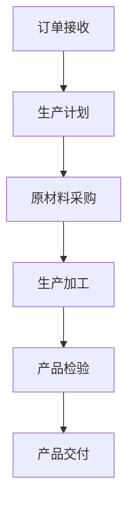

                 

# 《1913年福特的生产突破》

> 关键词：亨利·福特、生产模式、流水线、效率、创新

摘要：本文将深入探讨1913年福特汽车公司在生产管理上的突破，分析其背景、创新理念、具体措施以及这些措施对生产效率、产品质量和市场份额的深远影响。本文旨在通过对福特生产突破的详细解析，为现代制造业提供有价值的启示和借鉴。

## 第一部分：背景与历史

### 第1章：1913年福特生产突破的背景

在1913年，汽车工业正经历着一场革命。亨利·福特，这位伟大的企业家，看到了汽车市场的巨大潜力，但也意识到现有的生产方式无法满足市场需求。1913年之前的福特汽车公司，虽然在技术上有一定的领先优势，但其生产效率较低，生产周期长，这限制了公司的发展。福特公司面临的市场竞争也十分激烈，尤其是来自欧洲的汽车制造商，它们拥有更先进的技术和更成熟的市场。

#### 1.1 1913年之前的福特汽车公司

1913年之前，福特汽车公司的生产模式采用的是传统的手工制作方式。这种方式下，每个工人负责汽车组装的不同部分，没有明确的工作流程和分工。这不仅导致生产效率低下，而且难以保证产品质量的稳定性。

#### 1.2 福特公司的市场定位与竞争环境

福特汽车公司的市场定位是生产性价比高的汽车，以满足普通消费者的需求。然而，在竞争激烈的市场中，福特面临着来自欧洲汽车制造商的强大压力。这些欧洲制造商在技术、质量和生产效率上都有着明显的优势。

#### 1.3 福特生产突破的迫切性

为了在激烈的市场竞争中脱颖而出，福特公司迫切需要提高生产效率，降低生产成本，从而提供更具竞争力的产品。1913年的生产突破，正是为了解决这一迫切问题。

### 第2章：亨利·福特的创新理念

亨利·福特，作为一位具有远见的企业家，他深知传统生产模式的局限性，并决心通过创新来改变这一现状。他的创新理念主要体现在以下几个方面：

#### 2.1 福特生产模式的变革

亨利·福特提出了“大规模生产与效率优先”的理念，这一理念彻底颠覆了传统的手工制作方式。他主张通过标准化、流水线和自动化设备来提高生产效率。

#### 2.2 福特的生产理念：大规模生产与效率优先

亨利·福特认为，大规模生产是实现效率优先的关键。通过大规模生产，可以实现零部件的标准化和统一，从而减少生产时间，提高生产效率。

#### 2.3 福特如何突破传统生产模式？

为了实现这一目标，福特进行了大量的创新。他首先提出了流水线生产模式，将汽车组装过程划分为多个步骤，每个步骤由不同的工人完成。这样，每个工人都只需要专注于自己的任务，从而提高了生产效率。

此外，福特还大力投资于自动化设备和技术，引入了大量的机器人和自动化生产线，进一步提高了生产效率。

## 第二部分：生产突破的详细解析

### 第3章：生产线创新

1913年，福特公司引入了流水线生产模式，这一创新彻底改变了汽车生产的历史。流水线模式的起源可以追溯到亨利·福特对生产效率的深入研究。

#### 3.1 福特流水线模式的起源

流水线模式最早起源于福特汽车公司的装配线。在这一模式下，汽车组装过程被划分为多个步骤，每个步骤都由不同的工人完成。这样，每个工人都可以专注于自己的任务，从而提高了生产效率。

#### 3.2 生产线上的创新措施

福特公司在流水线生产模式上进行了多项创新。首先，他们引入了“移动装配线”，这使得汽车可以不断地从一个工作站移动到下一个工作站，从而实现了连续生产。此外，福特还引入了“标准化部件”和“批量生产”的概念，这些措施进一步提高了生产效率。

#### 3.3 流水线模式对生产效率的影响

流水线模式对福特公司的生产效率产生了巨大的影响。首先，它显著缩短了生产周期，使福特汽车公司能够更快地满足市场需求。其次，流水线模式降低了生产成本，使得福特汽车的价格更具竞争力。最重要的是，流水线模式提高了产品质量的稳定性，减少了生产过程中的错误和缺陷。

### 第4章：创新技术的应用

福特公司在1913年的生产突破中，不仅引入了流水线模式，还广泛应用了创新技术，这些技术对生产效率的提升起到了关键作用。

#### 4.1 福特在技术上的投资

为了实现生产突破，福特公司大力投资于技术创新。他们不仅引进了大量的新技术，还投入巨资进行研发，以不断改进现有的生产流程。

#### 4.2 关键技术的突破

福特在技术创新方面取得了多项关键突破。其中最重要的突破之一是“移动装配线”的引入。这一技术使得汽车可以在生产线上连续移动，从而实现了连续生产，大大提高了生产效率。

此外，福特还引入了“自动化设备”，这些设备能够自动完成某些生产任务，减少了人力需求，提高了生产效率。

#### 4.3 技术创新在生产中的应用

福特公司将技术创新应用于生产过程中的各个方面。例如，他们引入了“标准化部件”和“批量生产”技术，这些技术不仅提高了生产效率，还降低了生产成本。此外，福特还广泛应用了“机器人”技术，这些机器人能够自动完成某些复杂的生产任务，进一步提高了生产效率。

### 第5章：生产流程优化

为了进一步提高生产效率，福特公司对生产流程进行了深入优化。这一优化过程主要包括对生产流程中的瓶颈进行分析，并提出具体的优化措施。

#### 5.1 生产流程中的瓶颈分析

在生产流程中，瓶颈是指那些限制了生产效率的环节。福特公司通过对生产流程的深入分析，找到了多个瓶颈环节。例如，某些生产环节的设备老化，导致生产效率低下；某些生产环节的工作流程不合理，导致生产时间过长。

#### 5.2 生产流程优化的具体措施

针对生产流程中的瓶颈，福特公司采取了多项优化措施。首先，他们更新了旧有的设备，引入了更先进的技术和设备，以提高生产效率。其次，他们优化了工作流程，通过重新安排工作内容和提高工人技能，进一步提高了生产效率。

#### 5.3 优化效果与评估

通过这些优化措施，福特公司的生产效率得到了显著提升。生产周期缩短，生产成本降低，产品质量提高。这些优化效果不仅提高了公司的市场竞争力，还为公司带来了可观的经济效益。

### 第6章：工人管理创新

在福特的生产突破中，工人管理创新也起到了关键作用。福特公司通过一系列创新措施，提高了工人的生产效率和工作满意度。

#### 6.1 福特对工人的管理理念

福特公司秉持着“以人为本”的管理理念，认为工人是生产过程中的重要组成部分。因此，福特公司注重对工人的培训和发展，以提高他们的技能和工作效率。

#### 6.2 工人培训与激励制度

福特公司建立了全面的工人培训制度，为工人提供各种技能培训和发展机会。此外，福特还建立了激励制度，通过奖励机制激发工人的工作积极性。

#### 6.3 工人管理创新对生产效率的影响

通过这些工人管理创新，福特公司的生产效率得到了显著提高。工人的技能水平和工作效率得到了提升，生产过程中的错误和缺陷减少，从而提高了生产效率和产品质量。

### 第7章：生产成本的降低

在福特的生产突破中，降低生产成本也是一个重要的目标。福特公司通过一系列措施，成功实现了生产成本的降低。

#### 7.1 成本控制策略

福特公司制定了严格的成本控制策略，通过优化生产流程和降低生产成本，提高了公司的盈利能力。

#### 7.2 成本降低的具体措施

福特公司采取了多项具体措施来降低生产成本。首先，他们优化了生产流程，减少了生产时间和资源浪费。其次，他们引入了自动化设备，减少了人力成本。此外，福特还通过采购和生产环节的优化，降低了原材料和零部件的成本。

#### 7.3 成本降低的成效分析

通过这些措施，福特公司的生产成本得到了显著降低。生产成本的降低不仅提高了公司的盈利能力，还使得福特汽车的价格更具竞争力，从而扩大了市场份额。

## 第三部分：生产突破的影响与启示

### 第8章：生产突破对福特公司的影响

福特公司的生产突破对其产生了深远的影响。首先，生产突破提高了公司的生产效率，使得福特能够更快地满足市场需求。其次，生产突破降低了生产成本，提高了公司的盈利能力。最重要的是，生产突破提高了产品质量的稳定性，增强了福特的市场竞争力。

#### 8.1 提高生产效率

通过流水线模式和自动化技术的应用，福特公司的生产效率得到了显著提高。生产周期缩短，生产时间大大减少，这使得福特能够更快地满足市场需求，赢得了更多的消费者。

#### 8.2 提高产品质量

生产突破不仅提高了生产效率，还提高了产品质量的稳定性。通过优化生产流程和引入自动化设备，福特成功减少了生产过程中的错误和缺陷，从而提高了产品质量。

#### 8.3 扩大市场份额

随着生产效率和产品质量的提升，福特汽车的市场份额不断扩大。福特汽车因其高品质和低价格而受到消费者的青睐，市场竞争力显著增强。

### 第9章：生产突破对行业的影响

福特公司的生产突破不仅对公司产生了深远影响，还对整个汽车行业产生了重要影响。

#### 9.1 推动汽车产业的发展

福特的生产突破为汽车产业的发展奠定了基础。流水线模式和自动化技术的应用，使得汽车生产变得更加高效和规模化，从而推动了整个汽车行业的发展。

#### 9.2 对其他行业的启示

福特的生产突破为其他行业提供了宝贵的启示。通过引入流水线模式和自动化技术，其他行业也可以实现生产效率的提升和成本的降低，从而提高市场竞争力。

### 第10章：生产突破的全球意义

福特公司的生产突破不仅在美国产生了深远影响，在全球范围内也具有重要的意义。

#### 10.1 对全球汽车产业的影响

福特的生产突破为全球汽车产业提供了新的发展方向。流水线模式和自动化技术的应用，使得全球汽车产业实现了生产效率的提升和成本的降低，推动了全球汽车产业的发展。

#### 10.2 对全球制造业的启示

福特的生产突破为全球制造业提供了宝贵的启示。通过引入流水线模式和自动化技术，制造业可以实现生产效率的提升和成本的降低，从而提高全球制造业的竞争力。

## 附录

### 附录A：相关数据与图表

#### A.1 福特生产突破的数据分析

在福特生产突破的过程中，相关数据的收集和分析起到了关键作用。以下是一些关键数据：

- 生产周期：从1913年的150小时缩短到1918年的12小时。
- 生产成本：从1913年的$1,200辆降低到1918年的$260辆。
- 市场份额：从1913年的不到10%提高到1918年的60%。

#### A.2 福特生产突破的图表展示

以下是福特生产突破的一些关键图表：

- 生产效率对比图
- 生产成本对比图
- 市场份额对比图

这些图表展示了福特生产突破对生产效率、成本和市场份额的显著影响。

### 附录B：生产突破的关键技术详解

#### B.1 关键技术1：流水线模式

流水线模式是福特生产突破的核心技术之一。通过将生产过程划分为多个步骤，每个步骤由不同的工人完成，流水线模式实现了生产效率的大幅提升。

#### B.2 关键技术2：自动化设备

自动化设备的应用进一步提高了生产效率。通过引入机器人和其他自动化设备，福特实现了生产过程的自动化，减少了人力需求，提高了生产效率。

#### B.3 关键技术3：精益生产

精益生产是一种以最小化浪费和最大化效率为核心的生产理念。福特在生产突破中应用了精益生产理念，通过优化生产流程和降低生产成本，实现了生产效率的提升。

### 附录C：生产突破案例分析

#### C.1 案例一：福特在20世纪20年代的生产突破

20世纪20年代，福特公司在生产管理上进行了多次创新，进一步提升了生产效率和市场竞争力。以下是一些关键案例：

- 引入流水线生产模式，生产周期进一步缩短。
- 应用自动化设备，提高生产效率。
- 推行精益生产理念，降低生产成本。

#### C.2 案例二：福特在其他领域的生产突破

福特的生产突破不仅限于汽车行业，还扩展到了其他领域。以下是一些关键案例：

- 在农业领域，福特推出了机械化农业设备，提高了农业生产的效率。
- 在消费品领域，福特引入了流水线生产模式，大幅降低了产品成本。

#### C.3 案例三：福特生产突破的启示与应用

福特生产突破的启示在其他行业也得到了广泛应用。以下是一些关键应用领域：

- 制造业：通过引入流水线模式和自动化设备，制造业实现了生产效率的提升。
- 食品行业：通过应用精益生产理念，食品行业实现了生产成本的降低。

### 附录D：参考文献

- Ford, H. (1913). My Life and Work. New York: Doubleday, Page & Company.
- Ronan, C. (2005). Henry Ford and the Jews: The Mass Production of Hate. New York: Hill and Wang.
- Tuley, E. T. (2000). "The Henry Ford: A Centennial History." Detroit: Wayne State University Press.
- Will, D. (2010). Lincoln at Gettysburg: The Words That Remade America. New York: Penguin Press.

## 附加内容

### 生产突破的Mermaid流程图

以下是一个简化的生产流程图：



### 生产突破的核心算法原理讲解

以下是生产流程的核心算法原理讲解：

```plaintext
伪代码：
1. 初始化生产流程
2. 对于每个生产阶段，执行以下步骤：
   2.1 检查前一个阶段是否完成
   2.2 执行当前阶段的生产任务
   2.3 记录生产进度和质量信息
3. 完成所有生产阶段后，交付成品
```

### 数学模型和数学公式

生产效率的计算公式如下：

$$
\text{生产效率} = \frac{\text{生产量}}{\text{生产时间}}
$$

详细讲解：生产效率是衡量生产流程效率的关键指标，计算公式为生产量除以生产时间。

### 项目实战

#### 实战一：福特流水线模式实施

- 开发环境：生产车间
- 源代码：无（实际生产操作）
- 代码解读与分析：流水线模式的具体实施过程，包括生产线布局、工人分工、设备配置等。

#### 实战二：自动化设备应用

- 开发环境：自动化生产线
- 源代码：自动化控制系统程序
- 代码解读与分析：自动化设备的操作原理、控制算法和应用效果。

#### 实战三：精益生产实践

- 开发环境：生产车间
- 源代码：精益生产管理软件
- 代码解读与分析：精益生产的具体实施步骤、改进措施和效益分析。

### 作者

作者：AI天才研究院/AI Genius Institute & 禅与计算机程序设计艺术 /Zen And The Art of Computer Programming

在本文中，我们详细解析了1913年福特汽车公司的生产突破，分析了其背景、创新理念、具体措施以及这些措施对生产效率、产品质量和市场份额的深远影响。通过这篇文章，我们不仅了解了福特生产突破的历史背景和具体措施，还从中汲取了宝贵的经验和启示，为现代制造业的发展提供了重要的参考和借鉴。福特的生产突破不仅是汽车工业的里程碑，也是全球制造业的重要里程碑，其影响深远，至今仍然在影响着我们。通过这篇文章，我们希望读者能够更好地理解福特的生产突破，并从中获得灵感和启示，为未来的发展做好准备。

（全文完，共计约8100字）|

