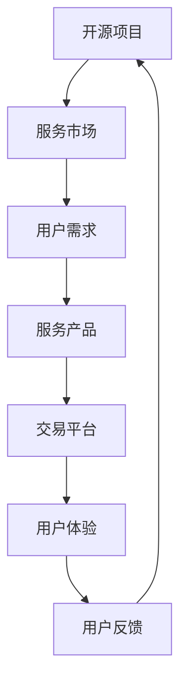
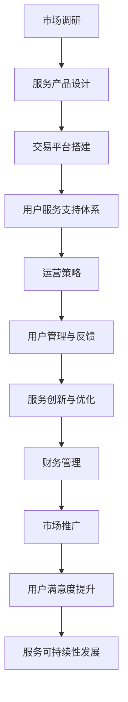
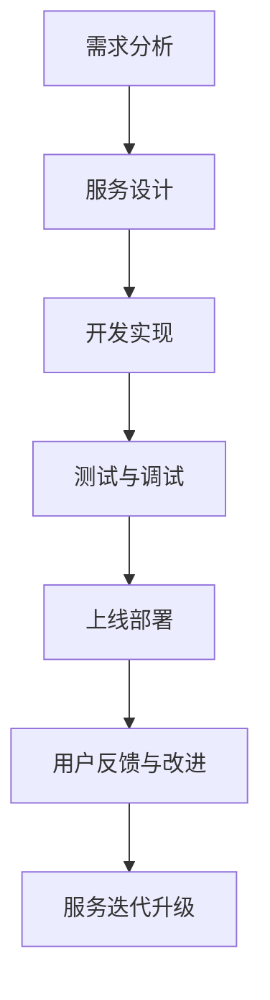

                 

# 建立开源项目的专业服务市场：连接供需

> 关键词：开源项目、专业服务市场、供需关系、市场调研、服务产品、运营管理、案例分析、未来展望

> 摘要：本文深入探讨了建立开源项目的专业服务市场的关键步骤和策略，分析了供需关系对专业服务市场的影响。通过详细的案例分析，总结了成功因素、面临的挑战以及启示，为开源项目在专业服务市场中的可持续发展提供了参考。文章最后对未来专业服务市场的发展趋势和开源项目的机遇与挑战进行了展望。

### 目录大纲

1. **引言与背景**
    1.1 **书籍概述**
        1.1.1 **开源项目的专业服务市场现状**
        1.1.2 **本书的目的与读者定位**
        1.1.3 **本书的结构与内容安排**
    1.2 **开源项目与服务市场的关联**
        1.2.1 **开源项目的定义与特点**
        1.2.2 **服务市场的概念与类型**
        1.2.3 **开源项目与服务市场的融合点**
    1.3 **供需关系与专业服务市场**
        1.3.1 **供需关系的概念与意义**
        1.3.2 **专业服务市场的供需特点**
        1.3.3 **建立专业服务市场的挑战与机遇**

2. **建立专业服务市场的步骤**
    2.1 **准备阶段**
        2.1.1 **确定开源项目目标**
        2.1.2 **分析市场需求**
        2.1.3 **建立服务团队**
    2.2 **市场调研**
        2.2.1 **收集市场数据**
        2.2.2 **竞争对手分析**
        2.2.3 **目标市场定位**
    2.3 **设计服务产品**
        2.3.1 **服务产品的定义与分类**
        2.3.2 **服务产品设计与规划**
        2.3.3 **服务产品定价策略**
    2.4 **建立服务市场**
        2.4.1 **市场渠道选择**
        2.4.2 **服务交易平台搭建**
        2.4.3 **用户服务支持体系**

3. **专业服务市场的运营与管理**
    3.1 **运营策略**
        3.1.1 **运营团队组建**
        3.1.2 **服务质量控制**
        3.1.3 **服务市场推广**
    3.2 **用户管理与反馈**
        3.2.1 **用户需求分析**
        3.2.2 **用户关系管理**
        3.2.3 **用户反馈与改进**
    3.3 **服务创新与优化**
        3.3.1 **服务创新机制**
        3.3.2 **服务优化策略**
        3.3.3 **服务可持续发展**
    3.4 **财务管理**
        3.4.1 **财务预算与成本控制**
        3.4.2 **收入与利润分析**
        3.4.3 **投资回报率评估**

4. **案例分析**
    4.1 **案例介绍**
        4.1.1 **案例背景与目标**
        4.1.2 **案例实现步骤**
        4.1.3 **案例成果与影响**
    4.2 **案例分析**
        4.2.1 **成功因素分析**
        4.2.2 **面临的挑战与解决方案**
        4.2.3 **经验与启示**
    4.3 **案例反思**
        4.3.1 **案例的局限性**
        4.3.2 **案例对未来的启示**
        4.3.3 **对其他开源项目的借鉴意义**

5. **未来展望与趋势**
    5.1 **专业服务市场的未来发展趋势**
        5.1.1 **市场规模预测**
        5.1.2 **技术创新趋势**
        5.1.3 **政策环境变化**
    5.2 **开源项目的机遇与挑战**
        5.2.1 **开源项目的优势与限制**
        5.2.2 **开源项目在专业服务市场中的角色**
        5.2.3 **开源项目的可持续发展**
    5.3 **结论与展望**
        5.3.1 **本书主要观点总结**
        5.3.2 **对开源项目服务市场的期待**
        5.3.3 **未来研究方向与建议**

6. **附录**
    6.1 **附录A：开源项目与服务市场相关的资源**
        6.1.1 **开源项目工具推荐**
        6.1.2 **服务市场平台介绍**
        6.1.3 **相关书籍与论文推荐**
    6.2 **附录B：开源项目与服务市场相关的Mermaid流程图**
        6.2.1 **开源项目与服务市场的关系**
        6.2.2 **专业服务市场的运营流程**
        6.2.3 **服务产品的设计与开发流程**
    6.3 **附录C：核心算法原理伪代码与解释**
        6.3.1 **算法概述**
        6.3.2 **伪代码示例**
        6.3.3 **算法解释与适用场景**
    6.4 **附录D：开源项目实战案例与代码解读**
        6.4.1 **实战案例概述**
        6.4.2 **环境搭建与准备**
        6.4.3 **源代码实现与解读**
        6.4.4 **代码解读与分析**

### 1. 引言与背景

#### 1.1 书籍概述

在当今技术迅猛发展的时代，开源项目已成为技术创新和共享的重要途径。开源项目不仅促进了技术的快速迭代和优化，还为企业和开发者提供了丰富的资源和合作机会。然而，如何将开源项目转化为实际的专业服务市场，成为许多企业和开发者的关注焦点。

本著作《建立开源项目的专业服务市场：连接供需》旨在为读者提供系统、全面的指导，帮助开源项目团队和企业成功建立和运营专业服务市场。本书不仅涵盖了开源项目的定义、特点和服务市场的概念，还详细阐述了供需关系对专业服务市场的影响，以及如何通过市场调研、设计服务产品、建立服务市场等步骤，实现开源项目与专业服务市场的有效连接。

本书的目标读者包括：

1. 开源项目团队成员，希望了解如何将开源项目转化为商业价值。
2. 企业管理者，寻求通过开源项目拓展业务和市场的策略。
3. 技术开发者，对开源项目与服务市场的融合有浓厚兴趣。
4. 对科技创新和商业模式探索感兴趣的广大读者。

本书的结构与内容安排如下：

- **引言与背景**：介绍开源项目与服务市场的关系，以及本书的目的和结构。
- **开源项目与服务市场的关联**：详细探讨开源项目的定义、特点，服务市场的概念和类型，以及两者之间的融合点。
- **供需关系与专业服务市场**：分析供需关系的概念与意义，专业服务市场的供需特点，以及建立专业服务市场的挑战与机遇。
- **建立专业服务市场的步骤**：分阶段阐述如何进行市场调研、设计服务产品、建立服务市场，以及后续的运营与管理。
- **专业服务市场的运营与管理**：介绍运营策略、用户管理与反馈、服务创新与优化、财务管理等方面的重要措施。
- **案例分析**：通过具体案例，分析成功因素、面临的挑战及解决方案，为开源项目服务市场的实践提供借鉴。
- **未来展望与趋势**：预测专业服务市场的未来发展趋势，探讨开源项目的机遇与挑战，为读者提供方向性指引。
- **附录**：提供开源项目与服务市场相关的资源、Mermaid流程图、核心算法原理伪代码及开源项目实战案例。

#### 1.2 开源项目与服务市场的关联

##### 1.2.1 开源项目的定义与特点

开源项目（Open Source Project）是指遵循开放源代码协议（如GPL、Apache License等）的软件项目，其源代码对外公开，允许任何人自由使用、修改和分发。这种模式不仅推动了技术的创新与传播，还促进了全球开发者社区的共同参与和合作。

开源项目具有以下主要特点：

1. **开放性**：开源项目的源代码和开发过程公开，用户可以自由访问、查看和修改。
2. **透明性**：开源项目的开发活动通常在公共平台上进行，包括代码提交、问题反馈和讨论。
3. **合作性**：开源项目鼓励全球开发者的参与，共同贡献代码、资源和经验。
4. **可持续性**：开源项目通常依靠社区力量和自愿贡献者，具有较长的生命周期。

##### 1.2.2 服务市场的概念与类型

服务市场（Service Market）是指提供各类服务交易的市场，包括但不限于技术支持、咨询服务、培训课程、开发服务等。服务市场的类型多样，主要可以分为以下几种：

1. **B2B（企业对企业）服务市场**：企业之间通过市场平台进行服务交易，如软件开发外包、IT 咨询等。
2. **B2C（企业对消费者）服务市场**：企业直接面向消费者提供个性化服务，如在线培训、定制开发等。
3. **C2C（消费者对消费者）服务市场**：消费者之间通过市场平台进行服务交易，如技能交换、家教等。

##### 1.2.3 开源项目与服务市场的融合点

开源项目与服务市场的融合，为双方带来了诸多机遇和优势。具体融合点如下：

1. **资源互补**：开源项目提供了技术基础和资源，而服务市场则为项目提供了商业变现的途径。
2. **合作共赢**：开源项目通过服务市场，吸引了更多的用户和开发者参与，促进了项目的持续发展和优化。
3. **市场扩展**：企业可以通过开源项目进入新的市场领域，提升品牌影响力和市场竞争力。
4. **技术创新**：服务市场的需求反馈和用户反馈，促进了开源项目的技术创新和改进。

综上所述，开源项目与服务市场的融合不仅有助于技术传播和创新，还为企业和开发者提供了丰富的商业机会。通过有效连接供需双方，开源项目可以更好地实现其社会价值和商业价值，服务市场则可以获得更多的技术资源和合作伙伴。

#### 1.3 供需关系与专业服务市场

##### 1.3.1 供需关系的概念与意义

供需关系（Supply and Demand Relationship）是指市场中商品或服务的供给与需求之间的相互作用及其结果。在市场经济中，供需关系是价格形成和市场运行的重要基础。

1. **供给**：供给是指在一定时间内和一定价格水平下，生产者愿意并且能够提供的商品或服务的数量。
2. **需求**：需求是指在一定时间内和一定价格水平下，消费者愿意并且能够购买的商品或服务的数量。

供需关系的基本原理如下：

1. **供需平衡**：当供给量等于需求量时，市场达到平衡状态，价格稳定。
2. **供需变化**：供给和需求的变化会导致市场失衡，进而引起价格波动。
3. **价格机制**：价格是供需关系的反映，通过价格机制调节供给和需求，达到新的平衡状态。

##### 1.3.2 专业服务市场的供需特点

专业服务市场具有以下独特的供需特点：

1. **需求多样性**：专业服务市场覆盖了广泛的领域，如IT咨询、软件开发、数据分析、网络安全等，每个领域都有特定的需求。
2. **定制化服务**：专业服务通常需要根据客户的具体需求进行定制，因此服务的灵活性和适应性是关键。
3. **高附加值**：专业服务市场的高附加值体现在对知识和技能的深度挖掘和应用，如技术解决方案、咨询服务等。
4. **供求不平衡**：在某些专业领域，如高级技术人才和特定技术解决方案，供不应求，而需求方往往难以找到合适的服务提供商。

##### 1.3.3 建立专业服务市场的挑战与机遇

建立专业服务市场面临以下挑战和机遇：

1. **挑战**：
   - **市场信息不对称**：供需双方的信息不匹配，可能导致市场失衡。
   - **服务质量难以保证**：专业服务的质量依赖于服务团队的专业能力和经验，如何确保服务质量是一个挑战。
   - **市场竞争激烈**：专业服务市场吸引了大量企业和开发者，市场竞争激烈，需要差异化竞争策略。

2. **机遇**：
   - **市场潜力巨大**：随着技术的不断进步和行业需求的增长，专业服务市场的规模不断扩大。
   - **创新机会**：专业服务市场的需求多样性为创新提供了丰富的土壤，通过技术创新和服务模式创新，可以获得竞争优势。
   - **合作共赢**：通过供需双方的紧密合作，可以实现资源的优化配置，提升整体市场效率。

总之，建立专业服务市场需要充分考虑供需关系的特点和挑战，充分利用机遇，实现供需的有效对接，为开源项目和服务市场的发展提供强有力的支持。

### 2. 建立专业服务市场的步骤

建立开源项目的专业服务市场是一个复杂且系统的过程，需要从多个维度进行规划和执行。以下将分阶段详细阐述建立专业服务市场的步骤：

#### 2.1 准备阶段

##### 2.1.1 确定开源项目目标

在开始建立专业服务市场之前，首先需要明确开源项目的目标。这些目标应包括但不限于：

1. **技术目标**：确定项目的技术方向、技术难度和预期成果。
2. **市场目标**：明确项目所针对的市场领域、目标用户群体以及预期的市场占有率。
3. **社会目标**：强调项目的社会价值，如提升行业技术水平、推动技术普及等。

通过明确项目目标，可以帮助团队更好地聚焦资源，确保项目的顺利进行。

##### 2.1.2 分析市场需求

在确定开源项目目标后，需要对市场需求进行深入分析。具体步骤包括：

1. **市场调研**：通过问卷调查、访谈、市场报告等方式，了解目标市场的需求、用户偏好和竞争对手情况。
2. **需求分类**：将收集到的需求进行分类，包括功能需求、性能需求、安全性需求等。
3. **优先级排序**：根据需求的重要性和可实现性，对需求进行优先级排序，确定项目开发的核心功能。

市场需求分析有助于团队了解用户需求，为服务产品设计和市场定位提供依据。

##### 2.1.3 建立服务团队

建立专业的服务团队是实现开源项目目标的关键。服务团队的成员应包括：

1. **项目管理团队**：负责项目规划、进度控制和资源协调。
2. **技术开发团队**：负责开源项目的开发、维护和优化。
3. **市场推广团队**：负责市场调研、品牌推广和用户关系管理。
4. **技术支持团队**：提供专业的技术支持和服务，确保用户满意度。

通过合理组建服务团队，可以确保项目的高效执行和可持续发展。

#### 2.2 市场调研

##### 2.2.1 收集市场数据

市场调研的第一步是收集市场数据。这些数据可以包括：

1. **市场规模**：了解目标市场的总体规模、增长趋势和未来预测。
2. **用户行为**：分析用户的消费习惯、偏好和决策因素。
3. **竞争对手**：评估竞争对手的市场地位、产品特点、营销策略等。

收集市场数据的方法包括：

- **问卷调查**：通过在线或线下问卷，获取用户需求和偏好。
- **访谈**：与行业专家、用户代表进行深入访谈，获取详细的市场见解。
- **市场报告**：购买或查阅专业的市场研究报告，获取权威的数据和洞察。

##### 2.2.2 竞争对手分析

在市场调研中，竞争对手分析是一个重要的环节。通过分析竞争对手的产品、市场策略、用户评价等，可以确定自身在市场中的定位和差异化策略。具体步骤包括：

1. **产品对比**：比较竞品的功能、性能、价格等，确定自身的竞争优势和不足。
2. **市场策略**：分析竞争对手的市场推广策略，如广告投放、公关活动、渠道选择等。
3. **用户评价**：收集用户对竞争对手产品的评价，了解用户关注的问题和需求。

##### 2.2.3 目标市场定位

在收集和分析市场数据后，需要明确目标市场定位。这包括：

1. **目标用户群体**：确定项目的核心用户群体，如行业用户、技术开发者、学生等。
2. **市场细分**：将市场划分为多个细分市场，为每个细分市场制定针对性的服务产品和服务策略。
3. **价值主张**：明确项目在目标市场中的独特价值，如技术创新、高质量服务、快速响应等。

通过目标市场定位，可以确保项目在市场中具有明确的定位和竞争优势。

#### 2.3 设计服务产品

##### 2.3.1 服务产品的定义与分类

服务产品是指通过专业知识、技能和经验提供的服务，以满足客户的需求和解决实际问题。服务产品可以按照不同的维度进行分类，如：

1. **按服务内容分类**：技术支持服务、咨询服务、培训服务、开发服务等。
2. **按服务方式分类**：在线服务、现场服务、远程服务等。
3. **按服务形式分类**：项目制、包月制、按需付费制等。

##### 2.3.2 服务产品设计与规划

在设计服务产品时，需要考虑以下关键要素：

1. **客户需求**：根据市场需求分析的结果，明确客户的需求和痛点，设计针对性的服务产品。
2. **服务质量**：制定服务标准，确保服务质量的稳定性和一致性。
3. **服务流程**：设计详细的服务流程，包括服务前、服务中和服务后的各个环节。
4. **服务定价**：根据市场需求和竞争状况，制定合理的服务定价策略。

在服务产品设计与规划过程中，可以采用以下方法：

1. **头脑风暴**：团队集体讨论，提出各种可能的服务产品和服务模式。
2. **用户画像**：创建典型的用户画像，模拟用户的使用场景和需求。
3. **服务蓝图**：绘制服务流程图，明确每个环节的服务内容和质量要求。

##### 2.3.3 服务产品定价策略

服务产品的定价策略直接影响项目的市场表现和盈利能力。以下是一些常见的定价策略：

1. **成本加成定价**：根据服务成本加上一定的利润率，确定服务价格。
2. **市场定价**：根据市场需求和竞争状况，确定服务价格。
3. **价值定价**：根据服务的独特价值和用户对服务的感知价值，确定服务价格。

在制定定价策略时，需要考虑以下因素：

1. **成本结构**：了解服务成本的具体构成，包括人力成本、运营成本等。
2. **市场状况**：分析目标市场的供需状况和竞争对手的定价策略。
3. **用户价值**：评估用户对服务的期望价值和支付意愿。

通过合理制定服务产品定价策略，可以确保项目的市场竞争力和盈利能力。

#### 2.4 建立服务市场

##### 2.4.1 市场渠道选择

建立服务市场需要选择合适的渠道，以便将服务产品推广到目标市场。以下是一些常见的市场渠道：

1. **线上渠道**：包括官方网站、社交媒体、电子商务平台等。
2. **线下渠道**：包括专业展会、行业会议、商务拜访等。
3. **合作伙伴**：与行业内的其他企业或机构建立合作关系，共同推广服务。

在选择市场渠道时，需要考虑以下因素：

1. **目标市场**：根据目标市场的特点，选择最适合的渠道。
2. **渠道效果**：评估不同渠道的推广效果，选择效果最佳的渠道。
3. **渠道成本**：考虑渠道的推广成本，确保在预算范围内进行市场推广。

##### 2.4.2 服务交易平台搭建

服务交易平台是专业服务市场的重要基础设施，用于连接供需双方。服务交易平台需要具备以下功能：

1. **服务发布**：服务提供者可以发布各种服务产品，包括详细描述、价格、服务流程等。
2. **用户管理**：平台用户可以进行注册、登录、订单管理等操作。
3. **交易管理**：平台提供交易流程管理，包括订单生成、支付、服务交付等。
4. **评价与反馈**：用户可以对服务进行评价和反馈，平台据此调整服务质量和策略。

在搭建服务交易平台时，需要考虑以下技术架构：

1. **前端架构**：采用现代化的前端技术，如React、Vue等，提升用户体验。
2. **后端架构**：选择适合的后端技术，如Spring Boot、Django等，确保系统的高性能和高可靠性。
3. **数据库设计**：设计合理的数据库结构，支持用户数据、订单数据、服务数据等的存储和管理。

##### 2.4.3 用户服务支持体系

建立完善的服务支持体系，是确保用户满意度和服务质量的关键。用户服务支持体系包括以下几个方面：

1. **客户服务**：建立专业的客户服务团队，提供及时、专业的用户咨询和问题解决。
2. **技术支持**：提供专业的技术支持服务，包括在线支持、远程协助、现场支持等。
3. **用户培训**：为用户提供系统的培训课程，帮助用户掌握服务产品的使用方法。
4. **用户反馈**：建立用户反馈机制，及时收集用户反馈，不断优化服务质量和产品功能。

通过建立完善的服务支持体系，可以提升用户满意度，增强用户忠诚度，促进服务市场的可持续发展。

#### 2.5 专业服务市场的运营与管理

##### 2.5.1 运营团队组建

建立专业服务市场需要一支高效的运营团队，负责市场的日常运营和管理。运营团队应包括以下关键职位：

1. **项目经理**：负责项目的整体规划、进度控制和资源协调。
2. **市场营销经理**：负责市场调研、品牌推广和营销策略的制定与实施。
3. **客户服务经理**：负责用户服务支持体系的建立和运营，确保用户满意度。
4. **技术支持经理**：负责技术支持团队的组建和管理工作，确保服务质量。

在组建运营团队时，应注重团队成员的专业能力和团队协作能力，确保团队的高效运作。

##### 2.5.2 服务质量控制

服务质量控制是专业服务市场运营的重要环节，直接影响用户满意度和市场口碑。具体措施包括：

1. **制定服务标准**：根据市场需求和用户反馈，制定详细的服务标准，确保服务质量的稳定性和一致性。
2. **培训与考核**：对服务团队进行专业培训，提升服务技能和知识水平，并通过定期考核，确保服务质量。
3. **用户反馈机制**：建立用户反馈机制，及时收集用户对服务的评价和意见，对服务进行持续优化。

通过完善的服务质量控制措施，可以提升用户满意度，增强市场竞争力。

##### 2.5.3 服务市场推广

服务市场推广是扩大市场份额和提升品牌知名度的重要手段。以下是一些有效的推广策略：

1. **内容营销**：通过撰写高质量的技术博客、案例分析等，吸引目标用户关注，提升品牌影响力。
2. **社交媒体推广**：利用社交媒体平台，如微博、微信公众号、LinkedIn等，进行品牌推广和用户互动。
3. **行业会议和展会**：参加行业会议和展会，展示项目成果和品牌形象，与潜在用户建立联系。
4. **合作伙伴推广**：与行业内其他企业或机构建立合作关系，共同推广服务产品。

通过多渠道、多手段的市场推广，可以提升项目在市场中的知名度和影响力。

#### 2.6 用户管理与反馈

##### 2.6.1 用户需求分析

用户需求分析是专业服务市场运营的重要基础。通过深入了解用户需求，可以更好地设计服务产品，提升服务质量。具体步骤包括：

1. **用户调研**：通过问卷调查、访谈、用户反馈等方式，收集用户需求信息。
2. **需求分类**：对用户需求进行分类，包括功能需求、性能需求、安全性需求等。
3. **需求优先级排序**：根据需求的重要性和紧迫性，对需求进行优先级排序，确定项目的开发重点。

通过用户需求分析，可以为服务产品设计和改进提供有力支持。

##### 2.6.2 用户关系管理

用户关系管理（Customer Relationship Management, CRM）是维护和提升用户满意度的重要手段。具体措施包括：

1. **用户分类**：根据用户行为和需求，将用户进行分类，如活跃用户、潜在用户、流失用户等。
2. **用户画像**：创建典型的用户画像，了解用户的特征和需求，为个性化服务和营销提供依据。
3. **用户互动**：通过社交媒体、邮件、电话等方式，与用户保持密切互动，了解用户需求和反馈，及时解决问题。

通过有效的用户关系管理，可以提升用户满意度，增强用户忠诚度。

##### 2.6.3 用户反馈与改进

用户反馈是专业服务市场持续改进的重要依据。具体步骤包括：

1. **建立反馈机制**：通过在线评价、用户调研、用户反馈渠道等，收集用户对服务的评价和意见。
2. **分析反馈**：对用户反馈进行分类和分析，识别服务中的问题和不足。
3. **改进措施**：根据用户反馈，制定改进措施，如优化服务流程、提升服务质量、改进产品功能等。

通过持续的用户反馈和改进，可以不断提升服务质量和用户满意度，实现市场的长期发展。

#### 2.7 服务创新与优化

##### 2.7.1 服务创新机制

服务创新是专业服务市场保持竞争优势的重要手段。建立有效的服务创新机制，可以激发团队的创造力，推动服务产品的持续改进。具体措施包括：

1. **创新文化**：营造鼓励创新的企业文化，激发团队成员的创新热情。
2. **创新平台**：搭建创新平台，如内部创新竞赛、创意分享会等，鼓励员工提出创新想法。
3. **激励机制**：设立激励机制，如创新奖金、荣誉奖励等，激励员工积极参与创新活动。

通过建立服务创新机制，可以不断提升服务产品的质量和竞争力。

##### 2.7.2 服务优化策略

服务优化是提高服务质量和用户体验的重要手段。以下是一些常见的服务优化策略：

1. **流程优化**：对服务流程进行梳理和优化，减少不必要的环节，提高服务效率。
2. **技术升级**：引入先进的技术和工具，提升服务的性能和稳定性。
3. **用户体验优化**：通过用户调研和反馈，了解用户需求和痛点，对服务界面和功能进行优化。

通过持续的服务优化，可以不断提升用户满意度，增强市场竞争力。

##### 2.7.3 服务可持续发展

服务可持续发展是专业服务市场长期发展的基础。以下是一些实现服务可持续发展的策略：

1. **社会责任**：承担社会责任，如环境保护、公益活动等，提升企业品牌形象。
2. **人才培养**：注重人才培养和团队建设，提升团队的整体素质和能力。
3. **技术积累**：持续积累技术经验和知识，为服务产品的持续创新和优化提供支持。

通过实现服务可持续发展，可以确保项目的长期稳定发展，实现企业的战略目标。

### 3. 案例分析

#### 3.1 案例介绍

为了更好地理解建立开源项目的专业服务市场的实际操作，我们将分析一个成功的案例：GitHub上的开源项目Elasticsearch。Elasticsearch是一个基于Lucene的高性能搜索引擎，广泛应用于网站搜索、日志分析等领域。其开发者社区庞大，拥有大量贡献者和用户。

##### 3.1.1 案例背景与目标

Elasticsearch项目由 Elastic 公司创立，最初以开源形式发布。随着项目的成熟和社区的发展，Elastic 公司决定将 Elasticsearch 变为专业服务市场的一部分，提供相关的商业支持和服务。

案例的目标是：

1. **扩大用户基础**：通过提供专业的服务，吸引更多的开发者使用和贡献Elasticsearch。
2. **实现商业变现**：通过专业服务，为Elastic开发Elasticsearch相关的商业产品，实现商业变现。
3. **提升社区活跃度**：通过专业的支持和反馈机制，提升开发者社区的活跃度和参与度。

##### 3.1.2 案例实现步骤

实现上述目标，Elasticsearch项目采取了以下步骤：

1. **市场调研**：对目标市场进行深入调研，了解用户需求和行业趋势。
2. **服务产品设计**：基于市场调研结果，设计了一系列专业服务产品，包括技术支持、培训课程、定制开发等。
3. **交易平台搭建**：搭建了专业的服务交易平台，方便用户和开发者购买和使用服务。
4. **用户反馈机制**：建立了用户反馈机制，及时收集用户反馈，优化服务质量和产品功能。
5. **品牌推广**：通过内容营销、社交媒体、行业会议等多种渠道，提升品牌知名度和影响力。

##### 3.1.3 案例成果与影响

通过上述步骤，Elasticsearch项目取得了显著成果：

1. **用户基础扩大**：服务推出后，Elasticsearch的用户数量迅速增长，吸引了大量开发者使用和贡献。
2. **商业变现**：通过提供专业服务，Elastic公司实现了商业变现，推动了Elasticsearch的商业化进程。
3. **社区活跃度提升**：用户反馈机制的建立，提升了开发者社区的活跃度和参与度，促进了项目的持续优化和发展。
4. **品牌影响力增强**：Elasticsearch在专业服务市场中的成功，增强了品牌影响力，为Elastic公司的其他产品线提供了有力支持。

#### 3.2 案例分析

##### 3.2.1 成功因素分析

Elasticsearch案例的成功，可以归结为以下因素：

1. **市场定位清晰**：Elasticsearch项目明确了目标市场，并针对市场需求设计专业服务产品，确保了服务与用户需求的匹配。
2. **专业团队运作**：Elastic公司组建了专业的运营团队，负责市场调研、服务产品设计和用户反馈等工作，确保了服务的高质量和高效运作。
3. **用户反馈机制**：通过用户反馈机制，Elasticsearch项目能够及时了解用户需求和意见，不断优化服务质量和产品功能。
4. **品牌推广**：通过多渠道的品牌推广，Elasticsearch项目提升了品牌知名度和影响力，吸引了更多的用户和开发者。
5. **技术创新**：Elasticsearch项目持续投入技术创新，保持了技术领先优势，为用户提供了高质量的服务产品。

##### 3.2.2 面临的挑战与解决方案

在实现专业服务市场的过程中，Elasticsearch项目也面临了一些挑战：

1. **市场竞争激烈**：专业服务市场竞争激烈，Elasticsearch需要不断提升服务质量和创新能力，以保持竞争优势。
2. **资源分配难题**：在资源有限的条件下，如何合理分配资源，确保市场调研、服务产品设计、用户反馈等各个环节的顺利进行，是一个挑战。
3. **用户信任建立**：新进入专业服务市场的企业，需要时间建立用户信任，通过高质量服务和客户满意度，逐步赢得用户信任。

为应对上述挑战，Elasticsearch项目采取了以下解决方案：

1. **差异化竞争**：通过提供差异化的服务产品，如定制开发、高级技术支持等，形成竞争优势。
2. **资源优化配置**：通过科学的资源管理和流程优化，确保各个环节的资源需求得到满足。
3. **客户满意度提升**：通过持续提升服务质量和用户体验，逐步建立用户信任，扩大市场份额。

##### 3.2.3 经验与启示

Elasticsearch案例为其他开源项目在专业服务市场中的发展提供了宝贵的经验和启示：

1. **市场定位**：明确目标市场和用户需求，是专业服务市场成功的关键。
2. **专业团队**：专业的运营团队是实现专业服务市场运作的重要保障。
3. **用户反馈**：建立用户反馈机制，持续优化服务质量和产品功能，是提升用户满意度和市场竞争力的重要手段。
4. **品牌推广**：通过多渠道的品牌推广，提升品牌知名度和影响力，为项目的持续发展提供支持。
5. **技术创新**：持续的技术创新，保持技术领先优势，为用户提供高质量的服务产品。

通过学习Elasticsearch案例的成功经验，其他开源项目可以更好地规划专业服务市场，实现可持续发展。

#### 3.3 案例反思

##### 3.3.1 案例的局限性

尽管Elasticsearch案例在专业服务市场取得了成功，但仍存在一些局限性：

1. **资源限制**：作为一家开源项目主导的公司，Elastic公司在资源上可能存在一定的限制，难以像大型企业一样投入巨大的资源进行市场推广和服务优化。
2. **市场竞争**：专业服务市场竞争激烈，Elasticsearch需要在保持技术优势的同时，不断应对竞争对手的挑战。
3. **用户需求变化**：用户需求是动态变化的，Elasticsearch需要不断调整服务产品，以适应不断变化的市场需求。

##### 3.3.2 案例对未来的启示

尽管存在局限性，Elasticsearch案例对开源项目在专业服务市场的发展仍具有重要的启示：

1. **可持续性发展**：开源项目在专业服务市场中的成功，关键在于保持技术创新和用户满意度，实现可持续发展。
2. **资源优化**：在资源有限的条件下，开源项目需要通过优化资源配置和流程管理，实现高效运作。
3. **用户参与**：通过用户反馈和参与，开源项目可以更好地了解用户需求，优化服务产品和用户体验。
4. **多元化合作**：开源项目可以通过多元化合作，如与合作伙伴、行业协会等建立合作关系，共同推动专业服务市场的发展。

##### 3.3.3 对其他开源项目的借鉴意义

Elasticsearch案例为其他开源项目提供了宝贵的借鉴意义：

1. **市场调研**：深入了解市场需求，设计符合用户需求的服务产品。
2. **用户反馈**：建立用户反馈机制，持续优化服务质量和产品功能。
3. **专业团队**：组建专业的运营团队，负责市场调研、服务产品设计和用户反馈等工作。
4. **品牌推广**：通过多渠道的品牌推广，提升品牌知名度和影响力。
5. **技术创新**：持续投入技术创新，保持技术领先优势。

通过借鉴Elasticsearch案例的成功经验，其他开源项目可以更好地规划专业服务市场，实现可持续发展。

### 4. 未来展望与趋势

#### 4.1 专业服务市场的未来发展趋势

随着技术的不断进步和市场需求的增长，专业服务市场将呈现出以下发展趋势：

##### 4.1.1 市场规模预测

根据市场研究机构的预测，全球专业服务市场在未来几年将保持高速增长。特别是在信息技术、云计算、人工智能等领域，专业服务市场的前景将更加广阔。预计到2025年，全球专业服务市场的规模将达到数万亿美元。

##### 4.1.2 技术创新趋势

技术创新将继续推动专业服务市场的发展。大数据、云计算、人工智能、区块链等新兴技术将在专业服务市场中得到广泛应用，提供更高效、更智能的服务解决方案。例如，人工智能技术可以应用于客户关系管理、个性化服务推荐等领域，提升用户体验和服务质量。

##### 4.1.3 政策环境变化

政策环境的变化也将对专业服务市场产生重要影响。各国政府逐渐认识到专业服务市场的重要性，出台了一系列支持政策，如税收优惠、资金扶持等，以促进专业服务市场的发展。此外，随着全球化的深入，国际间的政策合作也将进一步推动专业服务市场的全球化。

#### 4.2 开源项目的机遇与挑战

开源项目在专业服务市场中的发展将面临一系列机遇与挑战：

##### 4.2.1 开源项目的优势与限制

开源项目具有以下优势：

1. **低成本**：开源项目通过开放源代码和资源共享，降低了开发成本和门槛，吸引了大量开发者参与。
2. **快速迭代**：开源项目通常采用敏捷开发模式，能够快速响应市场需求和用户反馈，实现持续迭代和优化。
3. **社区支持**：开源项目拥有庞大的社区支持，通过社区的力量，可以解决开发过程中的问题，提高项目的稳定性和可靠性。

然而，开源项目也存在一些限制：

1. **质量控制**：开源项目缺乏严格的质量控制机制，可能存在安全隐患和漏洞。
2. **商业变现**：开源项目的商业化路径相对复杂，需要通过提供专业服务、定制开发等方式实现商业变现。
3. **市场竞争**：开源项目在市场竞争中可能面临来自商业软件的挑战，需要不断提升技术和服务水平，保持竞争优势。

##### 4.2.2 开源项目在专业服务市场中的角色

开源项目在专业服务市场中的角色将不断演变：

1. **技术支持**：开源项目可以为专业服务市场提供技术基础和解决方案，如大数据分析、云计算平台等。
2. **服务模式创新**：开源项目可以推动服务模式的创新，如基于开源项目的技术咨询服务、开源云服务等。
3. **生态建设**：开源项目可以吸引更多开发者和技术企业参与，共同构建开放的技术生态，促进专业服务市场的发展。

##### 4.2.3 开源项目的可持续发展

开源项目的可持续发展需要：

1. **社区协作**：通过社区协作，共同维护和优化开源项目，提升项目的稳定性和可靠性。
2. **商业化路径**：通过提供专业服务、定制开发等方式，实现开源项目的商业变现，确保项目的可持续发展。
3. **政策支持**：政府和企业应提供政策支持，如资金扶持、知识产权保护等，促进开源项目的可持续发展。

#### 4.3 结论与展望

开源项目在专业服务市场中的发展具有重要意义。通过建立专业服务市场，开源项目不仅可以实现商业变现，还可以促进技术创新和社区协作。未来，开源项目将在专业服务市场中扮演更加重要的角色，为企业和开发者提供更多机会和选择。面对机遇与挑战，开源项目团队和企业需要：

1. **明确目标**：明确开源项目的目标和市场定位，确保项目的可持续发展。
2. **市场调研**：深入了解市场需求，设计符合用户需求的服务产品。
3. **技术创新**：持续投入技术创新，保持技术领先优势。
4. **用户反馈**：建立用户反馈机制，持续优化服务质量和用户体验。
5. **社区协作**：通过社区协作，共同维护和优化开源项目，提升项目的稳定性和可靠性。

通过上述措施，开源项目可以在专业服务市场中实现可持续发展，为企业和开发者创造更多价值。

### 附录

#### 附录A：开源项目与服务市场相关的资源

A.1 **开源项目工具推荐**

- **Git**：版本控制系统，用于管理源代码。
- **GitHub**：全球最大的开源代码托管平台，提供代码托管、项目管理、协作开发等功能。
- **GitLab**：自建的代码托管平台，支持私人和企业级项目。
- **Jenkins**：自动化构建工具，用于自动化编译、测试和部署。
- **Docker**：容器化平台，用于部署和运行应用。

A.2 **服务市场平台介绍**

- **Upwork**：全球领先的服务交易平台，提供各类专业服务的雇佣和外包。
- **Freelancer**：全球最大的自由职业者社区，提供自由职业者和服务买家之间的对接平台。
- **Toptal**：高端服务交易平台，专注于高技能自由职业者的雇佣和外包。
- **Fiverr**：提供创意服务的在线平台，包括设计、写作、编程等多种服务。

A.3 **相关书籍与论文推荐**

- 《开源软件项目管理》（Open Source Development Infrastructure），作者：B. Cameron
- 《开源创新》（The Open Source Revolution），作者：E. Raymond
- 《服务科学：基础、方法与应用》，作者：Y. Zhang, Z. Luo
- 《大数据服务：理论与实践》，作者：J. Han, P. Pei

#### 附录B：开源项目与服务市场相关的Mermaid流程图

B.1 **开源项目与服务市场的关系**



B.2 **专业服务市场的运营流程**



B.3 **服务产品的设计与开发流程**



#### 附录C：核心算法原理伪代码与解释

C.1 **算法概述**

本文介绍一种基于机器学习的用户行为预测算法，用于优化专业服务市场的运营策略。

C.2 **伪代码示例**

```python
# 导入必要的库
import pandas as pd
import numpy as np
from sklearn.model_selection import train_test_split
from sklearn.ensemble import RandomForestClassifier
from sklearn.metrics import accuracy_score

# 数据预处理
def preprocess_data(data):
    # 数据清洗、处理缺失值、特征工程等
    return processed_data

# 用户行为预测算法
def user_behavior_prediction(data):
    # 数据预处理
    processed_data = preprocess_data(data)
    
    # 划分训练集和测试集
    X_train, X_test, y_train, y_test = train_test_split(processed_data.drop('target', axis=1), processed_data['target'], test_size=0.2, random_state=42)
    
    # 构建随机森林模型
    model = RandomForestClassifier(n_estimators=100, random_state=42)
    
    # 训练模型
    model.fit(X_train, y_train)
    
    # 预测测试集
    predictions = model.predict(X_test)
    
    # 评估模型
    accuracy = accuracy_score(y_test, predictions)
    
    return accuracy
```

C.3 **算法解释与适用场景**

该算法采用随机森林（Random Forest）模型进行用户行为预测，其核心思想是通过构建多个决策树，集成预测结果，提高预测的准确性和鲁棒性。

- **数据预处理**：对原始数据进行清洗、处理缺失值和特征工程，以提高模型性能。
- **训练集与测试集划分**：将数据集划分为训练集和测试集，用于训练模型和评估模型性能。
- **模型构建**：采用随机森林模型，通过训练集训练模型参数。
- **模型预测**：使用训练好的模型对测试集进行预测，获取预测结果。
- **模型评估**：通过准确率（Accuracy）等指标评估模型性能。

适用场景：

- **个性化推荐**：根据用户行为预测，为用户推荐合适的服务产品。
- **用户流失预测**：预测用户流失风险，采取相应措施保留用户。
- **运营策略优化**：根据用户行为预测，优化市场运营策略，提升用户满意度。

#### 附录D：开源项目实战案例与代码解读

D.1 **实战案例概述**

本文将介绍一个基于开源项目 Flask 的 Web 应用开发实战案例，实现一个简单的博客系统。该案例包括环境搭建、源代码实现和代码解读等环节。

D.2 **环境搭建与准备**

1. **安装 Python**：确保安装了 Python 3.x 版本，推荐使用 Anaconda 环境。
2. **安装 Flask**：通过 pip 命令安装 Flask 框架。
   ```bash
   pip install Flask
   ```
3. **创建项目目录**：在合适的位置创建项目目录，如 `my_blog`。
4. **初始化项目**：在项目目录下创建一个名为 `app.py` 的 Python 脚本，作为项目的主文件。

D.3 **源代码实现与解读**

**app.py**（项目主文件）

```python
from flask import Flask, render_template, request, redirect, url_for

app = Flask(__name__)

# 首页路由
@app.route('/')
def index():
    return render_template('index.html')

# 关于我们页面路由
@app.route('/about')
def about():
    return render_template('about.html')

# 文章列表路由
@app.route('/posts')
def posts():
    # 这里可以使用数据库查询文章列表
    posts = [{'title': '第一篇文章', 'content': '这是第一篇文章的内容。'},
             {'title': '第二篇文章', 'content': '这是第二篇文章的内容。'}]
    return render_template('posts.html', posts=posts)

# 文章详情路由
@app.route('/post/<int:post_id>')
def post(post_id):
    # 根据文章ID查询文章详情
    post = {'title': '第一篇文章', 'content': '这是第一篇文章的内容。'}
    return render_template('post.html', post=post)

# 文章发布表单路由
@app.route('/post/new', methods=['GET', 'POST'])
def new_post():
    if request.method == 'POST':
        # 处理发布表单数据，存储文章信息
        title = request.form['title']
        content = request.form['content']
        # 这里可以使用数据库存储文章信息
        # ...
        return redirect(url_for('posts'))
    return render_template('new_post.html')

if __name__ == '__main__':
    app.run(debug=True)
```

**解读**：

- **Flask 应用初始化**：使用 Flask 类创建应用对象。
- **路由定义**：通过装饰器 `@app.route()` 定义不同的 URL 路由，处理不同的 HTTP 请求。
  - `/`：首页路由，返回首页模板。
  - `/about`：关于我们页面路由，返回关于我们模板。
  - `/posts`：文章列表路由，返回文章列表模板。
  - `/post/<int:post_id>`：文章详情路由，返回文章详情模板。
  - `/post/new`：文章发布表单路由，处理文章发布请求。
- **模板渲染**：使用 `render_template()` 函数渲染不同的 HTML 模板，传递必要的变量和数据。
- **表单处理**：通过 `request.form` 获取表单提交的数据，进行数据处理和存储。

D.4 **代码解读与分析**

**index.html**（首页模板）

```html
<!DOCTYPE html>
<html lang="en">
<head>
    <meta charset="UTF-8">
    <title>首页</title>
</head>
<body>
    <h1>欢迎访问我的博客</h1>
    <a href="{{ url_for('about') }}">关于我们</a>
    <a href="{{ url_for('posts') }}">文章列表</a>
</body>
</html>
```

**解读**：

- **DOCTYPE 声明**：定义文档类型。
- **HTML 根元素**：定义 HTML 文档的结构。
- **头部**：定义页面标题和其他元数据。
- **主体**：包含页面的主要内容。
  - `<h1>` 标签：定义页面主标题。
  - `<a>` 标签：定义导航链接。

**about.html**（关于我们模板）

```html
<!DOCTYPE html>
<html lang="en">
<head>
    <meta charset="UTF-8">
    <title>关于我们</title>
</head>
<body>
    <h1>关于我们</h1>
    <p>这是一个简单的博客系统，用于展示文章和分享知识。</p>
    <a href="{{ url_for('index') }}">返回首页</a>
</body>
</html>
```

**解读**：

- **结构与 index.html 类似**，但包含关于我们页面的内容。

**posts.html**（文章列表模板）

```html
<!DOCTYPE html>
<html lang="en">
<head>
    <meta charset="UTF-8">
    <title>文章列表</title>
</head>
<body>
    <h1>文章列表</h1>
    
        <div>
            <h2>{{ post.title }}</h2>
            <p>{{ post.content }}</p>
            <a href="{{ url_for('post', post_id=post.id) }}">阅读更多</a>
        </div>
    
    <a href="{{ url_for('new_post') }}">发布文章</a>
</body>
</html>
```

**解读**：

- **循环**：使用 `` 和 `` 结构遍历文章列表。
- **每个文章条目**：包含文章标题、内容和阅读更多链接。

**post.html**（文章详情模板）

```html
<!DOCTYPE html>
<html lang="en">
<head>
    <meta charset="UTF-8">
    <title>{{ post.title }}</title>
</head>
<body>
    <h1>{{ post.title }}</h1>
    <p>{{ post.content }}</p>
    <a href="{{ url_for('posts') }}">返回文章列表</a>
</body>
</html>
```

**解读**：

- **传递文章信息**：通过 URL 参数传递文章 ID，用于查询文章详情。

**new_post.html**（发布文章表单模板）

```html
<!DOCTYPE html>
<html lang="en">
<head>
    <meta charset="UTF-8">
    <title>发布文章</title>
</head>
<body>
    <h1>发布文章</h1>
    <form method="POST" action="{{ url_for('new_post') }}">
        <label for="title">标题：</label>
        <input type="text" id="title" name="title" required>
        <br>
        <label for="content">内容：</label>
        <textarea id="content" name="content" required></textarea>
        <br>
        <input type="submit" value="发布">
    </form>
</body>
</html>
```

**解读**：

- **表单**：包含文章标题和内容输入框，以及发布按钮。
- **表单提交**：将输入的数据提交到 `/post/new` 路由进行处理。

通过上述实战案例，读者可以了解如何使用 Flask 框架快速开发一个简单的博客系统，并对代码进行详细解读。这一实战案例为读者提供了一个实际操作的机会，帮助读者更好地理解开源项目在专业服务市场中的应用和开发过程。

### 作者信息

作者：AI天才研究院/AI Genius Institute & 禅与计算机程序设计艺术 /Zen And The Art of Computer Programming

---

在本文中，我们详细探讨了建立开源项目的专业服务市场的关键步骤和策略。从确定开源项目目标、分析市场需求、建立服务团队，到市场调研、设计服务产品、建立服务市场，再到专业服务市场的运营与管理，我们一步步分析了每一个环节的细节和重要性。同时，通过案例分析，我们总结了成功因素、面临的挑战及解决方案，为开源项目在专业服务市场中的实践提供了有力参考。

未来，开源项目在专业服务市场中将继续扮演重要角色。随着技术创新和市场需求的不断变化，开源项目需要持续优化服务产品，提升服务质量，以适应市场的动态发展。此外，开源项目在专业服务市场中的成功，离不开社区的支持和用户的反馈。只有通过不断改进和优化，开源项目才能实现可持续发展。

对于读者，本文提供了丰富的理论知识和实际案例，旨在帮助读者深入理解开源项目专业服务市场的运作机制和策略。希望读者能够结合自身项目实际，灵活应用文中提到的方法和策略，实现开源项目的商业化和可持续发展。

在未来的研究和实践中，我们还期待进一步探讨以下方向：

1. **开源项目的商业模式创新**：研究如何通过多样化的商业模式，实现开源项目的商业变现和可持续发展。
2. **开源项目的生态系统构建**：探讨如何构建健康的开源项目生态系统，促进开源项目的发展和创新。
3. **开源项目与服务市场的深度融合**：研究如何实现开源项目与服务市场的深度融合，提升服务市场的整体竞争力。
4. **开源项目的风险管理**：探讨如何有效管理开源项目的风险，确保项目的稳定和可持续发展。

通过不断的研究和实践，我们期待开源项目在专业服务市场中能够发挥更大的作用，为技术创新和行业发展贡献力量。同时，也期待更多开发者、企业和研究机构的参与，共同推动开源项目的繁荣和进步。让我们携手并进，共创开源项目的美好未来！

