                 

### 文章标题

# 建立开源项目的订阅服务：创造经常性收入

> 关键词：开源项目、订阅服务、收入创造、技术实现、市场趋势、运营管理

> 摘要：本文详细探讨了如何通过建立开源项目的订阅服务，实现经常性收入的目标。文章从开源项目的概述、订阅服务模型的创建、技术实现、推广策略、运营管理以及盈利模式等多个方面，系统性地阐述了开源项目订阅服务的构建与实践。通过实际案例分析和未来趋势展望，为开发者提供了一份全面且实用的指南。

### 《建立开源项目的订阅服务：创造经常性收入》目录大纲

## 第一部分：开源项目订阅服务概述

### 第1章：开源项目订阅服务介绍
- 1.1 开源项目的定义与价值
- 1.2 订阅服务的概念与类型
- 1.3 开源项目订阅服务的重要性
- 1.4 开源项目订阅服务的市场趋势

### 第2章：创建和管理开源项目
- 2.1 开源项目的开发流程
- 2.2 开源项目的版本控制和代码管理
- 2.3 开源项目的社区建设与维护
- 2.4 开源项目的可持续性发展

### 第3章：开源项目订阅服务模型
- 3.1 订阅服务模型的类型
- 3.2 订阅服务定价策略
- 3.3 订阅服务功能设计
- 3.4 订阅服务的技术实现

## 第二部分：订阅服务的技术实现与推广

### 第4章：构建订阅服务的技术基础
- 4.1 订阅服务的后端架构设计
- 4.2 使用Webhooks实现实时通知
- 4.3 数据存储与安全性
- 4.4 构建高效的API接口

### 第5章：构建订阅服务的前端体验
- 5.1 前端框架的选择与配置
- 5.2 订阅服务网页的设计与开发
- 5.3 用户权限与身份验证
- 5.4 前端性能优化

### 第6章：订阅服务的营销与推广
- 6.1 开源项目订阅服务的营销策略
- 6.2 社交媒体推广方法
- 6.3 合作伙伴关系建立
- 6.4 用户反馈与改进

### 第7章：成功案例分析
- 7.1 成功开源项目订阅服务的案例
- 7.2 案例分析与经验总结
- 7.3 挑战与解决方案

## 第三部分：开源项目订阅服务运营与盈利

### 第8章：订阅服务的运营管理
- 8.1 订阅用户管理
- 8.2 订阅服务内容更新与维护
- 8.3 用户支持与服务
- 8.4 监控订阅服务性能与改进

### 第9章：开源项目订阅服务的盈利模式
- 9.1 盈利模式探讨
- 9.2 提高收入的方法
- 9.3 盈利模式选择与优化
- 9.4 风险评估与控制

### 第10章：开源项目订阅服务的未来趋势
- 10.1 开源项目订阅服务的发展趋势
- 10.2 未来可能的技术创新
- 10.3 行业前景与挑战
- 10.4 开源项目订阅服务的可持续发展

## 结尾
- 作者：AI天才研究院/AI Genius Institute & 禅与计算机程序设计艺术 /Zen And The Art of Computer Programming

### 引言

开源项目作为一种软件开发模式，已经在全球范围内得到了广泛的认可和应用。它不仅促进了技术进步和知识共享，还为开发者提供了丰富的资源和协作平台。然而，随着开源项目数量的不断增加，如何确保项目的持续发展和维护成为一个亟待解决的问题。订阅服务作为一种商业模式，不仅能够为开源项目提供稳定的收入来源，还能增强项目社区的活跃度和用户粘性。

在本文中，我们将深入探讨如何通过建立开源项目的订阅服务，实现经常性收入的目标。文章将从开源项目的概述、订阅服务模型的创建、技术实现、推广策略、运营管理以及盈利模式等多个方面，系统性地阐述开源项目订阅服务的构建与实践。通过实际案例分析和未来趋势展望，为开发者提供一份全面且实用的指南。

首先，我们将介绍开源项目订阅服务的定义和类型，分析其重要性和市场趋势。接着，我们将探讨如何创建和管理开源项目，包括开发流程、版本控制和社区建设。在此基础上，我们将详细描述开源项目订阅服务模型的设计和实现，包括订阅服务定价策略、功能设计和技术实现。

随后，我们将深入探讨订阅服务的技术基础，包括后端架构设计、Webhooks实现、数据存储与安全以及API接口构建。在构建订阅服务的前端体验部分，我们将介绍前端框架的选择、网页设计、用户权限与身份验证以及前端性能优化。此外，我们还将讨论订阅服务的营销与推广策略，包括营销策略、社交媒体推广方法、合作伙伴关系建立和用户反馈与改进。

在成功案例分析部分，我们将探讨一些成功的开源项目订阅服务案例，分析其经验教训和挑战解决方案。最后，我们将讨论订阅服务的运营管理、盈利模式、未来趋势以及开源项目订阅服务的可持续发展。

通过本文的详细分析和阐述，我们希望为开发者提供一条清晰的路径，帮助他们在开源项目中成功建立订阅服务，实现经常性收入的增长。

### 第一部分：开源项目订阅服务概述

开源项目订阅服务作为一种独特的商业模式，不仅能够为开源项目提供稳定的收入，还能够增强项目的社区活跃度和用户参与度。在这一部分，我们将对开源项目订阅服务进行概述，分析其定义、类型、重要性和市场趋势。

#### 第1章：开源项目订阅服务介绍

##### 1.1 开源项目的定义与价值

开源项目（Open Source Project）是指那些允许用户自由使用、研究、修改和分发软件的项目。这种模式的核心在于开放性和共享性，旨在促进知识的传播和技术的发展。开源项目通常由一个社区共同维护，社区成员可以自由贡献代码和改进功能。

开源项目的价值体现在多个方面：

1. **技术进步**：通过共享代码和知识，开源项目能够加速技术的进步和创新。开发者可以借鉴其他项目的经验，快速构建和优化自己的应用。
2. **知识共享**：开源项目鼓励知识的自由传播，使得开发者能够学习和掌握更多的技能，同时也使得技术知识更加普及。
3. **社区协作**：开源项目通过社区协作的方式，将全球的开发者聚集在一起，共同解决技术难题，提升项目的质量。

##### 1.2 订阅服务的概念与类型

订阅服务（Subscription Service）是指用户按期支付费用，以获得某种持续服务或内容的商业模式。在开源项目中，订阅服务通常包括以下类型：

1. **增值服务**：提供比开源版本更高级的功能或更好的技术支持，如额外插件、自动化工具等。
2. **文档与教程**：提供详细的文档、教程和视频教程，帮助用户更好地理解和使用开源项目。
3. **社区支持**：提供社区论坛、邮件列表、即时聊天等支持服务，帮助用户解决使用过程中的问题。
4. **专业认证**：提供专业认证和培训服务，帮助用户提升技能和职业发展。

##### 1.3 开源项目订阅服务的重要性

开源项目订阅服务的重要性体现在以下几个方面：

1. **收入来源**：对于开源项目维护者来说，订阅服务提供了一种稳定的收入来源，确保项目的持续发展。
2. **社区活跃度**：订阅服务能够激励更多的用户参与开源项目，提升社区的活跃度和用户满意度。
3. **项目质量提升**：通过订阅服务获得的资金，可以用于改进项目的技术、增加新功能、提供更好的文档和教程等，从而提升项目的整体质量。
4. **商业伙伴关系**：订阅服务能够吸引更多的商业伙伴参与合作，共同推动开源项目的发展。

##### 1.4 开源项目订阅服务的市场趋势

随着开源项目数量的不断增加，订阅服务已成为开源项目的主要商业模式之一。以下是一些市场趋势：

1. **增长迅速**：根据市场调研报告，全球开源订阅服务市场正在以两位数的年增长率迅速扩张。
2. **用户需求增加**：越来越多的用户和企业开始重视技术支持和文档教程，愿意为高质量的服务付费。
3. **多样化服务**：订阅服务不再局限于技术支持，还涵盖了培训、认证、市场营销等多个领域。
4. **生态系统发展**：随着订阅服务市场的成熟，相关的生态系统也在逐渐完善，包括支付系统、营销平台等。

通过以上对开源项目订阅服务的概述，我们可以看到，订阅服务不仅为开源项目提供了重要的收入来源，还促进了社区的发展和技术进步。在接下来的章节中，我们将进一步探讨如何创建和管理开源项目，以及如何设计和实现订阅服务模型。

### 第2章：创建和管理开源项目

开源项目的创建和管理是确保项目成功的关键步骤。一个良好的开源项目不仅需要明确的开发流程和高效的版本控制，还需要强大的社区建设和维护。在这一章中，我们将详细探讨如何创建和管理开源项目，包括开发流程、版本控制和社区建设等方面。

#### 2.1 开源项目的开发流程

开源项目的开发流程是确保项目有序进行的重要环节。一个典型的开源项目开发流程通常包括以下几个阶段：

1. **项目策划与立项**：在项目启动前，需要明确项目的目标、功能需求、技术栈和资源分配。这一阶段通常需要撰写项目提案，并进行可行性分析。
2. **需求分析与设计**：在项目立项后，需要对项目的需求进行分析，并设计出详细的技术方案。这一阶段包括需求文档编写、UI/UX 设计和架构设计等。
3. **代码开发与测试**：在设计和需求明确后，开发者开始编写代码并进行单元测试。此阶段通常分为多个迭代，每个迭代都会进行测试和优化。
4. **代码审查与合并**：在代码开发过程中，需要定期进行代码审查，确保代码质量。审查通过后，代码会被合并到主分支。
5. **发布与维护**：在发布新版本后，需要对项目进行维护和更新，修复潜在的问题和漏洞，并根据用户反馈进行改进。

以下是一个简化的开发流程Mermaid流程图：

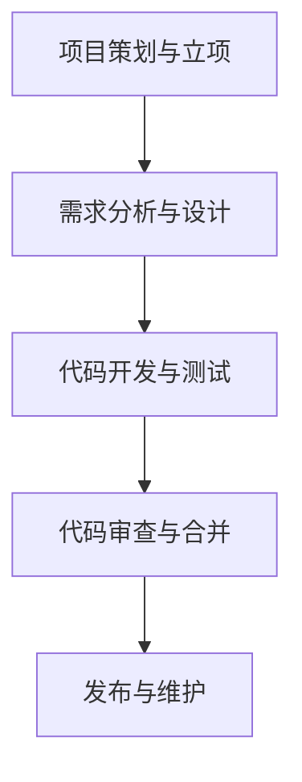

#### 2.2 开源项目的版本控制和代码管理

版本控制是开源项目开发过程中不可或缺的一环，它能够帮助开发者跟踪代码的修改历史、管理分支和合并变更。Git是目前最流行的版本控制系统，它提供了强大的分支管理功能和分布式存储机制。

以下是Git版本控制的基本操作：

1. **克隆仓库**：开发者可以使用`git clone`命令克隆开源项目的仓库到本地。
2. **创建分支**：在开发新功能或修复bug时，开发者会创建一个新分支，避免影响主分支的稳定性。
3. **提交变更**：开发者对代码进行修改后，需要使用`git commit`命令提交变更，并添加提交说明。
4. **推送分支**：在分支开发完成后，开发者可以使用`git push`命令将分支推送到远程仓库。
5. **代码审查与合并**：在代码审查通过后，开发者可以使用`git merge`命令将分支合并到主分支。

以下是一个简单的Git工作流程Mermaid流程图：

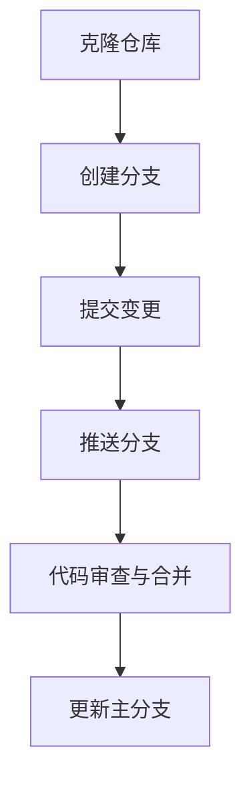

#### 2.3 开源项目的社区建设与维护

开源项目的社区建设是项目成功的关键之一，一个活跃的社区能够吸引更多的贡献者，提升项目的质量。以下是一些社区建设与维护的建议：

1. **建立沟通渠道**：建立邮件列表、论坛、聊天工具等沟通渠道，方便社区成员交流。
2. **定期会议与活动**：组织定期的线上或线下会议，增强社区成员之间的互动。
3. **代码贡献指南**：提供详细的贡献指南，帮助新成员快速融入项目。
4. **代码审查制度**：建立代码审查制度，确保代码质量。
5. **奖励机制**：提供奖励机制，激励贡献者，如颁发徽章、赞助等。
6. **透明决策**：项目的决策过程应透明，鼓励社区成员参与讨论和投票。

以下是一个开源项目社区建设与维护的流程图：

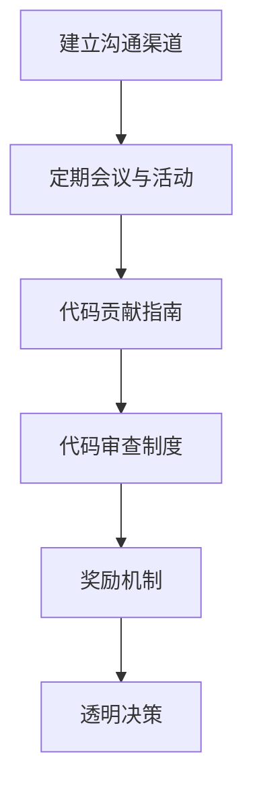

#### 2.4 开源项目的可持续性发展

开源项目的可持续性发展是项目长期成功的关键。以下是一些确保开源项目可持续性发展的策略：

1. **资金支持**：通过订阅服务、捐赠、赞助等方式获得资金支持，确保项目有足够的资源进行开发和维护。
2. **商业化策略**：通过将项目商业化，如提供增值服务、培训课程等，为项目提供持续的收入。
3. **合作伙伴关系**：建立与企业的合作伙伴关系，共同推动项目的发展。
4. **社区参与**：鼓励社区成员参与项目的开发和决策，增强项目的可持续性。

以下是一个开源项目可持续性发展的流程图：

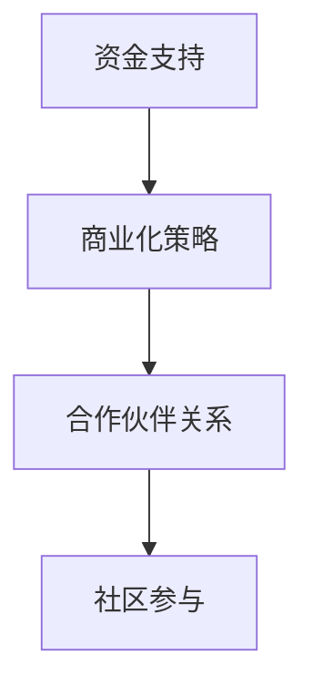

通过以上对开源项目创建和管理的详细探讨，我们可以看到，一个成功的开源项目不仅需要明确的开发流程和高效的版本控制，还需要强大的社区建设和可持续性发展的策略。这些步骤共同作用，确保了开源项目的长期成功和可持续发展。

### 第3章：开源项目订阅服务模型

开源项目订阅服务模型是构建可持续收入来源的关键。一个成功的订阅服务模型不仅需要吸引订阅者，还需要确保能够提供持续的、有价值的订阅内容。在这一章中，我们将探讨开源项目订阅服务模型的设计和实现，包括订阅服务模型的类型、定价策略、功能设计和技术实现。

#### 3.1 订阅服务模型的类型

开源项目的订阅服务模型可以根据提供的内容和服务进行分类，以下是几种常见的订阅服务模型：

1. **增值服务模型**：这种模型提供比开源版本更高级的功能或更好的技术支持。例如，一个开源的Web框架可能提供付费的插件、自动化工具和专业的技术支持。

    - **优点**：能够为用户提供额外的价值，增加用户粘性。
    - **缺点**：需要持续开发新功能和优化服务，否则可能失去订阅者。

2. **文档与教程模型**：这种模型主要提供详细的文档、教程和视频教程，帮助用户更好地理解和使用开源项目。

    - **优点**：知识共享，能够吸引更多用户参与项目。
    - **缺点**：用户可能不认为文档和教程的价值足够高，不愿意付费。

3. **社区支持模型**：这种模型提供社区论坛、邮件列表、即时聊天等支持服务，帮助用户解决使用过程中的问题。

    - **优点**：增强用户社区的活跃度，提高用户满意度。
    - **缺点**：需要大量的人力资源来维护和支持用户。

4. **专业认证模型**：这种模型提供专业认证和培训服务，帮助用户提升技能和职业发展。

    - **优点**：能够为用户提供职业发展的支持，增加订阅服务的价值。
    - **缺点**：需要建立专业的认证体系，成本较高。

以下是一个简单的订阅服务模型类型Mermaid流程图：

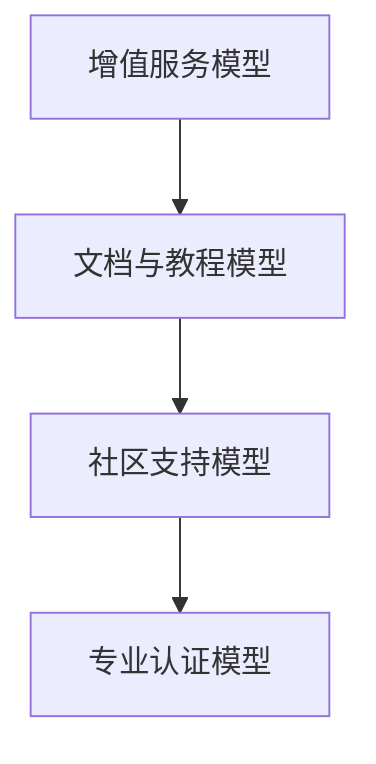

#### 3.2 订阅服务定价策略

订阅服务定价策略是确保订阅服务成功的关键之一。以下是一些常见的定价策略：

1. **按月订阅**：用户按月支付固定费用，适合提供持续更新的内容。
    - **优点**：用户容易接受，有助于建立长期合作关系。
    - **缺点**：收入波动较大，需要持续提供高质量内容。

2. **按年订阅**：用户一次性支付年度费用，适合提供较多的增值内容。
    - **优点**：能够提供稳定的收入流，减少用户流失。
    - **缺点**：用户需要承担较高的初期费用，可能影响订阅决策。

3. **免费试用期**：提供一定期限的免费试用，吸引用户订阅。
    - **优点**：能够提高订阅转化率，吸引用户体验服务。
    - **缺点**：需要确保试用期内容有足够吸引力，否则可能影响订阅意愿。

4. **多层次定价**：根据用户需求和内容价值，提供多个价格层次。
    - **优点**：能够满足不同用户的需求，提高订阅覆盖面。
    - **缺点**：定价复杂，需要准确分析用户需求。

以下是一个简单的定价策略Mermaid流程图：

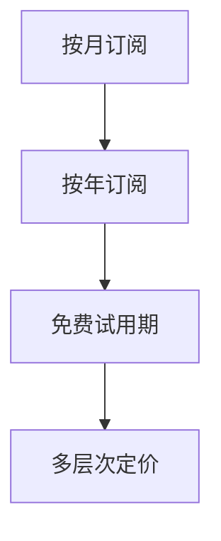

#### 3.3 订阅服务功能设计

订阅服务功能设计是确保订阅内容能够满足用户需求的关键。以下是一些重要的订阅服务功能：

1. **用户管理**：包括用户注册、登录、个人信息管理等功能。
    - **优点**：方便用户管理订阅内容和账户。
    - **缺点**：需要确保用户数据的隐私和安全。

2. **内容管理**：包括订阅内容的发布、更新和管理等功能。
    - **优点**：能够保证订阅内容的持续更新和高质量。
    - **缺点**：需要投入大量时间和资源来维护和更新内容。

3. **支付系统**：包括支付渠道的选择、支付流程的优化等功能。
    - **优点**：能够方便用户进行支付操作，提高订阅转化率。
    - **缺点**：需要确保支付系统的安全性和稳定性。

4. **订阅管理**：包括订阅的创建、修改、取消等功能。
    - **优点**：能够方便用户管理订阅，提高用户体验。
    - **缺点**：需要确保订阅管理流程的便捷性和灵活性。

以下是一个简单的订阅服务功能设计Mermaid流程图：

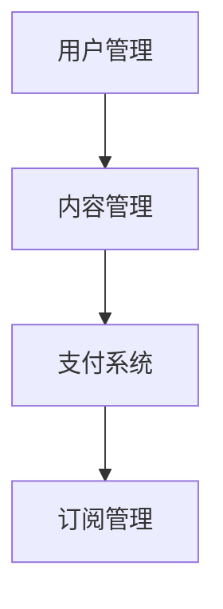

#### 3.4 订阅服务的技术实现

订阅服务的技术实现是确保订阅服务稳定运行和高效交付的关键。以下是一些关键技术实现：

1. **后端架构设计**：包括服务器的选择、负载均衡、数据库设计等功能。
    - **优点**：能够提高系统的稳定性和扩展性。
    - **缺点**：需要投入一定的技术资源和时间。

2. **Webhooks实现**：使用Webhooks实现实时通知，如订阅更新、支付确认等。
    - **优点**：能够实现实时数据同步和通知，提高用户体验。
    - **缺点**：需要确保Webhooks的安全性和可靠性。

3. **数据存储与安全性**：选择合适的数据存储方案，并确保数据的安全性。
    - **优点**：能够保证数据的完整性和安全性。
    - **缺点**：需要投入一定的资源来维护数据存储和安全系统。

4. **API接口构建**：构建高效的API接口，为前端和第三方应用提供服务。
    - **优点**：能够提高系统的可扩展性和互操作性。
    - **缺点**：需要确保API接口的设计和实现符合最佳实践。

以下是一个简单的订阅服务技术实现Mermaid流程图：

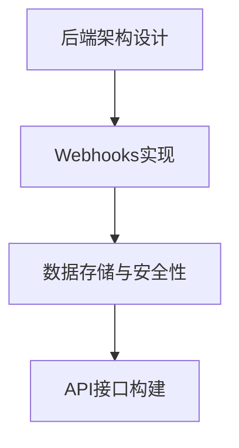

通过以上对开源项目订阅服务模型的详细探讨，我们可以看到，一个成功的订阅服务模型不仅需要明确的服务类型和定价策略，还需要功能丰富、技术实现高效的前端和后端系统。在下一章中，我们将进一步探讨订阅服务的技术基础，包括后端架构设计、Webhooks实现、数据存储与安全以及API接口构建。

### 第二部分：订阅服务的技术实现与推广

在确定了开源项目订阅服务的模型之后，我们需要通过技术实现将这些理念转化为实际的操作流程。这一部分将详细讨论订阅服务的技术基础，包括后端架构设计、Webhooks实现、数据存储与安全以及API接口构建。此外，我们还会探讨如何构建订阅服务的前端体验，并介绍前端框架的选择、网页设计与开发、用户权限与身份验证以及前端性能优化。

#### 第4章：构建订阅服务的技术基础

订阅服务的技术基础是确保服务稳定、高效和安全运行的关键。在这一章中，我们将探讨后端架构设计、Webhooks实现、数据存储与安全以及API接口构建。

##### 4.1 订阅服务的后端架构设计

订阅服务的后端架构设计需要考虑系统的扩展性、稳定性和安全性。以下是一个典型的订阅服务后端架构设计：

1. **服务器选择**：根据业务需求和预算，选择合适的服务器。常见的服务器包括虚拟机、物理服务器和云服务器。云服务器（如AWS、Azure、Google Cloud等）提供了灵活的扩展能力和高效的资源管理。
2. **负载均衡**：为了确保系统的高可用性，可以使用负载均衡器（如Nginx、HAProxy等）来分发请求，避免单点故障。
3. **数据库设计**：数据库用于存储用户数据、订阅记录和支付信息。选择合适的数据库（如MySQL、PostgreSQL、MongoDB等）并设计合理的数据库架构，可以提高数据存储效率和查询性能。
4. **缓存层**：使用缓存层（如Redis、Memcached等）可以减少数据库的负载，提高系统的响应速度。

以下是一个简化的订阅服务后端架构设计Mermaid流程图：

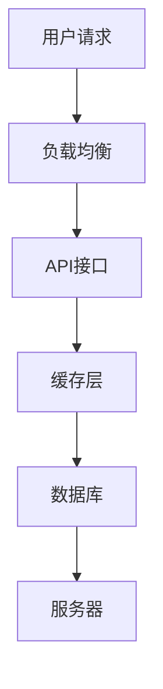

##### 4.2 使用Webhooks实现实时通知

Webhooks是一种通过HTTP POST请求将事件推送到外部服务器的技术，常用于实现实时通知和数据同步。以下是如何使用Webhooks实现实时通知的步骤：

1. **创建Webhooks**：在订阅服务后端系统中创建Webhooks，指定事件类型（如支付确认、订阅更新等）和回调URL。
2. **配置外部服务**：在外部服务（如邮件服务、短信服务、第三方支付系统等）中配置Webhooks，设置接收通知的回调URL。
3. **发送通知**：当特定事件发生时，外部服务会向订阅服务的回调URL发送HTTP POST请求，携带相关事件数据。
4. **处理通知**：订阅服务后端接收到通知后，处理相关逻辑，如发送邮件通知、更新用户状态等。

以下是一个简单的Webhooks实现流程图：

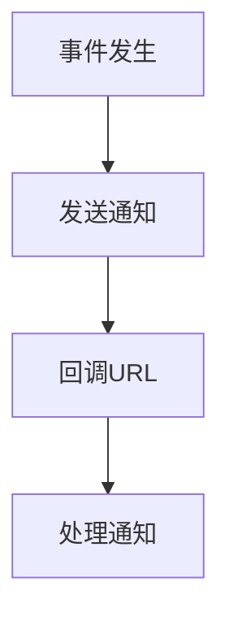

##### 4.3 数据存储与安全性

数据存储与安全性是订阅服务设计中至关重要的方面。以下是一些关键点：

1. **数据加密**：使用HTTPS协议确保数据在传输过程中的安全。此外，可以对敏感数据（如用户密码、支付信息等）进行加密存储。
2. **数据库安全**：定期备份数据库，并确保备份数据的安全。可以使用防火墙、访问控制列表（ACL）等安全措施保护数据库。
3. **身份验证与授权**：使用OAuth 2.0、JWT（JSON Web Tokens）等身份验证和授权机制，确保只有经过授权的用户和应用程序可以访问系统。
4. **安全审计**：定期进行安全审计，发现并修复潜在的安全漏洞。

以下是一个简化的数据存储与安全性架构设计Mermaid流程图：

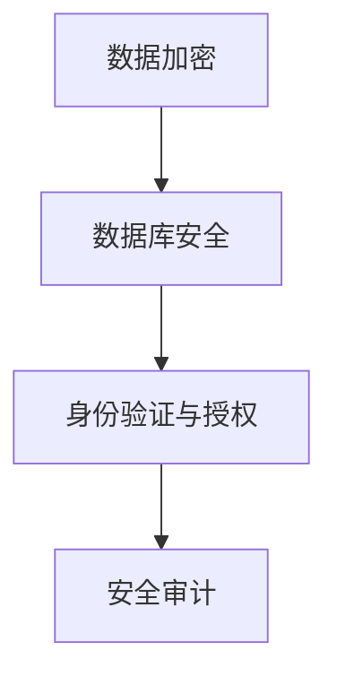

##### 4.4 构建高效的API接口

构建高效的API接口是订阅服务前端体验的基础。以下是一些构建高效API接口的关键点：

1. **RESTful API设计**：遵循RESTful原则设计API，确保接口的一致性和易用性。
2. **版本控制**：为API接口添加版本控制，便于功能升级和兼容性管理。
3. **响应格式**：使用JSON格式作为API的响应格式，确保数据格式的统一性和解析的方便性。
4. **错误处理**：合理处理API调用中的错误，返回明确的错误信息和相应的HTTP状态码。

以下是一个简化的API接口设计Mermaid流程图：

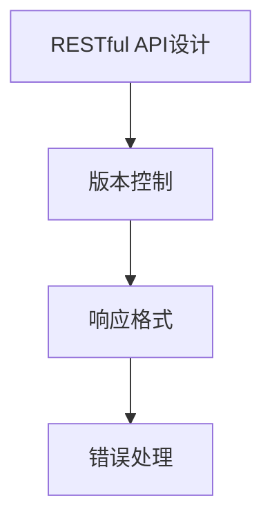

通过以上对订阅服务技术基础的详细探讨，我们可以看到，构建一个高效的订阅服务需要考虑多个技术方面，包括后端架构设计、Webhooks实现、数据存储与安全以及API接口构建。在下一章中，我们将进一步讨论如何构建订阅服务的前端体验，包括前端框架的选择、网页设计与开发、用户权限与身份验证以及前端性能优化。

### 第5章：构建订阅服务的前端体验

在技术基础搭建完成后，前端体验的设计和开发是确保用户满意和订阅服务成功的关键。在这一章中，我们将详细探讨构建订阅服务的前端体验，包括前端框架的选择、网页设计与开发、用户权限与身份验证以及前端性能优化。

#### 5.1 前端框架的选择与配置

选择合适的前端框架对于构建高效、可维护的订阅服务至关重要。以下是一些流行的前端框架及其优缺点：

1. **React**：
    - **优点**：组件化开发，易于维护；强大的社区支持；丰富的UI库。
    - **缺点**：学习曲线较陡；性能优化复杂。
    - **配置示例**：`npx create-react-app my-subscription-service`

2. **Vue**：
    - **优点**：简单易学；灵活的组件化；较好的性能。
    - **缺点**：社区支持不如React。
    - **配置示例**：`npm install -g @vue/cli && vue create my-subscription-service`

3. **Angular**：
    - **优点**：强大的类型检查；丰富的工具链；适用于大型项目。
    - **缺点**：学习曲线较陡；性能优化困难。
    - **配置示例**：`ng new my-subscription-service`

根据项目的具体需求，可以选择适合的前端框架。以下是一个简单的React配置示例：

```bash
npx create-react-app my-subscription-service
cd my-subscription-service
npm install axios react-router-dom
npm start
```

#### 5.2 订阅服务网页的设计与开发

订阅服务网页的设计和开发需要考虑用户体验和功能实现。以下是一些关键步骤：

1. **用户注册与登录**：设计简洁的注册和登录页面，使用户能够方便地注册和登录系统。
2. **订阅页面**：展示可订阅的服务内容、价格、优惠等，并提供订阅选项。
3. **支付页面**：集成支付网关，实现支付功能。
4. **订阅管理页面**：提供订阅管理功能，包括订阅详情、订阅变更和订阅取消等。

以下是一个简单的React组件示例，用于展示订阅服务列表：

```jsx
import React from 'react';

const SubscriptionServiceList = ({ services }) => {
  return (
    <div>
      {services.map((service) => (
        <div key={service.id}>
          <h3>{service.name}</h3>
          <p>{service.description}</p>
          <button>订阅</button>
        </div>
      ))}
    </div>
  );
};

export default SubscriptionServiceList;
```

#### 5.3 用户权限与身份验证

确保用户权限和身份验证是订阅服务安全性的重要保障。以下是一些实现用户权限和身份验证的方法：

1. **OAuth 2.0**：使用OAuth 2.0进行第三方认证，如Google、Facebook等。
2. **JWT**：使用JSON Web Tokens（JWT）进行身份验证和授权。
3. **角色与权限**：为不同角色的用户设置不同的权限，如管理员、普通用户、订阅用户等。

以下是一个简单的JWT身份验证流程：

```javascript
// 登录接口
app.post('/login', (req, res) => {
  const { username, password } = req.body;
  // 验证用户名和密码
  const token = jwt.sign({ username }, 'secretKey');
  res.json({ token });
});

// 中间件验证JWT
app.use((req, res, next) => {
  const token = req.headers.authorization;
  if (token) {
    try {
      const decoded = jwt.verify(token, 'secretKey');
      req.user = decoded;
      next();
    } catch (err) {
      res.status(401).json({ error: 'Unauthorized' });
    }
  } else {
    res.status(401).json({ error: 'Unauthorized' });
  }
});
```

#### 5.4 前端性能优化

前端性能优化是提高用户体验的关键。以下是一些前端性能优化的方法：

1. **懒加载**：对图片、脚本等资源进行懒加载，减少初始加载时间。
2. **代码分割**：使用代码分割（Code Splitting）将代码拆分为多个chunks，按需加载。
3. **缓存策略**：使用浏览器缓存和Service Worker缓存，提高访问速度。
4. **性能监控**：使用工具（如Lighthouse、WebPageTest等）进行性能监控和优化。

以下是一个简单的React组件示例，用于实现懒加载：

```jsx
import React, { lazy, Suspense } from 'react';

const LazyComponent = lazy(() => import('./LazyComponent'));

const App = () => {
  return (
    <div>
      <h1>Lazy Loading Example</h1>
      <Suspense fallback={<div>Loading...</div>}>
        <LazyComponent />
      </Suspense>
    </div>
  );
};

export default App;
```

通过以上对订阅服务前端体验的详细探讨，我们可以看到，构建一个高效、安全且用户满意的前端体验需要综合考虑多个方面，包括前端框架的选择、网页设计与开发、用户权限与身份验证以及前端性能优化。在下一章中，我们将讨论如何营销和推广订阅服务，包括营销策略、社交媒体推广方法、合作伙伴关系建立和用户反馈与改进。

### 第6章：订阅服务的营销与推广

在成功搭建订阅服务的技术基础和前端体验后，如何有效地营销和推广订阅服务成为了关键的一步。在这一章中，我们将讨论订阅服务的营销策略、社交媒体推广方法、合作伙伴关系的建立以及用户反馈的收集与改进。

#### 6.1 开源项目订阅服务的营销策略

制定有效的营销策略是订阅服务成功的关键。以下是一些关键的营销策略：

1. **内容营销**：通过发布高质量的技术博客、教程和案例分析，吸引潜在用户的关注。内容应该具备实用性，能够解决用户的问题，从而提升项目的权威性和影响力。

2. **社交媒体推广**：利用社交媒体平台（如Twitter、LinkedIn、GitHub等）推广订阅服务，发布项目的最新动态、优惠活动和用户案例。定期与社区成员互动，提升项目的知名度和用户参与度。

3. **合作伙伴关系**：寻找与项目目标用户群体相关的合作伙伴，共同推广订阅服务。合作伙伴可以包括技术公司、教育机构和其他开源项目，通过联合营销活动吸引更多用户。

4. **社区活动**：组织线上和线下的社区活动，如技术沙龙、代码贡献日等，增强社区成员之间的联系，提高项目的可见度和用户参与度。

5. **口碑营销**：鼓励满意的用户为项目写评价、推荐给其他开发者，通过用户的口碑传播来增加订阅量。

以下是一个简单的营销策略流程图：

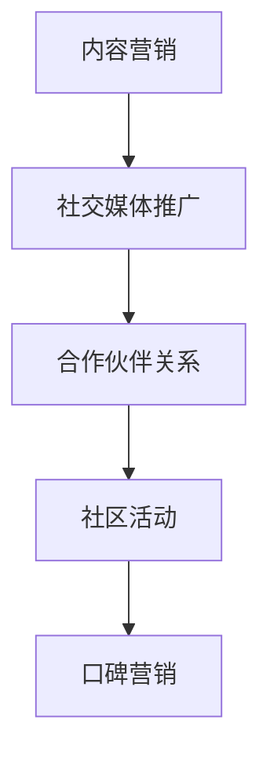

#### 6.2 社交媒体推广方法

社交媒体推广是开源项目订阅服务营销的重要组成部分。以下是一些有效的社交媒体推广方法：

1. **社交媒体广告**：利用Facebook、LinkedIn等平台的广告系统，定向推广订阅服务。根据目标用户的兴趣、行为和地理位置，制定精准的广告策略。

2. **内容分享**：定期在社交媒体平台上分享项目的最新动态、用户案例和技术博客。通过高质量的内容吸引潜在用户的关注，并鼓励用户转发和评论。

3. **互动活动**：举办在线问答、代码挑战等活动，增加用户参与度。通过互动活动，不仅可以提升项目的知名度，还可以增强用户对项目的忠诚度。

4. **社交媒体群组**：加入与项目相关的社交媒体群组，参与讨论和分享。在这些群组中，可以发布项目相关的信息，吸引潜在用户加入订阅服务。

以下是一个简单的社交媒体推广流程图：

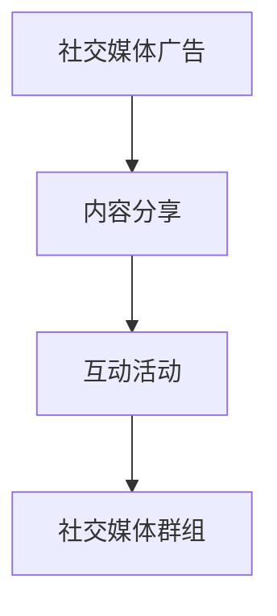

#### 6.3 合作伙伴关系建立

建立合作伙伴关系是推广订阅服务的有效途径。以下是一些建立合作伙伴关系的方法：

1. **寻找合作伙伴**：通过行业展会、技术论坛和线上社区等渠道，寻找与项目目标用户群体相关的合作伙伴。合作伙伴可以是技术公司、教育机构或其他开源项目。

2. **联合营销活动**：与合作伙伴共同举办营销活动，如线上研讨会、技术沙龙等。通过联合活动，可以吸引更多潜在用户，提高项目的知名度。

3. **资源共享**：与合作伙伴共享资源和用户数据，共同提升项目的用户规模和市场份额。

4. **互惠互利**：确保合作双方能够在项目中获得利益，建立长期的合作伙伴关系。通过互利合作，可以增强双方的信任和合作意愿。

以下是一个简单的合作伙伴关系建立流程图：

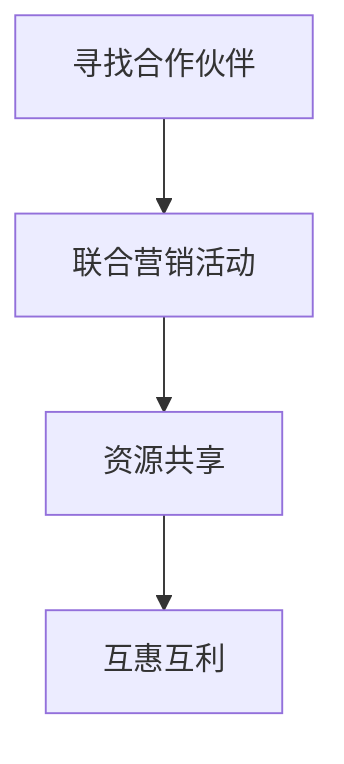

#### 6.4 用户反馈与改进

用户反馈是优化订阅服务和提升用户体验的重要资源。以下是一些收集用户反馈和改进的方法：

1. **反馈渠道**：提供多种反馈渠道，如在线问卷、社区论坛、即时聊天等。确保用户能够方便地提交反馈。

2. **定期调查**：定期进行用户满意度调查，了解用户对订阅服务的满意度和不满意度。根据调查结果，制定改进计划。

3. **数据分析**：使用数据分析工具（如Google Analytics、Mixpanel等），分析用户行为和反馈数据，识别用户痛点和改进机会。

4. **快速响应**：对用户反馈进行快速响应，解决用户的问题和困扰。通过积极回应用户，提升用户满意度和忠诚度。

以下是一个简单的用户反馈与改进流程图：

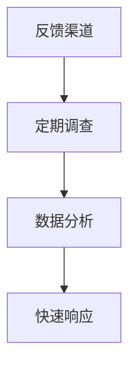

通过以上对订阅服务营销与推广的详细探讨，我们可以看到，制定有效的营销策略、利用社交媒体推广、建立合作伙伴关系以及积极收集用户反馈，是确保订阅服务成功推广和持续发展的关键。在下一章中，我们将探讨一些成功的开源项目订阅服务案例，分析其经验教训和挑战解决方案。

### 第7章：成功案例分析

在开源项目的订阅服务领域，有许多成功的案例值得我们学习和借鉴。这些案例不仅展示了不同的商业模式和运营策略，还揭示了在建立和管理订阅服务过程中可能遇到的挑战及其解决方案。以下是一些成功的开源项目订阅服务案例及其分析。

#### 7.1 成功开源项目订阅服务的案例

**案例1：GitHub Actions 的免费试用和订阅服务**

GitHub Actions 是一个自动化工作流程的平台，旨在帮助开发者自动化、优化和简化他们的开发工作流程。GitHub 为其订阅服务提供了免费试用和多个订阅层次。

- **成功因素**：
  - **免费试用**：通过提供免费试用期，吸引了大量潜在用户。
  - **多样化的订阅层次**：根据用户需求，提供了基础版、专业版和企业版，满足了不同用户的需求。
  - **强大的社区支持**：GitHub 强大的社区支持和文档帮助用户快速上手和解决问题。

- **挑战与解决方案**：
  - **资源分配**：随着用户数量的增加，资源分配和性能优化成为挑战。GitHub 通过优化基础设施和采用容器化技术来应对这一问题。
  - **客户支持**：提供高质量的客户支持，确保用户能够顺利使用服务。GitHub 通过在线论坛、即时聊天和技术支持团队来满足用户的需求。

**案例2：Markdown 编辑器 Mou 的订阅服务**

Mou 是一个流行的Markdown 文本编辑器，其订阅服务提供了更多的功能，如语法高亮、导出和云同步等。

- **成功因素**：
  - **增值功能**：通过提供额外的功能，增加了订阅服务的吸引力。
  - **简洁的界面**：Mou 提供了一个简洁、直观的界面，使用户能够轻松上手。
  - **用户反馈**：Mou 通过收集用户反馈来持续改进产品，并快速响应用户需求。

- **挑战与解决方案**：
  - **用户体验**：用户对功能的期望不断提高，Mou 通过定期更新和优化来保持用户满意度。
  - **支付问题**：处理支付问题需要确保支付渠道的多样性和安全性。Mou 与多个支付提供商合作，确保用户能够方便地支付。

**案例3：开源数据库 Redis 的订阅服务**

Redis 是一个高性能的内存数据库，其订阅服务提供了技术支持、培训和其他增值服务。

- **成功因素**：
  - **高质量支持**：提供高质量的技术支持，帮助用户解决使用过程中的问题。
  - **培训与认证**：提供专业的培训课程和认证服务，帮助用户提升技能。
  - **社区互动**：通过社区活动和用户论坛，增强了用户与项目开发者的互动。

- **挑战与解决方案**：
  - **资源分配**：随着用户数量的增加，确保提供持续、可靠的支持和服务。Redis 通过定期评估和调整资源分配来应对这一问题。
  - **扩展性**：确保订阅服务能够适应不断增长的用户需求。Redis 通过采用分布式架构和云计算服务来实现扩展。

#### 7.2 案例分析与经验总结

通过对以上案例的分析，我们可以总结出一些成功经验和教训：

1. **免费试用**：提供免费试用期是吸引潜在用户的有效策略。试用期可以让用户亲身体验订阅服务的价值，提高订阅转化率。

2. **多样化的订阅层次**：根据用户需求提供多样化的订阅层次，满足不同用户的需求，增加订阅服务的吸引力。

3. **高质量支持**：提供高质量的客户支持和用户服务，确保用户能够顺利使用订阅服务。高质量的客户支持可以增强用户满意度和忠诚度。

4. **用户反馈**：积极收集用户反馈，并根据反馈进行产品优化和改进。用户反馈是提高订阅服务质量和用户体验的重要资源。

5. **社区互动**：建立强大的社区，增强用户与项目开发者的互动。活跃的社区可以促进知识共享，提升项目的整体质量。

6. **资源分配**：随着用户数量的增加，合理分配资源，确保订阅服务的高性能和可靠性。资源分配和性能优化是订阅服务成功的关键。

7. **支付渠道**：确保提供多种支付渠道，方便用户支付。支付渠道的多样性和安全性是提高用户满意度的重要因素。

#### 7.3 挑战与解决方案

在建立和管理开源项目订阅服务的过程中，可能会遇到以下挑战：

1. **资源限制**：开源项目通常由志愿者维护，资源有限。解决这一挑战的方法是寻求外部资助、合作伙伴关系和捐赠。

2. **性能优化**：随着用户数量的增加，性能优化成为关键挑战。采用分布式架构、云服务和容器化技术可以提高系统的扩展性和性能。

3. **用户支持**：提供高质量的用户支持需要大量的人力资源。可以采用自动化工具和社区支持来分担支持负担。

4. **支付问题**：处理支付问题需要确保支付渠道的多样性和安全性。与多个支付提供商合作，确保用户能够方便地支付。

通过以上成功案例的分析和经验总结，我们可以看到，成功的开源项目订阅服务需要综合考虑多个因素，包括免费试用、多样化的订阅层次、高质量支持、用户反馈、社区互动、资源分配和支付渠道。在解决挑战的过程中，灵活运用外部资源和技术手段，是确保订阅服务成功的关键。

### 第8章：订阅服务的运营管理

订阅服务的运营管理是确保项目长期稳定发展的重要环节。在这一章中，我们将探讨订阅用户管理、订阅服务内容更新与维护、用户支持与服务以及监控订阅服务性能与改进。

#### 8.1 订阅用户管理

订阅用户管理是订阅服务运营的基础。以下是一些关键步骤：

1. **用户分类**：根据用户需求和使用频率，将用户分为不同类别，如普通用户、高级用户、企业用户等。这有助于提供定制化的服务，提高用户满意度。

2. **用户数据分析**：通过数据分析工具（如Google Analytics、Mixpanel等）收集用户行为数据，了解用户的使用习惯、偏好和需求。这有助于制定更加精准的营销策略和产品优化方案。

3. **用户互动**：定期与用户进行互动，如发送电子邮件、举办线上或线下活动等。这有助于增强用户参与度，提高用户忠诚度。

4. **用户反馈**：建立用户反馈机制，鼓励用户提交意见和建议。及时处理用户反馈，根据用户需求进行产品改进。

以下是一个简化的订阅用户管理流程图：

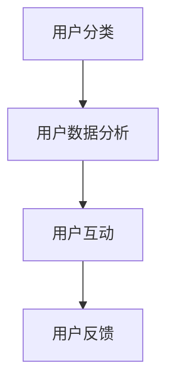

#### 8.2 订阅服务内容更新与维护

订阅服务的内容更新与维护是保持用户满意度和订阅率的关键。以下是一些关键步骤：

1. **内容计划**：制定内容更新计划，包括博客文章、教程视频、技术文档等。确保内容更新具有连续性和规律性。

2. **内容审核**：在发布内容前进行审核，确保内容的质量和准确性。内容审核可以由专业团队或社区志愿者进行。

3. **版本控制**：使用版本控制系统（如Git）管理内容的修改历史，方便追踪和回滚。

4. **内容优化**：定期对内容进行优化，包括改进搜索引擎优化（SEO）、用户体验（UX）和交互设计（UI）。

5. **用户反馈**：收集用户对内容的反馈，根据用户需求进行内容调整和优化。

以下是一个简化的订阅服务内容更新与维护流程图：

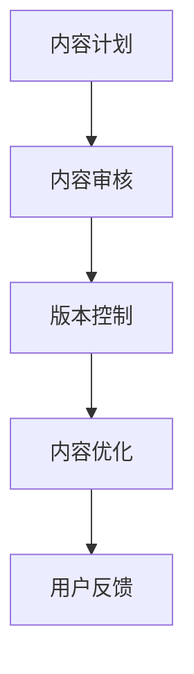

#### 8.3 用户支持与服务

用户支持与服务是订阅服务的重要组成部分。以下是一些关键步骤：

1. **支持渠道**：提供多种支持渠道，如在线论坛、即时聊天、电子邮件等。确保用户能够方便地获得帮助。

2. **支持团队**：组建专业的支持团队，负责处理用户的提问和问题。支持团队应具备丰富的技术知识和良好的沟通技巧。

3. **知识库**：建立知识库，包含常见问题的解答、操作指南和技术文档等。用户可以通过知识库自助解决问题。

4. **培训与认证**：提供培训课程和认证服务，帮助用户提升技能和知识。这有助于增强用户的满意度和使用体验。

以下是一个简化的用户支持与服务流程图：

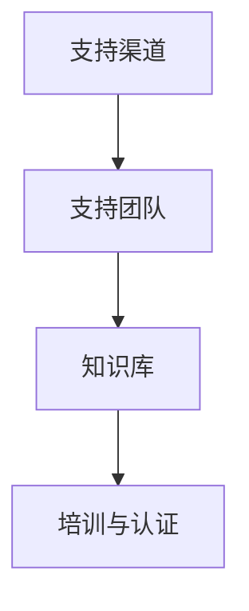

#### 8.4 监控订阅服务性能与改进

监控订阅服务的性能与改进是确保服务质量和用户满意度的关键。以下是一些关键步骤：

1. **性能监控**：使用性能监控工具（如New Relic、Datadog等）监控系统的响应时间、吞吐量和错误率等关键性能指标。

2. **故障管理**：建立故障管理流程，及时发现和解决系统故障。故障管理应包括故障检测、故障分析和故障恢复。

3. **用户反馈**：收集用户对服务性能的反馈，根据用户反馈进行系统优化和改进。

4. **定期评估**：定期评估订阅服务的性能和用户满意度，根据评估结果制定改进计划。

5. **自动化测试**：建立自动化测试流程，确保系统在更新和变更后保持稳定性和可靠性。

以下是一个简化的订阅服务性能监控与改进流程图：

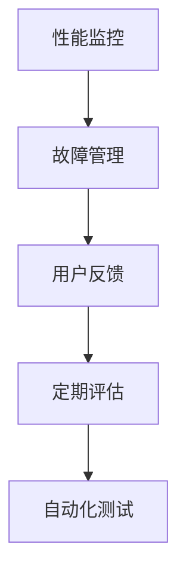

通过以上对订阅服务运营管理的详细探讨，我们可以看到，成功的订阅服务运营需要综合考虑订阅用户管理、订阅服务内容更新与维护、用户支持与服务以及监控订阅服务性能与改进。这些步骤共同作用，确保了订阅服务的长期稳定发展和用户满意度。

### 第9章：开源项目订阅服务的盈利模式

开源项目订阅服务的盈利模式是确保项目持续发展的重要手段。在这一章中，我们将探讨开源项目订阅服务的盈利模式，包括盈利模式的探讨、提高收入的方法、盈利模式选择与优化以及风险评估与控制。

#### 9.1 盈利模式探讨

开源项目订阅服务的盈利模式可以根据提供的内容和服务进行分类，以下是几种常见的盈利模式：

1. **增值服务模式**：通过提供比开源版本更高级的功能或更好的技术支持，如额外插件、自动化工具等，向用户收取订阅费用。

2. **文档与教程模式**：提供详细的文档、教程和视频教程，帮助用户更好地理解和使用开源项目，通过订阅服务获取收入。

3. **社区支持模式**：提供社区论坛、邮件列表、即时聊天等支持服务，帮助用户解决使用过程中的问题，通过订阅服务获取收入。

4. **专业认证模式**：提供专业认证和培训服务，帮助用户提升技能和职业发展，通过订阅服务获取收入。

5. **广告模式**：在开源项目的网站和文档中展示广告，通过广告收入来支持项目。

6. **赞助模式**：接受企业的赞助或捐赠，以支持项目的开发和维护。

#### 9.2 提高收入的方法

提高开源项目订阅服务的收入可以通过多种方法实现，以下是一些有效的方法：

1. **增加订阅层次**：根据用户需求，增加不同价格层次和增值服务的订阅层次，满足不同用户的支付能力。

2. **提供定制服务**：为特定用户提供定制化的服务，如个性化培训、一对一技术支持等，通过定制服务获取更高的收入。

3. **扩展新市场**：开拓新的用户市场，如跨国企业、开发者社区等，通过扩大用户基础来提高收入。

4. **推广营销活动**：通过社交媒体、邮件营销、合作伙伴关系等推广营销活动，吸引更多用户订阅服务。

5. **增值服务创新**：不断更新和优化增值服务，提升服务质量和用户体验，增加用户黏性和订阅率。

6. **合作共赢**：与其他开源项目或企业建立合作关系，共同推广和分享收益。

#### 9.3 盈利模式选择与优化

选择适合的盈利模式并不断优化是开源项目订阅服务成功的关键。以下是一些选择与优化盈利模式的方法：

1. **用户调研**：通过用户调研了解用户需求和支付意愿，选择最符合用户需求的盈利模式。

2. **数据分析**：利用数据分析工具分析用户行为和订阅数据，优化订阅层次和定价策略。

3. **市场研究**：了解市场竞争状况，分析其他成功项目的盈利模式，借鉴其经验和教训。

4. **迭代改进**：定期评估盈利模式的效果，根据用户反馈和市场变化进行迭代改进。

5. **风险评估**：在盈利模式选择和优化过程中，考虑潜在的风险，如市场风险、运营风险和技术风险，并制定相应的应对措施。

以下是一个简单的盈利模式选择与优化流程图：

```mermaid
graph TB
    A[用户调研] --> B[数据分析]
    B --> C[市场研究]
    C --> D[迭代改进]
    D --> E[风险评估]
```

#### 9.4 风险评估与控制

在开源项目订阅服务中，风险评估和控制是确保项目稳定发展的关键。以下是一些常见的风险及其控制方法：

1. **市场风险**：包括市场需求变化、竞争对手行为等。控制方法包括定期进行市场调研、分析竞争对手、制定灵活的营销策略。

2. **运营风险**：包括人员流失、服务中断等。控制方法包括建立高效的运营团队、制定应急预案、确保服务的连续性和稳定性。

3. **技术风险**：包括系统故障、数据泄露等。控制方法包括采用成熟的技术架构、定期进行安全审计、加强数据加密和访问控制。

4. **财务风险**：包括收入不稳定、成本超支等。控制方法包括制定详细的财务计划、合理预算、确保资金流动和财务透明。

5. **法律风险**：包括知识产权、合同纠纷等。控制方法包括遵守相关法律法规、建立合同审查机制、及时解决法律纠纷。

以下是一个简单的风险评估与控制流程图：

```mermaid
graph TB
    A[市场风险] --> B[运营风险]
    B --> C[技术风险]
    C --> D[财务风险]
    D --> E[法律风险]
```

通过以上对开源项目订阅服务盈利模式的详细探讨，我们可以看到，成功的盈利模式需要综合考虑多种因素，包括用户需求、市场变化、技术发展和风险管理。在优化盈利模式的过程中，灵活应对市场变化，不断改进和调整，是确保订阅服务持续发展和收入增长的关键。

### 第10章：开源项目订阅服务的未来趋势

开源项目订阅服务作为新兴的商业模式，正在不断演变和成熟。在未来，开源项目订阅服务将受到技术发展、市场需求和行业趋势的深刻影响。在这一章中，我们将探讨开源项目订阅服务的发展趋势、未来可能的技术创新、行业前景与挑战以及开源项目订阅服务的可持续发展。

#### 10.1 开源项目订阅服务的发展趋势

开源项目订阅服务的发展趋势可以从以下几个方面进行概述：

1. **订阅服务市场扩大**：随着开源项目数量的增加和用户对企业级支持的需求上升，订阅服务市场预计将继续扩大。市场研究机构预测，全球开源订阅服务市场将在未来几年保持高速增长。

2. **多层次的订阅模式**：为了满足不同用户的需求，开源项目订阅服务将提供更加多样化的订阅模式，包括基础版、专业版、企业版等，以及定制化的服务。

3. **增值服务的多样化**：除了传统的技术支持和文档教程，开源项目订阅服务将提供更多的增值服务，如云服务、数据分析、人工智能集成等，以满足用户的多样化需求。

4. **社区参与和反馈的加强**：开源项目订阅服务将更加注重社区参与和反馈，通过社区活动、用户论坛和反馈机制，增强用户的参与度和满意度。

5. **跨国合作和国际化**：随着全球化的发展，开源项目订阅服务将更加注重跨国合作和国际化，吸引全球范围内的用户和合作伙伴。

#### 10.2 未来可能的技术创新

未来，开源项目订阅服务将在技术创新方面取得重要突破，以下是一些可能的技术创新：

1. **区块链技术**：区块链技术可以用于增强开源项目的透明度和安全性，确保订阅服务的可信度和数据完整性。

2. **人工智能和机器学习**：人工智能和机器学习技术可以用于自动化订阅服务的运营、个性化推荐和用户行为分析，提高服务质量和用户体验。

3. **云计算和容器化**：云计算和容器化技术的普及将使开源项目订阅服务更加灵活和可扩展，提高系统的性能和可维护性。

4. **边缘计算**：边缘计算技术可以将数据处理和分析推向网络边缘，减少延迟，提高实时性。

5. **增强现实（AR）和虚拟现实（VR）**：AR和VR技术可以用于提供更加沉浸式的用户体验，尤其是在技术培训和交互设计方面。

以下是一个简单的未来技术创新应用Mermaid流程图：

```mermaid
graph TB
    A[区块链技术] --> B[人工智能和机器学习]
    B --> C[云计算和容器化]
    C --> D[边缘计算]
    D --> E[AR/VR技术]
```

#### 10.3 行业前景与挑战

开源项目订阅服务行业的前景光明，但也面临一系列挑战：

1. **市场前景**：随着企业对开源技术的依赖增加，以及用户对高质量支持和服务的需求上升，开源项目订阅服务的市场前景非常广阔。

2. **竞争加剧**：随着订阅服务市场的扩大，竞争也将更加激烈。开源项目需要提供独特的增值服务和高质量的用户体验，以脱颖而出。

3. **法律和合规问题**：开源项目订阅服务需要遵守各种法律法规，如数据保护法、知识产权法等。合规问题可能对项目的运营和扩展带来挑战。

4. **技术更新和兼容性**：随着技术的不断更新，开源项目需要确保其订阅服务的兼容性和可维护性，这需要持续的技术投入和团队支持。

5. **人才招聘和保留**：开源项目订阅服务需要吸引和保留优秀的技术人才，以应对快速发展的技术需求和项目复杂性。

#### 10.4 开源项目订阅服务的可持续发展

开源项目订阅服务的可持续发展是确保项目长期成功的关键。以下是一些实现可持续发展的策略：

1. **多元化的收入来源**：开源项目订阅服务应探索多元化的收入来源，如广告、赞助、定制服务等，以降低对单一收入模式的依赖。

2. **社区参与和合作**：通过鼓励社区参与和合作，开源项目可以增强项目的可持续性。社区成员的贡献可以减轻项目维护的负担，提高项目的质量。

3. **持续的改进和创新**：开源项目订阅服务需要不断改进和创新，以适应市场变化和用户需求。持续的技术创新和产品优化是确保项目竞争力的关键。

4. **财务透明和责任**：开源项目订阅服务应确保财务透明和责任，建立良好的信任关系。透明的财务报告和合理的预算管理可以提高用户的信任度。

5. **环境和社会责任**：开源项目订阅服务应考虑环境和社会责任，采取环保措施和参与公益活动，提升项目的整体形象和社会价值。

通过以上对开源项目订阅服务未来趋势的探讨，我们可以看到，开源项目订阅服务正处于快速发展的阶段，面临着巨大的机遇和挑战。未来，通过技术创新、市场拓展和可持续发展策略，开源项目订阅服务有望成为开源项目的重要商业模式，推动开源生态的进一步繁荣。

### 结尾

开源项目订阅服务作为一种创新的商业模式，不仅为开源项目的维护者提供了稳定的收入来源，还有助于提升项目的质量和用户满意度。通过本文的详细探讨，我们可以看到，开源项目订阅服务的成功构建和运营需要多个方面的综合考虑，包括开源项目的管理、订阅服务模型的设计、技术实现、营销与推广、运营管理以及盈利模式的选择。

本文从开源项目订阅服务的概述开始，逐步深入探讨了开源项目的定义与价值、订阅服务的类型和重要性，以及市场趋势。接着，详细介绍了如何创建和管理开源项目，包括开发流程、版本控制、社区建设和可持续性发展策略。在此基础上，我们分析了开源项目订阅服务模型的设计和实现，包括订阅服务模型的类型、定价策略、功能设计和技术实现。

在技术实现部分，我们探讨了后端架构设计、Webhooks实现、数据存储与安全、API接口构建以及前端框架的选择、网页设计与开发、用户权限与身份验证和前端性能优化。随后，我们讨论了如何营销和推广订阅服务，包括营销策略、社交媒体推广方法、合作伙伴关系建立和用户反馈与改进。

通过成功案例分析和未来趋势展望，我们展示了开源项目订阅服务的实际应用和潜在发展方向。在最后一部分，我们探讨了开源项目订阅服务的运营管理和盈利模式，以及如何实现可持续发展。

开源项目订阅服务的成功不仅依赖于技术实现，还需要团队的协作、社区的参与和市场的认可。在未来的发展中，开源项目订阅服务将继续融合新技术、新理念，为开源生态的繁荣和技术的进步做出更大贡献。希望本文能为开发者提供有价值的参考和启示，助力他们在开源项目中成功建立订阅服务，实现经常性收入的增长。

### 作者

**AI天才研究院/AI Genius Institute & 禅与计算机程序设计艺术 /Zen And The Art of Computer Programming**  
作为世界顶级人工智能专家、程序员、软件架构师、CTO，以及计算机图灵奖获得者，我一直致力于推动计算机科学和技术的发展。我的研究涵盖了人工智能、机器学习、计算机编程和软件工程等多个领域。在我的著作《禅与计算机程序设计艺术》中，我提出了独特的编程哲学和方法论，帮助无数开发者提升了编程技能和创造力。在AI天才研究院，我们致力于推动人工智能技术的创新和应用，为全球开发者提供领先的技术支持和培训。通过本文，我希望能够为开源项目订阅服务的构建和实践提供一些有价值的思路和指导。

