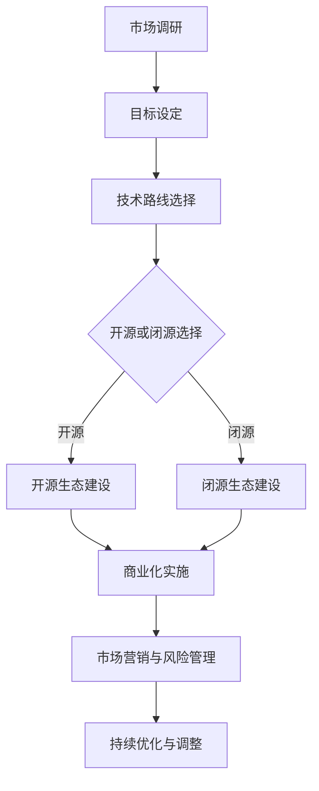

                 

## 文章标题：开源还是闭源：大模型商业化的抉择

> 关键词：大模型、开源、闭源、商业化、决策

> 摘要：本文深入探讨了在人工智能领域，特别是在大模型技术商业化过程中，开源与闭源模式的优劣及其对企业决策的影响。文章首先介绍了大模型商业化的背景和核心概念，随后详细分析了开源与闭源在大模型商业化中的应用及其面临的挑战。通过案例分析、战略规划和技术路线的探讨，本文提供了对开源与闭源模式选择的有益参考，并对大模型商业化的未来趋势和社会责任进行了展望。

---

# 《开源还是闭源：大模型商业化的抉择》目录大纲

## 第一部分：大模型商业化的背景与概念

### 第1章：大模型商业化概述
#### 1.1 大模型商业化的背景
#### 1.2 开源与闭源：定义与对比
#### 1.3 大模型商业化的重要性

### 第2章：大模型商业化的核心概念
#### 2.1 大模型的基本原理
#### 2.2 大模型的训练与优化
#### 2.3 大模型的部署与应用

### 第3章：开源在大模型商业化中的应用
#### 3.1 开源的优势与挑战
#### 3.2 开源大模型的商业模式
#### 3.3 开源生态系统的建立

### 第4章：闭源在大模型商业化中的应用
#### 4.1 闭源的优势与挑战
#### 4.2 闭源大模型的商业模式
#### 4.3 闭源生态系统的建立

### 第5章：大模型商业化的法律与伦理问题
#### 5.1 大模型商业化的法律环境
#### 5.2 大模型商业化的伦理问题
#### 5.3 风险管理与合规策略

### 第6章：开源与闭源在大模型商业化中的案例分析
#### 6.1 案例一：开源大模型的成功案例
#### 6.2 案例二：闭源大模型的成功案例
#### 6.3 案例分析与启示

## 第二部分：大模型商业化的实施策略

### 第7章：大模型商业化的战略规划
#### 7.1 大模型商业化的目标设定
#### 7.2 大模型商业化的路径选择
#### 7.3 大模型商业化的资源配置

### 第8章：大模型商业化的技术路线
#### 8.1 大模型训练技术
#### 8.2 大模型优化技术
#### 8.3 大模型部署技术

### 第9章：大模型商业化的市场营销策略
#### 9.1 市场调研与定位
#### 9.2 产品定价策略
#### 9.3 品牌建设与传播

### 第10章：大模型商业化的风险管理
#### 10.1 风险识别与评估
#### 10.2 风险应对策略
#### 10.3 风险监控与调整

## 第三部分：大模型商业化的未来展望

### 第11章：大模型商业化的未来趋势
#### 11.1 人工智能与商业的深度融合
#### 11.2 大模型商业化的新机遇
#### 11.3 大模型商业化的挑战与应对

### 第12章：大模型商业化的未来发展预测
#### 12.1 开源与闭源的未来走向
#### 12.2 大模型商业化的市场规模预测
#### 12.3 大模型商业化的未来影响

### 第13章：大模型商业化的社会责任
#### 13.1 大模型商业化的伦理责任
#### 13.2 大模型商业化的可持续发展
#### 13.3 大模型商业化的社会责任实践

## 附录

### 附录 A：开源与闭源大模型案例分析汇总
### 附录 B：大模型商业化常用工具与资源列表
### 附录 C：大模型商业化相关法律法规摘录

---

#  第一部分：大模型商业化的背景与概念

在当今快速发展的科技时代，人工智能（AI）已经成为推动产业变革的重要力量。尤其是大模型（Large-scale Models），作为人工智能的核心组成部分，其商业化应用正在引发广泛关注。本部分将首先介绍大模型商业化的背景，然后深入探讨开源与闭源的定义与对比，并阐述大模型商业化的重要性。

### 第1章：大模型商业化概述

#### 1.1 大模型商业化的背景

随着计算能力的提升和大数据的广泛应用，深度学习技术在近年来取得了显著的进步。大模型，如GPT-3、BERT等，以其强大的数据处理和生成能力，成为了许多行业的颠覆性技术。这些模型不仅能够处理复杂的数据模式，还能通过自学习实现持续优化。大模型技术的商业化应用，已经成为企业提升竞争力、创造新价值的重要手段。

商业化的驱动力主要包括以下几个方面：

1. **技术创新**：随着算法和计算资源的进步，大模型在处理大规模数据、实现复杂任务方面具有显著优势。
2. **市场需求**：企业和消费者对个性化服务、自动化决策的需求日益增长，为商业应用提供了广阔的市场空间。
3. **政策支持**：各国政府纷纷出台相关政策，鼓励人工智能技术的发展和商业化应用。

#### 1.2 开源与闭源：定义与对比

开源（Open Source）和闭源（Closed Source）是两种不同的软件许可和使用模式。

- **开源**：开源软件的源代码对公众开放，用户可以自由地查看、修改和分发。这种模式鼓励协作和创新，有助于技术的快速迭代和普及。
- **闭源**：闭源软件的源代码被保护，用户只能使用而不能修改和分发。闭源模式通常由企业控制，提供专有的技术和服务。

两者之间的对比可以从以下几个方面进行：

1. **透明度**：开源模式具有更高的透明度，用户可以了解和验证软件的工作原理，而闭源模式则相对封闭。
2. **可定制性**：开源软件允许用户根据需求进行定制化修改，闭源软件则通常提供固定的功能和服务。
3. **社区支持**：开源项目通常拥有庞大的社区支持，用户可以参与到软件的开发和优化中，闭源项目则主要依赖企业的技术支持。
4. **商业化路径**：开源项目可以通过社区支持和商业化服务来盈利，闭源项目则主要通过许可费用和定制服务实现商业化。

#### 1.3 大模型商业化的重要性

大模型商业化的重要性体现在以下几个方面：

1. **技术优势**：大模型能够处理复杂的数据，实现高精度的预测和决策，为企业提供强大的技术支持。
2. **市场机遇**：大模型的应用领域广泛，涵盖了金融、医疗、零售等多个行业，创造了丰富的商业机会。
3. **持续创新**：大模型的商业化推动技术的持续创新，促进了整个行业的发展。

综上所述，大模型商业化的背景和概念为我们理解后续章节的讨论奠定了基础。在接下来的章节中，我们将深入分析开源与闭源在大模型商业化中的应用及其面临的挑战。

### 第2章：大模型商业化的核心概念

#### 2.1 大模型的基本原理

大模型（Large-scale Models）是指具有大规模参数和复杂结构的机器学习模型。它们通过学习大量的数据来发现潜在的模式和规律，从而实现高精度的预测和决策。大模型的基本原理可以概括为以下几个关键点：

1. **深度学习**：大模型通常基于深度学习的架构，通过多层次的神经网络结构来捕捉数据中的复杂特征。
2. **大规模训练**：大模型需要处理和训练大量的数据，以便从中学习到有代表性的模式和规律。这一过程通常需要大量的计算资源和时间。
3. **参数优化**：大模型通过不断调整模型参数，使得模型的预测结果更加准确。这一过程通常涉及到复杂的优化算法和技巧。

大模型的基本原理是其在人工智能领域取得突破性进展的重要基础。通过深度学习和大规模训练，大模型能够处理复杂的数据集，实现高精度的预测和决策。这种能力不仅为学术研究提供了新的工具，也为商业应用带来了巨大的价值。

#### 2.2 大模型的训练与优化

大模型的训练与优化是确保模型性能和准确性的关键步骤。以下是对这一过程的详细分析：

1. **数据预处理**：在开始训练之前，需要对数据集进行预处理，包括数据清洗、归一化、缺失值处理等。这一步骤的目的是提高数据的质量，确保模型能够有效学习。
2. **模型初始化**：初始化模型参数是训练过程的起点。通常采用随机初始化的方法，以避免模型过拟合。
3. **前向传播与反向传播**：在训练过程中，模型通过前向传播计算预测值，通过反向传播计算损失函数。这一过程不断迭代，使得模型参数逐渐优化。
4. **优化算法**：常用的优化算法包括梯度下降、随机梯度下降、Adam等。这些算法通过调整学习率等超参数，使得模型在训练过程中能够快速收敛。
5. **超参数调优**：超参数如学习率、批量大小、迭代次数等对模型的性能有重要影响。通过调优这些超参数，可以进一步提高模型的性能和泛化能力。

大模型的训练与优化是一个复杂的过程，需要综合考虑数据质量、模型架构、优化算法等多方面因素。通过科学的训练和优化方法，大模型能够实现高精度的预测和决策，为企业提供强大的技术支持。

#### 2.3 大模型的部署与应用

大模型的部署与应用是将训练好的模型投入到实际生产环境中，实现其商业价值的关键步骤。以下是对这一过程的详细分析：

1. **模型评估**：在部署之前，需要对训练好的模型进行评估，包括准确性、召回率、F1分数等指标。这一步骤的目的是确保模型在新的数据集上能够表现良好。
2. **模型压缩**：由于大模型通常具有大量的参数，直接部署到生产环境中可能会导致计算资源和存储资源的压力。通过模型压缩技术，如剪枝、量化等，可以减小模型的大小和计算复杂度。
3. **部署策略**：大模型的部署策略需要考虑计算资源、数据流、安全性等因素。常用的部署策略包括在线部署、离线部署、边缘计算等。
4. **集成与协同**：大模型在生产环境中的应用通常需要与其他系统和服务进行集成和协同，如数据库、API接口等。通过合理的集成和协同，可以实现高效的数据处理和业务流程。
5. **监控与维护**：大模型的部署与应用需要持续的监控和维护，以确保其稳定运行和性能优化。通过监控和分析，可以及时发现并解决潜在的问题。

大模型的部署与应用是一个系统性的过程，需要综合考虑技术、业务、运维等多个方面。通过科学的部署策略和有效的维护管理，大模型能够在生产环境中发挥其价值，为企业创造持续的商业价值。

综上所述，大模型商业化的核心概念包括基本原理、训练与优化、部署与应用。通过深入理解和掌握这些核心概念，企业可以更好地利用大模型技术，实现商业创新和价值创造。

### 第3章：开源在大模型商业化中的应用

开源（Open Source）在大模型商业化中的应用越来越受到重视。开源模式不仅有助于促进技术的创新和普及，还为企业和开发者提供了丰富的资源和机会。在本章中，我们将详细探讨开源在大模型商业化中的优势、面临的挑战，以及开源大模型的商业模式和生态系统的建立。

#### 3.1 开源的优势与挑战

开源模式具有多方面的优势，这些优势使其在大模型商业化中脱颖而出：

1. **协作与创新**：开源模式鼓励全球的开发者共同参与，通过协作和共享，推动技术的快速迭代和创新。这种协作机制有助于发掘更多的创意和解决方案，从而提升大模型的性能和应用范围。
2. **透明性与可信度**：开源软件的源代码对公众开放，用户可以自由地查看和验证，增加了技术的透明度和可信度。这种透明性有助于提高用户对大模型的安全性和可靠性的信任。
3. **社区支持**：开源项目通常拥有庞大的社区支持，用户可以方便地获得技术帮助和资源。社区的支持不仅有助于解决开发中的问题，还可以促进新功能的开发和优化。
4. **成本效益**：开源软件无需支付许可费用，降低了企业的成本。对于企业来说，开源模式可以节省大量的研发投入，从而将更多的资源用于其他关键领域的创新。

然而，开源模式也面临着一些挑战：

1. **质量控制**：开源项目往往由多个贡献者共同维护，质量控制可能不如商业软件严格。一些开源项目可能因为维护不足或版本不稳定而影响用户体验。
2. **商业可持续性**：开源项目的商业化路径相对复杂，企业需要找到合适的商业模式来维持项目的持续发展。一些开源项目可能因为商业化不足而陷入困境。
3. **法律风险**：开源软件的许可证种类繁多，企业在使用开源软件时需要严格遵守相关许可证的要求，避免侵犯知识产权。

#### 3.2 开源大模型的商业模式

开源大模型的商业模式通常包括以下几个方面：

1. **社区支持与捐赠**：开源项目通过社区的捐赠和赞助来维持项目的运行。捐赠可以是金钱上的支持，也可以是技术上的贡献。这种模式有助于项目持续发展，并保持技术领先。
2. **商业服务与支持**：一些开源项目提供商业服务和支持，如专业的技术支持、定制开发、培训等。这些服务可以为用户提供额外的价值，同时为项目带来收入。
3. **许可证收费**：一些开源项目采用双许可证模式，即提供开源许可和商业许可。开源许可允许用户自由使用和修改代码，而商业许可则收取一定的费用，提供更严格的技术支持和保障。
4. **衍生产品与生态**：开源项目可以通过开发衍生产品，如工具、插件、平台等，来扩大商业规模。这些衍生产品不仅为用户提供了更丰富的功能，还可以为项目带来额外的收入。

#### 3.3 开源生态系统的建立

开源生态系统的建立是开源大模型成功的关键。一个健康的开源生态系统可以促进项目的持续发展和创新。以下是一些关键的生态系统构建要素：

1. **社区建设**：一个活跃的社区是开源项目的核心。通过举办会议、研讨会、代码贡献指南等方式，可以吸引更多的开发者加入社区，共同推动项目的发展。
2. **代码质量管理**：开源项目的代码质量直接影响用户的使用体验。通过制定严格的代码规范、代码审查机制等，可以确保项目的代码质量。
3. **文档与教程**：详细的文档和教程可以帮助用户更好地理解和使用开源项目。高质量的文档不仅包括技术文档，还应包括用户指南、示例代码等。
4. **技术支持与培训**：提供专业的技术支持和培训服务，可以帮助用户解决使用过程中遇到的问题，提高项目的使用价值。
5. **商业化支持**：通过商业服务和支持，可以确保开源项目具有可持续的商业发展模式。这包括定制化开发、技术咨询、培训等。

开源生态系统的建立需要多方协作，包括开发者、用户、企业等。通过共同努力，可以构建一个健康、繁荣的开源生态系统，为大模型商业化的成功提供有力支持。

综上所述，开源在大模型商业化中的应用具有显著的优势和挑战。通过合理的商业模式和生态系统的建立，开源大模型可以充分发挥其潜力，为企业带来持续的创新和价值。

### 第4章：闭源在大模型商业化中的应用

闭源（Closed Source）模式在人工智能领域同样具有重要地位，特别是在大模型的商业化过程中。闭源模式通过保护源代码和知识产权，确保了企业的竞争优势和技术领先。在本章中，我们将详细探讨闭源在大模型商业化中的优势、挑战，以及闭源大模型的商业模式和生态系统的建立。

#### 4.1 闭源的优势与挑战

闭源模式在大模型商业化中具有以下优势：

1. **知识产权保护**：闭源模式可以有效保护企业的知识产权，防止技术泄露和被竞争对手复制。这对于那些拥有独特算法和创新技术的企业尤为重要。
2. **技术控制与优化**：闭源模式允许企业对技术进行严格的控制和优化，确保技术性能和安全性。通过封闭的源代码，企业可以防止外部干扰和潜在的安全漏洞。
3. **个性化定制**：闭源模式使得企业可以根据客户的具体需求进行个性化定制，提供更贴合用户需求的技术解决方案。
4. **商业机密保护**：闭源模式有助于保护企业的商业机密，避免关键技术和核心算法被竞争对手获取。

然而，闭源模式也面临一些挑战：

1. **透明度不足**：闭源软件的源代码不对外公开，用户无法深入了解技术实现细节，这可能影响用户对技术的信任度。
2. **社区支持有限**：闭源项目通常不依赖于社区支持，这意味着在遇到技术问题时，用户可能无法获得及时的帮助。
3. **技术更新难度**：闭源项目的技术更新通常由企业独自负责，这可能增加技术更新的难度和成本。
4. **法律风险**：闭源软件在使用过程中可能涉及版权、专利等方面的法律风险，企业需要严格遵守相关法律法规。

#### 4.2 闭源大模型的商业模式

闭源大模型的商业模式通常包括以下几个方面：

1. **许可销售**：企业通过销售软件许可的方式获取收入。用户购买许可证后，可以合法使用闭源大模型及相关技术。
2. **定制服务**：企业为客户提供定制化服务，根据客户的具体需求进行技术优化和功能定制。定制服务通常收取较高的费用，为企业带来可观的收入。
3. **订阅模式**：企业可以提供基于订阅的商业模式，用户支付订阅费用后，可以持续使用闭源大模型及相关服务。
4. **技术支持与培训**：企业提供专业的技术支持和培训服务，帮助客户解决使用过程中遇到的问题，提高客户满意度。

#### 4.3 闭源生态系统的建立

闭源生态系统的建立是确保闭源大模型成功商业化的重要环节。以下是一些关键的生态系统构建要素：

1. **技术研发团队**：企业需要建立强大的技术研发团队，持续进行技术创新和优化，确保闭源大模型的领先性和竞争力。
2. **合作伙伴网络**：通过与合作伙伴建立紧密的合作关系，企业可以扩大市场覆盖范围，提高市场占有率。合作伙伴可以是硬件制造商、服务提供商等。
3. **客户支持与服务**：提供专业的客户支持与服务，确保客户在使用闭源大模型过程中得到及时的帮助和解决方案。
4. **销售与市场推广**：建立高效的销售和市场推广团队，通过多种渠道推广闭源大模型，提高品牌知名度和市场份额。
5. **法律与合规**：确保闭源大模型及相关服务的合法性，遵守相关法律法规，降低法律风险。

闭源生态系统的建立需要企业在技术、市场、服务等多个方面进行综合考虑和布局。通过建立健康的生态系统，闭源大模型可以为企业带来持续的商业价值。

综上所述，闭源在大模型商业化中的应用具有独特的优势和挑战。通过合理的商业模式和生态系统的建立，闭源大模型可以充分发挥其潜力，为企业创造持续的商业价值。

### 第5章：大模型商业化的法律与伦理问题

在推动大模型商业化的过程中，法律和伦理问题成为了无法忽视的重要方面。随着技术的进步和市场的扩展，如何确保大模型商业活动在法律框架内进行，如何处理潜在的伦理问题，成为企业和从业者必须面对的挑战。本章将深入探讨大模型商业化的法律环境、伦理问题以及风险管理策略。

#### 5.1 大模型商业化的法律环境

大模型商业化的法律环境涉及多个层面，包括知识产权、数据隐私、竞争法规等。以下是一些关键的法律问题：

1. **知识产权保护**：大模型技术的核心在于其算法和模型，因此保护知识产权至关重要。企业需要确保其大模型技术符合专利和版权法律法规，避免侵权行为。此外，企业还应关注开源软件的使用和许可，确保不违反开源许可证的要求。
2. **数据隐私**：大模型训练通常需要大量数据，这些数据可能包含个人敏感信息。企业必须遵守数据隐私法规，如《通用数据保护条例》（GDPR）和《加州消费者隐私法》（CCPA），确保数据处理过程中的合规性。具体措施包括数据匿名化、权限控制和数据安全策略等。
3. **竞争法规**：在市场竞争方面，企业需要遵守反垄断法和相关竞争法规。特别是在大模型领域，企业之间的竞争可能涉及到市场份额的垄断和价格操控等敏感问题。企业应确保其商业行为不违反公平竞争原则。
4. **行业监管**：不同国家和地区对人工智能和大数据技术有着不同的监管政策。企业需要了解并遵守所在国家和地区的具体监管要求，确保其商业活动符合行业规范。

#### 5.2 大模型商业化的伦理问题

大模型商业化带来的伦理问题不容忽视，这些伦理问题涉及数据使用、算法公平性、社会责任等方面：

1. **数据伦理**：企业在收集、使用和处理数据时，必须尊重个人隐私和权利。例如，在使用个人数据时，需要得到数据主体的明确同意，并确保数据的匿名化和安全性。
2. **算法公平性**：大模型算法的设计和应用需要确保公平性，避免歧视和偏见。例如，算法不应基于性别、种族、年龄等不可变特征进行决策，否则可能加剧社会不平等。
3. **社会责任**：企业在大模型商业化过程中需要承担社会责任，确保其技术为社会带来积极影响。例如，企业可以采取透明度策略，公开算法决策过程，接受公众监督，确保技术的合理使用。

#### 5.3 风险管理与合规策略

为了应对大模型商业化过程中可能遇到的法律和伦理问题，企业需要制定全面的风险管理和合规策略：

1. **风险评估**：企业应定期进行风险评估，识别和评估可能的法律和伦理风险。具体措施包括内部审计、外部审查和情景分析等。
2. **合规管理**：建立合规管理机制，确保企业在法律和伦理框架内运营。这包括制定合规政策、培训员工、建立合规监督和审计机制等。
3. **应急预案**：制定应急预案，以应对潜在的法律和伦理风险事件。应急预案应包括事件响应、沟通协调、问题解决等具体措施。
4. **持续改进**：大模型商业化是一个不断发展的过程，企业需要持续关注法律和伦理动态，不断优化其合规策略和风险管理措施。

通过全面的风险管理和合规策略，企业可以有效地应对大模型商业化过程中可能遇到的法律和伦理问题，确保其商业活动的合法性和道德性。

综上所述，大模型商业化的法律和伦理问题至关重要。通过了解和遵守相关法律法规，关注伦理问题，企业可以在确保合法合规的同时，实现大模型技术的商业成功和社会价值。

### 第6章：开源与闭源在大模型商业化中的案例分析

在探讨开源与闭源模式在大模型商业化中的具体应用时，通过实际案例的分析可以提供深刻的见解和有益的启示。本章将分析两个具有代表性的案例：一个是开源大模型的成功案例，另一个是闭源大模型的成功案例，并从中总结出一些关键的经验和教训。

#### 6.1 案例一：开源大模型的成功案例

**案例背景**：Google开源的Transformer模型

Google开源的Transformer模型在自然语言处理（NLP）领域取得了巨大成功。Transformer模型是GPT-3、BERT等大模型的先驱，其开源代码的发布不仅推动了学术研究的进步，还促进了工业界对大模型的广泛应用。

**案例分析**：

1. **开源带来的优势**：Transformer模型的开源使得全球的研究者和开发者能够自由地使用和改进模型，加速了技术的传播和应用。开源代码的透明性也增强了用户对模型的信任。
   
2. **商业模式**：Google通过提供专业的技术支持和定制化服务，从开源大模型中获取了商业回报。例如，Google Cloud提供了基于Transformer模型的NLP服务，为企业客户提供了高效的自然语言处理解决方案。

3. **社区建设**：Google积极推动Transformer模型的社区建设，通过举办研讨会、发布教程和示例代码等方式，吸引了大量的贡献者。这种社区支持有助于模型的持续优化和改进。

4. **挑战与应对**：尽管开源带来了巨大的好处，但Google也面临着质量控制、商业可持续性和法律风险等方面的挑战。通过建立严格的代码审查机制、提供高质量的技术支持以及确保商业模式的可持续性，Google成功地克服了这些挑战。

**经验与启示**：

- 开源模式可以促进技术的快速传播和应用，为企业和开发者带来广泛的商业机会。
- 高质量的社区建设和技术支持是开源项目成功的关键。
- 企业需要在开源和商业化之间找到平衡，确保开源项目具有可持续的商业发展路径。

#### 6.2 案例二：闭源大模型的成功案例

**案例背景**：IBM的Watson健康医疗系统

IBM的Watson健康医疗系统是一个闭源大模型的成功案例。Watson通过分析海量的医学文献和患者数据，为医生提供精准的诊断和治疗建议。

**案例分析**：

1. **闭源的优势**：Watson作为闭源模型，保证了其核心算法和知识产权的保密性，确保了IBM在医疗领域的竞争优势。闭源模式也使得Watson能够进行高度个性化的定制，满足不同医疗机构的特殊需求。

2. **商业模式**：IBM通过提供定制化的Watson健康医疗系统，收取高昂的许可费用和技术支持费用。这种模式不仅为IBM带来了稳定的收入，还帮助其建立了在医疗领域的领先地位。

3. **技术优势**：Watson依靠其闭源大模型，在处理复杂医疗数据方面具有显著优势。其算法能够从大量非结构化数据中提取有价值的信息，为医生提供准确的诊断和治疗建议。

4. **挑战与应对**：闭源模式面临透明度不足、社区支持有限等挑战。IBM通过建立专业的客户支持团队和严格的知识产权保护措施，确保了Watson系统的稳定运行和客户满意度。

**经验与启示**：

- 闭源模式可以保护企业的核心技术和知识产权，确保竞争优势。
- 定制化的服务可以满足客户的特殊需求，提高产品价值。
- 企业需要平衡闭源和开源的利弊，找到最适合自身发展的模式。

#### 案例分析与启示

通过对开源和闭源大模型成功案例的分析，我们可以得出以下启示：

1. **模式选择**：开源和闭源模式各有优势，企业应根据自身情况选择合适的模式。例如，技术创新迅速且需要广泛应用的场景适合开源模式，而需要保护核心技术和确保竞争优势的场景适合闭源模式。

2. **风险管理**：无论选择开源还是闭源模式，企业都需要关注法律风险、质量控制、商业可持续性等方面。通过制定全面的风险管理和合规策略，企业可以更好地应对潜在的风险。

3. **社区与客户支持**：无论是开源还是闭源模式，高质量的社区建设和客户支持都是成功的关键。通过建立强大的社区和提供专业的技术支持，企业可以提升用户满意度，推动技术的持续创新。

4. **商业模式创新**：企业需要不断创新商业模式，找到开源和闭源模式之间的平衡。通过提供多样化的服务和产品，企业可以最大化地利用大模型技术的商业潜力。

通过案例分析，我们可以看到开源与闭源模式在大模型商业化中的应用各有千秋。企业应根据自身需求和技术特点，灵活选择并运用合适的模式，实现技术创新和商业成功。

### 第7章：大模型商业化的战略规划

在大模型商业化过程中，战略规划至关重要。企业需要明确商业目标、选择合适的路径，并合理配置资源，以实现商业成功。本章将详细探讨大模型商业化的目标设定、路径选择和资源配置。

#### 7.1 大模型商业化的目标设定

设定明确的目标是企业成功实施大模型商业化的第一步。这些目标应具有可衡量性和可实现性，通常包括以下几个方面：

1. **技术创新**：通过大模型技术实现行业领先，推动技术创新和产品升级。
2. **市场拓展**：扩大市场份额，开拓新的业务领域和客户群体。
3. **业务增长**：实现业务量的增长，提高企业盈利能力。
4. **用户体验**：提升用户体验，增加用户满意度和忠诚度。
5. **社会责任**：积极履行社会责任，推动行业健康发展。

在设定目标时，企业应进行市场调研和竞争分析，了解行业趋势和客户需求，确保目标具有实际意义和可行性。

#### 7.2 大模型商业化的路径选择

大模型商业化的路径选择是确保战略规划成功实施的关键。以下是一些常见的路径选择：

1. **自主开发**：企业自主开发大模型，从零开始构建模型、训练和优化，确保技术自主可控。这种方式适用于拥有强大技术团队和资源的企业。
2. **合作研发**：与高校、研究机构或同行企业合作，共同研发大模型技术。这种方式可以充分利用外部资源，加速技术进步。
3. **收购兼并**：通过收购或兼并拥有大模型技术或业务的公司，迅速进入大模型市场。这种方式适用于快速扩张和抢占市场份额的企业。
4. **合作授权**：与其他企业合作，通过授权使用大模型技术，实现共赢。这种方式适用于希望通过合作快速进入市场的企业。

选择路径时，企业应综合考虑自身技术实力、市场环境和资源条件，选择最适合的路径。

#### 7.3 大模型商业化的资源配置

资源配置是确保大模型商业化顺利推进的重要保障。以下是一些关键的资源配置策略：

1. **人力资源**：组建专业的大模型研发和商业化团队，包括数据科学家、工程师、市场营销和销售人员等。确保团队成员具备相关技能和经验，提高团队整体实力。
2. **技术资源**：配置高性能计算资源，包括硬件设备和软件工具，确保大模型训练和优化的效率。同时，建立完善的技术支持体系，提供持续的技术更新和优化。
3. **资金投入**：确保充足的资金投入，包括研发资金、市场推广资金和运营资金。合理的资金安排可以保障商业化的顺利进行。
4. **合作伙伴**：建立广泛的合作伙伴网络，包括技术合作伙伴、市场合作伙伴和供应链合作伙伴。合作伙伴可以提供资源支持、市场渠道和技术经验，帮助企业更好地实现商业化。
5. **风险管理**：建立完善的风险管理机制，包括风险评估、风险控制和风险监控。通过有效的风险管理，降低商业化过程中的风险，确保项目的稳定运行。

通过科学的目标设定、路径选择和资源配置，企业可以确保大模型商业化的顺利推进，实现技术创新和商业成功。

### 第8章：大模型商业化的技术路线

大模型商业化的成功离不开科学合理的技术路线。本章将详细探讨大模型商业化的技术路线，包括大模型训练技术、优化技术和部署技术，并介绍相关工具和平台。

#### 8.1 大模型训练技术

大模型训练技术是确保模型性能和准确性的关键步骤。以下是一些关键的技术：

1. **数据预处理**：数据预处理包括数据清洗、数据归一化、数据增强等，目的是提高数据质量，确保模型能够有效学习。
   
2. **模型架构**：选择合适的神经网络架构，如Transformer、BERT、GPT等，以适应不同的应用场景。这些架构通常具有大规模的参数和复杂的网络结构，能够捕捉数据中的复杂模式。

3. **训练策略**：设计有效的训练策略，包括批量大小、学习率调度、正则化方法等，以优化模型训练过程。常见的训练策略有随机梯度下降（SGD）、Adam优化器等。

4. **分布式训练**：利用分布式训练技术，如多GPU训练、多节点训练等，可以加速模型的训练过程，提高训练效率。

5. **调参与优化**：通过调参和优化，找到最佳的模型参数和训练策略，以提高模型的性能和泛化能力。常用的调参工具包括Hyperopt、Optuna等。

#### 8.2 大模型优化技术

大模型优化技术是提高模型效率和性能的重要手段。以下是一些关键的技术：

1. **量化技术**：量化技术将模型中的浮点数参数转换为低精度的整数表示，以减少模型的大小和计算复杂度，提高模型在资源受限环境下的性能。

2. **剪枝技术**：剪枝技术通过删除模型中的冗余神经元和连接，减小模型的大小和计算复杂度。剪枝方法包括结构剪枝和权重剪枝等。

3. **蒸馏技术**：蒸馏技术通过将大模型的知识传递给小模型，实现小模型的性能提升。这种方法可以在保持低计算成本的同时，获得较高的模型性能。

4. **迁移学习**：迁移学习技术利用预训练模型在特定领域的知识，对新任务进行快速适应。这种方法可以显著减少模型训练的时间和计算资源需求。

5. **动态调整**：动态调整技术可以根据模型在不同阶段的表现，实时调整模型的参数和结构，以实现最优的性能。

#### 8.3 大模型部署技术

大模型部署技术是将训练好的模型应用到实际生产环境中的关键步骤。以下是一些关键的技术：

1. **模型压缩**：模型压缩技术通过减小模型的大小和计算复杂度，提高模型在资源受限环境下的性能。常见的模型压缩技术包括量化、剪枝、蒸馏等。

2. **模型转换**：模型转换技术将训练好的模型转换为适合部署的格式，如ONNX、TensorRT等。模型转换的目的是提高模型的运行效率和兼容性。

3. **推理引擎**：推理引擎是用于执行模型推理的软件框架，如TensorFlow Serving、TorchServe等。推理引擎可以提供高效的模型推理能力和灵活的部署方式。

4. **自动化部署**：自动化部署技术通过自动化工具，实现模型的自动化训练、优化和部署。自动化部署可以显著提高部署效率，减少人工干预。

5. **监控与维护**：部署后，需要对模型进行监控和维护，确保其稳定运行和性能优化。监控与维护包括日志记录、性能监控、故障排除等。

#### 工具和平台

为了支持大模型商业化的技术路线，以下是一些常用的工具和平台：

1. **TensorFlow**：TensorFlow是Google开源的深度学习框架，提供了丰富的API和工具，支持大规模模型的训练和部署。

2. **PyTorch**：PyTorch是Facebook开源的深度学习框架，以其灵活性和动态计算图著称，广泛应用于科研和工业界。

3. **MXNet**：MXNet是Apache Foundation的开源深度学习框架，由Apache Software Foundation和DMLC共同开发，支持多语言和分布式训练。

4. **ONNX**：ONNX是开放式神经网交换格式，由微软和Facebook共同推出，旨在解决不同深度学习框架之间的兼容性问题。

5. **TensorFlow Serving**：TensorFlow Serving是TensorFlow提供的推理引擎，用于部署和管理TensorFlow模型。

6. **TorchServe**：TorchServe是PyTorch提供的推理引擎，用于部署和管理PyTorch模型。

通过科学合理的大模型训练技术、优化技术和部署技术，以及合适的工具和平台支持，企业可以确保大模型商业化的顺利推进，实现技术优势和商业价值的最大化。

### 第9章：大模型商业化的市场营销策略

在当今竞争激烈的市场环境中，有效的市场营销策略对于大模型商业化的成功至关重要。本章将详细探讨大模型商业化的市场营销策略，包括市场调研与定位、产品定价策略和品牌建设与传播。

#### 9.1 市场调研与定位

市场调研与定位是市场营销策略的基础。通过深入的市场调研，企业可以了解目标市场的需求、竞争环境和潜在客户，从而制定更加精准的市场策略。

1. **市场调研**：市场调研包括定性和定量研究，如问卷调查、深度访谈、数据收集和分析等。通过调研，企业可以获取以下信息：

   - 目标客户群体的特征和需求；
   - 竞争对手的产品、市场占有率、竞争优势等；
   - 市场发展趋势和潜在机会。

2. **市场定位**：市场定位是指企业确定其在市场中的独特位置和价值主张。大模型商业化中，市场定位的关键要素包括：

   - 技术优势：强调模型的技术创新和性能优势，如高精度、高效率、自适应能力等；
   - 应用场景：明确模型适用的行业和场景，如自然语言处理、图像识别、智能推荐等；
   - 客户群体：确定目标客户群体，如中小企业、大型企业、政府部门等。

通过市场调研与定位，企业可以明确市场机会和挑战，为后续的营销策略提供依据。

#### 9.2 产品定价策略

产品定价策略是市场营销策略的重要组成部分。合理的定价策略可以最大化企业的利润，提高市场竞争力。

1. **成本导向定价**：以产品的成本为基础，加上一定的利润，确定产品价格。这种定价策略适用于成本结构和成本控制较为稳定的企业。

2. **市场导向定价**：以市场需求和竞争对手的价格为基础，确定产品价格。这种定价策略适用于竞争激烈、市场需求变化较大的市场环境。

3. **价值导向定价**：根据产品对客户的实际价值和客户的支付意愿，确定产品价格。这种定价策略强调产品的价值，适用于高附加值的产品。

在大模型商业化中，企业可以考虑以下定价策略：

- **基础版**：提供基础功能，适用于中小企业和预算有限的用户；
- **专业版**：提供更多高级功能和定制化服务，适用于大型企业和有特定需求的用户；
- **定制版**：根据客户的具体需求，提供量身定制的解决方案，价格较高。

通过灵活的定价策略，企业可以满足不同客户群体的需求，实现利润最大化。

#### 9.3 品牌建设与传播

品牌建设与传播是提升企业知名度、增强市场竞争力的关键。在大模型商业化过程中，企业需要建立强大的品牌，并利用多种传播渠道进行品牌推广。

1. **品牌定位**：明确品牌的核心价值主张，如技术创新、可靠性、客户服务等。品牌定位应与企业的市场定位相一致。

2. **品牌传播**：通过以下渠道进行品牌传播：

   - **社交媒体**：利用微博、微信、抖音等社交媒体平台，发布有趣、有价值的内容，吸引潜在客户关注；
   - **在线广告**：在搜索引擎、行业网站、社交媒体等平台上投放广告，提高品牌曝光率；
   - **线下活动**：举办研讨会、技术沙龙、产品发布会等线下活动，与客户面对面交流，增强品牌影响力；
   - **合作伙伴**：与行业内的合作伙伴建立合作关系，共同推广品牌和产品。

3. **品牌管理**：建立完善的品牌管理机制，包括品牌形象设计、品牌传播策略、品牌保护等。通过持续的品牌管理和传播，提升品牌知名度和认可度。

通过有效的市场调研与定位、合理的定价策略和强大的品牌建设与传播，企业可以在大模型商业化的市场竞争中脱颖而出，实现商业成功。

### 第10章：大模型商业化的风险管理

在大模型商业化的过程中，风险管理是确保项目成功和可持续发展的关键环节。有效的风险管理能够帮助企业识别、评估和应对各种潜在风险，确保项目的顺利进行。本章将详细探讨大模型商业化的风险管理，包括风险识别、评估、应对策略、风险监控与调整。

#### 10.1 风险识别与评估

风险识别是风险管理的第一步，旨在发现可能影响大模型商业化进程的各种潜在风险。以下是一些常见的大模型商业化风险：

1. **技术风险**：包括模型性能不稳定、算法缺陷、数据质量差等。技术风险可能导致项目延期或失败。
2. **市场风险**：包括市场需求波动、竞争对手反应、市场接受度等。市场风险可能影响产品的销售和市场份额。
3. **法律风险**：包括知识产权侵犯、数据隐私泄露、合规性风险等。法律风险可能导致法律纠纷和损失。
4. **运营风险**：包括项目管理不善、资源调配不均、运营效率低下等。运营风险可能影响项目的执行和稳定性。
5. **财务风险**：包括投资回报率低、资金链断裂等。财务风险可能影响企业的财务健康和生存能力。

在识别风险后，企业需要对风险进行评估，确定其可能性和影响程度。常用的评估方法包括定性和定量分析、风险矩阵等。

#### 10.2 风险应对策略

针对识别和评估出的风险，企业需要制定相应的应对策略，以最大限度地降低风险的影响。以下是一些常见的风险应对策略：

1. **规避策略**：通过调整项目计划或业务模式，避免高风险的发生。例如，通过改进算法或更换数据源，规避数据质量问题。
2. **转移策略**：通过保险、外包等方式，将风险转移给第三方。例如，购买技术保险，转移技术风险。
3. **减轻策略**：通过改进技术、优化流程等方式，降低风险的影响程度。例如，采用更稳定的数据处理方法，减轻数据质量风险。
4. **接受策略**：对于无法规避或转移的风险，企业需要制定应急计划和备份方案，以应对风险发生时的不利影响。例如，制定紧急停机方案，以应对系统故障。

#### 10.3 风险监控与调整

风险监控是确保风险应对策略有效性的关键。企业需要建立风险监控机制，实时监控项目进展和风险变化，确保风险应对措施的实施。

1. **定期评估**：定期对风险进行重新评估，了解风险的变化情况，调整风险应对策略。
2. **实时监控**：通过监控工具和系统，实时监控项目进展和风险指标，及时发现潜在风险。
3. **沟通与报告**：建立有效的沟通机制，确保项目团队和相关利益相关者了解风险情况，及时采取应对措施。
4. **反馈与调整**：根据风险应对效果和项目实际情况，及时调整风险应对策略，确保风险管理的持续有效性。

通过全面的风险管理，企业可以有效地识别、评估和应对大模型商业化过程中的各种风险，确保项目的顺利进行和商业成功。

### 第11章：大模型商业化的未来趋势

随着人工智能技术的不断进步，大模型商业化正面临着新的机遇和挑战。本章将探讨大模型商业化的未来趋势，包括人工智能与商业的深度融合、新机遇的出现、面临的挑战以及相应的应对策略。

#### 11.1 人工智能与商业的深度融合

人工智能（AI）正在与各行各业进行深度融合，为各领域带来了前所未有的变革。大模型作为AI的核心技术，将在以下几个方面推动商业的深度融合：

1. **智能制造**：大模型可以应用于生产线的智能优化、设备故障预测、智能排程等，提升生产效率和质量。
2. **金融科技**：大模型在风险管理、信用评估、智能投顾、量化交易等方面具有显著优势，为金融行业提供智能化的解决方案。
3. **医疗健康**：大模型在疾病诊断、药物研发、健康监测等方面具有广泛应用前景，有助于提高医疗服务的质量和效率。
4. **零售电商**：大模型可以应用于个性化推荐、客户行为分析、供应链优化等，提升零售电商的运营效率和用户体验。
5. **教育科技**：大模型可以应用于智能教学、个性化学习、学习效果评估等，推动教育模式的创新和改革。

随着AI与商业的深度融合，大模型商业化的市场前景将更加广阔，为各行业带来巨大的商业价值。

#### 11.2 大模型商业化的新机遇

大模型商业化带来了许多新的机遇，以下是一些主要的机遇：

1. **技术红利**：随着AI技术的不断进步，大模型的性能和效率不断提升，为企业和开发者提供了更多的应用场景和商业机会。
2. **跨界合作**：大模型的应用不仅限于传统的IT领域，还拓展到了生物、化学、物理等科学领域，跨界合作将带来新的商业机会。
3. **数据资源**：大模型的训练和优化需要大量的高质量数据，这为数据服务提供商和内容创作者带来了新的收入来源。
4. **生态构建**：围绕大模型的商业生态系统逐渐形成，包括硬件供应商、软件开发商、服务提供商等，企业可以通过构建生态体系实现共赢。
5. **政策支持**：各国政府纷纷出台相关政策，支持人工智能技术的发展和商业化应用，为企业和创业者提供了有利的外部环境。

#### 11.3 大模型商业化的挑战与应对

尽管大模型商业化带来了诸多机遇，但也面临着一系列挑战：

1. **技术难题**：大模型的训练和优化是一项复杂的工作，涉及大量的计算资源和算法优化。企业需要不断进行技术创新，解决技术难题。
2. **数据隐私**：大模型在训练和应用过程中需要处理大量个人数据，数据隐私保护成为重要挑战。企业需要制定严格的隐私保护政策，确保数据的合法合规使用。
3. **法律监管**：随着大模型商业化的发展，相关法律法规逐渐完善，企业需要密切关注法律动态，确保商业活动符合法规要求。
4. **市场不确定性**：市场需求和技术趋势的不确定性给大模型商业化带来风险。企业需要灵活应对市场变化，调整战略和产品。
5. **人才短缺**：大模型的开发和应用需要大量的专业人才，人才短缺成为一大挑战。企业需要加强人才培养和引进，确保人才供给。

为了应对上述挑战，企业可以采取以下策略：

1. **技术创新**：持续投入研发，提升技术水平和竞争力。
2. **合规管理**：建立健全的合规体系，确保商业活动的合法性。
3. **合作共赢**：与行业伙伴建立合作关系，共同应对市场挑战。
4. **人才培养**：加强人才培养和引进，打造专业团队。
5. **市场调研**：深入进行市场调研，准确把握市场需求，灵活调整战略。

通过把握大模型商业化的未来趋势，积极应对挑战，企业可以抓住新的机遇，实现商业成功和社会价值的最大化。

### 第12章：大模型商业化的未来发展预测

随着人工智能技术的不断进步，大模型商业化正迎来前所未有的发展机遇。在这一章中，我们将对未来几年大模型商业化的走向、市场规模预测及其潜在影响进行深入探讨。

#### 12.1 开源与闭源的未来走向

开源与闭源模式在大模型商业化中的应用将逐渐走向融合，二者将相互借鉴，优势互补。

1. **开源的持续增长**：开源模式将继续在大模型商业化中占据重要地位。开源项目通过社区协作和持续创新，能够快速响应市场需求，满足多样化的应用场景。未来，开源大模型将更加注重生态系统的建设，提高代码质量和社区活跃度。

2. **闭源的稳步发展**：闭源模式在保护核心技术和知识产权方面具有明显优势，未来将继续在高端市场占据重要地位。闭源企业将通过定制化服务和高度个性化的解决方案，满足特定客户群体的需求。同时，闭源企业也将逐步开放部分源代码或接口，提高透明度和互操作性。

3. **融合趋势**：开源与闭源将逐渐走向融合，形成混合模式。一些闭源企业可能会将核心技术的部分功能开源，以吸引更多的开发者参与和贡献。而一些开源项目也可能提供商业支持和服务，实现商业变现。这种融合趋势将促进技术的快速迭代和广泛应用。

#### 12.2 大模型商业化的市场规模预测

大模型商业化市场预计将呈现快速增长，预计未来几年市场规模将显著扩大。

1. **行业渗透率提升**：随着大模型技术的成熟和应用场景的拓展，各行业的渗透率将显著提升。例如，在金融、医疗、零售、制造等领域，大模型技术将更加深入地应用于业务流程优化、决策支持、产品创新等环节。

2. **市场规模扩大**：根据市场研究机构的预测，全球大模型商业化市场规模将在未来几年内持续增长。到2030年，市场规模有望突破数千亿美元。这一增长将受到技术创新、市场需求和政策支持等多重因素的驱动。

3. **区域市场差异**：不同地区的市场发展存在差异。北美和欧洲市场由于技术基础和市场需求较高，将继续保持领先地位。亚洲市场，特别是中国和印度，随着技术的快速普及和政策的支持，有望成为最具增长潜力的区域市场。

#### 12.3 大模型商业化的未来影响

大模型商业化将对社会、经济和技术领域产生深远影响。

1. **技术进步**：大模型商业化将推动人工智能技术的持续进步，促进算法创新和模型优化。未来，大模型将更加智能化、自适应和高效，为各领域提供更强大的技术支持。

2. **行业变革**：大模型商业化将深刻改变各行业的运营模式和商业模式。例如，在金融领域，大模型技术将提高风险管理能力和投资决策的精准度；在医疗领域，大模型技术将提升疾病诊断和治疗方案的效果；在零售领域，大模型技术将实现更精准的个性化推荐和供应链优化。

3. **经济影响**：大模型商业化将带动相关产业的发展，创造大量就业机会，促进经济增长。同时，大模型技术的广泛应用将提高生产效率，降低运营成本，推动各行业的数字化转型。

4. **社会影响**：大模型商业化将对社会带来多方面的影响。一方面，大模型技术将提高社会服务的质量和效率，如智能交通管理、智慧城市建设等；另一方面，大模型技术也可能引发隐私保护、算法公平性等伦理和社会问题，需要政府、企业和公众共同关注和解决。

总之，大模型商业化具有巨大的发展潜力，将在未来几年内对技术、行业、经济和社会产生深远影响。通过把握这一趋势，企业和政府可以制定相应的战略和政策，推动大模型商业化的健康发展。

### 第13章：大模型商业化的社会责任

在推动大模型商业化的过程中，企业不仅需要关注商业利益，还应承担相应的社会责任。这不仅有助于提升企业形象，还能促进技术的健康发展和社会的可持续发展。本章将探讨大模型商业化的伦理责任、可持续发展和社会责任实践。

#### 13.1 大模型商业化的伦理责任

大模型商业化涉及多个伦理问题，如数据隐私、算法公平性、社会责任等。以下是一些关键的伦理责任：

1. **数据隐私保护**：大模型训练通常需要处理大量个人数据，企业必须严格遵守数据隐私保护法规，确保数据的安全和隐私。具体措施包括数据匿名化、权限控制和数据安全策略。

2. **算法公平性**：大模型算法的设计和应用应确保公平性，避免歧视和偏见。算法应基于客观、公正的原则进行决策，确保不同群体都能够公平地获得技术服务。

3. **透明度与解释性**：大模型决策过程往往复杂且难以解释，企业需要提高算法的透明度，提供解释性工具，使用户能够理解和信任模型决策。

4. **伦理审查**：在开发和应用大模型技术时，企业应建立伦理审查机制，对潜在的风险和影响进行评估，确保技术的应用符合伦理标准。

#### 13.2 大模型商业化的可持续发展

可持续发展是企业在商业化过程中必须考虑的重要因素。以下是一些关键的可持续发展策略：

1. **绿色计算**：大模型训练和部署需要大量计算资源，企业应采取绿色计算策略，降低能耗和碳排放。具体措施包括使用高效硬件、优化算法、采用分布式计算等。

2. **资源优化**：企业应优化资源配置，提高资源利用率，降低运营成本。通过技术改进和流程优化，实现资源的最大化利用。

3. **人才培养**：企业应加强人才培养和引进，推动技术人才的储备和成长。通过培训和教育，提高员工的技术水平和职业道德。

4. **社会责任投资**：企业可以通过社会责任投资（SRI），将部分利润投入到社会公益项目中，支持教育、医疗、环境保护等领域的发展。

#### 13.3 大模型商业化的社会责任实践

企业在推动大模型商业化的过程中，可以通过以下实践履行社会责任：

1. **透明度实践**：企业应建立透明度报告机制，公开大模型技术的研发、应用和业务模式，接受公众和利益相关者的监督。

2. **公平性实践**：企业应制定公平性政策，确保大模型技术在应用过程中不会加剧社会不平等。通过多样化的数据集和算法设计，提高算法的公平性和准确性。

3. **合作共赢**：企业应与各利益相关者建立合作关系，共同推动大模型技术的健康发展。通过合作研究、资源共享和技术交流，实现共赢发展。

4. **社会贡献**：企业可以通过捐赠、志愿服务等方式，积极参与社会公益活动，为社会做出贡献。

通过承担伦理责任和推动可持续发展，企业可以在大模型商业化的过程中实现商业价值和社会价值的双重提升，为构建和谐社会贡献力量。

### 附录

#### 附录 A：开源与闭源大模型案例分析汇总

1. **开源案例**：Transformer模型、BERT模型、GPT-3等，详细分析其开源优势、商业模式和社区建设。
2. **闭源案例**：IBM的Watson健康医疗系统、Google的Search算法等，详细分析其闭源优势、商业模式和技术优势。

#### 附录 B：大模型商业化常用工具与资源列表

1. **开源框架**：TensorFlow、PyTorch、MXNet等。
2. **部署平台**：TensorFlow Serving、TorchServe、Kubeflow等。
3. **优化工具**：Hyperopt、Optuna、Gaussian Process等。

#### 附录 C：大模型商业化相关法律法规摘录

1. **数据隐私法规**：《通用数据保护条例》（GDPR）、《加州消费者隐私法》（CCPA）等。
2. **知识产权法规**：《专利法》、《版权法》等。
3. **竞争法规**：《反垄断法》、《公平竞争法》等。

---

# Mermaid 流程图：大模型商业化的流程



# 核心算法原理讲解

## 伪代码：大模型训练过程

```python
// 输入：训练数据集、超参数
// 输出：训练好的大模型

function train_large_model(data, params):
    model = initialize_model(params)
    for epoch in 1 to params.epochs:
        for batch in data:
            model = optimize_model(model, batch)
        if params.use_early_stopping and not model_has_improved(model):
            break
    return model
```

## 数学模型和数学公式

## 伪代码：损失函数计算

```python
// 输入：预测值y hats、真实值y
// 输出：损失值

function compute_loss(y_hat, y):
    loss = 0.5 * (y_hat - y)^2
    return loss
```

## latex 数学公式：损失函数计算

$$
\text{loss} = 0.5 \cdot (y_{\hat{}} - y)^2
$$

# 项目实战

## 代码实际案例：开源大模型训练

```python
# 搭建训练环境
import tensorflow as tf

# 加载训练数据
x_train, y_train = load_data()

# 定义模型
model = tf.keras.Sequential([
    tf.keras.layers.Dense(units=1, input_shape=[1])
])

# 编译模型
model.compile(optimizer='sgd', loss='mean_squared_error')

# 训练模型
model.fit(x_train, y_train, epochs=100)

# 评估模型
loss = model.evaluate(x_train, y_train)
print("训练损失：", loss)
```

## 代码解读与分析

- **环境搭建**：首先，使用TensorFlow搭建训练环境，这是大多数深度学习项目的基础。
- **数据加载**：`load_data()` 函数用于读取训练数据。在实际项目中，这一部分可能涉及从文件中加载数据、数据预处理等步骤。
- **模型定义**：使用 `tf.keras.Sequential` 模式定义了一个简单的线性模型。在这个例子中，我们假设输入数据是单个变量，输出是单个数值。
- **模型编译**：通过 `model.compile()` 方法设置优化器和损失函数。这里使用了随机梯度下降（SGD）优化器和均方误差（MSE）损失函数。
- **模型训练**：使用 `model.fit()` 方法进行模型训练，其中 `epochs` 参数设置了训练的轮次。`model.fit()` 方法会自动遍历训练数据，进行前向传播和反向传播。
- **模型评估**：最后，使用 `model.evaluate()` 方法评估模型的损失。这有助于我们了解模型在训练数据上的性能。

通过这个简单的代码实例，我们可以看到如何使用TensorFlow框架进行大模型训练，以及每个步骤的基本功能。在实际应用中，模型架构、数据预处理和训练过程会更加复杂，但基本的流程是类似的。

---

## 附录

### 附录 A：开源与闭源大模型案例分析汇总

- **开源案例**：Transformer模型、BERT模型、GPT-3
  - Transformer模型：由Google开源，推动了自然语言处理领域的革命。
  - BERT模型：由Google开源，大幅提升了语言理解任务的性能。
  - GPT-3：由OpenAI开源，是目前最大的语言模型，具有广泛的应用潜力。

- **闭源案例**：IBM的Watson健康医疗系统、Google的Search算法
  - IBM的Watson健康医疗系统：IBM的闭源大模型，应用于医学诊断和治疗方案推荐。
  - Google的Search算法：Google的核心算法，用于搜索引擎的优化和排序。

### 附录 B：大模型商业化常用工具与资源列表

- **深度学习框架**：TensorFlow、PyTorch、MXNet、Keras
- **模型部署工具**：TensorFlow Serving、TorchServe、Kubeflow
- **优化工具**：Hyperopt、Optuna、Gaussian Process
- **数据管理平台**：HDFS、Spark、Dask
- **云计算平台**：AWS、Google Cloud、Azure、Alibaba Cloud

### 附录 C：大模型商业化相关法律法规摘录

- **数据隐私法规**：《通用数据保护条例》（GDPR）、《加州消费者隐私法》（CCPA）
- **知识产权法规**：《专利法》、《版权法》、《商业秘密法》
- **竞争法规**：《反垄断法》、《公平竞争法》

---

通过附录部分，我们提供了开源与闭源大模型的案例分析、常用工具与资源列表以及相关法律法规的摘录，旨在为读者提供更全面的信息，帮助他们在大模型商业化的过程中做出更加明智的决策。

