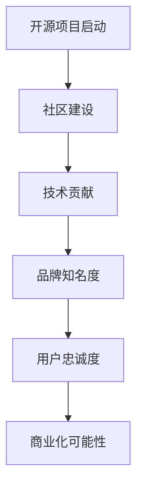

                 

### 撰写《开源项目的品牌建设：从技术到商业认可》

**文章标题**：开源项目的品牌建设：从技术到商业认可

**关键词**：开源项目，品牌建设，技术质量，商业合作，市场竞争

**摘要**：
本文将探讨开源项目品牌建设的理论基础与实践策略，从技术角度出发，分析品牌建设的关键要素、技术路线图、开源模式与社区建设，并从商业视角解读商业品牌建设与开源项目的结合，以及商业合作与市场竞争的策略。通过详细解析开源项目品牌建设的案例，总结最佳实践，为开源项目提供全面而深入的品牌建设指南。

---

## 第一部分：品牌建设理论基础

### 第1章：开源项目品牌概述

#### 1.1 开源项目与品牌的关系

开源项目与品牌建设之间存在密切的联系。品牌是项目在市场中独特身份的象征，它能够提升项目的知名度和用户忠诚度。而开源项目通过开放源代码和社区合作，建立了自身的品牌形象，这不仅有助于吸引更多贡献者，也为项目的持续发展提供了动力。

**Mermaid 流程图**：

#### 1.2 开源项目品牌的定义与重要性

开源项目品牌是指项目在开源社区和市场中建立的声誉和形象。它不仅仅是项目名称和标志，更包含了项目的质量、稳定性、用户满意度等多个方面。一个强大的品牌能够提升项目的竞争力，吸引更多用户和贡献者，从而推动项目的长期发展。

**开源项目品牌的概念解析**：
- **品牌认知**：项目在用户中的认知度和知名度。
- **品牌信任**：用户对项目质量和可靠性的信任。
- **品牌忠诚**：用户对项目的持续支持和贡献。

#### 1.3 开源项目品牌建设的挑战与机遇

**品牌建设面临的挑战**：
- **技术复杂度**：开源项目通常涉及复杂的技术栈，品牌建设需要在技术细节上保持一致性。
- **市场饱和**：开源市场中的竞争激烈，新项目需要独特的定位和优势来脱颖而出。

**品牌建设的机遇与策略**：
- **社区力量**：强大的社区可以为项目提供持续的支持和反馈，有助于品牌建设。
- **技术创新**：不断的技术创新可以为项目带来新的活力和用户基础。

---

### 第2章：品牌建设核心要素

#### 2.1 品牌定位

**品牌定位的概念与重要性**：
品牌定位是指项目在市场中的独特位置和目标用户群体的确定。准确的品牌定位可以帮助项目在竞争激烈的市场中找到自己的立足点，提高用户识别度和忠诚度。

**品牌定位的制定方法与案例分析**：
- **目标市场分析**：确定项目的目标用户群体和市场机会。
- **竞争对手分析**：分析竞争对手的优势和劣势，确定项目差异化的定位。

**案例**：GitHub 的品牌定位是基于其强大的社区和代码托管功能，定位于开发者和项目管理者，通过打造一个开放、高效的开发平台，赢得了广泛的市场认可。

#### 2.2 品牌视觉识别系统

**品牌视觉识别系统的构成**：
品牌视觉识别系统包括项目名称、标志、色彩方案、字体等视觉元素，这些元素共同构成了项目的视觉语言，为用户提供了直观的品牌体验。

**品牌视觉设计的基本原则与案例**：
- **一致性**：确保所有视觉元素在项目中保持一致。
- **简洁性**：设计简洁、易于识别的视觉元素。

**案例**：GitLab 的品牌视觉设计以蓝色为主色调，标志简洁大方，传达了专业、可靠的品牌形象。

#### 2.3 品牌口碑管理

**品牌口碑的重要性**：
口碑是品牌建设的重要组成部分，它反映了用户对项目的满意度和信任度。良好的口碑可以提升品牌形象，吸引更多用户和贡献者。

**口碑管理的策略与技巧**：
- **积极倾听**：通过社交媒体、用户反馈等渠道了解用户需求和反馈。
- **及时响应**：对用户的问题和投诉给予及时、专业的回应。

#### 2.4 品牌价值观与使命

**品牌价值观的定义与作用**：
品牌价值观是项目的核心价值观和信念，它体现了项目的文化和管理理念。品牌价值观可以帮助项目团队保持一致的行为准则，提升团队凝聚力。

**品牌使命的制定与传播**：
品牌使命是指项目存在的目的和意义，它为项目的发展提供了方向和动力。品牌使命需要通过多种渠道进行传播，让用户和贡献者了解并认同。

---

### 第3章：品牌建设策略

#### 3.1 品牌建设目标设定

**品牌建设目标的制定原则**：
- **可行性**：目标需要具有可实现性，避免过于理想化。
- **具体性**：目标需要具体明确，可量化和评估。

**品牌建设目标的具体实施路径**：
- **短期目标**：设定具体的里程碑和时间节点，如提高用户增长率、增加贡献者数量等。
- **长期目标**：明确项目的愿景和长期发展方向，如成为特定领域的领导品牌等。

#### 3.2 品牌传播策略

**品牌传播渠道的选择**：
- **线上渠道**：如社交媒体、博客、电子邮件等。
- **线下渠道**：如行业会议、展览、研讨会等。

**品牌传播的技巧与方法**：
- **内容营销**：通过高质量的内容吸引和留住用户。
- **社区互动**：积极参与开源社区，建立良好的用户关系。

#### 3.3 社区建设与管理

**开源项目社区建设的重要性**：
社区是开源项目发展的基石，它不仅提供了技术支持和知识分享，还帮助项目建立了品牌声誉。

**社区建设的策略与实践**：
- **用户参与**：鼓励用户参与项目决策和技术讨论。
- **内容建设**：提供高质量的技术文档、教程和案例。

#### 3.4 品牌合作与联动

**品牌合作的方式与策略**：
- **技术合作**：与其他开源项目或企业合作，共享技术资源。
- **市场合作**：共同举办活动、推广项目，扩大品牌影响力。

**品牌联动与协同效应**：
通过品牌合作，实现资源共享和优势互补，提升项目的整体品牌价值。

---

## 第二部分：从技术角度进行品牌建设

### 第4章：技术质量与品牌建设

#### 4.1 技术质量标准

**技术质量标准的内容与制定**：
技术质量标准包括代码质量、性能、安全等多个方面。制定标准需要综合考虑项目的目标用户和技术特点。

**技术质量标准在品牌建设中的应用**：
技术质量标准有助于提升项目的可靠性和用户满意度，从而增强品牌形象。

#### 4.2 代码质量与维护

**代码质量的重要性**：
高质量的代码是项目稳定运行的基础，它能够提高开发效率和降低维护成本。

**代码维护的方法与技巧**：
- **持续集成**：通过自动化测试和持续集成，确保代码质量。
- **代码审查**：定期进行代码审查，发现和修复潜在问题。

#### 4.3 技术文档与资料

**技术文档的价值**：
技术文档是项目知识传递的重要工具，它能够帮助用户更好地理解和使用项目。

**技术资料的整理与传播**：
- **文档标准化**：确保文档结构清晰、内容准确。
- **文档维护**：定期更新文档，保持其时效性和准确性。

#### 4.4 技术贡献与社区参与

**技术贡献的意义**：
技术贡献是开源项目发展的重要驱动力，它能够提升项目的质量和技术实力。

**社区参与的方式与策略**：
- **贡献指南**：为贡献者提供清晰的贡献指南和流程。
- **激励机制**：通过奖励和认可，鼓励用户参与贡献。

---

### 第5章：技术路线图与品牌定位

#### 5.1 技术路线图概述

**技术路线图的概念与作用**：
技术路线图是项目技术发展方向的规划，它能够帮助项目团队和用户明确项目的未来发展方向。

**技术路线图的制定方法**：
- **需求分析**：分析用户需求和市场趋势。
- **技术评估**：评估现有技术能力和未来技术发展可能性。

#### 5.2 技术路线图制定方法

**技术趋势分析**：
通过分析当前和未来的技术趋势，制定适应市场需求的技术路线图。

**技术路线图与品牌定位的关联**：
技术路线图与品牌定位密切相关，它能够为项目的品牌建设提供明确的技术方向和战略支持。

#### 5.3 技术路线图与品牌建设的结合

**技术路线图在品牌建设中的应用**：
技术路线图可以帮助项目团队和用户了解项目的未来发展，增强品牌信任和用户忠诚度。

**技术路线图与品牌价值的提升**：
通过清晰的技术路线图，项目可以更好地展示其技术创新和长期发展的能力，从而提升品牌价值。

#### 5.4 技术趋势分析

**当前技术趋势分析**：
分析当前热门技术趋势，如云计算、人工智能、区块链等，为项目提供技术发展建议。

**未来技术趋势预测**：
预测未来技术发展趋势，为项目提供长期的技术规划和支持。

---

### 第6章：开源项目开源模式与品牌建设

#### 6.1 开源许可证选择

**开源许可证的种类与特点**：
- **GPL**：保证自由软件的传播和修改，但衍生作品也必须开源。
- **Apache**：允许商业用途，但不强制要求衍生作品开源。

**开源许可证在品牌建设中的作用**：
开源许可证的选择会影响项目的开源模式和社区合作，进而影响项目的品牌形象和用户信任度。

#### 6.2 开源模式与社区建设

**开源模式概述**：
开源模式是指项目在开源过程中采用的具体策略和方法，包括代码开源、文档开源、社区参与等。

**社区建设的重要性与策略**：
社区是开源项目发展的基石，通过有效的社区建设，可以增强项目的活力和品牌影响力。

#### 6.3 开源项目的商业化策略

**开源项目的商业化路径**：
- **直接商业化**：通过提供付费服务，如订阅、定制开发等。
- **间接商业化**：通过品牌影响力，吸引企业合作伙伴，实现商业合作和推广。

**商业化策略在品牌建设中的应用**：
商业化策略可以为项目带来稳定的收入，支持项目的长期发展，并增强品牌价值。

#### 6.4 开源项目品牌建设与法律合规

**开源项目品牌建设中的法律问题**：
开源项目在品牌建设中需要关注版权、商标、专利等法律问题，确保项目的合法性和合规性。

**法律合规在品牌建设中的重要性**：
法律合规是开源项目品牌建设的基础，它能够保障项目的长期发展和用户的合法权益。

---

### 第7章：技术社区与品牌建设

#### 7.1 技术社区建设的重要性

**技术社区的定义与作用**：
技术社区是围绕项目技术主题的在线交流平台，它为用户提供技术支持、知识分享和社区互动的空间。

**技术社区在品牌建设中的重要性**：
技术社区是开源项目品牌建设的重要渠道，它能够增强用户粘性，提升项目影响力。

#### 7.2 技术社区建设策略

**技术社区建设的方法与步骤**：
- **定位和规划**：明确社区的目标和功能。
- **平台选择**：选择合适的社区平台和工具。
- **内容建设**：提供高质量的内容，吸引和留住用户。

**技术社区管理的策略与实践**：
- **用户参与**：鼓励用户参与社区活动，提供技术支持和反馈。
- **社区治理**：建立有效的社区治理机制，维护社区秩序。

#### 7.3 技术社区管理实践

**技术社区管理的挑战**：
- **用户管理**：如何平衡用户参与和管理社区秩序。
- **内容管理**：如何确保社区内容的质量和合规性。

**技术社区管理的最佳实践**：
- **积极倾听**：倾听用户需求，及时响应。
- **透明沟通**：公开透明的社区管理，增强用户信任。

#### 7.4 技术社区与品牌建设的双赢模式

**技术社区与品牌建设的协同效应**：
技术社区和品牌建设相互促进，共同提升项目的价值。

**双赢模式的具体实施路径**：
- **用户参与**：通过用户参与，增强品牌影响力。
- **品牌推广**：通过品牌推广，吸引更多用户和贡献者。

---

## 第三部分：商业视角的品牌建设

### 第8章：商业品牌建设与开源项目

#### 8.1 商业品牌建设概述

**商业品牌建设的基本概念**：
商业品牌建设是指企业通过一系列策略和活动，提升自身在市场中的知名度和品牌形象。

**商业品牌建设的重要性**：
商业品牌建设能够提升企业的市场竞争力，吸引更多用户和合作伙伴，为企业的长期发展提供支持。

#### 8.2 商业品牌建设与开源项目的结合

**商业品牌建设在开源项目中的应用**：
商业品牌建设在开源项目中的应用包括品牌定位、视觉识别系统、用户口碑管理等方面。

**开源项目在商业品牌建设中的优势**：
开源项目通过开放源代码和社区合作，能够快速提升品牌知名度，增强用户信任度。

#### 8.3 商业品牌建设策略

**商业品牌建设的目标与路径**：
- **目标**：明确品牌建设的目标，如提升市场份额、增强用户忠诚度等。
- **路径**：制定具体的品牌建设策略和行动计划。

**商业品牌建设的策略与方法**：
- **内容营销**：通过高质量的内容传播品牌价值观。
- **社交媒体**：利用社交媒体平台提升品牌影响力。

#### 8.4 商业品牌建设的案例分析

**成功案例的剖析**：
分析成功案例中的品牌建设策略和方法，提取可借鉴的经验。

**失败案例的反思**：
反思失败案例中的问题，避免在品牌建设中犯同样的错误。

---

### 第9章：商业合作与品牌建设

#### 9.1 商业合作方式与策略

**商业合作的类型与方式**：
- **技术合作**：与其他企业或开源项目合作，共享技术资源。
- **市场合作**：共同推广项目，扩大品牌影响力。

**商业合作的策略与技巧**：
- **双赢合作**：确保合作双方都能获得利益。
- **长期合作**：建立长期稳定的合作关系，共同发展。

#### 9.2 商业合作中的品牌保护

**品牌保护的重要性**：
品牌保护是商业合作中的关键环节，它能够防止品牌被滥用或损害。

**品牌保护的策略与措施**：
- **合作协议**：明确品牌使用和保护的条款。
- **法律保护**：通过法律手段保护品牌权益。

#### 9.3 商业合作与品牌价值的提升

**商业合作对品牌价值的影响**：
商业合作能够提升品牌价值，增强市场竞争力。

**提升品牌价值的方法与实例**：
- **资源整合**：通过合作整合资源，提升项目的整体实力。
- **品牌推广**：通过合作活动提升品牌知名度。

#### 9.4 商业合作案例解析

**具体案例的详细解析**：
分析商业合作的具体案例，探讨成功的原因和经验。

**案例中的成功与不足**：
总结案例中的成功经验和不足之处，为其他项目提供借鉴。

---

### 第10章：品牌建设与市场竞争

#### 10.1 品牌竞争环境分析

**品牌竞争环境的现状与趋势**：
分析当前市场中的品牌竞争环境，了解竞争对手的动态和趋势。

**品牌竞争策略的分析方法**：
- **SWOT分析**：评估项目的优势、劣势、机会和威胁。
- **市场定位**：确定项目的市场定位和目标用户。

#### 10.2 品牌定位与差异化策略

**品牌定位的重要性**：
品牌定位是项目在市场竞争中的立足点，它能够帮助项目找到独特的市场定位。

**差异化策略的实施方法**：
- **技术创新**：通过技术创新，实现与竞争对手的差异化。
- **用户体验**：优化用户体验，提升用户满意度。

#### 10.3 品牌竞争中的技术创新

**技术创新在品牌竞争中的作用**：
技术创新是提升品牌竞争力和市场占有率的关键因素。

**技术创新的实践案例**：
分析成功案例中的技术创新实践，探讨其对品牌竞争力的提升作用。

#### 10.4 品牌建设与市场竞争的平衡

**品牌建设与市场竞争的关系**：
品牌建设与市场竞争相互影响，需要找到平衡点。

**平衡竞争与品牌建设的策略**：
- **品牌保护**：在竞争激烈的市场中保护品牌权益。
- **持续创新**：通过持续创新，保持品牌竞争力。

---

## 附录

### 附录 A：开源项目品牌建设工具与资源

#### A.1 开源项目品牌建设工具介绍

**常用工具的介绍与使用**：
介绍常用的开源项目品牌建设工具，如GitHub、GitLab、Twitter等，并展示其使用方法。

**工具在品牌建设中的应用案例**：
分析工具在实际品牌建设中的应用案例，探讨其对品牌建设的影响。

#### A.2 品牌建设资源获取渠道

**资源的类型与获取途径**：
介绍品牌建设所需资源的类型，如设计素材、教程、案例等，并说明获取途径。

**获取资源的技巧与方法**：
分享获取资源的技巧和方法，如搜索引擎、社交媒体、专业网站等。

#### A.3 开源项目品牌建设最佳实践总结

**最佳实践的内容与意义**：
总结开源项目品牌建设的最佳实践，探讨其内容和意义。

**实践案例的总结与启示**：
分析实践案例，提取成功经验，为其他项目提供启示。

#### A.4 开源项目品牌建设案例分享

**成功案例的分享与交流**：
分享成功的开源项目品牌建设案例，提供详细的实施过程和经验。

**案例中的经验与教训**：
总结案例中的成功经验和教训，为其他项目提供参考。

### 附录 B：常见开源项目品牌建设问题解答

#### B.1 开源项目品牌建设常见问题

**问题类型与原因分析**：
分析常见品牌建设问题，如品牌定位不清、社区管理不善等，并探讨原因。

**问题解决的方法与建议**：
提供解决问题的方法和建议，如调整品牌定位、加强社区管理等。

#### B.2 开源项目品牌建设策略与执行难点

**策略制定与执行中的难点**：
探讨品牌建设策略制定和执行中面临的难点，如资源不足、时间紧张等。

**解决难点的方法与策略**：
提供解决难点的方法和策略，如优化资源利用、制定详细的执行计划等。

#### B.3 开源项目品牌建设成效评估方法

**成效评估的指标与方法**：
介绍品牌建设成效评估的指标和方法，如用户满意度、市场份额等。

**评估结果的应用与反馈**：
探讨评估结果的应用和反馈机制，以持续改进品牌建设策略。

#### B.4 开源项目品牌建设案例解析与启示

**具体案例的详细解析**：
分析具体案例，详细解析其品牌建设过程和成效。

**案例中的成功经验与教训**：
总结案例中的成功经验和教训，为其他项目提供参考。

---

**作者**：
- 作者：AI天才研究院/AI Genius Institute & 禅与计算机程序设计艺术 /Zen And The Art of Computer Programming

---

在撰写这篇文章的过程中，我们将使用以下步骤进行深入分析和思考：

1. **概念阐述**：对于每个章节和节标题，我们将首先明确核心概念，并进行详细的阐述，确保读者能够理解每个概念的含义和作用。
2. **实践案例**：在每个章节的结尾，我们将结合实际的开源项目案例，展示品牌建设的实践效果，并深入分析其中的成功经验和教训。
3. **逻辑推理**：我们将使用逻辑推理的方法，将不同章节和节标题之间的联系进行梳理，确保文章的整体结构严谨、逻辑清晰。
4. **问题解答**：在附录部分，我们将针对开源项目品牌建设过程中常见的疑问和难题，提供详细的解答和策略，帮助读者更好地理解和应用品牌建设的方法。

通过这种逐步分析、深入思考的方式，我们将为读者呈现一篇既具有理论深度，又具有实践价值的开源项目品牌建设指南。

