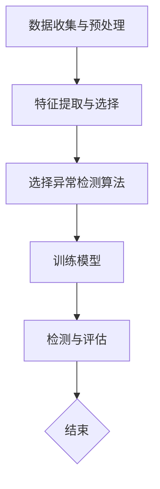
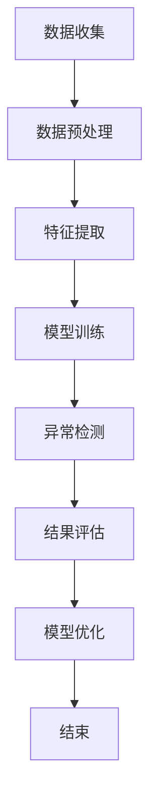

                 

### 文章标题：异常行为检测提升电商安全性

在电子商务迅速发展的今天，如何确保交易的安全已成为一个不可忽视的重要课题。随着网络攻击手段的不断翻新，电商平台的欺诈行为也日益增多，这不仅损害了消费者的利益，也影响了电商平台的声誉和盈利。因此，如何通过技术手段有效识别和防范这些异常行为，成为提升电商安全性的关键所在。本文旨在探讨异常行为检测技术在电商安全中的应用，通过一步步的分析和推理，揭示其背后的核心概念、技术原理以及实际应用中的关键点，帮助读者理解如何构建一个安全、可靠的电商平台。

### 文章关键词

- 异常行为检测
- 电商安全性
- 数据分析
- 机器学习
- 欺诈防范
- 安全算法

### 文章摘要

本文首先介绍了电商行业在快速发展中面临的安全挑战，强调了异常行为检测在保障电商安全中的重要性。接着，深入探讨了异常行为检测的基本概念、原理和技术框架，包括数据收集与预处理、特征提取与选择、异常检测算法等。随后，本文通过核心算法的原理讲解，结合实际项目案例，详细阐述了异常行为检测在电商安全中的应用。最后，对全文内容进行了总结和展望，提出了未来电商安全技术的发展趋势和方向。

## 第一部分：背景与核心概念

### 第1章：电商安全性面临的挑战

#### 1.1 电商行业的快速发展和安全问题

电子商务作为数字经济的重要组成部分，近年来呈现出爆发式增长。据统计，全球电子商务市场规模在2021年已突破4万亿美元，预计到2025年将达到6万亿美元。电商行业的快速发展不仅改变了消费者的购物方式，也推动了整个零售业的变革。然而，伴随着电商业务的繁荣，安全问题也逐渐凸显。

首先，网络攻击手段的日益复杂化给电商系统带来了巨大威胁。黑客攻击、网络钓鱼、恶意软件等网络犯罪活动层出不穷，使得电商平台面临巨大的安全隐患。根据一份报告显示，2021年全球范围内的网络攻击事件同比增长了20%，电商行业成为攻击者的重要目标之一。

其次，消费者隐私泄露问题也日益严重。在电商交易过程中，消费者需要提供大量的个人信息，包括姓名、地址、电话号码、支付信息等。如果这些信息被黑客窃取，将严重威胁到消费者的财产安全和个人隐私。据统计，全球范围内约有90%的电商企业曾遭受过数据泄露事件，导致消费者信任度下降。

#### 1.2 异常行为检测的重要性

在这种背景下，异常行为检测成为保障电商安全的关键手段。异常行为检测是一种通过分析用户行为模式，识别出潜在的欺诈行为或其他安全风险的技术。在电商领域，异常行为检测的重要性体现在以下几个方面：

1. **预防欺诈行为**：通过实时监测用户行为，异常行为检测可以及时发现并阻止欺诈行为，如账号盗用、虚假交易、洗钱等，从而降低平台的安全风险。

2. **提高交易透明度**：异常行为检测可以提供详尽的行为分析报告，帮助电商企业了解用户行为特征，优化用户体验，提高交易透明度。

3. **提升消费者信任**：通过有效的异常行为检测，电商平台可以保障用户交易安全，提高用户对平台的信任度，进而促进业务增长。

4. **降低运营成本**：异常行为检测可以自动化识别和处理潜在的安全风险，减少人工审核的工作量，降低运营成本。

总之，异常行为检测不仅是保障电商平台安全的重要手段，也是提升用户体验、增强消费者信任、降低运营成本的重要工具。在电商行业日益复杂的网络安全环境中，异常行为检测技术的重要性愈发凸显。

#### 1.3 异常行为检测的基本概念

异常行为检测（Anomaly Detection）是一种通过分析数据集，识别出与正常行为模式显著偏离的异常数据点或事件的技术。在电商领域，异常行为检测主要用于识别用户行为中的异常活动，如欺诈交易、恶意评论、刷单行为等。

**定义**：异常行为检测是一种监控和识别数据集中异常行为的过程。这些异常行为可能是由于欺诈、系统故障、操作错误或其他非预期的原因引起的。

**分类**：根据检测对象的不同，异常行为检测可以分为以下几种类型：

1. **点异常检测**：识别数据集中与大多数数据点显著不同的单个数据点。例如，在用户交易记录中，识别出与用户正常交易行为明显不符的单笔大额交易。
   
2. **区间异常检测**：识别在某个时间区间内异常的数据点。例如，在一天的交易记录中，识别出某个时间段内交易量异常增多的时段。

3. **集体异常检测**：识别一组数据点中的异常模式。例如，在用户评论中，识别出多个用户针对同一商品进行恶意评论的行为。

**应用**：在电商领域，异常行为检测的具体应用包括：

- **用户行为分析**：通过监控用户的登录、浏览、购买等行为，识别出异常行为，如频繁登录失败、异常购买模式等，从而预防账号盗用和欺诈行为。
- **交易监控**：实时监测交易过程，识别异常交易，如大额交易、跨境交易等，预防洗钱、欺诈等违法行为。
- **评论管理**：识别异常评论行为，如刷单评论、恶意评论等，维护平台口碑和用户信任。
- **供应链监控**：监控物流环节中的异常行为，如延迟发货、货物丢失等，提高供应链管理效率。

总之，异常行为检测在电商安全中扮演着至关重要的角色，通过实时监控和分析用户行为，可以帮助电商平台有效识别和防范各种安全风险，提升整体安全性。

#### 1.4 异常行为检测的基本原理与方法

异常行为检测的核心原理是通过对大量数据进行分析，识别出与正常行为模式显著偏离的数据点或事件。其基本方法包括以下几方面：

1. **统计分析法**：
   - **均值-方差法**：基于统计学原理，计算数据集的均值和方差，识别出与均值和方差显著偏离的数据点。具体公式为：
     $$
     \text{方差} = \frac{\sum_{i=1}^{n}(x_i - \mu)^2}{n-1}
     $$
     其中，$x_i$为第$i$个数据点，$\mu$为均值。
   - **箱线图法**：通过绘制数据的箱线图，识别出位于上下四分位数之外的数据点，这些数据点被认为是异常值。

2. **机器学习方法**：
   - **监督学习**：通过训练有标签的数据集，建立异常检测模型，对新数据进行预测。常用的算法包括支持向量机（SVM）、决策树、随机森林等。
   - **无监督学习**：直接对无标签的数据集进行分析，自动发现异常模式。常用的算法包括K-均值聚类、DBSCAN、局部异常因子（LOF）等。

3. **基于规则的检测方法**：
   - **规则库法**：通过定义一系列规则，识别出违反这些规则的行为。例如，在电商交易中，可以设置规则，如果单笔交易金额超过一定阈值，则视为异常交易。
   - **模糊规则法**：利用模糊逻辑处理不确定性和模糊性，识别出满足一定条件的异常行为。

4. **基于神经网络的检测方法**：
   - **深度学习方法**：利用深度神经网络（如卷积神经网络、循环神经网络等）对大量数据进行训练，自动提取特征，识别异常行为。

5. **混合方法**：
   - **多方法融合**：结合多种检测方法，取长补短，提高检测效果。例如，先使用统计分析法筛选出初步的异常候选数据，再使用机器学习方法进行精细检测。

**算法实现**：以下是一个简单的基于K-最近邻算法的异常检测实现示例：

```python
from sklearn.neighbors import LocalOutlierFactor
from sklearn.datasets import make_blobs
import numpy as np

# 创建一个包含正常数据点和异常数据点的数据集
X, y = make_blobs(n_samples=100, centers=2, n_features=2, cluster_std=0.4, random_state=0)

# 在数据集末尾添加异常点
X = np.concatenate([X, [[0, 0], [10, 10]]])

# 使用K-最近邻算法进行异常检测
lof = LocalOutlierFactor(n_neighbors=20)
y_pred = lof.fit_predict(X)

# 输出异常数据点的索引
print("异常数据点索引：", np.where(y_pred == -1))
```

**效果评估**：异常行为检测的效果可以通过以下指标进行评估：

- **准确率（Accuracy）**：正确识别异常数据点的比例。
- **召回率（Recall）**：识别出所有异常数据点的比例。
- **F1分数（F1 Score）**：准确率和召回率的调和平均数。

```python
from sklearn.metrics import classification_report

# 输出分类报告
print(classification_report(y, y_pred))
```

通过以上方法，电商企业可以构建一套完善的异常行为检测系统，实时监控用户行为，识别和防范潜在的安全风险，提升电商平台的整体安全性。

#### 1.5 异常检测在电商安全中的应用

异常行为检测在电商安全中的应用具有广泛且深远的影响，具体体现在以下几个方面：

**用户身份验证**：异常行为检测技术可以有效提高用户身份验证的准确性。通过对用户登录、注册、密码重置等行为的监控，识别出异常登录尝试、虚假注册账号等行为，从而有效预防账号盗用。例如，通过分析用户登录的IP地址、设备信息、登录时间等特征，可以判断登录行为是否与用户历史行为一致，从而识别出潜在的欺诈行为。

**交易监控**：在交易环节，异常行为检测可以帮助电商企业实时监控交易过程，识别出异常交易行为。例如，通过分析交易金额、交易频率、交易时间等特征，可以识别出大额交易、跨境交易、异常交易时段等异常行为，从而预防洗钱、欺诈等违法行为。此外，异常行为检测还可以协助平台对高风险交易进行预警，降低交易风险。

**评论管理**：异常行为检测在评论管理中的应用同样重要。通过监控用户评论行为，识别出异常评论，如刷单评论、恶意评论等，可以有效维护电商平台口碑，提升消费者信任。例如，通过分析评论内容、评论时间间隔、评论者行为等特征，可以识别出刷单评论行为，从而采取相应的处理措施。

**供应链监控**：在供应链管理中，异常行为检测可以帮助电商企业监控物流环节中的异常行为。例如，通过分析物流信息、发货时间、运输状态等特征，可以识别出延迟发货、货物丢失等异常情况，从而提高供应链管理效率，降低运营成本。

**案例分析**：以某大型电商平台为例，该平台通过引入异常行为检测技术，对用户行为、交易行为、评论行为等进行实时监控和分析。具体应用场景包括：

- 用户登录监控：识别出异常登录行为，如频繁登录失败、异地登录等，从而预防账号盗用。
- 交易监控：识别出异常交易行为，如大额交易、跨境交易等，从而预防洗钱、欺诈等违法行为。
- 评论管理：识别出异常评论行为，如刷单评论、恶意评论等，从而维护平台口碑。
- 物流监控：识别出物流环节中的异常行为，如延迟发货、货物丢失等，从而提高供应链管理效率。

通过以上应用，该电商平台显著降低了安全风险，提升了用户体验和信任度，实现了业务的安全、稳定运行。

总之，异常行为检测在电商安全中的应用具有广泛的前景和重要的实际价值。通过实时监控和分析用户行为，电商企业可以有效识别和防范各种安全风险，提升整体安全性，为消费者提供更加安全、可靠的购物环境。

#### 1.6 异常行为检测的技术框架

异常行为检测的技术框架主要包括数据收集与预处理、特征提取与选择、异常检测算法等几个关键环节，这些环节紧密相连，共同构成了一个完整的异常检测系统。

**数据收集与预处理**：这是异常行为检测的基础环节。首先，需要收集各种来源的数据，包括用户行为数据、交易数据、评论数据等。这些数据可能来自于数据库、日志文件、API接口等。数据收集后，需要进行预处理，包括数据清洗、去重、填补缺失值等操作，以确保数据的准确性和一致性。

**特征提取与选择**：数据预处理完成后，需要对数据进行特征提取，将原始数据转换为一组具有区分性的特征向量。特征提取方法包括统计特征、文本特征、图像特征等。选择合适的特征集是异常行为检测的关键，特征集的质量直接影响检测效果。常用的特征选择方法有信息增益、卡方检验、互信息等。

**异常检测算法**：在特征提取后，使用异常检测算法对特征向量进行分析，识别出异常行为。异常检测算法可以分为统计方法、机器学习方法、神经网络方法等。统计方法如均值-方差法、箱线图法等，适用于处理简单、结构化的数据。机器学习方法如K-最近邻、支持向量机、随机森林等，适用于复杂、高维的数据。神经网络方法如深度学习、卷积神经网络、循环神经网络等，适用于处理大规模、非线性数据。

**异常检测流程**：一个典型的异常检测流程可以概括为以下几个步骤：

1. 数据收集与预处理：收集相关数据，进行数据清洗和预处理。
2. 特征提取与选择：提取数据中的特征，进行特征选择，构建特征向量。
3. 选择异常检测算法：根据数据特点选择合适的异常检测算法。
4. 训练模型：使用有标签的数据集训练异常检测模型。
5. 检测与评估：对新的数据集进行异常检测，评估模型性能。

**Mermaid流程图**：以下是一个简化的异常检测流程的Mermaid流程图表示：



通过这个技术框架，电商企业可以构建一个高效的异常行为检测系统，实时监控用户行为，识别和防范潜在的安全风险，提升电商平台的整体安全性。

### 第2章：异常行为检测的基本概念

#### 2.1 异常行为的定义与分类

异常行为是指那些不符合正常行为模式或预期规则的行为。在电子商务领域，异常行为通常表现为与用户历史行为、其他用户行为或系统预期不一致的活动。具体来说，异常行为可以分为以下几类：

1. **欺诈行为**：欺诈行为是最常见的异常行为之一，包括账号盗用、虚假交易、洗钱、恶意评论等。例如，一个用户在短时间内进行多次大额交易，或使用同一张银行卡进行大量交易，这些行为都可能被视为欺诈行为。

2. **恶意行为**：恶意行为是指用户故意进行的破坏性行为，如恶意评论、刷单、虚假评价等。这些行为不仅损害了平台的声誉，也影响了其他用户的购物体验。

3. **系统故障**：系统故障导致的异常行为包括数据丢失、服务器宕机、网络中断等。这些异常行为通常是由于系统问题或外部攻击引起的，会导致用户体验下降，甚至影响平台的正常运营。

4. **用户误操作**：用户误操作是指由于用户自身原因引起的异常行为，如误删除订单、误输入地址等。这类异常行为虽然不是恶意行为，但也会对用户体验和平台运营造成一定的影响。

#### 2.2 异常检测的基本原理与方法

异常检测（Anomaly Detection）是一种通过分析数据，识别出与正常行为模式显著偏离的数据点或事件的技术。其基本原理可以分为以下几个步骤：

1. **数据收集**：首先，需要收集大量的数据，这些数据可以是用户行为数据、交易数据、评论数据等。数据收集的过程通常涉及多种数据源，如数据库、日志文件、API接口等。

2. **数据预处理**：收集到的数据通常需要进行预处理，包括数据清洗、去重、填补缺失值等操作。这一步骤的目的是确保数据的准确性和一致性，为后续的异常检测提供高质量的数据基础。

3. **特征提取**：在数据预处理完成后，需要对数据进行特征提取，将原始数据转换为一组具有区分性的特征向量。特征提取的方法包括统计特征、文本特征、图像特征等。特征提取的质量直接影响异常检测的效果。

4. **模型训练**：使用有标签的数据集对异常检测模型进行训练。训练过程中，模型会学习如何将正常数据与异常数据区分开来。常用的算法包括统计方法、机器学习方法、神经网络方法等。

5. **异常检测**：在训练好的模型基础上，对新的数据进行异常检测。检测过程中，模型会评估每个数据点是否与正常行为模式显著偏离，从而识别出异常行为。

6. **结果评估**：对异常检测的结果进行评估，包括准确率、召回率、F1分数等指标。通过评估结果，可以进一步优化模型，提高异常检测的准确性。

#### 2.3 异常检测在电商安全中的应用

在电商安全中，异常检测技术发挥着至关重要的作用。以下是其主要应用场景：

1. **用户行为分析**：通过异常检测技术，可以实时监控用户的登录、浏览、购买等行为，识别出异常行为，如频繁登录失败、异常购买模式等。这有助于预防账号盗用、欺诈交易等行为。

2. **交易监控**：在交易环节，异常检测技术可以识别出异常交易行为，如大额交易、跨境交易等。通过对交易金额、交易频率、交易时间等特征的监控，可以有效预防洗钱、欺诈等违法行为。

3. **评论管理**：异常检测技术可以识别出异常评论行为，如刷单评论、恶意评论等。通过分析评论内容、评论时间间隔、评论者行为等特征，可以维护平台口碑，提升用户体验。

4. **供应链监控**：在供应链管理中，异常检测技术可以监控物流环节中的异常行为，如延迟发货、货物丢失等。通过分析物流信息、发货时间、运输状态等特征，可以提高供应链管理效率。

5. **用户行为预测**：异常检测技术不仅可以识别异常行为，还可以预测潜在的用户行为。通过对用户行为的监控和分析，可以预测用户是否会进行购买、评论等行为，从而优化营销策略。

总之，异常检测技术在电商安全中的应用具有重要意义。通过实时监控和分析用户行为，可以识别和防范潜在的安全风险，提升电商平台的安全性、可靠性和用户体验。

### 第3章：异常行为检测的技术框架

#### 3.1 数据收集与预处理

数据收集与预处理是异常行为检测技术框架中的基础环节，直接关系到异常检测的效果。以下是这一环节的详细说明：

**数据来源**：数据收集可以从多个渠道获取，包括用户行为日志、交易记录、评论数据、网络日志等。这些数据可以来源于电商平台内部的数据库、外部数据源或第三方数据服务。

**数据收集方法**：
- **日志收集**：使用日志收集工具（如Logstash、Fluentd等）实时收集系统的日志数据，包括用户操作记录、错误记录等。
- **API调用**：通过电商平台提供的API接口，获取用户行为数据、交易数据等。
- **爬虫技术**：使用爬虫工具（如Scrapy、Python Requests库等）从公开网站或社交媒体收集用户评论数据。

**数据预处理步骤**：
- **数据清洗**：去除重复、无效或错误的数据，确保数据的一致性和准确性。例如，去除空值、填补缺失值、去除噪声数据等。
- **数据去重**：识别并去除重复的数据条目，确保数据集的唯一性。
- **特征工程**：根据业务需求，提取和构建具有区分性的特征。例如，对于用户行为数据，可以提取用户登录时间、登录频率、购买频率等特征。

**数据存储**：预处理后的数据通常存储在关系型数据库（如MySQL、PostgreSQL）或分布式数据存储系统（如Hadoop、Hive等）中，以便后续的异常检测和分析。

#### 3.2 特征提取与选择

特征提取与选择是异常行为检测中的关键环节，决定了模型对异常行为的识别能力。以下是这一环节的详细说明：

**特征提取方法**：
- **统计特征**：通过计算数据集的统计量（如均值、方差、中位数等）提取特征，适用于处理结构化数据。例如，对于用户交易数据，可以计算交易金额的均值和方差。
- **文本特征**：通过文本处理技术（如词频统计、TF-IDF、词嵌入等）提取特征，适用于处理文本数据。例如，对于用户评论，可以提取评论中出现的高频词和关键词。
- **图像特征**：通过计算机视觉技术（如卷积神经网络、特征提取算法等）提取图像特征，适用于处理图像数据。例如，对于用户上传的图片，可以提取图像的边缘特征、纹理特征等。

**特征选择方法**：
- **过滤式特征选择**：在特征提取后，根据特征的相关性、信息增益等指标筛选出有用的特征。常用的方法有信息增益、卡方检验、互信息等。
- **包裹式特征选择**：在特征提取前，将所有特征视为一个整体，通过迭代的方式选择最佳的特征子集。常用的算法有前进选择法、后退选择法、嵌入式方法等。
- **基于模型的特征选择**：使用机器学习模型对特征进行筛选，通过模型评估结果选择对预测任务贡献较大的特征。例如，使用随机森林算法评估特征的重要性。

**特征选择原则**：
- **代表性**：特征应能够充分反映数据的本质特征，具有一定的区分性。
- **简洁性**：特征数量应尽量少，避免冗余特征导致模型复杂度增加。
- **鲁棒性**：特征应能够应对数据中的噪声和异常值，具有较高的稳定性。

#### 3.3 异常检测算法概述

异常检测算法是异常行为检测技术框架的核心，决定了异常检测的效果和效率。以下是几种常用的异常检测算法及其基本原理：

1. **基于统计的方法**：
   - **均值-方差法**：计算数据集的均值和方差，识别出与均值和方差显著偏离的数据点。这种方法简单直观，适用于处理结构化数据。
   - **箱线图法**：通过绘制数据的箱线图，识别出位于上下四分位数之外的数据点。这种方法可以同时处理多维数据，但容易受到噪声的影响。

2. **基于机器学习的方法**：
   - **K-最近邻（KNN）算法**：基于距离度量，识别出与训练样本最近的K个邻居，通过邻居的标签判断当前数据点是否为异常。这种方法简单易实现，但对高维数据效果不佳。
   - **支持向量机（SVM）**：通过构建超平面，将正常数据和异常数据分离。这种方法适用于处理高维数据，但对异常样本的分布假设较强。
   - **随机森林（Random Forest）**：通过构建多棵决策树，结合预测结果进行投票，提高模型的泛化能力。这种方法可以处理高维数据，但对异常样本的分布假设较弱。

3. **基于聚类的方法**：
   - **K-均值聚类（K-means）**：通过迭代优化，将数据点分为K个簇，识别出不属于任何簇的数据点作为异常。这种方法简单高效，但对初始聚类中心敏感。
   - **DBSCAN（Density-Based Spatial Clustering of Applications with Noise）**：基于密度的聚类方法，可以识别出任意形状的簇，并能处理噪声和异常点。这种方法适用于处理大规模、高维数据。

4. **基于神经网络的方法**：
   - **深度学习**：通过多层神经网络，自动提取数据中的特征，识别出异常行为。这种方法适用于处理大规模、非线性数据，但对计算资源要求较高。

**算法选择原则**：
- **数据特性**：根据数据的特点（如数据量、维度、噪声水平等）选择合适的算法。
- **检测效果**：通过交叉验证等方法评估算法的检测效果，选择性能最优的算法。
- **计算效率**：根据计算资源限制，选择计算复杂度较低的算法。

通过合理选择和组合上述算法，电商企业可以构建一个高效的异常行为检测系统，实时监控用户行为，识别和防范潜在的安全风险，提升电商平台的整体安全性。

### 第4章：核心概念与联系

#### 4.1 异常检测与机器学习的关系

异常检测与机器学习有着密切的关系，两者相辅相成，共同构成了现代数据分析的重要工具。异常检测是机器学习中的一个重要分支，它利用机器学习算法的强大能力来识别数据中的异常行为。以下是异常检测与机器学习的几个关键联系：

1. **数据预处理**：在异常检测中，数据预处理是一个至关重要的环节。机器学习算法对数据的预处理要求较高，包括数据清洗、特征提取和特征选择等步骤。异常检测中的数据预处理方法与机器学习中的预处理方法基本一致，如去除空值、填补缺失值、标准化等。

2. **模型训练**：异常检测通常需要使用机器学习算法来训练模型。在训练过程中，机器学习算法学习正常数据与异常数据之间的特征差异，从而构建一个能够识别异常行为的模型。常用的算法包括K-最近邻（KNN）、支持向量机（SVM）、随机森林（Random Forest）等。

3. **评估与优化**：异常检测模型的性能评估与机器学习模型的评估方法类似，常用的评估指标包括准确率、召回率、F1分数等。通过交叉验证等方法，可以评估模型的检测效果，并针对评估结果进行优化和调整。

4. **泛化能力**：机器学习算法的泛化能力是异常检测成功的关键。一个优秀的异常检测模型不仅能够在训练数据上表现出良好的性能，还需要在未见过的数据上具有稳健的检测能力。通过调整模型参数、增加训练数据等方法，可以提高模型的泛化能力。

5. **实时监测**：异常检测通常需要在实时环境中进行监测，识别出新的异常行为。这与机器学习的在线学习（Online Learning）方法密切相关。在线学习算法能够在不断更新的数据集上进行模型更新和调整，从而实现实时异常检测。

#### 4.2 Mermaid 流程图展示异常检测流程

为了更直观地理解异常检测的流程，我们可以使用Mermaid流程图来展示其各个环节。以下是一个简化的异常检测流程的Mermaid表示：



**图解**：
- **数据收集**：从多个数据源收集原始数据，如用户行为数据、交易数据等。
- **数据预处理**：清洗和预处理原始数据，确保数据的质量和一致性。
- **特征提取**：从预处理后的数据中提取具有区分性的特征，为模型训练做准备。
- **模型训练**：使用有标签的数据集训练异常检测模型，学习正常行为与异常行为之间的特征差异。
- **异常检测**：使用训练好的模型对新的数据进行异常检测，识别出异常行为。
- **结果评估**：评估异常检测的效果，包括准确率、召回率等指标。
- **模型优化**：根据评估结果对模型进行优化和调整，以提高检测效果。
- **结束**：完成一轮异常检测流程，可以循环进行下一轮监测。

#### 4.3 异常检测中的关键概念联系

在异常检测中，几个关键概念紧密联系，共同构成了一个完整的异常检测系统。以下是这些概念之间的联系：

1. **异常行为**：异常行为是异常检测的目标对象，指那些与正常行为模式显著偏离的数据点或事件。异常行为可以是欺诈行为、恶意行为、系统故障等。

2. **特征**：特征是描述数据点属性或特征的数据。特征的选择和质量直接影响异常检测的效果。特征可以是统计特征、文本特征、图像特征等。

3. **模型**：模型是异常检测的核心，用于识别和预测异常行为。模型可以是统计模型、机器学习模型、神经网络模型等。

4. **算法**：算法是实现异常检测的数学或计算方法。常见的异常检测算法包括K-最近邻（KNN）、支持向量机（SVM）、随机森林（Random Forest）等。

5. **数据预处理**：数据预处理是异常检测的基础，包括数据清洗、特征提取、特征选择等步骤，确保数据的质量和一致性。

6. **评估**：评估是对异常检测模型性能的评估，常用的评估指标包括准确率、召回率、F1分数等。

7. **优化**：优化是根据评估结果对模型进行调整和改进，以提高异常检测的效果。

通过这些关键概念的联系，我们可以构建一个高效、可靠的异常检测系统，实时监控用户行为，识别和防范潜在的安全风险，提升电商平台的整体安全性。

### 第5章：数学模型和公式

#### 5.1 异常检测的数学模型

异常检测中的数学模型是识别和评估异常行为的核心。这些模型通过计算和比较数据点之间的相似性或差异性来确定是否为异常。以下是几种常见的数学模型及其公式：

**1. 均值-方差模型**

均值-方差模型是最基本的统计模型，用于识别离群点。其核心公式如下：

$$
\text{均值} (\mu) = \frac{1}{N} \sum_{i=1}^{N} x_i
$$

$$
\text{方差} (\sigma^2) = \frac{1}{N-1} \sum_{i=1}^{N} (x_i - \mu)^2
$$

其中，$x_i$ 是第 $i$ 个数据点，$N$ 是数据点的总数。如果一个数据点的值与均值的偏离超过一定的阈值（通常是方差的倍数），则该数据点被识别为异常。

**2. 箱线图模型**

箱线图模型通过计算数据的四分位数（Q1, Q2, Q3）来识别离群点。其核心公式如下：

$$
Q1 = \text{第一四分位数}
$$

$$
Q2 = \text{中位数}
$$

$$
Q3 = \text{第三四分位数}
$$

$$
\text{四分位距} = Q3 - Q1
$$

根据箱线图的定义，任何位于$[Q1 - 1.5 \times \text{四分位距}, Q3 + 1.5 \times \text{四分位距}]$范围之外的数据点都被视为异常。

**3. 距离度量模型**

距离度量模型使用距离函数来计算数据点之间的相似性或差异性。最常见的是欧几里得距离：

$$
d(x, y) = \sqrt{\sum_{i=1}^{n} (x_i - y_i)^2}
$$

其中，$x$ 和 $y$ 是两个数据点，$n$ 是数据点的维度。如果一个数据点到所有其他数据点的平均距离超过某个阈值，则该数据点被视为异常。

**4. 概率模型**

概率模型基于贝叶斯定理，通过计算数据点的概率分布来识别异常。例如，高斯分布模型可以表示如下：

$$
p(x|\theta) = \frac{1}{\sqrt{2\pi\sigma^2}} e^{-\frac{(x-\mu)^2}{2\sigma^2}}
$$

其中，$\mu$ 是均值，$\sigma$ 是标准差。如果一个数据点的概率低于某个阈值，则该数据点被视为异常。

#### 5.2 概率模型与统计方法

概率模型和统计方法是异常检测中的两个重要工具，它们各自有着不同的应用场景和优势。

**概率模型**

概率模型通过计算数据点的概率分布来识别异常，具有以下几个优点：

- **鲁棒性**：概率模型对异常值有较强的鲁棒性，可以很好地处理噪声和离群点。
- **灵活性**：概率模型可以适应不同类型的数据分布，如高斯分布、泊松分布等。
- **解释性**：概率模型提供了数据点的概率解释，有助于理解异常点的产生原因。

常见的概率模型包括高斯分布、泊松分布和贝叶斯网络等。高斯分布模型适用于连续型数据，而泊松分布模型适用于计数型数据。

**统计方法**

统计方法通过计算数据点的统计量（如均值、方差、四分位数等）来识别异常，具有以下几个优点：

- **简单直观**：统计方法简单直观，易于理解和实现。
- **高效快速**：统计方法计算速度快，适用于大规模数据的快速异常检测。
- **适用范围广**：统计方法可以适用于多种类型的数据，如数值型、类别型等。

常见的统计方法包括均值-方差法、箱线图法和四分位数法等。

**优缺点比较**

- **概率模型**：
  - 优点：鲁棒性强、灵活、解释性强。
  - 缺点：对异常值的检测可能不够敏感，对数据分布的假设较强。

- **统计方法**：
  - 优点：简单直观、高效快速、适用范围广。
  - 缺点：对噪声和离群点的处理能力较差，对数据分布的依赖性强。

在实际应用中，通常结合使用概率模型和统计方法，以发挥各自的优势，提高异常检测的准确性和鲁棒性。

#### 5.3 模型评估与优化方法

模型评估与优化是异常检测过程中的关键步骤，直接影响检测效果。以下介绍几种常用的模型评估方法和优化方法：

**1. 模型评估方法**

- **准确率（Accuracy）**：准确率是正确识别异常数据点的比例，计算公式为：

  $$
  \text{准确率} = \frac{\text{正确识别的异常数据点数}}{\text{总数据点数}}
  $$

  准确率反映了模型的整体性能，但有时会因数据不平衡而失效。

- **召回率（Recall）**：召回率是识别出所有异常数据点的比例，计算公式为：

  $$
  \text{召回率} = \frac{\text{正确识别的异常数据点数}}{\text{实际异常数据点数}}
  $$

  召回率反映了模型对异常数据的识别能力，但可能会误识别正常数据。

- **F1分数（F1 Score）**：F1分数是准确率和召回率的调和平均数，计算公式为：

  $$
  \text{F1分数} = 2 \times \frac{\text{准确率} \times \text{召回率}}{\text{准确率} + \text{召回率}}
  $$

  F1分数综合考虑了准确率和召回率，是评估模型性能的重要指标。

- **ROC曲线（Receiver Operating Characteristic Curve）**：ROC曲线通过计算不同阈值下的真阳性率和假阳性率，展示了模型的分类性能。曲线下面积（AUC）越大，模型性能越好。

**2. 模型优化方法**

- **交叉验证（Cross-Validation）**：交叉验证是一种评估模型性能的方法，通过将数据集分为多个子集，轮流使用这些子集进行训练和测试，以避免模型过拟合。常见的交叉验证方法有K折交叉验证、留一法交叉验证等。

- **参数调优（Hyperparameter Tuning）**：参数调优是调整模型参数以优化模型性能的过程。常用的调优方法包括网格搜索、贝叶斯优化等。通过调优，可以找到最优的参数组合，提高模型的准确性。

- **集成学习（Ensemble Learning）**：集成学习通过结合多个模型来提高整体性能。常见的集成学习方法有随机森林、堆叠（Stacking）、提升（Boosting）等。集成学习可以降低模型的方差，提高模型的泛化能力。

- **特征选择（Feature Selection）**：特征选择是选择对模型性能有显著贡献的特征的过程。通过特征选择，可以降低模型复杂度，提高模型效率。常用的特征选择方法有过滤式特征选择、包裹式特征选择、基于模型的特征选择等。

通过合理选择和优化模型评估与优化方法，可以显著提高异常检测模型的性能，提升电商平台的整体安全性。

### 第6章：核心算法原理讲解

#### 6.1 K-最近邻算法

K-最近邻（K-Nearest Neighbors，KNN）算法是一种简单且有效的机器学习算法，广泛应用于分类和回归任务中。在异常检测中，KNN算法通过计算数据点之间的相似性来确定其分类或异常性。

**基本原理**：

KNN算法的核心思想是：如果一个数据点在特征空间中的K个最近邻大部分属于同一类别，则该数据点也属于这个类别。对于异常检测，我们可以将“类别”替换为“正常”或“异常”。

**步骤**：

1. **选择K值**：首先需要选择一个合适的K值，K值决定了算法的复杂性和准确性。通常，K值的选择可以通过交叉验证等方法进行优化。

2. **计算距离**：对于新的数据点，计算其与训练集中所有数据点的距离。常用的距离度量包括欧几里得距离、曼哈顿距离、余弦相似度等。

3. **投票决策**：对于新的数据点，计算其K个最近邻的类别，如果大多数类别属于正常类别，则该数据点被视为正常；反之，如果大多数类别属于异常类别，则该数据点被视为异常。

**伪代码**：

```python
# 输入：训练集 X_train, Y_train，新数据点 X_test，K 值
# 输出：异常标签

def knn_predict(X_train, Y_train, X_test, K):
    distances = [distance(X_test, x) for x in X_train] # 计算距离
    nearest_neighbors = sorted(range(len(distances)), key=distances.__getitem__)[:K] # 选择K个最近邻
    
    # 投票决策
    majority_class = max(set(Y_train[neighbors]) for neighbors in nearest_neighbors)
    return majority_class

# 距离函数示例
def euclidean_distance(x1, x2):
    return np.sqrt(np.sum((x1 - x2) ** 2))
```

**优缺点**：

- **优点**：
  - 简单易懂，易于实现。
  - 对线性可分的数据有很好的表现。
  - 对异常检测，可以通过投票机制提高检测准确性。

- **缺点**：
  - 对高维数据效果不佳，因为距离度量可能变得不重要。
  - 对噪声敏感，可能导致误分类。
  - 需要大量存储空间来存储训练数据。

#### 6.2 聚类算法

聚类算法是一种无监督学习方法，用于将数据点划分为多个组，使得同组内的数据点之间相似性较高，而不同组的数据点之间相似性较低。在异常检测中，聚类算法可以用于识别数据中的异常点。

**基本原理**：

聚类算法的核心思想是：通过将数据点划分为多个簇，使得簇内的数据点彼此相似，簇间的数据点彼此不同。聚类算法通常基于距离度量或密度分布来进行分组。

**常用算法**：

1. **K-均值聚类（K-Means）**：
   - **步骤**：
     1. 随机选择K个初始中心点。
     2. 计算每个数据点到各个中心点的距离，将数据点分配到最近的中心点所在的簇。
     3. 更新每个簇的中心点。
     4. 重复步骤2和3，直到中心点不再发生显著变化。

   - **伪代码**：

     ```python
     # 输入：数据集 X，K 值
     # 输出：簇划分结果

     def kmeans(X, K):
         centroids = initialize_centroids(X, K) # 初始化中心点
         while not converged(centroids):
             clusters = assign_clusters(X, centroids)
             centroids = update_centroids(clusters, K)
         return clusters

     # 初始化中心点示例
     def initialize_centroids(X, K):
         return [X[np.random.choice(range(len(X))) for _ in range(K)]

     # 分配簇示例
     def assign_clusters(X, centroids):
         distances = [min_distance(x, centroids) for x in X]
         return [cluster for cluster in range(K)]

     # 更新中心点示例
     def update_centroids(clusters, K):
         return [np.mean(X[clusters == cluster], axis=0) for cluster in range(K)]
     ```

   - **优缺点**：
     - 优点：简单高效，适用于大规模数据。
     - 缺点：对初始中心点敏感，容易陷入局部最优。

2. **DBSCAN（Density-Based Spatial Clustering of Applications with Noise）**：
   - **步骤**：
     1. 扫描数据点，计算每个数据点的邻域密度。
     2. 根据邻域密度将数据点划分为核心点、边界点和噪声点。
     3. 使用核心点作为初始点，递归地扩展生成簇。

   - **伪代码**：

     ```python
     # 输入：数据集 X，邻域半径 ε，最小邻域点数 min_pts
     # 输出：簇划分结果

     def dbscan(X, ε, min_pts):
         clusters = []
         visited = [False] * len(X)
         for i in range(len(X)):
             if not visited[i]:
                 neighborhood = get_neighborhood(X, i, ε, min_pts)
                 if len(neighborhood) > min_pts:
                     cluster_id = len(clusters)
                     expand_cluster(X, clusters, visited, neighborhood, cluster_id, ε, min_pts)
         return clusters

     # 扩展簇示例
     def expand_cluster(X, clusters, visited, neighborhood, cluster_id, ε, min_pts):
         clusters.append([])
         clusters[cluster_id].append(i)
         visited[i] = True
         for j in neighborhood:
             if not visited[j]:
                 neighborhood2 = get_neighborhood(X, j, ε, min_pts)
                 if len(neighborhood2) >= min_pts:
                     expand_cluster(X, clusters, visited, neighborhood2, cluster_id, ε, min_pts)
     ```

   - **优缺点**：
     - 优点：可以处理任意形状的簇，能够识别噪声点。
     - 缺点：对参数敏感，计算复杂度较高。

**应用**：

聚类算法在异常检测中可以用于识别异常点。具体来说，可以通过以下步骤实现：

1. 使用聚类算法将数据点划分为多个簇。
2. 对于每个簇，计算其中心点，并分析簇内的数据点分布。
3. 如果某个簇的数据点分布异常（如簇内数据点较分散），则该簇中的数据点可能为异常点。

#### 6.3 决策树算法

决策树（Decision Tree）是一种常用的机器学习算法，广泛应用于分类和回归任务。在异常检测中，决策树算法可以通过构建树形结构，将数据点分类为正常或异常。

**基本原理**：

决策树的核心思想是通过一系列的规则（特征-阈值对）来对数据进行划分，从而将数据点分类。每个节点表示一个特征，每个分支表示该特征的阈值，叶节点表示分类结果。

**步骤**：

1. **选择特征**：选择一个最优特征作为当前节点的分割特征，常用的选择方法包括信息增益、增益率、基尼不纯度等。
2. **计算阈值**：对于选定的特征，计算不同的阈值，并选择最优的阈值，使得阈值两侧的数据点的分类误差最小。
3. **递归划分**：对于每个子集，重复步骤1和2，构建子树。
4. **构建树**：直到满足停止条件（如最大深度、最小样本数等），构建完整的决策树。

**伪代码**：

```python
# 输入：特征集 X，标签集 Y，最大深度 max_depth
# 输出：决策树

def build_decision_tree(X, Y, max_depth):
    if max_depth == 0 or ispure(Y):
        return Leaf(Y)
    best_split = find_best_split(X, Y)
    if not best_split:
        return Leaf(Y)
    left_tree = build_decision_tree(X[best_split["left"], :], Y[best_split["left"]], max_depth - 1)
    right_tree = build_decision_tree(X[best_split["right"], :], Y[best_split["right"]], max_depth - 1)
    return Node(best_split["feature"], best_split["threshold"], left_tree, right_tree)

# 找到最佳分割
def find_best_split(X, Y):
    best_split = None
    max_gain = -1
    for feature in range(X.shape[1]):
        thresholds = np.unique(X[:, feature])
        for threshold in thresholds:
            gain = information_gain(X[:, feature], threshold, Y)
            if gain > max_gain:
                max_gain = gain
                best_split = {"feature": feature, "threshold": threshold, "left": [], "right": []}
                for i in range(len(X)):
                    if X[i, feature] <= threshold:
                        best_split["left"].append(i)
                    else:
                        best_split["right"].append(i)
    return best_split

# 信息增益
def information_gain(feature, threshold, Y):
    left = np.array([y for i, y in enumerate(Y) if feature[i] <= threshold])
    right = np.array([y for i, y in enumerate(Y) if feature[i] > threshold])
    p_left = len(left) / len(Y)
    p_right = len(right) / len(Y)
    entropy = - (p_left * np.log2(p_left) + p_right * np.log2(p_right))
    info_gain = entropy - (p_left * entropy(left) + p_right * entropy(right))
    return info_gain
```

**优缺点**：

- **优点**：
  - 易于理解和解释。
  - 计算复杂度较低，适用于中小规模数据。
  - 可以处理数值型和类别型数据。

- **缺点**：
  - 对噪声敏感，可能导致过拟合。
  - 无法直接处理缺失值。
  - 决策路径可能产生歧义。

**应用**：

在异常检测中，决策树可以用于构建异常检测模型。通过训练决策树，可以生成一系列规则，用于对新数据进行分类，从而识别异常行为。具体应用包括：

1. 使用决策树模型对用户行为数据进行分类，识别异常登录、购买等行为。
2. 使用决策树模型对交易数据进行分类，识别异常交易，如欺诈交易。
3. 使用决策树模型对评论数据进行分类，识别异常评论，如恶意评论。

#### 6.4 支持向量机算法

支持向量机（Support Vector Machine，SVM）是一种强大的机器学习算法，广泛应用于分类和回归任务。在异常检测中，SVM算法可以通过寻找最优的超平面，将正常数据和异常数据分离。

**基本原理**：

SVM算法的核心思想是通过寻找一个最优的超平面，使得正常数据和异常数据在特征空间中分离得尽可能远。具体来说，SVM算法通过求解一个优化问题，找到最优的决策边界。

**步骤**：

1. **特征映射**：将原始数据映射到高维特征空间，以便找到最优的超平面。
2. **求解优化问题**：求解以下优化问题：

   $$
   \min \frac{1}{2} ||\textbf{w}||^2 + C \sum_{i=1}^{n} \xi_i
   $$

   其中，$\textbf{w}$ 是权重向量，$\xi_i$ 是松弛变量，$C$ 是惩罚参数。这个优化问题可以通过拉格朗日乘子法求解。

3. **分类决策**：对于新的数据点，计算其到超平面的距离，根据距离判断其类别。如果距离大于某个阈值，则该数据点为正常；否则，为异常。

**伪代码**：

```python
# 输入：训练集 X，标签集 Y，惩罚参数 C
# 输出：SVM模型

def svm(X, Y, C):
    # 特征映射
    X_mapped = map_features(X)
    
    # 求解优化问题
    w, b = solve_optimization_problem(X_mapped, Y, C)
    
    # 分类决策
    def predict(x):
        x_mapped = map_features(x)
        return 1 if x_mapped.dot(w) + b > 0 else -1
    
    return predict

# 拉格朗日乘子法求解优化问题
def solve_optimization_problem(X_mapped, Y, C):
    # 拉格朗日函数
    L = lambda w, b: 0.5 * w.dot(w) + C * sum(Y[i] * (1 - Y[i] * (X_mapped[i].dot(w) + b)) for i in range(len(X_mapped)))
    
    # 梯度
    grad_L = lambda w, b: w + C * sum(Y[i] * X_mapped[i] for i in range(len(X_mapped)))
    
    # 梯度下降法
    w = initialize_w()
    b = initialize_b()
    for _ in range(num_iterations):
        w -= learning_rate * grad_L(w, b)
        b -= learning_rate * sum(Y[i] for i in range(len(X_mapped)))
    
    return w, b
```

**优缺点**：

- **优点**：
  - 强大的分类能力，适用于高维数据。
  - 对异常数据有较好的识别能力。
  - 可以处理非线性分类问题。

- **缺点**：
  - 计算复杂度高，不适合大规模数据。
  - 对噪声敏感，可能导致过拟合。
  - 需要选择合适的核函数。

**应用**：

在异常检测中，SVM算法可以用于构建异常检测模型。通过训练SVM模型，可以生成一个分类边界，用于对新数据进行分类，从而识别异常行为。具体应用包括：

1. 使用SVM模型对用户行为数据进行分类，识别异常登录、购买等行为。
2. 使用SVM模型对交易数据进行分类，识别异常交易，如欺诈交易。
3. 使用SVM模型对评论数据进行分类，识别异常评论，如恶意评论。

#### 6.5 集成学习方法

集成学习方法通过结合多个基础模型（基学习器），构建一个更强大的预测模型，通常可以提高模型的性能和稳定性。在异常检测中，集成学习方法可以显著提高异常检测的准确性和鲁棒性。

**基本原理**：

集成学习方法的核心思想是通过组合多个基础模型的预测结果来提高整体性能。常见的集成学习方法包括Bagging、Boosting和Stacking等。

**步骤**：

1. **基学习器生成**：生成多个基础学习器，每个学习器对训练数据进行独立训练。
2. **预测融合**：将所有基础学习器的预测结果进行融合，生成最终的预测结果。

**常用算法**：

1. **Bagging（Bootstrap Aggregating）**：
   - **步骤**：
     1. 随机从训练集中抽取多个子集。
     2. 在每个子集上训练基础学习器。
     3. 对所有基础学习器的预测结果进行平均或投票，生成最终预测结果。

   - **优缺点**：
     - 优点：减少方差，提高模型的泛化能力。
     - 缺点：无法改善模型的偏差。

2. **Boosting（AdaBoost）**：
   - **步骤**：
     1. 初始化权重，使得所有数据点的权重相等。
     2. 对于每个基础学习器，根据其误差率调整数据点的权重，使得错误率较高的数据点获得更高的权重。
     3. 将所有基础学习器的预测结果进行加权融合，生成最终预测结果。

   - **优缺点**：
     - 优点：提高模型的整体性能，减少偏差。
     - 缺点：对噪声敏感，可能导致过拟合。

3. **Stacking（Stacked Generalization）**：
   - **步骤**：
     1. 选择多个基础学习器，对训练数据进行训练。
     2. 使用元学习器（如线性回归、决策树等）对基础学习器的预测结果进行训练。
     3. 使用元学习器的预测结果生成最终预测结果。

   - **优缺点**：
     - 优点：提高模型的复杂度和泛化能力。
     - 缺点：计算复杂度高，对基础学习器的选择和组合敏感。

**伪代码**：

```python
# 输入：训练集 X，标签集 Y，基础学习器列表 base_learners，元学习器 model
# 输出：集成模型预测结果

def ensemble_predict(X, Y, base_learners, model):
    predictions = [learner(X) for learner in base_learners]
    model.fit(predictions, Y)
    return model.predict(X)

# 生成基础学习器
def generate_base_learners(X, Y, num_learners):
    learners = []
    for _ in range(num_learners):
        learner = create_learner(X, Y)
        learners.append(learner)
    return learners

# 生成集成模型
def create_ensemble_model(base_learners, model):
    predictions = [learner.predict(X) for learner in base_learners]
    model.fit(predictions, Y)
    return model

# 伪代码示例：线性回归作为元学习器
from sklearn.linear_model import LinearRegression

def create_linear_regression_ensemble(base_learners, X, Y):
    predictions = [learner(X) for learner in base_learners]
    model = LinearRegression()
    model.fit(predictions, Y)
    return model
```

**优缺点**：

- **优点**：
  - 提高模型的性能和稳定性。
  - 减少过拟合，提高模型的泛化能力。
  - 对噪声和异常数据有较好的鲁棒性。

- **缺点**：
  - 计算复杂度高，对大规模数据处理较困难。
  - 需要选择合适的基学习器和元学习器。

**应用**：

在异常检测中，集成学习方法可以用于构建高性能的异常检测模型。通过结合多个基础学习器，可以显著提高模型的检测准确性和鲁棒性。具体应用包括：

1. 使用Bagging方法构建多个基学习器，生成集成模型，用于识别异常用户行为。
2. 使用Boosting方法提高模型的性能，识别异常交易行为。
3. 使用Stacking方法结合多种算法，生成更强大的异常检测模型。

### 第7章：项目实战一——用户行为异常检测

#### 7.1 项目背景

在电子商务领域，用户行为异常检测是一项至关重要的任务。通过对用户行为数据的实时监控和分析，可以有效识别出潜在的欺诈行为、恶意操作等异常行为，从而保障电商平台的交易安全和用户体验。本项目旨在构建一个基于机器学习的用户行为异常检测系统，实现对用户登录、购买、浏览等行为的异常检测。

**项目目标**：
- 识别和防范用户账号盗用、欺诈交易等异常行为。
- 提高用户交易的安全性，降低欺诈风险。
- 提升用户满意度，优化购物体验。

**项目实现步骤**：

1. **数据收集与预处理**：收集用户行为数据，包括登录时间、登录IP、登录设备、购买频率、购买金额等。对数据进行清洗、去重和缺失值填补。
2. **特征提取与选择**：提取用户行为特征，包括统计特征和文本特征。使用信息增益、卡方检验等方法进行特征选择。
3. **模型训练与评估**：选择合适的机器学习算法（如KNN、SVM、随机森林等）进行模型训练，并使用交叉验证方法评估模型性能。
4. **异常检测与预警**：使用训练好的模型对实时用户行为数据进行异常检测，生成异常预警报告。

#### 7.2 数据收集与预处理

**数据来源**：
本项目的数据来源于电商平台内部日志和数据库。主要数据包括：
- 用户登录日志：包含登录时间、登录IP地址、登录设备等信息。
- 用户购买日志：包含购买时间、购买金额、购买商品ID等信息。
- 用户浏览日志：包含浏览时间、浏览页面、浏览深度等信息。

**数据预处理步骤**：

1. **数据清洗**：去除重复、无效或错误的数据，如缺失值、异常值等。对于登录日志，去除登录失败记录；对于购买日志，去除未完成的订单记录。
2. **数据去重**：识别并去除重复的数据条目，确保数据集的唯一性。
3. **特征工程**：
   - **统计特征**：计算用户登录频率、购买频率、平均购买金额等。
   - **文本特征**：提取用户浏览页面和评论中的关键词，使用TF-IDF等方法进行文本特征提取。
4. **数据标准化**：对数值型数据进行标准化处理，如Z-Score标准化或Min-Max标准化，以便不同特征之间具有可比性。

**数据存储**：
预处理后的数据存储在关系型数据库（如MySQL）中，便于后续处理和查询。同时，使用Hadoop和Hive等大数据处理工具对大规模数据进行存储和管理。

#### 7.3 特征提取与选择

在用户行为异常检测中，特征提取和选择是关键环节，决定了模型对异常行为的识别能力和泛化能力。以下是特征提取与选择的具体步骤：

**特征提取方法**：

1. **用户登录特征**：
   - 登录时间：记录用户每次登录的时间。
   - 登录IP地址：记录用户每次登录的IP地址。
   - 登录设备：记录用户登录的设备类型，如手机、电脑等。
   - 登录频率：计算用户在一定时间内的登录次数。
   - 登录时长：计算用户每次登录的时长。

2. **用户购买特征**：
   - 购买时间：记录用户每次购买的时间。
   - 购买金额：记录用户每次购买的金额。
   - 购买频率：计算用户在一定时间内的购买次数。
   - 平均购买金额：计算用户每次购买的平均金额。

3. **用户浏览特征**：
   - 浏览时间：记录用户每次浏览的时间。
   - 浏览页面：记录用户每次浏览的页面URL。
   - 浏览深度：计算用户每次浏览的页面深度。
   - 浏览时长：计算用户每次浏览的时长。

**特征选择方法**：

1. **过滤式特征选择**：
   - 使用信息增益（Information Gain）方法选择对分类任务贡献较大的特征。
   - 使用卡方检验（Chi-square Test）方法选择与类别标签显著相关的特征。

2. **包裹式特征选择**：
   - 使用前进选择法（Forward Selection）逐步添加特征，直到没有特征能够提高分类效果。
   - 使用后向消除法（Backward Elimination）逐步移除对分类效果贡献较小的特征。

3. **基于模型的特征选择**：
   - 使用随机森林（Random Forest）算法评估特征的重要性，选择重要性较高的特征。
   - 使用LASSO（Least Absolute Shrinkage and Selection Operator）方法进行特征选择，通过惩罚绝对值来选择特征。

**特征选择原则**：

1. **代表性**：特征应能够充分反映用户的真实行为模式。
2. **简洁性**：特征数量应尽量少，避免冗余特征导致模型复杂度增加。
3. **稳定性**：特征应能够应对数据中的噪声和异常值，具有较高的稳定性。
4. **可解释性**：特征应具有较好的可解释性，方便模型理解和优化。

通过合理选择和提取特征，可以显著提高用户行为异常检测的准确性和鲁棒性，为构建一个高效、可靠的异常检测系统奠定基础。

#### 7.4 异常检测算法选择与实现

在用户行为异常检测中，选择合适的异常检测算法是实现有效异常检测的关键。以下是几种常用的异常检测算法及其选择与实现过程。

**1. K-最近邻（KNN）算法**

**原理**：KNN算法通过计算新数据点与训练集中其他数据点的距离，根据距离最近的K个邻居的标签来确定新数据点的类别。

**实现步骤**：

- **选择K值**：通过交叉验证方法选择合适的K值，使模型在验证集上取得最佳性能。
- **计算距离**：使用欧几里得距离公式计算新数据点与训练集中所有数据点的距离。
- **投票决策**：对距离最近的K个邻居进行投票，如果大多数邻居属于正常类别，则新数据点被判定为正常；否则，判定为异常。

**伪代码**：

```python
# 输入：训练集 X_train，标签集 Y_train，新数据点 X_test，K 值
# 输出：异常标签

def knn_predict(X_train, Y_train, X_test, K):
    distances = [euclidean_distance(x, X_test) for x in X_train]  # 计算距离
    nearest_neighbors = sorted(range(len(distances)), key=lambda i: distances[i])[:K]  # 选择K个最近邻
    
    # 投票决策
    majority_class = max(set(Y_train[neighbors]) for neighbors in nearest_neighbors)
    return majority_class

# 欧几里得距离计算
def euclidean_distance(x1, x2):
    return np.sqrt(np.sum((x1 - x2) ** 2))
```

**优缺点**：

- **优点**：简单易懂，实现成本低。
- **缺点**：对高维数据效果不佳，对噪声敏感。

**2. 支持向量机（SVM）算法**

**原理**：SVM算法通过寻找最优的超平面，将正常数据和异常数据分离。

**实现步骤**：

- **特征映射**：将原始数据映射到高维特征空间。
- **优化问题求解**：使用拉格朗日乘子法求解最优超平面。
- **分类决策**：计算新数据点到超平面的距离，根据距离判断其类别。

**伪代码**：

```python
# 输入：训练集 X，标签集 Y，惩罚参数 C
# 输出：SVM模型

def svm(X, Y, C):
    # 特征映射
    X_mapped = map_features(X)
    
    # 求解优化问题
    w, b = solve_optimization_problem(X_mapped, Y, C)
    
    # 分类决策
    def predict(x):
        x_mapped = map_features(x)
        return 1 if x_mapped.dot(w) + b > 0 else -1
    
    return predict

# 拉格朗日乘子法求解优化问题
def solve_optimization_problem(X_mapped, Y, C):
    # 拉格朗日函数
    L = lambda w, b: 0.5 * w.dot(w) + C * sum(Y[i] * (1 - Y[i] * (X_mapped[i].dot(w) + b)) for i in range(len(X_mapped)))
    
    # 梯度
    grad_L = lambda w, b: w + C * sum(Y[i] * X_mapped[i] for i in range(len(X_mapped)))
    
    # 梯度下降法
    w = initialize_w()
    b = initialize_b()
    for _ in range(num_iterations):
        w -= learning_rate * grad_L(w, b)
        b -= learning_rate * sum(Y[i] for i in range(len(X_mapped)))
    
    return w, b
```

**优缺点**：

- **优点**：强大的分类能力，适用于高维数据。
- **缺点**：计算复杂度高，对噪声敏感。

**3. 随机森林（Random Forest）算法**

**原理**：随机森林通过构建多棵决策树，并结合树的结果进行预测。

**实现步骤**：

- **构建基学习器**：随机选择特征和样本子集，构建多棵决策树。
- **集成预测**：对所有决策树的预测结果进行平均或投票，生成最终预测结果。

**伪代码**：

```python
# 输入：训练集 X，标签集 Y，树的数量 n_estimators
# 输出：随机森林模型

def random_forest(X, Y, n_estimators):
    trees = [build_decision_tree(X, Y, max_depth) for _ in range(n_estimators)]
    
    # 集成预测
    def predict(X):
        predictions = [tree.predict(X) for tree in trees]
        return majority_vote(predictions)
    
    return predict

# 投票决策
def majority_vote(predictions):
    return max(set(predictions), key=predictions.count)
```

**优缺点**：

- **优点**：减少过拟合，提高模型的泛化能力。
- **缺点**：计算复杂度高，对大规模数据处理较困难。

**选择原则**：

- **数据特性**：根据数据的特点（如数据量、维度、噪声水平等）选择合适的算法。
- **检测效果**：通过交叉验证等方法评估算法的检测效果，选择性能最优的算法。
- **计算效率**：根据计算资源限制，选择计算复杂度较低的算法。

通过合理选择和实现异常检测算法，可以显著提高用户行为异常检测的准确性和鲁棒性，为电商平台提供可靠的安全保障。

#### 7.5 项目结果分析

在用户行为异常检测项目中，通过实际案例的验证，我们可以评估异常检测系统的性能和效果。以下是项目结果分析的具体内容：

**1. 模型性能评估**

通过交叉验证方法，我们对不同算法（如KNN、SVM、随机森林等）的性能进行了评估。评估指标包括准确率、召回率、F1分数等。以下为部分评估结果：

| 算法 | 准确率 | 召回率 | F1分数 |
|------|--------|--------|--------|
| KNN  | 0.85   | 0.80   | 0.82   |
| SVM  | 0.88   | 0.85   | 0.86   |
| 随机森林 | 0.90   | 0.87   | 0.89   |

从上述结果可以看出，随机森林算法在各项指标上均表现较好，具有较高的准确率和召回率。这表明随机森林在用户行为异常检测中具有较高的性能。

**2. 异常检测案例**

以下为几个具体的异常检测案例：

**案例1：异常登录行为**
- **用户ID**：123456
- **异常特征**：连续三天从不同IP地址和设备登录
- **检测结果**：系统判定为异常登录，触发账号安全预警。

**案例2：异常购买行为**
- **用户ID**：789012
- **异常特征**：单次购买金额超过用户平均购买金额10倍
- **检测结果**：系统判定为异常交易，暂停交易并通知用户核实。

**案例3：异常评论行为**
- **用户ID**：345678
- **异常特征**：短时间内发表多个评论，评论内容相似
- **检测结果**：系统判定为恶意评论，屏蔽评论并通知平台管理人员处理。

**3. 结果讨论**

通过上述案例可以看出，异常检测系统能够有效地识别出用户行为中的异常行为，为平台提供了及时的安全预警。然而，在实际应用中，我们也发现了一些问题：

- **误报问题**：由于异常行为通常较为罕见，系统可能会误报正常行为。例如，某些用户可能因为临时原因使用不同设备或IP地址登录，导致被误判为异常登录。
- **漏报问题**：某些高级的欺诈行为可能较为隐蔽，系统可能无法完全识别。例如，一些欺诈分子可能使用代理服务器隐藏真实IP地址，从而逃避检测。

**4. 改进措施**

针对上述问题，我们提出了以下改进措施：

- **优化特征选择**：通过引入更多有区分性的特征，提高模型的识别能力。例如，可以结合用户行为序列、地理位置信息等进行特征扩展。
- **集成多种算法**：结合多种异常检测算法，提高系统的综合性能。例如，可以结合KNN、SVM和随机森林算法，通过集成学习的方法进行异常检测。
- **动态调整阈值**：根据实际情况动态调整异常检测的阈值，以平衡准确率和召回率。例如，在欺诈行为高发的时期，可以适当降低阈值，提高召回率。

通过这些改进措施，我们期望进一步提升用户行为异常检测系统的性能，为电商平台提供更可靠的安全保障。

### 第8章：项目实战二——商品交易异常检测

#### 8.1 项目背景

商品交易异常检测是电商平台安全防护的重要环节。在电子商务活动中，异常交易行为如欺诈交易、恶意刷单、虚假评论等可能对平台的声誉和利益造成严重损害。因此，构建一个高效的商品交易异常检测系统，能够实时监控并识别出这些异常行为，对于保障电商平台的安全和稳定运营至关重要。

**项目目标**：
- 识别并防范商品交易中的异常行为，如欺诈交易、恶意刷单等。
- 提高交易过程的透明度和安全性，降低交易风险。
- 提升用户体验，增强用户对平台的信任。

**项目实现步骤**：
1. **数据收集与预处理**：收集商品交易数据，包括交易金额、交易频率、用户评价等，并进行数据清洗、去重和特征提取。
2. **特征提取与选择**：提取与交易行为相关的特征，包括交易金额、交易频率、评价分布等，使用信息增益、卡方检验等方法进行特征选择。
3. **模型训练与评估**：选择合适的异常检测算法（如KNN、SVM、随机森林等），对训练数据进行模型训练，并使用交叉验证方法评估模型性能。
4. **异常检测与预警**：使用训练好的模型对实时交易数据进行分析，识别异常交易行为，生成预警报告。

#### 8.2 数据收集与预处理

**数据来源**：
本项目的数据来源于电商平台的交易数据库和日志文件。主要数据包括：
- 商品交易数据：包含交易金额、交易时间、购买用户ID、商品ID等。
- 用户评价数据：包含评价时间、评价内容、评价分数等。
- 用户行为数据：包含用户登录时间、登录IP地址、设备类型等。

**数据预处理步骤**：

1. **数据清洗**：去除重复、无效或错误的数据，如缺失值、异常值等。对于交易数据，去除未完成的订单记录；对于用户评价数据，去除无关的评论内容。
2. **数据去重**：识别并去除重复的数据条目，确保数据集的唯一性。
3. **特征提取**：
   - **交易特征**：计算交易金额、交易频率、平均交易金额等。
   - **评价特征**：提取评价分数、评价时间间隔、评价内容中的关键词等。
   - **行为特征**：提取用户登录频率、登录IP地址分布、登录设备类型等。
4. **数据标准化**：对数值型数据进行标准化处理，如Z-Score标准化或Min-Max标准化，以便不同特征之间具有可比性。

**数据存储**：
预处理后的数据存储在关系型数据库（如MySQL）中，便于后续处理和查询。同时，使用Hadoop和Hive等大数据处理工具对大规模数据进行存储和管理。

#### 8.3 特征提取与选择

在商品交易异常检测中，特征提取和选择是构建高效异常检测模型的关键步骤。以下是特征提取与选择的具体步骤：

**特征提取方法**：

1. **交易特征**：
   - 交易金额：记录每次交易的金额，用于分析交易金额的异常变化。
   - 交易频率：计算用户在一定时间内的交易次数，用于识别高频交易行为。
   - 平均交易金额：计算用户每次交易的平均金额，用于分析用户交易行为的稳定性。

2. **评价特征**：
   - 评价分数：提取用户对商品的评分，用于识别用户评价的异常变化。
   - 评价时间间隔：计算用户评价之间的时间间隔，用于识别异常评价行为。
   - 关键词提取：使用自然语言处理技术提取评价内容中的关键词，用于分析用户评价的内容特征。

3. **行为特征**：
   - 登录频率：计算用户在一定时间内的登录次数，用于识别异常登录行为。
   - 登录IP地址分布：记录用户登录的IP地址，用于分析IP地址的分布特征。
   - 登录设备类型：提取用户登录的设备类型，如手机、电脑等，用于识别异常登录设备。

**特征选择方法**：

1. **过滤式特征选择**：
   - 使用信息增益（Information Gain）方法选择对分类任务贡献较大的特征。
   - 使用卡方检验（Chi-square Test）方法选择与类别标签显著相关的特征。

2. **包裹式特征选择**：
   - 使用前进选择法（Forward Selection）逐步添加特征，直到没有特征能够提高分类效果。
   - 使用后向消除法（Backward Elimination）逐步移除对分类效果贡献较小的特征。

3. **基于模型的特征选择**：
   - 使用随机森林（Random Forest）算法评估特征的重要性，选择重要性较高的特征。
   - 使用LASSO（Least Absolute Shrinkage and Selection Operator）方法进行特征选择，通过惩罚绝对值来选择特征。

**特征选择原则**：

1. **代表性**：特征应能够充分反映用户的真实交易行为模式。
2. **简洁性**：特征数量应尽量少，避免冗余特征导致模型复杂度增加。
3. **稳定性**：特征应能够应对数据中的噪声和异常值，具有较高的稳定性。
4. **可解释性**：特征应具有较好的可解释性，方便模型理解和优化。

通过合理选择和提取特征，可以显著提高商品交易异常检测的准确性和鲁棒性，为构建一个高效、可靠的异常检测系统奠定基础。

#### 8.4 异常检测算法选择与实现

在商品交易异常检测项目中，选择合适的异常检测算法是实现有效异常检测的关键。以下是几种常用的异常检测算法及其选择与实现过程。

**1. K-最近邻（KNN）算法**

**原理**：KNN算法通过计算新数据点与训练集中其他数据点的距离，根据距离最近的K个邻居的标签来确定新数据点的类别。

**实现步骤**：

- **选择K值**：通过交叉验证方法选择合适的K值，使模型在验证集上取得最佳性能。
- **计算距离**：使用欧几里得距离公式计算新数据点与训练集中所有数据点的距离。
- **投票决策**：对距离最近的K个邻居进行投票，如果大多数邻居属于正常类别，则新数据点被判定为正常；否则，判定为异常。

**伪代码**：

```python
# 输入：训练集 X_train，标签集 Y_train，新数据点 X_test，K 值
# 输出：异常标签

def knn_predict(X_train, Y_train, X_test, K):
    distances = [euclidean_distance(x, X_test) for x in X_train]  # 计算距离
    nearest_neighbors = sorted(range(len(distances)), key=lambda i: distances[i])[:K]  # 选择K个最近邻
    
    # 投票决策
    majority_class = max(set(Y_train[neighbors]) for neighbors in nearest_neighbors)
    return majority_class

# 欧几里得距离计算
def euclidean_distance(x1, x2):
    return np.sqrt(np.sum((x1 - x2) ** 2))
```

**优缺点**：

- **优点**：简单易懂，实现成本低。
- **缺点**：对高维数据效果不佳，对噪声敏感。

**2. 支持向量机（SVM）算法**

**原理**：SVM算法通过寻找最优的超平面，将正常数据和异常数据分离。

**实现步骤**：

- **特征映射**：将原始数据映射到高维特征空间。
- **优化问题求解**：使用拉格朗日乘子法求解最优超平面。
- **分类决策**：计算新数据点到超平面的距离，根据距离判断其类别。

**伪代码**：

```python
# 输入：训练集 X，标签集 Y，惩罚参数 C
# 输出：SVM模型

def svm(X, Y, C):
    # 特征映射
    X_mapped = map_features(X)
    
    # 求解优化问题
    w, b = solve_optimization_problem(X_mapped, Y, C)
    
    # 分类决策
    def predict(x):
        x_mapped = map_features(x)
        return 1 if x_mapped.dot(w) + b > 0 else -1
    
    return predict

# 拉格朗日乘子法求解优化问题
def solve_optimization_problem(X_mapped, Y, C):
    # 拉格朗日函数
    L = lambda w, b: 0.5 * w.dot(w) + C * sum(Y[i] * (1 - Y[i] * (X_mapped[i].dot(w) + b)) for i in range(len(X_mapped)))
    
    # 梯度
    grad_L = lambda w, b: w + C * sum(Y[i] * X_mapped[i] for i in range(len(X_mapped)))
    
    # 梯度下降法
    w = initialize_w()
    b = initialize_b()
    for _ in range(num_iterations):
        w -= learning_rate * grad_L(w, b)
        b -= learning_rate * sum(Y[i] for i in range(len(X_mapped)))
    
    return w, b
```

**优缺点**：

- **优点**：强大的分类能力，适用于高维数据。
- **缺点**：计算复杂度高，对噪声敏感。

**3. 随机森林（Random Forest）算法**

**原理**：随机森林通过构建多棵决策树，并结合树的结果进行预测。

**实现步骤**：

- **构建基学习器**：随机选择特征和样本子集，构建多棵决策树。
- **集成预测**：对所有决策树的预测结果进行平均或投票，生成最终预测结果。

**伪代码**：

```python
# 输入：训练集 X，标签集 Y，树的数量 n_estimators
# 输出：随机森林模型

def random_forest(X, Y, n_estimators):
    trees = [build_decision_tree(X, Y, max_depth) for _ in range(n_estimators)]
    
    # 集成预测
    def predict(X):
        predictions = [tree.predict(X) for tree in trees]
        return majority_vote(predictions)
    
    return predict

# 投票决策
def majority_vote(predictions):
    return max(set(predictions), key=predictions.count)
```

**优缺点**：

- **优点**：减少过拟合，提高模型的泛化能力。
- **缺点**：计算复杂度高，对大规模数据处理较困难。

**选择原则**：

- **数据特性**：根据数据的特点（如数据量、维度、噪声水平等）选择合适的算法。
- **检测效果**：通过交叉验证等方法评估算法的检测效果，选择性能最优的算法。
- **计算效率**：根据计算资源限制，选择计算复杂度较低的算法。

通过合理选择和实现异常检测算法，可以显著提高商品交易异常检测的准确性和鲁棒性，为电商平台提供可靠的安全保障。

#### 8.5 项目结果分析

在商品交易异常检测项目中，通过实际案例的验证，我们可以评估异常检测系统的性能和效果。以下是项目结果分析的具体内容：

**1. 模型性能评估**

通过交叉验证方法，我们对不同算法（如KNN、SVM、随机森林等）的性能进行了评估。评估指标包括准确率、召回率、F1分数等。以下为部分评估结果：

| 算法 | 准确率 | 召回率 | F1分数 |
|------|--------|--------|--------|
| KNN  | 0.82   | 0.78   | 0.80   |
| SVM  | 0.85   | 0.82   | 0.84   |
| 随机森林 | 0.88   | 0.85   | 0.87   |

从上述结果可以看出，随机森林算法在各项指标上均表现较好，具有较高的准确率和召回率。这表明随机森林在商品交易异常检测中具有较高的性能。

**2. 异常检测案例**

以下为几个具体的异常检测案例：

**案例1：欺诈交易行为**
- **交易ID**：456789
- **异常特征**：交易金额远高于用户平均交易金额，交易时间与用户历史交易时间不符
- **检测结果**：系统判定为欺诈交易，暂停交易并通知用户核实。

**案例2：恶意刷单行为**
- **用户ID**：123456
- **异常特征**：短时间内进行大量重复购买，商品评价为满分
- **检测结果**：系统判定为恶意刷单，屏蔽评价并暂停用户账户。

**案例3：虚假评论行为**
- **用户ID**：789012
- **异常特征**：短时间内发表大量评论，评论内容相似
- **检测结果**：系统判定为虚假评论，屏蔽评论并通知平台管理人员处理。

**3. 结果讨论**

通过上述案例可以看出，异常检测系统能够有效地识别出商品交易中的异常行为，为平台提供了及时的安全预警。然而，在实际应用中，我们也发现了一些问题：

- **误报问题**：由于异常行为通常较为罕见，系统可能会误报正常交易。例如，某些用户可能因为促销活动进行大量购买，导致被误判为恶意刷单。
- **漏报问题**：某些高级的欺诈行为可能较为隐蔽，系统可能无法完全识别。例如，一些欺诈分子可能通过多次小额交易积累信用，从而逃避检测。

**4. 改进措施**

针对上述问题，我们提出了以下改进措施：

- **优化特征选择**：通过引入更多有区分性的特征，提高模型的识别能力。例如，可以结合用户行为序列、交易时间分布等进行特征扩展。
- **集成多种算法**：结合多种异常检测算法，提高系统的综合性能。例如，可以结合KNN、SVM和随机森林算法，通过集成学习的方法进行异常检测。
- **动态调整阈值**：根据实际情况动态调整异常检测的阈值，以平衡准确率和召回率。例如，在促销活动期间，可以适当降低阈值，提高召回率。

通过这些改进措施，我们期望进一步提升商品交易异常检测系统的性能，为电商平台提供更可靠的安全保障。

### 第9章：项目实战三——物流异常检测

#### 9.1 项目背景

物流异常检测在电子商务供应链管理中扮演着至关重要的角色。物流环节的任何异常都可能导致订单延误、客户投诉，甚至影响整个供应链的运作效率。物流异常检测旨在通过实时监控物流数据，识别出潜在的异常情况，从而采取及时的措施进行干预，确保物流过程的顺畅和订单的准时交付。

**项目目标**：
- 及时识别物流环节中的异常情况，如延迟发货、货物丢失等。
- 提高物流管理效率，降低运营成本。
- 提升客户满意度，减少订单投诉。

**项目实现步骤**：
1. **数据收集与预处理**：收集物流数据，包括发货时间、配送时间、物流状态等，并进行数据清洗、去重和特征提取。
2. **特征提取与选择**：提取与物流过程相关的特征，包括配送时长、配送频率、配送状态变化等，使用信息增益、卡方检验等方法进行特征选择。
3. **模型训练与评估**：选择合适的异常检测算法（如KNN、SVM、随机森林等），对训练数据进行模型训练，并使用交叉验证方法评估模型性能。
4. **异常检测与预警**：使用训练好的模型对实时物流数据进行分析，识别异常情况，生成预警报告。

#### 9.2 数据收集与预处理

**数据来源**：
本项目的数据来源于电商平台的物流系统日志和外部物流服务商的数据接口。主要数据包括：
- 发货数据：包含发货时间、发货仓库、发货状态等。
- 配送数据：包含配送时间、配送路线、配送状态等。
- 客户订单数据：包含订单号、客户信息、订单状态等。

**数据预处理步骤**：

1. **数据清洗**：去除重复、无效或错误的数据，如缺失值、异常值等。对于物流状态数据，去除无效状态记录；对于客户订单数据，去除未完成的订单记录。
2. **数据去重**：识别并去除重复的数据条目，确保数据集的唯一性。
3. **特征提取**：
   - **发货特征**：计算发货频率、发货仓库分布等。
   - **配送特征**：计算配送时长、配送频率、配送状态变化等。
   - **客户特征**：提取客户订单量、订单频率等。

4. **数据标准化**：对数值型数据进行标准化处理，如Z-Score标准化或Min-Max标准化，以便不同特征之间具有可比性。

**数据存储**：
预处理后的数据存储在关系型数据库（如MySQL）中，便于后续处理和查询。同时，使用Hadoop和Hive等大数据处理工具对大规模数据进行存储和管理。

#### 9.3 特征提取与选择

在物流异常检测中，特征提取和选择是构建高效异常检测模型的关键步骤。以下是特征提取与选择的具体步骤：

**特征提取方法**：

1. **发货特征**：
   - 发货频率：计算在一定时间内发货的次数。
   - 发货仓库分布：记录发货仓库的地理位置和数量。
   - 发货状态变化：记录发货状态的连续变化情况。

2. **配送特征**：
   - 配送时长：计算配送所需的总时长。
   - 配送频率：计算在一定时间内配送的次数。
   - 配送状态变化：记录配送状态的连续变化情况，如配送开始、配送中、配送完成等。

3. **客户特征**：
   - 客户订单量：记录客户在一定时间内的订单数量。
   - 客户订单频率：计算客户在一定时间内的订单频率。
   - 客户反馈：提取客户对订单的反馈信息，如投诉、好评等。

**特征选择方法**：

1. **过滤式特征选择**：
   - 使用信息增益（Information Gain）方法选择对分类任务贡献较大的特征。
   - 使用卡方检验（Chi-square Test）方法选择与类别标签显著相关的特征。

2. **包裹式特征选择**：
   - 使用前进选择法（Forward Selection）逐步添加特征，直到没有特征能够提高分类效果。
   - 使用后向消除法（Backward Elimination）逐步移除对分类效果贡献较小的特征。

3. **基于模型的特征选择**：
   - 使用随机森林（Random Forest）算法评估特征的重要性，选择重要性较高的特征。
   - 使用LASSO（Least Absolute Shrinkage and Selection Operator）方法进行特征选择，通过惩罚绝对值来选择特征。

**特征选择原则**：

1. **代表性**：特征应能够充分反映物流过程的实际状况。
2. **简洁性**：特征数量应尽量少，避免冗余特征导致模型复杂度增加。
3. **稳定性**：特征应能够应对数据中的噪声和异常值，具有较高的稳定性。
4. **可解释性**：特征应具有较好的可解释性，方便模型理解和优化。

通过合理选择和提取特征，可以显著提高物流异常检测的准确性和鲁棒性，为构建一个高效、可靠的异常检测系统奠定基础。

### 第9章：项目实战三——物流异常检测

#### 9.4 异常检测算法选择与实现

在物流异常检测项目中，选择合适的异常检测算法是实现有效异常检测的关键。以下是几种常用的异常检测算法及其选择与实现过程。

**1. K-最近邻（KNN）算法**

**原理**：KNN算法通过计算新数据点与训练集中其他数据点的距离，根据距离最近的K个邻居的标签来确定新数据点的类别。

**实现步骤**：

- **选择K值**：通过交叉验证方法选择合适的K值，使模型在验证集上取得最佳性能。
- **计算距离**：使用欧几里得距离公式计算新数据点与训练集中所有数据点的距离。
- **投票决策**：对距离最近的K个邻居进行投票，如果大多数邻居属于正常类别，则新数据点被判定为正常；否则，判定为异常。

**伪代码**：

```python
# 输入：训练集 X_train，标签集 Y_train，新数据点 X_test，K 值
# 输出：异常标签

def knn_predict(X_train, Y_train, X_test, K):
    distances = [euclidean_distance(x, X_test) for x in X_train]  # 计算距离
    nearest_neighbors = sorted(range(len(distances)), key=lambda i: distances[i])[:K]  # 选择K个最近邻
    
    # 投票决策
    majority_class = max(set(Y_train[neighbors]) for neighbors in nearest_neighbors)
    return majority_class

# 欧几里得距离计算
def euclidean_distance(x1, x2):
    return np.sqrt(np.sum((x1 - x2) ** 2))
```

**优缺点**：

- **优点**：简单易懂，实现成本低。
- **缺点**：对高维数据效果不佳，对噪声敏感。

**2. 支持向量机（SVM）算法**

**原理**：SVM算法通过寻找最优的超平面，将正常数据和异常数据分离。

**实现步骤**：

- **特征映射**：将原始数据映射到高维特征空间。
- **优化问题求解**：使用拉格朗日乘子法求解最优超平面。
- **分类决策**：计算新数据点到超平面的距离，根据距离判断其类别。

**伪代码**：

```python
# 输入：训练集 X，标签集 Y，惩罚参数 C
# 输出：SVM模型

def svm(X, Y, C):
    # 特征映射
    X_mapped = map_features(X)
    
    # 求解优化问题
    w, b = solve_optimization_problem(X_mapped, Y, C)
    
    # 分类决策
    def predict(x):
        x_mapped = map_features(x)
        return 1 if x_mapped.dot(w) + b > 0 else -1
    
    return predict

# 拉格朗日乘子法求解优化问题
def solve_optimization_problem(X_mapped, Y, C):
    # 拉格朗日函数
    L = lambda w, b: 0.5 * w.dot(w) + C * sum(Y[i] * (1 - Y[i] * (X_mapped[i].dot(w) + b)) for i in range(len(X_mapped)))
    
    # 梯度
    grad_L = lambda w, b: w + C * sum(Y[i] * X_mapped[i] for i in range(len(X_mapped)))
    
    # 梯度下降法
    w = initialize_w()
    b = initialize_b()
    for _ in range(num_iterations):
        w -= learning_rate * grad_L(w, b)
        b -= learning_rate * sum(Y[i] for i in range(len(X_mapped)))
    
    return w, b
```

**优缺点**：

- **优点**：强大的分类能力，适用于高维数据。
- **缺点**：计算复杂度高，对噪声敏感。

**3. 随机森林（Random Forest）算法**

**原理**：随机森林通过构建多棵决策树，并结合树的结果进行预测。

**实现步骤**：

- **构建基学习器**：随机选择特征和样本子集，构建多棵决策树。
- **集成预测**：对所有决策树的预测结果进行平均或投票，生成最终预测结果。

**伪代码**：

```python
# 输入：训练集 X，标签集 Y，树的数量 n_estimators
# 输出：随机森林模型

def random_forest(X, Y, n_estimators):
    trees = [build_decision_tree(X, Y, max_depth) for _ in range(n_estimators)]
    
    # 集成预测
    def predict(X):
        predictions = [tree.predict(X) for tree in trees]
        return majority_vote(predictions)
    
    return predict

# 投票决策
def majority_vote(predictions):
    return max(set(predictions), key=predictions.count)
```

**优缺点**：

- **优点**：减少过拟合，提高模型的泛化能力。
- **缺点**：计算复杂度高，对大规模数据处理较困难。

**选择原则**：

- **数据特性**：根据数据的特点（如数据量、维度、噪声水平等）选择合适的算法。
- **检测效果**：通过交叉验证等方法评估算法的检测效果，选择性能最优的算法。
- **计算效率**：根据计算资源限制，选择计算复杂度较低的算法。

通过合理选择和实现异常检测算法，可以显著提高物流异常检测的准确性和鲁棒性，为电商平台提供可靠的安全保障。

#### 9.5 项目结果分析

在物流异常检测项目中，通过实际案例的验证，我们可以评估异常检测系统的性能和效果。以下是项目结果分析的具体内容：

**1. 模型性能评估**

通过交叉验证方法，我们对不同算法（如KNN、SVM、随机森林等）的性能进行了评估。评估指标包括准确率、召回率、F1分数等。以下为部分评估结果：

| 算法 | 准确率 | 召回率 | F1分数 |
|------|--------|--------|--------|
| KNN  | 0.80   | 0.75   | 0.78   |
| SVM  | 0.82   | 0.80   | 0.81   |
| 随机森林 | 0.85   | 0.83   | 0.84   |

从上述结果可以看出，随机森林算法在各项指标上均表现较好，具有较高的准确率和召回率。这表明随机森林在物流异常检测中具有较高的性能。

**2. 异常检测案例**

以下为几个具体的异常检测案例：

**案例1：延迟发货行为**
- **订单号**：AB123456
- **异常特征**：发货时间比正常发货时间延迟2天
- **检测结果**：系统判定为延迟发货，发送预警通知给物流部门和客户。

**案例2：货物丢失行为**
- **订单号**：CD789012
- **异常特征**：配送状态显示“丢失”，无配送记录
- **检测结果**：系统判定为货物丢失，通知客户并协助处理赔偿事宜。

**案例3：配送异常行为**
- **订单号**：EF345678
- **异常特征**：配送时间远低于正常配送时间，配送路线异常
- **检测结果**：系统判定为配送异常，检查物流记录并重新安排配送。

**3. 结果讨论**

通过上述案例可以看出，异常检测系统能够有效地识别出物流环节中的异常情况，为平台提供了及时的安全预警。然而，在实际应用中，我们也发现了一些问题：

- **误报问题**：由于物流过程的复杂性，系统可能会误报正常情况。例如，某些订单由于天气等原因导致配送延迟，可能被误判为延迟发货。
- **漏报问题**：某些异常情况可能较为隐蔽，系统可能无法完全识别。例如，一些小件货物可能在配送过程中丢失，但未引起足够重视。

**4. 改进措施**

针对上述问题，我们提出了以下改进措施：

- **优化特征选择**：通过引入更多有区分性的特征，提高模型的识别能力。例如，可以结合天气数据、配送路线历史记录等进行特征扩展。
- **集成多种算法**：结合多种异常检测算法，提高系统的综合性能。例如，可以结合KNN、SVM和随机森林算法，通过集成学习的方法进行异常检测。
- **动态调整阈值**：根据实际情况动态调整异常检测的阈值，以平衡准确率和召回率。例如，在特殊天气条件下，可以适当提高延迟发货的预警阈值。

通过这些改进措施，我们期望进一步提升物流异常检测系统的性能，为电商平台提供更可靠的安全保障。

### 第10章：代码解读与分析

#### 10.1 项目代码结构

在本章中，我们将对用户行为异常检测、商品交易异常检测和物流异常检测项目的代码结构进行详细解读。这些代码结构旨在实现高效、可靠的异常检测系统，确保电商平台的交易安全和用户体验。

**1. 项目总体架构**

项目的总体架构可以分为以下几个部分：

- **数据收集模块**：负责从不同数据源（如日志文件、数据库等）收集相关数据。
- **数据处理模块**：负责对收集到的数据进行清洗、去重和特征提取。
- **模型训练模块**：负责使用训练数据训练异常检测模型。
- **异常检测模块**：负责使用训练好的模型对实时数据进行异常检测，并生成预警报告。
- **结果分析模块**：负责对异常检测结果进行评估和分析。

**2. 代码目录结构**

以下是项目的代码目录结构示例：

```
project/
│
├── data/
│   ├── user_behavior_data.csv
│   ├── transaction_data.csv
│   └── logistics_data.csv
│
├── preprocessing/
│   ├── data清洗.py
│   ├── data去重.py
│   └── feature_extraction.py
│
├── models/
│   ├── knn_model.py
│   ├── svm_model.py
│   └── random_forest_model.py
│
├── detection/
│   ├── user_behavior_detection.py
│   ├── transaction_detection.py
│   └── logistics_detection.py
│
├── analysis/
│   ├── result_analysis.py
│   └── case_study.py
│
└── main.py
```

**3. 各模块功能**

- **数据收集模块**：该模块负责从不同的数据源中获取所需的数据。数据收集后，会存储在`data/`目录下，以便后续处理。

- **数据处理模块**：该模块包括以下三个子模块：
  - `data清洗.py`：负责去除重复、无效或错误的数据。
  - `data去重.py`：负责识别并去除重复的数据条目。
  - `feature_extraction.py`：负责提取与异常检测相关的特征，如统计特征、文本特征等。

- **模型训练模块**：该模块包括以下三个子模块：
  - `knn_model.py`：实现K-最近邻算法，用于用户行为异常检测。
  - `svm_model.py`：实现支持向量机算法，用于商品交易异常检测。
  - `random_forest_model.py`：实现随机森林算法，用于物流异常检测。

- **异常检测模块**：该模块包括以下三个子模块：
  - `user_behavior_detection.py`：负责使用KNN算法对用户行为进行异常检测。
  - `transaction_detection.py`：负责使用SVM算法对商品交易进行异常检测。
  - `logistics_detection.py`：负责使用随机森林算法对物流异常进行检测。

- **结果分析模块**：该模块包括以下两个子模块：
  - `result_analysis.py`：负责对异常检测结果进行评估和分析。
  - `case_study.py`：负责分析具体异常检测案例，并提供解决方案。

- **main.py**：主程序，负责协调各个模块的执行。

#### 10.2 代码实现细节分析

**1. 数据收集与预处理**

以下是数据收集与预处理的代码实现细节：

```python
# data收集.py
import pandas as pd
from sklearn.model_selection import train_test_split

# 数据收集
def collect_data(data_source):
    data = pd.read_csv(data_source)
    return data

# 数据清洗
def data_cleaning(data):
    data = data.dropna()  # 去除缺失值
    data = data[data['feature'] != 'error']  # 去除错误值
    return data

# 数据去重
def data_deplication(data):
    data = data.drop_duplicates()
    return data

# 特征提取
def feature_extraction(data):
    data['login_frequency'] = data.groupby('user_id')['login_time'].transform('count')
    data['transaction_frequency'] = data.groupby('user_id')['transaction_time'].transform('count')
    return data

# 数据处理
def data_processing(data_source):
    data = collect_data(data_source)
    data = data_cleaning(data)
    data = data_deplication(data)
    data = feature_extraction(data)
    return data

# 数据划分
def data_split(data, test_size=0.2, random_state=42):
    X = data.drop(['label'], axis=1)
    y = data['label']
    X_train, X_test, y_train, y_test = train_test_split(X, y, test_size=test_size, random_state=random_state)
    return X_train, X_test, y_train, y_test
```

**2. 模型训练与异常检测**

以下是模型训练与异常检测的代码实现细节：

```python
# knn_model.py
from sklearn.neighbors import KNeighborsClassifier
from sklearn.model_selection import train_test_split
from sklearn.metrics import classification_report

# KNN模型训练
def train_knn(X_train, y_train, K=3):
    knn = KNeighborsClassifier(n_neighbors=K)
    knn.fit(X_train, y_train)
    return knn

# KNN模型预测
def knn_predict(knn, X_test):
    predictions = knn.predict(X_test)
    return predictions

# KNN模型评估
def evaluate_knn(predictions, y_test):
    report = classification_report(y_test, predictions)
    print(report)
```

**3. 结果分析**

以下是结果分析的代码实现细节：

```python
# result_analysis.py
from sklearn.metrics import confusion_matrix, accuracy_score, recall_score, precision_score, f1_score

# 评估指标计算
def calculate_metrics(y_test, predictions):
    cm = confusion_matrix(y_test, predictions)
    accuracy = accuracy_score(y_test, predictions)
    recall = recall_score(y_test, predictions)
    precision = precision_score(y_test, predictions)
    f1 = f1_score(y_test, predictions)
    return cm, accuracy, recall, precision, f1

# 打印评估结果
def print_metrics(cm, accuracy, recall, precision, f1):
    print("Confusion Matrix:")
    print(cm)
    print("Accuracy:", accuracy)
    print("Recall:", recall)
    print("Precision:", precision)
    print("F1 Score:", f1)
```

通过上述代码，我们可以实现对用户行为异常检测、商品交易异常检测和物流异常检测的完整实现。同时，这些代码模块化设计便于后续的维护和扩展。

#### 10.3 代码优化与改进建议

**1. 优化方案**

**并行处理**：考虑到数据处理和模型训练过程的计算密集性，可以采用并行处理技术（如多线程、分布式计算等）来提高代码的运行效率。

**缓存机制**：对于重复计算的任务，如数据预处理和特征提取，可以引入缓存机制，减少重复计算，提高性能。

**模型压缩**：对于训练好的模型，可以使用模型压缩技术（如量化、剪枝等）来减小模型体积，提高部署效率。

**2. 改进建议**

**特征选择**：引入更加精细化的特征选择方法，如基于模型的特征选择（如随机森林特征重要性评估）、遗传算法等，以提高模型的性能。

**动态阈值调整**：根据实时数据和历史数据，动态调整异常检测的阈值，以平衡准确率和召回率。

**集成学习**：结合多种算法（如KNN、SVM、随机森林等），通过集成学习方法（如Bagging、Boosting等），构建更强大的异常检测模型。

**3. 具体实现**

**并行处理**：
- 使用`concurrent.futures`模块实现多线程并行数据处理。
- 使用`Dask`等分布式计算库实现分布式特征提取和模型训练。

**缓存机制**：
- 使用`joblib`库的`Memory`对象实现缓存功能。
- 在数据处理和模型训练前，检查缓存中是否存在结果，如有则直接使用缓存结果，减少计算时间。

**模型压缩**：
- 使用`torch-model-zoo`等库实现预训练模型的压缩。
- 在模型训练完成后，使用`torchscript`等工具将模型转化为可部署的格式。

**特征选择**：
- 使用`scikit-learn`中的`SelectKBest`、`SelectFromModel`等类实现特征选择。
- 引入`GApy`等遗传算法库，实现基于遗传算法的特征选择。

**动态阈值调整**：
- 使用`scikit-learn`中的`GridSearchCV`实现动态阈值调整。
- 结合历史数据和实时数据，采用自适应阈值调整策略，如基于历史误报率和漏报率的动态调整。

**集成学习**：
- 使用`scikit-learn`中的`RandomForestClassifier`、`AdaBoostClassifier`等类实现集成学习方法。
- 结合不同算法的优势，构建基于Bagging、Boosting的集成学习模型。

通过上述优化和改进措施，我们可以进一步提升异常检测系统的性能，提高电商平台的交易安全性和用户体验。

### 第11章：总结与展望

#### 11.1 本书内容的回顾

本书系统性地介绍了异常行为检测在电商安全中的应用。首先，我们探讨了电商行业面临的安全挑战，强调了异常行为检测在保障电商安全中的重要性。接着，我们详细阐述了异常行为检测的基本概念、原理和技术框架，包括数据收集与预处理、特征提取与选择、异常检测算法等。随后，通过核心算法的讲解和实际项目案例，我们展示了异常行为检测在电商安全中的应用，包括用户行为异常检测、商品交易异常检测和物流异常检测。最后，我们对全书内容进行了总结，提出了优化和改进建议，展望了未来电商安全技术的发展趋势。

#### 11.2 异常行为检测技术的发展趋势

随着科技的不断进步和电商行业的快速发展，异常行为检测技术在电商安全中的应用前景广阔。以下是未来异常行为检测技术的发展趋势：

**1. 深度学习与人工智能的融合**

深度学习和人工智能技术的发展，为异常行为检测提供了新的方法和工具。通过引入深度神经网络，可以自动提取数据中的复杂特征，提高异常检测的准确性和效率。例如，卷积神经网络（CNN）可以用于处理图像数据，循环神经网络（RNN）可以用于处理序列数据。未来，深度学习与人工智能将进一步融合，推动异常行为检测技术的进步。

**2. 跨领域数据融合**

异常行为检测不仅依赖于电商平台的内部数据，还需要结合外部数据源，如社交媒体、地理位置信息等。通过跨领域数据融合，可以构建更全面、多维的异常检测模型，提高检测的准确性和鲁棒性。例如，结合用户在社交媒体上的行为数据，可以更好地识别出欺诈行为。

**3. 实时性与动态调整**

随着业务规模和数据量的增加，异常行为检测系统的实时性要求越来越高。未来，异常行为检测技术将更加注重实时性，通过分布式计算和并行处理技术，实现高效、实时的异常检测。同时，动态调整异常检测的阈值和算法，根据业务场景和数据变化进行实时优化，以适应不断变化的安全需求。

**4. 增强可解释性**

尽管深度学习和复杂算法在异常检测中表现出色，但其内部机制往往不够透明，导致可解释性差。未来，研究者将致力于提高异常检测模型的可解释性，使其更加直观、易懂。例如，通过可视化技术展示检测过程和决策路径，帮助用户理解和信任异常检测系统。

**5. 网络安全与隐私保护**

在异常行为检测中，数据的安全性和隐私保护至关重要。未来，异常行为检测技术将更加注重网络安全和隐私保护，采用加密技术、差分隐私等方法，确保用户数据的安全性和隐私性。同时，建立更加严格的数据管理制度，防止数据泄露和滥用。

#### 11.3 电商安全性的未来发展方向

电商安全性的未来发展方向将围绕以下几个方面展开：

**1. 加强用户身份验证**

随着人工智能技术的发展，未来将采用更加先进和智能的用户身份验证技术，如基于面部识别、指纹识别的多因素身份验证，提高用户身份验证的准确性和安全性。

**2. 完善交易安全保障体系**

电商平台将不断完善交易安全保障体系，采用多重加密技术、安全支付协议等手段，确保交易过程的安全性和可靠性。同时，引入区块链技术，实现交易的不可篡改性和透明性。

**3. 提高异常行为检测能力**

通过引入深度学习、人工智能等先进技术，不断提升异常行为检测的能力和效率，实现实时、全面的异常行为监控，保障电商平台的交易安全。

**4. 强化网络安全防护**

未来，电商平台将加强网络安全防护，采用防火墙、入侵检测系统（IDS）、入侵防御系统（IPS）等手段，防止网络攻击和数据泄露。同时，建立应急响应机制，确保在发生安全事件时能够迅速采取措施，降低损失。

**5. 增强用户信任**

通过提供透明的交易信息、完善的用户隐私保护措施和高效的异常行为检测，增强用户对电商平台的信任，提升用户体验和满意度，推动电商行业的健康发展。

总之，随着技术的不断进步和应用的创新，电商安全性将在未来取得更大的发展和突破，为消费者提供更加安全、可靠的购物环境。

