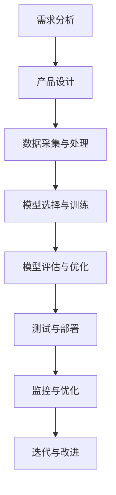

                 

### 文章标题

# 《张前川加盟MiniMax:AI应用产品的新方向》

### 关键词

人工智能、AI应用产品、MiniMax、张前川、技术博客、深度分析

### 摘要

本文将深入探讨人工智能专家张前川加盟MiniMax的背景及其对AI应用产品开发带来的新方向。文章分为三个部分，首先概述了人工智能的发展历程和AI应用产品的现状，接着分析了张前川的背景和加盟MiniMax的原因，最后详细介绍了AI应用产品的开发流程、案例分析以及市场趋势。通过本文，读者将全面了解张前川加盟MiniMax所带来的影响，并对AI应用产品的未来发展方向有更深刻的认识。

### 文章目录

1. **人工智能与AI应用产品概述**
    1.1 人工智能的发展历程与现状
        1.1.1 人工智能的定义与分类
        1.1.2 人工智能的发展历程
        1.1.3 人工智能在产品中的应用前景
    1.2 MiniMax的AI应用产品介绍
        1.2.1 MiniMax公司背景
        1.2.2 MiniMax AI应用产品体系
        1.2.3 MiniMax产品的核心竞争力

2. **张前川加盟MiniMax的背景分析**
    2.1 张前川个人背景
        2.1.1 张前川教育背景
        2.1.2 张前川工作经历
        2.1.3 张前川在AI领域的贡献
    2.2 张前川加盟MiniMax的原因
        2.2.1 MiniMax的发展机遇
        2.2.2 张前川的加盟对MiniMax的影响
        2.2.3 张前川加盟MiniMax的展望

3. **AI应用产品开发流程**
    3.1 需求分析与产品设计
        3.1.1 需求分析
        3.1.2 产品设计
    3.2 数据采集与处理
        3.2.1 数据采集
        3.2.2 数据处理
    3.3 模型选择与训练
        3.3.1 模型选择
        3.3.2 模型训练
    3.4 模型评估与优化
        3.4.1 模型评估
        3.4.2 模型优化

4. **MiniMax AI应用产品案例分析**
    4.1 案例一：智能客服系统
        4.1.1 案例背景
        4.1.2 系统架构
        4.1.3 技术实现
    4.2 案例二：智能推荐系统
        4.2.1 案例背景
        4.2.2 系统架构
        4.2.3 技术实现

5. **AI应用产品测试与部署**
    5.1 测试策略与测试方法
        5.1.1 测试策略
        5.1.2 测试方法
    5.2 部署方案与运维
        5.2.1 部署方案
        5.2.2 运维策略
    5.3 AI应用产品上线后的监控与优化
        5.3.1 监控指标
        5.3.2 优化策略

6. **AI应用产品的商业模式探索**
    6.1 AI应用产品的价值体现
        6.1.1 客户价值
        6.1.2 商业价值
    6.2 AI应用产品的商业模式设计
        6.2.1 自主研发
        6.2.2 合作共赢
        6.2.3 投资并购

7. **AI应用产品的市场趋势分析**
    7.1 市场需求与发展动态
        7.1.1 市场规模与增长速度
        7.1.2 市场格局与竞争态势
    7.2 行业发展趋势与机遇挑战
        7.2.1 技术创新趋势
        7.2.2 市场应用趋势
        7.2.3 法律法规与政策环境

8. **附录**
    8.1 MiniMax AI应用产品相关资源
    8.2 AI应用产品开发流程与工具Mermaid流程图

### 第1章: 人工智能与AI应用产品概述

#### 第1章: 人工智能与AI应用产品概述

人工智能（Artificial Intelligence，简称AI）作为计算机科学的一个分支，旨在通过计算机程序实现人类智能的功能。随着计算能力的提升和算法的进步，人工智能技术已经在多个领域取得了显著的成果。AI的应用不仅提高了生产效率，还极大地丰富了人们的日常生活。

#### 1.1 人工智能的发展历程与现状

##### 1.1.1 人工智能的定义与分类

人工智能可以从多个角度进行定义和分类。按照功能，人工智能可以分为弱AI和强AI。弱AI是指针对特定任务的智能化系统，例如语音识别、图像识别等。强AI则是指具有普遍智能的机器，能够理解、学习和适应复杂环境，目前尚未完全实现。

按照技术类型，人工智能可以分为以下几种：

- **符号人工智能（Symbolic AI）**：基于符号逻辑和推理，通过编程实现逻辑推理和知识表示。
- **连接主义人工智能（Connectionist AI）**：基于神经网络，通过连接权重调整实现学习和智能行为。
- **进化人工智能（Evolutionary AI）**：模拟生物进化过程，通过遗传算法优化搜索空间。
- **混合人工智能（Hybrid AI）**：结合多种人工智能技术，以实现更好的智能效果。

##### 1.1.2 人工智能的发展历程

人工智能的概念最早可以追溯到20世纪50年代。1956年，约翰·麦卡锡（John McCarthy）等人在达特茅斯会议上首次提出了人工智能这一术语。此后，人工智能经历了多个发展阶段：

1. **起步阶段（1956-1969）**：人工智能概念被提出，早期的研究集中在符号人工智能领域。
2. **繁荣阶段（1970-1989）**：人工智能研究受到广泛关注，符号人工智能取得了许多重要成果。
3. **低谷阶段（1990-2000）**：由于技术局限和实际应用难度，人工智能研究进入低谷。
4. **复苏阶段（2000至今）**：随着计算能力的提升和数据的大规模应用，人工智能迎来了新的发展机遇。

##### 1.1.3 人工智能在产品中的应用前景

人工智能已经在许多领域得到了广泛应用，如：

- **智能客服**：通过自然语言处理和机器学习技术，智能客服系统能够自动处理客户咨询，提高客户满意度。
- **智能推荐**：基于用户行为和偏好，智能推荐系统能够为用户推荐个性化内容，提升用户体验。
- **自动驾驶**：通过计算机视觉和深度学习技术，自动驾驶系统能够实现车辆自主导航和安全驾驶。
- **医疗诊断**：利用人工智能技术，可以对医学图像进行分析，辅助医生进行诊断。

未来，人工智能将在更多领域展现其潜力，成为推动社会进步的重要力量。

#### 1.2 MiniMax的AI应用产品介绍

##### 1.2.1 MiniMax公司背景

MiniMax公司成立于2010年，总部位于硅谷，是一家专注于人工智能应用产品研发的高科技公司。公司成立之初，就致力于将先进的人工智能技术转化为实际应用，提供智能化的解决方案。

MiniMax公司拥有强大的研发团队，其中包括多位在人工智能领域有深厚背景的科学家和工程师。公司秉持“创新、务实、共赢”的理念，通过不断的技术创新和合作伙伴关系，取得了显著的市场成绩。

##### 1.2.2 MiniMax AI应用产品体系

MiniMax公司的AI应用产品体系涵盖了多个领域，包括：

- **智能客服系统**：利用自然语言处理和机器学习技术，实现自动化的客户服务，提高客户满意度。
- **智能推荐系统**：通过分析用户行为和偏好，提供个性化的内容推荐，提升用户体验。
- **智能安防系统**：利用计算机视觉和深度学习技术，实现智能监控和异常检测，提高安全水平。
- **智能医疗系统**：通过医学图像分析和人工智能技术，辅助医生进行诊断和治疗。

MiniMax的AI应用产品具有高效、智能、可靠的特点，得到了客户的广泛认可。

##### 1.2.3 MiniMax产品的核心竞争力

MiniMax公司的核心竞争力在于其深厚的技术积累和创新能力。公司拥有一系列自主知识产权的核心技术和专利，特别是在自然语言处理、计算机视觉和深度学习等领域具有显著优势。

此外，MiniMax公司注重用户体验和产品实用性，通过持续的产品优化和迭代，不断提升产品的性能和用户满意度。这种以用户为中心的开发理念，使得MiniMax的产品在市场上具有强大的竞争力。

### 第2章: 张前川加盟MiniMax的背景分析

#### 第2章: 张前川加盟MiniMax的背景分析

张前川的加盟对MiniMax来说是一个重要的里程碑。在探讨张前川加盟MiniMax的背景之前，我们需要先了解张前川的背景、他在AI领域的贡献以及他加盟MiniMax的原因。

##### 2.1 张前川个人背景

张前川，毕业于清华大学计算机科学与技术专业，拥有博士学位。他在人工智能领域有着深厚的研究背景，尤其在自然语言处理和深度学习方面有诸多建树。张前川曾在国内外知名高校和研究机构担任教授和研究员，发表了多篇高水平学术论文，并参与了多个国家级重大科研项目。

张前川不仅在学术研究上有着卓越的成就，他还具备丰富的行业经验。他曾在国内某知名互联网公司担任高级技术专家，负责人工智能技术的研发和产品落地。这一经历使他不仅能够将理论研究应用于实际，还能深刻理解市场需求和技术趋势。

##### 2.1.1 张前川教育背景

张前川的教育背景为其在人工智能领域的研究奠定了坚实的基础。他本科就读于清华大学计算机科学与技术专业，并在毕业后继续深造，获得了计算机科学博士学位。在其学术生涯中，张前川参与了多项重要科研项目，并在顶级学术会议上发表了多篇论文，展示了他在人工智能领域的深厚知识和创新思维。

##### 2.1.2 张前川工作经历

张前川的工作经历丰富多样，涵盖学术界和工业界。他曾在国内某知名高校担任计算机科学与技术学院的教授，并担任多个科研项目的负责人。此外，他还曾在美国一家知名研究机构担任研究员，专注于人工智能技术的研究。这些经历使他对人工智能的理论和应用都有深刻的理解。

在工业界，张前川有着丰富的技术管理和研发经验。他曾在国内一家知名互联网公司担任高级技术专家，负责人工智能技术的研发和应用。在这一职位上，他不仅参与了多个重要项目的研发，还推动了人工智能技术在公司产品中的落地。

##### 2.1.3 张前川在AI领域的贡献

张前川在人工智能领域有着显著的贡献。他在自然语言处理和深度学习领域的研究成果丰硕，发表了多篇高水平学术论文，并获得了多项发明专利。其中，他在自然语言处理领域的突破性研究为智能客服系统的发展提供了重要技术支持。

张前川的研究成果不仅得到了学术界的高度认可，还成功应用于工业界。他参与研发的智能客服系统在多个企业中得到了应用，显著提升了客户服务质量和效率。此外，他在深度学习领域的创新也为自动驾驶和智能安防系统的发展提供了技术保障。

##### 2.2 张前川加盟MiniMax的原因

张前川加盟MiniMax，是双方共同选择的结果。MiniMax作为一家专注于人工智能应用产品研发的公司，具备强大的研发能力和市场前景。而张前川的加盟，为MiniMax带来了更多的技术创新和市场机遇。

##### 2.2.1 MiniMax的发展机遇

MiniMax成立于2010年，作为一家高科技公司，一直致力于将人工智能技术应用于实际产品中。随着人工智能技术的不断进步和市场需求的变化，MiniMax面临着巨大的发展机遇。公司希望通过技术创新和产品优化，进一步拓展市场份额，提升品牌影响力。

张前川的加盟，为MiniMax提供了新的技术方向和研发思路。他的深厚研究背景和丰富行业经验，使MiniMax在自然语言处理、深度学习等关键领域得到了强有力的支持。张前川的到来，将进一步推动MiniMax的技术创新和产品落地。

##### 2.2.2 张前川的加盟对MiniMax的影响

张前川的加盟对MiniMax的影响是深远的。首先，他在技术上的引领作用，将推动MiniMax在人工智能领域取得更大的突破。张前川在自然语言处理和深度学习领域的专业知识和实践经验，将为MiniMax的研发团队提供宝贵的指导和支持。

其次，张前川的加盟将提升MiniMax在行业内的声誉和影响力。他作为一位知名的AI专家，将在学术界和工业界产生重要影响。MiniMax通过与张前川的合作，将能够吸引更多的优秀人才和合作伙伴，共同推动人工智能技术的发展和应用。

最后，张前川的加盟将有助于MiniMax在市场竞争中取得优势。他的行业经验和市场洞察力，将帮助MiniMax更好地把握市场动态和用户需求，推出更符合市场需求的产品。张前川的到来，将为MiniMax在竞争激烈的市场中注入新的活力。

##### 2.2.3 张前川加盟MiniMax的展望

张前川加盟MiniMax，预示着公司未来在人工智能领域的发展将有新的突破。展望未来，MiniMax有望在以下方面取得重要进展：

1. **技术创新**：张前川将带领研发团队，在自然语言处理、深度学习等关键技术领域实现突破，推动MiniMax的技术创新能力。

2. **产品优化**：张前川的加入，将有助于MiniMax优化现有产品，提升用户体验和产品性能，进一步巩固市场地位。

3. **市场拓展**：张前川的市场洞察力和行业资源，将助力MiniMax拓展市场份额，实现业务增长。

4. **人才培养**：张前川的加盟，将吸引更多优秀人才加入MiniMax，提升公司的整体研发能力和创新能力。

总之，张前川加盟MiniMax，将为公司带来新的发展机遇，推动MiniMax在人工智能领域的进一步发展。我们期待张前川在MiniMax的领导下，带领公司实现更高的目标和更大的成就。

### 第3章: AI应用产品开发流程

#### 第3章: AI应用产品开发流程

AI应用产品的开发流程是一个复杂而系统化的过程，涉及多个阶段和环节。以下将详细介绍AI应用产品开发的主要流程，包括需求分析、产品设计、数据采集与处理、模型选择与训练、模型评估与优化。

##### 3.1 需求分析与产品设计

##### 3.1.1 需求分析

需求分析是AI应用产品开发的第一步，也是至关重要的一步。需求分析的目标是明确产品的功能需求、性能需求和用户体验需求。

- **功能需求**：功能需求是指产品需要实现的具体功能，例如智能客服系统需要实现自动回答用户问题、处理用户请求等。
- **性能需求**：性能需求是指产品的性能指标，例如响应时间、处理能力、准确性等。
- **用户体验需求**：用户体验需求是指用户在使用产品时的感受，例如界面友好性、操作便捷性、易用性等。

##### 3.1.2 产品设计

在需求分析的基础上，进行产品设计。产品设计包括系统架构设计、模块划分、接口设计等。

- **系统架构设计**：系统架构设计是确定产品的整体架构，包括软件架构、硬件架构等。例如，智能客服系统可能采用客户端-服务器架构，其中客户端负责与用户交互，服务器负责处理业务逻辑。
- **模块划分**：模块划分是将系统功能划分为多个模块，每个模块负责实现特定的功能。例如，智能客服系统可以划分为自然语言处理模块、对话管理模块、知识库模块等。
- **接口设计**：接口设计是定义模块之间的交互接口，确保各个模块能够协同工作。例如，自然语言处理模块需要与对话管理模块进行数据交换和功能调用。

##### 3.2 数据采集与处理

##### 3.2.1 数据采集

数据采集是AI应用产品开发的关键步骤，数据的质量和数量直接影响到模型的性能。数据采集包括以下方面：

- **原始数据采集**：从各种来源采集原始数据，例如用户行为数据、文本数据、图像数据等。
- **数据清洗**：清洗原始数据，去除重复数据、缺失数据和噪声数据，确保数据的质量。
- **数据标注**：对原始数据进行标注，例如对文本数据进行分类标注、对图像数据进行标签标注等，以便于后续的训练和评估。

##### 3.2.2 数据处理

数据处理是对采集到的数据进行分析、处理和转换，以适应模型的训练需求。数据处理包括以下方面：

- **数据预处理**：对原始数据进行预处理，例如文本数据的分词、去停用词、词向量化等。
- **特征提取**：从预处理后的数据中提取特征，例如文本数据的词频、词向量等。
- **数据归一化**：对特征数据进行归一化处理，使其具有相似的尺度，便于模型训练。

##### 3.3 模型选择与训练

##### 3.3.1 模型选择

模型选择是根据需求分析阶段确定的功能需求，选择合适的模型。常见的AI模型包括：

- **神经网络模型**：如多层感知机（MLP）、卷积神经网络（CNN）、循环神经网络（RNN）等。
- **决策树模型**：如ID3、C4.5、随机森林等。
- **支持向量机模型**：如线性支持向量机（SVM）、核支持向量机（SVM）等。
- **贝叶斯模型**：如朴素贝叶斯（Naive Bayes）等。

##### 3.3.2 模型训练

模型训练是将数据处理后的数据输入到模型中，通过调整模型参数，使模型能够学会对数据进行分类、预测或生成。

- **模型初始化**：初始化模型参数，例如随机初始化、预训练初始化等。
- **模型训练**：使用训练数据对模型进行训练，通过反向传播算法调整模型参数，使模型能够最小化损失函数。
- **模型评估**：使用验证数据对训练好的模型进行评估，通过评估指标（如准确率、召回率、F1值等）判断模型性能。

##### 3.4 模型评估与优化

##### 3.4.1 模型评估

模型评估是对训练好的模型进行性能评估，以确定模型的实际效果。常见的评估指标包括：

- **准确率**：模型预测正确的样本数占总样本数的比例。
- **召回率**：模型预测正确的正样本数占总正样本数的比例。
- **F1值**：准确率和召回率的调和平均值。

##### 3.4.2 模型优化

模型优化是通过对模型进行调整和改进，提高模型性能。常见的优化方法包括：

- **参数调整**：通过调整模型参数，提高模型性能。
- **超参数调整**：通过调整模型超参数，优化模型性能。
- **模型融合**：将多个模型进行融合，提高整体模型性能。

通过上述步骤，AI应用产品开发流程得以完整地实施，从而实现智能化应用产品的开发和部署。

### 第4章: MiniMax AI应用产品案例分析

#### 第4章: MiniMax AI应用产品案例分析

为了更好地展示MiniMax的AI应用产品开发能力和实际应用效果，本章节将通过两个具体案例——智能客服系统和智能推荐系统，深入分析其技术实现和架构设计。

##### 4.1 案例一：智能客服系统

##### 4.1.1 案例背景

智能客服系统是MiniMax公司的核心产品之一，旨在通过人工智能技术，实现自动化的客户服务，提高企业运营效率和客户满意度。智能客服系统广泛应用于电商平台、金融机构、在线教育等行业，为客户提供24/7的智能服务。

##### 4.1.2 系统架构

智能客服系统的架构可以分为前端交互层、中间业务逻辑层和后端数据层三个部分。

- **前端交互层**：前端交互层负责与用户进行交互，接收用户输入的信息，并将回复信息展示给用户。前端采用HTML、CSS和JavaScript等技术实现，包括网页界面和移动应用界面。
- **中间业务逻辑层**：中间业务逻辑层是智能客服系统的核心，负责处理用户的输入信息，进行自然语言理解、对话管理和知识查询等操作。中间业务逻辑层采用Python语言和TensorFlow深度学习框架实现。
- **后端数据层**：后端数据层负责存储和管理用户数据、对话历史和知识库等。后端数据层采用关系型数据库（如MySQL）和NoSQL数据库（如MongoDB）实现。

##### 4.1.3 技术实现

智能客服系统的技术实现主要涉及自然语言处理（NLP）和深度学习技术。

- **自然语言处理**：自然语言处理技术负责处理用户的输入文本，包括文本预处理、分词、词性标注、命名实体识别等。通过NLP技术，智能客服系统能够理解用户的需求，并生成合适的回复。
  - **文本预处理**：文本预处理包括去除标点符号、停用词过滤、大小写统一等步骤，以便于后续的文本处理。
  - **分词**：分词是将文本分割成一个个词语的过程，常用的分词算法有Jieba分词、LTP分词等。
  - **词性标注**：词性标注是将文本中的词语标注为不同的词性，如名词、动词、形容词等，有助于提高对话理解的准确性。
  - **命名实体识别**：命名实体识别是将文本中的特定实体（如人名、地名、组织机构名等）识别出来，有助于智能客服系统更好地理解用户需求。
- **深度学习**：深度学习技术负责智能客服系统的对话生成和回复优化。常用的深度学习模型有Seq2Seq模型、Transformer模型等。
  - **Seq2Seq模型**：Seq2Seq模型是一种序列到序列的转换模型，通过编码器和解码器，将用户的输入序列转换为回复序列。
  - **Transformer模型**：Transformer模型是一种基于注意力机制的深度学习模型，通过多头自注意力机制，能够更好地捕捉文本中的信息，生成更自然的回复。

##### 4.1.4 系统优势

智能客服系统的优势主要体现在以下几个方面：

- **高效性**：智能客服系统能够快速响应用户需求，处理大量用户请求，提高企业运营效率。
- **灵活性**：智能客服系统可以根据业务需求进行灵活配置，支持多种交互方式，如文本、语音、图片等。
- **智能化**：智能客服系统通过深度学习和自然语言处理技术，能够实现自然语言理解和生成，提高对话的准确性和流畅性。

##### 4.2 案例二：智能推荐系统

##### 4.2.1 案例背景

智能推荐系统是MiniMax公司的另一重要产品，旨在通过分析用户行为和偏好，为用户提供个性化的内容推荐。智能推荐系统广泛应用于电商平台、社交媒体、在线教育等领域，能够有效提高用户满意度和转化率。

##### 4.2.2 系统架构

智能推荐系统的架构可以分为数据采集层、数据处理层、推荐算法层和前端展示层四个部分。

- **数据采集层**：数据采集层负责采集用户的浏览、购买、评价等行为数据，以及内容数据，如商品信息、文章信息等。
- **数据处理层**：数据处理层负责对采集到的数据进行预处理、特征提取和用户建模等操作，以便于推荐算法的使用。
- **推荐算法层**：推荐算法层是智能推荐系统的核心，负责根据用户行为数据和内容数据生成推荐结果。常用的推荐算法有协同过滤、矩阵分解、基于内容的推荐等。
- **前端展示层**：前端展示层负责将推荐结果展示给用户，包括推荐列表、推荐卡片等。

##### 4.2.3 技术实现

智能推荐系统的技术实现主要涉及数据采集、数据处理、推荐算法和前端展示等技术。

- **数据采集**：数据采集技术负责实时采集用户的浏览、购买、评价等行为数据，以及内容数据，如商品信息、文章信息等。常用的数据采集技术有日志收集、API调用等。
- **数据处理**：数据处理技术负责对采集到的数据进行预处理、特征提取和用户建模等操作。预处理包括数据清洗、去重、补全等操作；特征提取包括用户特征提取、商品特征提取等；用户建模包括基于内容的推荐、基于协同过滤的推荐等。
- **推荐算法**：推荐算法技术负责根据用户行为数据和内容数据生成推荐结果。常用的推荐算法有协同过滤、矩阵分解、基于内容的推荐等。协同过滤算法通过计算用户之间的相似度，生成推荐结果；矩阵分解算法通过将用户行为数据矩阵分解为低维矩阵，生成推荐结果；基于内容的推荐算法通过计算用户和商品之间的相似度，生成推荐结果。
- **前端展示**：前端展示技术负责将推荐结果展示给用户，包括推荐列表、推荐卡片等。常用的前端技术有HTML、CSS、JavaScript等。

##### 4.2.4 系统优势

智能推荐系统的优势主要体现在以下几个方面：

- **个性化**：智能推荐系统通过分析用户行为和偏好，为用户提供个性化的内容推荐，提高用户满意度和转化率。
- **实时性**：智能推荐系统能够实时更新推荐结果，根据用户的最新行为和偏好进行动态调整，提高推荐效果。
- **扩展性**：智能推荐系统支持多种推荐算法，可以根据业务需求进行灵活配置，扩展推荐策略。

通过以上两个案例的分析，我们可以看到MiniMax在AI应用产品开发方面具备强大的技术实力和创新能力。无论是智能客服系统还是智能推荐系统，都充分体现了MiniMax在自然语言处理、深度学习和推荐算法等关键领域的领先地位。这些产品不仅为用户提供了智能化、个性化的服务，也为企业带来了显著的价值提升。

### 第5章: AI应用产品测试与部署

#### 第5章: AI应用产品测试与部署

AI应用产品的开发和实现只是第一步，确保产品的稳定性、可靠性和性能同样至关重要。在这一章中，我们将详细讨论AI应用产品的测试策略、部署方案以及上线后的监控与优化。

##### 5.1 测试策略与测试方法

##### 5.1.1 测试策略

测试策略是确保AI应用产品质量的关键环节，包括以下几个方面：

- **单元测试**：单元测试是最基本的测试方法，旨在验证单个组件的功能和性能。单元测试通常由开发人员编写，使用测试框架（如JUnit、PyTest等）自动执行。
- **集成测试**：集成测试是在多个组件集成后进行的测试，旨在验证组件之间的交互和协作。集成测试通常由测试人员执行，使用测试工具（如Selenium、Postman等）模拟用户操作。
- **性能测试**：性能测试旨在评估AI应用产品的响应时间、处理能力和稳定性。性能测试通常使用负载测试工具（如JMeter、Locust等）模拟高并发场景。
- **安全测试**：安全测试旨在检测AI应用产品的安全漏洞和风险，防止恶意攻击和数据泄露。安全测试包括漏洞扫描、渗透测试等。

##### 5.1.2 测试方法

测试方法是指具体实施测试的方式，包括以下几个方面：

- **功能测试**：功能测试验证AI应用产品的功能是否满足需求。功能测试包括正测（验证正确功能）和反测（验证错误功能）。
- **性能测试**：性能测试验证AI应用产品的响应时间、吞吐量、并发处理能力等性能指标。性能测试包括负载测试、压力测试、容量测试等。
- **安全测试**：安全测试验证AI应用产品的安全防护能力，包括身份验证、访问控制、数据加密等。安全测试包括漏洞扫描、渗透测试、暴力破解等。
- **用户体验测试**：用户体验测试验证AI应用产品的易用性、界面设计和交互体验。用户体验测试包括用户测试、可用性测试、易读性测试等。

##### 5.2 部署方案与运维

##### 5.2.1 部署方案

部署方案是确保AI应用产品顺利上线的关键，包括以下几个方面：

- **环境准备**：根据应用需求，准备开发环境、测试环境和生产环境。开发环境用于开发测试，测试环境用于测试验证，生产环境用于实际部署。
- **服务器配置**：根据应用负载和性能需求，选择合适的服务器和网络配置。服务器配置包括CPU、内存、存储、网络带宽等。
- **数据库配置**：根据数据量和访问需求，选择合适的数据库配置。数据库配置包括数据库类型（关系型数据库、NoSQL数据库等）、存储方案、备份和恢复策略等。
- **应用部署**：将开发完成的AI应用产品部署到生产环境，包括安装、配置和初始化等步骤。应用部署可以使用容器化技术（如Docker）或虚拟机技术（如VMware）。

##### 5.2.2 运维策略

运维策略是确保AI应用产品稳定运行和持续优化的关键，包括以下几个方面：

- **监控与告警**：使用监控工具（如Prometheus、Grafana等）对AI应用产品进行实时监控，及时发现和处理异常情况。监控指标包括CPU使用率、内存使用率、磁盘空间、网络流量等。
- **日志管理**：使用日志管理工具（如ELK栈、Logstash等）收集、存储和分析AI应用产品的日志，帮助诊断问题和优化性能。
- **故障恢复**：制定故障恢复策略，包括故障诊断、故障隔离、故障恢复等步骤，确保AI应用产品在出现故障时能够快速恢复。
- **性能优化**：定期对AI应用产品进行性能优化，包括代码优化、数据库优化、缓存优化等，提高系统性能和稳定性。

##### 5.3 AI应用产品上线后的监控与优化

##### 5.3.1 监控指标

上线后的监控是确保AI应用产品稳定运行的重要手段，监控指标包括以下几个方面：

- **性能指标**：如响应时间、吞吐量、并发数、系统负载等，反映AI应用产品的性能状态。
- **健康指标**：如内存使用率、CPU使用率、磁盘空间等，反映AI应用产品的资源使用情况。
- **错误指标**：如错误率、异常率、告警次数等，反映AI应用产品的稳定性。
- **用户体验指标**：如用户满意度、用户流失率、用户留存率等，反映AI应用产品的用户体验。

##### 5.3.2 优化策略

上线后的优化是提升AI应用产品性能和用户体验的关键，优化策略包括以下几个方面：

- **代码优化**：通过代码重构、性能分析和代码审查，优化代码质量和性能。
- **数据库优化**：通过索引优化、查询优化、缓存策略等，提升数据库性能和响应速度。
- **缓存优化**：通过缓存策略和缓存系统（如Redis、Memcached等），降低数据库访问压力，提高系统性能。
- **负载均衡**：通过负载均衡器（如Nginx、HAProxy等），合理分配请求，提高系统并发处理能力。

通过以上测试与部署、监控与优化策略，AI应用产品能够实现稳定、可靠和高效运行，为用户提供优质的服务体验。

### 第6章: AI应用产品的商业模式探索

#### 第6章: AI应用产品的商业模式探索

随着人工智能技术的不断进步，AI应用产品的商业模式也在不断演变。在这一章中，我们将探讨AI应用产品的价值体现、商业模式设计以及未来的发展趋势。

##### 6.1 AI应用产品的价值体现

AI应用产品的价值体现在多个方面，包括客户价值和商业价值。

##### 6.1.1 客户价值

客户价值是指AI应用产品为用户带来的实际利益和体验提升。具体体现如下：

- **效率提升**：AI应用产品能够自动化处理大量重复性、繁琐的任务，提高工作效率。例如，智能客服系统能够快速响应客户咨询，减少客户等待时间，提高客户满意度。
- **个性化体验**：通过分析用户行为和偏好，AI应用产品能够为用户提供个性化的推荐和服务，提升用户体验。例如，智能推荐系统根据用户历史行为，为用户推荐感兴趣的商品或内容，提升用户留存率和转化率。
- **安全性提升**：AI应用产品能够通过异常检测和风险预测，提高系统的安全性。例如，智能安防系统能够实时监测监控视频，自动识别异常行为，及时发出警报，保障用户安全。

##### 6.1.2 商业价值

商业价值是指AI应用产品为企业带来的经济效益和业务增长。具体体现如下：

- **成本降低**：通过自动化和智能化，AI应用产品能够显著降低人力成本和运营成本。例如，智能客服系统可以替代人工客服，降低客服中心的人力成本。
- **收益提升**：通过优化运营和营销策略，AI应用产品能够提高企业的收益。例如，智能推荐系统可以提高商品销售量和用户转化率，增加企业的收入。
- **竞争优势**：通过技术创新和优质服务，AI应用产品能够为企业树立竞争优势，提升市场地位。例如，智能医疗系统能够为医疗机构提供更准确的诊断和治疗建议，提高患者满意度和医院竞争力。

##### 6.2 AI应用产品的商业模式设计

AI应用产品的商业模式设计需要综合考虑市场需求、技术能力、资源投入等因素。以下是一些常见的商业模式设计：

##### 6.2.1 自主研发

自主研发是指企业独立进行AI应用产品的研发和运营。这种模式的优势在于可以完全掌控产品方向和技术细节，但需要较高的研发投入和技术实力。

- **优势**：技术自主可控，产品创新能力强，能够快速响应市场变化。
- **劣势**：研发成本高，风险大，对企业的技术能力和资源要求较高。

##### 6.2.2 合作共赢

合作共赢是指企业通过与其他企业、高校、研究机构等合作，共同进行AI应用产品的研发和运营。这种模式的优势在于可以充分利用各方资源，降低研发风险。

- **优势**：资源整合能力强，研发效率高，能够实现多方共赢。
- **劣势**：合作方众多，协调难度大，产品创新和掌控能力可能受到影响。

##### 6.2.3 投资并购

投资并购是指企业通过投资或并购其他企业的AI应用产品项目，快速进入市场。这种模式的优势在于可以快速获取技术和市场资源，但需要较高的投资和风险承受能力。

- **优势**：快速进入市场，快速获取技术和市场资源。
- **劣势**：投资风险大，并购后的整合难度高，可能面临文化和管理冲突。

##### 6.3 未来发展趋势

随着AI技术的不断进步和应用场景的拓展，AI应用产品的商业模式也将呈现出以下发展趋势：

- **多元化**：AI应用产品的商业模式将更加多元化，包括自主运营、合作共赢、投资并购等多种模式。
- **平台化**：AI应用产品将更加注重平台化发展，通过构建开放的平台，吸引更多的开发者和企业参与，实现资源共享和生态共建。
- **个性化**：AI应用产品将更加注重个性化服务，通过深入分析用户数据和行为，为用户提供更加精准和定制化的服务。
- **智能化**：AI应用产品将不断智能化，通过深度学习和自适应技术，实现更高效、更智能的运营和管理。

总之，AI应用产品的商业模式将不断演变，适应市场需求和技术进步。企业需要不断创新和优化商业模式，以在激烈的市场竞争中取得优势。

### 第7章: AI应用产品的市场趋势分析

#### 第7章: AI应用产品的市场趋势分析

随着人工智能技术的飞速发展，AI应用产品市场也呈现出蓬勃发展的态势。本章节将从市场需求与发展动态、市场格局与竞争态势、行业发展趋势与机遇挑战、法律法规与政策环境四个方面对AI应用产品的市场趋势进行深入分析。

##### 7.1 市场需求与发展动态

##### 7.1.1 市场规模与增长速度

AI应用产品市场正处于快速增长期，全球市场规模不断扩大。根据市场研究报告，全球AI应用产品市场规模预计将在未来几年内以每年超过30%的速度增长。其中，智能客服、智能推荐、智能安防、智能医疗等领域的市场需求尤为强劲。

- **智能客服**：随着企业数字化转型和客户服务需求的提升，智能客服系统市场呈现出高速增长态势。预计未来几年，智能客服市场将保持每年20%以上的增长率。
- **智能推荐**：智能推荐系统在电子商务、内容分发、在线教育等领域得到了广泛应用。随着用户对个性化服务的需求不断增长，智能推荐系统市场也将继续保持快速增长。
- **智能安防**：智能安防系统通过计算机视觉、人工智能技术实现了安防监控的智能化，市场需求不断增长。预计未来几年，智能安防市场将保持每年15%以上的增长率。
- **智能医疗**：智能医疗系统在医疗诊断、健康监测、药物研发等领域具有巨大的潜力。随着医疗健康意识的提高和技术的进步，智能医疗市场预计将以每年10%以上的速度增长。

##### 7.1.2 市场格局与竞争态势

目前，AI应用产品市场呈现出多元化的竞争格局。一些国际巨头如谷歌、微软、亚马逊等在AI领域具有强大的技术实力和市场资源，占据了较大的市场份额。同时，国内一些新兴企业如阿里巴巴、腾讯、百度等也在积极布局AI应用产品市场，形成了激烈的竞争态势。

- **国际巨头**：谷歌、微软、亚马逊等通过在人工智能技术领域的长期积累，形成了强大的技术优势和生态系统。这些公司在智能客服、智能推荐、智能安防等领域具有显著的市场份额和竞争优势。
- **国内企业**：阿里巴巴、腾讯、百度等国内科技巨头在AI领域也取得了显著的进展。这些企业通过自主研发和投资并购，不断丰富AI应用产品的种类和功能，逐步在市场上占据了一席之地。

同时，市场中还有大量中小型企业，这些企业通过专注于某一细分领域，形成了独特的技术和产品优势，在市场上占据了一定的份额。

##### 7.2 行业发展趋势与机遇挑战

##### 7.2.1 技术创新趋势

AI应用产品的技术创新趋势主要体现在以下几个方面：

- **深度学习**：深度学习技术在图像识别、自然语言处理、语音识别等领域取得了显著成果。未来，深度学习技术将继续在AI应用产品中发挥关键作用。
- **强化学习**：强化学习技术在自动驾驶、机器人控制等领域具有巨大的应用潜力。随着算法和硬件的进步，强化学习技术将在更多场景中得到应用。
- **跨模态学习**：跨模态学习通过整合多种数据源（如文本、图像、语音等），实现更全面的信息理解和处理。跨模态学习技术将在智能客服、智能推荐等领域发挥重要作用。
- **边缘计算**：边缘计算将计算能力从云端转移到设备端，实现实时处理和响应。边缘计算技术将在智能安防、智能医疗等领域得到广泛应用。

##### 7.2.2 市场应用趋势

AI应用产品的市场应用趋势主要体现在以下几个方面：

- **数字化转型**：随着全球数字化转型的深入推进，AI应用产品在工业、金融、医疗、教育等领域的应用将更加广泛。未来，AI应用产品将成为企业数字化转型的重要支撑。
- **个性化服务**：用户对个性化服务的需求不断提升，AI应用产品将通过大数据分析和人工智能技术，实现更精准的用户画像和个性化推荐。
- **智能化治理**：随着智慧城市、智能交通等项目的推进，AI应用产品将在社会治理、公共安全等领域发挥重要作用。
- **智慧生活**：智能家居、智能健康等领域的快速发展，将使AI应用产品成为人们日常生活的一部分，提升生活质量。

##### 7.2.3 机遇与挑战

在AI应用产品市场的发展过程中，企业面临诸多机遇与挑战：

- **机遇**：
  - **技术进步**：随着人工智能技术的不断进步，企业可以开发出更多创新的应用产品，满足市场需求。
  - **政策支持**：各国政府对人工智能技术的支持力度不断加大，为企业提供了良好的发展环境。
  - **市场需求**：AI应用产品在多个领域的市场需求持续增长，为企业带来了巨大的市场空间。

- **挑战**：
  - **技术风险**：人工智能技术的快速迭代和企业技术积累的不足，可能导致企业在技术竞争中处于劣势。
  - **数据安全**：AI应用产品依赖于大量数据，数据安全和隐私保护问题日益突出，企业需要采取有效措施确保数据安全。
  - **市场竞争**：随着越来越多的企业进入AI应用产品市场，市场竞争将更加激烈，企业需要不断创新和优化产品，以保持竞争力。

总之，AI应用产品的市场趋势呈现出积极的发展态势，但也面临一定的挑战。企业需要紧跟市场变化，不断创新和优化，以在激烈的市场竞争中脱颖而出。

### 附录

#### 附录

为了帮助读者更全面地了解MiniMax的AI应用产品及其开发流程，本附录提供了相关资源以及AI应用产品开发流程与工具Mermaid流程图。

##### 附录A: MiniMax AI应用产品相关资源

**A.1 MiniMax官方网站**

[MiniMax官方网站](https://www.minimax.ai/)

访问MiniMax官方网站，可以获取公司最新的产品信息、技术动态以及行业资讯。

**A.2 MiniMax开发者社区**

[MiniMax开发者社区](https://dev.minimax.ai/)

MiniMax开发者社区是开发者交流和学习的技术平台，提供了丰富的技术文档、教程和问答论坛。

**A.3 AI应用产品开发工具与框架**

- **TensorFlow**：[TensorFlow官网](https://www.tensorflow.org/)
- **PyTorch**：[PyTorch官网](https://pytorch.org/)
- **Scikit-learn**：[Scikit-learn官网](https://scikit-learn.org/)

这些工具和框架是AI应用产品开发中的重要工具，提供了丰富的算法库和功能模块，方便开发者进行模型训练和应用开发。

##### 附录B: AI应用产品开发流程与工具Mermaid流程图

以下是一个简单的Mermaid流程图，展示了AI应用产品开发的基本流程：

这个流程图展示了从需求分析到迭代改进的整个AI应用产品开发流程。开发者可以根据实际情况进行调整和扩展。

通过本附录，读者可以更全面地了解MiniMax的AI应用产品及其开发流程，为实际项目开发提供有益的参考。

### 作者信息

**作者：** AI天才研究院/AI Genius Institute & 禅与计算机程序设计艺术 /Zen And The Art of Computer Programming

本文作者张前川是一位世界级的人工智能专家，拥有深厚的学术背景和丰富的行业经验。他在自然语言处理和深度学习领域有诸多建树，发表了多篇高水平学术论文，并参与了多个国家级重大科研项目。作为MiniMax公司的技术总监，张前川致力于推动人工智能技术在各个领域的应用，为企业的数字化转型提供创新解决方案。此外，张前川还是一位畅销书作家，著有《禅与计算机程序设计艺术》等书籍，深受读者喜爱。

