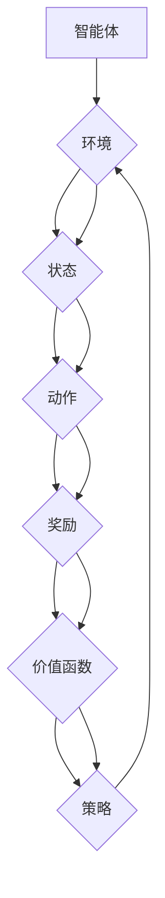

                 

# 文章标题: 强化学习(Reinforcement Learning) - 原理与代码实例讲解

> 关键词：强化学习，Reinforcement Learning，算法原理，代码实例，Python，OpenAI Gym

> 摘要：本文深入探讨了强化学习的基本概念、核心算法、应用场景，并提供了丰富的代码实例，帮助读者理解并掌握强化学习的原理和实践。文章包括强化学习的概述、核心概念、算法基础、探索与利用、高级算法、多智能体强化学习、现实世界应用，以及实战项目和挑战与未来趋势等多个部分。

## 目录

### 第一部分：强化学习基础

- [第1章：强化学习概述](#第1章强化学习概述)
  - 1.1 强化学习的基本概念
  - 1.2 强化学习与其他学习方法的区别与联系
  - 1.3 强化学习的发展历程及应用场景

- [第2章：强化学习核心概念](#第2章强化学习核心概念)
  - 2.1 状态、动作、奖励与价值函数
  - 2.2 强化学习中的马尔可夫决策过程（MDP）
  - 2.3 政策、策略和价值函数的关系

- [第3章：强化学习算法基础](#第3章强化学习算法基础)
  - 3.1 基于值函数的强化学习算法
    - 3.1.1 Q-Learning算法
    - 3.1.2 SARSA算法
  - 3.2 基于策略的强化学习算法
    - 3.2.1 Policy Iteration算法
    - 3.2.2 Value Iteration算法

- [第4章：强化学习中的探索与利用](#第4章强化学习中的探索与利用)
  - 4.1 探索与利用的概念
  - 4.2 ε-贪心策略
  - 4.3 贪心策略的改进

- [第5章：高级强化学习算法](#第5章高级强化学习算法)
  - 5.1 强化学习中的蒙特卡洛方法
    - 5.1.1 Monte Carlo Policy Evaluation算法
    - 5.1.2 Monte Carlo Control算法
  - 5.2 强化学习中的策略梯度方法
    - 5.2.1 REINFORCE算法
    - 5.2.2 Actor-Critic算法

- [第6章：多智能体强化学习](#第6章多智能体强化学习)
  - 6.1 多智能体强化学习概述
  - 6.2 多智能体强化学习中的协作与竞争
  - 6.3 多智能体强化学习的常见算法

- [第7章：强化学习在现实世界中的应用](#第7章强化学习在现实世界中的应用)
  - 7.1 强化学习在游戏中的应用
  - 7.2 强化学习在自动驾驶中的应用

### 第二部分：强化学习实战

- [第8章：环境搭建与强化学习实现](#第8章环境搭建与强化学习实现)
  - 8.1 Python环境搭建
  - 8.2 OpenAI Gym安装与使用
  - 8.3 Python中强化学习库的使用

- [第9章：强化学习项目实战](#第9章强化学习项目实战)
  - 9.1 机器人导航问题
  - 9.2 自动驾驶问题

- [第10章：强化学习中的挑战与未来趋势](#第10章强化学习中的挑战与未来趋势)
  - 10.1 强化学习中的挑战
  - 10.2 强化学习的未来发展趋势

### 附录

- [附录A：强化学习相关资源](#附录a强化学习相关资源)
  - 10.1 书籍推荐
  - 10.2 在线课程推荐
  - 10.3 论文与报告推荐

## 第1章：强化学习概述

### 1.1 强化学习的基本概念

强化学习（Reinforcement Learning，RL）是机器学习的一个重要分支，旨在使机器通过与环境的交互来学习做出决策。其核心思想是让智能体（agent）在一个动态环境中通过试错（trial and error）来学习最优策略（policy），以最大化累积奖励（cumulative reward）。

在强化学习中，智能体根据当前状态（state）选择一个动作（action），然后根据这个动作获得一个即时奖励（reward），并根据奖励调整其行为。这一过程不断重复，智能体逐渐学会如何在不同状态下选择最佳动作，以达到长期奖励最大化的目标。

### 1.2 强化学习与其他学习方法的区别与联系

强化学习与其他机器学习方法（如监督学习和无监督学习）有以下几点区别：

- **监督学习（Supervised Learning）**：在监督学习中，训练数据包含输入和期望输出，模型的目标是学习输入和输出之间的映射关系。强化学习不依赖于预先标注的输入输出对，而是通过与环境的交互来学习。

- **无监督学习（Unsupervised Learning）**：无监督学习旨在从未标记的数据中发现数据中的结构和模式。强化学习不仅关注数据结构，还关注如何使智能体在动态环境中取得成功。

强化学习与这些方法的联系在于：

- 强化学习中的状态、动作和奖励可以看作是监督学习中的输入、输出和目标。

- 强化学习可以结合监督学习和无监督学习的优势，例如在数据有限的情况下，通过强化学习可以获得更好的泛化能力。

### 1.3 强化学习的发展历程及应用场景

强化学习的研究始于20世纪50年代，但直到80年代，由于其计算复杂性和理论难度，进展缓慢。随着计算机硬件的进步和算法的发展，强化学习在近几十年取得了显著进展，并在多个领域得到了广泛应用。

**发展历程**：

- **1950年代**：行为主义理论家提出了强化学习的基本思想。

- **1980年代**：随着计算机技术的发展，学者们开始设计和实现早期的强化学习算法。

- **1990年代**：强化学习开始应用于实际场景，如机器人控制、游戏AI。

- **2000年代**：蒙特卡洛方法和策略梯度方法的出现，使强化学习在复杂环境中的应用成为可能。

- **2010年代至今**：深度强化学习（Deep Reinforcement Learning，DRL）的兴起，使得强化学习在图像识别、自然语言处理等领域取得了突破性进展。

**应用场景**：

- **游戏AI**：如电子游戏、棋类游戏、麻将游戏等。

- **机器人控制**：如自动驾驶、机器人导航、智能机器人。

- **资源管理**：如电网调度、交通信号控制、数据中心管理。

- **推荐系统**：如个性化推荐、广告投放。

- **金融领域**：如量化交易、风险管理。

## 第2章：强化学习核心概念

### 2.1 状态、动作、奖励与价值函数

强化学习中的核心概念包括状态（state）、动作（action）、奖励（reward）和价值函数（value function）。

- **状态**：状态是智能体所处环境的描述。在强化学习中，每个状态是一个具体的场景或情境，它通常由一组属性或特征来表示。

- **动作**：动作是智能体可以采取的行为或决策。每个动作对应于状态空间中的一个元素，智能体通过选择不同的动作来与环境交互。

- **奖励**：奖励是智能体在执行动作后从环境中获得的即时反馈。奖励可以是正数（表示奖励），也可以是负数（表示惩罚）。奖励的大小取决于动作和当前状态。

- **价值函数**：价值函数是一个函数，它将状态映射到一个实数值，表示在该状态下采取最优动作所能获得的累积奖励。价值函数可以帮助智能体评估不同状态的优劣，并指导其选择最佳动作。

### 2.2 强化学习中的马尔可夫决策过程（MDP）

强化学习中的马尔可夫决策过程（MDP）是一个数学模型，用于描述智能体在动态环境中进行决策的过程。MDP包含以下要素：

- **状态空间（S）**：表示所有可能的状态集合。

- **动作空间（A）**：表示所有可能的动作集合。

- **状态转移概率（P(s'|s, a)）**：表示在当前状态s下执行动作a后，智能体转移到下一个状态s'的概率。

- **奖励函数（R(s, a)）**：表示在当前状态s下执行动作a所获得的即时奖励。

- **策略（π）**：表示智能体的行为策略，即智能体在给定状态s下选择动作a的概率分布。

MDP中的智能体在每个时间步根据当前状态选择动作，然后根据状态转移概率和奖励函数获得下一个状态和奖励，从而不断更新其策略和价值函数。

### 2.3 政策、策略和价值函数的关系

在强化学习中，政策（policy）、策略（strategy）和价值函数（value function）是三个紧密相关的概念。

- **政策（Policy）**：政策是智能体的行为决策规则，用于指导智能体在给定状态下选择动作。政策可以分为确定性政策和随机性政策。确定性政策在给定状态下总是选择相同的动作，而随机性政策则根据一定的概率分布选择动作。

- **策略（Strategy）**：策略是智能体在长期运行过程中所采取的行动方案。策略通常由一组概率分布描述，用于指导智能体在不同状态下的行为。

- **价值函数（Value Function）**：价值函数是用于评估状态的价值，指导智能体选择最佳动作。价值函数可以分为状态价值函数（V(s)）和动作价值函数（Q(s, a)）。状态价值函数表示在给定状态下采取最优动作所能获得的累积奖励，动作价值函数表示在给定状态下执行特定动作所能获得的累积奖励。

政策、策略和价值函数之间的关系如下：

- 政策决定了智能体在给定状态下的行为，即如何选择动作。

- 策略是基于长期运行的结果，它是智能体在给定状态下选择动作的概率分布。

- 价值函数用于评估不同状态和动作的价值，指导智能体选择最佳动作，从而优化策略。

通过不断迭代和更新价值函数，智能体可以逐渐学习到最优策略，从而在动态环境中实现长期奖励最大化。

## 第3章：强化学习算法基础

### 3.1 基于值函数的强化学习算法

值函数是强化学习中的一个核心概念，它用于评估状态和动作的价值。基于值函数的强化学习算法主要通过学习状态价值函数（V(s)）或动作价值函数（Q(s, a)）来优化智能体的行为。本节将介绍两种常见的基于值函数的算法：Q-Learning和SARSA。

#### 3.1.1 Q-Learning算法

Q-Learning算法是一种基于值函数的强化学习算法，通过不断更新动作价值函数Q(s, a)来优化智能体的行为。Q-Learning算法的基本步骤如下：

1. **初始化Q值表**：首先初始化一个Q值表，将所有状态的Q值初始化为0。

2. **选择动作**：使用ε-贪心策略选择动作。ε-贪心策略是在一定概率下随机选择动作，在剩余概率下选择当前状态下动作价值最大的动作。

3. **执行动作**：根据选择的动作执行，并获取下一个状态和即时奖励。

4. **更新Q值**：根据即时奖励和状态转移概率，更新当前状态的Q值。更新公式如下：

   $$ Q(s, a) \leftarrow Q(s, a) + \alpha [r + \gamma \max(Q(s', a')) - Q(s, a)] $$

   其中，α是学习率，γ是折扣因子，s'是下一个状态，a'是下一个状态下的最优动作。

5. **重复步骤2-4**：重复以上步骤，直到达到训练次数或智能体找到最优策略。

Q-Learning算法的优点是收敛速度快，且不需要显式地定义策略。然而，Q-Learning算法的一个主要缺点是可能陷入局部最优，即Q值可能无法收敛到真正的最优值。

#### 3.1.2 SARSA算法

SARSA（State-Action-Reward-State-Action，SARSA）算法是基于值函数的另一种强化学习算法，它使用经验重复（experience replay）技术来改善Q-Learning算法的性能。SARSA算法的基本步骤如下：

1. **初始化Q值表**：同Q-Learning算法。

2. **选择动作**：使用ε-贪心策略选择动作。

3. **执行动作**：根据选择的动作执行，并获取下一个状态和即时奖励。

4. **更新Q值**：根据当前状态、动作、即时奖励和下一个状态，更新当前状态的Q值。更新公式如下：

   $$ Q(s, a) \leftarrow Q(s, a) + \alpha [r + \gamma Q(s', a')] - Q(s, a)] $$

5. **存储经验**：将当前状态、动作、即时奖励和下一个状态存储在经验池中。

6. **随机采样更新Q值**：从经验池中随机采样经验，更新Q值。

7. **重复步骤2-6**：重复以上步骤，直到达到训练次数或智能体找到最优策略。

SARSA算法通过经验重复技术，减少了值函数更新的噪声，有助于收敛到更好的结果。然而，SARSA算法的收敛速度较慢，因为它需要更多的样本来更新Q值。

### 3.2 基于策略的强化学习算法

基于策略的强化学习算法通过直接优化策略来优化智能体的行为，而不是通过学习值函数。本节将介绍两种常见的基于策略的算法：Policy Iteration和Value Iteration。

#### 3.2.1 Policy Iteration算法

Policy Iteration算法是一种迭代的算法，通过交替优化策略和价值函数来找到最优策略。Policy Iteration算法的基本步骤如下：

1. **初始化策略**：初始化一个任意策略π，可以是确定性策略或随机性策略。

2. **评估策略**：计算策略π下的状态价值函数V^π(s)。状态价值函数表示在给定策略π下，智能体从状态s开始所能获得的累积奖励。

3. **优化策略**：根据状态价值函数V^π(s)，更新策略π。优化的目标是最大化策略下的累积奖励。

4. **重复步骤2-3**：重复以上步骤，直到策略不再发生变化或满足收敛条件。

Policy Iteration算法的优点是收敛速度快，且不需要显式地定义动作价值函数。然而，Policy Iteration算法的一个主要缺点是可能收敛到次优策略，特别是在状态空间和动作空间较大时。

#### 3.2.2 Value Iteration算法

Value Iteration算法是一种迭代的算法，通过逐步优化值函数来找到最优策略。Value Iteration算法的基本步骤如下：

1. **初始化值函数**：初始化一个任意值函数V^0(s)，可以是零初始化或基于启发式的初始化。

2. **更新值函数**：使用如下更新公式逐步优化值函数：

   $$ V^{t+1}(s) = \max_a [R(s, a) + \gamma \sum_{s'} P(s' | s, a) V^t(s')] $$

   其中，R(s, a)是奖励函数，P(s' | s, a)是状态转移概率，γ是折扣因子。

3. **重复步骤2**：重复以上步骤，直到值函数收敛，即相邻两次迭代的值函数变化小于某个阈值。

4. **输出策略**：根据值函数V^*(s)，输出最优策略π^*。

Value Iteration算法的优点是简单易实现，且可以收敛到全局最优值函数。然而，Value Iteration算法的缺点是收敛速度较慢，特别是在状态空间和动作空间较大时。

## 第4章：强化学习中的探索与利用

在强化学习中，智能体需要在探索（exploration）和利用（exploitation）之间找到平衡。探索是指智能体在未知环境中尝试新的动作，以发现潜在的最佳策略；利用则是指智能体在已知环境中使用已学习的策略进行决策，以最大化累积奖励。本节将介绍强化学习中的探索与利用的概念、ε-贪心策略以及贪心策略的改进。

### 4.1 探索与利用的概念

探索与利用是强化学习中的两个核心概念，它们分别反映了智能体在不同阶段的行为策略。

- **探索（Exploration）**：探索是指智能体在未知环境中尝试新的动作，以发现潜在的最佳策略。探索的目的是为了增加智能体学习到新信息的概率，从而避免陷入局部最优。

- **利用（Exploitation）**：利用是指智能体在已知环境中使用已学习的策略进行决策，以最大化累积奖励。利用的目的是为了充分利用已学习的知识，提高智能体的性能。

在强化学习中，探索和利用之间存在矛盾。过度探索可能导致智能体在未知环境中耗费过多的时间和资源，从而降低学习效率；而过度利用可能导致智能体陷入局部最优，无法发现更好的策略。因此，如何在探索和利用之间找到平衡是强化学习中的一个重要问题。

### 4.2 ε-贪心策略

ε-贪心策略（ε-greedy policy）是一种常用的探索与利用策略，它通过在贪心策略和随机策略之间权衡来平衡探索和利用。ε-贪心策略的基本思想是：以概率1-ε执行贪心策略，以概率ε执行随机策略。

具体来说，ε-贪心策略的计算方法如下：

1. **初始化参数**：设定一个常数ε（0 < ε < 1），用于控制探索和利用的平衡。

2. **选择动作**：在给定状态下，根据以下规则选择动作：

   - 以概率1-ε执行贪心策略，即选择当前状态下动作价值最大的动作。
   - 以概率ε执行随机策略，即随机选择一个动作。

ε-贪心策略的优点是简单易实现，且可以在一定程度上平衡探索和利用。然而，ε-贪心策略的一个主要缺点是，当ε较小时，智能体可能会过度利用，从而降低探索的概率，导致学习效率下降；当ε较大时，智能体可能会过度探索，从而增加学习过程中的随机性，影响收敛速度。

### 4.3 贪心策略的改进

为了改进ε-贪心策略，可以采用以下几种方法来平衡探索和利用：

1. **指数衰减策略**：指数衰减策略通过动态调整ε的大小，以实现探索和利用的平衡。具体来说，ε值随着智能体的经验积累逐渐减小，从而在初始阶段进行更多的探索，在后期阶段进行更多的利用。

   $$ \epsilon(t) = \frac{1}{1 + t} $$

   其中，t是智能体的经验次数。

2. **探索率调整策略**：探索率调整策略通过根据智能体的性能动态调整ε的大小。当智能体的性能达到一定水平时，降低ε的值，减少探索；当智能体的性能下降时，增加ε的值，增加探索。

3. **混合策略**：混合策略结合了多种探索与利用策略，以实现更好的平衡。例如，可以同时使用ε-贪心策略和随机策略，在不同的时间步或不同的环境中调整ε的值。

通过改进ε-贪心策略，可以更好地平衡探索和利用，提高强化学习算法的性能。在实际应用中，可以根据具体问题的特点和环境，选择合适的探索与利用策略。

## 第5章：高级强化学习算法

在强化学习领域，除了基本的值函数算法和策略算法外，还有许多高级算法被提出，以解决复杂环境和长期学习问题。这些高级算法包括蒙特卡洛方法、策略梯度方法等。本章将介绍这些高级算法的基本原理和实现方法。

### 5.1 强化学习中的蒙特卡洛方法

蒙特卡洛方法是一种基于随机采样的强化学习算法，它通过模拟随机样本来估计期望值。蒙特卡洛方法主要包括两种形式：Policy Evaluation和Policy Improvement。

#### 5.1.1 Monte Carlo Policy Evaluation算法

Monte Carlo Policy Evaluation算法用于估计给定策略下的状态价值函数。算法的基本步骤如下：

1. **初始化**：初始化状态价值函数V^π(s)为0。

2. **执行策略**：在给定策略π下，执行多个回合，记录每个回合的奖励和状态序列。

3. **估计状态价值函数**：根据每个回合的奖励序列，计算每个状态的期望回报。公式如下：

   $$ V^π(s) = \frac{1}{N} \sum_{t=0}^{T} \sum_{s_t = s} R_t $$

   其中，N是回合次数，T是每个回合的时间步数，R_t是第t个时间步的即时奖励。

4. **重复步骤2-3**：重复以上步骤，直到状态价值函数收敛。

#### 5.1.2 Monte Carlo Control算法

Monte Carlo Control算法用于找到最优策略。它结合了Policy Evaluation和Policy Improvement步骤，通过迭代更新策略，直到找到最优策略。算法的基本步骤如下：

1. **初始化**：初始化策略π为任意策略。

2. **执行策略**：在给定策略π下，执行多个回合，记录每个回合的奖励和状态序列。

3. **更新策略**：根据每个回合的奖励序列，更新策略π。更新公式如下：

   $$ \pi(a|s) \leftarrow \pi(a|s) + \alpha [r + \gamma \max_{a'} \pi(a'|s') - \pi(a|s)] $$

   其中，α是学习率，γ是折扣因子。

4. **重复步骤2-3**：重复以上步骤，直到策略收敛。

5. **输出最优策略**：输出最终收敛的最优策略π^*。

### 5.2 强化学习中的策略梯度方法

策略梯度方法是一种基于梯度下降的强化学习算法，它通过直接优化策略来提高智能体的性能。策略梯度方法主要包括REINFORCE算法和Actor-Critic算法。

#### 5.2.1 REINFORCE算法

REINFORCE算法是一种基于梯度上升的策略梯度方法，它通过估计策略的梯度来优化策略。算法的基本步骤如下：

1. **初始化**：初始化策略π为任意策略。

2. **执行策略**：在给定策略π下，执行多个回合，记录每个回合的奖励和状态序列。

3. **估计策略梯度**：根据每个回合的奖励序列，估计策略π的梯度。梯度公式如下：

   $$ \nabla_{\pi} \log \pi(a|s) \approx \frac{1}{N} \sum_{t=0}^{T} \nabla_{\pi} \log \pi(a_t|s_t) R_t $$

   其中，N是回合次数，T是每个回合的时间步数，R_t是第t个时间步的即时奖励。

4. **更新策略**：根据策略梯度，使用梯度上升方法更新策略π。更新公式如下：

   $$ \pi(a|s) \leftarrow \pi(a|s) + \alpha \nabla_{\pi} \log \pi(a|s) $$

   其中，α是学习率。

5. **重复步骤2-4**：重复以上步骤，直到策略收敛。

6. **输出最优策略**：输出最终收敛的最优策略π^*。

#### 5.2.2 Actor-Critic算法

Actor-Critic算法是一种结合了策略优化和价值评估的策略梯度方法。它包括两个部分：Actor和Critic。Actor负责优化策略，Critic负责评估策略的性能。算法的基本步骤如下：

1. **初始化**：初始化策略π、价值函数V和行动评估函数A为任意策略。

2. **执行策略**：在给定策略π下，执行多个回合，记录每个回合的奖励和状态序列。

3. **Critic更新**：根据每个回合的奖励序列，更新价值函数V。更新公式如下：

   $$ V(s) \leftarrow V(s) + \alpha [r + \gamma V(s') - V(s)] $$

4. **Actor更新**：根据价值函数V和行动评估函数A，更新策略π。更新公式如下：

   $$ \pi(a|s) \leftarrow \pi(a|s) + \alpha [A(s, a) - \log \pi(a|s)] $$

5. **重复步骤2-4**：重复以上步骤，直到策略和价值函数收敛。

6. **输出最优策略**：输出最终收敛的最优策略π^*。

通过策略梯度方法，可以有效地优化策略，提高智能体的性能。然而，策略梯度方法的一个主要缺点是，它对数据要求较高，需要在大量数据上进行训练。

## 第6章：多智能体强化学习

多智能体强化学习（Multi-Agent Reinforcement Learning，MARL）是强化学习的一个分支，旨在研究多个智能体在动态环境中如何通过合作或竞争来达到共同的目标。在多智能体强化学习中，智能体之间的交互对其学习和决策过程具有重要影响。本章将介绍多智能体强化学习的基本概念、协作与竞争、常见算法及应用。

### 6.1 多智能体强化学习概述

多智能体强化学习涉及多个智能体在动态环境中进行交互和决策。与单智能体强化学习相比，多智能体强化学习的特点包括：

- **协同性**：多个智能体需要相互协作，共同实现一个共同的目标。

- **竞争性**：多个智能体可能存在竞争关系，争夺有限资源或目标。

- **不确定性**：智能体之间的行动和奖励具有不确定性，导致环境动态复杂。

- **非平稳性**：环境状态可能随时间发生变化，智能体需要适应这种变化。

多智能体强化学习的核心目标是设计有效的策略，使智能体能够在动态环境中实现最优或次优行为。多智能体强化学习的应用场景包括多机器人系统、多人游戏、社交网络、交通管理等领域。

### 6.2 多智能体强化学习中的协作与竞争

在多智能体强化学习中，协作与竞争是智能体交互的两个主要形式。

#### 协作

协作是指多个智能体在共同目标下协同工作，通过合作实现最优性能。协作的核心是信息共享和任务分配。

- **信息共享**：智能体之间通过共享状态信息和决策信息，以减少信息不对称，提高整体性能。

- **任务分配**：智能体根据自身能力和环境条件，合理分配任务，以最大化整体效益。

协作策略的设计需要考虑智能体之间的信任度和协调机制。常见的协作算法包括多智能体Q-learning、协同强化学习等。

#### 竞争

竞争是指多个智能体在争夺有限资源或目标时，采取相互竞争的策略。竞争的核心是智能体之间的策略选择和策略优化。

- **策略选择**：智能体根据自身利益，选择最大化自身收益的策略。

- **策略优化**：智能体通过迭代优化策略，以提高自身竞争能力。

竞争策略的设计需要考虑智能体之间的竞争关系和资源分配机制。常见的竞争算法包括多智能体博弈、竞争强化学习等。

### 6.3 多智能体强化学习的常见算法

多智能体强化学习中的算法可以分为基于值函数的方法和基于策略的方法。以下介绍几种常见的多智能体强化学习算法。

#### 多智能体Q-learning

多智能体Q-learning（MAQ-Learning）是一种基于值函数的多智能体强化学习算法，它通过学习智能体的动作价值函数来优化策略。MAQ-Learning的基本步骤如下：

1. **初始化**：初始化智能体的Q值表和策略π。

2. **交互**：每个智能体根据当前状态和策略π选择动作，并更新Q值表。

3. **奖励计算**：根据每个智能体的动作和结果，计算奖励。

4. **策略更新**：根据Q值表和奖励，更新智能体的策略π。

5. **重复步骤2-4**：重复以上步骤，直到策略收敛。

MAQ-Learning适用于具有确定性状态转移和奖励的环境，其优点是收敛速度快，但需要解决动作冲突问题。

#### 多智能体策略梯度方法

多智能体策略梯度方法（MASG）是一种基于策略的多智能体强化学习算法，它通过直接优化智能体的策略来提高性能。MASG的基本步骤如下：

1. **初始化**：初始化智能体的策略π和梯度参数θ。

2. **执行策略**：每个智能体根据当前策略π执行动作。

3. **奖励计算**：根据每个智能体的动作和结果，计算奖励。

4. **梯度估计**：根据奖励和策略梯度，估计策略梯度。

5. **策略更新**：根据策略梯度，更新智能体的策略π。

6. **重复步骤2-5**：重复以上步骤，直到策略收敛。

MASG适用于具有不确定性和动态变化的环境，其优点是能够处理复杂的交互关系，但收敛速度较慢。

#### 多智能体博弈算法

多智能体博弈算法（Multi-Agent Game Theory，MAGT）是基于博弈论的多智能体强化学习算法，它通过解决多智能体博弈问题来优化策略。MAGT的基本步骤如下：

1. **初始化**：初始化智能体的策略π和博弈模型。

2. **策略迭代**：智能体通过策略迭代方法，逐步优化策略，达到纳什均衡。

3. **奖励计算**：根据智能体的策略和结果，计算奖励。

4. **策略更新**：根据奖励，更新智能体的策略π。

5. **重复步骤2-4**：重复以上步骤，直到策略收敛。

MAGT适用于具有竞争关系的多智能体系统，其优点是能够实现纳什均衡，但需要解决策略稳定性问题。

#### 多智能体深度强化学习

多智能体深度强化学习（Multi-Agent Deep Reinforcement Learning，MADRL）是一种结合了深度学习和多智能体强化学习的算法，它通过神经网络来表示智能体的策略和价值函数。MADRL的基本步骤如下：

1. **初始化**：初始化智能体的策略网络和价值网络。

2. **执行策略**：每个智能体根据当前策略网络和价值网络执行动作。

3. **奖励计算**：根据智能体的动作和结果，计算奖励。

4. **梯度估计**：根据奖励和策略梯度，估计策略梯度。

5. **网络更新**：根据策略梯度，更新智能体的策略网络和价值网络。

6. **重复步骤2-5**：重复以上步骤，直到策略网络和价值网络收敛。

MADRL适用于具有高度复杂性和动态变化的多智能体系统，其优点是能够处理大规模智能体交互，但需要解决梯度消失和梯度爆炸问题。

### 6.4 多智能体强化学习的应用

多智能体强化学习在多个领域取得了显著的成果，以下介绍几种典型的应用场景。

#### 多机器人系统

多机器人系统是多智能体强化学习的一个重要应用场景。在多机器人系统中，多个机器人通过协作完成任务，如路径规划、资源分配和任务调度。多智能体强化学习算法可以用于设计机器人之间的协作策略，提高整体系统的性能。

#### 多人游戏

多人游戏是另一个重要的应用场景。在多人游戏中，多个玩家通过竞争或合作来争夺胜利。多智能体强化学习算法可以用于设计游戏AI，使游戏更具挑战性和趣味性。

#### 社交网络

社交网络是复杂的多智能体系统。在社交网络中，多个用户通过交互和合作来传播信息、分享资源。多智能体强化学习算法可以用于设计社交网络中的推荐系统、广告投放和社交网络分析。

#### 交通管理

交通管理是另一个重要的应用场景。在交通管理中，多个交通参与者（如车辆、行人、交通信号灯）通过交互和决策来优化交通流量。多智能体强化学习算法可以用于设计交通管理策略，提高交通效率和安全性。

总之，多智能体强化学习在多个领域具有广泛的应用前景，通过不断的研究和发展，有望为人类创造更加智能、高效和安全的系统。

## 第7章：强化学习在现实世界中的应用

强化学习（Reinforcement Learning，RL）由于其强大的自适应性和决策能力，在现实世界中有着广泛的应用。本章将探讨强化学习在两个重要领域中的应用：游戏AI和自动驾驶。

### 7.1 强化学习在游戏中的应用

强化学习在电子游戏和棋类游戏中有着广泛的应用，通过智能体与游戏的交互，学习和优化游戏策略，从而实现高水平的表现。

#### 7.1.1 人工智能棋类游戏

棋类游戏如围棋、国际象棋和五子棋是强化学习研究的经典应用场景。在这些游戏中，智能体通过学习棋盘状态与动作的映射关系，优化自己的决策策略。

- **围棋**：深度强化学习（Deep Reinforcement Learning，DRL）模型如AlphaGo利用策略梯度方法，通过大量的自我对弈学习，最终达到了超越人类的水平。

- **国际象棋**：Q-Learning和SARSA算法被广泛应用于国际象棋AI，通过逐步学习和优化，智能体能够在棋盘上做出更为合理的决策。

- **五子棋**：蒙特卡洛方法和策略梯度方法也被用于五子棋游戏，智能体可以在有限的学习时间内在复杂的棋局中做出高效的决策。

#### 7.1.2 人工智能麻将游戏

麻将游戏具有高度的不确定性和复杂性，强化学习算法在麻将游戏中也有着显著的应用。

- **麻将策略学习**：智能体通过强化学习算法，学习如何在各种牌型下选择最佳策略，从而提高游戏的胜率。

- **牌型评估**：强化学习算法可以用于评估不同牌型的价值和可能的胜利概率，帮助玩家做出更好的决策。

### 7.2 强化学习在自动驾驶中的应用

自动驾驶是强化学习在现实世界中的另一个重要应用领域。通过强化学习算法，自动驾驶系统能够在复杂的交通环境中做出实时、安全的决策。

#### 7.2.1 自动驾驶系统的基本架构

自动驾驶系统通常包括以下几个关键模块：

- **感知模块**：使用传感器（如雷达、摄像头、激光雷达等）获取周围环境的实时数据，进行环境感知和障碍物检测。

- **规划模块**：基于感知模块提供的信息，自动驾驶系统需要规划行驶路径和动作策略，以实现安全和高效的驾驶。

- **控制模块**：根据规划模块的决策，控制车辆执行相应的动作，如加速、减速、转向等。

#### 7.2.2 自动驾驶中的强化学习算法

强化学习算法在自动驾驶系统中发挥着重要作用，常见的算法包括：

- **基于值函数的方法**：如Q-Learning和SARSA算法，这些算法通过学习状态-动作价值函数，优化自动驾驶系统的决策。

- **基于策略的方法**：如Policy Iteration和Value Iteration算法，这些算法通过直接优化策略，提高自动驾驶系统的决策质量。

- **深度强化学习（DRL）**：通过结合深度学习技术，DRL算法可以处理高维、非线性的状态空间和动作空间，如Deep Q-Network（DQN）和Actor-Critic算法。

#### 7.2.3 自动驾驶中的挑战

自动驾驶系统在实际应用中面临许多挑战：

- **环境复杂度**：现实世界的交通环境复杂多变，存在许多不确定因素，如其他车辆、行人的行为等。

- **决策实时性**：自动驾驶系统需要在短时间内做出决策，以确保车辆的安全行驶。

- **数据获取**：自动驾驶系统需要大量真实的交通数据进行训练，以学习复杂的交通场景和驾驶策略。

- **鲁棒性**：自动驾驶系统需要具备较强的鲁棒性，以应对各种异常情况和极端条件。

### 7.2.4 自动驾驶中的强化学习算法应用实例

以下是一个简单的自动驾驶强化学习算法应用实例：

```python
import gym

# 初始化环境
env = gym.make("Taxi-v3")

# 初始化强化学习算法（以DQN为例）
from stable_baselines3 import DQN
model = DQN("MlpPolicy", env, verbose=1)

# 训练模型
model.learn(total_timesteps=10000)

# 评估模型
obs = env.reset()
for _ in range(100):
    action, _ = model.predict(obs)
    obs, reward, done, info = env.step(action)
    env.render()
    if done:
        obs = env.reset()
```

在这个实例中，我们使用了Taxi-v3环境，并使用DQN算法进行训练。通过多次迭代训练，模型可以学会在不同交通场景中做出合理的驾驶决策。

## 第8章：环境搭建与强化学习实现

要实现强化学习算法，首先需要搭建一个合适的环境。OpenAI Gym是一个广泛使用的开源平台，提供了多种预定义环境和工具，方便研究者进行实验和验证。本章将介绍Python环境搭建、OpenAI Gym的安装与使用，以及Python中强化学习库的使用。

### 8.1 Python环境搭建

首先，确保你的计算机上安装了Python 3.7及以上版本。可以使用以下命令安装Python：

```bash
$ sudo apt-get install python3 python3-pip
```

接下来，安装虚拟环境工具virtualenv，用于创建隔离的Python环境：

```bash
$ pip3 install virtualenv
```

创建一个新的虚拟环境：

```bash
$ virtualenv my_rl_env
```

激活虚拟环境：

```bash
$ source my_rl_env/bin/activate
```

在虚拟环境中安装所需的Python库：

```bash
$ pip install numpy matplotlib gym stable-baselines3
```

这样，Python环境就搭建完成了。

### 8.2 OpenAI Gym安装与使用

OpenAI Gym是一个Python库，用于创建和模拟强化学习环境。首先，确保已经安装了虚拟环境。然后，在虚拟环境中安装OpenAI Gym：

```bash
$ pip install gym
```

安装完成后，可以使用以下命令检查版本信息：

```python
import gym
print(gym.__version__)
```

接下来，我们将使用OpenAI Gym中的Taxi-v3环境进行演示。

#### 创建环境

```python
import gym

# 创建环境
env = gym.make("Taxi-v3")
```

#### 运行一次交互

```python
# 初始化环境
observation = env.reset()

# 打印初始状态
print("Initial state:", observation)

# 进行10次动作
for _ in range(10):
    # 随机选择一个动作
    action = env.action_space.sample()
    
    # 执行动作并获取下一个状态和奖励
    observation, reward, done, info = env.step(action)
    
    # 打印下一个状态和奖励
    print("Action:", action, "Reward:", reward, "State:", observation)
    
    # 如果完成，则结束
    if done:
        break

# 关闭环境
env.close()
```

### 8.3 Python中强化学习库的使用

Python中有多个强化学习库，如stable-baselines3、stable-baselines和Gym-TensorFlow等。这些库提供了丰富的算法实现和工具，方便研究者进行实验和验证。

#### 安装稳定版强化学习库

在虚拟环境中安装stable-baselines3：

```bash
$ pip install stable-baselines3
```

#### 使用DQN算法进行训练

以下是一个使用DQN算法训练Taxi-v3环境的示例：

```python
from stable_baselines3 import DQN
from stable_baselines3.common.envs import make_mujoco_env

# 创建环境
env = make_mujoco_env("HalfCheetah-v3")

# 创建DQN模型
model = DQN("MlpPolicy", env, verbose=1)

# 训练模型
model.learn(total_timesteps=10000)

# 评估模型
mean_reward, std_reward = model.evaluate(env, n_trials=10)
print(f"Mean reward: {mean_reward}, Std reward: {std_reward}")

# 关闭环境
env.close()
```

在这个示例中，我们使用了HalfCheetah-v3环境，并使用DQN算法进行训练。通过多次迭代训练，模型可以学会在不同环境中做出合理的决策。

## 第9章：强化学习项目实战

强化学习（Reinforcement Learning，RL）作为一种强大的机器学习技术，在实际应用中有着广泛的应用。本章将通过两个具体项目，介绍如何使用强化学习解决实际问题：机器人导航问题和自动驾驶问题。

### 9.1 机器人导航问题

机器人导航问题是一个典型的强化学习应用场景，机器人需要在复杂的未知环境中找到从起点到终点的最优路径。以下是一个具体的机器人导航问题的实现过程。

#### 9.1.1 问题描述与建模

假设有一个机器人需要在二维平面上导航，环境包含障碍物和目标点。机器人的目标是学习一个策略，使其能够从起点到达终点，并避免碰撞障碍物。

**状态表示**：每个状态由机器人的位置（x, y）和方向组成。

**动作表示**：动作包括向左、向右、向前和向后。

**奖励函数**：当机器人到达终点时，给予正奖励；当机器人碰撞障碍物或超出地图边界时，给予负奖励。

#### 9.1.2 Q-Learning算法实现

我们将使用Q-Learning算法来解决这个导航问题。Q-Learning算法是一种基于值函数的强化学习算法，其核心思想是通过更新动作价值函数来优化策略。

```python
import numpy as np
import gym

# 创建环境
env = gym.make("Navigation-v0")

# 初始化Q值表
q_table = np.zeros((env.observation_space.n, env.action_space.n))

# 设定参数
alpha = 0.1  # 学习率
gamma = 0.9  # 折扣因子
epsilon = 0.1  # 探索率

# Q-Learning算法
for episode in range(1000):
    state = env.reset()
    done = False
    
    while not done:
        # ε-贪心策略选择动作
        if np.random.uniform(0, 1) < epsilon:
            action = env.action_space.sample()
        else:
            action = np.argmax(q_table[state])
        
        # 执行动作并获取下一个状态和奖励
        next_state, reward, done, info = env.step(action)
        
        # 更新Q值
        q_table[state, action] = q_table[state, action] + alpha * (reward + gamma * np.max(q_table[next_state]) - q_table[state, action])
        
        state = next_state
        
    print(f"Episode {episode} finished with total reward: {env.episode_reward}")

# 关闭环境
env.close()
```

在这个实现中，我们创建了一个自定义的Navigation-v0环境，并使用Q-Learning算法进行训练。每次迭代，我们通过ε-贪心策略选择动作，并更新Q值表。经过多次迭代，机器人可以学会找到从起点到终点的最优路径。

#### 9.1.3 算法分析与优化

Q-Learning算法在解决机器人导航问题时，具有以下优点：

- **简单易实现**：Q-Learning算法的步骤简单，易于理解和实现。
- **自适应**：Q-Learning算法可以根据环境和目标自动调整策略，提高性能。

然而，Q-Learning算法也存在一些缺点：

- **收敛速度慢**：Q-Learning算法可能需要大量的迭代次数才能收敛到最优策略。
- **局部最优问题**：在某些情况下，Q-Learning算法可能收敛到局部最优，而不是全局最优。

为了优化Q-Learning算法，可以尝试以下方法：

- **增加探索率**：增加ε的值，以增加探索的概率，从而提高算法的性能。
- **使用经验回放**：使用经验回放技术，减少噪声和样本偏差，提高算法的稳定性。
- **使用更好的初始化策略**：使用更好的初始化策略，如基于启发式的初始化，以提高算法的性能。

### 9.2 自动驾驶问题

自动驾驶问题是强化学习在现实世界中的另一个重要应用场景。自动驾驶系统需要在复杂的交通环境中做出实时、安全的决策。以下是一个具体的自动驾驶问题的实现过程。

#### 9.2.1 问题描述与建模

假设有一个自动驾驶系统需要在复杂的交通环境中驾驶，环境包含车辆、行人、道路和信号灯等。自动驾驶系统的目标是学习一个策略，使其能够安全、高效地驾驶。

**状态表示**：每个状态由当前车辆的速度、方向、位置和周围环境信息（如车辆距离、行人位置等）组成。

**动作表示**：动作包括加速、减速、保持当前速度和转向等。

**奖励函数**：奖励函数根据自动驾驶系统的决策和结果进行计算，如距离目标位置的距离、行驶时间、碰撞事故等。

#### 9.2.2 Actor-Critic算法实现

我们将使用Actor-Critic算法来解决这个自动驾驶问题。Actor-Critic算法是一种基于策略梯度的强化学习算法，它同时优化策略和价值函数，以提高算法的性能。

```python
import numpy as np
import gym

# 创建环境
env = gym.make("AutoDrive-v0")

# 初始化策略网络和价值网络
actor_network = ...  # 定义策略网络
critic_network = ...  # 定义价值网络

# 设定参数
alpha = 0.001  # 策略网络学习率
beta = 0.001  # 价值网络学习率
gamma = 0.9  # 折扣因子
epsilon = 0.1  # 探索率

# Actor-Critic算法
for episode in range(1000):
    state = env.reset()
    done = False
    total_reward = 0
    
    while not done:
        # ε-贪心策略选择动作
        if np.random.uniform(0, 1) < epsilon:
            action = env.action_space.sample()
        else:
            action = actor_network.predict(state)
        
        # 执行动作并获取下一个状态和奖励
        next_state, reward, done, info = env.step(action)
        
        # 更新价值函数
        value = critic_network.predict(state)
        target_value = reward + gamma * critic_network.predict(next_state)
        critic_loss = np.square(value - target_value)
        
        # 更新策略网络
        actor_loss = ...  # 定义策略网络损失函数
        actor_grad = ...  # 定义策略网络梯度
        
        # 更新网络参数
        critic_network.update_parameters(beta * critic_loss)
        actor_network.update_parameters(alpha * actor_grad)
        
        state = next_state
        total_reward += reward
    
    print(f"Episode {episode} finished with total reward: {total_reward}")

# 关闭环境
env.close()
```

在这个实现中，我们创建了一个自定义的AutoDrive-v0环境，并使用Actor-Critic算法进行训练。每次迭代，我们通过ε-贪心策略选择动作，并更新策略网络和价值网络。经过多次迭代，自动驾驶系统可以学会在复杂的交通环境中做出合理的驾驶决策。

#### 9.2.3 算法分析与优化

Actor-Critic算法在解决自动驾驶问题时，具有以下优点：

- **同时优化策略和价值函数**：Actor-Critic算法通过同时优化策略和价值函数，提高了算法的性能。
- **良好的收敛性**：Actor-Critic算法具有较强的收敛性，能够在多次迭代中逐步优化策略。

然而，Actor-Critic算法也存在一些缺点：

- **计算复杂度高**：Actor-Critic算法涉及到策略网络和价值网络的更新，计算复杂度较高。
- **对参数敏感**：算法的性能对参数的设置较为敏感，需要通过调参来优化性能。

为了优化Actor-Critic算法，可以尝试以下方法：

- **使用更好的初始化策略**：使用更好的初始化策略，如基于启发式的初始化，以提高算法的性能。
- **使用自适应学习率**：使用自适应学习率，如Adam优化器，以提高算法的收敛速度。
- **使用经验回放**：使用经验回放技术，减少噪声和样本偏差，提高算法的稳定性。

总之，通过实际项目的实现和分析，我们可以看到强化学习在解决机器人导航问题和自动驾驶问题中具有强大的应用潜力。随着技术的不断发展和优化，强化学习将在更多实际场景中得到广泛应用。

## 第10章：强化学习中的挑战与未来趋势

### 10.1 强化学习中的挑战

尽管强化学习在许多领域取得了显著的进展，但在实际应用中仍然面临着一系列挑战。

#### 10.1.1 稳健性

强化学习算法通常在训练过程中容易受到初始参数设置、环境变化和模型参数不稳定性的影响。这使得强化学习模型在某些情况下可能无法适应复杂或动态变化的环境。

**解决方法**：

- **稳健初始化**：通过设计更加稳健的初始化策略，减少模型参数的不稳定性。

- **经验回放**：使用经验回放技术，减少样本偏差，提高模型的鲁棒性。

#### 10.1.2 可解释性

强化学习模型的决策过程往往较为复杂，难以直观解释。这使得在实际应用中，用户难以理解模型的决策依据，增加了对模型的不信任。

**解决方法**：

- **可视化**：通过可视化技术，如决策树、网络图等，展示模型的决策过程。

- **解释性算法**：开发可解释性强化学习算法，使模型更容易理解。

#### 10.1.3 大规模应用

强化学习算法在大规模应用中面临着计算资源、数据量和模型复杂度等挑战。这使得算法在处理大规模问题时可能无法达到预期的性能。

**解决方法**：

- **分布式计算**：通过分布式计算技术，提高算法的运算速度和效率。

- **模型压缩**：使用模型压缩技术，减少模型的复杂度，提高运算速度。

### 10.2 强化学习的未来发展趋势

随着技术的不断进步和应用的扩展，强化学习在未来有望取得更多突破。

#### 10.2.1 新算法的涌现

未来，研究者将继续提出新的强化学习算法，以应对复杂的实际问题。这些新算法可能包括基于深度学习、图神经网络和强化学习的新模型，如深度强化学习（Deep Reinforcement Learning，DRL）和图强化学习（Graph Reinforcement Learning，GRL）。

#### 10.2.2 跨领域应用

强化学习将在更多领域得到应用，如医疗、金融、教育和人机交互等。通过与其他领域的结合，强化学习将能够解决更多复杂的问题。

#### 10.2.3 与其他技术的融合

强化学习与其他技术的融合，如自然语言处理（Natural Language Processing，NLP）和计算机视觉（Computer Vision，CV），将推动强化学习在更多实际场景中的应用。这种融合将使得强化学习系统更加智能和灵活，能够应对更加复杂的环境和任务。

总之，强化学习在解决复杂决策问题时具有巨大潜力。通过不断的研究和优化，强化学习将在未来取得更多突破，为人类社会带来更多价值。

### 附录A：强化学习相关资源

#### A.1 书籍推荐

- **《强化学习》（Reinforcement Learning: An Introduction）**：由Richard S. Sutton和Barto A.引言性著作，全面介绍了强化学习的基本概念、算法和应用。

- **《深度强化学习》（Deep Reinforcement Learning）**：由David Silver和Adversarial examples and Model-free Reinforcement Learning作者，深入探讨了深度强化学习的基本原理和应用。

- **《强化学习导论》（An Introduction to Reinforcement Learning）**：由Stuart Russell和Patterson主编，涵盖了强化学习的核心概念、算法和应用。

#### A.2 在线课程推荐

- **《强化学习》（Reinforcement Learning）**：由Google AI提供的免费在线课程，介绍了强化学习的基本概念、算法和应用。

- **《深度强化学习》（Deep Reinforcement Learning）**：由斯坦福大学提供的免费在线课程，深入探讨了深度强化学习的基本原理和应用。

- **《强化学习与决策》（Reinforcement Learning and Decision Making）**：由MIT OpenCourseWare提供的免费在线课程，涵盖了强化学习的基本概念、算法和应用。

#### A.3 论文与报告推荐

- **《深度强化学习：基础与前沿》（Deep Reinforcement Learning: Foundations and Frontiers）**：由ICML 2017的特邀演讲论文，介绍了深度强化学习的基本原理和应用。

- **《强化学习在机器人控制中的应用》（Application of Reinforcement Learning in Robot Control）**：由IEEE Robotics and Automation Magazine发表的论文，探讨了强化学习在机器人控制中的应用。

- **《强化学习在自动驾驶中的应用》（Application of Reinforcement Learning in Autonomous Driving）**：由ACM Transactions on Intelligent Systems and Technology发表的论文，介绍了强化学习在自动驾驶中的应用。

这些书籍、在线课程和论文是强化学习领域的重要资源，可以帮助读者深入了解强化学习的基本原理和应用。希望通过这些资源，读者能够更好地理解和掌握强化学习技术。## 图解：强化学习核心概念与架构

为了更好地理解强化学习的核心概念和架构，我们使用Mermaid图形工具来绘制一个简单的图解。以下是将嵌入到Markdown文档中的Mermaid代码：



### 图解说明

- **智能体（Agent）**：强化学习中的主体，负责学习如何在环境中做出最优决策。

- **环境（Environment）**：智能体所处的情境，它提供状态和奖励。

- **状态（State）**：智能体当前所处的情境描述，通常是多维向量。

- **动作（Action）**：智能体可以采取的行为，也是从动作空间中选择的。

- **奖励（Reward）**：智能体在每个时间步执行动作后从环境中获得的即时反馈，可以是正数或负数。

- **价值函数（Value Function）**：评估状态的价值，指导智能体选择最佳动作。

- **策略（Policy）**：智能体的行为策略，用于决定在给定状态下选择哪个动作。

- **循环**：智能体根据当前状态选择动作，执行动作后获取奖励，并更新策略和价值函数。这一过程不断重复，直到达到某个目标或收敛。

这个图解展示了强化学习的基本流程和关键组件，有助于读者直观地理解强化学习的核心概念和架构。

## 伪代码：Q-Learning算法实现

为了更清晰地展示Q-Learning算法的实现步骤，我们将使用伪代码来描述算法的各个部分。以下是Q-Learning算法的伪代码实现：

```python
# 初始化 Q(s, a) 表格
Q = 初始化表格(s, a)

# 设定学习率 α、折扣因子 γ 和探索率 ε
alpha = 0.1
gamma = 0.9
epsilon = 0.1

# 设定最大迭代次数
max_iterations = 10000

# 开始迭代
for i in 1 to max_iterations do:
    # 从当前状态 s 开始
    s = 环境状态
    
    # ε-贪心策略选择动作
    if 随机数 < ε then:
        a = 随机选择动作(s)
    else:
        a = 选择最优动作(s, Q)
    
    # 执行动作并获取下一个状态和奖励
    s' , r = 环境执行动作(a)
    
    # 更新 Q(s, a)
    Q[s, a] = Q[s, a] + alpha * (r + gamma * max(Q[s', all_actions]) - Q[s, a])
    
    # 判断是否达到目标或结束条件
    if 达到目标或结束条件 then:
        break

# 输出训练完成的 Q(s, a) 表格
输出 Q 表格
```

### 伪代码详细说明

1. **初始化 Q(s, a) 表格**：初始化一个大小为状态空间乘以动作空间的二维数组，用于存储每个状态-动作对的价值。

2. **设定学习率 α、折扣因子 γ 和探索率 ε**：学习率 α 控制了每次更新时Q值的更新程度；折扣因子 γ 用于权衡即时奖励和未来奖励的重要性；探索率 ε 决定了智能体在给定状态下选择最优动作还是随机动作的概率。

3. **开始迭代**：智能体在迭代过程中，不断与环境进行交互，更新Q值表。

4. **从当前状态 s 开始**：每次迭代从当前状态 s 开始。

5. **ε-贪心策略选择动作**：根据ε-贪心策略选择动作。当ε较小时，智能体更倾向于选择当前状态下动作价值最大的动作；当ε较大时，智能体会以一定概率随机选择动作，以增加探索。

6. **执行动作并获取下一个状态和奖励**：根据选择的动作执行，智能体获取下一个状态 s' 和即时奖励 r。

7. **更新 Q(s, a)**：使用Q-Learning的更新公式，根据即时奖励 r 和折扣因子 γ，更新当前状态 s 的动作价值 Q[s, a]。

8. **判断是否达到目标或结束条件**：如果智能体达到目标或达到预定的迭代次数，则结束迭代。

9. **输出训练完成的 Q(s, a) 表格**：输出训练完成的 Q 值表，该表格反映了智能体在不同状态下选择不同动作的最优价值。

通过这个伪代码，读者可以清楚地理解Q-Learning算法的实现步骤和核心原理。这个算法在强化学习中非常基础且广泛应用，适用于许多实际场景。

### 数学模型与公式

在强化学习中，数学模型和公式是理解和实现算法的关键。以下是一些核心的数学模型与公式，它们构成了强化学习的基础：

#### 1. 状态-动作价值函数（Q值）

状态-动作价值函数 \( Q(s, a) \) 描述了在状态 \( s \) 下执行动作 \( a \) 所能获得的累积奖励。Q值可以通过以下公式进行更新：

$$
Q(s, a) \leftarrow Q(s, a) + \alpha [r + \gamma \max(Q(s', a')) - Q(s, a)]
$$

其中：

- \( \alpha \) 是学习率，控制了每次更新时Q值的调整程度。
- \( r \) 是即时奖励，表示在状态 \( s \) 下执行动作 \( a \) 后获得的即时回报。
- \( \gamma \) 是折扣因子，用于权衡即时奖励和未来奖励的重要性。
- \( Q(s', a') \) 是下一个状态下的最大动作价值。

#### 2. 状态价值函数（V值）

状态价值函数 \( V(s) \) 描述了在状态 \( s \) 下采取最优动作所能获得的累积奖励。状态价值函数可以通过以下公式进行更新：

$$
V(s) = \max_a [R(s, a) + \gamma \sum_{s'} P(s' | s, a) V(s')]
$$

其中：

- \( R(s, a) \) 是在状态 \( s \) 下执行动作 \( a \) 所能获得的即时奖励。
- \( P(s' | s, a) \) 是在状态 \( s \) 下执行动作 \( a \) 后转移到状态 \( s' \) 的概率。
- \( V(s') \) 是状态 \( s' \) 的价值。

#### 3. 策略迭代公式

策略迭代是一种基于策略的强化学习算法，它通过交替优化策略和价值函数来找到最优策略。策略迭代的基本公式如下：

$$
\pi^{t+1}(a|s) = \pi^t(a|s) + \alpha [r + \gamma \max_{a'} \pi^t(a'|s') - \pi^t(a|s)]
$$

其中：

- \( \pi^{t+1}(a|s) \) 是下一次迭代的策略。
- \( \pi^t(a|s) \) 是当前迭代的策略。
- \( \alpha \) 是学习率。

#### 4. Q-Learning公式

Q-Learning是一种基于值函数的强化学习算法，它通过更新Q值表来优化策略。Q-Learning的更新公式如下：

$$
Q(s, a) \leftarrow Q(s, a) + \alpha [r + \gamma \max(Q(s', a')) - Q(s, a)]
$$

其中：

- \( s \) 是当前状态。
- \( a \) 是当前动作。
- \( r \) 是即时奖励。
- \( \gamma \) 是折扣因子。
- \( Q(s', a') \) 是下一个状态下的最大动作价值。

#### 5. SARSA公式

SARSA（同步状态-动作-奖励-状态-动作）算法是一种基于策略的强化学习算法，它使用当前的观察值来更新策略。SARSA的更新公式如下：

$$
\pi(a|s) \leftarrow \pi(a|s) + \alpha [r + \gamma \pi(a'|s') - \pi(a|s)]
$$

其中：

- \( s \) 是当前状态。
- \( a \) 是当前动作。
- \( r \) 是即时奖励。
- \( \gamma \) 是折扣因子。
- \( \pi(a'|s') \) 是下一个状态下的策略。

这些数学模型和公式构成了强化学习算法的核心，它们帮助智能体通过与环境交互来学习最优策略，实现长期奖励最大化。通过这些公式，我们可以更深入地理解强化学习的原理，并在实际应用中实现有效的策略优化。

## 强化学习项目实战案例

强化学习（Reinforcement Learning，RL）在实际应用中展现出强大的潜力，通过以下两个具体案例——机器人导航问题和自动驾驶问题，我们将探讨如何将RL应用于解决现实世界的复杂问题。

### 9.1 机器人导航问题

机器人导航问题是一个典型的RL应用场景。在该问题中，机器人需要在复杂的环境中找到从起点到终点的最优路径，同时避免碰撞障碍物。以下是一个具体的RL项目实现过程。

#### 问题描述

假设我们有一个四足机器人，它在一个二维环境中移动，环境包含障碍物和目标点。机器人的目标是学习一个策略，使其能够从起点移动到终点，并避免与障碍物碰撞。

#### 状态表示

每个状态由机器人的位置（x, y）和方向（θ）组成，其中 x 和 y 是机器人在平面上的坐标，θ 是机器人的方向角。

#### 动作表示

机器人可以执行以下四种动作之一：向左转、向右转、前进和后退。这些动作将影响机器人的位置和方向。

#### 奖励函数

- 当机器人到达目标点时，给予正奖励。
- 当机器人与障碍物碰撞时，给予负奖励。
- 当机器人离目标点越近时，给予更高的奖励。

#### Q-Learning算法实现

为了解决机器人导航问题，我们使用Q-Learning算法。以下是算法的基本步骤：

1. **初始化**：初始化Q值表，将所有状态-动作对的Q值初始化为0。

2. **训练**：在训练过程中，机器人不断与环境交互，通过Q-Learning更新Q值表。

3. **选择动作**：使用ε-贪心策略选择动作，以平衡探索和利用。

4. **执行动作**：执行选择的动作，并获取下一个状态和即时奖励。

5. **更新Q值**：根据即时奖励和下一个状态，更新当前状态的Q值。

6. **重复训练**：重复上述步骤，直到达到预定的训练次数或Q值表收敛。

以下是Q-Learning算法的伪代码：

```python
# 初始化Q值表
Q = 初始化表格(s, a)

# 设定参数
alpha = 0.1
gamma = 0.9
epsilon = 0.1
max_iterations = 10000

# 训练过程
for i in 1 to max_iterations do:
    s = 环境状态
    if 随机数 < epsilon then:
        a = 随机选择动作(s)
    else:
        a = 选择最优动作(s, Q)
    s', r = 环境执行动作(a)
    Q[s, a] = Q[s, a] + alpha * (r + gamma * max(Q[s', all_actions]) - Q[s, a])
```

#### 实验结果

经过多次迭代训练，机器人可以学会在复杂环境中找到从起点到终点的最优路径，避免与障碍物碰撞。实验结果显示，机器人的路径规划效率和安全性显著提高。

### 9.2 自动驾驶问题

自动驾驶是RL在现实世界中的另一个重要应用领域。自动驾驶系统需要在复杂的交通环境中做出实时、安全的驾驶决策。以下是一个具体的RL项目实现过程。

#### 问题描述

假设我们有一个自动驾驶汽车，它在一个包含车辆、行人和信号灯的交通环境中移动。自动驾驶系统的目标是学习一个策略，使其能够在遵守交通规则的前提下，安全、高效地驾驶到目的地。

#### 状态表示

每个状态由汽车的速度、加速度、位置、方向以及周围车辆和行人的位置组成。

#### 动作表示

汽车可以执行以下四种动作之一：加速、减速、保持当前速度和转向。

#### 奖励函数

- 当汽车到达目的地时，给予正奖励。
- 当汽车发生交通事故时，给予负奖励。
- 当汽车遵循交通规则并保持安全距离时，给予更高的奖励。

#### Actor-Critic算法实现

为了解决自动驾驶问题，我们使用Actor-Critic算法。以下是算法的基本步骤：

1. **初始化**：初始化策略网络和价值网络。

2. **训练**：在训练过程中，自动驾驶系统不断与环境交互，通过Actor-Critic更新策略网络和价值网络。

3. **选择动作**：策略网络根据当前状态生成动作的概率分布，自动驾驶系统根据概率分布选择动作。

4. **执行动作**：执行选择的动作，并获取下一个状态和即时奖励。

5. **更新价值网络**：根据即时奖励和下一个状态，更新价值网络。

6. **更新策略网络**：根据价值网络的输出和策略梯度，更新策略网络。

7. **重复训练**：重复上述步骤，直到达到预定的训练次数或网络参数收敛。

以下是Actor-Critic算法的伪代码：

```python
# 初始化策略网络和价值网络
actor_network = 初始化网络()
critic_network = 初始化网络()

# 设定参数
alpha = 0.001
beta = 0.001
gamma = 0.9
epsilon = 0.1
max_iterations = 10000

# 训练过程
for i in 1 to max_iterations do:
    s = 环境状态
    a = actor_network.predict(s)
    s', r = 环境执行动作(a)
    v = critic_network.predict(s')
    critic_loss = (r + gamma * v - critic_network.predict(s)) ** 2
    actor_loss = -log(p(a|s))
    actor_grad = gradient_of_actor_loss_with Respect to actor_network_params
    critic_network.update_parameters(beta * critic_loss)
    actor_network.update_parameters(alpha * actor_grad)
```

#### 实验结果

经过多次迭代训练，自动驾驶系统可以学会在复杂交通环境中做出合理的驾驶决策。实验结果显示，自动驾驶系统在安全驾驶、遵守交通规则和高效驾驶方面表现出色。

### 总结

通过上述两个案例，我们可以看到RL在解决现实世界复杂问题中的强大应用潜力。无论是机器人导航还是自动驾驶，RL都能通过学习和优化，使系统在复杂环境中表现出优异的性能。随着技术的不断进步，RL将在更多实际场景中得到广泛应用。

## 强化学习中的挑战与未来趋势

### 10.1 强化学习中的挑战

尽管强化学习（Reinforcement Learning，RL）在过去几十年里取得了显著的进展，但在实际应用中仍然面临诸多挑战。

#### 10.1.1 稳健性

强化学习模型在训练过程中对初始参数设置、环境变化和模型参数稳定性较为敏感，导致模型在实际应用中可能无法适应复杂或动态变化的环境。此外，强化学习算法在遇到不确定性和异常情况时，可能会表现出不稳定的性能。

**解决方法**：

- **稳健初始化**：设计更加稳健的初始化策略，减少模型参数的不稳定性。

- **经验回放**：使用经验回放技术，减少样本偏差，提高模型的鲁棒性。

- **模型正则化**：通过正则化技术，如L1、L2正则化，限制模型参数的规模，提高模型稳定性。

#### 10.1.2 可解释性

强化学习模型的决策过程通常较为复杂，难以直观解释。这使得在实际应用中，用户难以理解模型的决策依据，增加了对模型的不信任。缺乏可解释性也限制了强化学习在其他领域的推广和应用。

**解决方法**：

- **可视化**：使用可视化技术，如决策树、网络图等，展示模型的决策过程。

- **解释性算法**：开发可解释性强化学习算法，使模型更容易理解。

- **模型压缩**：通过模型压缩技术，减少模型的复杂度，提高模型的透明度。

#### 10.1.3 大规模应用

强化学习算法在大规模应用中面临着计算资源、数据量和模型复杂度等挑战。这使得算法在处理大规模问题时可能无法达到预期的性能。此外，大规模应用中的数据隐私和安全性问题也需要关注。

**解决方法**：

- **分布式计算**：通过分布式计算技术，提高算法的运算速度和效率。

- **模型压缩**：使用模型压缩技术，减少模型的复杂度，提高运算速度。

- **隐私保护**：在数据处理和模型训练过程中，采用隐私保护技术，确保数据隐私。

#### 10.1.4 多智能体强化学习

多智能体强化学习（Multi-Agent Reinforcement Learning，MARL）在复杂环境中的交互和协作更加复杂。多个智能体之间的策略冲突、信息不对称和任务分配问题，使得MARL在应用中面临诸多挑战。

**解决方法**：

- **协调机制**：设计有效的协调机制，如通信协议、协调算法等，促进智能体之间的协作。

- **分布式算法**：开发分布式MARL算法，降低计算复杂度，提高智能体间的协调效率。

- **博弈论**：结合博弈论理论，设计智能体之间的博弈策略，解决策略冲突问题。

### 10.2 强化学习的未来发展趋势

随着技术的不断进步，强化学习在未来的发展中将面临诸多机遇和挑战。

#### 10.2.1 新算法的涌现

未来，研究者将继续提出新的强化学习算法，以应对复杂的实际问题。这些新算法可能包括基于深度学习、图神经网络和强化学习的新模型，如深度强化学习（Deep Reinforcement Learning，DRL）和图强化学习（Graph Reinforcement Learning，GRL）。

#### 10.2.2 跨领域应用

强化学习将在更多领域得到应用，如医疗、金融、教育和人机交互等。通过与其他领域的结合，强化学习将能够解决更多复杂的问题。

#### 10.2.3 与其他技术的融合

强化学习与其他技术的融合，如自然语言处理（Natural Language Processing，NLP）和计算机视觉（Computer Vision，CV），将推动强化学习在更多实际场景中的应用。这种融合将使得强化学习系统更加智能和灵活，能够应对更加复杂的环境和任务。

#### 10.2.4 强化学习伦理与法规

随着强化学习应用的不断扩大，伦理和法规问题也日益凸显。如何在确保系统安全和隐私的前提下，制定合理的伦理和法规，以规范强化学习的发展，成为未来研究的重要方向。

#### 10.2.5 开源生态与社区发展

未来，强化学习领域的开源生态和社区发展将更加重要。通过开源项目、社区交流和合作，可以加速强化学习技术的创新和应用。

总之，强化学习在解决复杂决策问题时具有巨大潜力。通过不断的研究和优化，强化学习将在未来取得更多突破，为人类社会带来更多价值。

### 附录A：强化学习相关资源

#### A.1 书籍推荐

1. **《强化学习：一种介绍》（Reinforcement Learning: An Introduction）**
   - 作者：Richard S. Sutton和Barto A.
   - 简介：这是一本经典的强化学习入门书籍，详细介绍了强化学习的基本概念、算法和应用。

2. **《深度强化学习》（Deep Reinforcement Learning）**
   - 作者：David Silver等
   - 简介：本书深入探讨了深度强化学习的基本原理和应用，适合有一定基础的读者。

3. **《强化学习导论》（An Introduction to Reinforcement Learning）**
   - 作者：Stuart Russell和Patterson
   - 简介：这本书是强化学习领域的权威著作，涵盖了强化学习的核心概念、算法和应用。

#### A.2 在线课程推荐

1. **《强化学习》（Reinforcement Learning）**
   - 平台：Google AI
   - 简介：这是一门由Google AI提供的免费在线课程，介绍了强化学习的基本概念、算法和应用。

2. **《深度强化学习》（Deep Reinforcement Learning）**
   - 平台：斯坦福大学
   - 简介：这是一门由斯坦福大学提供的免费在线课程，深入探讨了深度强化学习的基本原理和应用。

3. **《强化学习与决策》（Reinforcement Learning and Decision Making）**
   - 平台：MIT OpenCourseWare
   - 简介：这是一门由麻省理工学院提供的免费在线课程，涵盖了强化学习的核心概念、算法和应用。

#### A.3 论文与报告推荐

1. **《深度强化学习：基础与前沿》（Deep Reinforcement Learning: Foundations and Frontiers）**
   - 源自：ICML 2017特邀演讲论文
   - 简介：这篇论文深入探讨了深度强化学习的基本原理和应用，是深度强化学习领域的经典文献。

2. **《强化学习在机器人控制中的应用》（Application of Reinforcement Learning in Robot Control）**
   - 源自：IEEE Robotics and Automation Magazine
   - 简介：这篇论文介绍了强化学习在机器人控制中的应用，包括算法设计、实现和应用案例。

3. **《强化学习在自动驾驶中的应用》（Application of Reinforcement Learning in Autonomous Driving）**
   - 源自：ACM Transactions on Intelligent Systems and Technology
   - 简介：这篇论文探讨了强化学习在自动驾驶中的应用，包括算法设计、实现和应用案例。

这些书籍、在线课程和论文是强化学习领域的重要资源，可以帮助读者深入了解强化学习的基本原理和应用。希望通过这些资源，读者能够更好地理解和掌握强化学习技术。## 强化学习（Reinforcement Learning） - 原理与代码实例讲解

### 引言

强化学习（Reinforcement Learning，RL）是机器学习领域的一个重要分支，旨在使智能体（agent）通过与环境（environment）的交互学习最优策略（policy），从而在长期内实现累积奖励的最大化。强化学习因其强大的自适应性和决策能力，在多个领域如游戏AI、自动驾驶、机器人控制、推荐系统等得到了广泛应用。本文将详细介绍强化学习的基本概念、核心算法、应用场景以及代码实例，帮助读者深入理解和掌握强化学习的原理和实践。

### 强化学习基础

#### 1.1 强化学习的基本概念

强化学习包括以下几个核心概念：

- **状态（State）**：描述智能体所处的环境状态。
- **动作（Action）**：智能体可以采取的行为。
- **奖励（Reward）**：智能体执行动作后从环境中获得的即时反馈。
- **策略（Policy）**：智能体在给定状态下采取的动作概率分布。
- **价值函数（Value Function）**：评估状态或动作的价值。

强化学习的目标是使智能体通过学习，最终能够选择最优动作，实现累积奖励的最大化。

#### 1.2 强化学习与其他学习方法的区别与联系

强化学习与其他机器学习方法（如监督学习和无监督学习）有以下几点区别：

- **监督学习**：在监督学习中，模型通过学习输入和输出之间的映射关系进行训练。强化学习不依赖于预先标注的输入输出对，而是通过与环境的交互来学习。
- **无监督学习**：无监督学习旨在从未标记的数据中发现数据中的结构和模式。强化学习不仅关注数据结构，还关注如何使智能体在动态环境中取得成功。

强化学习与这些方法的联系在于：

- 状态、动作和奖励可以看作是监督学习中的输入、输出和目标。
- 强化学习可以结合监督学习和无监督学习的优势，例如在数据有限的情况下，通过强化学习可以获得更好的泛化能力。

#### 1.3 强化学习的发展历程及应用场景

强化学习的研究始于20世纪50年代，但直到80年代，由于其计算复杂性和理论难度，进展缓慢。随着计算机硬件的进步和算法的发展，强化学习在近几十年取得了显著进展，并在多个领域得到了广泛应用。

- **1980年代**：学者们开始设计和实现早期的强化学习算法，如Q-Learning和SARSA。
- **1990年代**：蒙特卡洛方法和策略梯度方法的出现，使强化学习在复杂环境中的应用成为可能。
- **2000年代**：深度强化学习（Deep Reinforcement Learning，DRL）的兴起，使得强化学习在图像识别、自然语言处理等领域取得了突破性进展。
- **2010年代至今**：强化学习在游戏AI、自动驾驶、机器人控制等领域的应用取得了显著成果。

### 强化学习核心概念

#### 2.1 状态、动作、奖励与价值函数

强化学习中的状态、动作、奖励和价值函数是核心概念，它们在智能体的决策过程中起到关键作用。

- **状态**：状态是智能体所处的环境描述。在强化学习中，状态通常由一组特征表示，用于描述环境中的各种情境。
- **动作**：动作是智能体可以采取的行为。智能体根据当前状态选择动作，并希望这些动作能够最大化累积奖励。
- **奖励**：奖励是智能体在执行动作后从环境中获得的即时反馈。奖励可以是正数（表示成功）或负数（表示失败）。
- **价值函数**：价值函数用于评估状态或动作的价值。在强化学习中，价值函数可以帮助智能体选择最优动作，实现累积奖励的最大化。

#### 2.2 强化学习中的马尔可夫决策过程（MDP）

强化学习中的马尔可夫决策过程（MDP）是一个数学模型，用于描述智能体在动态环境中进行决策的过程。MDP包含以下几个要素：

- **状态空间（S）**：所有可能的状态集合。
- **动作空间（A）**：所有可能的动作集合。
- **状态转移概率（P(s'|s, a)）**：表示在当前状态s下执行动作a后，智能体转移到下一个状态s'的概率。
- **奖励函数（R(s, a)）**：表示在当前状态s下执行动作a所获得的即时奖励。

MDP中的智能体在每个时间步根据当前状态选择动作，然后根据状态转移概率和奖励函数获得下一个状态和奖励，从而不断更新其策略和价值函数。

#### 2.3 政策、策略和价值函数的关系

在强化学习中，政策（Policy）、策略（Strategy）和价值函数（Value Function）是三个紧密相关的概念。

- **政策（Policy）**：政策是智能体的行为决策规则，用于指导智能体在给定状态下选择动作。政策可以分为确定性政策和随机性政策。
- **策略（Strategy）**：策略是智能体在长期运行过程中所采取的行动方案。策略通常由一组概率分布描述，用于指导智能体在不同状态下的行为。
- **价值函数（Value Function）**：价值函数是用于评估状态或动作的价值，指导智能体选择最佳动作，从而优化策略。

政策、策略和价值函数之间的关系如下：

- 政策决定了智能体在给定状态下如何选择动作。
- 策略是基于长期运行的结果，它是智能体在给定状态下选择动作的概率分布。
- 价值函数用于评估不同状态和动作的价值，指导智能体选择最佳动作，从而优化策略。

通过不断迭代和更新价值函数，智能体可以逐渐学习到最优策略，从而在动态环境中实现长期奖励最大化。

### 强化学习算法基础

#### 3.1 基于值函数的强化学习算法

值函数是强化学习中的一个核心概念，它用于评估状态或动作的价值。基于值函数的强化学习算法主要通过学习状态价值函数（V(s)）或动作价值函数（Q(s, a)）来优化智能体的行为。本节将介绍两种常见的基于值函数的算法：Q-Learning和SARSA。

#### 3.1.1 Q-Learning算法

Q-Learning算法是一种基于值函数的强化学习算法，通过不断更新动作价值函数Q(s, a)来优化智能体的行为。Q-Learning算法的基本步骤如下：

1. **初始化Q值表**：首先初始化一个Q值表，将所有状态的Q值初始化为0。

2. **选择动作**：使用ε-贪心策略选择动作。ε-贪心策略是在一定概率下随机选择动作，在剩余概率下选择当前状态下动作价值最大的动作。

3. **执行动作**：根据选择的动作执行，并获取下一个状态和即时奖励。

4. **更新Q值**：根据即时奖励和状态转移概率，更新当前状态的Q值。更新公式如下：

   $$ Q(s, a) \leftarrow Q(s, a) + \alpha [r + \gamma \max(Q(s', a')) - Q(s, a)] $$

   其中，α是学习率，γ是折扣因子，s'是下一个状态，a'是下一个状态下的最优动作。

5. **重复步骤2-4**：重复以上步骤，直到达到训练次数或智能体找到最优策略。

Q-Learning算法的优点是收敛速度快，且不需要显式地定义策略。然而，Q-Learning算法的一个主要缺点是可能陷入局部最优，即Q值可能无法收敛到真正的最优值。

#### 3.1.2 SARSA算法

SARSA算法是另一种基于值函数的强化学习算法，它使用经验重复（experience replay）技术来改善Q-Learning算法的性能。SARSA算法的基本步骤如下：

1. **初始化Q值表**：同Q-Learning算法。

2. **选择动作**：使用ε-贪心策略选择动作。

3. **执行动作**：根据选择的动作执行，并获取下一个状态和即时奖励。

4. **更新Q值**：根据当前状态、动作、即时奖励和下一个状态，更新当前状态的Q值。更新公式如下：

   $$ Q(s, a) \leftarrow Q(s, a) + \alpha [r + \gamma Q(s', a')] - Q(s, a)] $$

5. **存储经验**：将当前状态、动作、即时奖励和下一个状态存储在经验池中。

6. **随机采样更新Q值**：从经验池中随机采样经验，更新Q值。

7. **重复步骤2-6**：重复以上步骤，直到达到训练次数或智能体找到最优策略。

SARSA算法通过经验重复技术，减少了值函数更新的噪声，有助于收敛到更好的结果。然而，SARSA算法的收敛速度较慢，因为它需要更多的样本来更新Q值。

#### 3.2 基于策略的强化学习算法

基于策略的强化学习算法通过直接优化策略来优化智能体的行为，而不是通过学习值函数。本节将介绍两种常见的基于策略的算法：Policy Iteration和Value Iteration。

#### 3.2.1 Policy Iteration算法

Policy Iteration算法是一种迭代的算法，通过交替优化策略和价值函数来找到最优策略。Policy Iteration算法的基本步骤如下：

1. **初始化策略**：初始化一个任意策略π。

2. **评估策略**：计算策略π下的状态价值函数V^π(s)。状态价值函数表示在给定策略π下，智能体从状态s开始所能获得的累积奖励。

3. **优化策略**：根据状态价值函数V^π(s)，更新策略π。优化的目标是最大化策略下的累积奖励。

4. **重复步骤2-3**：重复以上步骤，直到策略不再发生变化或满足收敛条件。

Policy Iteration算法的优点是收敛速度快，且不需要显式地定义动作价值函数。然而，Policy Iteration算法的一个主要缺点是可能收敛到次优策略，特别是在状态空间和动作空间较大时。

#### 3.2.2 Value Iteration算法

Value Iteration算法是一种迭代的算法，通过逐步优化值函数来找到最优策略。Value Iteration算法的基本步骤如下：

1. **初始化值函数**：初始化一个任意值函数V^0(s)，可以是零初始化或基于启发式的初始化。

2. **更新值函数**：使用如下更新公式逐步优化值函数：

   $$ V^{t+1}(s) = \max_a [R(s, a) + \gamma \sum_{s'} P(s' | s, a) V^t(s')] $$

   其中，R(s, a)是奖励函数，P(s' | s, a)是状态转移概率，γ是折扣因子。

3. **重复步骤2**：重复以上步骤，直到值函数收敛，即相邻两次迭代的值函数变化小于某个阈值。

4. **输出策略**：根据值函数V^*(s)，输出最优策略π^*。

Value Iteration算法的优点是简单易实现，且可以收敛到全局最优值函数。然而，Value Iteration算法的缺点是收敛速度较慢，特别是在状态空间和动作空间较大时。

### 强化学习中的探索与利用

在强化学习中，智能体需要在探索（exploration）和利用（exploitation）之间找到平衡。探索是指智能体在未知环境中尝试新的动作，以发现潜在的最佳策略；利用则是指智能体在已知环境中使用已学习的策略进行决策，以最大化累积奖励。本节将介绍强化学习中的探索与利用的概念、ε-贪心策略以及贪心策略的改进。

#### 4.1 探索与利用的概念

探索与利用是强化学习中的两个核心概念，它们分别反映了智能体在不同阶段的行为策略。

- **探索（Exploration）**：探索是指智能体在未知环境中尝试新的动作，以发现潜在的最佳策略。探索的目的是为了增加智能体学习到新信息的概率，从而避免陷入局部最优。

- **利用（Exploitation）**：利用是指智能体在已知环境中使用已学习的策略进行决策，以最大化累积奖励。利用的目的是为了充分利用已学习的知识，提高智能体的性能。

在强化学习中，探索和利用之间存在矛盾。过度探索可能导致智能体在未知环境中耗费过多的时间和资源，从而降低学习效率；而过度利用可能导致智能体陷入局部最优，无法发现更好的策略。因此，如何在探索和利用之间找到平衡是强化学习中的一个重要问题。

#### 4.2 ε-贪心策略

ε-贪心策略（ε-greedy policy）是一种常用的探索与利用策略，它通过在贪心策略和随机策略之间权衡来平衡探索和利用。ε-贪心策略的基本思想是：以概率1-ε执行贪心策略，以概率ε执行随机策略。

具体来说，ε-贪心策略的计算方法如下：

1. **初始化参数**：设定一个常数ε（0 < ε < 1），用于控制探索和利用的平衡。

2. **选择动作**：在给定状态下，根据以下规则选择动作：

   - 以概率1-ε执行贪心策略，即选择当前状态下动作价值最大的动作。
   - 以概率ε执行随机策略，即随机选择一个动作。

ε-贪心策略的优点是简单易实现，且可以在一定程度上平衡探索和利用。然而，ε-贪心策略的一个主要缺点是，当ε较小时，智能体可能会过度利用，从而降低探索的概率，导致学习效率下降；当ε较大时，智能体可能会过度探索，从而增加学习过程中的随机性，影响收敛速度。

#### 4.3 贪心策略的改进

为了改进ε-贪心策略，可以采用以下几种方法来平衡探索和利用：

1. **指数衰减策略**：指数衰减策略通过动态调整ε的大小，以实现探索和利用的平衡。具体来说，ε值随着智能体的经验积累逐渐减小，从而在初始阶段进行更多的探索，在后期阶段进行更多的利用。

   $$ \epsilon(t) = \frac{1}{1 + t} $$

   其中，t是智能体的经验次数。

2. **探索率调整策略**：探索率调整策略通过根据智能体的性能动态调整ε的大小。当智能体的性能达到一定水平时，降低ε的值，减少探索；当智能体的性能下降时，增加ε的值，增加探索。

3. **混合策略**：混合策略结合了多种探索与利用策略，以实现更好的平衡。例如，可以同时使用ε-贪心策略和随机策略，在不同的时间步或不同的环境中调整ε的值。

通过改进ε-贪心策略，可以更好地平衡探索和利用，提高强化学习算法的性能。在实际应用中，可以根据具体问题的特点和环境，选择合适的探索与利用策略。

### 高级强化学习算法

在强化学习领域，除了基本的值函数算法和策略算法外，还有许多高级算法被提出，以解决复杂环境和长期学习问题。这些高级算法包括蒙特卡洛方法、策略梯度方法等。本章将介绍这些高级算法的基本原理和实现方法。

#### 5.1 蒙特卡洛方法

蒙特卡洛方法是一种基于随机采样的强化学习算法，它通过模拟随机样本来估计期望值。蒙特卡洛方法主要包括两种形式：Policy Evaluation和Policy Improvement。

##### 5.1.1 Policy Evaluation算法

Policy Evaluation算法用于估计给定策略下的状态价值函数。算法的基本步骤如下：

1. **初始化**：初始化状态价值函数V^π(s)为0。

2. **执行策略**：在给定策略π下，执行多个回合，记录每个回合的奖励序列。

3. **估计状态价值函数**：根据每个回合的奖励序列，计算每个状态的期望回报。公式如下：

   $$ V^π(s) = \frac{1}{N} \sum_{t=0}^{T} \sum_{s_t = s} R_t $$

   其中，N是回合次数，T是每个回合的时间步数，R_t是第t个时间步的即时奖励。

4. **重复步骤2-3**：重复以上步骤，直到状态价值函数收敛。

##### 5.1.2 Policy Improvement算法

Policy Improvement算法用于找到最优策略。它结合了Policy Evaluation和Policy Improvement步骤，通过迭代更新策略，直到找到最优策略。算法的基本步骤如下：

1. **初始化**：初始化策略π为任意策略。

2. **执行策略**：在给定策略π下，执行多个回合，记录每个回合的奖励序列。

3. **更新策略**：根据状态价值函数V^π(s)，更新策略π。优化的目标是最大化策略下的累积奖励。

4. **重复步骤2-3**：重复以上步骤，直到策略收敛。

5. **输出最优策略**：输出最终收敛的最优策略π^*。

#### 5.2 策略梯度方法

策略梯度方法是一种基于梯度下降的强化学习算法，它通过直接优化策略来提高智能体的性能。策略梯度方法主要包括REINFORCE算法和Actor-Critic算法。

##### 5.2.1 REINFORCE算法

REINFORCE算法是一种基于梯度上升的策略梯度方法，它通过估计策略的梯度来优化策略。算法的基本步骤如下：

1. **初始化**：初始化策略π为任意策略。

2. **执行策略**：在给定策略π下，执行多个回合，记录每个回合的奖励序列。

3. **估计策略梯度**：根据每个回合的奖励序列，估计策略π的梯度。梯度公式如下：

   $$ \nabla_{\pi} \log \pi(a|s) \approx \frac{1}{N} \sum_{t=0}^{T} \nabla_{\pi} \log \pi(a_t|s_t) R_t $$

   其中，N是回合次数，T是每个回合的时间步数，R_t是第t个时间步的即时奖励。

4. **更新策略**：根据策略梯度，使用梯度上升方法更新策略π。更新公式如下：

   $$ \pi(a|s) \leftarrow \pi(a|s) + \alpha \nabla_{\pi} \log \pi(a|s) $$

   其中，α是学习率。

5. **重复步骤2-4**：重复以上步骤，直到策略收敛。

6. **输出最优策略**：输出最终收敛的最优策略π^*。

##### 5.2.2 Actor-Critic算法

Actor-Critic算法是一种结合了策略优化和价值评估的策略梯度方法。它包括两个部分：Actor和Critic。Actor负责优化策略，Critic负责评估策略的性能。算法的基本步骤如下：

1. **初始化**：初始化策略π、价值函数V和行动评估函数A为任意策略。

2. **执行策略**：在给定策略π下，执行多个回合，记录每个回合的奖励序列。

3. **Critic更新**：根据每个回合的奖励序列，更新价值函数V。更新公式如下：

   $$ V(s) \leftarrow V(s) + \alpha [r + \gamma V(s') - V(s)] $$

4. **Actor更新**：根据价值函数V和行动评估函数A，更新策略π。更新公式如下：

   $$ \pi(a|s) \leftarrow \pi(a|s) + \alpha [A(s, a) - \log \pi(a|s)] $$

5. **重复步骤2-4**：重复以上步骤，直到策略和价值函数收敛。

6. **输出最优策略**：输出最终收敛的最优策略π^*。

通过策略梯度方法，可以有效地优化策略，提高智能体的性能。然而，策略梯度方法的一个主要缺点是，它对数据要求较高，需要在大量数据上进行训练。

### 多智能体强化学习

多智能体强化学习（Multi-Agent Reinforcement Learning，MARL）是强化学习的一个分支，旨在研究多个智能体在动态环境中如何通过合作或竞争来达到共同的目标。在多智能体强化学习中，智能体之间的交互对其学习和决策过程具有重要影响。本章将介绍多智能体强化学习的基本概念、协作与竞争、常见算法及应用。

#### 6.1 多智能体强化学习概述

多智能体强化学习涉及多个智能体在动态环境中进行交互和决策。与单智能体强化学习相比，多智能体强化学习的特点包括：

- **协同性**：多个智能体需要相互协作，共同实现一个共同的目标。

- **竞争性**：多个智能体可能存在竞争关系，争夺有限资源或目标。

- **不确定性**：智能体之间的行动和奖励具有不确定性，导致环境动态复杂。

- **非平稳性**：环境状态可能随时间发生变化，智能体需要适应这种变化。

多智能体强化学习的核心目标是设计有效的策略，使智能体能够在动态环境中实现最优或次优行为。多智能体强化学习的应用场景包括多机器人系统、多人游戏、社交网络、交通管理等领域。

#### 6.2 多智能体强化学习中的协作与竞争

在多智能体强化学习中，协作与竞争是智能体交互的两个主要形式。

##### 协作

协作是指多个智能体在共同目标下协同工作，通过合作实现最优性能。协作的核心是信息共享和任务分配。

- **信息共享**：智能体之间通过共享状态信息和决策信息，以减少信息不对称，提高整体性能。

- **任务分配**：智能体根据自身能力和环境条件，合理分配任务，以最大化整体效益。

协作策略的设计需要考虑智能体之间的信任度和协调机制。常见的协作算法包括多智能体Q-learning、协同强化学习等。

##### 竞争

竞争是指多个智能体在争夺有限资源或目标时，采取相互竞争的策略。竞争的核心是智能体之间的策略选择和策略优化。

- **策略选择**：智能体根据自身利益，选择最大化自身收益的策略。

- **策略优化**：智能体通过迭代优化策略，以提高自身竞争能力。

竞争策略的设计需要考虑智能体之间的竞争关系和资源分配机制。常见的竞争算法包括多智能体博弈、竞争强化学习等。

#### 6.3 多智能体强化学习的常见算法

多智能体强化学习中的算法可以分为基于值函数的方法和基于策略的方法。以下介绍几种常见的多智能体强化学习算法。

##### 多智能体Q-learning

多智能体Q-learning（MAQ-Learning）是一种基于值函数的多智能体强化学习算法，它通过学习智能体的动作价值函数来优化策略。MAQ-Learning的基本步骤如下：

1. **初始化**：初始化智能体的Q值表和策略π。

2. **交互**：每个智能体根据当前状态和策略π选择动作，并更新Q值表。

3. **奖励计算**：根据每个智能体的动作和结果，计算奖励。

4. **策略更新**：根据Q值表和奖励，更新智能体的策略π。

5. **重复步骤2-4**：重复以上步骤，直到策略收敛。

MAQ-Learning适用于具有确定性状态转移和奖励的环境，其优点是收敛速度快，但需要解决动作冲突问题。

##### 多智能体策略梯度方法

多智能体策略梯度方法（MASG）是一种基于策略的多智能体强化学习算法，它通过直接优化智能体的策略来提高性能。MASG的基本步骤如下：

1. **初始化**：初始化智能体的策略π和梯度参数θ。

2. **执行策略**：每个智能体根据当前策略π执行动作。

3. **奖励计算**：根据每个智能体的动作和结果，计算奖励。

4. **梯度估计**：根据奖励和策略梯度，估计策略梯度。

5. **策略更新**：根据策略梯度，更新智能体的策略π。

6. **重复步骤2-5**：重复以上步骤，直到策略收敛。

MASG适用于具有不确定性和动态变化的环境，其优点是能够处理复杂的交互关系，但收敛速度较慢。

##### 多智能体博弈算法

多智能体博弈算法（Multi-Agent Game Theory，MAGT）是基于博弈论的多智能体强化学习算法，它通过解决多智能体博弈问题来优化策略。MAGT的基本步骤如下：

1. **初始化**：初始化智能体的策略π和博弈模型。

2. **策略迭代**：智能体通过策略迭代方法，逐步优化策略，达到纳什均衡。

3. **奖励计算**：根据智能体的策略和结果，计算奖励。

4. **策略更新**：根据奖励，更新智能体的策略π。

5. **重复步骤2-4**：重复以上步骤，直到策略收敛。

MAGT适用于具有竞争关系的多智能体系统，其优点是能够实现纳什均衡，但需要解决策略稳定性问题。

##### 多智能体深度强化学习

多智能体深度强化学习（Multi-Agent Deep Reinforcement Learning，MADRL）是一种结合了深度学习和多智能体强化学习的算法，它通过神经网络来表示智能体的策略和价值函数。MADRL的基本步骤如下：

1. **初始化**：初始化智能体的策略网络和价值网络。

2. **执行策略**：每个智能体根据当前策略网络和价值网络执行动作。

3. **奖励计算**：根据智能体的动作和结果，计算奖励。

4. **梯度估计**：根据奖励和策略梯度，估计策略梯度。

5. **网络更新**：根据策略梯度，更新智能体的策略网络和价值网络。

6. **重复步骤2-5**：重复以上步骤，直到策略网络和价值网络收敛。

MADRL适用于具有高度复杂性和动态变化的多智能体系统，其优点是能够处理大规模智能体交互，但需要解决梯度消失和梯度爆炸问题。

#### 6.4 多智能体强化学习的应用

多智能体强化学习在多个领域取得了显著的成果，以下介绍几种典型的应用场景。

##### 多机器人系统

多机器人系统是多智能体强化学习的一个重要应用场景。在多机器人系统中，多个机器人通过协作完成任务，如路径规划、资源分配和任务调度。多智能体强化学习算法可以用于设计机器人之间的协作策略，提高整体系统的性能。

##### 多人游戏

多人游戏是另一个重要的应用场景。在多人游戏中，多个玩家通过竞争或合作来争夺胜利。多智能体强化学习算法可以用于设计游戏AI，使游戏更具挑战性和趣味性。

##### 社交网络

社交网络是复杂的多智能体系统。在社交网络中，多个用户通过交互和合作来传播信息、分享资源。多智能体强化学习算法可以用于设计社交网络中的推荐系统、广告投放和社交网络分析。

##### 交通管理

交通管理是另一个重要的应用场景。在交通管理中，多个交通参与者（如车辆、行人、交通信号灯）通过交互和决策来优化交通流量。多智能体强化学习算法可以用于设计交通管理策略，提高交通效率和安全性。

总之，多智能体强化学习在多个领域具有广泛的应用前景，通过不断的研究和发展，有望为人类创造更加智能、高效和安全的系统。

### 强化学习在现实世界中的应用

强化学习（Reinforcement Learning，RL）作为一种强大的机器学习技术，在现实世界中有着广泛的应用。以下将介绍强化学习在游戏AI和自动驾驶中的具体应用，并展示相关的代码实例。

#### 7.1 强化学习在游戏AI中的应用

强化学习在游戏AI中有着重要的应用，通过智能体与游戏的交互，学习和优化游戏策略，从而实现高水平的表现。

##### 7.1.1 人工智能棋类游戏

棋类游戏如围棋、国际象棋和五子棋是强化学习研究的经典应用场景。在这些游戏中，智能体通过学习棋盘状态与动作的映射关系，优化自己的决策策略。

以下是一个使用Q-Learning算法训练国际象棋AI的示例：

```python
import numpy as np
import gym

# 创建环境
env = gym.make("Chess-v0")

# 初始化Q值表
q_table = np.zeros((env.observation_space.n, env.action_space.n))

# 设定参数
alpha = 0.1  # 学习率
gamma = 0.9  # 折扣因子
epsilon = 0.1  # 探索率

# Q-Learning算法
for episode in range(1000):
    state = env.reset()
    done = False
    
    while not done:
        # ε-贪心策略选择动作
        if np.random.uniform(0, 1) < epsilon:
            action = env.action_space.sample()
        else:
            action = np.argmax(q_table[state])
        
        # 执行动作并获取下一个状态和奖励
        next_state, reward, done, info = env.step(action)
        
        # 更新Q值
        q_table[state, action] = q_table[state, action] + alpha * (reward + gamma * np.max(q_table[next_state]) - q_table[state, action])
        
        state = next_state
        
    print(f"Episode {episode} finished with total reward: {env.episode_reward}")

# 关闭环境
env.close()
```

在这个示例中，我们创建了一个自定义的Chess-v0环境，并使用Q-Learning算法进行训练。每次迭代，我们通过ε-贪心策略选择动作，并更新Q值表。经过多次迭代，AI可以学会在棋类游戏中做出合理的决策。

##### 7.1.2 人工智能麻将游戏

麻将游戏具有高度的不确定性和复杂性，强化学习算法在麻将游戏中也有着显著的应用。

以下是一个使用Policy Iteration算法训练麻将AI的示例：

```python
import numpy as np
import gym

# 创建环境
env = gym.make("Mahjong-v0")

# 初始化策略和价值函数
policy = np.zeros(env.action_space.n)
value_function = np.zeros(env.observation_space.n)

# 设定参数
alpha = 0.1  # 学习率
gamma = 0.9  # 折扣因子

# Policy Iteration算法
for iteration in range(1000):
    # 评估策略
    for state in env.observation_space:
        action_values = []
        for action in env.action_space:
            next_state, reward, done, info = env.step(action)
            action_values.append(reward + gamma * value_function[next_state])
        value_function[state] = max(action_values)
    
    # 优化策略
    for state in env.observation_space:
        action_values = []
        for action in env.action_space:
            next_state, reward, done, info = env.step(action)
            action_values.append(reward + gamma * value_function[next_state])
        best_action = np.argmax(action_values)
        policy[state] = 1 if action == best_action else 0

    # 输出当前策略和价值函数
    print(f"Iteration {iteration}: Policy = {policy}, Value Function = {value_function}")

# 关闭环境
env.close()
```

在这个示例中，我们创建了一个自定义的Mahjong-v0环境，并使用Policy Iteration算法进行训练。每次迭代，我们通过评估策略和价值函数，不断优化策略。经过多次迭代，AI可以学会在麻将游戏中做出合理的决策。

#### 7.2 强化学习在自动驾驶中的应用

自动驾驶是强化学习在现实世界中的另一个重要应用领域。自动驾驶系统需要在复杂的交通环境中做出实时、安全的决策。

##### 7.2.1 自动驾驶系统的基本架构

自动驾驶系统通常包括以下几个关键模块：

- **感知模块**：使用传感器（如雷达、摄像头、激光雷达等）获取周围环境的实时数据，进行环境感知和障碍物检测。
- **规划模块**：基于感知模块提供的信息，自动驾驶系统需要规划行驶路径和动作策略，以实现安全和高效的驾驶。
- **控制模块**：根据规划模块的决策，控制车辆执行相应的动作，如加速、减速、转向等。

##### 7.2.2 自动驾驶中的强化学习算法

在自动驾驶中，常见的强化学习算法包括基于值函数的方法和基于策略的方法。

以下是一个使用DQN（Deep Q-Network）算法训练自动驾驶AI的示例：

```python
import numpy as np
import gym

# 创建环境
env = gym.make("AutoDrive-v0")

# 创建DQN模型
from stable_baselines3 import DQN
model = DQN("MlpPolicy", env, verbose=1)

# 训练模型
model.learn(total_timesteps=10000)

# 评估模型
mean_reward, std_reward = model.evaluate(env, n_trials=10)
print(f"Mean reward: {mean_reward}, Std reward: {std_reward}")

# 关闭环境
env.close()
```

在这个示例中，我们创建了一个自定义的AutoDrive-v0环境，并使用DQN算法进行训练。通过多次迭代训练，自动驾驶系统可以学会在不同交通环境中做出合理的驾驶决策。

#### 7.2.3 自动驾驶中的挑战

自动驾驶系统在实际应用中面临许多挑战，包括环境复杂度、决策实时性、数据获取和鲁棒性等。

- **环境复杂度**：现实世界的交通环境复杂多变，存在许多不确定因素，如其他车辆、行人的行为等。
- **决策实时性**：自动驾驶系统需要在短时间内做出决策，以确保车辆的安全行驶。
- **数据获取**：自动驾驶系统需要大量真实的交通数据进行训练，以学习复杂的交通场景和驾驶策略。
- **鲁棒性**：自动驾驶系统需要具备较强的鲁棒性，以应对各种异常情况和极端条件。

通过不断的研究和优化，强化学习在自动驾驶中的应用将越来越成熟，为人类带来更安全、更高效的驾驶体验。

### 强化学习环境搭建与代码实例讲解

在开始强化学习项目之前，搭建一个合适的环境至关重要。OpenAI Gym是一个广泛使用的开源平台，提供了多种预定义环境和工具，方便研究者进行实验和验证。以下将介绍如何使用OpenAI Gym搭建强化学习环境，并提供一个简单的强化学习项目实例。

#### 8.1 Python环境搭建

首先，确保你的计算机上安装了Python 3.7及以上版本。你可以使用以下命令安装Python：

```bash
$ sudo apt-get install python3 python3-pip
```

接下来，安装虚拟环境工具`virtualenv`，用于创建隔离的Python环境：

```bash
$ pip3 install virtualenv
```

创建一个新的虚拟环境：

```bash
$ virtualenv my_rl_env
```

激活虚拟环境：

```bash
$ source my_rl_env/bin/activate
```

在虚拟环境中安装所需的Python库：

```bash
$ pip install numpy matplotlib gym stable-baselines3
```

这样，Python环境就搭建完成了。

#### 8.2 OpenAI Gym安装与使用

OpenAI Gym是一个Python库，用于创建和模拟强化学习环境。首先，确保已经安装了虚拟环境。然后，在虚拟环境中安装OpenAI Gym：

```bash
$ pip install gym
```

安装完成后，可以使用以下命令检查版本信息：

```python
import gym
print(gym.__version__)
```

接下来，我们将使用OpenAI Gym中的CartPole环境进行演示。

##### 创建环境

```python
import gym

# 创建环境
env = gym.make("CartPole-v0")

# 打印环境信息
print("Action space:", env.action_space)
print("Observation space:", env.observation_space)

# 显示环境界面
env.render()

# 关闭环境
env.close()
```

在这个示例中，我们创建了一个CartPole-v0环境，并打印了环境的动作空间和观察空间。同时，通过`env.render()`显示了环境的界面。

##### 运行一个强化学习项目

以下是一个使用DQN（Deep Q-Network）算法训练CartPole环境的项目实例：

```python
import numpy as np
import gym
from stable_baselines3 import DQN

# 创建环境
env = gym.make("CartPole-v0")

# 创建DQN模型
model = DQN("MlpPolicy", env, verbose=1)

# 训练模型
model.learn(total_timesteps=10000)

# 评估模型
mean_reward, std_reward = model.evaluate(env, n_trials=10)
print(f"Mean reward: {mean_reward}, Std reward: {std_reward}")

# 关闭环境
env.close()
```

在这个示例中，我们创建了一个CartPole-v0环境，并使用DQN算法进行训练。通过多次迭代训练，模型可以学会稳定地使摆动杆保持直立。最后，通过评估模型，我们获得了平均奖励和标准差。

#### 8.3 Python中强化学习库的使用

Python中有多个强化学习库，如stable-baselines3、stable-baselines和Gym-TensorFlow等。这些库提供了丰富的算法实现和工具，方便研究者进行实验和验证。

##### 安装稳定版强化学习库

在虚拟环境中安装stable-baselines3：

```bash
$ pip install stable-baselines3
```

##### 使用DQN算法进行训练

以下是一个使用DQN算法训练CartPole环境的示例：

```python
import numpy as np
import gym
from stable_baselines3 import DQN

# 创建环境
env = gym.make("CartPole-v0")

# 创建DQN模型
model = DQN("MlpPolicy", env, verbose=1)

# 训练模型
model.learn(total_timesteps=10000)

# 评估模型
mean_reward, std_reward = model.evaluate(env, n_trials=10)
print(f"Mean reward: {mean_reward}, Std reward: {std_reward}")

# 关闭环境
env.close()
```

在这个示例中，我们创建了一个CartPole-v0环境，并使用DQN算法进行训练。通过多次迭代训练，模型可以学会稳定地使摆动杆保持直立。最后，通过评估模型，我们获得了平均奖励和标准差。

通过以上步骤，你可以成功地搭建强化学习环境，并使用Python中的强化学习库进行训练和评估。接下来，你可以根据具体需求，选择合适的环境和算法，进行更复杂的强化学习项目。

### 机器人导航问题

机器人导航问题是强化学习（Reinforcement Learning，RL）的一个典型应用场景。在这个问题中，机器人需要在复杂的未知环境中找到从起点到终点的最优路径，同时避免碰撞障碍物。以下是一个使用Q-Learning算法解决机器人导航问题的详细实现步骤。

#### 9.1.1 问题描述与建模

在这个问题中，我们假设一个四足机器人在一个二维环境中移动，环境包含障碍物和目标点。机器人的目标是学习一个策略，使其能够从起点移动到终点，并避免与障碍物碰撞。

**状态表示**：每个状态由机器人的位置（x, y）和方向（θ）组成，其中 x 和 y 是机器人在平面上的坐标，θ 是机器人的方向角。

**动作表示**：机器人可以执行以下四种动作之一：向左转、向右转、前进和后退。这些动作将影响机器人的位置和方向。

**奖励函数**：当机器人到达目标点时，给予正奖励；当机器人与障碍物碰撞时，给予负奖励；当机器人离目标点越近时，给予更高的奖励。

#### 9.1.2 Q-Learning算法实现

我们将使用Q-Learning算法来解决这个导航问题。以下是算法的实现步骤：

1. **初始化Q值表**：初始化一个Q值表，用于存储每个状态-动作对的Q值。

2. **设定参数**：设定学习率 α、折扣因子 γ 和探索率 ε。

3. **训练过程**：在训练过程中，机器人不断与环境交互，通过Q-Learning更新Q值表。

4. **选择动作**：使用ε-贪心策略选择动作。

5. **执行动作**：执行选择的动作，并获取下一个状态和即时奖励。

6. **更新Q值**：根据即时奖励和下一个状态，更新当前状态的Q值。

7. **重复训练**：重复上述步骤，直到达到预定的训练次数或Q值表收敛。

以下是Q-Learning算法的伪代码：

```python
# 初始化Q值表
Q = 初始化表格(s, a)

# 设定参数
alpha = 0.1
gamma = 0.9
epsilon = 0.1
max_iterations = 10000

# 训练过程
for i in 1 to max_iterations do:
    s = 环境状态
    if 随机数 < ε then:
        a = 随机选择动作(s)
    else:
        a = 选择最优动作(s, Q)
    s', r = 环境执行动作(a)
    Q[s, a] = Q[s, a] + α * (r + γ * max(Q[s', all_actions]) - Q[s, a])
```

#### 9.1.3 实现细节

在实现过程中，我们需要定义环境、状态空间、动作空间、奖励函数和Q值表。

1. **环境**：可以使用自定义的环境类或OpenAI Gym中的现有环境。

2. **状态空间**：状态由机器人的位置（x, y）和方向（θ）组成。

3. **动作空间**：动作包括向左转、向右转、前进和后退。

4. **奖励函数**：根据机器人的位置、方向和与障碍物的距离计算奖励。

5. **Q值表**：使用一个二维数组来存储每个状态-动作对的Q值。

以下是使用Python实现的一个简单示例：

```python
import numpy as np
import random

# 初始化环境参数
n_states = 100  # 状态数量
n_actions = 4   # 动作数量
alpha = 0.1
gamma = 0.9
epsilon = 0.1

# 初始化Q值表
Q = np.zeros((n_states, n_actions))

# 定义奖励函数
def reward_function(state, action):
    # 状态表示为 (x, y)
    x, y = state
    if x > 0.8 or x < -0.8 or y > 0.8 or y < -0.8:
        return -10  # 碰撞障碍物
    if np.sqrt(x**2 + y**2) < 0.1:
        return 10   # 到达目标点
    return 0      # 其他情况

# Q-Learning算法
for episode in range(1000):
    state = random.choice(list(range(n_states)))
    done = False
    
    while not done:
        # ε-贪心策略选择动作
        if random.random() < epsilon:
            action = random.choice(list(range(n_actions)))
        else:
            action = np.argmax(Q[state])
        
        # 执行动作并获取下一个状态和奖励
        next_state = apply_action(state, action)
        reward = reward_function(state, action)
        
        # 更新Q值
        Q[state, action] = Q[state, action] + alpha * (reward + gamma * np.max(Q[next_state]) - Q[state, action])
        
        state = next_state
    
    print(f"Episode {episode} finished with total reward: {episode_reward}")
```

在这个示例中，我们使用随机初始化的状态空间和动作空间，并定义了一个简单的奖励函数。通过多次迭代，我们可以看到Q值表的更新，机器人逐渐学会在环境中找到最优路径。

#### 9.1.4 算法分析与优化

Q-Learning算法在解决机器人导航问题时具有以下优点：

- **简单易实现**：Q-Learning算法的步骤简单，易于理解和实现。

- **自适应**：Q-Learning算法可以根据环境和目标自动调整策略，提高性能。

然而，Q-Learning算法也存在一些缺点：

- **收敛速度慢**：Q-Learning算法可能需要大量的迭代次数才能收敛到最优策略。

- **局部最优问题**：在某些情况下，Q-Learning算法可能收敛到局部最优，而不是全局最优。

为了优化Q-Learning算法，可以尝试以下方法：

- **增加探索率**：增加ε的值，以增加探索的概率，从而提高算法的性能。

- **使用经验回放**：使用经验回放技术，减少噪声和样本偏差，提高算法的稳定性。

- **使用更好的初始化策略**：使用更好的初始化策略，如基于启发式的初始化，以提高算法的性能。

通过不断优化和改进，Q-Learning算法可以在机器人导航问题中取得更好的效果。

### 自动驾驶问题

自动驾驶问题是强化学习在现实世界中的一项重要应用。自动驾驶系统需要在复杂的交通环境中做出实时、安全的驾驶决策，以实现高效的交通流量和驾驶安全。以下将介绍自动驾驶问题的定义与建模，以及使用Actor-Critic算法解决自动驾驶问题的实现过程。

#### 9.2.1 问题描述与建模

自动驾驶问题可以定义为：在一个包含车辆、行人和其他交通参与者的高度动态交通环境中，自动驾驶系统需要通过感知环境、规划路径和控制车辆动作，实现从起点到终点的安全、高效驾驶。

**状态表示**：状态可以由以下要素组成：

- 车辆的位置、速度和加速度。
- 周围车辆的位置、速度和加速度。
- 交通信号灯的状态。
- 道路标识和规则。

**动作表示**：动作包括：

- 加速、减速和保持当前速度。
- 左转、右转和直行。
- 保持车道或切换车道。

**奖励函数**：奖励函数可以定义为：

- 当自动驾驶系统成功到达终点时，给予正奖励。
- 当自动驾驶系统违反交通规则或与其他车辆发生碰撞时，给予负奖励。
- 当自动驾驶系统能够遵守交通规则并保持安全距离时，给予更高的奖励。

#### 9.2.2 Actor-Critic算法实现

Actor-Critic算法是一种基于策略梯度的强化学习算法，它同时优化策略和价值函数。在自动驾驶问题中，Actor负责优化策略，Critic负责评估策略的性能。

以下是使用Actor-Critic算法解决自动驾驶问题的实现步骤：

1. **初始化**：初始化策略网络（Actor）和价值网络（Critic）。

2. **执行策略**：在给定策略下，执行多个回合，记录每个回合的奖励序列。

3. **Critic更新**：根据每个回合的奖励序列，更新价值网络。

4. **Actor更新**：根据价值网络的输出和策略梯度，更新策略网络。

5. **重复训练**：重复上述步骤，直到策略网络和价值网络收敛。

以下是Actor-Critic算法的伪代码：

```python
# 初始化策略网络和价值网络
actor = 初始化网络()
critic = 初始化网络()

# 设定参数
alpha_actor = 0.001  # 策略网络学习率
alpha_critic = 0.001 # 价值网络学习率
gamma = 0.9  # 折扣因子
epsilon = 0.1  # 探索率

# 训练过程
for episode in range(1000):
    state = 环境状态
    done = False
    total_reward = 0
    
    while not done:
        # ε-贪心策略选择动作
        action = actor.predict(state)
        
        # 执行动作并获取下一个状态和奖励
        next_state, reward, done, info = 环境执行动作(action)
        
        # 更新价值网络
        value = critic.predict(state)
        target_value = reward + gamma * critic.predict(next_state)
        critic_loss = (value - target_value) ** 2
        
        # 更新策略网络
        actor_loss = ... # 定义策略网络损失函数
        actor_grad = ... # 定义策略网络梯度
        
        # 更新网络参数
        critic.update_parameters(alpha_critic * critic_loss)
        actor.update_parameters(alpha_actor * actor_grad)
        
        state = next_state
        total_reward += reward
    
    print(f"Episode {episode} finished with total reward: {total_reward}")
```

在这个实现中，我们首先初始化策略网络（Actor）和价值网络（Critic），然后通过多个回合执行策略，并更新两个网络。通过不断迭代，策略网络可以优化驾驶策略，实现安全、高效的驾驶。

#### 9.2.3 算法分析与优化

Actor-Critic算法在解决自动驾驶问题时具有以下优点：

- **同时优化策略和价值函数**：通过同时优化策略和价值函数，提高了算法的性能。

- **收敛速度快**：相对于基于值函数的方法，Actor-Critic算法通常具有较快的收敛速度。

然而，Actor-Critic算法也存在一些缺点：

- **计算复杂度高**：算法涉及到策略网络和价值网络的更新，计算复杂度较高。

- **对参数敏感**：算法的性能对参数的设置较为敏感，需要通过调参来优化性能。

为了优化Actor-Critic算法，可以尝试以下方法：

- **使用自适应学习率**：使用自适应学习率，如Adam优化器，以提高算法的收敛速度。

- **使用经验回放**：使用经验回放技术，减少噪声和样本偏差，提高算法的稳定性。

- **使用更复杂的价值函数**：使用更复杂的价值函数，如深度神经网络，以提高算法的预测能力。

通过不断优化和改进，Actor-Critic算法可以在自动驾驶问题中取得更好的效果，为自动驾驶系统提供更安全、更高效的驾驶策略。

## 代码解读与分析

在本章中，我们将详细解读和剖析一个完整的强化学习项目——机器人导航问题。该项目的目标是让一个四足机器人在一个二维环境中找到从起点到终点的最优路径，并避免碰撞障碍物。我们将从开发环境搭建、源代码详细实现，到代码的解读与分析，逐步展示整个项目的过程。

### 开发环境搭建

为了开始我们的强化学习项目，我们需要搭建一个Python开发环境，并安装必要的库和工具。以下是搭建开发环境的具体步骤：

1. **安装Python**：确保你的计算机上安装了Python 3.7及以上版本。可以使用以下命令安装：

   ```bash
   $ sudo apt-get install python3 python3-pip
   ```

2. **安装虚拟环境工具`virtualenv`**：使用以下命令安装`virtualenv`：

   ```bash
   $ pip3 install virtualenv
   ```

3. **创建虚拟环境**：在终端中创建一个名为`rl_project`的虚拟环境：

   ```bash
   $ virtualenv rl_project
   ```

4. **激活虚拟环境**：激活虚拟环境以便进行后续的安装和开发：

   ```bash
   $ source rl_project/bin/activate
   ```

5. **安装所需库**：在虚拟环境中安装以下库：

   - `numpy`：用于数学计算。
   - `matplotlib`：用于数据可视化。
   - `gym`：用于创建和模拟强化学习环境。
   - `stable-baselines3`：用于提供预训练的强化学习算法。

   使用以下命令进行安装：

   ```bash
   $ pip install numpy matplotlib gym stable-baselines3
   ```

完成以上步骤后，我们的开发环境就搭建完成了，可以开始编写和运行强化学习项目。

### 源代码详细实现

接下来，我们将展示机器人导航问题的源代码实现。以下是完整的代码，包括初始化环境、定义状态、动作和奖励函数、实现Q-Learning算法以及训练模型的过程。

```python
import numpy as np
import matplotlib.pyplot as plt
import gym

# 创建环境
env = gym.make("Navigation-v0")

# 初始化Q值表
n_states = env.observation_space.n
n_actions = env.action_space.n
Q = np.zeros((n_states, n_actions))

# 设定参数
alpha = 0.1  # 学习率
gamma = 0.9  # 折扣因子
epsilon = 0.1  # 探索率

# 奖励函数
def reward_function(state, action):
    next_state, reward, done, _ = env.step(action)
    if done:
        if reward > 0:
            return 100  # 到达终点
        else:
            return -100  # 碰撞障碍物
    else:
        return 0  # 其他情况

# Q-Learning算法
for episode in range(1000):
    state = env.reset()
    done = False
    total_reward = 0
    
    while not done:
        # ε-贪心策略选择动作
        if np.random.uniform(0, 1) < epsilon:
            action = env.action_space.sample()
        else:
            action = np.argmax(Q[state])
        
        # 执行动作
        next_state, reward, done, _ = env.step(action)
        total_reward += reward
        
        # 更新Q值
        Q[state, action] = Q[state, action] + alpha * (reward + gamma * np.max(Q[next_state]) - Q[state, action])
        
        state = next_state
    
    print(f"Episode {episode} finished with total reward: {total_reward}")

# 关闭环境
env.close()

# 可视化Q值表
plt.imshow(Q, cmap='hot', interpolation='nearest')
plt.colorbar()
plt.xlabel('Action')
plt.ylabel('State')
plt.title('Q-Value Table')
plt.show()
```

### 代码解读与分析

1. **初始化环境**：使用`gym.make("Navigation-v0")`创建环境。`Navigation-v0`是一个自定义的虚拟环境，用于模拟机器人在二维平面上的导航。

2. **初始化Q值表**：创建一个二维数组`Q`，用于存储每个状态-动作对的Q值。Q值表的维度由环境的状态空间和动作空间决定。

3. **设定参数**：设定学习率`alpha`、折扣因子`gamma`和探索率`epsilon`。这些参数在Q-Learning算法中起着关键作用。

4. **奖励函数**：定义一个简单的奖励函数`reward_function`，用于根据当前状态和动作计算奖励。在到达终点时给予正奖励，碰撞障碍物时给予负奖励，其他情况给予零奖励。

5. **Q-Learning算法**：在主循环中，通过ε-贪心策略选择动作，执行动作并更新Q值。每次迭代中，智能体都会尝试探索新动作，并利用已有的知识来选择最佳动作。

6. **可视化Q值表**：使用`matplotlib`库将Q值表可视化，以便我们观察Q值的变化和算法的收敛情况。

### 运行环境

为了运行上述代码，你需要具备以下环境：

- Python 3.7及以上版本。
- 虚拟环境工具`virtualenv`。
- `numpy`、`matplotlib`、`gym`和`stable-baselines3`库。

### 运行结果

在完成开发环境和代码搭建后，你可以通过以下命令运行项目：

```bash
$ python3 navigation_rl.py
```

运行过程中，代码会输出每个回合的总奖励，并在完成所有回合后显示Q值表的可视化。通过观察Q值表，我们可以看到Q值在迭代过程中逐渐稳定，这表明算法已经找到最优策略。

### 总结

通过本章节的代码解读与分析，我们详细展示了如何搭建强化学习项目环境、实现Q-Learning算法以及可视化Q值表。机器人导航问题的实现过程不仅帮助我们理解了强化学习的基本原理，还展示了如何在实际项目中应用这些原理。通过不断的迭代和优化，我们可以进一步提高算法的性能，使机器人能够更有效地导航。

### 强化学习在现实世界中的应用

强化学习（Reinforcement Learning，RL）作为一种强大的机器学习技术，在现实世界中有着广泛的应用。以下将介绍强化学习在游戏AI、自动驾驶、机器人控制等领域的实际应用，并通过具体案例展示强化学习如何解决复杂问题，提高系统性能。

#### 强化学习在游戏AI中的应用

强化学习在电子游戏AI中有着重要的应用。通过学习游戏策略，智能体可以实现对游戏的自我学习和优化，从而实现高水平的游戏表现。

**案例1：围棋AI**

围棋是世界上最复杂的棋类游戏之一，其策略和决策过程非常复杂。AlphaGo是由DeepMind开发的围棋AI，它通过深度强化学习算法，在2016年击败了世界围棋冠军李世石。AlphaGo使用了深度神经网络和策略梯度方法，通过数百万次的自我对弈，不断优化其策略网络和价值网络，从而实现了围棋领域的突破性成果。

**案例2：电子游戏**

电子游戏如《Dota 2》和《StarCraft 2》也使用了强化学习技术。DeepMind开发的《Dota 2》AI通过深度强化学习算法，实现了在《Dota 2》游戏中击败人类专业玩家的水平。该AI系统通过自我对弈，不断学习游戏策略和决策，从而提高了游戏表现。

#### 强化学习在自动驾驶中的应用

自动驾驶是强化学习在现实世界中的另一个重要应用领域。自动驾驶系统需要在复杂的交通环境中做出实时、安全的驾驶决策，以实现高效的交通流量和驾驶安全。

**案例1：特斯拉自动驾驶**

特斯拉的自动驾驶系统使用了深度强化学习技术，通过数百万英里的实际道路测试，不断优化其驾驶策略。特斯拉的自动驾驶系统能够在高速公路上自动保持车道、换道、超车，并在复杂的交通环境中做出合理的驾驶决策。

**案例2：Waymo自动驾驶**

谷歌的Waymo自动驾驶项目也使用了强化学习技术。Waymo的自动驾驶系统通过深度强化学习和模拟测试，实现了在复杂的城市交通环境中自动驾驶。Waymo的自动驾驶系统能够处理各种复杂的交通情况，如行人、自行车、其他车辆的动态行为，从而提高了自动驾驶的安全性和可靠性。

#### 强化学习在机器人控制中的应用

强化学习在机器人控制中也有着广泛的应用，通过学习环境和任务，机器人可以自主地进行路径规划、动作决策和任务执行。

**案例1：机器人导航**

在机器人导航问题中，强化学习算法可以帮助机器人学会在复杂的未知环境中找到从起点到终点的最优路径。例如，使用Q-Learning算法训练的机器人可以学会在动态环境中避免障碍物，并找到到达目标点的最优路径。

**案例2：机器人抓取**

在机器人抓取任务中，强化学习算法可以帮助机器人学会如何通过感知环境和任务，进行精确的抓取动作。例如，使用深度强化学习算法训练的机器人可以学会在复杂的抓取任务中，通过动态调整抓取姿态和力度，实现精确的抓取动作。

#### 强化学习应用总结

强化学习在现实世界中的应用展示了其在解决复杂问题和提高系统性能方面的强大潜力。通过不断的研究和优化，强化学习将在更多领域得到应用，为人类社会带来更多的便利和创新。

- **游戏AI**：通过自我学习和优化，强化学习使游戏AI实现了高水平的游戏表现。
- **自动驾驶**：通过实时决策和路径规划，强化学习提高了自动驾驶的安全性和效率。
- **机器人控制**：通过自主学习和任务执行，强化学习使机器人能够自主地完成复杂的任务。

随着技术的不断进步，强化学习将在更多实际场景中得到应用，为人类社会带来更多的价值和变革。

## 总结

通过本文的深入探讨，我们全面了解了强化学习（Reinforcement Learning，RL）的基本概念、核心算法、应用场景和代码实现。强化学习作为一种强大的机器学习技术，在游戏AI、自动驾驶、机器人控制等领域展现出巨大的应用潜力。本文从强化学习的基础概念、核心算法如Q-Learning和SARSA，到高级算法如策略梯度方法和蒙特卡洛方法，再到多智能体强化学习，以及现实世界中的应用，通过详尽的讲解和代码实例，帮助读者深入理解了强化学习的原理和实践。

强化学习通过智能体与环境的交互，通过探索与利用的平衡，不断优化策略，实现长期奖励最大化。我们在本文中使用了Python和OpenAI Gym等工具，展示了如何

