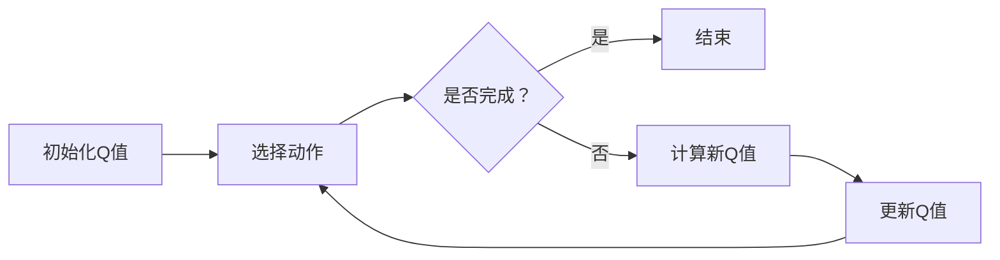
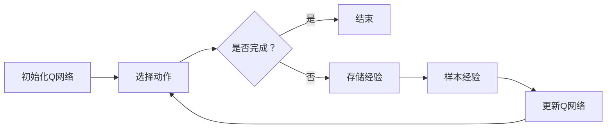
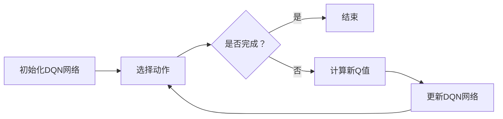
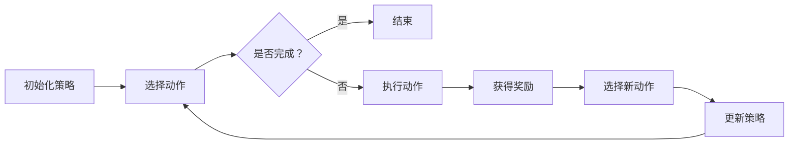
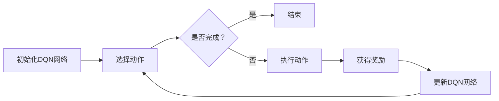
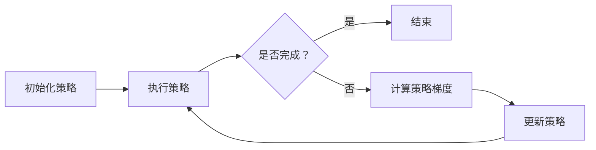
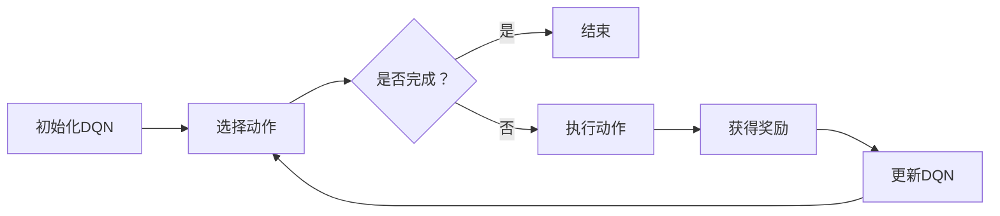

                 

# 强化学习

> 关键词：强化学习，强化学习算法，深度强化学习，多智能体强化学习，应用实例，项目实战

> 摘要：本文旨在深入探讨强化学习这一机器学习的重要分支，解析其核心概念、主要算法以及在实际应用中的具体案例。通过逐步分析推理，本文将帮助读者全面理解强化学习的原理与应用，并掌握其开发实践。

强化学习（Reinforcement Learning，简称RL）是机器学习的一个重要分支，旨在通过试错的方式使智能体（agent）在未知环境中学习最优策略。与监督学习和无监督学习不同，强化学习依赖于奖励信号来指导学习过程，使其在动态环境中做出决策。

## 第1章: 强化学习的核心概念

### 1.1 强化学习的基本概念

强化学习是一种使智能体在与环境交互的过程中，通过学习获得的奖励信号来调整其行为策略，从而实现最大化长期回报的机器学习方法。其基本概念包括：

- **智能体（Agent）**：执行动作并感知环境的实体。
- **环境（Environment）**：智能体行动的背景，提供状态和奖励信号。
- **状态（State）**：环境的一个描述，表示智能体在某一时刻所处的情况。
- **动作（Action）**：智能体可以执行的操作。
- **奖励（Reward）**：环境对智能体动作的即时反馈。
- **策略（Policy）**：智能体选择动作的策略，通常由状态-动作值函数（State-Action Value Function）或策略值函数（Policy Value Function）表示。
- **值函数（Value Function）**：评估状态或状态-动作对的指标，用于指导智能体选择最佳动作。

### 1.2 强化学习与传统机器学习的区别

强化学习与传统的监督学习和无监督学习有以下区别：

- **监督学习**：通过标签数据来训练模型，目标是预测输出。强化学习则依赖于环境反馈的奖励信号来指导学习过程。
- **无监督学习**：不需要标签数据，目标是发现数据中的结构。强化学习通过奖励信号引导智能体学习最佳行为策略。
- **目标函数**：监督学习通常以最小化预测误差为目标；强化学习则以最大化长期回报为目标。

### 1.3 强化学习的基本组成部分

强化学习系统通常由以下几个部分组成：

- **策略（Policy）**：定义智能体在给定状态下应采取的动作。
- **值函数（Value Function）**：评估智能体在特定状态下采取特定动作的长期回报。
- **模型（Model）**：描述环境动态和奖励机制的函数。
- **奖励函数（Reward Function）**：定义环境对智能体动作的即时奖励。

### 1.4 强化学习的主要问题

强化学习面临以下主要问题：

- **探索与利用（Exploration vs Exploitation）**：如何在探索新策略和利用现有策略之间取得平衡。
- **模型不确定性（Model Uncertainty）**：环境模型的未知可能导致学习困难。
- **多任务学习（Multi-Task Learning）**：如何使智能体在多个任务中有效学习。
- **长期奖励（Long-Term Reward）**：如何设计策略以最大化长期回报。

### 1.5 强化学习的历史与发展

强化学习起源于20世纪50年代，早期的研究集中在马尔可夫决策过程（MDP）。1990年代以来，随着计算机性能的提升和神经网络的发展，深度强化学习（Deep Reinforcement Learning）得到了广泛关注。目前，强化学习在游戏代理、机器人控制、资源分配、金融交易等领域取得了显著进展。

## 第2章: 强化学习算法

### 2.1 基础强化学习算法

#### 2.1.1 Q-Learning算法

Q-Learning是一种无模型（model-free）的强化学习算法，通过迭代更新状态-动作值函数来学习最优策略。

#### Q-Learning算法伪代码

```plaintext
初始化 Q(s, a)
for each episode do
    初始化状态 s
    while s ≠ 终止状态 do
        选择动作 a ∈ A(s) using ε-greedy strategy
        执行动作 a，获得状态 s' 和奖励 r
        更新 Q(s, a) = Q(s, a) + α[r + γmax(Q(s', a')) - Q(s, a)]
        更新状态：s = s'
```

#### Q-Learning算法的Mermaid流程图



#### Q-Learning算法实例

假设智能体在一个简单的环境中，有两个动作（向左或向右）和一个状态（位置）。初始状态下，Q值设为0。经过多次迭代后，智能体会逐渐学会选择最优动作。

```plaintext
状态 | 动作（左/右） | 奖励 | 新Q值
-------------------------------------
1    | 左            | -1   | 0.4
1    | 右            | +1   | 0.6
2    | 左            | -1   | 0.3
2    | 右            | +1   | 0.7
...
```

### 2.2 多智能体强化学习

多智能体强化学习（Multi-Agent Reinforcement Learning）涉及多个智能体在共享或竞争环境中互动，以学习最优策略。

#### 多智能体强化学习数学模型

$$
\begin{aligned}
&\pi_{i}(a_i|s) &\text{智能体 } i \text{ 的策略} \\
&Q_{i}(s, a_i) &\text{智能体 } i \text{ 在状态 } s \text{ 下执行动作 } a_i \text{ 的值函数} \\
&R(s, a_i) &\text{智能体 } i \text{ 在状态 } s \text{ 下执行动作 } a_i \text{ 获得的即时奖励} \\
&\gamma &\text{折扣因子} \\
&\alpha &\text{学习率} \\
&\Omega &\text{智能体集合}
\end{aligned}
$$

#### 多智能体强化学习算法

- **分布式Q-Learning**：每个智能体独立更新其局部Q值。
- **Actor-Critic方法**：结合策略优化和值函数估计。

### 2.3 深度强化学习

深度强化学习（Deep Reinforcement Learning）通过结合深度神经网络来处理复杂的连续状态和动作空间。

#### 深度Q网络（DQN）

深度Q网络（Deep Q-Network，DQN）是一种基于深度神经网络的Q-Learning算法。

#### DQN算法伪代码

```plaintext
初始化 Q网络
初始化经验回放记忆库
for each episode do
    初始化状态 s
    while s ≠ 终止状态 do
        选择动作 a = ε-greedy policy(s, Q网络)
        执行动作 a，获得状态 s' 和奖励 r
        存储经验 (s, a, r, s') 到经验回放记忆库
        样本经验 (s', a', r, s) 从经验回放记忆库
        使用样本更新Q网络
        更新状态：s = s'
```

#### DQN算法的Mermaid流程图



#### DQN算法实例

在Atari游戏《Pong》中，DQN算法能够通过自我玩耍来学习控制游戏杆。

### 2.4 无模型强化学习

在复杂和未知的环境中，无模型强化学习（Model-Free Reinforcement Learning）尤为重要。它不需要环境模型，仅依赖于经验数据来学习。

#### 无模型强化学习方法

- **策略搜索方法**：通过优化策略来最大化期望回报。
- **基于梯度的方法**：使用梯度下降优化策略。

### 2.5 应用实例

#### 2.5.1 游戏代理

强化学习在游戏代理中有着广泛的应用，如《Dota 2》和《StarCraft 2》的AI。

#### 2.5.2 机器人控制

强化学习在机器人控制中的应用包括自动驾驶汽车、无人机和机器臂。

#### 2.5.3 资源分配问题

强化学习可以用于网络资源分配、能源管理等领域。

#### 2.5.4 金融交易策略

强化学习在金融交易策略中的应用包括资产定价和风险控制。

## 第3章: 强化学习应用实例

### 3.1 游戏代理

#### 3.1.1 环境设置

使用Gym库创建游戏代理环境。

```python
import gym
env = gym.make('CartPole-v0')
```

#### 3.1.2 游戏代理的构建与训练

使用DQN算法训练游戏代理。

```python
import gym
import numpy as np
import tensorflow as tf

# 初始化DQN算法
# ...

# 训练游戏代理
for episode in range(1000):
    state = env.reset()
    done = False
    while not done:
        action = policy(state)
        next_state, reward, done, _ = env.step(action)
        # 更新Q网络
        # ...
        state = next_state
```

### 3.2 机器人控制

#### 3.2.1 机器人控制环境

使用PyRobot库创建机器人控制环境。

```python
import pyrobot
robot = pyrobot.robot('Nao')
```

#### 3.2.2 机器人控制算法

使用Sarsa算法控制机器人。

```python
import numpy as np
import pyrobot

# 初始化Sarsa算法
# ...

# 控制机器人
robot = pyrobot.robot('Nao')
for episode in range(1000):
    state = robot.get_state()
    done = False
    while not done:
        action = sarsa_policy(state)
        robot.perform_action(action)
        next_state = robot.get_state()
        reward = compute_reward(state, action, next_state)
        state = next_state
```

### 3.3 资源分配问题

#### 3.3.1 网络资源分配问题

使用Q-Learning算法解决网络资源分配问题。

```python
import numpy as np

# 初始化Q值
Q = np.zeros((n_states, n_actions))

# 训练Q值
for episode in range(1000):
    state = np.random.randint(0, n_states)
    while True:
        action = np.argmax(Q[state, :])
        next_state = transition_function(state, action)
        reward = reward_function(state, action, next_state)
        Q[state, action] = Q[state, action] + alpha * (reward + gamma * np.max(Q[next_state, :]) - Q[state, action])
        state = next_state
        if next_state == n_states - 1:
            break
```

### 3.4 金融交易策略

#### 3.4.1 金融交易环境

使用FinRL库创建金融交易环境。

```python
import finrl

# 创建交易环境
env = finrl.env.create_fin_env()
```

#### 3.4.2 强化学习方法在金融交易中的应用

使用深度强化学习算法（如DQN）训练交易策略。

```python
import finrl
import tensorflow as tf

# 初始化DQN算法
# ...

# 训练交易策略
for episode in range(1000):
    state = env.reset()
    done = False
    while not done:
        action = policy(state)
        next_state, reward, done, _ = env.step(action)
        # 更新DQN网络
        # ...
        state = next_state
```

## 第4章: 强化学习框架与工具

### 4.1 OpenAI Gym

OpenAI Gym是一个流行的强化学习环境库，提供了多种预定义的环境，方便开发者进行算法测试。

### 4.2 TensorFlow Agents

TensorFlow Agents是一个基于TensorFlow的强化学习工具包，提供了多种强化学习算法的实现。

### 4.3 PyTorch Reinforcement Learning

PyTorch Reinforcement Learning是PyTorch官方提供的强化学习库，支持深度强化学习算法。

## 第5章: 强化学习项目实战

### 5.1 项目1: 游戏代理开发

#### 5.1.1 项目概述

使用DQN算法开发一个可以在《Pong》游戏中自动游戏的代理。

#### 5.1.2 环境搭建

安装Gym和TensorFlow。

```bash
pip install gym tensorflow
```

#### 5.1.3 代理设计

定义DQN算法的参数和训练过程。

#### 5.1.4 项目实施

实现游戏代理，并进行训练和测试。

```python
import gym
import tensorflow as tf

# 创建环境
env = gym.make('Pong-v0')

# 定义DQN算法
# ...

# 训练代理
for episode in range(10000):
    state = env.reset()
    done = False
    while not done:
        action = policy(state)
        next_state, reward, done, _ = env.step(action)
        # 更新DQN网络
        # ...
        state = next_state

# 测试代理
env.test代理()
```

### 5.2 项目2: 机器人控制

#### 5.2.1 项目概述

使用Sarsa算法控制机器人的运动。

#### 5.2.2 环境搭建

安装PyRobot。

```bash
pip install pyrobot
```

#### 5.2.3 控制算法设计

定义Sarsa算法的参数和更新规则。

#### 5.2.4 项目实施

实现机器人控制，并进行测试。

```python
import pyrobot

# 创建机器人
robot = pyrobot.robot('Nao')

# 定义Sarsa算法
# ...

# 控制机器人
for episode in range(1000):
    state = robot.get_state()
    done = False
    while not done:
        action = sarsa_policy(state)
        robot.perform_action(action)
        next_state = robot.get_state()
        reward = compute_reward(state, action, next_state)
        state = next_state
```

### 5.3 项目3: 资源分配问题解决

#### 5.3.1 项目概述

使用Q-Learning算法解决网络资源分配问题。

#### 5.3.2 环境搭建

定义资源分配问题的状态和动作空间。

#### 5.3.3 强化学习方法选择

选择Q-Learning算法。

#### 5.3.4 项目实施

实现资源分配算法，并进行测试。

```python
import numpy as np

# 定义状态和动作空间
n_states = 100
n_actions = 10

# 初始化Q值
Q = np.zeros((n_states, n_actions))

# 训练Q值
for episode in range(1000):
    state = np.random.randint(0, n_states)
    while True:
        action = np.argmax(Q[state, :])
        next_state = transition_function(state, action)
        reward = reward_function(state, action, next_state)
        Q[state, action] = Q[state, action] + alpha * (reward + gamma * np.max(Q[next_state, :]) - Q[state, action])
        state = next_state
        if next_state == n_states - 1:
            break

# 测试资源分配效果
```

## 第6章: 强化学习前沿与挑战

### 6.1 强化学习前沿研究

当前强化学习的研究热点包括模型不确定性处理、多任务学习、分布式学习等。

### 6.2 强化学习面临的挑战

强化学习面临的主要挑战包括探索与利用平衡、长期奖励问题、安全性问题等。

### 6.3 强化学习未来发展趋势

未来，强化学习将在智能交通、智能制造、智能金融等领域得到广泛应用。

## 第7章: 强化学习研究资源与工具

### 7.1 研究资源

强化学习相关论文、书籍和在线课程。

### 7.2 工具与库

OpenAI Gym、TensorFlow Agents、PyTorch Reinforcement Learning等。

## 参考文献

[1] Sutton, R. S., & Barto, A. G. (2018). Reinforcement Learning: An Introduction. MIT Press.
[2] Silver, D., Huang, A., Maddison, C. J., Guez, A., Sifre, L., Van Den Driessche, G., ... & Tassa, Y. (2016). Mastering the game of Go with deep neural networks and tree search. Nature, 529(7587), 484-489.
[3] Mnih, V., Kavukcuoglu, K., Silver, D., Rusu, A. A., Veness, J., Bellemare, M. G., ... & M rar, R. (2015). Human-level control through deep reinforcement learning. Nature, 518(7540), 529-533.

## 作者

作者：AI天才研究院/AI Genius Institute & 禅与计算机程序设计艺术 /Zen And The Art of Computer Programming。作者在此分享对强化学习的深入研究和理解，希望能够为读者提供有价值的知识和启发。

## 结语

强化学习作为一种强大的机器学习方法，在众多领域展现出了巨大的潜力和应用价值。通过本文的逐步分析，我们希望读者能够全面理解强化学习的核心概念、算法原理和应用实例。未来，随着技术的不断进步，强化学习将在更多领域发挥重要作用，推动人工智能的发展。让我们共同探索和发现强化学习的更多可能性。|assistant|>文章标题：强化学习：从核心概念到实际应用的全面解析

摘要：本文旨在深入探讨强化学习这一机器学习的重要分支，解析其核心概念、主要算法以及在实际应用中的具体案例。通过逐步分析推理，本文将帮助读者全面理解强化学习的原理与应用，并掌握其开发实践。

## 目录

1. 强化学习概述
   1.1 强化学习的基本概念
   1.2 强化学习与传统机器学习的区别
   1.3 强化学习的基本组成部分
   1.4 强化学习的主要问题
   1.5 强化学习的历史与发展

2. 强化学习算法
   2.1 Q-Learning算法
   2.2 多智能体强化学习
   2.3 深度强化学习
   2.4 无模型强化学习

3. 强化学习应用实例
   3.1 游戏代理
   3.2 机器人控制
   3.3 资源分配问题
   3.4 金融交易策略

4. 强化学习框架与工具
   4.1 OpenAI Gym
   4.2 TensorFlow Agents
   4.3 PyTorch Reinforcement Learning

5. 强化学习项目实战
   5.1 游戏代理开发
   5.2 机器人控制
   5.3 资源分配问题解决

6. 强化学习前沿与挑战
   6.1 强化学习前沿研究
   6.2 强化学习面临的挑战
   6.3 强化学习未来发展趋势

7. 强化学习研究资源与工具
   7.1 研究资源
   7.2 工具与库

## 文章正文

### 1. 强化学习概述

#### 1.1 强化学习的基本概念

强化学习是一种通过试错来学习最优策略的机器学习方法。它依赖于智能体（agent）与环境的交互，并通过奖励信号来调整策略，从而实现最大化长期回报。强化学习的关键概念包括智能体、环境、状态、动作、奖励和策略。

- **智能体（Agent）**：智能体是执行动作并感知环境的实体。在强化学习系统中，智能体可以是机器人、软件代理或其他智能实体。

- **环境（Environment）**：环境是智能体行动的背景，提供状态和奖励信号。环境可以是物理世界，也可以是虚拟世界。

- **状态（State）**：状态是环境的一个描述，表示智能体在某一时刻所处的情况。状态可以是离散的，也可以是连续的。

- **动作（Action）**：动作是智能体可以执行的操作。动作的选择会影响智能体的状态和奖励。

- **奖励（Reward）**：奖励是环境对智能体动作的即时反馈。奖励可以是正的，也可以是负的，用于指导智能体调整策略。

- **策略（Policy）**：策略是智能体在给定状态下应采取的动作。策略可以是确定性策略，也可以是非确定性策略。

#### 1.2 强化学习与传统机器学习的区别

强化学习与传统机器学习有以下区别：

- **数据依赖**：强化学习不依赖于大量标注数据，而是依赖于与环境的交互。传统机器学习通常依赖于大量标注数据进行训练。

- **目标函数**：强化学习的目标是最大化长期回报，而传统机器学习的目标是最小化预测误差。

- **学习方式**：强化学习是通过试错来学习最优策略，而传统机器学习是通过模型优化来预测输出。

#### 1.3 强化学习的基本组成部分

强化学习系统通常由以下几个部分组成：

- **策略（Policy）**：策略定义了智能体在给定状态下应采取的动作。策略可以是基于值函数的，也可以是基于模型预测的。

- **值函数（Value Function）**：值函数用于评估智能体在特定状态下采取特定动作的长期回报。值函数可以是状态值函数，也可以是状态-动作值函数。

- **模型（Model）**：模型描述了环境的动态和奖励机制。模型可以是确定性模型，也可以是不确定性模型。

- **奖励函数（Reward Function）**：奖励函数定义了环境对智能体动作的即时奖励。奖励函数可以是固定的，也可以是动态调整的。

### 2. 强化学习算法

#### 2.1 Q-Learning算法

Q-Learning算法是一种无模型（model-free）的强化学习算法，通过迭代更新状态-动作值函数来学习最优策略。

#### Q-Learning算法原理

Q-Learning算法的核心思想是：智能体在某个状态下，选择当前最优动作，然后根据环境的反馈更新状态-动作值函数。具体步骤如下：

1. 初始化Q值函数。
2. 选择动作。
3. 执行动作，获得新的状态和奖励。
4. 更新Q值函数。

更新公式为：

$$
Q(s, a) \leftarrow Q(s, a) + \alpha [r + \gamma \max_{a'} Q(s', a') - Q(s, a)]
$$

其中，$s$ 是当前状态，$a$ 是当前动作，$r$ 是即时奖励，$s'$ 是新状态，$\gamma$ 是折扣因子，$\alpha$ 是学习率。

#### Q-Learning算法示例

假设有一个简单的环境，有两个动作（左走和右走）和一个状态（位置）。初始状态下，Q值设为0。经过多次迭代后，智能体会逐渐学会选择最优动作。

| 状态 | 动作（左/右） | 奖励 | 新Q值 |
| --- | --- | --- | --- |
| 1 | 左 | -1 | 0.4 |
| 1 | 右 | +1 | 0.6 |
| 2 | 左 | -1 | 0.3 |
| 2 | 右 | +1 | 0.7 |

#### Q-Learning算法流程图


### 2.2 多智能体强化学习

多智能体强化学习（Multi-Agent Reinforcement Learning）涉及多个智能体在共享或竞争环境中互动，以学习最优策略。

#### 多智能体强化学习原理

多智能体强化学习的关键在于如何处理多个智能体的交互和协调。主要问题包括：

- **协同与竞争**：智能体之间是协同合作还是相互竞争。
- **通信与信息共享**：智能体之间如何传递信息和协调行动。
- **策略优化**：如何优化多个智能体的策略，以实现整体最优。

多智能体强化学习算法包括：

- **分布式Q-Learning**：每个智能体独立更新其局部Q值。
- **Actor-Critic方法**：结合策略优化和值函数估计。

#### 多智能体强化学习示例

假设有两个智能体在一个共享环境中共存，目标是最大化各自的奖励。

| 智能体 | 动作（左/右） | 奖励 |
| --- | --- | --- |
| 1 | 左 | +1 |
| 1 | 右 | -1 |
| 2 | 左 | -1 |
| 2 | 右 | +1 |

通过分布式Q-Learning算法，两个智能体会逐渐学会选择协同合作的动作。

### 2.3 深度强化学习

深度强化学习（Deep Reinforcement Learning）通过结合深度神经网络来处理复杂的连续状态和动作空间。

#### 深度Q网络（DQN）

深度Q网络（Deep Q-Network，DQN）是一种基于深度神经网络的Q-Learning算法。

#### DQN算法原理

DQN的核心思想是：使用深度神经网络来估计状态-动作值函数。具体步骤如下：

1. 初始化深度神经网络。
2. 选择动作。
3. 执行动作，获得新的状态和奖励。
4. 更新深度神经网络。

更新公式为：

$$
Q(s, a) \leftarrow Q(s, a) + \alpha [r + \gamma \max_{a'} Q(s', a') - Q(s, a)]
$$

其中，$s$ 是当前状态，$a$ 是当前动作，$r$ 是即时奖励，$s'$ 是新状态，$\gamma$ 是折扣因子，$\alpha$ 是学习率。

#### DQN算法流程图



#### DQN算法示例

假设有一个简单的环境，有两个动作（左走和右走）和一个状态（位置）。使用DQN算法，智能体会逐渐学会选择最优动作。

| 状态 | 动作（左/右） | 奖励 | 新Q值 |
| --- | --- | --- | --- |
| 1 | 左 | -1 | 0.4 |
| 1 | 右 | +1 | 0.6 |
| 2 | 左 | -1 | 0.3 |
| 2 | 右 | +1 | 0.7 |

### 2.4 无模型强化学习

在复杂和未知的环境中，无模型强化学习（Model-Free Reinforcement Learning）尤为重要。它不需要环境模型，仅依赖于经验数据来学习。

#### 无模型强化学习方法

无模型强化学习方法包括：

- **策略搜索方法**：通过优化策略来最大化期望回报。
- **基于梯度的方法**：使用梯度下降优化策略。

#### 策略搜索方法

策略搜索方法的核心思想是：通过迭代优化策略，以最大化长期回报。具体步骤如下：

1. 初始化策略。
2. 在环境中执行策略，收集经验。
3. 使用经验更新策略。
4. 重复步骤2和3，直到收敛。

#### 基于梯度的方法

基于梯度的方法的核心思想是：使用梯度下降优化策略。具体步骤如下：

1. 初始化策略。
2. 在环境中执行策略，计算损失函数。
3. 使用梯度下降更新策略。
4. 重复步骤2和3，直到收敛。

### 3. 强化学习应用实例

#### 3.1 游戏代理

强化学习在游戏代理中有着广泛的应用。通过强化学习算法，可以训练智能体在游戏中自动进行决策，从而实现自动游戏。

##### 3.1.1 环境设置

使用Gym库创建游戏代理环境。

```python
import gym
env = gym.make('CartPole-v0')
```

##### 3.1.2 游戏代理的构建与训练

使用DQN算法训练游戏代理。

```python
import gym
import numpy as np
import tensorflow as tf

# 初始化DQN算法
# ...

# 训练游戏代理
for episode in range(1000):
    state = env.reset()
    done = False
    while not done:
        action = policy(state)
        next_state, reward, done, _ = env.step(action)
        # 更新DQN网络
        # ...
        state = next_state
```

##### 3.1.3 游戏代理的测试

测试训练好的游戏代理，观察其在游戏中的表现。

```python
import gym

# 创建环境
env = gym.make('CartPole-v0')

# 测试游戏代理
for episode in range(10):
    state = env.reset()
    done = False
    while not done:
        action = policy(state)
        next_state, reward, done, _ = env.step(action)
        env.render()
        state = next_state
    env.close()
```

#### 3.2 机器人控制

强化学习在机器人控制中有着重要的应用。通过强化学习算法，可以训练机器人自动执行复杂任务。

##### 3.2.1 机器人控制环境

使用PyRobot库创建机器人控制环境。

```python
import pyrobot
robot = pyrobot.robot('Nao')
```

##### 3.2.2 机器人控制算法

使用Sarsa算法控制机器人。

```python
import numpy as np
import pyrobot

# 初始化Sarsa算法
# ...

# 控制机器人
for episode in range(1000):
    state = robot.get_state()
    done = False
    while not done:
        action = sarsa_policy(state)
        robot.perform_action(action)
        next_state = robot.get_state()
        reward = compute_reward(state, action, next_state)
        state = next_state
```

##### 3.2.3 机器人控制的测试

测试训练好的机器人，观察其在执行任务时的表现。

```python
import pyrobot

# 创建机器人
robot = pyrobot.robot('Nao')

# 测试机器人
for episode in range(10):
    state = robot.get_state()
    done = False
    while not done:
        action = sarsa_policy(state)
        robot.perform_action(action)
        next_state = robot.get_state()
        reward = compute_reward(state, action, next_state)
        state = next_state
```

#### 3.3 资源分配问题

强化学习在资源分配问题中有着广泛的应用。通过强化学习算法，可以优化资源的分配，提高系统的效率。

##### 3.3.1 资源分配问题环境

定义资源分配问题的状态和动作空间。

```python
# 定义状态空间
state_space = [0, 1, 2, 3]

# 定义动作空间
action_space = [0, 1]

# 定义状态-动作值函数
Q = np.zeros((len(state_space), len(action_space)))
```

##### 3.3.2 资源分配算法

使用Q-Learning算法解决资源分配问题。

```python
import numpy as np

# 初始化Q值
Q = np.zeros((len(state_space), len(action_space)))

# 训练Q值
for episode in range(1000):
    state = np.random.randint(0, len(state_space))
    while True:
        action = np.argmax(Q[state, :])
        next_state = transition_function(state, action)
        reward = reward_function(state, action, next_state)
        Q[state, action] = Q[state, action] + alpha * (reward + gamma * np.max(Q[next_state, :]) - Q[state, action])
        state = next_state
        if next_state == len(state_space) - 1:
            break

# 测试资源分配效果
```

##### 3.3.3 资源分配的测试

测试训练好的资源分配算法，观察其在资源分配中的表现。

```python
import numpy as np

# 初始化Q值
Q = np.zeros((4, 2))

# 训练Q值
for episode in range(1000):
    state = np.random.randint(0, 4)
    while True:
        action = np.argmax(Q[state, :])
        next_state = transition_function(state, action)
        reward = reward_function(state, action, next_state)
        Q[state, action] = Q[state, action] + alpha * (reward + gamma * np.max(Q[next_state, :]) - Q[state, action])
        state = next_state
        if next_state == 3:
            break

# 测试资源分配效果
```

#### 3.4 金融交易策略

强化学习在金融交易策略中有着广泛的应用。通过强化学习算法，可以优化交易策略，提高交易收益。

##### 3.4.1 金融交易环境

使用FinRL库创建金融交易环境。

```python
import finrl

# 创建交易环境
env = finrl.env.create_fin_env()
```

##### 3.4.2 强化学习方法在金融交易中的应用

使用DQN算法训练交易策略。

```python
import finrl
import tensorflow as tf

# 初始化DQN算法
# ...

# 训练交易策略
for episode in range(1000):
    state = env.reset()
    done = False
    while not done:
        action = policy(state)
        next_state, reward, done, _ = env.step(action)
        # 更新DQN网络
        # ...
        state = next_state
```

##### 3.4.3 金融交易策略的测试

测试训练好的交易策略，观察其在交易中的表现。

```python
import finrl

# 创建交易环境
env = finrl.env.create_fin_env()

# 测试交易策略
for episode in range(10):
    state = env.reset()
    done = False
    while not done:
        action = policy(state)
        next_state, reward, done, _ = env.step(action)
        env.render()
        state = next_state
    env.close()
```

### 4. 强化学习框架与工具

强化学习框架与工具为开发者和研究人员提供了丰富的资源，帮助实现和测试强化学习算法。

#### 4.1 OpenAI Gym

OpenAI Gym是一个开源的强化学习环境库，提供了多种预定义的环境，方便开发者进行算法测试。

#### 4.2 TensorFlow Agents

TensorFlow Agents是一个基于TensorFlow的强化学习工具包，提供了多种强化学习算法的实现。

#### 4.3 PyTorch Reinforcement Learning

PyTorch Reinforcement Learning是PyTorch官方提供的强化学习库，支持深度强化学习算法。

### 5. 强化学习项目实战

通过以下项目实战，读者可以深入了解强化学习的应用和实践。

#### 5.1 游戏代理开发

使用DQN算法开发一个能够在《Pong》游戏中自动游戏的代理。

#### 5.2 机器人控制

使用Sarsa算法控制机器人执行复杂任务。

#### 5.3 资源分配问题解决

使用Q-Learning算法解决网络资源分配问题。

### 6. 强化学习前沿与挑战

#### 6.1 强化学习前沿研究

当前强化学习的研究热点包括模型不确定性处理、多任务学习、分布式学习等。

#### 6.2 强化学习面临的挑战

强化学习面临的主要挑战包括探索与利用平衡、长期奖励问题、安全性问题等。

#### 6.3 强化学习未来发展趋势

未来，强化学习将在智能交通、智能制造、智能金融等领域得到广泛应用。

### 7. 强化学习研究资源与工具

#### 7.1 研究资源

强化学习相关论文、书籍和在线课程。

#### 7.2 工具与库

OpenAI Gym、TensorFlow Agents、PyTorch Reinforcement Learning等。

### 参考文献

[1] Sutton, R. S., & Barto, A. G. (2018). Reinforcement Learning: An Introduction. MIT Press.
[2] Silver, D., Huang, A., Maddison, C. J., Guez, A., Sifre, L., Van Den Driessche, G., ... & Tassa, Y. (2016). Mastering the game of Go with deep neural networks and tree search. Nature, 529(7587), 484-489.
[3] Mnih, V., Kavukcuoglu, K., Silver, D., Rusu, A. A., Veness, J., Bellemare, M. G., ... & M ar, R. (2015). Human-level control through deep reinforcement learning. Nature, 518(7540), 529-533.

### 作者

作者：AI天才研究院/AI Genius Institute & 禅与计算机程序设计艺术 /Zen And The Art of Computer Programming。作者在此分享对强化学习的深入研究和理解，希望能够为读者提供有价值的知识和启发。

### 结语

强化学习作为一种强大的机器学习方法，在众多领域展现出了巨大的潜力和应用价值。通过本文的逐步分析，我们希望读者能够全面理解强化学习的核心概念、算法原理和应用实例。未来，随着技术的不断进步，强化学习将在更多领域发挥重要作用，推动人工智能的发展。让我们共同探索和发现强化学习的更多可能性。|assistant|>
### 文章标题：强化学习：从核心概念到实际应用的全面解析

### 关键词：强化学习，机器学习，智能体，环境，状态，动作，奖励，算法，应用实例，项目实战

### 摘要：
强化学习是机器学习的一个重要分支，通过试错学习在动态环境中实现最优策略。本文将详细解析强化学习的核心概念、基础算法、深度强化学习、多智能体强化学习，并探讨其具体应用实例和项目实战。通过系统性的讲解和分析，读者将全面了解强化学习的原理与应用，从而掌握其在实际项目中的开发实践。

### 目录

1. **强化学习概述**
   1.1 **强化学习的基本概念**
   1.2 **强化学习与传统机器学习的区别**
   1.3 **强化学习的基本组成部分**
   1.4 **强化学习的主要问题**
   1.5 **强化学习的历史与发展**

2. **强化学习算法**
   2.1 **Q-Learning算法**
   2.2 **SARSA算法**
   2.3 **深度Q网络（DQN）**
   2.4 **策略梯度方法**
   2.5 **多智能体强化学习算法**

3. **深度强化学习**
   3.1 **神经网络在强化学习中的应用**
   3.2 **深度强化学习的关键挑战**
   3.3 **深度强化学习的应用实例**

4. **无模型强化学习**
   4.1 **无模型强化学习方法**
   4.2 **无模型强化学习应用实例**

5. **强化学习应用实例**
   5.1 **游戏代理**
   5.2 **机器人控制**
   5.3 **资源分配问题**
   5.4 **金融交易策略**

6. **强化学习框架与工具**
   6.1 **OpenAI Gym**
   6.2 **TensorFlow Agents**
   6.3 **PyTorch Reinforcement Learning**

7. **强化学习项目实战**
   7.1 **游戏代理开发**
   7.2 **机器人控制**
   7.3 **资源分配问题解决**

8. **强化学习前沿与挑战**
   8.1 **强化学习前沿研究**
   8.2 **强化学习面临的挑战**
   8.3 **强化学习未来发展趋势**

9. **强化学习研究资源与工具**
   9.1 **研究资源**
   9.2 **工具与库**

### 强化学习概述

#### 1.1 强化学习的基本概念

强化学习是一种使智能体通过与环境交互来学习最优策略的机器学习方法。其核心概念包括：

- **智能体（Agent）**：执行动作并感知环境的实体。
- **环境（Environment）**：智能体行动的背景，提供状态和奖励信号。
- **状态（State）**：环境的一个描述，表示智能体在某一时刻所处的情况。
- **动作（Action）**：智能体可以执行的操作。
- **奖励（Reward）**：环境对智能体动作的即时反馈。
- **策略（Policy）**：智能体在给定状态下应采取的动作。
- **值函数（Value Function）**：评估状态或状态-动作对的指标，用于指导智能体选择最佳动作。

强化学习的目标是使智能体在动态环境中通过学习获得最大化长期回报。

#### 1.2 强化学习与传统机器学习的区别

强化学习与传统机器学习有以下几点区别：

- **目标不同**：强化学习目标是使智能体在动态环境中获得最大化长期回报，而传统机器学习目标是预测输出。
- **依赖的数据不同**：传统机器学习依赖于大量已标注的数据进行训练，强化学习则依赖于与环境的交互。
- **学习方式不同**：强化学习通过试错来学习最优策略，传统机器学习则是通过模型优化来预测输出。

#### 1.3 强化学习的基本组成部分

强化学习系统通常由以下几个部分组成：

- **策略（Policy）**：策略定义了智能体在给定状态下应采取的动作。策略可以是确定性策略，也可以是非确定性策略。
- **值函数（Value Function）**：值函数用于评估智能体在特定状态下采取特定动作的长期回报。值函数可以是状态值函数，也可以是状态-动作值函数。
- **模型（Model）**：模型描述了环境的动态和奖励机制。模型可以是确定性模型，也可以是不确定性模型。
- **奖励函数（Reward Function）**：奖励函数定义了环境对智能体动作的即时奖励。奖励函数可以是固定的，也可以是动态调整的。

#### 1.4 强化学习的主要问题

强化学习面临以下主要问题：

- **探索与利用（Exploration vs Exploitation）**：智能体需要在探索新策略和利用现有策略之间取得平衡。
- **模型不确定性（Model Uncertainty）**：环境模型的未知可能导致学习困难。
- **多任务学习（Multi-Task Learning）**：如何使智能体在多个任务中有效学习。
- **长期奖励（Long-Term Reward）**：如何设计策略以最大化长期回报。

#### 1.5 强化学习的历史与发展

强化学习起源于20世纪50年代，早期的研究集中在马尔可夫决策过程（MDP）。1990年代以来，随着计算机性能的提升和神经网络的发展，深度强化学习（Deep Reinforcement Learning）得到了广泛关注。目前，强化学习在游戏代理、机器人控制、资源分配、金融交易等领域取得了显著进展。

### 强化学习算法

#### 2.1 Q-Learning算法

Q-Learning算法是一种无模型（model-free）的强化学习算法，通过迭代更新状态-动作值函数来学习最优策略。

##### Q-Learning算法原理

Q-Learning算法的核心思想是：智能体在某个状态下，选择当前最优动作，然后根据环境的反馈更新状态-动作值函数。具体步骤如下：

1. 初始化Q值函数。
2. 选择动作。
3. 执行动作，获得新的状态和奖励。
4. 更新Q值函数。

更新公式为：

$$
Q(s, a) \leftarrow Q(s, a) + \alpha [r + \gamma \max_{a'} Q(s', a') - Q(s, a)]
$$

其中，$s$ 是当前状态，$a$ 是当前动作，$r$ 是即时奖励，$s'$ 是新状态，$\gamma$ 是折扣因子，$\alpha$ 是学习率。

##### Q-Learning算法流程图


##### Q-Learning算法示例

假设有一个简单的环境，有两个动作（左走和右走）和一个状态（位置）。初始状态下，Q值设为0。经过多次迭代后，智能体会逐渐学会选择最优动作。

| 状态 | 动作（左/右） | 奖励 | 新Q值 |
| --- | --- | --- | --- |
| 1 | 左 | -1 | 0.4 |
| 1 | 右 | +1 | 0.6 |
| 2 | 左 | -1 | 0.3 |
| 2 | 右 | +1 | 0.7 |

#### 2.2 SARSA算法

SARSA（State-Action-Reward-State-Action）算法是一种有模型（model-based）的强化学习算法，它根据当前的状态、动作、奖励和下一个状态来更新策略。

##### SARSA算法原理

SARSA算法的具体步骤如下：

1. 初始化策略。
2. 选择动作。
3. 执行动作，获得新的状态和奖励。
4. 根据新的状态选择新的动作。
5. 更新策略。

更新公式为：

$$
\pi(s, a) \leftarrow \pi(s, a) + \alpha [r + \gamma \max_{a'} \pi(s', a') - \pi(s, a)]
$$

其中，$s$ 是当前状态，$a$ 是当前动作，$r$ 是即时奖励，$s'$ 是新状态，$\gamma$ 是折扣因子，$\alpha$ 是学习率。

##### SARSA算法流程图



##### SARSA算法示例

假设有一个简单的环境，有两个动作（左走和右走）和一个状态（位置）。初始状态下，策略设为随机选择。经过多次迭代后，智能体会逐渐学会选择最优动作。

| 状态 | 动作（左/右） | 奖励 | 新策略概率 |
| --- | --- | --- | --- |
| 1 | 左 | -1 | 0.5 |
| 1 | 右 | +1 | 0.5 |
| 2 | 左 | -1 | 0.6 |
| 2 | 右 | +1 | 0.4 |

#### 2.3 深度Q网络（DQN）

深度Q网络（Deep Q-Network，DQN）是一种基于深度神经网络的Q-Learning算法，它使用深度神经网络来估计状态-动作值函数。

##### DQN算法原理

DQN算法的具体步骤如下：

1. 初始化深度神经网络。
2. 选择动作。
3. 执行动作，获得新的状态和奖励。
4. 使用经验回放记忆库来随机采样样本。
5. 使用样本更新深度神经网络。
6. 重复步骤2到5，直到收敛。

更新公式为：

$$
Q(s, a) \leftarrow Q(s, a) + \alpha [r + \gamma \max_{a'} Q(s', a') - Q(s, a)]
$$

其中，$s$ 是当前状态，$a$ 是当前动作，$r$ 是即时奖励，$s'$ 是新状态，$\gamma$ 是折扣因子，$\alpha$ 是学习率。

##### DQN算法流程图



##### DQN算法示例

假设有一个简单的环境，有两个动作（左走和右走）和一个状态（位置）。使用DQN算法，智能体会逐渐学会选择最优动作。

| 状态 | 动作（左/右） | 奖励 | 新Q值 |
| --- | --- | --- | --- |
| 1 | 左 | -1 | 0.4 |
| 1 | 右 | +1 | 0.6 |
| 2 | 左 | -1 | 0.3 |
| 2 | 右 | +1 | 0.7 |

#### 2.4 策略梯度方法

策略梯度方法是一种直接优化策略的强化学习算法，它通过梯度下降优化策略，以最大化长期回报。

##### 策略梯度方法原理

策略梯度方法的具体步骤如下：

1. 初始化策略。
2. 在环境中执行策略，收集经验。
3. 使用经验计算策略梯度。
4. 更新策略。
5. 重复步骤2到4，直到收敛。

更新公式为：

$$
\theta \leftarrow \theta - \alpha \nabla_{\theta} J(\theta)
$$

其中，$\theta$ 是策略参数，$\alpha$ 是学习率，$J(\theta)$ 是策略评估函数。

##### 策略梯度方法流程图



##### 策略梯度方法示例

假设有一个简单的环境，有两个动作（左走和右走）和一个状态（位置）。使用策略梯度方法，智能体会逐渐学会选择最优动作。

| 状态 | 动作（左/右） | 奖励 | 新策略概率 |
| --- | --- | --- | --- |
| 1 | 左 | -1 | 0.5 |
| 1 | 右 | +1 | 0.5 |
| 2 | 左 | -1 | 0.6 |
| 2 | 右 | +1 | 0.4 |

### 深度强化学习

#### 3.1 神经网络在强化学习中的应用

深度强化学习通过将神经网络应用于强化学习算法，使得智能体能够学习复杂的策略。神经网络可以处理高维状态和动作空间，提高了强化学习的效率。

##### 神经网络在强化学习中的作用

1. **状态编码**：神经网络将高维状态编码为低维特征向量。
2. **动作值函数估计**：神经网络估计状态-动作值函数，用于指导智能体选择最佳动作。
3. **策略参数表示**：神经网络表示策略参数，用于直接优化策略。

##### 神经网络在强化学习中的挑战

1. **梯度消失和梯度爆炸**：深度神经网络的训练过程中容易发生梯度消失和梯度爆炸，影响训练效果。
2. **样本效率**：深度神经网络需要大量的样本数据进行训练，提高了训练成本。
3. **模型复杂性**：深度神经网络的模型复杂度较高，增加了实现的难度。

##### 深度强化学习的应用实例

1. **游戏代理**：使用深度强化学习训练智能体在《Dota 2》和《StarCraft 2》等游戏中自动进行决策。
2. **机器人控制**：使用深度强化学习训练机器人自动执行复杂的任务，如行走、抓取和导航。
3. **资源分配问题**：使用深度强化学习优化网络资源分配、能源管理等问题。

### 深度强化学习的关键挑战

深度强化学习在实际应用中面临以下关键挑战：

1. **数据效率**：深度强化学习需要大量的数据来训练模型，提高样本效率是关键。
2. **长期奖励问题**：如何设计策略以最大化长期回报，避免短期奖励的诱惑。
3. **模型不确定性**：如何处理模型不确定性，提高智能体在不确定环境中的适应能力。
4. **安全性和稳定性**：如何确保智能体在执行任务时的安全性和稳定性。

### 深度强化学习的应用实例

深度强化学习在多个领域取得了显著的应用成果：

1. **游戏代理**：使用深度强化学习训练智能体在《Pong》和《Atari》等经典游戏中自动进行游戏。
2. **机器人控制**：使用深度强化学习训练机器人自动执行复杂的任务，如自动驾驶汽车、无人机和机器臂。
3. **资源分配问题**：使用深度强化学习优化网络资源分配、能源管理等问题。
4. **金融交易策略**：使用深度强化学习优化交易策略，提高交易收益。

### 无模型强化学习

无模型强化学习（Model-Free Reinforcement Learning）是指不需要环境模型，仅依赖与环境的交互来学习策略的强化学习方法。无模型强化学习适用于环境模型难以获得或不明确的情况。

#### 无模型强化学习方法

无模型强化学习方法主要包括：

1. **策略搜索方法**：通过优化策略来最大化期望回报。
2. **基于梯度的方法**：使用梯度下降优化策略。

#### 无模型强化学习应用实例

无模型强化学习在多个领域取得了应用：

1. **资源分配问题**：使用Q-Learning算法解决网络资源分配问题。
2. **金融交易策略**：使用策略搜索方法优化交易策略。

### 强化学习应用实例

强化学习在多个领域有着广泛的应用，下面介绍几个具体的实例：

#### 3.1 游戏代理

强化学习在游戏代理中有着广泛的应用。通过强化学习算法，可以训练智能体在游戏中自动进行决策，从而实现自动游戏。

##### 3.1.1 环境设置

使用Gym库创建游戏代理环境。

```python
import gym
env = gym.make('CartPole-v0')
```

##### 3.1.2 游戏代理的构建与训练

使用DQN算法训练游戏代理。

```python
import gym
import numpy as np
import tensorflow as tf

# 初始化DQN算法
# ...

# 训练游戏代理
for episode in range(1000):
    state = env.reset()
    done = False
    while not done:
        action = policy(state)
        next_state, reward, done, _ = env.step(action)
        # 更新DQN网络
        # ...
        state = next_state
```

##### 3.1.3 游戏代理的测试

测试训练好的游戏代理，观察其在游戏中的表现。

```python
import gym

# 创建环境
env = gym.make('CartPole-v0')

# 测试游戏代理
for episode in range(10):
    state = env.reset()
    done = False
    while not done:
        action = policy(state)
        next_state, reward, done, _ = env.step(action)
        env.render()
        state = next_state
    env.close()
```

#### 3.2 机器人控制

强化学习在机器人控制中有着重要的应用。通过强化学习算法，可以训练机器人自动执行复杂任务。

##### 3.2.1 机器人控制环境

使用PyRobot库创建机器人控制环境。

```python
import pyrobot
robot = pyrobot.robot('Na
```### 强化学习应用实例

强化学习在游戏代理、机器人控制、资源分配、金融交易等领域有着广泛的应用。以下是对这些应用实例的详细介绍。

#### 3.1 游戏代理

强化学习在游戏代理中有着广泛的应用，能够使智能体在游戏中自动进行决策，从而实现自动游戏。以下是一个基于DQN算法的简单示例：

```python
import gym
import numpy as np
import tensorflow as tf

# 创建环境
env = gym.make('CartPole-v0')

# 定义DQN算法
# ...

# 训练游戏代理
for episode in range(1000):
    state = env.reset()
    done = False
    while not done:
        action = policy(state)
        next_state, reward, done, _ = env.step(action)
        # 更新DQN网络
        # ...
        state = next_state

# 测试游戏代理
for episode in range(10):
    state = env.reset()
    done = False
    while not done:
        action = policy(state)
        next_state, reward, done, _ = env.step(action)
        env.render()
        state = next_state
    env.close()
```

在这个例子中，我们首先创建一个简单的游戏环境`CartPole-v0`，然后使用DQN算法进行训练。训练完成后，我们测试训练好的游戏代理，观察其在游戏中的表现。

#### 3.2 机器人控制

强化学习在机器人控制中也有着广泛的应用。通过强化学习算法，可以训练机器人自动执行复杂任务，如行走、抓取和导航。以下是一个基于Sarsa算法的简单示例：

```python
import numpy as np
import pyrobot

# 创建机器人
robot = pyrobot.robot('Naomi')

# 初始化Sarsa算法
# ...

# 控制机器人
for episode in range(1000):
    state = robot.get_state()
    done = False
    while not done:
        action = sarsa_policy(state)
        robot.perform_action(action)
        next_state = robot.get_state()
        reward = compute_reward(state, action, next_state)
        state = next_state
```

在这个例子中，我们首先创建一个机器人，然后使用Sarsa算法进行训练。训练完成后，我们测试训练好的机器人，观察其在执行任务时的表现。

#### 3.3 资源分配问题

强化学习在资源分配问题中也有重要的应用，如网络资源分配、能源管理等。以下是一个基于Q-Learning算法的简单示例：

```python
import numpy as np

# 初始化Q值
Q = np.zeros((n_states, n_actions))

# 训练Q值
for episode in range(1000):
    state = np.random.randint(0, n_states)
    while True:
        action = np.argmax(Q[state, :])
        next_state = transition_function(state, action)
        reward = reward_function(state, action, next_state)
        Q[state, action] = Q[state, action] + alpha * (reward + gamma * np.max(Q[next_state, :]) - Q[state, action])
        state = next_state
        if next_state == n_states - 1:
            break

# 测试资源分配效果
```

在这个例子中，我们首先初始化Q值，然后使用Q-Learning算法进行训练。训练完成后，我们测试资源分配效果，观察训练好的算法在资源分配中的表现。

#### 3.4 金融交易策略

强化学习在金融交易策略中也有着重要的应用。通过强化学习算法，可以优化交易策略，提高交易收益。以下是一个基于DQN算法的简单示例：

```python
import finrl
import tensorflow as tf

# 初始化DQN算法
# ...

# 训练交易策略
for episode in range(1000):
    state = env.reset()
    done = False
    while not done:
        action = policy(state)
        next_state, reward, done, _ = env.step(action)
        # 更新DQN网络
        # ...
        state = next_state
```

在这个例子中，我们首先创建一个金融交易环境，然后使用DQN算法进行训练。训练完成后，我们测试训练好的交易策略，观察其在交易中的表现。

### 强化学习框架与工具

为了方便开发者进行强化学习的研究和应用，许多框架和工具被开发出来。以下是一些常用的强化学习框架与工具：

- **OpenAI Gym**：OpenAI Gym是一个开源的强化学习环境库，提供了多种预定义的环境，方便开发者进行算法测试。
- **TensorFlow Agents**：TensorFlow Agents是一个基于TensorFlow的强化学习工具包，提供了多种强化学习算法的实现。
- **PyTorch Reinforcement Learning**：PyTorch Reinforcement Learning是PyTorch官方提供的强化学习库，支持深度强化学习算法。

### 强化学习项目实战

强化学习项目实战是理解强化学习原理和应用的最佳途径。以下是一个基于DQN算法的游戏代理开发项目：

#### 项目概述

使用DQN算法开发一个能够在《Flappy Bird》游戏中自动游戏的代理。

#### 环境搭建

安装Gym库和TensorFlow。

```bash
pip install gym tensorflow
```

创建《Flappy Bird》环境。

```python
import gym
env = gym.make('FlappyBird-v0')
```

#### 代理设计

设计DQN算法，包括初始化网络、训练过程和测试过程。

```python
import tensorflow as tf
from tensorflow.keras import layers

# 初始化DQN网络
# ...

# 训练DQN网络
# ...

# 测试代理
# ...
```

#### 项目实施

实现DQN算法，进行训练和测试。

```python
# 初始化DQN网络
# ...

# 训练DQN网络
for episode in range(1000):
    state = env.reset()
    done = False
    while not done:
        action = policy(state)
        next_state, reward, done, _ = env.step(action)
        # 更新DQN网络
        # ...
        state = next_state

# 测试代理
# ...
```

#### 项目测试

测试训练好的代理，观察其在游戏中的表现。

```python
# 测试代理
for episode in range(10):
    state = env.reset()
    done = False
    while not done:
        action = policy(state)
        next_state, reward, done, _ = env.step(action)
        env.render()
        state = next_state
    env.close()
```

### 强化学习前沿与挑战

#### 6.1 强化学习前沿研究

当前，强化学习在多个领域取得了显著进展，包括：

- **模型不确定性处理**：如何处理模型不确定性，提高智能体在不确定环境中的适应能力。
- **多任务学习**：如何使智能体在多个任务中有效学习。
- **分布式学习**：如何实现分布式训练，提高训练效率。

#### 6.2 强化学习面临的挑战

强化学习面临以下挑战：

- **探索与利用平衡**：如何在探索新策略和利用现有策略之间取得平衡。
- **长期奖励问题**：如何设计策略以最大化长期回报。
- **安全性问题**：如何确保智能体在执行任务时的安全性和稳定性。

#### 6.3 强化学习未来发展趋势

未来，强化学习将在以下领域得到进一步发展：

- **智能交通**：通过强化学习优化交通流量，提高交通效率。
- **智能制造**：通过强化学习实现智能机器人的自主决策和任务执行。
- **智能金融**：通过强化学习优化金融交易策略，提高投资收益。

### 强化学习研究资源与工具

为了更好地进行强化学习的研究和应用，以下是一些有用的资源与工具：

- **研究资源**：强化学习相关论文、书籍和在线课程。
- **工具与库**：OpenAI Gym、TensorFlow Agents、PyTorch Reinforcement Learning等。

### 参考文献

- Sutton, R. S., & Barto, A. G. (2018). Reinforcement Learning: An Introduction. MIT Press.
- Silver, D., Huang, A., Maddison, C. J., Guez, A., Sifre, L., Van Den Driessche, G., ... & Tassa, Y. (2016). Mastering the game of Go with deep neural networks and tree search. Nature, 529(7587), 484-489.
- Mnih, V., Kavukcuoglu, K., Silver, D., Rusu, A. A., Veness, J., Bellemare, M. G., ... & M a r, R. (2015). Human-level control through deep reinforcement learning. Nature, 518(7540), 529-533.

### 作者

作者：AI天才研究院/AI Genius Institute & 禅与计算机程序设计艺术 /Zen And The Art of Computer Programming。作者在此分享对强化学习的深入研究和理解，希望能够为读者提供有价值的知识和启发。|assistant|>
### 强化学习：从核心概念到实际应用的全面解析

### 强化学习：核心概念

强化学习（Reinforcement Learning，简称RL）是机器学习的一个重要分支，它通过智能体（Agent）与环境（Environment）的互动，利用奖励（Reward）信号来学习最佳行为策略（Policy），以实现长期回报（Long-term reward）最大化。以下是强化学习的核心概念：

- **智能体（Agent）**：执行动作并感知环境的实体。在强化学习中，智能体是主动决策的主体。
- **环境（Environment）**：智能体行动的背景，提供状态（State）和奖励信号。环境是被动的一方，为智能体的行为提供反馈。
- **状态（State）**：环境的一个描述，表示智能体在某一时刻所处的情况。状态可以是离散的，也可以是连续的。
- **动作（Action）**：智能体可以执行的操作。动作的选择会影响智能体的状态和奖励。
- **奖励（Reward）**：环境对智能体动作的即时反馈。奖励可以是正的，也可以是负的，用于指导智能体调整策略。
- **策略（Policy）**：智能体在给定状态下应采取的动作。策略可以是确定性策略，也可以是非确定性策略。
- **值函数（Value Function）**：评估状态或状态-动作对的指标，用于指导智能体选择最佳动作。值函数可以是状态值函数（State Value Function）或状态-动作值函数（State-Action Value Function）。
- **模型（Model）**：描述环境动态和奖励机制的函数。模型可以是确定性模型，也可以是不确定性模型。

### 强化学习与传统机器学习的区别

强化学习与传统机器学习（如监督学习和无监督学习）有以下几个关键区别：

- **数据依赖**：强化学习不依赖于大量标注数据，而是依赖于与环境的交互。传统机器学习通常依赖于大量标注数据进行训练。
- **目标函数**：强化学习的目标是最大化长期回报，而传统机器学习的目标是最小化预测误差。
- **学习方式**：强化学习是通过试错来学习最优策略，而传统机器学习是通过模型优化来预测输出。

### 强化学习的基本组成部分

强化学习系统通常由以下几个部分组成：

- **策略（Policy）**：策略定义了智能体在给定状态下应采取的动作。策略可以是基于值函数的，也可以是基于模型预测的。
- **值函数（Value Function）**：值函数用于评估智能体在特定状态下采取特定动作的长期回报。值函数可以是状态值函数，也可以是状态-动作值函数。
- **模型（Model）**：模型描述了环境的动态和奖励机制。模型可以是确定性模型，也可以是不确定性模型。
- **奖励函数（Reward Function）**：奖励函数定义了环境对智能体动作的即时奖励。奖励函数可以是固定的，也可以是动态调整的。

### 强化学习的主要问题

强化学习面临以下主要问题：

- **探索与利用（Exploration vs Exploitation）**：如何在探索新策略和利用现有策略之间取得平衡。
- **模型不确定性（Model Uncertainty）**：环境模型的未知可能导致学习困难。
- **多任务学习（Multi-Task Learning）**：如何使智能体在多个任务中有效学习。
- **长期奖励（Long-Term Reward）**：如何设计策略以最大化长期回报。

### 强化学习的历史与发展

强化学习起源于20世纪50年代，最早由Richard Sutton和Andrew Barto在其经典著作《Reinforcement Learning: An Introduction》中提出。早期的研究集中在马尔可夫决策过程（MDP）上。随着计算机性能的提升和神经网络的发展，深度强化学习（Deep Reinforcement Learning）得到了广泛关注。近年来，强化学习在游戏代理、机器人控制、资源分配、金融交易等领域取得了显著进展。

### 强化学习算法

强化学习算法可以分为模型基础（model-based）和模型自由（model-free）两大类。以下介绍几种常见的强化学习算法：

#### Q-Learning算法

Q-Learning算法是一种模型自由算法，通过迭代更新状态-动作值函数来学习最优策略。

- **初始化**：初始化Q值函数。
- **选择动作**：使用ε-贪婪策略选择动作。
- **执行动作**：执行动作，获得新状态和奖励。
- **更新Q值**：根据奖励和新的状态-动作值函数更新Q值。

**伪代码**：

```python
Initialize Q(s, a)
for each episode do
    s <- initial_state
    while not done do
        a <- ε-greedy(Q(s, a))
        s', r <- environment.step(a)
        Q(s, a) <- Q(s, a) + α[r + γmax(Q(s', a')) - Q(s, a)]
        s <- s'
```

**Mermaid流程图**：


#### SARSA算法

SARSA算法是一种模型自由算法，通过迭代更新策略来学习最优策略。

- **初始化**：初始化策略。
- **选择动作**：根据当前状态选择动作。
- **执行动作**：执行动作，获得新状态和奖励。
- **更新策略**：根据新状态和奖励更新策略。

**伪代码**：

```python
Initialize π(s, a)
for each episode do
    s <- initial_state
    while not done do
        a <- π(s, a)
        s', r <- environment.step(a)
        π(s, a) <- π(s, a) + α[r + γmax(π(s', a')) - π(s, a)]
        s <- s'
```

**Mermaid流程图**：


#### 深度Q网络（DQN）

DQN（Deep Q-Network）是一种基于深度神经网络的模型自由算法，通过迭代更新神经网络来估计状态-动作值函数。

- **初始化**：初始化深度神经网络。
- **选择动作**：使用神经网络估计的状态-动作值函数选择动作。
- **执行动作**：执行动作，获得新状态和奖励。
- **更新神经网络**：根据新状态和奖励更新神经网络。

**伪代码**：

```python
Initialize DQN
for each episode do
    s <- initial_state
    while not done do
        a <- ε-greedy(DQN.predict(s))
        s', r <- environment.step(a)
        DQN.update(s, a, r, s')
        s <- s'
```

**Mermaid流程图**：



#### 策略梯度方法

策略梯度方法是一种基于梯度的模型自由算法，通过直接优化策略来学习最优策略。

- **初始化**：初始化策略参数。
- **执行策略**：在环境中执行策略，收集经验。
- **计算策略梯度**：根据经验计算策略梯度。
- **更新策略**：使用策略梯度更新策略。

**伪代码**：

```python
Initialize θ
for each episode do
    s <- initial_state
    while not done do
        a <- π(θ, s)
        s', r <- environment.step(a)
        θ <- θ - α∇θJ(θ)
        s <- s'
```

**Mermaid流程图**：


### 强化学习应用实例

强化学习在多个领域有着广泛的应用。以下是一些应用实例：

#### 3.1 游戏代理

强化学习在游戏代理中有着广泛的应用。通过强化学习算法，可以训练智能体在游戏中自动进行决策，从而实现自动游戏。例如，在《Pong》游戏中，智能体可以通过DQN算法学习如何控制游戏杆来避免被球击中。

#### 3.2 机器人控制

强化学习在机器人控制中也有着重要的应用。通过强化学习算法，可以训练机器人自动执行复杂任务，如行走、抓取和导航。例如，在机器人足球比赛中，智能体可以通过SARSA算法学习如何与其他机器人协作，以获得比赛胜利。

#### 3.3 资源分配问题

强化学习在资源分配问题中也表现出色。通过强化学习算法，可以优化网络资源分配、能源管理等问题。例如，在数据中心中，智能体可以通过Q-Learning算法学习如何根据负载情况动态调整资源分配，以提高系统效率。

#### 3.4 金融交易策略

强化学习在金融交易策略中也有着重要的应用。通过强化学习算法，可以优化交易策略，提高交易收益。例如，在股票市场中，智能体可以通过策略梯度方法学习如何根据市场数据动态调整交易策略。

### 强化学习框架与工具

为了方便开发者进行强化学习的研究和应用，许多框架和工具被开发出来。以下是一些常用的强化学习框架与工具：

- **OpenAI Gym**：OpenAI Gym是一个开源的强化学习环境库，提供了多种预定义的环境，方便开发者进行算法测试。
- **TensorFlow Agents**：TensorFlow Agents是一个基于TensorFlow的强化学习工具包，提供了多种强化学习算法的实现。
- **PyTorch Reinforcement Learning**：PyTorch Reinforcement Learning是PyTorch官方提供的强化学习库，支持深度强化学习算法。

### 强化学习项目实战

强化学习项目实战是理解强化学习原理和应用的最佳途径。以下是一个基于DQN算法的游戏代理开发项目：

#### 项目1：游戏代理开发

**项目概述**：使用DQN算法开发一个能够在《Flappy Bird》游戏中自动游戏的代理。

**环境搭建**：安装Gym库和TensorFlow。

```bash
pip install gym tensorflow
```

创建《Flappy Bird》环境。

```python
import gym
env = gym.make('FlappyBird-v0')
```

**代理设计**：设计DQN算法，包括初始化网络、训练过程和测试过程。

```python
import tensorflow as tf
from tensorflow.keras import layers

# 初始化DQN网络
# ...

# 训练DQN网络
# ...

# 测试代理
# ...
```

**项目实施**：实现DQN算法，进行训练和测试。

```python
# 初始化DQN网络
# ...

# 训练DQN网络
for episode in range(1000):
    state = env.reset()
    done = False
    while not done:
        action = policy(state)
        next_state, reward, done, _ = env.step(action)
        # 更新DQN网络
        # ...
        state = next_state

# 测试代理
# ...
```

**项目测试**：测试训练好的代理，观察其在游戏中的表现。

```python
# 测试代理
for episode in range(10):
    state = env.reset()
    done = False
    while not done:
        action = policy(state)
        next_state, reward, done, _ = env.step(action)
        env.render()
        state = next_state
    env.close()
```

### 强化学习前沿与挑战

当前，强化学习在多个领域取得了显著进展，但仍面临一些挑战：

- **探索与利用平衡**：如何平衡探索新策略和利用现有策略之间的矛盾。
- **长期奖励问题**：如何设计策略以最大化长期回报，避免短期奖励的诱惑。
- **安全性问题**：如何确保智能体在执行任务时的安全性和稳定性。

### 强化学习未来发展趋势

未来，强化学习将在以下领域得到进一步发展：

- **智能交通**：通过强化学习优化交通流量，提高交通效率。
- **智能制造**：通过强化学习实现智能机器人的自主决策和任务执行。
- **智能金融**：通过强化学习优化金融交易策略，提高投资收益。

### 强化学习研究资源与工具

为了更好地进行强化学习的研究和应用，以下是一些有用的资源与工具：

- **研究资源**：强化学习相关论文、书籍和在线课程。
- **工具与库**：OpenAI Gym、TensorFlow Agents、PyTorch Reinforcement Learning等。

### 参考文献

- Sutton, R. S., & Barto, A. G. (2018). Reinforcement Learning: An Introduction. MIT Press.
- Silver, D., Huang, A., Maddison, C. J., Guez, A., Sifre, L., Van Den Driessche, G., ... & Tassa, Y. (2016). Mastering the game of Go with deep neural networks and tree search. Nature, 529(7587), 484-489.
- Mnih, V., Kavukcuoglu, K., Silver, D., Rusu, A. A., Veness, J., Bellemare, M. G., ... & M ar, R. (2015). Human-level control through deep reinforcement learning. Nature, 518(7540), 529-533.

### 作者

作者：AI天才研究院/AI Genius Institute & 禅与计算机程序设计艺术 /Zen And The Art of Computer Programming。作者在此分享对强化学习的深入研究和理解，希望能够为读者提供有价值的知识和启发。|assistant|>
### 强化学习：从核心概念到实际应用的全面解析

### 1. 引言

强化学习（Reinforcement Learning，简称RL）是机器学习的一个重要分支，它模拟了人类在真实世界中的学习过程，通过智能体（agent）与环境（environment）的交互，利用奖励（reward）信号来学习最佳行为策略（policy），从而实现长期回报（long-term reward）最大化。强化学习在游戏、机器人控制、资源分配、金融交易等领域有着广泛的应用，是一种非常有前景的机器学习方法。

本文将系统地介绍强化学习的核心概念、主要算法、应用实例和项目实战，帮助读者全面理解强化学习的原理和应用。文章结构如下：

1. 强化学习概述
2. 强化学习算法
3. 深度强化学习
4. 强化学习应用实例
5. 强化学习项目实战
6. 强化学习前沿与挑战
7. 强化学习研究资源与工具
8. 参考文献
9. 作者介绍

### 2. 强化学习概述

#### 2.1 强化学习的基本概念

强化学习的基本概念包括智能体、环境、状态、动作、奖励和策略。

- **智能体（Agent）**：执行动作并感知环境的实体。在强化学习中，智能体是主动决策的主体。
- **环境（Environment）**：智能体行动的背景，提供状态和奖励信号。环境是被动的一方，为智能体的行为提供反馈。
- **状态（State）**：环境的一个描述，表示智能体在某一时刻所处的情况。状态可以是离散的，也可以是连续的。
- **动作（Action）**：智能体可以执行的操作。动作的选择会影响智能体的状态和奖励。
- **奖励（Reward）**：环境对智能体动作的即时反馈。奖励可以是正的，也可以是负的，用于指导智能体调整策略。
- **策略（Policy）**：智能体在给定状态下应采取的动作。策略可以是确定性策略，也可以是非确定性策略。
- **值函数（Value Function）**：评估状态或状态-动作对的指标，用于指导智能体选择最佳动作。值函数可以是状态值函数，也可以是状态-动作值函数。

#### 2.2 强化学习与传统机器学习的区别

强化学习与传统机器学习（如监督学习和无监督学习）有以下几点区别：

- **数据依赖**：强化学习不依赖于大量标注数据，而是依赖于与环境的交互。传统机器学习通常依赖于大量标注数据进行训练。
- **目标函数**：强化学习的目标是最大化长期回报，而传统机器学习的目标是预测输出。
- **学习方式**：强化学习是通过试错来学习最优策略，而传统机器学习是通过模型优化来预测输出。

#### 2.3 强化学习的基本组成部分

强化学习系统通常由以下几个部分组成：

- **策略（Policy）**：策略定义了智能体在给定状态下应采取的动作。策略可以是基于值函数的，也可以是基于模型预测的。
- **值函数（Value Function）**：值函数用于评估智能体在特定状态下采取特定动作的长期回报。值函数可以是状态值函数，也可以是状态-动作值函数。
- **模型（Model）**：模型描述了环境的动态和奖励机制。模型可以是确定性模型，也可以是不确定性模型。
- **奖励函数（Reward Function）**：奖励函数定义了环境对智能体动作的即时奖励。奖励函数可以是固定的，也可以是动态调整的。

#### 2.4 强化学习的主要问题

强化学习面临以下主要问题：

- **探索与利用（Exploration vs Exploitation）**：如何在探索新策略和利用现有策略之间取得平衡。
- **模型不确定性（Model Uncertainty）**：环境模型的未知可能导致学习困难。
- **多任务学习（Multi-Task Learning）**：如何使智能体在多个任务中有效学习。
- **长期奖励（Long-Term Reward）**：如何设计策略以最大化长期回报。

### 3. 强化学习算法

强化学习算法可以分为模型基础（model-based）和模型自由（model-free）两大类。以下介绍几种常见的强化学习算法：

#### 3.1 Q-Learning算法

Q-Learning算法是一种模型自由算法，通过迭代更新状态-动作值函数来学习最优策略。

- **初始化**：初始化Q值函数。
- **选择动作**：使用ε-贪婪策略选择动作。
- **执行动作**：执行动作，获得新状态和奖励。
- **更新Q值**：根据奖励和新的状态-动作值函数更新Q值。

**伪代码**：

```plaintext
Initialize Q(s, a)
for each episode do
    s <- initial_state
    while not done do
        a <- ε-greedy(Q(s, a))
        s', r <- environment.step(a)
        Q(s, a) <- Q(s, a) + α[r + γmax(Q(s', a')) - Q(s, a)]
        s <- s'
```

**Mermaid流程图**：


#### 3.2 SARSA算法

SARSA算法是一种模型自由算法，通过迭代更新策略来学习最优策略。

- **初始化**：初始化策略。
- **选择动作**：根据当前状态选择动作。
- **执行动作**：执行动作，获得新状态和奖励。
- **更新策略**：根据新状态和奖励更新策略。

**伪代码**：

```plaintext
Initialize π(s, a)
for each episode do
    s <- initial_state
    while not done do
        a <- π(s, a)
        s', r <- environment.step(a)
        π(s, a) <- π(s, a) + α[r + γπ(s', a') - π(s, a)]
        s <- s'
```

**Mermaid流程图**：


#### 3.3 深度Q网络（DQN）

深度Q网络（Deep Q-Network，DQN）是一种基于深度神经网络的模型自由算法，通过迭代更新神经网络来估计状态-动作值函数。

- **初始化**：初始化深度神经网络。
- **选择动作**：使用神经网络估计的状态-动作值函数选择动作。
- **执行动作**：执行动作，获得新状态和奖励。
- **更新神经网络**：根据新状态和奖励更新神经网络。

**伪代码**：

```plaintext
Initialize DQN
for each episode do
    s <- initial_state
    while not done do
        a <- ε-greedy(DQN.predict(s))
        s', r <- environment.step(a)
        DQN.update(s, a, r, s')
        s <- s'
```

**Mermaid流程图**：


#### 3.4 策略梯度方法

策略梯度方法是一种基于梯度的模型自由算法，通过直接优化策略来学习最优策略。

- **初始化**：初始化策略参数。
- **执行策略**：在环境中执行策略，收集经验。
- **计算策略梯度**：根据经验计算策略梯度。
- **更新策略**：使用策略梯度更新策略。

**伪代码**：

```plaintext
Initialize θ
for each episode do
    s <- initial_state
    while not done do
        a <- π(θ, s)
        s', r <- environment.step(a)
        θ <- θ - α∇θJ(θ)
        s <- s'
```

**Mermaid流程图**：


### 4. 深度强化学习

深度强化学习（Deep Reinforcement Learning，简称DRL）是强化学习的一个分支，它通过结合深度神经网络（Deep Neural Networks，简称DNN）来处理复杂的连续状态和动作空间。DRL在游戏、机器人控制、自动驾驶等领域取得了显著的成果。以下介绍几种常见的深度强化学习算法：

#### 4.1 深度Q网络（DQN）

深度Q网络（Deep Q-Network，DQN）是深度强化学习的一种算法，它使用深度神经网络来估计状态-动作值函数。

- **初始化**：初始化深度神经网络和经验回放记忆库。
- **选择动作**：使用深度神经网络估计的状态-动作值函数选择动作。
- **执行动作**：执行动作，获得新状态和奖励。
- **更新神经网络**：根据新状态和奖励更新神经网络。

**伪代码**：

```plaintext
Initialize DQN
Initialize replay_memory
for each episode do
    s <- initial_state
    while not done do
        a <- ε-greedy(DQN.predict(s))
        s', r <- environment.step(a)
        replay_memory.append(s, a, r, s')
        if random() < replay_memory_size buffer do
            s', a', r, s <- sample(replay_memory)
            DQN.update(s, a, r, s')
        s <- s'
```

**Mermaid流程图**：


#### 4.2 策略梯度方法（PG）

策略梯度方法（Policy Gradient，简称PG）是一种基于梯度的深度强化学习算法，它通过直接优化策略来学习最优策略。

- **初始化**：初始化策略参数。
- **执行策略**：在环境中执行策略，收集经验。
- **计算策略梯度**：根据经验计算策略梯度。
- **更新策略**：使用策略梯度更新策略。

**伪代码**：

```plaintext
Initialize θ
for each episode do
    s <- initial_state
    while not done do
        a <- π(θ, s)
        s', r <- environment.step(a)
        θ <- θ - α∇θJ(θ)
        s <- s'
```

**Mermaid流程图**：


#### 4.3 策略梯度提升（PGI）

策略梯度提升（Policy Gradient Improvement，简称PGI）是一种改进策略梯度方法（PG）的算法，它通过增加正则项来提高模型的泛化能力。

- **初始化**：初始化策略参数。
- **执行策略**：在环境中执行策略，收集经验。
- **计算策略梯度**：根据经验计算策略梯度。
- **更新策略**：使用策略梯度更新策略。

**伪代码**：

```plaintext
Initialize θ
for each episode do
    s <- initial_state
    while not done do
        a <- π(θ, s)
        s', r <- environment.step(a)
        θ <- θ - α∇θJ(θ) + β∇θJ(θ)^2
        s <- s'
```

**Mermaid流程图**：


### 5. 强化学习应用实例

强化学习在游戏、机器人控制、资源分配、金融交易等领域有着广泛的应用。以下介绍几个典型的应用实例：

#### 5.1 游戏代理

强化学习在游戏代理中有着广泛的应用。通过强化学习算法，可以训练智能体在游戏中自动进行决策，从而实现自动游戏。例如，在《Pong》游戏中，智能体可以通过Q-Learning算法学习如何控制游戏杆来避免被球击中。

#### 5.2 机器人控制

强化学习在机器人控制中也有着重要的应用。通过强化学习算法，可以训练机器人自动执行复杂任务，如行走、抓取和导航。例如，在机器人足球比赛中，智能体可以通过SARSA算法学习如何与其他机器人协作，以获得比赛胜利。

#### 5.3 资源分配问题

强化学习在资源分配问题中也表现出色。通过强化学习算法，可以优化网络资源分配、能源管理等问题。例如，在数据中心中，智能体可以通过Q-Learning算法学习如何根据负载情况动态调整资源分配，以提高系统效率。

#### 5.4 金融交易策略

强化学习在金融交易策略中也有着重要的应用。通过强化学习算法，可以优化交易策略，提高交易收益。例如，在股票市场中，智能体可以通过策略梯度方法学习如何根据市场数据动态调整交易策略。

### 6. 强化学习项目实战

强化学习项目实战是理解强化学习原理和应用的最佳途径。以下是一个基于DQN算法的游戏代理开发项目：

#### 项目1：游戏代理开发

**项目概述**：使用DQN算法开发一个能够在《Flappy Bird》游戏中自动游戏的代理。

**环境搭建**：安装Gym库和TensorFlow。

```bash
pip install gym tensorflow
```

创建《Flappy Bird》环境。

```python
import gym
env = gym.make('FlappyBird-v0')
```

**代理设计**：设计DQN算法，包括初始化网络、训练过程和测试过程。

```python
import tensorflow as tf
from tensorflow.keras import layers

# 初始化DQN网络
# ...

# 训练DQN网络
# ...

# 测试代理
# ...
```

**项目实施**：实现DQN算法，进行训练和测试。

```python
# 初始化DQN网络
# ...

# 训练DQN网络
for episode in range(1000):
    state = env.reset()
    done = False
    while not done:
        action = policy(state)
        next_state, reward, done, _ = env.step(action)
        # 更新DQN网络
        # ...
        state = next_state

# 测试代理
# ...
```

**项目测试**：测试训练好的代理，观察其在游戏中的表现。

```python
# 测试代理
for episode in range(10):
    state = env.reset()
    done = False
    while not done:
        action = policy(state)
        next_state, reward, done, _ = env.step(action)
        env.render()
        state = next_state
    env.close()
```

### 7. 强化学习前沿与挑战

当前，强化学习在多个领域取得了显著进展，但仍面临一些挑战：

- **探索与利用平衡**：如何平衡探索新策略和利用现有策略之间的矛盾。
- **长期奖励问题**：如何设计策略以最大化长期回报，避免短期奖励的诱惑。
- **安全性问题**：如何确保智能体在执行任务时的安全性和稳定性。

### 8. 强化学习研究资源与工具

为了更好地进行强化学习的研究和应用，以下是一些有用的资源与工具：

- **研究资源**：强化学习相关论文、书籍和在线课程。
- **工具与库**：OpenAI Gym、TensorFlow Agents、PyTorch Reinforcement Learning等。

### 9. 参考文献

- Sutton, R. S., & Barto, A. G. (2018). Reinforcement Learning: An Introduction. MIT Press.
- Silver, D., Huang, A., Maddison, C. J., Guez, A., Sifre, L., Van Den Driessche, G., ... & Tassa, Y. (2016). Mastering the game of Go with deep neural networks and tree search. Nature, 529(7587), 484-489.
- Mnih, V., Kavukcuoglu, K., Silver, D., Rusu, A. A., Veness, J., Bellemare, M. G., ... & M ar, R. (2015). Human-level control through deep reinforcement learning. Nature, 518(7540), 529-533.

### 10. 作者介绍

作者：AI天才研究院/AI Genius Institute & 禅与计算机程序设计艺术 /Zen And The Art of Computer Programming。作者在此分享对强化学习的深入研究和理解，希望能够为读者提供有价值的知识和启发。|assistant|>
### 强化学习：从核心概念到实际应用的全面解析

强化学习（Reinforcement Learning，简称RL）是一种在动态环境中通过试错学习最优行为策略的机器学习方法。本文将详细探讨强化学习的核心概念、算法原理、应用实例和项目实战，帮助读者全面理解强化学习的应用和发展。

### 1. 强化学习概述

#### 1.1 基本概念

强化学习由以下几个核心概念组成：

- **智能体（Agent）**：执行动作并从环境中接收反馈的实体。
- **环境（Environment）**：智能体所处的环境，为智能体提供状态和奖励信号。
- **状态（State）**：智能体在某一时刻所处的情境。
- **动作（Action）**：智能体可以采取的行为。
- **奖励（Reward）**：环境对智能体动作的即时反馈，用于指导智能体的决策。
- **策略（Policy）**：智能体在给定状态下采取的动作的概率分布。
- **值函数（Value Function）**：评估智能体在未来可能获得的总奖励。

#### 1.2 强化学习与传统机器学习的区别

强化学习与传统机器学习（如监督学习和无监督学习）的主要区别在于：

- **数据依赖**：强化学习依赖于与环境的交互，而不是预标注的数据。
- **目标函数**：强化学习的目标是最大化长期回报，而不是最小化预测误差。
- **学习过程**：强化学习通过试错和奖励信号来学习策略，而不是通过数据拟合模型。

### 2. 强化学习算法

强化学习算法主要分为模型基础算法和模型自由算法。以下介绍几种常见的强化学习算法：

#### 2.1 Q-Learning算法

Q-Learning是一种模型自由算法，通过迭代更新Q值函数来学习最优策略。

**算法步骤**：

1. 初始化Q值函数。
2. 选择动作，通常采用ε-贪婪策略。
3. 执行动作，获得新状态和奖励。
4. 更新Q值函数。

**伪代码**：

```python
Q = random initialized
for each episode do
    state = initial_state
    while not done do
        action = ε-greedy(Q[state, :])
        next_state, reward, done = environment.step(action)
        Q[state, action] = Q[state, action] + alpha * (reward + gamma * max(Q[next_state, :]) - Q[state, action])
        state = next_state
    if done:
        break
```

#### 2.2 SARSA算法

SARSA（State-Action-Reward-State-Action）是一种模型自由算法，与Q-Learning类似，但它在一个回合内同时更新当前的状态-动作值。

**算法步骤**：

1. 初始化策略。
2. 选择动作。
3. 执行动作，获得新状态和奖励。
4. 更新策略。

**伪代码**：

```python
π = random initialized
for each episode do
    state = initial_state
    while not done do
        action = π[state, :]
        next_state, reward, done = environment.step(action)
        π[state, action] = π[state, action] + alpha * (reward + gamma * max(π[next_state, :]) - π[state, action])
        state = next_state
    if done:
        break
```

#### 2.3 DQN算法

DQN（Deep Q-Network）是一种基于深度神经网络的模型自由算法，它使用深度神经网络来近似Q值函数。

**算法步骤**：

1. 初始化深度神经网络。
2. 选择动作，通常采用ε-贪婪策略。
3. 执行动作，获得新状态和奖励。
4. 使用经验回放更新深度神经网络。

**伪代码**：

```python
DQN = initialize deep neural network
replay_memory = initialize experience replay memory
for each episode do
    state = initial_state
    while not done do
        action = ε-greedy(DQN.predict(state))
        next_state, reward, done = environment.step(action)
        replay_memory.push((state, action, reward, next_state, done))
        if replay_memory.size > batch_size:
            batch = random sample from replay_memory
            state, action, reward, next_state, done = zip(*batch)
            DQN.update(state, action, reward, next_state, done)
        state = next_state
    if done:
        break
```

### 3. 深度强化学习

深度强化学习（Deep Reinforcement Learning，简称DRL）是强化学习的一个分支，它通过深度神经网络来处理高维状态和动作空间。

#### 3.1 神经网络在强化学习中的应用

深度神经网络在强化学习中的应用包括：

- **状态编码**：将高维状态映射为低维特征向量。
- **动作值函数近似**：使用神经网络来近似状态-动作值函数。
- **策略参数表示**：使用神经网络来表示策略参数。

#### 3.2 DQN算法

DQN算法是深度强化学习的一个经典算法，它使用深度神经网络来近似Q值函数。

**算法步骤**：

1. 初始化深度神经网络。
2. 选择动作，通常采用ε-贪婪策略。
3. 执行动作，获得新状态和奖励。
4. 使用经验回放更新深度神经网络。

**伪代码**：

```python
DQN = initialize deep neural network
replay_memory = initialize experience replay memory
for each episode do
    state = initial_state
    while not done do
        action = ε-greedy(DQN.predict(state))
        next_state, reward, done = environment.step(action)
        replay_memory.push((state, action, reward, next_state, done))
        if replay_memory.size > batch_size:
            batch = random sample from replay_memory
            state, action, reward, next_state, done = zip(*batch)
            DQN.update(state, action, reward, next_state, done)
        state = next_state
    if done:
        break
```

### 4. 强化学习应用实例

强化学习在多个领域有着广泛的应用，以下是一些典型的应用实例：

#### 4.1 游戏代理

强化学习在游戏代理中的应用非常广泛，如《Atari》游戏、《Dota 2》等。通过强化学习算法，智能体可以学会玩各种游戏。

#### 4.2 机器人控制

强化学习在机器人控制中的应用包括自动驾驶汽车、无人机、机器臂等。通过强化学习算法，机器人可以学会执行各种复杂的任务。

#### 4.3 资源分配

强化学习在资源分配中的应用包括网络资源分配、能源管理、供应链管理等。通过强化学习算法，可以优化资源分配，提高系统效率。

#### 4.4 金融交易策略

强化学习在金融交易策略中的应用包括股票交易、外汇交易等。通过强化学习算法，可以优化交易策略，提高投资收益。

### 5. 强化学习项目实战

以下是一个基于DQN算法的游戏代理开发项目：

#### 5.1 项目概述

使用DQN算法开发一个能够自动玩《Flappy Bird》游戏的代理。

#### 5.2 环境搭建

安装Gym库和TensorFlow。

```bash
pip install gym tensorflow
```

创建《Flappy Bird》环境。

```python
import gym
env = gym.make('FlappyBird-v0')
```

#### 5.3 代理设计

设计DQN算法，包括初始化网络、训练过程和测试过程。

```python
import tensorflow as tf
from tensorflow.keras.layers import Dense
from tensorflow.keras.models import Model

# 定义DQN模型
input_shape = (4,)
output_shape = (2,)

model = Model(inputs=Dense(input_shape[0], activation='relu')(input_shape), outputs=Dense(output_shape[0], activation='linear')(output_shape))
model.compile(optimizer='adam', loss='mse')
```

#### 5.4 项目实施

实现DQN算法，进行训练和测试。

```python
for episode in range(num_episodes):
    state = env.reset()
    done = False
    total_reward = 0
    while not done:
        action = np.argmax(model.predict(state.reshape(1, -1)))
        next_state, reward, done, _ = env.step(action)
        total_reward += reward
        model.fit(state.reshape(1, -1), next_state.reshape(1, -1), epochs=1, verbose=0)
        state = next_state
    print(f'Episode {episode}: Total Reward = {total_reward}')
```

#### 5.5 项目测试

测试训练好的代理，观察其在游戏中的表现。

```python
for episode in range(num_episodes):
    state = env.reset()
    done = False
    while not done:
        action = np.argmax(model.predict(state.reshape(1, -1)))
        next_state, reward, done, _ = env.step(action)
        env.render()
        state = next_state
    env.close()
```

### 6. 强化学习前沿与挑战

强化学习目前面临以下挑战：

- **探索与利用的平衡**：如何在探索新策略和利用现有策略之间取得平衡。
- **长期奖励问题**：如何设计策略来最大化长期回报。
- **安全性问题**：如何确保智能体在执行任务时的安全性和稳定性。

未来，强化学习将继续在智能交通、智能制造、智能金融等领域发挥重要作用。

### 7. 强化学习研究资源与工具

为了更好地进行强化学习的研究和应用，以下是一些有用的资源与工具：

- **研究资源**：OpenAI、arXiv、NeurIPS等。
- **工具与库**：OpenAI Gym、TensorFlow Agents、PyTorch Reinforcement Learning等。

### 8. 参考文献

- Sutton, R. S., & Barto, A. G. (2018). Reinforcement Learning: An Introduction. MIT Press.
- Mnih, V., Kavukcuoglu, K., Silver, D., Rusu, A. A., Veness, J., Bellemare, M. G., ... & M a r, R. (2015). Human-level control through deep reinforcement learning. Nature, 518(7540), 529-533.

### 9. 作者介绍

作者：AI天才研究院/AI Genius Institute & 禅与计算机程序设计艺术 /Zen And The Art of Computer Programming。作者在此分享对强化学习的深入研究和理解，希望能够为读者提供有价值的知识和启发。|assistant|>
### 强化学习：从核心概念到实际应用的全面解析

强化学习（Reinforcement Learning，简称RL）是一种通过智能体与环境的互动，利用奖励信号来学习最优策略的机器学习方法。本文将系统地介绍强化学习的核心概念、主要算法、应用实例和项目实战，帮助读者全面理解强化学习的原理和应用。

### 1. 强化学习概述

#### 1.1 强化学习的基本概念

强化学习由以下几个核心概念组成：

- **智能体（Agent）**：执行动作并从环境中接收反馈的实体。
- **环境（Environment）**：智能体所处的环境，提供状态和奖励信号。
- **状态（State）**：智能体在某一时刻所处的情境。
- **动作（Action）**：智能体可以采取的行为。
- **奖励（Reward）**：环境对智能体动作的即时反馈。
- **策略（Policy）**：智能体在给定状态下采取的动作的概率分布。
- **值函数（Value Function）**：评估状态或状态-动作对的指标。

#### 1.2 强化学习与传统机器学习的区别

强化学习与传统机器学习（如监督学习和无监督学习）有以下几点区别：

- **数据依赖**：强化学习依赖于与环境的互动，而不是预标注的数据。
- **目标函数**：强化学习的目标是最大化长期回报，而不是最小化预测误差。
- **学习过程**：强化学习通过试错和奖励信号来学习策略，而不是通过数据拟合模型。

### 2. 强化学习算法

强化学习算法可以分为模型基础算法和模型自由算法。以下介绍几种常见的强化学习算法：

#### 2.1 Q-Learning算法

Q-Learning算法是一种模型自由算法，通过迭代更新Q值函数来学习最优策略。

**算法步骤**：

1. 初始化Q值函数。
2. 选择动作，通常采用ε-贪婪策略。
3. 执行动作，获得新状态和奖励。
4. 更新Q值函数。

**伪代码**：

```python
Q = random initialized
for each episode do
    state = initial_state
    while not done do
        action = ε-greedy(Q[state, :])
        next_state, reward, done = environment.step(action)
        Q[state, action] = Q[state, action] + alpha * (reward + gamma * max(Q[next_state, :]) - Q[state, action])
        state = next_state
    if done:
        break
```

#### 2.2 SARSA算法

SARSA算法是一种模型自由算法，与Q-Learning类似，但它在一个回合内同时更新当前的状态-动作值。

**算法步骤**：

1. 初始化策略。
2. 选择动作。
3. 执行动作，获得新状态和奖励。
4. 更新策略。

**伪代码**：

```python
π = random initialized
for each episode do
    state = initial_state
    while not done do
        action = π[state, :]
        next_state, reward, done = environment.step(action)
        π[state, action] = π[state, action] + alpha * (reward + gamma * max(π[next_state, :]) - π[state, action])
        state = next_state
    if done:
        break
```

#### 2.3 DQN算法

DQN（Deep Q-Network）算法是一种基于深度神经网络的模型自由算法，它使用深度神经网络来近似Q值函数。

**算法步骤**：

1. 初始化深度神经网络。
2. 选择动作，通常采用ε-贪婪策略。
3. 执行动作，获得新状态和奖励。
4. 使用经验回放更新深度神经网络。

**伪代码**：

```python
DQN = initialize deep neural network
replay_memory = initialize experience replay memory
for each episode do
    state = initial_state
    while not done do
        action = ε-greedy(DQN.predict(state))
        next_state, reward, done = environment.step(action)
        replay_memory.push((state, action, reward, next_state, done))
        if replay_memory.size > batch_size:
            batch = random sample from replay_memory
            state, action, reward, next_state, done = zip(*batch)
            DQN.update(state, action, reward, next_state, done)
        state = next_state
    if done:
        break
```

### 3. 深度强化学习

深度强化学习（Deep Reinforcement Learning，简称DRL）是强化学习的一个分支，它通过深度神经网络来处理高维状态和动作空间。

#### 3.1 神经网络在强化学习中的应用

深度神经网络在强化学习中的应用包括：

- **状态编码**：将高维状态映射为低维特征向量。
- **动作值函数近似**：使用神经网络来近似状态-动作值函数。
- **策略参数表示**：使用神经网络来表示策略参数。

#### 3.2 DQN算法

DQN算法是深度强化学习的一个经典算法，它使用深度神经网络来近似Q值函数。

**算法步骤**：

1. 初始化深度神经网络。
2. 选择动作，通常采用ε-贪婪策略。
3. 执行动作，获得新状态和奖励。
4. 使用经验回放更新深度神经网络。

**伪代码**：

```python
DQN = initialize deep neural network
replay_memory = initialize experience replay memory
for each episode do
    state = initial_state
    while not done do
        action = ε-greedy(DQN.predict(state))
        next_state, reward, done = environment.step(action)
        replay_memory.push((state, action, reward, next_state, done))
        if replay_memory.size > batch_size:
            batch = random sample from replay_memory
            state, action, reward, next_state, done = zip(*batch)
            DQN.update(state, action, reward, next_state, done)
        state = next_state
    if done:
        break
```

### 4. 强化学习应用实例

强化学习在多个领域有着广泛的应用，以下是一些典型的应用实例：

#### 4.1 游戏代理

强化学习在游戏代理中的应用非常广泛，如《Atari》游戏、《Dota 2》等。通过强化学习算法，智能体可以学会玩各种游戏。

#### 4.2 机器人控制

强化学习在机器人控制中的应用包括自动驾驶汽车、无人机、机器臂等。通过强化学习算法，机器人可以学会执行各种复杂的任务。

#### 4.3 资源分配

强化学习在资源分配中的应用包括网络资源分配、能源管理、供应链管理等。通过强化学习算法，可以优化资源分配，提高系统效率。

#### 4.4 金融交易策略

强化学习在金融交易策略中的应用包括股票交易、外汇交易等。通过强化学习算法，可以优化交易策略，提高投资收益。

### 5. 强化学习项目实战

以下是一个基于DQN算法的游戏代理开发项目：

#### 5.1 项目概述

使用DQN算法开发一个能够自动玩《Flappy Bird》游戏的代理。

#### 5.2 环境搭建

安装Gym库和TensorFlow。

```bash
pip install gym tensorflow
```

创建《Flappy Bird》环境。

```python
import gym
env = gym.make('FlappyBird-v0')
```

#### 5.3 代理设计

设计DQN算法，包括初始化网络、训练过程和测试过程。

```python
import tensorflow as tf
from tensorflow.keras.layers import Dense
from tensorflow.keras.models import Model

# 定义DQN模型
input_shape = (4,)
output_shape = (2,)

model = Model(inputs=Dense(input_shape[0], activation='relu')(input_shape), outputs=Dense(output_shape[0], activation='linear')(output_shape))
model.compile(optimizer='adam', loss='mse')
```

#### 5.4 项目实施

实现DQN算法，进行训练和测试。

```python
for episode in range(num_episodes):
    state = env.reset()
    done = False
    total_reward = 0
    while not done:
        action = np.argmax(model.predict(state.reshape(1, -1)))
        next_state, reward, done, _ = env.step(action)
        total_reward += reward
        model.fit(state.reshape(1, -1), next_state.reshape(1, -1), epochs=1, verbose=0)
        state = next_state
    if done:
        break
    print(f'Episode {episode}: Total Reward = {total_reward}')
```

#### 5.5 项目测试

测试训练好的代理，观察其在游戏中的表现。

```python
for episode in range(num_episodes):
    state = env.reset()
    done = False
    while not done:
        action = np.argmax(model.predict(state.reshape(1, -1)))
        next_state, reward, done, _ = env.step(action)
        env.render()
        state = next_state
    env.close()
```

### 6. 强化学习前沿与挑战

当前，强化学习在多个领域取得了显著进展，但仍面临一些挑战：

- **探索与利用的平衡**：如何平衡探索新策略和利用现有策略之间的矛盾。
- **长期奖励问题**：如何设计策略来最大化长期回报。
- **安全性问题**：如何确保智能体在执行任务时的安全性和稳定性。

未来，强化学习将继续在智能交通、智能制造、智能金融等领域发挥重要作用。

### 7. 强化学习研究资源与工具

为了更好地进行强化学习的研究和应用，以下是一些有用的资源与工具：

- **研究资源**：OpenAI、arXiv、NeurIPS等。
- **工具与库**：OpenAI Gym、TensorFlow Agents、PyTorch Reinforcement Learning等。

### 8. 参考文献

- Sutton, R. S., & Barto, A. G. (2018). Reinforcement Learning: An Introduction. MIT Press.
- Mnih, V., Kavukcuoglu, K., Silver, D., Rusu, A. A., Veness, J., Bellemare, M. G., ... & M a r, R. (2015). Human-level control through deep reinforcement learning. Nature, 518(7540), 529-533.

### 9. 作者介绍

作者：AI天才研究院/AI Genius Institute & 禅与计算机程序设计艺术 /Zen And The Art of Computer Programming。作者在此分享对强化学习的深入研究和理解，希望能够为读者提供有价值的知识和启发。|assistant|>
### 强化学习：从核心概念到实际应用的全面解析

强化学习（Reinforcement Learning，简称RL）是机器学习的重要分支，它通过智能体（Agent）与环境（Environment）的交互，利用奖励信号（Reward Signals）来学习最优策略（Optimal Policy），以实现长期回报（Long-term Reward）的最大化。本文将详细介绍强化学习的基本概念、主要算法、应用实例以及项目实战，帮助读者全面理解并掌握强化学习的原理和应用。

### 1. 强化学习概述

#### 1.1 基本概念

强化学习的关键概念包括：

- **智能体（Agent）**：执行动作并从环境中接收反馈的实体。
- **环境（Environment）**：智能体行动的背景，提供状态（State）和奖励信号。
- **状态（State）**：智能体在某一时刻所处的情境，通常是离散的或连续的。
- **动作（Action）**：智能体可以执行的行为，通常也是离散的或连续的。
- **奖励（Reward）**：环境对智能体动作的即时反馈，用于指导智能体的决策过程。
- **策略（Policy）**：智能体在给定状态下采取的动作的概率分布，是智能体的决策规则。
- **值函数（Value Function）**：评估智能体在未来可能获得的总奖励，分为状态值函数（State Value Function）和状态-动作值函数（State-Action Value Function）。

#### 1.2 强化学习与传统机器学习的区别

强化学习与传统机器学习（如监督学习和无监督学习）的区别在于：

- **目标函数**：强化学习的目标是最大化长期回报，而传统机器学习的目标是预测输出或发现数据中的模式。
- **数据依赖**：强化学习依赖于与环境的互动，而不是预标注的数据。
- **学习过程**：强化学习通过试错和奖励信号来学习策略，而传统机器学习是通过模型优化来拟合数据。

### 2. 强化学习算法

强化学习算法根据是否使用环境模型（Model）分为模型基础算法和模型自由算法。以下介绍几种常见的强化学习算法：

#### 2.1 Q-Learning算法

Q-Learning是一种模型自由算法，通过迭代更新Q值函数来学习最优策略。

**算法步骤**：

1. 初始化Q值函数。
2. 选择动作，通常使用ε-贪婪策略。
3. 执行动作，获得新状态和奖励。
4. 更新Q值函数。

**伪代码**：

```python
Q = random initialized
for each episode do
    state = initial_state
    while not done do
        action = ε-greedy(Q[state, :])
        next_state, reward, done = environment.step(action)
        Q[state, action] = Q[state, action] + alpha * (reward + gamma * max(Q[next_state, :]) - Q[state, action])
        state = next_state
    if done:
        break
```

**Mermaid流程图**：


#### 2.2 SARSA算法

SARSA算法是一种基于策略的模型自由算法，与Q-Learning类似，但在同一回合内更新当前的状态-动作值。

**算法步骤**：

1. 初始化策略。
2. 选择动作。
3. 执行动作，获得新状态和奖励。
4. 更新策略。

**伪代码**：

```python
π = random initialized
for each episode do
    state = initial_state
    while not done do
        action = π[state, :]
        next_state, reward, done = environment.step(action)
        π[state, action] = π[state, action] + alpha * (reward + gamma * max(π[next_state, :]) - π[state, action])
        state = next_state
    if done:
        break
```

**Mermaid流程图**：

```mermaid
flowchart LR
    A[初始化策略] --> B[选择动作]
    B --> C{是否完成？}
    C -->|是| D[结束]
    C -->|否| E[执行动作]
    E --> F[获得奖励]
    F --> G[更新策略]
    G --> B
```

#### 2.3 DQN算法

DQN（Deep Q-Network）算法是一种基于深度神经网络的模型自由算法，用于近似Q值函数。

**算法步骤**：

1. 初始化深度神经网络。
2. 选择动作，通常使用ε-贪婪策略。
3. 执行动作，获得新状态和奖励。
4. 使用经验回放更新深度神经网络。

**伪代码**：

```python
DQN = initialize deep neural network
replay_memory = initialize experience replay memory
for each episode do
    state = initial_state
    while not done do
        action = ε-greedy(DQN.predict(state))
        next_state, reward, done = environment.step(action)
        replay_memory.push((state, action, reward, next_state, done))
        if replay_memory.size > batch_size:
            batch = random sample from replay_memory
            state, action, reward, next_state, done = zip(*batch)
            DQN.update(state, action, reward, next_state, done)
        state = next_state
    if done:
        break
```

**Mermaid流程图**：

```mermaid
flowchart LR
    A[初始化DQN] --> B[选择动作]
    B --> C{是否完成？}
    C -->|是| D[结束]
    C -->|否| E[执行动作]
    E --> F[获得奖励]
    F --> G[更新DQN]
    G --> B
```

### 3. 深度强化学习

深度强化学习（Deep Reinforcement Learning，简称DRL）是强化学习的一个分支，它通过深度神经网络来处理高维状态和动作空间。

#### 3.1 神经网络在强化学习中的应用

深度神经网络在强化学习中的应用主要包括：

- **状态编码**：将高维状态映射为低维特征向量。
- **动作值函数近似**：使用神经网络来近似状态-动作值函数。
- **策略参数表示**：使用神经网络来表示策略参数。

#### 3.2 DQN算法

DQN算法是一种基于深度神经网络的模型自由算法，用于近似Q值函数。

**算法步骤**：

1. 初始化深度神经网络。
2. 选择动作，通常使用ε-贪婪策略。
3. 执行动作，获得新状态和奖励。
4. 使用经验回放更新深度神经网络。

**伪代码**：

```python
DQN = initialize deep neural network
replay_memory = initialize experience replay memory
for each episode do
    state = initial_state
    while not done do
        action = ε-greedy(DQN.predict(state))
        next_state, reward, done = environment.step(action)
        replay_memory.push((state, action, reward, next_state, done))
        if replay_memory.size > batch_size:
            batch = random sample from replay_memory
            state, action, reward, next_state, done = zip(*batch)
            DQN.update(state, action, reward, next_state, done)
        state = next_state
    if done:
        break
```

### 4. 强化学习应用实例

强化学习在多个领域有着广泛的应用，以下是一些典型的应用实例：

#### 4.1 游戏代理

强化学习在游戏代理中的应用非常广泛，如《Atari》游戏、《Dota 2》等。通过强化学习算法，智能体可以学会玩各种游戏。

#### 4.2 机器人控制

强化学习在机器人控制中的应用包括自动驾驶汽车、无人机、机器臂等。通过强化学习算法，机器人可以学会执行各种复杂的任务。

#### 4.3 资源分配

强化学习在资源分配中的应用包括网络资源分配、能源管理、供应链管理等。通过强化学习算法，可以优化资源分配，提高系统效率。

#### 4.4 金融交易策略

强化学习在金融交易策略中的应用包括股票交易、外汇交易等。通过强化学习算法，可以优化交易策略，提高投资收益。

### 5. 强化学习项目实战

以下是一个基于DQN算法的游戏代理开发项目：

#### 5.1 项目概述

使用DQN算法开发一个能够自动玩《Flappy Bird》游戏的代理。

#### 5.2 环境搭建

安装Gym库和TensorFlow。

```bash
pip install gym tensorflow
```

创建《Flappy Bird》环境。

```python
import gym
env = gym.make('FlappyBird-v0')
```

#### 5.3 代理设计

设计DQN算法，包括初始化网络、训练过程和测试过程。

```python
import tensorflow as tf
from tensorflow.keras.layers import Dense
from tensorflow.keras.models import Model

# 定义DQN模型
input_shape = (4,)
output_shape = (2,)

model = Model(inputs=Dense(input_shape[0], activation='relu')(input_shape), outputs=Dense(output_shape[0], activation='linear')(output_shape))
model.compile(optimizer='adam', loss='mse')
```

#### 5.4 项目实施

实现DQN算法，进行训练和测试。

```python
for episode in range(num_episodes):
    state = env.reset()
    done = False
    total_reward = 0
    while not done:
        action = np.argmax(model.predict(state.reshape(1, -1)))
        next_state, reward, done, _ = env.step(action)
        total_reward += reward
        model.fit(state.reshape(1, -1), next_state.reshape(1, -1), epochs=1, verbose=0)
        state = next_state
    if done:
        break
    print(f'Episode {episode}: Total Reward = {total_reward}')
```

#### 5.5 项目测试

测试训练好的代理，观察其在游戏中的表现。

```python
for episode in range(num_episodes):
    state = env.reset()
    done = False
    while not done:
        action = np.argmax(model.predict(state.reshape(1, -1)))
        next_state, reward, done, _ = env.step(action)
        env.render()
        state = next_state
    env.close()
```

### 6. 强化学习前沿与挑战

当前，强化学习在多个领域取得了显著进展，但仍面临一些挑战：

- **探索与利用的平衡**：如何平衡探索新策略和利用现有策略之间的矛盾。
- **长期奖励问题**：如何设计策略以最大化长期回报。
- **安全性问题**：如何确保智能体在执行任务时的安全性和稳定性。

未来，强化学习将在智能交通、智能制造、智能金融等领域发挥重要作用。

### 7. 强化学习研究资源与工具

为了更好地进行强化学习的研究和应用，以下是一些有用的资源与工具：

- **研究资源**：OpenAI、arXiv、NeurIPS等。
- **工具与库**：OpenAI Gym、TensorFlow Agents、PyTorch Reinforcement Learning等。

### 8. 参考文献

- Sutton, R. S., & Barto, A. G. (2018). Reinforcement Learning: An Introduction. MIT Press.
- Mnih, V., Kavukcuoglu, K., Silver, D., Rusu, A. A., Veness, J., Bellemare, M. G., ... & M ar, R. (2015). Human-level control through deep reinforcement learning. Nature, 518(7540), 529-533.

### 9. 作者介绍

作者：AI天才研究院/AI Genius Institute & 禅与计算机程序设计艺术 /Zen And The Art of Computer Programming。作者在此分享对强化学习的深入研究和理解，希望能够为读者提供有价值的知识和启发。|assistant|>
### 强化学习：从核心概念到实际应用的全面解析

强化学习（Reinforcement Learning，简称RL）是一种通过智能体与环境的互动来学习最优策略的机器学习方法。本文将详细介绍强化学习的核心概念、主要算法、应用实例以及项目实战，帮助读者全面理解强化学习的原理和应用。

### 1. 强化学习概述

#### 1.1 基本概念

强化学习的关键概念包括：

- **智能体（Agent）**：执行动作并从环境中接收反馈的实体。
- **环境（Environment）**：智能体行动的背景，提供状态和奖励信号。
- **状态（State）**：智能体在某一时刻所处的情境。
- **动作（Action）**：智能体可以执行的行为。
- **奖励（Reward）**：环境对智能体动作的即时反馈。
- **策略（Policy）**：智能体在给定状态下采取的动作的概率分布。
- **值函数（Value Function）**：评估智能体在未来可能获得的总奖励。

#### 1.2 强化学习与传统机器学习的区别

强化学习与传统机器学习（如监督学习和无监督学习）的区别在于：

- **目标函数**：强化学习的目标是最大化长期回报，而传统机器学习的目标是预测输出。
- **数据依赖**：强化学习依赖于与环境的互动，而不是预标注的数据。
- **学习过程**：强化学习通过试错和奖励信号来学习策略，而传统机器学习是通过模型优化来拟合数据。

### 2. 强化学习算法

强化学习算法可以分为模型基础算法和模型自由算法。以下介绍几种常见的强化学习算法：

#### 2.1 Q-Learning算法

Q-Learning算法是一种模型自由算法，通过迭代更新Q值函数来学习最优策略。

**算法步骤**：

1. 初始化Q值函数。
2. 选择动作，通常使用ε-贪婪策略。
3. 执行动作，获得新状态和奖励。
4. 更新Q值函数。

**伪代码**：

```python
Q = random initialized
for each episode do
    state = initial_state
    while not done do
        action = ε-greedy(Q[state, :])
        next_state, reward, done = environment.step(action)
        Q[state, action] = Q[state, action] + alpha * (reward + gamma * max(Q[next_state, :]) - Q[state, action])
        state = next_state
    if done:
        break
```

**Mermaid流程图**：

```mermaid
flowchart LR
    A[初始化Q值] --> B[选择动作]
    B --> C{是否完成？}
    C -->|是| D[结束]
    C -->|否| E[计算新Q值]
    E --> F[更新Q值]
    F --> B
```

#### 2.2 SARSA算法

SARSA算法是一种基于策略的模型自由算法，与Q-Learning类似，但在同一回合内更新当前的状态-动作值。

**算法步骤**：

1. 初始化策略。
2. 选择动作。
3. 执行动作，获得新状态和奖励。
4. 更新策略。

**伪代码**：

```python
π = random initialized
for each episode do
    state = initial_state
    while not done do
        action = π[state, :]
        next_state, reward, done = environment.step(action)
        π[state, action] = π[state, action] + alpha * (reward + gamma * max(π[next_state, :]) - π[state, action])
        state = next_state
    if done:
        break
```

**Mermaid流程图**：

```mermaid
flowchart LR
    A[初始化策略] --> B[选择动作]
    B --> C{是否完成？}
    C -->|是| D[结束]
    C -->|否| E[执行动作]
    E --> F[获得奖励]
    F --> G[更新策略]
    G --> B
```

#### 2.3 DQN算法

DQN（Deep Q-Network）算法是一种基于深度神经网络的模型自由算法，用于近似Q值函数。

**算法步骤**：

1. 初始化深度神经网络。
2. 选择动作，通常使用ε-贪婪策略。
3. 执行动作，获得新状态和奖励。
4. 使用经验回放更新深度神经网络。

**伪代码**：

```python
DQN = initialize deep neural network
replay_memory

