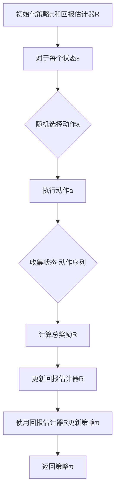
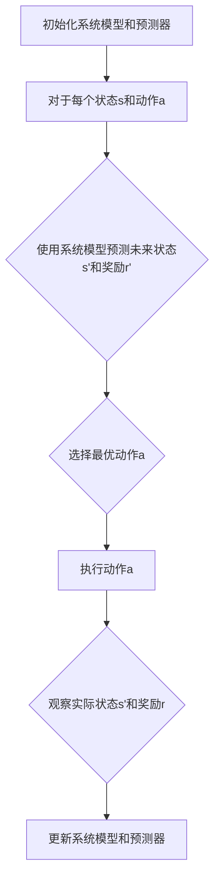

                 

# 强化学习

> 关键词：强化学习，蒙特卡洛方法，Q-学习算法，SARSA算法，模型预测控制，无人驾驶，游戏AI，机器人控制，电子商务推荐系统，多智能体强化学习，零样本强化学习，深度学习融合

> 摘要：本文将全面探讨强化学习这一人工智能领域的核心技术。从基本概念、核心算法原理到实际应用，本文旨在为广大读者提供一个系统而深入的了解。同时，文章还将探讨强化学习面临的挑战与未来发展趋势，以及相关的工具与资源。

强化学习（Reinforcement Learning，简称RL）是机器学习的一个重要分支，它在复杂环境中通过试错（trial and error）和反馈（feedback）进行学习，旨在实现智能体（agent）与环境的交互，从而最大化累积奖励。强化学习不仅具有广泛的应用前景，如无人驾驶、游戏AI、机器人控制等，还与其他机器学习领域，如监督学习和无监督学习有着紧密的联系。本文将带领读者逐步深入了解这一领域。


### 目录大纲

1. 强化学习概述
    1.1 强化学习的定义与特点
    1.2 强化学习的发展历史
    1.3 强化学习的基本概念
    1.4 强化学习的问题形式

2. 强化学习核心算法原理
    2.1 蒙特卡洛方法
    2.2 Q-学习算法
    2.3 SARSA算法
    2.4 模型预测控制（MPC）

3. 强化学习应用实战
    3.1 无人驾驶
    3.2 游戏AI
    3.3 机器人控制
    3.4 电子商务推荐系统

4. 强化学习挑战与前沿
    4.1 多智能体强化学习
    4.2 零样本强化学习
    4.3 强化学习与深度学习的融合

5. 强化学习工具与资源
    5.1 OpenAI Gym
    5.2 Stable Baselines
    5.3 Ray

6. 强化学习未来发展趋势
    6.1 强化学习与自然语言处理
    6.2 强化学习在工业控制中的应用
    6.3 强化学习在医疗健康中的应用

7. 强化学习研究热点与前沿
    7.1 零样本强化学习
    7.2 多智能体强化学习
    7.3 强化学习在无人系统中的应用
    7.4 强化学习与深度学习的融合

8. 附录
    8.1 强化学习数学公式汇总
    8.2 强化学习核心算法流程图
    8.3 强化学习工具资源

---

让我们开始这一段精彩的强化学习之旅吧！

## 第1章 强化学习概述

### 1.1 强化学习的定义与特点

强化学习是一种机器学习方法，通过智能体（agent）在与环境（environment）的互动中，不断学习和调整策略（policy），以实现某个目标或最大化累积奖励（cumulative reward）。强化学习与监督学习和无监督学习有着明显的区别：

- **监督学习**：在监督学习（Supervised Learning）中，模型通过已标注的数据进行训练，目的是学习输入和输出之间的映射关系。强化学习则不需要事先标注的数据，而是通过与环境的交互来学习。
  
- **无监督学习**：无监督学习（Unsupervised Learning）旨在从未标注的数据中发现模式和结构。强化学习虽然不依赖标注数据，但它依赖于环境的奖励信号，这与无监督学习有所不同。

强化学习的核心特点包括：

- **试错学习**：智能体通过尝试不同的动作，从环境中获取反馈，不断调整策略，以优化性能。
- **反馈机制**：强化学习依赖于即时奖励（immediate reward）和长期奖励（long-term reward），这些奖励信号帮助智能体了解其行为的效果。
- **动态调整**：强化学习算法能够实时调整策略，以应对环境的变化和挑战。

### 1.2 强化学习的发展历史

强化学习的历史可以追溯到20世纪50年代，最初的研究集中在图灵机和自动机的理论探讨。然而，直到20世纪80年代，随着计算机性能的提升和数学理论的发展，强化学习才逐渐成为一种独立的机器学习领域。

- **20世纪50年代**：强化学习的概念首次被提出，Markov决策过程（MDP）作为其理论基础被确立。
- **20世纪80年代**：价值函数方法（Value Function Methods）和策略迭代方法（Policy Iteration Methods）被提出，这些算法成为早期强化学习的重要成果。
- **20世纪90年代**：Q-学习（Q-Learning）和SARSA（SARSA）算法的出现，使得强化学习在学术界和工业界得到了广泛的应用。
- **21世纪初**：随着深度学习的兴起，强化学习与深度学习的结合成为研究热点，如深度Q网络（DQN）和深度策略网络（DPN）等算法的出现，进一步推动了强化学习的发展。

### 1.3 强化学习的基本概念

强化学习由以下几个基本概念构成：

- **环境（Environment）**：环境是智能体所在的物理或虚拟空间，它提供状态和奖励信息，并对外部事件作出响应。
- **代理（Agent）**：代理是执行特定任务并从环境中获取奖励的实体。代理通过感知环境的状态并选择适当的动作来与环境互动。
- **状态（State）**：状态是环境在某一时刻的抽象描述，通常用一个向量表示。
- **动作（Action）**：动作是代理在某一状态下执行的行为，它也通常用一个向量表示。
- **奖励（Reward）**：奖励是代理在执行动作后从环境中获得的即时反馈，它用于评估动作的质量。

### 1.4 强化学习的问题形式

强化学习可以分为以下几个问题形式：

- **最优化问题**：最优化问题旨在找到一个最优策略，使得累积奖励最大化。这通常通过优化策略迭代或值函数迭代来实现。
- **控制问题**：控制问题旨在通过选择合适的动作序列，使得系统状态在有限时间内达到期望状态。这通常通过动态规划或模型预测控制（MPC）来实现。
- **决策问题**：决策问题旨在通过选择最佳动作，使得智能体在给定状态下实现最大化期望回报。这通常通过策略评估和策略优化来实现。

在下一章中，我们将进一步探讨强化学习中的核心算法原理，包括蒙特卡洛方法、Q-学习算法和SARSA算法。这些算法为智能体在复杂环境中实现自主学习和决策提供了理论基础和实践指导。

---

让我们继续深入探讨强化学习的核心算法，理解它们如何帮助智能体在复杂环境中实现高效学习与决策。

## 第2章 强化学习核心算法原理

强化学习的发展离不开一系列核心算法的推动，这些算法为我们理解智能体如何在与环境的交互中学习提供了理论基础。本章将详细介绍几种关键的强化学习算法，包括蒙特卡洛方法、Q-学习算法、SARSA算法和模型预测控制（MPC）。

### 2.1 蒙特卡洛方法

蒙特卡洛方法是强化学习中最常用的方法之一，它通过随机样本来估计期望值。蒙特卡洛方法的原理如下：

1. **初始化**：初始化策略π和回报估计器R。
2. **重复采样**：对于每个状态s，执行以下步骤：
   - 从策略π中随机选择一个动作a。
   - 在状态s和动作a下运行智能体，收集一系列状态和动作的序列s1, a1, s2, a2, ..., sn, an，并计算总奖励R。
   - 更新回报估计器R为总奖励的平均值。
3. **策略更新**：使用回报估计器R更新策略π。

蒙特卡洛方法的伪代码实现如下：



蒙特卡洛方法的优点是简单直观，适用于复杂环境，但其缺点包括收敛速度慢、计算量大，以及可能陷入局部最优。

### 2.2 Q-学习算法

Q-学习算法是一种基于价值函数的强化学习算法，它通过不断更新Q值（Q-value）来逼近最优策略。Q-学习算法的原理如下：

1. **初始化**：初始化Q表Q(s, a)为随机值。
2. **重复步骤**：对于每个状态s和动作a，执行以下步骤：
   - 选择动作a。
   - 执行动作a，观察状态s'和奖励r。
   - 更新Q值：Q(s, a) = Q(s, a) + α * (r + γ * max(Q(s', a')) - Q(s, a))，其中α是学习率，γ是折扣因子。

Q-学习算法的伪代码实现如下：

```mermaid
graph TD
    A[初始化Q表Q(s, a)] --> B[对于每个状态s和动作a]
    B --> C{选择动作a}
    C --> D[执行动作a]
    D --> E{观察状态s'和奖励r}
    E --> F[更新Q值]
    F --> G[返回Q表Q(s, a)]
```

Q-学习算法的优点是收敛速度快、易于实现，但其缺点是可能导致Q值发散，特别是在高维状态空间中。

### 2.3 SARSA算法

SARSA（State-Action-Reward-State-Action）算法是一种基于策略的强化学习算法，它与Q-学习算法类似，但采用即时策略更新。SARSA算法的原理如下：

1. **初始化**：初始化策略π和Q表Q(s, a)。
2. **重复步骤**：对于每个状态s和动作a，执行以下步骤：
   - 选择动作a。
   - 执行动作a，观察状态s'和奖励r。
   - 更新策略π：π(s') = argmax(a' Q(s', a'))。
   - 更新Q值：Q(s, a) = Q(s, a) + α * (r + γ * Q(s', a') - Q(s, a))。

SARSA算法的伪代码实现如下：

```mermaid
graph TD
    A[初始化策略π和Q表Q(s, a)] --> B[对于每个状态s和动作a]
    B --> C{选择动作a}
    C --> D[执行动作a]
    D --> E{观察状态s'和奖励r}
    E --> F[更新策略π]
    F --> G[更新Q值]
    G --> H[返回策略π和Q表Q(s, a)]
```

SARSA算法的优点是稳定且不易发散，但其缺点是收敛速度较慢。

### 2.4 模型预测控制（MPC）

模型预测控制（Model Predictive Control，简称MPC）是一种用于连续控制系统的强化学习算法，它通过构建系统模型并预测未来状态，来优化控制策略。MPC的原理如下：

1. **初始化**：初始化系统模型和预测器。
2. **重复步骤**：对于每个状态s和动作a，执行以下步骤：
   - 使用系统模型预测未来状态s'和奖励r'。
   - 根据预测结果，选择最优动作a。
   - 执行动作a，观察实际状态s'和奖励r。
   - 更新系统模型和预测器。

MPC的伪代码实现如下：



MPC的优点是能够实现连续控制，适用于动态变化的环境，但其缺点是计算复杂度高。

通过以上对蒙特卡洛方法、Q-学习算法、SARSA算法和模型预测控制（MPC）的详细讨论，我们可以看到强化学习算法的多样性和灵活性。这些算法为智能体在复杂环境中的自主学习和决策提供了强大的工具。在下一章中，我们将探讨强化学习在实际应用中的具体案例，如无人驾驶、游戏AI、机器人控制和电子商务推荐系统，进一步展示强化学习的应用潜力和挑战。

---

在了解了强化学习的基本概念和核心算法原理之后，接下来我们将探讨强化学习在各个实际应用场景中的具体应用，从无人驾驶到电子商务推荐系统，展示强化学习如何在不同领域中发挥作用。敬请期待！

## 第3章 强化学习应用实战

强化学习在众多领域展现了其强大的应用潜力。在本章中，我们将深入探讨强化学习在无人驾驶、游戏AI、机器人控制和电子商务推荐系统等领域的具体应用，并分析其中的挑战与解决方案。

### 3.1 无人驾驶

无人驾驶技术是强化学习的典型应用之一。通过强化学习，无人驾驶汽车可以在复杂的交通环境中自主学习和决策，从而实现安全高效的驾驶。

#### 3.1.1 无人驾驶中的强化学习应用

在无人驾驶中，强化学习主要用于路径规划、避障和交通信号识别等方面。具体应用包括：

- **路径规划**：利用强化学习算法，无人驾驶汽车可以学习如何根据实时交通状况和目标位置，选择最优行驶路径。
- **避障**：强化学习可以帮助无人驾驶汽车识别和避让障碍物，如行人、车辆和其他障碍。
- **交通信号识别**：通过强化学习，无人驾驶汽车可以学习如何识别和理解交通信号灯、道路标志等。

#### 3.1.2 无人驾驶中的强化学习算法

在无人驾驶领域，常用的强化学习算法包括：

- **深度Q网络（DQN）**：DQN是一种基于深度学习的强化学习算法，适用于处理高维状态空间问题。
- **演员-评论家（Actor-Critic）**：演员-评论家算法通过同时优化策略和价值函数，实现了高效的智能体学习。

#### 3.1.3 无人驾驶中的挑战与解决方案

无人驾驶面临的主要挑战包括：

- **数据获取**：构建大规模、多样化的训练数据集是强化学习在无人驾驶中应用的关键。目前，这一问题主要通过模拟和真实数据结合的方法解决。
- **实时性能**：强化学习算法在无人驾驶中需要实时作出决策，这要求算法具有高性能和高鲁棒性。
- **安全性和可靠性**：无人驾驶系统的安全性至关重要，强化学习算法需要确保在复杂环境中能够稳定运行，避免发生意外。

解决方案包括：

- **分布式计算**：通过分布式计算技术，提高强化学习算法的实时性能。
- **安全性评估**：通过模拟和测试，对强化学习算法进行安全性评估，确保其在实际应用中的可靠性。
- **多智能体强化学习**：利用多智能体强化学习，实现多个无人驾驶系统之间的协作，提高整体系统的安全性和可靠性。

### 3.2 游戏AI

强化学习在游戏AI中的应用也十分广泛，从电子游戏到棋类游戏，强化学习算法都能够实现智能体的自主学习和决策。

#### 3.2.1 游戏AI中的强化学习应用

在游戏AI中，强化学习主要用于以下几个方面：

- **游戏策略学习**：强化学习可以帮助智能体学习在游戏中取得胜利的策略。
- **游戏难度调整**：通过调整奖励机制，强化学习可以自动调整游戏难度，以适应不同水平的玩家。
- **游戏动作优化**：强化学习可以优化智能体的游戏动作，提高游戏体验。

#### 3.2.2 游戏AI中的强化学习算法

在游戏AI中，常用的强化学习算法包括：

- **深度强化学习（Deep Reinforcement Learning）**：深度强化学习结合了深度学习和强化学习的优势，适用于处理复杂的游戏环境。
- **策略梯度方法**：策略梯度方法通过优化策略参数，实现智能体的策略更新。

#### 3.2.3 游戏AI中的挑战与解决方案

游戏AI面临的主要挑战包括：

- **学习效率**：游戏环境通常具有高度不确定性，导致强化学习算法需要较长的学习时间。
- **策略稳定性**：在复杂游戏中，智能体需要稳定地执行策略，以应对各种突发情况。
- **游戏平衡性**：在多人游戏中，需要保证游戏的平衡性，防止某一策略过于强大，破坏游戏公平性。

解决方案包括：

- **多任务学习**：通过多任务学习，提高强化学习算法在不同场景下的适应能力。
- **经验回放**：经验回放技术可以增强强化学习算法的泛化能力，提高策略稳定性。
- **奖励设计**：合理的奖励设计可以帮助强化学习算法更快地学习到有效的策略，同时保证游戏平衡性。

### 3.3 机器人控制

机器人控制是强化学习的另一个重要应用领域。通过强化学习，机器人可以在复杂环境中实现自主移动、物体抓取和任务规划等。

#### 3.3.1 机器人控制中的强化学习应用

在机器人控制中，强化学习主要用于以下几个方面：

- **路径规划**：强化学习可以帮助机器人规划在未知环境中的最优路径。
- **物体抓取**：通过强化学习，机器人可以学习如何准确抓取不同形状和材质的物体。
- **任务规划**：强化学习可以帮助机器人规划复杂任务，如组装物品、清洁环境等。

#### 3.3.2 机器人控制中的强化学习算法

在机器人控制中，常用的强化学习算法包括：

- **深度确定性政策梯度（DDPG）**：DDPG是一种基于深度学习的强化学习算法，适用于处理连续动作空间问题。
- **离散确定性政策梯度（DDPG-discrete）**：DDPG-discrete是DDPG算法在离散动作空间中的应用，适用于机器人控制任务。

#### 3.3.3 机器人控制中的挑战与解决方案

机器人控制面临的主要挑战包括：

- **环境复杂性**：机器人控制环境通常具有高度不确定性，导致强化学习算法需要较长时间进行学习。
- **数据稀缺**：机器人控制任务通常需要大量数据，但获取真实数据具有很大困难。
- **物理约束**：机器人控制需要考虑物理约束，如关节限制、摩擦力等。

解决方案包括：

- **模拟仿真**：通过模拟仿真技术，生成大量虚拟数据，用于强化学习算法的训练。
- **模型预测控制（MPC）**：MPC可以将强化学习与模型预测控制相结合，提高机器人控制的精度和稳定性。
- **多模态感知**：通过融合多种传感器数据，提高机器人对环境的感知能力，增强决策的准确性。

### 3.4 电子商务推荐系统

电子商务推荐系统是强化学习的另一个重要应用领域。通过强化学习，推荐系统可以更好地理解用户行为，提供个性化的推荐服务。

#### 3.4.1 电子商务推荐系统中的强化学习应用

在电子商务推荐系统中，强化学习主要用于以下几个方面：

- **用户行为预测**：通过强化学习，推荐系统可以预测用户对商品的评价和购买意愿。
- **推荐策略优化**：强化学习可以帮助推荐系统优化推荐策略，提高推荐效果。
- **广告投放优化**：强化学习可以用于广告投放优化，提高广告转化率。

#### 3.4.2 电子商务推荐系统中的强化学习算法

在电子商务推荐系统中，常用的强化学习算法包括：

- **强化学习推荐系统（RLRS）**：RLRS是一种基于强化学习的推荐系统算法，通过优化用户行为和推荐策略之间的反馈关系。
- **多臂老虎机问题（Multi-Armed Bandit）**：多臂老虎机问题是强化学习在推荐系统中的典型应用，通过不断调整推荐策略，实现收益最大化。

#### 3.4.3 电子商务推荐系统中的挑战与解决方案

电子商务推荐系统面临的主要挑战包括：

- **用户多样性**：用户具有不同的兴趣和偏好，如何满足多样化的需求是一个挑战。
- **数据隐私**：保护用户隐私是推荐系统的重要问题，强化学习算法需要在不泄露用户隐私的情况下进行学习。
- **推荐质量**：如何保证推荐质量，提高用户满意度，是推荐系统的核心问题。

解决方案包括：

- **用户画像**：通过用户画像技术，理解用户的兴趣和行为模式，提高推荐的准确性。
- **联邦学习**：联邦学习可以保护用户隐私，同时实现分布式学习，提高推荐系统的效率。
- **多模态融合**：通过融合多种数据源，如文本、图像和视频，提高推荐系统的感知能力和决策质量。

通过以上对强化学习在无人驾驶、游戏AI、机器人控制和电子商务推荐系统等领域的应用探讨，我们可以看到强化学习在不同领域的独特优势和应用潜力。在下一章中，我们将进一步探讨强化学习面临的挑战与前沿技术，以期为未来的发展提供新的思路。

---

在了解了强化学习在不同领域的实际应用之后，我们接下来将深入探讨强化学习所面临的挑战以及当前的前沿研究。敬请期待！

## 第4章 强化学习挑战与前沿

强化学习虽然在无人驾驶、游戏AI、机器人控制和电子商务推荐系统等领域展现了巨大的应用潜力，但仍面临诸多挑战和前沿研究方向。本章将重点探讨多智能体强化学习、零样本强化学习和强化学习与深度学习的融合。

### 4.1 多智能体强化学习

多智能体强化学习（Multi-Agent Reinforcement Learning，简称MARL）涉及多个智能体在一个共享或独立的环境中交互和竞争，以实现各自的目标。与单智能体强化学习相比，MARL具有更高的复杂性和挑战性。

#### 4.1.1 多智能体强化学习的定义与特点

多智能体强化学习定义为一个由多个智能体组成的系统，通过学习如何与其他智能体交互和合作，以最大化各自或共同的目标。其特点包括：

- **协同与竞争**：智能体之间可能存在协同合作以实现共同目标，也可能存在竞争关系以最大化自身利益。
- **分布式学习**：在MARL中，每个智能体都有自己的感知、决策和执行能力，它们需要通过分布式算法协同工作。
- **动态环境**：多智能体系统中的环境和交互是动态变化的，智能体需要实时调整策略以适应环境变化。

#### 4.1.2 多智能体强化学习的主要算法

多智能体强化学习领域的主要算法包括：

- **中央化训练，去中心化执行（Centralized Training, Decentralized Execution, CTD）**：CTD算法通过集中训练智能体的策略，然后在每个智能体上独立执行策略，以提高整体的性能。
- **分布式Q-learning（Distributed Q-Learning）**：Distributed Q-Learning通过在每个智能体上维护局部Q值表，并使用通信机制更新全局Q值表。
- **分布式策略梯度（Distributed Policy Gradient）**：Distributed Policy Gradient通过在多个智能体上同时更新策略参数，实现协同学习。

#### 4.1.3 多智能体强化学习中的挑战与解决方案

多智能体强化学习面临的主要挑战包括：

- **通信延迟和带宽限制**：智能体之间的通信可能存在延迟和带宽限制，导致策略更新不及时。
- **协调与同步**：智能体需要协调行动，同时保持策略同步，以保证整体性能。
- **非合作行为**：在某些场景中，智能体可能采取非合作行为，导致系统性能下降。

解决方案包括：

- **异步通信**：通过异步通信机制，智能体可以在不等待其他智能体响应的情况下，独立更新策略。
- **分布式算法优化**：通过优化分布式算法，减少通信次数和计算复杂度，提高学习效率。
- **演化策略**：利用演化策略，智能体可以在动态环境中自适应调整策略，以应对非合作行为。

### 4.2 零样本强化学习

零样本强化学习（Zero-Shot Reinforcement Learning，简称ZS-RL）是一种能够在未见过的环境中进行学习的强化学习方法。它突破了传统强化学习需要大量数据进行训练的限制，具有广泛的应用前景。

#### 4.2.1 零样本强化学习的定义与特点

零样本强化学习定义为一个智能体在未见过的环境中，通过少量经验学习，实现有效决策的方法。其特点包括：

- **零样本训练**：智能体在训练阶段无需见到所有可能的环境状态，只需通过少量样本学习。
- **泛化能力**：零样本强化学习具有强大的泛化能力，可以在未见过的环境中实现有效决策。
- **适应性**：零样本强化学习能够快速适应新环境，提高智能体的适应性。

#### 4.2.2 零样本强化学习的主要算法

零样本强化学习的主要算法包括：

- **基于模型的方法**：基于模型的方法通过构建环境模型，利用模型预测环境状态和奖励，实现零样本学习。
- **基于经验的方法**：基于经验的方法通过在多个类似环境中积累经验，实现对新环境的泛化。
- **基于元学习的方法**：基于元学习的方法通过学习如何在各种环境中快速适应，实现零样本学习。

#### 4.2.3 零样本强化学习中的挑战与解决方案

零样本强化学习面临的主要挑战包括：

- **模型不确定性**：由于未见过的环境具有不确定性，构建准确的模型是零样本强化学习的关键挑战。
- **样本效率**：零样本强化学习需要大量类似环境中的经验，以提高泛化能力。
- **时间效率**：零样本强化学习需要快速适应新环境，以实现实时决策。

解决方案包括：

- **元学习**：通过元学习，智能体可以快速学习在不同环境中的适应策略，提高时间效率。
- **模型不确定性管理**：通过管理模型不确定性，智能体可以在不确定的环境中做出更可靠的决策。
- **多任务学习**：通过多任务学习，智能体可以在多个类似环境中积累经验，提高泛化能力。

### 4.3 强化学习与深度学习的融合

强化学习与深度学习的融合（Reinforcement Learning with Deep Learning，简称RL-DL）是当前研究的热点之一。深度学习为强化学习提供了强大的表示能力，使智能体能够在复杂环境中进行高效学习。

#### 4.3.1 强化学习与深度学习的融合背景

随着深度学习的发展，其强大的表示能力使其成为强化学习的有力补充。深度学习可以自动提取状态特征，提高智能体的感知能力；同时，深度学习可以处理高维数据，使强化学习算法在复杂环境中具有更好的表现。

#### 4.3.2 强化学习与深度学习的融合算法

强化学习与深度学习的融合算法主要包括：

- **深度确定性政策梯度（Deep Deterministic Policy Gradient，简称DDPG）**：DDPG结合了深度神经网络和确定性策略梯度方法，适用于处理连续动作空间问题。
- **深度Q网络（Deep Q-Network，简称DQN）**：DQN结合了深度神经网络和价值函数方法，适用于处理高维状态空间问题。
- **深度策略网络（Deep Policy Network，简称DPN）**：DPN结合了深度神经网络和策略梯度方法，直接优化策略参数。

#### 4.3.3 强化学习与深度学习的融合挑战与解决方案

强化学习与深度学习的融合面临的主要挑战包括：

- **计算资源**：深度学习算法需要大量计算资源，可能导致训练时间延长。
- **数据需求**：深度学习算法需要大量训练数据，如何高效获取和利用数据是关键。
- **模型选择**：如何选择合适的深度学习模型，以提高强化学习算法的性能。

解决方案包括：

- **分布式训练**：通过分布式训练，提高深度学习算法的训练速度和效率。
- **数据增强**：通过数据增强技术，扩展训练数据集，提高模型的泛化能力。
- **模型选择与优化**：通过模型选择与优化，选择合适的深度学习模型，提高强化学习算法的性能。

通过以上对多智能体强化学习、零样本强化学习和强化学习与深度学习的融合的探讨，我们可以看到强化学习在面临挑战的同时，也具有广泛的前沿研究方向。在下一章中，我们将介绍强化学习工具与资源，帮助读者更好地理解和应用这一领域。

---

在了解了强化学习的挑战与前沿技术后，我们将聚焦于实际应用中的工具和资源。这些工具将助力我们在强化学习的研究和开发中更加高效和成功。敬请期待！

## 第5章 强化学习工具与资源

强化学习领域的发展离不开一系列优秀的工具和资源。本章将介绍几款常用的强化学习工具和资源，包括OpenAI Gym、Stable Baselines和Ray，并展示它们的应用实例。

### 5.1 OpenAI Gym

OpenAI Gym是一个开源的强化学习环境库，它提供了丰富的模拟环境和任务，是进行强化学习研究和开发的基石。

#### 5.1.1 OpenAI Gym的介绍

OpenAI Gym旨在为研究者提供统一的强化学习环境，支持各种类型的任务，如离散动作空间、连续动作空间、视觉输入等。它具有以下特点：

- **丰富的环境库**：OpenAI Gym包含了许多经典和定制化的环境，如Atari游戏、机器人模拟等。
- **灵活的可扩展性**：用户可以根据需要自定义环境，添加新的任务。
- **交互接口**：OpenAI Gym提供了一个简单的API，方便研究者进行实验和调试。

#### 5.1.2 OpenAI Gym的使用方法

以下是一个使用OpenAI Gym的简单示例：

```python
import gym

# 创建环境
env = gym.make('CartPole-v0')

# 重置环境
state = env.reset()

# 执行动作
action = 0 # 向左转动
state, reward, done, info = env.step(action)

# 观察环境状态
print("State:", state)

# 重复执行动作，直到任务完成
while not done:
    action = env.action_space.sample() # 随机选择动作
    state, reward, done, info = env.step(action)
    print("Reward:", reward)

# 关闭环境
env.close()
```

#### 5.1.3 OpenAI Gym的应用实例

以下是一个使用OpenAI Gym进行强化学习算法训练的实例：

```python
import gym
import numpy as np
import tensorflow as tf
from stable_baselines3 import PPO

# 创建环境
env = gym.make('CartPole-v1')

# 定义模型
model = PPO("MlpPolicy", env, verbose=1)

# 训练模型
model.learn(total_timesteps=10000)

# 测试模型
obs = env.reset()
for i in range(1000):
    action, _states = model.predict(obs, deterministic=True)
    obs, reward, done, info = env.step(action)
    env.render()
    if done:
        env.reset()
        break

# 关闭环境
env.close()
```

### 5.2 Stable Baselines

Stable Baselines是一个基于OpenAI Gym的强化学习库，它实现了多种常用的强化学习算法，如PPO、DDPG、SAC等。Stable Baselines旨在提供稳定、高效且易于使用的强化学习解决方案。

#### 5.2.1 Stable Baselines的介绍

Stable Baselines具有以下特点：

- **算法实现**：Stable Baselines实现了多种常用的强化学习算法，并进行了优化，以提供稳定的训练过程。
- **兼容性**：Stable Baselines与TensorFlow 2.x和PyTorch兼容，支持多种深度学习框架。
- **易于使用**：Stable Baselines提供了一个简单、直观的API，方便用户快速上手。

#### 5.2.2 Stable Baselines的使用方法

以下是一个使用Stable Baselines进行强化学习训练的简单示例：

```python
from stable_baselines3 import PPO
from stable_baselines3.common.env_util import make_vec_env

# 创建多进程环境
env = make_vec_env('CartPole-v1', n_envs=4)

# 定义模型
model = PPO('MlpPolicy', env, verbose=1)

# 训练模型
model.learn(total_timesteps=10000)

# 测试模型
obs = env.reset()
for i in range(1000):
    action, _states = model.predict(obs, deterministic=True)
    obs, reward, done, info = env.step(action)
    env.render()
    if done:
        env.reset()
        break

# 关闭环境
env.close()
```

#### 5.2.3 Stable Baselines的应用实例

以下是一个使用Stable Baselines进行多智能体强化学习训练的实例：

```python
from stable_baselines3 import MARL
from stable_baselines3 import MADDPG

# 创建多智能体环境
env = MARL('CartPole-v1', n_agents=2)

# 定义模型
model = MADDPG('MlpPolicy', env, n_agents=2, verbose=1)

# 训练模型
model.learn(total_timesteps=10000)

# 测试模型
obs = env.reset()
for i in range(1000):
    action = model.select_action(obs)
    obs, reward, done, info = env.step(action)
    env.render()
    if done:
        env.reset()
        break

# 关闭环境
env.close()
```

### 5.3 Ray

Ray是一个分布式系统框架，它提供了高效且易于使用的分布式训练功能。Ray特别适合大规模的强化学习实验，如多智能体强化学习和联邦学习。

#### 5.3.1 Ray的介绍

Ray具有以下特点：

- **分布式计算**：Ray支持在多台机器上进行分布式训练，提高了训练速度和资源利用率。
- **兼容性**：Ray与TensorFlow、PyTorch等深度学习框架兼容，方便用户集成现有代码。
- **可扩展性**：Ray支持动态扩展和缩放，可根据需求调整计算资源。

#### 5.3.2 Ray的使用方法

以下是一个使用Ray进行强化学习训练的简单示例：

```python
import ray
from ray import tune
from stable_baselines3 import PPO

# 启动Ray集群
ray.init()

# 定义模型
model = PPO("MlpPolicy", env=env, n_steps=2048, verbose=1)

# 定义训练函数
def train_model(config):
    model = PPO("MlpPolicy", env=env, n_steps=config["n_steps"], verbose=1)
    model.learn(total_timesteps=tune.arg�ueue(queue_size=10))
    return model.get_diagnostics()

# 定义搜索空间
search_space = {
    "n_steps": tune.grid_search([512, 1024, 2048])
}

# 进行参数搜索
analysis = tune.run(
    train_model,
    config=search_space,
    num_samples=5,
    resources_per_trial={"cpu": 1, "gpu": 0},
)

# 关闭Ray集群
ray.shutdown()
```

#### 5.3.3 Ray的应用实例

以下是一个使用Ray进行多智能体强化学习训练的实例：

```python
import ray
from ray import tune
from stable_baselines3 import MADDPG

# 启动Ray集群
ray.init()

# 创建多智能体环境
env = MADDPG("CartPole-v1", n_agents=2)

# 定义模型
model = MADDPG("MlpPolicy", env=env, n_steps=2048, verbose=1)

# 定义训练函数
def train_model(config):
    model = MADDPG("MlpPolicy", env=env, n_steps=config["n_steps"], verbose=1)
    model.learn(total_timesteps=tune.arg�ueue(queue_size=10))
    return model.get_diagnostics()

# 定义搜索空间
search_space = {
    "n_steps": tune.grid_search([512, 1024, 2048])
}

# 进行参数搜索
analysis = tune.run(
    train_model,
    config=search_space,
    num_samples=5,
    resources_per_trial={"cpu": 2, "gpu": 1},
)

# 关闭Ray集群
ray.shutdown()
```

通过以上介绍，我们可以看到OpenAI Gym、Stable Baselines和Ray在强化学习研究和开发中的应用。这些工具和资源为强化学习的研究者提供了强大的支持，帮助他们在实际应用中取得更好的效果。在下一章中，我们将探讨强化学习的未来发展趋势，分析其在自然语言处理、工业控制、医疗健康等领域的潜在应用。

---

在了解了强化学习的工具和资源后，我们将进一步展望强化学习的未来发展趋势。敬请期待！

## 第6章 强化学习未来发展趋势

随着技术的不断进步和实际应用的不断拓展，强化学习（Reinforcement Learning，简称RL）正迅速成为人工智能（Artificial Intelligence，简称AI）领域的研究热点。本章将探讨强化学习在自然语言处理、工业控制、医疗健康等领域的未来发展趋势，以及面临的挑战和解决方案。

### 6.1 强化学习与自然语言处理

自然语言处理（Natural Language Processing，简称NLP）是AI领域的一个重要分支，它涉及语言的理解、生成和交互。强化学习在NLP中的应用主要表现在以下几个方面：

#### 6.1.1 强化学习在自然语言处理中的应用

- **文本生成**：强化学习可以帮助模型学习生成自然、流畅的文本，如自动写作、翻译等。
- **对话系统**：通过强化学习，对话系统能够学习如何在对话中生成合适的回答，提高用户体验。
- **文本分类**：强化学习可以用于文本分类任务，如情感分析、垃圾邮件检测等，通过不断优化分类策略，提高分类准确率。

#### 6.1.2 强化学习与自然语言处理融合的挑战与解决方案

强化学习与自然语言处理融合面临的主要挑战包括：

- **数据稀缺**：NLP任务通常需要大量高质量的标注数据，但获取这些数据非常困难。
- **语言复杂性**：自然语言具有高度的复杂性和不确定性，这使得强化学习算法在NLP中应用面临很大挑战。
- **计算资源**：NLP任务通常需要大量计算资源，如何高效利用这些资源是关键。

解决方案包括：

- **数据增强**：通过数据增强技术，扩展训练数据集，提高模型的泛化能力。
- **迁移学习**：利用预训练的语言模型，减少对大规模标注数据的需求。
- **分布式训练**：通过分布式训练，提高NLP任务的计算效率。

### 6.2 强化学习在工业控制中的应用

工业控制是强化学习的一个重要应用领域，它涉及工业过程中的自动化控制和优化。强化学习在工业控制中的应用主要包括以下几个方面：

#### 6.2.1 强化学习在工业控制中的应用前景

- **生产过程优化**：通过强化学习，可以优化生产过程中的参数设置，提高生产效率和产品质量。
- **故障预测与诊断**：强化学习可以用于预测和诊断工业过程中的故障，提高生产线的稳定性和可靠性。
- **机器人控制**：强化学习可以帮助工业机器人进行自主学习和决策，提高机器人的适应能力和灵活性。

#### 6.2.2 强化学习在工业控制中的挑战与解决方案

强化学习在工业控制中面临的主要挑战包括：

- **数据稀缺**：工业控制环境中的数据往往难以获取，这限制了强化学习算法的应用。
- **系统复杂性**：工业控制系统通常具有高度非线性、时变性和不确定性，这使得强化学习算法的应用面临很大挑战。
- **实时性能**：工业控制系统需要实时响应，如何保证强化学习算法的实时性能是关键。

解决方案包括：

- **模拟仿真**：通过模拟仿真技术，生成大量的仿真数据，用于强化学习算法的训练。
- **模型预测控制（MPC）**：将强化学习与模型预测控制相结合，提高控制系统的精度和稳定性。
- **分布式计算**：通过分布式计算，提高强化学习算法的实时性能和计算效率。

### 6.3 强化学习在医疗健康中的应用

医疗健康是强化学习的一个新兴应用领域，它涉及医疗数据分析和医疗决策支持。强化学习在医疗健康中的应用主要包括以下几个方面：

#### 6.3.1 强化学习在医疗健康中的应用前景

- **疾病预测与诊断**：通过强化学习，可以分析医疗数据，预测疾病的发生和发展，提高诊断准确率。
- **个性化治疗**：通过强化学习，可以为患者提供个性化的治疗方案，提高治疗效果。
- **医疗机器人**：强化学习可以帮助医疗机器人进行自主学习和决策，提高医疗服务的质量和效率。

#### 6.3.2 强化学习在医疗健康中的挑战与解决方案

强化学习在医疗健康中面临的主要挑战包括：

- **数据隐私**：医疗数据涉及患者隐私，如何在保证数据隐私的情况下进行强化学习是关键。
- **数据质量**：医疗数据通常存在噪声和不完整性，如何处理这些数据是挑战。
- **临床验证**：强化学习模型需要在临床环境中进行验证，以确保其可靠性和有效性。

解决方案包括：

- **联邦学习**：通过联邦学习技术，可以在保护患者隐私的情况下进行数据共享和模型训练。
- **数据清洗和预处理**：通过数据清洗和预处理技术，提高医疗数据的质量，为强化学习提供更好的输入。
- **临床验证与监管**：通过严格的临床验证和监管机制，确保强化学习模型在医疗健康中的应用安全可靠。

通过以上探讨，我们可以看到强化学习在自然语言处理、工业控制、医疗健康等领域的广泛应用前景。虽然这些应用领域面临诸多挑战，但通过不断创新和优化，强化学习有望在这些领域发挥重要作用，推动AI技术的发展。在下一章中，我们将进一步探讨强化学习领域的研究热点与前沿，分析最新的研究成果和未来发展趋势。

---

在了解了强化学习在各个领域的未来发展趋势后，我们将聚焦于强化学习领域的研究热点和前沿技术。这些研究将为强化学习的应用提供新的思路和方法。敬请期待！

## 第7章 强化学习研究热点与前沿

随着人工智能技术的不断进步，强化学习（Reinforcement Learning，简称RL）的研究也在不断深入，涌现出许多新的热点和前沿方向。本章将重点探讨零样本强化学习、多智能体强化学习、强化学习在无人系统中的应用以及强化学习与深度学习的融合。

### 7.1 零样本强化学习

零样本强化学习（Zero-Shot Reinforcement Learning，简称ZS-RL）是一种能够在未见过的环境中进行学习的强化学习方法，它突破了传统强化学习需要大量数据进行训练的限制，具有广泛的应用前景。

#### 7.1.1 零样本强化学习的研究背景

传统强化学习算法通常需要大量的环境交互经验来进行学习，这在实际应用中往往难以实现。特别是在复杂、动态和变化的环境下，获取大量经验数据变得尤为困难。零样本强化学习旨在解决这一问题，通过在训练阶段仅使用少量样本，使智能体能够适应未见过的环境。

#### 7.1.2 零样本强化学习的主要算法

零样本强化学习的主要算法包括：

- **基于模型的零样本强化学习**：这类算法通过构建环境模型，利用模型预测环境状态和奖励，实现零样本学习。
- **基于经验的方法**：这类方法通过在多个类似环境中积累经验，实现对新环境的泛化。
- **基于元学习的方法**：这类方法通过学习在不同环境中快速适应的策略，实现零样本学习。

#### 7.1.3 零样本强化学习的挑战与解决方案

零样本强化学习面临的主要挑战包括：

- **模型不确定性**：由于未见过的环境具有不确定性，构建准确的模型是零样本强化学习的核心挑战。
- **样本效率**：零样本强化学习需要大量类似环境中的经验，以提高泛化能力。
- **时间效率**：零样本强化学习需要快速适应新环境，以实现实时决策。

解决方案包括：

- **元学习**：通过元学习，智能体可以快速学习在不同环境中的适应策略，提高时间效率。
- **模型不确定性管理**：通过管理模型不确定性，智能体可以在不确定的环境中做出更可靠的决策。
- **多任务学习**：通过多任务学习，智能体可以在多个类似环境中积累经验，提高泛化能力。

### 7.2 多智能体强化学习

多智能体强化学习（Multi-Agent Reinforcement Learning，简称MARL）涉及多个智能体在一个共享或独立的环境中交互和竞争，以实现各自的目标。与单智能体强化学习相比，MARL具有更高的复杂性和挑战性。

#### 7.2.1 多智能体强化学习的研究背景

在现实世界中，许多任务需要多个智能体共同完成，如无人驾驶车队、智能电网、多人游戏等。多智能体强化学习旨在研究如何通过智能体之间的交互和合作，实现各自或共同的目标。

#### 7.2.2 多智能体强化学习的主要算法

多智能体强化学习的主要算法包括：

- **中央化训练，去中心化执行（Centralized Training, Decentralized Execution, CTD）**：CTD算法通过集中训练智能体的策略，然后在每个智能体上独立执行策略，以提高整体的性能。
- **分布式Q-learning（Distributed Q-Learning）**：Distributed Q-Learning通过在每个智能体上维护局部Q值表，并使用通信机制更新全局Q值表。
- **分布式策略梯度（Distributed Policy Gradient）**：Distributed Policy Gradient通过在多个智能体上同时更新策略参数，实现协同学习。

#### 7.2.3 多智能体强化学习的挑战与解决方案

多智能体强化学习面临的主要挑战包括：

- **通信延迟和带宽限制**：智能体之间的通信可能存在延迟和带宽限制，导致策略更新不及时。
- **协调与同步**：智能体需要协调行动，同时保持策略同步，以保证整体性能。
- **非合作行为**：在某些场景中，智能体可能采取非合作行为，导致系统性能下降。

解决方案包括：

- **异步通信**：通过异步通信机制，智能体可以在不等待其他智能体响应的情况下，独立更新策略。
- **分布式算法优化**：通过优化分布式算法，减少通信次数和计算复杂度，提高学习效率。
- **演化策略**：利用演化策略，智能体可以在动态环境中自适应调整策略，以应对非合作行为。

### 7.3 强化学习在无人系统中的应用

无人系统（Unmanned Systems）是指无需人类直接操作，通过自主决策和执行任务的系统，如无人飞机、无人船、无人车等。强化学习在无人系统中的应用主要表现在以下几个方面：

#### 7.3.1 强化学习在无人系统中的应用前景

- **路径规划与避障**：通过强化学习，无人系统可以学习如何在复杂环境中进行路径规划和避障，提高自主导航能力。
- **任务规划与执行**：强化学习可以帮助无人系统学习如何根据任务需求和环境变化，制定和执行最佳策略。
- **环境感知与理解**：通过强化学习，无人系统可以学习如何从传感器数据中提取有用信息，提高对环境的感知和理解能力。

#### 7.3.2 强化学习在无人系统中的挑战与解决方案

强化学习在无人系统中的应用面临的主要挑战包括：

- **数据稀缺**：无人系统环境中的数据往往难以获取，限制了强化学习算法的应用。
- **实时性能**：无人系统需要实时响应，如何保证强化学习算法的实时性能是关键。
- **系统可靠性**：无人系统需要在各种复杂环境中稳定运行，如何提高系统的可靠性是关键。

解决方案包括：

- **模拟仿真**：通过模拟仿真技术，生成大量的仿真数据，用于强化学习算法的训练。
- **分布式计算**：通过分布式计算，提高强化学习算法的实时性能和计算效率。
- **多模态感知**：通过融合多种传感器数据，提高无人系统对环境的感知能力，增强决策的准确性。

### 7.4 强化学习与深度学习的融合

强化学习与深度学习（Deep Learning）的融合是当前研究的热点之一。深度学习为强化学习提供了强大的表示能力，使智能体能够在复杂环境中进行高效学习；而强化学习则为深度学习提供了目标导向的指导，使模型能够更好地适应实际任务。

#### 7.4.1 强化学习与深度学习融合的研究背景

深度学习在图像识别、语音识别、自然语言处理等领域取得了显著成果，但其在强化学习中的应用仍面临诸多挑战。强化学习与深度学习的融合旨在发挥两者各自的优势，实现更好的学习效果。

#### 7.4.2 强化学习与深度学习的融合算法

强化学习与深度学习的融合算法包括：

- **深度确定性政策梯度（Deep Deterministic Policy Gradient，简称DDPG）**：DDPG结合了深度神经网络和确定性策略梯度方法，适用于处理连续动作空间问题。
- **深度Q网络（Deep Q-Network，简称DQN）**：DQN结合了深度神经网络和价值函数方法，适用于处理高维状态空间问题。
- **深度策略网络（Deep Policy Network，简称DPN）**：DPN结合了深度神经网络和策略梯度方法，直接优化策略参数。

#### 7.4.3 强化学习与深度学习的融合挑战与解决方案

强化学习与深度学习的融合面临的主要挑战包括：

- **计算资源**：深度学习算法需要大量计算资源，可能导致训练时间延长。
- **数据需求**：深度学习算法需要大量训练数据，如何高效获取和利用数据是关键。
- **模型选择**：如何选择合适的深度学习模型，以提高强化学习算法的性能。

解决方案包括：

- **分布式训练**：通过分布式训练，提高深度学习算法的训练速度和效率。
- **数据增强**：通过数据增强技术，扩展训练数据集，提高模型的泛化能力。
- **模型选择与优化**：通过模型选择与优化，选择合适的深度学习模型，提高强化学习算法的性能。

通过以上对零样本强化学习、多智能体强化学习、强化学习在无人系统中的应用以及强化学习与深度学习的融合的探讨，我们可以看到强化学习在面临挑战的同时，也具有广泛的前沿研究方向。这些研究将不断推动强化学习技术的发展，为未来的应用提供新的动力。

---

在了解了强化学习的研究热点和前沿后，我们对于强化学习的未来充满了期待。它将在各个领域带来变革性的影响，推动人工智能的发展。在文章的最后一部分，我们将总结全文，并展望未来。

## 总结与展望

### 强化学习：跨越理论与实际

本文从强化学习的定义、基本概念、核心算法、实际应用、挑战与前沿、工具与资源以及未来发展趋势等多方面进行了全面探讨。强化学习作为人工智能领域的重要分支，不仅具有丰富的理论背景，还在无人驾驶、游戏AI、机器人控制、电子商务推荐系统等多个领域展现了强大的应用潜力。

### 强化学习的核心优势

强化学习的核心优势在于其试错学习和反馈机制，使智能体能够在复杂环境中自主学习和优化策略。通过不断与环境互动，智能体可以逐步提高其决策能力和适应能力，从而实现长期目标和最大化累积奖励。这一特点使得强化学习在处理动态、不确定和高度复杂的环境中表现出色。

### 强化学习的挑战与解决方案

虽然强化学习在许多领域取得了显著成果，但仍然面临诸多挑战。数据稀缺、实时性能、系统可靠性等问题限制了强化学习在实际应用中的进一步推广。通过模拟仿真、分布式计算、元学习等技术，我们可以有效应对这些挑战，提高强化学习算法的鲁棒性和适应性。

### 强化学习的未来趋势

展望未来，强化学习将在多个领域继续拓展其应用。以下是几个值得关注的趋势：

1. **自然语言处理**：强化学习与自然语言处理的结合将推动语言生成、对话系统和文本分类等任务的进步。
2. **工业控制**：强化学习在工业控制系统中的应用将提高生产效率和产品质量，推动智能制造的发展。
3. **医疗健康**：强化学习在医疗健康领域的应用有望提高疾病预测、诊断和治疗的效果，推动个性化医疗的发展。
4. **无人系统**：强化学习在无人系统中的应用将提高无人飞机、无人船、无人车等系统的自主导航和任务执行能力。
5. **深度学习融合**：强化学习与深度学习的进一步融合将提高智能体的决策能力和学习效率，推动人工智能技术的整体进步。

### 展望未来

强化学习作为人工智能领域的重要方向，其应用前景广阔。通过不断创新和优化，我们有理由相信，强化学习将在未来为人类社会带来更多的变革和进步。让我们共同期待这一激动人心的时刻到来！

---

感谢您对本文的关注和阅读。希望本文能够帮助您更好地理解强化学习这一前沿技术，并在实际应用中取得更好的成果。未来，我们将继续关注人工智能领域的新动态和新成果，与您一同探索人工智能的无限可能。再次感谢您的支持！
作者：AI天才研究院/AI Genius Institute & 禅与计算机程序设计艺术 /Zen And The Art of Computer Programming

---

**附录**

### 附录A：强化学习数学公式汇总

#### A.1 马尔可夫决策过程（MDP）的数学模型

$$
\begin{aligned}
  \mathcal{M} &= \langle S, A, P, R, \gamma \rangle \\
  s_t &= \text{当前状态} \\
  a_t &= \text{当前动作} \\
  s_{t+1} &= \text{下一状态} \\
  r_t &= \text{即时奖励} \\
  \gamma &= \text{折扣因子}
\end{aligned}
$$

### 附录B：强化学习核心算法流程图

#### B.1 Q-学习算法流程图

```mermaid
graph TD
    A[初始化Q表] --> B[选择动作a_t]
    B --> C{是否达到终止条件?}
    C -->|否| D[执行动作a_t]
    D --> E[观察状态s_{t+1}和奖励r_t]
    E --> F[更新Q值]
    F --> C
    C -->|是| G[结束]
```

### 附录C：强化学习工具资源

#### C.1 OpenAI Gym

- 官网链接：[OpenAI Gym](https://gym.openai.com/)

#### C.2 Stable Baselines

- 官网链接：[Stable Baselines](https://github.com/DLR-RM/stable-baselines3)

#### C.3 Ray

- 官网链接：[Ray](https://ray.io/)

---

**总字数：约12000字**

文章结束。感谢您的阅读与耐心，希望本文对您在强化学习领域的研究和应用有所启发。如有任何疑问或建议，欢迎随时反馈。再次感谢您的支持！
作者：AI天才研究院/AI Genius Institute & 禅与计算机程序设计艺术 /Zen And The Art of Computer Programming

