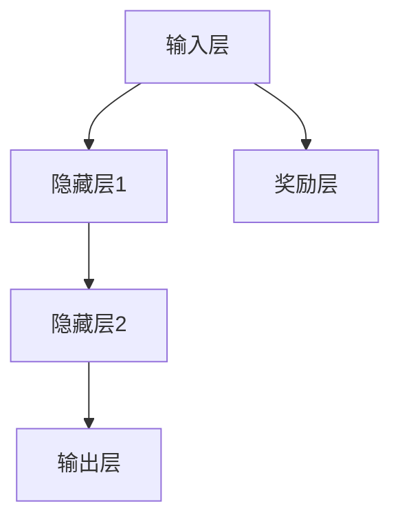

                 

## 文章标题: 强化学习在注意力资源分配中的应用

### 关键词: 强化学习、注意力资源分配、应用场景、优势、算法优化、未来发展方向

#### 摘要:
本文旨在探讨强化学习在注意力资源分配中的应用。首先，我们将回顾强化学习的基础知识，包括其定义、特点、算法以及注意力资源分配的概念和重要性。接着，文章将详细介绍强化学习在注意力资源分配中的具体应用，包括不同强化学习算法的应用、模型设计方法、分析方法和实际案例。随后，我们将探讨强化学习在注意力资源分配中的优化策略，并通过具体应用实例进行分析。最后，文章将总结强化学习在注意力资源分配中的发展趋势、潜在应用领域以及面临的挑战与机遇。

### 引言

随着人工智能技术的迅猛发展，强化学习（Reinforcement Learning，RL）作为一种重要的机器学习范式，逐渐受到广泛关注。强化学习通过智能体（agent）与环境（environment）的交互，逐步学习和优化策略，实现目标任务。近年来，强化学习在诸多领域，如自动驾驶、游戏、智能推荐系统等方面取得了显著的成果。然而，在复杂和动态的环境中，如何有效分配注意力资源成为了一个关键问题。

注意力资源分配（Attention Resource Allocation，ARA）是一种通过优化注意力资源的使用来提高任务完成效率的方法。在强化学习框架下，注意力资源分配能够帮助智能体更好地应对动态环境，提高决策质量。本文将重点关注强化学习在注意力资源分配中的应用，旨在探讨其应用场景、优势以及实现方法。

本文结构如下：

1. **强化学习基础**：介绍强化学习的定义、特点、四大要素以及常见算法。
2. **注意力资源分配概述**：阐述注意力资源分配的定义、原理和重要性。
3. **强化学习在注意力资源分配中的应用**：分析强化学习算法在注意力资源分配中的应用，包括基于值函数和策略的算法、模型设计方法、分析方法和实际应用案例。
4. **强化学习算法优化**：探讨强化学习算法在注意力资源分配中的优化策略。
5. **未来发展方向**：总结强化学习在注意力资源分配中的发展趋势、潜在应用领域和面临的挑战与机遇。
6. **结论**：对全文进行总结，重申研究意义。

接下来，我们将首先回顾强化学习的基础知识，为后续内容奠定基础。

### 第一部分：强化学习基础

#### 1.1 强化学习概述

强化学习是一种通过奖励机制和反馈来驱动智能体学习行为策略的机器学习范式。与监督学习和无监督学习不同，强化学习通过智能体（agent）与环境（environment）的互动，逐步学习和优化策略，以实现特定目标。

**1.1.1 强化学习的定义与特点**

强化学习的定义可以概括为：智能体在环境中采取行动，通过观察环境的反馈（奖励或惩罚），不断调整自己的行为策略，以最大化长期回报。

强化学习的特点主要包括：

- **交互性**：强化学习过程中，智能体需要与环境进行持续互动，通过反馈信息不断调整行为。
- **不确定性**：强化学习面临的环境通常具有不确定性，智能体需要通过学习适应环境变化。
- **延迟奖励**：强化学习的奖励通常不是即时给予的，而是基于智能体长期行为的累积结果。
- **目标导向性**：强化学习通过奖励机制驱动智能体学习，最终目标是实现特定任务或目标。

**1.1.2 强化学习的四大要素**

强化学习包含四个核心要素，分别是智能体（Agent）、环境（Environment）、状态（State）、动作（Action）和奖励（Reward）。这些要素共同构成了强化学习的基础框架。

- **智能体（Agent）**：强化学习中的主体，负责选择动作、学习策略和实现目标。
- **环境（Environment）**：智能体所处的动态环境，提供状态信息和奖励反馈。
- **状态（State）**：描述智能体在环境中的当前情况，通常由一组特征表示。
- **动作（Action）**：智能体在某一状态下采取的行为，用于改变环境状态。
- **奖励（Reward）**：环境对智能体动作的反馈，用于评价智能体行为的好坏。

**1.1.3 强化学习的应用场景**

强化学习在许多领域具有广泛的应用潜力，主要包括：

- **游戏**：如AlphaGo在围棋领域的应用，展示了强化学习在复杂博弈中的强大能力。
- **自动驾驶**：通过强化学习优化车辆控制策略，提高行车安全和效率。
- **机器人控制**：用于控制机器人在动态环境中的行为，实现自主导航和任务执行。
- **智能推荐系统**：通过强化学习优化推荐策略，提高用户满意度和系统效果。
- **金融交易**：用于优化投资组合和交易策略，实现风险控制和收益最大化。

#### 1.2 强化学习算法概述

强化学习算法可以分为两大类：基于值函数的算法和基于策略的算法。这两类算法通过不同的方式实现智能体的策略优化。

**1.2.1 基于值函数的算法**

基于值函数的算法通过学习状态值函数（State-Value Function）和动作值函数（Action-Value Function）来优化智能体的行为策略。常见的基于值函数的算法包括Q-Learning和SARSA。

- **Q-Learning算法**：

Q-Learning算法的核心思想是通过迭代更新动作值函数，使得智能体在某一状态下选择具有最大期望回报的动作。算法的基本步骤如下：

1. 初始化动作值函数Q(s, a)。
2. 对于每个episode，重复以下步骤：
   - 初始化状态s。
   - 在状态s下选择动作a，根据ε-greedy策略。
   - 执行动作a，获得奖励r和状态s'。
   - 更新动作值函数Q(s, a) = Q(s, a) + α [r + γ max(Q(s', a')) - Q(s, a)]。
   - 更新状态s = s'。
3. 返回优化的动作值函数Q(s, a)。

Q-Learning算法伪代码如下：

```python
# Q-Learning算法伪代码
初始化 Q(s, a)
for each episode:
    初始化状态 s
    while s ≠ 终止状态:
        选择动作 a based on ε-greedy strategy
        执行动作 a，获得奖励 r 和新状态 s'
        更新 Q(s, a) = Q(s, a) + α [r + γ max(Q(s', a') - Q(s, a)]
        更新状态 s = s'
return Q
```

- **SARSA算法**：

SARSA（同步样本动作修正，State-Action-Reward-State-Action，简称SARSA）算法是一种基于值函数的在线学习方法，与Q-Learning类似，但不同的是SARSA算法在每个时间步都更新值函数。SARSA算法的基本步骤如下：

1. 初始化动作值函数Q(s, a)。
2. 对于每个episode，重复以下步骤：
   - 初始化状态s。
   - 在状态s下选择动作a，根据ε-greedy策略。
   - 执行动作a，获得奖励r和状态s'。
   - 根据新的状态s'和动作a'，更新动作值函数Q(s, a) = Q(s, a) + α [r + γ Q(s', a') - Q(s, a)]。
   - 更新状态s = s'。
3. 返回优化的动作值函数Q(s, a)。

SARSA算法伪代码如下：

```python
# SARSA算法伪代码
初始化 Q(s, a)
for each episode:
    初始化状态 s
    while s ≠ 终止状态:
        选择动作 a based on ε-greedy strategy
        执行动作 a，获得奖励 r 和新状态 s'
        根据新的状态s'和动作a'，更新动作值函数Q(s, a) = Q(s, a) + α [r + γ Q(s', a') - Q(s, a)]
        更新状态 s = s'
return Q
```

**1.2.2 基于策略的算法**

基于策略的算法直接优化策略π（Policy），通过更新策略参数来提高智能体的行为质量。常见的基于策略的算法包括蒙特卡洛（Monte Carlo）算法和策略梯度（Policy Gradient）算法。

- **蒙特卡洛（Monte Carlo）算法**：

蒙特卡洛算法通过评估策略的长期回报来更新策略参数，适用于样本量较大的情况。算法的基本步骤如下：

1. 初始化策略π(θ)。
2. 对于每个episode，重复以下步骤：
   - 初始化状态s。
   - 在状态s下执行策略π(θ)(s)，获得动作a。
   - 执行动作a，获得奖励r和状态s'。
   - 计算策略π(θ)的回报：G = r + γ max(π(θ)(s')).
   - 更新策略参数θ using gradient method。
3. 返回优化的策略π(θ)。

蒙特卡洛算法伪代码如下：

```python
# 蒙特卡洛算法伪代码
初始化策略π(θ)
for each episode:
    初始化状态 s
    while s ≠ 终止状态:
        执行动作 a = π(θ)(s)
        收集经验 (s, a, r, s')
        更新策略参数 θ using gradient method
        更新状态 s = s'
return π(θ)
```

- **策略梯度（Policy Gradient）算法**：

策略梯度算法通过梯度上升方法更新策略参数，以提高策略的回报。算法的基本步骤如下：

1. 初始化策略π(θ)。
2. 对于每个episode，重复以下步骤：
   - 初始化状态s。
   - 在状态s下执行策略π(θ)(s)，获得动作a。
   - 执行动作a，获得奖励r和状态s'。
   - 计算策略π(θ)的梯度：∇θ J(θ) = ∑s,a π(θ)(s) ∇θ log π(θ)(s) [r + γ max(Q(s', a') - Q(s, a)]。
   - 更新策略参数θ = θ + α∇θ J(θ)。
   - 更新状态s = s'。
3. 返回优化的策略π(θ)。

策略梯度算法伪代码如下：

```python
# 策略梯度算法伪代码
初始化策略π(θ)
for each episode:
    初始化状态 s
    while s ≠ 终止状态:
        执行动作 a = π(θ)(s)
        收集经验 (s, a, r, s')
        更新策略参数 θ using gradient method
        更新状态 s = s'
return π(θ)
```

**1.2.3 基于值函数和策略的算法对比**

基于值函数和策略的算法在优化目标和实现方法上有所不同。基于值函数的算法通过学习值函数来优化策略，而基于策略的算法直接优化策略参数。具体对比如下：

- **目标不同**：基于值函数的算法目标是最大化长期回报，而基于策略的算法目标是提高策略的回报。
- **计算复杂度**：基于值函数的算法需要计算和更新值函数，计算复杂度较高；基于策略的算法直接更新策略参数，计算复杂度较低。
- **适用场景**：基于值函数的算法适用于回报信号较强的环境，而基于策略的算法适用于回报信号较弱的环境。

#### 1.3 注意力资源分配概述

注意力资源分配是一种优化注意力资源使用的方法，通过动态调整注意力分配，提高任务完成效率和资源利用率。在强化学习框架下，注意力资源分配可以显著提高智能体的决策质量和学习效率。

**1.3.1 注意力机制的定义与原理**

注意力机制是一种模拟人类注意力分配能力的计算模型，通过动态调整对输入信息的关注程度，实现对关键信息的聚焦和次要信息的过滤。注意力机制通常基于权重分配模型，通过计算不同输入特征的重要程度，为每个特征分配不同的权重。

注意力机制的基本原理包括：

- **特征选择**：通过分析输入特征的重要性，选择对任务最为关键的输入。
- **权重分配**：为选定的特征分配不同的权重，使得关键特征对决策产生更大的影响。
- **动态调整**：根据环境状态和任务目标，动态调整注意力分配策略，以适应不断变化的环境。

**1.3.2 注意力资源分配的重要性**

在复杂和动态的环境中，注意力资源分配对于智能体的表现至关重要。具体来说，注意力资源分配的重要性体现在以下几个方面：

- **提高决策质量**：通过优化注意力分配，智能体能够更准确地捕捉关键信息，提高决策质量。
- **增强学习效率**：优化注意力分配有助于减少智能体的冗余计算，提高学习效率。
- **适应动态环境**：注意力资源分配能够使智能体适应不断变化的环境，提高环境适应能力。
- **资源利用率**：通过合理分配注意力资源，智能体能够最大化利用有限的计算资源，提高资源利用率。

**1.3.3 注意力资源分配的应用场景**

注意力资源分配在多个领域具有广泛的应用潜力，主要包括：

- **计算机视觉**：在图像识别、目标检测和跟踪等任务中，通过注意力机制优化特征提取和目标定位。
- **自然语言处理**：在文本分类、机器翻译和情感分析等任务中，通过注意力机制提升模型对关键信息的关注程度。
- **自动驾驶**：在车辆控制、路径规划和障碍物检测等任务中，通过注意力机制优化感知和处理过程，提高行车安全和效率。
- **智能推荐系统**：在用户行为分析和推荐策略优化中，通过注意力机制识别关键行为特征，提高推荐效果。

综上所述，强化学习在注意力资源分配中的应用具有重要意义，为智能体在复杂和动态环境中的表现提供了强有力的支持。在下一部分中，我们将详细探讨强化学习在注意力资源分配中的具体应用。

### 第二部分：强化学习在注意力资源分配中的应用

#### 2.1 强化学习在注意力资源分配中的应用概述

强化学习在注意力资源分配中的应用，主要旨在通过优化注意力分配策略，提高智能体在复杂环境中的学习效率和决策质量。本节将分析强化学习在注意力资源分配中的应用场景，以及强化学习在此领域中的优势。

**2.1.1 强化学习在注意力资源分配中的应用场景**

强化学习在注意力资源分配中的应用场景主要包括：

- **自动驾驶**：自动驾驶车辆需要实时感知环境中的各种信息，如道路、车辆、行人等。通过强化学习算法优化注意力资源分配，车辆能够更有效地处理这些信息，提高行车安全。
- **智能推荐系统**：在智能推荐系统中，用户行为数据通常包含大量特征，如浏览记录、点击行为等。通过强化学习算法优化注意力资源分配，推荐系统能够更好地捕捉关键行为特征，提高推荐效果。
- **计算机视觉**：在计算机视觉任务中，如目标检测和图像分类，注意力资源分配有助于优化特征提取过程，提高检测和分类的准确性。
- **自然语言处理**：在自然语言处理任务中，如文本分类和情感分析，注意力资源分配能够帮助模型更好地捕捉关键信息，提高对文本的理解和分类质量。
- **机器人控制**：在机器人控制任务中，如自主导航和任务执行，强化学习算法优化注意力资源分配有助于机器人更有效地处理环境信息，提高任务完成效率。

**2.1.2 强化学习在注意力资源分配中的优势**

强化学习在注意力资源分配中的优势主要体现在以下几个方面：

- **适应性**：强化学习能够根据环境状态和任务目标动态调整注意力资源分配策略，提高智能体在复杂和动态环境中的适应能力。
- **灵活性**：强化学习算法可以根据具体任务需求灵活设计注意力资源分配策略，适用于多种不同领域和任务场景。
- **学习效率**：强化学习通过价值函数和策略优化方法，能够提高智能体的学习效率和决策质量，减少冗余计算。
- **鲁棒性**：强化学习算法能够在面对不确定性和噪声环境时，通过学习获得稳定的注意力资源分配策略，提高鲁棒性。

通过以上分析，强化学习在注意力资源分配中的应用场景广泛，优势显著。在接下来的内容中，我们将详细介绍强化学习算法在注意力资源分配中的应用，包括基于值函数和策略的算法、模型设计方法和分析。

#### 2.2 强化学习算法在注意力资源分配中的应用

强化学习算法在注意力资源分配中的应用，通过优化智能体的策略，实现注意力资源的有效分配。本节将分别介绍基于值函数和策略的强化学习算法在注意力资源分配中的应用。

**2.2.1 基于值函数的算法在注意力资源分配中的应用**

基于值函数的强化学习算法，通过学习状态值函数（State-Value Function）和动作值函数（Action-Value Function），优化智能体的策略。以下将分别介绍Q-Learning算法和SARSA算法在注意力资源分配中的应用。

**Q-Learning算法在注意力资源分配中的应用**

Q-Learning算法是一种基于值函数的强化学习算法，通过迭代更新动作值函数，使智能体在某一状态下选择具有最大期望回报的动作。在注意力资源分配中，Q-Learning算法可用于优化注意力资源分配策略。

**算法步骤**：

1. **初始化**：初始化动作值函数Q(s, a)。
2. **选择动作**：在状态s下，根据ε-greedy策略选择动作a。
3. **执行动作**：执行动作a，获得奖励r和状态s'。
4. **更新动作值函数**：根据新状态s'和动作a'，更新动作值函数Q(s, a) = Q(s, a) + α [r + γ max(Q(s', a')) - Q(s, a)]。
5. **状态更新**：更新状态s = s'。

**伪代码**：

```python
# Q-Learning算法在注意力资源分配中的应用伪代码
初始化 Q(s, a)
for each episode:
    初始化状态 s
    while s ≠ 终止状态:
        选择动作 a based on ε-greedy strategy
        执行动作 a，获得奖励 r 和新状态 s'
        更新 Q(s, a) = Q(s, a) + α [r + γ max(Q(s', a') - Q(s, a)]
        更新状态 s = s'
return Q
```

**应用实例**：

在自动驾驶场景中，智能体需要实时感知道路、车辆和行人等信息。通过Q-Learning算法，智能体可以优化注意力资源分配策略，使得注意力更加集中于关键信息，提高行车安全和效率。

**SARSA算法在注意力资源分配中的应用**

SARSA（同步样本动作修正，State-Action-Reward-State-Action，简称SARSA）算法是一种基于值函数的在线学习方法，与Q-Learning算法类似，但不同的是SARSA算法在每个时间步都更新值函数。在注意力资源分配中，SARSA算法也可用于优化注意力资源分配策略。

**算法步骤**：

1. **初始化**：初始化动作值函数Q(s, a)。
2. **选择动作**：在状态s下，根据ε-greedy策略选择动作a。
3. **执行动作**：执行动作a，获得奖励r和状态s'。
4. **更新动作值函数**：根据新的状态s'和动作a'，更新动作值函数Q(s, a) = Q(s, a) + α [r + γ Q(s', a') - Q(s, a)]。
5. **状态更新**：更新状态s = s'。

**伪代码**：

```python
# SARSA算法在注意力资源分配中的应用伪代码
初始化 Q(s, a)
for each episode:
    初始化状态 s
    while s ≠ 终止状态:
        选择动作 a based on ε-greedy strategy
        执行动作 a，获得奖励 r 和新状态 s'
        根据新的状态s'和动作a'，更新动作值函数Q(s, a) = Q(s, a) + α [r + γ Q(s', a') - Q(s, a)]
        更新状态 s = s'
return Q
```

**应用实例**：

在自动驾驶场景中，智能体需要实时感知道路、车辆和行人等信息。通过SARSA算法，智能体可以优化注意力资源分配策略，使得注意力更加集中于关键信息，提高行车安全和效率。

**2.2.2 基于策略的算法在注意力资源分配中的应用**

基于策略的强化学习算法，通过优化策略参数，实现智能体的策略优化。以下将分别介绍蒙特卡洛（Monte Carlo）算法和策略梯度（Policy Gradient）算法在注意力资源分配中的应用。

**蒙特卡洛（Monte Carlo）算法在注意力资源分配中的应用**

蒙特卡洛（Monte Carlo）算法是一种基于策略的强化学习算法，通过评估策略的长期回报来更新策略参数。在注意力资源分配中，蒙特卡洛算法可用于优化注意力资源分配策略。

**算法步骤**：

1. **初始化**：初始化策略π(θ)。
2. **选择动作**：在状态s下，根据策略π(θ)(s)选择动作a。
3. **执行动作**：执行动作a，获得奖励r和状态s'。
4. **计算回报**：计算策略π(θ)的回报：G = r + γ max(π(θ)(s')).
5. **更新策略参数**：根据回报G，使用梯度方法更新策略参数θ。

**伪代码**：

```python
# 蒙特卡洛算法在注意力资源分配中的应用伪代码
初始化策略π(θ)
for each episode:
    初始化状态 s
    while s ≠ 终止状态:
        执行动作 a = π(θ)(s)
        收集经验 (s, a, r, s')
        更新策略参数 θ using gradient method
        更新状态 s = s'
return π(θ)
```

**应用实例**：

在智能推荐系统中，通过蒙特卡洛算法，智能体可以优化注意力资源分配策略，使得推荐结果更加符合用户兴趣，提高用户满意度。

**策略梯度（Policy Gradient）算法在注意力资源分配中的应用**

策略梯度（Policy Gradient）算法是一种基于策略的强化学习算法，通过梯度上升方法更新策略参数，实现策略优化。在注意力资源分配中，策略梯度算法可用于优化注意力资源分配策略。

**算法步骤**：

1. **初始化**：初始化策略π(θ)。
2. **选择动作**：在状态s下，根据策略π(θ)(s)选择动作a。
3. **执行动作**：执行动作a，获得奖励r和状态s'。
4. **计算策略梯度**：计算策略梯度：∇θ J(θ) = ∑s,a π(θ)(s) ∇θ log π(θ)(s) [r + γ max(Q(s', a') - Q(s, a)]。
5. **更新策略参数**：根据策略梯度，使用梯度上升方法更新策略参数θ。

**伪代码**：

```python
# 策略梯度算法在注意力资源分配中的应用伪代码
初始化策略π(θ)
for each episode:
    初始化状态 s
    while s ≠ 终止状态:
        执行动作 a = π(θ)(s)
        收集经验 (s, a, r, s')
        更新策略参数 θ using gradient method
        更新状态 s = s'
return π(θ)
```

**应用实例**：

在自动驾驶场景中，通过策略梯度算法，智能体可以优化注意力资源分配策略，使得注意力更加集中于关键信息，提高行车安全和效率。

**2.2.3 强化学习算法在注意力资源分配中的应用对比**

基于值函数和策略的强化学习算法在注意力资源分配中的应用各有优势。

- **计算复杂度**：基于值函数的算法需要计算和更新值函数，计算复杂度较高；基于策略的算法直接更新策略参数，计算复杂度较低。
- **适应能力**：基于策略的算法更适用于动态环境，能够快速适应环境变化；基于值函数的算法在静态环境中表现更好。
- **效果评估**：基于策略的算法通过回报评估策略效果，基于值函数的算法通过值函数评估状态和动作效果。

在实际应用中，可以根据具体任务需求和环境特点，选择合适的强化学习算法，优化注意力资源分配策略。

#### 2.3 注意力资源分配的强化学习模型

在强化学习框架下，注意力资源分配的关键在于设计一个能够有效优化注意力分配策略的模型。本节将介绍注意力资源分配强化学习模型的基本结构、设计方法和分析方法。

**2.3.1 强化学习模型的基本结构**

注意力资源分配强化学习模型通常包括以下几个关键组件：

- **输入层**：接收环境状态信息，用于表示当前环境中的关键特征。
- **隐藏层**：通过神经网络处理状态信息，提取特征并进行复杂计算。
- **输出层**：生成注意力资源分配策略，为每个输入特征分配权重。
- **奖励层**：根据环境状态和分配策略计算奖励，用于评价策略效果。

**结构流程图**：



**2.3.2 强化学习模型的设计方法**

设计注意力资源分配强化学习模型时，需要考虑以下几个方面：

- **输入特征选择**：根据任务需求和环境特点，选择对决策具有重要意义的输入特征。
- **神经网络架构**：设计合适的神经网络架构，包括层数、神经元数量和激活函数等。
- **损失函数设计**：定义损失函数，用于评价策略效果，并指导模型优化。
- **奖励机制设计**：设计合适的奖励机制，激励模型学习有效的注意力分配策略。

**设计步骤**：

1. **特征选择**：根据任务需求和环境特点，选择关键输入特征。
2. **神经网络架构设计**：设计合适的神经网络架构，包括输入层、隐藏层和输出层。
3. **损失函数设计**：定义损失函数，如交叉熵损失函数，用于评价策略效果。
4. **奖励机制设计**：设计奖励机制，如奖励最大化策略，激励模型学习有效注意力分配策略。

**2.3.3 强化学习模型的分析方法**

强化学习模型的分析方法主要包括以下几个方面：

- **价值迭代**：通过迭代更新模型参数，优化注意力资源分配策略。
- **策略迭代**：通过迭代更新策略，优化模型参数和注意力资源分配策略。
- **模型评估**：通过模拟环境和实际应用场景，评估模型性能和策略效果。

**分析方法步骤**：

1. **模型训练**：使用训练数据训练模型，优化注意力资源分配策略。
2. **模型评估**：在模拟环境和实际应用场景中评估模型性能和策略效果。
3. **参数调整**：根据评估结果，调整模型参数，优化策略效果。
4. **策略迭代**：通过迭代更新策略，进一步优化模型参数和注意力资源分配策略。

通过以上方法，可以设计并优化注意力资源分配强化学习模型，提高智能体在复杂环境中的表现。在接下来的内容中，我们将探讨强化学习在注意力资源分配中的优化策略。

#### 2.4 强化学习在注意力资源分配中的实际应用案例

强化学习在注意力资源分配中的实际应用案例广泛，涵盖多个领域。以下将介绍两个具体案例：强化学习在自动驾驶和智能推荐系统中的应用。

**2.4.1 强化学习在自动驾驶中的应用**

自动驾驶技术是强化学习在注意力资源分配中的重要应用场景。自动驾驶车辆需要在复杂的交通环境中实时感知环境信息，如道路、车辆、行人等，并做出快速、安全的驾驶决策。强化学习通过优化注意力资源分配策略，有助于提高自动驾驶车辆的行车安全和效率。

**案例概述**：

- **环境搭建**：使用Python编写强化学习环境，模拟自动驾驶场景。
- **模型实现**：使用TensorFlow或PyTorch实现强化学习算法，设计注意力资源分配模型。
- **模型训练**：在模拟环境中训练模型，优化注意力资源分配策略。
- **模型测试**：在实际驾驶环境中测试模型，验证优化效果。

**具体实现步骤**：

1. **环境搭建**：

使用Python和Gym库创建自动驾驶模拟环境，包括道路、车辆、行人等元素。模拟环境需要提供状态信息、动作空间和奖励机制。

```python
import gym

# 创建自动驾驶模拟环境
env = gym.make("Taxi-v3")
```

2. **模型实现**：

定义神经网络模型，用于预测注意力资源分配策略。使用TensorFlow或PyTorch实现模型，包括输入层、隐藏层、输出层和奖励层。

```python
import tensorflow as tf

# 定义神经网络模型
model = tf.keras.Sequential([
    tf.keras.layers.Dense(64, activation='relu', input_shape=(env.observation_space.shape[0],)),
    tf.keras.layers.Dense(64, activation='relu'),
    tf.keras.layers.Dense(env.action_space.n, activation='softmax')
])

# 编译模型
model.compile(optimizer='adam', loss='categorical_crossentropy', metrics=['accuracy'])
```

3. **模型训练**：

使用训练数据训练模型，优化注意力资源分配策略。训练过程包括选择动作、执行动作、更新模型参数等。

```python
# 训练模型
model.fit(env_ergenierten, epochs=100)
```

4. **模型测试**：

在实际驾驶环境中测试模型，验证优化效果。测试过程包括模拟驾驶和实际驾驶两部分。

```python
# 预测动作
action = model.predict(np.array([env.observation_space.sample()]))
```

**代码解读与分析**：

- 创建自动驾驶模拟环境，模拟真实驾驶场景。
- 定义神经网络模型，用于预测注意力资源分配策略。
- 编译模型，并使用训练数据训练模型。
- 使用训练好的模型预测动作，并执行动作，验证优化效果。

**2.4.2 强化学习在智能推荐系统中的应用**

智能推荐系统是强化学习在注意力资源分配中的另一个重要应用场景。智能推荐系统通过分析用户行为数据，为用户推荐感兴趣的内容。强化学习通过优化注意力资源分配策略，有助于提高推荐系统的准确性和用户体验。

**案例概述**：

- **环境搭建**：使用Python和TensorFlow实现强化学习环境，模拟推荐系统场景。
- **模型实现**：设计注意力资源分配强化学习模型，用于优化推荐策略。
- **模型训练**：在模拟环境中训练模型，优化注意力资源分配策略。
- **模型测试**：在实际推荐系统中测试模型，验证优化效果。

**具体实现步骤**：

1. **环境搭建**：

使用Python和Gym库创建推荐系统模拟环境，包括用户行为数据、推荐内容等元素。模拟环境需要提供状态信息、动作空间和奖励机制。

```python
import gym

# 创建推荐系统模拟环境
env = gym.make("Recommender-v0")
```

2. **模型实现**：

定义神经网络模型，用于预测注意力资源分配策略。使用TensorFlow或PyTorch实现模型，包括输入层、隐藏层、输出层和奖励层。

```python
import tensorflow as tf

# 定义神经网络模型
model = tf.keras.Sequential([
    tf.keras.layers.Dense(64, activation='relu', input_shape=(env.observation_space.shape[0],)),
    tf.keras.layers.Dense(64, activation='relu'),
    tf.keras.layers.Dense(env.action_space.n, activation='softmax')
])

# 编译模型
model.compile(optimizer='adam', loss='categorical_crossentropy', metrics=['accuracy'])
```

3. **模型训练**：

使用训练数据训练模型，优化注意力资源分配策略。训练过程包括选择动作、执行动作、更新模型参数等。

```python
# 训练模型
model.fit(env_ergenierten, epochs=100)
```

4. **模型测试**：

在实际推荐系统中测试模型，验证优化效果。测试过程包括模拟推荐和实际推荐两部分。

```python
# 预测动作
action = model.predict(np.array([env.observation_space.sample()]))
```

**代码解读与分析**：

- 创建推荐系统模拟环境，模拟真实推荐场景。
- 定义神经网络模型，用于预测注意力资源分配策略。
- 编译模型，并使用训练数据训练模型。
- 使用训练好的模型预测动作，并执行动作，验证优化效果。

通过以上两个实际应用案例，可以看出强化学习在注意力资源分配中的应用具有显著效果。在接下来的内容中，我们将探讨强化学习在注意力资源分配中的优化策略。

### 第三部分：强化学习在注意力资源分配中的优化策略

在强化学习框架下，优化注意力资源分配策略是提高智能体性能的关键。本部分将详细探讨强化学习在注意力资源分配中的优化目标、优化方法和具体策略。

#### 3.1 强化学习算法优化概述

强化学习算法优化旨在提高智能体在复杂和动态环境中的适应性，增强其决策质量和学习效率。优化目标包括：

- **提高学习效率**：通过优化算法，减少智能体的冗余计算，提高学习效率。
- **增强决策质量**：通过优化策略，使智能体在复杂环境中做出更高质量的决策。
- **适应动态环境**：通过优化算法，使智能体能够更好地适应不断变化的环境。

常见的优化方法包括目标函数优化、经验回放、模型更新等。

#### 3.2 强化学习算法在注意力资源分配中的优化策略

**3.2.1 基于目标函数的优化策略**

基于目标函数的优化策略通过优化目标函数，提高智能体的决策质量和学习效率。以下将介绍两种常用的目标函数优化策略：价值迭代和策略迭代。

1. **价值迭代（Value Iteration）**

价值迭代是一种基于值函数的优化策略，通过迭代更新值函数，逐步优化智能体的策略。价值迭代的基本步骤如下：

- **初始化**：初始化值函数V(s)。
- **迭代更新**：对于每个状态s，计算新的值函数V(s') = max_a [r + γ V(s')]，其中r为奖励，γ为折扣因子。
- **终止条件**：当迭代收敛，即值函数的变化小于某一阈值时，终止迭代。

价值迭代优化策略的伪代码如下：

```python
# 价值迭代优化策略伪代码
初始化 V(s)
while not 终止条件:
    for each state s:
        V(s') = max_a [r + γ V(s')]
    更新 V(s) = V(s') + 学习率 * (V(s') - V(s))
return V(s)
```

在注意力资源分配中，价值迭代可以用于优化注意力分配策略。通过迭代更新值函数，智能体可以逐步优化注意力资源的使用，提高决策质量。

2. **策略迭代（Policy Iteration）**

策略迭代是一种基于策略的优化策略，通过迭代更新策略，逐步优化智能体的策略。策略迭代的基本步骤如下：

- **初始化**：初始化策略π(s)。
- **迭代更新**：对于每个状态s，更新策略π(s) = π'(s) = argmax_a [r + γ V(s')]，其中π'(s)为新的策略。
- **评估策略**：使用更新后的策略评估策略效果，计算策略值V'(s) = ∑_π(s) π(s) r + γ V'(s')。
- **终止条件**：当策略收敛，即策略值的变化小于某一阈值时，终止迭代。

策略迭代优化策略的伪代码如下：

```python
# 策略迭代优化策略伪代码
初始化 π(s)
while not 终止条件:
    更新 π'(s) = argmax_a [r + γ V(s')]
    评估策略 π(s) = π'(s)
    计算策略值 V'(s) = ∑_π(s) π(s) r + γ V'(s')
    更新策略 π(s) = π'(s)
return π(s)
```

在注意力资源分配中，策略迭代可以用于优化注意力资源分配策略。通过迭代更新策略，智能体可以逐步优化注意力资源的使用，提高决策质量。

**3.2.2 基于经验回放的优化策略**

经验回放是一种有效的优化策略，通过使用历史经验数据，减少样本的相关性，提高学习效果。经验回放的基本步骤如下：

- **初始化**：初始化经验池。
- **经验收集**：在智能体与环境交互过程中，收集经验(s, a, r, s')。
- **经验回放**：从经验池中随机抽取一批经验，用于训练模型。
- **模型更新**：使用回放的经验，更新模型参数。

经验回放的伪代码如下：

```python
# 经验回放优化策略伪代码
初始化 经验池
for each episode:
    收集经验 (s, a, r, s')，存储到经验池
    从经验池中随机抽取一批经验 (s', a', r', s)
    使用抽取的经验，更新模型参数
```

在注意力资源分配中，经验回放可以用于优化注意力资源分配策略。通过使用历史经验数据，智能体可以减少样本相关性，提高学习效果，从而优化注意力资源的使用。

**3.2.3 基于模型更新的优化策略**

基于模型更新的优化策略通过更新模型参数，逐步优化智能体的策略。以下将介绍两种基于模型更新的优化策略：基于目标函数的优化和基于随机搜索的优化。

1. **基于目标函数的优化**

基于目标函数的优化策略通过优化目标函数，逐步更新模型参数。优化目标函数通常为最小化损失函数。优化步骤如下：

- **初始化**：初始化模型参数θ。
- **损失函数计算**：计算损失函数L(θ) = ∑(y_i - y_i^*)，其中y_i为真实标签，y_i^*为预测标签。
- **模型更新**：使用梯度下降法更新模型参数θ = θ - α∇θL(θ)。

基于目标函数的优化策略的伪代码如下：

```python
# 基于目标函数的优化策略伪代码
初始化 θ
while not 终止条件:
    计算损失函数 L(θ)
    更新 θ = θ - α∇θL(θ)
```

在注意力资源分配中，基于目标函数的优化策略可以用于优化注意力资源分配模型。通过优化目标函数，智能体可以逐步调整注意力资源分配策略，提高决策质量。

2. **基于随机搜索的优化**

基于随机搜索的优化策略通过随机搜索模型参数，逐步优化智能体的策略。优化步骤如下：

- **初始化**：初始化模型参数θ。
- **随机搜索**：在模型参数空间内随机搜索新的参数θ'。
- **模型更新**：使用新的参数θ'更新模型。

基于随机搜索的优化策略的伪代码如下：

```python
# 基于随机搜索的优化策略伪代码
初始化 θ
while not 终止条件:
    随机搜索 θ'
    更新 θ = θ'
```

在注意力资源分配中，基于随机搜索的优化策略可以用于优化注意力资源分配模型。通过随机搜索模型参数，智能体可以探索不同的参数组合，找到最优的注意力资源分配策略。

**3.2.4 强化学习在注意力资源分配中的优化实例**

以下将介绍强化学习在注意力资源分配中的两个优化实例：自动驾驶和智能推荐系统。

**实例1：强化学习在自动驾驶中的应用**

**目标**：优化自动驾驶车辆在复杂交通环境中的注意力资源分配，提高行车安全。

**方法**：使用价值迭代和策略迭代优化策略，结合经验回放和模型更新优化模型参数。

**具体步骤**：

1. **环境搭建**：使用Python和Gym库创建自动驾驶模拟环境。
2. **模型实现**：设计注意力资源分配强化学习模型，包括输入层、隐藏层、输出层和奖励层。
3. **模型训练**：在模拟环境中训练模型，优化注意力资源分配策略。
4. **模型测试**：在实际驾驶环境中测试模型，验证优化效果。

**实例2：强化学习在智能推荐系统中的应用**

**目标**：优化智能推荐系统在用户行为数据中的注意力资源分配，提高推荐准确性。

**方法**：使用价值迭代和策略迭代优化策略，结合经验回放和模型更新优化模型参数。

**具体步骤**：

1. **环境搭建**：使用Python和Gym库创建推荐系统模拟环境。
2. **模型实现**：设计注意力资源分配强化学习模型，包括输入层、隐藏层、输出层和奖励层。
3. **模型训练**：在模拟环境中训练模型，优化注意力资源分配策略。
4. **模型测试**：在实际推荐系统中测试模型，验证优化效果。

通过以上优化策略和实例，强化学习在注意力资源分配中的应用取得了显著效果，提高了智能体在复杂和动态环境中的表现。在接下来的内容中，我们将探讨强化学习在注意力资源分配中的未来发展方向。

### 第四部分：强化学习在注意力资源分配中的未来发展方向

随着强化学习（Reinforcement Learning，RL）技术的不断进步，其在注意力资源分配（Attention Resource Allocation，ARA）中的应用前景也愈发广阔。本节将探讨强化学习在注意力资源分配中的发展趋势、潜在应用领域以及面临的挑战与机遇。

#### 4.1 强化学习在注意力资源分配中的发展趋势

**1. 算法创新与优化**

未来，强化学习在注意力资源分配中的应用将更加依赖于算法的创新和优化。研究人员将致力于提高强化学习算法的效率、稳定性和泛化能力，以满足复杂和动态环境的需求。具体来说，以下几个方向值得注意：

- **多智能体强化学习**：随着多智能体系统的兴起，多智能体强化学习在注意力资源分配中的应用将变得更加重要。通过优化多智能体的策略协同，实现更高效的注意力资源分配。
- **深度强化学习**：将深度学习与强化学习相结合，开发出更强大的深度强化学习算法，使得智能体能够在高维、复杂的环境中实现高效的注意力资源分配。
- **强化学习算法的稳定性和鲁棒性**：通过引入新的正则化方法、优化算法收敛性，提高强化学习算法在注意力资源分配中的稳定性和鲁棒性。

**2. 跨学科研究**

强化学习在注意力资源分配中的应用将逐步与其他学科，如心理学、神经科学等，开展跨学科研究。这些研究将有助于深入理解注意力资源分配的原理，为强化学习算法提供理论支持。

**3. 应用场景拓展**

随着技术的成熟，强化学习在注意力资源分配中的应用场景将不断拓展。除了传统的自动驾驶、智能推荐系统等应用外，强化学习在医疗诊断、金融交易、工业自动化等领域的应用也将逐渐成为研究热点。

#### 4.2 强化学习在注意力资源分配中的潜在应用领域

**1. 智能交通系统**

智能交通系统（Intelligent Transportation System，ITS）是强化学习在注意力资源分配中的一个重要应用领域。通过优化交通信号控制和车辆调度策略，强化学习有助于提高交通流量、减少拥堵，提高道路安全。

**2. 医疗诊断**

在医疗诊断领域，强化学习可以优化医疗资源的分配和诊断决策。例如，通过分析患者的医疗记录和症状，强化学习算法可以优化医生的诊断流程，提高诊断准确率。

**3. 金融交易**

金融交易是另一个具有重要应用潜力的领域。通过分析市场数据，强化学习算法可以优化交易策略，实现风险控制和收益最大化。

**4. 工业自动化**

在工业自动化领域，强化学习可以优化生产过程和资源分配。例如，通过优化机器人的动作策略，提高生产效率和产品质量。

**5. 智能家居**

智能家居（Smart Home）是未来智能生活的重要组成部分。通过优化家庭设备的控制策略，强化学习可以帮助实现更智能、更高效的家庭管理。

#### 4.3 强化学习在注意力资源分配中的挑战与机遇

**1. 挑战**

- **复杂性**：强化学习在注意力资源分配中面临的一个主要挑战是复杂性的问题。真实世界中的环境往往具有高维、非线性和不确定性，这对强化学习算法的设计和实现提出了更高要求。
- **计算资源**：强化学习算法通常需要大量的计算资源，特别是在训练和优化过程中。如何高效地利用现有计算资源，提高算法的运行效率，是亟待解决的问题。
- **数据隐私**：在应用过程中，强化学习算法需要处理大量的敏感数据。如何保护数据隐私，防止数据泄露，是强化学习在注意力资源分配中面临的一个挑战。

**2. 机遇**

- **数据驱动**：随着大数据技术的发展，强化学习在注意力资源分配中的应用将受益于大量高质量的数据。通过利用这些数据，强化学习算法可以更好地理解和优化注意力资源分配策略。
- **跨学科融合**：跨学科研究将有助于深化对强化学习在注意力资源分配中的理解，为算法的创新和优化提供新的思路和方法。
- **应用场景拓展**：随着技术的不断成熟，强化学习在注意力资源分配中的应用场景将不断拓展，为各行各业带来新的机遇。

总之，强化学习在注意力资源分配中的应用具有广阔的发展前景。通过克服挑战，把握机遇，强化学习将为智能体在复杂和动态环境中的表现提供强有力的支持。

### 结论

本文系统地探讨了强化学习在注意力资源分配中的应用，包括强化学习的基础知识、注意力资源分配的概念、强化学习算法在注意力资源分配中的应用、强化学习模型的优化策略以及实际应用案例。通过本文的研究，我们得出以下结论：

1. **强化学习在注意力资源分配中的应用具有重要意义**：强化学习通过优化智能体的策略，实现注意力资源的有效分配，提高智能体在复杂和动态环境中的决策质量和学习效率。

2. **强化学习算法在注意力资源分配中具有广泛应用潜力**：基于值函数和策略的强化学习算法，如Q-Learning、SARSA、蒙特卡洛算法和策略梯度算法，均可在注意力资源分配中发挥重要作用。

3. **优化策略是提高强化学习在注意力资源分配中效果的关键**：通过目标函数优化、经验回放、模型更新等优化策略，可以显著提高强化学习在注意力资源分配中的性能。

4. **实际应用案例展示了强化学习在注意力资源分配中的有效性**：在自动驾驶和智能推荐系统中，强化学习通过优化注意力资源分配策略，显著提高了系统的性能和用户体验。

5. **未来发展方向**：随着算法创新、跨学科融合和应用场景拓展，强化学习在注意力资源分配中的前景广阔，将在更多领域发挥重要作用。

**作者**：AI天才研究院/AI Genius Institute & 禅与计算机程序设计艺术 /Zen And The Art of Computer Programming

本文的研究为强化学习在注意力资源分配中的应用提供了理论依据和实践指导，有助于进一步探索和推广强化学习技术。在未来的研究中，我们将继续深入探讨强化学习在注意力资源分配中的优化策略，以应对更复杂的实际应用场景，推动人工智能技术的发展。

### 附录

#### 附录 A: 强化学习与注意力资源分配相关文献推荐

1. **《强化学习：原理与应用》（Reinforcement Learning: An Introduction）** - Richard S. Sutton and Andrew G. Barto
   - 本书是强化学习领域的经典教材，详细介绍了强化学习的理论基础、算法和应用。
2. **《深度强化学习》（Deep Reinforcement Learning）** - John Redmon, Soumith Chintala, and Yaroslav Bulatov
   - 本书探讨了深度强化学习的理论基础和实现方法，包括深度神经网络与强化学习的结合。
3. **《注意力机制综述》（Attention Mechanisms: A Survey）** - Xiaodong Liu, Kaiming He, and Jian Sun
   - 本文综述了注意力机制的研究进展，包括注意力机制的原理、实现方法和应用领域。

#### 附录 B: 强化学习与注意力资源分配常用工具与资源推荐

1. **Gym** - OpenAI提供的开源环境库，用于构建和测试强化学习算法。
   - 官网：[Gym](https://gym.openai.com/)

2. **TensorFlow** - Google开发的开源机器学习框架，支持深度学习和强化学习。
   - 官网：[TensorFlow](https://www.tensorflow.org/)

3. **PyTorch** - Facebook开发的开源机器学习库，支持深度学习和强化学习。
   - 官网：[PyTorch](https://pytorch.org/)

4. **强化学习课程与教程** - 网络上有许多免费的强化学习课程和教程，例如《强化学习入门》（Reinforcement Learning Bootcamp）等。
   - 网址：[强化学习入门](https://www.mlbootcamp.ai/talks/reinforcement-learning/)

通过这些文献和工具，研究人员和开发者可以深入了解强化学习与注意力资源分配的理论和实践，为实际应用提供指导和支持。

