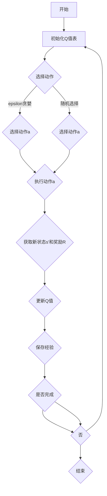
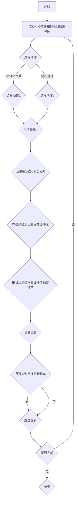
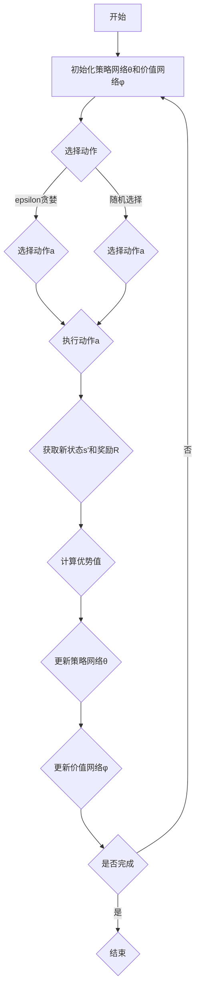
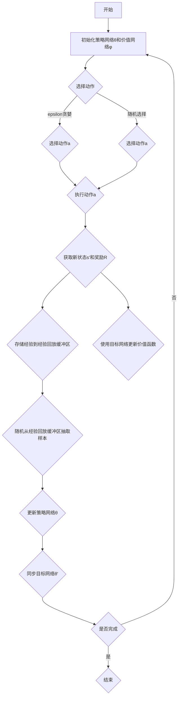

                 

# 《强化学习算法》

## 关键词

- 强化学习
- Q-Learning
- Policy Gradient
- DQN
- A2C
- DDPG
- Atari游戏
- 自动驾驶
- 推荐系统

## 摘要

本文将深入探讨强化学习算法这一领域，旨在为读者提供一个全面、系统的理解和实战指南。我们将首先介绍强化学习的基础知识，包括其历史背景、基本概念和主要挑战。接着，我们将讨论强化学习的数学基础，包括概率论和马尔可夫决策过程（MDP）。随后，我们将详细介绍强化学习的基本算法，如Q-Learning、Sarsa、DQN和Policy Gradient，以及高级强化学习算法如SARSA(λ)、Advantage Actor-Critic（A2C）、Asynchronous Advantage Actor-Critic（A3C）和Deep Deterministic Policy Gradient（DDPG）。文章的后半部分将专注于强化学习在现实世界中的应用，如游戏、自动驾驶、机器人控制和推荐系统。最后，我们将通过实际项目案例来展示如何实现和应用这些算法，并讨论强化学习的未来发展趋势。

## 《强化学习算法》目录大纲

### 第一部分：强化学习基础

#### 第1章：强化学习概述

- **1.1 强化学习的历史与基本概念**
- **1.2 强化学习的基本术语**
- **1.3 强化学习与传统机器学习的关系**
- **1.4 强化学习的主要挑战和机遇**

#### 第2章：强化学习的数学基础

- **2.1 基本概率论**
- **2.2 马尔可夫决策过程（MDP）**
- **2.3 动作-状态值函数和策略**

#### 第3章：强化学习的基本算法

- **3.1 Q-Learning算法**
- **3.2 Sarsa算法**
- **3.3 Deep Q-Network（DQN）算法**
- **3.4 Policy Gradient算法**

#### 第4章：高级强化学习算法

- **4.1 SARSA(λ)算法**
- **4.2 Advantage Actor-Critic（A2C）算法**
- **4.3 Asynchronous Advantage Actor-Critic（A3C）算法**
- **4.4 Deep Deterministic Policy Gradient（DDPG）算法**

#### 第5章：强化学习在现实世界中的应用

- **5.1 强化学习在游戏中的应用**
- **5.2 强化学习在自动驾驶中的应用**
- **5.3 强化学习在机器人控制中的应用**
- **5.4 强化学习在推荐系统中的应用**

### 第二部分：强化学习实战

#### 第6章：强化学习项目实战

- **6.1 项目准备**
  - **6.1.1 实战环境搭建**
  - **6.1.2 实战所需工具和库**
- **6.2 项目一：Atari游戏**
  - **6.2.1 游戏选择与准备**
  - **6.2.2 DQN算法实现**
  - **6.2.3 代码解读与分析**
- **6.3 项目二：智能推荐系统**
  - **6.3.1 系统设计**
  - **6.3.2 A2C算法实现**
  - **6.3.3 代码解读与分析**

#### 第7章：强化学习前沿趋势与未来展望

- **7.1 强化学习在AI领域的最新进展**
- **7.2 强化学习在行业中的应用前景**
- **7.3 强化学习面临的技术挑战与解决方案**
- **7.4 强化学习的未来发展趋势**

### 附录

#### 附录A：强化学习算法流程图

- **1. Q-Learning算法流程图**
- **2. Sarsa算法流程图**
- **3. DQN算法流程图**
- **4. A2C算法流程图**
- **5. DDPG算法流程图**

#### 附录B：强化学习数学公式

- **1. 马尔可夫决策过程（MDP）中的期望值计算**
- **2. Q-Learning算法中的更新公式**
- **3. Policy Gradient算法中的损失函数**
- **4. A2C算法中的优势函数**

## 第1章：强化学习概述

### 1.1 强化学习的历史与基本概念

强化学习（Reinforcement Learning，RL）是机器学习的一个重要分支，其核心思想是让智能体（agent）通过与环境的交互来学习如何采取行动以获得最大化的累积奖励。这一概念最早可以追溯到20世纪50年代，当时心理学家和行为科学家开始研究动物如何通过试错来学习行为。

强化学习的理念在20世纪80年代得到了计算机科学家的重视，尤其是在自动化控制和人工智能领域。其中，一位关键人物是理查德·萨顿（Richard Sutton）和安德鲁·巴肖（Andrew Barto）。他们在1988年出版的《 reinforcement learning: An introduction》成为了该领域的经典教材，为强化学习的发展奠定了基础。

在强化学习的基本概念中，有几个关键要素：

- **智能体（Agent）**：执行动作并从环境中获取信息的实体。
- **环境（Environment）**：智能体进行交互的上下文。
- **状态（State）**：环境中的一个具体配置。
- **动作（Action）**：智能体可以采取的步骤。
- **奖励（Reward）**：对智能体采取的动作的即时评价。
- **策略（Policy）**：智能体在给定状态下采取的动作。
- **值函数（Value Function）**：评估状态或状态-动作对的指标。
- **模型（Model）**：描述环境动态和奖励结构的数学模型。

### 1.2 强化学习的基本术语

在强化学习中，有一些基本的术语需要理解：

- **探索（Exploration）**：在强化学习中，探索是指智能体尝试不同的动作以发现新的信息或潜在的最佳策略。
- **利用（Utilization）**：利用是指在已有的信息基础上采取最有利的行为。
- **状态-动作值函数（State-Action Value Function）**：Q值，表示智能体在特定状态下采取特定动作的预期奖励。
- **策略（Policy）**：策略是指智能体在特定状态下采取的动作。
- **收益（Reward）**：收益是智能体在执行动作后从环境中获得的即时反馈。
- **回报（Return）**：回报是智能体在整个序列动作后获得的累积奖励。

### 1.3 强化学习与传统机器学习的关系

强化学习与传统机器学习（如监督学习和无监督学习）有显著的区别和联系。传统机器学习依赖于大量的标记数据，而强化学习则依赖于环境的互动和即时反馈。

- **监督学习**：在监督学习中，模型通过标记数据学习如何将输入映射到输出。强化学习则没有预定义的输出标签，而是通过与环境的交互来学习最优策略。

- **无监督学习**：无监督学习试图从未标记的数据中提取模式和结构。虽然强化学习也涉及到从未标记的数据中学习，但其重点是通过奖励信号来引导学习过程，而不是仅仅寻找数据中的内在结构。

- **区别**：
  - 强化学习强调从交互中学习，而传统机器学习侧重于从数据集中学习。
  - 强化学习涉及决策和行动，而传统机器学习主要涉及预测和分类。

- **联系**：
  - 强化学习可以被视为一种特殊的监督学习，其中奖励信号起到了标签的作用。
  - 强化学习算法（如Q-Learning）有时也会使用传统机器学习技术来优化其行为。

### 1.4 强化学习的主要挑战和机遇

强化学习虽然在理论和应用上取得了显著进展，但仍然面临一些挑战：

- **挑战**：
  - **样本效率**：强化学习通常需要大量的交互来学习，这意味着它可能需要更多的训练时间。
  - **稳定性**：由于强化学习涉及动态环境和未知状态，算法可能难以收敛到稳定的最优策略。
  - **稀疏奖励**：在很多实际应用中，奖励信号可能是稀疏的或不可观察的，这可能导致学习困难。

- **机遇**：
  - **自主学习**：强化学习算法可以通过与环境的交互自主地学习，这为自动化和自主系统的发展提供了新的可能。
  - **决策优化**：强化学习擅长解决涉及决策优化的复杂问题，如资源分配和路径规划。
  - **跨领域迁移**：一些强化学习算法可以迁移到不同的领域，这有助于提高其通用性和适用性。

接下来，我们将深入探讨强化学习的数学基础，以更好地理解这一强大而复杂的机器学习领域。

## 第2章：强化学习的数学基础

强化学习算法的核心在于其数学模型，尤其是马尔可夫决策过程（MDP）和值函数。这些数学工具为我们提供了形式化的框架，以分析和设计智能体在复杂环境中如何做出最优决策。

### 2.1 基本概率论

概率论是强化学习的基础之一。在强化学习中，我们需要对随机事件进行建模和预测。以下是一些基本概念：

- **概率分布**：描述随机变量的可能取值和概率。
- **条件概率**：在某个事件已发生的条件下，另一个事件发生的概率。
- **马尔可夫性**：一个过程的未来状态仅依赖于当前状态，而与过去状态无关。

- **马尔可夫链**：一个离散时间的随机过程，其中每个状态的概率分布仅依赖于前一个状态。

### 2.2 马尔可夫决策过程（MDP）

马尔可夫决策过程（MDP）是强化学习中最常用的数学模型。它由以下部分组成：

- **状态空间（S）**：环境中的所有可能状态。
- **动作空间（A）**：智能体可以采取的所有可能动作。
- **奖励函数（R(s, a）**：在特定状态s下执行动作a时获得的即时奖励。
- **转移概率矩阵（P(s', s | a）**：在状态s下执行动作a后，智能体转移到状态s'的概率。
- **策略（π）**：智能体在给定状态s下采取动作a的概率分布。

在MDP中，智能体的目标是找到一个策略π，使得累积奖励最大化。我们可以使用值函数来评估策略的优劣：

- **状态值函数（V(s)）**：在状态s下按照策略π执行动作获得的期望累积奖励。
- **状态-动作值函数（Q(s, a)）**：在状态s下执行动作a获得的期望累积奖励。

### 2.3 动作-状态值函数和策略

动作-状态值函数Q(s, a)是强化学习中的一个核心概念，它表示在特定状态s下执行动作a的预期回报。我们可以通过以下公式计算Q值：

$$
Q(s, a) = \sum_{s'} P(s'|s, a) \cdot [R(s, a) + \gamma \cdot \max_{a'} Q(s', a')]
$$

其中，\(P(s'|s, a)\) 是状态转移概率，\(R(s, a)\) 是奖励函数，\(\gamma\) 是折扣因子，它决定了未来奖励的重要性。

策略π是智能体在给定状态下采取的动作的概率分布。一个最优策略π*是使得累积奖励最大化的策略。我们可以通过以下公式来计算最优策略：

$$
\pi^*(s) = \arg\max_{a} Q(s, a)
$$

### 2.4 基本算法与数学原理

强化学习算法如Q-Learning和Policy Gradient都是基于上述数学模型的。这些算法的核心在于如何通过迭代更新值函数和策略，以最大化累积奖励。

- **Q-Learning算法**：Q-Learning是一种基于值函数的算法，它通过更新Q值来学习最优策略。算法的核心步骤如下：
  1. 初始化Q值表。
  2. 在环境中采取动作。
  3. 根据新状态和奖励更新Q值。
  4. 重复步骤2和3直到收敛。

- **Policy Gradient算法**：Policy Gradient算法直接优化策略π，通过更新策略的参数以最大化累积奖励。算法的核心步骤如下：
  1. 初始化策略参数。
  2. 在环境中采取动作。
  3. 计算策略的梯度。
  4. 更新策略参数。
  5. 重复步骤2到4直到收敛。

这些算法的数学原理和实现细节将在后续章节中详细讨论。

通过了解强化学习的数学基础，我们能够更深入地理解其原理和实现方法。接下来，我们将介绍强化学习的基本算法，以进一步探索这一领域。

## 第3章：强化学习的基本算法

### 3.1 Q-Learning算法

Q-Learning算法是一种基于值函数的强化学习算法，旨在通过迭代更新Q值（状态-动作值函数）来学习最优策略。其核心思想是利用当前的Q值和即时奖励来更新Q值，从而逐步逼近最优策略。

#### Q-Learning算法的步骤：

1. **初始化**：初始化Q值表，通常使用随机值或者零值。
2. **行动**：智能体在当前状态s下，根据策略π选择动作a。
3. **体验**：智能体执行动作a，进入新状态s'，并获得即时奖励R(s, a)。
4. **更新Q值**：根据以下公式更新Q值：
   $$
   Q(s, a) \leftarrow Q(s, a) + \alpha [R(s, a) + \gamma \max_{a'} Q(s', a') - Q(s, a)]
   $$
   其中，\(\alpha\) 是学习率，\(\gamma\) 是折扣因子。
5. **重复**：返回步骤2，继续迭代直到策略收敛。

#### Q-Learning算法的优点和局限性：

- **优点**：
  - **简单易实现**：Q-Learning算法的实现相对简单，易于理解和编码。
  - **稳健**：在稀疏奖励和动态环境中，Q-Learning算法表现出较高的稳健性。
  - **适用于连续状态和动作空间**：Q-Learning算法可以处理连续的状态和动作空间，通过适当的函数逼近方法（如神经网络）来实现。

- **局限性**：
  - **样本效率低**：Q-Learning算法需要大量的样本来收敛，特别是在状态-动作空间较大的情况下。
  - **稀疏奖励问题**：在稀疏奖励环境中，智能体可能需要很长时间才能找到最优策略。
  - **收敛速度慢**：在某些情况下，Q-Learning算法可能需要较长的迭代时间才能收敛到最优策略。

### 3.2 Sarsa算法

Sarsa（Surely Accurate and Responsive）算法是另一种基于值函数的强化学习算法，与Q-Learning算法类似，但它使用实际的回报（而非预期的回报）来更新Q值。Sarsa算法的更新公式如下：

$$
Q(s, a) \leftarrow Q(s, a) + \alpha [R(s, a) + \gamma Q(s', a') - Q(s, a)]
$$

#### Sarsa算法的步骤：

1. **初始化**：初始化Q值表。
2. **行动**：智能体在当前状态s下，根据策略π选择动作a。
3. **体验**：智能体执行动作a，进入新状态s'，并获得即时奖励R(s, a)。
4. **更新Q值**：根据实际回报更新Q值。
5. **重复**：返回步骤2，继续迭代直到策略收敛。

#### Sarsa算法的优点和局限性：

- **优点**：
  - **更好的收敛性**：Sarsa算法在某些情况下比Q-Learning算法具有更好的收敛性。
  - **适用于动态环境**：Sarsa算法在动态环境中表现出较好的适应性。

- **局限性**：
  - **计算成本高**：Sarsa算法每次更新Q值时都需要计算期望回报，这增加了计算成本。
  - **收敛速度相对较慢**：Sarsa算法的收敛速度相对于Q-Learning算法可能较慢。

### 3.3 Deep Q-Network（DQN）算法

Deep Q-Network（DQN）算法是Q-Learning算法的扩展，它引入了深度神经网络（DNN）来近似Q值函数。DQN算法的核心思想是通过训练DNN来估计Q值，从而解决传统Q-Learning算法在处理高维状态空间时遇到的困难。

#### DQN算法的步骤：

1. **初始化**：初始化DNN和经验回放缓冲区。
2. **行动**：智能体在当前状态s下，使用DNN估计的Q值选择动作a。
3. **体验**：智能体执行动作a，进入新状态s'，并获得即时奖励R(s, a)。
4. **存储经验**：将（s, a, s', R）经验对存储在经验回放缓冲区中。
5. **更新DNN**：从经验回放缓冲区中随机抽取经验对（s, a, s', R），使用以下公式更新DNN：
   $$
   y = R + \gamma \max_{a'} \hat{Q}(s', a')
   $$
   其中，\(\hat{Q}(s, a)\) 是DNN对Q值的估计。通过反向传播算法和梯度下降优化DNN的权重。
6. **重复**：返回步骤2，继续迭代直到策略收敛。

#### DQN算法的优点和局限性：

- **优点**：
  - **处理高维状态空间**：DQN算法通过DNN处理高维状态空间，解决了传统Q-Learning算法的难题。
  - **更好的样本效率**：DQN算法通过经验回放缓冲区减少了样本的相关性，提高了样本效率。

- **局限性**：
  - **训练不稳定**：DQN算法在训练过程中可能会出现不稳定的情况，例如由于目标Q值不稳定导致的梯度消失或爆炸问题。
  - **需要大量的计算资源**：DQN算法需要大量的计算资源来训练DNN，特别是在处理高维状态和动作空间时。

### 3.4 Policy Gradient算法

Policy Gradient算法是一种基于策略的强化学习算法，它直接优化策略π的参数，以最大化累积奖励。Policy Gradient算法的核心思想是通过计算策略的梯度来更新策略参数。

#### Policy Gradient算法的步骤：

1. **初始化**：初始化策略参数θ。
2. **行动**：智能体在当前状态s下，根据策略π(θ)选择动作a。
3. **体验**：智能体执行动作a，进入新状态s'，并获得即时奖励R(s, a)。
4. **计算策略梯度**：根据以下公式计算策略梯度：
   $$
   \nabla_{\theta} J(\theta) = \nabla_{\theta} \sum_{s, a} \pi(\theta)(s, a) \cdot [R(s, a) + \gamma \sum_{s', a'} \pi(\theta)(s', a') \cdot \nabla_{\theta} \log \pi(\theta)(s', a')]
   $$
   其中，\(J(\theta)\) 是策略的奖励期望。
5. **更新策略参数**：通过梯度下降更新策略参数θ。
6. **重复**：返回步骤2，继续迭代直到策略收敛。

#### Policy Gradient算法的优点和局限性：

- **优点**：
  - **直接优化策略**：Policy Gradient算法直接优化策略，不需要估计值函数。
  - **适用于高维状态和动作空间**：Policy Gradient算法适用于高维状态和动作空间，因为其不需要显式地处理状态-动作值函数。

- **局限性**：
  - **收敛性不稳定**：Policy Gradient算法的收敛性可能不稳定，特别是在稀疏奖励或动态环境中。
  - **需要较大的样本量**：Policy Gradient算法通常需要较大的样本量来收敛，特别是在稀疏奖励环境中。

通过上述基本算法的介绍，我们可以看到强化学习算法在数学基础和实现细节上的多样性。这些算法各有优缺点，适用于不同的应用场景。在接下来的章节中，我们将进一步探讨高级强化学习算法，以应对更复杂的实际问题。

## 第4章：高级强化学习算法

在前一章中，我们介绍了强化学习的基本算法。然而，这些基本算法在处理一些复杂和动态环境时可能显得力不从心。为了解决这些问题，研究者们提出了许多高级强化学习算法。本章将详细介绍其中几个代表性的算法，包括SARSA(λ)算法、Advantage Actor-Critic（A2C）算法、Asynchronous Advantage Actor-Critic（A3C）算法和Deep Deterministic Policy Gradient（DDPG）算法。

### 4.1 SARSA(λ)算法

SARSA(λ)算法是Sarsa算法的扩展，它引入了回望（lambda-return）的概念，以提高样本效率和收敛速度。SARSA(λ)算法的核心思想是利用回望技术，将多个时间步的回报结合起来进行Q值更新。

#### SARSA(λ)算法的步骤：

1. **初始化**：初始化参数λ，经验回放缓冲区和Q值表。
2. **行动**：智能体在当前状态s下，根据策略π选择动作a。
3. **体验**：智能体执行动作a，进入新状态s'，并获得即时奖励R(s, a)。
4. **更新Q值**：使用以下公式更新Q值：
   $$
   \Delta Q(s, a) = R(s, a) + \gamma \sum_{a'} \lambda \frac{\Delta Q(s', a')}{1 - \lambda}
   $$
   其中，\(\Delta Q(s', a')\) 是在下一个状态s'的Q值更新。
5. **重复**：返回步骤2，继续迭代直到策略收敛。

#### SARSA(λ)算法的优点和局限性：

- **优点**：
  - **提高样本效率**：SARSA(λ)算法通过回望技术，利用了更多的信息，从而提高了样本效率。
  - **适用于动态环境**：SARSA(λ)算法在动态环境中表现出较好的适应性。

- **局限性**：
  - **计算复杂度较高**：由于需要回望多个时间步，SARSA(λ)算法的计算复杂度较高。
  - **实现难度较大**：SARSA(λ)算法的实现相对复杂，需要精心设计和优化。

### 4.2 Advantage Actor-Critic（A2C）算法

A2C算法是一种基于策略的强化学习算法，它结合了Advantage函数和Critic方法。A2C算法通过计算每个动作的Advantage值来更新策略参数，从而提高了策略的优化效率。

#### A2C算法的步骤：

1. **初始化**：初始化策略参数θ和值函数参数φ。
2. **行动**：智能体在当前状态s下，根据策略π(θ)选择动作a。
3. **体验**：智能体执行动作a，进入新状态s'，并获得即时奖励R(s, a)。
4. **计算Advantage值**：计算当前动作的Advantage值：
   $$
   A(s, a) = R(s, a) + \gamma V(s') - V(s)
   $$
   其中，\(V(s)\) 是值函数的估计。
5. **更新策略参数**：使用以下公式更新策略参数θ：
   $$
   \theta \leftarrow \theta + \alpha [A(s, a) \cdot \nabla_{\theta} \log \pi(\theta)(s, a)]
   $$
6. **更新值函数参数**：使用梯度下降更新值函数参数φ。
7. **重复**：返回步骤2，继续迭代直到策略收敛。

#### A2C算法的优点和局限性：

- **优点**：
  - **高效的策略优化**：A2C算法通过计算Advantage值，提高了策略优化的效率。
  - **适用于连续动作空间**：A2C算法可以处理连续的动作空间，通过适当的函数逼近方法来实现。

- **局限性**：
  - **需要稳定的值函数**：A2C算法依赖于稳定的值函数，否则可能导致策略优化不稳定。
  - **实现复杂度较高**：A2C算法的实现相对复杂，需要精心设计和优化。

### 4.3 Asynchronous Advantage Actor-Critic（A3C）算法

A3C算法是一种异步的强化学习算法，它通过同时进行多个并行任务来提高样本效率和收敛速度。A3C算法的核心思想是利用多个智能体并行探索环境，并在不同的时间步进行参数更新。

#### A3C算法的步骤：

1. **初始化**：初始化多个智能体和工作线程。
2. **并行行动**：每个智能体在工作线程中根据策略π(θ)选择动作。
3. **并行体验**：每个智能体执行动作，进入新状态，并获得即时奖励。
4. **并行更新**：每个智能体使用局部经验进行策略参数和值函数参数的更新。
5. **全局同步**：将所有智能体的参数进行全局同步。
6. **重复**：返回步骤2，继续迭代直到策略收敛。

#### A3C算法的优点和局限性：

- **优点**：
  - **提高样本效率**：A3C算法通过并行探索环境，提高了样本效率。
  - **加速收敛**：A3C算法通过并行更新参数，加速了策略的收敛速度。

- **局限性**：
  - **需要大量的计算资源**：A3C算法需要大量的计算资源来并行执行多个任务。
  - **同步策略**：全局同步策略可能导致计算延迟，影响算法的性能。

### 4.4 Deep Deterministic Policy Gradient（DDPG）算法

DDPG算法是一种基于策略的深度强化学习算法，它通过使用深度神经网络来近似值函数和策略。DDPG算法的核心思想是利用深度神经网络（DNN）来处理高维状态和动作空间，并通过目标网络来稳定策略优化。

#### DDPG算法的步骤：

1. **初始化**：初始化策略网络π(θ)，目标网络π'(θ')，值函数网络Q(s, a；φ)和目标值函数网络Q'(s, a；φ')。
2. **行动**：智能体在当前状态s下，根据策略网络π(θ)选择动作a。
3. **体验**：智能体执行动作a，进入新状态s'，并获得即时奖励R(s, a)。
4. **更新值函数网络**：使用以下公式更新值函数网络：
   $$
   \phi \leftarrow \phi + \alpha [R(s, a) + \gamma Q'(s', a') - Q(s, a)]
   $$
5. **更新策略网络**：使用以下公式更新策略网络：
   $$
   \theta \leftarrow \theta + \alpha [\nabla_{\theta} \log \pi(\theta)(s, a) \cdot Q(s, a)]
   $$
6. **目标网络更新**：定期更新目标网络参数：
   $$
   \theta' \leftarrow \theta, \quad \phi' \leftarrow \phi
   $$
7. **重复**：返回步骤2，继续迭代直到策略收敛。

#### DDPG算法的优点和局限性：

- **优点**：
  - **处理高维状态和动作空间**：DDPG算法通过使用深度神经网络，可以处理高维状态和动作空间。
  - **稳定策略优化**：DDPG算法通过使用目标网络，提高了策略优化的稳定性。

- **局限性**：
  - **计算复杂度较高**：DDPG算法需要大量的计算资源来训练深度神经网络。
  - **需要良好的初始化**：DDPG算法对深度神经网络的初始化有较高的要求，否则可能导致训练不稳定。

通过上述高级强化学习算法的介绍，我们可以看到这些算法在处理复杂和动态环境时具有显著的优势。然而，每种算法都有其特定的适用场景和局限性。在接下来的章节中，我们将探讨强化学习在现实世界中的应用，以进一步展示这些算法的实际效果和潜力。

### 4.1 SARSA(λ)算法

SARSA(λ)算法是Sarsa算法的一个扩展，它通过引入回望技术来提高样本效率和收敛速度。SARSA(λ)的核心思想是将多个时间步的回报结合起来，以更有效地更新Q值表。这种方法使得SARSA(λ)能够更好地处理动态环境，并在某些情况下提高样本效率。

#### SARSA(λ)算法的原理

SARSA(λ)算法的关键概念是λ回望。λ回望允许算法在当前时间步的回报基础上，考虑之前时间步的回报，从而进行更加全局的Q值更新。具体来说，SARSA(λ)使用一个经验回放缓冲区，将过去N个时间步内的经验进行回放，并使用这些经验来更新Q值。

- **经验回放缓冲区**：经验回放缓冲区是一个用于存储和随机回放过去经验的数据结构。每个经验条目包含状态、动作、奖励和新状态。
- **λ回望**：λ回望是一个参数，表示在每次更新Q值时，需要回望的时间步数。较高的λ值会考虑更多的过去回报，从而减少短期奖励的影响，提高策略的稳定性。

#### SARSA(λ)算法的伪代码

以下是SARSA(λ)算法的伪代码：

```
初始化 Q(s, a)，经验回放缓冲区，参数 λ 和学习率 α
for episode in 1 to max_episodes do
    s <- 环境初始化
    for t in 1 to max_steps do
        a <- 根据策略 π(s) 选择动作
        s' <- 执行动作 a，得到奖励 R(s, a)
        G <- 0 （临时回报）
        for i = 1 to λ do
            if i == λ then
                G <- R(s, a) + γQ(s', a')
            else
                G <- 0 （忽略中间回报）
        Q(s, a) <- Q(s, a) + α[G - Q(s, a)]
        s <- s'
        if done then
            break
    end for
end for
```

在这个伪代码中，我们首先初始化Q值表和经验回放缓冲区。在每个时间步，智能体根据当前策略选择动作，并执行该动作以获取新状态和奖励。然后，我们计算λ回望的临时回报G，并将其用于更新Q值。这个过程重复进行，直到达到最大步骤数或智能体完成任务。

#### SARSA(λ)算法的优缺点

**优点**：

- **提高样本效率**：SARSA(λ)算法通过考虑过去多个时间步的回报，减少了短期奖励对策略更新的影响，从而提高了样本效率。
- **更好的稳定性**：由于SARSA(λ)算法考虑了更多的信息，因此它相对于Sarsa算法在动态环境中表现出更好的稳定性。
- **适用于动态环境**：SARSA(λ)算法在处理动态环境时表现出较好的适应性，因为它能够更好地捕捉长期奖励。

**缺点**：

- **计算复杂度高**：由于需要回望多个时间步，SARSA(λ)算法的计算复杂度较高，尤其是在长回望情况下。
- **实现难度较大**：SARSA(λ)算法的实现相对复杂，需要精心设计和优化，以确保算法的效率和稳定性。

通过上述分析，我们可以看到SARSA(λ)算法在处理动态环境时具有显著的优势。尽管其实现较为复杂，但其在提高样本效率和策略稳定性方面具有重要意义。

### 4.2 Advantage Actor-Critic（A2C）算法

Advantage Actor-Critic（A2C）算法是一种基于策略的强化学习算法，它结合了Advantage函数和Critic方法。A2C算法通过计算每个动作的Advantage值来更新策略参数，从而提高了策略优化的效率。A2C算法的核心思想是利用Advantage值来指导策略的更新，同时使用Critic方法来估计值函数。

#### A2C算法的原理

A2C算法中的Advantage函数是强化学习中的一个重要概念。Advantage函数表示在特定状态s下，执行动作a相对于其他动作的预期回报优势。具体来说，Advantage函数的计算公式如下：

$$
A(s, a) = R(s, a) + \gamma V(s') - V(s)
$$

其中，\(R(s, a)\) 是即时奖励，\(\gamma\) 是折扣因子，\(V(s')\) 是值函数在状态s'的估计，\(V(s)\) 是值函数在状态s的估计。

A2C算法的核心步骤如下：

1. **初始化**：初始化策略参数θ、值函数参数φ和优势函数参数η。
2. **行动**：智能体在当前状态s下，根据策略π(θ)选择动作a。
3. **体验**：智能体执行动作a，进入新状态s'，并获得即时奖励R(s, a)。
4. **计算Advantage值**：计算当前动作的Advantage值。
5. **更新策略参数**：使用Advantage值和策略梯度更新策略参数θ：
   $$
   \theta \leftarrow \theta + \alpha [A(s, a) \cdot \nabla_{\theta} \log \pi(\theta)(s, a)]
   $$
6. **更新值函数参数**：使用梯度下降更新值函数参数φ：
   $$
   \phi \leftarrow \phi + \alpha [R(s, a) + \gamma V(s') - V(s) - \theta^T \phi]
   $$
7. **重复**：返回步骤2，继续迭代直到策略收敛。

#### A2C算法的优点和局限性

**优点**：

- **高效的策略优化**：A2C算法通过计算Advantage值，提高了策略优化的效率，减少了不必要的更新。
- **适用于连续动作空间**：A2C算法可以处理连续的动作空间，通过适当的函数逼近方法来实现。
- **易于实现**：A2C算法的实现相对简单，适用于各种强化学习应用。

**局限性**：

- **需要稳定的值函数**：A2C算法依赖于稳定的值函数，否则可能导致策略优化不稳定。
- **计算复杂度较高**：A2C算法在每次更新时都需要计算Advantage值和策略梯度，计算复杂度相对较高。
- **对奖励设计敏感**：A2C算法对奖励设计敏感，不当的奖励设计可能导致算法无法收敛。

通过上述分析，我们可以看到A2C算法在策略优化方面具有显著的优势。尽管其实现较为复杂，但其在处理连续动作空间和提升策略优化效率方面具有重要意义。

### 4.3 Asynchronous Advantage Actor-Critic（A3C）算法

Asynchronous Advantage Actor-Critic（A3C）算法是一种异步的强化学习算法，它通过同时进行多个并行任务来提高样本效率和收敛速度。A3C算法的核心思想是利用多个智能体并行探索环境，并在不同的时间步进行参数更新。这种并行化的设计使得A3C算法能够更有效地利用计算资源，并在复杂环境中取得更好的性能。

#### A3C算法的原理

A3C算法的关键概念是异步更新。在A3C算法中，多个智能体（也称为工作者）并行地探索环境，并独立更新自己的策略和值函数参数。每个智能体在工作线程中执行一系列动作，并在完成一个时间步后，将局部经验发送到一个全局经验缓冲区。然后，主线程从全局经验缓冲区中随机抽取经验，并使用这些经验来更新全局参数。

A3C算法的核心步骤如下：

1. **初始化**：初始化多个智能体和工作线程，以及策略网络θ、目标网络θ'、值函数网络φ和目标值函数网络φ'。
2. **并行行动**：每个智能体在工作线程中根据当前策略θ选择动作，并执行该动作以获取新状态和奖励。
3. **存储经验**：智能体将当前状态、动作、奖励和新状态存储在局部经验缓存中。
4. **全局同步**：在完成一定数量的时间步后，每个智能体将局部经验缓存中的经验发送到全局经验缓冲区。
5. **更新全局参数**：主线程从全局经验缓冲区中随机抽取经验，并使用这些经验来更新全局策略参数θ和值函数参数φ。
6. **目标网络更新**：定期更新目标网络θ'和目标值函数网络φ'，以保持参数的稳定性。
7. **重复**：返回步骤2，继续迭代直到策略收敛。

#### A3C算法的优点和局限性

**优点**：

- **提高样本效率**：A3C算法通过并行探索环境，提高了样本效率，减少了训练时间。
- **加速收敛**：A3C算法通过并行更新参数，加速了策略的收敛速度。
- **适用于复杂环境**：A3C算法能够处理高维状态和动作空间，并在复杂环境中表现出较好的性能。

**局限性**：

- **需要大量的计算资源**：A3C算法需要大量的计算资源来并行执行多个任务，包括多线程处理和大规模训练。
- **同步策略**：全局同步策略可能导致计算延迟，影响算法的性能。
- **实现复杂度较高**：A3C算法的实现相对复杂，需要精心设计和优化。

通过上述分析，我们可以看到A3C算法在处理复杂和动态环境时具有显著的优势。尽管其实现较为复杂，但其在提高样本效率和收敛速度方面具有重要意义。

### 4.4 Deep Deterministic Policy Gradient（DDPG）算法

Deep Deterministic Policy Gradient（DDPG）算法是一种基于策略的深度强化学习算法，它通过使用深度神经网络来近似值函数和策略。DDPG算法的核心思想是利用深度神经网络（DNN）来处理高维状态和动作空间，并通过目标网络来稳定策略优化。DDPG算法在许多实际应用中表现出优异的性能，特别是在连续动作空间和复杂环境中的任务。

#### DDPG算法的原理

DDPG算法的关键组成部分包括策略网络π(θ)、值函数网络Q(s, a；φ)和目标网络π'(θ')、Q'(s, a；φ')。策略网络π(θ)负责选择动作，值函数网络Q(s, a；φ)负责评估状态-动作对的价值，目标网络π'(θ')和目标值函数网络Q'(s, a；φ')用于稳定策略优化。

DDPG算法的核心步骤如下：

1. **初始化**：初始化策略网络θ、目标网络θ'、值函数网络φ和目标值函数网络φ'。
2. **行动**：智能体在当前状态s下，根据策略网络π(θ)选择动作a。
3. **体验**：智能体执行动作a，进入新状态s'，并获得即时奖励R(s, a)。
4. **更新值函数网络**：使用以下公式更新值函数网络：
   $$
   \phi \leftarrow \phi + \alpha [R(s, a) + \gamma Q'(s', a') - Q(s, a)]
   $$
5. **更新策略网络**：使用以下公式更新策略网络：
   $$
   \theta \leftarrow \theta + \alpha [\nabla_{\theta} \log \pi(\theta)(s, a) \cdot Q(s, a)]
   $$
6. **目标网络更新**：定期更新目标网络θ'和目标值函数网络φ'，以保持参数的稳定性：
   $$
   \theta' \leftarrow \theta, \quad \phi' \leftarrow \phi
   $$
7. **重复**：返回步骤2，继续迭代直到策略收敛。

#### DDPG算法的优点和局限性

**优点**：

- **处理高维状态和动作空间**：DDPG算法通过使用深度神经网络，可以处理高维状态和动作空间。
- **稳定策略优化**：DDPG算法通过使用目标网络，提高了策略优化的稳定性，避免了梯度消失和梯度爆炸问题。
- **适用于连续动作空间**：DDPG算法可以处理连续的动作空间，通过适当的函数逼近方法来实现。

**局限性**：

- **需要大量的计算资源**：DDPG算法需要大量的计算资源来训练深度神经网络，特别是在处理高维状态和动作空间时。
- **需要良好的初始化**：DDPG算法对深度神经网络的初始化有较高的要求，否则可能导致训练不稳定。
- **训练时间较长**：由于DDPG算法涉及多次前向传播和反向传播，训练时间相对较长。

通过上述分析，我们可以看到DDPG算法在处理高维状态和动作空间以及复杂环境时具有显著的优势。尽管其实现较为复杂，但其在稳定策略优化和性能提升方面具有重要意义。

## 第5章：强化学习在现实世界中的应用

强化学习算法在近年来取得了显著的进展，并在众多现实世界场景中得到了广泛应用。本章将探讨强化学习在游戏、自动驾驶、机器人控制和推荐系统等领域的应用，展示其在解决复杂决策问题方面的潜力。

### 5.1 强化学习在游戏中的应用

强化学习在游戏中的应用最为广泛，特别是在复杂的Atari游戏中。Atari游戏具有高维状态空间和连续动作空间，传统的方法难以应对。强化学习算法如DQN和DDPG等在许多Atari游戏中取得了优异的表现。

**案例一：DeepMind的Atari游戏**

DeepMind使用DQN算法在多个Atari游戏中实现了人类水平的性能。DQN算法通过训练一个深度神经网络来近似Q值函数，从而学习最优策略。在训练过程中，DQN算法利用经验回放缓冲区来减少样本相关性，提高学习效率。以下是一个简单的DQN算法的伪代码：

```
初始化 Q 值表，经验回放缓冲区，目标网络Q'，目标更新频率
for episode in 1 to max_episodes do
    s <- 环境初始化
    for t in 1 to max_steps do
        a <- 根据Q'表选择动作
        s' <- 执行动作a，得到奖励R(s, a)
        将(s, a, s', R)添加到经验回放缓冲区
        从经验回放缓冲区中随机抽取一批经验
        更新Q'表：Q'(s, a) = R(s, a) + γ * max(Q'(s', a'))
        如果到达更新频率，则更新主网络Q表：Q表 = Q'表
        s <- s'
        if done then
            break
    end for
end for
```

**案例二：DeepMind的《星际争霸》AI**

DeepMind还开发了《星际争霸》AI，使用深度强化学习算法在多人在线游戏中取得了人类水平的性能。这个项目展示了强化学习在复杂决策环境中的潜力，同时也展示了多智能体强化学习（MASL）的应用。

### 5.2 强化学习在自动驾驶中的应用

自动驾驶是强化学习应用的重要领域之一。强化学习算法能够通过模拟和实际驾驶数据来训练自动驾驶系统，从而实现安全的自主驾驶。

**案例一：NVIDIA的自动驾驶系统**

NVIDIA使用强化学习算法来训练自动驾驶系统的感知和决策模块。通过结合深度神经网络和强化学习，NVIDIA的自动驾驶系统能够在复杂的交通环境中做出实时决策。以下是一个简单的自动驾驶系统的流程图：

```
感知模块：从传感器（摄像头、激光雷达等）获取环境数据
环境建模：使用深度神经网络对环境进行建模
行为规划：根据环境模型，使用强化学习算法生成驾驶策略
控制执行：根据驾驶策略，控制车辆的动作
反馈调整：根据驾驶结果，更新强化学习算法的参数
```

**案例二：Waymo的自动驾驶系统**

Waymo是谷歌旗下的自动驾驶公司，其自动驾驶系统使用深度强化学习算法来训练感知和决策模块。Waymo的系统通过大量的模拟和实际驾驶数据来优化算法，实现了高精度的自主驾驶。

### 5.3 强化学习在机器人控制中的应用

强化学习在机器人控制中的应用也非常广泛，特别是在机器人路径规划和运动控制方面。

**案例一：波士顿动力公司的机器人**

波士顿动力公司使用强化学习算法来训练其机器人的行走和平衡能力。通过使用深度强化学习算法，波士顿动力的机器人能够在不同的地形和条件下实现稳定的行走。以下是一个简单的机器人控制流程图：

```
感知模块：从机器人传感器（摄像头、力传感器等）获取数据
状态评估：使用深度神经网络评估当前状态
行为规划：根据状态评估，使用强化学习算法生成控制策略
控制执行：根据控制策略，生成机器人的动作
反馈调整：根据动作结果，更新强化学习算法的参数
```

**案例二：OpenAI的机器人**

OpenAI使用强化学习算法来训练其机器人进行复杂的任务，如抓取、搬运和组装。通过结合深度学习和强化学习，OpenAI的机器人能够在没有人工干预的情况下完成任务。

### 5.4 强化学习在推荐系统中的应用

强化学习在推荐系统中的应用也取得了显著进展，特别是在个性化推荐和广告投放方面。

**案例一：亚马逊的推荐系统**

亚马逊使用强化学习算法来优化其推荐系统，从而提高用户的购物体验。通过结合用户的历史行为数据和商品属性，亚马逊的推荐系统使用强化学习算法来选择最佳的推荐策略。以下是一个简单的推荐系统流程图：

```
用户行为数据：收集用户的历史购买、浏览和评价数据
商品属性数据：收集商品的属性数据
推荐策略：使用强化学习算法生成推荐策略
推荐生成：根据推荐策略，生成推荐列表
用户反馈：收集用户的反馈信息（点击、购买等）
策略更新：根据用户反馈，更新强化学习算法的参数
```

**案例二：百度的广告推荐系统**

百度使用强化学习算法来优化其广告推荐系统，从而提高广告投放的效果。通过结合用户的搜索历史和行为数据，百度的广告推荐系统使用强化学习算法来选择最佳的广告投放策略。

通过上述案例，我们可以看到强化学习算法在现实世界中的应用广泛且多样化。从游戏到自动驾驶，从机器人控制到推荐系统，强化学习算法在解决复杂决策问题方面展示了其强大的能力和潜力。

### 6.1 项目准备

在开始强化学习项目之前，我们需要进行一些准备工作，包括搭建实验环境、安装必要的工具和库。以下是一个基本的步骤指南。

#### 6.1.1 实战环境搭建

首先，我们需要搭建一个适合强化学习实验的开发环境。以下是搭建环境的基本步骤：

1. **安装Python环境**：确保你的计算机上安装了Python 3.x版本。你可以从 [Python官网](https://www.python.org/) 下载并安装。

2. **安装Jupyter Notebook**：Jupyter Notebook是一个交互式的开发环境，适合编写和运行强化学习代码。你可以使用以下命令安装：
   ```
   pip install notebook
   ```

3. **安装TensorFlow**：TensorFlow是一个流行的开源机器学习库，用于构建和训练强化学习模型。你可以使用以下命令安装：
   ```
   pip install tensorflow
   ```

4. **安装Gym**：Gym是一个开源的强化学习环境库，提供了多种预定义的Atari游戏环境。你可以使用以下命令安装：
   ```
   pip install gym
   ```

5. **安装其他依赖库**：根据你的项目需求，可能还需要安装其他依赖库，如NumPy、Pandas等。

#### 6.1.2 实战所需工具和库

以下是进行强化学习项目所需的工具和库：

- **Python**：主要编程语言。
- **Jupyter Notebook**：交互式开发环境。
- **TensorFlow**：用于构建和训练强化学习模型。
- **Gym**：用于提供预定义的强化学习环境。
- **NumPy**：用于高效的科学计算。
- **Pandas**：用于数据处理和分析。
- **Matplotlib**：用于数据可视化。

在搭建好环境后，我们可以开始编写和运行强化学习代码。在下一个部分中，我们将详细介绍如何实现DQN算法来训练智能体在Atari游戏《Pong》中自主学习。

### 6.2 项目一：Atari游戏《Pong》

在本项目中，我们将使用强化学习中的DQN算法训练一个智能体在Atari游戏《Pong》中自主学习。DQN（Deep Q-Network）是一种使用深度神经网络来近似Q值函数的强化学习算法。通过这个项目，我们将了解如何使用TensorFlow和Gym来实现DQN算法。

#### 6.2.1 游戏选择与准备

选择《Pong》游戏作为我们的实验对象是因为它是一个相对简单但具有挑战性的Atari游戏，具有以下特点：

- **高维状态空间**：《Pong》游戏的状态由像素值组成，状态空间维度较高。
- **连续的动作空间**：智能体可以向上或向下移动 paddle，动作空间是连续的。
- **清晰的奖励机制**：游戏的奖励机制清晰，得分越高，奖励越大。

以下是实现DQN算法的基本步骤：

#### 步骤一：导入所需的库

```python
import gym
import tensorflow as tf
import numpy as np
import random
import matplotlib.pyplot as plt
import os
import time
```

#### 步骤二：初始化环境

```python
# 创建Atari游戏环境
env = gym.make("Pong-v0")
```

#### 步骤三：定义DQN模型

```python
# 定义DQN模型的输入和输出
input_shape = env.observation_space.shape
action_space = env.action_space.n

# 定义DQN模型的输入层和隐藏层
input_layer = tf.keras.layers.Input(shape=input_shape)
hidden_layer = tf.keras.layers.Dense(units=256, activation='relu')(input_layer)

# 定义DQN模型的输出层
output_layer = tf.keras.layers.Dense(units=action_space, activation='linear')(hidden_layer)

# 创建DQN模型
dqn_model = tf.keras.Model(inputs=input_layer, outputs=output_layer)

# 编译模型
optimizer = tf.keras.optimizers.Adam(learning_rate=0.001)
dqn_model.compile(optimizer=optimizer, loss='mse')
```

#### 步骤四：定义经验回放缓冲区

```python
# 初始化经验回放缓冲区
experience_replay = []

# 定义经验回放缓冲区的大小
replay_memory_size = 10000

# 定义经验回放缓冲区的添加方法
def append_to_replay_buffer(state, action, reward, next_state, done):
    experience_replay.append((state, action, reward, next_state, done))
    if len(experience_replay) > replay_memory_size:
        experience_replay.pop(0)
```

#### 步骤五：训练DQN模型

```python
# 设置训练参数
epsilon = 1.0
epsilon_min = 0.01
epsilon_decay = 0.995
gamma = 0.99
batch_size = 32
max_episodes = 1000
max_steps = 200

# 定义训练过程
for episode in range(max_episodes):
    state = env.reset()
    done = False
    total_reward = 0

    for step in range(max_steps):
        # 根据epsilon贪婪策略选择动作
        if random.uniform(0, 1) < epsilon:
            action = env.action_space.sample()
        else:
            action = np.argmax(dqn_model.predict(state))

        # 执行动作，获取新状态和奖励
        next_state, reward, done, _ = env.step(action)
        total_reward += reward

        # 更新经验回放缓冲区
        append_to_replay_buffer(state, action, reward, next_state, done)

        # 更新状态
        state = next_state

        # 如果达到更新频率，则更新模型
        if len(experience_replay) > batch_size:
            random_batch = random.sample(experience_replay, batch_size)
            states, actions, rewards, next_states, dones = zip(*random_batch)

            # 计算目标Q值
            target_Q_values = dqn_model.predict(next_states)
            target_Q_values = target_Q_values.max(axis=1)

            # 构建目标Q值
            target_Q_values = rewards + (1 - dones) * gamma * target_Q_values

            # 训练模型
            with tf.GradientTape() as tape:
                Q_values = dqn_model.predict(states)
                loss = tf.keras.losses.mean_squared_error(target_Q_values, Q_values[range(batch_size), actions])

            gradients = tape.gradient(loss, dqn_model.trainable_variables)
            optimizer.apply_gradients(zip(gradients, dqn_model.trainable_variables))

        # 更新epsilon值
        epsilon = max(epsilon_min, epsilon * epsilon_decay)

        # 如果游戏结束，则结束当前时间步
        if done:
            break

    # 打印训练结果
    print(f"Episode: {episode + 1}, Total Reward: {total_reward}")
```

#### 步骤六：评估模型性能

在训练完成后，我们可以评估模型的性能。以下是一个简单的评估函数：

```python
def evaluate_model(model, env, num_episodes=10, max_steps=200):
    total_reward = 0
    for episode in range(num_episodes):
        state = env.reset()
        done = False
        for step in range(max_steps):
            action = np.argmax(model.predict(state))
            next_state, reward, done, _ = env.step(action)
            total_reward += reward
            state = next_state
            if done:
                break
    return total_reward / num_episodes
```

通过上述步骤，我们可以实现一个基本的DQN算法，并在Atari游戏《Pong》中训练智能体。接下来，我们将详细解读代码中的关键部分。

### 6.2.2 DQN算法实现与代码解读

在前面的步骤中，我们实现了DQN算法的基本框架。下面我们将详细解读代码中的关键部分，包括模型的定义、训练过程和评估。

#### 模型定义

```python
input_shape = env.observation_space.shape
action_space = env.action_space.n

input_layer = tf.keras.layers.Input(shape=input_shape)
hidden_layer = tf.keras.layers.Dense(units=256, activation='relu')(input_layer)
output_layer = tf.keras.layers.Dense(units=action_space, activation='linear')(hidden_layer)

dqn_model = tf.keras.Model(inputs=input_layer, outputs=output_layer)
dqn_model.compile(optimizer=optimizer, loss='mse')
```

这段代码首先定义了DQN模型的输入层、隐藏层和输出层。输入层接收来自游戏环境的观测数据，隐藏层用于提取特征，输出层输出每个动作的Q值。

- `input_shape` 表示游戏环境的观测空间维度。
- `action_space` 表示游戏环境的动作空间大小。
- `input_layer` 定义了模型的输入层。
- `hidden_layer` 定义了隐藏层，使用了256个神经元和ReLU激活函数。
- `output_layer` 定义了输出层，每个动作有一个对应的Q值，使用线性激活函数。

#### 经验回放缓冲区

```python
experience_replay = []
replay_memory_size = 10000

def append_to_replay_buffer(state, action, reward, next_state, done):
    experience_replay.append((state, action, reward, next_state, done))
    if len(experience_replay) > replay_memory_size:
        experience_replay.pop(0)
```

经验回放缓冲区是DQN算法中的一个关键组件，用于存储智能体在游戏中的经验。通过随机采样经验进行训练，可以减少样本相关性，提高学习效率。

- `experience_replay` 是一个列表，用于存储经验。
- `replay_memory_size` 是缓冲区的最大容量。
- `append_to_replay_buffer` 函数用于添加经验到缓冲区。如果缓冲区已满，则删除最旧的经验。

#### 训练过程

```python
for episode in range(max_episodes):
    state = env.reset()
    done = False
    total_reward = 0

    for step in range(max_steps):
        # 根据epsilon贪婪策略选择动作
        if random.uniform(0, 1) < epsilon:
            action = env.action_space.sample()
        else:
            action = np.argmax(dqn_model.predict(state))

        # 执行动作，获取新状态和奖励
        next_state, reward, done, _ = env.step(action)
        total_reward += reward

        # 更新经验回放缓冲区
        append_to_replay_buffer(state, action, reward, next_state, done)

        # 更新状态
        state = next_state

        # 如果达到更新频率，则更新模型
        if len(experience_replay) > batch_size:
            random_batch = random.sample(experience_replay, batch_size)
            states, actions, rewards, next_states, dones = zip(*random_batch)

            # 计算目标Q值
            target_Q_values = dqn_model.predict(next_states)
            target_Q_values = target_Q_values.max(axis=1)

            # 构建目标Q值
            target_Q_values = rewards + (1 - dones) * gamma * target_Q_values

            # 训练模型
            with tf.GradientTape() as tape:
                Q_values = dqn_model.predict(states)
                loss = tf.keras.losses.mean_squared_error(target_Q_values, Q_values[range(batch_size), actions])

            gradients = tape.gradient(loss, dqn_model.trainable_variables)
            optimizer.apply_gradients(zip(gradients, dqn_model.trainable_variables))

        # 更新epsilon值
        epsilon = max(epsilon_min, epsilon * epsilon_decay)

        # 如果游戏结束，则结束当前时间步
        if done:
            break

    # 打印训练结果
    print(f"Episode: {episode + 1}, Total Reward: {total_reward}")
```

这段代码实现了DQN算法的训练过程。以下是关键步骤的解读：

1. **初始化环境**：
   - `state = env.reset()`：初始化游戏环境，获得初始状态。
   - `done = False`：初始化游戏是否结束的标志。

2. **循环进行游戏**：
   - `for step in range(max_steps)`：设置每个游戏回合的时间步数。

3. **选择动作**：
   - `if random.uniform(0, 1) < epsilon:`：使用epsilon贪婪策略选择动作。epsilon是探索和利用的平衡参数，随着训练进行逐渐减小。
   - `action = env.action_space.sample()`：随机选择动作。
   - `action = np.argmax(dqn_model.predict(state))`：使用模型选择动作，即选择Q值最大的动作。

4. **执行动作**：
   - `next_state, reward, done, _ = env.step(action)`：执行动作，获得新状态和奖励。
   - `total_reward += reward`：累积回合奖励。

5. **更新经验回放缓冲区**：
   - `append_to_replay_buffer(state, action, reward, next_state, done)`：将当前状态、动作、奖励、新状态和是否结束添加到经验回放缓冲区。

6. **更新模型**：
   - `if len(experience_replay) > batch_size:`：检查经验回放缓冲区是否已满，达到更新频率。
   - `random_batch = random.sample(experience_replay, batch_size)`：随机抽取一批经验。
   - `states, actions, rewards, next_states, dones = zip(*random_batch)`：拆分经验批次。
   - `target_Q_values = dqn_model.predict(next_states)`：预测新状态的Q值。
   - `target_Q_values = target_Q_values.max(axis=1)`：计算新状态的最大Q值。
   - `target_Q_values = rewards + (1 - dones) * gamma * target_Q_values`：构建目标Q值。
   - `with tf.GradientTape() as tape:`：使用TensorFlow的GradientTape记录梯度。
   - `Q_values = dqn_model.predict(states)`：预测当前状态的Q值。
   - `loss = tf.keras.losses.mean_squared_error(target_Q_values, Q_values[range(batch_size), actions])`：计算损失函数。
   - `gradients = tape.gradient(loss, dqn_model.trainable_variables)`：计算梯度。
   - `optimizer.apply_gradients(zip(gradients, dqn_model.trainable_variables))`：更新模型参数。

7. **更新epsilon值**：
   - `epsilon = max(epsilon_min, epsilon * epsilon_decay)`：根据epsilon衰减策略更新epsilon值。

8. **结束回合**：
   - `if done:`：如果游戏结束，则结束当前时间步。

9. **打印训练结果**：
   - `print(f"Episode: {episode + 1}, Total Reward: {total_reward}")`：打印当前回合的总奖励。

通过以上解读，我们可以看到DQN算法的核心步骤是如何通过选择动作、执行动作、更新经验回放缓冲区和更新模型来逐步学习最优策略。

### 6.3 智能推荐系统项目实战

在上一部分中，我们实现了强化学习在Atari游戏《Pong》中的应用。接下来，我们将探讨如何将强化学习应用于智能推荐系统，特别是使用A2C算法来实现个性化推荐。

#### 6.3.1 系统设计

智能推荐系统旨在根据用户的兴趣和行为，为用户提供个性化的商品或内容推荐。在设计智能推荐系统时，我们需要考虑以下关键组成部分：

- **用户行为数据**：包括用户的浏览、点击、购买等行为数据。
- **商品或内容特征**：包括商品或内容的属性、类别、标签等信息。
- **推荐算法**：使用强化学习算法，如A2C，来生成推荐策略。
- **用户-商品或内容交互模型**：用于预测用户对不同商品或内容的偏好。

以下是智能推荐系统的基本架构：

```
用户行为数据
    |
    V
用户-商品或内容交互模型
    |
    V
A2C算法
    |
    V
推荐策略
    |
    V
商品或内容推荐结果
```

#### 6.3.2 A2C算法实现

在实现A2C算法时，我们需要定义策略网络、价值网络和优势函数。以下是一个简化的实现过程：

1. **定义输入层和隐藏层**：
   - 输入层接收用户行为数据和商品或内容特征。
   - 隐藏层用于提取特征和生成中间表示。

2. **定义策略网络**：
   - 策略网络用于生成推荐策略，即给定用户和商品或内容特征，选择推荐的概率分布。

3. **定义价值网络**：
   - 价值网络用于评估策略的好坏，即预测用户对推荐商品或内容的长期偏好。

4. **定义优势函数**：
   - 优势函数用于计算推荐策略的回报，即用户对推荐商品或内容的实际反馈。

5. **训练模型**：
   - 使用梯度下降法更新策略网络和价值网络的参数，以最小化损失函数。

以下是A2C算法的伪代码：

```python
# 初始化策略网络θ、价值网络φ和优势函数η
# 定义输入层和隐藏层
# 定义策略网络
# 定义价值网络
# 定义优势函数

# 训练模型
for epoch in 1 to max_epochs do
    for user, content in user-content pairs do
        # 获取用户行为数据和内容特征
        # 选择推荐动作（商品或内容）
        # 获取用户反馈（奖励）
        # 计算优势值
        # 更新策略网络参数
        # 更新价值网络参数
    end for
end for
```

#### 6.3.3 代码解读与分析

以下是一个简单的A2C算法实现，我们将对其关键部分进行解读。

```python
import tensorflow as tf
import numpy as np
import random

# 定义参数
learning_rate = 0.001
discount_factor = 0.99
epsilon = 1.0
epsilon_min = 0.01
epsilon_decay = 0.995
batch_size = 32
max_epochs = 1000

# 定义输入层和隐藏层
input_shape = (None, input_size)
hidden_layer_size = 128

# 定义策略网络
policy_network = tf.keras.Sequential([
    tf.keras.layers.Dense(hidden_layer_size, activation='relu', input_shape=input_shape),
    tf.keras.layers.Dense(output_size, activation='softmax')
])

# 定义价值网络
value_network = tf.keras.Sequential([
    tf.keras.layers.Dense(hidden_layer_size, activation='relu', input_shape=input_shape),
    tf.keras.layers.Dense(1)
])

# 定义优势函数
advantage_function = ...

# 编译模型
optimizer = tf.keras.optimizers.Adam(learning_rate=learning_rate)
policy_loss = tf.keras.losses.SparseCategoricalCrossentropy(from_logits=True)
value_loss = tf.keras.losses.MeanSquaredError()

policy_network.compile(optimizer=optimizer, loss=policy_loss)
value_network.compile(optimizer=optimizer, loss=value_loss)

# 训练模型
for epoch in range(max_epochs):
    for user, content in user_content_pairs:
        # 获取用户行为数据和内容特征
        user_features = ...
        content_features = ...

        # 选择推荐动作
        policy_logits = policy_network.predict([user_features, content_features])
        action = np.argmax(policy_logits)

        # 获取用户反馈
        reward = ...

        # 计算优势值
        ...

        # 更新策略网络参数
        with tf.GradientTape() as tape:
            policy_loss_value = policy_loss(y_true=action, y_pred=policy_logits)
            value_loss_value = value_loss(y_true=reward, y_pred=value_network.predict([user_features, content_features]))

        gradients = tape.gradient(policy_loss_value + value_loss_value, policy_network.trainable_variables + value_network.trainable_variables)
        optimizer.apply_gradients(zip(gradients, policy_network.trainable_variables + value_network.trainable_variables))

        # 更新epsilon值
        epsilon = max(epsilon_min, epsilon * epsilon_decay)
```

**关键部分解读**：

1. **定义模型**：
   - `input_shape`：输入层的维度，包括用户行为数据和内容特征。
   - `hidden_layer_size`：隐藏层的神经元数量。
   - `policy_network`：策略网络，用于生成推荐动作的概率分布。
   - `value_network`：价值网络，用于预测用户对推荐内容的长期偏好。
   - `advantage_function`：优势函数，用于计算策略的回报。
   - `optimizer`：优化器，用于更新模型参数。
   - `policy_loss`：策略损失函数，用于优化策略网络。
   - `value_loss`：价值损失函数，用于优化价值网络。

2. **训练过程**：
   - `for epoch in range(max_epochs)`：训练模型的最大迭代次数。
   - `for user, content in user_content_pairs`：遍历用户和内容的组合。
   - `user_features`：用户行为数据。
   - `content_features`：内容特征。
   - `policy_logits`：策略网络预测的动作概率分布。
   - `action`：根据策略网络选择的推荐动作。
   - `reward`：用户对推荐内容的反馈（奖励）。
   - `advantage`：计算优势值。
   - `policy_loss_value`：策略损失。
   - `value_loss_value`：价值损失。
   - `gradients`：计算梯度。
   - `optimizer.apply_gradients`：更新模型参数。
   - `epsilon`：epsilon值，用于控制探索和利用的平衡。

通过上述实现，我们可以看到A2C算法在智能推荐系统中的应用。通过不断地更新策略网络和价值网络，智能推荐系统可以逐渐学习用户的偏好，生成个性化的推荐结果。

### 6.3.3 代码解读与分析

在6.3.2节中，我们介绍了A2C算法的实现框架。本节将深入解析代码，并详细解释每个关键部分的实现。

#### 1. 参数定义

```python
learning_rate = 0.001
discount_factor = 0.99
epsilon = 1.0
epsilon_min = 0.01
epsilon_decay = 0.995
batch_size = 32
max_epochs = 1000
```

这些参数定义了A2C算法的训练过程：

- `learning_rate`：学习率，用于控制模型参数更新的速度。
- `discount_factor`：折扣因子，用于计算未来奖励的重要性。
- `epsilon`：初始探索率，用于控制智能体在训练过程中探索和利用的平衡。
- `epsilon_min`：最小探索率，用于防止训练过程过早收敛到次优策略。
- `epsilon_decay`：探索率衰减系数，用于逐渐减小探索率。
- `batch_size`：每个训练批次的样本数量。
- `max_epochs`：训练的最大轮数。

#### 2. 定义模型

```python
input_shape = (None, input_size)
hidden_layer_size = 128

# 定义策略网络
policy_network = tf.keras.Sequential([
    tf.keras.layers.Dense(hidden_layer_size, activation='relu', input_shape=input_shape),
    tf.keras.layers.Dense(output_size, activation='softmax')
])

# 定义价值网络
value_network = tf.keras.Sequential([
    tf.keras.layers.Dense(hidden_layer_size, activation='relu', input_shape=input_shape),
    tf.keras.layers.Dense(1)
])
```

这些代码定义了A2C算法中的策略网络和价值网络：

- `input_shape`：输入层维度，包括用户行为数据和内容特征。
- `hidden_layer_size`：隐藏层神经元数量，用于提取特征和生成中间表示。
- `policy_network`：策略网络，用于生成推荐动作的概率分布。它由一个全连接层和一个softmax层组成，softmax层用于输出概率分布。
- `value_network`：价值网络，用于评估策略的好坏，即预测用户对推荐内容的长期偏好。它由两个全连接层组成，最后一个层的输出维度为1。

#### 3. 编译模型

```python
optimizer = tf.keras.optimizers.Adam(learning_rate=learning_rate)
policy_loss = tf.keras.losses.SparseCategoricalCrossentropy(from_logits=True)
value_loss = tf.keras.losses.MeanSquaredError()

policy_network.compile(optimizer=optimizer, loss=policy_loss)
value_network.compile(optimizer=optimizer, loss=value_loss)
```

这些代码用于编译策略网络和价值网络：

- `optimizer`：优化器，用于更新模型参数。这里使用Adam优化器。
- `policy_loss`：策略损失函数，用于优化策略网络。这里使用稀疏交叉熵损失函数。
- `value_loss`：价值损失函数，用于优化价值网络。这里使用均方误差损失函数。
- `policy_network.compile`：编译策略网络，指定优化器和损失函数。
- `value_network.compile`：编译价值网络，指定优化器和损失函数。

#### 4. 训练模型

```python
for epoch in range(max_epochs):
    for user, content in user_content_pairs:
        # 获取用户行为数据和内容特征
        user_features = ...
        content_features = ...

        # 选择推荐动作
        policy_logits = policy_network.predict([user_features, content_features])
        action = np.argmax(policy_logits)

        # 获取用户反馈
        reward = ...

        # 计算优势值
        ...

        # 更新策略网络参数
        with tf.GradientTape() as tape:
            policy_loss_value = policy_loss(y_true=action, y_pred=policy_logits)
            value_loss_value = value_loss(y_true=reward, y_pred=value_network.predict([user_features, content_features]))

        gradients = tape.gradient(policy_loss_value + value_loss_value, policy_network.trainable_variables + value_network.trainable_variables)
        optimizer.apply_gradients(zip(gradients, policy_network.trainable_variables + value_network.trainable_variables))

        # 更新epsilon值
        epsilon = max(epsilon_min, epsilon * epsilon_decay)
```

这段代码实现了A2C算法的训练过程：

- `for epoch in range(max_epochs)`：遍历训练轮数。
- `for user, content in user_content_pairs`：遍历用户和内容的组合。
- `user_features`：用户的特征向量。
- `content_features`：内容的特征向量。
- `policy_logits`：策略网络输出的动作概率分布。
- `action`：根据策略网络选择的推荐动作。
- `reward`：用户对推荐内容的反馈（奖励）。
- `with tf.GradientTape() as tape`：使用TensorFlow的GradientTape记录梯度。
- `policy_loss_value`：策略损失值。
- `value_loss_value`：价值损失值。
- `gradients`：计算模型参数的梯度。
- `optimizer.apply_gradients`：更新模型参数。
- `epsilon`：探索率，用于控制智能体在训练过程中探索和利用的平衡。这里使用指数衰减策略逐渐减小探索率。

通过这段代码，我们可以看到A2C算法是如何通过迭代更新策略网络和价值网络，从而优化推荐策略。在训练过程中，模型根据用户的反馈（奖励）不断调整参数，逐步提高推荐的质量。

### 第7章：强化学习前沿趋势与未来展望

随着人工智能技术的飞速发展，强化学习（Reinforcement Learning，RL）在学术界和工业界都取得了显著的进展。强化学习算法在解决复杂决策问题、优化动态系统等方面展示了巨大的潜力。本章将探讨强化学习在AI领域的最新进展、行业中的应用前景，以及面临的技术挑战和解决方案。

#### 7.1 强化学习在AI领域的最新进展

近年来，强化学习在AI领域的进展可谓日新月异，以下是几个重要的方面：

- **模型架构的创新**：深度强化学习（Deep Reinforcement Learning，DRL）结合了深度神经网络（DNN）和强化学习，使得智能体能够在高维状态和动作空间中学习。代表算法包括Deep Q-Network（DQN）、Policy Gradient算法、Advantage Actor-Critic（A2C）等。
- **多智能体强化学习（MASL）的发展**：多智能体系统中的协作和竞争策略研究日益受到关注。MASL算法如Asynchronous Advantage Actor-Critic（A3C）和Deep Deterministic Policy Gradient（DDPG）等在多智能体场景中表现出色。
- **强化学习在模拟环境中的成功**：模拟环境的建立为强化学习算法提供了大量数据，使得算法能够在不同的任务中进行训练和验证。例如，DeepMind的Atari游戏模拟环境极大地推动了DRL算法的发展。
- **强化学习在现实世界中的应用**：自动驾驶、机器人控制、游戏开发等领域已经出现了大量的强化学习应用案例。随着技术的成熟，强化学习将在更多现实场景中得到应用。

#### 7.2 强化学习在行业中的应用前景

强化学习在多个行业中展示了巨大的应用前景，以下是几个重点领域：

- **自动驾驶**：强化学习在自动驾驶领域中的应用已经取得了显著进展。自动驾驶公司如Waymo和NVIDIA正在使用强化学习算法来优化车辆的感知和决策能力，从而实现更加安全和高效的自动驾驶。
- **机器人控制**：强化学习在机器人控制中的应用也非常广泛，特别是在路径规划和运动控制方面。例如，波士顿动力公司使用强化学习算法训练其机器人行走和平衡能力。
- **推荐系统**：强化学习在个性化推荐系统中显示出巨大的潜力。通过结合用户的兴趣和行为数据，强化学习算法能够生成更加精准的推荐结果。
- **游戏开发**：强化学习在游戏开发中的应用也在不断扩展，不仅用于训练AI对手，还用于优化游戏中的任务和挑战设计。
- **金融和股票交易**：强化学习在金融领域中的应用逐渐增多，特别是在风险控制和策略优化方面。智能交易系统能够通过学习市场数据来制定交易策略。

#### 7.3 强化学习面临的技术挑战与解决方案

尽管强化学习在众多领域取得了成功，但仍然面临一些技术挑战：

- **样本效率**：强化学习通常需要大量的交互来学习，这可能导致训练时间过长。提高样本效率是强化学习的一个重要研究方向，如通过经验回放缓冲区、数据增强等技术来减少训练所需的数据量。
- **收敛速度**：某些强化学习算法在收敛过程中可能需要较长的迭代时间。研究人员正在探索新的算法和优化技术，以加速收敛过程。
- **稀疏奖励问题**：在许多现实场景中，奖励信号可能是稀疏的或不可观察的，这会导致智能体难以学习。解决稀疏奖励问题的一个方法是设计合适的奖励函数，或者使用深度强化学习算法中的目标网络来稳定学习过程。
- **稳定性**：强化学习算法在训练过程中可能遇到不稳定的情况，如梯度消失或梯度爆炸。研究人员通过改进算法架构和优化技术来提高算法的稳定性。
- **多智能体交互**：在多智能体系统中，智能体之间的协作和竞争关系复杂，如何设计有效的策略是一个挑战。多智能体强化学习算法如A3C和DDPG正在不断发展，以解决这些复杂问题。

#### 7.4 强化学习的未来发展趋势

展望未来，强化学习在以下方面具有广阔的发展前景：

- **跨领域迁移**：强化学习算法具有跨领域的迁移能力，未来将在更多领域中发挥作用。例如，强化学习算法可以应用于医疗、教育、制造等领域，为这些领域带来创新。
- **混合强化学习**：将强化学习与其他机器学习方法（如深度学习、生成对抗网络等）结合，形成混合强化学习方法，以解决更复杂的决策问题。
- **可解释性**：强化学习算法的黑盒性质使得其应用受到一定限制。未来的研究将致力于提高强化学习算法的可解释性，使其更易于理解和使用。
- **自动化**：自动化是强化学习的一个重要发展方向。未来的研究将探索如何自动化地设计、训练和部署强化学习算法，以降低应用门槛。
- **硬件加速**：随着硬件技术的发展，如GPU、TPU等加速器的应用，强化学习算法的运行速度将大幅提升，从而推动其在更大规模场景中的应用。

通过上述分析，我们可以看到强化学习在AI领域的重要性及其广阔的应用前景。未来，随着技术的不断进步，强化学习将在更多领域展现其强大的能力和潜力。

### 附录A：强化学习算法流程图

为了更好地理解和应用强化学习算法，我们提供了几个核心算法的流程图，包括Q-Learning、Sarsa、DQN、A2C和DDPG。以下是每个算法的流程图描述：

#### 1. Q-Learning算法流程图



**说明**：
- **A**：开始。
- **B**：初始化Q值表。
- **C**：选择动作。
- **D**：使用epsilon贪婪策略选择动作。
- **E**：随机选择动作。
- **F**：执行动作a。
- **G**：获取新状态s'和奖励R。
- **H**：更新Q值。
- **I**：保存经验。
- **J**：判断是否完成。
- **K**：是（完成）。
- **L**：结束。

#### 2. Sarsa算法流程图


**说明**：
- **A**：开始。
- **B**：初始化Q值表。
- **C**：选择动作。
- **D**：使用epsilon贪婪策略选择动作。
- **E**：随机选择动作。
- **F**：执行动作a。
- **G**：获取新状态s'和奖励R。
- **H**：更新Q值。
- **I**：保存经验。
- **J**：判断是否完成。
- **K**：是（完成）。
- **L**：结束。

#### 3. DQN算法流程图



**说明**：
- **A**：开始。
- **B**：初始化Q值表和经验回放缓冲区。
- **C**：选择动作。
- **D**：使用epsilon贪婪策略选择动作。
- **E**：随机选择动作。
- **F**：执行动作a。
- **G**：获取新状态s'和奖励R。
- **H**：存储经验到经验回放缓冲区。
- **I**：随机从经验回放缓冲区抽取样本。
- **J**：更新Q值。
- **K**：判断是否达到目标更新频率。
- **L**：更新主Q值表。
- **M**：判断是否完成。
- **N**：结束。

#### 4. A2C算法流程图



**说明**：
- **A**：开始。
- **B**：初始化策略网络θ和价值网络φ。
- **C**：选择动作。
- **D**：使用epsilon贪婪策略选择动作。
- **E**：随机选择动作。
- **F**：执行动作a。
- **G**：获取新状态s'和奖励R。
- **H**：计算优势值。
- **I**：更新策略网络θ。
- **J**：更新价值网络φ。
- **K**：判断是否完成。
- **L**：结束。

#### 5. DDPG算法流程图



**说明**：
- **A**：开始。
- **B**：初始化策略网络θ和价值网络φ。
- **C**：选择动作。
- **D**：使用epsilon贪婪策略选择动作。
- **E**：随机选择动作。
- **F**：执行动作a。
- **G**：获取新状态s'和奖励R。
- **H**：存储经验到经验回放缓冲区。
- **I**：使用目标网络更新价值函数。
- **J**：随机从经验回放缓冲区抽取样本。
- **K**：更新策略网络θ。
- **L**：同步目标网络θ'。
- **M**：判断是否完成。
- **N**：结束。

通过这些流程图，我们可以清晰地看到每个强化学习算法的步骤和决策过程，有助于理解和应用这些算法。

### 附录B：强化学习数学公式

强化学习算法的核心在于其数学模型，以下是强化学习中的几个核心数学公式和它们的详细解释。

#### 1. 马尔可夫决策过程（MDP）中的期望值计算

在MDP中，状态值函数 \( V(s) \) 表示在状态 \( s \) 下按照策略 \( \pi \) 执行动作获得的期望累积奖励。其计算公式如下：

$$
V(s) = \sum_{a} \pi(a|s) \cdot \sum_{s'} p(s'|s, a) \cdot [R(s, a) + \gamma V(s')]
$$

其中：
- \( V(s) \) 是状态值函数。
- \( \pi(a|s) \) 是在状态 \( s \) 下采取动作 \( a \) 的概率。
- \( p(s'|s, a) \) 是在状态 \( s \) 下执行动作 \( a \) 后转移到状态 \( s' \) 的概率。
- \( R(s, a) \) 是在状态 \( s \) 下执行动作 \( a \) 获得的即时奖励。
- \( \gamma \) 是折扣因子，用于控制未来奖励的重要性。
- \( V(s') \) 是在状态 \( s' \) 下的状态值函数。

#### 2. Q-Learning算法中的更新公式

Q-Learning算法通过迭代更新Q值（状态-动作值函数）来学习最优策略。其更新公式如下：

$$
Q(s, a) \leftarrow Q(s, a) + \alpha [R(s, a) + \gamma \max_{a'} Q(s', a') - Q(s, a)]
$$

其中：
- \( Q(s, a) \) 是在状态 \( s \) 下采取动作 \( a \) 的预期回报。
- \( R(s, a) \) 是在状态 \( s \) 下执行动作 \( a \) 获得的即时奖励。
- \( \gamma \) 是折扣因子。
- \( \alpha \) 是学习率，用于控制更新幅度。
- \( \max_{a'} Q(s', a') \) 是在状态 \( s' \) 下所有可能动作 \( a' \) 的最大Q值。

#### 3. Policy Gradient算法中的损失函数

Policy Gradient算法通过直接优化策略参数来最大化累积奖励。其损失函数通常表示为：

$$
J(\theta) = \sum_{s, a} \pi(\theta)(s, a) \cdot [R(s, a) + \gamma \sum_{s', a'} \pi(\theta)(s', a') \cdot \nabla_{\theta} \log \pi(\theta)(s', a')]
$$

其中：
- \( J(\theta) \) 是策略损失函数。
- \( \pi(\theta)(s, a) \) 是策略参数 \( \theta \) 在状态 \( s \) 下采取动作 \( a \) 的概率。
- \( R(s, a) \) 是在状态 \( s \) 下执行动作 \( a \) 获得的即时奖励。
- \( \gamma \) 是折扣因子。
- \( \nabla_{\theta} \log \pi(\theta)(s', a') \) 是策略梯度的对数。

#### 4. A2C算法中的优势函数

A2C算法通过计算优势函数（Advantage Function）来优化策略参数。优势函数表示在特定状态下，采取某个动作相对于其他动作的预期回报优势。其计算公式如下：

$$
A(s, a) = R(s, a) + \gamma V(s') - V(s)
$$

其中：
- \( A(s, a) \) 是优势函数。
- \( R(s, a) \) 是在状态 \( s \) 下执行动作 \( a \) 获得的即时奖励。
- \( V(s') \) 是在状态 \( s' \) 下的值函数。
- \( V(s) \) 是在状态 \( s \) 下的值函数。

这些数学公式是强化学习算法的核心，通过它们可以更好地理解算法的原理和实现方法。在实际应用中，这些公式有助于设计有效的策略和优化模型性能。

