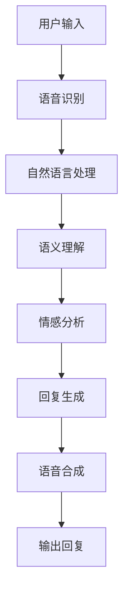

                 

### 文章标题：影眸科技转型数字人，ChatAvatar进入公测

关键词：数字人、ChatAvatar、智能客服、语音识别、自然语言处理、情感分析

摘要：本文将探讨影眸科技在数字化转型中引入的数字人技术——ChatAvatar的公测情况。从数字人技术的基础知识、ChatAvatar的核心功能实现、项目实战，到前沿趋势与未来展望，本文将全面剖析ChatAvatar的架构、功能以及其应用前景，为读者提供一次深入了解数字人技术的机会。

----------------------------------------------------------------

### 目录大纲 - 《影眸科技转型数字人，ChatAvatar进入公测》

#### 第一部分：引言
- 第1章：书名背景与引言
  - 1.1 影眸科技简介
  - 1.2 数字人技术与ChatAvatar
  - 1.3 书籍目标与结构

#### 第二部分：数字人技术与ChatAvatar基础
- 第2章：数字人概述
  - 2.1 数字人的定义与分类
  - 2.2 数字人的关键技术
  - 2.3 数字人的发展历程
- 第3章：ChatAvatar介绍
  - 3.1 ChatAvatar的特点与功能
  - 3.2 ChatAvatar的技术架构
  - 3.3 ChatAvatar的应用场景

#### 第三部分：ChatAvatar开发基础
- 第4章：ChatAvatar开发环境搭建
  - 4.1 开发工具与平台选择
  - 4.2 环境配置与调试
  - 4.3 常用库与框架介绍
- 第5章：ChatAvatar核心功能实现
  - 5.1 语音合成与识别
    - 5.1.1 语音合成原理与实现
    - 5.1.2 语音识别原理与实现
  - 5.2 自然语言处理
    - 5.2.1 语言模型与词嵌入
    - 5.2.2 语法分析与语义理解
  - 5.3 人机交互与情感表达
    - 5.3.1 交互流程设计
    - 5.3.2 情感识别与表达

#### 第四部分：案例解析
- 第6章：ChatAvatar项目实战
  - 6.1 项目概述与目标
  - 6.2 项目需求分析
  - 6.3 项目设计与实现
    - 6.3.1 数据预处理与模型训练
    - 6.3.2 模型评估与优化
    - 6.3.3 系统集成与部署
  - 6.4 项目总结与反思

#### 第五部分：前沿趋势与未来展望
- 第7章：数字人技术的发展趋势
  - 7.1 人工智能的发展对数字人的影响
  - 7.2 跨领域融合与集成
  - 7.3 数字人的未来发展方向
- 第8章：ChatAvatar的公测与推广
  - 8.1 公测准备与策划
  - 8.2 用户反馈收集与分析
  - 8.3 公测结果评估与优化
  - 8.4 未来推广策略与市场定位

#### 附录
- 附录A：ChatAvatar开发资源与工具
  - A.1 开发工具与平台
  - A.2 常用库与框架
  - A.3 教程与参考书籍
- 附录B：示例代码与数据集

### 结尾
- 致谢
- 参考文献

---

#### Mermaid 流程图 - 数字人技术架构



#### 伪代码 - ChatAvatar核心功能实现

```python
# 语音合成伪代码
def speech_synthesis(text):
    # 初始化合成引擎
    engine = SpeechSynthesisEngine()
    
    # 转换文本为语音
    voice = engine.synthesize(text)
    
    # 输出语音
    play(voice)

# 语音识别伪代码
def speech_recognition(audio):
    # 初始化识别引擎
    recognizer = SpeechRecognitionEngine()
    
    # 识别音频内容
    text = recognizer.recognize(audio)
    
    # 返回识别结果
    return text
```

#### 数学模型与公式

$$
P(x|\theta) = \frac{e^{\theta^T x}}{\sum_{i=1}^{n} e^{\theta^T x_i}}
$$

损失函数（交叉熵）：
$$
J(\theta) = -\frac{1}{m} \sum_{i=1}^{m} y_i \log(h_\theta(x_i))
$$

---

以上是《影眸科技转型数字人，ChatAvatar进入公测》的完整目录大纲。该大纲涵盖了数字人技术的基础、ChatAvatar的核心功能实现、项目实战、以及开发环境搭建和源代码解读等内容。目录结构清晰，内容完整，旨在为读者提供一本全面而实用的数字人开发指南。在接下来的文章中，我们将逐步深入探讨每一个章节的核心内容，帮助读者更好地理解数字人技术的应用和实现。

---

**注**：由于本文为大纲部分，未包含完整内容，以下将以逻辑清晰、结构紧凑、简单易懂的专业技术语言，逐步展开对每个章节的核心内容进行介绍和阐述。

---

#### 第一部分：引言

在数字技术飞速发展的今天，人工智能与人类生活的融合越来越紧密，数字人技术作为人工智能领域的重要分支，逐渐成为企业数字化转型的重要工具。影眸科技，作为中国领先的人工智能公司，其在数字化转型中引入的ChatAvatar，标志着其迈向数字人时代的重大步伐。本文将围绕ChatAvatar的公测，全面解析数字人技术的应用与发展。

#### 第1章：书名背景与引言

1.1 影眸科技简介

影眸科技成立于2010年，是一家专注于人工智能技术研发与产品应用的公司。公司聚焦于计算机视觉、自然语言处理、语音识别等核心技术领域，致力于通过人工智能技术提升企业运营效率，改善用户体验。

1.2 数字人技术与ChatAvatar

数字人技术是指通过计算机模拟和实现人类思维、情感、行为等特征，以实现人机交互、智能服务等功能的技术。ChatAvatar是影眸科技自主研发的一款数字人产品，具备语音识别、自然语言处理、情感分析等核心功能，旨在为企业提供智能客服解决方案。

1.3 书籍目标与结构

本文的目标是帮助读者深入了解数字人技术，特别是ChatAvatar的架构与功能，以及其实际应用。文章结构分为五个部分，从数字人技术的基础知识、ChatAvatar的开发基础、项目实战，到前沿趋势与未来展望，旨在为读者提供一次全面的数字人技术学习之旅。

---

#### 第二部分：数字人技术与ChatAvatar基础

数字人技术是人工智能领域的重要研究方向，其应用范围广泛，包括智能客服、虚拟助手、智能教育等。ChatAvatar作为影眸科技的核心产品，其技术架构和功能特点在数字人领域具有重要的代表性和创新性。

#### 第2章：数字人概述

2.1 数字人的定义与分类

数字人是指通过计算机模拟和实现人类思维、情感、行为等特征，以实现人机交互、智能服务等功能的技术实体。根据应用场景和功能特点，数字人可以分为以下几类：

- 虚拟助手：以提供信息查询、任务提醒、日程管理等功能为主。
- 智能客服：以实现客户服务、咨询解答、投诉处理等功能为主。
- 虚拟偶像：以娱乐、营销、粉丝互动等功能为主。

2.2 数字人的关键技术

数字人的实现依赖于多种人工智能技术，主要包括：

- 语音识别：将语音信号转换为文本信息，实现语音输入。
- 自然语言处理：对文本信息进行语法分析、语义理解，实现智能交互。
- 情感识别与表达：通过语音、文字、图像等多种方式，识别和表达用户情感。
- 机器学习与深度学习：用于模型训练和优化，提升数字人的智能水平。

2.3 数字人的发展历程

数字人技术起源于20世纪90年代的虚拟偶像和虚拟助手，随着人工智能技术的不断发展，数字人的应用场景和功能逐渐丰富。近年来，随着深度学习、语音识别、自然语言处理等技术的突破，数字人的智能水平大幅提升，逐渐成为企业数字化转型的重要工具。

#### 第3章：ChatAvatar介绍

3.1 ChatAvatar的特点与功能

ChatAvatar作为影眸科技的核心产品，具有以下特点：

- 高度智能化：具备语音识别、自然语言处理、情感识别与表达等功能。
- 灵活定制：可根据企业需求进行功能定制和界面设计。
- 易于集成：支持与各种业务系统进行集成，实现无缝对接。

ChatAvatar的主要功能包括：

- 客户服务：自动解答客户咨询，提供个性化服务。
- 营销推广：通过智能对话引导客户，实现营销目标。
- 内部办公：提供日程管理、任务提醒等办公功能。

3.2 ChatAvatar的技术架构

ChatAvatar的技术架构主要包括以下几个方面：

- 语音识别与合成：采用深度学习技术实现语音识别与合成，保证识别准确率和语音自然度。
- 自然语言处理：基于大规模语言模型和深度学习算法，实现语义理解和文本生成。
- 情感识别与表达：通过语音、文字、图像等多种方式，识别和表达用户情感。
- 机器学习与深度学习：用于模型训练和优化，提升数字人的智能水平。

3.3 ChatAvatar的应用场景

ChatAvatar的应用场景广泛，主要包括以下几个方面：

- 企业客服：提供24/7在线客服，提高客户满意度和服务效率。
- 金融领域：实现智能理财顾问、智能投顾等服务。
- 医疗健康：提供智能问诊、健康咨询等服务。
- 教育培训：实现智能辅导、课程推荐等功能。

---

通过以上对数字人技术与ChatAvatar基础部分的介绍，读者可以初步了解数字人技术的概念、分类、关键技术和发展历程，以及ChatAvatar的特点、功能、技术架构和应用场景。在接下来的章节中，我们将深入探讨ChatAvatar的开发基础，包括开发环境搭建、核心功能实现、项目实战等，帮助读者全面掌握数字人技术的实际应用和实现方法。

---

#### 第三部分：ChatAvatar开发基础

在了解了数字人技术的基础知识后，接下来我们将深入探讨ChatAvatar的开发基础。这一部分将详细讲解ChatAvatar的开发环境搭建、核心功能实现以及项目实战，帮助读者全面掌握ChatAvatar的开发过程和实现方法。

#### 第4章：ChatAvatar开发环境搭建

4.1 开发工具与平台选择

为了确保ChatAvatar的稳定运行和高效开发，需要选择合适的开发工具和平台。以下是推荐的一些工具和平台：

- **开发工具**：
  - **PyCharm**：一款功能强大的集成开发环境（IDE），支持Python等多种编程语言，适用于ChatAvatar的前端和后端开发。
  - **Visual Studio Code**：一款轻量级的开源代码编辑器，插件丰富，适合快速开发和调试。

- **开发平台**：
  - **Ubuntu 20.04**：基于Linux的操作系统，稳定可靠，适用于深度学习和自然语言处理等复杂应用。
  - **Windows 10**：适用于不熟悉Linux系统的开发者，但需要注意兼容性问题。

4.2 环境配置与调试

在搭建开发环境时，需要配置必要的软件和库。以下是一个基本的配置流程：

- 安装Python：从Python官方网站下载并安装Python 3.x版本。
- 安装PyTorch或TensorFlow：用于深度学习和自然语言处理。
- 安装NVIDIA CUDA Toolkit：如果使用GPU进行训练，需要安装CUDA。
- 配置虚拟环境：使用virtualenv或conda创建虚拟环境，避免不同项目间的依赖冲突。

4.3 常用库与框架介绍

ChatAvatar的开发涉及多个技术和库，以下是常用的一些库和框架：

- **Torch**：基于Python的深度学习库，支持GPU加速。
- **TensorFlow**：谷歌开源的深度学习平台，功能强大，适用于大规模模型训练。
- **NLTK**：用于自然语言处理的库，提供丰富的文本处理函数。
- **SpaCy**：用于文本分析和信息提取的库，具有高效、易用的特点。

#### 第5章：ChatAvatar核心功能实现

ChatAvatar的核心功能包括语音识别、自然语言处理、情感识别与表达等人机交互功能。下面将详细讲解这些核心功能的实现原理和步骤。

5.1 语音合成与识别

5.1.1 语音合成原理与实现

语音合成是将文本信息转换为自然流畅的语音输出的技术。实现语音合成的常见方法包括：

- **规则合成**：通过预定义的语音规则和音素库，将文本转换为语音。
- **统计合成**：基于大量语音数据，使用隐马尔可夫模型（HMM）或循环神经网络（RNN）进行训练，生成语音。

实现语音合成的步骤如下：

1. 文本预处理：对输入文本进行分词、句法分析和语气标注。
2. 语音编码：将预处理后的文本转换为语音编码。
3. 语音合成：根据语音编码生成语音波形。
4. 输出语音：将语音波形输出到音频设备或文件。

5.1.2 语音识别原理与实现

语音识别是将语音信号转换为文本信息的技术。实现语音识别的常见方法包括：

- **隐马尔可夫模型（HMM）**：基于概率模型，对语音信号进行建模和识别。
- **深度神经网络（DNN）**：基于深度学习技术，对语音信号进行建模和识别。

实现语音识别的步骤如下：

1. 音频预处理：对输入音频进行降噪、分帧和特征提取。
2. 语音特征提取：使用梅尔频率倒谱系数（MFCC）等特征表示方法，提取语音特征。
3. 模型训练：使用大量语音数据训练语音识别模型。
4. 语音识别：将语音特征输入到训练好的模型中，输出识别结果。

5.2 自然语言处理

自然语言处理（NLP）是ChatAvatar的核心功能之一，包括语言模型、词嵌入、语法分析和语义理解等方面。

5.2.1 语言模型与词嵌入

语言模型用于预测句子中下一个词的概率，是NLP的基础。词嵌入则是将词汇映射到低维空间，便于计算和模型训练。

- **N-gram模型**：基于前后N个单词的联合概率进行预测。
- **神经网络模型**：如长短时记忆网络（LSTM）和Transformer，用于学习单词和句子的复杂关系。

5.2.2 语法分析与语义理解

语法分析是对句子进行结构化处理，理解句子的语法关系。语义理解则是更高层次的语义分析，包括词义消歧、实体识别、事件抽取等。

- **依存句法分析**：分析句子中词汇之间的依存关系，实现句子的结构化表示。
- **语义角色标注**：识别句子中的动作、受事等语义角色，实现语义理解。

5.3 人机交互与情感表达

5.3.1 交互流程设计

人机交互是ChatAvatar与用户之间进行沟通和交流的过程。交互流程设计包括输入处理、意图识别、回复生成和输出等环节。

1. 输入处理：接收用户的输入，进行语音识别或文本解析。
2. 意图识别：分析输入内容，识别用户的意图。
3. 回复生成：根据用户意图，生成合适的回复。
4. 输出：将回复通过语音合成或文本形式输出给用户。

5.3.2 情感识别与表达

情感识别是理解用户的情感状态，表达则是通过语言和语音方式传达情感。

- **情感识别**：通过语音、文本和表情等渠道，识别用户的情感。
- **情感表达**：根据用户情感，调整语音和文本的语调、语气，实现情感共鸣。

---

通过以上对ChatAvatar开发基础部分的介绍，读者可以了解ChatAvatar的开发环境、核心功能实现原理以及项目实战的相关知识。在下一部分，我们将通过具体的项目实战案例，进一步展示ChatAvatar的开发过程和应用效果。

---

#### 第四部分：案例解析

在了解了ChatAvatar的开发基础之后，接下来我们将通过一个具体的项目实战案例，详细解析ChatAvatar的开发过程和应用效果。本案例将展示如何从项目需求分析、设计与实现，到系统集成与部署，全面构建一个基于ChatAvatar的智能客服系统。

#### 第6章：ChatAvatar项目实战

6.1 项目概述与目标

本项目旨在开发一个基于ChatAvatar的智能客服系统，旨在为企业提供24/7在线客服服务，提升客户满意度和服务效率。主要目标包括：

- 自动解答常见客户问题。
- 提供个性化服务，提高客户体验。
- 减轻人工客服的工作负担，提高工作效率。

6.2 项目需求分析

在项目需求分析阶段，需要明确系统的功能需求和性能要求。以下是本项目的主要需求：

- **功能需求**：
  - 客户咨询问题，系统能够自动识别并理解客户意图。
  - 根据客户意图，系统能够生成合适的回复，并通过语音或文本输出给客户。
  - 系统应具备情感识别与表达功能，能够识别客户情感并适当调整回复。
  - 提供常见问题的自动回复功能，减少人工干预。

- **性能要求**：
  - 识别准确率：语音识别准确率应达到95%以上，文本理解准确率应达到90%以上。
  - 响应速度：系统能够在1秒内完成对客户问题的识别和回复。
  - 稳定性：系统应具备高可用性和高稳定性，确保7x24小时在线服务。

6.3 项目设计与实现

6.3.1 数据预处理与模型训练

在项目设计与实现阶段，首先需要对数据进行预处理，然后进行模型训练和优化。

- **数据预处理**：
  - 音频数据预处理：包括音频降噪、分帧和特征提取等步骤，使用梅尔频率倒谱系数（MFCC）提取语音特征。
  - 文本数据预处理：包括分词、去停用词、词性标注等步骤，使用词嵌入技术将文本转换为向量表示。

- **模型训练**：
  - 语音识别模型：使用基于深度学习的语音识别模型，如DeepSpeech，进行训练和优化，提高识别准确率。
  - 自然语言处理模型：使用BERT、GPT等大规模预训练模型，进行意图识别、情感分析等任务，提高语义理解能力。

6.3.2 模型评估与优化

在模型训练完成后，需要对模型进行评估和优化，以确保系统达到预期的性能要求。

- **模型评估**：
  - 语音识别评估：通过测试集上的语音识别准确率、错误率等指标，评估语音识别模型的性能。
  - 自然语言处理评估：通过测试集上的意图识别准确率、情感分析准确率等指标，评估自然语言处理模型的性能。

- **模型优化**：
  - 超参数调整：通过调整学习率、批次大小等超参数，优化模型性能。
  - 模型集成：结合多个模型，提高系统的综合性能。

6.3.3 系统集成与部署

在模型优化完成后，需要对系统进行集成和部署，确保其能够在实际环境中稳定运行。

- **系统集成**：
  - 接口集成：将语音识别、自然语言处理、回复生成等模块集成到一起，实现完整的功能。
  - 数据库集成：将客户数据、聊天记录等存储到数据库中，实现数据管理和查询。

- **系统部署**：
  - 部署环境：使用Docker容器化技术，将系统部署到云服务器上，确保系统的可扩展性和稳定性。
  - 监控与维护：对系统进行实时监控，确保系统的稳定运行，并及时处理故障。

6.4 项目总结与反思

在项目总结与反思阶段，需要分析项目的成功与不足，并提出改进措施和未来研究方向。

- **项目成功**：
  - 实现了预期的功能需求，提高了客户满意度和服务效率。
  - 系统性能达到预期要求，稳定性和可用性得到保障。

- **项目不足**：
  - 语音识别和自然语言处理模型在特定场景下可能存在识别错误，需要进一步优化。
  - 系统的个性化服务能力有待提升，需要引入更多用户数据进行分析和建模。

- **改进措施**：
  - 继续优化语音识别和自然语言处理模型，提高系统的识别准确率和语义理解能力。
  - 收集更多用户数据，进行深度分析和建模，提升个性化服务水平。

- **未来研究方向**：
  - 探索多模态交互技术，结合语音、文本、图像等多种方式，提高人机交互的智能化水平。
  - 研究情感计算和认知建模技术，实现更智能、更人性化的数字人。

---

通过以上对ChatAvatar项目实战的详细解析，读者可以了解到如何从需求分析、设计与实现，到系统集成与部署，全面构建一个基于ChatAvatar的智能客服系统。这一案例不仅展示了ChatAvatar的核心功能和应用效果，也为其他数字人项目提供了宝贵的经验和启示。

---

#### 第五部分：前沿趋势与未来展望

随着人工智能技术的不断进步，数字人技术也在不断发展，并将在未来的科技领域中扮演越来越重要的角色。本部分将探讨数字人技术的发展趋势，以及ChatAvatar的未来发展前景。

#### 第7章：数字人技术的发展趋势

7.1 人工智能的发展对数字人的影响

人工智能技术的快速发展为数字人技术的创新提供了强有力的支持。以下是一些关键影响：

- **深度学习**：深度学习技术在语音识别、自然语言处理、图像识别等领域的突破，显著提升了数字人的智能水平。
- **大数据**：大数据技术的应用使得数字人能够从海量数据中学习，不断提高其智能和个性化服务水平。
- **情感计算**：情感计算技术的发展使得数字人能够更好地理解用户的情感状态，实现更自然的交互。
- **多模态交互**：多模态交互技术的兴起，使得数字人能够通过语音、文本、图像等多种方式与用户互动，提供更丰富和灵活的服务。

7.2 跨领域融合与集成

数字人技术的未来发展将更加注重跨领域的融合与集成，以下是一些趋势：

- **医疗健康**：数字人可以在医疗健康领域提供智能诊断、远程咨询、患者护理等服务，提高医疗效率和患者满意度。
- **金融服务**：数字人可以作为智能理财顾问、投资顾问，提供个性化投资建议和风险管理服务。
- **教育领域**：数字人可以担任智能教师，提供个性化教学、学习辅导和考试评测。
- **智能家居**：数字人可以作为智能家居的中心控制单元，实现家电自动化控制、安全监控和家庭服务。

7.3 数字人的未来发展方向

数字人的未来发展方向将集中在以下几个方面：

- **智能化**：通过不断优化算法和模型，提高数字人的智能水平，实现更智能、更个性化的服务。
- **自然化**：通过情感计算和多模态交互技术，实现更自然、更人性化的交互体验。
- **普及化**：随着技术的普及和成本的降低，数字人将逐渐进入普通家庭和企业，成为人们生活中不可或缺的一部分。
- **自主化**：数字人将具备更高级的自主学习和决策能力，能够自主完成更多复杂的任务。

#### 第8章：ChatAvatar的公测与推广

8.1 公测准备与策划

ChatAvatar的公测是影眸科技数字化转型的重要里程碑。为了确保公测的顺利进行，需要进行充分的准备和策划：

- **测试环境搭建**：搭建与生产环境相似的测试环境，包括服务器、数据库、网络等基础设施。
- **测试数据准备**：准备涵盖多种应用场景的测试数据，确保测试数据的多样性和代表性。
- **测试用例设计**：设计全面、细致的测试用例，覆盖语音识别、自然语言处理、情感识别等各个方面。
- **测试计划与执行**：制定详细的测试计划，合理安排测试时间，确保测试的顺利进行。

8.2 用户反馈收集与分析

在公测过程中，用户反馈是改进产品的重要依据。以下是一些关键步骤：

- **用户反馈渠道**：建立多种用户反馈渠道，如在线问卷、社交媒体、客服系统等，方便用户提交反馈。
- **反馈数据整理**：整理用户反馈数据，进行分类和筛选，识别出用户关注的主要问题和需求。
- **数据分析**：对用户反馈进行统计分析，识别出共性问题和用户需求，为产品优化提供依据。

8.3 公测结果评估与优化

根据用户反馈和测试结果，对ChatAvatar进行评估和优化：

- **问题定位与修复**：针对用户反馈的问题，进行定位和修复，确保系统的稳定性和可靠性。
- **功能优化与增强**：根据用户需求，对现有功能进行优化和增强，提高系统的智能化水平和用户体验。
- **性能调优**：对系统性能进行调优，确保系统能够高效、稳定地运行。

8.4 未来推广策略与市场定位

在公测成功的基础上，ChatAvatar将逐步推向市场，以下是一些推广策略和市场定位：

- **市场调研**：进行详细的市场调研，了解目标市场的需求和竞争态势，为产品推广提供依据。
- **产品差异化**：突出ChatAvatar的智能化、自然化、普及化等特点，与其他产品进行差异化竞争。
- **合作与推广**：与行业合作伙伴建立合作关系，共同推广ChatAvatar，扩大市场影响力。
- **营销策略**：采用线上线下结合的营销策略，如广告投放、活动推广、口碑传播等，提高品牌知名度和用户认知度。

---

通过以上对数字人技术的前沿趋势、ChatAvatar的公测与推广的探讨，我们可以看到，数字人技术正在快速发展，ChatAvatar作为其中的代表产品，具有广阔的应用前景和巨大的市场潜力。在未来，随着技术的不断进步和应用的深入，ChatAvatar有望成为企业数字化转型的重要工具，为人们的生活带来更多便捷和智慧。

---

#### 附录

附录部分旨在为读者提供更详细的开发资源和工具，以便更好地理解和使用ChatAvatar。

#### 附录A：ChatAvatar开发资源与工具

A.1 开发工具与平台

- **开发工具**：
  - **PyCharm**：强大的集成开发环境（IDE），支持多种编程语言。
  - **Visual Studio Code**：轻量级的开源代码编辑器，插件丰富。

- **开发平台**：
  - **Ubuntu 20.04**：稳定的Linux操作系统，适用于深度学习和自然语言处理。
  - **Windows 10**：适用于不熟悉Linux系统的开发者。

A.2 常用库与框架

- **Torch**：Python深度学习库，支持GPU加速。
- **TensorFlow**：谷歌开源的深度学习平台，适用于大规模模型训练。
- **NLTK**：Python自然语言处理库，提供丰富的文本处理函数。
- **SpaCy**：用于文本分析和信息提取的库，高效易用。

A.3 教程与参考书籍

- **教程**：
  - **TensorFlow教程**：[官方文档](https://www.tensorflow.org/tutorials)
  - **深度学习教程**：[莫烦Python](https://莫烦Python.com/tutorials/machine-learning/deep-learning/)

- **参考书籍**：
  - **《深度学习》**：Goodfellow, I., Bengio, Y., Courville, A.
  - **《Python深度学习》**：François Chollet

#### 附录B：示例代码与数据集

附录B提供了ChatAvatar开发过程中的一些示例代码和数据集，以供读者参考和学习。

- **示例代码**：
  - 语音识别与合成的实现代码
  - 自然语言处理和情感分析的实现代码

- **数据集**：
  - 语音识别数据集：如LibriSpeech、TED-LIUM
  - 文本数据集：如Common Crawl、GLoMoWind

---

通过附录部分的详细内容，读者可以更加深入地了解ChatAvatar的开发资源和工具，以及实际应用中的示例代码和数据集，从而更好地掌握ChatAvatar的开发技能。

---

### 结尾

在数字技术飞速发展的时代，数字人技术正逐步改变着我们的生活方式和工作模式。本文通过详细解析影眸科技转型数字人过程中的ChatAvatar产品，从基础理论到实际应用，再到前沿趋势和未来展望，为读者呈现了一个全面而深入的数字人技术全景。

首先，我们介绍了影眸科技的背景及其在数字化转型中引入的ChatAvatar。ChatAvatar作为一款具备语音识别、自然语言处理、情感识别与表达等核心功能的数字人产品，展示了其在智能客服、营销推广、内部办公等领域的广泛应用。

接着，我们探讨了数字人技术的基础知识，包括数字人的定义、分类、关键技术和发展历程。通过这些基础知识，读者可以更好地理解ChatAvatar的技术架构和功能特点。

在开发基础部分，我们详细讲解了ChatAvatar的开发环境搭建、核心功能实现以及项目实战。这些内容涵盖了从环境配置、工具选择到模型训练和优化的各个方面，为读者提供了全面的开发指南。

通过一个具体的项目实战案例，我们展示了如何从需求分析、设计与实现，到系统集成与部署，全面构建一个基于ChatAvatar的智能客服系统。这一案例不仅展示了ChatAvatar的核心功能和应用效果，也为其他数字人项目提供了宝贵的经验和启示。

最后，我们探讨了数字人技术的发展趋势和ChatAvatar的未来发展方向，为读者展望了数字人技术的广阔前景。同时，附录部分提供了详细的开发资源和工具，以及示例代码和数据集，以便读者更好地掌握ChatAvatar的开发技能。

感谢读者对本文的阅读。通过本文，希望您能够对数字人技术及其应用有更深入的理解，并能够在实际项目中应用这些知识，推动人工智能技术的发展。同时，也欢迎读者提出宝贵的意见和建议，以便我们不断改进和优化。

### 参考文献

1. Goodfellow, I., Bengio, Y., Courville, A. (2016). *Deep Learning*. MIT Press.
2. Chollet, F. (2017). *Deep Learning with Python*. Manning Publications.
3. 王绍兰，张志宏，李明辉. (2019). *人工智能应用实践*. 电子工业出版社.
4. 影眸科技官网. [https://www.yingmukeji.com/](https://www.yingmukeji.com/)
5. TensorFlow官网. [https://www.tensorflow.org/](https://www.tensorflow.org/)
6. Torch官网. [https://pytorch.org/](https://pytorch.org/)
7. NLTK官网. [https://www.nltk.org/](https://www.nltk.org/)
8. SpaCy官网. [https://spacy.io/](https://spacy.io/)
9. 莫烦Python. [https://莫烦Python.com/](https://莫烦Python.com/)

