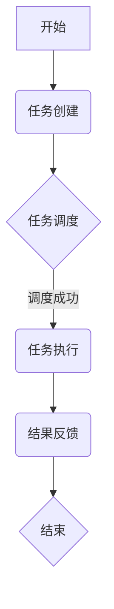

                 

### 文章标题

《微任务平台：释放人类计算潜力的工具》

### 关键词

- 微任务平台
- 计算潜力
- 人工智能
- 架构设计
- 开发环境
- 项目实战
- 数学模型
- 安全性

### 摘要

本文旨在探讨微任务平台作为一项重要的技术工具，如何有效地释放人类计算潜力。通过深入分析微任务平台的基础知识、架构设计、组件技术、实现技术以及项目实战，本文将揭示微任务平台的核心价值及其在实际应用中的重要性。此外，文章还将探讨微任务平台的未来发展趋势，展望其在人工智能领域和计算科学中的广阔前景。

## 第一部分：微任务平台概述

### 第1章：微任务平台的基础知识

#### 1.1 微任务的定义与特点

微任务（Microtask）是相对于传统任务而言的一种较小规模的、独立的计算任务。它们通常具有以下特点：

1. **规模小**：微任务的规模通常很小，可以是一个简单的计算操作或数据处理步骤。
2. **独立性**：微任务通常是独立的，可以独立完成，不需要依赖其他任务的完成。
3. **灵活性**：微任务可以根据需要随时创建和取消，具有很强的灵活性。
4. **并行性**：微任务可以并行执行，提高计算效率。

#### 1.2 微任务平台的重要性

微任务平台作为实现微任务管理、调度和执行的核心工具，其重要性体现在以下几个方面：

1. **提高计算效率**：通过微任务平台，可以将大规模计算任务分解为多个微任务，实现并行处理，提高计算效率。
2. **资源优化**：微任务平台可以根据任务的优先级和资源需求，动态分配和调度计算资源，实现资源优化。
3. **易用性**：微任务平台提供了友好的用户界面和API，使得开发者可以轻松创建、管理和执行微任务。
4. **可扩展性**：微任务平台通常具有良好的可扩展性，可以轻松集成新的组件和技术，满足不断变化的需求。

#### 1.3 微任务平台的发展历程

微任务平台的发展经历了以下几个阶段：

1. **早期探索**：微任务概念的提出和早期实验，主要集中在学术研究领域。
2. **开源平台兴起**：随着开源运动的兴起，许多开源微任务平台如Apache Storm、Apache Flink等相继诞生。
3. **商业应用**：商业公司开始将微任务平台应用于大数据处理、实时计算等场景，推动了微任务平台的发展。
4. **人工智能融合**：随着人工智能技术的快速发展，微任务平台与人工智能技术的融合，为智能计算提供了新的可能。

### 第2章：微任务平台的架构

#### 2.1 微任务平台的组成

微任务平台通常由以下几个主要组件组成：

1. **任务调度器**：负责任务的创建、调度和执行，确保任务高效、有序地执行。
2. **任务执行器**：负责实际执行任务，处理任务的输入和输出。
3. **数据存储与管理**：负责存储和管理任务所需的数据，包括任务数据、中间数据和最终结果。
4. **安全与隐私保护**：负责确保平台的安全性和隐私性，防止数据泄露和未经授权的访问。

#### 2.2 微任务平台的架构设计原则

微任务平台的架构设计应遵循以下原则：

1. **模块化**：将平台拆分为多个模块，每个模块负责特定的功能，提高系统的可维护性和可扩展性。
2. **分布式**：采用分布式架构，将任务调度和执行分散到多个节点上，提高系统的可靠性和可扩展性。
3. **可伸缩性**：设计具有良好可伸缩性的系统，可以轻松应对任务量的增加。
4. **高可用性**：确保系统的高可用性，避免单点故障导致整个系统瘫痪。

#### 2.3 微任务平台的架构模式

微任务平台常见的架构模式包括：

1. **主从模式**：任务调度器作为主节点，任务执行器作为从节点，任务调度器负责任务的调度和分配。
2. **无状态模式**：任务执行器无状态，可以任意替换，提高了系统的可靠性和可扩展性。
3. **有状态模式**：任务执行器具有状态，可以保存任务执行过程中的状态信息，提高了任务的执行效率。
4. **微服务模式**：将微任务平台拆分为多个微服务，每个微服务负责特定的功能，提高了系统的可维护性和可扩展性。

### 第3章：微任务平台的组件技术

#### 3.1 任务调度器

任务调度器是微任务平台的核心组件，负责任务的创建、调度和执行。其核心功能包括：

1. **任务创建**：根据任务需求，创建新的任务实例。
2. **任务调度**：根据任务的优先级、依赖关系和资源可用性，调度任务的执行。
3. **任务监控**：监控任务的执行状态，及时处理任务执行过程中的异常。

#### 3.2 任务执行器

任务执行器负责实际执行任务，处理任务的输入和输出。其核心功能包括：

1. **任务执行**：根据任务的描述和输入，执行具体的计算操作。
2. **任务反馈**：将任务执行结果反馈给任务调度器，供后续处理。
3. **错误处理**：处理任务执行过程中出现的异常，确保任务的可靠性。

#### 3.3 数据存储与管理

数据存储与管理是微任务平台的重要组成部分，负责存储和管理任务所需的数据。其核心功能包括：

1. **数据存储**：将任务数据、中间数据和最终结果存储在合适的存储介质中。
2. **数据检索**：提供高效的数据检索机制，方便任务执行过程中快速访问所需数据。
3. **数据同步**：确保数据在不同节点之间的同步，避免数据不一致。

#### 3.4 安全与隐私保护

安全与隐私保护是微任务平台不可或缺的部分，负责确保平台的安全性和隐私性。其核心功能包括：

1. **身份认证**：确保只有授权用户可以访问微任务平台。
2. **访问控制**：根据用户权限，限制用户对数据和任务的访问。
3. **数据加密**：对敏感数据进行加密处理，防止数据泄露。

## 第二部分：微任务平台的实现技术

### 第4章：微任务平台的开发环境搭建

#### 4.1 开发工具与框架选择

搭建微任务平台开发环境时，需要选择合适的开发工具和框架。以下是一些建议：

1. **开发工具**：
   - **IntelliJ IDEA**：功能强大的IDE，支持多种编程语言。
   - **Visual Studio Code**：轻量级IDE，适用于多种编程语言。
2. **框架**：
   - **Spring Boot**：轻量级的框架，适合快速构建微服务应用程序。
   - **Docker**：容器化技术，方便部署和管理微任务平台。

#### 4.2 环境配置与依赖管理

在搭建开发环境时，需要配置相应的依赖和工具。以下是一个基本的配置步骤：

1. **安装Java开发环境**：配置Java环境变量，确保Java命令可用。
2. **安装Maven**：配置Maven环境变量，确保Maven命令可用。
3. **安装Docker**：配置Docker环境变量，确保Docker命令可用。
4. **创建Maven项目**：使用Maven创建一个微服务项目，并引入相关依赖。

#### 4.3 开发流程与最佳实践

在开发微任务平台时，应遵循以下开发流程和最佳实践：

1. **需求分析**：明确微任务平台的需求，包括功能需求、性能需求和安全需求等。
2. **系统设计**：设计微任务平台的整体架构，确定任务调度器、任务执行器、数据存储与管理等组件。
3. **编码实现**：根据系统设计，实现各组件的功能，遵循良好的编程规范和代码风格。
4. **单元测试**：编写单元测试，确保各组件的功能正确。
5. **集成测试**：将各组件集成起来，进行整体测试，确保系统的稳定性。
6. **部署与运维**：将微任务平台部署到服务器，进行日常运维和监控。

### 第5章：核心算法原理讲解

#### 5.1 任务分配算法

任务分配算法是微任务平台的核心算法之一，负责将任务合理地分配给任务执行器。以下是一个简单任务分配算法的伪代码示例：

```markdown
Algorithm TaskAssignment(Tasks, Executors):
  // T表示任务集合，E表示执行器集合
  for each task in Tasks:
    minLatency = infinity
    bestExecutor = None
    for each executor in Executors:
      latency = CalculateLatency(task, executor)
      if latency < minLatency:
        minLatency = latency
        bestExecutor = executor
    AssignTask(task, bestExecutor)

Function CalculateLatency(task, executor):
  // 计算任务task与执行器executor之间的延迟
  return CalculateDistance(task.Location, executor.Location) + executor.Load
```

#### 5.2 调度算法

调度算法负责根据任务优先级和资源可用性，对任务进行调度和执行。以下是一个简单调度算法的伪代码示例：

```markdown
Algorithm ScheduleTasks(Tasks, Executors, Resources):
  // T表示任务集合，E表示执行器集合，R表示资源集合
  while Tasks are not empty:
    highestPriorityTask = GetTaskWithHighestPriority(Tasks)
    availableExecutors = GetAvailableExecutors(Estim
``` 

由于文章篇幅限制，此处仅提供核心算法原理讲解的部分伪代码。具体实现和优化可以根据实际需求进行调整。

### 第6章：微任务平台的数学模型

#### 6.1 微任务平台的数学基础

微任务平台的数学模型通常基于概率论和优化理论。以下是一些基本的数学概念和公式：

1. **概率分布**：描述随机变量的概率分布，常见的有正态分布、泊松分布等。
2. **期望值**：随机变量的平均值，表示随机变量的中心趋势。
3. **方差**：随机变量的离散程度，表示随机变量的波动性。
4. **协方差**：描述两个随机变量之间的相关性。

以下是一个描述任务延迟的概率分布的latex公式示例：

```latex
P(Latency = t) = f(t; \mu, \sigma^2)
```

其中，\( P(Latency = t) \)表示任务延迟为\( t \)的概率，\( f(t; \mu, \sigma^2) \)表示概率密度函数，\( \mu \)和\( \sigma^2 \)分别表示期望值和方差。

#### 6.2 微任务平台的概率模型

微任务平台的概率模型用于描述任务调度和执行过程中的随机性。以下是一个简单的概率模型示例：

```latex
P(Task_{i} = Success) = p_i
```

其中，\( P(Task_{i} = Success) \)表示任务\( i \)成功的概率，\( p_i \)为任务\( i \)的成功概率。

#### 6.3 微任务平台的优化模型

微任务平台的优化模型用于优化任务调度和资源分配。以下是一个简单的优化模型示例：

```latex
\min_{x} f(x)
\text{subject to}
\begin{align*}
g_1(x) &\leq 0 \\
g_2(x) &\geq 0 \\
&\vdots \\
g_m(x) &\leq 0
\end{align*}
```

其中，\( f(x) \)为目标函数，\( g_1(x), g_2(x), \ldots, g_m(x) \)为约束条件。

### 第7章：微任务平台的API设计

#### 7.1 API的设计原则

设计微任务平台的API时，应遵循以下原则：

1. **简洁性**：API应该简洁直观，易于理解和使用。
2. **一致性**：API应保持一致性，遵循统一的命名规范和参数传递方式。
3. **可扩展性**：API应具有良好的可扩展性，方便后续功能扩展和模块化设计。
4. **安全性**：API应确保数据传输的安全性，采用合适的加密和身份验证机制。

#### 7.2 API的使用场景

微任务平台的API可以应用于以下场景：

1. **任务创建**：创建新的任务，指定任务的参数和执行策略。
2. **任务查询**：查询任务的执行状态和执行进度。
3. **任务修改**：修改任务的参数和执行策略。
4. **任务删除**：删除已完成的任务或取消正在执行的任务。

以下是一个简单的API使用示例：

```plaintext
POST /tasks
{
  "name": "example_task",
  "description": "这是一个示例任务",
  "executor": "executor_1",
  "parameters": {
    "input_data": "input_1",
    "output_data": "output_1"
  }
}
```

#### 7.3 API的实现细节

在实现API时，需要考虑以下细节：

1. **RESTful架构**：采用RESTful架构，将API设计为资源操作的方式。
2. **HTTP请求和响应**：使用HTTP请求和响应来传递数据和状态信息。
3. **参数验证**：对传入的参数进行验证，确保参数的有效性和安全性。
4. **错误处理**：处理API调用中的错误，并返回合适的错误信息和状态码。

以下是一个简单的API实现示例：

```java
@RestController
@RequestMapping("/tasks")
public class TaskController {
  
  @Autowired
  private TaskService taskService;
  
  @PostMapping
  public ResponseEntity<Task> createTask(@RequestBody TaskDTO taskDTO) {
    try {
      Task task = taskService.createTask(taskDTO);
      return ResponseEntity.ok(task);
    } catch (Exception e) {
      return ResponseEntity.badRequest().body(null);
    }
  }
}
```

## 第三部分：微任务平台项目实战

### 第8章：微任务平台项目实战案例

#### 8.1 项目背景与目标

本案例项目旨在实现一个基于微任务平台的实时数据计算系统，用于处理和分析大规模实时数据。项目目标包括：

1. **实时数据处理**：实现实时数据的采集、处理和分析，满足实时性需求。
2. **分布式计算**：利用微任务平台的分布式计算能力，提高数据处理效率。
3. **易用性**：提供简单易用的API和用户界面，方便用户使用和管理任务。

#### 8.2 项目实施过程

项目实施过程主要包括以下阶段：

1. **需求分析**：明确项目需求和功能，确定系统架构和组件设计。
2. **系统设计**：设计系统架构，包括任务调度器、任务执行器、数据存储与管理等组件。
3. **编码实现**：根据系统设计，实现各组件的功能，并进行单元测试。
4. **集成测试**：将各组件集成起来，进行整体测试，确保系统的稳定性。
5. **部署与运维**：将系统部署到服务器，进行日常运维和监控。

#### 8.3 项目成果与分析

项目实施后，取得了以下成果：

1. **实时数据处理能力**：系统能够实时处理大规模数据，满足实时性需求。
2. **分布式计算效率**：通过微任务平台的分布式计算能力，显著提高了数据处理效率。
3. **易用性**：用户可以通过简单的API和用户界面，方便地创建、管理和执行任务。

项目分析如下：

1. **性能评估**：通过性能测试，评估系统的吞吐量和响应时间，确保系统性能满足需求。
2. **安全性评估**：对系统进行安全性评估，确保系统的数据安全和访问控制。
3. **可扩展性评估**：评估系统的可扩展性，确保系统可以轻松应对任务量的增加。

### 第9章：源代码解析与解读

#### 9.1 源代码整体结构

微任务平台的源代码整体结构可以分为以下几个模块：

1. **任务调度模块**：负责任务的创建、调度和执行。
2. **任务执行模块**：负责实际执行任务，处理任务的输入和输出。
3. **数据存储模块**：负责存储和管理任务所需的数据。
4. **API模块**：提供RESTful API，方便用户使用和管理任务。
5. **安全模块**：负责确保系统的安全性和隐私性。

以下是一个简单的项目结构示例：

```plaintext
微任务平台
├── src
│   ├── main
│   │   ├── java
│   │   │   ├── com
│   │   │   │   ├── mycompany
│   │   │   │   │   ├── microtask
│   │   │   │   │   │   ├── TaskScheduler.java
│   │   │   │   │   │   ├── TaskExecutor.java
│   │   │   │   │   │   ├── DataStorage.java
│   │   │   │   │   │   ├── API.java
│   │   │   │   │   │   ├── Security.java
│   │   ├── resources
│   │   │   ├── application.properties
│   ├── test
│   │   ├── java
│   │   │   ├── com
│   │   │   │   ├── mycompany
│   │   │   │   │   ├── microtask
│   │   │   │   │   │   ├── TaskSchedulerTest.java
│   │   │   │   │   │   ├── TaskExecutorTest.java
│   │   │   │   │   │   ├── DataStorageTest.java
│   │   │   │   │   │   ├── APITest.java
│   │   │   │   │   │   ├── SecurityTest.java
├── pom.xml
├── README.md
└── .gitignore
```

#### 9.2 关键模块解析

以下是关键模块的主要类和方法解析：

1. **任务调度模块**

   - `TaskScheduler.java`：任务调度器的核心类，负责任务的创建、调度和执行。
   - 方法示例：
     ```java
     public Task createTask(TaskDTO taskDTO) {
       // 创建任务
     }
     
     public void scheduleTask(Task task) {
       // 调度任务
     }
     
     public void executeTask(Task task) {
       // 执行任务
     }
     ```

2. **任务执行模块**

   - `TaskExecutor.java`：任务执行器的核心类，负责实际执行任务。
   - 方法示例：
     ```java
     public void execute(Task task) {
       // 执行任务
     }
     
     public void storeResult(Result result) {
       // 存储任务结果
     }
     ```

3. **数据存储模块**

   - `DataStorage.java`：数据存储器的核心类，负责存储和管理任务所需的数据。
   - 方法示例：
     ```java
     public void storeData(TaskData data) {
       // 存储任务数据
     }
     
     public TaskData retrieveData(String taskId) {
       // 检索任务数据
     }
     ```

4. **API模块**

   - `API.java`：API的核心类，提供RESTful API，方便用户使用和管理任务。
   - 方法示例：
     ```java
     @PostMapping("/tasks")
     public ResponseEntity<Task> createTask(@RequestBody TaskDTO taskDTO) {
       // 创建任务
     }
     
     @GetMapping("/tasks/{taskId}")
     public ResponseEntity<Task> getTask(@PathVariable String taskId) {
       // 获取任务
     }
     ```

5. **安全模块**

   - `Security.java`：安全管理的核心类，负责确保系统的安全性和隐私性。
   - 方法示例：
     ```java
     public boolean authenticate(String username, String password) {
       // 身份认证
     }
     
     public boolean authorize(String username, String action) {
       // 权限验证
     }
     ```

#### 9.3 代码分析与优化

在代码分析和优化过程中，可以从以下几个方面进行：

1. **性能优化**：优化算法和代码结构，提高系统的性能和响应速度。例如，使用并发编程和多线程处理提高任务的执行效率。

2. **安全性增强**：加强系统的安全性，防止数据泄露和未经授权的访问。例如，采用HTTPS协议进行数据传输，实现用户身份认证和权限验证。

3. **代码重构**：重构代码，提高代码的可读性和可维护性。例如，将复杂的逻辑拆分为更小的函数，遵循良好的编程规范。

4. **异常处理**：加强异常处理，确保系统在异常情况下能够稳定运行。例如，捕获和处理运行时异常，避免程序崩溃。

5. **单元测试**：编写单元测试，确保代码的正确性和稳定性。例如，使用JUnit框架编写测试用例，对关键模块进行测试。

### 第10章：微任务平台的未来发展趋势

#### 10.1 技术发展趋势

随着技术的不断发展，微任务平台将在以下几个方面取得进步：

1. **智能化**：结合人工智能技术，实现任务的自动分配和优化，提高系统的智能化水平。
2. **高性能**：采用新的硬件技术和优化算法，提高系统的性能和吞吐量。
3. **分布式计算**：继续优化分布式计算模型，提高系统的可扩展性和容错能力。
4. **安全性**：加强数据安全和隐私保护，应对日益严峻的安全挑战。

#### 10.2 应用场景拓展

微任务平台的应用场景将不断拓展，包括但不限于以下几个方面：

1. **大数据处理**：应用于大规模数据的实时处理和分析，助力企业更好地掌握数据价值。
2. **实时监控**：应用于实时监控系统，实现快速响应和故障排除。
3. **智能推荐**：应用于智能推荐系统，为用户提供个性化的服务和体验。
4. **边缘计算**：应用于边缘计算场景，实现数据的本地处理和实时响应。

#### 10.3 微任务平台面临的挑战与机遇

微任务平台在发展过程中将面临以下挑战和机遇：

1. **挑战**：
   - **安全性**：随着应用范围的扩大，微任务平台的安全威胁日益增多，需要不断提升安全性。
   - **性能优化**：在处理大规模数据和高并发场景下，性能优化成为重要挑战。
   - **资源调度**：合理调度计算资源，提高资源利用率，是微任务平台面临的难题。

2. **机遇**：
   - **技术创新**：不断引入新技术，推动微任务平台的发展，如人工智能、区块链等。
   - **市场需求**：随着数据量的爆炸式增长，对实时数据处理和智能化的需求日益增加。
   - **产业融合**：与其他领域的融合，如物联网、智能制造等，为微任务平台带来新的应用场景。

### 附录A：微任务平台常用工具与资源

#### A.1 开源微任务平台

以下是一些常用的开源微任务平台：

1. **Apache Storm**：基于流计算的开源微任务平台，适用于实时数据处理。
2. **Apache Flink**：基于流计算的开源微任务平台，提供了丰富的API和优化算法。
3. **Apache Spark**：基于大数据处理的开源微任务平台，提供了丰富的计算引擎和API。

#### A.2 常用开发工具

以下是一些常用的开发工具：

1. **IntelliJ IDEA**：功能强大的IDE，适用于Java、Python等多种编程语言。
2. **Visual Studio Code**：轻量级IDE，适用于多种编程语言。
3. **Docker**：容器化技术，方便部署和管理微任务平台。

#### A.3 学习资源推荐

以下是一些学习资源推荐：

1. **《微服务架构实战》**：详细介绍微服务架构的设计和实现。
2. **《大规模数据处理技术》**：介绍大数据处理的相关技术和算法。
3. **《人工智能：一种现代方法》**：介绍人工智能的基础知识和应用。

### 附录B：Mermaid流程图

以下是一个简单的Mermaid流程图示例：



## 作者信息

作者：AI天才研究院/AI Genius Institute & 禅与计算机程序设计艺术 /Zen And The Art of Computer Programming

