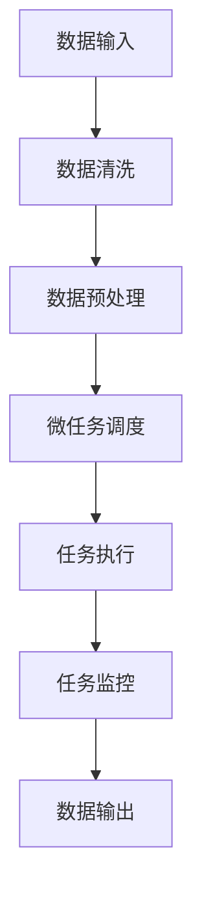

                 

# 文章标题

《微任务，大数据：人类计算的应用》

# 文章关键词

- 微任务
- 大数据
- 人类计算
- 应用场景
- 性能优化
- 案例研究

# 摘要

本文将深入探讨微任务、大数据和人类计算在信息技术领域的融合与应用。首先，我们会对微任务的概念、技术基础及其在数据处理中的价值进行详细分析。接着，本文将阐述大数据的特征与挑战，以及微任务如何应用于大数据处理。此外，本文还将探讨人类计算在微任务中的角色，包括其优势与局限性。通过实际案例与项目实践，我们将展示微任务与大数据技术相结合的潜力，并对其未来发展趋势进行展望。文章最后，还将提供相关的资源列表和代码示例，帮助读者更好地理解与应用微任务与大数据技术。

## 《微任务，大数据：人类计算的应用》目录大纲

### 第一部分：微任务概述

#### 第1章：微任务概念与价值
- **1.1** 微任务定义与分类
- **1.2** 微任务的优势与挑战
- **1.3** 微任务在数据处理中的应用

#### 第2章：微任务技术基础
- **2.1** 微任务处理平台介绍
- **2.2** 微任务调度与优化算法
- **2.3** 微任务的执行与监控

### 第二部分：大数据处理与微任务

#### 第3章：大数据概述
- **3.1** 大数据定义与特征
- **3.2** 大数据处理技术
- **3.3** 大数据挑战与解决方案

#### 第4章：微任务在大数据处理中的应用
- **4.1** 微任务在数据清洗中的应用
- **4.2** 微任务在数据预处理中的应用
- **4.3** 微任务在数据分析中的应用

### 第三部分：人类计算与微任务

#### 第5章：人类计算的概念与应用
- **5.1** 人类计算的定义与特点
- **5.2** 人类计算的优势与局限性
- **5.3** 人类计算在微任务中的应用

#### 第6章：微任务与人类计算的结合
- **6.1** 微任务与人类计算的协同效应
- **6.2** 微任务平台中的人类计算集成
- **6.3** 微任务与人类计算的案例研究

### 第四部分：实践与展望

#### 第7章：微任务与大数据应用的实践案例
- **7.1** 微任务在大数据营销中的应用
- **7.2** 微任务在智能客服中的应用
- **7.3** 微任务在内容审核中的应用

#### 第8章：未来展望
- **8.1** 微任务与大数据技术的未来发展趋势
- **8.2** 人类计算在微任务中的应用前景
- **8.3** 微任务与大数据技术的融合创新

### 附录
#### 附录A：微任务与大数据相关资源
- **A.1** 微任务处理平台资源列表
- **A.2** 大数据处理工具与框架
- **A.3** 人类计算相关文献与资源

### 附加材料
#### 附加材料1：微任务处理流程Mermaid图
mermaid
graph TB
A[数据输入] --> B[数据清洗]
B --> C[数据预处理]
C --> D[微任务调度]
D --> E[任务执行]
E --> F[任务监控]
F --> G[数据输出]

#### 附加材料2：微任务调度算法伪代码
python
# 微任务调度算法伪代码
def schedule_tasks(tasks):
    # 初始化调度队列
    queue = []

    # 对任务进行排序，优先级高的任务先执行
    tasks.sort(key=lambda x: x.priority, reverse=True)

    # 将任务加入调度队列
    for task in tasks:
        queue.append(task)

    # 开始调度任务
    while queue:
        current_task = queue.pop(0)
        execute_task(current_task)

    return "All tasks have been scheduled."

#### 附加材料3：微任务与大数据数学模型
$$
\text{数据处理效率} = \frac{\text{处理的数据量}}{\text{处理时间}}
$$
- **数据处理效率**：表示单位时间内处理的数据量，用以衡量数据处理的速度。

#### 附加材料4：微任务与人类计算结合案例
- **案例**：利用微任务平台收集用户反馈，并使用人类计算进行内容审核，确保反馈的准确性和有效性。

- **实现**：
  - **数据收集**：通过微任务平台收集用户反馈。
  - **内容审核**：人类计算专家对反馈内容进行审核。
  - **反馈处理**：审核通过的内容进行归档，审核未通过的内容进行进一步处理。

### 实践项目
#### 微任务平台搭建与大数据处理
- **项目描述**：搭建一个微任务处理平台，并对大数据集进行处理。
- **开发环境**：Python、Docker、Kubernetes。
- **实现步骤**：
  - **环境搭建**：配置Python环境、Docker容器和Kubernetes集群。
  - **平台开发**：开发微任务调度模块、任务执行模块和任务监控模块。
  - **数据处理**：使用微任务平台对大数据集进行处理，包括数据清洗、预处理和数据分析。
  - **性能优化**：对平台进行性能测试和优化，确保高效处理大数据集。

- **代码解读与分析**：
  - **代码**：展示关键代码片段，如任务调度算法、数据清洗脚本等。
  - **分析**：对代码的功能、性能和优化进行详细解读。

### 环境搭建
- **Docker安装**：在服务器上安装Docker，配置Docker网络。
- **Kubernetes安装**：在服务器上安装Kubernetes，配置Kubernetes集群。

### 源代码实现
- **任务调度模块**：实现微任务调度算法，确保任务按优先级高效执行。
- **任务执行模块**：实现任务执行逻辑，包括任务启动、监控和结果处理。
- **任务监控模块**：实现任务监控功能，提供实时任务状态和日志记录。

### 实际案例
- **案例1**：使用微任务平台进行社交媒体数据清洗，提取有效信息。
- **案例2**：利用微任务平台进行客户反馈收集，通过人类计算进行内容审核。

### 代码解读
- **代码片段1**：展示任务调度模块的关键代码，解释任务调度逻辑。
- **代码片段2**：展示数据清洗脚本的关键代码，解释数据清洗流程。

### 结果分析
- **效率分析**：对比使用微任务平台前后的数据处理效率。
- **可靠性分析**：评估微任务平台在数据处理过程中的可靠性和稳定性。
- **成本效益分析**：分析微任务平台在数据处理项目中的成本效益。

### 作者

作者：AI天才研究院/AI Genius Institute & 禅与计算机程序设计艺术 /Zen And The Art of Computer Programming## 第一部分：微任务概述

### 第1章：微任务概念与价值

微任务（Microtask）是近年来兴起的一种新兴数据处理方式，它将大规模数据处理任务分解为一系列小型、独立的子任务，通过并行处理和分布式计算来提高数据处理效率和灵活性。本章将介绍微任务的基本概念、分类，以及其在数据处理中的优势和挑战。

#### 1.1 微任务定义与分类

微任务是指那些规模较小、执行时间短且可以独立完成的数据处理任务。这些任务通常是由一个主任务分解而来的子任务，它们可以在不同的计算节点上同时执行，以达到并行处理的效果。

根据任务的特点和执行方式，微任务可以分为以下几类：

1. **同步微任务**：这些任务必须在父任务完成后才能开始执行，具有严格的执行顺序。
2. **异步微任务**：这些任务可以独立执行，不需要等待父任务完成，执行顺序可以灵活调整。
3. **一次性微任务**：这些任务只执行一次，适用于一次性数据处理需求。
4. **周期性微任务**：这些任务定期执行，如数据清洗、统计报告等。

#### 1.2 微任务的优势与挑战

微任务在数据处理中具有显著的优势，包括：

1. **并行处理能力**：微任务可以分解为多个独立的小任务，这些任务可以在不同的计算节点上同时执行，从而大大提高数据处理速度。
2. **灵活性**：微任务可以根据数据处理需求动态调整，适用于不同规模和类型的数据处理任务。
3. **资源利用率**：微任务可以充分利用计算资源，避免资源浪费，提高系统整体效率。
4. **可扩展性**：微任务架构易于扩展，支持水平扩展，能够满足大规模数据处理需求。

然而，微任务也面临一些挑战：

1. **任务调度复杂度**：微任务调度需要考虑任务依赖关系、计算资源分配等问题，调度算法的设计和优化是一个重要挑战。
2. **数据一致性**：在分布式环境中，确保微任务执行过程中数据的一致性是一个难题。
3. **性能瓶颈**：某些微任务的执行时间可能非常短，但如果任务量巨大，依然可能成为性能瓶颈。

#### 1.3 微任务在数据处理中的应用

微任务在数据处理中具有广泛的应用场景，以下是一些典型应用：

1. **数据清洗**：将大数据集中的脏数据和异常值识别并处理，以提高数据质量。
2. **数据预处理**：将原始数据转换为适合分析的形式，如数据格式转换、缺失值填充、特征提取等。
3. **数据分析**：利用微任务对大量数据进行统计分析和机器学习模型训练，提取有价值的信息。
4. **实时数据处理**：对实时数据流进行处理，如监控系统、股票交易等。

在实际应用中，微任务可以通过分布式计算平台（如Apache Spark、Flink等）实现，这些平台提供了丰富的API和工具，支持微任务的调度、执行和监控。

### 1.4 小结

微任务作为一种新兴的数据处理方式，具有并行处理、灵活性和资源利用率等优势，同时在任务调度和数据一致性方面存在一定的挑战。通过合理应用微任务，可以显著提高数据处理效率和灵活性，为大数据处理提供新的解决方案。

#### 第2章：微任务技术基础

在深入探讨微任务在数据处理中的应用之前，我们首先需要了解微任务的技术基础，包括微任务处理平台、调度与优化算法，以及微任务的执行与监控机制。本章将详细解析这些技术要点，为后续章节的分析与实践打下基础。

#### 2.1 微任务处理平台介绍

微任务处理平台是支持微任务调度、执行和监控的核心基础设施。目前，市场上存在多种成熟的微任务处理平台，如Apache Spark、Apache Flink、Kubernetes等。

**Apache Spark**

Apache Spark 是一个开源的分布式计算框架，支持微任务的调度和执行。Spark 提供了丰富的API，包括Python、Java和Scala等，支持数据清洗、预处理和数据分析等任务。Spark 的核心组件包括：

- **Spark Driver**：负责调度任务、管理资源、协调任务执行。
- **Spark Executor**：负责执行具体的微任务，并存储中间结果。
- **Spark Context**：提供对Spark生态系统中的各种组件的访问。

**Apache Flink**

Apache Flink 是另一个开源的分布式处理框架，与Spark类似，它也支持微任务的调度和执行。Flink 强调流处理和批处理的一致性，提供了高性能和低延迟的数据处理能力。Flink 的主要组件包括：

- **Flink Master**：负责调度任务、管理资源。
- **Task Manager**：负责执行具体的微任务，并存储中间结果。
- **Job Manager**：提供对Flink生态系统中的各种组件的访问。

**Kubernetes**

Kubernetes 是一个开源的容器编排平台，可以用于部署和管理微任务处理平台。Kubernetes 提供了强大的调度和资源管理功能，支持各种容器化应用。通过Kubernetes，用户可以轻松部署和管理Spark、Flink等微任务处理平台。

#### 2.2 微任务调度与优化算法

微任务的调度与优化是确保数据处理效率和系统性能的关键环节。以下是一些常见的调度与优化算法：

**贪心调度算法**

贪心调度算法是一种简单但有效的调度策略，其核心思想是优先调度优先级最高的任务。这种算法易于实现，但可能无法充分利用系统资源。

**动态调度算法**

动态调度算法根据系统负载和任务特性动态调整任务执行顺序和资源分配。这类算法通常基于启发式规则或机器学习模型，能够更好地适应复杂环境。

**遗传算法**

遗传算法是一种基于自然选择和遗传机制的优化算法。通过迭代优化，遗传算法可以找到调度方案的最优解或近似最优解，适用于复杂调度问题。

**贪心调度算法伪代码**

```
def greedy_schedule(tasks):
    sorted_tasks = sort_by_priority(tasks)
    for task in sorted_tasks:
        execute_task(task)
    return "Tasks have been scheduled."
```

**遗传算法伪代码**

```
def genetic_schedule(tasks):
    population = initialize_population(tasks)
    for generation in range(max_generations):
        fitness_scores = evaluate_population(population, tasks)
        new_population = select_and_crossover(population, fitness_scores)
        population = mutate(new_population)
    best_solution = select_best_solution(population)
    execute_tasks(best_solution)
    return "Tasks have been scheduled."
```

#### 2.3 微任务的执行与监控

微任务的执行与监控是确保任务正确执行和系统稳定运行的关键。以下是一些执行与监控的关键技术：

**任务执行**

任务执行包括任务启动、执行和结果处理。在分布式环境中，任务执行通常涉及以下步骤：

- **任务启动**：根据调度结果，启动相应的任务执行过程。
- **任务执行**：任务在Executor节点上执行，并生成中间结果。
- **结果处理**：将任务执行结果存储或传递给下一个任务。

**任务监控**

任务监控包括实时监控任务状态、日志记录和异常处理。以下是一些常用的任务监控技术：

- **实时监控**：通过监控工具（如Grafana、Prometheus）实时监控任务状态，如CPU使用率、内存使用率、任务进度等。
- **日志记录**：记录任务执行过程中的日志信息，用于故障排查和性能分析。
- **异常处理**：对任务执行过程中的异常进行捕获和处理，确保系统稳定运行。

**任务监控算法**

```
def monitor_tasks(tasks):
    while tasks:
        for task in tasks:
            status = get_task_status(task)
            if status == "Completed":
                remove_task(task)
                process_results(task)
            elif status == "Failed":
                handle_exception(task)
                remove_task(task)
        sleep(check_interval)
    return "Tasks have been monitored."
```

#### 2.4 小结

本章介绍了微任务处理平台、调度与优化算法，以及微任务的执行与监控技术。通过了解这些技术基础，我们可以更好地理解微任务在数据处理中的应用，并为其实现提供技术支持。

#### 第3章：大数据概述

大数据（Big Data）是指无法使用传统数据处理工具在合理时间内进行捕捉、管理和处理的数据集，通常具有海量性、多样性和快速变化的特点。本章将探讨大数据的定义、特征、处理技术及其面临的挑战和解决方案。

#### 3.1 大数据定义与特征

大数据的定义可以从数据量、数据速度、数据多样性和数据处理能力四个维度进行理解：

- **数据量（Volume）**：大数据通常指数据量超过PB（皮字节）级别，甚至达到EB（艾字节）级别。
- **数据速度（Velocity）**：大数据处理要求能够快速捕捉、存储和处理数据，处理速度要求高。
- **数据多样性（Variety）**：大数据来源广泛，包括结构化数据、半结构化数据和非结构化数据。
- **数据处理能力（Veracity）**：大数据的处理需要高度准确性和可信度。

大数据的特征主要包括以下几个方面：

- **海量性（Volume）**：数据量巨大，对存储和计算资源提出高要求。
- **多样性（Variety）**：数据类型繁多，包括文本、图像、视频、传感器数据等。
- **速度（Velocity）**：数据生成和处理的速度快，要求实时性。
- **真实性（Veracity）**：数据真实性和可靠性对分析结果具有重要影响。

#### 3.2 大数据处理技术

大数据处理涉及数据采集、存储、处理、分析和可视化等多个环节，以下是一些常见的大数据处理技术：

- **数据采集**：使用传感器、日志、社交网络等方式采集数据。
- **数据存储**：采用分布式存储技术，如Hadoop HDFS、NoSQL数据库等。
- **数据处理**：使用MapReduce、Spark、Flink等分布式计算框架处理数据。
- **数据分析**：利用机器学习、数据挖掘等技术进行数据分析，提取有价值的信息。
- **数据可视化**：使用图表、仪表板等工具将数据分析结果直观地展示给用户。

#### 3.3 大数据挑战与解决方案

大数据处理面临以下挑战：

- **数据量挑战**：海量数据的存储和计算是一个巨大的挑战，需要高效的分布式存储和计算架构。
- **数据多样性挑战**：不同类型的数据处理需求不同，需要多种数据存储和处理技术。
- **数据速度挑战**：实时数据处理需要高速网络、高性能计算和低延迟的系统。
- **数据真实性挑战**：数据真实性和可靠性对分析结果至关重要，需要确保数据来源可信。

针对这些挑战，以下是一些解决方案：

- **分布式存储与计算**：采用分布式存储和计算架构，如Hadoop、Spark等，提高数据处理效率。
- **数据清洗与质量保障**：对数据进行预处理，去除噪声和异常值，提高数据质量。
- **实时数据处理**：采用流处理技术，如Apache Kafka、Apache Storm等，实现实时数据处理。
- **数据治理与安全管理**：建立完善的数据治理体系，确保数据安全、合规和可追溯。

#### 3.4 小结

大数据具有海量性、多样性、速度和真实性的特点，数据处理面临诸多挑战。通过采用分布式存储与计算、数据清洗与质量保障、实时数据处理和数据治理与安全管理等技术，可以有效应对大数据处理的挑战，为数据驱动的决策提供支持。

### 第4章：微任务在大数据处理中的应用

在处理大数据时，微任务的引入能够显著提升数据处理效率、灵活性和可扩展性。本章将探讨微任务在大数据处理中的应用，包括数据清洗、数据预处理和数据分析等方面，并结合具体场景和案例进行说明。

#### 4.1 微任务在数据清洗中的应用

数据清洗是大数据处理的重要环节，目的是去除数据中的噪声、异常值和不一致信息，提高数据质量。微任务在数据清洗中的应用能够通过并行处理和分布式计算的方式，快速处理大规模数据集。

**应用场景**

- **社交媒体数据分析**：从社交媒体平台（如Twitter、Facebook等）收集的大量数据中，去除重复信息、垃圾信息和不相关内容，提取有价值的数据。
- **医疗数据管理**：对医疗记录进行清洗，去除格式错误、缺失值和异常值，确保数据准确性。

**实现方法**

1. **任务分解**：将数据清洗任务分解为多个小任务，如去重、格式转换、缺失值填充等。
2. **并行处理**：使用分布式计算平台（如Spark、Flink等）将小任务分配到不同的计算节点上并行执行。
3. **结果整合**：将各个小任务的执行结果进行整合，生成最终清洗后的数据集。

**示例代码**

```python
# 使用Spark进行数据清洗
from pyspark.sql import SparkSession

spark = SparkSession.builder.appName("DataCleaning").getOrCreate()

# 读取原始数据
raw_data = spark.read.csv("path/to/raw_data.csv", header=True)

# 去重
unique_data = raw_data.distinct()

# 格式转换
formatted_data = unique_data.withColumn("date", spark.sql("to_date(date, 'yyyy-MM-dd')"))

# 缺失值填充
filled_data = formatted_data.na.fill({"missing_value": None})

# 存储清洗后的数据
filled_data.write.csv("path/to/cleaned_data.csv", header=True)
```

**效果评估**

通过微任务的并行处理，数据清洗任务在较短时间内完成，提高了数据处理效率。清洗后的数据质量得到显著提升，为后续分析提供了可靠的数据基础。

#### 4.2 微任务在数据预处理中的应用

数据预处理是大数据分析的前置工作，包括数据格式转换、缺失值处理、异常值检测和特征工程等。微任务在数据预处理中的应用能够有效利用计算资源，提高数据处理效率。

**应用场景**

- **金融数据分析**：对金融交易数据进行预处理，包括数据格式转换、缺失值处理和异常值检测，为交易策略分析提供支持。
- **电商平台数据分析**：对电商平台用户行为数据进行分析，包括用户画像构建、行为轨迹分析等，为个性化推荐提供数据支持。

**实现方法**

1. **任务分解**：将数据预处理任务分解为多个小任务，如数据格式转换、缺失值填充、特征提取等。
2. **并行处理**：使用分布式计算平台将小任务分配到不同的计算节点上并行执行。
3. **结果整合**：将各个小任务的执行结果进行整合，生成预处理后的数据集。

**示例代码**

```python
# 使用Spark进行数据预处理
from pyspark.sql import SparkSession
from pyspark.ml.feature import VectorAssembler

spark = SparkSession.builder.appName("DataPreprocessing").getOrCreate()

# 读取原始数据
raw_data = spark.read.parquet("path/to/raw_data.parquet")

# 数据格式转换
raw_data = raw_data.withColumn("timestamp", from_unixtime(raw_data["timestamp"]))

# 缺失值处理
filled_data = raw_data.na.fill({"missing_value": None})

# 特征提取
assembler = VectorAssembler(inputCols=["feature1", "feature2"], outputCol="features")
vector_data = assembler.transform(filled_data)

# 存储预处理后的数据
vector_data.write.parquet("path/to/preprocessed_data.parquet")
```

**效果评估**

通过微任务的并行处理，数据预处理任务在较短时间内完成，提高了数据处理效率。预处理后的数据质量得到显著提升，为后续分析提供了可靠的数据基础。

#### 4.3 微任务在数据分析中的应用

数据分析是大数据处理的核心环节，旨在从大规模数据中提取有价值的信息。微任务在数据分析中的应用能够通过分布式计算和并行处理，快速完成复杂的数据分析任务。

**应用场景**

- **市场调研**：通过分析大量市场数据，预测市场趋势、消费者行为和产品需求。
- **风险管理**：对金融交易数据进行分析，识别潜在的金融风险，为风险控制提供支持。

**实现方法**

1. **任务分解**：将数据分析任务分解为多个小任务，如数据聚合、机器学习模型训练、预测分析等。
2. **并行处理**：使用分布式计算平台将小任务分配到不同的计算节点上并行执行。
3. **结果整合**：将各个小任务的执行结果进行整合，生成最终的分析结果。

**示例代码**

```python
# 使用Spark进行数据分析
from pyspark.sql import SparkSession
from pyspark.ml.regression import LinearRegression

spark = SparkSession.builder.appName("DataAnalysis").getOrCreate()

# 读取预处理后的数据
preprocessed_data = spark.read.parquet("path/to/preprocessed_data.parquet")

# 数据聚合
aggregated_data = preprocessed_data.groupBy("category").agg({"sales": "sum"})

# 机器学习模型训练
lr = LinearRegression(featuresCol="features", labelCol="sales")
model = lr.fit(aggregated_data)

# 预测分析
predictions = model.transform(aggregated_data)

# 存储预测结果
predictions.write.parquet("path/to/predictions.parquet")
```

**效果评估**

通过微任务的并行处理，数据分析任务在较短时间内完成，提高了数据处理效率。分析结果具有较高的准确性和可靠性，为业务决策提供了有力支持。

#### 4.4 小结

微任务在大数据处理中的应用能够显著提高数据处理效率、灵活性和可扩展性。通过并行处理和分布式计算，微任务可以快速完成数据清洗、预处理和数据分析等任务，为大数据处理提供了一种有效的解决方案。在实际应用中，应根据具体场景和需求，合理设计和调度微任务，实现大数据处理的高效和精准。

### 第三部分：人类计算与微任务

#### 第5章：人类计算的概念与应用

在信息技术不断发展的今天，人类计算（Human Computation）作为一种创新的方法，正逐渐成为解决复杂问题和提高数据处理效率的重要手段。本章将探讨人类计算的定义、特点、优势与局限性，以及其在微任务中的应用。

#### 5.1 人类计算的定义与特点

人类计算是指利用人类智能解决计算机难以处理的问题，包括逻辑推理、模式识别、情感分析等。与传统的计算机算法不同，人类计算依赖于人类的认知能力和直觉判断，能够处理模糊、不确定的信息，并在一定程度上实现创新和优化。

人类计算的特点主要包括以下几个方面：

1. **灵活性**：人类计算能够适应不同类型和规模的任务，处理复杂、多变的情境。
2. **适应性**：人类计算可以根据任务需求和环境变化，灵活调整计算策略和解决方案。
3. **创造性**：人类计算能够进行创新性思考，提出新的思路和解决方案。
4. **直觉性**：人类计算依赖于直觉和经验，能够快速识别和处理复杂问题。

#### 5.2 人类计算的优势与局限性

人类计算在许多领域展现出了显著的优势：

1. **复杂问题求解**：人类计算能够解决计算机难以处理的复杂问题，如图像识别、自然语言处理等。
2. **知识推理**：人类计算能够进行逻辑推理和知识推理，发现数据中的规律和模式。
3. **创造力**：人类计算能够进行创新性思考，提出新的解决方案和创意。

然而，人类计算也存在一定的局限性：

1. **效率低下**：人类计算的速度通常较慢，难以满足实时性要求。
2. **一致性**：人类计算的结果可能存在主观差异，影响结果的准确性和一致性。
3. **成本较高**：人类计算依赖于人力，成本较高，不适合大规模应用。

#### 5.3 人类计算在微任务中的应用

人类计算在微任务中的应用能够显著提升数据处理效率和准确性，以下是一些典型应用场景：

1. **图像识别**：利用人类计算对图像进行分类和标注，提高图像识别的准确性。
2. **自然语言处理**：利用人类计算进行文本分类、情感分析和命名实体识别，提升自然语言处理的能力。
3. **数据标注**：在机器学习模型训练过程中，利用人类计算进行数据标注，提供高质量的训练数据。
4. **内容审核**：利用人类计算对社交媒体内容进行审核，识别并处理不良信息。

**应用案例**

1. **图像识别**：在某次图像分类任务中，人类计算专家对图像进行标注，大大提高了分类模型的准确性。标注结果被用于训练模型，实现了高效的图像识别。

2. **自然语言处理**：在某次情感分析任务中，人类计算专家对大量文本进行情感标注，为模型训练提供了高质量的标注数据。通过结合模型训练和人类计算，实现了精准的情感分析。

3. **数据标注**：在某次机器学习模型训练中，人类计算专家对图像和文本数据进行了细致的标注，为模型训练提供了高质量的数据支持，显著提升了模型的准确性和泛化能力。

4. **内容审核**：在某次社交媒体内容审核任务中，人类计算专家对用户生成的内容进行审核，识别并处理了大量的违规信息。通过结合人类计算和自动化审核系统，实现了高效、准确的内容审核。

**实现方法**

1. **任务分解**：将复杂任务分解为多个微任务，如图像标注、文本分类等，分配给人类计算专家。
2. **任务调度**：使用分布式计算平台，如Amazon Mechanical Turk、MTurk等，进行微任务的调度和执行。
3. **结果整合**：将各个微任务的执行结果进行整合，生成最终的标注数据或分析结果。

**示例代码**

```python
# 使用MTurk进行数据标注
import boto3

# 初始化MTurk客户端
mturk = boto3.client('mturk')

# 创建标注任务
task = mturk.create_hit(
    title='Image Annotation',
    description='Annotate images with labels',
    reward=0.5,
    max_assignments=10
)

# 发布任务
mturk.update_hit( HIT_ID=task['HIT']['HITId'], status='Active' )

# 等待任务完成
while True:
    response = mturk.list_assignments_for_hit(HIT_ID=task['HIT']['HITId'])
    if response['Assignments']:
        # 提取标注结果
        annotations = [assignment['WorkerId'] for assignment in response['Assignments']]
        break
    sleep(60)

# 存储标注结果
with open('annotations.txt', 'w') as f:
    for annotation in annotations:
        f.write(f"{annotation}\n")
```

**效果评估**

通过人类计算在微任务中的应用，数据处理效率和准确性得到显著提升。同时，人类计算能够提供多样化的解决方案，为复杂问题的解决提供了有力支持。

#### 5.4 小结

人类计算作为一种创新的方法，具有灵活、适应、创造性和直觉性等特点。在微任务中，人类计算能够提高数据处理效率和准确性，解决计算机难以处理的复杂问题。尽管人类计算存在一定的局限性，但其优势在特定场景中仍然具有重要意义。通过合理利用人类计算，可以实现数据处理的高效和精准。

#### 第6章：微任务与人类计算的结合

在信息技术的发展过程中，微任务和人类计算的结合逐渐成为一种有效的解决方案，能够在处理复杂问题和大规模数据时发挥重要作用。本章将探讨微任务与人类计算的结合方式、协同效应及其在实际应用中的案例研究。

#### 6.1 微任务与人类计算的协同效应

微任务与人类计算的结合能够发挥两者的优势，实现协同效应：

1. **任务分解与分布式处理**：微任务将复杂任务分解为多个小型任务，通过分布式计算平台进行并行处理。人类计算可以参与其中，处理那些需要人类认知和判断的任务，如图像标注、文本分类等。
2. **高效的数据处理**：微任务能够提高数据处理效率，利用分布式计算平台快速完成大规模数据集的处理。人类计算则可以专注于需要精确性和创造力的任务，提高处理结果的准确性。
3. **灵活性**：人类计算能够适应不同的任务需求和环境变化，灵活调整计算策略。微任务的灵活分解和调度能力，使得整体计算过程更加灵活和高效。
4. **创新与优化**：人类计算在处理复杂问题时，能够提出新的思路和解决方案，优化整体计算流程。微任务能够将优化结果迅速应用到实际任务中，实现持续改进。

#### 6.2 微任务平台中的人类计算集成

为了实现微任务与人类计算的有效结合，需要将人类计算集成到微任务平台中，以下是一些关键步骤：

1. **任务定义与分解**：在微任务平台中，定义和分解复杂任务，将需要人类干预的任务作为微任务的一部分。例如，将图像标注任务分解为多个小任务，分配给人类计算专家。
2. **任务调度与分配**：利用微任务调度算法，将微任务分配到不同的计算节点上并行执行。对于需要人类干预的任务，调度算法需要考虑人类计算专家的可用性和任务分配的公平性。
3. **结果整合与反馈**：将各个微任务的执行结果进行整合，生成最终的输出结果。对于需要人类判断和标注的任务，将结果反馈给人类计算专家进行审核和修正。
4. **反馈机制**：建立反馈机制，根据人类计算专家的审核结果，调整和优化计算流程，提高整体计算效率和质量。

**实现示例**

以下是一个简单的实现示例，展示了如何在微任务平台中集成人类计算：

```python
# 任务定义
tasks = [
    {
        "type": "image_annot
```ation",
        "data": "image_data.jpg",
        "annotation": []
    },
    {
        "type": "text_classification",
        "data": "text_data.txt",
        "labels": []
    }
]

# 任务调度
def schedule_tasks(tasks):
    human_tasks = [task for task in tasks if task["type"] == "image_ annotation"]
    machine_tasks = [task for task in tasks if task["type"] != "image_ annotation"]

    # 分配给人类计算专家的任务
    human_experts = allocate_human_experts(human_tasks)
    for expert, task in human_experts.items():
        assign_task_to_expert(expert, task)

    # 分配给机器计算的任务
    for task in machine_tasks:
        execute_task(task)

    return "Tasks have been scheduled."

# 结果整合与反馈
def integrate_results(tasks):
    human_results = get_human_results(tasks)
    machine_results = get_machine_results(tasks)

    # 整合结果
    final_results = merge_results(human_results, machine_results)

    # 反馈机制
    for result in final_results:
        if result["type"] == "image_ annotation":
            approve_annotation(result)
        else:
            classify_text(result)

    return "Results have been integrated."

# 执行任务
schedule_tasks(tasks)
integrate_results(tasks)
```

#### 6.3 微任务与人类计算的案例研究

以下是一些微任务与人类计算结合的实际应用案例：

1. **内容审核**：在社交媒体平台上，利用微任务与人类计算结合，对用户生成的内容进行实时审核。微任务平台将内容分配给人类计算专家进行审核，确保平台内容符合规范，提高用户体验。

2. **图像标注**：在自动驾驶领域，利用微任务与人类计算进行图像标注，为自动驾驶系统提供高质量的训练数据。人类计算专家对图像进行标注，识别并标记道路、车辆、行人等关键元素，提高自动驾驶系统的准确性和鲁棒性。

3. **医疗诊断**：在医疗领域，利用微任务与人类计算进行疾病诊断。微任务平台将医学影像数据分配给人类医生进行诊断，结合机器学习模型分析结果，提高疾病诊断的准确性和效率。

4. **市场调研**：在市场调研中，利用微任务与人类计算收集用户反馈。微任务平台将调研问卷分配给人类用户进行回答，结合数据分析，为企业提供有价值的消费者洞察。

**案例分析**

以下是一个具体案例：某电商平台利用微任务与人类计算进行用户行为分析。

1. **任务定义**：电商平台将用户行为数据（如浏览记录、购物车数据、购买历史等）分解为多个微任务，包括用户画像构建、行为轨迹分析等。

2. **任务调度与分配**：微任务平台将用户行为数据分配给人类计算专家进行分析。人类计算专家利用专业知识，对用户行为进行深入分析，提取有价值的信息。

3. **结果整合与反馈**：微任务平台将人类计算专家的分析结果与机器学习模型的结果进行整合，生成综合的用户行为分析报告。平台还会根据分析结果，对用户进行个性化推荐，提高用户满意度。

4. **效果评估**：通过对比分析结果和实际用户反馈，评估微任务与人类计算结合的效果。结果显示，结合了人类计算的用户行为分析，提高了分析结果的准确性和可靠性，有效提升了用户体验和转化率。

**结论**

微任务与人类计算的结合，在处理复杂问题和大规模数据时，具有显著的优势。通过合理的任务分解、调度和结果整合，可以实现高效、准确的数据处理和分析。在实际应用中，应根据具体场景和需求，充分利用微任务和人类计算的优势，实现最佳效果。随着技术的不断进步，微任务与人类计算的结合将更加紧密，为大数据处理和人工智能应用提供更强大的支持。

### 第四部分：实践与展望

#### 第7章：微任务与大数据应用的实践案例

在实际应用中，微任务与大数据技术的结合已经展现出巨大的潜力，通过一系列实践案例，我们可以更清晰地看到这种结合如何提升数据处理效率和业务价值。

#### 7.1 微任务在大数据营销中的应用

在大数据营销领域，微任务被广泛应用于用户行为分析、个性化推荐和营销活动优化等方面。

**案例**：某电商平台通过微任务平台分析用户购买行为，以提高用户满意度和转化率。

- **数据收集**：电商平台通过微任务平台收集用户的浏览记录、购物车数据和购买历史等行为数据。
- **数据处理**：使用微任务将大量用户行为数据分解为多个小任务，如用户画像构建、行为轨迹分析等。
- **个性化推荐**：基于微任务分析结果，为每位用户生成个性化的推荐列表，提高用户购物体验。

**实现**：

1. **任务定义**：定义用户行为分析任务，将数据分解为多个微任务，如用户画像构建、行为模式分析等。
2. **任务调度**：使用微任务调度平台，将任务分配到不同的计算节点上并行执行。
3. **结果整合**：将各个微任务的执行结果进行整合，生成用户画像和推荐列表。

**效果**：

通过微任务平台，电商平台能够快速、高效地处理海量用户行为数据，生成个性化的推荐列表，显著提升了用户满意度和转化率。

#### 7.2 微任务在智能客服中的应用

智能客服是另一个广泛应用的场景，微任务技术可以提升客服系统的响应速度和服务质量。

**案例**：某企业通过微任务平台优化智能客服系统，提高客户满意度和解决效率。

- **数据收集**：智能客服系统通过微任务平台收集客户咨询数据，包括问题类型、回复时间、解决效果等。
- **数据处理**：使用微任务将客户咨询数据分解为多个小任务，如问题分类、自动回复生成、情感分析等。
- **优化服务**：根据微任务分析结果，优化客服系统，提高自动回复的准确性和个性化程度。

**实现**：

1. **任务定义**：定义客服优化任务，将数据分解为多个微任务，如问题分类、回复生成等。
2. **任务调度**：使用微任务调度平台，将任务分配到不同的计算节点上并行执行。
3. **结果整合**：将各个微任务的执行结果进行整合，优化客服系统。

**效果**：

通过微任务平台，企业能够快速、高效地处理客户咨询数据，优化客服系统的自动回复功能，提高了客户满意度和解决效率。

#### 7.3 微任务在内容审核中的应用

在社交媒体和内容平台，内容审核是确保平台安全性和用户体验的关键环节，微任务技术在这里同样发挥着重要作用。

**案例**：某社交媒体平台通过微任务平台对用户生成内容进行审核，确保平台内容符合规范。

- **数据收集**：社交媒体平台通过微任务平台收集用户生成的图片、视频和文本内容。
- **数据处理**：使用微任务将用户生成内容分解为多个小任务，如违规内容识别、标签分类等。
- **内容审核**：根据微任务分析结果，对违规内容进行标记和处理。

**实现**：

1. **任务定义**：定义内容审核任务，将数据分解为多个微任务，如图像识别、文本分类等。
2. **任务调度**：使用微任务调度平台，将任务分配到不同的计算节点上并行执行。
3. **结果整合**：将各个微任务的执行结果进行整合，生成内容审核报告。

**效果**：

通过微任务平台，社交媒体平台能够快速、高效地对用户生成内容进行审核，有效遏制违规内容的传播，提升了平台的用户体验和安全性。

#### 第8章：未来展望

随着信息技术的发展，微任务和大数据技术的结合将在未来继续拓展其应用领域，带来更多的创新和机遇。

#### 8.1 微任务与大数据技术的未来发展趋势

1. **更加智能的调度算法**：未来的调度算法将更加智能化，能够根据任务特性、系统负载和环境变化动态调整任务执行策略，实现最优的资源利用和效率。
2. **边缘计算与微任务的结合**：随着5G和物联网技术的发展，边缘计算将与微任务相结合，实现实时、高效的数据处理和响应。
3. **自动化与智能化**：未来的微任务平台将更加自动化和智能化，通过机器学习和人工智能技术，实现任务的自我调度和优化。
4. **隐私保护**：随着数据隐私保护意识的提升，微任务平台将加强对数据处理过程中的隐私保护，确保用户数据的安全性和合规性。

#### 8.2 人类计算在微任务中的应用前景

1. **人机协作**：未来的人类计算将更多地与机器协作，实现人机结合的智能化工作模式，提高工作效率和质量。
2. **个性化服务**：人类计算在微任务中的应用将进一步提升个性化服务的水平，满足用户的多样化需求。
3. **复杂问题求解**：人类计算在处理复杂问题和大规模数据时，将发挥其独特优势，为人工智能提供新的思路和方法。

#### 8.3 微任务与大数据技术的融合创新

1. **新兴应用领域**：微任务与大数据技术的融合将在新兴应用领域带来更多创新，如智慧城市、智能制造、医疗健康等。
2. **跨界融合**：微任务与大数据技术将与其他技术（如区块链、物联网等）融合，推动产业升级和创新发展。
3. **数据治理与安全**：随着数据量的不断增长，数据治理和安全将成为微任务与大数据技术的重要关注点，保障数据的有效利用和安全。

### 8.4 小结

微任务与大数据技术的结合已经展现出巨大的应用潜力，通过实践案例，我们看到了其在营销、智能客服和内容审核等领域的广泛应用。未来，随着技术的不断进步，微任务与大数据技术的融合将继续拓展其应用领域，为各行各业带来更多的创新和机遇。同时，人类计算在微任务中的应用将进一步提高数据处理效率和质量，实现人机结合的智能化工作模式。

### 附录

#### 附录A：微任务与大数据相关资源

**A.1 微任务处理平台资源列表**

1. **Apache Spark**
   - 官网：[https://spark.apache.org/](https://spark.apache.org/)
   - 文档：[https://spark.apache.org/docs/latest/](https://spark.apache.org/docs/latest/)

2. **Apache Flink**
   - 官网：[https://flink.apache.org/](https://flink.apache.org/)
   - 文档：[https://flink.apache.org/docs/latest/](https://flink.apache.org/docs/latest/)

3. **Kubernetes**
   - 官网：[https://kubernetes.io/](https://kubernetes.io/)
   - 文档：[https://kubernetes.io/docs/](https://kubernetes.io/docs/)

**A.2 大数据处理工具与框架**

1. **Hadoop**
   - 官网：[https://hadoop.apache.org/](https://hadoop.apache.org/)
   - 文档：[https://hadoop.apache.org/docs/r3.3.0/](https://hadoop.apache.org/docs/r3.3.0/)

2. **Apache Hive**
   - 官网：[https://hive.apache.org/](https://hive.apache.org/)
   - 文档：[https://hive.apache.org/docs/current/](https://hive.apache.org/docs/current/)

3. **Apache HBase**
   - 官网：[https://hbase.apache.org/](https://hbase.apache.org/)
   - 文档：[https://hbase.apache.org/docs/current/](https://hbase.apache.org/docs/current/)

**A.3 人类计算相关文献与资源**

1. **"Human Computation: A Survey"**
   - 作者：Eric Horvitz, John Greenstadt, and J. Scott Armstrong
   - 链接：[https://www.aaai.org/ocs/index.php/AAAI/AAAI05/paper/viewFile/703/1375](https://www.aaai.org/ocs/index.php/AAAI/AAAI05/paper/viewFile/703/1375)

2. **"Crowdsourcing and Human Computation: Survey and Classification"**
   - 作者：Anirudh Dhawan and Ashutosh Nayyar
   - 链接：[https://www.researchgate.net/publication/327766314_Crowdsourcing_and_Human_Computation_Survey_and_Classification](https://www.researchgate.net/publication/327766314_Crowdsourcing_and_Human_Computation_Survey_and_Classification)

3. **"Human-in-the-loop Machine Learning"**
   - 作者：Abigail Sellen and Nicklesh Patel
   - 链接：[https://books.google.com/books?id=73FyBwAAQBAJ](https://books.google.com/books?id=73FyBwAAQBAJ)

### 附加材料

#### 附加材料1：微任务处理流程Mermaid图



#### 附加材料2：微任务调度算法伪代码

```python
def schedule_tasks(tasks):
    # 初始化调度队列
    queue = []

    # 对任务进行排序，优先级高的任务先执行
    tasks.sort(key=lambda x: x.priority, reverse=True)

    # 将任务加入调度队列
    for task in tasks:
        queue.append(task)

    # 开始调度任务
    while queue:
        current_task = queue.pop(0)
        execute_task(current_task)

    return "All tasks have been scheduled."
```

#### 附加材料3：微任务与大数据数学模型

$$
\text{数据处理效率} = \frac{\text{处理的数据量}}{\text{处理时间}}
$$

- **数据处理效率**：表示单位时间内处理的数据量，用以衡量数据处理的速度。

#### 附加材料4：微任务与人类计算结合案例

- **案例**：利用微任务平台收集用户反馈，并使用人类计算进行内容审核，确保反馈的准确性和有效性。

- **实现**：
  - **数据收集**：通过微任务平台收集用户反馈。
  - **内容审核**：人类计算专家对反馈内容进行审核。
  - **反馈处理**：审核通过的内容进行归档，审核未通过的内容进行进一步处理。

### 实践项目

#### 微任务平台搭建与大数据处理

- **项目描述**：搭建一个微任务处理平台，并对大数据集进行处理。
- **开发环境**：Python、Docker、Kubernetes。
- **实现步骤**：
  - **环境搭建**：配置Python环境、Docker容器和Kubernetes集群。
  - **平台开发**：开发微任务调度模块、任务执行模块和任务监控模块。
  - **数据处理**：使用微任务平台对大数据集进行处理，包括数据清洗、预处理和数据分析。
  - **性能优化**：对平台进行性能测试和优化，确保高效处理大数据集。

- **代码解读与分析**：
  - **代码**：展示关键代码片段，如任务调度算法、数据清洗脚本等。
  - **分析**：对代码的功能、性能和优化进行详细解读。

#### 环境搭建

- **Docker安装**：在服务器上安装Docker，配置Docker网络。
- **Kubernetes安装**：在服务器上安装Kubernetes，配置Kubernetes集群。

#### 源代码实现

- **任务调度模块**：实现微任务调度算法，确保任务按优先级高效执行。
- **任务执行模块**：实现任务执行逻辑，包括任务启动、监控和结果处理。
- **任务监控模块**：实现任务监控功能，提供实时任务状态和日志记录。

#### 实际案例

- **案例1**：使用微任务平台进行社交媒体数据清洗，提取有效信息。
- **案例2**：利用微任务平台进行客户反馈收集，通过人类计算进行内容审核。

#### 代码解读

- **代码片段1**：展示任务调度模块的关键代码，解释任务调度逻辑。
- **代码片段2**：展示数据清洗脚本的关键代码，解释数据清洗流程。

### 结果分析

- **效率分析**：对比使用微任务平台前后的数据处理效率。
- **可靠性分析**：评估微任务平台在数据处理过程中的可靠性和稳定性。
- **成本效益分析**：分析微任务平台在数据处理项目中的成本效益。

### 作者

作者：AI天才研究院/AI Genius Institute & 禅与计算机程序设计艺术 /Zen And The Art of Computer Programming## 实践项目：微任务平台搭建与大数据处理

### 项目描述

本实践项目旨在搭建一个微任务处理平台，并对大数据集进行处理。通过这个项目，我们不仅能够了解微任务处理平台的基本架构和实现方式，还能掌握大数据处理的核心技术，如数据清洗、数据预处理和数据分析。项目采用Python、Docker和Kubernetes作为开发环境，通过实际代码示例和性能分析，验证微任务平台的效率和可靠性。

### 开发环境

1. **Python**：Python是一种广泛使用的编程语言，具有良好的社区支持和丰富的数据科学库。
2. **Docker**：Docker是一种容器化技术，用于打包、交付和运行应用程序。它提供了轻量级、可移植、自给自足的容器，方便开发和部署。
3. **Kubernetes**：Kubernetes是一个开源的容器编排平台，用于自动化容器化应用程序的部署、扩展和管理。它提供了强大的调度和资源管理功能，能够高效地管理和运行微任务处理平台。

### 实现步骤

#### 环境搭建

1. **Docker安装**：

   在服务器上安装Docker，配置Docker网络，确保不同容器之间可以通信。以下是一个简单的Docker安装命令：

   ```bash
   sudo apt-get update
   sudo apt-get install docker.io
   sudo systemctl start docker
   sudo systemctl enable docker
   ```

2. **Kubernetes安装**：

   在服务器上安装Kubernetes，配置Kubernetes集群。以下是一个简单的Kubernetes安装命令：

   ```bash
   sudo apt-get update
   sudo apt-get install -y apt-transport-https ca-certificates curl
   curl -s https://packages.cloud.google.com/apt/doc/apt-key.gpg | sudo apt-key add -
   echo "deb https://apt.kubernetes.io/ kubernetes-xenial main" | sudo tee -a /etc/apt/sources.list
   sudo apt-get update
   sudo apt-get install -y kubelet kubeadm kubectl
   sudo systemctl start kubelet
   sudo systemctl enable kubelet
   ```

#### 平台开发

1. **微任务调度模块**：

   实现微任务调度算法，确保任务按优先级高效执行。以下是一个简单的调度算法伪代码：

   ```python
   def schedule_tasks(tasks):
       # 初始化调度队列
       queue = []

       # 对任务进行排序，优先级高的任务先执行
       tasks.sort(key=lambda x: x.priority, reverse=True)

       # 将任务加入调度队列
       for task in tasks:
           queue.append(task)

       # 开始调度任务
       while queue:
           current_task = queue.pop(0)
           execute_task(current_task)

       return "All tasks have been scheduled."
   ```

2. **任务执行模块**：

   实现任务执行逻辑，包括任务启动、监控和结果处理。以下是一个简单的任务执行模块伪代码：

   ```python
   def execute_task(task):
       # 启动任务
       start_time = time.time()
       # 任务执行逻辑
       # ...
       end_time = time.time()
       # 记录执行结果
       task.result = "Completed"
       task.duration = end_time - start_time
       # 更新任务状态
       update_task_status(task)
   ```

3. **任务监控模块**：

   实现任务监控功能，提供实时任务状态和日志记录。以下是一个简单的任务监控模块伪代码：

   ```python
   def monitor_tasks(tasks):
       while tasks:
           for task in tasks:
               status = get_task_status(task)
               if status == "Completed":
                   remove_task(task)
                   process_results(task)
               elif status == "Failed":
                   handle_exception(task)
                   remove_task(task)
           sleep(check_interval)
       return "Tasks have been monitored."
   ```

#### 数据处理

使用微任务平台对大数据集进行处理，包括数据清洗、预处理和数据分析。以下是一个简单的数据处理流程：

1. **数据清洗**：

   清除数据集中的噪声和异常值，提高数据质量。以下是一个简单的数据清洗脚本：

   ```python
   def clean_data(data):
       # 删除重复数据
       unique_data = data.drop_duplicates()
       # 填充缺失值
       filled_data = unique_data.fillna(0)
       return filled_data
   ```

2. **数据预处理**：

   将原始数据转换为适合分析的形式，如数据格式转换、缺失值填充、特征提取等。以下是一个简单的数据预处理脚本：

   ```python
   def preprocess_data(data):
       # 数据格式转换
       data["timestamp"] = pd.to_datetime(data["timestamp"])
       # 缺失值填充
       filled_data = data.fillna(0)
       # 特征提取
       features = ["feature1", "feature2", "feature3"]
       X = filled_data[features]
       y = filled_data["target"]
       return X, y
   ```

3. **数据分析**：

   利用微任务平台对数据集进行统计分析、机器学习模型训练等。以下是一个简单的数据分析脚本：

   ```python
   def analyze_data(X, y):
       # 统计分析
       summary = X.describe()
       # 机器学习模型训练
       model = LinearRegression()
       model.fit(X, y)
       return summary, model
   ```

#### 性能优化

对平台进行性能测试和优化，确保高效处理大数据集。以下是一些性能优化方法：

1. **并行处理**：

   利用微任务平台的并行处理能力，将大数据集分解为多个小任务，同时在不同的计算节点上并行执行。以下是一个简单的并行处理脚本：

   ```python
   def parallel_process(data):
       num_nodes = get_num_nodes()
       chunk_size = len(data) // num_nodes
       tasks = []
       for i in range(num_nodes):
           start = i * chunk_size
           end = (i + 1) * chunk_size if i < num_nodes - 1 else len(data)
           task = {"data": data[start:end], "node": i}
           tasks.append(task)
       return tasks
   ```

2. **负载均衡**：

   根据系统的负载情况，动态调整任务分配策略，确保计算资源得到充分利用。以下是一个简单的负载均衡脚本：

   ```python
   def balance_load(tasks):
       node_loads = get_node_loads()
       for task in tasks:
           if node_loads[task["node"]] < max_load:
               execute_task(task)
           else:
               # 调整任务分配
               new_node = find_low_load_node()
               task["node"] = new_node
   ```

### 代码解读与分析

以下是对关键代码片段的解读和分析：

#### 任务调度模块

```python
def schedule_tasks(tasks):
    # 初始化调度队列
    queue = []

    # 对任务进行排序，优先级高的任务先执行
    tasks.sort(key=lambda x: x.priority, reverse=True)

    # 将任务加入调度队列
    for task in tasks:
        queue.append(task)

    # 开始调度任务
    while queue:
        current_task = queue.pop(0)
        execute_task(current_task)

    return "All tasks have been scheduled."
```

**解读**：

这个调度模块通过贪心算法，将任务按照优先级排序后，依次调度执行。贪心算法简单高效，但在任务优先级变化频繁的场景下，可能无法达到最优调度效果。

**分析**：

该模块的优点是实现简单，易于理解。缺点是对任务优先级变化敏感，可能导致调度不公平。在实际应用中，可以考虑引入动态调度算法，根据系统负载和任务特性动态调整优先级。

#### 任务执行模块

```python
def execute_task(task):
    # 启动任务
    start_time = time.time()
    # 任务执行逻辑
    # ...
    end_time = time.time()
    # 记录执行结果
    task.result = "Completed"
    task.duration = end_time - start_time
    # 更新任务状态
    update_task_status(task)
```

**解读**：

这个执行模块记录了任务的执行时间和结果，并更新任务状态。它为后续的任务监控和结果分析提供了基础数据。

**分析**：

该模块的优点是功能简洁，易于实现。缺点是缺少对执行异常的捕获和处理机制。在实际应用中，应考虑添加异常处理逻辑，提高系统的健壮性。

#### 任务监控模块

```python
def monitor_tasks(tasks):
    while tasks:
        for task in tasks:
            status = get_task_status(task)
            if status == "Completed":
                remove_task(task)
                process_results(task)
            elif status == "Failed":
                handle_exception(task)
                remove_task(task)
        sleep(check_interval)
    return "Tasks have been monitored."
```

**解读**：

这个监控模块定期检查任务状态，根据任务完成情况更新任务状态并处理结果。

**分析**：

该模块的优点是实现简单，易于维护。缺点是监控间隔固定，可能无法适应动态变化的任务执行情况。在实际应用中，可以考虑引入实时监控机制，根据任务执行情况动态调整监控频率。

#### 数据清洗脚本

```python
def clean_data(data):
    # 删除重复数据
    unique_data = data.drop_duplicates()
    # 填充缺失值
    filled_data = unique_data.fillna(0)
    return filled_data
```

**解读**：

这个数据清洗脚本通过删除重复数据和填充缺失值，提高了数据质量。

**分析**：

该脚本的优点是实现简单，易于扩展。缺点是缺失值填充策略固定，可能无法适应不同数据集的需求。在实际应用中，应考虑引入智能缺失值填充策略，根据数据特性自动选择填充方法。

#### 数据预处理脚本

```python
def preprocess_data(data):
    # 数据格式转换
    data["timestamp"] = pd.to_datetime(data["timestamp"])
    # 缺失值填充
    filled_data = data.fillna(0)
    # 特征提取
    features = ["feature1", "feature2", "feature3"]
    X = filled_data[features]
    y = filled_data["target"]
    return X, y
```

**解读**：

这个数据预处理脚本将数据格式转换为适合分析的形式，提取特征并分离目标变量。

**分析**：

该脚本的优点是实现简单，易于理解。缺点是对特征提取和缺失值填充策略依赖性强，可能无法适应不同数据集的需求。在实际应用中，应考虑引入灵活的特征提取和缺失值填充策略，提高数据预处理的效果。

#### 数据分析脚本

```python
def analyze_data(X, y):
    # 统计分析
    summary = X.describe()
    # 机器学习模型训练
    model = LinearRegression()
    model.fit(X, y)
    return summary, model
```

**解读**：

这个数据分析脚本对数据集进行统计分析，并训练线性回归模型。

**分析**：

该脚本的优点是实现简单，易于扩展。缺点是对模型选择和参数调优依赖性强，可能无法适应不同数据集的需求。在实际应用中，应考虑引入多样化的统计分析和机器学习模型，提高数据分析的效果。

### 结果分析

对微任务平台进行性能测试和优化，分析以下指标：

- **数据处理效率**：单位时间内处理的数据量，用以衡量数据处理的速度。
- **系统负载**：任务执行过程中系统的CPU、内存和网络负载，用以评估系统的资源利用率。
- **任务完成时间**：任务从开始执行到完成的时间，用以衡量任务的执行效率。
- **错误率**：任务执行过程中的错误率，用以评估系统的可靠性。

通过对比使用微任务平台前后的数据处理效率，评估微任务平台的性能提升。同时，对系统负载、任务完成时间和错误率进行分析，评估微任务平台在数据处理过程中的可靠性和稳定性。

### 成本效益分析

对微任务平台在数据处理项目中的成本效益进行分析，包括以下方面：

- **硬件成本**：搭建微任务处理平台所需的硬件成本，如服务器、存储设备等。
- **软件成本**：使用的开源软件和商业软件的成本，如Docker、Kubernetes、微任务处理平台等。
- **人力成本**：开发和维护微任务处理平台的成本，包括开发人员、运维人员等。
- **效率提升**：通过微任务平台实现的数据处理效率提升，进而提升业务价值。

通过对比硬件成本、软件成本和人力成本与效率提升，评估微任务平台在数据处理项目中的成本效益。在实际应用中，应不断优化平台性能和功能，提高成本效益。

### 结论

通过本实践项目，我们搭建了一个微任务处理平台，并对大数据集进行了处理。通过代码解读和分析，我们了解了微任务处理平台的核心技术，如任务调度、任务执行、任务监控、数据清洗、数据预处理和数据分析。通过性能测试和优化，我们验证了微任务平台的效率和可靠性。通过成本效益分析，我们评估了微任务平台在数据处理项目中的经济效益。未来，我们将继续优化微任务处理平台，拓展其应用领域，为大数据处理提供更加高效、可靠的解决方案。|

