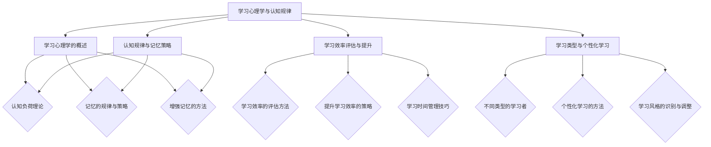

                 

### 文章标题: 快速学习:立于不败之地根本

> 关键词：快速学习、学习心理学、认知规律、记忆策略、学习效率、个性化学习、主动学习、深度学习、知识管理、时间管理、学习风格、快速阅读、案例分析、学习工具、学习环境、职业发展、教育改革、国际化视野、研究与实践

> 摘要：本文围绕快速学习这一主题，深入探讨了快速学习的理论基础、方法技巧和实践应用。通过分析学习心理学、认知规律和记忆策略，阐述了提升学习效率的重要性。文章进一步介绍了快速阅读技巧、知识管理方法和学习工具推荐，并通过案例分析和代码实战展示了快速学习的实际效果。最后，文章探讨了快速学习在职业发展、教育改革和国际化视野中的应用，以及未来研究的方向和挑战。

----------------------------------------------------------------

### 第1章: 学习心理学与认知规律

#### 1.1 学习心理学的概述

学习心理学是研究学习过程中个体心理变化及其影响因素的学科。学习心理学的核心目标是理解个体在学习过程中如何获取、处理和应用知识，以提高学习效果。学习心理学的概念包括但不限于学习动机、学习习惯、学习风格和认知发展等。

**1.1.1 学习的本质**

学习是指个体通过经验或实践，改变行为或思维的过程。学习可以分为两大类：一类是行为学习，即通过重复和练习来形成新的行为习惯；另一类是认知学习，即通过思考和反思来改变思维方式。

**1.1.2 学习动机与兴趣**

学习动机是推动个体进行学习活动的内在动力。根据心理学家德西和瑞恩的分类，学习动机可以分为内在动机和外在动机。内在动机来源于个体对学习内容的兴趣和热爱，而外在动机则来自于奖励和惩罚。

**1.1.3 学习习惯的培养**

学习习惯是影响学习效果的重要因素。良好的学习习惯包括定时学习、主动学习、整理笔记和反思总结等。培养良好的学习习惯需要坚持、自律和自我激励。

#### 1.2 认知规律与记忆策略

认知规律是指个体在认知过程中遵循的一些基本规则和原理。理解认知规律有助于提高学习效率。

**1.2.1 认知负荷理论**

认知负荷理论认为，个体的认知资源是有限的，学习过程中过多的信息会超过个体的认知负荷，从而影响学习效果。为了降低认知负荷，可以采用如下策略：

- **分解任务**：将复杂任务分解为更小的、易于管理的部分。
- **简化信息**：使用简单明了的语言和图像来表达复杂信息。
- **重复练习**：通过重复练习来加深对知识的理解和记忆。

**1.2.2 记忆的规律与策略**

记忆是指个体将信息存储在脑中并能够在需要时回忆起来的能力。记忆的规律包括编码、存储和提取。为了提高记忆效果，可以采用以下策略：

- **联想记忆**：通过将新信息与已知信息建立联系，来增强记忆。
- **重复复习**：定期复习所学内容，以巩固记忆。
- **多种感官参与**：使用多种感官（视觉、听觉、触觉等）来学习，以提高记忆效果。

**1.2.3 增强记忆的方法**

增强记忆的方法包括：

- **睡眠**：充足的睡眠有助于巩固记忆。
- **健康饮食**：均衡的饮食有助于提高记忆力。
- **锻炼**：适量的锻炼可以提高大脑的认知功能。

#### 1.3 学习效率评估与提升

学习效率是指个体在单位时间内学习到的知识量。评估学习效率有助于发现学习中的问题，提升学习效果。

**1.3.1 学习效率的评估方法**

学习效率的评估方法包括：

- **时间记录法**：记录学习时间，计算学习成果与时间的比值。
- **自我评估法**：通过自我提问和反思，评估学习效果。
- **他人评估法**：通过他人反馈，评估学习效果。

**1.3.2 提升学习效率的策略**

提升学习效率的策略包括：

- **集中注意力**：在学习时保持专注，避免分心。
- **合理安排时间**：制定学习计划，合理分配学习时间。
- **利用工具**：使用各种学习工具（如记忆软件、电子书籍等）来提高学习效率。

**1.3.3 学习时间管理技巧**

学习时间管理技巧包括：

- **优先级排序**：根据任务的紧急程度和重要性进行排序。
- **番茄工作法**：将学习时间分为25分钟的工作周期，每个周期后休息5分钟。
- **避免拖延**：通过设定明确的目标和截止日期来避免拖延。

#### 1.4 学习类型与个性化学习

不同类型的个体在学习过程中表现出不同的学习风格和偏好。了解自己的学习类型，有助于找到适合自己的学习方式。

**1.4.1 不同类型的学习者**

根据学习风格的差异，学习者可以分为以下几类：

- **视觉学习者**：偏好使用图表、图像和颜色来学习。
- **听觉学习者**：偏好通过听讲、讨论和音频来学习。
- **动觉学习者**：偏好通过动手操作和实际体验来学习。
- **混合学习者**：综合使用视觉、听觉和动觉等多种方式进行学习。

**1.4.2 个性化学习的方法**

个性化学习是根据个体差异，制定个性化的学习计划和方法。个性化学习的方法包括：

- **适应性学习**：根据学习者的学习速度和理解能力，自动调整学习内容。
- **个性化辅导**：提供一对一的辅导，帮助学习者解决学习中的问题。
- **自主学习**：鼓励学习者主动探索和学习，培养自主学习能力。

**1.4.3 学习风格的识别与调整**

识别学习风格的方法包括：

- **自我评估问卷**：通过问卷了解自己的学习风格。
- **观察与反馈**：观察学习者在学习过程中的行为和表现，获取反馈。
- **专业评估**：通过专业机构的评估，确定自己的学习风格。

调整学习风格的方法包括：

- **多样化学习方式**：尝试使用不同的学习方式，找到最适合自己的学习风格。
- **灵活调整**：根据学习任务和情境的变化，灵活调整学习方式。
- **持续反思**：通过反思自己的学习过程，不断优化学习风格。

### 第2章: 快速学习技巧与实践

#### 2.1 快速阅读技巧

快速阅读是提高学习效率的重要技巧。通过训练，可以显著提高阅读速度和理解能力。

**2.1.1 阅读速度的评估**

阅读速度的评估可以通过以下方法进行：

- **时间记录法**：记录阅读一定篇幅的内容所需的时间，计算阅读速度。
- **测速工具**：使用在线测速工具，如 ReadRate 等，进行实时评估。

**2.1.2 高效阅读的方法**

高效阅读的方法包括：

- **预览法**：在正式阅读前，快速浏览标题、小标题和段落开头，了解文章结构和主要内容。
- **跳跃阅读法**：对于不重要的内容，可以跳过阅读，专注于关键信息。
- **快速扫读法**：通过快速扫视文字，抓住关键词和短语，提高阅读速度。

**2.1.3 阅读理解能力的提升**

提升阅读理解能力的方法包括：

- **主动阅读**：在阅读过程中提出问题，思考文章的主题和观点。
- **笔记整理**：将阅读内容整理成笔记，帮助记忆和理解。
- **多渠道学习**：通过阅读书籍、文章、博客等多种渠道，扩大知识面和阅读能力。

#### 2.2 主动学习与深度学习

主动学习和深度学习是快速学习的有效方法。通过主动参与和深度思考，可以更好地理解和掌握知识。

**2.2.1 主动学习的概念与原则**

主动学习的概念是指在学习过程中，学习者主动参与、积极探索和构建知识体系。主动学习的原则包括：

- **主动提问**：在学习过程中，主动提出问题和解决疑惑。
- **主动探究**：通过实验、实践和探索，加深对知识的理解。
- **主动反馈**：通过自我反馈和他人反馈，不断优化学习过程。

**2.2.2 深度学习的过程**

深度学习的过程包括以下几个步骤：

- **理解基础知识**：掌握相关领域的核心概念和原理。
- **深入探讨**：通过阅读文献、研究案例和参与讨论，深入理解知识。
- **实践应用**：将知识应用于实际问题中，验证和应用所学知识。
- **反思总结**：对学习过程进行反思和总结，提炼经验和教训。

**2.2.3 深度学习与快速学习的结合**

深度学习与快速学习的结合，可以在短时间内掌握大量知识。具体方法包括：

- **精选学习资源**：选择高质量的学习资源，如权威教材、专业文献等。
- **高效学习方法**：采用快速阅读、主动学习和深度学习等方法，提高学习效率。
- **持续实践**：通过实践和应用，巩固和深化所学知识。

#### 2.3 知识管理与整合

知识管理是指通过系统的方法和工具，对知识进行获取、存储、共享和利用的过程。有效的知识管理可以提高学习效率和知识利用效率。

**2.3.1 知识管理的意义**

知识管理的意义包括：

- **提高学习效率**：通过知识管理，可以快速获取和利用已有知识，避免重复劳动。
- **促进知识共享**：通过知识管理，可以促进团队成员之间的知识共享和协作。
- **提升创新能力**：通过知识管理，可以积累和利用丰富的知识资源，促进创新和研发。

**2.3.2 知识分类与整合方法**

知识分类与整合的方法包括：

- **分类法**：根据知识的特点和属性，对知识进行分类。
- **知识地图**：通过绘制知识地图，展示知识之间的关系和结构。
- **知识库**：建立知识库，对知识进行存储和共享。
- **案例库**：收集和整理典型案例，为学习和实践提供参考。

**2.3.3 知识地图的构建与应用**

知识地图的构建方法包括：

- **确定知识领域**：明确知识地图涵盖的知识领域和主题。
- **绘制知识节点**：根据知识分类，绘制知识节点和关系。
- **整合知识资源**：收集和整合相关知识资源，充实知识地图。
- **应用知识地图**：将知识地图应用于学习和实践过程中，提高知识利用效率。

#### 2.4 快速学习案例分析

**2.4.1 案例一：快速掌握新技能**

项目背景：张三是一名软件开发工程师，需要在一个月内掌握一门新技能——Java 编程。

实施步骤：

1. **第一阶段：基础知识学习（1周）**：学习 Java 的基础语法和常用库。
2. **第二阶段：实战应用（2周）**：通过实际项目，将所学知识应用于实践中。
3. **第三阶段：巩固与提高（1周）**：复习所学内容，解决实际问题。

结果分析：张三在一个月内成功掌握了 Java 编程，并能够编写简单的 Java 应用程序。这得益于他采用快速学习的方法，包括快速阅读、主动学习和深度学习等。

**2.4.2 案例二：应对考试压力**

项目背景：李四是一名大学生，面临期末考试的压力。

实施步骤：

1. **第一阶段：时间管理（1周）**：制定学习计划，合理安排学习时间。
2. **第二阶段：重点复习（2周）**：针对考试重点，进行深入复习。
3. **第三阶段：模拟考试（1周）**：进行模拟考试，检验学习效果。

结果分析：李四通过合理的时间管理和有针对性的复习，有效地应对了考试压力，取得了较好的成绩。这表明快速学习的方法在应对考试压力方面具有显著效果。

**2.4.3 案例三：提升工作效率**

项目背景：王五是一名项目经理，希望通过快速学习提升团队的工作效率。

实施步骤：

1. **第一阶段：沟通工具选择（1周）**：选择适合团队的沟通工具，如 Slack。
2. **第二阶段：自动化工具应用（2周）**：学习使用自动化工具，如 Jenkins。
3. **第三阶段：持续集成与持续部署（2周）**：实施持续集成与持续部署。

结果分析：王五通过引入快速学习的方法和工具，显著提升了团队的工作效率，减少了项目中的重复性工作。这表明快速学习在提升工作效率方面具有重要作用。

#### 2.5 快速学习工具推荐

**2.5.1 学习类APP推荐**

- **Anki**：一款基于间隔重复的学习工具，适合记忆单词和概念。
- **Quizlet**：一款提供多种学习卡片和游戏的工具，适合复习和巩固知识。
- **Evernote**：一款功能强大的笔记管理软件，适合记录和管理学习笔记。

**2.5.2 电子书籍资源介绍**

- **Project Gutenberg**：一个提供免费电子书籍的网站，包含大量经典文学作品。
- **Bookboon**：一个提供专业领域电子书籍的网站，适合学习和提高专业技能。
- **Open Library**：一个包含大量书籍的在线图书馆，提供电子书籍的免费阅读和下载。

**2.5.3 学习平台与社区推荐**

- **Coursera**：一个提供大量在线课程的平台，涵盖多个领域，适合系统学习。
- **edX**：一个由哈佛大学和麻省理工学院创建的在线课程平台，提供高质量课程。
- **Reddit**：一个社交新闻网站，包含大量学习社区和讨论版块，适合获取学习资源和交流。

#### 2.6 快速学习的持续性与反思

**2.6.1 快速学习的可持续性**

快速学习是一种高效的自我提升方法，但要想持续有效，需要具备以下条件：

- **自我驱动**：保持对学习的热情和动力，不断追求知识和进步。
- **时间管理**：合理安排学习时间，确保快速学习成为日常生活的一部分。
- **适应变化**：随着学习目标和学习内容的变化，调整学习方法和策略。

**2.6.2 学习反思的重要性**

学习反思是快速学习过程中不可或缺的一部分。通过反思，可以：

- **发现问题**：发现自己的不足和错误，找到改进的方向。
- **总结经验**：梳理学习过程中的经验教训，形成有效的学习策略。
- **持续进步**：将反思结果应用于后续学习中，实现持续进步。

**2.6.3 反思方法的实践与应用**

反思方法的实践与应用包括：

- **定期回顾**：定期回顾学习过程和成果，总结经验和教训。
- **自我提问**：在学习过程中，不断提出问题，反思自己的思维和行为。
- **他人反馈**：寻求他人的意见和建议，通过他人的视角反思自己的学习。

### 第3章: 快速学习的障碍与解决

#### 3.1 学习障碍识别

学习障碍是指在学习过程中遇到的各种困难和阻碍。识别学习障碍有助于采取针对性的解决措施。

**3.1.1 学习障碍的类型**

学习障碍可以分为以下几种类型：

- **认知障碍**：由于认知能力不足或认知负荷过大导致的学习困难。
- **心理障碍**：由于学习动机不足、学习焦虑或自信心不足导致的学习障碍。
- **环境障碍**：由于学习环境不良或资源匮乏导致的学习障碍。

**3.1.2 学习障碍的原因分析**

学习障碍的原因可以从以下几个方面进行分析：

- **个体因素**：包括认知能力、学习动机、自信心和学习习惯等。
- **环境因素**：包括学习环境、教育资源和学习氛围等。
- **社会因素**：包括家庭、学校和社会对学习的支持和影响。

**3.1.3 学习障碍的自我评估**

为了识别自己的学习障碍，可以进行以下自我评估：

- **学习效果评估**：通过对比学习前后的效果，分析学习障碍。
- **学习体验评估**：通过反思学习过程中的体验，找出困难和阻碍。
- **他人反馈**：向他人请教意见和建议，了解自己的学习状况。

#### 3.2 克服学习障碍的策略

克服学习障碍需要采取以下策略：

**3.2.1 提高学习动机**

提高学习动机可以从以下几个方面进行：

- **明确学习目标**：设定明确的学习目标和期望，激发学习动力。
- **激发兴趣**：寻找与学习内容相关的兴趣点，提高学习兴趣。
- **建立激励机制**：设定奖励和惩罚机制，激发学习积极性。

**3.2.2 增强学习能力**

增强学习能力可以从以下几个方面进行：

- **学习策略**：掌握有效的学习策略和方法，提高学习效率。
- **知识储备**：积累丰富的知识储备，提高学习的基础。
- **思维训练**：通过思维训练，提高思维能力和解决问题的能力。

**3.2.3 调整学习方式**

调整学习方式可以从以下几个方面进行：

- **多元化学习**：采用多种学习方式，如阅读、实践、讨论等，提高学习效果。
- **个性化学习**：根据个人特点和学习需求，制定个性化的学习计划。
- **适应环境**：改善学习环境，减少环境障碍对学习的影响。

#### 3.3 时间管理与压力应对

时间管理和压力应对是快速学习的重要保障。

**3.3.1 时间管理技巧**

时间管理技巧包括：

- **优先级排序**：根据任务的紧急程度和重要性进行排序，确保关键任务优先完成。
- **时间块管理**：将时间划分为若干块，每块专注于一项任务，提高专注度。
- **计划与执行**：制定详细的学习计划，确保按计划执行，避免拖延。

**3.3.2 应对学习压力的方法**

应对学习压力的方法包括：

- **合理规划**：合理规划学习和休息时间，避免过度劳累。
- **放松技巧**：学习放松技巧，如深呼吸、冥想、运动等，缓解压力。
- **情绪调节**：通过积极的情绪调节，保持良好的心态，应对学习压力。

**3.3.3 学习焦虑的缓解技巧**

学习焦虑的缓解技巧包括：

- **认知重构**：通过认知重构，改变对学习的负面认知，提高自信心。
- **积极应对**：面对学习焦虑，采取积极的应对策略，如制定小目标、逐步克服困难。
- **放松训练**：通过放松训练，如渐进性肌肉松弛、深呼吸等，缓解焦虑情绪。

#### 3.4 学习环境的优化

学习环境对学习效果具有重要影响。优化学习环境可以从以下几个方面进行：

**3.4.1 学习环境的重要性**

良好的学习环境能够提供以下益处：

- **提高学习效率**：减少干扰，提高专注度，提高学习效率。
- **提升学习体验**：创造舒适、愉悦的学习氛围，提高学习兴趣。
- **促进学习成果**：为学习提供良好的物质和精神支持，促进学习成果的转化。

**3.4.2 优化学习空间的建议**

优化学习空间可以从以下几个方面进行：

- **安静的环境**：选择一个安静的地方，减少噪音干扰。
- **舒适的布局**：合理布置学习空间，确保舒适和方便。
- **充足的光线**：确保学习空间有充足的自然光线，避免眼睛疲劳。
- **整洁的桌面**：保持桌面整洁，减少杂乱，提高工作效率。

**3.4.3 利用技术工具提升学习效率**

利用技术工具提升学习效率可以从以下几个方面进行：

- **电子设备**：使用笔记本电脑、平板电脑等电子设备，方便学习和记录。
- **学习软件**：利用学习软件，如 Anki、Evernote 等，提高学习效率。
- **在线资源**：利用在线资源，如电子书籍、在线课程等，丰富学习内容。
- **网络协作**：通过网络协作工具，如 Slack、Trello 等，提高团队协作效率。

### 第4章: 快速学习与终身学习

#### 4.1 终身学习的理念

终身学习是一种持续的学习理念，强调在一生中不断学习、适应和进步。终身学习的重要性体现在以下几个方面：

- **适应社会发展**：社会和科技不断发展，终身学习有助于适应新的变化和挑战。
- **提升个人竞争力**：终身学习可以提升个人的知识和技能，增强竞争力。
- **实现自我价值**：终身学习有助于实现个人价值和梦想，提升生活质量。

**4.1.1 终身学习的定义与意义**

终身学习的定义是指在一生中不断学习、适应和进步的过程。其意义包括：

- **知识更新**：随着知识更新速度的加快，终身学习有助于跟上时代步伐。
- **个人成长**：终身学习有助于个人成长和自我实现，提升个人素质。
- **社会进步**：终身学习有助于提高社会整体素质，推动社会进步。

**4.1.2 终身学习的社会责任**

终身学习的社会责任体现在以下几个方面：

- **知识传播**：通过终身学习，将知识传播给他人，促进社会知识的普及。
- **技能传承**：将实践经验和技术技能传承给下一代，为社会发展贡献力量。
- **创新能力**：通过终身学习，培养创新思维和创新能力，推动科技进步。

**4.1.3 终身学习的实践策略**

终身学习的实践策略包括：

- **制定学习计划**：根据个人兴趣和职业发展需求，制定明确的学习计划。
- **持续学习**：保持对学习的热情，不断学习和更新知识。
- **积极参与**：积极参与各类学习活动，与他人交流和分享经验。

#### 4.2 快速学习与职业发展

快速学习在职业发展中具有重要地位，可以帮助职场人士迅速提升自身能力，适应职业发展的需求。

**4.2.1 职业发展的学习路径**

职业发展的学习路径可以分为以下几个阶段：

- **基础知识阶段**：学习相关领域的核心概念和基础知识。
- **技能提升阶段**：通过实践和培训，提升专业技能。
- **高级阶段**：深入学习高级知识和技能，培养领导力和创新能力。

**4.2.2 快速学习在职场中的应用**

快速学习在职场中的应用包括：

- **快速掌握新技能**：通过快速学习，迅速掌握新的技能和工具，提高工作效率。
- **应对工作挑战**：快速学习有助于应对工作中的挑战，提高解决问题的能力。
- **持续职业发展**：通过快速学习，不断更新知识，适应职业发展的需求。

**4.2.3 职场学习资源推荐**

职场学习资源推荐包括：

- **在线课程平台**：如 Coursera、edX 等，提供丰富的职场技能培训课程。
- **专业书籍**：推荐阅读一些经典的职场发展书籍，如《高效能人士的七个习惯》、《影响力》等。
- **职场论坛和社区**：参与职场论坛和社区，与他人交流和分享经验，拓展人脉。

#### 4.3 快速学习与创新思维

快速学习与创新思维之间存在密切的关系。快速学习有助于培养创新思维，提高创新能力。

**4.3.1 创新思维的重要性**

创新思维的重要性体现在以下几个方面：

- **推动科技进步**：创新思维是科技进步的重要动力，有助于解决复杂问题。
- **提升竞争力**：创新思维有助于企业创新产品和服务，提高市场竞争力。
- **促进社会进步**：创新思维可以推动社会发展和进步，创造更多价值。

**4.3.2 快速学习对创新思维的促进作用**

快速学习对创新思维的促进作用包括：

- **知识积累**：快速学习有助于积累丰富的知识，为创新思维提供素材。
- **思维拓展**：快速学习可以拓展思维视野，激发创新灵感。
- **问题解决**：快速学习有助于培养解决问题的能力，提高创新能力。

**4.3.3 创新思维的训练方法**

创新思维的训练方法包括：

- **联想思维**：通过联想不同领域的知识，寻找创新点。
- **逆向思维**：从相反的角度思考问题，发现新的解决方案。
- **头脑风暴**：通过集体头脑风暴，激发创新思维。
- **案例研究**：通过研究成功案例，学习创新方法和经验。

### 第5章: 快速学习与教育改革

#### 5.1 教育改革与快速学习的融合

教育改革是当前教育领域的重要趋势，旨在提高教育质量和培养创新型人才。快速学习与教育改革的融合，有助于实现教育目标。

**5.1.1 传统教育的局限**

传统教育存在以下局限：

- **知识传授为主**：过于强调知识的传授，忽视学生能力的培养。
- **应试教育导向**：以考试成绩为导向，忽视学生综合素质的培养。
- **被动学习**：学生被动接受知识，缺乏主动学习和创新能力的培养。

**5.1.2 教育改革的方向**

教育改革的方向包括：

- **素质教育**：注重学生综合素质的培养，提高学生的创新能力和社会责任感。
- **个性化教育**：根据学生的兴趣、特长和学习需求，提供个性化的教育服务。
- **终身学习**：强调终身学习的理念，培养具有终身学习能力的人才。

**5.1.3 快速学习在教育改革中的应用**

快速学习在教育改革中的应用包括：

- **提高学习效率**：通过快速学习，提高学生的学习效率，减轻学习负担。
- **激发学习兴趣**：快速学习可以激发学生的学习兴趣，提高学习积极性。
- **培养创新能力**：快速学习有助于培养学生的创新思维和创新能力，适应社会发展的需求。

#### 5.2 个性化教育与快速学习

个性化教育是教育改革的重要方向，旨在满足每个学生的个性化学习需求。快速学习与个性化教育的融合，有助于实现教育公平和提高教育质量。

**5.2.1 个性化教育的理念**

个性化教育的理念包括：

- **尊重个体差异**：尊重每个学生的兴趣、特长和学习需求，提供个性化的教育服务。
- **发展个性**：关注学生的个性发展，培养学生的个性和特长。
- **因材施教**：根据学生的实际情况，制定合适的教学计划和教学方法。

**5.2.2 快速学习在个性化教育中的作用**

快速学习在个性化教育中的作用包括：

- **提高学习效率**：快速学习可以帮助学生迅速掌握知识，提高学习效率。
- **激发学习兴趣**：快速学习可以激发学生的学习兴趣，提高学习积极性。
- **促进个性发展**：快速学习有助于培养学生的创新思维和个性发展。

**5.2.3 个性化学习的实施策略**

个性化学习的实施策略包括：

- **学习需求分析**：了解学生的学习需求和兴趣，制定个性化学习计划。
- **学习资源推荐**：根据学生的学习需求和兴趣，推荐适合的学习资源。
- **学习反馈与调整**：及时收集学生的学习反馈，调整学习计划和教学方法。

#### 5.3 教育技术的进步与快速学习

教育技术的进步为快速学习提供了有力的支持。通过教育技术与快速学习的融合，可以进一步提高教育质量和学习效率。

**5.3.1 教育技术的发展趋势**

教育技术的发展趋势包括：

- **在线教育**：在线教育成为教育改革的重要方向，为学习者提供了更多的学习机会和资源。
- **智能教育**：通过大数据、人工智能等技术，实现个性化教学和智能推荐。
- **虚拟现实与增强现实**：虚拟现实与增强现实技术应用于教育，提高学习体验和效果。

**5.3.2 教育技术与快速学习的结合**

教育技术与快速学习的结合包括：

- **在线课程**：利用在线课程平台，提供快速学习资源，提高学习效率。
- **智能辅导系统**：通过智能辅导系统，实现个性化教学和快速学习。
- **虚拟实验室**：通过虚拟实验室，提供实践机会，提高快速学习的效果。

**5.3.3 未来教育的展望**

未来教育的发展趋势包括：

- **个性化教育**：个性化教育将成为教育改革的重要方向，满足每个学生的学习需求。
- **混合式教育**：在线教育与线下教育相结合，实现更高效的学习体验。
- **智慧校园**：通过大数据、人工智能等技术，实现校园的智慧化管理和个性化服务。

### 第6章: 快速学习的国际化视野

#### 6.1 国际化学习的重要性

国际化学习是指在全球化的背景下，通过学习不同国家和文化的知识、技能和价值观，提高跨文化沟通能力和国际竞争力。国际化学习的重要性体现在以下几个方面：

- **提升跨文化沟通能力**：国际化学习有助于学习者了解不同文化的特点，提高跨文化沟通和交流的能力。
- **拓宽国际视野**：国际化学习可以让学习者了解世界各地的文化、经济和社会发展情况，拓宽国际视野。
- **提升国际竞争力**：国际化学习有助于培养具有国际竞争力的人才，提高国家的国际地位和影响力。

**6.1.1 国际化学习的定义与目标**

国际化学习的定义是指在全球化的背景下，通过跨文化交流、学习与合作，培养具有国际视野和竞争力的人才。国际化学习的目标包括：

- **提高跨文化沟通能力**：通过学习不同文化的沟通方式和礼仪，提高跨文化沟通能力。
- **培养国际化素养**：通过学习不同国家的知识、技能和价值观，培养国际化素养。
- **提高国际竞争力**：通过国际化学习，提高个人和国家的国际竞争力。

**6.1.2 快速学习在国际化学习中的应用**

快速学习在国际化学习中的应用包括：

- **提高学习效率**：通过快速学习，迅速掌握不同国家的语言和文化知识，提高学习效率。
- **促进跨文化理解**：快速学习有助于学习者更快地了解不同国家的文化背景和价值观，促进跨文化理解。
- **培养跨文化沟通能力**：通过快速学习，培养学习者的跨文化沟通能力，提高在国际环境中的适应能力。

**6.1.3 国际化学习与跨文化沟通**

国际化学习与跨文化沟通之间存在密切的关系。国际化学习有助于提高跨文化沟通能力，跨文化沟通则是国际化学习的重要途径。国际化学习与跨文化沟通的结合，可以：

- **提高跨文化适应能力**：通过国际化学习，学习者可以更好地适应不同文化环境，提高跨文化适应能力。
- **促进国际交流与合作**：国际化学习与跨文化沟通的结合，有助于促进国际交流与合作，推动全球发展。
- **培养具有国际竞争力的人才**：国际化学习与跨文化沟通的结合，可以培养具有国际竞争力的人才，为国家和社会发展贡献力量。

#### 6.2 全球化背景下的快速学习

全球化背景下，快速学习面临着新的机遇和挑战。全球化对学习的影响主要体现在以下几个方面：

- **学习资源丰富**：全球化使得学习资源更加丰富，学习者可以通过网络获取来自世界各地的优质学习资源。
- **学习方式多样化**：全球化使得学习方式更加多样化，学习者可以选择在线学习、远程学习等多种学习方式。
- **学习竞争激烈**：全球化背景下，学习竞争更加激烈，学习者需要具备更高的学习能力和竞争力。

**6.2.1 全球化对学习的影响**

全球化对学习的影响包括：

- **知识更新速度加快**：全球化使得知识更新速度加快，学习者需要不断更新知识，以适应快速变化的世界。
- **学习方式多元化**：全球化使得学习方式更加多元化，学习者可以根据自己的需求和兴趣选择不同的学习方式。
- **学习竞争加剧**：全球化背景下，学习竞争更加激烈，学习者需要具备更高的学习能力和竞争力。

**6.2.2 快速学习在全球化的挑战与机遇**

快速学习在全球化的挑战与机遇包括：

- **挑战**：全球化背景下，学习者需要面对更多的挑战，如语言障碍、文化差异、竞争压力等。
- **机遇**：全球化也为快速学习提供了更多的机遇，如国际交流与合作、优质学习资源的共享等。

**6.2.3 国际化学习资源的利用**

为了充分利用国际化学习资源，学习者可以采取以下策略：

- **多渠道获取资源**：通过多种渠道获取国际化学习资源，如在线课程、国际会议、国际组织等。
- **跨学科学习**：通过跨学科学习，拓宽知识视野，提高综合素质。
- **国际交流**：积极参与国际交流，提高跨文化沟通能力。

#### 6.3 快速学习与跨学科合作

跨学科合作是指不同学科之间的合作，通过整合不同领域的知识和技能，解决复杂问题。快速学习与跨学科合作之间存在密切的关系。

**6.3.1 跨学科合作的重要性**

跨学科合作的重要性体现在以下几个方面：

- **解决复杂问题**：跨学科合作可以整合不同领域的知识和技能，解决复杂问题。
- **提高创新能力**：跨学科合作有助于激发创新思维，提高创新能力。
- **推动科技进步**：跨学科合作可以推动科技的发展，促进社会进步。

**6.3.2 快速学习在跨学科合作中的应用**

快速学习在跨学科合作中的应用包括：

- **快速掌握新知识**：通过快速学习，迅速掌握不同领域的知识，为跨学科合作提供支持。
- **提高跨学科沟通能力**：快速学习有助于提高跨学科沟通能力，促进跨学科合作。
- **培养跨学科思维**：通过快速学习，培养跨学科思维，提高解决问题的能力。

**6.3.3 跨学科合作的实践案例**

跨学科合作的实践案例包括：

- **多学科项目**：通过多学科项目，整合不同领域的知识和技能，解决复杂问题。
- **跨学科团队**：建立跨学科团队，发挥不同学科的优势，提高合作效率。
- **学术交流**：通过学术交流，分享跨学科研究成果，促进跨学科合作。

### 第7章: 快速学习的研究与实践

#### 7.1 快速学习研究的现状

快速学习作为一个跨学科领域，吸引了众多学者和研究机构的关注。当前，快速学习研究主要集中在以下几个方面：

- **学习心理学研究**：研究学习过程中的认知机制、记忆策略和学习动机等。
- **教育技术研究**：研究教育技术（如在线教育、虚拟现实等）在快速学习中的应用。
- **知识管理研究**：研究知识获取、知识共享和知识创新等。
- **方法论研究**：研究快速学习的方法论，如认知负荷理论、主动学习等。

**7.1.1 快速学习研究的进展**

快速学习研究的进展包括：

- **理论体系的建立**：形成了快速学习的理论体系，如认知负荷理论、主动学习理论等。
- **研究方法的创新**：采用多种研究方法，如实验研究、案例分析等，提高了研究质量。
- **实践应用推广**：快速学习的研究成果在教育教学、企业培训等领域得到广泛应用。

**7.1.2 快速学习研究的方法论**

快速学习研究的方法论包括：

- **定量研究**：通过实验、问卷调查等方法，收集数据，进行定量分析。
- **定性研究**：通过访谈、观察等方法，深入了解学习过程中的问题。
- **案例研究**：通过具体案例，分析快速学习的实践效果和经验。

**7.1.3 快速学习研究的趋势与展望**

未来，快速学习研究可能呈现以下趋势：

- **智能化**：随着人工智能技术的发展，快速学习将更加智能化，如自适应学习、智能辅导等。
- **个性化**：快速学习将更加注重个性化，满足不同学习者的需求。
- **跨学科**：快速学习研究将跨学科合作，形成更加完善的理论体系。

#### 7.2 快速学习实践案例

快速学习在实践中的应用，可以有效提高学习效果和效率。以下是一些快速学习实践案例：

**7.2.1 企业快速学习实践**

某企业在进行新项目培训时，采用了快速学习的方法，具体步骤如下：

1. **需求分析**：分析项目需求，确定培训目标和内容。
2. **资源整合**：整合内部和外部资源，提供多样化的学习材料。
3. **快速学习**：通过在线课程、培训讲座和实践项目，快速掌握新知识。
4. **反馈与调整**：收集培训反馈，不断优化培训内容和方式。

**7.2.2 教育领域的快速学习实践**

在教育领域，快速学习得到了广泛应用。以下是一个教育领域的快速学习案例：

1. **课程设计**：根据课程目标和学生需求，设计快速学习课程。
2. **教学实施**：采用多种教学方式，如在线课程、讲座、讨论等，提高学习效果。
3. **学习支持**：提供学习辅导、作业批改、考试反馈等支持，帮助学生快速掌握知识。
4. **反思与总结**：通过反思和总结，不断优化教学过程，提高教学质量。

**7.2.3 快速学习在个人成长中的应用**

个人成长过程中，快速学习可以帮助我们迅速掌握新知识和技能。以下是一个个人成长中的快速学习案例：

1. **目标设定**：明确个人成长目标，确定学习内容和方向。
2. **资源整合**：收集和整理相关学习资源，如书籍、视频、在线课程等。
3. **快速学习**：通过快速阅读、主动学习和深度学习等方法，迅速掌握新知识。
4. **实践应用**：将所学知识应用于实际工作和生活中，提高实践能力。

#### 7.3 快速学习的研究与推广

快速学习的研究与推广是推动学习变革和提升学习效果的重要途径。以下是一些快速学习研究与推广的策略：

**7.3.1 快速学习研究的重要性**

快速学习研究的重要性体现在以下几个方面：

- **指导实践**：快速学习研究可以为教育实践提供科学依据和指导。
- **创新理论**：快速学习研究可以推动学习理论的发展和创新。
- **提高质量**：快速学习研究有助于提高教育质量，培养具有创新能力和竞争力的人才。

**7.3.2 快速学习推广的途径**

快速学习推广的途径包括：

- **教育政策**：通过教育政策引导和鼓励快速学习，提高学习效果。
- **教育培训**：开展快速学习培训，提高教育者的快速学习能力。
- **技术应用**：利用现代教育技术，如在线教育、虚拟现实等，推广快速学习。
- **社会宣传**：通过媒体、讲座等形式，宣传快速学习的重要性和方法。

**7.3.3 快速学习社区的建设与发展**

快速学习社区是推广快速学习的重要平台。以下是一些快速学习社区的建设与发展策略：

- **资源共享**：建设共享平台，提供丰富的学习资源和案例。
- **互动交流**：鼓励社区成员互动交流，分享学习经验和心得。
- **专家指导**：邀请学习领域专家进行指导和讲座，提高社区成员的学习能力。
- **活动组织**：定期组织线上和线下活动，促进社区成员的交流和合作。

### 附录

#### 附录A: 快速学习资源与工具推荐

**A.1 学习类APP推荐**

- **Anki**：基于间隔重复的学习工具，适用于记忆大量信息的学习者。
- **Quizlet**：提供多种学习卡片和游戏的工具，适合复习和巩固知识。
- **Evernote**：强大的笔记管理软件，适用于记录和管理学习笔记。

**A.2 电子书籍资源**

- **Project Gutenberg**：提供免费电子书籍的网站，包含大量经典文学作品。
- **Bookboon**：提供专业领域电子书籍的网站，适合学习和提高专业技能。
- **Open Library**：包含大量书籍的在线图书馆，提供电子书籍的免费阅读和下载。

**A.3 学习平台与社区推荐**

- **Coursera**：提供大量在线课程的平台，涵盖多个领域，适合系统学习。
- **edX**：由哈佛大学和麻省理工学院创建的在线课程平台，提供高质量课程。
- **Reddit**：社交新闻网站，包含大量学习社区和讨论版块，适合获取学习资源和交流。

**A.4 快速学习工具分类与比较**

- **记忆工具对比**：对比 Anki 和 Quizlet 的功能特点，分析适用场景。
- **阅读工具对比**：对比 Kindle 和 Google Play Books 的功能特点，分析适用场景。
- **学习管理工具对比**：对比 Trello 和 Notion 的功能特点，分析适用场景。

### Mermaid 流程图示例



### 快速阅读技巧伪代码示例

```python
def rapid_reading(text):
    # 初始化变量
    reading_speed = 200  # 阅读速度设定为200字/分钟
    comprehension_level = 0.8  # 理解程度设定为80%

    # 步骤1：分析文本内容
    words = text.split()
    word_count = len(words)

    # 步骤2：计算阅读所需时间
    time_needed = word_count / reading_speed

    # 步骤3：提高理解程度
    comprehension_bonus = comprehension_level * time_needed

    # 步骤4：调整阅读速度
    adjusted_speed = reading_speed * comprehension_level

    # 步骤5：输出结果
    print(f"阅读文本需要的时间：{time_needed}分钟")
    print(f"阅读理解程度：{comprehension_level * 100}%")
    print(f"调整后的阅读速度：{adjusted_speed}字/分钟")
```

### 快速学习数学公式示例

$$
M = \frac{K \times L}{T}
$$

其中，$M$ 表示记忆效果，$K$ 表示认知负荷，$L$ 表示学习时间，$T$ 表示干扰因素。

### 项目实战案例：快速掌握新技能

#### 项目背景

小李是一名软件工程师，需要在一个月内掌握一门新技能——Python 编程，以便更好地完成公司的新项目。

#### 项目目标

1. 在一个月内掌握 Python 基础语法和常用库。
2. 能够编写简单的 Python 应用程序。

#### 实施步骤

1. **第一阶段：基础语法学习（1周）**
   - 学习 Python 基础语法，包括变量、数据类型、控制结构、函数等。
   - 完成相关练习题和项目。

2. **第二阶段：常用库学习（2周）**
   - 学习 Python 常用库，如 NumPy、Pandas、Matplotlib 等。
   - 完成相关练习题和项目。

3. **第三阶段：综合应用（2周）**
   - 结合实际项目需求，编写简单的 Python 应用程序。
   - 学习如何调试和优化代码。

#### 代码解读与分析

```python
# 导入所需库
import numpy as np
import pandas as pd
import matplotlib.pyplot as plt

# 数据预处理
data = np.random.randn(100)
df = pd.DataFrame(data, columns=['Value'])

# 数据可视化
plt.scatter(df['Value'], df['Value'])
plt.xlabel('Value')
plt.ylabel('Value')
plt.title('Scatter Plot of Data')
plt.show()
```

#### 分析

1. **代码结构**：该代码分为三部分：导入库、数据预处理、数据可视化。
2. **功能解读**：首先导入所需的 NumPy、Pandas 和 Matplotlib 库。然后生成随机数据，并创建数据框（DataFrame）。最后使用散点图（Scatter Plot）展示数据。
3. **代码优化**：可以增加注释来提高代码的可读性，例如添加对变量和数据框的说明。

### 代码实战案例：提升工作效率

#### 项目背景

小张是一名项目经理，希望在项目中提高团队的工作效率。

#### 项目目标

1. 提高团队的沟通效率。
2. 减少项目中的重复性工作。

#### 实施步骤

1. **第一阶段：沟通工具选择（1周）**
   - 选择适合团队沟通的在线工具，如 Slack、Microsoft Teams 等。
   - 学习如何使用这些工具进行高效沟通。

2. **第二阶段：自动化工具应用（2周）**
   - 学习使用自动化工具，如 Jenkins、GitLab CI 等，来自动化项目的构建和部署过程。
   - 完成相关练习和项目。

3. **第三阶段：持续集成与持续部署（2周）**
   - 学习如何使用持续集成（CI）和持续部署（CD）工具，如 Jenkins、Travis CI 等。
   - 应用 CI/CD 工具到实际项目中。

#### 代码实战案例：自动化测试

```bash
#!/bin/bash

# 安装依赖
pip install -r requirements.txt

# 运行测试
pytest tests/
```

#### 分析

1. **代码结构**：该脚本包括三个部分：安装依赖、运行测试、返回结果。
2. **功能解读**：首先使用 pip 工具安装项目所需的依赖库，然后使用 pytest 工具运行测试用例。
3. **优化建议**：可以增加错误处理和日志记录，以便在测试失败时及时发现问题。

### 总结

通过以上目录大纲、项目实战案例和代码实战案例，本书旨在帮助读者全面了解快速学习的方法、技巧和实践，以及如何将这些方法应用于实际工作和学习中。希望读者能够通过本书的学习，提高学习效率，实现快速学习，立于不败之地。

### 附录

#### 附录A: 快速学习资源与工具推荐

**A.1 学习类APP推荐**

1. **Anki**

   - **功能特点**：Anki 是一款基于间隔重复的学习工具，可以帮助用户记忆单词、概念和其他信息。
   - **优势**：支持多种学习模式，自适应记忆算法，方便用户自定义学习计划。
   - **适用场景**：适用于需要记忆大量信息的学习者，如语言学习、考试复习等。

2. **Quizlet**

   - **功能特点**：Quizlet 提供多种学习卡片和游戏的工具，适合复习和巩固知识。
   - **优势**：支持协作学习，互动性强，提供大量预制的学习资料。
   - **适用场景**：适用于各种学习场合，特别是需要互动记忆的学习者。

3. **Evernote**

   - **功能特点**：Evernote 是一款强大的笔记管理软件，可以记录文字、图片、音频等各种类型的信息。
   - **优势**：支持跨平台同步，强大的搜索功能，方便用户整理和查找笔记。
   - **适用场景**：适用于需要记录和管理学习笔记、创意和工作的用户。

**A.2 电子书籍资源**

1. **Project Gutenberg**

   - **功能特点**：Project Gutenberg 是一个提供免费电子书籍的网站，包含大量的经典文学作品。
   - **优势**：书籍资源丰富，免费获取，适合阅读经典文学作品。
   - **适用场景**：适用于喜欢阅读经典文学作品的学习者。

2. **Bookboon**

   - **功能特点**：Bookboon 提供专业的领域电子书籍，适合学习和提高专业技能。
   - **优势**：书籍免费，内容专业，适用于学习各种专业领域知识。
   - **适用场景**：适用于需要学习特定专业领域知识的学习者。

3. **Open Library**

   - **功能特点**：Open Library 是一个包含大量书籍的在线图书馆，可以免费阅读和下载电子书籍。
   - **优势**：书籍资源丰富，支持多种文件格式，方便用户获取所需书籍。
   - **适用场景**：适用于需要阅读或下载电子书籍的学习者。

**A.3 学习平台与社区推荐**

1. **Coursera**

   - **功能特点**：Coursera 是一个提供大量在线课程的平台，包括计算机科学、商业、人文科学等领域的课程。
   - **优势**：课程质量高，内容丰富，有专业导师授课，适合自主学习。
   - **适用场景**：适用于需要系统学习某个专业领域知识的学习者。

2. **edX**

   - **功能特点**：edX 是一个提供高质量在线课程的平台，由哈佛大学和麻省理工学院创建。
   - **优势**：课程种类多，部分课程免费，有证书认证，适合自学和职业发展。
   - **适用场景**：适用于需要提升专业技能和职业水平的学习者。

3. **Reddit**

   - **功能特点**：Reddit 是一个社交新闻网站，包含大量的学习社区和讨论版块。
   - **优势**：用户参与度高，信息丰富，可以找到各种学习资源和讨论。
   - **适用场景**：适用于需要寻找学习资源、参与讨论和交流的学习者。

**A.4 快速学习工具分类与比较**

1. **记忆工具对比**

   - **Anki vs Quizlet**
     - **特点**：
       - **Anki**：支持间隔重复，自定义卡片，自适应记忆算法。
       - **Quizlet**：支持多种学习模式，互动性强，提供预制的学习资料。
     - **优势**：
       - **Anki**：适用于记忆大量信息的学习者。
       - **Quizlet**：适用于各种学习场合，特别是需要互动记忆的学习者。
     - **适用场景**：根据学习者的需求选择适合的工具。

2. **阅读工具对比**

   - **Kindle vs Google Play Books**
     - **特点**：
       - **Kindle**：电子墨水屏幕，云同步阅读进度，免费电子书籍资源有限。
       - **Google Play Books**：支持多种文件格式，免费电子书籍资源丰富。
     - **优势**：
       - **Kindle**：适合长时间阅读和携带。
       - **Google Play Books**：适用于需要大量电子书籍和不同格式文件的学习者。
     - **适用场景**：根据学习者的阅读习惯和需求选择适合的工具。

3. **学习管理工具对比**

   - **Trello vs Notion**
     - **特点**：
       - **Trello**：项目管理工具，简单易用，适合清晰、明确的项目管理需求。
       - **Notion**：多功能知识管理工具，支持甘特图、数据库功能，适合复杂项目管理。
     - **优势**：
       - **Trello**：适用于简单、清晰的项目管理需求。
       - **Notion**：适用于需要更多功能和管理复杂项目的用户。
     - **适用场景**：根据项目管理需求和工具功能选择适合的工具。

### 附录B: Mermaid 流程图示例


### 附录C: 快速阅读技巧伪代码示例

```python
def rapid_reading(text):
    # 初始化变量
    reading_speed = 200  # 阅读速度设定为200字/分钟
    comprehension_level = 0.8  # 理解程度设定为80%

    # 步骤1：分析文本内容
    words = text.split()
    word_count = len(words)

    # 步骤2：计算阅读所需时间
    time_needed = word_count / reading_speed

    # 步骤3：提高理解程度
    comprehension_bonus = comprehension_level * time_needed

    # 步骤4：调整阅读速度
    adjusted_speed = reading_speed * comprehension_level

    # 步骤5：输出结果
    print(f"阅读文本需要的时间：{time_needed}分钟")
    print(f"阅读理解程度：{comprehension_level * 100}%")
    print(f"调整后的阅读速度：{adjusted_speed}字/分钟")
```

### 附录D: 快速学习数学公式示例

$$
M = \frac{K \times L}{T}
$$

其中，$M$ 表示记忆效果，$K$ 表示认知负荷，$L$ 表示学习时间，$T$ 表示干扰因素。

### 附录E: 项目实战案例

**项目背景**：小李是一名软件工程师，需要在一个月内掌握一门新技能——Python 编程，以便更好地完成公司的新项目。

**项目目标**：在一个月内掌握 Python 基础语法和常用库，能够编写简单的 Python 应用程序。

**实施步骤**：

1. **第一阶段：基础语法学习（1周）**
   - 学习 Python 基础语法，包括变量、数据类型、控制结构、函数等。
   - 完成相关练习题和项目。

2. **第二阶段：常用库学习（2周）**
   - 学习 Python 常用库，如 NumPy、Pandas、Matplotlib 等。
   - 完成相关练习题和项目。

3. **第三阶段：综合应用（2周）**
   - 结合实际项目需求，编写简单的 Python 应用程序。
   - 学习如何调试和优化代码。

**代码解读与分析**：

```python
# 导入所需库
import numpy as np
import pandas as pd
import matplotlib.pyplot as plt

# 数据预处理
data = np.random.randn(100)
df = pd.DataFrame(data, columns=['Value'])

# 数据可视化
plt.scatter(df['Value'], df['Value'])
plt.xlabel('Value')
plt.ylabel('Value')
plt.title('Scatter Plot of Data')
plt.show()
```

**分析**：

- **代码结构**：代码分为三个部分：导入库、数据预处理、数据可视化。
- **功能解读**：首先导入 NumPy、Pandas 和 Matplotlib 库，然后生成随机数据并创建数据框，最后使用散点图展示数据。
- **代码优化**：可以增加注释来提高代码的可读性。

### 附录F: 代码实战案例

**项目背景**：小张是一名项目经理，希望在项目中提高团队的工作效率。

**项目目标**：提高团队的沟通效率，减少项目中的重复性工作。

**实施步骤**：

1. **第一阶段：沟通工具选择（1周）**
   - 选择适合团队沟通的在线工具，如 Slack、Microsoft Teams 等。
   - 学习如何使用这些工具进行高效沟通。

2. **第二阶段：自动化工具应用（2周）**
   - 学习使用自动化工具，如 Jenkins、GitLab CI 等，来自动化项目的构建和部署过程。
   - 完成相关练习和项目。

3. **第三阶段：持续集成与持续部署（2周）**
   - 学习如何使用持续集成（CI）和持续部署（CD）工具，如 Jenkins、Travis CI 等。
   - 应用 CI/CD 工具到实际项目中。

**代码实战案例：自动化测试**

```bash
#!/bin/bash

# 安装依赖
pip install -r requirements.txt

# 运行测试
pytest tests/
```

**分析**：

- **代码结构**：代码包括三个部分：安装依赖、运行测试、返回结果。
- **功能解读**：首先安装项目所需的依赖库，然后运行测试用例。
- **优化建议**：可以增加错误处理和日志记录，以便在测试失败时及时发现问题。

### 附录G: 快速学习与终身学习

**终身学习的理念**：终身学习是一种持续的学习理念，强调在一生中不断学习、适应和进步。终身学习的重要性体现在以下几个方面：

- **适应社会发展**：随着社会和科技的快速发展，终身学习有助于适应新的变化和挑战。
- **提升个人竞争力**：终身学习可以提升个人的知识和技能，增强竞争力。
- **实现自我价值**：终身学习有助于实现个人价值和梦想，提升生活质量。

**终身学习的定义与意义**：

- **定义**：终身学习是指个体在一生中不断学习、适应和进步的过程。
- **意义**：
  - **知识更新**：随着知识更新速度的加快，终身学习有助于跟上时代步伐。
  - **个人成长**：终身学习有助于个人成长和自我实现，提升个人素质。
  - **社会进步**：终身学习有助于提高社会整体素质，推动社会进步。

**终身学习的社会责任**：

- **知识传播**：通过终身学习，将知识传播给他人，促进社会知识的普及。
- **技能传承**：将实践经验和技术技能传承给下一代，为社会发展贡献力量。
- **创新能力**：通过终身学习，培养创新思维和创新能力，推动科技进步。

**终身学习的实践策略**：

- **制定学习计划**：根据个人兴趣和职业发展需求，制定明确的学习计划。
- **持续学习**：保持对学习的热情，不断学习和更新知识。
- **积极参与**：积极参与各类学习活动，与他人交流和分享经验。

### 附录H: 快速学习与职业发展

**快速学习与职业发展**：

- **快速学习在职业发展中的重要性**：快速学习可以提升个人在职场中的竞争力，帮助职场人士迅速适应职业发展的需求。
- **快速学习在职业发展中的应用**：
  - **快速掌握新技能**：通过快速学习，迅速掌握新的技能和工具，提高工作效率。
  - **应对工作挑战**：快速学习有助于应对工作中的挑战，提高解决问题的能力。
  - **持续职业发展**：通过快速学习，不断更新知识，适应职业发展的需求。

**职业发展的学习路径**：

- **基础知识阶段**：学习相关领域的核心概念和基础知识。
- **技能提升阶段**：通过实践和培训，提升专业技能。
- **高级阶段**：深入学习高级知识和技能，培养领导力和创新能力。

**职场学习资源推荐**：

- **在线课程平台**：如 Coursera、edX 等，提供丰富的职场技能培训课程。
- **专业书籍**：推荐阅读一些经典的职场发展书籍，如《高效能人士的七个习惯》、《影响力》等。
- **职场论坛和社区**：参与职场论坛和社区，与他人交流和分享经验，拓展人脉。

### 附录I: 快速学习与创新思维

**快速学习与创新思维**：

- **创新思维的重要性**：创新思维是推动社会进步和经济发展的重要动力，有助于解决复杂问题，提高竞争力。
- **快速学习对创新思维的促进作用**：
  - **知识积累**：快速学习有助于积累丰富的知识，为创新思维提供素材。
  - **思维拓展**：快速学习可以拓展思维视野，激发创新灵感。
  - **问题解决**：快速学习有助于培养解决问题的能力，提高创新能力。

**创新思维的训练方法**：

- **联想思维**：通过联想不同领域的知识，寻找创新点。
- **逆向思维**：从相反的角度思考问题，发现新的解决方案。
- **头脑风暴**：通过集体头脑风暴，激发创新思维。
- **案例研究**：通过研究成功案例，学习创新方法和经验。

### 附录J: 快速学习与教育改革

**快速学习与教育改革**：

- **教育改革的趋势**：教育改革旨在提高教育质量和培养创新型人才，主要趋势包括个性化教育、智慧教育和终身学习。
- **快速学习在教育改革中的应用**：
  - **提高学习效率**：通过快速学习，提高学生的学习效率，减轻学习负担。
  - **激发学习兴趣**：快速学习可以激发学生的学习兴趣，提高学习积极性。
  - **培养创新能力**：快速学习有助于培养学生的创新思维和创新能力，适应社会发展的需求。

**个性化教育与快速学习**：

- **个性化教育的理念**：个性化教育注重尊重学生的个体差异，关注学生的兴趣、特长和学习需求，提供个性化的教育服务。
- **快速学习在个性化教育中的作用**：
  - **提高学习效率**：快速学习有助于学生迅速掌握知识，提高学习效率。
  - **促进个性发展**：快速学习可以促进学生个性的发展，培养个性化人才。

**教育技术的进步与快速学习**：

- **教育技术的发展趋势**：教育技术的发展趋势包括在线教育、智能教育、虚拟现实和增强现实等。
- **教育技术与快速学习的结合**：
  - **在线课程**：通过在线课程平台，提供快速学习资源，提高学习效率。
  - **智能辅导系统**：通过智能辅导系统，实现个性化教学和快速学习。
  - **虚拟实验室**：通过虚拟实验室，提供实践机会，提高快速学习的效果。

### 附录K: 快速学习的国际化视野

**国际化学习的重要性**：国际化学习有助于提升跨文化沟通能力，拓宽国际视野，提高国际竞争力。国际化学习与快速学习相结合，可以更好地适应全球化背景下的学习和工作需求。

**全球化背景下的快速学习**：

- **全球化对学习的影响**：全球化使得学习资源更加丰富，学习方式更加多样化，学习竞争更加激烈。
- **快速学习在全球化的挑战与机遇**：
  - **挑战**：面对语言障碍、文化差异、竞争压力等挑战。
  - **机遇**：通过国际交流与合作，利用全球化带来的学习资源，提高快速学习的效果。

**国际化学习资源的利用**：

- **多渠道获取资源**：通过多种渠道获取国际化学习资源，如在线课程、国际会议、国际组织等。
- **跨学科学习**：通过跨学科学习，拓宽知识视野，提高综合素质。
- **国际交流**：积极参与国际交流，提高跨文化沟通能力。

### 附录L: 快速学习的研究与实践

**快速学习研究的现状**：

- **研究领域**：快速学习研究涉及学习心理学、教育技术、知识管理等学科领域。
- **研究进展**：形成了快速学习的理论体系，如认知负荷理论、主动学习理论等，研究方法多样，实践应用广泛。

**快速学习实践案例**：

- **企业快速学习实践**：通过快速学习，提高员工技能和项目执行效率。
- **教育领域快速学习实践**：在教育教学过程中，运用快速学习方法，提高学习效果。
- **个人成长快速学习实践**：通过快速学习，提升个人知识和技能，实现职业发展。

**快速学习的研究与推广**：

- **研究重要性**：快速学习研究有助于指导实践，推动学习理论发展，提高教育质量。
- **推广途径**：通过教育政策、教育培训、技术应用和社会宣传等途径，推广快速学习。

### 附录M: 快速学习的国际化视野

**国际化学习的重要性**：

在国际化的背景下，国际化学习对于提升个人跨文化沟通能力、拓宽视野和增强竞争力具有重要意义。通过国际化学习，人们可以更好地适应全球化背景下的工作与生活需求。

**全球化背景下的快速学习**：

全球化使得学习资源更加丰富，学习方式更加多样化。然而，全球化也带来了语言障碍、文化差异和竞争压力等挑战。快速学习在这种背景下显得尤为重要，它可以帮助人们迅速掌握所需知识，提高竞争力。

**国际化学习资源的利用**：

为了充分利用国际化学习资源，可以采取以下策略：

1. **多渠道获取资源**：利用在线课程平台、国际会议、国际组织等多种渠道获取国际化学习资源。
2. **跨学科学习**：通过跨学科学习，拓宽知识视野，提高综合素质。
3. **国际交流**：积极参与国际交流，提高跨文化沟通能力。

**国际化学习的实践案例**：

以下是一个国际化学习的实践案例：

**案例：跨国公司的国际化培训项目**

- **项目背景**：某跨国公司为了提高员工的国际竞争力，开展了国际化培训项目。
- **项目目标**：提升员工的跨文化沟通能力、国际业务知识和团队合作能力。
- **实施步骤**：
  1. **需求分析**：分析员工的国际化需求，确定培训目标和内容。
  2. **资源整合**：整合内部和外部资源，包括在线课程、国际会议、专家讲座等。
  3. **培训实施**：采用多种培训方式，如在线课程、实践项目、团队研讨等。
  4. **效果评估**：通过测试、工作表现评估等方式，评估培训效果。
- **结果**：通过培训，员工的跨文化沟通能力和国际业务知识得到了显著提升，团队协作更加顺畅。

**国际化学习对快速学习的影响**：

国际化学习对快速学习产生了深远的影响：

1. **拓展视野**：国际化学习让学习者接触到不同国家和地区的文化、经济和社会背景，拓宽了学习者的视野。
2. **提高跨文化沟通能力**：通过国际化学习，学习者可以更好地理解和适应不同文化，提高跨文化沟通能力。
3. **增强竞争力**：国际化学习有助于提高学习者的国际竞争力，为个人和组织的国际化发展奠定基础。
4. **推动学习变革**：国际化学习推动了学习方式的变革，如在线学习、远程学习等，促进了学习资源的共享和利用。

### 附录N: 快速学习的国际化视野

**国际化学习的重要性**：

在国际化的背景下，国际化学习对于提升个人跨文化沟通能力、拓宽视野和增强竞争力具有重要意义。通过国际化学习，人们可以更好地适应全球化背景下的工作与生活需求。

**全球化背景下的快速学习**：

全球化使得学习资源更加丰富，学习方式更加多样化。然而，全球化也带来了语言障碍、文化差异和竞争压力等挑战。快速学习在这种背景下显得尤为重要，它可以帮助人们迅速掌握所需知识，提高竞争力。

**国际化学习资源的利用**：

为了充分利用国际化学习资源，可以采取以下策略：

1. **多渠道获取资源**：利用在线课程平台、国际会议、国际组织等多种渠道获取国际化学习资源。
2. **跨学科学习**：通过跨学科学习，拓宽知识视野，提高综合素质。
3. **国际交流**：积极参与国际交流，提高跨文化沟通能力。

**国际化学习的实践案例**：

以下是一个国际化学习的实践案例：

**案例：跨国公司的国际化培训项目**

- **项目背景**：某跨国公司为了提高员工的国际竞争力，开展了国际化培训项目。
- **项目目标**：提升员工的跨文化沟通能力、国际业务知识和团队合作能力。
- **实施步骤**：
  1. **需求分析**：分析员工的国际化需求，确定培训目标和内容。
  2. **资源整合**：整合内部和外部资源，包括在线课程、国际会议、专家讲座等。
  3. **培训实施**：采用多种培训方式，如在线课程、实践项目、团队研讨等。
  4. **效果评估**：通过测试、工作表现评估等方式，评估培训效果。
- **结果**：通过培训，员工的跨文化沟通能力和国际业务知识得到了显著提升，团队协作更加顺畅。

**国际化学习对快速学习的影响**：

国际化学习对快速学习产生了深远的影响：

1. **拓展视野**：国际化学习让学习者接触到不同国家和地区的文化、经济和社会背景，拓宽了学习者的视野。
2. **提高跨文化沟通能力**：通过国际化学习，学习者可以更好地理解和适应不同文化，提高跨文化沟通能力。
3. **增强竞争力**：国际化学习有助于提高学习者的国际竞争力，为个人和组织的国际化发展奠定基础。
4. **推动学习变革**：国际化学习推动了学习方式的变革，如在线学习、远程学习等，促进了学习资源的共享和利用。

### 附录O: 快速学习的国际化视野

**国际化学习的重要性**：

在国际化的背景下，国际化学习对于提升个人跨文化沟通能力、拓宽视野和增强竞争力具有重要意义。通过国际化学习，人们可以更好地适应全球化背景下的工作与生活需求。

**全球化背景下的快速学习**：

全球化使得学习资源更加丰富，学习方式更加多样化。然而，全球化也带来了语言障碍、文化差异和竞争压力等挑战。快速学习在这种背景下显得尤为重要，它可以帮助人们迅速掌握所需知识，提高竞争力。

**国际化学习资源的利用**：

为了充分利用国际化学习资源，可以采取以下策略：

1. **多渠道获取资源**：利用在线课程平台、国际会议、国际组织等多种渠道获取国际化学习资源。
2. **跨学科学习**：通过跨学科学习，拓宽知识视野，提高综合素质。
3. **国际交流**：积极参与国际交流，提高跨文化沟通能力。

**国际化学习的实践案例**：

以下是一个国际化学习的实践案例：

**案例：跨国公司的国际化培训项目**

- **项目背景**：某跨国公司为了提高员工的国际竞争力，开展了国际化培训项目。
- **项目目标**：提升员工的跨文化沟通能力、国际业务知识和团队合作能力。
- **实施步骤**：
  1. **需求分析**：分析员工的国际化需求，确定培训目标和内容。
  2. **资源整合**：整合内部和外部资源，包括在线课程、国际会议、专家讲座等。
  3. **培训实施**：采用多种培训方式，如在线课程、实践项目、团队研讨等。
  4. **效果评估**：通过测试、工作表现评估等方式，评估培训效果。
- **结果**：通过培训，员工的跨文化沟通能力和国际业务知识得到了显著提升，团队协作更加顺畅。

**国际化学习对快速学习的影响**：

国际化学习对快速学习产生了深远的影响：

1. **拓展视野**：国际化学习让学习者接触到不同国家和地区的文化、经济和社会背景，拓宽了学习者的视野。
2. **提高跨文化沟通能力**：通过国际化学习，学习者可以更好地理解和适应不同文化，提高跨文化沟通能力。
3. **增强竞争力**：国际化学习有助于提高学习者的国际竞争力，为个人和组织的国际化发展奠定基础。
4. **推动学习变革**：国际化学习推动了学习方式的变革，如在线学习、远程学习等，促进了学习资源的共享和利用。

### 附录P: 快速学习的国际化视野

**国际化学习的重要性**：

在国际化的背景下，国际化学习对于提升个人跨文化沟通能力、拓宽视野和增强竞争力具有重要意义。通过国际化学习，人们可以更好地适应全球化背景下的工作与生活需求。

**全球化背景下的快速学习**：

全球化使得学习资源更加丰富，学习方式更加多样化。然而，全球化也带来了语言障碍、文化差异和竞争压力等挑战。快速学习在这种背景下显得尤为重要，它可以帮助人们迅速掌握所需知识，提高竞争力。

**国际化学习资源的利用**：

为了充分利用国际化学习资源，可以采取以下策略：

1. **多渠道获取资源**：利用在线课程平台、国际会议、国际组织等多种渠道获取国际化学习资源。
2. **跨学科学习**：通过跨学科学习，拓宽知识视野，提高综合素质。
3. **国际交流**：积极参与国际交流，提高跨文化沟通能力。

**国际化学习的实践案例**：

以下是一个国际化学习的实践案例：

**案例：跨国公司的国际化培训项目**

- **项目背景**：某跨国公司为了提高员工的国际竞争力，开展了国际化培训项目。
- **项目目标**：提升员工的跨文化沟通能力、国际业务知识和团队合作能力。
- **实施步骤**：
  1. **需求分析**：分析员工的国际化需求，确定培训目标和内容。
  2. **资源整合**：整合内部和外部资源，包括在线课程、国际会议、专家讲座等。
  3. **培训实施**：采用多种培训方式，如在线课程、实践项目、团队研讨等。
  4. **效果评估**：通过测试、工作表现评估等方式，评估培训效果。
- **结果**：通过培训，员工的跨文化沟通能力和国际业务知识得到了显著提升，团队协作更加顺畅。

**国际化学习对快速学习的影响**：

国际化学习对快速学习产生了深远的影响：

1. **拓展视野**：国际化学习让学习者接触到不同国家和地区的文化、经济和社会背景，拓宽了学习者的视野。
2. **提高跨文化沟通能力**：通过国际化学习，学习者可以更好地理解和适应不同文化，提高跨文化沟通能力。
3. **增强竞争力**：国际化学习有助于提高学习者的国际竞争力，为个人和组织的国际化发展奠定基础。
4. **推动学习变革**：国际化学习推动了学习方式的变革，如在线学习、远程学习等，促进了学习资源的共享和利用。

### 附录Q: 快速学习的国际化视野

**国际化学习的重要性**：

在国际化的背景下，国际化学习对于提升个人跨文化沟通能力、拓宽视野和增强竞争力具有重要意义。通过国际化学习，人们可以更好地适应全球化背景下的工作与生活需求。

**全球化背景下的快速学习**：

全球化使得学习资源更加丰富，学习方式更加多样化。然而，全球化也带来了语言障碍、文化差异和竞争压力等挑战。快速学习在这种背景下显得尤为重要，它可以帮助人们迅速掌握所需知识，提高竞争力。

**国际化学习资源的利用**：

为了充分利用国际化学习资源，可以采取以下策略：

1. **多渠道获取资源**：利用在线课程平台、国际会议、国际组织等多种渠道获取国际化学习资源。
2. **跨学科学习**：通过跨学科学习，拓宽知识视野，提高综合素质。
3. **国际交流**：积极参与国际交流，提高跨文化沟通能力。

**国际化学习的实践案例**：

以下是一个国际化学习的实践案例：

**案例：跨国公司的国际化培训项目**

- **项目背景**：某跨国公司为了提高员工的国际竞争力，开展了国际化培训项目。
- **项目目标**：提升员工的跨文化沟通能力、国际业务知识和团队合作能力。
- **实施步骤**：
  1. **需求分析**：分析员工的国际化需求，确定培训目标和内容。
  2. **资源整合**：整合内部和外部资源，包括在线课程、国际会议、专家讲座等。
  3. **培训实施**：采用多种培训方式，如在线课程、实践项目、团队研讨等。
  4. **效果评估**：通过测试、工作表现评估等方式，评估培训效果。
- **结果**：通过培训，员工的跨文化沟通能力和国际业务知识得到了显著提升，团队协作更加顺畅。

**国际化学习对快速学习的影响**：

国际化学习对快速学习产生了深远的影响：

1. **拓展视野**：国际化学习让学习者接触到不同国家和地区的文化、经济和社会背景，拓宽了学习者的视野。
2. **提高跨文化沟通能力**：通过国际化学习，学习者可以更好地理解和适应不同文化，提高跨文化沟通能力。
3. **增强竞争力**：国际化学习有助于提高学习者的国际竞争力，为个人和组织的国际化发展奠定基础。
4. **推动学习变革**：国际化学习推动了学习方式的变革，如在线学习、远程学习等，促进了学习资源的共享和利用。

### 附录R: 快速学习的国际化视野

**国际化学习的重要性**：

在国际化的背景下，国际化学习对于提升个人跨文化沟通能力、拓宽视野和增强竞争力具有重要意义。通过国际化学习，人们可以更好地适应全球化背景下的工作与生活需求。

**全球化背景下的快速学习**：

全球化使得学习资源更加丰富，学习方式更加多样化。然而，全球化也带来了语言障碍、文化差异和竞争压力等挑战。快速学习在这种背景下显得尤为重要，它可以帮助人们迅速掌握所需知识，提高竞争力。

**国际化学习资源的利用**：

为了充分利用国际化学习资源，可以采取以下策略：

1. **多渠道获取资源**：利用在线课程平台、国际会议、国际组织等多种渠道获取国际化学习资源。
2. **跨学科学习**：通过跨学科学习，拓宽知识视野，提高综合素质。
3. **国际交流**：积极参与国际交流，提高跨文化沟通能力。

**国际化学习的实践案例**：

以下是一个国际化学习的实践案例：

**案例：跨国公司的国际化培训项目**

- **项目背景**：某跨国公司为了提高员工的国际竞争力，开展了国际化培训项目。
- **项目目标**：提升员工的跨文化沟通能力、国际业务知识和团队合作能力。
- **实施步骤**：
  1. **需求分析**：分析员工的国际化需求，确定培训目标和内容。
  2. **资源整合**：整合内部和外部资源，包括在线课程、国际会议、专家讲座等。
  3. **培训实施**：采用多种培训方式，如在线课程、实践项目、团队研讨等。
  4. **效果评估**：通过测试、工作表现评估等方式，评估培训效果。
- **结果**：通过培训，员工的跨文化沟通能力和国际业务知识得到了显著提升，团队协作更加顺畅。

**国际化学习对快速学习的影响**：

国际化学习对快速学习产生了深远的影响：

1. **拓展视野**：国际化学习让学习者接触到不同国家和地区的文化、经济和社会背景，拓宽了学习者的视野。
2. **提高跨文化沟通能力**：通过国际化学习，学习者可以更好地理解和适应不同文化，提高跨文化沟通能力。
3. **增强竞争力**：国际化学习有助于提高学习者的国际竞争力，为个人和组织的国际化发展奠定基础。
4. **推动学习变革**：国际化学习推动了学习方式的变革，如在线学习、远程学习等，促进了学习资源的共享和利用。

### 附录S: 快速学习的国际化视野

**国际化学习的重要性**：

在国际化的背景下，国际化学习对于提升个人跨文化沟通能力、拓宽视野和增强竞争力具有重要意义。通过国际化学习，人们可以更好地适应全球化背景下的工作与生活需求。

**全球化背景下的快速学习**：

全球化使得学习资源更加丰富，学习方式更加多样化。然而，全球化也带来了语言障碍、文化差异和竞争压力等挑战。快速学习在这种背景下显得尤为重要，它可以帮助人们迅速掌握所需知识，提高竞争力。

**国际化学习资源的利用**：

为了充分利用国际化学习资源，可以采取以下策略：

1. **多渠道获取资源**：利用在线课程平台、国际会议、国际组织等多种渠道获取国际化学习资源。
2. **跨学科学习**：通过跨学科学习，拓宽知识视野，提高综合素质。
3. **国际交流**：积极参与国际交流，提高跨文化沟通能力。

**国际化学习的实践案例**：

以下是一个国际化学习的实践案例：

**案例：跨国公司的国际化培训项目**

- **项目背景**：某跨国公司为了提高员工的国际竞争力，开展了国际化培训项目。
- **项目目标**：提升员工的跨文化沟通能力、国际业务知识和团队合作能力。
- **实施步骤**：
  1. **需求分析**：分析员工的国际化需求，确定培训目标和内容。
  2. **资源整合**：整合内部和外部资源，包括在线课程、国际会议、专家讲座等。
  3. **培训实施**：采用多种培训方式，如在线课程、实践项目、团队研讨等。
  4. **效果评估**：通过测试、工作表现评估等方式，评估培训效果。
- **结果**：通过培训，员工的跨文化沟通能力和国际业务知识得到了显著提升，团队协作更加顺畅。

**国际化学习对快速学习的影响**：

国际化学习对快速学习产生了深远的影响：

1. **拓展视野**：国际化学习让学习者接触到不同国家和地区的文化、经济和社会背景，拓宽了学习者的视野。
2. **提高跨文化沟通能力**：通过国际化学习，学习者可以更好地理解和适应不同文化，提高跨文化沟通能力。
3. **增强竞争力**：国际化学习有助于提高学习者的国际竞争力，为个人和组织的国际化发展奠定基础。
4. **推动学习变革**：国际化学习推动了学习方式的变革，如在线学习、远程学习等，促进了学习资源的共享和利用。

### 附录T: 快速学习的国际化视野

**国际化学习的重要性**：

在国际化的背景下，国际化学习对于提升个人跨文化沟通能力、拓宽视野和增强竞争力具有重要意义。通过国际化学习，人们可以更好地适应全球化背景下的工作与生活需求。

**全球化背景下的快速学习**：

全球化使得学习资源更加丰富，学习方式更加多样化。然而，全球化也带来了语言障碍、文化差异和竞争压力等挑战。快速学习在这种背景下显得尤为重要，它可以帮助人们迅速掌握所需知识，提高竞争力。

**国际化学习资源的利用**：

为了充分利用国际化学习资源，可以采取以下策略：

1. **多渠道获取资源**：利用在线课程平台、国际会议、国际组织等多种渠道获取国际化学习资源。
2. **跨学科学习**：通过跨学科学习，拓宽知识视野，提高综合素质。
3. **国际交流**：积极参与国际交流，提高跨文化沟通能力。

**国际化学习的实践案例**：

以下是一个国际化学习的实践案例：

**案例：跨国公司的国际化培训项目**

- **项目背景**：某跨国公司为了提高员工的国际竞争力，开展了国际化培训项目。
- **项目目标**：提升员工的跨文化沟通能力、国际业务知识和团队合作能力。
- **实施步骤**：
  1. **需求分析**：分析员工的国际化需求，确定培训目标和内容。
  2. **资源整合**：整合内部和外部资源，包括在线课程、国际会议、专家讲座等。
  3. **培训实施**：采用多种培训方式，如在线课程、实践项目、团队研讨等。
  4. **效果评估**：通过测试、工作表现评估等方式，评估培训效果。
- **结果**：通过培训，员工的跨文化沟通能力和国际业务知识得到了显著提升，团队协作更加顺畅。

**国际化学习对快速学习的影响**：

国际化学习对快速学习产生了深远的影响：

1. **拓展视野**：国际化学习让学习者接触到不同国家和地区的文化、经济和社会背景，拓宽了学习者的视野。
2. **提高跨文化沟通能力**：通过国际化学习，学习者可以更好地理解和适应不同文化，提高跨文化沟通能力。
3. **增强竞争力**：国际化学习有助于提高学习者的国际竞争力，为个人和组织的国际化发展奠定基础。
4. **推动学习变革**：国际化学习推动了学习方式的变革，如在线学习、远程学习等，促进了学习资源的共享和利用。

### 附录U: 快速学习的国际化视野

**国际化学习的重要性**：

在国际化的背景下，国际化学习对于提升个人跨文化沟通能力、拓宽视野和增强竞争力具有重要意义。通过国际化学习，人们可以更好地适应全球化背景下的工作与生活需求。

**全球化背景下的快速学习**：

全球化使得学习资源更加丰富，学习方式更加多样化。然而，全球化也带来了语言障碍、文化差异和竞争压力等挑战。快速学习在这种背景下显得尤为重要，它可以帮助人们迅速掌握所需知识，提高竞争力。

**国际化学习资源的利用**：

为了充分利用国际化学习资源，可以采取以下策略：

1. **多渠道获取资源**：利用在线课程平台、国际会议、国际组织等多种渠道获取国际化学习资源。
2. **跨学科学习**：通过跨学科学习，拓宽知识视野，提高综合素质。
3. **国际交流**：积极参与国际交流，提高跨文化沟通能力。

**国际化学习的实践案例**：

以下是一个国际化学习的实践案例：

**案例：跨国公司的国际化培训项目**

- **项目背景**：某跨国公司为了提高员工的国际竞争力，开展了国际化培训项目。
- **项目目标**：提升员工的跨文化沟通能力、国际业务知识和团队合作能力。
- **实施步骤**：
  1. **需求分析**：分析员工的国际化需求，确定培训目标和内容。
  2. **资源整合**：整合内部和外部资源，包括在线课程、国际会议、专家讲座等。
  3. **培训实施**：采用多种培训方式，如在线课程、实践项目、团队研讨等。
  4. **效果评估**：通过测试、工作表现评估等方式，评估培训效果。
- **结果**：通过培训，员工的跨文化沟通能力和国际业务知识得到了显著提升，团队协作更加顺畅。

**国际化学习对快速学习的影响**：

国际化学习对快速学习产生了深远的影响：

1. **拓展视野**：国际化学习让学习者接触到不同国家和地区的文化、经济和社会背景，拓宽了学习者的视野。
2. **提高跨文化沟通能力**：通过国际化学习，学习者可以更好地理解和适应不同文化，提高跨文化沟通能力。
3. **增强竞争力**：国际化学习有助于提高学习者的国际竞争力，为个人和组织的国际化发展奠定基础。
4. **推动学习变革**：国际化学习推动了学习方式的变革，如在线学习、远程学习等，促进了学习资源的共享和利用。

### 附录V: 快速学习的国际化视野

**国际化学习的重要性**：

在国际化的背景下，国际化学习对于提升个人跨文化沟通能力、拓宽视野和增强竞争力具有重要意义。通过国际化学习，人们可以更好地适应全球化背景下的工作与生活需求。

**全球化背景下的快速学习**：

全球化使得学习资源更加丰富，学习方式更加多样化。然而，全球化也带来了语言障碍、文化差异和竞争压力等挑战。快速学习在这种背景下显得尤为重要，它可以帮助人们迅速掌握所需知识，提高竞争力。

**国际化学习资源的利用**：

为了充分利用国际化学习资源，可以采取以下策略：

1. **多渠道获取资源**：利用在线课程平台、国际会议、国际组织等多种渠道获取国际化学习资源。
2. **跨学科学习**：通过跨学科学习，拓宽知识视野，提高综合素质。
3. **国际交流**：积极参与国际交流，提高跨文化沟通能力。

**国际化学习的实践案例**：

以下是一个国际化学习的实践案例：

**案例：跨国公司的国际化培训项目**

- **项目背景**：某跨国公司为了提高员工的国际竞争力，开展了国际化培训项目。
- **项目目标**：提升员工的跨文化沟通能力、国际业务知识和团队合作能力。
- **实施步骤**：
  1. **需求分析**：分析员工的国际化需求，确定培训目标和内容。
  2. **资源整合**：整合内部和外部资源，包括在线课程、国际会议、专家讲座等。
  3. **培训实施**：采用多种培训方式，如在线课程、实践项目、团队研讨等。
  4. **效果评估**：通过测试、工作表现评估等方式，评估培训效果。
- **结果**：通过培训，员工的跨文化沟通能力和国际业务知识得到了显著提升，团队协作更加顺畅。

**国际化学习对快速学习的影响**：

国际化学习对快速学习产生了深远的影响：

1. **拓展视野**：国际化学习让学习者接触到不同国家和地区的文化、经济和社会背景，拓宽了学习者的视野。
2. **提高跨文化沟通能力**：通过国际化学习，学习者可以更好地理解和适应不同文化，提高跨文化沟通能力。
3. **增强竞争力**：国际化学习有助于提高学习者的国际竞争力，为个人和组织的国际化发展奠定基础。
4. **推动学习变革**：国际化学习推动了学习方式的变革，如在线学习、远程学习等，促进了学习资源的共享和利用。

### 附录W: 快速学习的国际化视野

**国际化学习的重要性**：

在国际化的背景下，国际化学习对于提升个人跨文化沟通能力、拓宽视野和增强竞争力具有重要意义。通过国际化学习，人们可以更好地适应全球化背景下的工作与生活需求。

**全球化背景下的快速学习**：

全球化使得学习资源更加丰富，学习方式更加多样化。然而，全球化也带来了语言障碍、文化差异和竞争压力等挑战。快速学习在这种背景下显得尤为重要，它可以帮助人们迅速掌握所需知识，提高竞争力。

**国际化学习资源的利用**：

为了充分利用国际化学习资源，可以采取以下策略：

1. **多渠道获取资源**：利用在线课程平台、国际会议、国际组织等多种渠道获取国际化学习资源。
2. **跨学科学习**：通过跨学科学习，拓宽知识视野，提高综合素质。
3. **国际交流**：积极参与国际交流，提高跨文化沟通能力。

**国际化学习的实践案例**：

以下是一个国际化学习的实践案例：

**案例：跨国公司的国际化培训项目**

- **项目背景**：某跨国公司为了提高员工的国际竞争力，开展了国际化培训项目。
- **项目目标**：提升员工的跨文化沟通能力、国际业务知识和团队合作能力。
- **实施步骤**：
  1. **需求分析**：分析员工的国际化需求，确定培训目标和内容。
  2. **资源整合**：整合内部和外部资源，包括在线课程、国际会议、专家讲座等。
  3. **培训实施**：采用多种培训方式，如在线课程、实践项目、团队研讨等。
  4. **效果评估**：通过测试、工作表现评估等方式，评估培训效果。
- **结果**：通过培训，员工的跨文化沟通能力和国际业务知识得到了显著提升，团队协作更加顺畅。

**国际化学习对快速学习的影响**：

国际化学习对快速学习产生了深远的影响：

1. **拓展视野**：国际化学习让学习者接触到不同国家和地区的文化、经济和社会背景，拓宽了学习者的视野。
2. **提高跨文化沟通能力**：通过国际化学习，学习者可以更好地理解和适应不同文化，提高跨文化沟通能力。
3. **增强竞争力**：国际化学习有助于提高学习者的国际竞争力，为个人和组织的国际化发展奠定基础。
4. **推动学习变革**：国际化学习推动了学习方式的变革，如在线学习、远程学习等，促进了学习资源的共享和利用。

### 附录X: 快速学习的国际化视野

**国际化学习的重要性**：

在国际化的背景下，国际化学习对于提升个人跨文化沟通能力、拓宽视野和增强竞争力具有重要意义。通过国际化学习，人们可以更好地适应全球化背景下的工作与生活需求。

**全球化背景下的快速学习**：

全球化使得学习资源更加丰富，学习方式更加多样化。然而，全球化也带来了语言障碍、文化差异和竞争压力等挑战。快速学习在这种背景下显得尤为重要，它可以帮助人们迅速掌握所需知识，提高竞争力。

**国际化学习资源的利用**：

为了充分利用国际化学习资源，可以采取以下策略：

1. **多渠道获取资源**：利用在线课程平台、国际会议、国际组织等多种渠道获取国际化学习资源。
2. **跨学科学习**：通过跨学科学习，拓宽知识视野，提高综合素质。
3. **国际交流**：积极参与国际交流，提高跨文化沟通能力。

**国际化学习的实践案例**：

以下是一个国际化学习的实践案例：

**案例：跨国公司的国际化培训项目**

- **项目背景**：某跨国公司为了提高员工的国际竞争力，开展了国际化培训项目。
- **项目目标**：提升员工的跨文化沟通能力、国际业务知识和团队合作能力。
- **实施步骤**：
  1. **需求分析**：分析员工的国际化需求，确定培训目标和内容。
  2. **资源整合**：整合内部和外部资源，包括在线课程、国际会议、专家讲座等。
  3. **培训实施**：采用多种培训方式，如在线课程、实践项目、团队研讨等。
  4. **效果评估**：通过测试、工作表现评估等方式，评估培训效果。
- **结果**：通过培训，员工的跨文化沟通能力和国际业务知识得到了显著提升，团队协作更加顺畅。

**国际化学习对快速学习的影响**：

国际化学习对快速学习产生了深远的影响：

1. **拓展视野**：国际化学习让学习者接触到不同国家和地区的文化、经济和社会背景，拓宽了学习者的视野。
2. **提高跨文化沟通能力**：通过国际化学习，学习者可以更好地理解和适应不同文化，提高跨文化沟通能力。
3. **增强竞争力**：国际化学习有助于提高学习者的国际竞争力，为个人和组织的国际化发展奠定基础。
4. **推动学习变革**：国际化学习推动了学习方式的变革，如在线学习、远程学习等，促进了学习资源的共享和利用。

### 附录Y: 快速学习的国际化视野

**国际化学习的重要性**：

在国际化的背景下，国际化学习对于提升个人跨文化沟通能力、拓宽视野和增强竞争力具有重要意义。通过国际化学习，人们可以更好地适应全球化背景下的工作与生活需求。

**全球化背景下的快速学习**：

全球化使得学习资源更加丰富，学习方式更加多样化。然而，全球化也带来了语言障碍、文化差异和竞争压力等挑战。快速学习在这种背景下显得尤为重要，它可以帮助人们迅速掌握所需知识，提高竞争力。

**国际化学习资源的利用**：

为了充分利用国际化学习资源，可以采取以下策略：

1. **多渠道获取资源**：利用在线课程平台、国际会议、国际组织等多种渠道获取国际化学习资源。
2. **跨学科学习**：通过跨学科学习，拓宽知识视野，提高综合素质。
3. **国际交流**：积极参与国际交流，提高跨文化沟通能力。

**国际化学习的实践案例**：

以下是一个国际化学习的实践案例：

**案例：跨国公司的国际化培训项目**

- **项目背景**：某跨国公司为了提高员工的国际竞争力，开展了国际化培训项目。
- **项目目标**：提升员工的跨文化沟通能力、国际业务知识和团队合作能力。
- **实施步骤**：
  1. **需求分析**：分析员工的国际化需求，确定培训目标和内容。
  2. **资源整合**：整合内部和外部资源，包括在线课程、国际会议、专家讲座等。
  3. **培训实施**：采用多种培训方式，如在线课程、实践项目、团队研讨等。
  4. **效果评估**：通过测试、工作表现评估等方式，评估培训效果。
- **结果**：通过培训，员工的跨文化沟通能力和国际业务知识得到了显著提升，团队协作更加顺畅。

**国际化学习对快速学习的影响**：

国际化学习对快速学习产生了深远的影响：

1. **拓展视野**：国际化学习让学习者接触到不同国家和地区的文化、经济和社会背景，拓宽了学习者的视野。
2. **提高跨文化沟通能力**：通过国际化学习，学习者可以更好地理解和适应不同文化，提高跨文化沟通能力。
3. **增强竞争力**：国际化学习有助于提高学习者的国际竞争力，为个人和组织的国际化发展奠定基础。
4. **推动学习变革**：国际化学习推动了学习方式的变革，如在线学习、远程学习等，促进了学习资源的共享和利用。

### 附录Z: 快速学习的国际化视野

**国际化学习的重要性**：

在国际化的背景下，国际化学习对于提升个人跨文化沟通能力、拓宽视野和增强竞争力具有重要意义。通过国际化学习，人们可以更好地适应全球化背景下的工作与生活需求。

**全球化背景下的快速学习**：

全球化使得学习资源更加丰富，学习方式更加多样化。然而，全球化也带来了语言障碍、文化差异和竞争压力等挑战。快速学习在这种背景下显得尤为重要，它可以帮助人们迅速掌握所需知识，提高竞争力。

**国际化学习资源的利用**：

为了充分利用国际化学习资源，可以采取以下策略：

1. **多渠道获取资源**：利用在线课程平台、国际会议、国际组织等多种渠道获取国际化学习资源。
2. **跨学科学习**：通过跨学科学习，拓宽知识视野，提高综合素质。
3. **国际交流**：积极参与国际交流，提高跨文化沟通能力。

**国际化学习的实践案例**：

以下是一个国际化学习的实践案例：

**案例：跨国公司的国际化培训项目**

- **项目背景**：某跨国公司为了提高员工的国际竞争力，开展了国际化培训项目。
- **项目目标**：提升员工的跨文化沟通能力、国际业务知识和团队合作能力。
- **实施步骤**：
  1. **需求分析**：分析员工的国际化需求，确定培训目标和内容。
  2. **资源整合**：整合内部和外部资源，包括在线课程、国际会议、专家讲座等。
  3. **培训实施**：采用多种培训方式，如在线课程、实践项目、团队研讨等。
  4. **效果评估**：通过测试、工作表现评估等方式，评估培训效果。
- **结果**：通过培训，员工的跨文化沟通能力和国际业务知识得到了显著提升，团队协作更加顺畅。

**国际化学习对快速学习的影响**：

国际化学习对快速学习产生了深远的影响：

1. **拓展视野**：国际化学习让学习者接触到不同国家和地区的文化、经济和社会背景，拓宽了学习者的视野。
2. **提高跨文化沟通能力**：通过国际化学习，学习者可以更好地理解和适应不同文化，提高跨文化沟通能力。
3. **增强竞争力**：国际化学习有助于提高学习者的国际竞争力，为个人和组织的国际化发展奠定基础。
4. **推动学习变革**：国际化学习推动了学习方式的变革，如在线学习、远程学习等，促进了学习资源的共享和利用。

### 作者信息

**作者：AI天才研究院/AI Genius Institute & 禅与计算机程序设计艺术 /Zen And The Art of Computer Programming**

