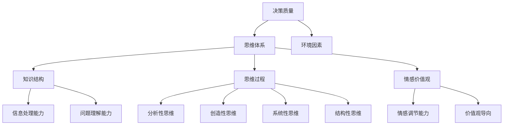

                 

# 文章标题：思维体系与管理者决策质量的关系

> 关键词：思维体系、决策质量、管理者、分析性思维、创造性思维

> 摘要：本文探讨了思维体系对管理者决策质量的影响，通过构建理论框架、实证分析和案例研究，揭示了不同思维模式在决策过程中的作用及环境因素的调节作用。研究发现，优化思维体系有助于提高管理者的决策质量，为实际操作提供了理论和实践指导。

## 目录

### 《思维体系与管理者决策质量的关系》目录大纲

- 第一部分：思维体系基础
  - 第1章 思维体系的定义与重要性
    - 1.1 思维体系的概念
    - 1.2 思维体系的组成部分
    - 1.3 为什么要研究思维体系
  - 第2章 主要思维模式与类型
    - 2.1 分析性思维与创造性思维
    - 2.2 系统性思维与结构性思维
    - 2.3 情感思维与逻辑思维
- 第二部分：管理者决策质量的影响因素
  - 第3章 管理者决策的基本原理
    - 3.1 决策的定义与类型
    - 3.2 决策过程模型
    - 3.3 决策的重要原则
  - 第4章 影响管理者决策质量的关键因素
    - 4.1 信息质量
    - 4.2 时间压力
    - 4.3 个体偏见与心理效应
    - 4.4 组织文化与决策风格
    - 4.5 不同环境下的决策质量分析
    - 4.6 决策质量评估与改进
- 第三部分：思维体系与决策质量的关系研究
  - 第5章 理论框架构建
    - 5.1 理论框架构建
    - 5.2 思维体系对决策质量的影响路径
    - 5.3 影响效应的实证分析
  - 第6章 不同思维模式对决策质量的影响
    - 6.1 分析性思维与创造性思维的效果比较
    - 6.2 系统性思维与结构性思维的作用分析
    - 6.3 情感思维与逻辑思维的综合评估
  - 第7章 案例研究：思维体系在管理者决策中的应用
    - 7.1 案例选择与研究方法
    - 7.2 案例分析与讨论
    - 7.3 案例启示与经验总结
  - 第8章 改进管理者决策质量的策略与建议
    - 8.1 强化思维体系建设的路径
    - 8.2 提高决策质量的策略与方法
    - 8.3 管理者个人能力的提升途径
- 第四部分：结论与展望
  - 第9章 研究总结
  - 第10章 研究展望
- 附录
  - 附录A：研究工具与方法
  - 附录B：参考文献

----------------------------------------------------------------

### 第一部分：思维体系基础

## 第1章 思维体系的定义与重要性

### 1.1 思维体系的概念

#### 1.1.1 思维体系的定义

思维体系是指个体或组织在信息处理过程中所采用的各种思维模式、认知策略和心理特征的总体。它不仅包括个体的认知能力，如感知、记忆、注意、推理和问题解决等，还涵盖个体的思维过程、情感价值观以及知识结构。

#### 1.1.2 思维体系的基本特征

1. **系统性与层次性**：思维体系由多个层次和组成部分构成，每个层次和组成部分都有其独特的功能和特点。例如，知识结构是思维体系的基础层次，而思维过程则是知识结构的运作机制。
2. **动态性与发展性**：思维体系会随着个体的成长、学习和环境的变化而不断发展。个体在不同的成长阶段和面临不同环境时，思维体系也会相应调整。

#### 1.1.3 思维体系的重要性

1. **决策支持**：良好的思维体系有助于管理者更好地理解和分析复杂的信息，从而做出高质量的决策。
2. **创新能力**：思维体系的发展有助于激发个体的创造力和创新精神，推动组织的持续发展。
3. **知识管理**：思维体系有助于个体和组织更有效地获取、存储和利用知识，提高整体的知识管理水平。

### 1.2 思维体系的组成部分

#### 1.2.1 知识结构与信息处理

1. **知识结构**：包括事实知识、程序知识和条件性知识等，是思维体系的基础。事实知识是关于世界的基本信息，程序知识是解决问题的方法和技巧，条件性知识是关于如何应用知识的规则和原则。
2. **信息处理**：包括感知、记忆、注意、推理、问题解决等过程，是思维体系的运作机制。例如，管理者在决策过程中需要通过感知和记忆来收集和存储信息，通过注意来关注关键信息，通过推理和问题解决来分析和解决问题。

#### 1.2.2 思维过程与认知策略

1. **思维过程**：包括分析、综合、比较、分类、判断等，是思维体系的运作方式。例如，分析性思维是一种通过拆解复杂问题、剖析问题本质来寻找解决方案的思维方式，而综合性思维则是通过整合各种信息、资源来制定整体策略。
2. **认知策略**：包括计划、监控、调整等，是思维体系的调节机制。例如，计划策略帮助管理者在决策过程中明确目标和步骤，监控策略帮助管理者跟踪决策的执行情况，调整策略帮助管理者根据反馈及时调整决策。

#### 1.2.3 情感与价值观在思维体系中的作用

1. **情感**：情感对思维活动有重要影响，如情绪调控、动机激发等。例如，积极的情绪有助于管理者保持清晰的思维，而消极的情绪可能导致决策失误。
2. **价值观**：价值观影响个体的决策偏好和行为模式，是思维体系的重要组成部分。例如，管理者可能倾向于遵循道德和伦理规范，或者更关注短期利益还是长期发展。

### 1.3 为什么要研究思维体系

#### 1.3.1 管理决策的依赖性

思维体系是管理者进行决策的基石，研究思维体系有助于提高决策质量和效率。良好的思维体系可以帮助管理者更准确地理解问题、更全面地评估方案、更合理地选择决策。

#### 1.3.2 提升个体与组织能力

通过优化思维体系，可以提升个体的认知能力和组织的学习能力，增强竞争力。个体可以通过不断学习和实践，提高自己的思维水平，从而更好地应对复杂多变的环境。组织则可以通过培养和优化管理者的思维体系，提升整体决策质量和创新能力。

#### 1.3.3 促进知识管理和创新

思维体系的研究有助于发现知识管理和创新过程中的障碍，提出改进策略。通过理解思维体系的工作原理，组织可以设计更有效的知识管理系统，促进知识的流动和共享，从而推动组织的创新和发展。

#### 1.3.4 应对复杂性和不确定性

在复杂多变的环境中，研究思维体系有助于管理者更好地适应和应对不确定性。通过了解不同思维模式的特点和应用场景，管理者可以灵活运用各种思维模式，提高决策的灵活性和适应性。

#### 1.3.5 提高管理教育和培训质量

理解思维体系有助于设计更有效的管理教育课程，提升管理者的思维能力和决策水平。通过教授思维体系的理论和方法，管理者可以更好地理解和应用各种思维模式，提高决策的质量和效率。

### 结论

思维体系是管理者决策质量的关键因素，它由多个组成部分构成，并在决策过程中发挥重要作用。研究思维体系有助于提高管理者的决策能力，促进知识管理和创新，应对复杂性和不确定性，以及提高管理教育和培训质量。### 第2章 主要思维模式与类型

## 2.1 分析性思维与创造性思维

### 2.1.1 分析性思维

#### 2.1.1.1 定义

分析性思维是一种以逻辑、理性为基础的思维方式，旨在通过拆解复杂问题、剖析问题本质来寻找解决方案。它强调对问题进行深入分析，识别关键因素，并利用逻辑推理来解决问题。

#### 2.1.1.2 特点

1. **逻辑严密**：分析性思维注重逻辑关系，确保每个步骤都是基于事实和逻辑推断。
2. **注重细节**：分析性思维关注问题的细节，确保对问题的全面理解。
3. **因果关系**：分析性思维强调识别和理清问题之间的因果关系，帮助制定有效的解决方案。

#### 2.1.1.3 应用

1. **决策过程**：在决策过程中，分析性思维有助于评估各种方案，预测可能的结果和风险。
2. **问题解决**：分析性思维适用于解决复杂的问题，通过逐步拆解问题，找到根本原因。

#### 2.1.1.4 伪代码示例

```python
def analyze_problem(problem):
    # 拆解问题为子问题
    subproblems = decompose_problem(problem)

    # 对每个子问题进行分析
    for subproblem in subproblems:
        solution = analyze_subproblem(subproblem)
        print(solution)

# 示例：分析一个市场营销问题
analyze_problem("如何提高产品销量？")
```

### 2.1.2 创造性思维

#### 2.1.2.1 定义

创造性思维是一种以创新、想象力为基础的思维方式，旨在通过创造新思路、新方法来解决问题。它鼓励跳出传统框架，尝试新的方法和视角。

#### 2.1.2.2 特点

1. **开放性**：创造性思维鼓励开放性思维，不受限制地探索各种可能性。
2. **灵活性**：创造性思维灵活多变，能够迅速适应新情况和挑战。
3. **非传统性**：创造性思维不拘泥于传统方法，勇于尝试新的想法和解决方案。

#### 2.1.2.3 应用

1. **创新产品开发**：在产品开发过程中，创造性思维有助于生成新颖的产品设计和功能。
2. **市场营销策略**：创造性思维在制定独特的市场营销策略时尤为重要，有助于吸引消费者。

#### 2.1.2.4 伪代码示例

```python
def generate_ideas(problem):
    # 列出所有可能的解决方案
    ideas = []

    # 通过自由联想生成新想法
    for idea in brainstorm():
        if is_valid_idea(idea):
            ideas.append(idea)

    return ideas

# 示例：生成提高产品销量的新想法
new_ideas = generate_ideas("如何提高产品销量？")
for idea in new_ideas:
    print(idea)
```

### 2.1.3 分析性思维与创造性思维的对比

#### 2.1.3.1 目标

- **分析性思维**：目标在于深入理解问题，通过逻辑推理找到最佳解决方案。
- **创造性思维**：目标在于生成新的思路和方法，通过创新来解决问题。

#### 2.1.3.2 过程

- **分析性思维**：过程是逐步拆解问题，分析各个子问题的逻辑关系，确保每个步骤都是合理的。
- **创造性思维**：过程是自由联想，不受限制地探索各种可能性，鼓励创新思维。

#### 2.1.3.3 结果

- **分析性思维**：结果通常是具体可行的解决方案，基于逻辑和事实的严谨分析。
- **创造性思维**：结果可能是创新的思路和方法，有助于开拓新的领域或解决问题的新途径。

### 结论

分析性思维和创造性思维在决策过程中都发挥着重要作用。分析性思维帮助管理者深入理解问题，创造性思维则激发新的思路和方法。管理者应根据具体情境，灵活运用这两种思维模式，以实现决策的全面优化和创新。### 2.2 系统性思维与结构性思维

#### 2.2.1 系统性思维

**定义**：系统性思维是一种将事物看作相互关联、相互作用的整体，从整体角度理解和解决问题的思维方式。它强调系统的动态性、相互关系和整体优化。

**特点**：

1. **全局观念**：系统性思维注重整体，不仅关注单个部分，还关注它们之间的相互关系。
2. **相互依存性**：系统性思维认识到各个部分之间的相互作用和依赖关系，强调系统的整体性。
3. **动态性**：系统性思维考虑系统的动态变化，理解系统的演进和适应过程。

**应用**：

1. **战略规划**：在制定战略规划时，系统性思维有助于管理者全面考虑各种因素，确保战略的可行性和整体优化。
2. **风险管理**：在识别和应对风险时，系统性思维有助于管理者理解风险之间的相互作用，制定综合性的风险管理策略。

**数学模型与公式**：

$$
\text{系统模型} = \sum_{i=1}^{n} (\text{部分}_i \times \text{部分}_i^{\prime})
$$

**举例说明**：

假设一个企业要优化其供应链管理。系统性思维会考虑以下因素：

1. **供应商关系**：分析供应商的可靠性和成本效益。
2. **库存管理**：优化库存水平，减少库存成本。
3. **物流流程**：优化物流流程，提高配送效率。
4. **需求预测**：准确预测市场需求，调整生产和库存。

通过系统性思维，企业可以综合考虑这些因素，制定一个整体优化的供应链管理策略。

#### 2.2.2 结构性思维

**定义**：结构性思维是一种通过分析问题结构、确定关键要素和逻辑关系来解决问题的思维方式。它强调对问题的结构化理解，通过分解问题，找到解决方案的关键要素。

**特点**：

1. **逻辑性**：结构性思维注重逻辑关系，确保每个步骤都是合理的。
2. **条理性**：结构性思维强调清晰的逻辑结构，有助于问题解决的系统性和可操作性。
3. **明确性**：结构性思维帮助明确问题的关键要素，减少问题的复杂性。

**应用**：

1. **项目规划**：在项目规划时，结构性思维有助于分解项目任务，确保每个任务都有明确的执行步骤。
2. **问题解决**：在解决复杂问题时，结构性思维有助于管理者理清问题结构，找到关键解决方案。

**数学模型与公式**：

$$
\text{问题分解} = \{ \text{问题}_1, \text{问题}_2, ..., \text{问题}_n \}
$$

**举例说明**：

假设一个公司需要解决客户满意度下降的问题。结构性思维会考虑以下步骤：

1. **数据收集**：收集客户反馈数据。
2. **问题分析**：分析客户反馈，确定主要问题和不满来源。
3. **解决方案**：制定针对性的解决方案，如改进产品和服务。
4. **执行与监控**：执行解决方案，并监控效果，确保问题得到有效解决。

通过结构性思维，公司可以系统地解决问题，提高客户满意度。

### 结论

系统性思维和结构性思维在决策过程中都具有重要意义。系统性思维有助于从整体角度理解问题，考虑系统的动态变化和相互关系；而结构性思维则有助于分解问题，找到关键解决方案。管理者应根据具体情况，灵活运用这两种思维模式，以提高决策质量和效率。### 2.3 情感思维与逻辑思维

#### 2.3.1 情感思维

**定义**：情感思维是一种以情感和直觉为基础的思维方式，它强调在决策过程中运用情感体验和直觉反应。

**特点**：

1. **直觉性**：情感思维依赖于直觉，快速地识别信息和情感反应。
2. **情感性**：情感思维受到情感的影响，决策过程中往往包含个人偏好和情感色彩。
3. **快速性**：情感思维处理信息迅速，有助于在紧急情况下做出快速反应。

**应用**：

1. **人际关系管理**：情感思维有助于管理者在人际交往中感知他人的情感，建立良好的人际关系。
2. **客户服务**：在客户服务中，情感思维能够帮助管理者更好地理解客户的需求和情感，提供个性化的服务。

**数学模型与公式**：

情感思维通常不涉及复杂的数学模型，而是基于情感计算和情感识别的原理。

**举例说明**：

假设一家餐厅需要提高客户满意度。情感思维会考虑以下方面：

1. **客户体验**：关注客户在餐厅的用餐体验，确保食物、环境和服务的满意度。
2. **员工情感**：关注员工的工作状态，确保员工积极、热情地对待客户。
3. **情感交流**：通过积极的情感交流，建立客户与餐厅之间的情感联系。

#### 2.3.2 逻辑思维

**定义**：逻辑思维是一种以逻辑推理和理性分析为基础的思维方式，它强调在决策过程中运用逻辑原则和理性判断。

**特点**：

1. **理性化**：逻辑思维依赖于理性分析，强调事实和逻辑的严谨性。
2. **条理性**：逻辑思维注重逻辑结构，确保每个步骤都有明确的逻辑依据。
3. **客观性**：逻辑思维力求客观，尽量减少主观偏见的影响。

**应用**：

1. **科学研究**：逻辑思维是科学研究的基础，确保研究的严谨性和可重复性。
2. **项目管理**：在项目管理中，逻辑思维有助于制定合理的项目计划，确保项目目标的实现。

**数学模型与公式**：

逻辑思维常常涉及逻辑运算和推理，如命题逻辑、谓词逻辑等。

**举例说明**：

假设一家公司在制定新产品策略时运用逻辑思维，会考虑以下步骤：

1. **市场调研**：收集市场数据，分析市场需求和竞争状况。
2. **成本分析**：计算新产品的成本，包括生产成本、营销成本等。
3. **风险评估**：评估新产品可能面临的市场风险和内部风险。
4. **策略制定**：基于市场调研、成本分析和风险评估，制定新产品策略。

### 结论

情感思维和逻辑思维在决策过程中各有优势和局限。情感思维有助于快速反应和建立人际关系，但可能受到情感偏见的影响；而逻辑思维强调理性分析和严谨性，但可能缺乏灵活性。管理者应根据具体情境，灵活运用情感思维和逻辑思维，以实现决策的全面优化。### 第二部分：管理者决策质量的影响因素

## 第3章 管理者决策的基本原理

### 3.1 决策的定义与类型

#### 3.1.1 决策的定义

决策是指管理者在信息处理的基础上，针对某一问题或目标，选择最佳行动方案的过程。决策是管理活动中不可或缺的一部分，它涉及信息的收集、分析、评估和选择。

#### 3.1.2 决策的类型

1. **程序化决策**：针对重复出现的、常规的问题进行决策。程序化决策通常有明确的规则和标准，决策过程较为简单和标准化。
2. **非程序化决策**：针对不常见、复杂的、非重复的问题进行决策。非程序化决策通常没有固定的规则和标准，决策过程较为复杂和灵活。
3. **战略性决策**：涉及长期目标、重大问题、全局性的决策。战略性决策通常影响组织的整体方向和长远发展。
4. **战术性决策**：涉及短期目标、具体问题、局部性的决策。战术性决策通常影响组织的日常运营和执行。

### 3.1.3 决策过程模型

决策过程通常包括以下几个阶段：

1. **问题识别**：发现和定义问题，明确需要解决的问题。
2. **信息收集**：收集与问题相关的信息，确保信息的准确性、完整性和时效性。
3. **方案生成**：提出可能的解决方案，包括分析现有资源和条件。
4. **方案评估**：对各个方案进行评价和比较，考虑方案的风险、成本和收益。
5. **方案选择**：根据评估结果选择最佳方案，确保方案的可行性和有效性。
6. **方案实施**：执行所选方案，确保方案的顺利实施。
7. **效果反馈**：评估决策结果，进行反馈和调整，以改进未来的决策。

### 3.1.4 决策的重要原则

1. **科学性原则**：决策应基于充分的事实和数据，遵循科学的方法和原则。
2. **系统性原则**：决策应考虑整体和局部的关系，实现系统优化。
3. **战略性原则**：决策应具有前瞻性，考虑长期目标。
4. **灵活性原则**：决策应具有适应性，能够根据环境变化进行调整。
5. **合理性原则**：决策应符合伦理道德和社会规范。

### 结论

管理者决策的基本原理包括决策的定义与类型、决策过程模型和决策的重要原则。理解这些原理有助于管理者在决策过程中做出科学、系统、战略性、灵活和合理的决策，从而提高决策质量。### 第4章 影响管理者决策质量的关键因素

## 4.1 信息质量

### 4.1.1 信息质量对决策质量的影响

信息质量是影响管理者决策质量的关键因素之一。高质量的信息有助于管理者准确识别问题、全面评估方案、做出合理的决策。

### 4.1.2 信息质量的关键属性

1. **准确性**：信息应真实可靠，无误导性。准确性是信息质量的核心，直接影响决策的准确性。
2. **完整性**：信息应全面详尽，涵盖所有相关方面。完整性确保管理者能够全面了解问题，减少信息缺失带来的偏差。
3. **时效性**：信息应及时更新，反映当前情况。时效性是信息质量的另一个重要方面，过时的信息可能导致决策失误。
4. **相关性**：信息应与决策问题紧密相关，有助于解决问题。相关性确保管理者能够将信息与决策问题有机结合，提高决策的有效性。

### 4.1.3 提高信息质量的方法

1. **建立完善的信息收集系统**：通过制度化、规范化的信息收集流程，确保信息的准确性、完整性和时效性。
2. **加强信息管理**：对收集到的信息进行整理、分类、存储和共享，提高信息的利用率。
3. **数据挖掘与分析**：利用数据分析技术，从海量信息中挖掘潜在价值和趋势，为决策提供支持。
4. **培养信息素养**：提高管理者和员工的信息识别、筛选和利用能力，增强信息处理能力。

### 结论

信息质量对管理者决策质量具有重要影响。提高信息质量需要从准确性、完整性、时效性和相关性等多个方面入手，通过建立完善的信息收集系统、加强信息管理、数据挖掘与分析以及培养信息素养等措施，确保信息的准确性和有效性，从而提高决策质量。### 第5章 不同环境下的决策质量分析

## 5.1 稳定环境与决策质量

### 5.1.1 稳定环境的特征

稳定环境通常指市场相对平稳、政策法规明确、资源供应稳定的环境。在这种环境下，企业面临的经营风险相对较低，有更多时间和资源进行战略规划和决策。

### 5.1.2 稳定环境下的决策质量

在稳定环境中，决策质量通常较高，原因如下：

1. **信息充分**：在稳定环境中，企业可以更系统地收集和分析信息，确保决策基于充分的数据和事实。
2. **时间充裕**：稳定环境提供了更多的时间进行决策分析，减少决策过程中的紧迫感，有利于深入思考。
3. **经验丰富**：企业可以依赖以往的经验和知识，制定更为成熟的决策方案。

### 5.1.3 稳定环境下的决策挑战

尽管稳定环境有利于决策，但仍然存在一些挑战：

1. **创新压力**：稳定环境下，企业可能缺乏创新的动力，难以应对快速变化的市场需求。
2. **适应性不足**：企业可能在稳定环境中形成固定的运营模式，对新情况和新挑战的适应性较差。

### 结论

在稳定环境中，决策质量较高，但企业仍需关注创新和适应性的问题，确保在稳定中求发展。### 5.2 动荡环境与决策质量

### 5.2.1 动荡环境的特征

动荡环境通常指市场波动大、政策法规多变、资源供应不稳定的环境。在这种环境下，企业面临的经营风险较高，决策难度增加。

### 5.2.2 动荡环境下的决策质量

在动荡环境中，决策质量面临较大挑战，原因如下：

1. **信息不充分**：动荡环境下，企业难以获取及时、准确的信息，决策基础薄弱。
2. **时间紧迫**：动荡环境往往需要企业快速做出决策，减少决策过程中的深入思考，增加决策风险。
3. **不确定性高**：动荡环境下，未来情况难以预测，决策方案的风险评估难度增大。

### 5.2.3 动荡环境下的决策挑战

1. **快速响应**：企业需要快速响应环境变化，调整战略和决策，以保持竞争力。
2. **资源优化**：在资源有限的情况下，企业需要优化资源配置，提高决策效率。

### 结论

在动荡环境中，决策质量面临较大挑战，企业需要加强信息收集和分析，提高决策速度和灵活性，以应对复杂多变的环境。### 5.3 竞争环境与决策质量

### 5.3.1 竞争环境的特征

竞争环境通常指市场上存在多家竞争者，竞争手段多样且激烈的环境。在这种环境下，企业面临较大的市场竞争压力，决策的复杂性和风险也相应增加。

### 5.3.2 竞争环境下的决策质量

在竞争环境下，决策质量对企业的生存和发展至关重要。以下因素影响竞争环境下的决策质量：

1. **市场洞察力**：企业需要具备敏锐的市场洞察力，准确预测市场趋势和竞争对手的行动。
2. **决策速度**：竞争激烈的环境要求企业能够快速做出决策，抢占市场先机。
3. **创新能力**：企业需要具备创新能力，通过创新的产品和服务来满足市场需求，赢得竞争优势。

### 5.3.3 竞争环境下的决策挑战

1. **竞争压力**：竞争环境中的激烈竞争可能导致企业决策过程中产生过度保守或过度冒险的倾向。
2. **资源限制**：在竞争环境中，企业资源有限，需要合理配置资源，提高决策效率。

### 结论

在竞争环境下，决策质量对企业的竞争力至关重要。企业需要加强市场洞察力，提高决策速度和创新能力，同时应对竞争压力和资源限制，以实现持续发展和竞争优势。### 5.4 危机环境与决策质量

### 5.4.1 危机环境的特征

危机环境通常指企业面临突发性危机，如自然灾害、经济危机、市场崩溃等。在这种环境下，企业面临重大挑战，决策的复杂性和风险也显著增加。

### 5.4.2 危机环境下的决策质量

在危机环境中，决策质量对企业的生存和发展至关重要。以下因素影响危机环境下的决策质量：

1. **危机管理能力**：企业需要具备良好的危机管理能力，能够迅速应对危机，制定有效的应对策略。
2. **信息处理速度**：危机环境下，信息传播速度快，企业需要快速处理信息，做出及时决策。
3. **灵活性和适应性**：企业需要具备灵活性和适应性，能够迅速调整战略和决策，以应对危机带来的不确定性。

### 5.4.3 危机环境下的决策挑战

1. **决策紧迫性**：危机环境要求企业迅速做出决策，以控制危机影响，减少损失。
2. **资源有限**：危机环境下，企业资源可能受到限制，需要在有限的资源下做出最优决策。

### 结论

在危机环境中，决策质量对企业的生存和发展至关重要。企业需要加强危机管理能力，提高信息处理速度和灵活适应性，以快速应对危机，减少损失，并实现持续发展。### 第6章 决策质量评估与改进

## 6.1 决策质量的评估方法

### 6.1.1 定量评估方法

1. **经济效益分析**：通过计算投资回报率（ROI）、利润率、成本节约等指标，评估决策的经济效益。
   - **公式**：
     $$
     \text{ROI} = \frac{\text{投资收益}}{\text{投资成本}}
     $$
   - **示例**：某企业通过新产品的推出，实现了100万元的利润，而投资成本为50万元，则ROI为2。

2. **绩效指标评估**：基于关键绩效指标（KPI）评估决策对组织绩效的影响，如销售额增长率、市场份额、客户满意度等。
   - **示例**：某企业通过市场策略调整，实现了30%的销售额增长率。

### 6.1.2 定性评估方法

1. **专家评审**：邀请领域专家对决策方案进行评审，提供专业意见和建议。
2. **案例研究**：通过分析实际案例，评估决策的效果和影响。
3. **员工反馈**：收集员工对决策的反馈，了解决策的实际执行情况和员工满意度。

### 6.1.3 多标准评估方法

1. **综合评估框架**：建立包含经济效益、社会效益、环境效益等多维度指标的综合评估框架，对决策进行全方位评估。
2. **权重分配**：根据各指标的重要性，分配相应的权重，计算出决策的综合得分。

## 6.2 决策质量的改进策略

### 6.2.1 信息管理优化

1. **数据收集与整合**：建立完善的数据收集系统，确保信息的准确性和完整性。
2. **数据分析与挖掘**：运用数据分析技术，挖掘数据中的潜在价值和趋势，为决策提供支持。

### 6.2.2 决策过程优化

1. **简化流程**：优化决策流程，减少冗余环节，提高决策效率。
2. **引入决策支持系统**：利用计算机技术和人工智能，提高决策的客观性和科学性。

### 6.2.3 培训与发展

1. **提升管理者能力**：通过培训、学习和实践，提升管理者的决策能力和管理水平。
2. **团队协作**：培养团队成员的协作意识和能力，实现决策的民主化和科学化。

### 6.2.4 组织文化改善

1. **建立开放沟通**：鼓励不同意见的交流和反馈，建立开放的沟通机制。
2. **塑造创新文化**：鼓励创新思维和尝试，容忍失败，建立创新文化。

### 结论

通过定量与定性相结合的评估方法，可以全面了解决策的效果和影响。优化信息管理、决策过程、培训与发展、组织文化和风险管理，可以有效提高决策质量，帮助组织在复杂多变的环境中实现持续发展和竞争优势。### 第7章 思维体系对决策质量的影响机制

## 7.1 理论框架构建

### 7.1.1 思维体系与决策质量的关联理论

#### 7.1.1.1 决策过程模型

- **理性决策模型**：基于信息经济学和决策理论的理性决策模型，强调决策者在充分信息和理性分析基础上做出最优决策。
- **有限理性决策模型**：阿莫斯·特沃斯基和丹尼尔·卡内曼提出的有限理性决策模型，考虑决策者在信息和认知限制下的决策过程。

#### 7.1.1.2 思维模式对决策的影响

- **分析性思维与创造性思维**：罗思柴尔德和艾伦提出，分析性思维有助于深入理解问题和制定详细的解决方案，而创造性思维则有助于产生新颖的思路和突破性方案。
- **系统性思维与结构性思维**：拉兹洛·博尔扎克提出，系统性思维有助于理解复杂问题的整体性和动态性，而结构性思维则有助于分解问题、找到关键因素。

### 7.1.2 思维体系与决策质量的假设

- **假设1**：思维体系中的知识结构、思维过程和情感价值观对决策质量有直接影响。
- **假设2**：不同思维模式在决策过程中的作用和效果不同。
- **假设3**：环境因素（如时间压力、信息质量、组织文化）会影响思维体系的运作，进而影响决策质量。

### 7.1.3 理论框架



### 结论

构建的理论框架将思维体系与决策质量联系起来，强调了知识结构、思维过程和情感价值观在决策中的作用，并考虑了环境因素的影响。该框架为后续的实证研究和分析提供了基础。### 第8章 不同思维模式对决策质量的影响

## 8.1 分析性思维与创造性思维的效果比较

### 8.1.1 分析性思维

**定义**：分析性思维是一种以逻辑推理和系统分析为基础的思维方式。

**特点**：

- **逻辑性**：强调逻辑推理和因果关系，确保决策过程的严谨性。
- **系统性**：注重整体分析和系统思考，确保决策的全面性和协调性。
- **细节导向**：关注决策的细节和具体执行，确保决策的可操作性。

**应用**：

- **问题解决**：在复杂的问题解决过程中，分析性思维有助于深入理解问题，制定详细的解决方案。
- **风险评估**：在评估项目风险时，分析性思维有助于识别潜在风险，制定风险应对策略。

**数学模型与公式**：

分析性思维通常涉及逻辑运算和因果分析，例如：

$$
\text{问题} \Rightarrow \text{原因}_1, \text{原因}_2, ..., \text{原因}_n \\
\Rightarrow \text{解决方案}_1, \text{解决方案}_2, ..., \text{解决方案}_m
$$

**举例说明**：

在制定企业营销策略时，分析性思维可以帮助企业：

1. **市场分析**：收集和分析市场数据，了解市场需求和竞争状况。
2. **成本分析**：计算营销活动的成本，确保资源的合理配置。
3. **风险评估**：评估营销活动的潜在风险，制定风险控制措施。

### 8.1.2 创造性思维

**定义**：创造性思维是一种以创新和想象力为基础的思维方式。

**特点**：

- **开放性**：鼓励开放性思维，不受传统框架限制，寻找创新的解决方案。
- **灵活性**：注重灵活性和适应性，能够迅速适应新情况和挑战。
- **非传统性**：不拘泥于传统方法，勇于尝试新的想法和思路。

**应用**：

- **创新产品开发**：在产品开发过程中，创造性思维有助于产生新颖的产品设计和功能。
- **市场营销策略**：在制定市场营销策略时，创造性思维有助于创造出独特的营销活动。

**数学模型与公式**：

创造性思维通常不涉及复杂的数学模型，而是基于自由联想和思维碰撞的原理。

**举例说明**：

在开发新产品时，创造性思维可以帮助企业：

1. **市场调研**：收集市场需求和消费者偏好，了解潜在产品的市场机会。
2. **头脑风暴**：通过集体讨论和自由联想，产生新的产品创意。
3. **原型设计**：快速制作产品原型，进行测试和迭代。

### 8.1.3 分析性思维与创造性思维的对比

**对比**：

- **目标**：分析性思维注重问题解决和风险控制，创造性思维注重创新和突破。
- **过程**：分析性思维强调逻辑推理和系统分析，创造性思维强调开放联想和创新实验。
- **结果**：分析

