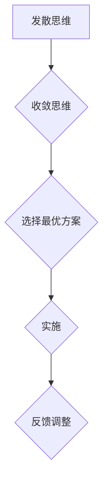

                 

## 文章标题

《思维升级：管理者的竞争优势》

> 关键词：创新思维、系统思维、决策思维、沟通协调、思维工具、实践应用

> 摘要：本文将深入探讨管理者如何通过思维升级获得竞争优势。我们将分析思维升级的必要性，介绍核心概念与联系，阐述创造性思维、问题解决思维、决策思维以及沟通与协调思维的方法和工具。最后，通过案例研究和自我评估，提供实战应用与提升的路径。

## 第一部分：思维升级的基石

### 第1章：思维升级的必要性

#### 1.1 时代变迁与思维变革

在当今快速变化的时代，信息技术、人工智能、大数据等领域的飞速发展给管理者和企业带来了前所未有的挑战和机遇。为了应对这些变化，管理者需要不断地更新和升级自己的思维方式。

**现状分析：** 传统管理思维往往过于僵化，依赖于经验和直觉，缺乏系统性、灵活性和前瞻性。面对复杂多变的环境，这种思维方式容易导致决策失误和竞争力下降。

**未来趋势：** 未来的管理者需要具备更强大的思维能力和创新能力，能够适应快速变化的环境，有效地解决复杂问题，推动企业持续发展。

#### 1.2 管理者的角色转变

随着商业环境的复杂化，管理者的角色也在不断转变。

**过去：** 管理者主要承担指挥和控制的责任，注重执行和效率。

**现在：** 管理者需要更加注重创新和协作，成为团队的创新推动者和协调者。

**未来：** 管理者将更加注重系统思维和全局观，能够从战略层面进行决策和规划。

#### 1.3 创新思维的重要性

创新思维是管理者在竞争中取得优势的关键。创新思维不仅能够帮助管理者发现新的市场机会，还能提高组织的适应能力和竞争力。

**创新思维的作用：**
- 提升企业的创新能力，推动持续发展。
- 增强团队的凝聚力和创造力，提升整体效率。
- 提高管理者的决策质量，减少风险。

### 第2章：核心概念与联系

#### 2.1 创新思维的分类

创新思维可以分为发散思维和收敛思维。

**发散思维：** 指从不同角度和层面思考问题，寻找多种可能的解决方案。

**收敛思维：** 指在多种解决方案中，选择最优的方案进行实施。

#### 2.2 系统思维的应用

系统思维是管理者理解和处理复杂问题的基本方法。系统思维强调整体性和关联性，能够帮助管理者从宏观和微观层面把握问题的本质。

**系统思维的应用：**
- 帮助管理者识别和解决复杂问题。
- 提高决策的科学性和前瞻性。
- 促进组织内部的有效沟通和协作。

#### 2.3 Mermaid 流程图：创新思维的架构

以下是一个使用Mermaid绘制的创新思维流程图：



**流程图解析：**
- A：发散思维，从不同角度思考问题，生成多个解决方案。
- B：收敛思维，从多个解决方案中选择最优的方案。
- C：选择最优方案，进行实施。
- D：实施，将选择出的方案付诸实践。
- E：反馈调整，根据实施效果进行调整和优化。

### 第3章：思维工具与方法

#### 3.1 创造性思维

创造性思维是管理者解决复杂问题和推动创新的重要工具。

**发散思维与收敛思维：**
- 发散思维：从多个角度思考问题，寻找多种可能的解决方案。
- 收敛思维：从多种解决方案中选择最优的方案。

**比喻思维与联想思维：**
- 比喻思维：通过比喻来理解和解决问题。
- 联想思维：通过相似性和关联性来联想和解决问题。

#### 3.2 问题解决思维

问题解决思维是管理者处理日常问题和挑战的关键。

**问题识别与定义：** 明确问题的本质和关键信息。

**解决方案生成与评估：** 生成多个可能的解决方案，并进行评估和选择。

**伪代码：** 问题解决的核心算法可以使用伪代码进行描述。

```pseudo
function solveProblem(problem)
    solutions = generateSolutions(problem)
    bestSolution = selectBestSolution(solutions)
    return bestSolution
end function
```

**解决方案生成与评估：** 伪代码的核心算法包括解决方案的生成和评估。生成解决方案的方法可以是发散思维和收敛思维的结合，评估方法可以是成本效益分析、风险评估等。

#### 3.3 决策思维

决策思维是管理者在复杂环境中做出有效决策的关键。

**决策过程概述：** 决策过程包括问题识别、方案评估、决策选择和执行。

**决策模型与应用：** 决策模型可以帮助管理者进行科学决策。常用的决策模型包括成本效益分析、风险分析、博弈论等。

**数学模型与公式：** 决策分析可以基于数学模型进行。例如，线性规划可以用于资源优化，决策树可以用于风险评估。

$$
\text{最大化} \quad Z = c_1x_1 + c_2x_2
$$

$$
\text{约束条件：}
\begin{align*}
x_1 + x_2 &\leq 100 \\
x_1, x_2 &\geq 0
\end{align*}
$$

#### 3.4 沟通与协调思维

沟通与协调思维是管理者推动团队协作和实现共同目标的关键。

**沟通的重要性：** 沟通是团队协作的基础，有效的沟通可以提高工作效率和团队凝聚力。

**沟通障碍与解决策略：** 沟通障碍包括语言障碍、文化差异、信息过载等。解决策略包括明确沟通目标、选择合适的沟通渠道和方式等。

**协调思维：** 协调思维是管理者在团队内部和外部进行有效协调的关键。协调思维包括协调资源、协调利益关系、协调时间进度等。

### 第4章：实战应用与提升

#### 4.1 案例研究：成功思维升级实践

**案例一：企业创新转型**

某科技公司在面对激烈的市场竞争时，决定进行创新转型。通过思维升级，公司引入了系统思维和创造性思维，制定了全新的战略规划。在实施过程中，公司注重发散思维和收敛思维的结合，不断探索新的市场机会，并通过决策思维进行科学决策。最终，公司成功实现了创新转型，市场份额显著提升。

**案例二：个人领导力提升**

某公司高管通过参加思维培训课程，提升了自己的思维能力和领导力。通过创造性思维和问题解决思维的训练，高管能够更好地应对复杂问题，做出科学决策。同时，通过沟通与协调思维的提升，高管能够更好地推动团队协作，提高团队效率。

**案例三：项目管理创新**

某项目经理通过思维工具和方法的应用，成功完成了复杂项目的管理。在项目规划阶段，项目经理使用了系统思维和创造性思维，制定了详细的项目计划。在项目实施过程中，项目经理使用了问题解决思维和决策思维，及时解决项目中的问题。通过这些方法，项目最终顺利完成，取得了良好的效果。

### 第5章：思维升级的自我评估与提升

#### 5.1 自我评估工具

自我评估是思维升级的重要步骤。以下是一些常用的自我评估工具：

- **SWOT分析：** 分析自身的优势、劣势、机会和威胁，帮助管理者了解自身的思维能力和潜力。
- **360度反馈：** 通过他人的反馈，了解自身的思维方式和行为模式，发现自身的不足。
- **思维测验：** 通过专业的思维测验，评估自己的思维能力和水平。

#### 5.2 提升思维的方法与实践

提升思维的方法包括：

- **持续学习：** 阅读相关书籍、参加培训课程、学习新技能等，不断扩展自己的知识面和思维方式。
- **实践应用：** 将学到的思维工具和方法应用到实际工作中，通过实践提升自己的思维能力。
- **反思与总结：** 定期进行反思和总结，发现自己的不足，并制定改进计划。

#### 5.3 持续学习的重要性

持续学习是思维升级的关键。随着科技和商业环境的不断变化，管理者需要不断更新自己的知识体系和思维方式，以适应新的挑战。

**持续学习的作用：**
- 提升管理者的思维能力和决策水平。
- 增强管理者的创新能力和竞争力。
- 促进个人的职业发展和成长。

### 附录

#### 附录A：思维升级相关资源

**A.1 基础读物推荐**

- 《创新者的思考方式》
- 《系统思维实践指南》
- 《决策分析》

**A.2 在线课程与培训**

- Coursera上的《批判性思维与决策》
- edX上的《系统思维与设计思维》
- LinkedIn Learning上的《创新思维与问题解决》

**A.3 思维工具与软件介绍**

- **Mermaid：** 用于绘制流程图和UML图。
- **Visio：** 微软出品的流程图和图表制作软件。
- **Lucidchart：** 在线协作式图表和流程图制作工具。

**A.4 思维训练工具**

- **MindManager：** 思维导图软件，用于组织和展示思维过程。
- **Balsamiq Mockups：** 快速制作软件界面原型和流程图。

## 作者

**作者：** AI天才研究院/AI Genius Institute & 禅与计算机程序设计艺术 /Zen And The Art of Computer Programming

感谢您的阅读！希望本文能帮助您更好地理解和应用思维升级的方法，提升管理者的竞争优势。如果您有任何问题或建议，请随时与我们联系。祝您在思维升级的道路上取得成功！

