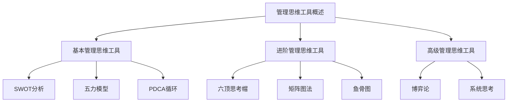

                 

### 文章标题: 管理思维工具在管理中的实际应用

关键词：管理思维工具、管理效率、决策能力、团队协作、SWOT分析、五力模型、PDCA循环、六顶思考帽、矩阵图法、鱼骨图、博弈论、系统思考、实战案例

摘要：本文旨在探讨管理思维工具在实际管理中的应用，通过分析不同类型的管理思维工具，如SWOT分析、五力模型、PDCA循环等，帮助管理者提高管理效率、增强决策能力、优化团队协作。文章结构分为五个部分，分别介绍管理思维工具的概述、基本工具、进阶工具、高级工具以及项目实战与案例分析，并通过数学模型、伪代码和实际案例，深入解析这些工具的应用和效果。

### 目录

#### 第一部分：管理思维工具概述
1. **管理思维工具的定义与应用**
2. **管理思维工具的分类**
3. **管理思维工具的价值**

#### 第二部分：基本管理思维工具

##### 第1章：SWOT分析
1. **SWOT分析的概念与原理**
2. **SWOT分析的应用**

##### 第2章：五力模型
1. **五力模型的概念与原理**
2. **五力模型的应用**

##### 第3章：PDCA循环
1. **PDCA循环的概念与原理**
2. **PDCA循环的应用**

#### 第三部分：进阶管理思维工具

##### 第4章：六顶思考帽
1. **六顶思考帽的概念与原理**
2. **六顶思考帽的应用**

##### 第5章：矩阵图法
1. **矩阵图法的基本原理**
2. **矩阵图法的应用**

##### 第6章：鱼骨图
1. **鱼骨图的概念与原理**
2. **鱼骨图的应用**

#### 第四部分：高级管理思维工具

##### 第7章：博弈论
1. **博弈论的基本原理**
2. **博弈论的应用**

##### 第8章：系统思考
1. **系统思考的概念与原理**
2. **系统思考的应用**

#### 第五部分：项目实战与案例分析

##### 第9章：实战案例一：企业战略规划
1. **案例背景**
2. **战略规划过程**
3. **结果评估与反馈**

##### 第10章：实战案例二：团队协作提升
1. **案例背景**
2. **团队协作提升过程**
3. **结果评估与反馈**

#### 第六部分：附录

##### 第11章：管理思维工具参考资料
1. **相关书籍推荐**
2. **网络资源链接**
3. **学术论文推荐**

##### 第12章：管理思维工具学习指南
1. **学习方法介绍**
2. **实践建议**
3. **常见问题解答**

#### 附件：管理思维工具Mermaid流程图
#### 附件：核心算法原理伪代码
#### 附件：数学模型和数学公式
#### 附件：项目实战与案例分析
#### 附件：AI 大模型开发工具与资源

---

随着全球商业环境的日益复杂和竞争的加剧，企业管理者面临着前所未有的挑战。如何提高管理效率、增强决策能力、优化团队协作，成为管理工作的核心问题。在这一背景下，管理思维工具应运而生，成为管理者提升管理水平的利器。本文将系统地介绍管理思维工具的定义、分类、应用，并通过具体实例，展示这些工具在实际管理中的实际应用。

#### 第一部分：管理思维工具概述

##### 1. 管理思维工具的定义与应用

管理思维工具，是指用于指导管理者在决策、计划、执行、监控和评估等管理过程中，进行逻辑思考和问题解决的一系列方法和工具。这些工具通过系统化的方式，帮助管理者更好地理解组织内外部环境，提高管理效率，增强决策能力，优化团队协作。

管理思维工具的应用范围广泛，包括但不限于以下方面：

- **战略规划**：通过SWOT分析、五力模型等工具，帮助企业制定适应市场变化、具有前瞻性的战略规划。
- **团队管理**：通过六顶思考帽、矩阵图法等工具，帮助团队更好地进行沟通、协作和解决问题。
- **项目管理**：通过PDCA循环、鱼骨图等工具，确保项目按计划、高效、高质量地完成。
- **决策制定**：通过博弈论、系统思考等高级工具，帮助管理者在面对复杂、不确定的决策情境时，做出更加科学、合理的决策。

##### 2. 管理思维工具的分类

管理思维工具可以根据复杂度和应用场景的不同，分为基本管理思维工具、进阶管理思维工具和高级管理思维工具。

- **基本管理思维工具**：主要包括SWOT分析、五力模型、PDCA循环等，这些工具相对简单，易于理解和应用，适用于日常管理工作。
- **进阶管理思维工具**：如六顶思考帽、矩阵图法、鱼骨图等，这些工具在基本工具的基础上，增加了更多的维度和层次，适用于复杂问题的分析和解决。
- **高级管理思维工具**：如博弈论、系统思考等，这些工具需要较高的理论知识和管理经验，适用于处理高度复杂、不确定性的管理问题。

##### 3. 管理思维工具的价值

管理思维工具的价值在于其能够帮助管理者：

- **提高管理效率**：通过系统化的方式，将复杂的管理问题分解为可操作的步骤，提高管理工作的效率。
- **增强决策能力**：通过逻辑思考和数据分析，帮助管理者在决策过程中减少盲目性和主观性，提高决策的科学性和合理性。
- **优化团队协作**：通过不同的思维工具，促进团队成员之间的沟通和协作，提高团队的整体效能。
- **提升问题解决能力**：在面对复杂问题时，管理思维工具提供了一种结构化的思考方法，帮助管理者找到问题的根本原因，制定有效的解决方案。

#### 第二部分：基本管理思维工具

##### 第1章：SWOT分析

SWOT分析是一种基本的管理思维工具，用于评估一个组织或项目的优势（Strengths）、劣势（Weaknesses）、机会（Opportunities）和威胁（Threats）。通过SWOT分析，管理者可以全面了解组织的内外部环境，从而制定出更加科学、合理的战略规划。

##### 1. SWOT分析的概念与原理

SWOT分析是一种基于内外部因素分析的管理方法。其中：

- **优势（Strengths）**：组织或项目在资源、能力、市场地位等方面的优势。
- **劣势（Weaknesses）**：组织或项目在资源、能力、市场地位等方面的劣势。
- **机会（Opportunities）**：外部环境中可能给组织或项目带来优势的因素。
- **威胁（Threats）**：外部环境中可能对组织或项目构成威胁的因素。

SWOT分析的原理在于，通过系统化地列出和评估这些因素，帮助管理者识别出组织的核心竞争力、潜在风险和机遇，从而制定出具有前瞻性和可行性的战略规划。

##### 2. SWOT分析的应用

SWOT分析广泛应用于企业战略规划、团队管理、项目评估等方面。以下为几个应用实例：

- **企业战略规划**：通过对企业的优势、劣势、机会和威胁进行分析，帮助企业确定战略方向，优化资源配置。
- **团队管理**：通过SWOT分析，帮助团队识别出成员的优势和劣势，制定个性化的培训和发展计划。
- **项目评估**：在项目启动前，通过SWOT分析评估项目的可行性和潜在风险，为项目实施提供指导。

##### 第2章：五力模型

五力模型是另一种基本的管理思维工具，由迈克尔·波特提出，用于分析一个行业的竞争态势。五力模型包括行业内竞争、新进入者的威胁、替代品的威胁、买方权力和供应商权力。

##### 1. 五力模型的概念与原理

五力模型的基本原理是，通过分析这五个关键因素，了解行业竞争态势，从而为企业的战略决策提供依据。具体来说：

- **行业内竞争（Industry Rivalry）**：行业内竞争者的数量、市场份额、产品差异化程度等因素，决定了行业内的竞争程度。
- **新进入者的威胁（Threat of New Entrants）**：潜在竞争者进入行业的难易程度，以及新进入者可能带来的竞争压力。
- **替代品的威胁（Threat of Substitutes）**：替代品的存在及其对现有产品的威胁程度。
- **买方权力（Buyer Power）**：买方在采购过程中对价格、质量和服务的要求，以及买方可能采取的议价策略。
- **供应商权力（Supplier Power）**：供应商在供应过程中对价格、质量和服务的要求，以及供应商可能采取的垄断策略。

##### 2. 五力模型的应用

五力模型广泛应用于市场分析、竞争策略、企业战略制定等方面。以下为几个应用实例：

- **市场分析**：通过五力模型分析，了解行业竞争态势，为企业制定市场进入策略、竞争策略提供依据。
- **竞争策略**：根据五力模型分析结果，制定出有针对性的竞争策略，提高企业在市场中的竞争力。
- **企业战略制定**：通过五力模型分析，了解企业外部环境，为企业制定适应市场变化的战略提供依据。

##### 第3章：PDCA循环

PDCA循环是一种基本的管理思维工具，由美国质量管理专家威廉·爱德华兹·戴明提出，用于指导管理活动中的计划（Plan）、执行（Do）、检查（Check）和行动（Act）。

##### 1. PDCA循环的概念与原理

PDCA循环是一种持续改进的方法，通过计划、执行、检查和行动四个环节，实现对管理活动的持续优化。具体来说：

- **计划（Plan）**：确定目标和实施策略，制定详细的行动计划。
- **执行（Do）**：按照计划实施行动，确保各项工作按计划进行。
- **检查（Check）**：对执行过程进行检查，评估实际效果，与预期目标进行比较。
- **行动（Act）**：根据检查结果，对计划进行调整和优化，为下一轮循环做好准备。

##### 2. PDCA循环的应用

PDCA循环广泛应用于项目管理、质量控制、个人成长计划等方面。以下为几个应用实例：

- **项目管理**：通过PDCA循环，确保项目按计划、高效、高质量地完成。
- **质量控制**：通过PDCA循环，持续监控和改进产品质量，提高客户满意度。
- **个人成长计划**：通过PDCA循环，制定并执行个人成长计划，持续提升个人能力和素质。

#### 第三部分：进阶管理思维工具

##### 第4章：六顶思考帽

六顶思考帽是一种进阶的管理思维工具，由爱德华·德·波诺提出，用于引导团队成员从不同角度思考问题，避免思维单一、偏见和冲突。

##### 1. 六顶思考帽的概念与原理

六顶思考帽是一种思维训练工具，通过分别佩戴六种不同颜色的帽子，代表不同的思考方式。具体来说：

- **白色思考帽（Objective Information）**：代表客观事实，专注于信息的收集和呈现。
- **红色思考帽（Emotions）**：代表情感，专注于表达个人情感和直觉。
- **黄色思考帽（Positive Aspects）**：代表积极观点，专注于寻找问题的优点和好处。
- **黑色思考帽（Negative Aspects）**：代表消极观点，专注于寻找问题的缺点和风险。
- **绿色思考帽（Creativity）**：代表创意，专注于寻找新的解决方案和创意。
- **蓝色思考帽（Control of Thinking Process）**：代表控制思考过程，专注于管理和引导思考过程。

##### 2. 六顶思考帽的应用

六顶思考帽广泛应用于团队决策、争议解决、个人思考习惯的培养等方面。以下为几个应用实例：

- **团队决策**：通过六顶思考帽，引导团队成员从不同角度思考问题，避免思维单一和偏见。
- **争议解决**：通过六顶思考帽，帮助争议双方从不同角度理解问题，找到共识和解决方案。
- **个人思考习惯的培养**：通过六顶思考帽，培养个人多角度、全面思考问题的习惯。

##### 第5章：矩阵图法

矩阵图法是一种进阶的管理思维工具，用于分析和解决复杂问题。矩阵图法通过建立矩阵模型，分析问题的各个维度，从而找到问题的根源和解决方案。

##### 1. 矩阵图法的基本原理

矩阵图法的基本原理是，通过建立矩阵模型，将问题的各个维度进行交叉分析，从而找到问题的根源和解决方案。具体来说：

- **建立矩阵模型**：根据问题的需求，建立矩阵模型，包括行、列和单元。
- **填写矩阵数据**：在矩阵的行、列和单元中，填写相关数据，如因素、指标和评分。
- **分析矩阵数据**：对矩阵数据进行交叉分析，找出问题的根源和解决方案。

##### 2. 矩阵图法的应用

矩阵图法广泛应用于复杂问题的分析、决策制定、风险评估等方面。以下为几个应用实例：

- **复杂问题的分析**：通过矩阵图法，对复杂问题进行系统化、结构化分析，找到问题的根源和解决方案。
- **决策制定**：通过矩阵图法，对多个决策方案进行评估和比较，找到最优方案。
- **风险评估**：通过矩阵图法，对项目的风险因素进行评估和排序，制定有效的风险应对策略。

##### 第6章：鱼骨图

鱼骨图是一种进阶的管理思维工具，也称为因果图，用于分析和解决问题的根本原因。鱼骨图通过将问题分解为不同的因素，找出问题的根本原因，从而制定有效的解决方案。

##### 1. 鱼骨图的概念与原理

鱼骨图的基本原理是，将问题视为一条鱼，将问题的各个因素视为鱼骨，从而将问题分解为不同的因素。具体来说：

- **绘制鱼骨图**：首先绘制一个鱼头，代表问题；然后从鱼头延伸出主干，代表问题的各个主要因素；接着在主干上绘制分支，代表更详细的因素。
- **分析鱼骨图**：通过分析鱼骨图，找出问题的根本原因，并制定相应的解决方案。

##### 2. 鱼骨图的应用

鱼骨图广泛应用于问题分析、原因追究、改进方案设计等方面。以下为几个应用实例：

- **问题分析**：通过鱼骨图，将问题分解为不同的因素，找出问题的根本原因，从而制定有效的解决方案。
- **原因追究**：通过鱼骨图，对问题的各种可能原因进行分析，找出最可能的原因。
- **改进方案设计**：通过鱼骨图，找出问题的根本原因，从而设计出有针对性的改进方案。

#### 第四部分：高级管理思维工具

##### 第7章：博弈论

博弈论是一种高级的管理思维工具，用于分析决策者在博弈过程中如何进行策略选择和结果预测。博弈论的基本原理是，通过分析参与者的策略、收益和博弈结构，找出最优策略和均衡解。

##### 1. 博弈论的基本原理

博弈论的基本原理包括：

- **参与者**：博弈中的决策者，每个参与者都有特定的策略选择。
- **策略**：参与者在博弈过程中采取的行动方案。
- **收益**：参与者采取特定策略后所获得的利益或损失。
- **均衡解**：博弈的最终结果，满足每个参与者都采取了最优策略的条件。

##### 2. 博弈论的应用

博弈论广泛应用于谈判策略、竞争分析、企业战略规划等方面。以下为几个应用实例：

- **谈判策略**：通过博弈论分析，制定出具有优势的谈判策略，提高谈判成功率。
- **竞争分析**：通过博弈论分析，了解竞争对手的策略选择和潜在收益，制定出有针对性的竞争策略。
- **企业战略规划**：通过博弈论分析，制定出具有前瞻性和可行性的企业战略规划。

##### 第8章：系统思考

系统思考是一种高级的管理思维工具，用于分析和解决复杂、动态的系统问题。系统思考的基本原理是，通过理解系统的结构和行为，找出问题的根源和解决方案。

##### 1. 系统思考的概念与原理

系统思考的基本原理包括：

- **系统结构**：系统由相互关联的组成部分构成，每个部分对系统整体的行为产生影响。
- **系统行为**：系统整体的行为是由各个部分相互作用、相互影响而形成的。
- **反馈循环**：系统内部存在着正反馈和负反馈循环，这些循环决定了系统的稳定性和变化趋势。

##### 2. 系统思考的应用

系统思考广泛应用于复杂系统的分析、组织变革、环境管理等方面。以下为几个应用实例：

- **复杂系统的分析**：通过系统思考，理解复杂系统的结构和行为，找出问题的根源和解决方案。
- **组织变革**：通过系统思考，分析组织内部的反馈循环，制定出有针对性的变革策略。
- **环境管理**：通过系统思考，理解环境系统的影响因素和相互作用，制定出可持续发展的环境管理策略。

#### 第五部分：项目实战与案例分析

##### 第9章：实战案例一：企业战略规划

1. **案例背景**

某家电生产企业A面临市场竞争激烈、产品同质化严重的问题，希望通过战略规划提高市场竞争力。

2. **战略规划过程**

   - **SWOT分析**：对企业A的优势、劣势、机会和威胁进行分析，确定企业A的战略方向。

     - 优势（Strengths）：产品质量稳定，生产效率高。
     - 劣势（Weaknesses）：品牌知名度不高，市场营销能力较弱。
     - 机会（Opportunities）：市场对绿色环保家电的需求增加。
     - 威胁（Threats）：竞争对手产品创新，市场份额下降。

   - **五力模型分析**：分析家电行业的竞争态势，为企业A制定竞争策略。

     - 行业内竞争（Industry Rivalry）：竞争对手多，市场竞争激烈。
     - 新进入者的威胁（Threat of New Entrants）：潜在竞争对手较多，进入门槛较低。
     - 替代品的威胁（Threat of Substitutes）：替代品较多，对现有产品构成威胁。
     - 买方权力（Buyer Power）：消费者对价格敏感，买方权力较大。
     - 供应商权力（Supplier Power）：供应商较多，供应商权力较小。

   - **PDCA循环**：制定并实施企业战略规划。

     - **计划（Plan）**：制定战略目标和具体实施计划。
     - **执行（Do）**：按照计划实施行动，提高品牌知名度和市场营销能力。
     - **检查（Check）**：对实施过程进行检查和评估，确保战略规划按计划进行。
     - **行动（Act）**：根据检查结果，对计划进行调整和优化，确保战略规划的有效实施。

3. **结果评估与反馈**

   - 通过SWOT分析和五力模型分析，企业A确定了以提升品牌知名度和市场营销能力为核心的战略方向。
   - 通过PDCA循环，企业A逐步实现了战略规划的目标，市场份额逐步提升，企业竞争力得到提高。

##### 第10章：实战案例二：团队协作提升

1. **案例背景**

某企业B的团队在项目执行过程中，常常出现沟通不畅、任务分配不均的问题，影响了项目的进展和质量。

2. **团队协作提升过程**

   - **六顶思考帽**：引导团队成员从不同角度思考问题，提高团队的整体思考水平。

     - **白色思考帽**：收集和分析项目相关的数据和信息。
     - **红色思考帽**：表达团队成员的情感和直觉。
     - **黄色思考帽**：寻找项目的优点和好处。
     - **黑色思考帽**：分析项目可能存在的风险和问题。
     - **绿色思考帽**：提出新的解决方案和创意。
     - **蓝色思考帽**：控制思考过程，引导团队成员聚焦于项目问题。

   - **矩阵图法**：分析团队合作的瓶颈和改进点。

     - **建立矩阵模型**：列出团队合作的各项因素，如沟通、任务分配、时间管理等。
     - **填写矩阵数据**：对每个因素进行评估和打分。
     - **分析矩阵数据**：找出团队合作的瓶颈，制定改进方案。

   - **鱼骨图**：查找导致问题的主要原因。

     - **绘制鱼骨图**：将问题分解为不同的因素，如沟通不畅、任务分配不均等。
     - **分析鱼骨图**：找出导致问题的根本原因，制定针对性的改进方案。

3. **结果评估与反馈**

   - 通过六顶思考帽，团队成员能够更全面地了解项目情况，减少误解和冲突。
   - 通过矩阵图法和鱼骨图，企业B找到了团队合作的问题根源，并制定了有针对性的改进方案。
   - 经过一段时间的改进，团队协作水平显著提升，项目执行效率和质量得到提高。

#### 第六部分：附录

##### 第11章：管理思维工具参考资料

1. **相关书籍推荐**

   - 《管理思维工具与应用》
   - 《战略思维：从规划到执行》
   - 《博弈论与经济行为》

2. **网络资源链接**

   - https://www.mindtools.com/pages/main/newMN_TMC.htm
   - https://www.wikibooks.org/wiki/Managerial_Skills
   - https://www.shrm.org/topics/management/pages/management-tools-and-techniques.aspx

3. **学术论文推荐**

   - **Swot Analysis in Strategic Management: A Review**
   - **The Five Forces Model of Competition in Its Business Application**
   - **PDCA: A Practical Guide to Continuous Improvement**

##### 第12章：管理思维工具学习指南

1. **学习方法介绍**

   - 系统学习：通过阅读相关书籍和资料，系统地学习管理思维工具的理论知识。
   - 实践应用：在实际工作中运用所学工具，解决实际问题。
   - 案例分析：通过分析经典案例，理解管理思维工具的应用场景和效果。

2. **实践建议**

   - 定期复习：定期复习所学知识，巩固记忆。
   - 交流分享：参与讨论和分享，从他人的经验中学习。
   - 持续实践：将管理思维工具应用到日常工作中，不断提高。

3. **常见问题解答**

   - **Q: SWOT分析与五力模型的区别是什么？**
     - **A:** SWOT分析主要关注企业内部和外部环境的分析，而五力模型主要关注行业竞争态势的分析。

   - **Q: 如何在实际工作中运用管理思维工具？**
     - **A:** 可以从以下几个方面着手：项目规划、团队管理、决策制定、问题解决等。

   - **Q: 管理思维工具的学习难点在哪里？**
     - **A:** 主要难点在于理论知识的理解和实际应用的结合，以及不同场景下的灵活运用。

#### 附件：管理思维工具Mermaid流程图



#### 附件：核心算法原理伪代码

```python
# SWOT分析伪代码
def SWOT_analysis(organization):
    strengths = get_strengths(organization)
    weaknesses = get_weaknesses(organization)
    opportunities = get_opportunities(organization)
    threats = get_threats(organization)
    return {
        "Strengths": strengths,
        "Weaknesses": weaknesses,
        "Opportunities": opportunities,
        "Threats": threats
    }

# 五力模型伪代码
def five_forces_analysis(industry):
    rivalry = get_rivalry_level(industry)
    new_entries = get_new_entries_threat(industry)
    substitutes = get_substitutes_threat(industry)
    buyer_power = get_buyer_power(industry)
    supplier_power = get_supplier_power(industry)
    return {
        "Rivalry": rivalry,
        "New Entrants": new_entries,
        "Substitutes": substitutes,
        "Buyer Power": buyer_power,
        "Supplier Power": supplier_power
    }

# PDCA循环伪代码
def PDCA_loop(activity):
    plan = plan_activity(activity)
    do = execute_activity(activity)
    check = check_activity(activity)
    act = act_on_learning(activity)
    return {
        "Plan": plan,
        "Do": do,
        "Check": check,
        "Act": act
    }
```

#### 附件：数学模型和数学公式

##### SWOT分析中的数学模型

$$
SWOT = \begin{bmatrix}
S & W \\
O & T
\end{bmatrix}
$$

其中，$S$ 代表优势（Strengths），$W$ 代表劣势（Weaknesses），$O$ 代表机会（Opportunities），$T$ 代表威胁（Threats）。

##### 五力模型中的数学模型

$$
F_{\text{total}} = \sum_{i=1}^{5} w_i \cdot F_i
$$

其中，$F_{\text{total}}$ 是总力量，$w_i$ 是权重，$F_i$ 是第 $i$ 个力量的评分。

#### 附件：项目实战与案例分析

##### 实战案例一：企业战略规划

1. **案例背景**

   企业C是一家从事软件开发的企业，面临市场竞争加剧、技术创新压力大的问题，希望通过战略规划提升企业的核心竞争力。

2. **战略规划过程**

   - **SWOT分析**：对企业C的优势、劣势、机会和威胁进行分析。

     - 优势（Strengths）：拥有丰富的软件开发经验和优秀的技术团队。
     - 劣势（Weaknesses）：市场营销能力较弱，新产品研发周期较长。
     - 机会（Opportunities）：市场对定制化软件开发的需求增加。
     - 威胁（Threats）：竞争对手众多，技术创新速度加快。

   - **五力模型分析**：分析软件开发行业的竞争态势。

     - 行业内竞争（Industry Rivalry）：竞争对手数量众多，市场竞争激烈。
     - 新进入者的威胁（Threat of New Entrants）：新进入者较少，进入门槛较高。
     - 替代品的威胁（Threat of Substitutes）：替代品较少，对现有产品构成较小威胁。
     - 买方权力（Buyer Power）：消费者对价格敏感，买方权力较大。
     - 供应商权力（Supplier Power）：供应商较多，供应商权力较小。

   - **PDCA循环**：制定并实施企业战略规划。

     - **计划（Plan）**：确定企业战略目标和具体实施计划。
     - **执行（Do）**：按照计划实施行动，加强市场营销、缩短新产品研发周期。
     - **检查（Check）**：对实施过程进行检查和评估，确保战略规划按计划进行。
     - **行动（Act）**：根据检查结果，对计划进行调整和优化，确保战略规划的有效实施。

3. **结果评估与反馈**

   - 通过SWOT分析和五力模型分析，企业C确定了以加强市场营销和缩短新产品研发周期为核心的战略方向。
   - 通过PDCA循环，企业C逐步实现了战略规划的目标，市场竞争力得到显著提升。

##### 实战案例二：团队协作提升

1. **案例背景**

   企业D的团队在项目执行过程中，常常出现沟通不畅、任务分配不均的问题，影响了项目的进展和质量。

2. **团队协作提升过程**

   - **六顶思考帽**：引导团队成员从不同角度思考问题，提高团队的整体思考水平。

     - **白色思考帽**：收集和分析项目相关的数据和信息。
     - **红色思考帽**：表达团队成员的情感和直觉。
     - **黄色思考帽**：寻找项目的优点和好处。
     - **黑色思考帽**：分析项目可能存在的风险和问题。
     - **绿色思考帽**：提出新的解决方案和创意。
     - **蓝色思考帽**：控制思考过程，引导团队成员聚焦于项目问题。

   - **矩阵图法**：分析团队合作的瓶颈和改进点。

     - **建立矩阵模型**：列出团队合作的各项因素，如沟通、任务分配、时间管理等。
     - **填写矩阵数据**：对每个因素进行评估和打分。
     - **分析矩阵数据**：找出团队合作的瓶颈，制定改进方案。

   - **鱼骨图**：查找导致问题的主要原因。

     - **绘制鱼骨图**：将问题分解为不同的因素，如沟通不畅、任务分配不均等。
     - **分析鱼骨图**：找出导致问题的根本原因，制定针对性的改进方案。

3. **结果评估与反馈**

   - 通过六顶思考帽，团队成员能够更全面地了解项目情况，减少误解和冲突。
   - 通过矩阵图法和鱼骨图，企业D找到了团队合作的问题根源，并制定了有针对性的改进方案。
   - 经过一段时间的改进，团队协作水平显著提升，项目执行效率和质量得到提高。

### 附录 A: AI 大模型开发工具与资源

#### A.1 主流深度学习框架对比

- **TensorFlow**：由谷歌开发，支持多种编程语言，如Python、C++等，提供丰富的API和工具。

- **PyTorch**：基于Python的科学计算框架，由Facebook开发，易于使用，特别是在动态计算图和实时调试方面。

- **JAX**：由谷歌开发，提供自动微分功能，支持大规模深度学习模型。

- **其他框架简介**：如Keras（基于TensorFlow的高层神经网络API）、Caffe（主要用于图像识别的深度学习框架）、Theano（用于定义、优化和评估数学表达式的高性能库）。

#### A.2 管理思维工具学习指南

- **学习方法介绍**：通过系统学习、实践应用和案例分析，全面掌握管理思维工具的理论知识。

- **实践建议**：定期复习所学知识，参与讨论和分享，持续将管理思维工具应用到实际工作中。

- **常见问题解答**：解答关于SWOT分析、五力模型等管理思维工具的常见问题，帮助读者更好地理解和应用这些工具。

