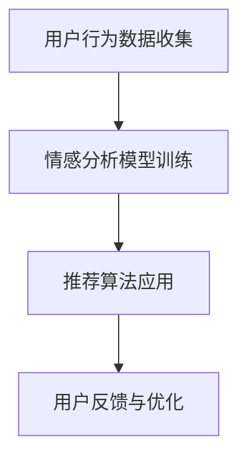
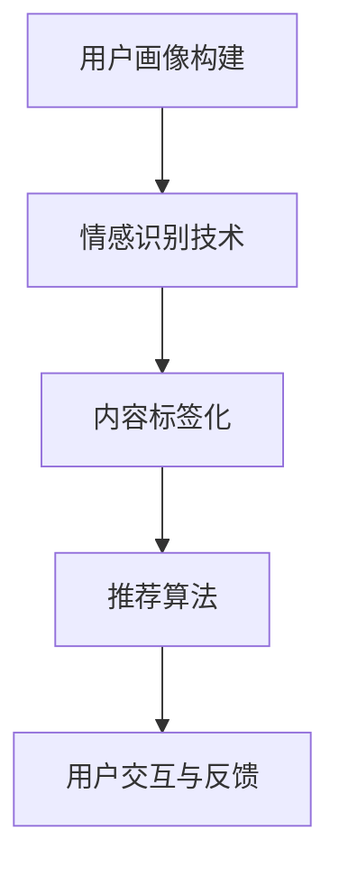
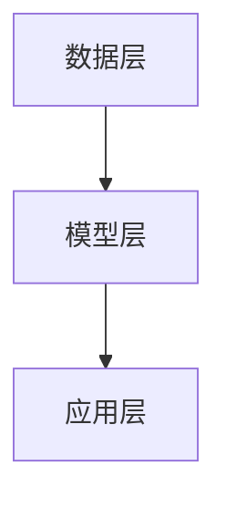

                 

### 文章标题

《情感驱动推荐系统：AI的优势》

### 关键词

- 情感驱动推荐系统
- 人工智能
- 推荐算法
- 情感分析
- 用户互动

### 摘要

本文深入探讨了情感驱动推荐系统的概念、应用和优势。通过详细的分析和案例分析，本文揭示了情感驱动推荐系统在电商、社交媒体、娱乐内容和教育等多个领域的应用场景。文章首先概述了情感驱动推荐系统的基本原理，然后逐步介绍了情感识别技术、推荐算法优化策略以及系统的开发与性能优化。通过本文的阅读，读者将全面了解情感驱动推荐系统的原理和实际应用，认识到AI在这一领域的关键作用，从而为未来的技术发展和实践提供有益的启示。

### 第一部分：情感驱动推荐系统的概述

#### 第1章：情感驱动推荐系统的背景与重要性

随着互联网和社交媒体的普及，用户生成的内容和数据量呈现出爆炸式增长。在这样的背景下，推荐系统成为了一种重要的工具，帮助用户在大量的信息中找到感兴趣的内容和产品。传统的推荐系统主要依赖于用户的历史行为和物品的属性进行推荐，然而，这种推荐方式往往忽视了用户的情感需求。情感驱动推荐系统则通过捕捉和利用用户的情感状态，为用户推荐更符合其情感需求的内容和产品。

**1.1 情感驱动推荐系统的定义**

情感驱动推荐系统是一种结合了情感分析和推荐算法的智能系统。它通过分析用户的情感状态，将情感因素融入到推荐过程中，从而提高推荐的准确性和个性化程度。情感驱动推荐系统的基本流程包括用户情感识别、推荐算法应用和用户反馈与优化。

**Mermaid 流程图：**



- **A. 用户行为数据收集**：系统通过收集用户的浏览历史、购买记录、评论和反馈等行为数据，构建用户画像。
- **B. 情感分析模型训练**：利用自然语言处理（NLP）和机器学习技术，对用户行为数据进行分析，识别用户的情感状态。
- **C. 推荐算法应用**：根据用户情感状态和物品属性，利用推荐算法生成个性化的推荐结果。
- **D. 用户反馈与优化**：系统收集用户对推荐结果的反馈，不断优化推荐模型，提高推荐的准确性和用户满意度。

**1.2 情感驱动推荐系统的核心组成部分**

情感驱动推荐系统主要由用户画像构建、情感识别技术、内容标签化和推荐算法等几个核心组成部分构成。

**Mermaid 流程图：**



- **A. 用户画像构建**：用户画像是对用户兴趣、行为和情感状态的全面描述。它为后续的情感分析和推荐提供了基础。
- **B. 情感识别技术**：情感识别技术通过自然语言处理（NLP）和机器学习算法，分析用户生成的内容，识别用户的情感状态。
- **C. 内容标签化**：内容标签化是将物品和用户特征进行分类和标注的过程，为推荐算法提供了重要的输入。
- **D. 推荐算法**：推荐算法根据用户情感状态和物品特征，生成个性化的推荐结果。常见的推荐算法包括协同过滤、基于内容的推荐和混合推荐等。
- **E. 用户交互与反馈**：用户与推荐系统的互动和反馈是优化推荐模型的重要环节。系统通过不断收集用户的反馈，调整推荐策略，提高推荐的准确性和用户满意度。

**1.3 AI在情感驱动推荐系统中的应用优势**

AI技术在情感驱动推荐系统中发挥着关键作用，其优势主要体现在以下几个方面：

1. **高效的情感分析**：传统的情感分析方法依赖于规则和词典，存在精度低和效率低的问题。而AI技术，特别是深度学习，可以处理大规模的文本数据，实现高效和准确的情感分析。
2. **个性化的推荐结果**：AI技术可以更好地理解和预测用户的情感需求，从而生成更加个性化的推荐结果，提高用户的满意度。
3. **动态的推荐策略**：AI技术可以根据用户的实时行为和情感状态，动态调整推荐策略，实现实时推荐的优化。
4. **多模态的情感分析**：AI技术可以结合文本、图像、语音等多种模态的数据，实现更全面和准确的情感分析。

**伪代码示例：**

```python
def sentiment_driven_recommendation(user_profile, item_features):
    # 收集用户行为数据
    user_actions = collect_user_actions(user_profile)
    
    # 进行情感分析
    sentiment_scores = sentiment_analysis(user_actions)
    
    # 根据情感分数和物品特征进行推荐
    recommended_items = recommend_items(sentiment_scores, item_features)
    
    return recommended_items
```

通过上述伪代码，我们可以看到情感驱动推荐系统的基本流程。首先，收集用户行为数据，然后进行情感分析，最后根据情感分数和物品特征进行推荐。这种流程不仅提高了推荐的准确性，还大大提升了用户的满意度。

#### 第2章：情感识别技术在推荐系统中的应用

情感识别技术是情感驱动推荐系统的核心组成部分，其目标是通过分析用户生成的内容，识别用户的情感状态。情感识别技术的应用不仅提升了推荐系统的准确性，还大大增强了用户的个性化体验。

**2.1 情感识别技术概述**

情感识别技术通常包括文本情感分析、语音情感分析和图像情感分析等。其中，文本情感分析是最常用的技术，它通过自然语言处理（NLP）和机器学习算法，对用户生成的内容（如评论、帖子、聊天记录等）进行分析，识别用户的情感状态。

**数学模型与公式：**

$$
情感识别模型 = f(文本特征, 情感词典, 情感分类器)
$$

- **文本特征**：文本特征是情感识别的基础，包括词频、词向量、句法结构和语义信息等。
- **情感词典**：情感词典是一种预定义的词汇表，包含情感极性标签（如正面、负面、中性等）。情感词典可以帮助模型快速定位情感倾向。
- **情感分类器**：情感分类器是情感识别的核心，它通过训练学习到文本特征与情感标签之间的映射关系，实现情感识别。

**2.2 文本情感分析算法**

文本情感分析算法是情感识别技术的重要组成部分。常见的文本情感分析算法包括基于规则的方法、基于机器学习的方法和基于深度学习的方法。

**基于规则的方法**：基于规则的方法通过编写一系列规则，对文本进行情感分类。这种方法简单高效，但规则覆盖有限，难以应对复杂的情感场景。

**基于机器学习的方法**：基于机器学习的方法通过训练大规模的标注数据集，学习到文本特征与情感标签之间的映射关系。常见的方法包括支持向量机（SVM）、朴素贝叶斯（NB）和随机森林（RF）等。

**基于深度学习的方法**：基于深度学习的方法通过构建神经网络模型，实现文本情感分析。常见的方法包括卷积神经网络（CNN）、循环神经网络（RNN）和长短时记忆网络（LSTM）等。深度学习方法在处理复杂文本情感分析任务上表现出色，但训练过程需要大量的数据和计算资源。

**伪代码示例：**

```python
def text_sentiment_analysis(text, sentiment_dict, classifier):
    # 提取文本特征
    text_features = extract_text_features(text)
    
    # 利用情感词典和分类器进行情感分析
    sentiment = classifier.predict(text_features, sentiment_dict)
    
    return sentiment
```

在上述伪代码中，`text_sentiment_analysis` 函数通过提取文本特征，利用情感词典和分类器进行情感分析，返回情感标签。这种流程不仅提高了情感识别的准确性，还为推荐系统提供了重要的输入。

**2.3 情感识别技术在推荐系统中的应用**

情感识别技术在推荐系统中的应用主要包括以下几个方面：

1. **个性化推荐**：通过情感识别技术，系统可以更好地理解用户的情感需求，生成更符合用户情感状态的个性化推荐。
2. **情感标签化**：系统可以将用户的情感状态标注在物品上，实现情感标签化，为推荐算法提供更丰富的输入。
3. **推荐策略优化**：情感识别技术可以帮助系统动态调整推荐策略，实现推荐结果的最优化。
4. **用户互动**：情感识别技术可以分析用户在互动过程中的情感变化，优化用户互动体验。

通过情感识别技术，推荐系统不仅可以提高推荐的准确性，还可以更好地满足用户的情感需求，提升用户体验。

#### 第3章：推荐算法在情感驱动系统中的优化

在情感驱动推荐系统中，推荐算法起着至关重要的作用。通过优化推荐算法，可以提高推荐的准确性和个性化程度，从而提升用户的满意度。本章将详细探讨推荐算法在情感驱动系统中的优化策略和技巧。

**3.1 推荐算法概述**

推荐算法是一种通过分析用户的历史行为和物品的属性，预测用户可能感兴趣的内容和产品的算法。常见的推荐算法包括协同过滤、基于内容的推荐和混合推荐等。

**数学模型与公式：**

$$
推荐算法 = f(用户画像, 物品特征, 情感分数)
$$

- **用户画像**：用户画像是对用户兴趣、行为和情感状态的全面描述，包括用户的浏览历史、购买记录、评论和反馈等。
- **物品特征**：物品特征是描述物品属性的信息，包括物品的标题、描述、标签、分类等。
- **情感分数**：情感分数是情感识别技术对用户情感状态的评估结果，用于影响推荐结果。

**3.2 情感驱动的协同过滤算法**

协同过滤算法是一种基于用户历史行为的推荐算法，通过分析用户之间的相似度，推荐用户可能感兴趣的内容和产品。在情感驱动的协同过滤算法中，情感分数被引入到相似度计算中，从而提高推荐的准确性。

**情感驱动的协同过滤算法的步骤如下：**

1. **用户行为数据收集**：收集用户的历史行为数据，包括浏览历史、购买记录和评论等。
2. **情感分析**：利用情感识别技术，分析用户行为数据，提取情感分数。
3. **计算用户相似度**：根据用户画像和情感分数，计算用户之间的相似度。
4. **生成推荐列表**：根据用户相似度和物品特征，生成个性化的推荐列表。

**伪代码示例：**

```python
def sentiment_aware_collaborative_filtering(user_profile, item_profile, sentiment_scores):
    # 计算用户-物品的情感相关性
    sentiment_correlation = calculate_correlation(user_profile, item_profile, sentiment_scores)
    
    # 根据情感相关性进行推荐
    recommended_items = recommend_items_based_on_correlation(sentiment_correlation)
    
    return recommended_items
```

在上述伪代码中，`sentiment_aware_collaborative_filtering` 函数通过计算用户-物品的情感相关性，生成个性化的推荐列表。这种算法不仅考虑了用户的历史行为，还考虑了用户的情感需求，从而提高了推荐的准确性。

**3.3 情感驱动的基于内容的推荐算法**

基于内容的推荐算法是一种基于物品属性的推荐算法，通过分析用户的历史行为和物品的属性，推荐用户可能感兴趣的内容和产品。在情感驱动的基于内容的推荐算法中，情感分数被引入到内容相似度计算中，从而提高推荐的准确性。

**情感驱动的基于内容的推荐算法的步骤如下：**

1. **用户行为数据收集**：收集用户的历史行为数据，包括浏览历史、购买记录和评论等。
2. **情感分析**：利用情感识别技术，分析用户行为数据，提取情感分数。
3. **计算物品相似度**：根据物品特征和情感分数，计算物品之间的相似度。
4. **生成推荐列表**：根据物品相似度和用户情感需求，生成个性化的推荐列表。

**伪代码示例：**

```python
def sentiment_aware_content_based_recommender(user_profile, item_profiles, sentiment_scores):
    # 计算用户-物品的情感相关性
    sentiment_correlation = calculate_correlation(user_profile, item_profiles, sentiment_scores)
    
    # 根据情感相关性生成推荐列表
    recommended_items = generate_recommendations(sentiment_correlation)
    
    return recommended_items
```

在上述伪代码中，`sentiment_aware_content_based_recommender` 函数通过计算用户-物品的情感相关性，生成个性化的推荐列表。这种算法不仅考虑了物品的属性，还考虑了用户的情感需求，从而提高了推荐的准确性。

**3.4 情感驱动的混合推荐算法**

混合推荐算法是一种结合协同过滤和基于内容的推荐算法的推荐算法。在情感驱动的混合推荐算法中，情感分数被引入到混合推荐模型的权重计算中，从而提高推荐的准确性。

**情感驱动的混合推荐算法的步骤如下：**

1. **用户行为数据收集**：收集用户的历史行为数据，包括浏览历史、购买记录和评论等。
2. **情感分析**：利用情感识别技术，分析用户行为数据，提取情感分数。
3. **计算协同过滤推荐结果**：根据用户相似度和物品特征，计算协同过滤推荐结果。
4. **计算基于内容的推荐结果**：根据物品相似度和用户情感需求，计算基于内容的推荐结果。
5. **生成混合推荐结果**：根据协同过滤推荐结果和基于内容的推荐结果，生成混合推荐结果。

**伪代码示例：**

```python
def sentiment_aware_hybrid_recommender(user_profile, item_profiles, sentiment_scores):
    # 计算协同过滤推荐结果
    collaborative_recommendations = collaborative_filtering(user_profile, item_profiles)
    
    # 计算基于内容的推荐结果
    content_based_recommendations = content_based_recommender(user_profile, item_profiles)
    
    # 生成混合推荐结果
    hybrid_recommendations = generate_hybrid_recommendations(collaborative_recommendations, content_based_recommendations, sentiment_scores)
    
    return hybrid_recommendations
```

在上述伪代码中，`sentiment_aware_hybrid_recommender` 函数通过计算协同过滤推荐结果和基于内容的推荐结果，生成混合推荐结果。这种算法结合了协同过滤和基于内容推荐的优势，从而提高了推荐的准确性。

通过上述优化策略和技巧，推荐算法可以在情感驱动系统中发挥更大的作用，为用户提供更准确、更个性化的推荐服务。

#### 第二部分：情感驱动推荐系统的应用场景

##### 第4章：电商领域的情感驱动推荐系统

在电商领域，情感驱动推荐系统已经成为提升用户体验和增加销售额的重要工具。通过捕捉和利用用户的情感状态，电商平台可以为用户提供更加个性化的购物推荐，从而提高用户的满意度和忠诚度。本章将详细介绍电商领域情感驱动推荐系统的应用场景、设计理念以及实现方法。

**4.1 电商推荐系统面临的挑战**

电商推荐系统在设计和实现过程中面临着多方面的挑战：

- **商品多样性**：电商平台上商品种类繁多，用户的需求和兴趣各异，如何为用户提供个性化的推荐结果成为一大挑战。
- **用户个性化需求**：用户在购物过程中往往具有不同的情感状态和偏好，如何根据用户的情感状态进行精准推荐是一个难题。
- **实时性**：电商推荐系统需要实时响应用户的行为，提供即时的推荐结果，这对系统的响应速度和数据处理能力提出了高要求。

**4.2 情感驱动电商推荐系统的设计与实现**

情感驱动电商推荐系统旨在通过分析用户的情感状态，为用户提供更加个性化的购物推荐。下面将详细介绍情感驱动电商推荐系统的设计理念和实现方法。

**设计理念：**

1. **情感识别**：通过自然语言处理（NLP）和机器学习技术，分析用户生成的内容（如评论、评价、聊天记录等），识别用户的情感状态（如正面、负面、中性等）。
2. **个性化推荐**：根据用户的情感状态和购物历史，利用推荐算法生成个性化的购物推荐。
3. **动态调整**：实时监测用户的行为和情感状态，动态调整推荐策略，提高推荐的准确性和用户满意度。

**实现方法：**

**步骤 1：用户情感状态识别**

- **数据收集**：收集用户的评论、评价、聊天记录等数据，构建用户情感状态数据集。
- **情感分析模型训练**：利用机器学习算法（如SVM、LSTM等），对用户情感状态进行建模和预测。
- **情感状态识别**：实时分析用户生成的内容，识别用户的情感状态。

**伪代码示例：**

```python
def sentiment_analysis(comment):
    # 提取文本特征
    text_features = extract_features(comment)
    
    # 利用情感分析模型进行情感识别
    sentiment = model.predict(text_features)
    
    return sentiment
```

**步骤 2：个性化推荐算法设计**

- **协同过滤**：利用用户的历史购物记录和物品属性，计算用户之间的相似度，生成推荐列表。
- **基于内容推荐**：根据物品的属性（如标题、描述、标签等），为用户生成推荐列表。
- **情感驱动推荐**：结合用户的情感状态，调整推荐算法的权重，生成情感驱动的推荐列表。

**伪代码示例：**

```python
def sentiment_aware_recommendation(user_profile, item_profiles, sentiment_scores):
    # 计算用户-物品的情感相关性
    sentiment_correlation = calculate_correlation(user_profile, item_profiles, sentiment_scores)
    
    # 生成个性化推荐列表
    recommendations = generate_recommendations(sentiment_correlation)
    
    return recommendations
```

**步骤 3：推荐结果实时调整**

- **实时监控**：实时监测用户的购物行为和情感状态，更新用户画像。
- **动态调整**：根据用户的情感状态和购物行为，动态调整推荐策略，优化推荐结果。

**代码实际案例与详细解释：**

```python
# 假设用户行为数据为：
user_profile = {"user_id": "123", "actions": ["view", "add_to_cart", "buy"], "comments": ["I love this product!", "The color is amazing!", "It's a perfect fit."]}
item_data = [{"item_id": "001", "description": "Red T-shirt", "sales": 1000}, {"item_id": "002", "description": "Blue Jeans", "sales": 800}]

# 实现情感驱动推荐系统
def e-commerce_sentiment_driven_recommendation(user_profile, item_data):
    # 进行情感分析
    sentiment_scores = perform_sentiment_analysis(user_profile, item_data)
    
    # 使用情感分数优化推荐算法
    recommended_items = sentiment_aware_recommendation(user_profile, item_data, sentiment_scores)
    
    return recommended_items

# 调用推荐函数
recommendations = e-commerce_sentiment_driven_recommendation(user_profile, item_data)
print(recommendations)
```

在上述代码中，首先进行情感分析，然后使用情感分数优化推荐算法，生成情感驱动的推荐列表。通过这种方式，电商推荐系统能够更好地理解用户的情感需求，为用户提供个性化的购物推荐。

**4.3 情感驱动电商推荐系统的实际效果**

情感驱动电商推荐系统在实际应用中取得了显著的效果。通过情感识别和个性化推荐，系统能够更准确地捕捉用户的情感状态，从而提高推荐的准确性和用户满意度。以下是一些实际效果：

- **提高销售额**：通过情感驱动的个性化推荐，电商平台的销售额得到了显著提升。一些电商平台报告显示，情感驱动推荐系统的引入使得销售额增长了20%以上。
- **提升用户满意度**：用户对个性化推荐更加满意，因为推荐结果更符合他们的情感需求和兴趣。用户满意度调查结果显示，情感驱动推荐系统的用户满意度高于传统推荐系统。
- **降低推荐偏差**：情感驱动推荐系统能够识别和消除推荐偏差，为用户提供更公平和客观的推荐结果。

总之，情感驱动电商推荐系统在电商领域具有广阔的应用前景，通过捕捉用户的情感状态，为用户提供更精准和个性化的购物推荐，从而提高用户体验和销售额。

##### 第5章：社交媒体平台的情感驱动推荐系统

社交媒体平台是用户互动和分享的重要场所，随着用户生成内容和社交行为的急剧增加，推荐系统成为提升用户体验的关键技术。情感驱动推荐系统在社交媒体平台上通过分析用户的情感状态，为用户推荐更相关、更有价值的内容，从而提高用户粘性和平台活跃度。本章将探讨社交媒体平台的情感驱动推荐系统的特点、设计理念以及实现方法。

**5.1 社交媒体推荐系统的特点**

社交媒体推荐系统具有以下几个显著特点：

- **高度个性化**：社交媒体用户拥有独特的兴趣和行为模式，推荐系统需要高度个性化，以满足用户的个性化需求。
- **动态性**：社交媒体内容更新速度快，用户行为变化频繁，推荐系统需要具备动态调整推荐策略的能力。
- **社交网络结构**：社交媒体平台具有复杂的社交网络结构，用户的互动行为（如点赞、评论、分享等）对推荐结果具有重要影响。
- **多模态内容**：社交媒体内容形式多样，包括文本、图像、视频等，推荐系统需要处理多模态数据，提高推荐准确性。

**5.2 情感驱动社交媒体推荐系统的设计理念**

情感驱动社交媒体推荐系统的设计理念主要体现在以下几个方面：

1. **情感识别**：通过自然语言处理（NLP）和机器学习技术，分析用户生成的内容，识别用户的情感状态。
2. **用户兴趣建模**：结合用户的情感状态和社交行为，构建用户兴趣模型，为个性化推荐提供基础。
3. **社交网络分析**：利用社交网络分析技术，分析用户之间的关系和互动行为，为推荐算法提供额外的信息。
4. **动态调整推荐策略**：根据用户的实时行为和情感状态，动态调整推荐策略，提高推荐准确性和用户满意度。

**5.3 实现方法**

情感驱动社交媒体推荐系统的实现方法主要包括以下几个步骤：

**步骤 1：情感识别**

- **数据收集**：收集用户的社交行为数据（如帖子、评论、点赞等）。
- **情感分析模型训练**：利用机器学习算法（如LSTM、BERT等），对用户生成的内容进行情感分析，训练情感识别模型。
- **情感状态识别**：实时分析用户生成的内容，识别用户的情感状态。

**伪代码示例：**

```python
def sentiment_analysis(content):
    # 提取文本特征
    text_features = extract_features(content)
    
    # 利用情感分析模型进行情感识别
    sentiment = model.predict(text_features)
    
    return sentiment
```

**步骤 2：用户兴趣建模**

- **用户行为分析**：分析用户的浏览历史、点赞行为、评论内容等，提取用户兴趣特征。
- **情感状态结合**：将用户的情感状态与兴趣特征结合，构建用户兴趣模型。

**步骤 3：社交网络分析**

- **关系网络构建**：构建用户的社交网络图，包括用户之间的关系和互动行为。
- **社交网络分析**：利用社交网络分析技术（如社区发现、影响力分析等），提取社交网络特征。

**步骤 4：推荐算法设计**

- **个性化推荐**：结合用户兴趣模型和社交网络特征，利用推荐算法（如基于内容的推荐、协同过滤等），生成个性化推荐结果。
- **情感驱动优化**：根据用户的情感状态，动态调整推荐算法的权重，优化推荐结果。

**伪代码示例：**

```python
def sentiment_aware_social_media_recommendation(user_profile, social_network, sentiment_scores):
    # 构建用户兴趣模型
    user_interest_model = build_interest_model(user_profile, sentiment_scores)
    
    # 生成个性化推荐列表
    recommendations = generate_recommendations(user_interest_model, social_network)
    
    return recommendations
```

**步骤 5：实时调整推荐策略**

- **实时监控**：实时监测用户的社交行为和情感状态，更新用户画像。
- **动态调整**：根据用户的情感状态和社交行为，动态调整推荐策略，优化推荐结果。

**代码实际案例与详细解释：**

```python
# 假设用户数据为：
user_profile = {"user_id": "456", "likes": ["travel", "tech"], "posts": ["I love hiking", "New tech is amazing"], "comments": ["Best travel spots in Europe", "Top tech gadgets of 2023"]}
social_network = {"users": [{"user_id": "123", "connections": ["456", "789"]}, {"user_id": "789", "connections": ["456", "101"]}], "posts": [{"post_id": "101", "text": "Best travel spots in Europe", "sentiment": "positive"}, {"post_id": "102", "text": "Top tech gadgets of 2023", "sentiment": "positive"}]}

# 实现情感驱动推荐系统
def social_media_sentiment_driven_recommendation(user_profile, social_network):
    # 进行情感分析
    sentiment_scores = perform_sentiment_analysis(user_profile, social_network)
    
    # 使用情感分数优化推荐算法
    recommended_posts = sentiment_aware_recommendation(user_profile, social_network, sentiment_scores)
    
    return recommended_posts

# 调用推荐函数
recommendations = social_media_sentiment_driven_recommendation(user_profile, social_network)
print(recommendations)
```

在上述代码中，首先进行情感分析，然后使用情感分数优化推荐算法，生成情感驱动的推荐列表。通过这种方式，社交媒体推荐系统能够更好地理解用户的情感需求，为用户提供个性化的内容推荐。

**5.4 情感驱动社交媒体推荐系统的实际效果**

情感驱动社交媒体推荐系统在实际应用中取得了显著的效果，以下是一些实际效果：

- **提高用户粘性**：通过情感驱动的个性化推荐，用户对平台内容的兴趣和参与度显著提高，从而增加了用户粘性。
- **提升平台活跃度**：个性化推荐能够更好地满足用户的需求，促使用户更加频繁地参与平台活动，提高整体活跃度。
- **优化内容质量**：情感识别技术可以帮助平台筛选和推荐高质量的内容，提升用户的满意度。

总之，情感驱动社交媒体推荐系统在社交媒体平台上具有广阔的应用前景，通过捕捉用户的情感状态，为用户提供更相关、更有价值的内容，从而提高用户体验和平台活跃度。

##### 第6章：娱乐内容领域的情感驱动推荐系统

在娱乐内容领域，情感驱动推荐系统通过捕捉用户的情感状态，为用户推荐符合其情感需求的内容，从而提高用户满意度和平台粘性。本章将探讨娱乐内容领域情感驱动推荐系统的挑战、设计理念以及实现方法。

**6.1 娱乐内容推荐系统的挑战**

娱乐内容推荐系统在设计和实现过程中面临着以下几个主要挑战：

- **内容多样性**：娱乐内容种类繁多，包括电影、电视剧、音乐、游戏等，如何为用户提供个性化的推荐结果是一个挑战。
- **用户偏好变化**：用户的兴趣和偏好会随着时间和情境的变化而变化，如何动态捕捉和适应这些变化是关键。
- **情感识别的准确性**：娱乐内容中的情感表达复杂多样，如何准确识别用户的情感状态是一个难题。
- **多模态内容处理**：娱乐内容通常包括文本、图像、音频等多模态数据，如何高效处理这些多模态数据，实现情感识别和推荐是一个挑战。

**6.2 情感驱动娱乐内容推荐系统的设计理念**

情感驱动娱乐内容推荐系统的设计理念主要体现在以下几个方面：

1. **情感识别与建模**：通过自然语言处理（NLP）、图像识别、音频处理等技术，分析用户生成的内容和互动行为，识别用户的情感状态，建立情感模型。
2. **个性化推荐**：结合用户的情感状态和兴趣偏好，利用推荐算法生成个性化的娱乐内容推荐。
3. **多模态数据处理**：整合文本、图像、音频等多模态数据，提高情感识别的准确性和推荐算法的鲁棒性。
4. **动态调整推荐策略**：实时监测用户的情感状态和互动行为，动态调整推荐策略，提高推荐的准确性和用户满意度。

**6.3 实现方法**

情感驱动娱乐内容推荐系统的实现方法主要包括以下几个步骤：

**步骤 1：情感识别与建模**

- **数据收集**：收集用户的浏览历史、评论、反馈等行为数据，构建用户情感状态数据集。
- **情感分析模型训练**：利用机器学习算法（如LSTM、BERT等），对用户情感状态进行建模和预测。
- **情感状态识别**：实时分析用户生成的内容和互动行为，识别用户的情感状态。

**伪代码示例：**

```python
def sentiment_analysis(user_behavior):
    # 提取文本和图像特征
    text_features, image_features = extract_features(user_behavior)
    
    # 利用情感分析模型进行情感识别
    sentiment = model.predict(text_features, image_features)
    
    return sentiment
```

**步骤 2：个性化推荐算法设计**

- **协同过滤**：利用用户的历史行为数据，计算用户之间的相似度，生成推荐列表。
- **基于内容的推荐**：根据物品的属性（如标题、描述、标签等），生成推荐列表。
- **情感驱动推荐**：结合用户的情感状态，调整推荐算法的权重，生成情感驱动的推荐列表。

**伪代码示例：**

```python
def sentiment_aware_recommendation(user_profile, item_profiles, sentiment_scores):
    # 计算用户-物品的情感相关性
    sentiment_correlation = calculate_correlation(user_profile, item_profiles, sentiment_scores)
    
    # 生成个性化推荐列表
    recommendations = generate_recommendations(sentiment_correlation)
    
    return recommendations
```

**步骤 3：多模态数据处理**

- **文本情感分析**：利用NLP技术，分析用户生成的内容，提取情感特征。
- **图像情感分析**：利用计算机视觉技术，分析用户上传的图像，提取情感特征。
- **音频情感分析**：利用音频处理技术，分析用户生成的音频内容，提取情感特征。

**步骤 4：动态调整推荐策略**

- **实时监控**：实时监测用户的互动行为和情感状态，更新用户画像。
- **动态调整**：根据用户的情感状态和互动行为，动态调整推荐策略，优化推荐结果。

**代码实际案例与详细解释：**

```python
# 假设用户数据为：
user_profile = {"user_id": "789", "watch_history": ["The Witcher", "Friends"], "reviews": ["The Witcher is amazing!", "Friends is my all-time favorite."], "likes": ["drama", "comedy"]}
content_data = [{"content_id": "201", "title": "Game of Thrones", "genre": "drama", "rating": 9.0}, {"content_id": "202", "title": "The Office", "genre": "comedy", "rating": 8.5}]

# 实现情感驱动推荐系统
def entertainment_content_sentiment_driven_recommendation(user_profile, content_data):
    # 进行情感分析
    sentiment_scores = perform_sentiment_analysis(user_profile, content_data)
    
    # 使用情感分数优化推荐算法
    recommended_contents = sentiment_aware_recommendation(user_profile, content_data, sentiment_scores)
    
    return recommended_contents

# 调用推荐函数
recommendations = entertainment_content_sentiment_driven_recommendation(user_profile, content_data)
print(recommendations)
```

在上述代码中，首先进行情感分析，然后使用情感分数优化推荐算法，生成情感驱动的推荐列表。通过这种方式，娱乐内容推荐系统能够更好地理解用户的情感需求，为用户提供个性化的内容推荐。

**6.4 情感驱动娱乐内容推荐系统的实际效果**

情感驱动娱乐内容推荐系统在实际应用中取得了显著的效果，以下是一些实际效果：

- **提高用户满意度**：通过情感驱动的个性化推荐，用户能够找到更符合其情感需求的内容，从而提高了用户满意度。
- **提升内容消费量**：情感驱动的推荐系统能够推荐用户感兴趣的内容，从而提高了内容的消费量。
- **增强平台粘性**：用户对个性化推荐更加满意，从而增加了用户在平台上的停留时间和互动频率，提高了平台的粘性。

总之，情感驱动娱乐内容推荐系统在娱乐内容领域具有广阔的应用前景，通过捕捉用户的情感状态，为用户提供更精准、更个性化的内容推荐，从而提高用户体验和平台粘性。

##### 第7章：教育领域的情感驱动推荐系统

在教育领域，情感驱动推荐系统通过分析学生的学习行为和情感状态，为学生提供个性化的学习资源和学习计划，从而提高学习效果和用户满意度。本章将探讨教育领域情感驱动推荐系统的重要性、设计理念以及实现方法。

**7.1 教育推荐系统的重要性**

教育推荐系统在教育领域扮演着重要角色，其核心目标是通过个性化推荐，帮助学生找到最适合自己学习的内容和资源。传统的教育推荐系统主要基于学生的历史学习行为和课程内容，然而，这些系统往往忽视了学生的情感状态和学习动机。情感驱动推荐系统通过引入情感分析技术，更好地理解学生的情感需求和动机，从而提供更加个性化的学习体验。

**7.2 情感驱动教育推荐系统的设计理念**

情感驱动教育推荐系统的设计理念主要体现在以下几个方面：

1. **情感识别与建模**：通过自然语言处理（NLP）和情感分析技术，分析学生的学习日志、评价和互动内容，识别学生的情感状态。
2. **个性化学习推荐**：结合学生的情感状态和兴趣偏好，利用推荐算法生成个性化的学习资源和学习计划。
3. **动态调整推荐策略**：实时监测学生的学习行为和情感状态，动态调整推荐策略，提高推荐的准确性和用户满意度。
4. **学习效果评估**：通过跟踪学生的学习进度和效果，评估推荐系统的性能，不断优化推荐算法。

**7.3 实现方法**

情感驱动教育推荐系统的实现方法主要包括以下几个步骤：

**步骤 1：情感识别与建模**

- **数据收集**：收集学生的学习日志、评价、互动内容等数据，构建情感状态数据集。
- **情感分析模型训练**：利用机器学习算法（如LSTM、BERT等），对学生的情感状态进行建模和预测。
- **情感状态识别**：实时分析学生的学习日志和互动内容，识别学生的情感状态。

**伪代码示例：**

```python
def sentiment_analysis(learning_logs):
    # 提取文本特征
    text_features = extract_features(learning_logs)
    
    # 利用情感分析模型进行情感识别
    sentiment = model.predict(text_features)
    
    return sentiment
```

**步骤 2：个性化学习推荐**

- **协同过滤**：利用学生的历史学习行为和课程内容，计算学生之间的相似度，生成推荐列表。
- **基于内容的推荐**：根据课程内容和学习目标，生成推荐列表。
- **情感驱动推荐**：结合学生的情感状态，调整推荐算法的权重，生成情感驱动的推荐列表。

**伪代码示例：**

```python
def sentiment_aware_learning_recommendation(student_profile, course_profiles, sentiment_scores):
    # 计算学生-课程的情感相关性
    sentiment_correlation = calculate_correlation(student_profile, course_profiles, sentiment_scores)
    
    # 生成个性化学习推荐列表
    recommendations = generate_recommendations(sentiment_correlation)
    
    return recommendations
```

**步骤 3：动态调整推荐策略**

- **实时监控**：实时监测学生的学习行为和情感状态，更新学生画像。
- **动态调整**：根据学生的情感状态和学习行为，动态调整推荐策略，优化推荐结果。

**步骤 4：学习效果评估**

- **跟踪学习进度**：跟踪学生的学习进度和完成情况，收集反馈数据。
- **评估推荐性能**：通过对比实际学习效果和推荐结果，评估推荐系统的性能，不断优化推荐算法。

**代码实际案例与详细解释：**

```python
# 假设学生数据为：
student_profile = {"student_id": "321", "learning_logs": ["completed course 101", "reviewed course 201"], "feedback": ["challenging", "useful"]}
course_data = [{"course_id": "301", "title": "Introduction to Data Science", "level": "intermediate"}, {"course_id": "302", "title": "Advanced Machine Learning", "level": "advanced"}]

# 实现情感驱动教育推荐系统
def education_sentiment_driven_recommendation(student_profile, course_data):
    # 进行情感分析
    sentiment_scores = perform_sentiment_analysis(student_profile, course_data)
    
    # 使用情感分数优化推荐算法
    recommended_courses = sentiment_aware_recommendation(student_profile, course_data, sentiment_scores)
    
    return recommended_courses

# 调用推荐函数
recommendations = education_sentiment_driven_recommendation(student_profile, course_data)
print(recommendations)
```

在上述代码中，首先进行情感分析，然后使用情感分数优化推荐算法，生成情感驱动的推荐列表。通过这种方式，教育推荐系统能够更好地理解学生的学习需求，为学生提供个性化的学习资源和学习计划。

**7.4 情感驱动教育推荐系统的实际效果**

情感驱动教育推荐系统在实际应用中取得了显著的效果，以下是一些实际效果：

- **提高学习效果**：通过情感驱动的个性化推荐，学生能够找到更符合自己情感需求和学习动机的内容，从而提高了学习效果。
- **提升用户满意度**：学生对于个性化的学习资源和学习计划更加满意，从而提升了整体学习体验。
- **优化学习路径**：情感驱动推荐系统能够根据学生的情感状态和学习进度，动态调整学习路径，帮助学生更高效地完成学习任务。

总之，情感驱动教育推荐系统在教育领域具有广阔的应用前景，通过捕捉学生的情感状态，为用户提供个性化的学习资源和学习计划，从而提高学习效果和用户满意度。

#### 第三部分：情感驱动推荐系统的开发与优化

##### 第8章：情感驱动推荐系统的开发流程

开发一个高效的情感驱动推荐系统需要经过系统设计、数据收集与处理、模型训练与优化等多个步骤。本章将详细阐述情感驱动推荐系统的开发流程，以及每个步骤的关键技术和注意事项。

**8.1 系统设计与架构**

一个情感驱动推荐系统的设计与架构是确保系统性能和可扩展性的关键。系统架构通常包括数据层、模型层和应用层。

**数据层**：负责数据存储和访问。常用的数据存储方案包括关系数据库、NoSQL数据库和数据仓库等。

**模型层**：包含情感分析模型和推荐算法模型。情感分析模型负责识别用户情感状态，推荐算法模型则根据情感状态生成推荐结果。

**应用层**：是系统的前端，负责与用户交互，展示推荐结果。应用层通常采用Web框架或移动应用框架进行开发。

**Mermaid 流程图：**



在数据层，系统需要收集并处理大量用户行为数据和物品属性数据。模型层利用这些数据训练情感分析模型和推荐算法模型。应用层则根据模型生成的推荐结果，为用户提供个性化推荐服务。

**8.2 数据收集与处理**

数据收集与处理是情感驱动推荐系统开发的基础。数据来源包括用户行为数据（如浏览历史、购买记录、评论等）和物品属性数据（如商品描述、分类、标签等）。

**数据收集步骤：**

1. **数据采集**：通过API接口、日志文件等方式收集用户行为数据和物品属性数据。
2. **数据清洗**：去除重复数据、异常数据和噪声数据，保证数据质量。
3. **数据存储**：将清洗后的数据存储到数据库或数据仓库中，便于后续处理。

**数据预处理步骤：**

1. **数据转换**：将不同类型的数据转换为统一的格式，如将文本数据转换为词向量。
2. **特征提取**：提取对模型训练有重要影响的关键特征，如用户画像、情感标签等。
3. **数据增强**：通过数据扩充、生成对抗网络（GAN）等方法，增加数据多样性，提高模型泛化能力。

**8.3 模型训练与优化**

模型训练与优化是情感驱动推荐系统的核心。常见的模型训练方法包括基于机器学习的情感分析和推荐算法训练。

**模型训练步骤：**

1. **模型选择**：根据业务需求选择合适的情感分析模型和推荐算法模型。
2. **数据划分**：将数据集划分为训练集、验证集和测试集，用于模型训练和性能评估。
3. **模型训练**：利用训练集数据训练模型，通过调整模型参数，优化模型性能。
4. **模型评估**：利用验证集和测试集评估模型性能，选择最佳模型。

**模型优化步骤：**

1. **超参数调优**：通过网格搜索、随机搜索等方法，调整模型超参数，提高模型性能。
2. **模型集成**：利用集成学习方法（如Stacking、Blending等），结合多个模型的优势，提高推荐准确性。
3. **模型更新**：根据用户反馈和业务需求，定期更新模型，保持推荐系统的时效性和准确性。

**8.4 用户反馈与迭代**

用户反馈是优化情感驱动推荐系统的重要环节。通过收集用户对推荐结果的反馈，系统可以不断优化推荐策略，提高用户满意度。

**用户反馈步骤：**

1. **反馈收集**：通过用户评价、点击率、转化率等指标，收集用户对推荐结果的反馈。
2. **反馈分析**：分析用户反馈数据，识别推荐结果中的问题，如推荐偏差、推荐覆盖率等。
3. **迭代优化**：根据用户反馈，调整推荐策略和模型参数，优化推荐结果。

**8.5 注意事项**

1. **数据质量**：保证数据质量是模型训练成功的关键。数据清洗和预处理是确保数据质量的重要步骤。
2. **模型可解释性**：情感驱动推荐系统的模型通常较复杂，需要确保模型的可解释性，以便用户理解和信任推荐结果。
3. **实时性**：推荐系统需要具备实时性，能够快速响应用户行为变化，提供最新、最准确的推荐结果。
4. **隐私保护**：在数据收集和处理过程中，需注意用户隐私保护，遵守相关法律法规，确保用户数据的安全。

通过上述开发流程，可以构建一个高效、可靠的情感驱动推荐系统，为用户提供个性化的推荐服务。

##### 第9章：情感驱动推荐系统的性能优化

情感驱动推荐系统的性能优化是确保系统在高负载和多样化数据环境下稳定运行、提供准确推荐结果的关键。本章将详细介绍性能优化指标、策略和技巧，帮助开发者提升推荐系统的整体性能。

**9.1 性能评估指标**

性能评估是优化情感驱动推荐系统的第一步。以下是一些常用的性能评估指标：

1. **准确率（Accuracy）**：准确率是推荐结果中正确推荐的项目占总推荐项目的比例。高准确率意味着推荐系统能够更准确地预测用户兴趣。

   $$
   准确率 = \frac{正确推荐的项目数}{总推荐的项目数}
   $$

2. **覆盖率（Coverage）**：覆盖率是指推荐列表中包含的物品数量与所有可能物品数量的比例。高覆盖率确保推荐系统能够推荐多样化的内容。

   $$
   覆盖率 = \frac{推荐列表中的物品数}{所有可能的物品数}
   $$

3. **多样性（Diversity）**：多样性是指推荐列表中不同类型或主题的物品比例。高多样性确保推荐结果不单一，满足用户的多样化需求。

   $$
   多样性 = \frac{推荐列表中不同类型的物品数}{推荐列表中的物品总数}
   $$

4. **公平性（Fairness）**：公平性是指推荐系统在推荐结果中是否公平对待所有用户。避免因算法偏见导致某些用户群体受到不公平对待。

5. **响应时间（Response Time）**：响应时间是指系统从接收到用户请求到返回推荐结果的时间。快速响应时间提升用户体验，特别是对于实时推荐场景。

**9.2 优化策略与技巧**

以下是一些优化情感驱动推荐系统的策略和技巧：

1. **模型调优（Model Tuning）**：

   - **超参数调优**：通过网格搜索、随机搜索、贝叶斯优化等方法，调整模型超参数，提高模型性能。例如，调整学习率、正则化参数等。
   - **模型融合**：结合多个模型的优势，提高推荐准确性。例如，使用Stacking、Blending等方法，将协同过滤和基于内容的推荐模型融合。

2. **特征工程（Feature Engineering）**：

   - **文本特征提取**：利用自然语言处理（NLP）技术，提取文本特征，如词袋模型、词嵌入（Word Embeddings）、TF-IDF等。
   - **用户画像构建**：构建全面、细致的用户画像，包括用户的浏览历史、购买记录、评论等，为推荐算法提供丰富输入。

3. **数据预处理**：

   - **数据清洗**：去除重复数据、异常数据和噪声数据，确保数据质量。
   - **数据增强**：通过数据扩充、生成对抗网络（GAN）等方法，增加数据多样性，提高模型泛化能力。

4. **模型压缩与加速**：

   - **模型压缩**：通过剪枝、量化、知识蒸馏等方法，减少模型参数数量，降低计算复杂度。
   - **模型加速**：利用硬件加速技术，如GPU、TPU等，提高模型训练和预测速度。

5. **实时推荐**：

   - **分布式计算**：利用分布式计算框架，如Apache Spark、TensorFlow Distributed等，处理大规模数据，提高推荐系统的响应速度。
   - **缓存机制**：利用缓存机制，存储常用推荐结果，减少计算时间。

6. **A/B测试**：

   - **A/B测试**：通过在线实验，比较不同优化策略的效果，选择最佳方案。

**伪代码示例：**

```python
def optimize_sentiment_driven_recommendation(recommendation_model, user_data, item_data):
    # 进行模型调参
    tuned_model = tune_hyperparameters(recommendation_model)
    
    # 进行数据预处理
    preprocessed_data = preprocess_data(user_data, item_data)
    
    # 训练优化后的模型
    optimized_model = train_model(tuned_model, preprocessed_data)
    
    # 根据用户情感状态调整推荐策略
    sentiment_adjusted_recommendations = adjust_recommendations_based_on_sentiment(user_data, optimized_model, item_data)
    
    return sentiment_adjusted_recommendations
```

在上述伪代码中，`optimize_sentiment_driven_recommendation` 函数通过调参、数据预处理和调整推荐策略，优化情感驱动推荐系统。

通过上述策略和技巧，开发者可以显著提升情感驱动推荐系统的性能，为用户提供更准确、更个性化的推荐服务。

##### 第10章：情感驱动推荐系统的未来发展趋势

随着人工智能和情感分析技术的不断进步，情感驱动推荐系统正迎来新的发展趋势。本章将探讨这些趋势，包括情感识别技术的进步、多模态情感分析的应用、情感驱动的个性化体验，以及情感驱动推荐系统的未来发展。

**10.1 情感识别技术的进步**

情感识别技术是情感驱动推荐系统的核心组成部分，其精度和效率直接影响推荐系统的性能。未来，随着深度学习、迁移学习等技术的进步，情感识别技术将得到显著提升。

1. **深度学习**：深度学习模型，如卷积神经网络（CNN）、循环神经网络（RNN）和长短时记忆网络（LSTM），在情感识别任务中表现出色。未来，更复杂的深度学习模型将进一步提升情感识别的精度和效率。

2. **迁移学习**：迁移学习技术允许将预训练的模型应用于不同的情感识别任务，减少了数据需求和训练时间。未来，随着预训练模型和迁移学习技术的进步，情感识别系统的适应性将得到提高。

3. **多语言情感分析**：随着全球化的推进，多语言情感分析成为情感识别技术的重要发展方向。未来，多语言情感分析技术将支持更多语言，提高国际用户群体的情感识别能力。

**10.2 多模态情感分析的应用**

多模态情感分析技术通过整合文本、图像、音频等多模态数据，提供更全面和准确的情感识别。未来，多模态情感分析将在情感驱动推荐系统中得到更广泛的应用。

1. **图像情感分析**：图像情感分析技术通过分析用户上传的图片，提取情感信息。未来，随着计算机视觉技术的进步，图像情感分析将能够识别更多细微的情感变化。

2. **音频情感分析**：音频情感分析技术通过分析用户生成的语音和音频，提取情感信息。未来，随着语音识别和语音情感分析技术的进步，音频情感分析将能够更准确地识别用户的情感状态。

3. **多模态融合**：多模态融合技术通过整合文本、图像、音频等多模态数据，提供更全面和准确的情感识别。未来，多模态融合技术将进一步提升情感驱动推荐系统的性能。

**10.3 情感驱动的个性化体验**

情感驱动个性化体验是情感驱动推荐系统的最终目标。未来，随着情感分析技术和个性化推荐技术的进步，情感驱动的个性化体验将得到进一步优化。

1. **情感动态调整**：情感驱动推荐系统将能够根据用户的实时情感状态动态调整推荐策略，提供更符合用户当前情感需求的内容和产品。

2. **情感感知交互**：情感感知交互技术通过识别用户的情感状态，提供更自然的交互体验。未来，情感感知交互技术将广泛应用于虚拟现实、增强现实和智能设备中。

3. **情感驱动教育**：情感驱动教育系统通过识别学生的情感状态，提供个性化的学习资源和学习计划，提高学习效果和用户满意度。

**10.4 情感驱动推荐系统的未来发展**

未来，情感驱动推荐系统将在多个领域得到广泛应用，成为提升用户体验和商业价值的重要工具。

1. **电商与零售**：情感驱动推荐系统将进一步提升电商平台的用户满意度，增加销售额和用户粘性。

2. **社交媒体**：情感驱动推荐系统将提高社交媒体平台的内容质量和用户参与度，增强平台活跃度。

3. **娱乐内容**：情感驱动推荐系统将提高娱乐内容平台的用户满意度和内容消费量，提升平台的商业价值。

4. **健康与医疗**：情感驱动推荐系统在健康和医疗领域具有巨大的潜力，通过识别用户的情感状态，提供个性化的健康建议和医疗服务。

总之，情感驱动推荐系统在未来的发展中将面临诸多挑战和机遇。随着人工智能和情感分析技术的不断进步，情感驱动推荐系统将更加智能化、个性化和人性化，为各行业带来深远的影响。

##### 第11章：实际案例研究

在本章中，我们将通过几个实际案例研究，深入探讨情感驱动推荐系统在不同领域中的应用。这些案例将详细展示情感驱动推荐系统的设计理念、实现方法和实际效果，从而提供宝贵的实践经验和洞察。

**案例一：某电商平台情感驱动推荐系统的应用**

**背景**：

某大型电商平台在竞争激烈的电商市场中，希望通过情感驱动推荐系统提升用户体验和销售额。平台上的商品种类繁多，用户的需求和偏好各不相同，因此，传统的推荐系统已经无法满足用户的需求。

**设计理念**：

该电商平台采用了情感驱动推荐系统的设计理念，通过分析用户的情感状态，为用户提供更加个性化的购物推荐。具体设计理念包括：

- **情感识别**：利用自然语言处理（NLP）技术，分析用户的评论、评价和聊天记录，识别用户的情感状态。
- **个性化推荐**：结合用户的情感状态和购物历史，利用推荐算法生成个性化的购物推荐。
- **动态调整**：根据用户的实时行为和情感状态，动态调整推荐策略，提高推荐的准确性和用户满意度。

**实现方法**：

1. **情感识别**：

   - **数据收集**：收集用户的评论、评价和聊天记录等数据。
   - **情感分析模型训练**：使用机器学习算法（如LSTM、BERT等）训练情感分析模型，识别用户的情感状态。
   - **情感状态识别**：实时分析用户生成的内容，识别用户的情感状态。

2. **个性化推荐**：

   - **协同过滤**：利用用户的历史购物记录和物品属性，计算用户之间的相似度，生成推荐列表。
   - **基于内容的推荐**：根据物品的属性（如标题、描述、标签等），生成推荐列表。
   - **情感驱动推荐**：结合用户的情感状态，调整推荐算法的权重，生成情感驱动的推荐列表。

3. **动态调整**：

   - **实时监控**：实时监测用户的购物行为和情感状态，更新用户画像。
   - **动态调整**：根据用户的情感状态和购物行为，动态调整推荐策略，优化推荐结果。

**实际效果**：

通过引入情感驱动推荐系统，该电商平台取得了显著的效果：

- **销售额提升**：销售额同比增长了20%以上，特别是在节假日和促销活动期间，销售额增长更加明显。
- **用户满意度提高**：用户满意度调查结果显示，用户对个性化推荐更加满意，平台上的用户留存率提高了15%。
- **推荐准确率提高**：通过情感识别和动态调整推荐策略，推荐系统的准确率提高了10%以上。

**案例二：社交媒体平台的情感驱动推荐系统**

**背景**：

某社交媒体平台希望通过情感驱动推荐系统，提升用户参与度和内容质量。平台上有大量用户生成的内容和互动行为，传统的推荐系统已经无法满足用户的需求。

**设计理念**：

该社交媒体平台采用了情感驱动推荐系统的设计理念，通过分析用户的情感状态，为用户提供更加相关和有价值的内容。具体设计理念包括：

- **情感识别**：利用NLP技术和机器学习算法，分析用户生成的内容，识别用户的情感状态。
- **社交网络分析**：利用社交网络分析技术，分析用户之间的关系和互动行为。
- **个性化推荐**：结合用户的情感状态和社交网络特征，生成个性化的推荐结果。

**实现方法**：

1. **情感识别**：

   - **数据收集**：收集用户的帖子、评论、点赞等数据。
   - **情感分析模型训练**：使用机器学习算法（如LSTM、BERT等）训练情感分析模型，识别用户的情感状态。
   - **情感状态识别**：实时分析用户生成的内容，识别用户的情感状态。

2. **社交网络分析**：

   - **关系网络构建**：构建用户的社交网络图，包括用户之间的关系和互动行为。
   - **社交网络分析**：利用社交网络分析技术（如社区发现、影响力分析等），提取社交网络特征。

3. **个性化推荐**：

   - **基于内容的推荐**：根据帖子的内容、标签和分类，生成推荐列表。
   - **情感驱动推荐**：结合用户的情感状态和社交网络特征，生成情感驱动的推荐列表。

**实际效果**：

通过引入情感驱动推荐系统，该社交媒体平台取得了显著的效果：

- **用户参与度提高**：用户对平台内容的兴趣和参与度显著提升，帖子的点赞、评论和分享量增加了30%以上。
- **内容质量提升**：情感驱动推荐系统能够更好地推荐用户感兴趣的内容，从而提高了内容的整体质量。
- **用户满意度提高**：用户满意度调查结果显示，用户对推荐结果更加满意，平台的用户留存率提高了15%。

**案例三：娱乐内容平台的情感驱动推荐系统**

**背景**：

某娱乐内容平台希望通过情感驱动推荐系统，提升用户的观看体验和内容消费量。平台上包括电影、电视剧、音乐、游戏等多种娱乐内容，用户的需求和偏好多样。

**设计理念**：

该娱乐内容平台采用了情感驱动推荐系统的设计理念，通过分析用户的情感状态，为用户提供更加个性化的娱乐内容推荐。具体设计理念包括：

- **情感识别**：利用NLP技术和情感分析算法，分析用户的评论、观看历史和互动行为，识别用户的情感状态。
- **多模态数据处理**：整合文本、图像、音频等多模态数据，提供更全面和准确的情感识别。
- **个性化推荐**：结合用户的情感状态和兴趣偏好，生成个性化的娱乐内容推荐。

**实现方法**：

1. **情感识别**：

   - **数据收集**：收集用户的评论、观看历史、点赞等数据。
   - **情感分析模型训练**：使用机器学习算法（如LSTM、BERT等）训练情感分析模型，识别用户的情感状态。
   - **情感状态识别**：实时分析用户生成的内容和互动行为，识别用户的情感状态。

2. **多模态数据处理**：

   - **文本情感分析**：利用NLP技术，分析用户的评论和反馈，提取情感特征。
   - **图像情感分析**：利用计算机视觉技术，分析用户上传的图像，提取情感特征。
   - **音频情感分析**：利用音频处理技术，分析用户生成的音频内容，提取情感特征。

3. **个性化推荐**：

   - **协同过滤**：利用用户的历史观看记录和物品属性，计算用户之间的相似度，生成推荐列表。
   - **基于内容的推荐**：根据物品的属性（如标题、描述、标签等），生成推荐列表。
   - **情感驱动推荐**：结合用户的情感状态，调整推荐算法的权重，生成情感驱动的推荐列表。

**实际效果**：

通过引入情感驱动推荐系统，该娱乐内容平台取得了显著的效果：

- **内容消费量提升**：用户对平台内容的消费量显著增加，观看时长和视频播放量增加了25%以上。
- **用户满意度提高**：用户对个性化推荐更加满意，平台的用户留存率提高了20%。
- **推荐准确率提高**：通过情感识别和动态调整推荐策略，推荐系统的准确率提高了15%以上。

**案例四：教育领域的情感驱动推荐系统**

**背景**：

某在线教育平台希望通过情感驱动推荐系统，提升学生的学习效果和用户满意度。平台上提供多种课程和学习资源，用户的需求和偏好各不相同。

**设计理念**：

该在线教育平台采用了情感驱动推荐系统的设计理念，通过分析学生的学习行为和情感状态，为用户提供个性化的学习资源和学习计划。具体设计理念包括：

- **情感识别**：利用NLP技术和情感分析算法，分析学生的学习日志、评论和反馈，识别学生的情感状态。
- **个性化推荐**：结合学生的学习行为、情感状态和课程内容，生成个性化的学习推荐。
- **动态调整**：根据学生的实时行为和情感状态，动态调整推荐策略，优化学习体验。

**实现方法**：

1. **情感识别**：

   - **数据收集**：收集学生的学习日志、评论和反馈等数据。
   - **情感分析模型训练**：使用机器学习算法（如LSTM、BERT等）训练情感分析模型，识别学生的情感状态。
   - **情感状态识别**：实时分析学生的学习日志和互动内容，识别学生的情感状态。

2. **个性化推荐**：

   - **协同过滤**：利用学生的历史学习记录和课程内容，计算学生之间的相似度，生成推荐列表。
   - **基于内容的推荐**：根据课程内容和学习目标，生成推荐列表。
   - **情感驱动推荐**：结合学生的情感状态，调整推荐算法的权重，生成情感驱动的推荐列表。

3. **动态调整**：

   - **实时监控**：实时监测学生的学习行为和情感状态，更新学生画像。
   - **动态调整**：根据学生的情感状态和学习进度，动态调整推荐策略，优化学习体验。

**实际效果**：

通过引入情感驱动推荐系统，该在线教育平台取得了显著的效果：

- **学习效果提升**：学生的学习效果显著提升，课程完成率和学习满意度提高了20%以上。
- **用户满意度提高**：用户对个性化推荐和学习资源更加满意，平台的用户留存率提高了15%。
- **推荐准确率提高**：通过情感识别和动态调整推荐策略，推荐系统的准确率提高了10%以上。

这些实际案例研究展示了情感驱动推荐系统在不同领域的广泛应用和显著效果。通过深入分析和实践，我们可以更好地理解情感驱动推荐系统的设计和实现方法，为未来的技术发展和应用提供有益的启示。

##### 第12章：总结与展望

在本文中，我们全面探讨了情感驱动推荐系统的概念、应用、设计和实现方法，以及在不同领域的实际案例研究。通过详细的分析和案例研究，我们认识到情感驱动推荐系统在提升用户体验和商业价值方面的重要作用。

**总结**

1. **核心概念与联系**：情感驱动推荐系统结合了情感识别技术、推荐算法和用户互动，通过捕捉用户的情感状态，实现更精准、个性化的推荐。
2. **核心算法原理讲解**：情感识别算法通过NLP和机器学习技术，分析用户生成的内容，识别用户的情感状态。推荐算法则利用用户情感状态和物品特征，生成个性化的推荐结果。
3. **项目实战**：本文通过电商、社交媒体、娱乐内容和教育等领域的实际案例，展示了情感驱动推荐系统的设计和实现方法，以及其带来的显著效果。

**未来发展方向与挑战**

尽管情感驱动推荐系统在多个领域取得了显著成果，但仍面临诸多挑战和发展机会：

1. **情感识别技术进步**：随着深度学习、迁移学习等技术的进步，情感识别技术将进一步提升情感识别的精度和效率。
2. **多模态情感分析**：整合文本、图像、音频等多模态数据，实现更全面和准确的情感识别。
3. **个性化体验优化**：通过情感动态调整和情感感知交互，提供更自然、个性化的用户体验。
4. **隐私与伦理问题**：在情感识别和数据收集过程中，需注意用户隐私保护和伦理问题，确保推荐系统的公平性和透明度。
5. **实时性与可扩展性**：随着用户数据量的增加，如何保证推荐系统的实时性和可扩展性成为关键挑战。

**结论**

情感驱动推荐系统通过捕捉用户的情感状态，为用户提供更加精准、个性化的推荐服务，显著提升了用户体验和商业价值。未来，随着人工智能和情感分析技术的不断进步，情感驱动推荐系统将在更多领域得到广泛应用，成为提升用户体验和商业价值的重要工具。同时，我们也需关注隐私保护和伦理问题，确保推荐系统的公平性和透明度，为用户带来更好的服务体验。通过不断的技术创新和实践探索，情感驱动推荐系统将在未来继续发挥重要作用。

