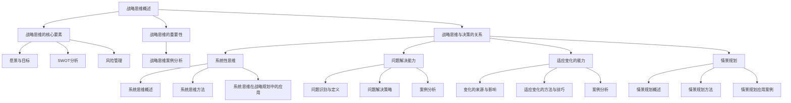

                 

### 文章标题：战略思维能力培养：具有战略思维、解决问题能力和持续适应变化的能力

### 关键词：战略思维，问题解决能力，适应变化，情景规划，系统性思维，企业战略，项目管理

### 摘要：
本文旨在深入探讨战略思维能力的培养及其在实际应用中的重要性。首先，我们概述了战略思维的概念及其在商业和个人成长中的关键作用。随后，文章详细讲解了战略思维的核心要素，包括愿景与目标、SWOT分析以及风险管理。接下来，我们探讨了系统性思维、问题解决能力和适应变化的方法，并通过实际案例展示了这些能力在战略规划中的运用。文章还介绍了情景规划的具体步骤和策略，并提供了培训和实践方法，帮助读者提升战略思维能力。最后，本文提出了战略思维能力培养的长期规划和可持续发展策略，强调了教育、团队协作和组织文化的重要性。

---

### 《战略思维能力培养：具有战略思维、解决问题能力和持续适应变化的能力》目录大纲

## 第一部分：战略思维概述

### 1.1 战略思维的重要性

#### 1.1.1 战略思维的定义

战略思维是指在面对复杂环境和长期目标时，运用系统性和前瞻性的思考方式，进行决策和规划的能力。

#### 1.1.2 战略思维在商业环境中的应用

战略思维在商业环境中尤为重要，它帮助企业识别机遇、规避风险，并在竞争中保持领先地位。

#### 1.1.3 战略思维对个人成长的影响

战略思维不仅对企业的成功至关重要，也对个人的职业发展和生活规划有着深远的影响。

### 1.2 战略思维与决策的关系

#### 1.2.1 决策过程的概述

决策过程通常包括问题识别、方案评估、选择方案和实施监控等阶段。

#### 1.2.2 战略思维在决策中的具体应用

战略思维可以帮助决策者更全面地评估各种因素，做出更明智的决策。

### 1.3 战略思维的核心要素

#### 1.3.1 愿景与目标

愿景是战略思维的起点，目标则是愿景的具体化。

#### 1.3.2 SWOT分析

SWOT分析是战略规划中的重要工具，用于评估企业的优势、劣势、机会和威胁。

#### 1.3.3 风险管理

风险管理是战略思维的核心要素之一，它涉及到对潜在风险的识别、评估和应对。

### 1.4 战略思维案例分析

#### 1.4.1 成功案例解析

通过对成功企业的战略思维案例进行分析，我们可以学习到宝贵的经验。

#### 1.4.2 失败案例分析

通过分析失败案例，我们可以了解战略思维失误的原因，并从中吸取教训。

## 第二部分：战略思维能力培养

### 2.1 系统性思维

#### 2.1.1 系统性思维概述

系统性思维是一种全局性、综合性的思考方式，它强调对复杂系统的理解和分析。

#### 2.1.2 系统性思维方法

系统性思维方法包括思维导图、系统动力学模型等，这些方法有助于我们更好地理解复杂系统。

#### 2.1.3 系统性思维在战略规划中的应用

系统性思维在战略规划中的应用可以帮助企业更全面地考虑各种因素，制定更有效的战略。

### 2.2 问题解决能力

#### 2.2.1 问题识别与定义

问题识别与定义是问题解决的第一个步骤，它决定了我们解决问题的方向。

#### 2.2.2 问题解决策略

问题解决策略包括分解问题、寻找解决方案、评估解决方案等步骤。

#### 2.2.3 案例分析：问题解决的最佳实践

通过实际案例的分析，我们可以了解如何有效解决问题。

### 2.3 适应变化的能力

#### 2.3.1 变化的来源与影响

变化的来源可以是技术进步、市场需求、政策变化等，它们对商业环境有着深远的影响。

#### 2.3.2 适应变化的方法与技巧

适应变化的方法与技巧包括持续学习、灵活调整、快速响应等。

#### 2.3.3 案例分析：适应变化的成功实践

通过分析成功企业如何适应变化，我们可以学习到有效的策略。

### 2.4 情景规划

#### 2.4.1 情景规划概述

情景规划是一种前瞻性的思考方式，它通过模拟可能的未来情景，帮助企业制定应对策略。

#### 2.4.2 情景规划方法

情景规划方法包括建立情景、分析情景、制定策略等步骤。

#### 2.4.3 情景规划应用案例

通过实际案例，我们可以了解情景规划的具体应用。

## 第三部分：战略思维能力培养实践

### 3.1 战略思维培训与实践

#### 3.1.1 培训方案设计

设计一个有效的战略思维培训方案是培养战略思维能力的关键。

#### 3.1.2 培训方法与工具

选择合适的培训方法和工具可以提高培训效果。

#### 3.1.3 培训效果评估

培训效果评估可以帮助我们了解培训的实际效果，并作出相应的调整。

### 3.2 战略思维在项目管理中的应用

#### 3.2.1 项目战略规划

项目战略规划是确保项目成功的重要环节。

#### 3.2.2 项目风险管理

项目风险管理是项目管理中的核心任务之一。

#### 3.2.3 项目沟通与协作

有效的沟通与协作是项目成功的关键。

### 3.3 战略思维在企业战略制定中的应用

#### 3.3.1 企业战略分析

企业战略分析是制定企业战略的基础。

#### 3.3.2 企业战略制定

企业战略制定是确保企业长期发展的关键。

#### 3.3.3 企业战略实施与调整

企业战略实施与调整是战略管理的重要环节。

## 第四部分：战略思维能力培养与持续发展

### 4.1 战略思维能力的提升路径

#### 4.1.1 个人学习与成长

个人学习与成长是提升战略思维能力的重要途径。

#### 4.1.2 团队建设与协作

团队建设与协作是提升战略思维能力的重要手段。

#### 4.1.3 组织文化与战略思维

组织文化与战略思维相互影响，共同促进战略思维能力的提升。

### 4.2 持续适应变化的策略

#### 4.2.1 市场趋势分析

市场趋势分析是适应变化的重要手段。

#### 4.2.2 竞争环境评估

竞争环境评估是制定适应策略的基础。

#### 4.2.3 变化应对策略

变化应对策略是确保企业适应变化的关键。

### 4.3 战略思维能力培养的可持续发展

#### 4.3.1 战略思维教育的持续推广

战略思维教育的持续推广是提升战略思维能力的重要措施。

#### 4.3.2 战略思维能力培养的长期规划

战略思维能力培养的长期规划是确保战略思维能力持续提升的关键。

#### 4.3.3 战略思维能力的可持续发展评估

战略思维能力的可持续发展评估是衡量战略思维能力提升效果的重要手段。

## 附录

### 附录 A：战略思维工具与方法

#### A.1 SWOT分析模板

#### A.2 情景规划模板

### 附录 B：参考资料

#### B.1 主要参考文献

#### B.2 相关网站与资源

#### B.3 战略思维相关书籍推荐

---

## 1.1 战略思维的重要性

### 1.1.1 战略思维的定义

战略思维是一种高层次、全方位、前瞻性的思考方式，它不仅仅关注短期利益，更强调长远规划和可持续发展。战略思维涉及对整体局势的把握、对复杂问题的分析以及对潜在机会与威胁的识别。它是一种系统性、动态性的思维模式，旨在帮助个体或组织在动态变化的环境中做出明智的决策。

战略思维与日常决策有显著区别。日常决策通常涉及日常生活中的小事，如购物、吃饭等，它们往往基于习惯或直觉。而战略思维则更加注重整体规划，考虑长远影响，并能够在复杂、不确定的环境中找到最佳的行动方案。战略思维不仅要求个体具备分析和判断的能力，还需要有较强的逻辑推理、预测能力和创造性思维。

### 1.1.2 战略思维在商业环境中的应用

在商业环境中，战略思维具有至关重要的意义。一个企业的成功与否，往往取决于其战略规划的正确性和执行力。战略思维能够帮助企业在激烈的市场竞争中找到自己的定位，制定合适的经营策略，并有效应对市场变化。具体来说，战略思维在商业环境中的应用包括以下几个方面：

1. **市场定位**：战略思维可以帮助企业分析市场需求和竞争对手，找到自己独特的市场定位，从而在竞争中获得优势。
   
2. **资源配置**：通过战略思维，企业能够合理配置资源，确保资源投入到最有效的领域，提高整体运营效率。

3. **风险管理**：战略思维能够帮助企业识别潜在风险，并制定相应的应对措施，降低风险对企业的负面影响。

4. **创新驱动**：战略思维鼓励企业不断进行创新，开发新产品或服务，以适应市场变化和客户需求。

5. **长期规划**：战略思维强调长期规划，确保企业能够持续发展，而不仅仅是追求短期利润。

### 1.1.3 战略思维对个人成长的影响

战略思维不仅仅对企业具有重要作用，对个人的职业发展和生活规划也有着深远的影响。在职业发展中，战略思维可以帮助个人明确自己的职业目标，制定可行的职业规划，并在面对职业挑战时做出明智的决策。具体来说，战略思维对个人成长的影响包括：

1. **职业规划**：战略思维能够帮助个人分析自己的优势和不足，制定符合自己兴趣和能力的职业规划。

2. **决策能力**：战略思维锻炼了个人的分析判断能力，使个人在面对复杂问题时能够做出更明智的决策。

3. **持续学习**：战略思维强调持续学习和自我提升，使个人能够不断适应职业环境的变化。

4. **人际关系**：战略思维有助于个人在团队合作中发挥更好的作用，提升人际沟通和协作能力。

5. **心理健康**：战略思维能够帮助个人更好地应对压力和挑战，保持积极的心态，提高心理健康水平。

总之，战略思维是一种重要的思维模式，它不仅对企业的发展有着深远的影响，也对个人的成长和幸福生活具有重要意义。通过培养战略思维，个人和企业都能够更好地应对未来的挑战，实现长期的目标和愿景。

### 1.2 战略思维与决策的关系

战略思维与决策之间有着紧密的联系。决策是战略思维的核心组成部分，而战略思维则为决策提供了理论指导和实践基础。为了深入理解这种关系，我们需要先了解决策过程的各个阶段，并探讨战略思维在各个阶段的具体应用。

#### 1.2.1 决策过程的概述

决策过程通常包括以下几个阶段：

1. **问题识别**：在决策过程中，首先需要识别问题或机会。这包括明确当前状况与期望目标之间的差距，以及潜在的问题和挑战。

2. **信息收集**：一旦问题被识别，接下来需要收集与问题相关的信息。这包括市场数据、竞争信息、内部资源等。

3. **方案评估**：在收集到足够的信息后，需要评估不同的解决方案。这包括分析每个方案的优点、缺点、成本和潜在风险。

4. **方案选择**：在评估了所有可能的方案后，决策者需要选择最佳的方案。

5. **实施监控**：最后，决策需要付诸实施，并且在整个实施过程中，需要对决策的效果进行监控和调整。

#### 1.2.2 战略思维在决策中的具体应用

战略思维在决策过程中起着至关重要的作用，以下是其具体应用：

1. **全局性思考**：战略思维强调从整体的角度看待问题，而不仅仅是关注局部。这种全局性思考可以帮助决策者在面对复杂问题时，能够更全面地考虑各种因素。

2. **前瞻性规划**：战略思维鼓励决策者具备前瞻性，能够预见未来的变化和趋势。这种前瞻性规划有助于制定长期战略，确保企业在未来竞争中保持优势。

3. **系统性分析**：战略思维强调对系统进行系统性分析，这包括了解系统内部各个部分之间的相互作用和影响。这种系统性分析有助于识别潜在的问题和风险。

4. **风险评估**：战略思维强调对风险进行评估和管理。通过系统性的风险评估，决策者可以识别和量化潜在的风险，并制定相应的应对策略。

5. **创造性思维**：战略思维鼓励创造性思维，这包括探索新的解决方案和策略。创造性思维有助于突破传统思维的局限，寻找创新的解决方案。

#### 1.2.3 战略思维与直觉决策的比较

与直觉决策相比，战略思维具有以下优势：

1. **系统性**：战略思维更加系统化，它通过理性分析和逻辑推理，确保决策过程的科学性。

2. **前瞻性**：战略思维强调前瞻性规划，能够预见未来的变化和趋势，而直觉决策往往更注重当前的情况。

3. **全面性**：战略思维能够全面考虑各种因素，包括潜在的机遇和风险，而直觉决策则可能受到个人经验或情绪的影响。

4. **风险控制**：战略思维通过系统性的风险评估，能够更好地控制风险，而直觉决策往往缺乏对风险的全面评估。

5. **长期导向**：战略思维注重长期规划，确保企业或个人能够持续发展，而直觉决策更注重短期效益。

尽管战略思维具有诸多优势，但它在实际应用中也面临一些挑战，如信息不完备、时间压力和资源限制等。因此，在决策过程中，需要结合具体情况，合理运用战略思维和直觉决策，以实现最佳效果。

### 1.3 战略思维的核心要素

战略思维是一种复杂的思维方式，它需要多个核心要素的支撑。以下将详细介绍战略思维中的三个核心要素：愿景与目标、SWOT分析和风险管理。

#### 1.3.1 愿景与目标

愿景是战略思维的起点，它是对未来的一种理想化描述，是一种激发动力和指引方向的重要工具。一个明确的愿景可以帮助企业和个人确定长远目标，并在实践中保持一致性和连续性。

**愿景的定义**：
愿景（Vision）是对未来可能达到的状态的一种描述，它通常具有激励性和指导性。一个良好的愿景应该是清晰、具体和可实现的。

**愿景的重要性**：
- **指引方向**：愿景为企业和个人提供了明确的目标和方向，确保所有行动都与长期目标保持一致。
- **激发动力**：一个有吸引力的愿景能够激发团队成员和个人的工作热情，提高工作效率和创造力。
- **凝聚力量**：愿景能够凝聚团队力量，使所有成员朝着共同的目标努力，增强团队凝聚力。

**愿景的制定**：
制定愿景通常需要以下几个步骤：
1. **明确目标**：首先，要明确企业或个人想要达到的目标，这可以是短期的也可以是长期的。
2. **分析现状**：接下来，要分析当前的状况，包括内部资源和外部环境，以确定实现目标的可行性和挑战。
3. **制定愿景**：基于上述分析，制定一个具有激励性和指导性的愿景。
4. **传播愿景**：将愿景传达给所有团队成员，确保他们理解和认同愿景。

**目标（Goals）**：
目标是对愿景的具体化，是愿景实现过程中的阶段性成果。一个有效的目标应该具备以下几个特征：
- **具体性**：目标应该是明确、具体的，而不是模糊的。
- **可衡量性**：目标应该能够量化，以便于评估进展和效果。
- **实现性**：目标应该是可实现和有挑战性的，以激发个人和团队的潜力。
- **时限性**：目标应该有明确的时间限制，以推动行动和落实。

**目标设定（Goal Setting）**：
设定目标通常遵循SMART原则，即目标应该是具体的（Specific）、可衡量的（Measurable）、可实现的（Achievable）、相关的（Relevant）和时限的（Time-bound）。

**愿景与目标的关系**：
愿景是目标设定的基础，它为目标的设定提供了方向和框架。目标则是愿景的具体体现，是实现愿景过程中的阶段性任务。

#### 1.3.2 SWOT分析

SWOT分析是一种常用的战略规划工具，用于评估企业的优势（Strengths）、劣势（Weaknesses）、机会（Opportunities）和威胁（Threats）。通过SWOT分析，企业可以更全面地了解自身状况，制定更有效的战略。

**SWOT分析的定义**：
SWOT分析是一种评估企业内外部环境的工具，它通过识别企业的优势、劣势、机会和威胁，帮助企业制定战略规划。

**SWOT分析的应用**：
- **战略规划**：SWOT分析可以帮助企业在战略规划过程中，全面评估自身的优势和劣势，抓住机会并应对威胁。
- **市场分析**：在市场分析中，SWOT分析可以帮助企业识别竞争对手的优势和劣势，以及市场中的机会和威胁。
- **资源配置**：通过SWOT分析，企业可以更合理地配置资源，将资源投入到最有价值的领域。

**SWOT分析的内容**：

1. **优势（Strengths）**：
   - **定义**：优势是企业内部具有的，能够帮助企业在市场中竞争的资源和能力。
   - **内容**：包括企业的核心竞争力、独特资源、技术优势、品牌优势等。

2. **劣势（Weaknesses）**：
   - **定义**：劣势是企业内部存在的，可能限制企业发展的资源和能力。
   - **内容**：包括企业的管理问题、技术短板、市场定位不准确等。

3. **机会（Opportunities）**：
   - **定义**：机会是企业外部环境中存在的，能够为企业带来竞争优势的机遇。
   - **内容**：包括市场需求增长、技术进步、政策支持、合作伙伴等。

4. **威胁（Threats）**：
   - **定义**：威胁是企业外部环境中存在的，可能对企业造成不利影响的因素。
   - **内容**：包括市场竞争加剧、政策变化、技术风险、供应链问题等。

**SWOT分析的步骤**：
1. **识别优势与劣势**：通过内部调查和分析，识别企业内部的优势和劣势。
2. **识别机会与威胁**：通过外部市场调查和分析，识别企业外部的机会和威胁。
3. **匹配与策略制定**：将优势与机会、劣势与威胁进行匹配，制定相应的战略。

**SWOT分析的模板**：

```
优势（Strengths）：
- 核心竞争力
- 独特资源
- 技术优势
- 品牌优势

劣势（Weaknesses）：
- 管理问题
- 技术短板
- 市场定位不准确

机会（Opportunities）：
- 市场需求增长
- 技术进步
- 政策支持
- 合作伙伴

威胁（Threats）：
- 市场竞争加剧
- 政策变化
- 技术风险
- 供应链问题
```

#### 1.3.3 风险管理

风险管理是战略思维的重要组成部分，它涉及到对企业可能面临的风险进行识别、评估和应对。有效的风险管理可以帮助企业降低风险，确保业务的连续性和稳定性。

**风险管理的定义**：
风险管理（Risk Management）是指企业识别、评估和应对潜在风险的过程，目的是降低风险对企业的不利影响，确保业务的稳定运行。

**风险管理的步骤**：

1. **风险识别**：通过调查和分析，识别企业可能面临的风险。
2. **风险评估**：对识别出的风险进行评估，确定其严重性和发生概率。
3. **风险应对**：根据风险评估结果，制定相应的应对策略，包括风险规避、风险转移、风险缓解等。
4. **风险监控**：在风险应对过程中，对风险进行监控和调整，确保应对策略的有效性。

**风险管理的工具和方法**：

1. **风险矩阵**：通过风险矩阵，对风险的严重性和发生概率进行评估，确定风险的优先级。
2. **风险评估模型**：使用风险评估模型，对风险进行量化评估，为风险应对提供数据支持。
3. **应急预案**：制定应急预案，确保在风险发生时，能够迅速响应和应对。

**风险管理的重要性**：

1. **保障业务连续性**：有效的风险管理可以确保企业在面对风险时，能够保持业务的连续性，降低风险对企业的影响。
2. **降低成本**：通过提前识别和评估风险，企业可以减少因风险发生而产生的额外成本。
3. **增强竞争力**：风险管理有助于企业识别和利用潜在的机会，提高竞争力。
4. **提升企业声誉**：有效的风险管理可以提高企业的声誉，增强投资者和客户的信任。

### 1.4 战略思维案例分析

#### 1.4.1 成功案例解析

通过分析成功企业的战略思维案例，我们可以学习到如何在实际环境中运用战略思维，实现企业的长期发展。

**案例1：苹果公司的创新战略**

苹果公司通过不断推出创新产品，如iPhone、iPad和Mac等，成为全球科技行业的领军企业。苹果公司的成功主要归功于其独特的战略思维，包括：

- **前瞻性规划**：苹果公司能够预见市场趋势，提前布局新产品。
- **技术创新**：苹果公司注重技术研发，持续推动技术创新。
- **用户体验**：苹果公司注重用户体验，确保产品易于使用，提供卓越的用户体验。

**案例2：阿里巴巴的电子商务战略**

阿里巴巴通过其电商平台，成功构建了一个庞大的电子商务生态系统。阿里巴巴的战略思维包括：

- **市场定位**：阿里巴巴精准定位市场需求，提供多样化的电子商务服务。
- **生态系统建设**：通过平台化和生态系统建设，阿里巴巴吸引了大量商家和消费者。
- **国际化扩展**：阿里巴巴积极开拓国际市场，实现全球布局。

#### 1.4.2 失败案例分析

通过分析失败企业的战略思维案例，我们可以了解战略思维失误的原因，并从中吸取教训。

**案例1：诺基亚的衰落**

诺基亚曾是手机行业的领导者，但未能及时适应智能手机市场的变化，最终导致了衰落。诺基亚的战略思维失误包括：

- **缺乏前瞻性**：诺基亚未能预见智能手机市场的兴起，错失了转型机会。
- **创新不足**：诺基亚在技术创新方面投入不足，导致产品竞争力下降。
- **市场定位错误**：诺基亚在高端市场和低端市场之间的定位不清，无法满足不同市场需求。

**案例2：黑莓的困境**

黑莓曾凭借其安全性能和商务功能，在手机市场上占据重要地位。但未能及时调整战略，导致市场地位被苹果和安卓手机所取代。黑莓的战略思维失误包括：

- **过度依赖现有市场**：黑莓未能及时开拓新市场，依赖现有市场的稳定收入。
- **创新不足**：黑莓在技术创新方面投入不足，无法满足用户对智能手机功能的需求。
- **产品同质化**：黑莓的产品在功能上与其他手机品牌相似，缺乏独特性。

### 1.4.3 从成功与失败中学习

通过以上案例分析，我们可以得出以下结论：

- **前瞻性规划**：成功企业能够预见市场变化，提前布局新产品。
- **技术创新**：技术创新是企业持续竞争力的关键。
- **用户体验**：用户体验是企业赢得市场的关键。
- **市场定位**：明确的市场定位有助于企业抓住机遇。
- **灵活调整**：面对市场变化，企业需要具备灵活调整战略的能力。

通过学习和借鉴成功企业的经验，以及从失败案例中吸取教训，企业可以更好地运用战略思维，实现长期发展。

## 2.1 系统性思维

### 2.1.1 系统性思维概述

系统性思维是一种全局性、综合性、动态性的思维方式，它强调对复杂系统的理解和管理。与传统的线性思维不同，系统性思维更加注重整体性、相互关联性和动态变化。它能够帮助我们更好地应对复杂问题，提高决策的质量和效率。

#### 系统性思维的定义

系统性思维（Systems Thinking）是一种理解复杂系统的思考方式，它强调系统内部各个部分之间的相互关系和动态变化。系统性思维关注系统的整体性，认为系统中的每个部分都是相互关联的，一个部分的变化会影响到整个系统的运行。

#### 系统性思维的重要性

系统性思维在战略规划中具有重要作用。它能够帮助决策者更全面地分析问题，识别潜在的风险和机会，制定更有效的战略。以下是系统性思维的重要性：

1. **整体性思考**：系统性思维强调从整体的角度看待问题，而不是仅仅关注局部。这种整体性思考有助于识别系统中的关键因素，并理解各个因素之间的相互关系。

2. **动态性分析**：系统性思维关注系统的动态变化，能够预见未来的变化趋势，为决策者提供前瞻性指导。

3. **风险评估**：通过系统性思维，决策者能够更准确地评估风险，并制定相应的应对策略。

4. **创新驱动**：系统性思维鼓励创新，通过探索系统的不同组成部分和相互作用，发现新的解决方案。

#### 系统性思维的发展历程

系统性思维的发展历程可以追溯到20世纪中叶。以下是一些重要的里程碑：

- **1950年代**：系统理论的创始人之一，俄国生物学家巴甫洛夫提出了“系统论”的概念，强调了系统内部各个部分之间的相互关系。

- **1960年代**：美国科学家伊萨克·阿西莫夫发表了一系列关于系统思维的论文，提出了“系统思维”的概念。

- **1970年代**：系统动力学模型（System Dynamics Model）被提出，用于模拟复杂系统的动态行为。

- **1980年代**：彼得·谢林在《复杂系统：它们是如何工作的？》一书中，系统地阐述了系统性思维的原理和应用。

- **1990年代**：彼得·圣吉在《第五项修炼》中提出了“学习型组织”的概念，强调了系统性思维在组织管理中的重要性。

#### 系统性思维的适用范围

系统性思维广泛应用于各个领域，包括商业、工程、医学、社会问题等。以下是一些系统性思维的典型应用场景：

1. **商业战略**：系统性思维可以帮助企业从整体上分析市场环境，识别竞争优势，制定长期战略。

2. **项目管理**：在项目管理中，系统性思维有助于识别项目中的关键因素，确保项目目标的实现。

3. **环境管理**：在环境保护领域，系统性思维可以帮助制定更全面的环境政策，解决环境问题。

4. **公共卫生**：在公共卫生领域，系统性思维有助于分析传染病的传播机制，制定有效的防控措施。

### 2.1.2 系统性思维方法

系统性思维方法是一系列工具和技术，用于理解和分析复杂系统。以下是一些常见的系统性思维方法：

#### 思维导图

思维导图（Mind Map）是一种用于组织和展示信息的方法，它通过图像、颜色和关键词来呈现思维过程。思维导图可以帮助我们更清晰地理解复杂系统的各个部分及其相互关系。

**步骤**：

1. **确定中心主题**：首先确定思维导图的中心主题，这通常是我们要解决的问题或主题。

2. **分支扩展**：从中心主题出发，画出主要的分支，每个分支代表一个关键概念或子主题。

3. **填充细节**：在每个分支下，填充相关的细节信息，可以使用图像、颜色和关键词来增强记忆和理解。

4. **连接关系**：将各个分支和细节信息进行连接，展示它们之间的相互关系。

**示例**：

假设我们要分析一个公司的运营系统，我们可以将中心主题设为“公司运营”，然后画出主要的分支，如“供应链管理”、“人力资源管理”、“市场营销”等。在每个分支下，填充相关的子主题和细节信息，如“供应链管理”下的“供应商选择”、“库存管理”等。

#### 系统动力学模型

系统动力学模型（System Dynamics Model）是一种用于模拟复杂系统动态行为的模型。它通过数学方程和反馈机制来描述系统的运行状态和变化过程。

**步骤**：

1. **确定系统边界**：首先明确系统的边界，即系统包含哪些部分，哪些部分被视为外部环境。

2. **定义变量和参数**：识别系统中的关键变量和参数，并定义它们的数学关系。

3. **建立模型方程**：根据变量和参数之间的关系，建立系统的数学模型。

4. **模拟运行**：使用计算机软件进行模拟，观察系统在不同条件下的运行状态和变化趋势。

**示例**：

假设我们要分析一个生态系统的动态行为，我们可以确定系统边界为“捕食者-被捕食者系统”，定义关键变量如“捕食者数量”、“被捕食者数量”等，并建立它们的数学关系。通过模拟运行，我们可以观察捕食者和被捕食者数量在不同条件下的变化趋势。

### 2.1.3 系统性思维在战略规划中的应用

系统性思维在战略规划中具有重要作用，它可以帮助企业更全面地分析市场环境，识别竞争优势，制定长期战略。以下是一些系统性思维在战略规划中的应用：

#### 市场环境分析

通过系统性思维，企业可以全面分析市场环境，识别机会和威胁。以下是一种市场环境分析的方法：

1. **PEST分析**：使用PEST分析（政治、经济、社会、技术）来识别外部环境中的关键因素。

2. **SWOT分析**：结合内部优势、劣势和外部机会、威胁，评估企业的市场地位和竞争环境。

3. **五力模型**：使用五力模型（供应商、买家、潜在竞争者、替代品、行业竞争者）来分析行业的竞争态势。

4. **趋势分析**：分析市场趋势，如消费者需求变化、技术发展等，预测未来的市场环境。

#### 竞争战略分析

通过系统性思维，企业可以更全面地分析竞争对手的优势和劣势，制定有效的竞争战略。以下是一种竞争战略分析的方法：

1. **SWOT分析**：对每个竞争对手进行SWOT分析，识别其优势和劣势。

2. **价值链分析**：分析竞争对手的价值链，识别其核心竞争力和成本优势。

3. **差异化战略**：通过差异化和成本领先战略，确定企业在市场中的竞争优势。

4. **创新战略**：分析竞争对手的创新策略，探索企业如何通过创新获得竞争优势。

#### 长期战略规划

通过系统性思维，企业可以制定更全面的长期战略规划，确保企业的持续发展和竞争力。以下是一种长期战略规划的方法：

1. **愿景与目标**：明确企业的愿景和目标，确保战略规划的长期导向。

2. **资源分配**：根据战略目标，合理分配资源，确保资源投入的高效性。

3. **风险管理**：识别潜在风险，制定风险应对策略，确保战略规划的稳定性。

4. **动态调整**：根据市场变化和内部环境的变化，动态调整战略规划，确保战略的灵活性。

### 案例分析：系统性思维在战略规划中的应用

以下是一个案例分析，展示了系统性思维在战略规划中的应用：

**案例：可口可乐公司的战略规划**

可口可乐公司是一家全球性的饮料公司，通过系统性思维，它成功制定了长期战略规划，保持了在市场中的领先地位。

1. **市场环境分析**：可口可乐公司通过PEST分析、SWOT分析和五力模型，全面分析市场环境，识别机会和威胁。

2. **竞争战略分析**：可口可乐公司通过SWOT分析和价值链分析，识别竞争对手的优势和劣势，并制定差异化战略。

3. **长期战略规划**：可口可乐公司明确了其愿景和目标，如扩大市场份额、提升品牌价值等，并制定了相应的战略规划。

4. **资源分配**：可口可乐公司根据战略目标，合理分配资源，如投资于新产品的研发、市场营销和供应链管理等。

5. **风险管理**：可口可乐公司识别潜在风险，如市场变化、政策变化等，并制定了相应的风险应对策略。

6. **动态调整**：可口可乐公司根据市场变化和内部环境的变化，动态调整战略规划，确保战略的灵活性。

通过系统性思维，可口可乐公司能够全面分析市场环境，制定有效的竞争战略，并确保战略规划的长期导向和灵活性，从而保持了在市场中的领先地位。

### 总结

系统性思维是一种全局性、综合性、动态性的思维方式，它强调对复杂系统的理解和管理。在战略规划中，系统性思维具有重要作用，它能够帮助决策者更全面地分析市场环境，识别竞争优势，制定长期战略。通过学习系统性思维的方法和应用，企业可以更有效地应对复杂问题，提高决策的质量和效率，实现持续发展和竞争力。

## 2.2 问题解决能力

### 2.2.1 问题识别与定义

问题解决能力是战略思维的重要组成部分，它涉及到如何识别问题、定义问题以及将问题分解为可管理的部分。一个有效的问题解决过程需要精确地识别问题，明确问题的性质和范围，以便制定合适的解决方案。

#### 问题识别

问题识别是问题解决的第一步，它要求我们能够准确地识别出问题的存在。以下是一些问题识别的方法：

1. **定期审查**：通过定期审查业务流程、绩效指标和客户反馈，可以发现潜在的问题。

2. **客户反馈**：客户反馈是识别问题的直接来源，通过分析客户投诉、建议和满意度调查，可以识别出存在的问题。

3. **数据分析**：使用数据分析工具，如数据可视化、统计分析和趋势分析，可以从数据中发现异常和问题。

4. **员工反馈**：员工是业务流程的一部分，他们可能能够提供关于流程瓶颈、效率低下等方面的见解。

#### 问题定义

一旦问题被识别出来，接下来需要对其进行定义。问题定义的目的是明确问题的性质、范围和影响。以下是问题定义的步骤：

1. **明确问题的本质**：理解问题的根本原因，而不仅仅是表面现象。

2. **确定问题的影响**：评估问题对企业运营、财务绩效、客户满意度等方面的潜在影响。

3. **定义问题的范围**：明确问题的具体范围，包括受影响的业务领域、时间范围和涉及的人员。

4. **记录问题**：将问题描述清楚，并记录在案，以便后续分析和处理。

#### 将问题分解为可管理的部分

将问题分解为可管理的部分是问题解决的重要步骤，它有助于将复杂的问题转化为具体的、可执行的解决方案。以下是将问题分解为可管理部分的步骤：

1. **确定关键问题**：识别问题中的关键部分，这些部分对解决问题至关重要。

2. **制定子目标**：将大问题分解为一系列子目标，每个子目标都是可管理的，并且与最终问题解决方案相一致。

3. **分配责任**：为每个子目标分配责任，确保每个部分都有人负责。

4. **制定行动计划**：为每个子目标制定详细的行动计划，包括具体的行动步骤、负责人员和时间表。

#### 工具与方法

为了更有效地识别和定义问题，我们可以使用以下工具和方法：

- **五问法**（5 Whys）：通过连续追问“为什么”，深入挖掘问题的根本原因。
- **鱼骨图**（Ishikawa Diagram）：用于分析问题的原因和结果，将问题分解为各个因素。
- **因果图**（Cause and Effect Diagram）：用于展示问题的各种可能原因及其相互关系。

### 案例分析：问题识别与定义

**案例1：企业销售下降**

某企业发现其销售额持续下降，首先需要识别问题。通过数据分析，发现几个关键点：

- 客户满意度下降
- 市场份额减少
- 竞争对手的新产品上市

接着，企业对问题进行定义：

- **本质**：销售额下降的根本原因是客户流失和市场份额减少。
- **影响**：销售额下降直接影响企业的盈利能力和市场地位。
- **范围**：问题影响所有业务部门，尤其是销售和市场部门。

通过以上分析，企业将问题分解为：

1. **客户满意度下降**：分析客户反馈，找出具体原因。
2. **市场份额减少**：分析竞争对手的动态，找出市场份额下降的原因。
3. **新产品上市**：评估新产品对企业现有产品的冲击。

**案例2：生产效率低下**

某企业发现其生产效率低下，首先需要识别问题。通过定期审查和员工反馈，发现几个关键点：

- 设备故障频繁
- 工人操作不规范
- 生产流程不合理

接着，企业对问题进行定义：

- **本质**：生产效率低下的根本原因是设备故障、工人操作不规范和生产流程不合理。
- **影响**：生产效率低下导致成本增加，产品质量不稳定，影响交货期。
- **范围**：问题影响整个生产流程，涉及设备管理、工人培训和流程优化。

通过以上分析，企业将问题分解为：

1. **设备故障频繁**：分析设备维护记录，找出设备故障的频繁原因。
2. **工人操作不规范**：通过观察工人操作，找出不规范操作的常见问题。
3. **生产流程不合理**：通过流程图，找出生产流程中的瓶颈和优化空间。

### 2.2.2 问题解决策略

一旦问题被识别和定义，接下来需要制定问题解决策略。问题解决策略包括以下几个步骤：

#### 1. 分析问题

在制定解决方案之前，需要对问题进行深入分析。分析问题的目的是理解问题的本质、原因和影响。以下是一些常用的分析方法：

- **五问法**：通过连续追问“为什么”，深入挖掘问题的根本原因。
- **鱼骨图**：将问题分解为各个因素，分析各因素之间的关系。
- **因果图**：展示问题的各种可能原因及其相互关系。

#### 2. 寻找解决方案

在分析问题之后，接下来需要寻找可能的解决方案。以下是一些寻找解决方案的方法：

- **头脑风暴**：通过集体头脑风暴，激发创意，生成多种可能的解决方案。
- **SWOT分析**：分析每个解决方案的优势、劣势、机会和威胁。
- **模拟测试**：对每个解决方案进行模拟测试，评估其实际效果。

#### 3. 选择最佳方案

在找到多个解决方案之后，需要选择最佳方案。选择最佳方案应考虑以下几个因素：

- **可行性**：解决方案是否可行，是否有足够的资源和技术支持。
- **效果**：解决方案能否有效解决问题，达到预期目标。
- **成本**：解决方案的成本是否在预算范围内。
- **风险**：解决方案可能带来的风险和潜在问题。

#### 4. 制定行动计划

一旦选择最佳方案，接下来需要制定详细的行动计划。行动计划应包括以下几个部分：

- **目标**：明确解决方案的目标和预期结果。
- **步骤**：详细描述实现解决方案的步骤和流程。
- **责任**：为每个步骤分配责任，明确负责人。
- **时间表**：设定明确的时间表，确保每个步骤按时完成。

#### 5. 实施与监控

在制定行动计划之后，需要开始实施解决方案，并对实施过程进行监控。以下是一些实施与监控的方法：

- **项目管理工具**：使用项目管理工具，如Gantt图、任务管理软件等，确保行动计划按时完成。
- **进度报告**：定期报告进度，确保所有参与人员了解项目进展情况。
- **反馈与调整**：根据实际进展情况，及时反馈和调整行动计划，确保解决方案的有效性。

### 案例分析：问题解决策略

**案例1：企业销售下降**

为了解决销售额下降的问题，企业制定了以下问题解决策略：

1. **分析问题**：通过五问法、鱼骨图和因果图，分析了客户满意度下降、市场份额减少和新产品上市等因素。

2. **寻找解决方案**：通过头脑风暴和SWOT分析，提出了以下解决方案：

   - 提升客户满意度
   - 加强市场推广
   - 开发新产品

3. **选择最佳方案**：综合考虑可行性、效果、成本和风险，选择了以下最佳方案：

   - 提升客户满意度：通过改进服务质量、加强客户关怀等措施。
   - 加强市场推广：通过增加广告投放、开展促销活动等措施。
   - 开发新产品：根据市场需求，开发满足客户期望的新产品。

4. **制定行动计划**：制定了详细的行动计划，包括以下步骤：

   - 提升客户满意度：定期进行客户满意度调查，改进服务质量，加强客户关怀。
   - 加强市场推广：增加广告投放，开展促销活动，提高品牌知名度。
   - 开发新产品：成立新产品开发团队，根据市场需求，开发新产品。

5. **实施与监控**：通过项目管理工具，如Gantt图，监控项目进度，确保行动计划按时完成。同时，定期报告进度，及时反馈和调整。

**案例2：生产效率低下**

为了解决生产效率低下的问题，企业制定了以下问题解决策略：

1. **分析问题**：通过五问法、鱼骨图和因果图，分析了设备故障频繁、工人操作不规范和生产流程不合理等因素。

2. **寻找解决方案**：通过头脑风暴和SWOT分析，提出了以下解决方案：

   - 设备维护和升级
   - 工人培训
   - 流程优化

3. **选择最佳方案**：综合考虑可行性、效果、成本和风险，选择了以下最佳方案：

   - 设备维护和升级：定期进行设备维护，升级老旧设备，提高设备可靠性。
   - 工人培训：开展工人培训，提高操作技能和规范意识。
   - 流程优化：优化生产流程，减少瓶颈和浪费，提高生产效率。

4. **制定行动计划**：制定了详细的行动计划，包括以下步骤：

   - 设备维护和升级：制定设备维护计划，定期检查和维修设备，升级关键设备。
   - 工人培训：制定培训计划，开展技能培训，提高工人操作技能和规范意识。
   - 流程优化：通过流程图分析，找出瓶颈和浪费点，制定优化方案。

5. **实施与监控**：通过项目管理工具，如任务管理软件，监控项目进度，确保行动计划按时完成。同时，定期报告进度，及时反馈和调整。

### 总结

问题解决能力是战略思维的重要组成部分，它涉及到如何识别问题、定义问题以及将问题分解为可管理的部分。通过系统性地分析和选择解决方案，企业可以有效地解决问题，提高运营效率和市场竞争力。通过实际案例分析，我们可以看到问题解决策略的有效性和实用性。

### 2.3 适应变化的能力

在当今快速变化的商业环境中，适应变化的能力变得愈发重要。企业需要能够迅速响应外部环境的变动，调整战略和运营模式，以保持竞争力。以下将详细讨论变化的来源与影响，以及适应变化的方法与技巧。

#### 2.3.1 变化的来源

变化可以来自多个方面，包括技术进步、市场需求、政策变化、社会文化因素等。以下是一些主要的变化来源：

1. **技术进步**：科技的快速发展不断推动新的技术革命，如人工智能、大数据、物联网等，这些新技术不仅改变了企业的运营方式，也改变了消费者的行为和需求。

2. **市场需求**：消费者需求的不断变化是企业面临的主要挑战之一。随着消费者对产品质量、服务体验和个人化的追求，企业需要不断调整产品和服务以满足这些需求。

3. **政策变化**：政府的政策变化，如税收政策、贸易政策、环境法规等，对企业运营有着直接和深远的影响。企业需要密切关注政策变化，确保合规运营。

4. **社会文化因素**：社会文化的变迁，如消费观念、价值观等，也会影响企业的运营策略。例如，可持续发展理念日益受到重视，企业需要考虑如何在运营中融入社会责任。

#### 2.3.2 变化的影响

变化对企业的各个方面都有着深远的影响，包括运营、战略、财务等。以下是一些主要的影响：

1. **运营影响**：技术变化可能要求企业改变生产流程、供应链管理方式，甚至改变整个业务模式。市场需求的变化可能要求企业调整产品线或服务组合。

2. **战略影响**：企业需要重新评估其战略方向，确保其与市场变化保持同步。这可能包括重新定位市场、调整竞争策略或开发新的业务领域。

3. **财务影响**：变化可能导致企业的成本结构发生变化，如技术投资、员工培训费用等。同时，市场需求的变化也可能影响销售收入和盈利能力。

#### 2.3.3 适应变化的方法与技巧

为了有效适应变化，企业可以采取以下方法和技巧：

1. **持续学习与培训**：企业应鼓励员工持续学习和培训，提高对新技术和市场的理解能力。这可以通过内部培训、在线学习平台、外部研讨会等方式实现。

2. **敏捷管理**：采用敏捷管理方法，如敏捷开发、精益生产等，可以提高企业对变化的响应速度。这种方法强调快速迭代和持续改进，有助于企业迅速调整策略。

3. **创新文化**：建立创新文化，鼓励员工提出新想法和解决方案，可以激发企业的创新能力，使企业更具适应性。

4. **灵活的组织结构**：灵活的组织结构有助于企业快速调整资源分配和决策流程。例如，采用扁平化管理结构，减少决策层次，可以提高决策效率。

5. **市场趋势分析**：定期进行市场趋势分析，了解消费者需求和市场动态，有助于企业提前预见变化并做好准备。

#### 2.3.4 案例分析：适应变化的成功实践

**案例1：特斯拉的灵活应对**

特斯拉作为新能源汽车行业的领导者，其成功很大程度上归功于其灵活应对市场变化的能力。以下是其适应变化的几个关键措施：

- **技术创新**：特斯拉不断投资于新技术研发，如电池技术、自动驾驶技术等，保持技术领先地位。
- **快速迭代**：特斯拉采用敏捷开发方法，迅速将新技术应用到产品中，不断推出新款电动汽车。
- **市场定位**：特斯拉通过精准的市场定位，满足高端消费者对环保、高性能汽车的需求。
- **灵活供应链**：特斯拉通过全球布局和合作伙伴关系，灵活调整供应链，确保生产效率。

**案例2：IBM的转型之路**

IBM在经历了传统的硬件业务下滑后，通过一系列战略调整成功实现了转型。以下是其适应变化的关键步骤：

- **战略调整**：IBM从硬件制造商转型为云计算和人工智能服务提供商，抓住了新市场的机遇。
- **技术创新**：IBM持续投资于云计算、大数据、人工智能等新技术，推动业务转型。
- **人才培养**：IBM通过内部培训和外部招聘，吸引了大量技术人才，提高了企业创新能力。
- **市场开拓**：IBM通过全球市场开拓，扩大了其业务范围，增加了收入来源。

### 总结

适应变化的能力是企业长期发展的关键。通过持续学习、敏捷管理、创新文化和灵活的组织结构，企业可以更好地应对外部环境的变化，保持竞争力和可持续发展。通过实际案例的分析，我们可以看到成功的企业是如何通过适应变化来保持领先地位的。未来，企业需要不断关注市场变化，灵活调整战略，以应对不断变化的外部环境。

### 2.4 情景规划

情景规划是一种前瞻性思考方法，通过模拟不同的未来情景，帮助企业制定应对策略，提高适应变化的能力。情景规划不仅可以帮助企业预测未来，还能提供应对不确定性的策略。以下将详细讨论情景规划的定义、方法及应用案例。

#### 2.4.1 情景规划概述

情景规划（Scenario Planning）是一种通过构建多个可能未来的情景，帮助决策者更好地理解和应对未来不确定性的策略。与传统的预测方法不同，情景规划不是单一的未来预测，而是通过构建多个不同的情景，提供多种可能的未来路径和应对策略。

**情景规划的定义**：
情景规划是一种前瞻性思考方法，通过构建可能的未来情景，帮助决策者更好地理解和应对未来变化。

**情景规划的重要性**：
情景规划的重要性在于：
- **增强适应性**：通过多种情景的模拟，企业可以更好地了解各种可能的变化，从而制定更灵活的应对策略。
- **提升决策质量**：情景规划提供了一种系统性思考的方式，帮助决策者从不同角度分析问题，制定更全面的决策。
- **促进创新**：情景规划鼓励企业探索不同的未来路径，激发创新思维，找到新的商机和解决方案。

#### 2.4.2 情景规划方法

情景规划包括以下几个步骤：

1. **情景设定**：
   情景设定是情景规划的第一步，旨在构建可能的未来情景。常见的情景设定方法包括：

   - **SWOT分析**：通过SWOT分析（优势、劣势、机会、威胁），识别可能影响未来的关键因素，并构建情景。
   - **头脑风暴**：通过集体头脑风暴，收集不同的观点和想法，构建可能的未来情景。
   - **趋势分析**：通过分析市场趋势、技术发展、社会文化变化等，构建可能的未来情景。

2. **情景分析**：
   在构建情景后，需要对每个情景进行详细分析，包括：

   - **情景描述**：对每个情景进行详细描述，明确其特征和影响。
   - **情景评估**：评估每个情景的可能性、影响和风险。
   - **情景对比**：对比不同情景之间的差异，找出可能的优势和劣势。

3. **情景策略制定**：
   根据情景分析的结果，制定应对不同情景的策略。策略应包括：

   - **情景适应策略**：针对不同情景，制定具体的适应措施，确保企业能够在各种情景下保持竞争力。
   - **风险应对策略**：识别可能的风险，并制定相应的应对措施，降低风险对企业的影响。
   - **创新策略**：探索如何在各种情景下推动创新，抓住新机遇。

4. **情景模拟**：
   使用计算机模拟或其他工具，对情景进行模拟，评估策略的有效性。情景模拟可以帮助企业验证策略的可行性和效果，为实际执行提供依据。

#### 2.4.3 情景规划应用案例

**案例1：可口可乐公司的情景规划**

可口可乐公司通过情景规划，分析了未来的市场变化，并制定了相应的应对策略。以下是可口可乐公司的情景规划应用：

1. **情景设定**：
   - **健康意识增强**：随着消费者对健康饮食的关注增加，饮料市场可能面临压力。
   - **新兴市场崛起**：新兴市场的消费者需求可能成为饮料市场的新增长点。
   - **技术变革**：新技术，如智能饮料瓶和个性化饮料定制，可能改变饮料的消费方式。

2. **情景分析**：
   - **健康意识增强**：消费者对健康饮料的需求增加，可能影响可口可乐的传统饮料销量。
   - **新兴市场崛起**：新兴市场的消费者对可口可乐饮料的需求增加，为公司的全球扩张提供了机会。
   - **技术变革**：智能饮料瓶和个性化饮料定制可能改变饮料的消费模式，增加可口可乐的市场竞争力。

3. **情景策略制定**：
   - **健康意识增强**：可口可乐推出更多健康饮料选项，如无糖、低卡路里的饮料。
   - **新兴市场崛起**：可口可乐加大在新兴市场的投资，扩大市场份额。
   - **技术变革**：可口可乐投资于新技术，如智能饮料瓶和个性化饮料定制，提升消费者体验。

4. **情景模拟**：
   通过模拟不同情景，可口可乐评估了各种策略的可行性和效果，并调整了其战略计划。

**案例2：特斯拉的情景规划**

特斯拉通过情景规划，分析了电动汽车市场的发展趋势和潜在挑战，并制定了相应的应对策略。以下是特斯拉的情景规划应用：

1. **情景设定**：
   - **技术进步**：电池技术和其他电动汽车技术的不断进步，可能改变市场竞争格局。
   - **政策变化**：政府对电动汽车的支持政策可能发生变化，影响市场发展。
   - **竞争加剧**：传统汽车制造商和其他新兴电动汽车制造商的竞争可能加剧。

2. **情景分析**：
   - **技术进步**：随着电池技术的进步，电动汽车的续航能力和性能将得到提升。
   - **政策变化**：政府对电动汽车的支持政策可能增加或减少，影响市场发展。
   - **竞争加剧**：传统汽车制造商和其他新兴电动汽车制造商的进入，可能增加市场竞争。

3. **情景策略制定**：
   - **技术进步**：特斯拉继续投资于电池技术和其他电动汽车技术，保持技术领先地位。
   - **政策变化**：特斯拉积极参与政策制定，争取对电动汽车的更多支持。
   - **竞争加剧**：特斯拉通过提升产品性能、降低成本和扩大市场份额，应对竞争压力。

4. **情景模拟**：
   通过模拟不同情景，特斯拉评估了各种策略的可行性和效果，并调整了其产品开发和市场策略。

### 总结

情景规划是一种有效的前瞻性思考方法，通过构建和模拟不同的未来情景，企业可以更好地预测未来变化，制定应对策略。通过实际案例的分析，我们可以看到情景规划在应对市场变化和提升竞争力方面的价值。未来，企业应持续关注市场变化，运用情景规划方法，提高适应变化的能力，实现可持续发展。

### 3.1 战略思维培训与实践

#### 3.1.1 培训方案设计

为了有效培养战略思维能力，企业需要设计一个全面的培训方案。培训方案应包括以下关键要素：

1. **培训目标**：明确培训的目标，确保培训内容与企业的战略目标和需求相匹配。例如，提升决策能力、增强市场洞察力、提高问题解决能力等。

2. **培训内容**：根据培训目标，设计具体的培训内容。内容应包括战略思维的基本概念、案例分析、实用工具与方法等。以下是一些常见的培训内容：

   - **战略思维理论**：介绍战略思维的定义、核心要素、关键步骤等基本理论。
   - **案例分析**：通过经典案例，分析战略思维在不同情境中的应用，帮助学员理解战略思维的实践价值。
   - **实用工具与方法**：介绍战略思维工具，如SWOT分析、情景规划、系统思维等，并提供实际操作方法。
   - **实践演练**：通过模拟练习，让学员在真实场景中应用战略思维，提高实际操作能力。

3. **培训形式**：结合不同的培训内容，选择合适的培训形式，以提高学员的参与度和培训效果。常见的培训形式包括：

   - **讲座**：通过专家讲座，系统讲解战略思维的理论知识。
   - **案例分析**：通过案例分析，深入探讨战略思维在不同情境中的应用。
   - **小组讨论**：通过小组讨论，促进学员之间的互动和思维碰撞。
   - **实践演练**：通过模拟练习，让学员在实际操作中应用所学知识。

4. **培训评估**：设计有效的培训评估体系，评估学员的学习效果和培训效果。评估方法可以包括：

   - **考试**：通过考试，评估学员对战略思维理论知识的掌握程度。
   - **案例演练评估**：通过学员在案例演练中的表现，评估其实际应用能力。
   - **反馈调查**：通过学员反馈调查，了解培训内容和形式的满意度，为后续培训提供改进方向。

#### 3.1.2 培训方法与工具

为了提高培训效果，企业可以采用多种培训方法和工具，以下是一些常见的培训方法与工具：

1. **案例教学**：通过经典案例，分析战略思维在不同情境中的应用，帮助学员理解战略思维的实际价值。案例教学可以采用小组讨论、角色扮演等方式，增强学员的参与感和体验。

2. **思维导图**：使用思维导图，帮助学员梳理战略思维的逻辑框架，理解不同部分之间的联系。思维导图可以用于培训课程的导入、总结和复习，提高学员的学习效果。

3. **情景规划**：通过情景规划，模拟不同的未来情景，帮助学员练习战略思维的运用，提高应对不确定性的能力。情景规划可以采用小组合作的形式，让学员在模拟情景中制定应对策略。

4. **系统动力学模型**：通过系统动力学模型，模拟复杂系统的动态行为，帮助学员理解系统内部各个部分之间的相互作用。系统动力学模型可以用于分析战略规划、风险管理等领域的问题。

5. **角色扮演**：通过角色扮演，让学员在模拟场景中扮演不同角色，体验战略决策的过程。角色扮演可以帮助学员更好地理解战略思维的应用，提高实际操作能力。

6. **游戏化学习**：通过游戏化学习，将战略思维的培训内容融入游戏，提高学员的学习兴趣和参与度。游戏化学习可以采用在线平台，让学员随时随地进行学习。

#### 3.1.3 培训效果评估

评估培训效果是确保培训方案成功实施的重要环节。以下是一些常用的培训效果评估方法：

1. **考试与考核**：通过考试和考核，评估学员对战略思维理论知识的掌握程度。考试可以采用笔试、口试等形式，考核可以包括案例分析、实际操作等。

2. **实践演练评估**：通过学员在实践演练中的表现，评估其实际应用能力。实践演练评估可以采用模拟练习、项目报告等形式。

3. **学员反馈**：通过学员反馈调查，了解学员对培训内容和形式的满意度，以及培训对其工作实践的影响。学员反馈可以采用问卷调查、访谈等方式。

4. **学习成果展示**：通过学员的学习成果展示，如项目报告、案例分析报告等，评估学员的学习效果。学习成果展示可以采用汇报会、展示墙等形式。

5. **绩效改进**：通过观察学员在工作中的表现，评估培训对其绩效改进的影响。绩效改进可以采用绩效评估、行为观察等方式。

6. **长期跟踪**：通过长期跟踪，评估培训对学员个人成长和企业绩效的长期影响。长期跟踪可以采用问卷调查、访谈等方式。

#### 案例分析：战略思维培训的有效实施

**案例1：某跨国公司的战略思维培训**

某跨国公司为了提升员工的战略思维能力，设计并实施了一项全面的战略思维培训方案。以下是该培训方案的实施步骤和效果：

1. **培训方案设计**：

   - **培训目标**：提升员工的战略思维能力和决策水平，增强市场洞察力和问题解决能力。
   - **培训内容**：包括战略思维理论、案例分析、情景规划、系统思维等。
   - **培训形式**：讲座、案例教学、小组讨论、情景模拟等。
   - **培训评估**：考试、实践演练评估、学员反馈调查、学习成果展示等。

2. **培训实施**：

   - **第一阶段**：通过专家讲座，系统讲解战略思维的基本概念和核心要素。
   - **第二阶段**：通过案例分析和情景模拟，让学员理解战略思维在实际应用中的价值。
   - **第三阶段**：通过小组讨论和实践演练，让学员在真实场景中应用战略思维。

3. **培训效果评估**：

   - **考试与考核**：学员对战略思维理论知识的掌握程度较高，考试成绩优秀。
   - **实践演练评估**：学员在实践演练中的表现优秀，能够有效运用战略思维解决问题。
   - **学员反馈**：学员对培训内容和形式的满意度高，认为培训对实际工作有显著帮助。
   - **学习成果展示**：学员的学习成果展示丰富，项目报告和案例分析报告质量高。
   - **绩效改进**：学员在工作中的表现得到显著提升，问题解决能力和决策水平提高。
   - **长期跟踪**：学员的战略思维能力持续提升，对企业绩效产生积极影响。

**案例2：某创业公司的战略思维培训**

某创业公司为了提升员工的战略思维能力和市场竞争力，实施了一项定制化的战略思维培训方案。以下是该培训方案的实施步骤和效果：

1. **培训方案设计**：

   - **培训目标**：提升员工的战略思维能力和市场洞察力，增强团队协作和创新精神。
   - **培训内容**：包括市场分析、竞争对手分析、战略制定、情景规划等。
   - **培训形式**：讲座、小组讨论、实战演练、在线课程等。
   - **培训评估**：考试、实践演练评估、学员反馈调查、学习成果展示等。

2. **培训实施**：

   - **第一阶段**：通过市场分析和竞争对手分析，让学员了解市场环境和竞争态势。
   - **第二阶段**：通过战略制定和情景规划，让学员掌握战略思维的应用方法。
   - **第三阶段**：通过实战演练和在线课程，让学员在真实场景中应用所学知识。

3. **培训效果评估**：

   - **考试与考核**：学员对市场分析、战略制定和情景规划等内容的掌握程度较高，考试成绩优秀。
   - **实践演练评估**：学员在实战演练中的表现优秀，能够有效运用战略思维制定市场策略。
   - **学员反馈**：学员对培训内容和形式的满意度高，认为培训对实际工作有显著帮助。
   - **学习成果展示**：学员的学习成果展示丰富，项目报告和案例分析报告质量高。
   - **绩效改进**：学员在工作中的表现得到显著提升，市场洞察力和决策水平提高。
   - **长期跟踪**：学员的战略思维能力和市场竞争力持续提升，对企业发展产生积极影响。

### 总结

战略思维培训与实践是企业提升核心竞争力的关键。通过设计合理的培训方案，采用有效的培训方法和工具，企业可以培养员工的战略思维能力，提高决策质量和市场竞争力。通过实际案例的分析，我们可以看到战略思维培训的有效实施能够显著提升员工的能力和企业的绩效。未来，企业应继续关注战略思维能力培养，不断优化培训方案，以适应快速变化的市场环境。

### 3.2 战略思维在项目管理中的应用

在项目管理中，战略思维的应用至关重要。它不仅帮助项目管理者更全面地分析项目环境，制定合理的项目计划，还确保项目能够顺利实施并达到预期目标。以下将详细讨论战略思维在项目管理中的应用，包括项目战略规划、项目风险管理以及项目沟通与协作。

#### 3.2.1 项目战略规划

项目战略规划是项目管理的基础，它涉及到如何将组织的战略目标转化为具体的项目目标，并制定实现这些目标的具体计划和行动。以下是项目战略规划的关键步骤：

1. **确定项目目标**：项目目标应与组织的整体战略目标相一致，明确项目期望实现的成果和价值。

2. **分析项目环境**：通过PEST分析、SWOT分析等方法，了解项目所处的市场环境、竞争态势以及内部资源和能力。

3. **制定项目范围**：明确项目的范围，包括项目的交付物、涉及的人员、时间和预算等。

4. **制定项目计划**：根据项目目标和环境分析结果，制定详细的项目计划，包括任务分解、时间表、资源分配和风险管理等。

5. **制定项目策略**：制定实现项目目标的具体策略，如市场策略、技术策略、团队协作策略等。

**案例**：某公司的产品开发项目

某公司计划开发一款新产品，项目团队首先确定了项目目标，即开发一款具有竞争力的智能手表。接着，通过PEST分析，团队识别了市场需求、技术发展、政策变化等因素，并进行了SWOT分析，明确了项目的优势和劣势。基于这些分析，团队制定了项目范围和计划，包括市场调研、产品设计、原型开发、测试和上市等步骤，并制定了相应的市场策略和技术策略。

#### 3.2.2 项目风险管理

风险管理是项目管理的重要组成部分，它涉及到识别、评估和应对项目中的潜在风险。以下是项目风险管理的关键步骤：

1. **识别风险**：通过头脑风暴、历史数据分析、专家访谈等方法，识别项目中可能面临的风险。

2. **评估风险**：对识别出的风险进行评估，确定其严重性和发生概率，可以使用风险矩阵等方法。

3. **制定应对策略**：根据风险评估结果，制定相应的应对策略，包括风险规避、风险转移、风险缓解等。

4. **监控和调整**：在项目执行过程中，持续监控风险，并根据实际情况调整风险应对策略。

**案例**：某基础设施建设项目

某基础设施建设项目的风险包括施工延误、预算超支、设备故障等。项目团队通过头脑风暴和专家访谈，识别了这些风险，并使用风险矩阵对风险进行评估。针对高风险，团队制定了详细的应对策略，如增加施工人员、预留额外预算、备选设备等。在项目执行过程中，团队定期监控风险，并根据实际情况调整应对策略，确保项目顺利进行。

#### 3.2.3 项目沟通与协作

有效的沟通与协作是项目成功的关键。战略思维在项目沟通与协作中的应用，有助于确保项目团队成员之间的信息畅通和协作高效。以下是项目沟通与协作的关键步骤：

1. **建立沟通渠道**：建立清晰、有效的沟通渠道，确保信息能够及时、准确地传递。

2. **制定沟通计划**：根据项目的特点和需求，制定详细的沟通计划，包括会议、报告、邮件等沟通形式。

3. **确保信息透明**：确保项目团队成员都能够获取到关键信息，避免信息孤岛和误解。

4. **促进团队合作**：通过团队建设活动、跨部门合作等方式，促进团队成员之间的协作和信任。

**案例**：某软件开发项目

某软件开发项目的成功依赖于团队成员之间的紧密协作和高效沟通。项目团队建立了定期会议和报告制度，确保每个团队成员都能及时了解项目进展和任务分配。同时，团队通过在线协作工具，如Jira和Slack，实时沟通和协作，提高了项目效率。此外，团队还定期组织团队建设活动，如团队建设培训和团队旅行，增强团队成员之间的信任和合作。

### 总结

战略思维在项目管理中的应用，不仅有助于项目团队更好地理解项目环境，制定合理的项目计划，还能有效识别和应对项目风险，确保项目顺利实施。通过有效的沟通与协作，项目团队能够充分发挥各自的优势，共同实现项目目标。未来，项目管理者和团队成员应持续提升战略思维能力，以应对不断变化的项目环境，实现项目成功。

### 3.3 战略思维在企业战略制定中的应用

战略思维在企业战略制定中的应用至关重要，它不仅帮助企业家和管理者理解外部环境和内部资源，还能为企业的长期发展提供明确的指导和方向。以下将详细讨论战略思维在企业战略制定中的应用，包括企业战略分析、企业战略制定以及企业战略实施与调整。

#### 3.3.1 企业战略分析

企业战略分析是企业战略制定的第一步，它涉及到对企业的内外部环境进行全面评估，以便识别企业的优势和劣势，以及市场中的机会和威胁。以下是企业战略分析的关键步骤：

1. **内部环境分析**：通过SWOT分析，评估企业的内部资源、能力、优势、劣势等。SWOT分析可以帮助企业了解自身的核心竞争力，并制定相应的战略。

2. **外部环境分析**：通过PEST分析，了解企业所处的宏观环境，包括政治、经济、社会、技术等因素。PEST分析可以帮助企业识别外部环境中的机会和威胁。

3. **市场分析**：分析市场需求、竞争对手、行业趋势等，了解企业在市场中的地位和竞争优势。市场分析可以帮助企业确定市场定位和目标客户。

4. **竞争对手分析**：通过分析竞争对手的竞争优势、市场策略等，了解竞争对手的弱点和潜在威胁，并制定相应的应对策略。

**案例**：某科技公司的战略分析

某科技公司计划推出一款智能家居产品，公司团队首先进行了内部环境分析，发现公司具备先进的技术研发能力、丰富的产品开发和市场经验等优势。接着，进行了外部环境分析，发现智能家居市场前景广阔，消费者对智能家居产品的需求不断增加。此外，通过市场分析和竞争对手分析，团队了解到主要竞争对手的产品主要集中在高端市场，而公司的产品定位为中等价位，有望在市场上获得更多份额。

#### 3.3.2 企业战略制定

企业战略制定是基于战略分析的结果，确定企业的长期目标、发展路径和实施策略。以下是企业战略制定的关键步骤：

1. **确定企业愿景和使命**：明确企业的愿景和使命，即企业希望成为什么样的公司，以及企业的核心价值观。

2. **制定长期战略目标**：根据企业愿景和使命，制定长期战略目标，这些目标应具有可衡量性和可实现性。

3. **制定战略路径**：明确实现长期战略目标的路径，包括关键里程碑和实施步骤。

4. **制定战略措施**：制定具体的战略措施，如产品开发、市场推广、人力资源管理、财务规划等，确保战略目标的实现。

**案例**：某科技公司的战略制定

基于战略分析的结果，某科技公司制定了以下战略：

- **愿景**：成为全球领先的智能家居解决方案提供商。
- **使命**：通过创新科技，提升人们的家居生活品质。
- **长期战略目标**：在五年内，实现智能家居产品的市场份额达到20%，研发并推出5款智能家居产品。
- **战略路径**：首先，加大技术研发投入，提升产品技术含量；其次，通过市场推广活动，提高品牌知名度；最后，通过优化供应链和成本控制，实现产品的规模化生产。
- **战略措施**：加强产品研发，提升产品质量；开展多样化的市场推广活动，如线上广告、线下体验店等；优化人力资源管理，提升团队执行力；实施财务规划，确保资金充足。

#### 3.3.3 企业战略实施与调整

企业战略实施是将战略目标转化为实际行动的过程，而战略调整则是根据实际情况对战略进行修正和优化。以下是企业战略实施与调整的关键步骤：

1. **制定实施计划**：根据战略目标和路径，制定详细的实施计划，包括任务分配、时间表和预算等。

2. **执行与监控**：按照实施计划，执行各项任务，并对项目进度和结果进行监控和评估。

3. **调整与优化**：根据实际情况，及时调整战略目标和实施计划，以适应市场变化和内部资源的变化。

**案例**：某科技公司的战略实施与调整

在战略实施过程中，某科技公司遇到了一些挑战，如技术研发进度缓慢、市场推广效果不佳等。公司团队对问题进行了深入分析，发现研发团队的技能水平和项目管理的效率有待提升，市场推广策略需要进一步优化。基于这些分析，公司采取了以下调整措施：

- **加强技术研发**：公司增加了对技术研发的投入，引进了高级研发人才，并优化了项目管理流程，提升了研发效率。
- **优化市场推广**：公司调整了市场推广策略，增加了线上广告投放，开展了更多的线下体验活动，提高了品牌知名度和市场占有率。
- **优化人力资源管理**：公司通过培训和激励措施，提升了员工的技能水平和工作积极性。
- **调整财务规划**：公司根据实际情况，优化了预算分配，确保了项目的资金需求。

通过这些调整措施，某科技公司的战略实施取得了显著成效，产品研发进度加快，市场推广效果提升，企业的整体运营效率得到了显著提高。

### 总结

战略思维在企业战略制定中的应用，帮助企业家和管理者更全面地了解企业的内部和外部环境，制定科学、可行的战略目标和路径。通过有效的战略实施与调整，企业能够更好地应对市场变化和内部挑战，实现长期发展。未来，企业家和管理者应持续提升战略思维能力，以应对不断变化的市场环境，确保企业的持续竞争力。

### 4.1 战略思维能力的提升路径

战略思维能力是企业和个人在复杂环境中取得成功的关键因素。要提升战略思维能力，需要从个人学习与成长、团队建设与协作以及组织文化与战略思维三个方面进行系统性的努力。以下将详细讨论这些提升路径。

#### 4.1.1 个人学习与成长

个人学习与成长是提升战略思维能力的基础。以下是一些关键步骤：

1. **持续学习**：战略思维是一个动态发展的领域，需要持续学习新的知识和技能。可以通过阅读相关书籍、参加培训课程、听取专家讲座等方式，不断更新知识体系。

2. **案例分析**：通过分析成功和失败的企业案例，了解战略思维在实际应用中的效果和挑战。可以从历史案例中学习经验教训，从成功案例中汲取灵感。

3. **实战演练**：通过参与实际项目，将战略思维应用于实际场景，锻炼分析和决策能力。实战经验是提升战略思维能力的重要途径。

4. **反思与总结**：定期反思和总结个人在战略决策过程中的得失，识别问题并寻找改进方法。通过反思，可以不断提高战略思维能力。

**案例**：某企业家的学习与成长

某企业家在创业初期，通过阅读《竞争战略》等书籍，学习了基本的战略思维理论。他经常参加行业研讨会和培训课程，与同行交流经验。同时，他在实际运营过程中，不断分析公司的经营数据和市场反馈，总结经验教训。通过这些努力，他的战略思维能力得到了显著提升，公司也取得了快速发展。

#### 4.1.2 团队建设与协作

团队建设与协作是提升战略思维能力的关键。一个高效的团队可以共同面对复杂问题，提出创新的解决方案。以下是一些关键步骤：

1. **建立共同目标**：团队需要明确共同的目标，并为之努力。共同目标可以增强团队的凝聚力和合作意愿。

2. **多元化团队**：多元化团队可以带来不同的视角和经验，有助于更全面地分析问题。团队应该包括不同背景、技能和经验的人。

3. **有效沟通**：建立有效的沟通机制，确保团队成员之间的信息畅通。通过定期的会议、讨论和反馈，促进团队成员之间的交流和协作。

4. **协作与创新**：鼓励团队成员之间的协作和创新，共同解决复杂问题。通过头脑风暴、模拟演练等方式，激发团队的创造力和合作精神。

**案例**：某科技公司的团队建设

某科技公司通过建立跨部门的团队，将研发、市场、销售等部门的人员集中在一起，共同负责新产品的开发。团队成员定期召开会议，讨论项目的进展和面临的挑战。通过有效的沟通和协作，团队成功开发了多个创新产品，并在市场上取得了成功。

#### 4.1.3 组织文化与战略思维

组织文化是提升战略思维能力的重要保障。一个支持战略思维的组织文化可以激发员工的潜能，提高整体战略执行力。以下是一些关键步骤：

1. **倡导学习与反思**：组织应该鼓励员工不断学习新知识，培养批判性思维和反思能力。通过内部培训、研讨会和知识分享活动，提升员工的战略思维能力。

2. **建立开放与创新的文化**：组织应该鼓励员工提出新的想法和建议，并给予实验和试错的机会。开放与创新的文化可以激发员工的创造力，推动组织的持续发展。

3. **明确战略导向**：组织应该明确战略方向和目标，并确保员工理解和认同。通过战略导向，可以统一员工的思想和行为，提高整体战略执行力。

4. **支持员工发展**：组织应该为员工提供发展机会，包括晋升、培训和激励等。通过支持员工发展，可以提升员工的职业素养和战略思维能力。

**案例**：某公司的组织文化

某公司通过建立学习型组织，鼓励员工不断学习和反思。公司定期举办内部培训，分享最新的行业动态和战略思维方法。同时，公司鼓励员工提出创新建议，并通过实验和试错，推动创新项目的实施。这种支持员工发展的组织文化，显著提升了公司的战略思维能力，促进了公司的持续发展。

### 总结

提升战略思维能力是一个系统性的过程，需要个人学习与成长、团队建设与协作以及组织文化的支持。通过持续学习、实战演练、多元化团队、开放与创新的文化，企业可以不断提高战略思维能力，实现长期发展。未来，企业应继续关注战略思维能力培养，不断优化提升路径，以应对快速变化的市场环境。

### 4.2 持续适应变化的策略

在当今快速变化的商业环境中，企业必须具备持续适应变化的能力，以保持竞争力并实现长期发展。以下将详细讨论如何通过市场趋势分析、竞争环境评估和变化应对策略，帮助企业持续适应变化。

#### 4.2.1 市场趋势分析

市场趋势分析是企业适应变化的重要工具，它帮助企业了解市场发展方向，抓住新的市场机会。以下是市场趋势分析的关键步骤：

1. **数据收集**：收集与市场相关的各种数据，包括消费者行为、市场需求、行业趋势等。

2. **数据分析**：使用数据分析工具和方法，对收集到的数据进行分析，识别市场变化的趋势和特征。

3. **趋势预测**：基于数据分析结果，预测未来的市场趋势，包括新兴技术的应用、消费者需求的转变等。

4. **行动建议**：根据市场趋势预测，提出相应的行动建议，帮助企业制定适应变化的策略。

**案例**：某消费电子公司的市场趋势分析

某消费电子公司通过市场趋势分析，发现智能手机市场正逐步向5G技术转型。公司分析了5G技术的应用场景、消费者对5G智能手机的需求变化以及竞争对手的动向。基于这些分析，公司决定加大5G智能手机的研发投入，并推出多款5G手机，以满足市场需求。

#### 4.2.2 竞争环境评估

竞争环境评估是了解企业所处市场环境的重要步骤，它帮助企业识别竞争对手的优势和劣势，制定有效的竞争策略。以下是竞争环境评估的关键步骤：

1. **竞争对手分析**：识别主要竞争对手，分析其市场定位、产品和服务、营销策略等。

2. **优势与劣势分析**：对比企业与竞争对手的优势和劣势，识别企业在竞争中的优势和劣势。

3. **竞争策略评估**：评估竞争对手的竞争策略，分析其效果和影响。

4. **应对策略制定**：根据竞争环境评估结果，制定相应的应对策略，以提升企业的竞争力。

**案例**：某零售公司的竞争环境评估

某零售公司通过竞争环境评估，发现其主要竞争对手在数字化营销方面表现突出，通过在线平台和社交媒体吸引了大量年轻消费者。公司分析了竞争对手的营销策略，发现其成功的原因在于数字化营销的高效和精准。基于这些分析，公司决定加大数字化营销的投入，提升在线购物体验，以吸引年轻消费者。

#### 4.2.3 变化应对策略

企业应对变化的关键在于快速响应和灵活调整。以下是一些常见的应对策略：

1. **敏捷管理**：采用敏捷管理方法，提高企业对市场变化的响应速度。敏捷管理强调快速迭代和持续改进，有助于企业迅速调整战略和运营模式。

2. **创新驱动**：建立创新驱动机制，鼓励员工提出新的想法和解决方案。通过创新，企业可以抓住新的市场机会，保持竞争力。

3. **灵活组织**：建立灵活的组织结构，减少决策层级，提高决策效率。灵活的组织结构有助于企业快速适应市场变化。

4. **持续学习**：鼓励员工持续学习和培训，提高对新技术和市场的理解能力。持续学习是适应变化的重要保障。

**案例**：某科技公司的变化应对策略

某科技公司通过敏捷管理，快速响应市场变化。公司采用敏捷开发方法，缩短产品开发周期，提高市场响应速度。同时，公司建立了创新实验室，鼓励员工提出新的技术解决方案。公司还与多家高校和科研机构合作，保持对新技术的前沿了解。通过这些策略，公司成功抓住了多个市场机会，保持了竞争优势。

### 总结

持续适应变化是企业长期发展的关键。通过市场趋势分析、竞争环境评估和变化应对策略，企业可以更好地预测未来，抓住新的市场机会，保持竞争力。未来，企业应持续关注市场变化，灵活调整战略，不断提升适应变化的能力，以实现可持续发展。

### 4.3 战略思维能力培养的可持续发展

战略思维能力培养的可持续发展是企业和个人在长期发展中保持竞争力的关键。以下将详细讨论战略思维能力的提升路径、持续教育的意义与实施以及评估与改进的方法。

#### 4.3.1 提升战略思维能力的路径

提升战略思维能力需要从多个方面进行系统性的努力，以下是一些关键步骤：

1. **终身学习**：战略思维是一个不断发展的领域，需要终身学习。个人和企业应不断学习新的知识和技能，以适应不断变化的环境。

2. **实战演练**：通过参与实际项目，将战略思维应用于实际场景，锻炼分析和决策能力。实战经验是提升战略思维能力的重要途径。

3. **跨领域学习**：战略思维不仅需要专业知识，还需要跨领域的知识。通过跨领域学习，可以拓宽思维视野，提高综合分析能力。

4. **持续反思**：定期反思个人在战略决策过程中的得失，识别问题并寻找改进方法。通过反思，可以不断提高战略思维能力。

5. **团队合作**：与团队成员一起学习和讨论，通过团队合作，可以激发新的想法和解决方案。

#### 4.3.2 持续教育的意义与实施

持续教育对于提升战略思维能力具有重要意义。以下是一些关键点：

1. **提升个人能力**：持续教育可以帮助个人不断更新知识和技能，提高战略思维能力。

2. **适应变化**：随着环境的变化，个人需要不断学习新的知识和技能，以适应新的挑战。

3. **团队协作**：持续教育可以帮助团队成员保持一致，提高团队协作效率。

4. **企业文化**：持续教育是建立学习型组织的重要环节，有助于形成积极向上的企业文化。

**实施方法**：

1. **培训计划**：制定详细的培训计划，包括培训内容、培训形式、培训时间等。

2. **在线学习**：利用在线学习平台，提供灵活的学习方式，方便员工随时随地进行学习。

3. **内部培训**：通过内部培训，分享最新的行业动态和战略思维方法，提高员工的专业素养。

4. **外部培训**：与专业培训机构合作，提供外部培训课程，拓宽员工的视野。

5. **导师制度**：建立导师制度，让经验丰富的员工指导新员工，促进知识的传递和能力的提升。

#### 4.3.3 评估与改进的方法

为了确保战略思维能力培养的有效性，需要建立评估与改进机制。以下是一些关键步骤：

1. **评估指标**：制定明确的评估指标，如知识掌握程度、技能应用能力、问题解决能力等。

2. **定期评估**：定期对员工进行评估，了解他们的学习效果和战略思维能力提升情况。

3. **反馈机制**：建立反馈机制，收集员工的意见和建议，及时调整培训内容和方式。

4. **改进措施**：根据评估结果和反馈，制定改进措施，提升培训效果。

5. **持续改进**：持续改进培训计划和实施方式，确保战略思维能力培养的可持续发展。

### 案例分析：战略思维能力培养的可持续发展

**案例：某公司的战略思维能力培养**

某公司为了提升员工的战略思维能力，采取了一系列措施，并取得了显著成效。以下是该公司的具体做法：

1. **终身学习**：公司鼓励员工参加外部培训，提供专项资金支持。同时，公司内部建立了学习平台，提供丰富的学习资源。

2. **实战演练**：公司通过项目实战，让员工在实际工作中锻炼战略思维能力。每个项目结束后，公司组织总结会议，分享经验教训。

3. **跨领域学习**：公司定期组织跨领域学习活动，如邀请外部专家进行讲座，组织跨部门研讨会等，促进员工知识共享。

4. **持续反思**：公司鼓励员工定期进行反思，总结自己在战略决策过程中的得失，并提出改进措施。

5. **团队合作**：公司建立了团队合作机制，鼓励员工互相学习和支持，共同提升战略思维能力。

6. **评估与改进**：公司定期对员工进行评估，根据评估结果和员工反馈，调整培训计划，提升培训效果。

通过这些措施，该公司的员工战略思维能力得到了显著提升，公司的整体竞争力也得到了增强。

### 总结

战略思维能力培养的可持续发展是企业长期发展的关键。通过终身学习、实战演练、跨领域学习、持续反思和团队合作，企业可以不断提升员工的战略思维能力。同时，建立评估与改进机制，确保培训效果，是实现战略思维能力培养可持续发展的保障。未来，企业应继续关注战略思维能力培养，不断优化培养路径，以应对快速变化的市场环境。

### 附录

#### 附录 A：战略思维工具与方法

**A.1 SWOT分析模板**

以下是一个SWOT分析的模板，可用于帮助企业评估自身状况：

```
优势（Strengths）：
- 核心竞争力
- 独特资源
- 技术优势
- 品牌优势

劣势（Weaknesses）：
- 管理问题
- 技术短板
- 市场定位不准确

机会（Opportunities）：
- 市场需求增长
- 技术进步
- 政策支持
- 合作伙伴

威胁（Threats）：
- 市场竞争加剧
- 政策变化
- 技术风险
- 供应链问题
```

**A.2 情景规划模板**

以下是一个情景规划的模板，可用于帮助企业预测未来并制定应对策略：

```
情景名称：
- 情景描述：
- 可能性评估：
- 影响评估：

情景名称：
- 情景描述：
- 可能性评估：
- 影响评估：

情景名称：
- 情景描述：
- 可能性评估：
- 影响评估：

应对策略：
- 情景1应对策略：
- 情景2应对策略：
- 情景3应对策略：
```

#### 附录 B：参考资料

**B.1 主要参考文献**

- **《竞争战略》**，迈克尔·波特（Michael E. Porter），1998年。
- **《第五项修炼》**，彼得·圣吉（Peter M. Senge），1990年。
- **《战略思维》**，詹姆斯·凯恩（James M. Keen），2013年。
- **《系统思维导论》**，唐纳德·舍恩（Donald A. Schön），1995年。
- **《情景规划》**，威廉·布里奇斯（William Bridgman），1989年。

**B.2 相关网站与资源**

- **战略思维协会**：[https://www战略思维.org](https://www.战略思维.org)
- **哈佛商学院**：[https://hbs.edu](https://hbs.edu)
- **斯坦福商学院**：[https://www.stanford.edu/group/leadershipscience](https://www.stanford.edu/group/leadershipscience)
- **凯洛格商学院**：[https://www.kellogg.northwestern.edu](https://www.kellogg.northwestern.edu)

**B.3 战略思维相关书籍推荐**

- **《思考，快与慢》**，丹尼尔·卡尼曼（Daniel Kahneman），2011年。
- **《创新者的窘境》**，克莱顿·克里斯滕森（Clayton M. Christensen），1997年。
- **《领导力的五项修炼》**，詹姆斯·凯恩（James M. Keen），2014年。
- **《深度工作》**，卡尔·纽波特（Cal Newport），2016年。
- **《原则》**，雷·达里奥（Ray Dalio），2017年。

通过附录A中的SWOT分析和情景规划模板，企业可以系统地评估自身状况和预测未来。附录B提供的参考文献和网站资源，为读者提供了深入学习和实践战略思维的宝贵资料。附录C中的书籍推荐，则为读者提供了进一步提升战略思维能力的阅读资源。

### Mermaid 流程图



### 核心算法原理讲解

#### 决策树算法原理

决策树（Decision Tree）是一种常用的分类算法，通过一系列判断节点和叶子节点来对数据进行分类。每个节点代表一个特征，每个分支代表该特征的取值，叶子节点代表最终的分类结果。决策树算法的基本思想是通过递归地将数据集分割为子集，直到满足停止条件。

**算法原理：**

1. **初始化**：选择一个特征集，选择最优特征作为根节点。

2. **特征选择**：根据信息增益（Information Gain）或其他准则选择最优特征。

3. **分割数据**：根据最优特征的取值，将数据集分割为子集。

4. **递归构建**：对每个子集重复上述步骤，构建子决策树。

5. **停止条件**：当满足停止条件（如子集大小小于阈值或特征增益小于阈值）时，停止分割，将当前节点标记为叶子节点。

**伪代码：**

```plaintext
function DecisionTree(data):
    if (is_leaf(data)):
        return majority_class(data)
    else:
        best_attribute = SelectBestAttribute(data)
        node = Node(best_attribute)
        for value in values_of(best_attribute):
            subset = SelectSubset(data, value)
            node.children[value] = DecisionTree(subset)
        return node

SelectBestAttribute(data):
    attributes = GetAttributes(data)
    gain = CalculateInformationGain(data, attributes)
    best_attribute = argmax(gain)
    return best_attribute

is_leaf(data):
    return (number_of_instances(data) <= threshold)

CalculateInformationGain(data, attribute):
    split_info = CalculateSplitInformation(data, attribute)
    return InformationEntropy(data) - split_info
```

#### 支持向量机（SVM）算法原理

支持向量机（Support Vector Machine，SVM）是一种用于分类和回归的监督学习算法。它的基本思想是通过找到一个最优的超平面，将数据集分为不同的类别。SVM通过最大化分类间隔（margin）来找到这个超平面。

**算法原理：**

1. **初始化**：选择一个核函数（Kernel Function），如线性核、多项式核、径向基核等。

2. **构建优化问题**：通过最小化目标函数，求解最优超平面。目标函数为：
   $$
   \min_{\mathbf{w}, b} \frac{1}{2} ||\mathbf{w}||^2 + C \sum_{i=1}^{n} \xi_i
   $$
   其中，$\mathbf{w}$ 是超平面法向量，$b$ 是偏置项，$C$ 是惩罚参数，$\xi_i$ 是误差项。

3. **求解优化问题**：使用拉格朗日乘子法（Lagrange Multiplier Method）求解优化问题。

4. **确定决策边界**：根据支持向量确定最终的决策边界。

**伪代码：**

```plaintext
function SVM(data, labels):
    CreateKernelFunction()
    SolveQuadraticProgrammingProblem(CostFunction, KernelFunction, labels)
    GetSupportVectors()
    ComputeDecisionBoundary()

CostFunction(alpha):
    return (1/2) * sum(sum(Kernel(x_i, x_j) * alpha_i * alpha_j) for i, j in pairs of training examples)

KernelFunction(x_i, x_j):
    return <x_i, x_j>  // dot product

GetSupportVectors():
    for i in range(number_of_training_examples):
        if (alpha_i != 0):
            support_vectors.append(x_i)
    return support_vectors

ComputeDecisionBoundary():
    w = sum(alpha_i * y_i * x_i for i in range(number_of_training_examples))
    b = -1/number_of_training_examples * sum(alpha_i * y_i for i in range(number_of_training_examples))
    return (w, b)
```

### 数学模型和数学公式 & 详细讲解 & 举例说明

#### 概率分布函数（PDF）

概率分布函数（Probability Density Function，PDF）描述了随机变量取值的概率密度。最常见的概率分布函数是高斯分布（正态分布），其概率密度函数为：

$$
f(x|\mu, \sigma^2) = \frac{1}{\sqrt{2\pi\sigma^2}} e^{-\frac{(x-\mu)^2}{2\sigma^2}}
$$

其中，$\mu$ 是均值，$\sigma^2$ 是方差。

**例子：** 假设随机变量 $X$ 服从均值为 $5$，方差为 $1$ 的正态分布，即 $X \sim N(5, 1)$。我们需要计算 $X$ 落在区间 $[4, 6]$ 的概率。

$$
P(4 < X < 6) = \int_{4}^{6} f(x|5, 1) dx
$$

将概率密度函数代入，得到：

$$
P(4 < X < 6) = \int_{4}^{6} \frac{1}{\sqrt{2\pi}} e^{-\frac{(x-5)^2}{2}} dx \approx 0.6827
$$

这意味着在正态分布中，大约有 $68.27\%$ 的数据落在均值的一个标准差范围内。

#### 线性回归模型

线性回归模型是一种用于预测数值型目标变量的统计方法。其基本形式为：

$$
Y = \beta_0 + \beta_1X + \epsilon
$$

其中，$Y$ 是因变量，$X$ 是自变量，$\beta_0$ 和 $\beta_1$ 是模型参数，$\epsilon$ 是误差项。

**例子：** 假设我们要预测某公司的销售额 $Y$（因变量）基于广告支出 $X$（自变量）。我们收集了以下数据：

| 广告支出（X, 万元） | 销售额（Y, 万元） |
| :------------------: | :----------------: |
|        10            |        20          |
|        15            |        25          |
|        20            |        30          |

我们需要通过线性回归模型来预测广告支出为 $20$ 万元时的销售额。

首先，计算样本均值和样本方差：

$$
\bar{X} = \frac{1}{n}\sum_{i=1}^{n}X_i = \frac{10 + 15 + 20}{3} = 15
$$

$$
\bar{Y} = \frac{1}{n}\sum_{i=1}^{n}Y_i = \frac{20 + 25 + 30}{3} = 25
$$

$$
s_X = \sqrt{\frac{1}{n-1}\sum_{i=1}^{n}(X_i - \bar{X})^2} = \sqrt{\frac{(10-15)^2 + (15-15)^2 + (20

