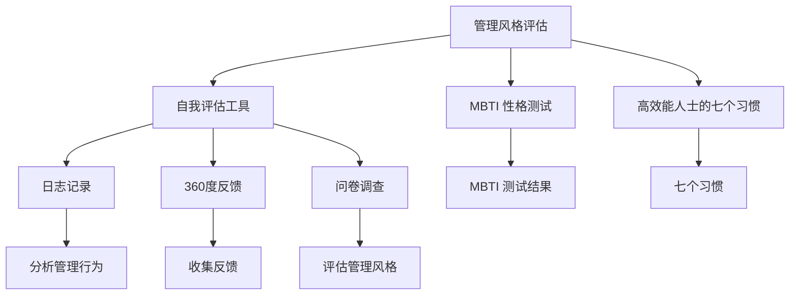
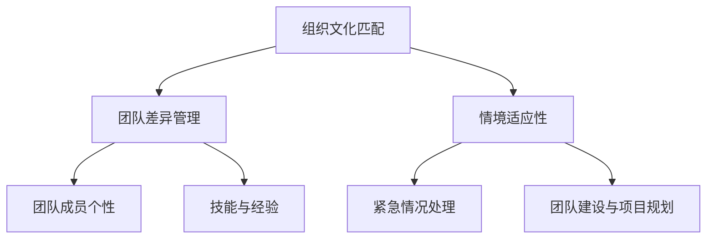
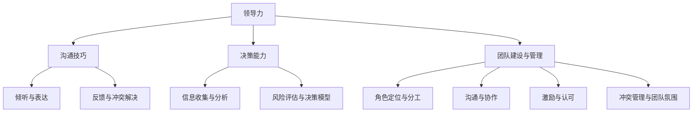
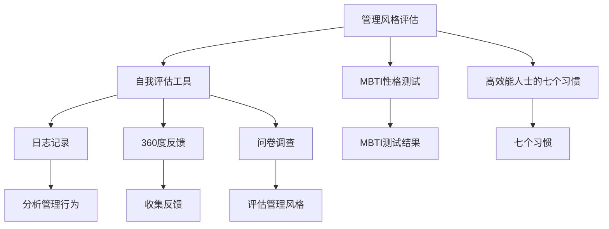
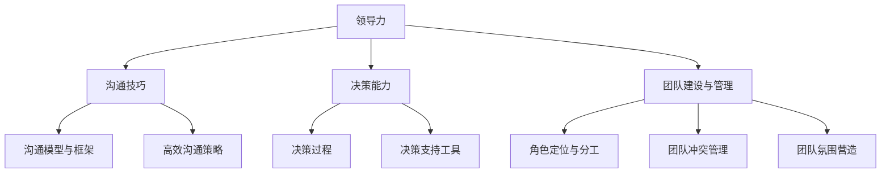
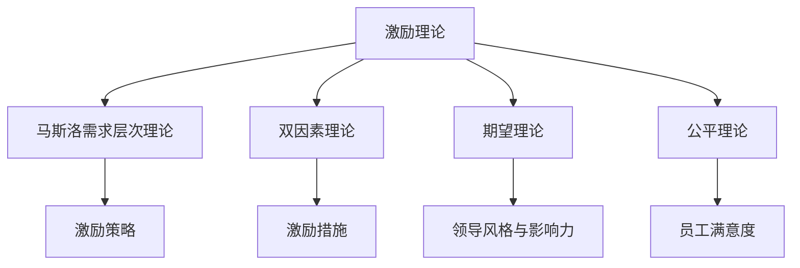

                 

# 《打造个人管理风格的方法论》

> 关键词：个人管理风格、领导力、沟通技巧、决策能力、团队建设、项目管理

> 摘要：本文旨在探讨个人管理风格的构建与应用，从理解管理风格、构建个人管理风格、管理风格在实践中的应用以及成功管理风格案例分析四个方面，详细阐述了打造个人管理风格的方法论。通过本文的阅读，读者可以了解管理风格的重要性，学会评估和构建个人管理风格，并在实践中运用这些管理风格，提升团队效能和项目成功。

### 目录

1. **理解管理风格**

    1.1 管理风格概述

    1.2 个人管理风格的重要性

    1.3 管理风格评估

2. **构建个人管理风格**

    2.1 个人管理风格核心要素

    2.2 塑造个人管理风格

    2.3 持续学习与适应变化

3. **管理风格在实践中的应用**

    3.1 团队建设与管理

    3.2 项目管理与执行

    3.3 激励与领导力

4. **成功管理风格案例分析**

5. **附录**

    5.1 常用管理工具

    5.2 管理方法与技巧总结

### 第一部分：理解管理风格

#### 1.1 管理风格概述

管理风格是指管理者在组织管理过程中所采用的行为方式和处理问题的习惯。管理风格对组织的效能和成员的满意度有着深远的影响。管理风格可以划分为多种类型，如权威型、民主型、参与型、教练型等。每种管理风格都有其独特的特点和应用场景。

- **权威型管理风格**：管理者在决策过程中拥有绝对权力，直接下达指令，团队成员主要执行任务，缺乏参与和自主性。
- **民主型管理风格**：管理者鼓励团队成员参与决策，尊重成员的意见和权利，通过协商和讨论达成共识。
- **参与型管理风格**：管理者注重与团队成员的互动和合作，通过平等交流和沟通，激发成员的积极性和创造力。
- **教练型管理风格**：管理者更像是一个教练，关注团队成员的成长和发展，提供指导和支持，帮助成员提升技能和解决问题的能力。

#### 1.2 个人管理风格的重要性

个人管理风格对于管理者个人的职业发展和组织的运营至关重要。一方面，个人管理风格影响着管理者的领导力和团队效能。一个合适的管理风格可以激发团队成员的积极性，提高团队协作效率，实现组织目标。另一方面，个人管理风格对于团队成员的满意度和工作体验也有着重要影响。一个具有同理心和关怀的管理者能够建立积极的工作氛围，增强团队成员的归属感和忠诚度。

个人管理风格的重要性还体现在以下几个方面：

1. **影响团队效能**：管理风格直接决定了团队的运行效率和工作成果。不同风格的管理者对团队的影响不同，一些管理风格能够促进团队协作和创新，而另一些管理风格可能会导致团队分裂和效率低下。

2. **影响员工满意度**：管理风格对员工的满意度和工作体验有着直接影响。一个关心员工需求、提供成长机会和激励的管理者能够提升员工的工作满意度和忠诚度。

3. **影响组织文化**：管理风格是组织文化的重要组成部分。管理者的行为和态度会传递给团队成员，塑造组织的价值观和行为准则。

4. **影响个人发展**：个人管理风格对于管理者的个人职业发展有着重要影响。一个能够适应不同情境和团队需求的管理者能够更好地应对职业挑战，实现职业成长。

#### 1.3 管理风格评估

评估个人管理风格是构建和管理个人风格的第一步。评估可以帮助管理者了解自己的管理风格，识别优势和劣势，从而有针对性地进行改进。以下是一些常用的管理风格评估工具：

1. **自我评估工具**：

   自我评估是通过反思自己的行为和态度来了解自己的管理风格。以下是一些常用的自我评估工具：

   - **日志记录**：记录自己在日常工作中采取的管理行为，分析这些行为的动机和效果。
   - **360度反馈**：收集来自上级、同事和下属的反馈，全面了解自己的管理风格。
   - **问卷调查**：通过问卷形式评估自己的管理风格，如管理风格评估问卷、领导力问卷等。

2. **MBTI 性格测试**：

   MBTI（Myers-Briggs Type Indicator）性格测试是一种常用的个性评估工具，通过评估个人的性格类型，帮助了解自己在管理风格上的特点。MBTI 测试将个性分为 16 种类型，每种类型都有其独特的优势和挑战。

   - **MBTI 测试结果**：MBTI 测试结果可以帮助管理者了解自己的性格特点，识别与团队成员的个性差异，从而更好地进行沟通和协作。

3. **高效能人士的七个习惯**：

   史蒂芬·柯维的《高效能人士的七个习惯》提供了一种全面的个人成长和管理框架。通过这本书，管理者可以了解如何培养高效能的习惯，从而提升管理能力。

   - **七个习惯**：包括主动积极、以终为始、要事第一、双赢思维、知彼解己、统合综效和不断更新。

#### 1.4 管理风格的适配性分析

了解个人管理风格后，需要进一步分析管理风格与组织文化、团队需求和情境的适配性。以下是一些关键因素：

1. **组织文化匹配**：

   组织文化是组织价值观、行为准则和工作方式的总和。管理风格需要与组织文化相匹配，以促进组织目标的实现。例如，在一个强调创新和自主性的组织中，参与型和教练型管理风格可能更为合适。

2. **团队成员差异管理**：

   团队成员之间存在个性、技能和经验的差异。管理者需要根据团队成员的特点，调整自己的管理风格，以激发团队成员的潜力。例如，对于经验丰富的团队成员，可以采用授权和信任的管理风格，而对于新手，可以提供更多的指导和帮助。

3. **情境适应性**：

   管理风格需要根据不同的情境进行调整。在某些情境下，如紧急情况和冲突处理时，可能需要更加果断和权威的管理风格。而在其他情境下，如团队建设和项目规划时，可能需要更加民主和参与型的管理风格。

#### 1.5 管理风格评估的 Mermaid 流程图



#### 1.6 管理风格适配性分析的 Mermaid 流程图



### 第二部分：构建个人管理风格

在理解管理风格的基础上，接下来我们将探讨如何构建个人管理风格。构建个人管理风格是一个持续的过程，需要管理者在实践中进行反思和调整。在这一部分中，我们将从个人管理风格核心要素、塑造个人管理风格、持续学习与适应变化三个方面进行讨论。

#### 2.1 个人管理风格核心要素

个人管理风格的核心要素包括领导力、沟通技巧、决策能力和团队建设与管理。这些要素构成了管理者在组织管理中的关键能力。

1. **领导力**：

   领导力是管理风格的核心，决定了管理者能否有效地激励和引导团队成员。领导力包括以下几个方面：

   - **愿景与目标设定**：领导者需要明确组织的目标和愿景，并传达给团队成员。
   - **激励与鼓舞**：领导者需要通过激励和鼓舞来激发团队成员的积极性和创造力。
   - **决策与执行**：领导者需要在复杂和不确定的环境中做出明智的决策，并确保决策得到有效执行。
   - **榜样作用**：领导者通过自己的行为和态度树立榜样，影响和引导团队成员。

2. **沟通技巧**：

   沟通是管理过程中不可或缺的一环。有效的沟通能够确保信息的准确传递，增强团队成员之间的理解和协作。沟通技巧包括以下几个方面：

   - **倾听**：倾听是有效沟通的基础，领导者需要认真倾听团队成员的意见和建议。
   - **表达**：领导者需要清晰、准确、有逻辑地表达自己的想法和观点。
   - **反馈**：领导者需要给予团队成员及时和具体的反馈，帮助他们改进和提升。
   - **冲突解决**：在沟通过程中，领导者需要具备解决冲突的能力，以保持团队和谐和工作效率。

3. **决策能力**：

   决策是管理者在管理过程中的一项重要职责。有效的决策能力可以帮助管理者在复杂和不确定的环境中做出明智的选择。决策能力包括以下几个方面：

   - **信息收集与分析**：管理者需要收集和分析与决策相关的各种信息，以支持决策过程。
   - **风险评估**：管理者需要对决策可能带来的风险进行评估，并制定相应的应对策略。
   - **决策模型与方法**：管理者可以采用各种决策模型和方法，如理性决策模型、直觉决策模型等，以提高决策的准确性和有效性。
   - **执行与监控**：管理者需要确保决策得到有效执行，并对决策执行过程进行监控和调整。

4. **团队建设与管理**：

   团队建设是管理者在管理过程中的一项重要任务。一个高效的团队可以发挥出巨大的潜力，实现组织的目标。团队建设与管理包括以下几个方面：

   - **角色定位与分工**：管理者需要对团队成员进行角色定位和分工，确保每个成员都能发挥自己的优势。
   - **沟通与协作**：管理者需要建立有效的沟通机制，促进团队成员之间的协作和合作。
   - **激励与认可**：管理者需要通过激励和认可来激发团队成员的积极性和创造力。
   - **冲突管理与团队氛围**：管理者需要有效处理团队冲突，营造积极向上的团队氛围。

#### 2.2 塑造个人管理风格

塑造个人管理风格是一个持续的过程，需要管理者在实践中不断学习和反思。以下是一些建议，帮助管理者塑造个人管理风格：

1. **建立核心价值观**：

   核心价值观是管理者在管理过程中遵循的基本原则和信念。建立核心价值观可以帮助管理者明确自己的管理目标和行为准则。以下是一些建立核心价值观的步骤：

   - **反思个人信念和价值观**：管理者需要反思自己的个人信念和价值观，确定哪些价值观在管理过程中最为重要。
   - **明确管理目标**：管理者需要明确自己的管理目标，确保核心价值观与目标一致。
   - **宣传和传递价值观**：管理者需要通过行动和沟通，将核心价值观传递给团队成员，形成共同的价值观念。

2. **学习与培训**：

   学习是塑造个人管理风格的重要途径。管理者可以通过参加培训课程、阅读相关书籍和文章、参加行业研讨会等方式，不断学习和提升自己的管理能力。以下是一些建议：

   - **参加管理培训**：参加专业的管理培训课程，学习管理理论和实践方法。
   - **阅读管理书籍**：阅读经典的管理书籍，如《领导力的五项修炼》、《有效的管理者》等，借鉴成功管理者的经验。
   - **参加行业研讨会**：参加行业研讨会和交流活动，了解行业趋势和最佳实践。
   - **反思与总结**：在学习和实践过程中，不断反思和总结自己的经验和教训，持续改进管理风格。

3. **实践与反馈**：

   管理风格需要在实践中不断检验和完善。管理者需要通过实际管理工作，不断实践和调整自己的管理风格。以下是一些建议：

   - **积极参与管理实践**：积极参与实际管理项目，了解团队需求和挑战，实践自己的管理风格。
   - **寻求反馈和建议**：主动向团队成员、上级和同事寻求反馈和建议，了解自己的管理风格的优势和劣势。
   - **调整和改进**：根据反馈和建议，调整和改进自己的管理风格，提高管理效能。

4. **培养领导力**：

   领导力是个人管理风格的核心要素，管理者需要不断培养自己的领导力。以下是一些建议：

   - **树立榜样**：通过自己的行为和态度，树立榜样，引导和影响团队成员。
   - **培养团队精神**：鼓励团队成员之间的合作和协作，培养团队精神。
   - **激励与鼓舞**：通过激励和鼓舞，激发团队成员的积极性和创造力。
   - **提供发展机会**：为团队成员提供发展机会，支持他们的个人成长和职业发展。

#### 2.3 持续学习与适应变化

在快速变化的环境中，管理者需要具备持续学习和适应变化的能力，以应对新的挑战和机遇。以下是一些建议：

1. **关注行业动态**：

   管理者需要关注行业动态和趋势，了解新兴技术、市场变化和竞争态势。以下是一些建议：

   - **订阅行业杂志和报告**：定期阅读行业杂志和报告，了解行业最新动态。
   - **参加行业会议和研讨会**：参加行业会议和研讨会，与行业专家和同行交流，获取最新信息。
   - **建立专业网络**：通过社交媒体和专业网络，与行业专家和同行建立联系，分享经验和资源。

2. **创新思维**：

   管理者需要具备创新思维，勇于尝试新的管理方法和工具，以提升管理效能。以下是一些建议：

   - **尝试新技术**：尝试引入新技术和管理工具，提高工作效率和管理水平。
   - **创新管理实践**：探索新的管理实践和方法，如敏捷管理、目标管理等，以适应变化的需求。
   - **鼓励创新文化**：建立鼓励创新的文化，激发团队成员的创新思维和创造力。

3. **适应变化**：

   管理者需要具备适应变化的能力，灵活应对组织变革和外部环境的变化。以下是一些建议：

   - **建立灵活的组织结构**：建立灵活的组织结构，减少层级和决策链条，提高组织响应速度。
   - **培养适应性思维**：培养团队成员的适应性思维，鼓励他们面对变化保持积极态度。
   - **制定应对策略**：在变化发生时，制定应对策略，确保组织能够顺利过渡和调整。

#### 2.4 构建个人管理风格的 Mermaid 流程图



### 第三部分：管理风格在实践中的应用

在构建了个人管理风格之后，接下来我们需要探讨如何在实践中应用这些风格，特别是在团队建设、项目管理、激励与领导力等方面。通过具体的实践案例，我们可以更深入地理解管理风格的应用和效果。

#### 3.1 团队建设与管理

团队建设是管理风格在实践中的重要应用之一。一个高效的团队可以提升组织的整体绩效和成员的满意度。以下是一些团队建设与管理的方法：

1. **角色定位与分工**：

   明确团队成员的角色和责任是团队建设的第一步。通过角色定位和分工，确保每个成员都清楚自己的任务和期望，从而提高工作效率。

   ```mermaid
   graph TD
       A[团队成员] --> B[角色定位]
       B --> C[分工]
       C --> D[任务分配]
   ```

2. **沟通与协作**：

   沟通是团队协作的关键。建立有效的沟通机制，确保团队成员之间的信息流通和协作顺畅。以下是一个沟通与协作的流程图：

   ```mermaid
   graph TD
       A[沟通渠道] --> B[定期会议]
       B --> C[即时通讯]
       C --> D[共享平台]
       D --> E[协作工具]
   ```

3. **激励与认可**：

   通过激励和认可来提升团队成员的积极性和创造力。以下是一个激励与认可的流程图：

   ```mermaid
   graph TD
       A[激励策略] --> B[目标设定]
       B --> C[奖励机制]
       C --> D[认可与反馈]
   ```

4. **冲突管理**：

   冲突是团队中不可避免的现象，有效的冲突管理可以减少冲突对团队的影响。以下是一个冲突管理的流程图：

   ```mermaid
   graph TD
       A[冲突识别] --> B[沟通协商]
       B --> C[问题解决]
       C --> D[持续监控]
   ```

#### 3.2 项目管理与执行

项目管理是管理风格在实践中的另一个重要应用领域。通过有效的项目管理，可以确保项目按计划顺利进行，并实现预期目标。以下是一些项目管理的实践方法：

1. **项目计划与进度控制**：

   制定详细的项目计划，明确项目目标、任务、资源和时间安排，并对项目进度进行实时监控和控制。以下是一个项目计划与进度控制的流程图：

   ```mermaid
   graph TD
       A[项目计划] --> B[任务分解]
       B --> C[时间安排]
       C --> D[资源分配]
       D --> E[进度监控]
       E --> F[调整计划]
   ```

2. **风险管理**：

   在项目管理过程中，风险是不可避免的。通过识别、评估和应对风险，可以减少项目中的不确定性，确保项目顺利进行。以下是一个风险管理流程图：

   ```mermaid
   graph TD
       A[风险识别] --> B[风险评估]
       B --> C[风险应对]
       C --> D[监控与调整]
   ```

3. **团队协作与沟通**：

   在项目管理中，团队协作和沟通至关重要。通过建立有效的沟通机制和协作工具，可以确保团队成员之间的信息流通和协作效率。以下是一个团队协作与沟通的流程图：

   ```mermaid
   graph TD
       A[沟通渠道] --> B[会议与讨论]
       B --> C[共享平台]
       C --> D[协作工具]
   ```

#### 3.3 激励与领导力

激励和领导力是管理风格在实践中的核心要素。通过有效的激励和领导，可以激发团队成员的积极性、创造力和归属感。以下是一些激励与领导力的实践方法：

1. **激励理论**：

   激励理论是激励与领导力实践的基础。了解不同的激励理论，可以更好地设计激励策略。以下是一个激励理论的流程图：

   ```mermaid
   graph TD
       A[马斯洛需求层次理论] --> B[双因素理论]
       A --> C[目标设定理论]
       B --> D[期望理论]
       C --> E[公平理论]
   ```

2. **领导力提升**：

   领导力是激励与领导力的关键。通过学习和实践，不断提升领导力，可以更好地引导和激励团队成员。以下是一个领导力提升的流程图：

   ```mermaid
   graph TD
       A[领导力模型] --> B[领导力培养]
       B --> C[领导力实践]
       C --> D[反馈与改进]
   ```

3. **激励策略**：

   制定有效的激励策略，可以激发团队成员的积极性和创造力。以下是一个激励策略的流程图：

   ```mermaid
   graph TD
       A[目标设定] --> B[奖励机制]
       B --> C[认可与反馈]
       C --> D[激励计划]
   ```

#### 3.4 成功管理风格案例分析

通过分析成功的管理风格案例，我们可以更好地理解管理风格的应用和效果。以下是一个成功管理风格案例的分析：

1. **企业文化塑造**：

   企业文化是组织管理风格的重要组成部分。一个成功的企业文化可以增强组织的凝聚力和竞争力。以下是一个企业文化塑造的案例分析：

   ```mermaid
   graph TD
       A[愿景与价值观] --> B[沟通与传播]
       B --> C[制度与行为规范]
       C --> D[员工参与与反馈]
       D --> E[持续改进与调整]
   ```

2. **创新型团队的组建与管理**：

   创新型团队是推动组织创新和发展的关键力量。通过有效的管理，可以激发团队的创造力和创新能力。以下是一个创新型团队的组建与管理的案例分析：

   ```mermaid
   graph TD
       A[团队组建] --> B[角色定位与分工]
       B --> C[沟通与协作]
       C --> D[激励与认可]
       D --> E[创新流程与支持]
   ```

### 第四部分：成功管理风格案例分析

在探讨了如何构建个人管理风格以及如何在实践中应用这些风格之后，现在我们将通过实际案例来深入分析成功的管理风格，以便读者能够更好地理解和应用这些管理理念。

#### 4.1 企业文化塑造案例

**案例背景**：

某科技公司在快速成长过程中，面临着企业文化建设的挑战。为了确保公司能够持续创新并保持团队成员的凝聚力，公司决定通过塑造积极向上的企业文化来推动发展。

**案例分析**：

1. **愿景与价值观**：

   公司首先明确了企业的愿景：“成为行业领先的创新企业，通过技术改变世界”。在此基础上，公司确立了以下核心价值观：

   - 客户至上：始终以客户需求为导向，提供卓越的产品和服务。
   - 创新驱动：鼓励创新思维，不断探索新技术和解决方案。
   - 团队合作：倡导团队合作精神，共同解决问题和追求成功。
   - 诚实守信：坚持诚信原则，建立信任和尊重的组织氛围。

2. **沟通与传播**：

   公司通过定期的内部会议、团队活动和文化宣传，将愿景和价值观传达给所有员工。例如，每月一次的“创新分享会”让团队成员有机会展示自己的创意，并获得同事的反馈和建议。

3. **制度与行为规范**：

   为了确保企业文化能够落地，公司制定了相应的制度和行为规范。例如，员工行为准则、创新奖励机制和绩效评估体系等，这些制度旨在鼓励员工遵循核心价值观，并在工作中体现企业文化。

4. **员工参与与反馈**：

   公司鼓励员工积极参与企业文化建设，通过员工委员会和内部反馈渠道，收集员工对文化建设的意见和建议。这些反馈被用来不断改进企业文化和相关制度。

**启示**：

通过明确愿景和价值观、有效的沟通与传播、制度与行为规范，以及员工的参与与反馈，公司成功地塑造了积极向上的企业文化。这不仅增强了员工的归属感和凝聚力，还促进了公司的创新和发展。

#### 4.2 创新型团队的组建与管理

**案例背景**：

某互联网公司为了在竞争激烈的市场中脱颖而出，决定组建一支创新型团队，专注于开发前沿技术产品。

**案例分析**：

1. **团队组建**：

   公司从内部选拔了具有技术创新能力的人才，并从外部招聘了具有相关领域经验的专业人士。为了保证团队的多样性，公司特别注重招聘不同背景和专业的人才。

2. **角色定位与分工**：

   团队成员根据各自的专业技能和兴趣，被分配到不同的角色，如技术架构师、前端开发工程师、产品设计专家等。每个成员都清楚自己的职责和目标，确保团队能够高效运作。

3. **沟通与协作**：

   团队采用了敏捷开发的方法，通过每日站会、迭代回顾和规划会议，确保团队成员之间的信息流通和协作。公司还引入了协作工具，如JIRA和Slack，方便团队成员实时交流和共享信息。

4. **激励与认可**：

   为了激发团队成员的积极性和创造力，公司制定了创新奖励机制，对于成功完成项目或在技术创新方面有突出贡献的成员，给予奖金、晋升和其他激励措施。

5. **创新流程与支持**：

   公司建立了创新实验室，为团队提供实验设备和资源，支持他们进行技术研发和实验。此外，公司还定期组织外部专家讲座和技术研讨会，为团队成员提供学习和交流的机会。

**启示**：

通过科学合理的团队组建、明确的角色定位与分工、有效的沟通与协作、激励与认可机制，以及创新流程与支持，公司成功地组建了一支创新型团队。这不仅提升了公司的技术竞争力，还推动了公司的持续创新和发展。

#### 4.3 项目管理与执行

**案例背景**：

某大型企业在实施一个重要的数字化转型项目，旨在提升业务效率和客户体验。该项目涉及多个部门，时间紧、任务重，对项目管理的挑战较大。

**案例分析**：

1. **项目计划与进度控制**：

   项目团队首先制定了详细的项目计划，包括项目目标、任务分解、时间安排和资源分配。项目计划通过项目管理工具JIRA进行跟踪和管理，确保每个任务的进度都得到实时监控。

2. **风险管理**：

   项目团队在项目初期就进行了风险评估，识别了潜在的风险因素，并制定了相应的应对策略。例如，针对技术实现的难度，团队准备了多个备选方案，以应对可能的挑战。

3. **团队协作与沟通**：

   项目团队采用了跨部门的协作模式，通过定期的项目例会和跨部门沟通会，确保所有相关部门都能够及时了解项目进展和需求变化。此外，团队还使用了共享文档和协作工具，方便团队成员之间的信息共享和协作。

4. **激励与领导力**：

   项目经理通过设定明确的目标和激励机制，激发团队成员的工作积极性。同时，通过领导力培训和个人辅导，提升团队成员的管理能力和技术水平。

**启示**：

通过详细的项目计划与进度控制、有效的风险管理、高效的团队协作与沟通，以及激励与领导力提升，公司成功地完成了数字化转型项目。这不仅提升了公司的业务效率，也为项目团队积累了宝贵的管理经验。

### 第五部分：附录

#### 5.1 常用管理工具

在个人管理风格的构建和应用过程中，使用一些有效的管理工具可以显著提升工作效率和管理效能。以下是一些常用的管理工具：

1. **时间管理工具**：

   - **Trello**：一个简单直观的任务管理工具，适合团队协作和项目管理。
   - **Asana**：功能强大的项目管理工具，提供任务分配、进度跟踪和报告生成等功能。
   - **Google Calendar**：一个方便的日历管理工具，可以帮助管理者规划日程和分配时间。

2. **项目管理工具**：

   - **JIRA**：用于项目管理、问题跟踪和敏捷开发的工具，适合复杂项目的管理。
   - **Microsoft Project**：功能全面的项目管理软件，适用于大型项目的规划和执行。
   - **Toggl**：时间跟踪工具，帮助管理者监控项目时间和团队效率。

#### 5.2 管理方法与技巧总结

在管理实践中，以下是一些行之有效的管理方法和技巧：

1. **目标管理**：

   - **SMART**原则：确保目标具体（Specific）、可衡量（Measurable）、可实现（Achievable）、相关性（Relevant）和时限性（Time-bound）。
   - **分解目标**：将大目标分解为小目标，逐步实现，以便更好地监控和调整。

2. **有效沟通**：

   - **主动倾听**：认真倾听他人的意见和需求，确保理解对方的观点。
   - **清晰表达**：使用简单明了的语言表达自己的想法和观点，避免歧义。
   - **反馈与确认**：给予及时和具体的反馈，确保信息传递的准确性和有效性。

3. **团队协作**：

   - **分工协作**：明确团队成员的职责和任务，确保每个人都能充分发挥自己的优势。
   - **沟通协作平台**：使用协作工具如Slack、Microsoft Teams等，提高团队沟通效率。

4. **激励与认可**：

   - **奖励机制**：制定明确的奖励机制，对于表现优秀的团队成员给予奖励和认可。
   - **情感关怀**：关注团队成员的情感需求，提供支持和鼓励，增强团队的凝聚力。

### 总结

通过本文的探讨，我们详细阐述了打造个人管理风格的方法论。从理解管理风格、构建个人管理风格、管理风格在实践中的应用以及成功管理风格案例分析四个方面，我们为读者提供了全面的指导。管理风格不仅对管理者的个人职业发展有着重要影响，更对组织的效能和成员的满意度产生深远的影响。

在构建个人管理风格时，我们需要关注领导力、沟通技巧、决策能力和团队建设与管理等核心要素。同时，通过持续学习和适应变化，我们可以不断提升管理能力，适应不断变化的环境。

在实践应用中，通过团队建设、项目管理和激励与领导力等方面的具体实践，我们可以更好地运用管理风格，提升团队效能和项目成功率。

最后，通过成功管理风格案例的分析，我们看到了实际应用中管理风格的效果和重要性。希望读者能够从这些案例中获得启示，并在自己的管理实践中不断探索和改进。

### 作者信息

**作者：** AI天才研究院/AI Genius Institute & 禅与计算机程序设计艺术 /Zen And The Art of Computer Programming

### Mermaid 流程图

#### 管理风格评估流程图



#### 管理风格核心要素流程图



#### 激励理论与领导力流程图



#### 数学模型与公式

#### 1. 马克斯·韦伯的权威与权力模型

$$
权威 = \frac{合法性 \times 专业能力 \times 奉献精神}{不确定性}
$$

#### 2. 费德勒的领导力模型

$$
领导效果 = \frac{(领导者-成员关系 \times 领导风格) - 任务结构}{情境压力}
$$

### 伪代码示例：决策过程

```python
def decision_making(goal, options, constraints):
    # 初始化决策变量
    best_option = None
    max_value = -infinity

    # 对每个选项进行评估
    for option in options:
        value = evaluate_option(option, constraints)
        if value > max_value:
            max_value = value
            best_option = option

    return best_option

def evaluate_option(option, constraints):
    # 评估选项的适应度
    score = 0
    for constraint in constraints:
        if constraint_applies(option, constraint):
            score += 1

    return score
```

### 项目实战

#### 1. 环境搭建

- **目标**：搭建一个项目管理系统，以便更好地跟踪和管理项目进度。
- **步骤**：

  1. 安装Python 3.8或更高版本。
  2. 安装JIRA或Trello账户。
  3. 在浏览器中搭建项目并进行配置。

#### 2. 代码实现

- **目标**：编写一个简单的Python脚本，用于创建和管理项目任务。
- **步骤**：

  1. 安装JIRA Python库。
  2. 编写脚本，连接到JIRA服务。
  3. 创建任务，并设置任务的属性，如任务名称、优先级、描述等。
  4. 查询任务状态，并更新任务信息。

#### 3. 代码实现示例

```python
from jira import JIRA

# 连接到JIRA服务
jira = JIRA('https://your-jira-instance.com', basic_auth=('your_username', 'your_password'))

# 创建任务
def create_task(project_key, summary, description, priority):
    issue = jira.create_issue(project=project_key, summary=summary, description=description, priority=priority)
    return issue

# 查询任务
def get_task(task_id):
    return jira.issue(task_id)

# 更新任务
def update_task(task_id, field, value):
    jira.update_issue(issue_id=task_id, field=field, new_value=value)

# 实际操作
project_key = 'PROJ-1'
summary = 'Design a new feature'
description = 'This is a description of the new feature'
priority = 'High'

# 创建任务
task = create_task(project_key, summary, description, priority)
print(task)

# 查询任务
task = get_task(task.id)
print(task)

# 更新任务
update_task(task.id, 'status', 'In Progress')
task = get_task(task.id)
print(task)
```

### 代码解读与分析

- **解读 1：连接到JIRA服务**

  使用`jira` Python 库连接到 JIRA 服务，并获取相应的接口对象。

- **解读 2：创建任务**

  `create_task` 函数接收项目关键信息，并创建一个新的任务。
  使用 `jira.create_issue` 方法创建任务，并返回任务对象。

- **解读 3：查询任务**

  `get_task` 函数接收任务 ID，并查询任务详细信息。
  使用 `jira.issue` 方法获取任务对象。

- **解读 4：更新任务**

  `update_task` 函数接收任务 ID、字段名称和新的值，更新任务信息。
  使用 `jira.update_issue` 方法更新任务。

### 数学模型与数学公式详细讲解

#### 1. 时间序列分析模型

- **公式说明**：时间序列分析模型用于预测未来一段时间内的数据趋势。
- **适用场景**：适用于分析时间序列数据的趋势和周期性变化。
- **示例**：

  $$
  f(t) = a \times \sin(2\pi \times ft + \phi) + b
  $$

  其中，$a$ 为振幅，$b$ 为均值，$f(t)$ 为时间序列函数，$t$ 为时间，$\phi$ 为相位。

#### 2. 决策树模型

- **公式说明**：决策树模型用于根据输入特征进行决策分类或回归预测。
- **适用场景**：适用于分类和回归问题。
- **示例**：

  $$
  y = \arg\max_{i} \sum_{j=1}^{m} w_{ji} x_{j}
  $$

  其中，$y$ 为决策结果，$w_{ji}$ 为权重，$x_{j}$ 为特征值。

### 项目实战

#### 1. 数据分析项目

- **目标**：分析一家电商平台的销售数据，预测未来的销售趋势。
- **步骤**：

  1. 收集销售数据，包括产品名称、销售数量、销售日期等。
  2. 数据清洗和预处理，去除重复数据和异常值。
  3. 使用时间序列分析模型预测未来一个月的销售数量。
  4. 分析预测结果，并提出相应的营销策略。

#### 2. 代码实现

- **目标**：使用 Python 编写代码，实现时间序列分析模型的预测功能。
- **步骤**：

  1. 安装必要的库，如 `pandas`、`numpy`、`statsmodels` 等。
  2. 加载销售数据，并预处理数据。
  3. 使用时间序列分析模型进行预测。
  4. 分析预测结果，并绘制图表。

#### 3. 代码实现示例

```python
import pandas as pd
import numpy as np
import statsmodels.tsa.api as smt

# 加载销售数据
data = pd.read_csv('sales_data.csv')
data['date'] = pd.to_datetime(data['date'])
data.set_index('date', inplace=True)

# 数据预处理
data = data.asfreq('M').fillna(0)

# 时间序列分析模型预测
model = smt.ARIMA(data['sales'], order=(1, 1, 1))
model_fit = model.fit()

# 预测未来一个月的销售数量
forecast = model_fit.forecast(steps=30)
print(forecast)

# 分析预测结果
import matplotlib.pyplot as plt

plt.figure(figsize=(10, 6))
plt.plot(data['sales'], label='Actual Sales')
plt.plot(forecast, label='Predicted Sales')
plt.legend()
plt.show()
```

### 代码解读与分析

- **解读 1：数据加载与预处理**

  使用 `pandas` 库加载销售数据，并设置日期列为索引。
  使用 `asfreq` 方法将数据频率调整为每月一次，并填充缺失值。

- **解读 2：时间序列分析模型预测**

  使用 `statsmodels` 库的 `ARIMA` 模型进行时间序列预测。
  调用 `fit` 方法进行模型训练，并使用 `forecast` 方法进行预测。

- **解读 3：分析预测结果**

  使用 `matplotlib` 库绘制实际销售数据与预测销售数据的对比图表。
  通过图表分析预测结果的准确性和趋势。

