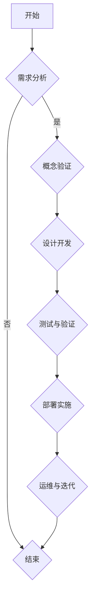
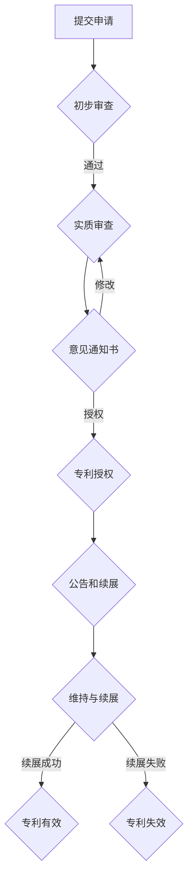

                 

# 文章标题：技术创新与专利申请：程序员指南

> 关键词：技术创新，专利申请，程序员，研发流程，专利保护，知识产权

> 摘要：本文旨在为程序员提供一套完整的技术创新与专利申请指南。通过对技术创新的定义、研发流程管理、技术创新战略、专利基础知识、专利撰写技巧、专利申请与答辩以及专利保护与维权的详细阐述，帮助程序员更好地理解技术创新的重要性，掌握专利申请的技巧，提升自身的技术创新能力，并有效保护自己的知识产权。

## 引言

在当今快速发展的信息技术时代，技术创新已成为企业竞争的核心驱动力。对于程序员而言，技术创新不仅是个人职业发展的关键，也是提升企业竞争力的重要手段。与此同时，专利作为知识产权的一种重要形式，对于技术创新的保护和推广具有重要意义。然而，许多程序员在技术创新和专利申请方面存在诸多困惑和挑战。

本文将围绕技术创新与专利申请，为程序员提供一系列指导。首先，我们将探讨技术创新的定义、类型以及其对企业和研发团队的影响。接着，我们将详细讲解研发流程管理、技术创新战略的制定与实施，以及技术创新与市场定位和竞争策略的关系。随后，我们将介绍专利基础知识、专利撰写技巧、专利申请与答辩流程以及专利保护与维权策略。

通过本文的阅读，程序员将能够更全面地理解技术创新的重要性，掌握专利申请的技巧，提升自身的技术创新能力，并有效保护自己的知识产权。

### 第一部分：技术创新与研发

## 第1章：技术创新概述

### 1.1.1 技术创新的定义与类型

技术创新是指通过新的发明、设计、改进或应用，使得技术系统或产品性能得到显著提升的过程。技术创新不仅仅局限于硬件设备的更新，还包括软件算法、业务模式、用户界面等多个方面的进步。根据创新对象的不同，技术创新可以分为以下几种类型：

1. **产品创新**：涉及新产品或新产品的改进，如智能手机、新型医疗设备等。
2. **过程创新**：涉及生产过程或操作流程的改进，如自动化生产线、高效算法等。
3. **服务创新**：涉及服务内容或服务模式的改进，如在线教育、金融服务等。
4. **商业模式创新**：涉及商业运营模式的改进，如共享经济、区块链等。

### 1.1.2 技术创新对企业的影响

技术创新对企业发展具有深远的影响。以下是一些主要方面：

1. **提升竞争力**：通过技术创新，企业可以在市场上获得竞争优势，吸引更多客户，提高市场份额。
2. **增加收益**：技术创新往往能够带来新的市场和业务机会，从而增加企业的收入和利润。
3. **提高效率**：通过技术创新，企业可以优化生产流程，提高工作效率，降低成本。
4. **促进增长**：技术创新是企业持续发展的动力，能够推动企业不断拓展新领域、新市场。
5. **增强品牌价值**：技术创新能够提升企业的品牌形象，增强消费者对企业的信任和忠诚度。

### 1.1.3 技术创新的驱动因素

技术创新的驱动因素多种多样，以下是一些主要驱动因素：

1. **市场需求**：市场需求是推动技术创新的主要动力。企业通过研究和分析市场需求，开发出满足消费者需求的新产品或服务。
2. **技术进步**：技术的不断进步为创新提供了更多的可能性。新技术的出现往往能够引发新的商业模式和产品创新。
3. **竞争压力**：竞争压力促使企业不断寻求技术创新，以保持市场竞争力。
4. **政策支持**：政府的政策支持和鼓励措施，如税收优惠、资金扶持等，能够激励企业加大技术创新投入。
5. **人力资源**：企业内部优秀的技术人才和创新团队是技术创新的重要保障。企业需要培养和吸引高素质的人才，以推动技术创新。

通过本章的阐述，我们能够对技术创新有一个全面的理解，认识到其在企业发展中的重要性，并了解其类型、影响和驱动因素。接下来，我们将进一步探讨研发流程管理、技术创新战略以及技术创新与市场定位和竞争策略等话题。

### 第2章：研发流程管理

#### 2.1.1 研发流程的基本框架

研发流程是企业实现技术创新的关键环节。一个有效的研发流程可以确保技术创新的高效实施，从而为企业带来竞争优势。研发流程的基本框架通常包括以下几个阶段：

1. **需求分析**：需求分析是研发流程的第一步，旨在明确项目的目标、需求和约束条件。通过市场调研、用户反馈和竞争分析等方式，确定研发项目的方向和目标。

2. **概念验证**：在需求分析的基础上，进行概念验证（Proof of Concept, PoC）。这一阶段的目标是通过初步实验或建模，验证技术方案是否可行。

3. **设计开发**：设计开发阶段是将概念验证的结果转化为具体的技术方案和产品设计。这一阶段通常涉及系统设计、算法设计、原型开发等多个环节。

4. **测试与验证**：测试与验证阶段是确保设计方案符合需求和标准的重要环节。通过单元测试、集成测试和系统测试等手段，验证产品的性能和可靠性。

5. **部署实施**：部署实施阶段是将研发成果应用到实际生产环境中。这一阶段包括软件部署、硬件安装和系统集成等任务。

6. **运维与迭代**：运维与迭代阶段是对已部署产品的持续维护和优化。通过用户反馈和技术评估，不断改进产品，以适应市场变化。

#### 2.1.2 研发项目管理

研发项目管理是确保研发流程顺利实施的关键。有效的研发项目管理可以确保项目按时、按质、按预算完成。以下是一些重要的项目管理工具和方法：

1. **项目管理软件**：如JIRA、Trello等，用于任务分配、进度跟踪和协作管理。

2. **敏捷开发**：敏捷开发（Agile Development）是一种以迭代和协作为核心的开发方法。通过持续迭代和反馈，敏捷开发能够更好地适应项目变化，提高开发效率。

3. **看板（Kanban）**：看板是一种可视化项目管理工具，通过卡片和看板板，展示任务的状态和进度。

4. **风险管理**：识别、评估和应对项目风险是项目管理的重要任务。通过风险矩阵、风险登记册等工具，对项目风险进行有效管理。

5. **团队协作**：团队协作是项目成功的关键。通过定期的会议、代码审查、知识共享等方式，促进团队成员之间的沟通和协作。

#### 2.1.3 研发团队组织与管理

有效的研发团队组织与管理是确保研发流程高效运行的基础。以下是一些关键点：

1. **团队结构**：根据项目特点和需求，构建合理的团队结构。常见的团队结构包括功能型团队、项目型团队和矩阵型团队。

2. **角色分工**：明确团队成员的角色和职责，确保各成员能够发挥最大效能。常见的研发角色包括项目经理、技术负责人、开发人员、测试人员等。

3. **技能提升**：通过培训、技术交流和项目实践，不断提升团队成员的技能水平，以应对技术挑战。

4. **激励机制**：建立合理的激励机制，鼓励团队成员积极参与研发工作，提高项目成功率。

5. **团队文化**：培养良好的团队文化，增强团队成员的归属感和团队凝聚力。通过团队建设活动、员工关怀等方式，营造积极向上的工作氛围。

通过有效的研发流程管理、项目管理以及团队组织与管理，企业可以更好地实现技术创新，提升核心竞争力。在下一章中，我们将进一步探讨技术创新战略的制定与实施，以及技术创新与市场定位和竞争策略的关系。

#### 3.1.1 技术创新战略的制定与实施

技术创新战略是企业长期发展的核心策略，它决定了企业如何在激烈的市场竞争中保持领先地位。一个有效的技术创新战略需要综合考虑企业的资源、市场环境和竞争优势。以下是如何制定和实施技术创新战略的几个关键步骤：

1. **明确企业愿景和使命**：技术创新战略的制定首先要明确企业的愿景和使命。企业的愿景和使命将指导技术创新的方向，确保技术创新与企业的长期发展目标相一致。

2. **市场调研与分析**：市场调研是制定技术创新战略的重要基础。通过市场调研，企业可以了解市场需求、竞争对手的情况以及技术发展趋势。这些信息将帮助企业确定技术创新的重点领域和方向。

3. **内部资源评估**：企业需要评估自身的资源状况，包括人力资源、财务资源、技术能力等。通过资源评估，企业可以确定哪些领域具有技术创新的优势，并制定相应的策略。

4. **技术创新目标设定**：根据市场调研和资源评估结果，企业可以设定明确的创新目标。这些目标应具有可衡量性，如开发一款具有竞争力的新产品或提升现有产品的性能。

5. **技术创新路径规划**：技术创新路径规划是确保技术创新战略顺利实施的步骤。企业可以通过制定研发项目计划、技术路线图等方式，明确技术创新的阶段性目标和任务。

6. **资源配置与优先级排序**：在技术创新战略实施过程中，企业需要合理配置资源，并确定项目的优先级。通过优先级排序，企业可以确保资源得到有效利用，优先支持具有高回报潜力的项目。

7. **风险管理**：技术创新过程中不可避免地会遇到各种风险。企业应制定风险管理策略，识别潜在风险，并制定相应的应对措施。

8. **激励机制与文化建设**：为了激励员工积极参与技术创新，企业应建立激励机制，如奖励创新成果、提供培训机会等。同时，培养鼓励创新的企业文化，营造积极向上的创新氛围。

9. **持续评估与调整**：技术创新战略的实施是一个动态过程，需要定期评估创新项目的进展和效果。通过持续评估，企业可以及时调整创新策略，确保技术创新目标的实现。

#### 3.1.2 技术创新与市场定位

技术创新与市场定位密切相关。一个成功的技术创新战略需要紧密结合市场定位，以满足市场需求和赢得市场份额。以下是如何将技术创新与市场定位相结合的几个要点：

1. **市场细分**：通过市场细分，企业可以明确目标客户群体和市场需求。市场细分可以帮助企业制定更有针对性的技术创新策略。

2. **目标市场选择**：在市场细分的基础上，企业需要选择最有利的目标市场。通过选择目标市场，企业可以集中资源，提供更符合市场需求的技术创新产品。

3. **差异化战略**：差异化战略是通过技术创新来打造独特的产品或服务，以区别于竞争对手。差异化战略可以帮助企业在市场中建立独特的品牌形象。

4. **快速响应市场变化**：技术创新战略应具备快速响应市场变化的能力。通过持续关注市场动态和用户反馈，企业可以及时调整技术创新方向，满足市场变化。

5. **协同发展**：技术创新与市场定位应协同发展。企业在技术创新过程中，应充分考虑市场定位的需求，确保技术创新能够满足市场需求，并在市场上取得成功。

#### 3.1.3 技术创新与竞争策略

技术创新是企业在市场竞争中取得优势的重要手段。以下是如何将技术创新与竞争策略相结合的几个要点：

1. **领先策略**：领先策略是通过技术创新来领先于竞争对手。企业可以通过研发具有前瞻性的技术或产品，保持技术领先地位。

2. **跟随策略**：跟随策略是借鉴竞争对手的技术创新成果，进行改进和优化。通过跟随策略，企业可以降低研发风险，快速进入市场。

3. **差异化策略**：差异化策略是通过技术创新来实现产品或服务的差异化。通过差异化策略，企业可以避免直接竞争，赢得特定市场。

4. **成本领先策略**：成本领先策略是通过技术创新来降低产品成本，实现成本优势。通过成本领先策略，企业可以在市场竞争中占据有利地位。

5. **协同效应**：技术创新与竞争策略应相互协同。企业在制定竞争策略时，应充分考虑技术创新的可行性，确保竞争策略的有效实施。

通过制定和实施有效的技术创新战略，企业可以提升自身的技术创新能力，实现市场定位和竞争优势。在下一章中，我们将进一步探讨专利基础知识，包括专利的定义、分类以及专利申请的基本流程。这将有助于程序员更好地理解专利的重要性和申请专利的方法。

### 第3章：技术创新战略

#### 3.1.1 技术创新战略的制定与实施

技术创新战略是企业实现长期竞争力的关键。一个成功的创新战略需要系统化的规划和执行。以下是制定和实施技术创新战略的关键步骤：

1. **确立企业愿景和使命**：
   - **愿景**：企业应明确未来发展的愿景，这将是技术创新战略的长期指导方针。例如，苹果公司的愿景是“让每天的生活更加美好”。
   - **使命**：企业的使命应明确说明企业存在的理由，例如，谷歌的使命是“整合全球信息，使人人皆可访问并从中受益”。

2. **进行市场调研和分析**：
   - **需求分析**：了解市场需求和潜在客户的需求是创新的基础。通过市场调研，企业可以识别当前和未来的市场需求趋势。
   - **竞争分析**：研究竞争对手的产品、服务、市场策略和技术发展，有助于企业找到差距和机会。

3. **评估内部资源和能力**：
   - **人力资源**：评估企业的技术人才队伍，包括他们的技能、经验和创新能力。
   - **财务资源**：确定企业可分配的财务预算，以支持创新项目。
   - **技术能力**：评估企业现有技术储备和研发能力，确定企业可以开发和掌握的技术领域。

4. **设定技术创新目标**：
   - **短期目标**：设定一年或两年内可实现的创新目标，例如，推出一款新的软件应用。
   - **长期目标**：设定五年或十年内可实现的技术突破，例如，开发一款全新的硬件产品。

5. **制定技术创新路径**：
   - **技术路线图**：通过技术路线图，明确技术创新的阶段性目标和关键里程碑。
   - **研发项目计划**：制定详细的研发项目计划，包括研发周期、资源分配和风险控制。

6. **资源配置与优先级排序**：
   - **资源分配**：根据技术创新目标，合理分配人力资源、财务资源和研发设备。
   - **优先级排序**：确定哪些创新项目对企业最有利，并优先支持这些项目。

7. **建立激励机制**：
   - **奖励制度**：为鼓励员工积极参与技术创新，可以设立创新奖励制度，如奖金、股权激励等。
   - **培训与发展**：提供技术培训和职业发展机会，以提升员工的技术能力和创新精神。

8. **风险管理**：
   - **风险评估**：对创新项目进行风险评估，识别潜在的风险并制定应对措施。
   - **风险监控**：定期监控创新项目的进展，及时调整风险应对策略。

9. **持续评估与优化**：
   - **绩效评估**：定期评估技术创新项目的绩效，包括项目进度、技术成果和市场反馈。
   - **优化调整**：根据评估结果，优化创新战略和项目计划，确保技术创新目标的实现。

#### 3.1.2 技术创新与市场定位

技术创新与市场定位紧密相关。技术创新的成功往往取决于其是否符合市场需求和定位策略。以下是如何将技术创新与市场定位相结合的几个要点：

1. **市场细分**：
   - **目标客户群体**：通过市场细分，确定目标客户群体，了解他们的需求和行为模式。
   - **市场定位**：根据客户群体的特点，制定有针对性的市场定位策略，例如，针对高端用户推出高端产品。

2. **差异化战略**：
   - **技术差异化**：通过技术创新实现产品或服务的差异化，提供独特的价值，以区别于竞争对手。
   - **市场差异化**：通过差异化的市场定位，抢占市场空白点，满足未被满足的需求。

3. **快速响应市场变化**：
   - **市场需求跟踪**：持续跟踪市场需求变化，快速调整技术创新方向。
   - **市场反馈机制**：建立有效的市场反馈机制，收集用户反馈，优化产品和服务。

4. **协同发展**：
   - **产品与市场协同**：确保技术创新与市场定位协同发展，确保创新产品能够满足市场需求。
   - **营销策略**：制定相应的营销策略，将技术创新成果有效推广到市场。

通过技术创新战略的制定与实施，企业可以在市场中保持竞争优势，实现可持续发展。在下一章中，我们将探讨专利基础知识，包括专利的定义、分类以及专利申请的基本流程，这将帮助程序员更好地理解专利的重要性和申请专利的方法。

### 第4章：专利基础知识

#### 4.1.1 专利的定义与分类

专利是一种法律文件，授予发明者或申请人对其发明创造在法律上的独占权利，以保护其技术和商业利益。以下是专利的一些基本定义和分类：

1. **专利的定义**：
   - **发明**：发明是指对产品、方法或者其改进所提出的新的技术方案。
   - **专利**：专利是一种法律保护，授予发明者对其发明在一定期限内的独占权，防止他人未经许可使用、制造、销售、进口或分销其发明。

2. **专利的分类**：
   - **发明专利**：涉及新产品或新方法的专利，具有高度的技术性和创造性。发明专利的保护期限通常为20年。
   - **实用新型专利**：涉及对现有产品或方法的形状、结构或组合的改进，保护期限通常为10年。
   - **外观设计专利**：涉及产品外观的设计，保护期限通常为15年。

3. **专利的特点**：
   - **独占性**：专利赋予发明者或申请人在一定期限内独占实施其发明，防止他人侵权。
   - **地域性**：专利只在授予专利权的国家或地区有效，不同国家的专利需要分别申请。
   - **时间性**：专利保护具有期限，一旦专利期限届满，专利将进入公共领域，任何人都可以免费使用。

#### 4.1.2 专利申请的基本流程

专利申请是保护发明创造的重要途径，以下是专利申请的基本流程：

1. **前期准备**：
   - **发明披露**：准备详细的发明说明书，包括技术背景、发明内容、实施例等。
   - **专利检索**：进行专利检索，确保发明的新颖性和非显而易见性，避免与现有技术重复。

2. **提交申请**：
   - **申请文件准备**：撰写专利申请文件，包括专利请求书、说明书、权利要求书、摘要和附图等。
   - **提交申请**：将申请文件提交至专利局，通常包括电子版和纸质版。

3. **审查程序**：
   - **初步审查**：专利局对申请文件进行初步审查，确保形式符合要求。
   - **实质审查**：专利局对发明的新颖性、创造性和实用性进行实质审查，可能要求申请人进行修改。

4. **公告和授权**：
   - **公告**：专利申请通过审查后，将被公告，公众有机会提出异议。
   - **授权**：无异议或异议不成立的，专利申请将被授权，颁发专利证书。

5. **维持与续展**：
   - **维持**：专利授权后，申请人需要按期缴纳维持费，保持专利有效。
   - **续展**：专利期满前，可以申请续展，延长专利保护期限。

#### 4.1.3 专利检索技巧

专利检索是专利申请的重要环节，以下是一些常用的专利检索技巧：

1. **数据库选择**：
   - **国家专利局数据库**：如中国国家知识产权局（CNIPA）、美国专利与商标局（USPTO）等。
   - **国际专利数据库**：如世界知识产权组织（WIPO）的PatentDB、德温特世界专利数据库（Derwent World Patent Database）等。

2. **检索策略**：
   - **关键词检索**：根据发明主题选择合适的关键词进行检索。
   - **布尔检索**：使用布尔逻辑（AND、OR、NOT）组合关键词，缩小或扩大检索范围。

3. **高级检索**：
   - **分类号检索**：根据国际专利分类号（IPC）进行检索。
   - **同族检索**：通过专利的同族关系，查找相同或相似的技术方案。

4. **结果评估**：
   - **对比分析**：对比检索结果中的专利，分析其与自身发明的差异和相似之处。
   - **专家咨询**：必要时，可以咨询专利律师或专利代理人，获取专业意见。

通过掌握专利的基础知识和专利检索技巧，程序员可以更好地保护自己的发明创造，实现技术成果的合法化。在下一章中，我们将进一步探讨专利撰写的技巧，帮助程序员撰写高质量的专利申请文件。

### 第5章：专利撰写技巧

#### 5.1.1 专利说明书撰写

专利说明书是专利申请文件中的核心部分，其撰写质量直接影响到专利申请的成败。以下是专利说明书撰写的关键要点：

1. **明确的技术领域**：
   - **技术领域**：在说明书中明确指出技术领域，为读者提供背景信息。
   - **背景技术**：简要介绍当前领域的技术现状，说明现有技术的不足之处。

2. **详细的技术描述**：
   - **发明内容**：详细描述发明的主要内容和特点，包括技术方案、实现方法、技术效果等。
   - **实施例**：提供至少一个具体的实施例，展示如何实现发明内容，使他人能够理解和实施。

3. **清晰的附图说明**：
   - **附图**：包括必要的图纸、照片、表格等，附图应清晰、简洁，有助于理解发明内容。
   - **附图说明**：对附图中的每个部分进行详细说明，解释其在发明中的应用和功能。

4. **权利要求书**：
   - **权利要求**：权利要求书是确定专利保护范围的关键部分，应明确、具体、完整。
   - **独立权利要求**：通常包括技术特征和具体的技术方案，要求保护的主要发明内容。
   - **从属权利要求**：对独立权利要求中的某些技术特征进行扩展，进一步细化保护范围。

5. **摘要的撰写**：
   - **摘要**：摘要是对说明书内容的简短概括，应突出发明的技术要点和主要技术效果。
   - **字数限制**：通常摘要的字数有限制，需精炼表达，确保信息完整。

6. **注意要点**：
   - **语言表达**：专利说明书应使用清晰、准确的语言，避免模糊不清或歧义。
   - **格式规范**：遵循专利局的格式要求，确保申请文件的格式规范，易于阅读。

#### 5.1.2 权利要求书撰写

权利要求书是专利保护范围的具体体现，其撰写质量对专利申请的成功至关重要。以下是权利要求书撰写的要点：

1. **明确性**：
   - **明确表述**：权利要求应清晰、具体、无歧义，确保专利保护范围的确定性。
   - **技术特征**：权利要求应包括发明的关键技术特征，确保其能够被有效保护。

2. **完整性**：
   - **全面覆盖**：权利要求书应全面覆盖发明的所有重要技术方案，确保无遗漏。
   - **可操作性**：权利要求应具备可操作性，使他人能够根据权利要求实施发明。

3. **优先性**：
   - **独立权利要求**：独立权利要求应尽量独立，具备单独实施的能力。
   - **从属权利要求**：从属权利要求应建立在独立权利要求的基础上，进一步细化保护范围。

4. **层次性**：
   - **层次结构**：权利要求应具备清晰的层次结构，从一般到具体，从主要到次要。
   - **保护范围**：确保每项权利要求的保护范围明确，避免交叉覆盖或保护不足。

5. **非显而易见性**：
   - **技术改进**：权利要求应突出发明的技术改进和创新点，确保具备非显而易见性。
   - **保护力度**：合理调整权利要求的保护范围，确保专利权的有效性和稳定性。

6. **参考现有技术**：
   - **现有技术对比**：在撰写权利要求时，应参考现有技术，确保权利要求的保护范围具备新颖性和创造性。
   - **引用现有技术**：在权利要求中引用现有技术，可以增强权利要求的合法性和保护力度。

通过详细撰写专利说明书和权利要求书，程序员能够更好地保护自己的发明创造，确保专利申请的有效性和稳定性。在下一章中，我们将探讨专利申请与答辩的流程，帮助程序员了解专利申请过程中的关键环节和应对策略。

### 第6章：专利申请与答辩

#### 6.1.1 专利申请的审查过程

专利申请的审查过程是确保专利申请符合法律要求和技术标准的重要环节。以下是专利申请审查的基本流程：

1. **初步审查**：
   - **形式审查**：专利局对申请文件的形式进行审查，确保文件齐全、格式符合要求。
   - **完整性审查**：审查申请文件是否完整，包括说明书、权利要求书、摘要、附图等。
   - **明确性审查**：审查权利要求是否清晰明确，保护范围是否具体确定。

2. **实质审查**：
   - **新颖性审查**：审查发明是否具有新颖性，即是否在申请日前公开过。
   - **创造性审查**：审查发明是否具备创造性，即是否与现有技术有明显区别。
   - **实用性审查**：审查发明是否具备实用性，即在产业上能够制造或使用。

3. **意见通知书**：
   - **第一次意见通知书**：如果申请不符合要求，专利局将发出第一次意见通知书，指出存在的问题，要求申请人进行修改。
   - **修改和答复**：申请人根据意见通知书的要求，对申请文件进行修改，并提交答复意见。

4. **复审和决定**：
   - **复审**：如果申请人不同意专利局的审查结果，可以申请复审，专利复审委员会将对申请进行再次审查。
   - **决定**：复审委员会作出最终决定，如果申请符合要求，将发出授权通知书，专利申请将被授权。

#### 6.1.2 专利异议与复审

专利异议与复审是专利申请过程中的重要环节，以下是如何处理专利异议和复审的详细说明：

1. **专利异议**：
   - **异议提起**：任何单位或个人可以在专利授权公告后提出异议，对专利的有效性提出质疑。
   - **异议审查**：专利局对异议进行审查，如果异议成立，专利将被撤销；如果异议不成立，专利将继续有效。

2. **专利复审**：
   - **复审申请**：申请人或异议人可以在接到专利局的决定后，申请复审。
   - **复审程序**：专利复审委员会对复审申请进行审理，作出最终决定。

3. **复审要点**：
   - **新颖性和创造性**：复审中重点审查专利的新颖性和创造性，确保专利的有效性。
   - **权利要求书**：复审可能涉及权利要求书的修改，确保其保护范围合理、明确。

#### 6.1.3 专利答辩策略

专利答辩是专利申请过程中可能遇到的重要环节，以下是如何进行有效答辩的策略：

1. **答辩准备**：
   - **审查意见分析**：仔细分析专利局发出的审查意见通知书，了解存在的问题和难点。
   - **材料准备**：准备充分的答辩材料，包括修改后的申请文件、答复意见书等。

2. **答辩策略**：
   - **针对性回答**：针对审查意见中的问题，有针对性地进行回答，解释发明的新颖性、创造性和实用性。
   - **技术优势**：突出发明的技术优势和实际应用价值，增强答辩的说服力。

3. **沟通与协商**：
   - **与审查员沟通**：与专利审查员进行有效沟通，了解审查员的审查思路，争取理解和认可。
   - **协商解决方案**：在必要时，与审查员协商，寻找解决方案，以达成共识。

4. **注意事项**：
   - **法律依据**：确保答辩意见有充分的法律依据，引用相关法律条款和案例。
   - **时效性**：及时提交答辩意见，避免因拖延导致不利后果。

通过专利申请的审查过程、异议与复审处理以及有效的答辩策略，程序员可以更好地保护自己的技术创新成果，确保专利申请的成功。在下一章中，我们将探讨专利保护与维权策略，帮助程序员维护自身合法权益。

### 第7章：专利保护与维权

#### 7.1.1 专利侵权判定

专利侵权判定是维护专利权人合法权益的重要环节，以下是如何进行专利侵权判定的详细说明：

1. **初步判断**：
   - **专利状态确认**：首先确认专利是否仍在有效期内，并核实专利权人的信息。
   - **侵权行为识别**：分析是否存在未经专利权人许可的制造、使用、销售、进口或分销涉嫌侵权产品或方法的行为。

2. **侵权判定标准**：
   - **全面覆盖原则**：判断涉嫌侵权的产品或方法是否包含了专利权利要求书中所描述的所有技术特征。
   - **等同原则**：如果涉嫌侵权的产品或方法与专利权利要求中的技术特征实质上相同或等效，即视为侵权。

3. **证据收集**：
   - **直接证据**：如销售合同、生产记录等，直接证明侵权行为的存在。
   - **间接证据**：如市场调查报告、用户反馈等，间接证明侵权行为的存在。

4. **侵权判定流程**：
   - **初步审查**：专利局或法院对侵权投诉进行初步审查，确认投诉是否符合法律要求。
   - **立案审查**：对符合条件的侵权投诉进行立案审查，展开详细调查。
   - **裁决**：根据调查结果和法律规定，作出侵权与否的裁决。

#### 7.1.2 专利维权途径

在专利侵权发生时，专利权人可以通过以下途径进行维权：

1. **行政途径**：
   - **专利行政部门投诉**：向国家知识产权局投诉，请求行政处理。
   - **调解**：通过专利局的调解程序，尝试与侵权方达成和解。

2. **司法途径**：
   - **民事诉讼**：向法院提起侵权诉讼，要求侵权方停止侵权行为并赔偿损失。
   - **仲裁**：通过仲裁机构进行仲裁，解决专利侵权纠纷。

3. **维权策略**：
   - **取证**：收集充分的证据，确保维权行动有法可依。
   - **法律咨询**：寻求专业律师的建议，制定合理的维权策略。
   - **法律诉讼**：在必要时，通过法律途径坚决维护自身权益。

#### 7.1.3 专利运营策略

专利运营是提高专利价值的重要手段，以下是一些专利运营策略：

1. **许可策略**：
   - **独家许可**：许可特定公司独家使用专利，确保高额回报。
   - **非独家许可**：许可多家公司使用专利，扩大市场覆盖。

2. **转让策略**：
   - **内部转让**：在企业内部不同部门或子公司之间转让专利。
   - **外部转让**：将专利转让给其他企业或个人，实现专利价值最大化。

3. **组合策略**：
   - **专利组合**：构建一个包含多个相关专利的专利组合，提高专利的整体价值。
   - **战略布局**：通过专利组合，进行市场布局，提升竞争力。

4. **合作策略**：
   - **技术合作**：与其他企业或研究机构合作，共同开发新技术，共享专利成果。
   - **联盟合作**：建立专利联盟，共同抵御竞争对手的侵权行为，提升整体竞争力。

通过有效的专利保护与维权策略，程序员可以确保自身的技术创新成果得到合法保护，维护自身合法权益。在下一章中，我们将从程序员的角度探讨技术创新与专利申请，帮助程序员更好地理解和应用这些策略。

### 第8章：程序员视角下的技术创新

#### 8.1.1 程序员在技术创新中的作用

程序员在技术创新中扮演着至关重要的角色，他们是技术实现的核心力量。以下是从程序员视角看技术创新中他们所发挥的作用：

1. **技术实现者**：
   - **编码实现**：程序员负责将技术创新的理念和设计转化为具体的代码，实现技术原型或产品。
   - **调试优化**：在开发过程中，程序员不断调试和优化代码，确保系统的性能和稳定性。

2. **问题解决者**：
   - **复杂问题**：程序员擅长解决复杂的技术问题，通过创新的思路和算法，突破技术瓶颈。
   - **功能完善**：在产品开发过程中，程序员不断改进和优化功能，提升用户体验。

3. **创新推动者**：
   - **技术前沿**：程序员关注技术前沿动态，通过学习和研究新技术，推动技术进步。
   - **原型构建**：程序员能够快速构建技术原型，验证创新思路的可行性。

4. **团队协作**：
   - **协作开发**：程序员在团队中扮演关键角色，与其他成员密切合作，共同推动技术创新。
   - **知识共享**：程序员通过代码评审、技术交流等方式，促进知识共享和技能提升。

#### 8.1.2 程序员如何捕捉创新点

程序员在技术创新中需要具备敏锐的洞察力和持续的创造力，以下是一些捕捉创新点的方法：

1. **需求分析**：
   - **用户反馈**：通过用户反馈和调研，了解用户的需求和痛点，发现潜在的改进机会。
   - **市场趋势**：关注市场趋势和技术发展，寻找新兴领域和应用场景。

2. **技术学习**：
   - **持续学习**：不断学习新技术、新工具，提升自己的技术水平，为创新提供知识储备。
   - **交叉领域**：跨领域学习，融合不同领域的知识，寻找创新结合点。

3. **灵感来源**：
   - **日常观察**：在日常生活中观察现象，思考如何利用技术解决这些问题，激发创新灵感。
   - **技术竞赛**：参加技术竞赛，与他人交流，激发创造力和创新思维。

4. **头脑风暴**：
   - **团队合作**：组织团队头脑风暴会议，集体讨论和分享创新点。
   - **定期反思**：定期反思自己的工作，总结经验教训，寻找改进和创新的机会。

#### 8.1.3 程序员的技术创新能力提升

提升程序员的创新能力是推动技术创新的关键，以下是一些有效的策略：

1. **技术培训**：
   - **内部培训**：企业定期组织技术培训，提升程序员的专业技能。
   - **外部学习**：鼓励程序员参加技术会议、研讨会和培训课程，拓宽视野。

2. **项目实践**：
   - **实战项目**：参与实际项目，通过解决具体问题，锻炼技术能力和创新能力。
   - **开源项目**：参与开源项目，与其他开发者合作，共同推动技术的进步。

3. **创新环境**：
   - **鼓励创新**：建立鼓励创新的企业文化，为程序员提供宽松的创新环境。
   - **资源投入**：为程序员提供足够的资源，包括时间、资金和技术支持。

4. **激励机制**：
   - **奖励制度**：设立创新奖励制度，对有突出贡献的程序员进行表彰和奖励。
   - **职业发展**：为程序员提供职业发展的路径，激励其不断追求技术创新。

通过上述方法，程序员可以不断提升自己的创新能力，为技术创新贡献更多智慧和力量。在下一章中，我们将探讨程序员视角下的专利申请，包括专利撰写、专利检索和申请过程中的注意事项。

### 第9章：程序员视角下的专利申请

#### 9.1.1 程序员如何撰写专利申请

撰写专利申请文件是程序员在技术创新过程中的一项重要任务。以下是一些关键步骤和注意事项，帮助程序员撰写高质量的专利申请：

1. **明确技术方案**：
   - **技术要点**：首先，程序员需要明确技术创新的技术要点，这是撰写说明书和权利要求书的基础。
   - **功能实现**：详细描述技术方案的功能实现过程，确保说明书能够清晰地传达技术方案。

2. **编写说明书**：
   - **背景技术**：在说明书的开头，简要介绍相关背景技术，说明现有技术的不足。
   - **发明内容**：详细描述发明的具体内容和特点，包括技术方案、实现方法、技术效果等。
   - **实施例**：提供具体的实施例，展示如何实现技术方案，使他人能够理解和实施。

3. **撰写权利要求书**：
   - **独立权利要求**：首先撰写独立权利要求，明确发明的核心技术特征和保护范围。
   - **从属权利要求**：根据独立权利要求，撰写从属权利要求，进一步细化保护范围。
   - **保护范围**：确保每项权利要求的保护范围明确，避免交叉覆盖或保护不足。

4. **编写摘要**：
   - **简洁明了**：摘要应简洁明了，突出发明的主要技术要点和效果，便于读者快速了解发明内容。

5. **注意要点**：
   - **语言表达**：使用清晰、准确的语言，避免模糊不清或歧义。
   - **格式规范**：遵循专利局的格式要求，确保申请文件的格式规范，易于阅读。
   - **创新点突出**：在描述中突出创新点，确保权利要求具备新颖性和创造性。

#### 9.1.2 程序员如何进行专利检索

专利检索是专利申请的重要环节，以下是一些专利检索方法和技巧，帮助程序员进行有效的专利检索：

1. **数据库选择**：
   - **国家专利局数据库**：如中国国家知识产权局（CNIPA）、美国专利与商标局（USPTO）等。
   - **国际专利数据库**：如世界知识产权组织（WIPO）的PatentDB、德温特世界专利数据库（Derwent World Patent Database）等。

2. **检索策略**：
   - **关键词检索**：根据发明主题选择合适的关键词进行检索。
   - **布尔检索**：使用布尔逻辑（AND、OR、NOT）组合关键词，缩小或扩大检索范围。

3. **高级检索**：
   - **分类号检索**：根据国际专利分类号（IPC）进行检索。
   - **同族检索**：通过专利的同族关系，查找相同或相似的技术方案。

4. **检索技巧**：
   - **同义词检索**：考虑到不同地区和领域的术语差异，使用同义词进行检索。
   - **扩展检索**：通过相关技术领域和引用关系，扩展检索范围。

5. **结果评估**：
   - **对比分析**：对比检索结果中的专利，分析其与自身发明的差异和相似之处。
   - **专家咨询**：必要时，可以咨询专利律师或专利代理人，获取专业意见。

#### 9.1.3 程序员在专利申请过程中的注意事项

在专利申请过程中，程序员需要特别注意以下几个方面：

1. **文档准备**：
   - **完整准确**：确保所有申请文件完整、准确，包括说明书、权利要求书、摘要、附图等。
   - **格式规范**：遵循专利局的格式要求，确保文档格式规范，避免因格式问题导致申请被拒绝。

2. **及时回复**：
   - **审查意见**：及时回复专利局的审查意见通知书，进行必要的修改和补充。
   - **答复期限**：注意答复期限，确保在规定时间内提交答复意见。

3. **保护商业秘密**：
   - **保密措施**：在申请过程中，注意保护商业秘密，避免提前公开技术内容。
   - **保密协议**：与团队成员和合作伙伴签订保密协议，确保技术信息不外泄。

4. **法律咨询**：
   - **专业律师**：在必要时，寻求专业律师的建议，确保专利申请的法律合规性。
   - **代理机构**：考虑聘请专利代理人，帮助处理专利申请的复杂事务。

5. **持续改进**：
   - **跟踪进度**：定期跟踪专利申请的进度，及时了解审查结果。
   - **持续改进**：根据审查意见和反馈，对专利申请进行必要的修改和优化。

通过以上步骤和注意事项，程序员可以更加顺利地完成专利申请，保护自己的技术创新成果，为个人和企业的长远发展打下坚实基础。

### 附录

#### 附录A：技术创新与专利申请相关资源与工具

为了帮助程序员更好地进行技术创新和专利申请，以下是一些常用的资源与工具：

1. **在线专利检索工具**：
   - **中国国家知识产权局（CNIPA）**：[https://www.cnipa.gov.cn/](https://www.cnipa.gov.cn/)
   - **美国专利与商标局（USPTO）**：[https://www.uspto.gov/](https://www.uspto.gov/)
   - **世界知识产权组织（WIPO）**：[https://www.wipo.int/patentsdb/en/](https://www.wipo.int/patentsdb/en/)

2. **专利撰写和审查指南**：
   - **中国专利局发布的《专利审查指南》**：[https://www.sipo.gov.cn/zcpbl/zcfb/qtzc/](https://www.sipo.gov.cn/zcpbl/zcfb/qtzc/)
   - **美国专利审查手册**：[https://www.uspto.gov/trademarks/help/manual/index.jsp](https://www.uspto.gov/trademarks/help/manual/index.jsp)

3. **编程和学习资源**：
   - **GitHub**：[https://github.com/](https://github.com/)
   - **Stack Overflow**：[https://stackoverflow.com/](https://stackoverflow.com/)
   - **LeetCode**：[https://leetcode.com/](https://leetcode.com/)

4. **技术会议和研讨会**：
   - **IEEE（电气电子工程师学会）**：[https://www.ieee.org/](https://www.ieee.org/)
   - **ACM（美国计算机协会）**：[https://www.acm.org/](https://www.acm.org/)

5. **专利律师和代理机构**：
   - **李伟峰专利事务所**：[https://www.lifanglaw.com/](https://www.lifanglaw.com/)
   - **专利谷**：[https://www.patent.com.cn/](https://www.patent.com.cn/)

#### 附录B：常见技术创新与专利申请问题解答

1. **什么是技术创新？**
   - 技术创新是指通过新的发明、设计、改进或应用，使得技术系统或产品性能得到显著提升的过程。它不仅包括硬件的更新，还涵盖软件算法、业务模式等方面的进步。

2. **专利申请需要哪些文件？**
   - 专利申请需要的基本文件包括专利请求书、说明书、权利要求书、摘要和附图。其中，说明书和权利要求书是核心文件，需要详细描述发明内容和保护范围。

3. **如何进行专利检索？**
   - 专利检索可以通过国家专利局数据库、国际专利数据库等在线平台进行。使用关键词、分类号等检索技巧，可以帮助找到相关专利，评估自身发明的创新性和新颖性。

4. **专利申请的审查流程是怎样的？**
   - 专利申请的审查流程包括初步审查和实质审查。初步审查主要检查申请文件的形式和完整性，实质审查则评估发明的新颖性、创造性和实用性。

5. **如何应对专利异议？**
   - 在接到专利异议后，申请人可以提供反驳证据、修改权利要求书等，与异议方进行沟通和协商。必要时，可以申请复审，以维护专利权益。

6. **程序员如何撰写专利说明书？**
   - 程序员在撰写专利说明书时，应明确技术领域、详细描述发明内容、提供具体的实施例，并确保语言表达清晰、准确。

7. **专利申请过程中的时间安排？**
   - 专利申请的周期因国家和专利类型而异，通常需要1-3年。申请人应合理规划时间，确保在规定时间内完成各项任务，如提交答复意见、缴纳维持费等。

#### 附录C：编程语言与工具快速入门

1. **Python**：
   - **简介**：Python是一种高级、易学的编程语言，广泛应用于数据分析、机器学习和Web开发。
   - **入门资源**：[https://www.python.org/](https://www.python.org/)

2. **Java**：
   - **简介**：Java是一种跨平台、面向对象的编程语言，广泛用于企业级应用、Android开发等。
   - **入门资源**：[https://www.oracle.com/java/technologies/javase-downloads.html](https://www.oracle.com/java/technologies/javase-downloads.html)

3. **JavaScript**：
   - **简介**：JavaScript是一种用于网页开发的脚本语言，支持前端和后端开发。
   - **入门资源**：[https://developer.mozilla.org/en-US/docs/Web/JavaScript](https://developer.mozilla.org/en-US/docs/Web/JavaScript)

4. **Git**：
   - **简介**：Git是一个分布式版本控制系统，广泛用于代码管理和协作开发。
   - **入门资源**：[https://git-scm.com/docs](https://git-scm.com/docs)

5. **Docker**：
   - **简介**：Docker是一种容器化技术，用于打包、交付和管理应用。
   - **入门资源**：[https://www.docker.com/learn](https://www.docker.com/learn)

#### 附录D：Mermaid流程图示例

#### 附录E：专利申请流程图

通过这些附录资源，程序员可以更好地理解技术创新与专利申请的相关知识，提升自身的技术能力和创新能力，为个人和企业的长远发展奠定基础。

### 作者信息

作者：AI天才研究院/AI Genius Institute & 禅与计算机程序设计艺术 /Zen And The Art of Computer Programming

感谢您阅读本文，希望本文能够帮助您更好地理解技术创新与专利申请的相关知识，提升自身的技术能力和创新能力。在技术创新的道路上，每一位程序员的努力和智慧都是不可或缺的。希望本文能为您的技术创新之路提供有益的指导和启示。如果您有任何疑问或建议，欢迎随时联系我们。祝您在技术创新的领域取得更多辉煌成就！

---

[AI天才研究院](https://www.aigenuis institute.com/) 致力于推动人工智能技术的研究与应用，致力于成为全球人工智能领域的领军者。我们拥有一支由世界级人工智能专家和研究人员组成的团队，致力于探索最前沿的人工智能技术和应用场景。我们的研究涵盖了深度学习、自然语言处理、计算机视觉、机器人技术等多个领域，为人工智能的发展做出了重要贡献。

[禅与计算机程序设计艺术](https://www.zenandartofcomputercraftsmanship.com/) 是一本经典的技术书籍，由世界著名计算机科学家唐纳德·E·克努特（Donald E. Knuth）撰写。本书以禅宗的思想为核心，探讨了计算机程序设计中的哲学、艺术和科学。通过本书，程序员可以学会如何以平和、专注的心态来面对复杂的技术问题，提升编程技能和创新能力。本书不仅是一本技术书籍，更是一本人生哲学的指南，深受广大程序员和计算机爱好者的喜爱。

