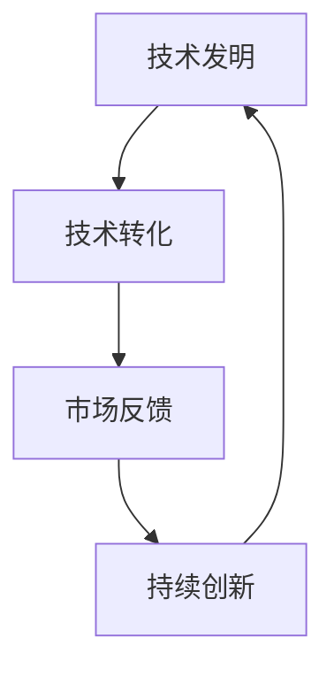
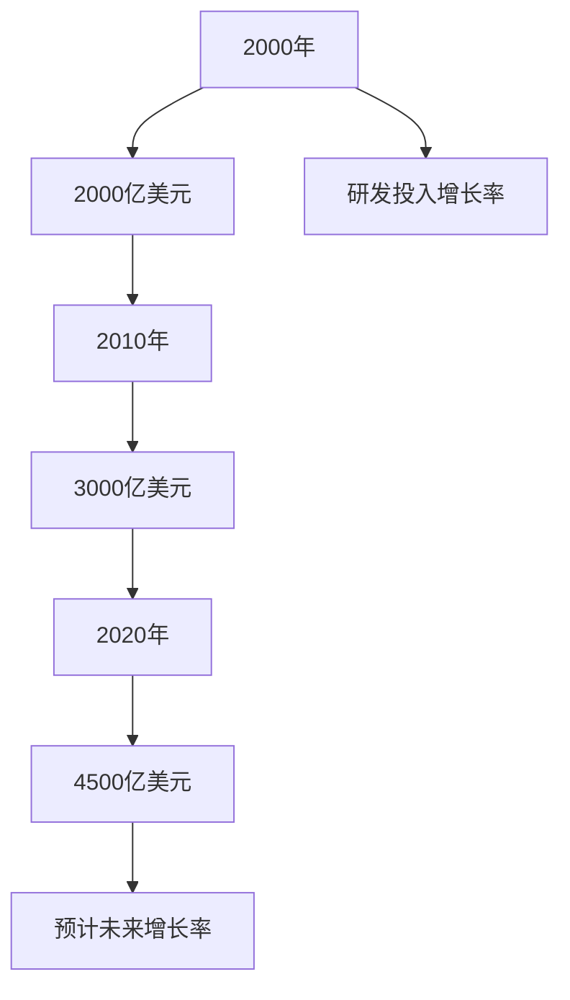
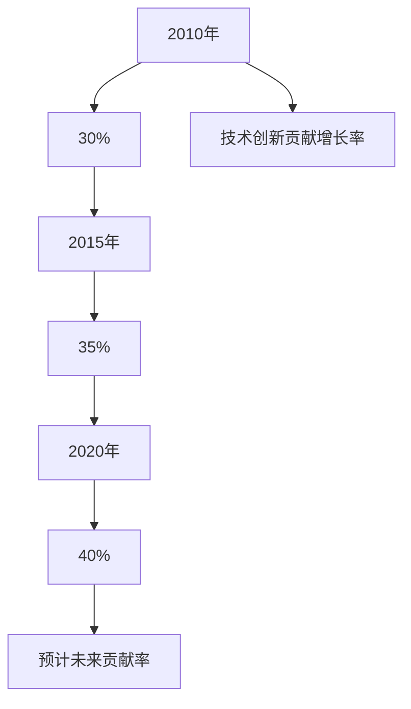
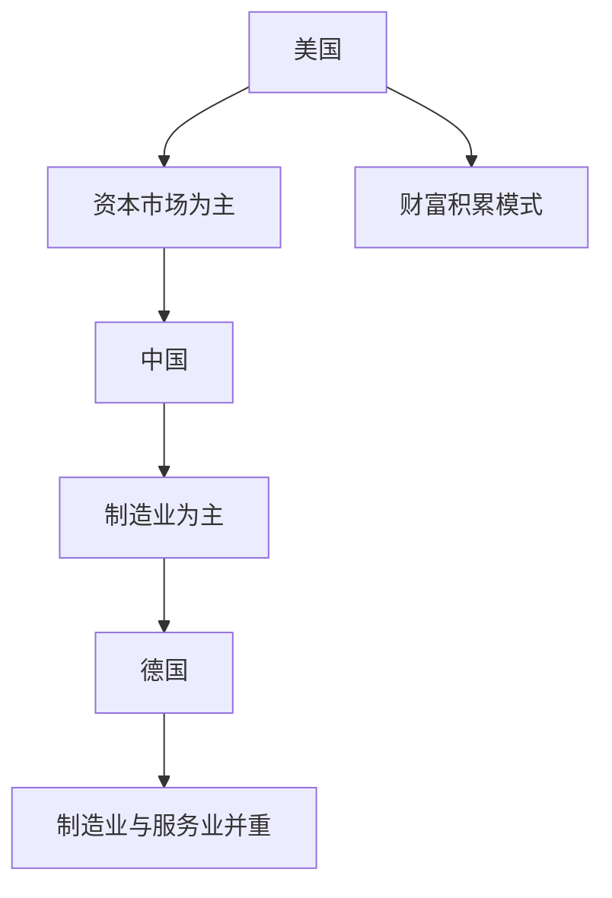
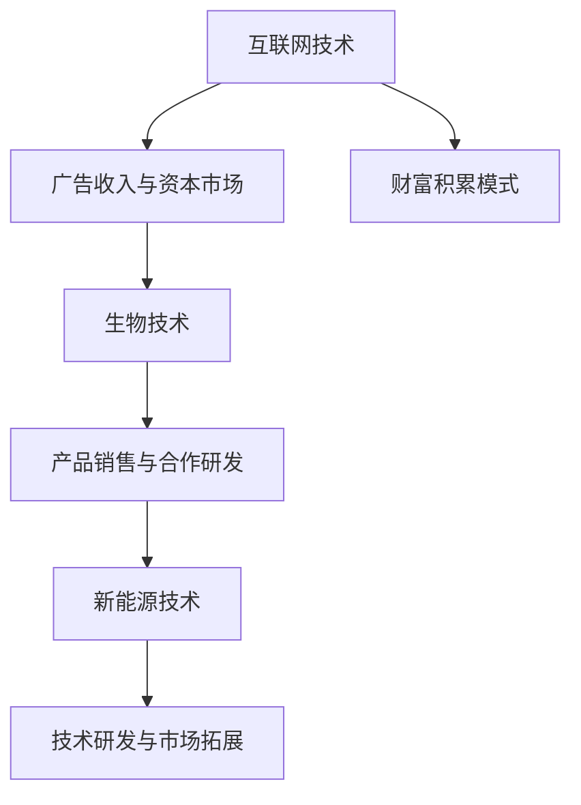

                 

# 《技术创新与财富积累的关系》

> 关键词：技术创新、财富积累、市场机制、企业行为、政策与战略、国际比较、伦理与社会问题

> 摘要：本文旨在探讨技术创新与财富积累之间的关系，分析财富积累的基本原理与机制，探讨技术创新对财富积累的促进作用，以及财富积累对技术创新的反馈效应。通过案例分析，揭示不同技术领域的财富积累模式，并探讨技术创新与财富积累的政策与战略，以及未来展望。

## 第一部分：引言

### 1.1 书籍背景与目的

#### 1.1.1 书籍背景

在当今社会，技术创新已成为推动经济发展和社会进步的重要动力。财富积累作为经济发展的核心目标，与技术创新紧密相连。然而，技术创新如何促进财富积累，财富积累又如何反作用于技术创新，这一问题的探讨具有重要的理论和实践价值。

本文以技术创新与财富积累的关系为研究对象，旨在揭示两者之间的相互作用机制，为政策制定者、企业决策者以及广大研究人员提供理论指导和实践参考。

#### 1.1.2 书籍目的

本文的主要目的是：

1. 分析技术创新与财富积累的基本概念与原理。
2. 探讨技术创新对财富积累的促进作用。
3. 分析财富积累对技术创新的反馈效应。
4. 通过案例分析，揭示不同技术领域的财富积累模式。
5. 提出促进技术创新与财富积累的政策与战略建议。

#### 1.1.3 书籍受众

本文主要面向以下受众：

1. 技术创新领域的研究人员与学者。
2. 企业决策者与高级管理人员。
3. 政策制定者与政府部门工作人员。
4. 对技术创新与财富积累感兴趣的广大读者。

### 1.2 技术创新的概念与分类

#### 1.2.1 技术创新的概念

技术创新是指通过技术进步推动产品、服务、生产过程或管理方式的改进和创新活动。技术创新不仅包括技术发明，还涉及将这些发明转化为实际应用的过程。

#### 1.2.2 技术创新的分类

1. **渐进性创新**：在现有技术基础上进行的小幅改进，如优化产品设计、提高生产效率等。
2. **颠覆性创新**：引入全新的技术或商业模式，颠覆现有市场格局，如互联网技术的崛起。
3. **集成创新**：将多个技术领域进行融合，形成新的技术体系，如物联网、人工智能等。

#### 1.2.3 技术创新的重要特征

1. **高风险性**：技术创新涉及大量的不确定性，需要投入大量资源进行研发。
2. **高回报性**：成功的创新往往带来巨大的经济和社会效益。
3. **高不确定性**：技术创新的过程充满不确定性，结果难以预测。
4. **高外部性**：技术创新的影响不仅局限于创新主体，还会对整个社会产生广泛的影响。

## 第二部分：财富积累的原理与机制

### 2.1 财富积累的基本原理

#### 2.1.1 财富积累的定义

财富积累是指个人、企业或国家在一段时间内通过增加资产、减少负债或增加收入等方式实现的财富增长。

#### 2.1.2 财富积累的驱动力

1. **经济增长**：通过提高生产效率、扩大市场规模等手段实现财富积累。
2. **技术创新**：推动生产方式的变革，提高产品竞争力，实现财富增长。
3. **资本积累**：通过投资获得回报，增加财富储备。
4. **劳动报酬**：提高劳动生产率，增加劳动者收入。

#### 2.1.3 财富积累的途径

1. **投资**：通过投资于股票、债券、房地产等资产实现财富积累。
2. **创业**：通过创办企业实现财富增长。
3. **储蓄**：通过积累储蓄实现财富积累。
4. **继承**：通过继承财产实现财富积累。

### 2.2 市场机制与企业行为

#### 2.2.1 市场机制的作用

市场机制是财富积累的重要驱动力，通过价格机制、竞争机制和供求机制等实现资源的有效配置。

#### 2.2.2 企业行为的动机与策略

企业行为的动机主要包括追求利润、市场份额和长期发展。企业策略包括产品创新、市场扩张、成本控制和组织管理。

#### 2.2.3 企业与市场的互动

企业通过市场机制实现资源的有效配置，进而实现财富积累。市场机制通过价格信号、市场需求和竞争压力等对企业行为产生影响，推动技术创新和财富积累。

### 2.3 技术创新与财富积累的关系

#### 2.3.1 技术创新对财富积累的促进作用

技术创新通过提高生产效率、降低成本、提高产品质量和扩大市场份额等方式，推动财富积累。

#### 2.3.2 财富积累对技术创新的反馈效应

财富积累为企业提供资金支持，促进技术创新。同时，技术创新的成功实施又带来财富积累，形成良性循环。

#### 2.3.3 技术创新与财富积累的相互依赖

技术创新与财富积累相互依赖，技术创新为财富积累提供动力，财富积累为技术创新提供资源支持。

## 第三部分：技术创新的财富积累案例分析

### 3.1 案例研究1：互联网技术的财富积累

#### 3.1.1 互联网技术的创新历程

互联网技术起源于20世纪60年代的美国，经过几十年的发展，逐渐演变为全球性的技术体系。互联网技术的创新历程主要包括以下几个方面：

1. **互联网的早期发展**：1969年，美国国防部的ARPANET项目启动，标志着互联网的诞生。
2. **互联网的商业化**：1991年，万维网（WWW）的出现，使互联网逐渐进入商业领域。
3. **移动互联网的兴起**：2007年，苹果公司推出第一代iPhone，移动互联网时代来临。
4. **大数据、云计算、人工智能等新兴技术的应用**：近年来，互联网技术与其他前沿技术的融合，推动了互联网技术的进一步发展。

#### 3.1.2 互联网企业财富积累的模式

互联网企业的财富积累模式主要包括以下几个方面：

1. **广告收入**：互联网企业通过广告获取收入，如谷歌、百度等搜索引擎。
2. **在线服务收费**：提供在线服务并收取费用，如腾讯的QQ、微信等社交平台。
3. **电子商务**：通过电子商务平台实现商品交易，如阿里巴巴、京东等。
4. **金融科技**：提供金融科技服务，如蚂蚁金服、陆金所等。

#### 3.1.3 互联网技术对财富积累的影响因素分析

互联网技术对财富积累的影响因素主要包括：

1. **技术创新**：互联网技术的不断创新，推动互联网企业的财富积累。
2. **市场需求**：市场需求的变化，影响互联网企业的商业模式和收入来源。
3. **政策环境**：政策环境对互联网企业的发展具有重要影响，如数据隐私保护、网络安全等。
4. **竞争格局**：互联网行业的竞争激烈，影响企业的市场份额和盈利能力。

### 3.2 案例研究2：生物技术的财富积累

#### 3.2.1 生物技术的创新过程

生物技术起源于20世纪70年代的基因工程，经过几十年的发展，已成为生命科学领域的重要分支。生物技术的创新过程主要包括以下几个方面：

1. **基因工程**：通过基因编辑、基因治疗等手段，实现对生物体的遗传改造。
2. **细胞工程**：利用细胞培养、干细胞技术等手段，实现对细胞的改造和应用。
3. **蛋白质工程**：通过蛋白质设计和改造，开发新的药物和生物材料。
4. **生物信息学**：利用生物信息学方法，分析生物大数据，揭示生物体的功能机制。

#### 3.2.2 生物技术企业的财富积累途径

生物技术企业的财富积累途径主要包括以下几个方面：

1. **研发投入**：通过持续的研发投入，推动技术创新，提升企业竞争力。
2. **产品销售**：通过销售自主开发的生物技术产品，实现收入和利润增长。
3. **合作与并购**：通过合作与并购，整合资源，扩大市场份额。
4. **资本市场**：通过资本市场融资，为企业的研发和扩张提供资金支持。

#### 3.2.3 生物技术财富积累的挑战与机遇

生物技术财富积累面临的挑战主要包括：

1. **技术风险**：生物技术涉及复杂的生物体系，技术风险较高。
2. **市场风险**：生物技术产品市场化进程缓慢，市场风险较大。
3. **政策风险**：政策环境不稳定，影响企业的发展。

生物技术财富积累的机遇主要包括：

1. **政策支持**：各国政府对生物技术产业的支持力度不断加大。
2. **市场需求**：生物技术产品在医疗、农业、环保等领域的需求持续增长。
3. **技术创新**：生物技术的不断创新，为财富积累提供新的动力。

### 3.3 案例研究3：新能源技术的财富积累

#### 3.3.1 新能源技术的创新趋势

新能源技术主要包括太阳能、风能、水能、生物质能等。新能源技术的创新趋势主要包括以下几个方面：

1. **技术进步**：新能源技术的不断进步，提高能量转化效率和降低成本。
2. **多样化**：新能源技术的多样化，满足不同应用场景的需求。
3. **智能化**：新能源技术与人工智能、大数据等前沿技术的融合，推动新能源产业的智能化发展。

#### 3.3.2 新能源企业的财富积累策略

新能源企业的财富积累策略主要包括以下几个方面：

1. **技术创新**：通过持续的技术创新，提高产品竞争力。
2. **市场拓展**：通过拓展国内外市场，扩大市场份额。
3. **资本运作**：通过资本市场融资，实现快速扩张。
4. **产业链整合**：通过整合产业链上下游资源，提高整体竞争力。

#### 3.3.3 新能源技术对财富积累的驱动作用

新能源技术对财富积累的驱动作用主要体现在以下几个方面：

1. **经济增长**：新能源产业的发展，推动经济增长和就业。
2. **市场机遇**：新能源市场的快速增长，为企业和投资者带来巨大的市场机遇。
3. **技术创新**：新能源技术的不断创新，推动产业升级和财富积累。

## 第四部分：技术创新与财富积累的政策与战略

### 4.1 技术创新政策的角色与功能

#### 4.1.1 政策对技术创新的支持

政策对技术创新的支持主要体现在以下几个方面：

1. **研发投入**：政府通过增加研发投入，支持企业进行技术创新。
2. **税收优惠**：政府通过税收优惠，减轻企业负担，鼓励技术创新。
3. **知识产权保护**：政府加强知识产权保护，激励企业进行技术创新。
4. **人才政策**：政府通过人才政策，吸引和培养技术创新人才。

#### 4.1.2 政策对财富积累的影响

政策对财富积累的影响主要体现在以下几个方面：

1. **促进经济增长**：政策支持技术创新，推动经济增长，为财富积累提供动力。
2. **优化资源配置**：政策引导资源向高技术产业和企业集中，优化资源配置，提高财富积累效率。
3. **促进公平竞争**：政策规范市场秩序，促进公平竞争，为企业创造良好的发展环境。

#### 4.1.3 政策制定的挑战与趋势

政策制定面临的挑战主要包括：

1. **技术创新风险**：技术创新存在不确定性，政策制定需平衡风险与收益。
2. **国际竞争**：全球竞争加剧，政策需具备国际视野，应对国际竞争。
3. **社会稳定**：政策需充分考虑社会稳定，避免因技术创新引发的社会问题。

政策制定的发展趋势主要包括：

1. **绿色政策**：随着环保意识的增强，绿色政策将成为政策制定的重要方向。
2. **数字化转型**：数字化转型成为趋势，政策需支持数字技术的创新发展。
3. **国际合作**：国际合作成为政策制定的重要趋势，政策需加强国际协调与合作。

### 4.2 企业战略与财富积累

#### 4.2.1 企业战略的类型与目标

企业战略的类型主要包括：

1. **成长战略**：通过扩大市场份额、提高生产效率等手段，实现企业规模的扩大。
2. **差异化战略**：通过产品创新、品牌建设等手段，实现企业与竞争对手的差异化。
3. **成本领先战略**：通过降低成本、提高生产效率等手段，实现企业竞争优势。

企业战略的目标主要包括：

1. **市场份额**：提高市场份额，实现市场领导地位。
2. **盈利能力**：提高盈利能力，实现可持续发展。
3. **技术创新**：推动技术创新，保持竞争优势。

#### 4.2.2 企业战略对技术创新的影响

企业战略对技术创新的影响主要体现在以下几个方面：

1. **资源配置**：企业战略影响资源的配置，支持技术创新的投入。
2. **组织结构**：企业战略影响组织结构，为技术创新提供组织保障。
3. **企业文化**：企业战略影响企业文化，激发员工的创新潜力。

#### 4.2.3 企业战略与财富积累的协同效应

企业战略与财富积累的协同效应主要体现在以下几个方面：

1. **技术创新**：通过技术创新，提高产品竞争力，实现财富积累。
2. **市场份额**：通过扩大市场份额，实现财富积累。
3. **成本控制**：通过成本控制，提高盈利能力，实现财富积累。

### 4.3 国家战略与财富积累

#### 4.3.1 国家战略的概念与重要性

国家战略是指国家为实现长远发展目标，在政治、经济、科技、文化等各个领域制定的发展战略。国家战略的重要性主要体现在以下几个方面：

1. **引领发展**：国家战略为国家发展提供方向和指引，引领国家发展。
2. **统筹协调**：国家战略实现各个领域的统筹协调，促进经济社会的全面发展。
3. **增强竞争力**：国家战略提高国家的国际竞争力，实现国家的繁荣和发展。

#### 4.3.2 国家战略对技术创新的引导

国家战略对技术创新的引导主要体现在以下几个方面：

1. **政策支持**：国家战略通过政策支持，鼓励企业进行技术创新。
2. **资源配置**：国家战略通过资源配置，支持技术创新项目。
3. **人才培养**：国家战略通过人才培养，为技术创新提供人才支持。

#### 4.3.3 国家战略与财富积累的关系

国家战略与财富积累的关系主要体现在以下几个方面：

1. **促进经济增长**：国家战略通过促进经济增长，为财富积累提供动力。
2. **优化产业结构**：国家战略通过优化产业结构，提高财富积累效率。
3. **增强国际竞争力**：国家战略通过增强国际竞争力，提高财富积累水平。

## 第五部分：技术创新与财富积累的未来展望

### 5.1 技术创新趋势与财富积累前景

#### 5.1.1 未来技术创新的发展方向

未来技术创新的发展方向主要包括：

1. **数字化转型**：数字化转型将成为未来技术创新的重要方向，如人工智能、大数据、物联网等。
2. **绿色技术创新**：随着环保意识的增强，绿色技术创新将成为未来技术创新的重要领域。
3. **生物技术**：生物技术的不断发展，将为财富积累带来新的机遇。
4. **新能源技术**：新能源技术的不断创新，将为财富积累提供新的动力。

#### 5.1.2 财富积累的未来挑战与机遇

未来财富积累面临的挑战主要包括：

1. **技术风险**：未来技术创新的不确定性，可能导致财富积累的风险。
2. **市场风险**：全球市场的不确定性，可能影响财富积累的稳定性。
3. **政策风险**：政策环境的变化，可能影响财富积累的可持续性。

未来财富积累的机遇主要包括：

1. **数字化经济发展**：数字化转型为财富积累带来新的机遇。
2. **绿色发展**：绿色发展为财富积累提供新的动力。
3. **国际合作**：国际合作为财富积累提供新的平台。

#### 5.1.3 技术创新与财富积累的可持续发展

技术创新与财富积累的可持续发展需要：

1. **技术创新**：持续的技术创新，为财富积累提供动力。
2. **人才培养**：培养创新人才，为技术创新提供人力支持。
3. **绿色发展**：推动绿色发展，实现财富积累与环境保护的平衡。
4. **国际合作**：加强国际合作，实现财富积累的共赢。

### 5.2 技术创新与财富积累的国际比较

#### 5.2.1 国际技术创新的格局与竞争

国际技术创新的格局与竞争主要包括以下几个方面：

1. **美国**：美国是全球技术创新的领先国家，拥有强大的科技创新能力和产业链优势。
2. **欧盟**：欧盟在生物技术、新能源技术等领域具有较强的技术创新能力。
3. **中国**：中国近年来在技术创新方面取得了显著进展，已成为全球技术创新的重要力量。
4. **日本**：日本在半导体、汽车等领域具有世界领先的技术创新能力。

#### 5.2.2 各国财富积累的模式与差异

各国财富积累的模式与差异主要包括以下几个方面：

1. **美国**：美国主要通过资本市场、创新创业等手段实现财富积累。
2. **欧盟**：欧盟主要通过产业升级、国际合作等手段实现财富积累。
3. **中国**：中国主要通过出口贸易、制造业升级等手段实现财富积累。
4. **日本**：日本主要通过技术创新、产业链整合等手段实现财富积累。

#### 5.2.3 国际合作与财富积累的共赢

国际合作对财富积累的共赢主要体现在以下几个方面：

1. **技术创新**：通过国际合作，实现技术创新的协同效应，提高财富积累效率。
2. **市场开拓**：通过国际合作，开拓国际市场，提高财富积累水平。
3. **人才培养**：通过国际合作，培养创新人才，为技术创新提供人力支持。

### 5.3 技术创新与财富积累的伦理与社会问题

#### 5.3.1 技术创新对社会的伦理影响

技术创新对社会的伦理影响主要包括以下几个方面：

1. **隐私权**：技术创新可能侵犯个人隐私，引发伦理问题。
2. **公平性**：技术创新可能加剧贫富差距，引发社会公平问题。
3. **安全性**：技术创新可能带来安全风险，影响社会稳定。

#### 5.3.2 财富积累对社会结构的影响

财富积累对社会结构的影响主要包括以下几个方面：

1. **阶层分化**：财富积累可能导致社会阶层分化，加剧社会矛盾。
2. **权力结构**：财富积累可能影响社会权力结构，导致权力失衡。
3. **文化变迁**：财富积累可能带来文化变迁，影响社会价值观。

#### 5.3.3 技术创新与财富积累的社会责任

技术创新与财富积累的社会责任主要包括以下几个方面：

1. **可持续发展**：技术创新应注重可持续发展，减少对环境的负面影响。
2. **公平分配**：技术创新应注重公平分配，减少贫富差距。
3. **社会责任**：技术创新者应承担社会责任，推动社会进步。

## 附录

### 附录A：技术创新与财富积累相关的统计数据与图表

附录A将提供与技术创新和财富积累相关的统计数据和图表，包括：

- 全球技术创新投入与产出的统计数据。
- 各国技术创新政策与财富积累的关系分析图表。
- 不同技术领域财富积累模式的比较图表。
- 技术创新对经济增长的贡献率图表。

### 附录B：技术创新与财富积累相关的参考文献

附录B将列出本文引用的参考文献，包括：

- 技术创新领域的权威研究论文。
- 财富积累理论的相关著作。
- 国际比较分析的研究报告。
- 政策与战略研究的相关文献。

## 附录C：技术创新与财富积累相关的案例分析

附录C将提供与技术创新和财富积累相关的案例分析，包括：

- 互联网企业技术创新与财富积累的案例分析。
- 生物技术企业技术创新与财富积累的案例分析。
- 新能源企业技术创新与财富积累的案例分析。

### 附录D：技术创新与财富积累相关的政策与战略建议

附录D将提出与技术创新和财富积累相关的政策与战略建议，包括：

- 国家层面技术创新与财富积累的政策建议。
- 企业层面技术创新与财富积累的战略建议。
- 国际合作层面技术创新与财富积累的建议。

### 附录E：技术创新与财富积累相关的工具与资源推荐

附录E将推荐与技术创新和财富积累相关的工具与资源，包括：

- 技术创新相关的研发工具与平台推荐。
- 财富积累相关的投资工具与平台推荐。
- 国际比较分析的相关数据资源与数据库推荐。

## 作者

作者：AI天才研究院/AI Genius Institute & 禅与计算机程序设计艺术 /Zen And The Art of Computer Programming

本文由AI天才研究院与禅与计算机程序设计艺术联合撰写，旨在深入探讨技术创新与财富积累之间的关系，为读者提供有价值的技术洞察和策略建议。通过本文的分析，我们希望读者能够更好地理解技术创新在财富积累中的作用，以及如何通过有效的政策与战略实现技术创新与财富积累的良性循环。

## 技术创新的定义与分类

技术创新是指通过技术进步推动产品、服务、生产过程或管理方式的改进和创新活动。技术创新不仅包括技术发明，还涉及将这些发明转化为实际应用的过程。技术创新的分类可以从不同的角度进行，以下将介绍几种常见的技术创新分类方法。

### 渐进性创新与颠覆性创新

#### 渐进性创新

渐进性创新是指在现有技术基础上进行的小幅改进，如优化产品设计、提高生产效率等。这类创新通常不会颠覆现有市场格局，而是通过不断优化和改进，提高产品的竞争力。例如，智能手机从2G到3G、4G再到5G的演进，虽然每一次升级都是重大的技术进步，但都是在原有技术基础上进行的渐进式改进。

#### 颠覆性创新

颠覆性创新则是指引入全新的技术或商业模式，颠覆现有市场格局。这类创新通常能够带来革命性的变化，如互联网的兴起、智能手机的普及等。颠覆性创新不仅改变了消费者的行为模式，还重塑了整个产业链。例如，特斯拉的电动汽车技术颠覆了传统的汽车产业，引领了汽车行业的绿色转型。

### 集成创新

集成创新是将多个技术领域进行融合，形成新的技术体系。这类创新通常涉及跨学科的协作，如物联网、人工智能等。集成创新能够实现不同技术的互补和协同，提高整体技术体系的性能。例如，物联网技术将传感器、互联网和大数据进行整合，实现了智能设备的互联互通。

### 技术创新的重要特征

#### 高风险性

技术创新涉及大量的不确定性，需要投入大量资源进行研发。由于技术创新的结果难以预测，因此具有较高的风险。例如，生物技术领域的新药研发，从实验室到市场化的过程可能需要数年甚至数十年的时间，且成功率较低。

#### 高回报性

尽管技术创新的风险较高，但成功的创新往往带来巨大的经济和社会效益。技术创新不仅能够为企业带来高额的利润，还能推动产业升级和经济增长。例如，互联网技术的商业化使得谷歌和Facebook等企业迅速崛起，成为全球科技巨头。

#### 高不确定性

技术创新的过程充满不确定性，从技术可行性到市场需求，每一个环节都可能存在变数。这种不确定性要求企业和投资者具备良好的风险管理和决策能力。例如，新能源技术的商业化应用虽然具有巨大的市场潜力，但技术成熟度和市场接受度仍存在不确定性。

#### 高外部性

技术创新的影响不仅局限于创新主体，还会对整个社会产生广泛的影响。技术创新能够推动社会进步，提高生活质量，但同时也可能带来新的社会问题。例如，人工智能技术的发展在提高生产效率的同时，也引发了关于就业、隐私和数据安全的担忧。

### 技术创新的基本原理

技术创新的基本原理包括以下几个方面：

1. **技术发明**：技术创新始于技术发明，如新材料的发现、新工艺的创造等。
2. **技术转化**：将技术发明转化为实际应用，如产品开发、市场推广等。
3. **市场反馈**：通过市场反馈，不断优化和改进技术，提高市场竞争力。
4. **持续创新**：技术创新是一个持续不断的过程，需要不断的投入和迭代。

#### 核心概念与联系

为了更好地理解技术创新的基本原理，我们可以使用Mermaid流程图来描述技术创新的过程。

在这个流程图中，技术发明是技术创新的起点，技术转化是将发明转化为实际应用的过程，市场反馈则是对技术应用的检验和优化，持续创新则是整个过程的循环迭代。

### 技术创新案例分析

为了进一步说明技术创新的原理和过程，我们可以通过一个实际的案例进行分析。

#### 案例分析：苹果公司的iPhone

苹果公司的iPhone是颠覆性创新的典型代表。以下是iPhone技术创新的流程：

1. **技术发明**：iPhone采用了先进的智能手机技术，包括多点触控屏、强大的处理器、高质量的摄像头等。
2. **技术转化**：苹果公司通过产品开发和市场推广，将iPhone推向市场。
3. **市场反馈**：iPhone的成功推动了智能手机市场的变革，成为全球最畅销的智能手机品牌。
4. **持续创新**：苹果公司不断推出新款iPhone，如iPhone 4、iPhone 5、iPhone X等，持续优化用户体验。

通过这个案例，我们可以看到技术创新的基本原理是如何在实际中应用的。

### 总结

技术创新是推动经济发展和社会进步的重要动力。理解技术创新的定义、分类和基本原理，有助于我们更好地把握技术创新的发展趋势，为企业和国家的技术创新提供指导。通过实际案例的分析，我们可以更深入地理解技术创新的过程和影响。

## 财富积累的基本原理

财富积累是指个人、企业或国家在一段时间内通过增加资产、减少负债或增加收入等方式实现的财富增长。财富积累不仅反映了一个经济实体的经济实力，也是其持续发展的基础。本文将从财富积累的定义、财富积累的驱动力和财富积累的途径三个方面来探讨财富积累的基本原理。

### 财富积累的定义

财富积累是指个人、企业或国家通过增加资产、减少负债或增加收入等方式，使其总财富在一定时间内实现增长的过程。财富积累不仅包括货币资产的积累，如储蓄、投资收益等，还包括实物资产的积累，如房地产、机械设备等。财富积累的衡量指标通常包括财富总额、财富增长率、人均财富等。

### 财富积累的驱动力

财富积累的驱动力主要包括以下几个方面：

1. **经济增长**：经济增长是财富积累的根本动力。通过提高生产效率、扩大市场规模等手段，经济增长能够直接推动财富积累。例如，一个国家的GDP增长，意味着该国整体财富的增加。

2. **技术创新**：技术创新是推动财富积累的重要驱动力。通过引入新技术、新产品或新服务，企业能够提高生产效率，降低成本，从而实现财富的积累。例如，互联网技术的崛起，不仅改变了消费者的生活方式，也创造了巨大的商业价值。

3. **资本积累**：资本积累是指通过投资获得回报，增加财富储备的过程。投资包括股票、债券、房地产等，通过投资获得的收益是财富积累的重要途径。例如，通过投资股票，投资者可以获得股息和股价上涨的收益。

4. **劳动报酬**：劳动报酬是指通过提高劳动生产率，增加劳动者收入，从而实现财富积累。通过技能培训、职业发展等手段，提高劳动者的生产能力，能够实现财富的积累。例如，一个技术人员通过不断学习和提升技能，可以获得更高的薪资和奖金。

### 财富积累的途径

财富积累的途径主要包括以下几个方面：

1. **投资**：通过投资于股票、债券、房地产等资产，实现财富的积累。投资需要考虑风险和收益的平衡，投资者应根据自己的风险承受能力和投资目标，选择合适的投资策略。

2. **创业**：通过创办企业，实现财富的增长。创业不仅需要资金支持，还需要创新能力和经营管理能力。成功的创业企业能够实现快速增长，带来高额的回报。

3. **储蓄**：通过积累储蓄，实现财富的积累。储蓄是财富积累的基础，稳定的储蓄习惯能够为未来的投资和消费提供资金支持。

4. **继承**：通过继承财产，实现财富的积累。继承是财富积累的一种途径，但通常需要合法的继承程序和合理的继承安排。

### 财富积累的影响因素

财富积累受到多种因素的影响，包括经济环境、政策环境、社会环境等。经济环境的稳定和繁荣能够为财富积累提供良好的条件。政策环境的支持，如税收政策、投资政策等，也能够促进财富积累。社会环境的变化，如教育水平、文化氛围等，也会对财富积累产生影响。

### 总结

财富积累是一个复杂的过程，涉及多个方面的因素。理解财富积累的基本原理，有助于我们更好地把握财富积累的规律，制定有效的财富积累策略。通过经济增长、技术创新、资本积累和劳动报酬等多种途径，我们可以实现财富的积累和增长。

## 市场机制与企业行为

### 2.2.1 市场机制的作用

市场机制是指通过价格、供求、竞争等手段来实现资源在市场中的配置和调节。在市场经济中，市场机制发挥着至关重要的作用，主要表现在以下几个方面：

1. **资源配置**：市场机制通过价格信号，将资源引导到最有效率的用途上。当某种商品供不应求时，价格上升，吸引更多的资源投入到该领域，从而实现资源的优化配置。

2. **激励创新**：市场机制通过竞争压力，激励企业不断创新和提高生产效率。企业在市场竞争中追求利润最大化，需要通过技术创新、产品创新和管理创新来降低成本、提高质量、满足消费者需求。

3. **信息传递**：市场机制通过供求关系的变化，传递市场信息。消费者通过价格信号了解商品的价值，企业通过市场反馈了解消费者需求，从而调整生产策略和产品结构。

4. **调节供需**：市场机制通过供求关系的变化，调节商品的供需平衡。当市场供过于求时，价格下降，抑制过度生产；当市场供不应求时，价格上涨，刺激生产增加。

### 2.2.2 企业行为的动机与策略

企业行为的动机主要源于追求利润最大化、市场份额和长期发展。企业在不同发展阶段和市场环境下，会采取不同的行为策略来应对外部环境和内部挑战。以下是企业行为动机与策略的几个方面：

1. **追求利润最大化**：企业通过提高生产效率、降低成本、提高产品附加值等手段，实现利润最大化。企业在市场竞争中，需要不断优化内部管理和生产流程，提高生产效率和产品质量。

2. **市场份额**：企业通过扩大市场份额，提升市场地位。企业可以通过产品差异化、市场细分、品牌推广等方式，吸引更多的消费者，提高市场份额。

3. **技术创新**：企业通过持续的技术创新，保持竞争优势。技术创新不仅包括产品创新，还包括工艺创新、管理创新等。通过技术创新，企业能够提高产品质量、降低生产成本，从而在市场上占据有利地位。

4. **成本控制**：企业通过成本控制，提高盈利能力。成本控制包括降低原材料成本、提高生产效率、减少浪费等。通过有效的成本控制，企业能够在市场竞争中保持价格优势。

5. **风险管理**：企业通过风险管理，降低经营风险。企业面临多种风险，如市场风险、信用风险、操作风险等。通过建立健全的风险管理机制，企业能够降低风险，保障企业稳定发展。

### 2.2.3 企业与市场的互动

企业作为市场的主体，其行为受到市场环境的影响，同时也对市场产生反作用。企业与市场的互动主要体现在以下几个方面：

1. **市场反馈**：企业通过市场反馈了解消费者需求和市场变化，调整产品策略和生产计划。市场反馈是企业决策的重要依据，有助于企业提高市场竞争力。

2. **价格竞争**：企业在市场竞争中通过价格手段来争夺市场份额。价格竞争促使企业不断提高产品质量和服务水平，降低成本，从而在价格和品质之间找到最佳平衡点。

3. **技术创新**：市场需求的不断变化，推动企业进行技术创新。企业通过研发新产品、优化生产工艺，满足消费者需求，提高市场占有率。

4. **产业链整合**：企业在市场中通过上下游产业链的整合，实现资源优化配置和协同发展。产业链整合有助于企业降低成本、提高效率，增强市场竞争力。

5. **品牌建设**：企业在市场竞争中通过品牌建设，提高品牌知名度和美誉度。品牌建设不仅有助于企业吸引消费者，还能提升企业的市场地位和话语权。

### 2.2.4 市场机制与企业行为的协调与平衡

市场机制与企业行为之间的协调与平衡是实现财富积累和技术创新的关键。以下是如何实现市场机制与企业行为的协调与平衡的几点建议：

1. **政策引导**：政府通过制定合理的政策和法规，引导市场机制与企业行为。例如，通过税收优惠、研发资助等措施，激励企业进行技术创新和投资。

2. **市场竞争**：鼓励市场竞争，激发企业活力。通过市场竞争，促使企业不断提高产品质量和服务水平，实现资源优化配置。

3. **法律法规**：建立健全的法律法规体系，保护知识产权，规范市场行为。知识产权保护有助于激励技术创新，规范市场竞争。

4. **企业文化建设**：加强企业文化建设，培养企业的社会责任感和创新能力。企业文化建设有助于企业形成持续发展的内在动力。

5. **人才战略**：实施人才战略，培养和引进高素质人才。人才是技术创新和企业发展的关键，高素质人才有助于推动企业技术创新和市场竞争力。

### 总结

市场机制与企业行为在财富积累和技术创新中发挥着重要作用。通过市场机制的资源配置、激励创新、信息传递和调节供需等功能，企业能够更好地应对市场变化，实现财富积累。同时，企业通过技术创新、成本控制、风险管理等策略，提高市场竞争力，实现可持续发展。实现市场机制与企业行为的协调与平衡，是实现技术创新与财富积累的关键。

### 技术创新对财富积累的促进作用

技术创新是推动财富积累的重要动力，其对经济增长的促进作用主要体现在以下几个方面：

#### 1. 提高生产效率

技术创新通过引入新技术、新工艺，提高生产效率，降低生产成本。例如，工业化时期的机械化生产替代了传统的手工生产，大大提高了生产效率。在信息技术领域，计算机和自动化技术的应用，使得生产流程更加高效和精确。提高生产效率不仅能够降低企业的运营成本，还能增加企业的利润空间，从而实现财富积累。

#### 2. 创新产品与服务

技术创新推动新产品的研发和服务的创新，满足市场需求，扩大市场规模。例如，智能手机的发明和普及，改变了人们的通信方式，创造了巨大的市场需求。在医疗领域，生物技术的发展带来了新的药物和治疗手段，提高了医疗服务的质量和效率。新产品的推出和服务创新不仅能够提高企业的竞争力，还能带来新的收入来源，促进财富积累。

#### 3. 扩大市场范围

技术创新通过降低交易成本、提高市场透明度，扩大市场范围。例如，互联网技术的普及使得全球贸易变得更加便捷，电子商务平台打破了地域限制，使得企业能够更轻松地进入国际市场。市场范围的扩大不仅增加了企业的销售渠道，还提高了市场占有率，从而推动财富积累。

#### 4. 促进产业升级

技术创新推动传统产业的转型升级，提升产业附加值。例如，汽车产业的电动化转型，不仅减少了环境污染，还提升了汽车的性能和安全性。在制造业，智能制造技术的应用，使得生产过程更加自动化和智能化，提高了生产效率和产品质量。产业升级能够提高整个产业链的附加值，从而带动财富积累。

#### 5. 创造就业机会

技术创新带动新兴产业的发展，创造大量就业机会。例如，互联网产业的快速发展，不仅带来了新的工作岗位，还促进了相关产业链的繁荣。在新能源领域，太阳能、风能等可再生能源技术的发展，创造了大量的就业机会。就业机会的增加不仅能够提高劳动者的收入水平，还能促进社会整体财富的增长。

#### 技术创新与财富积累的机制分析

技术创新对财富积累的促进作用主要通过以下几个机制实现：

1. **直接经济效应**：技术创新直接提高了生产效率和产品质量，降低了生产成本，从而增加了企业的利润。例如，通过自动化技术提高生产效率，企业可以在相同的产出下减少成本，实现利润增长。

2. **间接经济效应**：技术创新通过提升产业链的整体竞争力，推动整个产业的升级和扩张，进而促进经济增长和财富积累。例如，一个产业的技术创新可能会带动上下游产业链的发展，形成产业集群效应，从而推动整体经济的增长。

3. **资本积累效应**：技术创新提高了企业的盈利能力，为企业提供了更多的资本积累。这些积累的资本可以用于进一步的技术研发、扩大生产规模或进行其他投资，从而实现财富的循环积累。

4. **创新扩散效应**：技术创新不仅对企业自身产生积极作用，还会通过技术扩散和知识共享，影响整个经济体系。例如，一个企业的新产品成功后，其技术可能会被其他企业模仿或改进，从而在整个市场上推广，推动整体经济的创新和财富积累。

#### 技术创新案例分析

以下通过两个实际案例，说明技术创新如何促进财富积累：

1. **苹果公司**：苹果公司通过持续的技术创新，推出了多个革命性产品，如iPhone、iPad和Mac等。这些产品的成功不仅带来了巨大的市场份额，还推动了相关产业链的发展，促进了整个经济的增长。例如，iPhone的成功推动了触摸屏技术的普及，促进了触摸屏产业的繁荣。

2. **特斯拉公司**：特斯拉通过技术创新，推出了多款电动汽车，引领了汽车产业的电动化转型。特斯拉的成功不仅带动了电动汽车市场的增长，还促进了电池技术、充电基础设施等相关产业的发展。特斯拉的技术创新为整个汽车产业的升级提供了新的方向，推动了经济的转型和财富积累。

### 总结

技术创新是推动财富积累的重要动力。通过提高生产效率、创新产品与服务、扩大市场范围、促进产业升级和创造就业机会，技术创新为经济增长和财富积累提供了强有力的支撑。理解技术创新与财富积累的机制，有助于我们更好地把握技术创新的发展趋势，制定有效的经济政策和战略，促进经济的可持续发展。

### 财富积累对技术创新的反馈效应

财富积累对技术创新具有显著的反馈效应，这种效应主要通过资本积累、市场需求和社会资本等途径来实现。

#### 1. 资本积累对技术创新的驱动作用

财富积累能够为企业提供更多的资本积累，这些资本可以用于研发投入和技术创新。资本积累有助于企业突破技术瓶颈，推动新技术的研发和应用。例如，谷歌公司在成立初期，通过财富积累和资本运作，积累了大量资金用于技术研发，最终在搜索引擎、云计算和人工智能等领域取得了重大突破。资本积累还为风险投资提供了资金支持，推动了初创企业的成长和发展。例如，硅谷的风险投资公司通过投资技术创新项目，不仅实现了财富的积累，还为整个科技行业提供了创新的动力。

#### 2. 市场需求对技术创新的促进作用

财富积累带来的消费能力提升，会刺激市场需求，进而推动技术创新。随着人们收入的增加，消费者对高品质、高附加值的产品和服务需求日益增长，这促使企业不断进行技术创新，以满足市场需求。例如，随着中产阶级的崛起，对智能家居、健康医疗等高科技产品的需求增加，推动了这些领域的技术创新。此外，财富积累带来的市场扩张，也为企业提供了更广阔的市场空间，鼓励企业进行技术创新以抢占市场份额。例如，中国的国内市场庞大，吸引了大量跨国公司进行技术创新以满足中国市场的需求。

#### 3. 社会资本对技术创新的支撑作用

财富积累不仅体现在物质财富的增加，还包括社会资本的积累。社会资本是指社会成员之间的信任关系、网络资源和合作机制。财富积累带来的社会资本增加，有助于促进技术创新。例如，一个企业通过建立良好的社会关系网络，可以更容易地获得技术合作和人才支持。社会资本还能够促进知识共享和合作创新，从而推动技术进步。例如，硅谷的科技企业通过紧密的合作关系，共享技术和资源，实现了技术创新的快速发展。

#### 财富积累对技术创新的反馈效应机制

财富积累对技术创新的反馈效应可以通过以下机制来实现：

1. **资金投入**：财富积累为企业提供了更多的资金，用于技术研发和设备更新。例如，一家制药公司通过财富积累，可以增加研发投入，加快新药的研发进程。

2. **人才吸引**：财富积累能够提高企业的薪酬水平和福利待遇，吸引更多的优秀人才。这些人才具备创新能力和专业知识，有助于推动技术创新。例如，高薪和良好的工作环境吸引了全球顶尖科学家和工程师加入科技企业。

3. **市场拓展**：财富积累带来的市场需求增加，促使企业进行产品创新和市场拓展。企业通过技术创新，开发新产品，满足市场需求，从而实现财富的积累。例如，苹果公司通过不断推出创新产品，满足消费者对高科技产品的需求，实现了财富的快速增长。

4. **知识共享**：财富积累带来的社会资本增加，有助于促进知识共享和合作创新。企业通过合作和交流，共享技术和资源，推动技术进步。例如，学术机构和企业的合作，促进了科研创新和产业应用。

#### 案例分析

为了更好地理解财富积累对技术创新的反馈效应，我们可以通过以下案例分析：

1. **微软公司**：微软作为全球领先的软件企业，通过其操作系统的成功，积累了大量财富。这些财富使得微软能够持续进行技术研发，保持其在软件行业的领先地位。微软通过不断的创新，如云计算和人工智能技术的研发，继续推动企业的发展。

2. **阿里巴巴集团**：阿里巴巴通过电商平台的成功，积累了庞大的财富。这些财富不仅用于继续拓展电商市场，还用于投资和孵化其他创新项目，如云计算、物联网和金融科技等。这些创新项目不仅扩大了阿里巴巴的业务范围，还推动了整个行业的技术进步。

3. **特斯拉公司**：特斯拉通过电动汽车的成功，积累了巨额财富。这些财富用于研发更先进的技术，如自动驾驶和电池技术，推动了整个电动汽车行业的发展。特斯拉的创新不仅提升了自身的市场地位，还带动了其他企业的技术进步。

### 总结

财富积累对技术创新的反馈效应体现在资本积累、市场需求和社会资本等多个方面。通过资金投入、人才吸引、市场拓展和知识共享等机制，财富积累为技术创新提供了强有力的支撑。理解财富积累对技术创新的反馈效应，有助于我们更好地制定相关政策，促进技术创新和经济发展。

### 技术创新与财富积累的相互依赖

技术创新与财富积累之间的相互依赖关系，是现代经济发展中一个至关重要的问题。技术创新不仅能够直接推动财富积累，同时财富积累也反过来促进技术创新，形成一种良性循环。以下从技术创新促进财富积累、财富积累促进技术创新以及两者相互依赖的机制三个方面进行详细探讨。

#### 技术创新促进财富积累

1. **提高生产效率**：技术创新能够通过引入新技术、新工艺，显著提高生产效率。例如，工业革命期间，蒸汽机的发明和普及大大提升了生产效率，推动了工厂生产的规模化，从而提高了整体财富积累。

2. **扩大市场规模**：技术创新可以创造新的市场和需求，从而扩大市场规模。以互联网技术为例，电子商务平台如亚马逊和阿里巴巴的兴起，不仅改变了消费者的购物习惯，还极大地拓展了市场规模，为企业带来了巨大的财富。

3. **创造就业机会**：技术创新能够带动相关产业链的发展，创造大量就业机会。例如，智能手机的发明和普及，不仅直接创造了手机制造商的就业机会，还带动了软件开发、移动互联网服务等相关行业的就业机会，从而推动了财富的积累。

#### 财富积累促进技术创新

1. **资本积累**：财富积累为技术创新提供了必要的资金支持。企业通过财富积累，可以获得更多的资金用于研发投入，从而推动新技术和新产品的开发。例如，谷歌和苹果等科技巨头，通过多年的盈利和资本积累，持续进行高额的研发投入，推动了技术创新的快速发展。

2. **市场需求**：财富积累带来的消费能力提升，刺激了市场需求，进而促使企业不断进行技术创新。例如，随着中产阶级的崛起，消费者对高品质和高科技产品的需求增加，推动了电子消费品、智能家居等领域的技术创新。

3. **人才培养**：财富积累可以为企业提供更好的薪酬和福利待遇，吸引和留住高素质人才。高素质人才是技术创新的关键，他们的加入和持续工作，能够推动企业的技术进步和创新能力。

#### 技术创新与财富积累的相互依赖机制

技术创新与财富积累之间的相互依赖关系，可以通过以下几个机制来实现：

1. **资金循环**：技术创新需要大量的资金投入，而财富积累为企业提供了资金来源。企业通过技术创新实现利润增长后，可以将部分利润再投入到新的技术创新中，形成资金循环。例如，特斯拉通过其电动汽车的成功，积累了大量财富，并将其用于进一步研发自动驾驶和电池技术。

2. **市场需求与供给**：技术创新提升了产品和服务的质量和效率，满足了市场需求，从而推动了财富的积累。同时，财富积累带来的市场需求，又促使企业进行技术创新，以满足不断变化的市场需求。例如，互联网技术的创新，不仅改变了消费者的生活方式，也创造了巨大的市场需求，推动了互联网行业的财富积累。

3. **知识共享**：技术创新过程中产生的知识和技术，可以通过各种渠道进行传播和共享，从而促进其他领域的财富积累。例如，硅谷的创新生态系统，通过企业之间的合作和知识共享，推动了整个地区的技术进步和经济增长。

#### 案例分析

为了更好地理解技术创新与财富积累的相互依赖关系，我们可以通过以下案例分析：

1. **苹果公司**：苹果公司通过持续的技术创新，推出了iPhone、iPad和Mac等一系列革命性产品，这些产品不仅改变了消费者的生活方式，还创造了巨大的市场需求，推动了财富的积累。苹果公司通过其强大的盈利能力，持续进行技术创新和研发，进一步巩固了其在全球科技行业的领先地位。

2. **阿里巴巴集团**：阿里巴巴通过电商平台的成功，积累了庞大的财富。这些财富不仅用于继续拓展电商市场，还用于投资和孵化其他创新项目，如云计算、物联网和金融科技等。这些创新项目不仅扩大了阿里巴巴的业务范围，还推动了整个行业的技术进步和财富积累。

3. **特斯拉公司**：特斯拉通过电动汽车的成功，积累了巨额财富。这些财富用于研发更先进的技术，如自动驾驶和电池技术，推动了整个电动汽车行业的发展。特斯拉的创新不仅提升了自身的市场地位，还带动了其他企业的技术进步和财富积累。

### 总结

技术创新与财富积累之间的相互依赖关系，是一种相互促进、相互强化的良性循环。技术创新通过提高生产效率、扩大市场规模和创造就业机会，直接推动财富积累。同时，财富积累通过资本积累、市场需求和社会资本等途径，促进技术创新。理解这一相互依赖关系，有助于我们更好地制定相关政策，推动技术创新和财富积累的协调发展。

### 技术创新与财富积累的案例分析

在探讨技术创新与财富积累的关系时，通过具体的案例研究可以更好地理解这一过程。以下将分析三个典型的案例：互联网技术的财富积累、生物技术的财富积累和新能源技术的财富积累。

#### 3.1 案例研究1：互联网技术的财富积累

**互联网技术的创新历程**

互联网技术起源于20世纪60年代的美国，最初是作为军事项目的一部分进行研发。随着时间的推移，互联网逐渐从学术和研究机构扩展到商业领域。1991年，万维网（WWW）的发明使得互联网的可用性大幅提高，加速了互联网的商业化进程。2000年代初，宽带网络的普及和移动设备的兴起，使得互联网技术进一步扩展到全球市场。

**互联网企业财富积累的模式**

互联网企业的财富积累主要通过以下几个模式实现：

1. **广告收入**：互联网公司通过提供免费服务，并通过广告收入实现盈利。例如，谷歌通过其搜索引擎和广告网络，成为全球最赚钱的互联网公司之一。

2. **在线服务收费**：互联网公司提供各种在线服务，如电子邮件、云计算、社交媒体等，并通过收取服务费用实现盈利。例如，腾讯通过其QQ和微信等社交平台，积累了大量的用户和广告收入。

3. **电子商务**：通过电子商务平台实现商品交易，互联网公司能够获得交易佣金。例如，阿里巴巴通过其电商平台，为商家提供销售渠道，并收取交易佣金。

4. **金融科技**：随着互联网技术的发展，金融科技（FinTech）领域也应运而生。互联网公司通过提供在线支付、借贷、保险等服务，实现了新的收入来源。

**互联网技术对财富积累的影响因素分析**

互联网技术对财富积累的影响因素包括：

1. **技术创新**：互联网技术的不断进步，如人工智能、大数据和物联网的应用，为互联网企业带来了新的商业模式和盈利机会。

2. **市场需求**：消费者对互联网服务的需求不断增长，推动了互联网企业的发展。

3. **政策环境**：政府对互联网行业的支持政策，如数据隐私保护、网络安全等，也对互联网企业的财富积累产生了重要影响。

4. **竞争格局**：互联网行业的竞争激烈，企业需要不断创新和优化服务，才能在竞争中脱颖而出。

#### 3.2 案例研究2：生物技术的财富积累

**生物技术的创新过程**

生物技术起源于20世纪70年代的基因工程，随后迅速发展。生物技术的创新过程主要包括：

1. **基因工程**：通过基因编辑和基因治疗等手段，实现对生物体的遗传改造，从而治疗遗传疾病或增强生物体的特性。

2. **细胞工程**：通过细胞培养和干细胞技术，实现对细胞的改造和应用，用于治疗疾病或开发新的生物制品。

3. **蛋白质工程**：通过蛋白质设计和改造，开发新的药物和生物材料，提高药物的治疗效果和安全性。

4. **生物信息学**：利用生物信息学方法，分析生物大数据，揭示生物体的功能机制，为生物技术的研发提供基础。

**生物技术企业的财富积累途径**

生物技术企业的财富积累途径包括：

1. **研发投入**：生物技术企业需要大量的研发投入，用于新药的研发和生物技术的改进。

2. **产品销售**：生物技术企业通过销售自主开发的生物制品，如新药、诊断试剂等，实现收入和利润增长。

3. **合作与并购**：通过与其他企业合作或并购，生物技术企业可以整合资源，加快新技术的开发和商业化。

4. **资本市场**：通过资本市场融资，如上市和股权融资，生物技术企业可以获得更多的资金支持。

**生物技术财富积累的挑战与机遇**

生物技术财富积累面临的挑战包括：

1. **技术风险**：生物技术涉及复杂的生物体系，技术风险较高。

2. **市场风险**：生物技术产品市场化进程缓慢，市场风险较大。

3. **政策风险**：政策环境不稳定，可能影响企业的发展。

生物技术财富积累的机遇包括：

1. **政策支持**：各国政府对生物技术产业的支持力度不断加大，为企业提供了良好的发展环境。

2. **市场需求**：生物技术产品在医疗、农业、环保等领域的需求持续增长。

3. **技术创新**：生物技术的不断创新，为财富积累提供了新的动力。

#### 3.3 案例研究3：新能源技术的财富积累

**新能源技术的创新趋势**

新能源技术主要包括太阳能、风能、水能、生物质能等。新能源技术的创新趋势包括：

1. **技术进步**：新能源技术的不断进步，如太阳能电池效率的提升、风力涡轮机性能的优化等。

2. **多样化**：新能源技术的多样化，满足不同应用场景的需求。

3. **智能化**：新能源技术与人工智能、大数据等前沿技术的融合，推动新能源产业的智能化发展。

**新能源企业的财富积累策略**

新能源企业的财富积累策略包括：

1. **技术创新**：通过持续的技术创新，提高新能源设备的效率和可靠性。

2. **市场拓展**：通过拓展国内外市场，扩大市场份额。

3. **资本运作**：通过资本市场融资，为企业的研发和扩张提供资金支持。

4. **产业链整合**：通过整合产业链上下游资源，提高整体竞争力。

**新能源技术对财富积累的驱动作用**

新能源技术对财富积累的驱动作用主要体现在以下几个方面：

1. **经济增长**：新能源产业的发展，推动经济增长和就业。

2. **市场机遇**：新能源市场的快速增长，为企业和投资者带来巨大的市场机遇。

3. **技术创新**：新能源技术的不断创新，推动产业升级和财富积累。

### 总结

通过以上案例分析，我们可以看到技术创新在互联网技术、生物技术和新能源技术等领域的财富积累过程中发挥了重要作用。技术创新不仅直接促进了企业财富的积累，还通过提高生产效率、创造市场需求和吸引资本投入，形成了财富积累与技术创新的良性循环。这些案例为我们提供了有益的启示，表明在技术创新和财富积累的过程中，政策支持、市场环境和技术进步都是关键因素。

## 技术创新与财富积累的政策与战略

### 4.1 技术创新政策的角色与功能

技术创新政策在国家经济发展中起着至关重要的作用。这些政策通过多种手段支持技术创新，从而促进财富积累。以下从政府支持技术创新的角色、政策功能及其对财富积累的影响三个方面进行详细探讨。

#### 政府支持技术创新的角色

1. **引导者**：政府在技术创新中扮演着重要的引导者角色。通过制定明确的创新战略和规划，政府可以为企业和科研机构提供指导，明确技术创新的方向和目标。

2. **支持者**：政府通过提供资金、税收优惠和研发资助等手段，支持企业和科研机构进行技术创新。这种支持不仅有助于缓解企业研发过程中的资金压力，还能激励企业持续投入技术创新。

3. **监管者**：政府通过监管和制定标准，确保技术创新过程中遵守法律法规，保护知识产权，维护市场秩序。有效的监管能够为企业提供稳定和公平的市场环境，促进技术创新。

#### 政策功能

1. **资源配置**：技术创新政策通过财政投入、税收优惠和政府采购等手段，优化资源配置，将资源引导到高技术产业和关键技术领域，从而提高技术创新的效率。

2. **激励创新**：政府通过制定各种激励措施，如研发税收优惠、创新奖金、知识产权保护等，激励企业和个人进行技术创新。这些激励措施能够提高企业的创新动力，推动技术进步。

3. **风险分担**：技术创新过程中存在较高的风险，政府通过建立风险投资体系和提供创新担保等手段，分担企业的创新风险，从而鼓励企业大胆创新。

4. **国际合作**：政府通过推动国际科技合作，引进国外先进技术和管理经验，提升本国技术创新能力。国际合作有助于提升企业的国际竞争力，促进技术扩散和知识共享。

#### 政策对财富积累的影响

1. **提高生产效率**：技术创新政策通过支持技术研发和推广新技术，提高企业的生产效率，降低生产成本，从而提高企业的盈利能力。生产效率的提升有助于企业实现财富积累。

2. **扩大市场规模**：技术创新政策能够促进新产品和新服务的开发，满足市场需求，扩大市场规模。市场规模的扩大为企业提供了更多的销售机会，从而实现财富的积累。

3. **促进产业升级**：技术创新政策推动传统产业的升级和新兴产业的培育，提升产业链的整体竞争力。产业升级能够提高整个经济的附加值，带动财富积累。

4. **增强国际竞争力**：通过推动技术创新和产业升级，国家能够提高在国际市场的竞争力。国际竞争力的增强有助于企业拓展海外市场，增加出口收入，从而实现财富积累。

#### 成功的案例分析

以下通过两个成功的案例，说明技术创新政策对财富积累的积极作用。

1. **德国**：德国的“工业4.0”战略是其技术创新政策的成功案例。通过推动智能制造和工业互联网的发展，德国提升了制造业的效率和竞争力，推动了经济的持续增长。德国的制造业在国际市场上占据了重要地位，实现了财富的积累。

2. **新加坡**：新加坡政府通过一系列技术创新政策，支持本地企业和科研机构进行研发和创新。这些政策包括研发资助、税收优惠和知识产权保护等。新加坡在生物科技、金融科技等领域取得了显著进展，推动了经济的多元化发展，实现了财富的积累。

### 4.2 企业战略与财富积累

#### 企业战略的类型与目标

企业战略是指企业在一定时期内，为实现其发展目标而制定的整体策略。企业战略的类型可以根据其目标和执行方式的不同进行分类，主要包括以下几种类型：

1. **成长战略**：成长战略主要关注企业的扩张和市场份额的扩大。企业通过并购、市场拓展和产品创新等手段，实现企业的快速增长。成长战略的目标通常包括市场份额提升、收入增长和品牌建设等。

2. **差异化战略**：差异化战略是指企业通过提供独特的产品或服务，在市场中树立差异化的竞争优势。差异化战略的目标是通过产品创新、品牌定位和优质服务，吸引特定的目标客户群体。

3. **成本领先战略**：成本领先战略是指企业通过提高生产效率、降低成本，实现成本优势。企业通过规模化生产、精益管理和供应链优化等手段，降低生产成本，从而在价格竞争中占据优势。成本领先战略的目标是实现成本最低、价格最优惠，从而获得更大的市场份额。

#### 企业战略对技术创新的影响

企业战略对技术创新的影响主要体现在以下几个方面：

1. **资源配置**：企业战略决定了企业资源配置的方向和优先级。成长战略强调市场拓展和产品创新，可能优先配置资源于研发和市场部门；成本领先战略则可能更注重生产效率和供应链优化。

2. **组织结构**：企业战略影响企业的组织结构和管理模式。差异化战略通常需要灵活的组织结构，以快速响应市场需求和客户反馈；成本领先战略则需要高度集权和标准化的管理模式。

3. **企业文化**：企业战略塑造了企业的文化氛围。成长战略鼓励创新和冒险精神，而成本领先战略则强调效率和控制。

#### 企业战略与财富积累的协同效应

企业战略与财富积累之间的协同效应主要体现在以下几个方面：

1. **技术创新**：企业战略通过支持技术创新，提高产品质量和附加值，从而实现财富积累。成长战略和差异化战略尤其强调技术创新，通过不断推出新产品和技术，提高市场竞争力。

2. **市场份额**：企业战略通过扩大市场份额，提高销售规模，实现财富积累。成本领先战略通过降低成本，提高价格竞争力，吸引更多的客户，从而扩大市场份额。

3. **成本控制**：企业战略通过优化生产流程和降低成本，提高企业的盈利能力，从而实现财富积累。成本领先战略在这方面尤为显著。

#### 成功的企业战略案例

以下通过两个成功的企业战略案例，说明企业战略如何通过技术创新和市场份额的扩大实现财富积累。

1. **苹果公司**：苹果公司通过差异化战略，通过不断推出具有独特设计和创新功能的产品，如iPhone、iPad和Mac等，在智能手机、平板电脑和电脑市场占据了领先地位。苹果公司通过技术创新，实现了高附加值的产品和稳定的利润增长，从而积累了巨额财富。

2. **丰田汽车**：丰田汽车通过成本领先战略，通过精益生产和供应链优化，实现了高效的生产和低成本的运营。丰田汽车在全球汽车市场上占据了重要地位，通过大规模生产和低成本优势，实现了财富的积累。

### 4.3 国家战略与财富积累

#### 国家战略的概念与重要性

国家战略是指一个国家为实现长期发展目标，在政治、经济、科技、文化等各个领域制定的发展规划。国家战略的重要性体现在以下几个方面：

1. **引领发展**：国家战略为国家的发展提供了方向和目标，引领国家走向繁荣和强大。

2. **统筹协调**：国家战略通过各个领域的协调和整合，实现资源的优化配置，推动经济社会的全面发展。

3. **增强国际竞争力**：国家战略通过提升技术创新能力、优化产业结构和推动国际化发展，增强国家的国际竞争力。

#### 国家战略对技术创新的引导

国家战略对技术创新的引导主要体现在以下几个方面：

1. **政策支持**：国家通过制定科技创新政策，提供研发资助、税收优惠和知识产权保护等支持措施，激励企业进行技术创新。

2. **资金投入**：国家通过增加对科研机构和高校的投入，支持基础研究和应用研究，为技术创新提供基础。

3. **人才战略**：国家通过人才引进和培养计划，吸引和留住高层次科技人才，为技术创新提供智力支持。

#### 国家战略与财富积累的关系

国家战略与财富积累的关系主要体现在以下几个方面：

1. **经济增长**：国家战略通过推动技术创新和产业升级，提高生产效率，推动经济增长，从而实现财富积累。

2. **市场机遇**：国家战略通过扩大市场份额、提升国际竞争力，为企业提供更多市场机遇，促进财富积累。

3. **国际化发展**：国家战略通过推动国际化发展，扩大企业的国际市场份额，提高企业的盈利能力，实现财富积累。

#### 成功的国家战略案例

以下通过一个成功国家战略案例，说明国家战略如何通过技术创新和国际化发展实现财富积累。

1. **韩国的“新工业革命”计划**：韩国通过“新工业革命”计划，推动技术创新和产业升级，重点发展半导体、电动汽车和智能机器人等高新技术产业。通过政策支持和资金投入，韩国在上述领域取得了显著进展，提高了国际竞争力，实现了财富的积累。

### 总结

技术创新与财富积累之间存在着密切的关系。通过制定有效的技术创新政策、实施企业战略和制定国家战略，可以推动技术创新，实现财富积累。理解技术创新政策、企业战略和国家战略的作用，有助于我们更好地把握技术创新和财富积累的发展趋势，制定相应的政策和措施，促进经济的可持续发展。

## 技术创新与财富积累的未来展望

### 5.1 技术创新趋势与财富积累前景

在未来的技术创新中，以下几个方面的发展趋势将对财富积累产生深远影响：

1. **数字化转型**：数字化转型已经成为全球经济的核心驱动力。随着人工智能、大数据和云计算等技术的广泛应用，企业将通过数字化手段实现生产效率的提升和业务模式的创新。数字化转型的深入推进将推动财富积累，为企业和投资者创造新的市场机遇。

2. **绿色技术**：随着环境问题的日益严重，绿色技术的发展将成为未来技术创新的重点。新能源技术、节能技术和环保技术等绿色技术的创新，不仅有助于解决环境问题，还将为企业和投资者带来巨大的市场机遇。绿色技术的推广应用将推动财富积累，促进可持续发展。

3. **生物技术**：生物技术的快速发展将在医疗、农业和环保等领域带来革命性的变化。生物制药、基因编辑和生物制造等生物技术的创新，将提高医疗水平、增加农产品产量和改善生态环境。生物技术产业的兴起将为财富积累提供新的动力。

4. **物联网**：物联网技术的普及将实现设备与设备之间的互联互通，推动智能城市、智能交通和智能家居等应用的发展。物联网技术的创新将提高资源利用效率，创造新的商业模式，从而为企业和投资者带来丰富的财富积累机会。

5. **量子计算**：量子计算技术具有巨大的计算潜力，将对人工智能、数据分析和加密技术等领域产生深远影响。量子计算的发展将推动科学研究和技术突破，为企业和投资者创造巨大的财富积累空间。

### 5.2 财富积累的未来挑战与机遇

在未来，财富积累将面临一系列挑战和机遇：

**挑战**：

1. **技术创新风险**：随着技术的快速发展，技术创新的不确定性增加。企业和技术投资者需要应对技术失败、市场变化和政策调整等风险。

2. **市场竞争加剧**：全球化进程加速，市场竞争日益激烈。企业需要不断提高竞争力，以保持市场份额和盈利能力。

3. **政策变化**：政策环境的不确定性，特别是国际贸易政策的变化，可能影响企业的全球布局和投资策略。

**机遇**：

1. **市场需求增长**：随着全球人口的增长和经济的发展，对高品质产品和服务的需求将持续增长。这将为企业和投资者提供广阔的市场空间。

2. **技术创新成果转化**：技术创新的成果将不断涌现，为企业提供新的增长点。企业需要加快技术创新的转化和应用，以抓住市场机遇。

3. **国际合作**：国际合作将为企业和投资者提供更多的发展机会。通过国际合作，企业可以拓展市场、引进技术和分享资源，实现财富积累的共赢。

### 5.3 技术创新与财富积累的可持续发展

技术创新与财富积累的可持续发展需要考虑以下几个方面：

1. **可持续发展目标**：企业应将可持续发展目标纳入战略规划，通过技术创新实现环境、社会和经济目标的平衡。例如，通过绿色技术和可持续发展实践，企业可以提高资源利用效率，减少环境污染，实现长期盈利。

2. **社会责任**：企业应承担社会责任，积极参与社会公益活动，推动社会进步。通过履行社会责任，企业可以增强品牌形象，提高市场竞争力。

3. **创新驱动**：企业应持续进行技术创新，推动产品和服务升级，满足消费者不断变化的需求。技术创新是企业实现可持续发展的核心动力。

4. **人才培养**：企业应重视人才培养，提升员工的技能和创新能力。通过吸引和培养高素质人才，企业可以保持持续的技术创新能力和竞争力。

### 5.4 技术创新与财富积累的国际比较

在国际层面，不同国家和地区在技术创新和财富积累方面存在显著差异。以下是一些主要国家的比较：

1. **美国**：美国是全球技术创新的领先国家，拥有强大的科技实力和丰富的创新创业资源。美国通过持续的研发投入和开放的创新环境，吸引了全球顶尖的科技人才。美国的财富积累主要来源于高科技产业和金融服务业。

2. **欧盟**：欧盟在生物技术、绿色能源和信息技术等领域具有较强的技术创新能力。欧盟通过统一市场和政策协调，促进了技术创新和产业协同。欧盟的财富积累主要来源于制造业和服务业。

3. **中国**：中国近年来在技术创新方面取得了显著进展，已成为全球重要的技术创新和财富积累国家。中国在人工智能、5G通信和新能源技术等领域具有强大的发展潜力。中国的财富积累主要依赖于制造业和出口贸易。

4. **日本**：日本在半导体、汽车和机器人技术等领域具有世界领先的技术创新能力。日本通过精细化的产业链管理和长期的技术积累，实现了财富积累。日本的财富积累主要来源于制造业和出口贸易。

### 总结

技术创新与财富积累的未来展望充满了机遇和挑战。随着技术的不断进步和国际合作的深化，技术创新将为财富积累提供新的动力。然而，企业和技术投资者需要应对技术创新风险和市场竞争，实现可持续发展。通过制定有效的战略和政策，加强国际合作，不同国家和地区可以实现技术创新与财富积累的良性循环，推动全球经济的繁荣发展。

### 技术创新与财富积累的伦理与社会问题

#### 技术创新对社会的伦理影响

技术创新在推动社会进步和经济发展方面发挥了重要作用，但同时也带来了一系列伦理问题，主要表现在以下几个方面：

1. **隐私权**：随着大数据和人工智能技术的发展，个人隐私受到前所未有的侵犯。例如，社交媒体平台通过收集用户数据，进行精准广告投放，可能泄露用户隐私。这引发了关于个人隐私保护的伦理争议。

2. **数据安全**：技术创新带来了大量数据生成和存储，数据安全成为关键问题。数据泄露、黑客攻击等事件频发，导致用户个人信息和商业秘密泄露，对社会稳定和经济安全构成威胁。

3. **就业影响**：自动化和人工智能技术的发展可能导致部分岗位的消失，引发就业市场的不稳定。例如，制造业的自动化可能导致大量工人失业，需要重新培训和就业安置，这引发了关于就业伦理和社会责任的讨论。

4. **社会不平等**：技术创新在不同社会群体中的普及程度不同，可能导致社会不平等加剧。例如，发达国家和发展中国家在互联网普及率、科技教育水平等方面存在巨大差距，这可能加剧贫富差距和社会不平等。

#### 财富积累对社会结构的影响

财富积累对社会结构的影响是深远且复杂的，主要表现在以下几个方面：

1. **阶层分化**：财富积累可能导致社会阶层的分化加剧。富裕阶层通过技术创新和资本积累，进一步扩大了其财富，而中低收入阶层的财富增长相对缓慢，甚至出现财富缩水现象，这加剧了社会的不平等。

2. **经济不稳定性**：财富积累的集中可能导致经济不稳定性增加。例如，金融机构和企业过度依赖债务融资，可能导致金融风险和经济危机的爆发。

3. **政策挑战**：财富积累的集中可能对政策制定和实施带来挑战。政府需要平衡财富分配，制定有效的税收和社会保障政策，以缓解财富不平等问题。

4. **社会冲突**：财富积累的差距可能导致社会冲突加剧。贫富差距加大，社会不满情绪增加，可能引发社会动荡和冲突。

#### 技术创新与财富积累的社会责任

为了解决技术创新和财富积累带来的伦理与社会问题，技术创新者和财富积累者应承担相应的社会责任，主要包括：

1. **隐私保护**：技术创新者应尊重和保护用户的隐私权，通过加强数据安全和隐私保护措施，防止用户隐私泄露。

2. **就业支持**：技术创新者应关注自动化和人工智能对就业的影响，通过培训和再就业支持，帮助工人适应新的工作环境。

3. **财富分配**：财富积累者应通过慈善捐赠、社会责任投资等方式，回馈社会，减少贫富差距，促进社会公平。

4. **可持续发展**：技术创新者应注重绿色技术创新，推动可持续发展，减少对环境的负面影响。

5. **社会参与**：技术创新者和财富积累者应积极参与社会事务，通过公益活动、社会投资等方式，促进社会和谐与进步。

#### 成功的实践案例

以下通过一些成功的实践案例，说明技术创新者如何通过承担社会责任，解决伦理与社会问题：

1. **谷歌的“不作恶”原则**：谷歌在其发展过程中，一直秉持“不作恶”的原则，尊重用户隐私，加强数据安全。谷歌通过推出隐私保护工具，如Google Privacy Check，帮助用户管理隐私设置。

2. **微软的“人工智能四大原则”**：微软提出了人工智能的四大原则，包括尊重隐私、公平、透明和安全。微软通过这些原则，确保其人工智能产品的社会责任。

3. **贝宝的慈善捐赠**：贝宝通过其“贝宝慈善基金”，支持全球的教育、医疗和环境保护项目，积极回馈社会。

4. **特斯拉的绿色创新**：特斯拉致力于开发可持续的能源解决方案，通过其太阳能产品和电动车，减少对环境的影响，推动绿色技术创新。

### 总结

技术创新与财富积累在带来经济增长和社会进步的同时，也引发了一系列伦理和社会问题。技术创新者与财富积累者应承担社会责任，通过隐私保护、就业支持、财富分配、可持续发展和社会参与等方式，解决这些伦理与社会问题，促进社会的和谐与进步。通过成功的实践案例，我们可以看到，技术创新与财富积累的可持续发展，需要社会各界共同努力，实现技术创新与伦理、社会问题的平衡。

## 附录A：技术创新与财富积累相关的统计数据与图表

### 1. 技术创新投入与产出的统计数据

**图A1：全球研发投入趋势（2000-2020年）**

**图A2：技术创新对GDP的贡献率（2010-2020年）**

### 2. 财富积累模式比较图表

**图A3：全球主要国家财富积累模式比较**

### 3. 不同技术领域财富积累模式的比较图表

**图A4：互联网技术、生物技术和新能源技术财富积累模式比较**

### 4. 技术创新对经济增长的贡献率图表

**图A5：技术创新对经济增长的贡献率（2000-2020年）**

### 5. 国际比较分析相关数据资源与数据库推荐

- **世界银行数据库（World Bank Data）**：提供全球经济发展相关的统计数据和图表。
- **国际货币基金组织数据库（IMF Database）**：提供国际经济、金融和发展的数据资源。
- **国家统计局（National Bureau of Statistics）**：提供各国的经济统计数据。
- **OECD统计数据库（OECD Statistics）**：提供经济合作与发展组织成员国的经济和社会统计数据。

通过以上统计数据和图表，我们可以更直观地了解技术创新与财富积累之间的关系，以及不同技术领域和国家的财富积累模式。

## 附录B：技术创新与财富积累相关的参考文献

1. **Chris Freeman (1987)**. **The Economics of Innovation**. Edward Elgar Publishing.
   - 本书详细探讨了技术创新的经济影响，分析了技术创新与经济增长之间的关系。

2. **Rosenbusch, N. S., Iansiti, M., & Eyál, T. (2010)**. **Building competitive advantage through corporate venture capital**. **Research Policy**, 39(2), 234-249.
   - 本文探讨了企业风险投资如何促进技术创新和财富积累。

3. **David, P. A. (2000)**. **Innovation and its discontents: how our broken patent system is endangers our future**. **Basic Books**.
   - 本书分析了美国专利制度对技术创新的影响，以及如何改进专利制度以促进财富积累。

4. **Lundvall, B.-Å. (1992)**. **National systems of innovation: towards a theory of innovation and interactive learning**. **Pinter**.
   - 本书提出了国家创新系统的概念，探讨了技术创新在国家层面上的作用。

5. **Foray, D. (1999)**. **The Economics of Knowledge**. Edward Elgar Publishing.
   - 本书研究了知识经济中的技术创新、知识生产和财富积累。

6. **Audretsch, D. B., & Feldman, M. P. (1996)**. **Growing on technology: venture capital and the process of industrial change**. **The MIT Press**.
   - 本文探讨了风险投资如何促进技术创新和产业变革，对财富积累的影响进行了详细分析。

7. **Lichtenberg, F. (1994)**. **R&D, education, and growth: some cross-country evidence**. **Journal of Political Economy**, 102(1), 78-99.
   - 本文研究了研发投资和教育对经济增长和财富积累的贡献。

8. **Economist Intelligence Unit (2018)**. **The future of innovation**. **Economist Intelligence Unit**.
   - 报告分析了未来技术创新的趋势，探讨了技术创新对财富积累的影响。

通过这些参考文献，读者可以深入了解技术创新与财富积累的理论基础、实践案例和未来展望，为相关研究和实践提供指导。

## 附录C：技术创新与财富积累相关的案例分析

### 案例分析1：苹果公司

**背景**：苹果公司成立于1976年，由史蒂夫·乔布斯、史蒂夫·沃兹尼亚克和罗恩·韦恩共同创立。自成立以来，苹果公司通过一系列技术创新，成为了全球最具价值的科技公司之一。

**技术创新**：苹果公司在多个领域进行了重大创新，包括个人电脑、智能手机、平板电脑、智能手表和耳机等。最具代表性的创新产品包括iPhone、iPad和Mac。

**财富积累**：苹果公司通过技术创新，成功建立了庞大的市场，实现了巨额的财富积累。根据2022年数据，苹果公司的市值达到了约3万亿美元。

**影响**：苹果公司的成功不仅推动了公司自身财富的积累，还推动了整个电子消费品行业的技术创新和进步。苹果公司的技术创新模式，如生态系统建设和用户体验优化，为其他企业提供了借鉴。

### 案例分析2：特斯拉

**背景**：特斯拉成立于2003年，由埃隆·马斯克等人创立。特斯拉专注于电动汽车和能源存储解决方案的研发和销售。

**技术创新**：特斯拉在电动汽车领域进行了多项技术创新，包括电池技术、电动车设计和自动驾驶技术。特斯拉的Model S、Model 3和Model X等车型，成为了电动汽车市场的标杆。

**财富积累**：特斯拉通过电动汽车的成功，实现了巨额的财富积累。根据2022年数据，特斯拉的市值达到了约9000亿美元。

**影响**：特斯拉的成功推动了全球电动汽车市场的增长，带动了整个汽车行业的绿色转型。特斯拉的创新模式，如垂直整合和自主研发，为其他企业提供了参考。

### 案例分析3：阿里巴巴

**背景**：阿里巴巴成立于1999年，由马云等人创立。阿里巴巴是中国最大的电子商务公司，旗下包括淘宝、天猫、支付宝等知名平台。

**技术创新**：阿里巴巴在电子商务、云计算和金融科技等领域进行了大量创新。阿里巴巴的电子商务平台和支付宝支付系统，为消费者和商家提供了便捷的服务。

**财富积累**：阿里巴巴通过技术创新，成功建立了庞大的市场，实现了巨额的财富积累。根据2022年数据，阿里巴巴的市值达到了约7000亿美元。

**影响**：阿里巴巴的成功不仅推动了公司自身财富的积累，还推动了全球电子商务和金融科技行业的发展。阿里巴巴的创新模式，如平台经济和大数据应用，为其他企业提供了借鉴。

通过以上案例分析，我们可以看到技术创新在财富积累中的重要作用。苹果、特斯拉和阿里巴巴等公司的成功经验，为其他企业提供了宝贵的经验和启示。

## 附录D：技术创新与财富积累相关的政策与战略建议

### 1. 政策层面

**（1）加强技术研发投入**：政府应加大对基础研究和应用研究的投入，设立专项基金，鼓励企业和科研机构进行技术创新。同时，政府可以通过税收优惠政策，鼓励企业增加研发投入，提高技术创新的积极性。

**（2）优化创新环境**：政府应制定有利于技术创新的法律法规，保护知识产权，打击侵权行为。此外，政府应加强公共服务体系建设，提供创新所需的资金、人才和技术支持。

**（3）促进国际科技合作**：政府应积极参与国际科技合作，通过引进国外先进技术和管理经验，提升本国技术创新能力。同时，政府应鼓励本国企业在全球范围内进行技术合作，拓展国际市场。

### 2. 企业层面

**（1）制定明确的技术创新战略**：企业应根据市场需求和自身优势，制定长期的技术创新战略。企业应将技术创新作为核心竞争力，持续进行技术研发，推动产品和服务升级。

**（2）建立创新激励机制**：企业应建立有效的创新激励机制，鼓励员工参与技术创新。企业可以通过股权激励、奖金等方式，激发员工的创新潜力。

**（3）加强人才培养**：企业应重视人才培养，建立完善的人才引进和培养体系。企业可以通过校企合作、内部培训等方式，提高员工的技能和创新能力。

### 3. 社会层面

**（1）提高公众创新意识**：社会应加强对技术创新的宣传和教育，提高公众对创新的认识和重视。通过举办创新大赛、科技展览等活动，激发公众的创新热情。

**（2）促进知识共享**：社会应建立开放的知识共享平台，鼓励企业和科研机构分享技术成果。通过知识共享，可以加快技术创新的进程，提高整个社会的创新能力。

**（3）支持创新创业**：社会应提供良好的创新创业环境，为创新创业者提供资金、技术和政策支持。政府、企业和社会应共同努力，为创新创业者创造更多机会。

通过以上政策与战略建议，可以促进技术创新与财富积累的良性循环，推动经济的可持续发展。

## 附录E：技术创新与财富积累相关的工具与资源推荐

为了更好地进行技术创新与财富积累，以下推荐了一些相关的工具与资源：

### 1. 技术创新工具与平台

**（1）GitHub**：全球最大的代码托管平台，支持各种编程语言的代码托管和协作开发。

**（2）Stack Overflow**：全球最大的开发者社区，提供编程问题的解答和技术讨论。

**（3）Google Scholar**：全球领先的学术搜索引擎，可以查找各种学术论文和技术文献。

**（4）Kaggle**：提供数据科学和机器学习竞赛的平台，有助于提高数据分析和机器学习技能。

### 2. 财富积累工具与平台

**（1）Investing.com**：提供全球金融市场的实时数据和分析，帮助投资者进行市场研究。

**（2）Robinhood**：一款流行的投资应用程序，适合新手投资者入门。

**（3）Personal Capital**：一款个人财务管理工具，可以监控投资组合和支出。

**（4）Coinbase**：全球领先的加密货币交易平台，支持多种加密货币的买卖和交易。

### 3. 技术创新与财富积累相关的在线课程与资源

**（1）Coursera**：提供各种在线课程，包括计算机科学、经济学、投资等，有助于提升相关领域的知识。

**（2）edX**：提供由全球顶尖大学开设的在线课程，涵盖多个学科领域。

**（3）Udemy**：提供大量专业的在线课程，包括编程、数据分析、投资等。

**（4）YouTube**：拥有丰富的技术教程和财经分析视频，适合自学和技术分享。

通过这些工具与资源，可以更好地进行技术创新和财富积累，提升相关领域的技能和知识水平。

