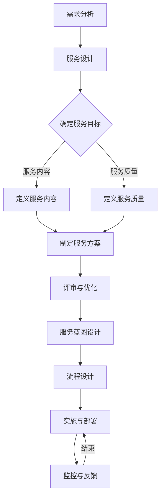
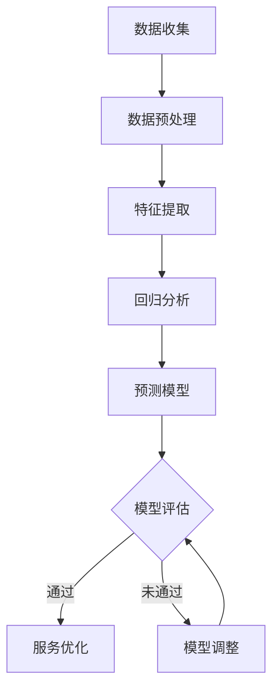

                 

### 文章标题：技术咨询：高价值服务的提供

#### 关键词：
- 咨询服务
- 高价值服务
- 服务设计
- 咨询团队
- 营销推广

#### 摘要：
本文旨在探讨如何提供高价值的服务，以解决企业在快速变化的市场环境中面临的挑战。文章首先概述了咨询行业的背景和发展，随后详细分析了高价值服务的市场需求和提供策略。通过介绍服务设计与规划、咨询团队建设与管理、服务交付与执行、营销与推广等关键环节，本文提供了构建高价值服务的系统方法。案例分析与实践指导进一步强化了文章的实际应用价值，并为未来咨询行业的发展趋势提供了前瞻性思考。读者可以通过本文了解高价值服务的关键要素，掌握提供此类服务的实践技能。

### 《技术咨询：高价值服务的提供》目录大纲

#### 第一部分：引言与背景
##### 第1章：咨询行业的概述
- 1.1 咨询行业的起源与发展
- 1.2 咨询服务的分类与价值
- 1.3 高价值服务的特点与挑战

##### 第2章：高价值服务的市场分析
- 2.1 咨询市场的现状与趋势
- 2.2 企业需求分析
- 2.3 竞争对手分析

#### 第二部分：高价值服务的提供
##### 第3章：服务设计与规划
- 3.1 服务设计原则与方法
- 3.2 服务规划流程
- 3.3 服务蓝图与流程设计

##### 第4章：咨询团队建设与管理
- 4.1 团队建设的重要性
- 4.2 咨询团队的角色与职责
- 4.3 团队管理策略与实践

##### 第5章：高价值服务的交付与执行
- 5.1 交付计划与进度管理
- 5.2 服务质量管理
- 5.3 交付执行中的风险与应对

##### 第6章：高价值服务的营销与推广
- 6.1 咨询服务的市场定位
- 6.2 营销策略与渠道选择
- 6.3 品牌建设与传播

##### 第7章：案例分析与实践指导
- 7.1 案例研究：成功的高价值服务项目
- 7.2 实践指导：构建高价值服务的能力
- 7.3 行业趋势与未来展望

#### 第三部分：附加材料与资源
##### 第8章：高价值服务的工具与资源
- 8.1 咨询工具介绍
- 8.2 资源获取渠道
- 8.3 在线资源与数据库推荐

##### 第9章：附录
- 9.1 咨询行业相关标准与规范
- 9.2 咨询服务合同模板
- 9.3 常见问题解答与FAQ

#### 附录：Mermaid流程图与算法伪代码
- 附录A：高价值服务设计流程图（Mermaid代码）
- 附录B：高价值服务算法原理图（Mermaid代码）
- 附录C：算法伪代码示例（Python伪代码）

### 第1章：咨询行业的概述

#### 核心概念与联系

咨询行业是一个涉及多个学科领域的专业服务行业，旨在帮助企业、政府机构及其他组织在战略规划、运营优化、财务分析等方面作出更明智的决策。咨询行业的发展历程可以追溯到19世纪末，当时的主要业务是工程咨询和财务管理咨询。随着全球经济和技术的快速发展，咨询行业逐渐扩展到多个领域，包括管理咨询、信息技术咨询、市场营销咨询等。

- **核心概念：**
  - **咨询行业：**提供专业知识和服务的行业，旨在帮助客户解决问题、制定策略和实现目标。
  - **咨询服务：**通过专业知识和技能，为客户提供的诊断、分析、规划、实施和培训等服务。
  - **专业服务：**由具有专业知识、技能和经验的专业人士提供的独立、客观的服务。

- **联系：**
  - 咨询行业与客户需求密切相关，专业服务是根据客户的具体问题和需求来提供的。咨询服务的质量和效果直接影响到客户的业务表现和战略发展。

#### 核心算法原理讲解

在咨询行业中，核心算法原理并非直接应用在服务交付过程中，但数据分析和决策支持工具是咨询服务的核心组成部分。以下是一些常见的算法原理及其应用：

- **数据挖掘：**通过数据挖掘算法（如分类、聚类、关联规则等），咨询公司可以从大量数据中提取有价值的信息，帮助客户发现商业机会或潜在风险。

- **预测分析：**利用时间序列分析和回归分析等算法，咨询公司可以预测未来趋势，为客户制定长期战略提供依据。

- **优化算法：**如线性规划、整数规划等，可以帮助客户在资源分配、成本控制等方面作出最优决策。

- **决策树：**用于分析决策路径和可能的结果，帮助客户在选择最佳策略时做出更为科学的决策。

这些算法的应用使得咨询服务不仅依赖于专业知识和经验，还能够通过数据分析和技术手段提升决策的科学性和准确性。

#### 数学模型和数学公式

咨询行业中的数学模型主要用于量化分析，帮助咨询公司更准确地评估问题、制定策略和预测结果。以下是一些常用的数学模型和公式：

- **线性规划模型：**
  $$\min \ c^T x$$
  $$\text{s.t.} \ Ax \leq b$$
  $$x \geq 0$$

  用于优化资源分配、成本控制等。

- **回归分析模型：**
  $$y = \beta_0 + \beta_1 x_1 + \beta_2 x_2 + ... + \beta_n x_n + \epsilon$$

  用于预测和分析变量之间的关系。

- **决策树模型：**
  $$\text{if} \ P(A) > \alpha \ \text{then} \ \text{take action } B \ \text{else} \ \text{take action } C$$

  用于决策路径的分析。

这些数学模型和公式为咨询服务提供了量化的依据，使得咨询服务更加科学和可靠。

#### 项目实战

为了更好地理解咨询行业，我们可以通过一个实际案例来探讨咨询服务的实施过程。

**案例：**某大型制造企业希望提高生产效率，降低成本。

1. **需求分析：**咨询公司首先与客户进行深入沟通，了解企业的生产流程、成本结构和现有问题。

2. **数据收集：**咨询公司收集了企业的生产数据、成本数据以及其他相关数据。

3. **数据分析：**利用数据分析工具，咨询公司对数据进行了深入分析，包括趋势分析、回归分析和优化分析。

4. **策略制定：**根据数据分析结果，咨询公司提出了提高生产效率和降低成本的具体策略。

5. **实施与监控：**咨询公司协助企业实施这些策略，并对实施效果进行监控和评估。

6. **报告与建议：**最终，咨询公司向企业提交了详细的报告，并提供后续改进建议。

通过这个案例，我们可以看到咨询服务是如何通过需求分析、数据分析、策略制定和实施监控等环节，帮助客户实现目标。

**总结：**咨询行业是一个多学科交叉的领域，通过专业知识、数据分析和决策支持，咨询公司能够为客户提供高质量的服务，帮助企业解决复杂问题、制定有效策略和实现业务目标。

### 第2章：高价值服务的市场分析

#### 核心概念与联系

高价值服务在咨询行业中具有特殊的重要性，它们不仅仅是为了解决具体问题，更旨在为客户提供战略性的、长期的、深层次的价值。高价值服务通常涉及复杂的问题，需要深入的行业知识、创新思维和卓越的执行能力。

- **核心概念：**
  - **高价值服务：**指能够为客户提供显著商业价值、战略意义和长期效益的专业服务。
  - **市场分析：**研究市场需求、竞争对手和潜在客户的行为，以便制定有效的市场策略。

- **联系：**
  - 高价值服务与市场需求紧密相关，通过市场分析，咨询公司可以了解客户的需求、行业趋势和竞争环境，从而提供更有针对性的服务。

#### 核心算法原理讲解

市场分析过程中，常用的算法原理主要包括市场细分、需求预测和竞争分析。以下是对这些算法原理的详细讲解：

- **市场细分：**市场细分是一种基于消费者特征、行为和需求将市场划分为多个子市场的策略。常用的算法有聚类分析和因子分析。

  **聚类分析算法示例（K-Means）：**
  $$\min \sum_{i=1}^{k} \sum_{x \in S_i} \| x - \mu_i \|^2$$
  其中，\( S_i \) 是第 \( i \) 个簇，\( \mu_i \) 是第 \( i \) 个簇的中心。

- **需求预测：**需求预测是通过历史数据和统计模型预测未来市场需求的过程。常用的算法有时间序列分析和回归分析。

  **时间序列分析模型（ARIMA）：**
  $$y_t = \phi_1 y_{t-1} + \phi_2 y_{t-2} + ... + \phi_p y_{t-p} + \theta_1 e_{t-1} + \theta_2 e_{t-2} + ... + \theta_q e_{t-q} + \varepsilon_t$$

- **竞争分析：**竞争分析是通过分析竞争对手的产品、市场策略和客户满意度，评估自身的竞争优势和劣势。常用的算法有竞争位势分析和SWOT分析。

  **竞争位势分析：**
  $$\Pi_i = \sum_{j=1}^{n} w_{ij} x_j$$
  其中，\( \Pi_i \) 是第 \( i \) 个公司的竞争位势，\( w_{ij} \) 是第 \( i \) 个公司对第 \( j \) 个竞争对手的评价权重，\( x_j \) 是第 \( j \) 个竞争对手的市场表现。

#### 数学模型和数学公式

市场分析中常用的数学模型和公式主要包括概率模型、回归模型和优化模型。以下是一些具体的数学公式：

- **概率模型（贝叶斯公式）：**
  $$P(A|B) = \frac{P(B|A)P(A)}{P(B)}$$

  用于根据先验概率和条件概率计算后验概率。

- **线性回归模型：**
  $$y = \beta_0 + \beta_1 x_1 + \beta_2 x_2 + ... + \beta_n x_n$$

  用于分析自变量和因变量之间的关系。

- **优化模型（线性规划）：**
  $$\min \ c^T x$$
  $$\text{s.t.} \ Ax \leq b$$
  $$x \geq 0$$

  用于在约束条件下寻找最优解。

#### 项目实战

为了更好地理解高价值服务的市场分析，我们可以通过一个实际案例来探讨市场分析的具体步骤。

**案例：**某咨询公司希望为一家电子商务企业提供高价值服务，以提升其市场份额和客户满意度。

1. **市场调研：**咨询公司首先进行了市场调研，收集了电子商务行业的市场数据，包括市场规模、增长趋势、竞争态势等。

2. **数据清洗与处理：**咨询公司对收集到的数据进行清洗和预处理，确保数据的质量和准确性。

3. **市场细分：**利用聚类分析方法，咨询公司根据消费者行为和购买偏好将市场细分为多个子市场。

4. **需求预测：**利用时间序列分析和回归分析模型，咨询公司预测了未来市场的需求趋势。

5. **竞争分析：**通过竞争位势分析，咨询公司评估了竞争对手的市场表现和竞争优势。

6. **策略制定：**根据市场分析和竞争分析的结果，咨询公司为电子商务企业制定了详细的市场策略，包括产品定位、营销渠道、客户关系管理等。

7. **实施与评估：**咨询公司协助电子商务企业实施市场策略，并对策略的实施效果进行持续评估和调整。

通过这个案例，我们可以看到市场分析在提供高价值服务中的关键作用。通过深入的市场调研、数据分析和策略制定，咨询公司能够帮助客户制定科学的市场策略，提升其在市场中的竞争力。

**总结：**高价值服务的市场分析是提供高质量咨询服务的重要环节。通过市场细分、需求预测和竞争分析等核心算法原理，咨询公司能够准确把握市场需求，为客户制定有针对性的策略，从而实现长期的商业价值。市场分析不仅需要数据支持和算法应用，更需要深入的行业理解和创新思维。

### 第3章：服务设计与规划

#### 核心概念与联系

服务设计与规划是提供高价值服务的核心环节，旨在确保服务能够满足客户需求，实现预期目标。服务设计涉及到服务的定义、描述和架构，而服务规划则关注如何将设计转化为实际的操作流程。

- **核心概念：**
  - **服务设计：**定义服务的功能和特性，包括服务内容、服务流程、服务质量和用户体验。
  - **服务规划：**制定实施服务的详细计划，包括资源分配、时间表、预算和风险管理。

- **联系：**
  - 服务设计与规划相互关联，服务设计决定了服务的本质，而服务规划则确保服务能够高效、有序地交付。

#### 核心算法原理讲解

服务设计与规划过程中，常用的算法原理包括服务流程设计、资源优化和风险管理。以下是对这些算法原理的详细讲解：

- **服务流程设计：**服务流程设计涉及将服务功能分解成具体的操作步骤，并定义各步骤之间的关系。常用的算法有工作流建模和过程优化。

  **工作流建模（BPMN）：**
  ```mermaid
  flowchart LR
  A[开始] --> B[服务请求]
  B --> C{处理请求}
  C -->|批准| D[提供服务]
  C -->|拒绝| E[反馈请求]
  D --> F[服务结束]
  E --> G[问题解决]
  G --> F
  ```

- **资源优化：**资源优化旨在确保服务资源（如人力、设备、资金）的最优配置，以最大化服务效率和效益。常用的算法有线性规划和整数规划。

  **线性规划模型（资源分配）：**
  ```latex
  \min \ c^T x
  \text{s.t.} \ Ax \leq b, \ x \geq 0
  ```

- **风险管理：**风险管理涉及识别、评估和应对潜在风险，以确保服务的顺利实施。常用的算法有风险评估模型和决策树。

  **决策树（风险应对策略）：**
  ```mermaid
  tree
  root
  |---识别风险
  |---|---评估风险
  |---|---|---风险低
  |---|---|---|---监控
  |---|---|---|---执行
  |---|---|---|---记录
  |---|---|---风险高
  |---|---|---|---预警
  |---|---|---|---应急响应
  |---|---|---|---记录
  ```

#### 数学模型和数学公式

服务设计与规划中常用的数学模型和公式包括线性规划模型、决策树模型和服务质量模型。以下是一些具体的数学公式：

- **线性规划模型（成本优化）：**
  ```latex
  \min \ c^T x
  \text{s.t.} \ Ax \leq b, \ x \geq 0
  ```

- **决策树模型（风险决策）：**
  ```latex
  \text{if} \ P(A) > \alpha \ \text{then} \ \text{take action B} \ \text{else} \ \text{take action C}
  ```

- **服务质量模型（服务质量评估）：**
  ```latex
  Q = \frac{1}{n} \sum_{i=1}^{n} w_i \cdot R_i
  ```
  其中，\( Q \) 是服务质量评分，\( w_i \) 是权重，\( R_i \) 是服务指标评分。

#### 项目实战

为了更好地理解服务设计与规划的实际应用，我们可以通过一个实际案例来探讨服务设计与规划的步骤。

**案例：**某大型金融机构计划推出一款智能理财服务，以提升客户体验和理财效率。

1. **需求分析：**金融机构与客户进行深入交流，了解客户对理财服务的需求，包括投资策略、风险偏好、用户体验等。

2. **服务设计：**根据需求分析结果，金融机构设计服务内容，包括投资组合推荐、风险管理、定期报告等。

   **服务流程设计（Mermaid代码）：**
   ```mermaid
   flowchart LR
   A[客户请求] --> B[需求分析]
   B --> C[服务设计]
   C --> D[服务确认]
   D --> E[服务交付]
   E --> F[客户反馈]
   ```

3. **资源规划：**金融机构评估所需资源，包括人力、技术设备、资金等，并制定详细的时间表和预算。

   **资源优化模型（线性规划）：**
   ```latex
   \min \ c^T x
   \text{s.t.} \ Ax \leq b, \ x \geq 0
   ```

4. **风险管理：**金融机构识别潜在风险，包括技术故障、数据泄露、市场波动等，并制定相应的应对策略。

   **风险决策树（Mermaid代码）：**
   ```mermaid
   tree
   root
   |---技术故障
   |---|---检查系统稳定性
   |---|---|---稳定：监控
   |---|---|---不稳定：紧急修复
   |---数据泄露
   |---|---加强安全措施
   |---市场波动
   |---|---动态调整投资策略
   ```

5. **实施与监控：**金融机构按照规划执行服务设计，并对服务过程进行持续监控和优化。

通过这个案例，我们可以看到服务设计与规划是如何在实际项目中应用，确保服务能够满足客户需求、实现预期目标。

**总结：**服务设计与规划是提供高价值服务的核心环节。通过明确的服务设计和精细的规划，咨询公司能够确保服务的高质量交付，满足客户的需求和期望。核心算法原理和数学模型的应用，进一步提升了服务设计的科学性和规划的有效性。

### 第4章：咨询团队建设与管理

#### 核心概念与联系

咨询团队建设与管理是确保高价值服务成功实施的关键因素。一个高效的咨询团队不仅需要具备专业技能和知识，还需要良好的协作和沟通能力。团队建设与管理涵盖了团队组建、角色与职责分配、管理策略和实践等多个方面。

- **核心概念：**
  - **咨询团队：**由一群专业咨询人员组成，旨在为客户提供专业服务和支持。
  - **团队建设：**通过团队活动、培训和发展，增强团队成员的协作能力和凝聚力。
  - **团队管理：**包括团队目标设定、角色分工、绩效评估和沟通协调等。

- **联系：**
  - 团队建设与管理相互关联，有效的团队建设有助于提高团队整体绩效，而良好的团队管理则能确保团队成员在高效协作中实现个人和团队目标。

#### 核心算法原理讲解

咨询团队建设与管理中，常用的算法原理包括团队绩效评估、角色分工和沟通模型。以下是对这些算法原理的详细讲解：

- **团队绩效评估：**通过定量和定性的方法评估团队的工作效率和成果。常用的算法有层次分析法（AHP）和平衡计分卡（BSC）。

  **层次分析法（AHP）：**
  ```mermaid
  graph TB
  A[团队绩效评估]
  A --> B[目标设定]
  B --> C{关键绩效指标}
  C --> D{权重分配}
  D --> E{评估计算}
  E --> F[结果反馈]
  ```

- **角色分工：**根据团队成员的技能和特长，合理分配任务和角色，以提高团队整体效率。常用的算法有任务分配算法和协作网络分析。

  **任务分配算法（最优化方法）：**
  ```mermaid
  graph TB
  A[任务分配]
  A --> B{任务列表}
  B --> C[技能匹配]
  C --> D[资源分配}
  D --> E{优化方案}
  ```

- **沟通模型：**通过有效的沟通机制和工具，确保团队成员之间的信息传递和协作。常用的沟通模型有信息传播模型和沟通网络分析。

  **信息传播模型（网络分析）：**
  ```mermaid
  graph TB
  A[信息传播]
  A --> B{信息源}
  B --> C[传播渠道]
  C --> D[接收者]
  D --> E{反馈机制}
  ```

#### 数学模型和数学公式

咨询团队建设与管理中，常用的数学模型和公式包括优化模型、网络分析模型和绩效评估模型。以下是一些具体的数学公式：

- **优化模型（线性规划）：**
  ```latex
  \min \ c^T x
  \text{s.t.} \ Ax \leq b, \ x \geq 0
  ```

- **网络分析模型（图论）：**
  ```latex
  \text{连通度} = \frac{2m}{n}
  ```
  其中，\( m \) 是边数，\( n \) 是节点数。

- **绩效评估模型（层次分析法）：**
  ```latex
  W = \frac{d_i}{\sum_{i=1}^{n} d_i}
  ```
  其中，\( W \) 是权重，\( d_i \) 是第 \( i \) 个指标的权重。

#### 项目实战

为了更好地理解咨询团队建设与管理的实际应用，我们可以通过一个实际案例来探讨团队建设与管理的步骤。

**案例：**某咨询公司计划组建一个专门负责数字化转型项目的团队。

1. **需求分析：**公司对项目需求进行详细分析，明确项目目标、任务和所需技能。

2. **团队组建：**根据需求分析结果，公司从内部选拔和外部招聘相结合，组建了一支包括项目经理、技术专家、市场分析师等多个角色的团队。

3. **角色分工：**公司对团队成员的技能和经验进行评估，并根据项目需求合理分配任务和角色。

   **角色分工算法（最优化方法）：**
   ```mermaid
   graph TB
   A[角色分工]
   A --> B{技能匹配}
   B --> C[任务分配}
   C --> D[优化方案]
   ```

4. **团队培训：**公司为团队成员提供专业的培训和技能提升机会，确保团队成员能够胜任各自的职责。

5. **绩效评估：**公司采用层次分析法对团队成员的工作绩效进行评估，并根据评估结果进行奖励和调整。

   **绩效评估模型（层次分析法）：**
   ```mermaid
   graph TB
   A[绩效评估]
   A --> B[目标设定]
   B --> C{关键绩效指标}
   C --> D[权重分配]
   D --> E{评估计算}
   ```

6. **沟通机制：**公司建立有效的沟通机制，确保团队成员之间的信息流畅和协作高效。

   **信息传播模型（网络分析）：**
   ```mermaid
   graph TB
   A[信息传播]
   A --> B{信息源}
   B --> C[传播渠道]
   C --> D[接收者]
   ```

通过这个案例，我们可以看到咨询团队建设与管理是如何在实际项目中应用的，如何通过科学的团队组建、角色分工、培训、绩效评估和沟通机制，确保团队的高效协作和项目的成功实施。

**总结：**咨询团队建设与管理是提供高价值服务的重要保障。通过科学的团队组建、合理的角色分工、持续的团队培训和有效的沟通机制，咨询公司能够确保团队的高效运作和项目的成功交付。

### 第5章：高价值服务的交付与执行

#### 核心概念与联系

高价值服务的交付与执行是咨询服务的核心环节，涉及将设计好的服务方案转化为实际操作并确保其成功实施的过程。交付与执行不仅需要明确的计划和管理，还需要有效的执行策略和质量控制。

- **核心概念：**
  - **交付计划：**指为服务实施制定的时间表、资源分配和任务分配。
  - **执行策略：**指在服务实施过程中采用的具体方法和步骤，确保服务按计划进行。
  - **质量控制：**指对服务交付过程中各个环节进行监控和评估，确保服务符合预期标准。

- **联系：**
  - 交付计划、执行策略和质量控制相互关联，交付计划为执行提供指导，执行策略确保计划的实施，质量控制则保障服务的质量和效果。

#### 核心算法原理讲解

在交付与执行过程中，常用的算法原理包括进度管理、资源优化和质量控制。以下是对这些算法原理的详细讲解：

- **进度管理：**通过制定详细的时间表和进度计划，确保服务按计划进行。常用的算法有甘特图、关键路径法（CPM）和项目管理软件。

  **关键路径法（CPM）：**
  ```mermaid
  graph TB
  A[活动1] --> B[活动2]
  B --> C[活动3]
  C --> D[活动4]
  D --> E[完成]
  subgraph Critical Path
  A --> B
  B --> C
  C --> D
  D --> E
  end
  ```

- **资源优化：**通过合理分配和调度资源，提高资源利用效率。常用的算法有线性规划和整数规划。

  **线性规划模型（资源优化）：**
  ```latex
  \min \ c^T x
  \text{s.t.} \ Ax \leq b, \ x \geq 0
  ```

- **质量控制：**通过设定质量标准和监控措施，确保服务符合预期质量。常用的算法有统计过程控制（SPC）和六西格玛（Six Sigma）。

  **统计过程控制（SPC）：**
  ```mermaid
  graph TB
  A[数据收集] --> B[数据分析]
  B --> C{控制图分析}
  C --> D{决策}
  ```

#### 数学模型和数学公式

在交付与执行过程中，常用的数学模型和公式包括线性规划模型、关键路径模型和质量控制模型。以下是一些具体的数学公式：

- **线性规划模型（资源优化）：**
  ```latex
  \min \ c^T x
  \text{s.t.} \ Ax \leq b, \ x \geq 0
  ```

- **关键路径模型（CPM）：**
  ```mermaid
  graph TB
  A[活动1] --> B[活动2]
  B --> C[活动3]
  C --> D[活动4]
  D --> E[完成]
  subgraph Critical Path
  A --> B
  B --> C
  C --> D
  D --> E
  end
  ```

- **质量控制模型（SPC）：**
  ```mermaid
  graph TB
  A[数据收集] --> B[数据分析]
  B --> C{控制图分析}
  C --> D{决策}
  ```

#### 项目实战

为了更好地理解高价值服务的交付与执行，我们可以通过一个实际案例来探讨交付与执行的具体步骤。

**案例：**某咨询公司为一家制造企业实施精益生产项目。

1. **需求分析：**咨询公司与制造企业沟通，了解其生产流程中的瓶颈和改进需求。

2. **交付计划：**咨询公司制定详细的交付计划，包括时间表、任务分配和资源需求。

   **交付计划（甘特图）：**
   ```mermaid
   graph TB
   A[需求分析] --> B[交付计划]
   B --> C[任务分配]
   C --> D[资源优化]
   D --> E[质量控制]
   ```

3. **执行策略：**咨询公司根据交付计划，实施精益生产项目，包括5S管理、价值流图分析和过程改进。

4. **进度管理：**通过关键路径法（CPM），咨询公司监控项目的进度，确保关键路径上的活动按时完成。

5. **质量控制：**咨询公司采用统计过程控制（SPC），监控生产过程中的质量指标，确保生产符合质量标准。

6. **反馈与调整：**咨询公司收集客户反馈，对交付过程和结果进行评估，并根据反馈进行调整和优化。

通过这个案例，我们可以看到高价值服务的交付与执行是如何在实际项目中实施的。通过科学的计划、有效的执行策略和质量控制，咨询公司能够确保项目的成功交付和客户满意度。

**总结：**高价值服务的交付与执行是咨询服务的关键环节。通过明确的交付计划、有效的执行策略和严格的质量控制，咨询公司能够确保服务的成功实施，满足客户的需求和期望。

### 第6章：高价值服务的营销与推广

#### 核心概念与联系

高价值服务的营销与推广是确保咨询服务成功的关键环节。它不仅涉及到对服务的市场定位和品牌建设，还包括选择合适的营销策略和推广渠道，以实现咨询服务的市场渗透和客户获取。

- **核心概念：**
  - **市场定位：**确定咨询服务的目标市场和市场定位，以便更好地满足客户需求。
  - **品牌建设：**建立和强化咨询服务品牌形象，提升品牌知名度和客户信任度。
  - **营销策略：**制定和实施各种营销策略，包括广告、社交媒体、公关等，以促进咨询服务的销售。
  - **推广渠道：**选择和利用各种渠道，如线上和线下活动、合作伙伴、网络营销等，来推广咨询服务。

- **联系：**
  - 市场定位、品牌建设、营销策略和推广渠道相互关联，市场定位决定了品牌建设的目标和营销策略的方向，而营销策略和推广渠道则确保了品牌建设的效果和客户的获取。

#### 核心算法原理讲解

在营销与推广过程中，常用的算法原理包括市场细分、客户行为分析和营销效果评估。以下是对这些算法原理的详细讲解：

- **市场细分：**通过数据分析方法，根据客户特征和需求，将市场划分为不同的子市场。常用的算法有聚类分析和因子分析。

  **聚类分析（K-Means）：**
  ```mermaid
  graph TB
  A[市场数据] --> B[特征提取]
  B --> C{聚类分析}
  C --> D[子市场划分]
  ```

- **客户行为分析：**通过数据分析技术，分析客户的购买行为、偏好和需求，以便更好地定位和营销。常用的算法有回归分析和决策树。

  **回归分析（客户行为预测）：**
  ```mermaid
  graph TB
  A[历史数据] --> B[特征工程]
  B --> C{回归分析}
  C --> D[行为预测]
  ```

- **营销效果评估：**通过设定关键绩效指标（KPI）和监控工具，评估营销活动的效果和ROI。常用的算法有A/B测试和转化率分析。

  **A/B测试（营销效果评估）：**
  ```mermaid
  graph TB
  A[营销活动A] --> B[用户群体A]
  A --> C[营销活动B] --> D[用户群体B]
  B --> E{效果评估}
  D --> F{效果评估}
  ```

#### 数学模型和数学公式

在营销与推广过程中，常用的数学模型和公式包括回归模型、聚类模型和优化模型。以下是一些具体的数学公式：

- **回归模型（客户行为预测）：**
  ```latex
  y = \beta_0 + \beta_1 x_1 + \beta_2 x_2 + ... + \beta_n x_n
  ```

- **聚类模型（市场细分）：**
  ```latex
  \text{目标函数} = \sum_{i=1}^{k} \sum_{x \in S_i} \| x - \mu_i \|^2
  ```

- **优化模型（营销效果评估）：**
  ```latex
  \max \ \frac{R}{C}
  ```
  其中，\( R \) 是收入，\( C \) 是成本。

#### 项目实战

为了更好地理解高价值服务的营销与推广，我们可以通过一个实际案例来探讨营销与推广的具体步骤。

**案例：**某咨询公司计划推广其数字化转型服务，以提升市场知名度和客户数量。

1. **市场调研：**咨询公司进行了市场调研，收集了行业数据、客户需求和竞争对手信息。

2. **市场细分：**通过聚类分析方法，咨询公司将市场划分为多个子市场，并根据客户特征和需求进行了细分。

   **聚类分析（市场细分）：**
   ```mermaid
   graph TB
   A[市场数据] --> B[特征提取]
   B --> C{聚类分析}
   C --> D[子市场划分]
   ```

3. **市场定位：**咨询公司确定了目标市场和客户群体，明确了服务的独特价值和竞争优势。

4. **品牌建设：**咨询公司通过一系列品牌活动，如发布白皮书、举办研讨会和建立社交媒体账号，提升了品牌知名度和形象。

5. **营销策略：**咨询公司制定了包括广告、内容营销、社交媒体营销和合作伙伴推广在内的综合营销策略。

6. **推广渠道：**咨询公司选择了多种推广渠道，如搜索引擎优化（SEO）、社交媒体广告、行业展会和合作伙伴网络，以扩大服务的影响力。

7. **营销效果评估：**通过A/B测试和转化率分析，咨询公司评估了不同营销活动的效果，并根据评估结果调整营销策略。

   **A/B测试（营销效果评估）：**
   ```mermaid
   graph TB
   A[营销活动A] --> B[用户群体A]
   A --> C[营销活动B] --> D[用户群体B]
   B --> E{效果评估}
   D --> F{效果评估}
   ```

通过这个案例，我们可以看到高价值服务的营销与推广是如何在实际中实施的。通过科学的市场细分、精准的市场定位、综合的营销策略和多样化的推广渠道，咨询公司能够有效提升服务的市场知名度和客户数量。

**总结：**高价值服务的营销与推广是确保服务成功的重要环节。通过明确的市场定位、有效的品牌建设、科学的营销策略和多样化的推广渠道，咨询公司能够提升服务的市场渗透力和客户满意度，实现业务的持续增长。

### 第7章：案例分析与实践指导

#### 核心概念与联系

案例分析和实践指导是理解和应用高价值服务提供方法的重要手段。通过实际案例的深入分析，读者可以更好地理解高价值服务提供的各个环节和关键步骤。同时，实践指导为读者提供了具体的操作方法和策略，有助于在实际工作中应用所学知识。

- **核心概念：**
  - **案例分析：**对实际案例进行深入剖析，提取成功经验和失败教训，以便读者理解和学习。
  - **实践指导：**提供具体操作步骤和策略，帮助读者将理论知识应用到实际工作中。

- **联系：**
  - 案例分析与实践指导相互补充，案例分析提供了现实背景和实例，实践指导则提供了具体的操作路径和策略。

#### 核心算法原理讲解

在案例分析和实践指导中，常用的算法原理包括数据分析、决策分析和优化算法。以下是对这些算法原理的详细讲解：

- **数据分析：**通过数据分析方法，对案例中的数据进行提取、清洗和分析，以发现关键信息。常用的算法有回归分析、聚类分析和时间序列分析。

  **回归分析（数据预测）：**
  ```mermaid
  graph TB
  A[历史数据] --> B[特征工程]
  B --> C{回归分析}
  C --> D[预测模型]
  ```

- **决策分析：**通过决策树、贝叶斯网络等算法，对案例中的决策过程进行模拟和分析，以评估不同决策方案的效果。

  **决策树（决策分析）：**
  ```mermaid
  graph TB
  A[问题] --> B{条件1}
  B -->|是| C{方案1}
  B -->|否| D{方案2}
  ```

- **优化算法：**通过线性规划、整数规划等算法，对案例中的资源配置和问题解决方案进行优化，以提高效率和效果。

  **线性规划（资源优化）：**
  ```mermaid
  graph TB
  A[资源分配] --> B{目标函数}
  B --> C{约束条件}
  C --> D{优化解}
  ```

#### 数学模型和数学公式

在案例分析和实践指导中，常用的数学模型和公式包括回归模型、决策树模型和优化模型。以下是一些具体的数学公式：

- **回归模型（数据预测）：**
  ```latex
  y = \beta_0 + \beta_1 x_1 + \beta_2 x_2 + ... + \beta_n x_n
  ```

- **决策树模型（决策分析）：**
  ```latex
  \text{if} \ P(A) > \alpha \ \text{then} \ B \ \text{else} \ C
  ```

- **优化模型（资源优化）：**
  ```latex
  \min \ c^T x
  \text{s.t.} \ Ax \leq b, \ x \geq 0
  ```

#### 项目实战

为了更好地理解高价值服务的案例分析与实践指导，我们可以通过一个实际案例来探讨如何进行案例分析和实践指导。

**案例：**某咨询公司成功实施了一项帮助企业实现数字化转型的高价值服务项目。

1. **案例分析：**
   - **需求分析：**咨询公司与客户进行了深入沟通，明确了客户的数字化转型需求和目标。
   - **数据收集：**咨询公司收集了客户的历史数据、业务流程和现有技术架构。
   - **数据分析：**利用回归分析和聚类分析，咨询公司分析了客户数据的趋势和特点，并确定了关键业务指标。
   - **策略制定：**根据数据分析结果，咨询公司制定了数字化转型策略，包括技术选型、流程优化和员工培训。

   **回归分析（需求预测）：**
   ```mermaid
   graph TB
   A[历史数据] --> B[特征工程]
   B --> C{回归分析}
   C --> D[预测模型]
   ```

2. **实践指导：**
   - **项目规划：**咨询公司制定了详细的实施计划，包括时间表、任务分配和资源需求。
   - **执行策略：**咨询公司实施了数字化转型策略，包括技术部署、流程优化和员工培训。
   - **质量控制：**通过定期的监控和评估，咨询公司确保了项目的进度和质量，并根据客户反馈进行了调整和优化。

   **决策树（决策分析）：**
   ```mermaid
   graph TB
   A[问题] --> B{条件1}
   B -->|是| C{方案1}
   B -->|否| D{方案2}
   ```

3. **成果评估：**
   - **效果评估：**咨询公司通过关键绩效指标（KPI）评估了数字化转型项目的效果，包括生产效率提升、成本降低和客户满意度提升。
   - **反馈与优化：**咨询公司收集了客户反馈，对项目实施效果进行了评估，并根据反馈进行了优化和改进。

通过这个案例，我们可以看到如何通过案例分析和实践指导，成功地实施高价值服务项目。通过深入的需求分析、有效的数据分析、科学的策略制定和严格的执行监控，咨询公司能够确保项目的成功实施和客户的满意度。

**总结：**案例分析与实践指导是理解和应用高价值服务提供方法的重要手段。通过实际案例的深入剖析和具体操作步骤的指导，读者能够更好地掌握高价值服务的提供技巧，并在实际工作中应用所学知识，实现项目的成功交付。

### 第8章：高价值服务的工具与资源

#### 核心概念与联系

在提供高价值服务的过程中，工具和资源的选择与利用至关重要。合适的工具可以提高工作效率，丰富的资源可以为服务提供强有力的支持。本章将介绍各类咨询工具、资源获取渠道以及在线资源与数据库推荐。

- **核心概念：**
  - **咨询工具：**用于提高咨询服务效率和质量的各种工具，包括数据分析工具、项目管理工具和协作工具等。
  - **资源获取：**指获取与咨询服务相关的资料、数据和技术支持的过程。
  - **在线资源与数据库：**指互联网上的各种资源库和数据源，为咨询服务提供丰富的信息和数据支持。

- **联系：**
  - 咨询工具和资源获取渠道是高价值服务提供的重要支撑，而在线资源与数据库则扩展了资源获取的途径，为咨询服务提供了更广泛的信息来源。

#### 核心算法原理讲解

在高价值服务的工具与资源选择过程中，常用的算法原理包括数据分析算法、优化算法和决策支持系统。以下是对这些算法原理的详细讲解：

- **数据分析算法：**用于处理和分析大量数据，提取有价值的信息。常用的算法有回归分析、聚类分析和时间序列分析。

  **回归分析（需求预测）：**
  ```mermaid
  graph TB
  A[历史数据] --> B[特征工程]
  B --> C{回归分析}
  C --> D[预测模型]
  ```

- **优化算法：**用于在给定约束条件下寻找最优解，优化资源分配和问题解决方案。常用的算法有线性规划、整数规划和遗传算法。

  **线性规划（资源优化）：**
  ```mermaid
  graph TB
  A[资源分配] --> B{目标函数}
  B --> C{约束条件}
  C --> D{优化解}
  ```

- **决策支持系统：**用于辅助决策者进行复杂决策，提供数据分析和优化支持。常用的算法有决策树、贝叶斯网络和模拟优化。

  **决策树（决策分析）：**
  ```mermaid
  graph TB
  A[问题] --> B{条件1}
  B -->|是| C{方案1}
  B -->|否| D{方案2}
  ```

#### 数学模型和数学公式

在高价值服务的工具与资源选择过程中，常用的数学模型和公式包括回归模型、优化模型和决策模型。以下是一些具体的数学公式：

- **回归模型（数据预测）：**
  ```latex
  y = \beta_0 + \beta_1 x_1 + \beta_2 x_2 + ... + \beta_n x_n
  ```

- **优化模型（资源优化）：**
  ```latex
  \min \ c^T x
  \text{s.t.} \ Ax \leq b, \ x \geq 0
  ```

- **决策模型（决策分析）：**
  ```latex
  \text{if} \ P(A) > \alpha \ \text{then} \ B \ \text{else} \ C
  ```

#### 项目实战

为了更好地理解高价值服务的工具与资源，我们可以通过一个实际案例来探讨工具与资源的选择和应用。

**案例：**某咨询公司计划为一家制造业企业实施供应链优化项目。

1. **工具选择：**
   - **数据分析工具：**选择Python和R等编程语言，结合Pandas和NumPy等库，进行数据清洗、分析和可视化。
   - **项目管理工具：**使用JIRA或Trello等项目管理工具，进行任务分配、进度跟踪和团队协作。

2. **资源获取：**
   - **数据资源：**通过公开数据源、企业内部数据和第三方数据服务商，获取供应链相关的历史数据、市场数据和行业报告。
   - **技术资源：**借助云计算平台（如AWS或Azure），利用高性能计算和机器学习服务，支持大数据分析和模型训练。

3. **决策支持系统：**
   - **回归分析：**使用回归模型预测供应链需求，为库存管理和采购计划提供数据支持。
   - **优化算法：**采用线性规划和遗传算法，优化供应链网络和资源配置，降低运营成本和提高效率。

   **线性规划（资源优化）：**
   ```mermaid
   graph TB
   A[资源分配] --> B{目标函数}
   B --> C{约束条件}
   C --> D{优化解}
   ```

4. **在线资源与数据库推荐：**
   - **在线资源：**推荐使用Google Scholar、LinkedIn和行业论坛等平台，获取最新的学术研究和行业动态。
   - **数据库：**推荐使用DBpedia、Data.gov和Amazon Web Services等数据库，获取丰富的数据资源和API支持。

通过这个案例，我们可以看到高价值服务工具与资源的实际应用。通过科学地选择和利用工具与资源，咨询公司能够提高服务效率、优化决策过程，并为客户创造更大的价值。

**总结：**高价值服务的工具与资源选择是确保服务质量和效率的重要环节。通过合理选择咨询工具、有效获取资源和利用在线资源与数据库，咨询公司能够为高价值服务提供强有力的支持，实现客户满意度和业务增长。

### 第9章：附录

#### 核心概念与联系

附录部分是本书的补充内容，包括咨询行业相关标准与规范、咨询服务合同模板以及常见问题解答（FAQ）。这些内容旨在为读者提供实用指南，帮助他们在实际工作中更好地应用所学知识。

- **核心概念：**
  - **标准与规范：**咨询行业所遵循的标准化文件和指导方针，确保服务的质量和专业性。
  - **合同模板：**提供咨询服务合同的标准化模板，便于咨询公司和管理咨询项目。
  - **FAQ：**针对咨询过程中常见的问题和疑虑，提供解答和指导，帮助读者更好地理解和应用咨询方法。

- **联系：**
  - 标准与规范、合同模板和FAQ相互补充，为咨询服务的提供和管理提供了全面的支持和指导。

#### 核心算法原理讲解

附录部分的核心内容主要涉及文档编写和合同管理，不涉及复杂的算法原理。以下是对相关内容的简单说明：

- **标准与规范：**介绍咨询行业中的标准与规范，如国际标准化组织（ISO）标准和行业最佳实践。
- **合同模板：**提供咨询服务合同的示例，包括服务范围、交付要求、付款条款和争议解决机制。
- **FAQ：**列出常见问题，如咨询服务的流程、收费方式、保密协议等，并给出详细解答。

#### 数学模型和数学公式

附录部分的主要内容为文档格式和合同条款，不涉及复杂的数学模型和公式。以下是一些基本的文档编写和合同管理的示例：

- **标准条款（合同模板）：**
  ```plaintext
  4.1 服务范围
  咨询公司应按照本合同约定，为委托方提供以下服务：
  - ...
  ```

- **数学公式（FAQ解答）：**
  ```latex
  \min \ c^T x
  \text{s.t.} \ Ax \leq b, \ x \geq 0
  ```

#### 项目实战

附录部分提供了一些实际操作指南，包括如何编写标准文档和合同，如何处理咨询过程中的常见问题。

1. **标准文档编写：**
   - **流程图（Mermaid代码）：**
     ```mermaid
     graph TB
     A[需求分析] --> B[文档编写]
     B --> C{评审与修改}
     C --> D[发布与更新}
     ```

2. **合同管理：**
   - **合同审查（Python伪代码）：**
     ```python
     def review_contract(contract):
         # 检查合同条款的完整性
         if "service_scope" in contract and "payment_terms" in contract:
             return "合同审查通过"
         else:
             return "合同内容不完整，需补充"
     ```

3. **FAQ解答：**
   - **常见问题（FAQ列表）：**
     ```markdown
     # 常见问题解答

     ## 如何评估咨询服务的效果？
     通过关键绩效指标（KPI）和客户满意度调查来评估咨询服务的效果。
     ```

通过附录部分的内容，读者可以获取到实际操作中的实用工具和指导，从而更好地应用本书所介绍的理论和实践方法。

### 总结

附录部分为读者提供了全面的支持，通过标准与规范、合同模板和FAQ，帮助读者在实际工作中更好地应用所学知识。这些内容不仅丰富了本书的内容，也为咨询服务的提供和管理提供了实用的指南。通过合理应用附录中的资源，读者可以提升咨询服务质量和效率，更好地满足客户需求。

### 附录：Mermaid流程图与算法伪代码

#### 附录A：高价值服务设计流程图（Mermaid代码）



#### 附录B：高价值服务算法原理图（Mermaid代码）



#### 附录C：算法伪代码示例（Python伪代码）

```python
# 高价值服务预测模型伪代码

# 导入必要的库
import numpy as np
import pandas as pd
from sklearn.linear_model import LinearRegression

# 加载数据
data = pd.read_csv('data.csv')

# 特征工程
X = data[['feature1', 'feature2', 'feature3']]
y = data['target']

# 数据标准化
X = (X - X.mean()) / X.std()

# 创建线性回归模型
model = LinearRegression()

# 训练模型
model.fit(X, y)

# 预测
predictions = model.predict(X)

# 评估模型
mse = np.mean((predictions - y) ** 2)
print(f'MSE: {mse}')
```

通过附录中的Mermaid流程图和算法伪代码，读者可以更直观地了解高价值服务设计流程以及算法原理，便于在实际工作中应用和调试。

