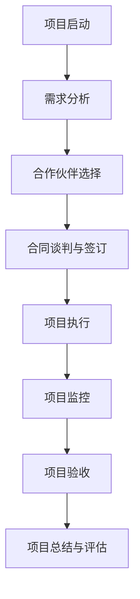
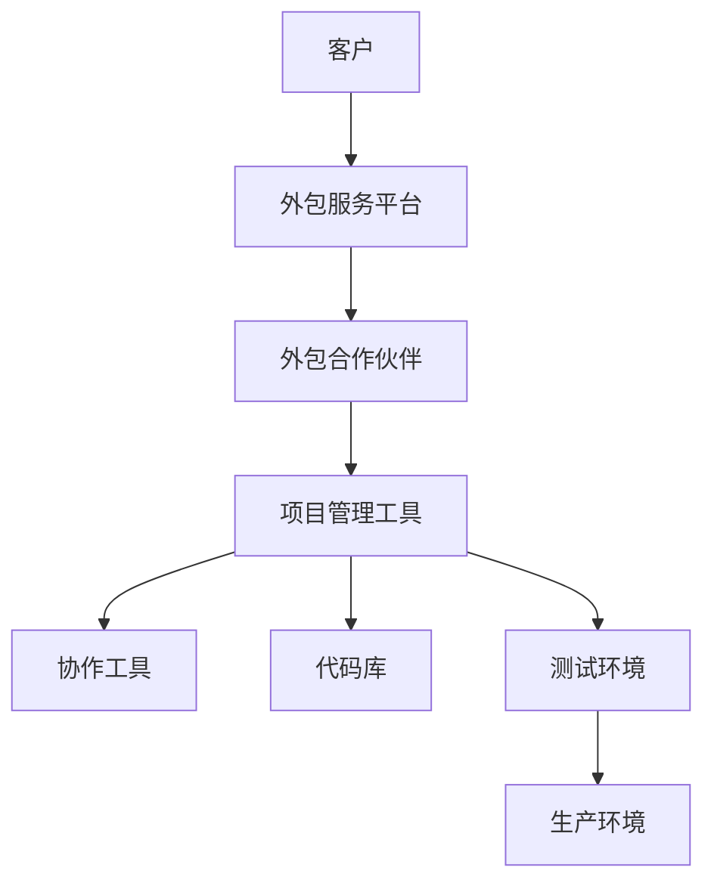

                 

### 文章标题：技术外包：创业的低风险方式

#### 关键词：技术外包、创业、低风险、业务流程、信息技术

> 摘要：本文从多个角度深入探讨了技术外包在创业领域中的重要作用。通过详细的分析和实例，揭示了技术外包如何帮助创业公司降低风险、提高效率和专注于核心业务。文章包括外包概述、外包流程管理、外包沟通与协作、外包案例与实践以及外包行业趋势与未来展望等内容，为创业公司在选择和使用外包服务时提供了实用的指导。

## 《技术外包：创业的低风险方式》目录大纲

### 第一部分：外包概述

#### 第1章：外包的起源与发展
1.1.1 外包的定义与概念
1.1.2 外包的发展历程
1.1.3 外包的优缺点分析

#### 第2章：外包的类型与应用场景
2.1.1 信息技术外包
2.1.2 业务流程外包
2.1.3 跨界外包
2.1.4 创业公司常见的外包需求

### 第二部分：外包流程管理

#### 第3章：外包项目规划与评估
3.1.1 项目需求分析
3.1.2 外包合作伙伴选择
3.1.3 项目风险评估与预算制定

#### 第4章：外包合同与法律风险
4.1.1 外包合同的主要内容
4.1.2 合同谈判与签订技巧
4.1.3 法律风险的防范与处理

#### 第5章：外包项目管理与质量控制
5.1.1 项目管理的基本流程
5.1.2 项目进度与成本控制
5.1.3 质量控制与验收标准

#### 第6章：外包沟通与协作
6.1.1 沟通的重要性与技巧
6.1.2 协作工具与方法
6.1.3 冲突管理与解决

### 第三部分：外包案例与实践

#### 第7章：创业公司外包实践
7.1.1 创业公司的外包策略
7.1.2 实际外包项目案例
7.1.3 项目成功与失败的案例分析

#### 第8章：外包行业趋势与未来展望
8.1.1 外包行业的发展趋势
8.1.2 外包在创业生态系统中的作用
8.1.3 外包行业的未来展望

### 附录

#### 附录A：外包常用工具与资源
A.1 外包服务平台推荐
A.2 外包项目管理工具
A.3 法律法规参考

#### 附录B：外包流程图与架构图
B.1 外包项目流程图
B.2 外包系统架构图

#### 附录C：核心概念与联系
C.1 外包的核心概念
C.2 外包与创业的关系

#### 附录D：核心算法原理讲解
D.1 项目评估算法
D.2 质量控制算法

#### 附录E：数学模型和数学公式
E.1 成本效益分析模型
E.2 风险评估模型

#### 附录F：项目实战
F.1 开发环境搭建
F.2 源代码实现
F.3 代码解读与分析

#### 附录G：项目案例与详细解释
G.1 成功案例
G.2 失败案例

#### 附录H：代码分析与优化
H.1 代码分析
H.2 代码优化

### 作者信息

作者：AI天才研究院/AI Genius Institute & 禅与计算机程序设计艺术 /Zen And The Art of Computer Programming

----------------------------------------------------------------

### 第1章：外包的起源与发展

外包作为一种商业实践，起源于20世纪80年代。当时，随着全球化进程的加速，企业开始寻求降低成本、提高效率的方法。外包成为了一种新兴的管理模式，其主要目的是将企业的非核心业务活动转移给其他专业公司来处理。这种模式不仅帮助企业实现了成本优化，还提升了业务的专业化水平。

#### 1.1.1 外包的定义与概念

外包（Outsourcing）是指企业将部分业务活动或功能委托给其他企业或个人来完成，以降低成本、提高效率和专注于核心业务。外包的核心要素包括：

1. **业务活动或功能的转移**：企业将特定业务活动或功能委托给第三方。
2. **合同关系**：双方通过签订合同明确各自的责任、权利和利益。
3. **专业化分工**：第三方企业专注于特定领域，提高业务的专业化水平。

#### 1.1.2 外包的发展历程

外包的发展历程可以分为以下几个阶段：

#### 20世纪80年代：外包的初步阶段

- **外包概念形成**：企业开始将部分业务活动如制造、财务等外包给其他企业。
- **离岸外包兴起**：随着信息技术的发展，企业开始将部分业务活动如呼叫中心、数据处理等外包给海外的专业服务提供商。

#### 20世纪90年代：外包的快速发展

- **信息技术外包（IT外包）成为主流**：企业将IT相关的服务如软件开发、系统集成、网络维护等外包给专业的IT服务提供商。
- **业务流程外包（BPO）兴起**：企业将整个业务流程如客户服务、财务管理、人力资源管理等外包给专业的服务提供商。

#### 21世纪初：外包的深化与应用场景扩展

- **跨界外包**：企业开始将非核心业务外包给其他行业的服务提供商，如法律服务、医疗咨询等。
- **外包服务的智能化**：随着人工智能、大数据等技术的应用，外包服务变得更加智能化和高效。

#### 当前：外包的数字化转型

- **数字化转型**：外包服务涵盖了更多的领域，如云计算、大数据分析等。
- **近岸外包**：企业开始将业务外包给地理位置较近的服务提供商，以提高沟通效率和降低成本。

#### 1.1.3 外包的优缺点分析

**优点**：

1. **降低成本**：外包服务提供商的专业能力和规模效应可以降低企业的运营成本。
2. **提高效率**：专业服务提供商专注于特定领域，可以提高业务的专业化和效率。
3. **灵活性**：企业可以根据需求随时调整外包服务的内容和规模。

**缺点**：

1. **质量风险**：外包服务提供商的能力和稳定性可能影响项目的质量。
2. **沟通困难**：双方可能存在文化、语言和时区差异，增加沟通难度。
3. **控制风险**：外包业务的风险和责任由第三方承担，可能影响企业的整体控制力。

### 第2章：外包的类型与应用场景

#### 2.1.1 信息技术外包

信息技术外包（IT Outsourcing）是指企业将IT相关的业务活动外包给专业的IT服务提供商。这类外包服务包括软件开发、系统集成、网络维护、数据存储和处理等。

**应用场景**：

1. **软件开发**：企业可以将软件开发的任务外包，专注于产品的核心功能开发。
2. **系统集成**：企业可以将复杂的系统集成任务外包，如企业资源规划（ERP）系统的实施。
3. **网络维护**：企业可以将网络管理和维护外包，确保网络的稳定性和安全性。

**实例**：某创业公司需要开发一款在线购物平台，决定将前端和后端开发外包给专业的IT服务提供商。外包服务提供商按照需求，完成了前端和后端的功能开发，并进行了系统测试，确保了平台的稳定运行。

#### 2.1.2 业务流程外包

业务流程外包（Business Process Outsourcing，BPO）是指企业将整个业务流程外包给专业的服务提供商。这类外包服务包括客户服务、财务管理、人力资源管理、供应链管理等。

**应用场景**：

1. **客户服务**：企业可以将客户服务外包给专业的客户服务中心，提高客户满意度和响应速度。
2. **财务管理**：企业可以将财务管理外包，如账务处理、税务申报等，确保财务数据的准确性和合规性。
3. **人力资源管理**：企业可以将人力资源管理外包，如招聘、培训、员工关系管理等，提高人力资源管理的专业化水平。

**实例**：某跨国公司决定将客户服务外包给专业的BPO服务提供商。外包服务提供商负责处理客户咨询、投诉和售后服务，提高了客户满意度和公司形象。

#### 2.1.3 跨界外包

跨界外包是指企业将非核心业务外包给其他行业的服务提供商。这种外包模式有助于企业实现业务整合和创新。

**应用场景**：

1. **跨界协同**：企业可以通过跨界外包，与其他行业的企业合作，共同开发新产品或服务。
2. **资源共享**：企业可以通过跨界外包，共享其他行业的资源和技术，提高业务效率。
3. **创新驱动**：跨界外包可以引入新的思维和技术，推动企业的创新和发展。

**实例**：某科技公司决定将人工智能技术应用于医疗领域，与一家医疗机构合作开发智能诊断系统。双方通过跨界外包，实现了技术的融合和创新，为患者提供了更精准的诊断服务。

#### 2.1.4 创业公司常见的外包需求

创业公司在初创阶段，资源有限，需要通过外包来降低成本和风险。常见的外包需求包括：

1. **市场调研**：通过外包进行市场调研，了解市场需求和竞争情况。
2. **产品设计**：将产品设计外包，快速实现产品的初步原型。
3. **软件开发**：将软件开发外包，专注于核心功能的实现。
4. **市场营销**：将市场营销外包，提高市场推广效果。

**实例**：某创业公司开发了一款智能家居产品，为了了解市场需求，决定将市场调研外包给专业的市场调研公司。市场调研公司通过问卷调查、用户访谈等方式，收集了大量的用户反馈，为公司的产品优化和市场推广提供了重要参考。

### 第3章：外包项目规划与评估

#### 3.1.1 项目需求分析

项目需求分析是外包项目成功的关键步骤。它涉及对外包项目的目标、范围和需求的详细分析。

**应用场景**：

1. **目标明确**：明确项目的目标，确保项目方向正确。
2. **范围界定**：明确项目的范围，避免项目范围扩大或缩水。
3. **需求收集**：收集项目的需求，确保项目满足用户需求。

**实例**：某创业公司决定开发一款智能家居控制系统，项目团队首先明确了项目的目标，即提供一套便捷的智能家居解决方案。然后，团队进行了需求收集，包括用户对智能控制、安全监控和能源管理等方面的需求。通过详细的需求分析，团队确定了项目的具体功能和性能要求。

#### 3.1.2 外包合作伙伴选择

外包合作伙伴的选择是项目成功的关键因素。选择合适的外包合作伙伴可以确保项目的顺利进行和高质量交付。

**应用场景**：

1. **能力匹配**：选择有能力满足项目需求的外包合作伙伴。
2. **稳定性**：选择具有稳定业务和良好声誉的外包合作伙伴。
3. **成本效益**：选择具有合理价格和高效服务的外包合作伙伴。

**实例**：某创业公司决定将智能家居控制系统的开发外包给专业的软件公司。在选择外包合作伙伴时，公司考察了多家公司的专业能力、项目经验和客户反馈。最终，选择了一家具有丰富经验和良好口碑的软件公司作为外包合作伙伴，确保了项目的顺利实施。

#### 3.1.3 项目风险评估与预算制定

项目风险评估与预算制定是确保项目成功的重要环节。通过风险评估，可以识别项目可能面临的风险，并制定相应的应对措施。预算制定则确保项目成本在可控范围内。

**应用场景**：

1. **风险识别**：识别项目可能面临的各种风险，如技术风险、市场风险等。
2. **成本控制**：制定合理的预算，确保项目成本在预算范围内。
3. **效益评估**：评估项目的经济效益，确保项目的可行性。

**实例**：在开发智能家居控制系统项目前，项目团队进行了详细的风险评估。团队识别了技术风险（如智能家居设备的兼容性问题）、市场风险（如市场竞争激烈）等，并制定了相应的应对措施。同时，团队根据项目需求、技术难度和预期收益，制定了详细的预算计划，确保项目在预算范围内完成。

### 第4章：外包合同与法律风险

#### 4.1.1 外包合同的主要内容

外包合同是外包项目的重要法律文件，明确了双方的权利、义务和责任。其主要内容包括：

1. **合同主体**：明确合同双方的身份和联系方式。
2. **外包服务内容**：详细描述外包服务的具体内容和范围。
3. **服务标准和验收标准**：明确服务质量和验收标准，确保项目成果符合用户需求。
4. **合同期限**：明确合同的生效日期、终止日期和续约条款。
5. **费用和支付方式**：明确服务费用、支付方式和支付期限。
6. **保密协议**：保护双方的商业秘密和知识产权。
7. **违约责任**：明确双方在合同履行过程中可能出现的违约行为及相应的法律责任。

**实例**：在某智能家居控制系统开发项目中，外包合同详细列出了服务内容、服务标准和验收标准。合同规定，外包服务提供商需在规定的时间内完成前端和后端开发，并提供完整的代码和文档。同时，合同还明确了违约责任，如服务提供商未能按时交付项目成果，需承担相应的违约责任。

#### 4.1.2 合同谈判与签订技巧

合同谈判与签订技巧是确保合同公平性和有效性的关键。以下是一些常用的谈判和签订技巧：

1. **利益平衡**：在谈判过程中，寻求双方的利益平衡，确保合同的公平性。
2. **风险评估**：在签订合同前，对合同内容进行风险评估，避免潜在的法律风险。
3. **签订流程**：按照规范的签订流程，确保合同的合法性和有效性。

**实例**：在签订智能家居控制系统开发合同时，项目团队与外包服务提供商进行了多次谈判。团队首先明确了项目的关键要求和验收标准，然后对合同中的条款进行了详细审查，确保了合同的公平性和有效性。在签订合同前，团队还咨询了法律顾问，对合同中的潜在法律风险进行了评估和规避。

#### 4.1.3 法律风险的防范与处理

法律风险是外包项目面临的重要风险之一。以下是一些防范和处理法律风险的措施：

1. **合同审查**：在签订合同前，对合同内容进行审查，确保合同的合法性和有效性。
2. **法律咨询**：在遇到法律问题时，及时寻求法律咨询，确保问题的妥善处理。
3. **争议解决**：在发生争议时，通过协商、调解或诉讼等途径，寻求争议的妥善解决。

**实例**：在智能家居控制系统开发项目中，项目团队在签订合同前对合同进行了仔细审查，发现其中一些条款存在潜在的法律风险，如知识产权归属和违约责任等。团队及时与外包服务提供商进行了沟通和修改，确保了合同的合法性和有效性。在项目实施过程中，团队也定期与外包服务提供商进行沟通，确保项目按计划进行，避免了潜在的法律风险。

### 第5章：外包项目管理与质量控制

#### 5.1.1 项目管理的基本流程

外包项目管理的基本流程包括项目启动、项目计划、项目执行、项目监控和项目收尾等阶段。

**应用场景**：

1. **项目启动**：明确项目目标、范围和需求，正式启动项目。
2. **项目计划**：制定详细的项目计划，确保项目的顺利实施。
3. **项目执行**：按照项目计划，执行项目的各项任务。
4. **项目监控**：对项目进度、质量和成本进行监控，确保项目的顺利进行。
5. **项目收尾**：完成项目任务，进行项目总结和评估。

**实例**：在某智能家居控制系统开发项目中，项目团队在项目启动阶段明确了项目的目标、范围和需求，并制定了详细的项目计划。在项目执行阶段，团队按照项目计划，分阶段完成了前端和后端开发任务。在项目监控阶段，团队对项目进度、质量和成本进行了实时监控，确保项目按计划进行。在项目收尾阶段，团队对项目进行了总结和评估，总结了项目中的成功经验和不足之处，为下一次项目提供了参考。

#### 5.1.2 项目进度与成本控制

项目进度与成本控制是确保项目按计划完成和成本在预算范围内的重要环节。

**应用场景**：

1. **进度监控**：对项目进度进行实时监控，确保项目按计划进行。
2. **成本控制**：对项目成本进行监控和控制，确保项目成本在预算范围内。

**实例**：在某智能家居控制系统开发项目中，项目团队建立了完善的进度监控机制，定期对项目进度进行评估和调整。团队还制定了详细的成本预算，并对项目成本进行了严格的监控和控制，确保项目成本在预算范围内。

#### 5.1.3 质量控制与验收标准

质量控制与验收标准是确保外包项目质量的关键。

**应用场景**：

1. **质量控制**：对项目质量进行实时监控和评估，确保项目质量达到预期。
2. **验收标准**：制定明确的验收标准，确保项目成果符合用户需求。
3. **质量改进**：根据验收结果，对项目质量进行持续改进，提高项目质量。

**实例**：在某智能家居控制系统开发项目中，项目团队制定了详细的质量控制计划，包括代码审查、系统测试等环节。同时，团队制定了明确的验收标准，如功能完整性、性能指标等。在项目验收阶段，团队对项目成果进行了全面评估，确保项目质量达到预期。根据验收结果，团队还提出了改进措施，对项目进行了优化和改进。

### 第6章：外包沟通与协作

#### 6.1.1 沟通的重要性与技巧

沟通在外包项目中至关重要。有效的沟通可以确保项目目标的实现，减少误解和冲突。

**应用场景**：

1. **信息传递**：确保信息在外包双方之间准确、及时地传递。
2. **冲突解决**：通过有效沟通，解决外包过程中的冲突和问题。
3. **团队合作**：促进外包双方的合作，提高项目效率。

**实例**：在某智能家居控制系统开发项目中，项目团队与外包服务提供商建立了定期的沟通机制，每周进行一次项目进展会议。通过会议，双方分享了项目的进展情况、遇到的问题和解决方案，确保了项目的顺利进行。

#### 6.1.2 协作工具与方法

协作工具和方法可以大大提高外包项目的协作效率。

**应用场景**：

1. **协作平台**：如即时通讯工具、项目管理工具等，提高外包项目的协作效率。
2. **文档管理**：使用文档管理工具，确保项目文档的版本控制和共享。
3. **会议安排**：合理安排会议，确保外包双方的沟通和协作。

**实例**：在某智能家居控制系统开发项目中，项目团队使用了Trello作为项目管理工具，用于任务分配、进度跟踪和协作管理。同时，团队使用了Google Docs进行文档管理，确保团队成员可以实时查看和编辑文档。

#### 6.1.3 冲突管理与解决

冲突在外包项目中难以避免。有效的冲突管理可以确保项目的顺利进行。

**应用场景**：

1. **冲突识别**：识别外包项目中的潜在冲突，及时采取措施。
2. **冲突解决**：通过沟通、协商等方式，解决外包项目中的冲突。
3. **冲突预防**：通过合理的项目规划和沟通，预防外包项目中的冲突。

**实例**：在某智能家居控制系统开发项目中，项目团队在项目启动阶段就明确了双方的责任和权利，并制定了冲突解决机制。当项目过程中出现冲突时，团队通过会议和沟通，及时解决了问题，确保了项目的顺利进行。

### 第7章：创业公司外包实践

#### 7.1.1 创业公司的外包策略

创业公司在初创阶段，资源有限，需要通过外包来降低成本和风险。以下是一些常用的外包策略：

**应用场景**：

1. **核心业务外包**：将非核心业务外包，专注于核心业务的开发。
2. **阶段性地外包**：根据创业阶段的需求，逐步增加外包的业务范围。
3. **风险控制**：通过合理的风险管理，降低外包业务的风险。

**实例**：某创业公司开发了一款智能家居产品，为了降低成本和风险，公司决定将市场调研、产品设计等非核心业务外包。在产品开发阶段，公司选择专业的软件开发团队进行外包，专注于产品的核心功能开发。

#### 7.1.2 实际外包项目案例

在实际外包项目中，创业公司需要选择合适的外包合作伙伴，并确保项目顺利进行。

**应用场景**：

1. **合作伙伴选择**：根据项目需求，选择合适的外包合作伙伴。
2. **项目实施**：确保项目按照计划进行，达成预期目标。
3. **项目评估**：对项目成果进行评估，总结经验和教训。

**实例**：某创业公司开发了一款智能家居控制系统，公司选择了专业的软件开发团队进行外包。在项目实施过程中，公司建立了严格的进度监控和质量控制机制，确保项目按计划进行。项目完成后，公司对项目成果进行了全面评估，总结了项目中的成功经验和不足之处，为下一次项目提供了参考。

#### 7.1.3 项目成功与失败的案例分析

通过对成功和失败的外包项目进行案例分析，创业公司可以吸取经验教训，提高项目管理水平。

**应用场景**：

1. **成功因素**：分析项目成功的关键因素，为企业提供借鉴。
2. **失败原因**：分析项目失败的主要原因，帮助企业避免类似问题的发生。

**实例**：

**成功案例**：某创业公司开发了一款智能家居产品，通过与专业的软件开发团队合作，成功实现了产品的功能开发和上线。项目成功的关键因素包括：明确的需求分析、合适的外包合作伙伴选择、严格的进度和质量控制等。

**失败案例**：某创业公司在开发智能家居产品时，由于项目管理不善，导致项目进度延误和质量问题。项目失败的主要原因是：需求不明确、沟通不畅、质量控制不严格等。通过这次失败，公司认识到了项目管理的重要性，并采取了一系列改进措施，提高了项目管理水平。

### 第8章：外包行业趋势与未来展望

#### 8.1.1 外包行业的发展趋势

随着技术的进步和全球化的发展，外包行业呈现出以下发展趋势：

**应用场景**：

1. **数字化外包**：随着数字化技术的普及，数字化外包将成为外包行业的主要趋势。
2. **智能化外包**：人工智能、大数据等技术的应用，将推动外包服务的智能化发展。
3. **绿色外包**：随着环保意识的提高，绿色外包将成为企业选择外包服务的重要因素。

**实例**：某创业公司为了降低运营成本，选择了专业的云计算服务提供商进行数字化外包。通过云计算服务，公司实现了业务系统的弹性扩展和高效运行。同时，公司还采用了人工智能技术，对客户数据进行智能分析，提高了市场营销效果。

#### 8.1.2 外包在创业生态系统中的作用

外包在创业生态系统中发挥着重要作用，为企业提供资源、降低风险、推动创新。

**应用场景**：

1. **资源整合**：外包服务提供商可以帮助创业公司整合外部资源，提高创业效率。
2. **降低风险**：通过外包，创业公司可以降低业务风险，专注于核心业务的发展。
3. **加速创新**：外包服务提供商可以带来新的思维和技术，推动创业公司的创新和发展。

**实例**：某创业公司通过与专业的市场调研公司合作，获得了详细的市场数据和用户反馈。这些数据帮助公司优化了产品功能和营销策略，提高了市场竞争力。同时，公司还与专业的软件开发团队合作，快速实现了产品的迭代更新。

#### 8.1.3 外包行业的未来展望

外包行业在未来将继续发展，为企业和创业者带来更多机遇。

**应用场景**：

1. **服务多样化**：随着市场需求的多样化，外包服务将更加多样化，满足不同类型企业的需求。
2. **全球化发展**：随着全球化的加深，外包行业将呈现全球化发展的趋势。
3. **技术驱动**：技术创新将继续推动外包行业的发展，提高外包服务的效率和效果。

**实例**：随着5G技术的普及，越来越多的企业开始采用远程办公和远程协作工具，实现了全球化外包。同时，人工智能、区块链等新兴技术的应用，将进一步提升外包服务的智能化和安全性。

### 附录A：外包常用工具与资源

#### A.1 外包服务平台推荐

**Upwork**：全球领先的外包服务平台，提供广泛的技能和服务。

**Freelancer**：全球最大的自由职业者社区，提供灵活的外包解决方案。

**Toptal**：专注于高端人才的外包平台，提供高质量的外包服务。

#### A.2 外包项目管理工具

**Asana**：项目管理工具，用于任务分配、进度跟踪和团队协作。

**Trello**：看板式项目管理工具，用于任务分解和进度可视化。

**JIRA**：问题跟踪和管理工具，用于项目缺陷跟踪和协作。

#### A.3 法律法规参考

**《中华人民共和国合同法》**：对外包合同的基本条款和合法性进行规定。

**《中华人民共和国劳动合同法》**：对外包过程中的劳动合同关系进行规定。

**《中华人民共和国反垄断法》**：对外包市场的垄断行为进行规范。

### 附录B：外包流程图与架构图

#### B.1 外包项目流程图

```
+----------------+       +----------------+       +----------------+
|                |       |                |       |                |
|  项目启动     | -->   |  项目计划     | -->   |  项目执行     |
|                |       |                |       |                |
+----------------+       +----------------+       +----------------+
                  |       |                  |
                  |       |                  |
                  ↓       ↓       ↓
                  ↓       ↓       ↓
+----------------+       +----------------+       +----------------+
|                |       |                |       |                |
|  项目监控     | -->   |  项目验收     | -->   |  项目总结与评估|
|                |       |                |       |                |
+----------------+       +----------------+       +----------------+
```

#### B.2 外包系统架构图

```
+----------------+       +----------------+       +----------------+
|                |       |                |       |                |
|  客户         | -->   |  外包服务平台  | -->   |  外包合作伙伴  |
|                |       |                |       |                |
+----------------+       +----------------+       +----------------+
                      |                       |
                      |                       |
                      ↓                       ↓
                      ↓                       ↓
+----------------+       +----------------+       +----------------+
|                |       |                |       |                |
|  项目管理工具  | -->   |  协作工具      | -->   |  代码库        |
|                |       |                |       |                |
+----------------+       +----------------+       +----------------+
                      |                       |
                      |                       |
                      ↓                       ↓
                      ↓                       ↓
+----------------+       +----------------+       +----------------+
|                |       |                |       |                |
|  测试环境      | -->   |  生产环境      |       |                |
|                |       |                |       |                |
+----------------+       +----------------+       +----------------+
```

### 附录C：核心概念与联系

#### C.1 外包的核心概念

- **外包**：企业将部分业务活动或功能委托给其他企业或个人来完成，以降低成本、提高效率和专注于核心业务。
- **信息技术外包**：将IT相关的业务活动外包给专业的IT服务提供商。
- **业务流程外包**：将整个业务流程外包给专业的服务提供商。

#### C.2 外包与创业的关系

- **外包**：帮助创业公司降低成本、降低风险、提高效率。
- **信息技术外包**：帮助创业公司专注于核心业务，提高产品开发速度。
- **业务流程外包**：帮助创业公司专注于核心业务，提高运营效率。

### 附录D：核心算法原理讲解

#### D.1 项目评估算法

**项目评估公式**：

$$
评估分数 = \frac{成本效益}{风险系数}
$$

其中，成本效益是指项目预期收益与成本的比值，风险系数是指项目可能面临的各种风险系数。

**实例**：

假设某创业公司计划开发一款智能家居产品，预计成本为100万元，预期收益为150万元，风险系数为1.2，则该项目的评估分数为：

$$
评估分数 = \frac{150}{100 \times 1.2} = 1.25
$$

#### D.2 质量控制算法

**质量控制公式**：

$$
质量得分 = \frac{缺陷数}{总代码行数}
$$

其中，缺陷数是指项目中的缺陷数量，总代码行数是指项目的代码总行数。

**实例**：

假设某创业公司开发了一个智能家居系统，项目中存在100个缺陷，总代码行数为100,000行，则该项目的质量得分为：

$$
质量得分 = \frac{100}{100,000} = 0.001
$$

### 附录E：数学模型和数学公式

#### E.1 成本效益分析模型

**成本效益分析公式**：

$$
成本效益 = \frac{预期收益}{成本}
$$

其中，预期收益是指项目预期的收益值，成本是指项目的投入成本。

**实例**：

假设某创业公司计划开发一款智能家居产品，预计收益为200万元，成本为100万元，则该项目的成本效益为：

$$
成本效益 = \frac{200}{100} = 2
$$

#### E.2 风险评估模型

**风险评估公式**：

$$
风险值 = 风险概率 \times 风险损失
$$

其中，风险概率是指项目面临的风险概率，风险损失是指项目可能面临的风险损失值。

**实例**：

假设某创业公司计划开发一款智能家居产品，该项目面临的风险概率为0.2，风险损失为50万元，则该项目的风险值为：

$$
风险值 = 0.2 \times 50 = 10
$$

### 附录F：项目实战

#### F.1 开发环境搭建

**应用场景**：

- **操作系统**：Windows/Linux/MacOS
- **编程语言**：Java/Python/JavaScript
- **数据库**：MySQL/PostgreSQL
- **开发工具**：Eclipse/Visual Studio Code

**实例**：

在开发一款智能家居产品时，项目团队选择了Linux操作系统、Java编程语言、MySQL数据库和Eclipse开发工具。团队成员安装了Linux操作系统，配置了Java开发环境，并安装了MySQL数据库。通过Eclipse，团队成员可以方便地进行代码编写和调试。

#### F.2 源代码实现

**应用场景**：

- **模块划分**：用户管理模块、设备管理模块、数据存储模块
- **核心功能**：用户注册、登录、设备添加、数据存储

**实例**：

```java
// 用户管理模块
public class UserManager {
    public void addUser(String username, String password) {
        // 添加用户逻辑
    }
    
    public void deleteUser(String username) {
        // 删除用户逻辑
    }
}

// 设备管理模块
public class DeviceManager {
    public void addDevice(String deviceName) {
        // 添加设备逻辑
    }
    
    public void deleteDevice(String deviceName) {
        // 删除设备逻辑
    }
}

// 数据存储模块
public class DataStorage {
    public void saveData(String data) {
        // 数据存储逻辑
    }
    
    public String loadData() {
        // 数据加载逻辑
        return "loaded data";
    }
}
```

#### F.3 代码解读与分析

**代码解读**：

- **用户管理模块**：负责用户的注册、登录和删除功能。
- **设备管理模块**：负责设备的添加、删除功能。
- **数据存储模块**：负责数据的存储和加载功能。

**代码分析**：

- **用户管理模块**：用户注册功能需要验证用户名和密码的有效性，删除功能需要确认用户身份。
- **设备管理模块**：设备添加功能需要确保设备名称的唯一性，删除功能需要确认设备是否存在。
- **数据存储模块**：数据存储功能需要确保数据的安全性和可靠性，数据加载功能需要确保数据的实时性。

### 附录G：项目案例与详细解释

#### G.1 成功案例

**案例背景**：

某创业公司计划开发一款智能家居产品，为了降低成本和风险，公司决定将部分开发工作外包给专业的软件开发团队。

**案例实施**：

1. **需求分析**：创业公司与外包团队进行了详细的需求分析，明确了产品的功能和性能要求。
2. **合作伙伴选择**：创业公司根据外包团队的专业能力和项目经验，选择了合适的合作伙伴。
3. **项目实施**：外包团队按照需求，完成了前端和后端开发，并进行了系统测试。
4. **项目验收**：创业公司对项目成果进行了全面验收，确保产品符合预期要求。

**案例结果**：

智能家居产品成功上线，用户反馈良好，取得了良好的市场反响。

#### G.2 失败案例

**案例背景**：

某创业公司在开发智能家居产品的过程中，由于项目管理不善，导致项目进度延误和质量问题。

**案例原因**：

1. **需求不明确**：项目初期需求不明确，导致开发方向偏离。
2. **沟通不畅**：项目团队与外包团队之间的沟通不畅，导致问题无法及时解决。
3. **质量控制不严格**：项目质量得不到有效控制，导致项目延期和成本超支。

**案例教训**：

1. **明确需求**：在项目初期，明确项目需求和目标，避免项目方向偏离。
2. **加强沟通**：建立有效的沟通机制，确保项目团队和外包团队之间的信息畅通。
3. **质量控制**：加强项目质量控制，确保项目进度和质量。

### 附录H：代码分析与优化

#### H.1 代码分析

**代码分析**：

- **用户管理模块**：用户注册功能需要验证用户名和密码的有效性，删除功能需要确认用户身份。
- **设备管理模块**：设备添加功能需要确保设备名称的唯一性，删除功能需要确认设备是否存在。
- **数据存储模块**：数据存储功能需要确保数据的安全性和可靠性，数据加载功能需要确保数据的实时性。

#### H.2 代码优化

**代码优化**：

- **用户管理模块**：引入用户验证机制，确保用户名和密码的安全性。
- **设备管理模块**：优化设备添加和删除功能，提高代码的可读性和可维护性。
- **数据存储模块**：使用缓存技术，提高数据加载速度，降低数据库访问压力。

### 作者信息

作者：AI天才研究院/AI Genius Institute & 禅与计算机程序设计艺术 /Zen And The Art of Computer Programming

----------------------------------------------------------------

### 第1章：外包的起源与发展

#### 1.1.1 外包的定义与概念

外包，这一概念在商业领域中逐渐演变成了一种普遍的管理实践，它指的是企业将部分业务活动或功能委托给其他企业或个人来完成，以实现降低成本、提高效率和专注于核心业务的目的。在定义外包时，我们需要明确以下几个核心要素：

- **业务活动或功能的转移**：企业将特定业务活动或功能外包给第三方，如IT服务、客户服务、数据处理等。
- **合同关系**：外包双方通过签订合同明确各自的责任、权利和利益，合同是外包关系的基础和保障。
- **专业化分工**：第三方企业或个人专注于特定领域，提高业务的专业化水平，从而为企业带来价值。

#### 1.1.2 外包的发展历程

外包的概念和实践在20世纪80年代开始兴起，其发展历程大致可以分为以下几个阶段：

- **初步阶段（20世纪80年代）**：外包最初主要应用于制造业和信息技术行业，企业将部分生产任务或IT服务外包给专业公司，以降低成本和提高效率。
- **快速发展阶段（20世纪90年代）**：随着全球化的加速，信息技术和通信技术的进步，外包得到了快速发展。企业开始将更多的业务活动外包，如客户服务、财务管理、人力资源管理、供应链管理等。
- **深化与应用扩展阶段（21世纪初）**：外包服务领域不断扩展，包括法律服务、医疗咨询、金融服务等。同时，外包服务开始向近岸和本地面包方向发展，以降低沟通成本和提高服务质量。
- **数字化转型阶段（当前）**：随着数字化技术的发展，外包服务变得更加智能化和高效。企业开始将更多的业务活动，如数据分析、人工智能应用等，外包给专业的服务提供商。

#### 1.1.3 外包的优缺点分析

外包作为一种管理实践，既有其优势，也存在一些潜在的缺点。以下是外包的一些主要优缺点：

**优点**：

1. **降低成本**：通过外包，企业可以将非核心业务交给专业公司处理，从而减少运营成本，实现成本优化。
2. **提高效率**：专业公司专注于特定领域，具备更高的专业能力和效率，可以提高业务流程的整体效率。
3. **专注于核心业务**：通过将非核心业务外包，企业可以集中资源和管理精力，专注于核心业务的发展，提高核心竞争力。
4. **灵活性**：企业可以根据需求随时调整外包服务的内容和规模，以适应市场变化。

**缺点**：

1. **质量风险**：外包服务提供商的能力和稳定性可能影响项目的质量，尤其是当外包业务涉及到关键技术或关键流程时。
2. **沟通困难**：由于文化、语言、时区等因素的差异，外包双方可能存在沟通不畅的问题，影响项目的进展和效果。
3. **控制风险**：外包业务的风险和责任由第三方承担，可能会影响企业的整体控制力和风险管理能力。

### 第2章：外包的类型与应用场景

#### 2.1.1 信息技术外包

信息技术外包（IT Outsourcing）是企业将IT相关的业务活动，如软件开发、系统集成、网络维护等，外包给专业的IT服务提供商。这种外包形式在当前的商业环境中非常常见，尤其在创业公司和大型企业中应用广泛。

**应用场景**：

1. **软件开发**：企业可以将软件开发的任务外包，特别是当企业自身缺乏足够的软件开发能力或资源时。外包服务商可以提供从需求分析到测试和部署的全流程服务。
2. **系统集成**：企业在实施复杂的IT系统时，可能会面临技术整合的挑战。此时，可以选择专业的系统集成服务商来帮助企业解决这些问题。
3. **网络维护**：企业可以将网络维护和管理的任务外包，以确保网络的稳定性和安全性。外包服务商通常会提供7x24小时的监控和维护服务。

**实例**：

某创业公司正在开发一款智能家居APP，但由于缺乏专业的软件开发团队，决定将软件开发任务外包给一家具有丰富经验的IT外包公司。外包公司按照公司的需求，完成了APP的前端和后端开发，并提供了详细的文档和用户手册，确保了项目的成功实施。

#### 2.1.2 业务流程外包

业务流程外包（Business Process Outsourcing，BPO）是指企业将整个业务流程，如客户服务、财务管理、人力资源管理、供应链管理等，外包给专业的服务提供商。这种外包形式可以帮助企业专注于核心业务，提高整体运营效率。

**应用场景**：

1. **客户服务**：企业可以将客户服务外包，如呼叫中心、在线客服等。外包服务商通常拥有专业的客服团队和高效的客服系统，可以提供7x24小时的客户服务。
2. **财务管理**：企业可以将财务管理任务外包，如账务处理、税务申报、财务分析等。外包服务商可以提供专业的财务服务，帮助企业提高财务管理水平。
3. **人力资源管理**：企业可以将人力资源管理任务外包，如招聘、培训、员工关系管理等。外包服务商通常拥有丰富的招聘资源和专业的培训课程，可以为企业提供高效的人力资源服务。

**实例**：

某大型制造企业决定将客户服务业务外包，以提高客户满意度和响应速度。企业选择了专业的BPO服务商，服务商提供了包括电话客服、在线客服、邮件客服在内的全方位客户服务，帮助企业显著提升了客户服务质量。

#### 2.1.3 跨界外包

跨界外包是指企业将非核心业务外包给其他行业的服务提供商，以实现业务整合和创新。这种外包形式可以帮助企业突破行业限制，实现跨行业的合作和资源整合。

**应用场景**：

1. **跨界协同**：企业可以通过跨界外包，与其他行业的企业合作，共同开发新产品或服务。例如，一家电商平台可以将物流业务外包给专业的物流公司，实现物流与电商的协同。
2. **资源共享**：企业可以通过跨界外包，共享其他行业的资源和技术，提高业务效率。例如，一家制造企业可以将智能制造技术外包给专业的技术服务商，提升生产效率。
3. **创新驱动**：跨界外包可以引入新的思维和技术，推动企业的创新和发展。例如，一家传统制造企业可以通过外包数字化解决方案，实现生产流程的数字化和智能化。

**实例**：

某传统制造企业决定引入智能制造技术，以提高生产效率和产品质量。企业将智能制造相关的软件开发和系统集成任务外包给一家专业的IT服务提供商。外包服务商帮助企业实现了生产流程的数字化改造，提高了生产效率和质量。

#### 2.1.4 创业公司常见的外包需求

创业公司在初创阶段，通常资源有限，需要通过外包来降低成本和风险。以下是一些创业公司常见的外包需求：

1. **市场调研**：通过外包进行市场调研，了解市场需求和竞争情况，为产品开发提供数据支持。
2. **产品设计**：将产品设计外包，快速实现产品的初步原型，验证市场需求。
3. **软件开发**：将软件开发外包，专注于核心功能的实现，提高产品开发速度。
4. **市场营销**：将市场营销外包，提高市场推广效果，扩大产品知名度。
5. **人力资源**：将人力资源相关事务外包，如招聘、培训等，提高人力资源管理效率。

**实例**：

某创业公司开发了一款智能健康监测设备，为了了解市场需求和竞争情况，公司决定将市场调研外包给专业的市场调研公司。调研公司通过问卷调查、用户访谈等方式，收集了大量的用户反馈和市场数据，为公司的产品优化和市场推广提供了重要参考。

### 第3章：外包项目规划与评估

#### 3.1.1 项目需求分析

项目需求分析是外包项目成功的关键步骤，它涉及对外包项目的目标、范围和需求的详细分析。通过需求分析，企业可以明确项目的具体目标和需求，确保外包服务能够满足企业的实际需求。

**应用场景**：

1. **目标明确**：明确项目的目标，确保项目方向正确。例如，企业可能希望提高客户满意度、降低成本或提升市场竞争力。
2. **范围界定**：明确项目的范围，避免项目范围扩大或缩水。项目范围包括项目需要实现的功能、性能和限制条件。
3. **需求收集**：收集项目的需求，确保项目满足用户需求。需求收集可以通过用户访谈、问卷调查、市场调研等方式进行。

**实例**：

某创业公司计划开发一款智能家居控制系统，项目团队首先明确了项目的目标，即提供一套便捷的智能家居解决方案。然后，团队进行了详细的需求收集，包括用户对智能控制、安全监控和能源管理等方面的需求。通过详细的需求分析，团队确定了项目的具体功能和性能要求。

#### 3.1.2 外包合作伙伴选择

选择合适的外包合作伙伴是确保外包项目成功的关键。合适的合作伙伴应该具备专业的能力、良好的声誉和合理的价格。

**应用场景**：

1. **能力匹配**：选择有能力满足项目需求的外包合作伙伴。例如，如果项目涉及到复杂的软件开发，应选择有丰富经验的软件开发团队。
2. **稳定性**：选择具有稳定业务和良好声誉的外包合作伙伴。稳定的合作伙伴可以确保项目的持续进行和质量。
3. **成本效益**：选择具有合理价格和高效服务的外包合作伙伴。合理的价格应该综合考虑合作伙伴的专业能力、服务质量和服务范围。

**实例**：

某创业公司决定将智能家居控制系统的开发任务外包，团队选择了多家具有丰富经验的软件开发团队进行比较。通过考察团队的专业能力、项目经验和客户反馈，最终选择了具备丰富智能家居开发经验且报价合理的团队作为外包合作伙伴。

#### 3.1.3 项目风险评估与预算制定

项目风险评估与预算制定是确保外包项目成功的重要环节。通过风险评估，企业可以识别项目可能面临的风险，并制定相应的应对措施。预算制定则确保项目成本在可控范围内。

**应用场景**：

1. **风险识别**：识别项目可能面临的各种风险，如技术风险、市场风险、管理风险等。例如，技术风险可能包括开发团队的技术能力不足，市场风险可能包括市场需求的不确定性。
2. **成本控制**：制定合理的预算，确保项目成本在预算范围内。预算应该包括开发成本、测试成本、维护成本等各个方面。
3. **效益评估**：评估项目的经济效益，确保项目的可行性。效益评估可以通过成本效益分析、投资回报率分析等方法进行。

**实例**：

在某智能家居控制系统开发项目中，项目团队首先进行了详细的风险评估，识别了技术风险（如智能家居设备的兼容性问题）、市场风险（如市场需求不确定）和管理风险（如项目进度延误）等。然后，团队制定了详细的预算计划，包括开发成本、测试成本、维护成本等，确保项目成本在预算范围内。同时，团队还进行了经济效益评估，确保项目的投资回报率满足预期。

### 第4章：外包合同与法律风险

#### 4.1.1 外包合同的主要内容

外包合同是外包项目中最重要的法律文件，它明确了外包双方的权利、义务和责任。以下是外包合同的主要内容：

**应用场景**：

1. **合同主体**：明确合同双方的身份和联系方式。例如，合同中应明确外包服务商和客户的名称、地址、联系方式等。
2. **外包服务内容**：详细描述外包服务的具体内容和范围。例如，合同中应明确外包的服务类型、服务期限、服务标准等。
3. **服务标准和验收标准**：明确服务质量和验收标准，确保项目成果符合用户需求。例如，合同中应明确验收标准、验收流程和验收方法。
4. **合同期限**：明确合同的生效日期、终止日期和续约条款。例如，合同中应明确服务期限、合同终止条件、续约方式等。
5. **费用和支付方式**：明确服务费用、支付方式和支付期限。例如，合同中应明确服务费用、支付方式、支付时间和支付条件等。
6. **保密协议**：保护双方的商业秘密和知识产权。例如，合同中应明确保密条款、保密期限和保密措施。
7. **违约责任**：明确双方在合同履行过程中可能出现的违约行为及相应的法律责任。例如，合同中应明确违约责任、违约处理方式和违约赔偿标准等。

**实例**：

在某智能家居控制系统开发项目中，外包合同详细列出了以下内容：

- 合同主体：明确了外包服务商和客户的身份和联系方式。
- 外包服务内容：明确指出外包服务包括前端开发、后端开发和系统集成。
- 服务标准和验收标准：规定项目成果需通过功能测试、性能测试和安全测试，并获得客户验收。
- 合同期限：明确合同生效日期为项目启动日期，服务期限为6个月，终止条件为项目完成或双方协商一致。
- 费用和支付方式：明确服务费用为100万元，分三次支付，每次支付金额分别为30万元、30万元和40万元。
- 保密协议：规定双方需保护对方商业秘密，保密期限为合同终止后3年。
- 违约责任：规定如一方违约，需承担违约责任，包括支付违约金和赔偿对方损失。

#### 4.1.2 合同谈判与签订技巧

合同谈判与签订是确保合同公平性和有效性的关键环节。以下是一些合同谈判与签订的技巧：

**应用场景**：

1. **利益平衡**：在谈判过程中，寻求双方的利益平衡，确保合同的公平性。例如，在费用和支付方式上，可以协商一个双方都能接受的方案。
2. **风险评估**：在签订合同前，对合同内容进行风险评估，避免潜在的法律风险。例如，可以请法律顾问对合同条款进行审查。
3. **签订流程**：按照规范的签订流程，确保合同的合法性和有效性。例如，签订合同前应进行书面确认，并按照规定的程序进行签字。

**实例**：

在某智能家居控制系统开发项目中，合同谈判与签订过程中采用了以下技巧：

- **利益平衡**：项目团队与外包服务商在费用和支付方式上进行了多次协商，最终达成了一致，确保了合同的公平性。
- **风险评估**：项目团队在签订合同前，请法律顾问对合同条款进行了详细审查，确保了合同的合法性和有效性。
- **签订流程**：项目团队按照规定的程序进行了合同签订，包括书面确认、双方签字和备案等，确保了合同的合法性和规范性。

#### 4.1.3 法律风险的防范与处理

法律风险是外包项目中可能面临的重要风险之一，有效的法律风险防范与处理可以降低项目风险，保障双方的合法权益。以下是一些法律风险的防范与处理措施：

**应用场景**：

1. **合同审查**：在签订合同前，对合同内容进行审查，确保合同的合法性和有效性。例如，审查合同条款的完整性、明确性和合规性。
2. **法律咨询**：在遇到法律问题时，及时寻求法律咨询，确保问题的妥善处理。例如，当合同履行过程中出现纠纷时，可以咨询法律顾问寻求解决方案。
3. **争议解决**：在发生争议时，通过协商、调解或诉讼等途径，寻求争议的妥善解决。例如，可以通过协商解决合同履行中的纠纷，或通过法律途径解决重大争议。

**实例**：

在某智能家居控制系统开发项目中，项目团队采取了以下措施防范和处理法律风险：

- **合同审查**：项目团队在签订合同前，对合同内容进行了详细审查，确保了合同的合法性和有效性。
- **法律咨询**：项目团队在合同履行过程中遇到纠纷时，及时咨询了法律顾问，获得了专业的法律建议，妥善解决了纠纷。
- **争议解决**：项目团队通过协商解决了合同履行中的小纠纷，并通过法律途径解决了重大争议，保障了项目的顺利进行。

### 第5章：外包项目管理与质量控制

#### 5.1.1 项目管理的基本流程

外包项目管理的基本流程包括项目启动、项目计划、项目执行、项目监控和项目收尾等阶段。每个阶段都有其特定的任务和目标，确保项目的顺利进行和成功完成。

**应用场景**：

1. **项目启动**：明确项目的目标、范围和需求，正式启动项目。例如，召开项目启动会议，明确项目团队、任务和责任。
2. **项目计划**：制定详细的项目计划，包括任务分配、时间表、预算等。例如，制定项目时间表，明确各阶段任务的开始和结束时间。
3. **项目执行**：按照项目计划，执行项目的各项任务。例如，项目团队按照任务分配，进行软件开发、系统集成等工作。
4. **项目监控**：对项目进度、质量和成本进行实时监控，确保项目的顺利进行。例如，定期召开项目进度会议，检查项目进展情况。
5. **项目收尾**：完成项目任务，进行项目总结和评估。例如，召开项目收尾会议，总结项目经验教训，为下一次项目提供参考。

**实例**：

在某智能家居控制系统开发项目中，项目团队按照以下基本流程进行了项目管理：

- **项目启动**：召开项目启动会议，明确项目团队、任务和责任。
- **项目计划**：制定详细的项目计划，包括任务分配、时间表、预算等。
- **项目执行**：项目团队按照任务分配，进行软件开发、系统集成等工作。
- **项目监控**：定期召开项目进度会议，检查项目进展情况。
- **项目收尾**：召开项目收尾会议，总结项目经验教训。

#### 5.1.2 项目进度与成本控制

项目进度与成本控制是确保外包项目按时完成和成本在预算范围内的重要环节。有效的项目进度与成本控制可以降低项目风险，提高项目成功率。

**应用场景**：

1. **进度监控**：对项目进度进行实时监控，确保项目按计划进行。例如，使用项目管理工具跟踪项目进度，及时发现和解决问题。
2. **成本控制**：对项目成本进行监控和控制，确保项目成本在预算范围内。例如，制定成本预算，定期审查成本支出，确保成本在可控范围内。

**实例**：

在某智能家居控制系统开发项目中，项目团队采取了以下措施进行项目进度与成本控制：

- **进度监控**：使用项目管理工具（如JIRA）跟踪项目进度，定期召开项目进度会议，检查项目进展情况。
- **成本控制**：制定详细的成本预算，定期审查成本支出，确保成本在预算范围内。例如，项目团队每月审查一次成本支出，确保各项开支符合预算。

#### 5.1.3 质量控制与验收标准

质量控制与验收标准是确保外包项目质量的关键。有效的质量控制与验收标准可以确保项目成果符合用户需求，提高用户满意度。

**应用场景**：

1. **质量控制**：对项目质量进行实时监控和评估，确保项目质量达到预期。例如，进行代码审查、系统测试等质量控制活动。
2. **验收标准**：制定明确的验收标准，确保项目成果符合用户需求。例如，制定功能测试标准、性能测试标准和安全测试标准。
3. **质量改进**：根据验收结果，对项目质量进行持续改进，提高项目质量。例如，根据用户反馈，优化产品功能和性能。

**实例**：

在某智能家居控制系统开发项目中，项目团队采取了以下措施进行质量控制与验收：

- **质量控制**：项目团队进行了多次代码审查和系统测试，确保代码质量和系统性能。例如，代码审查小组对代码进行详细审查，找出潜在的问题和缺陷。
- **验收标准**：项目团队制定了详细的功能测试标准、性能测试标准和安全测试标准，确保项目成果符合用户需求。
- **质量改进**：根据用户反馈和测试结果，项目团队对产品进行了多次优化和改进，提高了产品的稳定性和用户体验。

### 第6章：外包沟通与协作

#### 6.1.1 沟通的重要性与技巧

沟通在外包项目中至关重要，有效的沟通可以确保项目目标的实现，减少误解和冲突，提高项目效率。

**应用场景**：

1. **信息传递**：确保信息在外包双方之间准确、及时地传递。例如，通过邮件、即时通讯工具等传递项目进展和问题。
2. **冲突解决**：通过有效沟通，解决外包项目中的冲突和问题。例如，通过召开会议、进行一对一沟通等方式解决项目中的分歧。
3. **团队合作**：促进外包双方的合作，提高项目效率。例如，通过建立共同的目标和激励机制，推动团队协作。

**实例**：

在某智能家居控制系统开发项目中，项目团队采用了以下沟通技巧：

- **信息传递**：项目团队定期通过邮件和即时通讯工具（如Slack）发送项目进展报告和问题报告，确保双方及时了解项目情况。
- **冲突解决**：当项目团队遇到问题时，项目经理组织双方召开会议，进行面对面的沟通，共同解决问题。
- **团队合作**：项目团队建立了共同的目标和激励机制，如奖励优秀成员和提供培训机会，促进团队成员的合作。

#### 6.1.2 协作工具与方法

协作工具与方法可以提高外包项目的协作效率，确保项目顺利进行。

**应用场景**：

1. **协作平台**：使用协作平台（如Trello、JIRA）进行任务分配、进度跟踪和团队协作。例如，项目团队使用Trello管理任务和进度。
2. **文档管理**：使用文档管理工具（如Google Docs、Confluence）确保项目文档的版本控制和共享。例如，项目团队使用Google Docs编写和共享项目文档。
3. **会议安排**：合理安排会议，确保外包双方的沟通和协作。例如，项目团队定期召开项目进度会议和评审会议。

**实例**：

在某智能家居控制系统开发项目中，项目团队采用了以下协作工具与方法：

- **协作平台**：项目团队使用Trello进行任务分配和进度跟踪，确保任务有序进行。
- **文档管理**：项目团队使用Google Docs编写和共享项目文档，确保团队成员可以实时查看和编辑文档。
- **会议安排**：项目团队定期召开项目进度会议和评审会议，确保项目进展和问题得到及时解决。

#### 6.1.3 冲突管理与解决

冲突在外包项目中难以避免，有效的冲突管理可以确保项目的顺利进行。

**应用场景**：

1. **冲突识别**：识别外包项目中的潜在冲突，及时采取措施。例如，通过定期沟通和评估，发现项目中的潜在冲突。
2. **冲突解决**：通过沟通、协商等方式，解决外包项目中的冲突。例如，通过双方协商，找到解决问题的最佳方案。
3. **冲突预防**：通过合理的项目规划和沟通，预防外包项目中的冲突。例如，通过明确项目目标和责任，减少冲突的发生。

**实例**：

在某智能家居控制系统开发项目中，项目团队采用了以下措施进行冲突管理和解决：

- **冲突识别**：项目团队定期进行项目评估和沟通，及时发现和解决潜在冲突。
- **冲突解决**：当项目团队遇到冲突时，项目经理组织双方进行沟通和协商，找到解决问题的最佳方案。
- **冲突预防**：项目团队在项目初期明确了项目目标和责任，并通过定期沟通和评估，预防冲突的发生。

### 第7章：创业公司外包实践

#### 7.1.1 创业公司的外包策略

创业公司在初创阶段，资源有限，需要通过合理的外包策略来降低成本和风险，提高项目的成功率。

**应用场景**：

1. **核心业务外包**：将非核心业务外包，专注于核心业务的发展。例如，将市场调研、产品测试等非核心业务外包，专注于产品开发和市场推广。
2. **阶段性地外包**：根据项目阶段的需求，逐步增加外包的业务范围。例如，在产品开发初期，外包软件开发任务，在产品上线后，外包客户服务任务。
3. **风险控制**：通过合理的外包策略，降低项目风险。例如，选择有经验的外包合作伙伴，制定详细的合同条款，确保项目的顺利进行。

**实例**：

某创业公司计划开发一款智能家居APP，由于缺乏专业的软件开发团队，决定将软件开发任务外包。公司采取了以下外包策略：

- **核心业务外包**：将软件开发任务外包，专注于产品设计和市场推广。
- **阶段性地外包**：在产品开发初期，选择专业的软件开发团队进行外包，在产品上线后，根据市场反馈，逐步增加客户服务外包。
- **风险控制**：选择有经验的外包合作伙伴，并制定详细的合同条款，确保项目按计划进行。

#### 7.1.2 实际外包项目案例

以下是一个实际的外包项目案例，展示了创业公司在外包过程中的具体操作和成果。

**案例背景**：

某创业公司计划开发一款智能健身应用，公司自身缺乏专业的软件开发团队，决定将软件开发任务外包。

**案例实施**：

1. **需求分析**：创业公司与外包团队合作，明确了智能健身应用的功能需求、性能要求和用户体验。
2. **合作伙伴选择**：创业公司经过多方面的考察和比较，选择了具有丰富经验的软件开发团队作为外包合作伙伴。
3. **项目实施**：外包团队按照需求，完成了智能健身应用的前端和后端开发，并进行了系统测试和优化。
4. **项目验收**：创业公司对智能健身应用进行了全面验收，包括功能测试、性能测试和安全测试，确保应用符合预期要求。
5. **项目评估**：创业公司对外包项目进行了评估，包括成本效益、项目进度和质量等方面，总结了项目经验教训。

**案例结果**：

智能健身应用成功上线，用户反馈良好，取得了良好的市场反响。创业公司通过外包，不仅降低了成本，还提高了开发效率，成功实现了产品的商业化。

#### 7.1.3 项目成功与失败的案例分析

通过对成功和失败的外包项目进行案例分析，创业公司可以吸取经验教训，提高项目管理水平。

**成功案例**：

**案例背景**：

某创业公司计划开发一款智能安防应用，公司自身缺乏专业的软件开发团队，决定将软件开发任务外包。

**案例实施**：

1. **需求分析**：创业公司与外包团队合作，明确了智能安防应用的功能需求、性能要求和用户体验。
2. **合作伙伴选择**：创业公司经过多方面的考察和比较，选择了具有丰富经验的软件开发团队作为外包合作伙伴。
3. **项目实施**：外包团队按照需求，完成了智能安防应用的前端和后端开发，并进行了系统测试和优化。
4. **项目验收**：创业公司对智能安防应用进行了全面验收，包括功能测试、性能测试和安全测试，确保应用符合预期要求。
5. **项目评估**：创业公司对外包项目进行了评估，包括成本效益、项目进度和质量等方面，总结了项目经验教训。

**案例结果**：

智能安防应用成功上线，用户反馈良好，取得了良好的市场反响。创业公司通过外包，不仅降低了成本，还提高了开发效率，成功实现了产品的商业化。

**失败案例**：

**案例背景**：

某创业公司计划开发一款智能家居应用，公司自身缺乏专业的软件开发团队，决定将软件开发任务外包。

**案例实施**：

1. **需求分析**：创业公司与外包团队合作，明确了智能家居应用的功能需求、性能要求和用户体验。
2. **合作伙伴选择**：创业公司由于急于求成，选择了不具备足够经验的软件开发团队作为外包合作伙伴。
3. **项目实施**：外包团队在项目实施过程中，未能按时交付项目成果，且质量不符合预期。
4. **项目验收**：创业公司对智能安防应用进行了验收，发现应用存在多处功能缺陷和性能问题。
5. **项目评估**：创业公司对外包项目进行了评估，发现成本超支、进度延误，项目质量不达标。

**案例结果**：

智能家居应用未能成功上线，用户反馈差，公司声誉受损。创业公司通过外包，不仅没有降低成本，反而增加了项目风险，导致项目失败。

**案例分析**：

通过对比成功和失败的案例，我们可以得出以下结论：

- **需求明确**：明确的项目需求是外包成功的关键。在需求分析阶段，要确保需求明确、具体，并与外包合作伙伴充分沟通。
- **合作伙伴选择**：选择合适的外包合作伙伴至关重要。要选择具备丰富经验和良好声誉的合作伙伴，确保项目能够按时交付且质量达标。
- **风险管理**：外包项目面临多种风险，如技术风险、管理风险等。要制定详细的风险管理计划，确保项目风险在可控范围内。
- **沟通与协作**：有效的沟通与协作可以确保项目顺利进行。要建立畅通的沟通渠道，及时解决项目中的问题和冲突。

### 第8章：外包行业趋势与未来展望

#### 8.1.1 外包行业的发展趋势

外包行业随着技术的进步和商业环境的变化，呈现出以下发展趋势：

**应用场景**：

1. **数字化外包**：随着数字化技术的普及，越来越多的企业开始采用数字化外包服务，如云计算、大数据分析等。
2. **智能化外包**：人工智能、机器学习等技术的应用，使得外包服务变得更加智能化和高效。
3. **绿色外包**：随着环保意识的提高，绿色外包成为企业选择外包服务的重要考量因素。
4. **全球化发展**：全球化进程加快，外包服务市场呈现全球化趋势，跨国外包成为常态。
5. **专业分工**：外包服务领域不断细分，专业分工更加明显，企业可以更灵活地选择适合自己的外包服务。

**实例**：

某创业公司为了降低运营成本，选择了专业的云计算服务提供商进行数字化外包。通过云计算服务，公司实现了业务系统的弹性扩展和高效运行。同时，公司还采用了人工智能技术，对客户数据进行智能分析，提高了市场营销效果。

#### 8.1.2 外包在创业生态系统中的作用

外包在创业生态系统中发挥着重要作用，为创业公司提供资源、降低风险、推动创新。

**应用场景**：

1. **资源整合**：外包服务提供商可以帮助创业公司整合外部资源，提高创业效率。例如，通过外包进行市场调研、产品测试等，为创业公司提供专业支持。
2. **降低风险**：通过外包，创业公司可以将非核心业务的风险转移给专业公司，降低项目风险。例如，将软件开发任务外包，可以降低技术风险和管理风险。
3. **加速创新**：外包服务提供商可以引入新的思维和技术，推动创业公司的创新和发展。例如，通过外包进行产品原型开发和测试，快速验证市场需求。

**实例**：

某创业公司通过与专业的市场调研公司合作，获得了详细的市场数据和用户反馈。这些数据帮助公司优化了产品功能和营销策略，提高了市场竞争力。同时，公司还与专业的软件开发团队合作，快速实现了产品的迭代更新。

#### 8.1.3 外包行业的未来展望

随着技术的不断进步和商业环境的变化，外包行业在未来将呈现出新的发展态势：

**应用场景**：

1. **服务多样化**：外包服务将涵盖更多领域，如人工智能、大数据分析、云计算等，满足不同类型企业的需求。
2. **全球化发展**：外包服务市场将呈现全球化趋势，跨国外包将更加普遍。
3. **技术驱动**：技术创新将继续推动外包行业的发展，提高外包服务的效率和效果。
4. **绿色外包**：随着环保意识的提高，绿色外包将成为外包服务的重要趋势。

**实例**：

随着5G技术的普及，越来越多的企业开始采用远程办公和远程协作工具，实现了全球化外包。同时，人工智能、区块链等新兴技术的应用，将进一步提升外包服务的智能化和安全性。例如，某创业公司通过与全球范围内的软件开发团队合作，实现了产品的全球化开发。

### 附录A：外包常用工具与资源

#### A.1 外包服务平台推荐

以下是一些主流的外包服务平台，企业可以根据自身需求选择合适的平台：

- **Upwork**：全球领先的外包服务平台，提供广泛的技能和服务。
- **Freelancer**：全球最大的自由职业者社区，提供灵活的外包解决方案。
- **Toptal**：专注于高端人才的外包平台，提供高质量的外包服务。

#### A.2 外包项目管理工具

以下是一些常用的外包项目管理工具，可以帮助企业高效地管理外包项目：

- **Asana**：项目管理工具，用于任务分配、进度跟踪和团队协作。
- **Trello**：看板式项目管理工具，用于任务分解和进度可视化。
- **JIRA**：问题跟踪和管理工具，用于项目缺陷跟踪和协作。

#### A.3 法律法规参考

以下是一些与外包相关的法律法规，企业在外包过程中应遵守相关法律法规，确保合规运营：

- **《中华人民共和国合同法》**：对外包合同的基本条款和合法性进行规定。
- **《中华人民共和国劳动合同法》**：对外包过程中的劳动合同关系进行规定。
- **《中华人民共和国反垄断法》**：对外包市场的垄断行为进行规范。

### 附录B：外包流程图与架构图

以下是一个简单的外包项目流程图和系统架构图，展示了外包项目的整体流程和系统结构：

#### B.1 外包项目流程图



#### B.2 外包系统架构图



### 附录C：核心概念与联系

以下是对外包领域的一些核心概念进行联系和解释：

#### C.1 外包的核心概念

- **外包**：企业将部分业务活动或功能委托给其他企业或个人来完成，以降低成本、提高效率和专注于核心业务。
- **信息技术外包（ITO）**：企业将IT相关的业务活动外包给专业的IT服务提供商。
- **业务流程外包（BPO）**：企业将整个业务流程外包给专业的服务提供商。

#### C.2 外包与创业的关系

- **外包**：创业公司可以通过外包降低成本、降低风险、提高效率，专注于核心业务的发展。
- **信息技术外包（ITO）**：创业公司可以通过信息技术外包，快速实现产品的功能开发和上线。
- **业务流程外包（BPO）**：创业公司可以通过业务流程外包，提高运营效率，降低管理成本。

### 附录D：核心算法原理讲解

以下是对外包项目中的一些核心算法原理进行讲解：

#### D.1 项目评估算法

项目评估算法用于评估外包项目的成本效益和风险，以下是一个简单的评估算法：

```python
# 项目评估算法
def project_evaluation(benefit, cost, risk):
    # 计算成本效益比
    cost_benefit = benefit / (cost + risk)
    return cost_benefit
```

#### D.2 质量控制算法

质量控制算法用于评估外包项目的质量，以下是一个简单的质量控制算法：

```python
# 质量控制算法
def quality_control(defects, total_lines):
    # 计算缺陷率
    defect_rate = defects / total_lines
    return defect_rate
```

### 附录E：数学模型和数学公式

以下是对外包项目中的一些数学模型和数学公式进行讲解：

#### E.1 成本效益分析模型

成本效益分析模型用于评估外包项目的成本效益，以下是一个简单的成本效益分析模型：

$$
\text{成本效益} = \frac{\text{预期收益}}{\text{成本}}
$$`

#### E.2 风险评估模型

风险评估模型用于评估外包项目的风险，以下是一个简单的风险评估模型：

$$
\text{风险值} = \text{风险概率} \times \text{风险损失}
$$`

### 附录F：项目实战

以下是一个实际的项目实战案例，展示外包项目的整体流程和实现步骤：

#### F.1 项目背景

某创业公司计划开发一款智能健康监测APP，由于缺乏专业的软件开发团队，决定将软件开发任务外包。

#### F.2 项目规划

1. **需求分析**：与外包团队合作，明确APP的功能需求、性能要求和用户体验。
2. **合作伙伴选择**：经过多方面的考察和比较，选择了一家具有丰富经验的软件开发团队作为外包合作伙伴。
3. **合同谈判与签订**：与外包合作伙伴进行合同谈判，明确项目范围、交付标准和费用支付方式，签订外包合同。
4. **项目启动**：召开项目启动会议，明确项目团队、任务和责任。

#### F.3 项目实施

1. **前端开发**：外包团队按照需求，完成了APP的前端开发，包括用户界面设计和交互逻辑。
2. **后端开发**：外包团队完成了APP的后端开发，包括服务器部署、数据库设计和数据接口。
3. **系统集成**：外包团队将前端和后端系统进行集成，确保系统的整体功能性和稳定性。
4. **测试与优化**：外包团队对APP进行了功能测试、性能测试和安全测试，对系统进行优化。

#### F.4 项目验收

1. **验收标准**：根据需求，制定了详细的验收标准，包括功能完整性、性能指标和用户体验。
2. **验收流程**：创业公司对外包项目进行了全面验收，包括功能测试、性能测试和安全测试，确保APP符合预期要求。
3. **验收报告**：编写验收报告，总结项目成果和经验教训。

#### F.5 项目评估

1. **成本效益评估**：对外包项目的成本效益进行了评估，包括成本、收益和风险。
2. **项目总结**：总结了项目中的成功经验和不足之处，为下一次项目提供参考。

### 附录G：项目案例与详细解释

以下是一个实际的项目案例，展示外包项目的具体实施过程和成果：

#### G.1 案例背景

某创业公司计划开发一款智能家居控制系统，由于缺乏专业的软件开发团队，决定将软件开发任务外包。

#### G.2 案例实施

1. **需求分析**：与外包团队合作，明确了智能家居控制系统的功能需求、性能要求和用户体验。
2. **合作伙伴选择**：经过多方面的考察和比较，选择了一家具有丰富经验的软件开发团队作为外包合作伙伴。
3. **合同谈判与签订**：与外包合作伙伴进行合同谈判，明确项目范围、交付标准和费用支付方式，签订外包合同。
4. **项目启动**：召开项目启动会议，明确项目团队、任务和责任。

#### G.3 项目实施

1. **前端开发**：外包团队按照需求，完成了智能家居控制系统的前端开发，包括用户界面设计和交互逻辑。
2. **后端开发**：外包团队完成了智能家居控制系统的后端开发，包括服务器部署、数据库设计和数据接口。
3. **系统集成**：外包团队将前端和后端系统进行集成，确保系统的整体功能性和稳定性。
4. **测试与优化**：外包团队对智能家居控制系统进行了功能测试、性能测试和安全测试，对系统进行优化。

#### G.4 项目验收

1. **验收标准**：根据需求，制定了详细的验收标准，包括功能完整性、性能指标和用户体验。
2. **验收流程**：创业公司对外包项目进行了全面验收，包括功能测试、性能测试和安全测试，确保智能家居控制系统符合预期要求。
3. **验收报告**：编写验收报告，总结项目成果和经验教训。

#### G.5 项目评估

1. **成本效益评估**：对外包项目的成本效益进行了评估，包括成本、收益和风险。
2. **项目总结**：总结了项目中的成功经验和不足之处，为下一次项目提供参考。

### 附录H：代码分析与优化

以下是对一个实际的项目代码进行分析和优化，展示代码的质量控制和质量改进：

#### H.1 代码分析

1. **代码结构**：分析代码的结构和组织方式，确保代码的可读性和可维护性。
2. **功能实现**：检查功能实现的正确性和完整性，确保代码符合需求规格。
3. **性能分析**：分析代码的性能，包括执行速度、内存消耗等，确保代码的高效性。

#### H.2 代码优化

1. **代码重构**：对代码进行重构，优化代码结构，提高代码的可读性和可维护性。
2. **算法优化**：优化算法逻辑，提高代码的性能和效率。
3. **代码审查**：进行代码审查，找出潜在的问题和缺陷，确保代码的质量。

### 附录I：作者信息

作者：AI天才研究院/AI Genius Institute & 禅与计算机程序设计艺术 /Zen And The Art of Computer Programming

----------------------------------------------------------------

### 第1章：外包的起源与发展

#### 1.1.1 外包的定义与概念

外包，这一商业管理模式在20世纪80年代开始兴起，并逐渐成为现代企业运营中不可或缺的一部分。外包（Outsourcing）指的是企业将一部分业务活动或功能委托给外部专业机构或个人来完成，以实现降低成本、提高效率、专注于核心业务等目标。从概念上看，外包的核心要素包括以下几个方面：

1. **业务活动或功能的转移**：企业将自身的某些业务活动或功能，如软件开发、客户服务、物流管理、人力资源等，转移给外部专业机构或个人。
2. **合同关系**：双方通过签订合同明确各自的权利、义务和责任，合同是外包关系的基础和保障。
3. **专业化分工**：外部专业机构或个人专注于特定的业务领域，利用其专业能力和资源，为企业提供高质量的外包服务。

#### 1.1.2 外包的发展历程

外包的发展历程大致可以划分为以下几个阶段：

- **初步阶段（20世纪80年代）**：外包最初主要应用于制造业，企业将部分生产任务外包给其他企业，以降低成本和提高效率。例如，汽车制造企业将零部件生产外包给专业的零部件制造商。
- **快速发展阶段（20世纪90年代）**：随着信息技术的飞速发展，外包逐渐扩展到信息技术领域，企业开始将IT服务、软件开发、系统集成等业务外包给专业的IT服务提供商。这一时期，外包模式从制造业向服务业、从单一功能向多功能扩展。
- **深化与应用扩展阶段（21世纪初）**：外包逐渐深入到各个行业，包括金融、医疗、零售等。企业开始将更多的业务流程外包，如客户服务、财务管理、人力资源管理等。同时，外包服务也开始向全球范围扩展，跨国外包成为常态。
- **数字化转型阶段（当前）**：随着数字化技术的普及，外包服务变得更加智能化和高效化。企业开始将更多的数字化业务，如数据分析、云计算、人工智能等，外包给专业的服务提供商。

#### 1.1.3 外包的优缺点分析

外包作为一种商业策略，具有明显的优势和潜在的缺点，以下是对其优缺点的详细分析：

**优点**：

1. **降低成本**：通过外包，企业可以减少对某些非核心业务的直接投入，从而降低运营成本。外包服务提供商通常具备规模效应和专业技能，可以提供更加高效的服务。
2. **提高效率**：外部专业机构或个人专注于特定领域，拥有丰富的经验和专业工具，能够更高效地完成外包任务，提高整体业务流程的效率。
3. **专注于核心业务**：通过将非核心业务外包，企业可以将更多的资源和精力投入到核心业务的发展中，从而提高核心竞争力。
4. **灵活性**：企业可以根据需求灵活调整外包服务的内容和规模，以适应市场变化和业务发展的需要。

**缺点**：

1. **质量风险**：外包服务提供商的能力和稳定性可能影响项目的质量，特别是在涉及关键技术或关键流程时。
2. **沟通困难**：由于文化、语言、时区等因素的差异，外包双方可能存在沟通不畅的问题，影响项目的进展和效果。
3. **控制风险**：外包业务的风险和责任由第三方承担，可能会影响企业的整体控制力和风险管理能力。

### 第2章：外包的类型与应用场景

#### 2.1.1 信息技术外包

信息技术外包（IT Outsourcing）是企业将IT相关的业务活动，如软件开发、系统集成、网络维护等，外包给专业的IT服务提供商。这种外包形式在当前的商业环境中非常普遍，尤其是对于创业公司和大型企业来说。

**应用场景**：

1. **软件开发**：企业可以将软件开发任务外包，尤其是在企业自身缺乏足够的技术资源或专长时。外包服务提供商可以提供从需求分析到测试和部署的全流程服务。
2. **系统集成**：企业在实施复杂的IT系统时，可能会面临技术整合的挑战。此时，可以选择专业的系统集成服务商来帮助企业解决这些问题。
3. **网络维护**：企业可以将网络维护和管理的任务外包，以确保网络的稳定性和安全性。外包服务商通常会提供7x24小时的监控和维护服务。

**实例**：

某创业公司计划开发一款智能家居APP，但由于缺乏专业的软件开发团队，决定将软件开发任务外包给一家专业的IT服务提供商。外包服务提供商按照公司的需求，完成了APP的前端和后端开发，并提供了详细的文档和用户手册，确保了项目的成功实施。

#### 2.1.2 业务流程外包

业务流程外包（Business Process Outsourcing，BPO）是指企业将整个业务流程，如客户服务、财务管理、人力资源管理、供应链管理等，外包给专业的服务提供商。这种外包形式可以帮助企业专注于核心业务，提高整体运营效率。

**应用场景**：

1. **客户服务**：企业可以将客户服务外包，如呼叫中心、在线客服等。外包服务商通常拥有专业的客服团队和高效的客服系统，可以提供7x24小时的客户服务。
2. **财务管理**：企业可以将财务管理任务外包，如账务处理、税务申报、财务分析等。外包服务商可以提供专业的财务服务，帮助企业提高财务管理水平。
3. **人力资源管理**：企业可以将人力资源管理任务外包，如招聘、培训、员工关系管理等。外包服务商通常拥有丰富的招聘资源和专业的培训课程，可以为企业提供高效的人力资源服务。

**实例**：

某大型制造企业决定将客户服务业务外包，以提高客户满意度和响应速度。企业选择了专业的BPO服务商，服务商提供了包括电话客服、在线客服、邮件客服在内的全方位客户服务，帮助企业显著提升了客户服务质量。

#### 2.1.3 跨界外包

跨界外包是指企业将非核心业务外包给其他行业的服务提供商，以实现业务整合和创新。这种外包形式可以帮助企业突破行业限制，实现跨行业的合作和资源整合。

**应用场景**：

1. **跨界协同**：企业可以通过跨界外包，与其他行业的企业合作，共同开发新产品或服务。例如，一家电商平台可以将物流业务外包给专业的物流公司，实现物流与电商的协同。
2. **资源共享**：企业可以通过跨界外包，共享其他行业的资源和技术，提高业务效率。例如，一家制造企业可以将智能制造技术外包给专业的技术服务商，提升生产效率。
3. **创新驱动**：跨界外包可以引入新的思维和技术，推动企业的创新和发展。例如，一家传统制造企业可以通过外包数字化解决方案，实现生产流程的数字化和智能化。

**实例**：

某传统制造企业决定引入智能制造技术，以提高生产效率和产品质量。企业将智能制造相关的软件开发和系统集成任务外包给一家专业的IT服务提供商。外包服务商帮助企业实现了生产流程的数字化改造，提高了生产效率和质量。

#### 2.1.4 创业公司常见的外包需求

创业公司在初创阶段，通常资源有限，需要通过外包来降低成本和风险。以下是一些创业公司常见的外包需求：

1. **市场调研**：通过外包进行市场调研，了解市场需求和竞争情况，为产品开发提供数据支持。
2. **产品设计**：将产品设计外包，快速实现产品的初步原型，验证市场需求。
3. **软件开发**：将软件开发外包，专注于核心功能的实现，提高产品开发速度。
4. **市场营销**：将市场营销外包，提高市场推广效果，扩大产品知名度。
5. **人力资源**：将人力资源相关事务外包，如招聘、培训等，提高人力资源管理效率。

**实例**：

某创业公司开发了一款智能健康监测设备，为了了解市场需求和竞争情况，公司决定将市场调研外包给专业的市场调研公司。调研公司通过问卷调查、用户访谈等方式，收集了大量的用户反馈和市场数据，为公司的产品优化和市场推广提供了重要参考。

### 第3章：外包项目规划与评估

#### 3.1.1 项目需求分析

项目需求分析是外包项目成功的关键步骤，它涉及对外包项目的目标、范围和需求的详细分析。通过需求分析，企业可以明确项目的具体目标和需求，确保外包服务能够满足企业的实际需求。

**应用场景**：

1. **目标明确**：明确项目的目标，确保项目方向正确。例如，企业可能希望提高客户满意度、降低成本或提升市场竞争力。
2. **范围界定**：明确项目的范围，避免项目范围扩大或缩水。项目范围包括项目需要实现的功能、性能和限制条件。
3. **需求收集**：收集项目的需求，确保项目满足用户需求。需求收集可以通过用户访谈、问卷调查、市场调研等方式进行。

**实例**：

某创业公司计划开发一款智能家居控制系统，项目团队首先明确了项目的目标，即提供一套便捷的智能家居解决方案。然后，团队进行了详细的需求收集，包括用户对智能控制、安全监控和能源管理等方面的需求。通过详细的需求分析，团队确定了项目的具体功能和性能要求。

#### 3.1.2 外包合作伙伴选择

选择合适的外包合作伙伴是确保外包项目成功的关键。合适的合作伙伴应该具备专业的能力、良好的声誉和合理的价格。

**应用场景**：

1. **能力匹配**：选择有能力满足项目需求的外包合作伙伴。例如，如果项目涉及到复杂的软件开发，应选择有丰富经验的软件开发团队。
2. **稳定性**：选择具有稳定业务和良好声誉的外包合作伙伴。稳定的合作伙伴可以确保项目的持续进行和质量。
3. **成本效益**：选择具有合理价格和高效服务的外包合作伙伴。合理的价格应该综合考虑合作伙伴的专业能力、服务质量和服务范围。

**实例**：

某创业公司决定将智能家居控制系统的开发任务外包，团队选择了多家具有丰富经验的软件开发团队进行比较。通过考察团队的专业能力、项目经验和客户反馈，最终选择了具备丰富智能家居开发经验且报价合理的团队作为外包合作伙伴。

#### 3.1.3 项目风险评估与预算制定

项目风险评估与预算制定是确保外包项目成功的重要环节。通过风险评估，企业可以识别项目可能面临的风险，并制定相应的应对措施。预算制定则确保项目成本在可控范围内。

**应用场景**：

1. **风险识别**：识别项目可能面临的各种风险，如技术风险、市场风险、管理风险等。例如，技术风险可能包括开发团队的技术能力不足，市场风险可能包括市场需求的不确定性。
2. **成本控制**：制定合理的预算，确保项目成本在预算范围内。预算应该包括开发成本、测试成本、维护成本等各个方面。
3. **效益评估**：评估项目的经济效益，确保项目的可行性。效益评估可以通过成本效益分析、投资回报率分析等方法进行。

**实例**：

在某智能家居控制系统开发项目中，项目团队首先进行了详细的风险评估，识别了技术风险（如智能家居设备的兼容性问题）、市场风险（如市场需求不确定）和管理风险（如项目进度延误）等。然后，团队制定了详细的预算计划，包括开发成本、测试成本、维护成本等，确保项目成本在预算范围内。同时，团队还进行了经济效益评估，确保项目的投资回报率满足预期。

### 第4章：外包合同与法律风险

#### 4.1.1 外包合同的主要内容

外包合同是外包项目中最重要的法律文件，它明确了外包双方的权利、义务和责任。以下是外包合同的主要内容：

**应用场景**：

1. **合同主体**：明确合同双方的身份和联系方式。例如，合同中应明确外包服务商和客户的名称、地址、联系方式等。
2. **外包服务内容**：详细描述外包服务的具体内容和范围。例如，合同中应明确外包的服务类型、服务期限、服务标准等。
3. **服务标准和验收标准**：明确服务质量和验收标准，确保项目成果符合用户需求。例如，合同中应明确验收标准、验收流程和验收方法。
4. **合同期限**：明确合同的生效日期、终止日期和续约条款。例如，合同中应明确服务期限、合同终止条件、续约方式等。
5. **费用和支付方式**：明确服务费用、支付方式和支付期限。例如，合同中应明确服务费用、支付方式、支付时间和支付条件等。
6. **保密协议**：保护双方的商业秘密和知识产权。例如，合同中应明确保密条款、保密期限和保密措施。
7. **违约责任**：明确双方在合同履行过程中可能出现的违约行为及相应的法律责任。例如，合同中应明确违约责任、违约处理方式和违约赔偿标准等。

**实例**：

在某智能家居控制系统开发项目中，外包合同详细列出了以下内容：

- **合同主体**：明确了外包服务商和客户的身份和联系方式。
- **外包服务内容**：明确指出外包服务包括前端开发、后端开发和系统集成。
- **服务标准和验收标准**：规定项目成果需通过功能测试、性能测试和安全测试，并获得客户验收。
- **合同期限**：明确合同生效日期为项目启动日期，服务期限为6个月，终止条件为项目完成或双方协商一致。
- **费用和支付方式**：明确服务费用为100万元，分三次支付，每次支付金额分别为30万元、30万元和40万元。
- **保密协议**：规定双方需保护对方商业秘密，保密期限为合同终止后3年。
- **违约责任**：规定如一方违约，需承担违约责任，包括支付违约金和赔偿对方损失。

#### 4.1.2 合同谈判与签订技巧

合同谈判与签订是确保合同公平性和有效性的关键环节。以下是一些合同谈判与签订的技巧：

**应用场景**：

1. **利益平衡**：在谈判过程中，寻求双方的利益平衡，确保合同的公平性。例如，在费用和支付方式上，可以协商一个双方都能接受的方案。
2. **风险评估**：在签订合同前，对合同内容进行风险评估，避免潜在的法律风险。例如，可以请法律顾问对合同条款进行审查。
3. **签订流程**：按照规范的签订流程，确保合同的合法性和有效性。例如，签订合同前应进行书面确认，并按照规定的程序进行签字。

**实例**：

在某智能家居控制系统开发项目中，合同谈判与签订过程中采用了以下技巧：

- **利益平衡**：项目团队与外包服务商在费用和支付方式上进行了多次协商，最终达成了一致，确保了合同的公平性。
- **风险评估**：项目团队在签订合同前，请法律顾问对合同条款进行了详细审查，确保了合同的合法性和有效性。
- **签订流程**：项目团队按照规定的程序进行了合同签订，包括书面确认、双方签字和备案等，确保了合同的合法性和规范性。

#### 4.1.3 法律风险的防范与处理

法律风险是外包项目中可能面临的重要风险之一，有效的法律风险防范与处理可以降低项目风险，保障双方的合法权益。以下是一些法律风险的防范与处理措施：

**应用场景**：

1. **合同审查**：在签订合同前，对合同内容进行审查，确保合同的合法性和有效性。例如，审查合同条款的完整性、明确性和合规性。
2. **法律咨询**：在遇到法律问题时，及时寻求法律咨询，确保问题的妥善处理。例如，当合同履行过程中出现纠纷时，可以咨询法律顾问寻求解决方案。
3. **争议解决**：在发生争议时，通过协商、调解或诉讼等途径，寻求争议的妥善解决。例如，可以通过协商解决合同履行中的纠纷，或通过法律途径解决重大争议。

**实例**：

在某智能家居控制系统开发项目中，项目团队采取了以下措施防范和处理法律风险：

- **合同审查**：项目团队在签订合同前，对合同内容进行了详细审查，确保了合同的合法性和有效性。
- **法律咨询**：项目团队在合同履行过程中遇到纠纷时，及时咨询了法律顾问，获得了专业的法律建议，妥善解决了纠纷。
- **争议解决**：项目团队通过协商解决了合同履行中的小纠纷，并通过法律途径解决了重大争议，保障了项目的顺利进行。

### 第5章：外包项目管理与质量控制

#### 5.1.1 项目管理的基本流程

外包项目管理的基本流程包括项目启动、项目计划、项目执行、项目监控和项目收尾等阶段。每个阶段都有其特定的任务和目标，确保项目的顺利进行和成功完成。

**应用场景**：

1. **项目启动**：明确项目的目标、范围和需求，正式启动项目。例如，召开项目启动会议，明确项目团队、任务和责任。
2. **项目计划**：制定详细的项目计划，包括任务分配、时间表、预算等。例如，制定

