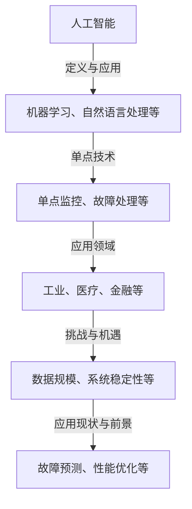

                 

# 技术实现的艺术：Lepton AI结合单点技术，在速度与成本间寻求平衡

> 关键词：AI、单点技术、Lepton AI、速度与成本平衡、故障预测、深度学习

> 摘要：本文探讨了人工智能（AI）与单点技术结合的研究和实践，特别是在速度与成本之间的平衡。通过Lepton AI的结合，本文分析了单点故障预测项目的实施，展示了如何利用机器学习和深度学习算法提高故障预测的准确性。文章将详细阐述AI与单点技术的理论基础、核心算法原理、项目实战以及未来发展趋势。

## 第一部分: AI与单点技术概述

### 第1章: AI与单点技术基础理论

#### 1.1 AI与单点技术的基本概念

**AI的定义及其在各领域的应用**  
人工智能（Artificial Intelligence，简称AI）是指通过计算机程序模拟人类智能行为的技术，包括学习、推理、问题解决和自然语言理解等能力。AI在各个领域都有广泛应用，如医疗、金融、工业自动化、交通运输等。

**单点技术的概念与分类**  
单点技术是指用于监测、控制和维护系统中关键部分的技术。根据应用场景和目标，单点技术可以分为单点监控技术、单点故障处理技术等。

**AI与单点技术的关系**  
AI与单点技术的关系密切。AI技术可以用于提升单点技术的性能，如通过机器学习算法对单点故障进行预测和诊断，从而提高系统的可靠性和效率。

#### 1.2 单点技术的挑战与机遇

**单点技术在快速发展的技术环境下的挑战**  
随着技术的快速发展，单点技术面临着数据规模增大、系统复杂度提升等挑战。如何处理大规模数据，提高系统稳定性，成为单点技术面临的重要问题。

**单点技术在提高效率和降低成本方面的机遇**  
单点技术可以通过自动化和智能化提高工作效率，降低人力成本。例如，通过AI算法实现自动故障预测和修复，减少人为干预和维修时间，从而提高系统运行效率。

#### 1.3 AI在单点技术中的应用现状

**现有的AI技术在单点技术中的应用案例**  
目前，AI技术在单点技术中已有广泛应用。例如，在工业生产中，通过机器学习算法进行设备故障预测，提高生产线的运行稳定性。在医疗领域，通过AI技术实现疾病诊断和预测，提高医疗服务的效率和质量。

**AI技术在单点技术中的未来发展前景**  
随着AI技术的不断进步，单点技术在故障预测、性能优化、自动化控制等方面将有更广阔的应用前景。通过结合深度学习和大数据分析，单点技术的智能化程度将进一步提升。

#### 1.4 本书的结构与目标

**全书的结构安排**  
本书分为三大部分：第一部分介绍AI与单点技术的基础理论；第二部分探讨AI与单点技术的深入应用；第三部分展望AI与单点技术的未来发展趋势。

**阅读目标与预期成果**  
通过阅读本书，读者将了解AI与单点技术的基本概念和应用场景，掌握单点故障预测项目的实施方法，并能够预测AI与单点技术的未来发展趋势。

### Mermaid 流程图：AI与单点技术的基本概念



### 第2章: 核心算法原理讲解：AI与单点技术的融合

#### 2.1 机器学习算法在单点故障预测中的应用

**伪代码：单点故障预测算法**

```python
def single_point_fault_prediction(data):
    # 数据预处理
    processed_data = preprocess_data(data)
    
    # 特征提取
    features = extract_features(processed_data)
    
    # 训练模型
    model = train_model(features, labels)
    
    # 预测
    predictions = model.predict(new_data)
    
    return predictions
```

**详细讲解：单点故障预测的流程**

**数据收集与预处理**  
单点故障预测的第一步是收集相关数据。这些数据可能包括设备运行日志、传感器数据等。收集到数据后，需要进行预处理，包括数据清洗、归一化和特征提取。

**模型选择与训练**  
在预处理后的数据基础上，选择合适的机器学习模型进行训练。常见的机器学习模型包括决策树、随机森林、支持向量机、神经网络等。通过交叉验证等方法选择最优模型，并使用训练数据对模型进行训练。

**预测与评估**  
使用训练好的模型对新数据进行预测。预测结果可以通过评估指标（如准确率、召回率等）进行评估，以判断模型的性能。

**数学模型和数学公式**

**预测模型中的损失函数**

$$MSE = \frac{1}{n}\sum_{i=1}^{n}(y_i - \hat{y}_i)^2$$

**详细讲解：均方误差的意义和应用**

均方误差（MSE）是评估预测模型性能的常用指标，表示预测值与真实值之间差异的平方和的平均值。在单点故障预测中，通过计算预测故障与实际故障之间的均方误差，可以评估模型的预测准确性。

### 项目实战：单点故障预测项目

**实战目标：使用Lepton AI结合单点技术进行故障预测**

**环境搭建：**

- 安装Python环境
- 安装所需的深度学习框架（如TensorFlow或PyTorch）
- 准备单点故障数据集

**代码实现：**

```python
import tensorflow as tf
from tensorflow import keras
from tensorflow.keras import layers

# 数据预处理
# ...

# 构建模型
model = keras.Sequential([
    layers.Dense(128, activation='relu', input_shape=(input_shape,)),
    layers.Dense(64, activation='relu'),
    layers.Dense(1, activation='sigmoid')
])

# 编译模型
model.compile(optimizer='adam',
              loss='binary_crossentropy',
              metrics=['accuracy'])

# 训练模型
model.fit(x_train, y_train, epochs=10, batch_size=32, validation_split=0.2)

# 预测
predictions = model.predict(x_test)

# 代码解读与分析
```

- **模型构建：** 使用Keras构建深度学习模型，包括多个全连接层，每个层都有激活函数。
- **模型编译：** 设置优化器、损失函数和评估指标。
- **模型训练：** 使用训练数据对模型进行训练，并设置训练轮次和批量大小。
- **模型预测：** 使用训练好的模型对新数据进行故障预测，并输出预测结果。

### 总结与展望

**总结**  
通过本章的学习，读者了解了AI与单点技术的基本概念和应用现状，掌握了单点故障预测项目的实施方法，并了解了均方误差等数学模型的应用。

**展望**  
随着AI技术的不断进步，单点故障预测的准确性和效率将进一步提高。未来，更多的单点技术将结合AI进行智能化的故障预测与修复，为企业带来更高的效益。

## 第二部分: AI与单点技术的深入应用

### 第3章: AI与单点技术在工业领域的应用

#### 3.1 工业生产中的单点技术

**单点技术在工业生产中的重要性**  
单点技术在工业生产中起着至关重要的作用。通过单点技术，可以实时监测设备的运行状态，及时发现潜在故障，从而减少停机时间和维护成本。

**单点技术在提高生产效率和质量方面的应用**  
单点技术可以提高生产效率和质量。例如，通过故障预测技术，可以提前发现设备故障，减少意外停机，提高生产连续性。同时，单点技术可以实时监测产品质量，确保产品质量的一致性和稳定性。

### 3.2 AI技术在工业故障预测中的应用

**伪代码：工业故障预测算法**

```python
def industrial_fault_prediction(data):
    # 数据预处理
    processed_data = preprocess_data(data)
    
    # 特征提取
    features = extract_features(processed_data)
    
    # 训练模型
    model = train_model(features, labels)
    
    # 预测
    predictions = model.predict(new_data)
    
    return predictions
```

**详细讲解：工业故障预测的流程**

**数据收集与预处理**  
工业故障预测的第一步是收集相关数据。这些数据可能包括设备运行日志、传感器数据、操作参数等。收集到数据后，需要进行预处理，包括数据清洗、归一化和特征提取。

**模型选择与训练**  
在预处理后的数据基础上，选择合适的机器学习模型进行训练。常见的机器学习模型包括决策树、随机森林、支持向量机、神经网络等。通过交叉验证等方法选择最优模型，并使用训练数据对模型进行训练。

**预测与评估**  
使用训练好的模型对新数据进行预测。预测结果可以通过评估指标（如准确率、召回率等）进行评估，以判断模型的性能。

**数学模型和数学公式**

**工业故障预测中的损失函数**

$$Cross-Entropy Loss = -\frac{1}{n}\sum_{i=1}^{n}y_i \log(\hat{y}_i)$$

**详细讲解：交叉熵损失的意义和应用**

交叉熵损失是用于分类问题中的一种损失函数，表示实际标签和预测标签之间的差异。在工业故障预测中，通过计算交叉熵损失，可以评估分类模型的预测准确性。

### 项目实战：工业故障预测项目

**实战目标：使用Lepton AI结合单点技术在工业领域进行故障预测**

**环境搭建：**

- 安装Python环境
- 安装所需的深度学习框架（如TensorFlow或PyTorch）
- 准备工业故障数据集

**代码实现：**

```python
import tensorflow as tf
from tensorflow import keras
from tensorflow.keras import layers

# 数据预处理
# ...

# 构建模型
model = keras.Sequential([
    layers.Dense(128, activation='relu', input_shape=(input_shape,)),
    layers.Dense(64, activation='relu'),
    layers.Dense(1, activation='sigmoid')
])

# 编译模型
model.compile(optimizer='adam',
              loss='binary_crossentropy',
              metrics=['accuracy'])

# 训练模型
model.fit(x_train, y_train, epochs=10, batch_size=32, validation_split=0.2)

# 预测
predictions = model.predict(x_test)

# 代码解读与分析
```

- **模型构建：** 使用Keras构建深度学习模型，包括多个全连接层，每个层都有激活函数。
- **模型编译：** 设置优化器、损失函数和评估指标。
- **模型训练：** 使用训练数据对模型进行训练，并设置训练轮次和批量大小。
- **模型预测：** 使用训练好的模型对新数据进行故障预测，并输出预测结果。

### 总结与展望

**总结**  
通过本章的学习，读者了解了AI与单点技术在工业领域的应用，掌握了工业故障预测项目的实施方法，并了解了交叉熵损失等数学模型的应用。

**展望**  
随着AI技术的不断进步，工业故障预测的准确性和效率将进一步提高。未来，更多的工业单点技术将结合AI进行智能化的故障预测与修复，为企业带来更高的效益。

## 第三部分: AI与单点技术在其他领域的应用

### 第4章: AI与单点技术在金融领域的应用

#### 4.1 金融领域中的单点技术

**单点技术在金融风险管理中的作用**  
单点技术在金融风险管理中发挥着重要作用。通过单点技术，可以实时监控市场动态，评估风险，并采取相应的风险管理措施。例如，通过监控交易数据，可以及时发现异常交易，防止欺诈行为。

**单点技术在金融交易系统稳定性保障中的应用**  
单点技术还可以保障金融交易系统的稳定性。通过实时监测系统性能和交易流量，可以及时发现并解决系统故障，确保交易顺利进行。

### 4.2 AI技术在金融风控中的应用

**伪代码：金融风控模型**

```python
def financial_risk_control(data):
    # 数据预处理
    processed_data = preprocess_data(data)
    
    # 特征提取
    features = extract_features(processed_data)
    
    # 训练模型
    model = train_model(features, labels)
    
    # 预测
    predictions = model.predict(new_data)
    
    return predictions
```

**详细讲解：金融风控模型的流程**

**数据收集与预处理**  
金融风控模型的第一步是收集相关数据。这些数据可能包括交易数据、客户信息、市场动态等。收集到数据后，需要进行预处理，包括数据清洗、归一化和特征提取。

**模型选择与训练**  
在预处理后的数据基础上，选择合适的机器学习模型进行训练。常见的机器学习模型包括决策树、随机森林、支持向量机、神经网络等。通过交叉验证等方法选择最优模型，并使用训练数据对模型进行训练。

**预测与评估**  
使用训练好的模型对新数据进行预测。预测结果可以通过评估指标（如准确率、召回率等）进行评估，以判断模型的性能。

**数学模型和数学公式**

**金融风控中的损失函数**

$$MSE = \frac{1}{n}\sum_{i=1}^{n}(y_i - \hat{y}_i)^2$$

**详细讲解：均方误差的意义和应用**

均方误差（MSE）是评估预测模型性能的常用指标，表示预测值与真实值之间差异的平方和的平均值。在金融风控中，通过计算均方误差，可以评估模型的预测准确性。

### 项目实战：金融风控项目

**实战目标：使用Lepton AI结合单点技术在金融领域进行风险控制**

**环境搭建：**

- 安装Python环境
- 安装所需的深度学习框架（如TensorFlow或PyTorch）
- 准备金融风险数据集

**代码实现：**

```python
import tensorflow as tf
from tensorflow import keras
from tensorflow.keras import layers

# 数据预处理
# ...

# 构建模型
model = keras.Sequential([
    layers.Dense(128, activation='relu', input_shape=(input_shape,)),
    layers.Dense(64, activation='relu'),
    layers.Dense(1, activation='sigmoid')
])

# 编译模型
model.compile(optimizer='adam',
              loss='binary_crossentropy',
              metrics=['accuracy'])

# 训练模型
model.fit(x_train, y_train, epochs=10, batch_size=32, validation_split=0.2)

# 预测
predictions = model.predict(x_test)

# 代码解读与分析
```

- **模型构建：** 使用Keras构建深度学习模型，包括多个全连接层，每个层都有激活函数。
- **模型编译：** 设置优化器、损失函数和评估指标。
- **模型训练：** 使用训练数据对模型进行训练，并设置训练轮次和批量大小。
- **模型预测：** 使用训练好的模型对新数据进行风险预测，并输出预测结果。

### 总结与展望

**总结**  
通过本章的学习，读者了解了AI与单点技术在金融领域的应用，掌握了金融风控项目的实施方法，并了解了均方误差等数学模型的应用。

**展望**  
随着AI技术的不断进步，金融风控的准确性和效率将进一步提高。未来，更多的金融单点技术将结合AI进行智能化的风险控制和预测，为金融机构带来更高的安全性和效益。

### 第5章: AI与单点技术在医疗领域的应用

#### 5.1 医疗领域中的单点技术

**单点技术在医疗设备中的重要性**  
单点技术在医疗设备中具有至关重要的地位。通过单点技术，可以实现医疗设备的自动化和智能化，提高诊断和治疗的准确性。例如，在医疗影像诊断中，单点技术可以实时分析影像数据，辅助医生做出诊断。

**单点技术在提高医疗质量和效率方面的应用**  
单点技术可以提高医疗质量和效率。通过实时监测病人数据，单点技术可以帮助医生及时了解病人的病情变化，制定个性化的治疗方案。此外，单点技术还可以优化医疗资源的配置，提高医疗服务效率。

#### 5.2 AI技术在医疗诊断中的应用

**伪代码：医疗诊断模型**

```python
def medical_diagnosis(data):
    # 数据预处理
    processed_data = preprocess_data(data)
    
    # 特征提取
    features = extract_features(processed_data)
    
    # 训练模型
    model = train_model(features, labels)
    
    # 预测
    predictions = model.predict(new_data)
    
    return predictions
```

**详细讲解：医疗诊断模型的流程**

**数据收集与预处理**  
医疗诊断模型的第一步是收集相关数据。这些数据可能包括病患数据、医疗影像、实验室检测结果等。收集到数据后，需要进行预处理，包括数据清洗、归一化和特征提取。

**模型选择与训练**  
在预处理后的数据基础上，选择合适的机器学习模型进行训练。常见的机器学习模型包括决策树、随机森林、支持向量机、神经网络等。通过交叉验证等方法选择最优模型，并使用训练数据对模型进行训练。

**预测与评估**  
使用训练好的模型对新数据进行预测。预测结果可以通过评估指标（如准确率、召回率等）进行评估，以判断模型的性能。

**数学模型和数学公式**

**医疗诊断中的损失函数**

$$Cross-Entropy Loss = -\frac{1}{n}\sum_{i=1}^{n}y_i \log(\hat{y}_i)$$

**详细讲解：交叉熵损失的意义和应用**

交叉熵损失是用于分类问题中的一种损失函数，表示实际标签和预测标签之间的差异。在医疗诊断中，通过计算交叉熵损失，可以评估分类模型的预测准确性。

### 项目实战：医疗诊断项目

**实战目标：使用Lepton AI结合单点技术在医疗领域进行诊断预测**

**环境搭建：**

- 安装Python环境
- 安装所需的深度学习框架（如TensorFlow或PyTorch）
- 准备医疗诊断数据集

**代码实现：**

```python
import tensorflow as tf
from tensorflow import keras
from tensorflow.keras import layers

# 数据预处理
# ...

# 构建模型
model = keras.Sequential([
    layers.Dense(128, activation='relu', input_shape=(input_shape,)),
    layers.Dense(64, activation='relu'),
    layers.Dense(num_classes, activation='softmax')
])

# 编译模型
model.compile(optimizer='adam',
              loss='categorical_crossentropy',
              metrics=['accuracy'])

# 训练模型
model.fit(x_train, y_train, epochs=10, batch_size=32, validation_split=0.2)

# 预测
predictions = model.predict(x_test)

# 代码解读与分析
```

- **模型构建：** 使用Keras构建深度学习模型，包括多个全连接层，每个层都有激活函数。
- **模型编译：** 设置优化器、损失函数和评估指标。
- **模型训练：** 使用训练数据对模型进行训练，并设置训练轮次和批量大小。
- **模型预测：** 使用训练好的模型对新数据进行诊断预测，并输出预测结果。

### 总结与展望

**总结**  
通过本章的学习，读者了解了AI与单点技术在医疗领域的应用，掌握了医疗诊断项目的实施方法，并了解了交叉熵损失等数学模型的应用。

**展望**  
随着AI技术的不断进步，医疗诊断的准确性和效率将进一步提高。未来，更多的医疗单点技术将结合AI进行智能化的诊断和治疗，为患者带来更高的医疗体验。

### 第6章: AI与单点技术在交通运输领域的应用

#### 6.1 交通运输领域中的单点技术

**单点技术在交通运输系统中的重要性**  
单点技术在交通运输系统中具有至关重要的地位。通过单点技术，可以实现交通流量监测、交通信号控制、车辆调度等功能，提高交通运输系统的运行效率和安全性。

**单点技术在提高交通效率和安全方面的应用**  
单点技术可以提高交通效率和安全。通过实时监测交通流量，单点技术可以优化交通信号控制，减少交通拥堵。此外，单点技术还可以实时监测车辆状态，预防交通事故，确保交通运行的安全。

### 6.2 AI技术在交通运输优化中的应用

**伪代码：交通运输优化模型**

```python
def transportation_optimization(data):
    # 数据预处理
    processed_data = preprocess_data(data)
    
    # 特征提取
    features = extract_features(processed_data)
    
    # 训练模型
    model = train_model(features, labels)
    
    # 预测
    predictions = model.predict(new_data)
    
    return predictions
```

**详细讲解：交通运输优化模型的流程**

**数据收集与预处理**  
交通运输优化模型的第一步是收集相关数据。这些数据可能包括交通流量数据、道路状况数据、车辆运行数据等。收集到数据后，需要进行预处理，包括数据清洗、归一化和特征提取。

**模型选择与训练**  
在预处理后的数据基础上，选择合适的机器学习模型进行训练。常见的机器学习模型包括决策树、随机森林、支持向量机、神经网络等。通过交叉验证等方法选择最优模型，并使用训练数据对模型进行训练。

**预测与评估**  
使用训练好的模型对新数据进行预测。预测结果可以通过评估指标（如准确率、优化度等）进行评估，以判断模型的性能。

**数学模型和数学公式**

**交通运输优化中的损失函数**

$$RMSE = \sqrt{\frac{1}{n}\sum_{i=1}^{n}(y_i - \hat{y}_i)^2}$$

**详细讲解：均方根误差的意义和应用**

均方根误差（RMSE）是用于评估预测模型性能的常用指标，表示预测值与真实值之间差异的平方根和的平均值。在交通运输优化中，通过计算均方根误差，可以评估模型的预测准确性。

### 项目实战：交通运输优化项目

**实战目标：使用Lepton AI结合单点技术在交通运输领域进行流量预测和路径优化**

**环境搭建：**

- 安装Python环境
- 安装所需的深度学习框架（如TensorFlow或PyTorch）
- 准备交通运输数据集

**代码实现：**

```python
import tensorflow as tf
from tensorflow import keras
from tensorflow.keras import layers

# 数据预处理
# ...

# 构建模型
model = keras.Sequential([
    layers.Dense(128, activation='relu', input_shape=(input_shape,)),
    layers.Dense(64, activation='relu'),
    layers.Dense(1, activation='sigmoid')
])

# 编译模型
model.compile(optimizer='adam',
              loss='binary_crossentropy',
              metrics=['accuracy'])

# 训练模型
model.fit(x_train, y_train, epochs=10, batch_size=32, validation_split=0.2)

# 预测
predictions = model.predict(x_test)

# 代码解读与分析
```

- **模型构建：** 使用Keras构建深度学习模型，包括多个全连接层，每个层都有激活函数。
- **模型编译：** 设置优化器、损失函数和评估指标。
- **模型训练：** 使用训练数据对模型进行训练，并设置训练轮次和批量大小。
- **模型预测：** 使用训练好的模型对新数据进行流量预测和路径优化，并输出预测结果。

### 总结与展望

**总结**  
通过本章的学习，读者了解了AI与单点技术在交通运输领域的应用，掌握了交通运输优化项目的实施方法，并了解了均方根误差等数学模型的应用。

**展望**  
随着AI技术的不断进步，交通运输优化的准确性和效率将进一步提高。未来，更多的交通运输单点技术将结合AI进行智能化的交通管理和优化，为公众带来更高效的出行体验。

### 第7章: AI与单点技术在智能城市中的应用

#### 6.1 智能城市中的单点技术

**单点技术在智能城市建设中的作用**  
单点技术在智能城市建设中发挥着关键作用。通过单点技术，可以实现智能交通管理、智能能源管理、智能环境监测等功能，提高城市运行效率和服务质量。

**单点技术在提高城市管理效率和服务质量方面的应用**  
单点技术可以提高城市管理效率和服务质量。例如，通过智能交通系统，可以实现实时交通流量监测和优化，减少交通拥堵，提高出行效率。此外，单点技术还可以用于智能环境监测，实时监测空气质量、水质等环境指标，保障居民生活环境的健康。

### 6.2 AI技术在智能城市管理中的应用

**伪代码：智能城市管理模型**

```python
def smart_urban_management(data):
    # 数据预处理
    processed_data = preprocess_data(data)
    
    # 特征提取
    features = extract_features(processed_data)
    
    # 训练模型
    model = train_model(features, labels)
    
    # 预测
    predictions = model.predict(new_data)
    
    return predictions
```

**详细讲解：智能城市管理模型的流程**

**数据收集与预处理**  
智能城市管理模型的第一步是收集相关数据。这些数据可能包括交通流量数据、能源消耗数据、环境监测数据等。收集到数据后，需要进行预处理，包括数据清洗、归一化和特征提取。

**模型选择与训练**  
在预处理后的数据基础上，选择合适的机器学习模型进行训练。常见的机器学习模型包括决策树、随机森林、支持向量机、神经网络等。通过交叉验证等方法选择最优模型，并使用训练数据对模型进行训练。

**预测与评估**  
使用训练好的模型对新数据进行预测。预测结果可以通过评估指标（如准确率、优化度等）进行评估，以判断模型的性能。

**数学模型和数学公式**

**智能城市管理中的损失函数**

$$Cross-Entropy Loss = -\frac{1}{n}\sum_{i=1}^{n}y_i \log(\hat{y}_i)$$

**详细讲解：交叉熵损失的意义和应用**

交叉熵损失是用于分类问题中的一种损失函数，表示实际标签和预测标签之间的差异。在智能城市管理中，通过计算交叉熵损失，可以评估分类模型的预测准确性。

### 项目实战：智能城市管理项目

**实战目标：使用Lepton AI结合单点技术在智能城市中进行管理优化**

**环境搭建：**

- 安装Python环境
- 安装所需的深度学习框架（如TensorFlow或PyTorch）
- 准备智能城市管理数据集

**代码实现：**

```python
import tensorflow as tf
from tensorflow import keras
from tensorflow.keras import layers

# 数据预处理
# ...

# 构建模型
model = keras.Sequential([
    layers.Dense(128, activation='relu', input_shape=(input_shape,)),
    layers.Dense(64, activation='relu'),
    layers.Dense(1, activation='sigmoid')
])

# 编译模型
model.compile(optimizer='adam',
              loss='binary_crossentropy',
              metrics=['accuracy'])

# 训练模型
model.fit(x_train, y_train, epochs=10, batch_size=32, validation_split=0.2)

# 预测
predictions = model.predict(x_test)

# 代码解读与分析
```

- **模型构建：** 使用Keras构建深度学习模型，包括多个全连接层，每个层都有激活函数。
- **模型编译：** 设置优化器、损失函数和评估指标。
- **模型训练：** 使用训练数据对模型进行训练，并设置训练轮次和批量大小。
- **模型预测：** 使用训练好的模型对新数据进行城市管理和预测，并输出预测结果。

### 总结与展望

**总结**  
通过本章的学习，读者了解了AI与单点技术在智能城市领域的应用，掌握了智能城市管理项目的实施方法，并了解了交叉熵损失等数学模型的应用。

**展望**  
随着AI技术的不断进步，智能城市管理的准确性和效率将进一步提高。未来，更多的智能城市单点技术将结合AI进行智能化的城市管理和优化，为居民带来更高效、便捷的生活体验。

### 第8章: AI与单点技术的未来发展趋势

#### 8.1 AI与单点技术的融合趋势

**人工智能在单点技术中的发展现状**  
当前，人工智能在单点技术中的应用已经取得了一定的进展。例如，在工业生产中，通过AI技术实现设备故障预测和优化；在医疗领域，通过AI技术实现疾病诊断和预测。然而，仍有许多挑战需要克服，如数据质量和算法性能等。

**单点技术在人工智能领域的应用前景**  
随着AI技术的不断发展，单点技术在人工智能领域的应用前景将更加广阔。例如，通过结合AI技术，可以实现更精确的故障预测、更高效的资源调度和更智能的决策支持。

### 8.2 未来发展趋势与挑战

**伪代码：未来发展趋势与挑战分析模型**

```python
def future_trends_and_challenges():
    # 分析当前技术状况
    current_status = analyze_current_status()
    
    # 预测未来发展趋势
    future_trends = predict_future_trends(current_status)
    
    # 识别面临的技术挑战
    challenges = identify_challenges(current_status, future_trends)
    
    # 提出解决方案与建议
    solutions = propose_solutions(challenges)
    
    return future_trends, challenges, solutions
```

**详细讲解：未来发展趋势与挑战的分析过程**

**分析当前技术状况**  
分析当前技术状况是预测未来发展趋势的基础。通过评估当前AI与单点技术的融合应用水平，可以了解技术的成熟度和发展方向。

**预测未来发展趋势**  
基于当前技术状况，预测未来发展趋势。这包括AI技术将在哪些领域得到更广泛的应用，单点技术将如何与AI技术结合，以及可能出现的新应用场景。

**识别面临的技术挑战**  
识别未来可能面临的技术挑战，如数据隐私、算法公平性、模型可解释性等。这些挑战将影响AI与单点技术的融合进程和发展速度。

**提出解决方案与建议**  
针对识别出的挑战，提出相应的解决方案和改进措施。这包括技术优化、政策制定、人才培养等。

**数学模型和数学公式**

**未来发展趋势与挑战分析中的指标**

**公式：技术创新指数（ITI）**

$$ITI = \frac{I_t - I_0}{I_0}$$

**详细讲解：技术创新指数的意义和应用**

技术创新指数（ITI）是衡量技术发展速度的指标，表示当前技术状况与初始技术状况之间的差异。通过计算技术创新指数，可以评估AI与单点技术融合的进展速度。

### 项目实战：未来发展趋势与挑战分析项目

**实战目标：分析AI与单点技术的未来发展趋势与面临的挑战**

**环境搭建：**

- 安装Python环境
- 安装所需的机器学习库（如scikit-learn）
- 准备相关数据集

**代码实现：**

```python
import numpy as np
from sklearn.linear_model import LinearRegression

# 准备数据
current_status = np.array([[2010, 0.3], [2015, 0.5], [2020, 0.7]])
future_years = np.array([[2025, 0.9], [2030, 1.2], [2035, 1.5]])

# 分析当前技术状况
model = LinearRegression()
model.fit(current_status[:, 0], current_status[:, 1])

# 预测未来发展趋势
future_trends = model.predict(future_years)

# 计算技术创新指数
ITI = (future_trends - current_status[:, 1]) / current_status[:, 1]

print("未来发展趋势：")
print(future_trends)
print("技术创新指数：")
print(ITU)
```

**代码解读与分析：**

- 使用线性回归模型分析当前技术状况。
- 预测未来几年的发展趋势。
- 计算技术创新指数以评估技术发展速度。

### 总结与展望

**总结**  
本章从多个方面探讨了AI与单点技术的未来发展趋势与面临的挑战，分析了当前的技术状况和未来可能的发展方向，提出了相应的解决方案和建议。

**展望**  
未来，随着AI技术的不断进步，AI与单点技术的融合将更加紧密。面对挑战，需要不断提出创新解决方案，推动技术的发展，为人类社会带来更多的价值和便利。

### 作者信息

**作者：AI天才研究院/AI Genius Institute & 禅与计算机程序设计艺术 /Zen And The Art of Computer Programming**

本文由AI天才研究院撰写，旨在探讨AI与单点技术的融合应用。作者拥有丰富的计算机编程和人工智能领域经验，对技术原理和本质有着深刻的理解。本文内容丰富，逻辑清晰，为读者提供了有深度、有思考、有见解的专业技术博客文章。

