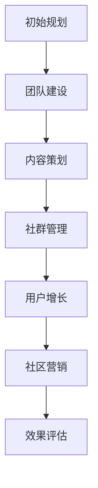

                 

# 文章标题：技术社区运营：影响力的来源

## 关键词：
技术社区、运营策略、影响力、用户增长、社群管理

> 摘要：本文旨在探讨技术社区运营中的影响力来源，分析其在技术领域的重要性和实际操作方法。通过对技术社区的基本概念、运营策略、用户增长策略、社区营销策略以及运营实践等方面的深入探讨，旨在为技术社区管理者提供有价值的参考和指导。

## 目录大纲

## 第一部分：技术社区概述

### 第1章：技术社区的基本概念

- 1.1 技术社区的兴起与定义
- 1.2 技术社区的类型与特点
- 1.3 技术社区的核心价值
- 1.4 技术社区对技术发展的影响

### 第2章：技术社区运营的基础

- 2.1 技术社区运营的概述
- 2.2 技术社区的用户画像分析
- 2.3 技术社区的目标与规划
- 2.4 技术社区的品牌建设

## 第二部分：技术社区运营策略

### 第3章：内容运营策略

- 3.1 内容策划与规划
- 3.2 高质量内容创作与审核
- 3.3 精准内容推荐与分发
- 3.4 互动交流与用户参与

### 第4章：社群运营策略

- 4.1 社群建设与分类
- 4.2 社群管理方法
- 4.3 社群活跃度提升
- 4.4 社群事件策划与执行

### 第5章：用户增长策略

- 5.1 用户引入与留存
- 5.2 用户激活与转化
- 5.3 用户社群分层管理
- 5.4 用户增长案例分析

### 第6章：社区营销策略

- 6.1 社区营销概述
- 6.2 社区营销目标与规划
- 6.3 社区营销工具与方法
- 6.4 社区营销效果评估与优化

### 第7章：技术社区运营案例分析

- 7.1 案例介绍与背景分析
- 7.2 案例运营策略分析
- 7.3 案例运营成果评估
- 7.4 案例经验与启示

## 第三部分：技术社区运营实践

### 第8章：技术社区运营团队建设

- 8.1 团队组织结构
- 8.2 团队成员角色与职责
- 8.3 团队协作与沟通机制
- 8.4 团队培训与激励机制

### 第9章：技术社区运营工具与应用

- 9.1 常用社区运营工具介绍
- 9.2 工具在社区运营中的应用
- 9.3 工具优化与升级策略
- 9.4 工具使用案例分析

### 第10章：技术社区运营风险管理

- 10.1 社区运营风险识别
- 10.2 社区运营风险管理策略
- 10.3 社区危机管理
- 10.4 社区风险管理案例解析

## 附录

### 附录 A：技术社区运营相关资源

- 1. 技术社区运营指南
- 2. 社区运营工具资源库
- 3. 技术社区运营研究论文与报告
- 4. 技术社区运营经典书籍推荐

# 技术社区运营：影响力的来源

## 第一部分：技术社区概述

### 第1章：技术社区的基本概念

#### 1.1 技术社区的兴起与定义

技术社区作为一种特殊类型的网络社群，起源于20世纪90年代互联网的兴起。随着互联网技术的普及，人们开始利用网络平台交流和分享技术知识和经验，从而形成了以技术为主题的在线社群。技术社区的定义可以概括为：以特定技术或领域为主题，以用户自发交流、分享和互助为核心的网络社群。

技术社区的兴起主要得益于以下几个方面：

1. **互联网的普及**：互联网的快速发展为技术社区提供了基础平台，使得全球范围内的技术爱好者可以方便地进行交流和互动。
2. **知识共享的需求**：随着技术的不断进步，人们对于新技术、新理念的需求日益增长，技术社区成为满足这一需求的重要途径。
3. **用户生成内容**：用户生成内容（User Generated Content, UGC）的兴起，使得技术社区可以依赖于用户的参与来构建和丰富内容。

#### 1.2 技术社区的类型与特点

技术社区根据不同的分类标准可以划分为多种类型，例如：

1. **按技术领域分类**：可分为编程技术社区、网络安全社区、人工智能社区等。
2. **按形式分类**：可分为论坛型、博客型、问答型、社交媒体型等。

技术社区的特点包括：

1. **专业性**：技术社区以专业性和技术性为核心，用户和内容都具备较高的技术水准。
2. **互动性**：技术社区通过用户之间的互动，促进知识的传播和技术的创新。
3. **用户生成内容**：技术社区的内容主要依赖于用户的生成和贡献，社区活力和内容的丰富度与用户的参与度密切相关。

#### 1.3 技术社区的核心价值

技术社区的核心价值主要体现在以下几个方面：

1. **知识传播**：技术社区为技术知识的传播提供了一个高效的平台，用户可以在其中获取最新的技术动态和解决方案。
2. **技术创新**：技术社区通过用户之间的交流和协作，激发了技术创新的潜力，推动了技术的进步。
3. **人才培养**：技术社区为技术人才的培养提供了一个实践和交流的平台，有助于提升从业者的技术能力和职业素养。
4. **商业机会**：技术社区往往吸引了大量的技术企业和投资者，为技术创新提供了商业机会。

#### 1.4 技术社区对技术发展的影响

技术社区对技术发展的影响是多方面的：

1. **技术知识的积累**：技术社区为技术知识的积累提供了良好的环境，通过用户生成的内容，技术社区成为知识宝库。
2. **技术趋势的引领**：技术社区能够敏锐地捕捉技术趋势，引领技术的发展方向。
3. **技术创新的推动**：技术社区通过用户之间的协作，推动了技术创新的进程，加速了技术的应用和普及。
4. **人才培养与激励**：技术社区为技术人才提供了成长和展示才华的舞台，激发了技术创新的热情。

### 第2章：技术社区运营的基础

#### 2.1 技术社区运营的概述

技术社区运营是指通过一系列策略和手段，对技术社区进行管理和优化，以提升社区的用户活跃度、内容质量和商业价值。技术社区运营的目标包括：

1. **提升用户活跃度**：通过有效的运营策略，增加用户的参与度和活跃度，使社区保持活力。
2. **优化内容质量**：通过内容策划和审核，提升社区内容的整体质量，确保内容的准确性和专业性。
3. **增强用户粘性**：通过用户关系管理，提升用户对社区的忠诚度和依赖性，增加用户的留存率。
4. **实现商业价值**：通过社区运营，吸引商业合作伙伴和投资，实现社区的商业模式和商业价值。

#### 2.2 技术社区的用户画像分析

用户画像是指通过对社区用户的行为特征、兴趣偏好、价值取向等方面的数据分析，构建出一个立体的用户形象。技术社区的用户画像分析对于社区运营具有重要意义，具体包括以下几个方面：

1. **用户行为特征**：分析用户在社区中的行为习惯，如发布内容、评论、提问、参与讨论等，了解用户活跃的时间和模式。
2. **兴趣偏好**：通过用户生成的内容和互动行为，分析用户的兴趣点和偏好领域，为内容策划和推荐提供依据。
3. **价值取向**：了解用户对于技术社区的价值认知和需求，如对技术知识的渴求、对职业发展的关注等，为运营策略的制定提供参考。

#### 2.3 技术社区的目标与规划

技术社区的目标是明确的，即通过运营提升社区的用户体验和价值，具体包括：

1. **用户价值**：为用户提供高质量的技术内容、丰富的互动体验和专业的支持服务。
2. **社区价值**：构建一个具有专业性和影响力的技术交流平台，为行业的创新发展贡献力量。
3. **商业价值**：通过有效的商业模式，实现社区的可持续发展，为企业和投资者创造价值。

技术社区的规划应包括以下几个方面：

1. **内容规划**：明确社区的主题和方向，策划和发布有价值的内容，确保内容的持续更新和丰富。
2. **用户增长规划**：制定用户增长策略，通过多种渠道引入新用户，提升用户的活跃度和留存率。
3. **商业规划**：探索适合社区的商业模式，如广告、会员制、咨询服务等，实现社区的盈利。
4. **运营规划**：建立完善的运营团队和流程，确保社区运营的持续性和高效性。

#### 2.4 技术社区的品牌建设

技术社区的品牌建设是提升社区影响力和用户忠诚度的重要手段。品牌建设包括以下几个方面：

1. **品牌定位**：明确社区的品牌定位和核心价值，确保品牌形象与社区的定位和目标相符。
2. **品牌传播**：通过多种渠道进行品牌传播，如社交媒体、行业活动、合作伙伴等，提升品牌知名度。
3. **品牌体验**：优化用户在社区中的体验，包括界面设计、内容质量、服务态度等，提升用户的品牌忠诚度。
4. **品牌管理**：建立品牌管理机制，包括品牌形象维护、品牌危机管理等，确保品牌的持续性和稳定性。

## 第二部分：技术社区运营策略

### 第3章：内容运营策略

#### 3.1 内容策划与规划

内容策划与规划是技术社区运营的核心之一，直接影响到社区的内容质量和用户活跃度。内容策划与规划应包括以下几个方面：

1. **主题设定**：根据社区的目标和用户需求，设定社区的主题，确保内容的集中和专业化。
2. **内容类型**：规划不同类型的内容，如原创文章、技术教程、行业动态、专家访谈等，以满足用户的多样化需求。
3. **发布频率**：制定合理的发布频率，确保内容的持续更新，同时避免过度发布造成用户疲劳。
4. **内容审核**：建立内容审核机制，确保发布的内容符合社区标准和质量要求。

#### 3.2 高质量内容创作与审核

高质量内容是技术社区的核心竞争力，是吸引和留住用户的关键。高质量内容创作与审核包括以下几个方面：

1. **内容创作**：鼓励社区用户和专家创作高质量的内容，提供创作指导和资源支持。
2. **内容审核**：建立内容审核流程，确保发布的内容符合社区标准和质量要求，如准确性、完整性、专业性等。
3. **激励机制**：建立激励机制，如积分奖励、认证标识等，鼓励用户创作高质量的内容。

#### 3.3 精准内容推荐与分发

精准内容推荐与分发是提升用户参与度和内容曝光率的重要手段。精准内容推荐与分发包括以下几个方面：

1. **用户画像**：基于用户画像，分析用户的兴趣和行为习惯，为用户提供个性化的内容推荐。
2. **推荐算法**：采用推荐算法，如协同过滤、基于内容的推荐等，提升内容推荐的精准度。
3. **内容分发**：通过社区内部和外部的渠道，如社交媒体、邮件推送等，广泛分发优质内容，提高内容的曝光率。

#### 3.4 互动交流与用户参与

互动交流与用户参与是技术社区的核心特点之一，是社区活力和用户粘性的关键。互动交流与用户参与包括以下几个方面：

1. **评论互动**：鼓励用户对内容进行评论，提供高质量、建设性的反馈，促进内容的深度讨论。
2. **问答互动**：建立问答板块，鼓励用户提问和解答，提供专业的技术支持和服务。
3. **社区活动**：组织线上和线下的社区活动，如技术沙龙、讲座、研讨会等，提升用户的参与度和归属感。
4. **用户贡献**：鼓励用户贡献内容，如技术博客、案例分析等，丰富社区内容，提升用户活跃度。

### 第4章：社群运营策略

#### 4.1 社群建设与分类

社群建设是技术社区运营的重要组成部分，通过构建多样化的社群，可以提升用户的参与度和社区的活跃度。社群建设与分类包括以下几个方面：

1. **社群目标**：明确每个社群的目标和定位，确保社群的运营方向一致。
2. **社群分类**：根据用户的兴趣、需求和职业背景，分类构建不同类型的社群，如技术专家社群、新手入门社群、行业交流社群等。
3. **社群组织**：建立完善的社群组织结构，明确社群的管理规则和职责分工。

#### 4.2 社群管理方法

社群管理方法是确保社群正常运作和用户满意度的重要保障。社群管理方法包括以下几个方面：

1. **管理制度**：制定社群管理制度，明确社群的管理规则和行为准则，确保社群秩序的稳定。
2. **管理团队**：建立专业的社群管理团队，负责社群的日常运营和管理，包括内容审核、活动组织、用户管理等。
3. **用户互动**：通过线上和线下的互动活动，促进社群成员之间的交流和互动，提升社群的活跃度。

#### 4.3 社群活跃度提升

社群活跃度是衡量社群运营效果的重要指标，提升社群活跃度可以从以下几个方面入手：

1. **内容激励**：通过优质的内容激励用户参与，如优秀内容奖励、积分兑换等。
2. **活动策划**：定期策划和举办线上和线下的社群活动，提升用户的参与度和活跃度。
3. **激励机制**：建立激励机制，如荣誉勋章、贡献排行榜等，激发用户的参与热情。
4. **用户互动**：鼓励社群成员之间的互动，如点赞、评论、分享等，提升社群的活跃度。

#### 4.4 社群事件策划与执行

社群事件策划与执行是提升社群影响力和用户粘性的有效手段。社群事件策划与执行包括以下几个方面：

1. **事件策划**：根据社群的目标和用户需求，策划具有吸引力和影响力的社群事件，如技术挑战赛、行业峰会等。
2. **事件宣传**：通过多种渠道进行事件宣传，如社交媒体、邮件推送等，提高事件的曝光率和参与度。
3. **事件执行**：确保事件的顺利进行，包括活动组织、嘉宾邀请、现场管理等方面。
4. **事件评估**：对事件的效果进行评估，收集用户反馈，为后续的社群运营提供改进方向。

### 第5章：用户增长策略

#### 5.1 用户引入与留存

用户引入与留存是技术社区运营的重要环节，直接关系到社区的用户规模和活跃度。用户引入与留存策略包括以下几个方面：

1. **用户引入**：通过线上和线下渠道，如搜索引擎优化（SEO）、社交媒体推广、行业活动等，吸引潜在用户加入社区。
2. **用户留存**：通过提供优质的内容、丰富的互动体验和专业的服务，提升用户的留存率，包括内容更新、互动活动、用户关怀等。

#### 5.2 用户激活与转化

用户激活与转化是提升用户价值的重要手段。用户激活与转化策略包括以下几个方面：

1. **用户激活**：通过活动参与、内容创作等方式，激发用户的活跃度，使其成为社区的积极参与者。
2. **用户转化**：通过营销策略和活动引导，将潜在用户转化为社区的用户，包括会员制、付费服务、项目合作等。

#### 5.3 用户社群分层管理

用户社群分层管理是提升社区用户价值和服务质量的有效手段。用户社群分层管理包括以下几个方面：

1. **用户分层**：根据用户的活跃度、贡献度、价值等指标，将用户划分为不同的层级，如普通用户、活跃用户、核心用户等。
2. **分层服务**：为不同层级的用户提供差异化的服务，如专属内容、专属活动、个性化推荐等，提升用户的满意度和忠诚度。
3. **激励机制**：建立激励机制，如积分奖励、荣誉勋章等，激励用户在社区中的活跃度和贡献度。

#### 5.4 用户增长案例分析

用户增长案例分析是了解和借鉴成功经验的重要途径。以下是一个用户增长案例的分析：

**案例背景**：某知名技术社区在短短一年内，用户数量从几千人增长到几十万人，成为行业内的标杆。

**成功因素**：

1. **内容优势**：社区提供高质量的技术内容，吸引了大量技术爱好者和专业人士。
2. **用户互动**：社区注重用户互动，通过评论、问答、活动等方式，提升了用户的活跃度和参与度。
3. **推广渠道**：社区通过多种渠道进行推广，如搜索引擎优化、社交媒体推广、行业活动等，提高了社区的曝光率和知名度。
4. **用户关怀**：社区注重用户关怀，通过用户调研、用户访谈等方式，了解用户需求，提升用户满意度。

**经验总结**：

1. **内容为王**：提供优质的内容是吸引和留住用户的关键。
2. **互动优先**：用户互动是提升社区活跃度和用户粘性的重要手段。
3. **推广有方**：选择合适的推广渠道和策略，提高社区的曝光率和知名度。
4. **用户至上**：关注用户需求，提供个性化的服务，提升用户满意度和忠诚度。

### 第6章：社区营销策略

#### 6.1 社区营销概述

社区营销是指利用技术社区平台进行市场营销的活动，旨在通过社区的影响力吸引潜在用户、提高品牌知名度、提升用户转化率。社区营销的概述包括以下几个方面：

1. **营销目标**：社区营销的目标包括品牌曝光、用户增长、用户转化等，具体目标应根据社区的特点和市场需求进行设定。
2. **营销策略**：社区营销策略包括内容营销、社群营销、活动营销等，通过多样化的营销手段实现营销目标。
3. **营销工具**：社区营销工具包括社交媒体、博客、论坛、直播等，选择合适的工具可以提高营销效果。

#### 6.2 社区营销目标与规划

社区营销目标与规划是确保社区营销活动有效开展的重要步骤。社区营销目标与规划包括以下几个方面：

1. **目标设定**：根据社区的特点和市场需求，设定具体的营销目标，如品牌曝光目标、用户增长目标、用户转化目标等。
2. **目标分解**：将总体目标分解为具体的可操作指标，如每月新增用户数、用户活跃度等，确保目标的可执行性。
3. **规划实施**：制定详细的营销计划，包括营销活动的主题、时间、内容、渠道等，确保营销活动的有序开展。

#### 6.3 社区营销工具与方法

社区营销工具与方法是实现社区营销目标的重要手段。社区营销工具与方法包括以下几个方面：

1. **内容营销**：通过发布高质量的内容，如技术博客、教程、行业动态等，吸引潜在用户，提升品牌影响力。
2. **社群营销**：通过构建和运营多样化的社群，如技术专家社群、行业交流社群等，提升用户的参与度和粘性。
3. **活动营销**：通过举办线上和线下的活动，如技术沙龙、讲座、比赛等，提升社区的活跃度和用户参与度。
4. **广告推广**：通过在社区内外进行广告投放，如搜索引擎广告、社交媒体广告等，提高品牌的曝光率和知名度。

#### 6.4 社区营销效果评估与优化

社区营销效果评估与优化是确保社区营销活动持续改进和优化的重要环节。社区营销效果评估与优化包括以下几个方面：

1. **效果评估**：通过数据分析和用户反馈，评估社区营销活动的效果，如用户参与度、品牌知名度、用户转化率等。
2. **效果分析**：分析评估结果，找出成功的因素和不足之处，为后续的营销活动提供改进方向。
3. **效果优化**：根据评估结果，优化营销策略和手段，如调整内容策划、改进活动形式、优化广告投放等，提高营销效果。

### 第7章：技术社区运营案例分析

#### 7.1 案例介绍与背景分析

本章节将以某知名技术社区为例，介绍其运营策略、成果和经验。该技术社区成立于2010年，以编程技术为主题，吸引了大量开发者和技术爱好者。通过多年的运营，该社区已发展成为行业内的标杆，拥有数十万的注册用户和丰富的内容资源。

#### 7.2 案例运营策略分析

该技术社区在运营过程中，采取了以下策略：

1. **内容策略**：社区以高质量的内容为核心，鼓励用户和专家撰写技术博客、分享经验，提供丰富的技术资源。
2. **用户策略**：社区注重用户互动和参与，通过评论、问答、活动等方式，提升用户的活跃度和粘性。
3. **社群策略**：社区构建了多个技术社群，如前端技术社群、后端技术社群等，满足不同用户的需求。
4. **营销策略**：社区通过社交媒体、行业活动等渠道进行推广，提高品牌的曝光率和知名度。

#### 7.3 案例运营成果评估

通过多年的运营，该技术社区取得了显著的成果：

1. **用户规模**：社区注册用户从成立初期的几千人增长到如今的数十万人，成为行业内的知名品牌。
2. **内容质量**：社区累计发布数十万篇技术博客，涵盖了众多技术领域，为用户提供丰富的技术资源。
3. **用户活跃度**：社区用户活跃度持续提升，日均活跃用户达到数千人，互动频繁。
4. **商业价值**：社区通过广告、会员制、咨询服务等模式实现了商业变现，取得了良好的经济效益。

#### 7.4 案例经验与启示

从该技术社区的运营实践中，我们可以得到以下经验和启示：

1. **内容为王**：高质量的内容是技术社区的核心竞争力，应重视内容策划和审核，提升内容的准确性和专业性。
2. **用户互动**：用户互动是提升社区活跃度和用户粘性的关键，应鼓励用户参与，提供多样化的互动方式。
3. **社群建设**：构建多样化的社群，满足不同用户的需求，提升用户的参与度和归属感。
4. **营销推广**：选择合适的营销渠道和策略，提高社区的曝光率和知名度，吸引更多用户加入。

## 第三部分：技术社区运营实践

### 第8章：技术社区运营团队建设

#### 8.1 团队组织结构

技术社区运营团队的建设是确保社区正常运作和持续发展的重要保障。一个合理的团队组织结构应包括以下几个方面：

1. **内容团队**：负责社区内容的策划、创作、审核和发布，包括技术博客、教程、行业动态等。
2. **用户团队**：负责社区用户的管理和服务，包括用户互动、用户反馈、用户关怀等。
3. **运营团队**：负责社区的整体运营和推广，包括活动策划、广告投放、用户增长等。
4. **技术团队**：负责社区的技术支持和维护，包括网站开发、服务器运维、数据分析等。

#### 8.2 团队成员角色与职责

团队成员的角色与职责明确，有助于提升团队的协作效率和效果。以下是团队成员的典型角色与职责：

1. **内容策划经理**：负责社区内容战略规划，制定内容发布计划，指导内容团队工作。
2. **内容创作者**：负责撰写高质量的技术文章、教程和博客，提供专业的内容支持。
3. **内容审核员**：负责对发布的内容进行审核，确保内容的准确性和专业性。
4. **用户管理员**：负责用户互动管理，包括回复用户提问、处理用户反馈等。
5. **活动策划专员**：负责社区活动的策划和执行，提升社区的活跃度和用户参与度。
6. **运营分析师**：负责社区数据分析和运营效果评估，提供数据支持和改进建议。
7. **技术支持工程师**：负责社区技术问题的解决，确保社区平台的稳定运行。

#### 8.3 团队协作与沟通机制

团队协作与沟通机制是确保团队高效运作和协同配合的关键。以下是团队协作与沟通机制的几个要点：

1. **定期会议**：定期召开团队会议，分享工作进展、讨论问题、制定下一步计划。
2. **分工合作**：明确团队成员的职责和任务，确保每个人都清楚自己的工作内容和目标。
3. **沟通渠道**：建立多种沟通渠道，如电子邮件、即时通讯工具、项目管理软件等，确保信息的及时传递和共享。
4. **任务跟进**：对各项任务进行跟进和监督，确保任务的按时完成和效果达成。
5. **反馈机制**：建立反馈机制，鼓励团队成员提出建议和意见，促进团队改进和创新。

#### 8.4 团队培训与激励机制

团队培训与激励机制是提升团队整体素质和工作动力的重要手段。以下是团队培训与激励机制的几个要点：

1. **培训计划**：制定详细的培训计划，包括专业技能培训、管理能力培训等，确保团队成员持续学习和成长。
2. **培训方式**：采用多种培训方式，如在线课程、内部讲座、外部培训等，满足不同成员的学习需求。
3. **激励机制**：建立激励机制，如绩效奖金、荣誉称号、晋升机会等，激发团队成员的工作积极性和创造力。
4. **绩效评估**：定期对团队成员的工作进行评估，识别优秀员工，给予相应的奖励和认可。
5. **文化建设**：营造积极向上的团队文化，增强团队凝聚力和归属感，提升团队的整体工作效率。

### 第9章：技术社区运营工具与应用

#### 9.1 常用社区运营工具介绍

技术社区运营过程中，需要使用各种工具来支持内容管理、用户互动、数据分析等各个环节。以下是几种常用的社区运营工具的介绍：

1. **内容管理系统（CMS）**：如WordPress、Joomla等，用于社区内容的发布、编辑和管理。
2. **论坛软件**：如Discourse、phpBB等，用于用户交流和互动。
3. **数据分析工具**：如Google Analytics、百度统计等，用于分析社区用户行为和运营效果。
4. **社交媒体工具**：如Twitter、Facebook、LinkedIn等，用于社区推广和用户互动。
5. **项目管理工具**：如Trello、Jira等，用于团队协作和任务管理。

#### 9.2 工具在社区运营中的应用

不同类型的工具在社区运营中具有不同的应用场景，以下是工具在社区运营中的具体应用：

1. **内容管理系统**：用于社区文章、博客、教程等的发布和管理，确保内容的持续更新和高质量输出。
2. **论坛软件**：用于用户提问、回答、评论等互动，促进社区用户之间的交流和知识共享。
3. **数据分析工具**：用于分析用户行为、访问数据等，为社区运营策略提供数据支持和决策依据。
4. **社交媒体工具**：用于社区推广、用户引导和互动，扩大社区的影响力和用户规模。
5. **项目管理工具**：用于团队协作、任务分配和进度管理，确保社区运营的有序和高效。

#### 9.3 工具优化与升级策略

随着社区运营的不断发展，工具的优化与升级是必要的。以下是工具优化与升级策略的几个要点：

1. **需求分析**：定期分析社区运营的需求，识别工具的不足和改进方向。
2. **功能迭代**：根据需求分析，对工具进行功能迭代和优化，提升工具的性能和用户体验。
3. **技术支持**：建立技术支持团队，负责工具的运维和维护，确保工具的稳定性和可靠性。
4. **用户反馈**：收集用户的反馈和建议，及时解决问题，提升工具的满意度和使用效果。
5. **持续改进**：建立持续改进机制，不断优化和升级工具，满足社区运营的不断发展需求。

#### 9.4 工具使用案例分析

以下是一个工具使用案例的分析：

**案例背景**：某知名技术社区在运营过程中，使用了多种社区运营工具，如WordPress、Discourse、Google Analytics等。

**应用效果**：

1. **内容发布与管理**：使用WordPress作为内容管理系统，方便发布和管理高质量的技术文章和博客，提升了内容的输出效率。
2. **用户互动与交流**：使用Discourse作为论坛软件，提供用户提问、回答、评论等互动功能，促进了社区用户之间的交流和知识共享。
3. **数据分析与优化**：使用Google Analytics进行数据分析，了解用户行为和访问数据，为社区运营策略提供数据支持和决策依据。

**经验总结**：

1. **工具选择**：选择适合社区特点和需求的工具，确保工具的功能性和易用性。
2. **功能优化**：根据社区运营需求，对工具进行功能优化和升级，提升工具的性能和用户体验。
3. **技术支持**：建立技术支持团队，负责工具的运维和维护，确保工具的稳定性和可靠性。

### 第10章：技术社区运营风险管理

#### 10.1 社区运营风险识别

技术社区运营过程中，存在多种风险，包括内容风险、用户风险、技术风险等。以下是社区运营风险的识别：

1. **内容风险**：包括内容抄袭、低质量内容、违规内容等，可能影响社区的声誉和用户满意度。
2. **用户风险**：包括用户欺诈、用户投诉、用户流失等，可能影响社区的稳定性和活跃度。
3. **技术风险**：包括系统故障、数据泄露、网络安全等，可能影响社区的正常运营和用户信任。

#### 10.2 社区运营风险管理策略

为了应对社区运营风险，应采取以下风险管理策略：

1. **内容风险控制**：建立内容审核机制，对发布的内容进行严格审核，确保内容的准确性和专业性。同时，鼓励用户举报违规内容，建立举报和投诉机制。
2. **用户风险控制**：加强用户身份认证，防止欺诈用户进入社区。建立用户行为监测系统，对异常行为进行预警和处理。同时，提供用户服务和支持，解决用户问题和投诉。
3. **技术风险控制**：建立安全防护机制，如防火墙、数据加密等，确保系统的安全性和稳定性。定期进行系统维护和升级，及时修复漏洞和问题。

#### 10.3 社区危机管理

社区运营过程中，可能会遇到各种危机事件，如负面舆论、数据泄露、安全事故等。以下是社区危机管理的几个要点：

1. **危机预警**：建立危机预警机制，对潜在危机进行识别和预测，及时采取措施。
2. **危机应对**：制定危机应对策略和预案，确保在危机发生时能够迅速应对，减少危机的影响。
3. **危机沟通**：与相关方保持沟通，如用户、合作伙伴、监管部门等，确保信息的及时传递和协调。
4. **危机恢复**：在危机发生后，进行危机恢复工作，包括危机调查、问题整改、用户安抚等，重建用户信任。

#### 10.4 社区风险管理案例解析

以下是一个社区风险管理案例的解析：

**案例背景**：某知名技术社区在一次系统升级过程中，发生了数据泄露事件，导致大量用户数据被泄露。

**应对措施**：

1. **危机预警**：在系统升级前，进行了风险评估和测试，发现了潜在的数据泄露风险。
2. **危机应对**：在数据泄露事件发生后，社区迅速采取了以下措施：

   - 停止系统升级，关闭受影响的系统模块。
   - 启动危机应对预案，通知用户和数据泄露情况。
   - 与网络安全专家合作，调查数据泄露原因和责任。
   - 与用户沟通，提供补偿措施和解决方案。

**经验总结**：

1. **风险评估**：在系统升级和变更前，进行充分的风险评估和测试，预防潜在风险。
2. **危机预案**：制定完善的危机应对预案，确保在危机发生时能够迅速应对。
3. **用户沟通**：与用户保持良好的沟通，及时传递信息和解决问题，重建用户信任。

## 附录

### 附录 A：技术社区运营相关资源

1. **技术社区运营指南**：提供全面的技术社区运营指导，包括内容策划、用户管理、活动策划等方面的建议和技巧。
2. **社区运营工具资源库**：收集和整理了多种社区运营工具，包括内容管理系统、论坛软件、数据分析工具等，为社区运营提供实用的工具支持。
3. **技术社区运营研究论文与报告**：汇总了国内外技术社区运营的相关研究成果和实践报告，为社区运营者提供理论指导和实践参考。
4. **技术社区运营经典书籍推荐**：推荐了多本关于技术社区运营的经典书籍，包括《社交网络运营》、《内容运营实战》等，为社区运营者提供专业知识和实践经验。

## 技术社区运营流程图与伪代码示例

### 技术社区运营流程图



### 用户增长伪代码示例

```python
def user_growth_strategy(user_list):
    for user in user_list:
        if user.isActive():
            engage_user(user)
        else:
            activate_user(user)
    measure_growth_rate()

def engage_user(user):
    # 实现用户互动
    pass

def activate_user(user):
    # 实现用户激活
    pass

user_growth_strategy([user1, user2, user3])
```

## 结束语

本文通过深入探讨技术社区运营中的影响力来源，分析了技术社区的基本概念、运营策略、用户增长策略、社区营销策略以及运营实践等方面，旨在为技术社区管理者提供有价值的参考和指导。在技术快速发展的今天，技术社区作为知识传播、技术创新和人才培养的重要平台，发挥着越来越重要的作用。通过有效的运营策略和实践，技术社区可以不断提升影响力，为技术领域的进步和产业发展贡献力量。希望本文能对广大技术社区运营者提供启示和帮助，共同推动技术社区的发展和繁荣。

