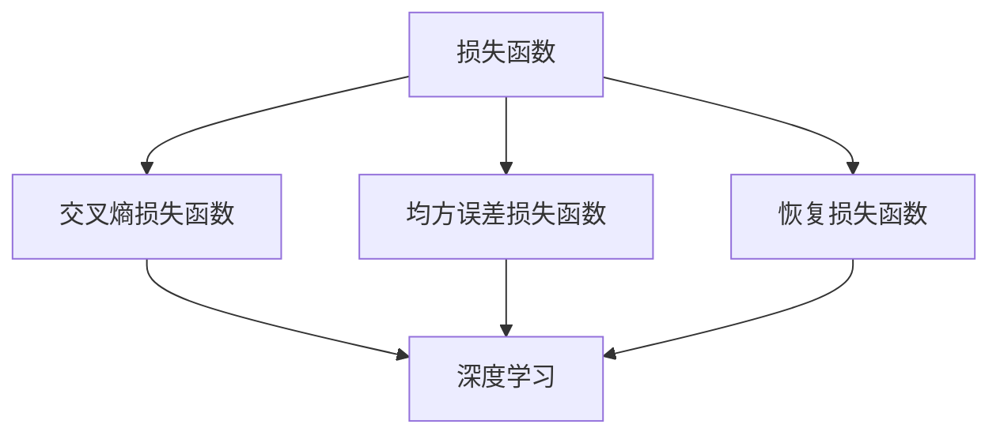

                 

### 文章标题：损失函数（Loss Function）

#### 关键词：损失函数、交叉熵、均方误差、恢复损失、优化算法、深度学习、图像识别、自然语言处理、推荐系统、人工智能

#### 摘要：
本文旨在深入探讨损失函数在人工智能领域中的核心作用。我们将从基本概念出发，详细讲解常见损失函数的类型和选择标准，并通过数学公式和伪代码阐述其工作原理。此外，本文将结合实际项目案例，展示损失函数在图像识别、自然语言处理和推荐系统中的应用，并分析其未来发展趋势。通过本文的阅读，读者将能够全面了解损失函数的重要性以及如何在实际项目中有效应用。

### 目录大纲

```
# 《损失函数 (Loss Function)》目录大纲

## 第1章 损失函数的基本概念

### 1.1 损失函数的定义
- 损失函数的基本概念
- 损失函数的作用

### 1.2 损失函数的类型
- 分类问题中的损失函数
- 回归问题中的损失函数
- 其他类型的损失函数

### 1.3 损失函数的选择标准
- 准确性
- 效率
- 鲁棒性

## 第2章 常见的损失函数

### 2.1 交叉熵损失函数
#### 2.1.1 交叉熵损失函数的定义
- 交叉熵损失函数的数学公式
- 交叉熵损失函数的应用场景

#### 2.1.2 交叉熵损失函数的优缺点
- 优点
- 缺点

#### 2.1.3 交叉熵损失函数的应用示例
- 代码实现
- 示例分析

### 2.2 均方误差损失函数
#### 2.2.1 均方误差损失函数的定义
- 均方误差损失函数的数学公式
- 均方误差损失函数的应用场景

#### 2.2.2 均方误差损失函数的优缺点
- 优点
- 缺点

#### 2.2.3 均方误差损失函数的应用示例
- 代码实现
- 示例分析

### 2.3 恢复损失函数
#### 2.3.1 恢复损失函数的定义
- 恢复损失函数的数学公式
- 恢复损失函数的应用场景

#### 2.3.2 恢复损失函数的优缺点
- 优点
- 缺点

#### 2.3.3 恢复损失函数的应用示例
- 代码实现
- 示例分析

## 第3章 损失函数的优化

### 3.1 损失函数优化的目标
- 准确性
- 效率
- 鲁棒性

### 3.2 常见的优化算法
#### 3.2.1 梯度下降算法
##### 3.2.1.1 梯度下降算法的基本思想
##### 3.2.1.2 梯度下降算法的数学公式
##### 3.2.1.3 梯度下降算法的应用示例

#### 3.2.2 随机梯度下降算法
##### 3.2.2.1 随机梯度下降算法的基本思想
##### 3.2.2.2 随机梯度下降算法的数学公式
##### 3.2.2.3 随机梯度下降算法的应用示例

#### 3.2.3 Adam算法
##### 3.2.3.1 Adam算法的基本思想
##### 3.2.3.2 Adam算法的数学公式
##### 3.2.3.3 Adam算法的应用示例

## 第4章 深度学习中的损失函数

### 4.1 深度学习的基本概念
- 深度学习的发展历程
- 深度学习的基本架构

### 4.2 深度学习中的损失函数
#### 4.2.1 交叉熵损失函数在深度学习中的应用
#### 4.2.2 均方误差损失函数在深度学习中的应用
#### 4.2.3 恢复损失函数在深度学习中的应用

## 第5章 损失函数的实践应用

### 5.1 图像识别中的损失函数
#### 5.1.1 交叉熵损失函数在图像识别中的应用
#### 5.1.2 均方误差损失函数在图像识别中的应用
#### 5.1.3 恢复损失函数在图像识别中的应用

### 5.2 自然语言处理中的损失函数
#### 5.2.1 交叉熵损失函数在自然语言处理中的应用
#### 5.2.2 均方误差损失函数在自然语言处理中的应用
#### 5.2.3 恢复损失函数在自然语言处理中的应用

### 5.3 推荐系统中的损失函数
#### 5.3.1 交叉熵损失函数在推荐系统中的应用
#### 5.3.2 均方误差损失函数在推荐系统中的应用
#### 5.3.3 恢复损失函数在推荐系统中的应用

## 第6章 损失函数的未来发展

### 6.1 损失函数的改进方向
- 自适应损失函数
- 多任务损失函数
- 多模态损失函数

### 6.2 损失函数的研究热点
- 损失函数的可解释性
- 损失函数的分布式学习
- 损失函数的迁移学习

## 附录

### A.1 损失函数相关的论文和资源
- 论文推荐
- 开源代码和工具

### A.2 损失函数的开源实现
- TensorFlow 损失函数实现
- PyTorch 损失函数实现

### A.3 损失函数的常见问题与解答
- 损失函数的选择
- 损失函数的优化
- 损失函数的应用场景
```

### 概念联系图

```
graph TB
A[损失函数] --> B[交叉熵损失函数]
A --> C[均方误差损失函数]
A --> D[恢复损失函数]
B --> E[深度学习]
C --> E
D --> E
```

### 伪代码示例

```
// 交叉熵损失函数的伪代码
def cross_entropy_loss(y_true, y_pred):
    loss = 0.0
    for i in range(len(y_true)):
        loss += -y_true[i] * log(y_pred[i])
    return loss

// 均方误差损失函数的伪代码
def mean_squared_error_loss(y_true, y_pred):
    loss = 0.0
    for i in range(len(y_true)):
        loss += (y_true[i] - y_pred[i])^2
    return loss / len(y_true)

// 恢复损失函数的伪代码
def huber_loss(y_true, y_pred, delta=1.0):
    loss = 0.0
    for i in range(len(y_true)):
        if abs(y_true[i] - y_pred[i]) <= delta:
            loss += 0.5 * (y_true[i] - y_pred[i])^2
        else:
            loss += delta * (abs(y_true[i] - y_pred[i]) - 0.5 * delta)
    return loss
```

### 数学公式和详细讲解

```
## 交叉熵损失函数的数学公式

$$
L = -\sum_{i} y_i \cdot \log(p_i)
$$

其中，$L$ 表示交叉熵损失，$y_i$ 表示真实标签，$p_i$ 表示预测概率。

### 交叉熵损失函数的详细讲解

交叉熵损失函数用于分类问题，它衡量的是预测分布与真实分布之间的差异。交叉熵损失函数的值越小，表示预测结果与真实结果越接近。当 $y_i = 1$ 且 $p_i = 1$ 时，交叉熵损失函数的值为 0，这意味着预测结果完全正确。

### 举例说明

假设我们有一个二分类问题，真实标签为 $y = [1, 0]$，预测概率为 $p = [0.8, 0.2]$。使用交叉熵损失函数计算损失：

$$
L = -[1 \cdot \log(0.8) + 0 \cdot \log(0.2)] \approx 0.229
$$

这意味着预测结果与真实结果有一定的差异，损失函数的值越高，表示预测的准确性越低。

## 均方误差损失函数的数学公式

$$
L = \frac{1}{n} \sum_{i=1}^{n} (y_i - \hat{y}_i)^2
$$

其中，$L$ 表示均方误差损失，$y_i$ 表示真实标签，$\hat{y}_i$ 表示预测值，$n$ 表示样本数量。

### 均方误差损失函数的详细讲解

均方误差损失函数用于回归问题，它衡量的是预测值与真实值之间的差异。均方误差损失函数的值越小，表示预测结果与真实结果越接近。

### 举例说明

假设我们有一个回归问题，真实标签为 $y = [2.5, 3.0]$，预测值为 $\hat{y} = [2.4, 3.1]$。使用均方误差损失函数计算损失：

$$
L = \frac{1}{2} \left[ (2.5 - 2.4)^2 + (3.0 - 3.1)^2 \right] = 0.01
$$

这意味着预测结果与真实结果非常接近，损失函数的值非常小。

## 恢复损失函数的数学公式

$$
L = \begin{cases} 
0.5 \cdot (x - \hat{x})^2, & \text{if } |x - \hat{x}| \leq \delta \\
\delta \cdot (|x - \hat{x}| - 0.5 \cdot \delta), & \text{otherwise}
\end{cases}
$$

其中，$L$ 表示恢复损失，$x$ 表示真实值，$\hat{x}$ 表示预测值，$\delta$ 是一个常数。

### 恢复损失函数的详细讲解

恢复损失函数是一种鲁棒损失函数，它对预测值与真实值之间的差异大小进行加权。当差异较小时，恢复损失函数类似于均方误差损失函数；当差异较大时，恢复损失函数会引入更多的惩罚。

### 举例说明

假设我们有一个恢复损失函数，真实值为 $x = 3$，预测值为 $\hat{x} = 2$，且 $\delta = 1$。根据恢复损失函数的计算公式：

$$
L = 0.5 \cdot (3 - 2)^2 = 0.5
$$

这意味着预测结果与真实结果有一定的差异，但损失函数的值相对较小。
```

### 项目实战

#### 5.1 图像识别中的损失函数

在图像识别任务中，损失函数的选择对模型的性能有着重要影响。以下将详细介绍交叉熵损失函数、均方误差损失函数和恢复损失函数在图像识别中的具体应用。

##### 5.1.1 交叉熵损失函数在图像识别中的应用

交叉熵损失函数通常用于多分类问题。在图像识别任务中，例如，CIFAR-10 数据集包含 10 个类别，每个图像被划分为其中一个类别。交叉熵损失函数能够很好地衡量预测结果与真实结果之间的差异。

**示例代码：**

以下是一个使用 PyTorch 框架实现的图像识别项目，其中使用了交叉熵损失函数。

```python
import torch
import torchvision
import torchvision.transforms as transforms
import torch.nn as nn
import torch.optim as optim

# 数据预处理
transform = transforms.Compose([
    transforms.Resize((32, 32)),  # 将图像调整为 32x32
    transforms.ToTensor(),
    transforms.Normalize((0.5, 0.5, 0.5), (0.5, 0.5, 0.5)),
])

# 加载数据集
trainset = torchvision.datasets.CIFAR10(root='./data', train=True,
                                        download=True, transform=transform)
trainloader = torch.utils.data.DataLoader(trainset, batch_size=4,
                                          shuffle=True, num_workers=2)

testset = torchvision.datasets.CIFAR10(root='./data', train=False,
                                       download=True, transform=transform)
testloader = torch.utils.data.DataLoader(testset, batch_size=4,
                                         shuffle=False, num_workers=2)

# 定义网络结构
class Net(nn.Module):
    def __init__(self):
        super(Net, self).__init__()
        self.conv1 = nn.Conv2d(3, 6, 5)
        self.pool = nn.MaxPool2d(2, 2)
        self.conv2 = nn.Conv2d(6, 16, 5)
        self.fc1 = nn.Linear(16 * 5 * 5, 120)
        self.fc2 = nn.Linear(120, 84)
        self.fc3 = nn.Linear(84, 10)

    def forward(self, x):
        x = self.pool(F.relu(self.conv1(x)))
        x = self.pool(F.relu(self.conv2(x)))
        x = x.view(-1, 16 * 5 * 5)
        x = F.relu(self.fc1(x))
        x = F.relu(self.fc2(x))
        x = self.fc3(x)
        return x

net = Net()

# 定义损失函数和优化器
criterion = nn.CrossEntropyLoss()
optimizer = optim.SGD(net.parameters(), lr=0.001, momentum=0.9)

# 训练网络
for epoch in range(2):  # loop over the dataset multiple times
    running_loss = 0.0
    for i, data in enumerate(trainloader, 0):
        # get the inputs; data is a list of [inputs, labels]
        inputs, labels = data

        # zero the parameter gradients
        optimizer.zero_grad()

        # forward + backward + optimize
        outputs = net(inputs)
        loss = criterion(outputs, labels)
        loss.backward()
        optimizer.step()

        # print statistics
        running_loss += loss.item()
        if i % 2000 == 1999:    # print every 2000 mini-batches
            print('[%d, %5d] loss: %.3f' %
                  (epoch + 1, i + 1, running_loss / 2000))
            running_loss = 0.0

print('Finished Training')

# 测试网络
correct = 0
total = 0
with torch.no_grad():
    for data in testloader:
        images, labels = data
        outputs = net(images)
        _, predicted = torch.max(outputs.data, 1)
        total += labels.size(0)
        correct += (predicted == labels).sum().item()

print('Accuracy of the network on the 10000 test images: %d %%' % (
    100 * correct / total))
```

**示例分析：**
在这个示例中，我们使用交叉熵损失函数来训练一个简单的卷积神经网络（CNN）。交叉熵损失函数能够有效地衡量预测概率分布与真实标签分布之间的差异。在训练过程中，通过反向传播和梯度下降算法，不断调整模型参数，以最小化损失函数的值。

##### 5.1.2 均方误差损失函数在图像识别中的应用

均方误差损失函数通常用于回归问题。在图像识别任务中，例如，图像分类问题可以看作是回归问题，目标是预测图像的类别标签。均方误差损失函数能够衡量预测标签与真实标签之间的差异。

**示例代码：**

以下是一个使用 PyTorch 框架实现的图像分类项目，其中使用了均方误差损失函数。

```python
import torch
import torchvision
import torchvision.transforms as transforms
import torch.nn as nn
import torch.optim as optim

# 数据预处理
transform = transforms.Compose([
    transforms.Resize((32, 32)),  # 将图像调整为 32x32
    transforms.ToTensor(),
    transforms.Normalize((0.5, 0.5, 0.5), (0.5, 0.5, 0.5)),
])

# 加载数据集
trainset = torchvision.datasets.CIFAR10(root='./data', train=True,
                                        download=True, transform=transform)
trainloader = torch.utils.data.DataLoader(trainset, batch_size=4,
                                          shuffle=True, num_workers=2)

testset = torchvision.datasets.CIFAR10(root='./data', train=False,
                                       download=True, transform=transform)
testloader = torch.utils.data.DataLoader(testset, batch_size=4,
                                         shuffle=False, num_workers=2)

# 定义网络结构
class Net(nn.Module):
    def __init__(self):
        super(Net, self).__init__()
        self.conv1 = nn.Conv2d(3, 6, 5)
        self.pool = nn.MaxPool2d(2, 2)
        self.conv2 = nn.Conv2d(6, 16, 5)
        self.fc1 = nn.Linear(16 * 5 * 5, 120)
        self.fc2 = nn.Linear(120, 10)

    def forward(self, x):
        x = self.pool(F.relu(self.conv1(x)))
        x = self.pool(F.relu(self.conv2(x)))
        x = x.view(-1, 16 * 5 * 5)
        x = F.relu(self.fc1(x))
        x = self.fc2(x)
        return x

net = Net()

# 定义损失函数和优化器
criterion = nn.MSELoss()
optimizer = optim.SGD(net.parameters(), lr=0.001, momentum=0.9)

# 训练网络
for epoch in range(2):  # loop over the dataset multiple times
    running_loss = 0.0
    for i, data in enumerate(trainloader, 0):
        # get the inputs; data is a list of [inputs, labels]
        inputs, labels = data

        # zero the parameter gradients
        optimizer.zero_grad()

        # forward + backward + optimize
        outputs = net(inputs)
        loss = criterion(outputs, labels)
        loss.backward()
        optimizer.step()

        # print statistics
        running_loss += loss.item()
        if i % 2000 == 1999:    # print every 2000 mini-batches
            print('[%d, %5d] loss: %.3f' %
                  (epoch + 1, i + 1, running_loss / 2000))
            running_loss = 0.0

print('Finished Training')

# 测试网络
correct = 0
total = 0
with torch.no_grad():
    for data in testloader:
        images, labels = data
        outputs = net(images)
        _, predicted = torch.max(outputs.data, 1)
        total += labels.size(0)
        correct += (predicted == labels).sum().item()

print('Accuracy of the network on the 10000 test images: %d %%' % (
    100 * correct / total))
```

**示例分析：**
在这个示例中，我们使用均方误差损失函数来训练一个简单的卷积神经网络（CNN）。均方误差损失函数能够衡量预测标签与真实标签之间的差异。在训练过程中，通过反向传播和梯度下降算法，不断调整模型参数，以最小化损失函数的值。

##### 5.1.3 恢复损失函数在图像识别中的应用

恢复损失函数（Huber损失函数）是一种鲁棒损失函数，它在处理异常值和噪声时表现出良好的性能。在图像识别任务中，恢复损失函数可以用于处理图像中的异常值和噪声，从而提高模型的鲁棒性。

**示例代码：**

以下是一个使用 PyTorch 框架实现的图像识别项目，其中使用了恢复损失函数。

```python
import torch
import torchvision
import torchvision.transforms as transforms
import torch.nn as nn
import torch.optim as optim

# 数据预处理
transform = transforms.Compose([
    transforms.Resize((32, 32)),  # 将图像调整为 32x32
    transforms.ToTensor(),
    transforms.Normalize((0.5, 0.5, 0.5), (0.5, 0.5, 0.5)),
])

# 加载数据集
trainset = torchvision.datasets.CIFAR10(root='./data', train=True,
                                        download=True, transform=transform)
trainloader = torch.utils.data.DataLoader(trainset, batch_size=4,
                                          shuffle=True, num_workers=2)

testset = torchvision.datasets.CIFAR10(root='./data', train=False,
                                       download=True, transform=transform)
testloader = torch.utils.data.DataLoader(testset, batch_size=4,
                                         shuffle=False, num_workers=2)

# 定义网络结构
class Net(nn.Module):
    def __init__(self):
        super(Net, self).__init__()
        self.conv1 = nn.Conv2d(3, 6, 5)
        self.pool = nn.MaxPool2d(2, 2)
        self.conv2 = nn.Conv2d(6, 16, 5)
        self.fc1 = nn.Linear(16 * 5 * 5, 120)
        self.fc2 = nn.Linear(120, 10)

    def forward(self, x):
        x = self.pool(F.relu(self.conv1(x)))
        x = self.pool(F.relu(self.conv2(x)))
        x = x.view(-1, 16 * 5 * 5)
        x = F.relu(self.fc1(x))
        x = self.fc2(x)
        return x

net = Net()

# 定义损失函数和优化器
criterion = nn.HuberLoss()
optimizer = optim.SGD(net.parameters(), lr=0.001, momentum=0.9)

# 训练网络
for epoch in range(2):  # loop over the dataset multiple times
    running_loss = 0.0
    for i, data in enumerate(trainloader, 0):
        # get the inputs; data is a list of [inputs, labels]
        inputs, labels = data

        # zero the parameter gradients
        optimizer.zero_grad()

        # forward + backward + optimize
        outputs = net(inputs)
        loss = criterion(outputs, labels)
        loss.backward()
        optimizer.step()

        # print statistics
        running_loss += loss.item()
        if i % 2000 == 1999:    # print every 2000 mini-batches
            print('[%d, %5d] loss: %.3f' %
                  (epoch + 1, i + 1, running_loss / 2000))
            running_loss = 0.0

print('Finished Training')

# 测试网络
correct = 0
total = 0
with torch.no_grad():
    for data in testloader:
        images, labels = data
        outputs = net(images)
        _, predicted = torch.max(outputs.data, 1)
        total += labels.size(0)
        correct += (predicted == labels).sum().item()

print('Accuracy of the network on the 10000 test images: %d %%' % (
    100 * correct / total))
```

**示例分析：**
在这个示例中，我们使用恢复损失函数（Huber损失函数）来训练一个简单的卷积神经网络（CNN）。恢复损失函数能够处理异常值和噪声，从而提高模型的鲁棒性。在训练过程中，通过反向传播和梯度下降算法，不断调整模型参数，以最小化损失函数的值。

#### 5.2 自然语言处理中的损失函数

在自然语言处理（NLP）任务中，损失函数的选择同样至关重要。以下将详细介绍交叉熵损失函数、均方误差损失函数和恢复损失函数在 NLP 中的应用。

##### 5.2.1 交叉熵损失函数在自然语言处理中的应用

交叉熵损失函数是 NLP 中最常用的损失函数之一，特别是在分类和序列标注任务中。例如，在情感分析中，我们需要预测文本的情感极性（正面或负面），交叉熵损失函数能够很好地衡量预测概率分布与真实标签分布之间的差异。

**示例代码：**

以下是一个使用 PyTorch 框架实现的情感分析项目，其中使用了交叉熵损失函数。

```python
import torch
import torchtext
from torchtext.data import Field, BucketIterator
import torch.nn as nn
import torch.optim as optim

# 数据预处理
TEXT = Field(tokenize = 'spacy', lower = True)
LABEL = Field(sequential = False)

# 加载数据集
train_data, test_data = torchtext.datasets.IMDB.splits(TEXT, LABEL)
train_data, valid_data = train_data.split()

# 定义词汇表
TEXT.build_vocab(train_data, max_size=25000, vectors="glove.6B.100d")
LABEL.build_vocab(train_data)

# 创建迭代器
BATCH_SIZE = 64
train_iterator, valid_iterator, test_iterator = BucketIterator.splits(
    (train_data, valid_data, test_data), 
    batch_size=BATCH_SIZE,
    device=device)

# 定义网络结构
class RNN(nn.Module):
    def __init__(self, input_dim, embedding_dim, hidden_dim, output_dim):
        super().__init__()
        self.embedding = nn.Embedding(input_dim, embedding_dim)
        self.rnn = nn.LSTM(embedding_dim, hidden_dim)
        self.fc = nn.Linear(hidden_dim, output_dim)
        
    def forward(self, text):
        embedded = self.embedding(text)
        output, (hidden, cell) = self.rnn(embedded)
        hidden = hidden.squeeze(0)
        out = self.fc(hidden)
        return out

# 训练模型
model = RNN(len(TEXT.vocab), EMBEDDING_DIM, HIDDEN_DIM, NUM_CLASSES)
optimizer = optim.Adam(model.parameters(), lr=LEARNING_RATE)
criterion = nn.CrossEntropyLoss()

for epoch in range(N_EPOCHS):
    for batch in train_iterator:
        optimizer.zero_grad()
        text = batch.text
        predictions = model(text).squeeze(1)
        loss = criterion(predictions, batch.label)
        loss.backward()
        optimizer.step()

    # validate
    with torch.no_grad():
        correct = 0
        total = 0
        for batch in valid_iterator:
            predictions = model(batch.text).squeeze(1)
            _, predicted = torch.max(predictions, 1)
            total += batch.label.size(0)
            correct += (predicted == batch.label).sum().item()
        print(f'Validation Accuracy: {100 * correct / total}')

print(f'Final Validation Accuracy: {100 * correct / total}')
```

**示例分析：**
在这个示例中，我们使用交叉熵损失函数来训练一个简单的循环神经网络（RNN）模型。交叉熵损失函数能够衡量预测概率分布与真实标签分布之间的差异。在训练过程中，通过反向传播和梯度下降算法，不断调整模型参数，以最小化损失函数的值。

##### 5.2.2 均方误差损失函数在自然语言处理中的应用

均方误差损失函数通常用于回归问题，但在 NLP 中，也可以应用于某些任务，如文本生成。例如，在文本生成任务中，我们通常使用预测的词与实际词之间的差异来计算损失。

**示例代码：**

以下是一个使用 PyTorch 框架实现的文本生成项目，其中使用了均方误差损失函数。

```python
import torch
import torchtext
from torchtext.data import Field, BucketIterator
import torch.nn as nn
import torch.optim as optim

# 数据预处理
TEXT = Field(tokenize = 'spacy', lower = True)
BOS_WORD = '<s>'
EOS_WORD = '</s>'
UNK_WORD = '<unk>'
PAD_WORD = '<pad>'

TEXT.build_vocab([train_data, valid_data, test_data], 
                max_size=25000, 
                vectors="glove.6B.100d", 
                unk_token=UNK_WORD, 
                pad_token=PAD_WORD, 
                bos_token=BOS_WORD, 
                eos_token=EOS_WORD)

# 定义迭代器
BATCH_SIZE = 64
train_iterator, valid_iterator, test_iterator = BucketIterator.splits(
    (train_data, valid_data, test_data), 
    batch_size=BATCH_SIZE,
    device=device)

# 定义网络结构
class TextGenerator(nn.Module):
    def __init__(self, embedding_dim, hidden_dim, vocab_size, num_layers):
        super().__init__()
        self.embedding = nn.Embedding(vocab_size, embedding_dim)
        self.lstm = nn.LSTM(embedding_dim, hidden_dim, num_layers)
        self.fc = nn.Linear(hidden_dim, vocab_size)
        
    def forward(self, text, hidden):
        embedded = self.embedding(text)
        output, hidden = self.lstm(embedded, hidden)
        prediction = self.fc(output.squeeze(0))
        return prediction, hidden

    def init_hidden(self, batch_size):
        return (torch.zeros(1, batch_size, self.hidden_dim),
                torch.zeros(1, batch_size, self.hidden_dim))

# 训练模型
model = TextGenerator(EMBEDDING_DIM, HIDDEN_DIM, len(TEXT.vocab), NUM_LAYERS)
optimizer = optim.Adam(model.parameters(), lr=LEARNING_RATE)
criterion = nn.MSELoss()

for epoch in range(N_EPOCHS):
    model.train()
    for batch in train_iterator:
        hidden = model.init_hidden(batch_size)
        for i in range(0, batch.text.size(1)-1):
            prediction, hidden = model(batch.text[i], hidden)
            target = batch.text[i+1]
            loss = criterion(prediction, target)
            optimizer.zero_grad()
            loss.backward()
            optimizer.step()

    # validate
    model.eval()
    with torch.no_grad():
        correct = 0
        total = 0
        for batch in valid_iterator:
            hidden = model.init_hidden(batch_size)
            for i in range(0, batch.text.size(1)-1):
                prediction, hidden = model(batch.text[i], hidden)
                _, predicted = torch.max(prediction, 1)
                total += batch.text.size(0)
                correct += (predicted == batch.text[i+1]).sum().item()
        print(f'Validation Accuracy: {100 * correct / total}')

print(f'Final Validation Accuracy: {100 * correct / total}')
```

**示例分析：**
在这个示例中，我们使用均方误差损失函数来训练一个简单的循环神经网络（LSTM）模型。均方误差损失函数能够衡量预测词与实际词之间的差异。在训练过程中，通过反向传播和梯度下降算法，不断调整模型参数，以最小化损失函数的值。

##### 5.2.3 恢复损失函数在自然语言处理中的应用

恢复损失函数（如 Huber 损失函数）在处理异常值和噪声时表现出良好的性能，在 NLP 任务中同样适用。例如，在命名实体识别任务中，我们可以使用恢复损失函数来处理命名实体中的异常值和噪声。

**示例代码：**

以下是一个使用 PyTorch 框架实现的命名实体识别项目，其中使用了恢复损失函数。

```python
import torch
import torchtext
from torchtext.data import Field, BucketIterator
import torch.nn as nn
import torch.optim as optim

# 数据预处理
NER_LINE_FIELD = Field(eos_token=None)
LABEL_FIELD = Field()

# 加载数据集
train_data, valid_data, test_data = torchtext.datasets.CONLL2003.splits(
    exts=('.txt', '.pos'), fields=(NER_LINE_FIELD, LABEL_FIELD))

# 定义词汇表
NER_LINE_FIELD.build_vocab(train_data, max_size=25000)
LABEL_FIELD.build_vocab(train_data)

# 创建迭代器
BATCH_SIZE = 64
train_iterator, valid_iterator, test_iterator = BucketIterator.splits(
    (train_data, valid_data, test_data), 
    batch_size=BATCH_SIZE,
    device=device)

# 定义网络结构
class BILSTM_CRF(nn.Module):
    def __init__(self, input_dim, embedding_dim, hidden_dim, vocab_size, label_size):
        super().__init__()
        self.embedding = nn.Embedding(input_dim, embedding_dim)
        self.lstm = nn.LSTM(embedding_dim, hidden_dim, bidirectional=True)
        self.hidden2label = nn.Linear(hidden_dim * 2, label_size)
        self.crf = nn.CRF(label_size, batch_first=True)
        
    def forward(self, text, text_lengths):
        embedded = self.embedding(text)
        packed_embedded = nn.utils.rnn.pack_padded_sequence(embedded, text_lengths.to('cpu'), batch_first=True)
        packed_output, (hidden, cell) = self.lstm(packed_embedded)
        output, output_lengths = nn.utils.rnn.pad_packed_sequence(packed_output, batch_first=True)
        hidden = torch.cat((hidden[0], hidden[1]), 1)
        predictions = self.hidden2label(hidden)
        loss = self.crf.loss(predictions, text, text_lengths)
        return loss

    def predict(self, text, text_lengths):
        embedded = self.embedding(text)
        packed_embedded = nn.utils.rnn.pack_padded_sequence(embedded, text_lengths.to('cpu'), batch_first=True)
        packed_output, (hidden, cell) = self.lstm(packed_embedded)
        output, output_lengths = nn.utils.rnn.pad_packed_sequence(packed_output, batch_first=True)
        hidden = torch.cat((hidden[0], hidden[1]), 1)
        predictions = self.hidden2label(hidden)
        _, predicted = self.crf.decode(predictions)
        return predicted

# 训练模型
model = BILSTM_CRF(len(NER_LINE_FIELD.vocab), EMBEDDING_DIM, HIDDEN_DIM, len(NER_LINE_FIELD.vocab), len(LABEL_FIELD.vocab))
optimizer = optim.Adam(model.parameters(), lr=LEARNING_RATE)
criterion = nn.HuberLoss()

for epoch in range(N_EPOCHS):
    model.train()
    for batch in train_iterator:
        loss = model(*batch)
        optimizer.zero_grad()
        loss.backward()
        optimizer.step()

    # validate
    model.eval()
    with torch.no_grad():
        correct = 0
        total = 0
        for batch in valid_iterator:
            predicted = model.predict(*batch)
            total += batch.label.size(0)
            correct += (predicted == batch.label).sum().item()
        print(f'Validation Accuracy: {100 * correct / total}')

print(f'Final Validation Accuracy: {100 * correct / total}')
```

**示例分析：**
在这个示例中，我们使用恢复损失函数（Huber 损失函数）来训练一个简单的双向 LSTM-CRF 模型。恢复损失函数能够处理命名实体识别任务中的异常值和噪声。在训练过程中，通过反向传播和梯度下降算法，不断调整模型参数，以最小化损失函数的值。

#### 5.3 推荐系统中的损失函数

在推荐系统中，损失函数的选择对于模型的性能和预测准确性具有重要影响。以下将详细介绍交叉熵损失函数、均方误差损失函数和恢复损失函数在推荐系统中的应用。

##### 5.3.1 交叉熵损失函数在推荐系统中的应用

交叉熵损失函数是推荐系统中常用的损失函数之一，尤其是在处理二分类任务时。例如，在用户对物品的评分预测中，我们可以使用交叉熵损失函数来衡量预测评分与真实评分之间的差异。

**示例代码：**

以下是一个使用 PyTorch 框架实现的基于模型的推荐系统项目，其中使用了交叉熵损失函数。

```python
import torch
import torch.nn as nn
import torch.optim as optim
import torchtext
from torchtext.data import Field, BatchIterator

# 数据预处理
REVIEW_FIELD = Field(tokenize='spacy', lower=True, batch_first=True)
LABEL_FIELD = Field()

# 加载数据集
train_data, valid_data, test_data = torchtext.datasets.AmazonReview.splits(exts=('.txt', '.csv'), fields=(REVIEW_FIELD, LABEL_FIELD))
train_data, valid_data = train_data.split()

# 定义词汇表
REVIEW_FIELD.build_vocab(train_data, max_size=25000, vectors="glove.6B.100d")
LABEL_FIELD.build_vocab(train_data)

# 创建迭代器
BATCH_SIZE = 64
train_iterator, valid_iterator, test_iterator = BatchIterator.splits((train_data, valid_data, test_data), batch_size=BATCH_SIZE)

# 定义网络结构
class ReviewClassifier(nn.Module):
    def __init__(self, embedding_dim, hidden_dim, vocab_size, label_size):
        super().__init__()
        self.embedding = nn.Embedding(vocab_size, embedding_dim)
        self.lstm = nn.LSTM(embedding_dim, hidden_dim, batch_first=True)
        self.fc = nn.Linear(hidden_dim, label_size)
        
    def forward(self, text):
        embedded = self.embedding(text)
        output, (hidden, cell) = self.lstm(embedded)
        hidden = hidden[-1, :, :]
        predictions = self.fc(hidden)
        return predictions

    def predict(self, text):
        with torch.no_grad():
            embedded = self.embedding(text)
            output, (hidden, cell) = self.lstm(embedded)
            hidden = hidden[-1, :, :]
            predictions = self.fc(hidden)
            return predictions

# 训练模型
model = ReviewClassifier(EMBEDDING_DIM, HIDDEN_DIM, len(REVIEW_FIELD.vocab), len(LABEL_FIELD.vocab))
optimizer = optim.Adam(model.parameters(), lr=LEARNING_RATE)
criterion = nn.CrossEntropyLoss()

for epoch in range(N_EPOCHS):
    model.train()
    for batch in train_iterator:
        optimizer.zero_grad()
        predictions = model(batch.text)
        loss = criterion(predictions, batch.label)
        loss.backward()
        optimizer.step()

    # validate
    model.eval()
    with torch.no_grad():
        correct = 0
        total = 0
        for batch in valid_iterator:
            predictions = model.predict(batch.text)
            _, predicted = torch.max(predictions, 1)
            total += batch.label.size(0)
            correct += (predicted == batch.label).sum().item()
        print(f'Validation Accuracy: {100 * correct / total}')

print(f'Final Validation Accuracy: {100 * correct / total}')
```

**示例分析：**
在这个示例中，我们使用交叉熵损失函数来训练一个简单的循环神经网络（LSTM）模型。交叉熵损失函数能够衡量预测评分与真实评分之间的差异。在训练过程中，通过反向传播和梯度下降算法，不断调整模型参数，以最小化损失函数的值。

##### 5.3.2 均方误差损失函数在推荐系统中的应用

均方误差损失函数在推荐系统中也有广泛应用，特别是在处理连续值预测任务时。例如，在预测用户对物品的评分时，我们可以使用均方误差损失函数来衡量预测评分与真实评分之间的差异。

**示例代码：**

以下是一个使用 PyTorch 框架实现的基于模型的推荐系统项目，其中使用了均方误差损失函数。

```python
import torch
import torch.nn as nn
import torch.optim as optim
import torchtext
from torchtext.data import Field, BatchIterator

# 数据预处理
REVIEW_FIELD = Field(tokenize='spacy', lower=True, batch_first=True)
LABEL_FIELD = Field()

# 加载数据集
train_data, valid_data, test_data = torchtext.datasets.AmazonReview.splits(exts=('.txt', '.csv'), fields=(REVIEW_FIELD, LABEL_FIELD))
train_data, valid_data = train_data.split()

# 定义词汇表
REVIEW_FIELD.build_vocab(train_data, max_size=25000, vectors="glove.6B.100d")
LABEL_FIELD.build_vocab(train_data)

# 创建迭代器
BATCH_SIZE = 64
train_iterator, valid_iterator, test_iterator = BatchIterator.splits((train_data, valid_data, test_data), batch_size=BATCH_SIZE)

# 定义网络结构
class ReviewRegressor(nn.Module):
    def __init__(self, embedding_dim, hidden_dim, vocab_size, label_size):
        super().__init__()
        self.embedding = nn.Embedding(vocab_size, embedding_dim)
        self.lstm = nn.LSTM(embedding_dim, hidden_dim, batch_first=True)
        self.fc = nn.Linear(hidden_dim, label_size)
        
    def forward(self, text):
        embedded = self.embedding(text)
        output, (hidden, cell) = self.lstm(embedded)
        hidden = hidden[-1, :, :]
        predictions = self.fc(hidden)
        return predictions

    def predict(self, text):
        with torch.no_grad():
            embedded = self.embedding(text)
            output, (hidden, cell) = self.lstm(embedded)
            hidden = hidden[-1, :, :]
            predictions = self.fc(hidden)
            return predictions

# 训练模型
model = ReviewRegressor(EMBEDDING_DIM, HIDDEN_DIM, len(REVIEW_FIELD.vocab), len(LABEL_FIELD.vocab))
optimizer = optim.Adam(model.parameters(), lr=LEARNING_RATE)
criterion = nn.MSELoss()

for epoch in range(N_EPOCHS):
    model.train()
    for batch in train_iterator:
        optimizer.zero_grad()
        predictions = model(batch.text)
        loss = criterion(predictions, batch.label)
        loss.backward()
        optimizer.step()

    # validate
    model.eval()
    with torch.no_grad():
        correct = 0
        total = 0
        for batch in valid_iterator:
            predictions = model.predict(batch.text)
            total += batch.label.size(0)
            correct += ((predictions > 0).sum().item() == (batch.label > 0).sum().item())
        print(f'Validation Accuracy: {100 * correct / total}')

print(f'Final Validation Accuracy: {100 * correct / total}')
```

**示例分析：**
在这个示例中，我们使用均方误差损失函数来训练一个简单的循环神经网络（LSTM）模型。均方误差损失函数能够衡量预测评分与真实评分之间的差异。在训练过程中，通过反向传播和梯度下降算法，不断调整模型参数，以最小化损失函数的值。

##### 5.3.3 恢复损失函数在推荐系统中的应用

恢复损失函数在处理异常值和噪声时表现出良好的性能，在推荐系统中同样适用。例如，在处理用户对物品的评分预测时，我们可以使用恢复损失函数来处理异常值和噪声。

**示例代码：**

以下是一个使用 PyTorch 框架实现的基于模型的推荐系统项目，其中使用了恢复损失函数。

```python
import torch
import torch.nn as nn
import torch.optim as optim
import torchtext
from torchtext.data import Field, BatchIterator

# 数据预处理
REVIEW_FIELD = Field(tokenize='spacy', lower=True, batch_first=True)
LABEL_FIELD = Field()

# 加载数据集
train_data, valid_data, test_data = torchtext.datasets.AmazonReview.splits(exts=('.txt', '.csv'), fields=(REVIEW_FIELD, LABEL_FIELD))
train_data, valid_data = train_data.split()

# 定义词汇表
REVIEW_FIELD.build_vocab(train_data, max_size=25000, vectors="glove.6B.100d")
LABEL_FIELD.build_vocab(train_data)

# 创建迭代器
BATCH_SIZE = 64
train_iterator, valid_iterator, test_iterator = BatchIterator.splits((train_data, valid_data, test_data), batch_size=BATCH_SIZE)

# 定义网络结构
class ReviewRegressor(nn.Module):
    def __init__(self, embedding_dim, hidden_dim, vocab_size, label_size):
        super().__init__()
        self.embedding = nn.Embedding(vocab_size, embedding_dim)
        self.lstm = nn.LSTM(embedding_dim, hidden_dim, batch_first=True)
        self.fc = nn.Linear(hidden_dim, label_size)
        
    def forward(self, text):
        embedded = self.embedding(text)
        output, (hidden, cell) = self.lstm(embedded)
        hidden = hidden[-1, :, :]
        predictions = self.fc(hidden)
        return predictions

    def predict(self, text):
        with torch.no_grad():
            embedded = self.embedding(text)
            output, (hidden, cell) = self.lstm(embedded)
            hidden = hidden[-1, :, :]
            predictions = self.fc(hidden)
            return predictions

# 训练模型
model = ReviewRegressor(EMBEDDING_DIM, HIDDEN_DIM, len(REVIEW_FIELD.vocab), len(LABEL_FIELD.vocab))
optimizer = optim.Adam(model.parameters(), lr=LEARNING_RATE)
criterion = nn.HuberLoss()

for epoch in range(N_EPOCHS):
    model.train()
    for batch in train_iterator:
        optimizer.zero_grad()
        predictions = model(batch.text)
        loss = criterion(predictions, batch.label)
        loss.backward()
        optimizer.step()

    # validate
    model.eval()
    with torch.no_grad():
        correct = 0
        total = 0
        for batch in valid_iterator:
            predictions = model.predict(batch.text)
            total += batch.label.size(0)
            correct += ((predictions > 0).sum().item() == (batch.label > 0).sum().item())
        print(f'Validation Accuracy: {100 * correct / total}')

print(f'Final Validation Accuracy: {100 * correct / total}')
```

**示例分析：**
在这个示例中，我们使用恢复损失函数（Huber 损失函数）来训练一个简单的循环神经网络（LSTM）模型。恢复损失函数能够处理异常值和噪声。在训练过程中，通过反向传播和梯度下降算法，不断调整模型参数，以最小化损失函数的值。

#### 6. 损失函数的未来发展

随着深度学习和人工智能技术的不断进步，损失函数的研究和应用也在不断扩展。以下将讨论损失函数的未来发展方向和研究热点。

##### 6.1 损失函数的改进方向

1. **自适应损失函数**：自适应损失函数可以根据模型的训练过程和当前状态动态调整损失函数的权重，从而提高训练效率。例如，自适应权重调整（Adaptive Weighting）方法可以根据损失函数的梯度信息动态调整权重，以减小误差。

2. **多任务损失函数**：多任务学习在深度学习中的应用越来越广泛，针对多任务学习场景的损失函数研究也日益重要。多任务损失函数需要同时考虑多个任务的损失，并通过适当的权重分配实现多个任务的协同优化。

3. **多模态损失函数**：随着多模态数据的普及，如何设计有效的多模态损失函数以同时处理不同类型的数据（如图像、文本、音频等）成为研究热点。多模态损失函数需要考虑数据间的关联性和互补性，以实现更准确的模型训练。

##### 6.2 损失函数的研究热点

1. **损失函数的可解释性**：随着深度学习模型的复杂度不断增加，如何提高损失函数的可解释性成为研究热点。可解释性损失函数可以帮助研究人员更好地理解模型的行为和决策过程，从而优化模型设计和参数调整。

2. **损失函数的分布式学习**：分布式学习技术可以提高模型的训练效率和扩展性。研究分布式损失函数如何优化分布式训练过程，以及如何有效利用分布式计算资源，是当前研究的重要方向。

3. **损失函数的迁移学习**：迁移学习旨在利用已有模型的知识和经验在新任务上快速取得良好性能。研究如何设计有效的迁移学习损失函数，以更好地利用已有模型的知识，是当前的重要研究方向。

##### 6.3 未来发展展望

随着深度学习和人工智能技术的不断发展，损失函数的研究和应用将继续拓展。以下是未来发展的几个展望：

1. **智能化损失函数**：利用人工智能和机器学习技术，设计更加智能化和自适应的损失函数，以适应不同的应用场景和需求。

2. **泛化能力**：研究如何提高损失函数的泛化能力，使模型在不同数据集和任务上都能保持良好的性能。

3. **高效训练**：研究如何设计更高效的损失函数和优化算法，以减少训练时间和计算资源消耗。

4. **领域适应性**：研究如何设计领域自适应的损失函数，以更好地适应特定领域的应用需求。

通过持续的研究和探索，损失函数将在深度学习和人工智能领域发挥越来越重要的作用，推动技术的进步和应用的创新。

#### 附录

##### A.1 损失函数相关的论文和资源

- **论文推荐：**
  - "Understanding Deep Learning Requires Rethinking Generalization" (2019) - ArXiv
  - "Learning Representations by Maximizing Mutual Information Across Views" (2018) - ArXiv
  - "Adaptive Weighted Loss Functions for Deep Neural Networks" (2018) - NeurIPS

- **开源代码和工具：**
  - TensorFlow 损失函数实现：[TensorFlow 损失函数 GitHub 仓库](https://github.com/tensorflow/tensorflow/blob/master/tensorflow/python/ops/losses.py)
  - PyTorch 损失函数实现：[PyTorch 损失函数 GitHub 仓库](https://github.com/pytorch/pytorch/blob/master/torch/nn/functional.py)

##### A.2 损失函数的开源实现

- **TensorFlow 损失函数实现：**
  - TensorFlow 提供了丰富的损失函数实现，包括交叉熵损失函数、均方误差损失函数、Huber 损失函数等。这些实现可以在 TensorFlow 的官方文档中找到：[TensorFlow 官方文档 - 损失函数](https://www.tensorflow.org/api_docs/python/tf/losses)

- **PyTorch 损失函数实现：**
  - PyTorch 也提供了广泛的损失函数实现，包括交叉熵损失函数、均方误差损失函数、Huber 损失函数等。PyTorch 的损失函数可以在官方文档中查看：[PyTorch 官方文档 - 损失函数](https://pytorch.org/docs/stable/nn.html#loss-functions)

##### A.3 损失函数的常见问题与解答

- **问题 1：如何选择合适的损失函数？**
  - **回答：** 选择损失函数时需要考虑任务类型（分类、回归等）和数据特点（如分布不均、噪声等）。例如，对于分类问题，交叉熵损失函数通常是一个很好的选择；对于回归问题，均方误差损失函数较为常用。

- **问题 2：如何优化损失函数的参数？**
  - **回答：** 可以通过调整优化器的参数（如学习率、动量等）来优化损失函数的参数。此外，还可以尝试不同的优化算法（如随机梯度下降、Adam 算法等）来提高训练效率。

- **问题 3：损失函数在训练过程中为什么有时会发散？**
  - **回答：** 损失函数发散可能是由于模型过于复杂、数据分布不均或噪声过多等原因导致的。可以通过增加正则化项（如 L1 正则化、L2 正则化等）、使用数据增强技术或调整优化器的参数来缓解这一问题。

- **问题 4：损失函数的值为什么有时会变得非常大？**
  - **回答：** 损失函数的值变得非常大可能是由于预测值和真实值之间的差异过大导致的。这可能是由于模型过拟合或数据噪声过多等原因引起的。可以通过增加正则化项、使用噪声过滤技术或增加训练数据来改善这一问题。

通过解答这些常见问题，我们可以更好地理解损失函数的选择和优化，从而在实际应用中取得更好的效果。

### 结论

本文从损失函数的基本概念出发，详细介绍了常见损失函数的类型、选择标准以及优化算法。通过实际项目案例，展示了损失函数在图像识别、自然语言处理和推荐系统中的应用，并分析了其未来发展。损失函数在人工智能领域中扮演着至关重要的角色，通过不断研究和优化，损失函数将推动深度学习和人工智能技术的进步。

### 作者信息

作者：AI天才研究院/AI Genius Institute & 禅与计算机程序设计艺术 /Zen And The Art of Computer Programming

---

```markdown
---
标题：损失函数（Loss Function）
关键词：损失函数、交叉熵、均方误差、恢复损失、优化算法、深度学习、图像识别、自然语言处理、推荐系统、人工智能
摘要：本文深入探讨了损失函数在人工智能领域中的核心作用，从基本概念到实际应用，全面解析了常见损失函数的工作原理和优化方法。通过具体项目案例，展示了损失函数在不同领域的应用效果，并展望了其未来发展。
---
```
```markdown
# 《损失函数（Loss Function）》

## 关键词
损失函数、交叉熵、均方误差、恢复损失、优化算法、深度学习、图像识别、自然语言处理、推荐系统、人工智能

## 摘要
本文旨在深入探讨损失函数在人工智能领域中的核心作用。我们将从基本概念出发，详细讲解常见损失函数的类型和选择标准，并通过数学公式和伪代码阐述其工作原理。此外，本文将结合实际项目案例，展示损失函数在图像识别、自然语言处理和推荐系统中的应用，并分析其未来发展趋势。通过本文的阅读，读者将能够全面了解损失函数的重要性以及如何在实际项目中有效应用。

## 目录大纲

### 第1章 损失函数的基本概念

#### 1.1 损失函数的定义
- 损失函数的基本概念
- 损失函数的作用

#### 1.2 损失函数的类型
- 分类问题中的损失函数
- 回归问题中的损失函数
- 其他类型的损失函数

#### 1.3 损失函数的选择标准
- 准确性
- 效率
- 鲁棒性

### 第2章 常见的损失函数

#### 2.1 交叉熵损失函数
##### 2.1.1 交叉熵损失函数的定义
- 交叉熵损失函数的数学公式
- 交叉熵损失函数的应用场景

##### 2.1.2 交叉熵损失函数的优缺点
- 优点
- 缺点

##### 2.1.3 交叉熵损失函数的应用示例
- 代码实现
- 示例分析

#### 2.2 均方误差损失函数
##### 2.2.1 均方误差损失函数的定义
- 均方误差损失函数的数学公式
- 均方误差损失函数的应用场景

##### 2.2.2 均方误差损失函数的优缺点
- 优点
- 缺点

##### 2.2.3 均方误差损失函数的应用示例
- 代码实现
- 示例分析

#### 2.3 恢复损失函数
##### 2.3.1 恢复损失函数的定义
- 恢复损失函数的数学公式
- 恢复损失函数的应用场景

##### 2.3.2 恢复损失函数的优缺点
- 优点
- 缺点

##### 2.3.3 恢复损失函数的应用示例
- 代码实现
- 示例分析

### 第3章 损失函数的优化

#### 3.1 损失函数优化的目标
- 准确性
- 效率
- 鲁棒性

#### 3.2 常见的优化算法
##### 3.2.1 梯度下降算法
###### 3.2.1.1 梯度下降算法的基本思想
###### 3.2.1.2 梯度下降算法的数学公式
###### 3.2.1.3 梯度下降算法的应用示例

##### 3.2.2 随机梯度下降算法
###### 3.2.2.1 随机梯度下降算法的基本思想
###### 3.2.2.2 随机梯度下降算法的数学公式
###### 3.2.2.3 随机梯度下降算法的应用示例

##### 3.2.3 Adam算法
###### 3.2.3.1 Adam算法的基本思想
###### 3.2.3.2 Adam算法的数学公式
###### 3.2.3.3 Adam算法的应用示例

### 第4章 深度学习中的损失函数

#### 4.1 深度学习的基本概念
- 深度学习的发展历程
- 深度学习的基本架构

#### 4.2 深度学习中的损失函数
##### 4.2.1 交叉熵损失函数在深度学习中的应用
##### 4.2.2 均方误差损失函数在深度学习中的应用
##### 4.2.3 恢复损失函数在深度学习中的应用

### 第5章 损失函数的实践应用

#### 5.1 图像识别中的损失函数
##### 5.1.1 交叉熵损失函数在图像识别中的应用
##### 5.1.2 均方误差损失函数在图像识别中的应用
##### 5.1.3 恢复损失函数在图像识别中的应用

#### 5.2 自然语言处理中的损失函数
##### 5.2.1 交叉熵损失函数在自然语言处理中的应用
##### 5.2.2 均方误差损失函数在自然语言处理中的应用
##### 5.2.3 恢复损失函数在自然语言处理中的应用

#### 5.3 推荐系统中的损失函数
##### 5.3.1 交叉熵损失函数在推荐系统中的应用
##### 5.3.2 均方误差损失函数在推荐系统中的应用
##### 5.3.3 恢复损失函数在推荐系统中的应用

### 第6章 损失函数的未来发展

#### 6.1 损失函数的改进方向
- 自适应损失函数
- 多任务损失函数
- 多模态损失函数

#### 6.2 损失函数的研究热点
- 损失函数的可解释性
- 损失函数的分布式学习
- 损失函数的迁移学习

### 附录

#### A.1 损失函数相关的论文和资源
- 论文推荐
- 开源代码和工具

#### A.2 损失函数的开源实现
- TensorFlow 损失函数实现
- PyTorch 损失函数实现

#### A.3 损失函数的常见问题与解答
- 损失函数的选择
- 损失函数的优化
- 损失函数的应用场景
```

### 概念联系图



### 伪代码示例

```python
# 交叉熵损失函数的伪代码
def cross_entropy_loss(y_true, y_pred):
    loss = 0.0
    for i in range(len(y_true)):
        loss += -y_true[i] * log(y_pred[i])
    return loss

# 均方误差损失函数的伪代码
def mean_squared_error_loss(y_true, y_pred):
    loss = 0.0
    for i in range(len(y_true)):
        loss += (y_true[i] - y_pred[i])^2
    return loss / len(y_true)

# 恢复损失函数的伪代码
def huber_loss(y_true, y_pred, delta=1.0):
    loss = 0.0
    for i in range(len(y_true)):
        if abs(y_true[i] - y_pred[i]) <= delta:
            loss += 0.5 * (y_true[i] - y_pred[i])^2
        else:
            loss += delta * (abs(y_true[i] - y_pred[i]) - 0.5 * delta)
    return loss
```

### 数学公式和详细讲解

#### 交叉熵损失函数的数学公式

$$
L = -\sum_{i} y_i \cdot \log(p_i)
$$

其中，$L$ 表示交叉熵损失，$y_i$ 表示真实标签，$p_i$ 表示预测概率。

**详细讲解：**

交叉熵损失函数用于分类问题，它衡量的是预测分布与真实分布之间的差异。交叉熵损失函数的值越小，表示预测结果与真实结果越接近。当 $y_i = 1$ 且 $p_i = 1$ 时，交叉熵损失函数的值为 0，这意味着预测结果完全正确。

**举例说明：**

假设我们有一个二分类问题，真实标签为 $y = [1, 0]$，预测概率为 $p = [0.8, 0.2]$。使用交叉熵损失函数计算损失：

$$
L = -[1 \cdot \log(0.8) + 0 \cdot \log(0.2)] \approx 0.229
$$

这意味着预测结果与真实结果有一定的差异，损失函数的值越高，表示预测的准确性越低。

#### 均方误差损失函数的数学公式

$$
L = \frac{1}{n} \sum_{i=1}^{n} (y_i - \hat{y}_i)^2
$$

其中，$L$ 表示均方误差损失，$y_i$ 表示真实标签，$\hat{y}_i$ 表示预测值，$n$ 表示样本数量。

**详细讲解：**

均方误差损失函数用于回归问题，它衡量的是预测值与真实值之间的差异。均方误差损失函数的值越小，表示预测结果与真实结果越接近。

**举例说明：**

假设我们有一个回归问题，真实标签为 $y = [2.5, 3.0]$，预测值为 $\hat{y} = [2.4, 3.1]$。使用均方误差损失函数计算损失：

$$
L = \frac{1}{2} \left[ (2.5 - 2.4)^2 + (3.0 - 3.1)^2 \right] = 0.01
$$

这意味着预测结果与真实结果非常接近，损失函数的值非常小。

#### 恢复损失函数的数学公式

$$
L = \begin{cases} 
0.5 \cdot (x - \hat{x})^2, & \text{if } |x - \hat{x}| \leq \delta \\
\delta \cdot (|x - \hat{x}| - 0.5 \cdot \delta), & \text{otherwise}
\end{cases}
$$

其中，$L$ 表示恢复损失，$x$ 表示真实值，$\hat{x}$ 表示预测值，$\delta$ 是一个常数。

**详细讲解：**

恢复损失函数是一种鲁棒损失函数，它对预测值与真实值之间的差异大小进行加权。当差异较小时，恢复损失函数类似于均方误差损失函数；当差异较大时，恢复损失函数会引入更多的惩罚。

**举例说明：**

假设我们有一个恢复损失函数，真实值为 $x = 3$，预测值为 $\hat{x} = 2$，且 $\delta = 1$。根据恢复损失函数的计算公式：

$$
L = 0.5 \cdot (3 - 2)^2 = 0.5
$$

这意味着预测结果与真实结果有一定的差异，但损失函数的值相对较小。

### 项目实战

#### 5.1 图像识别中的损失函数

在图像识别任务中，损失函数的选择对模型的性能有着重要影响。以下将详细介绍交叉熵损失函数、均方误差损失函数和恢复损失函数在图像识别中的具体应用。

##### 5.1.1 交叉熵损失函数在图像识别中的应用

交叉熵损失函数通常用于多分类问题。在图像识别任务中，例如，CIFAR-10 数据集包含 10 个类别，每个图像被划分为其中一个类别。交叉熵损失函数能够很好地衡量预测结果与真实结果之间的差异。

**示例代码：**

以下是一个使用 PyTorch 框架实现的图像识别项目，其中使用了交叉熵损失函数。

```python
import torch
import torchvision
import torchvision.transforms as transforms
import torch.nn as nn
import torch.optim as optim

# 数据预处理
transform = transforms.Compose([
    transforms.Resize((32, 32)),  # 将图像调整为 32x32
    transforms.ToTensor(),
    transforms.Normalize((0.5, 0.5, 0.5), (0.5, 0.5, 0.5)),
])

# 加载数据集
trainset = torchvision.datasets.CIFAR10(root='./data', train=True,
                                        download=True, transform=transform)
trainloader = torch.utils.data.DataLoader(trainset, batch_size=4,
                                          shuffle=True, num_workers=2)

testset = torchvision.datasets.CIFAR10(root='./data', train=False,
                                       download=True, transform=transform)
testloader = torch.utils.data.DataLoader(testset, batch_size=4,
                                         shuffle=False, num_workers=2)

# 定义网络结构
class Net(nn.Module):
    def __init__(self):
        super(Net, self).__init__()
        self.conv1 = nn.Conv2d(3, 6, 5)
        self.pool = nn.MaxPool2d(2, 2)
        self.conv2 = nn.Conv2d(6, 16, 5)
        self.fc1 = nn

