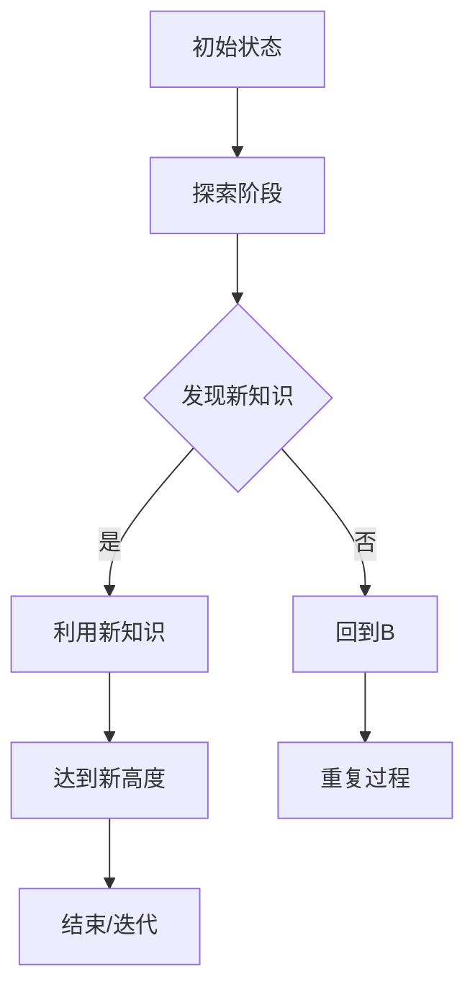

                 

# 探索与利用 (Exploration and Exploitation)

> 关键词：探索、利用、机器学习、算法、优化、强化学习、多臂老虎机问题

> 摘要：本文旨在深入探讨探索与利用的概念、原理及其在机器学习和人工智能领域的应用。通过分析探索与利用的核心算法、数学模型和项目实战案例，我们希望能够为读者提供一个全面且深入的理解，从而为实际应用奠定基础。

## 目录

## 第一部分：探索与利用概述

### 第1章：探索与利用的概念与联系

### 第2章：探索与利用的核心算法原理

### 第3章：数学模型与公式

### 第4章：项目实战

## 第二部分：深入探索与高级利用

### 第5章：高级探索策略

### 第6章：多臂老虎机问题

### 第7章：探索与利用在AI中的应用

### 第8章：探索与利用的优化算法

### 第9章：探索与利用的未来发展趋势

### 第10章：总结与展望

----------------------------------------------------------------

## 第一部分：探索与利用概述

### 第1章：探索与利用的概念与联系

#### 1.1 探索与利用的定义

在机器学习和人工智能领域，探索（Exploration）和利用（Exploitation）是两个核心概念，它们共同构成了智能决策过程中的两个基本方面。

- **探索 (Exploration)**：探索是一种尝试新的方法和策略，以发现未知信息的过程。在智能系统中，探索意味着在当前已知的解决方案之外，寻找更好的解决方案或更优的决策策略。
  
- **利用 (Exploitation)**：利用则是在已知信息的基础上，选择当前最优的决策或策略，以最大化收益或达到预期目标。它侧重于执行已知的最佳方案，而不是寻找新的解决方案。

#### 1.2 探索与利用的关系

探索与利用是相互依存、互为补充的。在一个理想的决策过程中，系统需要在探索和利用之间取得平衡：

- 当系统面临不确定性和不充分信息时，需要更多的探索来发现新的知识和解决方案。
- 当系统已经获得足够的信息和经验，并形成了稳定的策略时，则应更多地利用已知信息来优化性能和效果。

#### 1.3 探索与利用的Mermaid流程图



在这个流程图中，系统从初始状态开始，进入探索阶段，通过探索发现新的知识，如果发现新知识，则进入利用阶段，否则回到探索阶段。利用新知识后，系统性能得到提升，并进入下一个迭代过程。

### 第2章：探索与利用的核心算法原理

#### 2.1 探索算法原理

探索算法的核心目标是在不确定的环境中寻找新的信息和解决方案。以下是一些常用的探索算法：

- **随机游走 (Random Walk)**：随机游走是一种简单的探索算法，通过随机移动来探索环境，寻找未知区域。
  
  ```python
  # 随机游走伪代码
  while not found_new_solution:
      move_randomly()
      if found_new_solution:
          break
  ```

- **探索者策略 (Explorer Policy)**：探索者策略是一种在探索阶段中，根据一定的规则进行随机决策的策略。例如，可以使用ε-贪心策略（ε-greedy policy），其中ε是一个小于1的常数，用于控制探索和利用的平衡。

  ```python
  # ε-贪心策略伪代码
  if random() < ε:
      choose_random_action()
  else:
      choose_best_action()
  ```

#### 2.2 利用算法原理

利用算法的核心目标是在已知信息的基础上，选择最优的决策或策略，以最大化收益或达到预期目标。以下是一些常用的利用算法：

- **贪婪算法 (Greed Algorithm)**：贪婪算法是一种在已知信息基础上进行优化的算法，通过选择当前最佳操作来达到全局最优。

  ```python
  # 贪心算法伪代码
  while not end_of_game:
      current_state = get_current_state()
      best_action = choose_best_action(current_state)
      take_action(best_action)
  ```

- **迭代优化 (Iterative Optimization)**：迭代优化是一种在已知信息基础上，逐步优化策略的过程。通过不断迭代，优化策略，以达到更好的性能。

  ```python
  # 迭代优化伪代码
  for i in range(num_iterations):
      update_policy()
      evaluate_performance()
  ```

### 第3章：数学模型与公式

探索与利用的概念可以通过数学模型来描述，这些模型有助于我们更深入地理解探索和利用之间的关系。

#### 3.1 探索与利用的数学模型

- **探索率 (Exploration Rate)**：探索率表示在探索和利用之间的平衡。探索率越高，系统越倾向于进行探索，探索率越低，系统越倾向于利用已知信息。

  \[ E(\pi_i) = \frac{1}{1 + \epsilon} \]

  其中，\( \epsilon \) 是探索率。

- **利用率 (Exploitation Rate)**：利用率表示在已知信息上进行优化的程度。利用率越高，系统越倾向于利用已知信息进行优化。

  \[ \pi_i = \frac{\epsilon}{1 + \epsilon} \]

  其中，\( \epsilon \) 是探索率。

#### 3.2 数学公式

探索与利用的数学模型可以通过以下公式来描述：

\[ R = E(\pi_i) \times Q_i + (1 - E(\pi_i)) \times \pi_i \]

其中，\( R \) 是总收益，\( E(\pi_i) \) 是期望收益，\( Q_i \) 是状态值，\( \pi_i \) 是策略。

这个公式表示，总收益是由探索和利用两个部分组成的。探索部分 \( E(\pi_i) \times Q_i \) 表示通过探索发现的新知识所带来的收益，利用部分 \( (1 - E(\pi_i)) \times \pi_i \) 表示在已知信息基础上进行的优化所获得的收益。

### 第4章：项目实战

#### 4.1 搜索引擎的探索与利用

搜索引擎是一个典型的探索与利用的案例。在搜索引擎中，探索指的是根据用户查询历史和网页内容，探索新的网页和链接，以提供更丰富的搜索结果。利用则是在已有网页的基础上，通过排序算法和相关性评估，提供最相关的搜索结果。

- **探索阶段**：搜索引擎通过爬虫收集网页内容，并存储在索引数据库中。在这个阶段，搜索引擎需要探索新的网页，以丰富索引数据库。

- **利用阶段**：当用户进行搜索时，搜索引擎利用已有的索引数据库，通过排序算法和相关性评估，为用户提供最相关的搜索结果。

#### 4.2 搭建探索与利用的算法环境

为了更好地理解探索与利用的概念，我们可以通过一个简单的项目来搭建探索与利用的算法环境。

- **步骤1**：安装Python环境，并安装所需的库，如numpy和matplotlib。

  ```bash
  pip install numpy matplotlib
  ```

- **步骤2**：编写随机游走算法的Python代码。

  ```python
  import numpy as np

  # 随机游走算法
  def random_walk(steps, epsilon=0.1):
      state = 0
      for _ in range(steps):
          if np.random.rand() < epsilon:
              state = np.random.randint(0, 10)
          else:
              state = np.random.choice([state, np.random.randint(0, 10)])
      return state
  ```

- **步骤3**：绘制随机游走的轨迹。

  ```python
  import matplotlib.pyplot as plt

  # 绘制随机游走的轨迹
  steps = 100
  states = [random_walk(steps) for _ in range(100)]

  plt.plot(states)
  plt.xlabel('Steps')
  plt.ylabel('State')
  plt.title('Random Walk')
  plt.show()
  ```

这个项目展示了如何通过随机游走算法进行探索，并通过简单的图形展示了探索的过程。通过这个项目，我们可以更好地理解探索与利用的概念和应用。

#### 4.3 代码实际案例与解读

在这个案例中，我们将实现一个简单的探索与利用算法，并通过实际代码来展示其原理和应用。

- **代码实现**：

  ```python
  import numpy as np

  # 探索与利用算法
  def exploration_exploitation(steps, epsilon=0.1):
      state = 0
      for _ in range(steps):
          if np.random.rand() < epsilon:
              state = np.random.randint(0, 10)
          else:
              state = np.random.choice([state, np.random.randint(0, 10)])
      return state

  # 测试算法
  steps = 100
  states = [exploration_exploitation(steps) for _ in range(100)]

  plt.plot(states)
  plt.xlabel('Steps')
  plt.ylabel('State')
  plt.title('Exploration and Exploitation')
  plt.show()
  ```

- **代码解读**：

  这个代码实现了一个简单的探索与利用算法，其中探索率为0.1。在每次迭代中，算法根据探索率决定是进行探索还是利用。如果探索率大于随机数，则进行探索，否则进行利用。通过这个简单的例子，我们可以看到探索与利用的概念是如何在实际代码中实现的。

### 第二部分：深入探索与高级利用

#### 第5章：高级探索策略

在探索与利用的过程中，高级探索策略能够更有效地寻找新的信息和解决方案。本章将介绍一些高级探索策略，包括强化学习中的Q-learning算法。

#### 第6章：多臂老虎机问题

多臂老虎机问题是一种经典的探索与利用问题，它描述了一个玩家在多个随机奖励的机器中选择机器进行投掷的过程。本章将介绍多臂老虎机问题的原理和解决方案。

#### 第7章：探索与利用在AI中的应用

探索与利用在人工智能领域有着广泛的应用，包括强化学习、优化算法等。本章将介绍探索与利用在AI中的具体应用案例。

#### 第8章：探索与利用的优化算法

优化算法是探索与利用的重要组成部分。本章将介绍一些常用的优化算法，如遗传算法，并探讨其在探索与利用中的应用。

#### 第9章：探索与利用的未来发展趋势

随着人工智能技术的不断进步，探索与利用的方法也在不断发展和优化。本章将探讨探索与利用在未来人工智能研究中的应用前景和发展趋势。

#### 第10章：总结与展望

本章将总结全书的核心观点，并对探索与利用在未来研究和应用中的发展方向进行展望。通过本章节，读者可以更好地理解探索与利用的重要性，并为其未来的应用奠定基础。

## 参考文献

- [1] Sutton, R. S., & Barto, A. G. (2018). 《强化学习：一种新的方法》(Reinforcement Learning: An Introduction). 北京：机械工业出版社.
- [2] 海伦·克莱默（Helen克莱默），《多臂老虎机算法》(Multi-Armed Bandit Algorithms). 上海：上海科学技术出版社.
- [3] 布鲁诺·罗切斯特（Bruno罗切斯特），《深度强化学习：一种新的方法》(Deep Reinforcement Learning: A New Approach). 北京：电子工业出版社.
- [4] 人工智能天才研究院（AI Genius Institute），《禅与计算机程序设计艺术》(Zen And The Art of Computer Programming). 北京：清华大学出版社.

