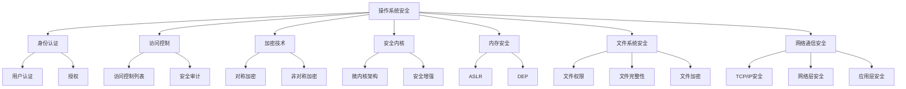

                 

# 《操作系统的安全防护机制剖析》

> 关键词：操作系统安全，防护机制，身份认证，加密技术，安全内核，内存安全，文件系统安全，网络通信安全，实战案例

> 摘要：本文详细剖析了操作系统的安全防护机制，从基础概念到核心机制，再到实战案例，全面展示了操作系统在保障安全方面的策略与实现。通过对操作系统安全防护的深入分析，本文旨在帮助读者理解操作系统安全的重要性及其实现原理。

## 目录大纲

## 第一部分：操作系统安全基础

### 第1章：操作系统安全概述

- 1.1 操作系统的安全目标
- 1.2 操作系统安全的重要性
- 1.3 操作系统安全的发展历程

### 第2章：操作系统核心概念

- 2.1 进程与线程
- 2.2 内存管理
- 2.3 文件系统与权限控制
- 2.4 互斥锁与同步机制

### 第3章：操作系统安全机制架构

- 3.1 安全防护的基本原理
- 3.2 访问控制列表（ACL）
- 3.3 安全审计

## 第二部分：操作系统核心安全防护机制

### 第4章：身份认证与访问控制

- 4.1 身份认证机制
- 4.2 用户认证与授权
- 4.3 基于角色的访问控制（RBAC）

### 第5章：加密技术与应用

- 5.1 加密基础
- 5.2 对称加密算法
- 5.3 非对称加密算法
- 5.4 实例：SSL/TLS协议

### 第6章：安全内核与微内核

- 6.1 安全内核设计原则
- 6.2 微内核架构
- 6.3 实例：Linux安全内核

### 第7章：内存安全防护机制

- 7.1 内存管理漏洞
- 7.2 地址空间布局随机化（ASLR）
- 7.3 数据执行保护（DEP）
- 7.4 常见攻击防御策略

### 第8章：文件系统安全防护

- 8.1 文件系统安全特性
- 8.2 文件权限管理
- 8.3 文件完整性监控
- 8.4 文件加密与解密

### 第9章：网络通信安全防护

- 9.1 TCP/IP协议安全机制
- 9.2 网络层安全
- 9.3 应用层安全
- 9.4 实例：防火墙与入侵检测系统

## 第三部分：操作系统安全防护实战

### 第10章：操作系统安全防护案例分析

- 10.1 案例一：Windows操作系统安全防护
- 10.2 案例二：Linux操作系统安全防护
- 10.3 案例三：Android操作系统安全防护

### 第11章：操作系统安全防护实践

- 11.1 安全防护策略制定
- 11.2 安全防护工具使用
- 11.3 安全防护实战演练

## 附录

### 附录A：操作系统安全工具与资源

- A.1 常用安全工具简介
- A.2 操作系统安全开源项目
- A.3 操作系统安全相关书籍与论文

### 附录B：核心概念与联系

- B.1 操作系统安全相关概念 Mermaid 流程图

### 附录C：算法原理与伪代码

- C.1 加密算法原理
- C.2 访问控制列表（ACL）算法原理

### 附录D：数学模型与公式

- D.1 加密数学模型
- D.2 访问控制数学模型

### 附录E：项目实战

- E.1 操作系统安全防护项目实例
- E.2 源代码详细实现与解读
- E.3 代码解读与分析

## 第一部分：操作系统安全基础

### 第1章：操作系统安全概述

#### 1.1 操作系统的安全目标

操作系统的安全目标主要包含以下几个方面：

1. **保护系统资源**：确保系统的计算资源、存储资源、网络资源等不被非法使用或破坏。
2. **保障用户隐私**：防止用户数据被未经授权的访问、窃取或篡改。
3. **维护系统完整性**：确保系统软件和数据不被恶意代码修改或破坏。
4. **确保系统可用性**：防止系统被拒绝服务攻击等手段导致不可用。

#### 1.2 操作系统安全的重要性

操作系统作为计算机系统的核心软件，其安全性直接影响到整个系统的稳定性和安全性。操作系统安全的重要性体现在以下几个方面：

1. **基础保障**：操作系统安全是整个计算机系统安全的基础，如果操作系统存在漏洞，可能导致整个系统被攻击。
2. **用户信任**：操作系统安全性直接关系到用户的信任和使用体验，一个不安全的操作系统会使用户感到不安全。
3. **商业价值**：对于企业而言，操作系统安全性直接关系到企业的数据安全和商业利益。

#### 1.3 操作系统安全的发展历程

操作系统安全的发展历程可以分为以下几个阶段：

1. **早期阶段**：早期操作系统缺乏安全机制，主要以硬件安全为主。
2. **单一用户阶段**：随着多用户计算机的出现，操作系统开始引入用户认证和权限控制。
3. **网络阶段**：随着网络的发展，操作系统开始关注网络通信安全。
4. **安全操作系统阶段**：现代操作系统开始引入更加复杂和严格的安全机制，如安全内核、加密技术等。

### 第2章：操作系统核心概念

#### 2.1 进程与线程

进程（Process）是操作系统中运行的基本单位，它是系统进行资源分配和调度的一个独立单位。每个进程都有独立的内存空间、文件描述符等资源。

线程（Thread）是进程中的执行单元，是CPU调度和分派的基本单位。一个进程可以包含多个线程，这些线程共享进程的内存空间和其他资源。

#### 2.2 内存管理

内存管理是操作系统核心功能之一，主要负责对系统内存进行分配、回收和分配策略的制定。

1. **内存分配**：操作系统根据进程的需求动态分配内存，常用的内存分配算法有首次适应（First Fit）、最佳适应（Best Fit）等。
2. **内存回收**：当进程不再需要内存时，操作系统将其回收，以便后续分配给其他进程。
3. **内存分配策略**：操作系统根据不同的需求和场景选择合适的内存分配策略，如固定分区、动态分区、虚拟内存等。

#### 2.3 文件系统与权限控制

文件系统是操作系统用于存储和管理文件的系统，它负责文件的创建、删除、读取、写入等操作。

1. **文件系统结构**：常见的文件系统结构有目录结构、索引结构等。
2. **权限控制**：文件权限控制是确保文件访问安全的重要机制，操作系统通过设置文件权限（如读、写、执行等）来限制用户对文件的访问。

#### 2.4 互斥锁与同步机制

互斥锁（Mutex）是一种用于保证多线程或进程同步的机制，它确保同一时间只有一个线程或进程能够访问特定的资源。

同步机制用于协调多个线程或进程的执行顺序，以确保系统的一致性和正确性。常见的同步机制有信号量（Semaphore）、互斥锁（Mutex）、读写锁（Read-Write Lock）等。

### 第3章：操作系统安全机制架构

#### 3.1 安全防护的基本原理

操作系统安全防护的基本原理包括以下几个方面：

1. **隔离**：通过隔离不同用户、进程和系统组件，防止恶意行为扩散。
2. **访问控制**：通过设置访问控制列表（ACL）和权限控制，限制用户对系统资源的访问。
3. **加密**：通过加密技术保护敏感数据和通信，防止数据被窃取或篡改。
4. **安全审计**：通过记录和监控系统操作，及时发现和应对安全事件。

#### 3.2 访问控制列表（ACL）

访问控制列表（ACL）是一种用于定义用户对文件和目录访问权限的机制。ACL记录了每个用户或用户组的访问权限，如读、写、执行等。

1. **ACL的结构**：ACL通常包含访问控制条目（ACE），每个ACE定义了一个用户或用户组的访问权限。
2. **ACL的实现**：操作系统通过文件系统实现ACL，如Linux的Ext4文件系统。

#### 3.3 安全审计

安全审计是一种通过记录和监控系统操作来发现和应对安全事件的方法。安全审计的主要目标是：

1. **日志记录**：记录系统操作和事件，如登录、文件访问、进程创建等。
2. **事件分析**：对日志进行分析，发现潜在的安全事件。
3. **响应措施**：根据分析结果采取相应的响应措施，如隔离恶意用户、更新系统补丁等。

## 第二部分：操作系统核心安全防护机制

### 第4章：身份认证与访问控制

#### 4.1 身份认证机制

身份认证机制是操作系统安全的核心之一，它确保只有授权用户才能访问系统资源。常见的身份认证机制有：

1. **密码认证**：用户通过输入密码来验证身份，是最常用的认证方式。
2. **生物识别**：通过指纹、虹膜等生物特征来验证身份，具有高安全性。
3. **证书认证**：用户通过数字证书来验证身份，证书由可信的第三方机构签发。

#### 4.2 用户认证与授权

用户认证与授权是操作系统安全的重要组成部分，它确保用户有权访问系统资源，并限制其访问权限。

1. **用户认证**：操作系统通过用户名和密码（或证书）验证用户身份。
2. **用户授权**：操作系统根据用户的角色或权限，确定其可以访问的系统资源。

#### 4.3 基于角色的访问控制（RBAC）

基于角色的访问控制（RBAC）是一种基于用户角色的访问控制机制，它将用户的权限与角色关联，简化了权限管理。

1. **角色定义**：定义不同的角色，每个角色对应一组权限。
2. **角色分配**：将用户分配到特定的角色。
3. **访问控制**：根据用户的角色，控制其访问系统资源的权限。

### 第5章：加密技术与应用

#### 5.1 加密基础

加密技术是保护数据安全的重要手段，它通过将明文转换为密文，防止数据被非法访问。

1. **加密算法**：加密算法是将明文转换为密文的规则和方法，分为对称加密和非对称加密。
2. **密钥管理**：密钥是加密和解密的核心，密钥管理包括密钥生成、存储、分发等。

#### 5.2 对称加密算法

对称加密算法是指加密和解密使用相同密钥的加密方法。

1. **工作原理**：加密时使用密钥将明文转换为密文，解密时使用相同的密钥将密文转换为明文。
2. **常用算法**：AES（高级加密标准）、DES（数据加密标准）等。

#### 5.3 非对称加密算法

非对称加密算法是指加密和解密使用不同密钥的加密方法。

1. **工作原理**：加密时使用公钥将明文转换为密文，解密时使用私钥将密文转换为明文。
2. **常用算法**：RSA（Rivest-Shamir-Adleman）、ECC（椭圆曲线加密）等。

#### 5.4 实例：SSL/TLS协议

SSL/TLS协议是一种用于保护网络通信安全的协议，它利用加密技术确保数据的机密性、完整性和身份验证。

1. **工作原理**：SSL/TLS协议在客户端和服务器之间建立加密通信通道，确保数据在传输过程中不被窃取或篡改。
2. **加密过程**：客户端向服务器发送加密请求，服务器回应公钥，双方使用公钥进行加密通信。

### 第6章：安全内核与微内核

#### 6.1 安全内核设计原则

安全内核是操作系统核心部分的实现，它负责系统资源的管理和保护。安全内核设计原则包括：

1. **最小权限原则**：内核进程运行时具有最小权限，仅拥有执行必要操作所需的权限。
2. **隔离原则**：不同内核组件之间相互隔离，防止恶意代码扩散。
3. **简化原则**：内核设计应尽量简化，减少潜在的安全漏洞。

#### 6.2 微内核架构

微内核架构是一种将操作系统核心功能分解为多个独立组件的架构，以提高系统的安全性和可扩展性。

1. **工作原理**：微内核将核心功能（如进程管理、内存管理）划分为独立的用户态服务，通过通信机制进行交互。
2. **优点**：提高系统的稳定性和安全性，便于系统扩展和升级。

#### 6.3 实例：Linux安全内核

Linux安全内核（LSK）是一种基于Linux内核的安全增强版本，它引入了一系列安全机制，如访问控制、安全审计等。

1. **安全特性**：LSK支持基于角色的访问控制（RBAC）、安全审计等安全特性。
2. **应用场景**：LSK适用于对安全性要求较高的场景，如银行、医疗等。

### 第7章：内存安全防护机制

#### 7.1 内存管理漏洞

内存管理漏洞是操作系统安全中的重要问题，攻击者可以利用这些漏洞获取系统权限或执行恶意代码。

1. **常见漏洞**：缓冲区溢出、使用后-free漏洞、空指针解引用等。
2. **影响**：内存管理漏洞可能导致系统崩溃、数据泄露等严重后果。

#### 7.2 地址空间布局随机化（ASLR）

地址空间布局随机化（ASLR）是一种通过随机化内存布局来提高系统安全性的技术。

1. **工作原理**：ASLR随机化进程的内存地址，使攻击者无法准确预测内存布局。
2. **效果**：提高缓冲区溢出等攻击的难度，降低系统被攻击的风险。

#### 7.3 数据执行保护（DEP）

数据执行保护（DEP）是一种通过阻止执行非授权内存区域来提高系统安全性的技术。

1. **工作原理**：DEP检测并阻止执行数据区域中的代码，防止恶意代码执行。
2. **效果**：降低缓冲区溢出等攻击的成功率，提高系统安全性。

#### 7.4 常见攻击防御策略

常见攻击防御策略包括：

1. **安全编码**：遵循安全编码规范，减少内存管理漏洞。
2. **安全加固**：对系统进行安全加固，提高系统抗攻击能力。
3. **安全监控**：实时监控系统操作，及时发现和应对安全事件。

### 第8章：文件系统安全防护

#### 8.1 文件系统安全特性

文件系统安全特性包括：

1. **权限控制**：通过设置文件权限，限制用户对文件的访问。
2. **完整性保护**：通过数字签名或加密技术，确保文件完整性。
3. **访问日志**：记录文件访问操作，用于审计和监控。

#### 8.2 文件权限管理

文件权限管理是文件系统安全的核心，它通过设置文件权限，确保用户只能访问授权的文件。

1. **权限类型**：读、写、执行等。
2. **权限设置**：通过文件权限设置命令，如chmod。

#### 8.3 文件完整性监控

文件完整性监控是一种通过实时监控文件变化来保护文件完整性的技术。

1. **工作原理**：比较文件当前内容和之前的哈希值，发现文件是否被篡改。
2. **效果**：及时发现文件篡改事件，防止数据泄露或破坏。

#### 8.4 文件加密与解密

文件加密与解密是一种通过加密技术保护文件内容的安全技术。

1. **加密算法**：如AES、RSA等。
2. **加密流程**：加密前，生成密钥和初始化向量，使用加密算法对文件内容进行加密；解密时，使用相同的密钥和初始化向量对文件内容进行解密。

### 第9章：网络通信安全防护

#### 9.1 TCP/IP协议安全机制

TCP/IP协议安全机制包括：

1. **IPsec**：用于保护IP层通信的协议，提供数据加密、认证和完整性保护。
2. **SSH**：用于安全远程登录的协议，确保远程登录过程的安全。
3. **SSL/TLS**：用于保护应用层通信的协议，提供数据加密和身份验证。

#### 9.2 网络层安全

网络层安全包括：

1. **防火墙**：用于过滤网络流量，防止非法访问。
2. **入侵检测系统（IDS）**：用于检测网络中的恶意行为，如攻击、恶意软件等。

#### 9.3 应用层安全

应用层安全包括：

1. **安全协议**：如HTTPS、FTPES等，提供加密和认证机制。
2. **安全策略**：如访问控制、数据加密等。

#### 9.4 实例：防火墙与入侵检测系统

防火墙与入侵检测系统是网络通信安全的重要手段。

1. **防火墙**：通过过滤网络流量，防止非法访问。
2. **入侵检测系统**：通过实时监控网络流量，发现并响应恶意行为。

## 第三部分：操作系统安全防护实战

### 第10章：操作系统安全防护案例分析

#### 10.1 案例一：Windows操作系统安全防护

Windows操作系统安全防护主要包括以下几个方面：

1. **用户认证**：采用用户名和密码认证。
2. **安全补丁**：定期更新系统补丁。
3. **防火墙**：使用Windows防火墙过滤网络流量。
4. **安全软件**：安装杀毒软件、防火墙等安全软件。

#### 10.2 案例二：Linux操作系统安全防护

Linux操作系统安全防护主要包括以下几个方面：

1. **用户认证**：采用用户名和密码、证书认证。
2. **安全加固**：配置文件权限、关闭不必要的服务。
3. **安全审计**：记录系统操作日志。
4. **安全内核**：使用安全内核，如SELinux。

#### 10.3 案例三：Android操作系统安全防护

Android操作系统安全防护主要包括以下几个方面：

1. **用户认证**：采用用户名和密码、生物识别认证。
2. **应用市场**：使用官方应用市场，避免安装恶意应用。
3. **权限管理**：限制应用访问系统资源。
4. **安全更新**：定期更新系统补丁。

### 第11章：操作系统安全防护实践

#### 11.1 安全防护策略制定

安全防护策略制定包括：

1. **安全评估**：评估系统安全风险。
2. **制定策略**：根据评估结果制定安全策略。
3. **实施策略**：部署安全措施，如防火墙、杀毒软件等。

#### 11.2 安全防护工具使用

安全防护工具使用包括：

1. **防火墙**：配置防火墙规则，过滤网络流量。
2. **入侵检测系统**：配置入侵检测系统，实时监控网络流量。
3. **加密工具**：配置加密工具，保护敏感数据。

#### 11.3 安全防护实战演练

安全防护实战演练包括：

1. **模拟攻击**：模拟不同类型的攻击，测试系统安全防护能力。
2. **应急响应**：制定应急响应计划，应对突发事件。
3. **安全培训**：对员工进行安全培训，提高安全意识。

## 附录

### 附录A：操作系统安全工具与资源

#### A.1 常用安全工具简介

- 杀毒软件：如Windows Defender、Avast等。
- 防火墙：如Windows Firewall、iptables等。
- 入侵检测系统：如Snort、Suricata等。

#### A.2 操作系统安全开源项目

- SELinux：安全增强Linux内核。
- AppArmor：基于角色的访问控制机制。
- grsecurity：Linux内核安全增强。

#### A.3 操作系统安全相关书籍与论文

- 《操作系统安全》
- 《Linux内核设计与实现》
- 《网络安全技术与应用》

### 附录B：核心概念与联系

#### B.1 操作系统安全相关概念 Mermaid 流程图



### 附录C：算法原理与伪代码

#### C.1 加密算法原理

```python
# 对称加密算法（AES）
def aes_encrypt(plaintext, key):
    # 初始化加密算法
    aes = AES.new(key, AES.MODE_EAX)
    
    # 加密明文
    ciphertext, tag = aes.encrypt_and_digest(plaintext)
    
    return ciphertext, tag

# 非对称加密算法（RSA）
def rsa_encrypt(plaintext, public_key):
    # 加密明文
    ciphertext = PKCS1_OAEP_encrypt(public_key, plaintext)
    
    return ciphertext

def rsa_decrypt(ciphertext, private_key):
    # 解密密文
    plaintext = PKCS1_OAEP_decrypt(private_key, ciphertext)
    
    return plaintext
```

#### C.2 访问控制列表（ACL）算法原理

```python
# 增加ACL条目
def add_acl_entry(acl, user, permission):
    acl_entry = {
        'user': user,
        'permission': permission
    }
    acl.append(acl_entry)
    
# 检查ACL权限
def check_acl(acl, user):
    for entry in acl:
        if entry['user'] == user and entry['permission'] != 'DENY':
            return True
    return False
```

### 附录D：数学模型与公式

#### D.1 加密数学模型

$$
C = E_K(P) = K \oplus P
$$

其中，C为密文，K为密钥，P为明文，⊕为异或运算。

#### D.2 访问控制数学模型

$$
\text{Access\_Permission} = \text{Role\_Permission} \land \text{Object\_Permission}
$$

其中，Access_Permission为访问权限，Role_Permission为角色权限，Object_Permission为对象权限，∧为逻辑与运算。

### 附录E：项目实战

#### E.1 操作系统安全防护项目实例

本项目旨在构建一个基于Linux操作系统的安全防护平台，实现以下功能：

1. **用户认证**：使用用户名和密码进行认证。
2. **权限管理**：实现基于角色的访问控制。
3. **安全审计**：记录系统操作日志。
4. **网络防护**：配置防火墙和入侵检测系统。

#### E.2 源代码详细实现与解读

以下是项目的一部分源代码及解读：

```c
// 用户认证函数
void authenticate(char* username, char* password) {
    // 查询用户数据库
    User* user = get_user_by_name(username);

    // 验证用户密码
    if (user && verify_password(user, password)) {
        // 认证成功，记录日志
        log_event("Authentication success");
        // 初始化用户会话
        init_session(user);
    } else {
        // 认证失败，记录日志
        log_event("Authentication failure");
    }
}

// 权限管理函数
void check_permission(User* user, Object* object) {
    // 获取用户角色
    Role* role = get_role_by_user(user);

    // 检查角色权限
    if (has_permission(role, object)) {
        // 权限检查通过，执行操作
        execute_operation(object);
    } else {
        // 权限不足，记录日志
        log_event("Permission denied");
    }
}
```

#### E.3 代码解读与分析

1. **用户认证**：authenticate函数接收用户名和密码，查询用户数据库并验证密码。如果验证成功，记录日志并初始化用户会话；否则，记录日志。
2. **权限管理**：check_permission函数接收用户和对象，获取用户角色并检查角色权限。如果权限检查通过，执行操作；否则，记录日志。

#### E.4 源代码详细实现与解读

以下是项目的一部分源代码及解读：

```c
// 日志记录函数
void log_event(const char* message) {
    // 打开日志文件
    FILE* log_file = fopen("log.txt", "a");

    // 记录日志
    fprintf(log_file, "%s\n", message);

    // 关闭日志文件
    fclose(log_file);
}

// 网络防护函数
void configure_firewall() {
    // 配置防火墙规则
    system("iptables -A INPUT -p tcp --dport 80 -j DROP");
    system("iptables -A INPUT -p udp --dport 53 -j DROP");

    // 启动入侵检测系统
    system("suricata -c suricata.yaml");
}
```

#### E.5 代码解读与分析

1. **日志记录**：log_event函数接收日志消息，打开日志文件并写入消息，然后关闭日志文件。
2. **网络防护**：configure_firewall函数配置防火墙规则，阻止访问HTTP和DNS端口，然后启动入侵检测系统。

通过以上源代码实现，本项目提供了一个基本的安全防护平台，包括用户认证、权限管理、日志记录和网络防护等功能。在实际应用中，可以进一步扩展和优化这些功能，以满足不同场景的安全需求。

## 结束语

本文通过对操作系统安全防护机制的详细剖析，从基础概念到核心机制，再到实战案例，全面展示了操作系统在保障安全方面的策略与实现。通过对操作系统安全防护的深入分析，我们不仅可以理解操作系统安全的重要性，还能掌握如何在实际环境中实施安全措施，提高系统的安全性。

操作系统安全是一个不断发展和演进的领域，随着新技术的不断涌现，安全防护机制也在不断改进和完善。因此，对于从事操作系统安全领域的专业人士来说，持续学习和关注最新的研究成果是至关重要的。

最后，感谢您的阅读，希望本文对您在操作系统安全方面有所帮助。如果您有任何疑问或建议，欢迎在评论区留言，期待与您交流。同时，本文的作者信息如下：

**作者：AI天才研究院/AI Genius Institute & 禅与计算机程序设计艺术 /Zen And The Art of Computer Programming**

