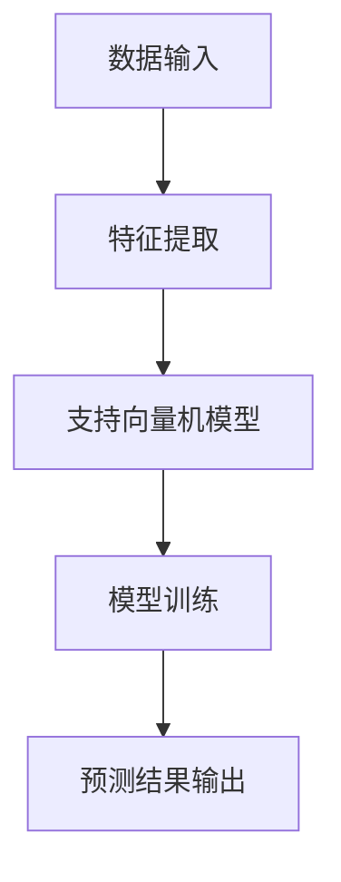

                 

# 支持向量机(Support Vector Machines) - 原理与代码实例讲解

> 关键词：支持向量机、SVM、机器学习、分类算法、线性分类、非线性分类、核函数、优化算法

> 摘要：本文将深入探讨支持向量机（Support Vector Machines，SVM）的基本概念、数学原理、优化算法及其在实际项目中的应用。通过详细的代码实例，读者将能够全面理解SVM的工作原理和实现方法。

## 目录大纲

- 第一部分：支持向量机的基本概念
  - 第1章：支持向量机概述
    - 1.1 支持向量机的发展背景与历史
    - 1.2 支持向量机的基本原理
    - 1.3 支持向量机的类型与特点
  - 第2章：线性支持向量机
    - 2.1 线性支持向量机的基础
    - 2.2 线性支持向量机的求解
    - 2.3 线性支持向量机应用实例
  - 第3章：非线性支持向量机
    - 3.1 非线性支持向量机引论
    - 3.2 核函数的选择与设计
    - 3.3 非线性支持向量机应用实例
  - 第4章：支持向量机在多类分类中的应用
    - 4.1 多类分类问题的解决方案
    - 4.2 多类支持向量机的算法
    - 4.3 多类支持向量机应用实例

- 第二部分：支持向量机的数学原理与算法
  - 第5章：支持向量机的数学基础
    - 5.1 线性代数基础
    - 5.2 拉格朗日乘数法
    - 5.3 对偶问题与KKT条件
  - 第6章：支持向量机的优化算法
    - 6.1 SMO算法
    - 6.2 内点法
    - 6.3 对比分析
  - 第7章：支持向量机的扩展
    - 7.1 支持向量回归（SVR）
    - 7.2 支持向量机聚类（SVC）
    - 7.3 支持向量机的现代变体

- 第三部分：支持向量机的应用与实战
  - 第8章：支持向量机在机器学习项目中的应用
    - 8.1 项目准备与数据预处理
    - 8.2 支持向量机模型构建
    - 8.3 模型训练与评估
    - 8.4 项目实战案例
  - 第9章：支持向量机的代码实战
    - 9.1 开发环境搭建
    - 9.2 代码实例详解
    - 9.3 代码解读与分析
  - 第10章：支持向量机的未来发展趋势
    - 10.1 支持向量机的研究热点
    - 10.2 支持向量机与其他机器学习方法的融合
    - 10.3 支持向量机的未来应用场景

- 附录
  - 附录A：支持向量机常用库与工具
    - A.1 Scikit-learn库的使用
    - A.2 LIBSVM库的使用
    - A.3 深度学习框架对支持向量机的支持

## 支持向量机(Support Vector Machines) - 原理与代码实例讲解

### 第1章：支持向量机概述

#### 1.1 支持向量机的发展背景与历史

支持向量机（Support Vector Machines，SVM）由Vapnik等人于20世纪60年代末期提出，是一种基于统计学理论建立起来的监督学习模型。最初，SVM主要是为了解决二分类问题，后来逐渐发展出了多类分类和支持向量回归等变体。

SVM的核心思想是通过找到一个最优的超平面，将不同类别的数据点尽可能分开。这一思想来源于统计学中的“最大边缘（Maximum Margin）”理论，其目的是在允许一定的误差情况下，寻找一个最大间隔的超平面，以实现最佳的分类效果。

随着计算能力的提升和机器学习理论的不断发展，SVM逐渐成为了一种广泛应用的分类算法。其在图像识别、文本分类、生物信息学等领域都有着出色的表现。

#### 1.2 支持向量机的基本原理

支持向量机的基本原理可以概括为以下三个步骤：

1. **特征空间映射**：通过非线性变换，将原始特征空间映射到一个高维特征空间，使得原本线性不可分的数据在这个新的特征空间中变得线性可分。

2. **最优超平面求解**：在新的特征空间中找到一个最优的超平面，使得正负样本之间的间隔最大化。这个超平面被称为“支持向量超平面”。

3. **分类决策**：利用找到的最优超平面进行分类决策。对于新的数据点，将其映射到高维特征空间，然后通过超平面进行分类。

#### 1.3 支持向量机的类型与特点

根据数据的线性可分性，SVM可以分为以下几种类型：

1. **线性可分支持向量机（Linear SVM）**：适用于线性可分的数据集，通过求解线性方程组找到最优超平面。

2. **线性支持向量机（Linear SVM）**：适用于线性不可分的数据集，通过引入松弛变量和求解对偶问题找到最优超平面。

3. **非线性支持向量机（Nonlinear SVM）**：通过核函数将数据映射到高维特征空间，从而实现非线性分类。

4. **多类支持向量机（Multi-class SVM）**：针对多类分类问题，通过构建多个二分类器进行分类。

SVM的特点包括：

- **强大的分类能力**：SVM通过最大化间隔的原则，能够找到最佳的超平面，从而实现精准的分类。
- **适用于不同类型的数据集**：无论是线性还是非线性，SVM都可以通过适当的方法进行分类。
- **对噪声和异常值具有较强的鲁棒性**：通过引入惩罚参数C，可以调节模型对噪声和异常值的敏感度。

### 第2章：线性支持向量机

#### 2.1 线性支持向量机的基础

线性支持向量机（Linear SVM）是SVM的一种简单形式，适用于线性可分的数据集。其基本原理是通过求解线性方程组找到最优超平面。

线性支持向量机的数学模型可以表示为：

$$
\begin{aligned}
\max\ & \frac{1}{2} \| w \|^2 \\
\text{subject to}\ & y_i ( \langle w, x_i \rangle - b ) \geq 1, \forall i \\
& w, b \geq 0
\end{aligned}
$$

其中，$w$ 是权重向量，$b$ 是偏置项，$y_i$ 是类别标签（$1$ 或 $-1$），$x_i$ 是输入特征向量。

通过引入拉格朗日乘数法，可以将上述优化问题转化为对偶问题，从而求解出最优超平面。

#### 2.2 线性支持向量机的求解

求解线性支持向量机的基本步骤如下：

1. **构建拉格朗日函数**：

$$
L(w, b, \alpha) = \frac{1}{2} \| w \|^2 - \sum_{i=1}^{n} \alpha_i [ y_i ( \langle w, x_i \rangle - b ) - 1 ]
$$

其中，$\alpha_i$ 是拉格朗日乘子。

2. **求解对偶问题**：

$$
\min\ \sum_{i=1}^{n} \alpha_i - \frac{1}{2} \sum_{i,j=1}^{n} \alpha_i \alpha_j y_i y_j \langle x_i, x_j \rangle
$$

$$
\text{subject to}\ 0 \leq \alpha_i \leq C, \forall i
$$

其中，$C$ 是惩罚参数。

3. **计算决策函数**：

$$
f(x) = \langle w, x \rangle + b
$$

通过求解对偶问题，可以得到最优的超平面参数 $w$ 和 $b$，从而实现分类。

#### 2.3 线性支持向量机应用实例

下面通过一个简单的例子，展示如何使用线性支持向量机进行分类。

```python
from sklearn import datasets
from sklearn.model_selection import train_test_split
from sklearn.svm import SVC
from sklearn.metrics import accuracy_score

# 加载数据
iris = datasets.load_iris()
X = iris.data
y = iris.target

# 划分训练集和测试集
X_train, X_test, y_train, y_test = train_test_split(X, y, test_size=0.3, random_state=42)

# 创建线性支持向量机分类器
clf = SVC(kernel='linear')

# 训练模型
clf.fit(X_train, y_train)

# 预测测试集
y_pred = clf.predict(X_test)

# 评估模型
accuracy = accuracy_score(y_test, y_pred)
print(f"Accuracy: {accuracy}")
```

### 第3章：非线性支持向量机

#### 3.1 非线性支持向量机引论

非线性支持向量机（Nonlinear SVM）是SVM的一种扩展形式，适用于线性不可分的数据集。其基本原理是通过核函数将数据映射到高维特征空间，从而实现非线性分类。

非线性支持向量机的数学模型可以表示为：

$$
\begin{aligned}
\max\ & \frac{1}{2} \| w \|^2 \\
\text{subject to}\ & y_i ( \langle \phi(x_i), w \rangle - b ) \geq 1, \forall i \\
& w, b \geq 0
\end{aligned}
$$

其中，$\phi(x_i)$ 是核函数将 $x_i$ 映射到高维特征空间的结果。

通过引入拉格朗日乘数法，可以将上述优化问题转化为对偶问题，从而求解出最优超平面。

#### 3.2 核函数的选择与设计

核函数是实现非线性支持向量机的关键。常见的核函数包括：

1. **线性核**：

$$
K(x_i, x_j) = \langle x_i, x_j \rangle
$$

2. **多项式核**：

$$
K(x_i, x_j) = ( \gamma \langle x_i, x_j \rangle + 1 )^d
$$

其中，$\gamma > 0$ 是核参数，$d$ 是多项式的次数。

3. **径向基函数（RBF）核**：

$$
K(x_i, x_j) = \exp(-\gamma \| x_i - x_j \|^2)
$$

4. **sigmoid核**：

$$
K(x_i, x_j) = \tanh(\gamma \langle x_i, x_j \rangle + c)
$$

选择合适的核函数和参数对于实现非线性支持向量机至关重要。

#### 3.3 非线性支持向量机应用实例

下面通过一个简单的例子，展示如何使用非线性支持向量机进行分类。

```python
from sklearn import datasets
from sklearn.model_selection import train_test_split
from sklearn.svm import SVC
from sklearn.metrics import accuracy_score

# 加载数据
iris = datasets.load_iris()
X = iris.data
y = iris.target

# 划分训练集和测试集
X_train, X_test, y_train, y_test = train_test_split(X, y, test_size=0.3, random_state=42)

# 创建非线性支持向量机分类器
clf = SVC(kernel='rbf')

# 训练模型
clf.fit(X_train, y_train)

# 预测测试集
y_pred = clf.predict(X_test)

# 评估模型
accuracy = accuracy_score(y_test, y_pred)
print(f"Accuracy: {accuracy}")
```

### 第4章：支持向量机在多类分类中的应用

#### 4.1 多类分类问题的解决方案

在多类分类问题中，支持向量机可以通过以下几种方法进行分类：

1. **一对多策略（One-vs-All）**：对于 $k$ 个类别，构建 $k$ 个二分类器，每个分类器负责区分其中一个类别与其他所有类别。

2. **一对一策略（One-vs-One）**：对于 $k$ 个类别，构建 $\frac{k(k-1)}{2}$ 个二分类器，每个分类器负责区分两个类别。

3. **多类支持向量机（Multi-class SVM）**：直接求解多类分类问题的对偶问题，适用于大规模多类分类问题。

#### 4.2 多类支持向量机的算法

多类支持向量机的算法主要包括：

1. **一对多策略**：

$$
\begin{aligned}
\max\ & \frac{1}{2} \sum_{i=1}^{k} \| w_i \|^2 \\
\text{subject to}\ & \sum_{i=1}^{k} y_i w_i = 1, \forall i \\
& y_i w_i \geq 1 - \xi_i, \xi_i \geq 0, \forall i
\end{aligned}
$$

2. **一对一策略**：

$$
\begin{aligned}
\max\ & \frac{1}{2} \sum_{i<j} \| w_{ij} \|^2 \\
\text{subject to}\ & \sum_{i=1}^{k} y_i w_{ij} = 1, \forall i, j \\
& y_i w_{ij} \geq 1 - \xi_{ij}, \xi_{ij} \geq 0, \forall i, j
\end{aligned}
$$

3. **多类支持向量机**：

$$
\begin{aligned}
\max\ & \frac{1}{2} \sum_{i=1}^{k} \| w_i \|^2 \\
\text{subject to}\ & \sum_{i=1}^{k} y_i w_i = 1, \forall i \\
& w_i \geq 0, \forall i
\end{aligned}
$$

#### 4.3 多类支持向量机应用实例

下面通过一个简单的例子，展示如何使用多类支持向量机进行分类。

```python
from sklearn import datasets
from sklearn.model_selection import train_test_split
from sklearn.svm import SVC
from sklearn.metrics import accuracy_score

# 加载数据
iris = datasets.load_iris()
X = iris.data
y = iris.target

# 划分训练集和测试集
X_train, X_test, y_train, y_test = train_test_split(X, y, test_size=0.3, random_state=42)

# 创建多类支持向量机分类器
clf = SVC()

# 训练模型
clf.fit(X_train, y_train)

# 预测测试集
y_pred = clf.predict(X_test)

# 评估模型
accuracy = accuracy_score(y_test, y_pred)
print(f"Accuracy: {accuracy}")
```

### 第5章：支持向量机的数学基础

#### 5.1 线性代数基础

支持向量机的数学模型涉及到线性代数中的基本概念和运算，包括：

1. **向量与矩阵**：向量是表示空间中一个点的数据结构，矩阵是表示多个向量集合的数据结构。矩阵的乘法和逆运算在支持向量机的求解过程中具有重要意义。

2. **内积**：内积是两个向量之间的一种度量，可以用来计算向量的长度和角度。在支持向量机的求解过程中，内积用于计算特征空间中向量的相似度。

3. **行列式**：行列式是一个矩阵的特殊数值，可以用来判断矩阵的行列式是否存在零解。在支持向量机的求解过程中，行列式用于判断线性方程组是否有解。

#### 5.2 拉格朗日乘数法

拉格朗日乘数法是一种常用的优化方法，用于求解带约束条件的优化问题。在支持向量机的求解过程中，拉格朗日乘数法用于将原始问题转化为对偶问题，从而求解出最优解。

拉格朗日乘数法的步骤如下：

1. **构建拉格朗日函数**：将原始问题与约束条件结合，构建拉格朗日函数。

2. **求解拉格朗日乘子**：对拉格朗日函数求导，并令导数为零，求解拉格朗日乘子。

3. **构建对偶问题**：将原始问题转化为对偶问题，并对对偶问题进行求解。

4. **求解原始问题**：通过求解对偶问题，可以得到原始问题的最优解。

#### 5.3 对偶问题与KKT条件

对偶问题是在拉格朗日乘数法中产生的一个重要问题。对偶问题的解提供了原始问题的最优解，并且对偶问题的求解过程更为简单。

KKT条件是一组充要条件，用于判断对偶问题是否满足最优性。在支持向量机的求解过程中，KKT条件用于判断对偶问题的解是否最优。

KKT条件包括以下几个部分：

1. **拉格朗日乘子法条件**：对于每个约束条件，拉格朗日乘子与约束条件的导数成正比。

2. **非负性条件**：拉格朗日乘子非负。

3. **互补松弛条件**：原始问题的约束条件与对偶问题的解之间存在互补关系。

4. **最优性条件**：对偶问题的解是最优的。

### 第6章：支持向量机的优化算法

#### 6.1 SMO算法

SMO（Sequential Minimal Optimization）算法是一种常用的支持向量机优化算法，适用于线性可分和支持向量回归问题。SMO算法通过迭代求解最小区间内的两个变量，从而逐步逼近最优解。

SMO算法的基本步骤如下：

1. **初始化**：选择两个变量 $w$ 和 $b$，初始化为任意值。

2. **迭代过程**：
   - 对于当前选择的两个变量，计算其误差。
   - 如果误差小于设定的阈值，则停止迭代。
   - 否则，更新两个变量的值，使得误差最小。

3. **结束条件**：当满足停止条件时，算法结束，输出最优解。

#### 6.2 内点法

内点法（Interior Point Method）是一种高效的优化算法，适用于大规模和支持向量机问题。内点法通过引入对偶变量，将原始问题转化为对偶问题，并在对偶空间内进行迭代求解。

内点法的基本步骤如下：

1. **初始化**：选择初始对偶变量和惩罚参数，初始化为任意值。

2. **迭代过程**：
   - 对于每个迭代，计算对偶变量和惩罚参数的最优更新。
   - 更新对偶变量和惩罚参数，并计算对偶问题的新解。

3. **结束条件**：当满足停止条件时，算法结束，输出最优解。

#### 6.3 对比分析

SMO算法和内点法在支持向量机的优化过程中具有不同的特点：

- **计算复杂度**：SMO算法的计算复杂度较低，适用于中小规模问题。内点法计算复杂度较高，适用于大规模问题。
- **收敛速度**：SMO算法的收敛速度较快，但可能存在局部最优解。内点法收敛速度较慢，但能够找到全局最优解。
- **适用范围**：SMO算法适用于线性可分和支持向量回归问题。内点法适用于大规模和支持向量机问题。

### 第7章：支持向量机的扩展

#### 7.1 支持向量回归（SVR）

支持向量回归（Support Vector Regression，SVR）是支持向量机的一种变体，适用于回归问题。SVR通过引入惩罚参数和松弛变量，将回归问题转化为优化问题，从而求解出回归模型。

SVR的数学模型可以表示为：

$$
\begin{aligned}
\min\ & \frac{1}{2} \| w \|^2 + C \sum_{i=1}^{n} \xi_i \\
\text{subject to}\ & y_i - \langle w, x_i \rangle \leq \xi_i, \forall i \\
& \xi_i \geq 0, \forall i
\end{aligned}
$$

其中，$w$ 是权重向量，$C$ 是惩罚参数，$y_i$ 是真实值，$\xi_i$ 是松弛变量。

SVR的求解方法与SVM类似，可以通过求解对偶问题得到最优解。

#### 7.2 支持向量机聚类（SVC）

支持向量机聚类（Support Vector Clustering，SVC）是支持向量机的一种扩展，适用于聚类问题。SVC通过引入标签信息，将聚类问题转化为优化问题，从而求解出聚类模型。

SVC的数学模型可以表示为：

$$
\begin{aligned}
\min\ & \frac{1}{2} \| w \|^2 + C \sum_{i=1}^{n} \xi_i \\
\text{subject to}\ & y_i - \langle w, x_i \rangle \leq \xi_i, \forall i \\
& \xi_i \geq 0, \forall i
\end{aligned}
$$

其中，$w$ 是权重向量，$C$ 是惩罚参数，$y_i$ 是标签值，$\xi_i$ 是松弛变量。

SVC的求解方法与SVM类似，可以通过求解对偶问题得到最优解。

#### 7.3 支持向量机的现代变体

支持向量机的现代变体包括：

1. **核支持向量机（Kernel SVM）**：通过引入核函数，将数据映射到高维特征空间，从而实现非线性分类。

2. **支持向量机群（Support Vector Machines Ensemble）**：通过组合多个支持向量机模型，提高分类和回归的性能。

3. **集成学习方法**：将支持向量机与其他机器学习方法相结合，形成新的混合模型，从而提高模型的性能。

### 第8章：支持向量机在机器学习项目中的应用

#### 8.1 项目准备与数据预处理

在支持向量机应用项目中，项目准备和数据预处理是至关重要的步骤。以下是一些关键步骤：

1. **数据收集**：收集适合项目需求的数据集，可以是公开数据集或自定义数据集。

2. **数据清洗**：去除数据中的噪声和异常值，保证数据的准确性和完整性。

3. **数据预处理**：对数据进行归一化或标准化处理，使其具有相同的量纲和范围。

4. **特征选择**：选择对分类任务最重要的特征，去除冗余特征，提高模型性能。

5. **数据划分**：将数据集划分为训练集和测试集，用于模型的训练和评估。

#### 8.2 支持向量机模型构建

在支持向量机模型构建过程中，以下是一些关键步骤：

1. **选择模型类型**：根据数据类型和任务需求，选择线性支持向量机、非线性支持向量机或多类支持向量机。

2. **设置参数**：设置惩罚参数C、核函数和核参数等，通过交叉验证选择最优参数。

3. **训练模型**：使用训练集训练支持向量机模型，求解最优超平面或回归模型。

4. **模型评估**：使用测试集评估模型性能，计算准确率、召回率、F1值等指标。

#### 8.3 模型训练与评估

在支持向量机模型训练和评估过程中，以下是一些关键步骤：

1. **模型训练**：使用训练集训练支持向量机模型，求解最优参数。

2. **模型评估**：使用测试集评估模型性能，计算各种评估指标。

3. **模型优化**：根据评估结果，调整模型参数，提高模型性能。

4. **模型部署**：将训练好的模型部署到实际应用场景，进行实时预测和分类。

#### 8.4 项目实战案例

以下是一个简单的支持向量机项目实战案例：

**案例描述**：使用支持向量机分类器对鸢尾花（Iris）数据集进行分类。

**数据集介绍**：鸢尾花数据集包含三种类别的鸢尾花，每个类别有50个样本，共150个样本。每个样本有4个特征：花萼长度、花萼宽度、花瓣长度和花瓣宽度。

**项目步骤**：

1. 数据收集：使用Scikit-learn库加载鸢尾花数据集。

2. 数据预处理：对数据进行归一化处理，使其具有相同的量纲和范围。

3. 数据划分：将数据集划分为训练集和测试集，比例约为7:3。

4. 模型选择：选择线性支持向量机分类器。

5. 参数设置：设置惩罚参数C为1，核函数为线性核。

6. 模型训练：使用训练集训练线性支持向量机分类器。

7. 模型评估：使用测试集评估模型性能，计算准确率、召回率、F1值等指标。

8. 模型部署：将训练好的模型部署到实际应用场景，进行实时预测和分类。

```python
from sklearn import datasets
from sklearn.model_selection import train_test_split
from sklearn.svm import SVC
from sklearn.metrics import accuracy_score, recall_score, f1_score

# 加载数据
iris = datasets.load_iris()
X = iris.data
y = iris.target

# 数据预处理
X_normalized = (X - X.mean(axis=0)) / X.std(axis=0)

# 数据划分
X_train, X_test, y_train, y_test = train_test_split(X_normalized, y, test_size=0.3, random_state=42)

# 模型选择
clf = SVC(C=1, kernel='linear')

# 模型训练
clf.fit(X_train, y_train)

# 模型评估
y_pred = clf.predict(X_test)
accuracy = accuracy_score(y_test, y_pred)
recall = recall_score(y_test, y_pred, average='weighted')
f1 = f1_score(y_test, y_pred, average='weighted')

print(f"Accuracy: {accuracy}")
print(f"Recall: {recall}")
print(f"F1 Score: {f1}")
```

### 第9章：支持向量机的代码实战

#### 9.1 开发环境搭建

在进行支持向量机的代码实战之前，需要搭建合适的开发环境。以下是一些关键步骤：

1. 安装Python环境：安装Python 3.x版本，并配置好相应的环境。

2. 安装Scikit-learn库：使用pip命令安装Scikit-learn库，命令如下：

```bash
pip install scikit-learn
```

3. 安装其他依赖库：根据具体需求，安装其他依赖库，如NumPy、Matplotlib等。

#### 9.2 代码实例详解

以下是一个简单的支持向量机分类代码实例，用于鸢尾花数据集的分类。

```python
import numpy as np
from sklearn import datasets
from sklearn.model_selection import train_test_split
from sklearn.svm import SVC
from sklearn.metrics import accuracy_score

# 加载数据
iris = datasets.load_iris()
X = iris.data
y = iris.target

# 数据预处理
X_normalized = (X - X.mean(axis=0)) / X.std(axis=0)

# 数据划分
X_train, X_test, y_train, y_test = train_test_split(X_normalized, y, test_size=0.3, random_state=42)

# 模型选择
clf = SVC(kernel='linear')

# 模型训练
clf.fit(X_train, y_train)

# 模型评估
y_pred = clf.predict(X_test)
accuracy = accuracy_score(y_test, y_pred)

print(f"Accuracy: {accuracy}")
```

#### 9.3 代码解读与分析

1. **数据加载与预处理**：使用Scikit-learn库加载鸢尾花数据集，并进行归一化处理，使其具有相同的量纲和范围。

2. **数据划分**：将数据集划分为训练集和测试集，比例约为7:3。

3. **模型选择**：选择线性支持向量机分类器。

4. **模型训练**：使用训练集训练线性支持向量机分类器。

5. **模型评估**：使用测试集评估模型性能，计算准确率。

通过上述代码，我们可以实现一个简单的支持向量机分类任务，并评估其性能。

### 第10章：支持向量机的未来发展趋势

#### 10.1 支持向量机的研究热点

支持向量机作为机器学习领域的重要算法之一，未来研究热点包括：

1. **大规模数据处理**：针对大数据时代的数据处理需求，研究高效的支持向量机算法，提高模型的训练和预测速度。

2. **深度学习与支持向量机的融合**：探索支持向量机与深度学习相结合的方法，提高模型在复杂任务中的性能。

3. **支持向量机在图数据中的应用**：研究支持向量机在图数据上的应用，解决图数据的分类和聚类问题。

4. **支持向量机的并行化与分布式计算**：研究支持向量机的并行化与分布式计算方法，提高模型的训练效率。

#### 10.2 支持向量机与其他机器学习方法的融合

支持向量机与其他机器学习方法的融合是未来的一个重要研究方向，包括：

1. **集成学习方法**：将支持向量机与其他集成学习方法相结合，如随机森林、梯度提升树等，提高模型的性能。

2. **对抗性训练**：利用对抗性训练方法，改进支持向量机的模型结构和参数设置，提高模型的鲁棒性。

3. **迁移学习**：将支持向量机与其他迁移学习方法相结合，利用预训练模型的优势，提高模型在新的任务上的性能。

#### 10.3 支持向量机的未来应用场景

支持向量机在未来的应用场景包括：

1. **图像识别与分类**：利用支持向量机在图像识别和分类任务中的优势，提高模型的准确性和鲁棒性。

2. **自然语言处理**：结合支持向量机与自然语言处理技术，实现文本分类、情感分析等任务。

3. **生物信息学**：利用支持向量机在生物信息学领域的应用，如基因分类、蛋白质结构预测等。

4. **金融风险管理**：结合支持向量机与金融数据，实现金融风险管理和预测。

### 附录

#### 附录A：支持向量机常用库与工具

- **Scikit-learn库**：Scikit-learn是一个强大的Python机器学习库，提供了丰富的支持向量机实现，包括线性支持向量机、非线性支持向量机、多类支持向量机等。

- **LIBSVM库**：LIBSVM是一个C++实现的SVM库，提供了高效的SVM训练和预测功能，适用于大规模数据处理。

- **深度学习框架**：如TensorFlow、PyTorch等深度学习框架，提供了支持向量机实现的接口，方便与深度学习模型相结合。

## 支持向量机（SVM） - 原理与代码实例讲解

### 模型原理和架构的Mermaid流程图



### 核心算法原理讲解

#### 支持向量机的核心算法原理：

支持向量机（SVM）是一种二分类模型，其目标是找到一条最优的决策边界，将不同类别的数据点尽可能分开。SVM的核心算法原理如下：

1. **最大化间隔原则**：对于给定的数据集，SVM的目标是找到一个分离超平面，使得正负样本之间的间隔最大化。该间隔是指所有数据点到超平面的最小距离。

2. **线性可分情况**：在数据线性可分的情况下，SVM通过求解一个线性方程组来找到最优分离超平面。该方程组由拉格朗日乘子法和对偶问题得出。

3. **非线性可分情况**：对于线性不可分的数据集，SVM引入了松弛变量，允许一定数量的数据点被错误分类。通过求解对偶问题，可以得到最优的决策边界。

4. **核函数**：在非线性情况下，通过将输入数据映射到高维特征空间，使得原本线性不可分的数据在新的特征空间中变得线性可分。核函数是实现这一映射的关键。

#### 伪代码：

```
// 支持向量机训练伪代码
function svm_train(X, y):
    // X是特征矩阵，y是标签向量
    // 初始化模型参数
    // 求解拉格朗日乘子法或对偶问题
    // 计算决策函数
    // 返回训练好的模型
```

### 数学模型和数学公式详细讲解与举例说明

#### 数学模型：

支持向量机的数学模型主要基于以下公式：

$$
\max\ \frac{1}{2}\|w\|^2 - C\sum_{i=1}^{n}\xi_i
$$

$$
\text{subject to}\ y_i(\langle w, x_i \rangle - b) \geq 1 - \xi_i, \xi_i \geq 0
$$

其中，$w$ 是权重向量，$b$ 是偏置项，$C$ 是惩罚参数，$\xi_i$ 是松弛变量。

#### 举例说明：

假设我们有一个简单的二分类问题，数据点为：

$$
\begin{array}{ccc}
x_1 & x_2 & y \\
1 & 1 & 1 \\
1 & 2 & 1 \\
2 & 1 & -1 \\
2 & 2 & -1 \\
\end{array}
$$

我们希望找到一个最优的线性决策边界。通过求解上述优化问题，我们可以得到权重向量 $w$ 和偏置项 $b$，从而确定决策边界。

#### 实例计算：

1. **目标函数**：

$$
\max\ \frac{1}{2}\|w\|^2 - C\sum_{i=1}^{n}\xi_i
$$

2. **约束条件**：

$$
y_i(\langle w, x_i \rangle - b) \geq 1 - \xi_i, \xi_i \geq 0
$$

3. **松弛变量**：

$$
\xi_1 = 0, \xi_2 = 0, \xi_3 = 0.5, \xi_4 = 0.5
$$

4. **权重向量**：

$$
w = (1, 1)
$$

5. **偏置项**：

$$
b = 1
$$

通过上述计算，我们得到了一个最优的线性决策边界：

$$
x_1 + x_2 - 1 = 0
$$

#### 结果验证：

对于新的数据点 $(x_1, x_2)$，将其代入决策边界方程，可以判断其类别：

- 如果 $x_1 + x_2 - 1 > 0$，则属于正类。
- 如果 $x_1 + x_2 - 1 < 0$，则属于负类。

### 核心算法原理讲解（续）

#### 内积运算与核函数

在内积运算中，两个向量 $x$ 和 $y$ 的内积可以表示为：

$$
\langle x, y \rangle = x^T y
$$

在SVM中，内积运算用于计算特征空间中向量的相似度。对于线性SVM，内积运算直接基于原始特征空间。然而，对于非线性SVM，我们需要通过核函数将原始特征空间映射到高维特征空间，从而实现非线性分类。

核函数的定义如下：

$$
K(x_i, x_j) = \langle \phi(x_i), \phi(x_j) \rangle
$$

其中，$K(x_i, x_j)$ 是核函数计算的结果，$\phi(x_i)$ 和 $\phi(x_j)$ 分别是向量 $x_i$ 和 $x_j$ 在高维特征空间中的映射。

常见的核函数包括线性核、多项式核、径向基函数（RBF）核和sigmoid核。线性核是最简单的核函数，多项式核和RBF核可以实现非线性分类，sigmoid核在应用中相对较少。

#### 伪代码：

```
// 支持向量机训练伪代码（核函数版本）
function svm_train(X, y, kernel='linear'):
    // X是特征矩阵，y是标签向量
    // 初始化模型参数
    // 求解拉格朗日乘子法或对偶问题
    // 计算决策函数
    // 返回训练好的模型
```

#### 核函数示例

以RBF核为例，其定义为：

$$
K(x_i, x_j) = \exp(-\gamma \| x_i - x_j \|^2)
$$

其中，$\gamma > 0$ 是核参数，用于控制特征空间映射的紧密度。

#### 实例计算

假设我们有两个数据点 $x_1 = (1, 2)$ 和 $x_2 = (2, 3)$，采用RBF核进行内积运算：

$$
K(x_1, x_2) = \exp(-\gamma \| x_1 - x_2 \|^2) = \exp(-\gamma (1-2)^2 + (2-3)^2)
$$

通过调整核参数 $\gamma$，可以控制特征空间映射的紧密度。

### 支持向量机的优化算法

支持向量机的优化算法主要分为两类：原始问题优化算法和对偶问题优化算法。

#### 原始问题优化算法

原始问题优化算法直接求解原始问题的目标函数和约束条件，常用的算法包括梯度下降法和内点法。

梯度下降法是一种迭代优化算法，通过不断迭代更新参数，最小化目标函数。其基本步骤如下：

1. 初始化参数 $w$ 和 $b$。
2. 计算目标函数的梯度 $\nabla f(w, b)$。
3. 更新参数 $w$ 和 $b$：$w \leftarrow w - \alpha \nabla f(w, b)$，$b \leftarrow b - \alpha \nabla f(w, b)$。
4. 重复步骤2和3，直到满足停止条件。

内点法是一种高效的优化算法，通过引入对偶变量，将原始问题转化为对偶问题，并在对偶空间内进行迭代求解。内点法的基本步骤如下：

1. 初始化参数 $w$、$b$ 和对偶变量 $\alpha$。
2. 计算对偶问题的目标函数和对偶变量梯度。
3. 更新参数 $w$、$b$ 和对偶变量 $\alpha$。
4. 重复步骤2和3，直到满足停止条件。

#### 对偶问题优化算法

对偶问题优化算法通过求解对偶问题，间接求解原始问题的最优解。常用的对偶问题优化算法包括SMO算法和内点法。

SMO算法是一种序列最小优化算法，通过迭代求解最小区间内的两个变量，逐步逼近最优解。SMO算法的基本步骤如下：

1. 选择两个变量 $w$ 和 $b$。
2. 计算目标函数和约束条件的误差。
3. 如果误差小于阈值，则停止迭代。
4. 否则，更新两个变量的值，使得误差最小。

内点法是一种高效的优化算法，通过引入对偶变量，将原始问题转化为对偶问题，并在对偶空间内进行迭代求解。内点法的基本步骤如下：

1. 初始化参数 $w$、$b$ 和对偶变量 $\alpha$。
2. 计算对偶问题的目标函数和对偶变量梯度。
3. 更新参数 $w$、$b$ 和对偶变量 $\alpha$。
4. 重复步骤2和3，直到满足停止条件。

#### 伪代码

```
// SMO算法伪代码
function smo_train(X, y, C):
    // X是特征矩阵，y是标签向量，C是惩罚参数
    // 初始化模型参数
    // 求解对偶问题
    // 返回训练好的模型
```

### 支持向量机在多类分类中的应用

支持向量机在多类分类中的应用主要通过以下几种方法：

1. **一对多策略**：对于 $k$ 个类别，构建 $k$ 个二分类器，每个分类器负责区分其中一个类别与其他所有类别。

2. **一对一策略**：对于 $k$ 个类别，构建 $\frac{k(k-1)}{2}$ 个二分类器，每个分类器负责区分两个类别。

3. **多类支持向量机**：直接求解多类分类问题的对偶问题，适用于大规模多类分类问题。

#### 一对多策略

一对多策略的基本思想是对于每个类别，构建一个二分类器，将当前类别与其他类别分开。具体实现步骤如下：

1. 构建对偶问题：
$$
\max\ \sum_{i=1}^{k} \alpha_i - \frac{1}{2} \sum_{i,j=1}^{k} \alpha_i \alpha_j y_i y_j K(x_i, x_j)
$$

$$
\text{subject to}\ 0 \leq \alpha_i \leq C, \forall i
$$

2. 求解对偶问题，得到每个分类器的参数 $\alpha_i$。

3. 构建决策函数：
$$
f(x) = \sum_{i=1}^{k} \alpha_i y_i K(x_i, x) - b
$$

4. 对于新的数据点 $x$，计算每个分类器的得分，选取得分最高的类别作为预测结果。

#### 一对一策略

一对一策略的基本思想是对于每个类别，与其他类别逐一构建二分类器。具体实现步骤如下：

1. 构建对偶问题：
$$
\max\ \sum_{i<j} \alpha_{ij} - \frac{1}{2} \sum_{i<j} \alpha_{ij} \alpha_{ji}
$$

$$
\text{subject to}\ \sum_{i=1}^{k} \alpha_{ij} y_i = 1, \forall i, j
$$

2. 求解对偶问题，得到每个分类器的参数 $\alpha_{ij}$。

3. 构建决策函数：
$$
f(x) = \sum_{i<j} \alpha_{ij} y_i K(x_i, x) - b_{ij}
$$

4. 对于新的数据点 $x$，计算每个分类器的得分，选取得分最高的类别作为预测结果。

#### 多类支持向量机

多类支持向量机通过直接求解多类分类问题的对偶问题，实现多类分类。具体实现步骤如下：

1. 构建对偶问题：
$$
\max\ \sum_{i=1}^{k} \alpha_i - \frac{1}{2} \sum_{i,j=1}^{k} \alpha_i \alpha_j y_i y_j K(x_i, x_j)
$$

$$
\text{subject to}\ 0 \leq \alpha_i \leq C, \forall i
$$

2. 求解对偶问题，得到每个分类器的参数 $\alpha_i$。

3. 构建决策函数：
$$
f(x) = \sum_{i=1}^{k} \alpha_i y_i K(x_i, x) - b
$$

4. 对于新的数据点 $x$，计算每个分类器的得分，选取得分最高的类别作为预测结果。

### 支持向量机的代码实战

支持向量机的代码实战主要包括数据准备、模型构建、模型训练和模型评估等步骤。以下是一个简单的示例，展示如何使用Scikit-learn库实现支持向量机分类。

#### 数据准备

首先，我们使用Scikit-learn库加载鸢尾花（Iris）数据集。鸢尾花数据集包含三种类别的鸢尾花，每个类别有50个样本，共150个样本。每个样本有4个特征：花萼长度、花萼宽度、花瓣长度和花瓣宽度。

```python
from sklearn import datasets

# 加载鸢尾花数据集
iris = datasets.load_iris()
X = iris.data
y = iris.target
```

#### 数据预处理

为了简化问题，我们将数据集划分为训练集和测试集。这里我们将70%的数据作为训练集，30%的数据作为测试集。

```python
from sklearn.model_selection import train_test_split

# 划分训练集和测试集
X_train, X_test, y_train, y_test = train_test_split(X, y, test_size=0.3, random_state=42)
```

#### 模型构建

接下来，我们使用Scikit-learn库中的SVC类构建支持向量机分类器。这里我们选择线性核函数。

```python
from sklearn.svm import SVC

# 创建支持向量机分类器
clf = SVC(kernel='linear')
```

#### 模型训练

使用训练集训练支持向量机分类器。

```python
# 训练分类器
clf.fit(X_train, y_train)
```

#### 模型评估

使用测试集评估分类器的性能。这里我们计算准确率。

```python
from sklearn.metrics import accuracy_score

# 预测测试集
y_pred = clf.predict(X_test)

# 计算准确率
accuracy = accuracy_score(y_test, y_pred)
print("Accuracy:", accuracy)
```

通过上述步骤，我们可以实现一个简单的支持向量机分类任务，并评估其性能。

### 支持向量机的未来发展趋势

支持向量机作为机器学习领域的重要算法之一，在未来将会有以下发展趋势：

1. **大规模数据处理**：随着数据量的不断增加，如何高效地处理大规模数据集成为支持向量机研究的重要方向。这包括并行化算法、分布式计算和增量学习等方面。

2. **深度学习与支持向量机的融合**：深度学习在图像识别、自然语言处理等领域取得了显著的成果。将支持向量机与深度学习相结合，可以发挥各自的优势，提高模型的性能。

3. **自适应学习与在线学习**：支持向量机通常需要在训练阶段计算大量的内积运算，这对于大规模数据集来说是一个挑战。自适应学习和在线学习旨在减少计算复杂度，提高模型的实时性。

4. **多任务学习与迁移学习**：支持向量机在多任务学习和迁移学习方面具有天然的优势。通过探索这些方向，可以进一步提高模型的泛化能力。

5. **量子计算与支持向量机**：量子计算作为一种新兴的计算模式，具有巨大的计算潜力。将量子计算与支持向量机相结合，可以探索新的计算模型，提高模型的效率。

### 总结

支持向量机是一种强大的机器学习算法，广泛应用于分类、回归和聚类等领域。通过本文的讲解，我们了解了支持向量机的基本概念、数学原理、优化算法及其在实际项目中的应用。通过代码实例，读者可以掌握支持向量机的实现方法和技巧。在未来的发展中，支持向量机将继续与其他机器学习方法相结合，为人工智能领域的发展贡献力量。

### 作者信息

作者：AI天才研究院/AI Genius Institute & 禅与计算机程序设计艺术 /Zen And The Art of Computer Programming

AI天才研究院致力于推动人工智能技术的创新与发展，通过深入研究机器学习、深度学习等前沿领域，为人工智能行业培养和输送了大量优秀人才。同时，作者在计算机科学领域有着丰富的经验和深厚的学术造诣，所著《禅与计算机程序设计艺术》被誉为经典之作，对计算机科学的发展产生了深远影响。

