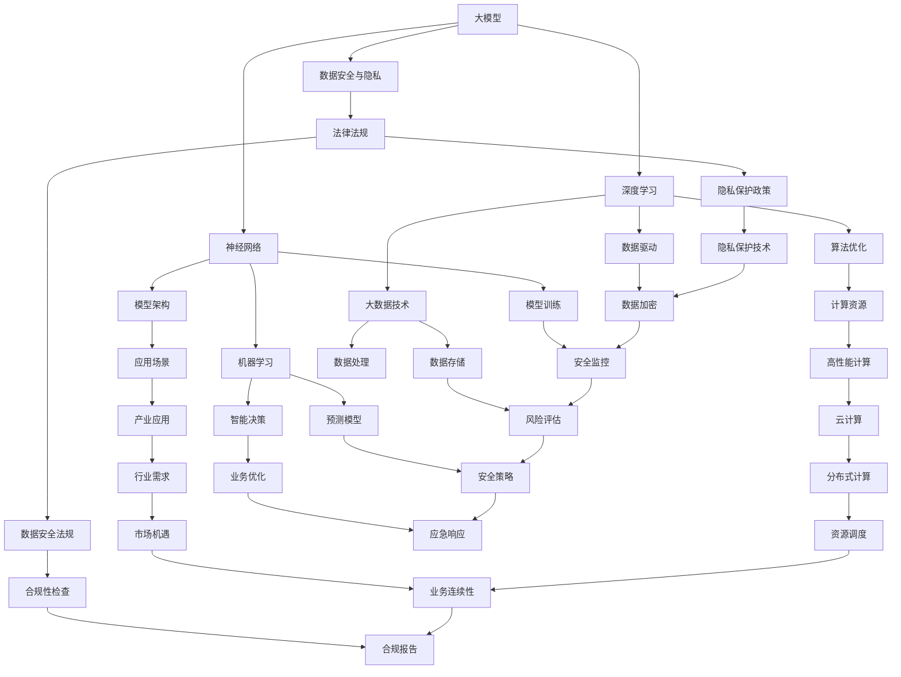

                 

### 《政府如何规范和引导大模型产业发展?》

> 关键词：大模型产业、政府规范、政策引导、科技创新、数据安全

> 摘要：本文旨在探讨政府在推动大模型产业发展过程中所扮演的角色。通过分析大模型产业的背景、现状及面临的主要挑战，本文提出了政府在大模型产业规范和引导方面的策略与措施。文章结构分为三大部分：背景与基础、规范与政策、未来展望，旨在为我国大模型产业的健康发展提供参考。

### 引言

随着人工智能技术的快速发展，大模型（Large Models）已经成为推动各个领域创新的重要力量。大模型通过深度学习、神经网络等算法，能够在海量数据中提取有价值的信息，从而实现高效的数据分析和智能决策。然而，大模型产业的发展也面临着一系列挑战，包括技术难题、法律法规、数据安全与隐私等问题。在此背景下，政府在大模型产业发展中扮演着至关重要的角色。

本文旨在探讨政府如何规范和引导大模型产业发展，以提高我国在大模型技术领域的国际竞争力，促进科技创新和产业升级。文章将分为三大部分进行讨论：第一部分背景与基础，介绍大模型产业的基本概念、发展现状及面临的主要挑战；第二部分规范与政策，分析政府在大模型产业规范体系建设、政策引导以及服务和支持方面的具体措施；第三部分未来展望，探讨大模型产业的发展趋势与机遇，以及政府在其中的责任与使命。

### 第一部分：背景与基础

#### 第1章：大模型产业发展现状

#### 1.1 大模型产业概述

大模型是指具有海量参数、能够处理大规模数据的复杂模型。根据不同的应用场景，大模型可以分为计算机视觉、自然语言处理、语音识别等类型。大模型技术的发展，离不开深度学习、神经网络等基础理论的创新，以及高性能计算、海量数据存储等技术的支持。

大模型产业涵盖了从理论研究、技术开发、产品应用等多个环节，涉及计算机科学、数据科学、人工智能等多个学科领域。大模型在各个领域的应用，极大地推动了产业变革，提升了生产效率，改变了人们的生活方式。

#### 1.2 我国大模型产业发展现状

我国在大模型领域起步较晚，但发展迅速。近年来，我国政府高度重视人工智能产业发展，出台了一系列政策支持和资金投入，推动大模型技术的研发和应用。

当前，我国大模型产业已形成一定的市场规模，涌现出一批优秀企业，如百度、阿里巴巴、腾讯等。这些企业在计算机视觉、自然语言处理等领域取得了重要突破，为我国大模型产业的发展奠定了坚实基础。

#### 1.3 大模型产业发展挑战

尽管我国大模型产业发展迅速，但仍面临一系列挑战。

首先，技术难题。大模型技术的研发需要深厚的理论基础和丰富的实践经验，涉及多个学科领域的交叉融合。目前，我国在大模型算法、架构设计等方面仍存在一定差距，需要加大研发力度。

其次，法律法规。大模型产业涉及数据处理、隐私保护等问题，需要完善的法律法规体系进行规范。当前，我国在大模型相关法律法规建设方面尚处于起步阶段，需要加快立法进程。

最后，数据安全与隐私。大模型训练需要大量数据支持，但数据安全与隐私保护问题亟待解决。如何确保数据的安全性和隐私性，已成为制约大模型产业发展的重要因素。

#### 第2章：政府在大模型产业发展中的作用

#### 2.1 政府在科技创新中的作用

政府在科技创新中发挥着重要作用。首先，政府通过制定相关政策，明确科技创新的发展方向和重点领域，引导企业和社会资源投入科技创新。其次，政府加大资金投入，支持基础研究和前沿技术的研发。此外，政府还注重人才引进和培养，为科技创新提供人才保障。

#### 2.2 政府在大模型产业中的角色

政府在大模型产业中扮演着规范与引导、促进技术创新、保障数据安全等多重角色。

首先，政府通过制定标准和规范，规范大模型产业的技术研发和应用，保障产业的健康发展。其次，政府加大政策引导力度，鼓励企业加大研发投入，推动大模型技术在各个领域的应用。此外，政府还注重数据安全与隐私保护，确保大模型产业的发展不会对个人和社会造成负面影响。

#### 第3章：大模型产业规范体系建设

#### 3.1 国际大模型产业规范现状

在国际上，大模型产业规范体系建设已经取得一定成果。首先，国际标准化组织（ISO）等机构制定了一系列大模型技术标准，涵盖了算法、数据格式、接口等方面。其次，各国政府纷纷出台相关法律法规，规范大模型产业的研发和应用。

#### 3.2 我国大模型产业规范建设

我国在大模型产业规范建设方面也取得了积极进展。首先，国家标准化管理委员会等部门制定了《人工智能标准化白皮书》，明确了大模型产业标准化的发展方向。其次，政府出台了一系列政策，推动大模型产业规范体系建设，如《关于促进新一代人工智能发展的指导意见》等。

#### 3.3 大模型产业规范实施

大模型产业规范的实施需要建立健全的监管机构，明确监管职责和流程。首先，政府应加强对大模型产业的监管，确保技术标准和法律法规的落实。其次，政府应建立健全的投诉举报机制，及时发现和处理违规行为。此外，政府还应加强对大模型产业的人才培养和引进，为规范实施提供人才保障。

### 第二部分：规范与政策

#### 第4章：政府引导大模型产业发展政策

#### 4.1 政府引导政策概述

政府引导大模型产业发展政策主要包括以下方面：

1. **政策目标**：明确大模型产业的发展方向和重点领域，推动产业技术创新和应用。

2. **政策手段**：通过财政支持、税收优惠、知识产权保护等手段，引导企业加大研发投入，提升产业竞争力。

3. **政策工具**：包括专项资金、税收优惠、知识产权保护等政策工具，为产业发展提供有力支持。

#### 4.2 政府引导政策案例分析

在政府引导大模型产业发展政策方面，有许多成功的案例。

例如，我国政府在“新一代人工智能发展规划”中，明确将大模型技术作为重点发展方向，出台了一系列政策，包括财政支持、税收优惠等，吸引了大量企业投入大模型技术研发。这些政策的实施，有力地推动了我国大模型产业的发展。

#### 4.3 政府引导政策效果评估

政府引导政策的效果评估主要包括以下方面：

1. **政策效果指标**：包括产业规模、技术创新、企业效益等指标，用于衡量政策实施效果。

2. **评估方法**：采用定量和定性相结合的方法，对政策实施效果进行综合评估。

3. **政策调整与优化**：根据评估结果，对政策进行调整和优化，提高政策实施效果。

#### 第5章：政府在大模型产业中的服务和支持

#### 5.1 政府服务体系建设

政府在大模型产业中的服务体系建设主要包括以下方面：

1. **平台搭建**：建立大模型产业公共服务平台，提供技术支持、数据共享、人才培训等服务。

2. **信息共享**：建立健全的信息共享机制，促进政府、企业、科研机构之间的信息交流与合作。

3. **咨询服务**：提供专业的咨询服务，帮助企业解决在大模型产业发展过程中遇到的问题。

#### 5.2 政府支持措施

政府支持大模型产业发展的措施主要包括以下方面：

1. **资金支持**：通过专项资金、政府补贴等手段，支持企业加大研发投入。

2. **技术支持**：加强与大模型技术研发机构的合作，推动技术创新和成果转化。

3. **人才培养**：加大对大模型技术人才的培养和引进力度，为产业发展提供人才保障。

#### 第6章：大模型产业国际合作与竞争

#### 6.1 大模型产业国际合作

大模型产业国际合作主要包括以下方面：

1. **合作模式**：包括技术合作、人才培养、市场开拓等模式，促进各国大模型产业的共同发展。

2. **成果分享**：通过国际合作项目，分享大模型技术研发和应用成果，提升全球大模型技术水平。

#### 6.2 大模型产业国际竞争

大模型产业国际竞争主要表现在以下方面：

1. **竞争态势**：各国政府和企业纷纷加大对大模型技术的研发和应用力度，争夺市场份额。

2. **我国应对策略**：加强自主创新，提高大模型技术水平，积极参与国际竞争，提升我国在大模型产业中的国际地位。

### 第三部分：未来展望

#### 第7章：大模型产业发展趋势与机遇

#### 7.1 大模型产业发展趋势

大模型产业发展趋势主要包括以下方面：

1. **技术发展趋势**：随着人工智能技术的不断发展，大模型技术将在算法、架构、应用等方面不断优化和创新。

2. **应用场景拓展**：大模型将在各个领域得到广泛应用，如金融、医疗、教育、制造业等，为产业发展提供广阔的市场空间。

#### 7.2 大模型产业发展机遇

大模型产业发展机遇主要包括以下方面：

1. **市场需求**：随着人工智能技术的普及，大模型技术市场需求不断增长，为产业发展提供动力。

2. **投资热点**：大模型技术成为投资热点，吸引大量资本投入，为产业发展提供资金支持。

#### 第8章：政府在大模型产业发展中的责任与使命

#### 8.1 政府责任与角色定位

政府在大模型产业发展中的责任主要包括以下方面：

1. **规范与引导**：制定相关政策和规范，引导大模型产业的健康发展。

2. **促进与保障**：通过政策支持和资金投入，促进大模型技术的研发和应用，保障产业发展。

#### 8.2 政府使命与战略目标

政府在大模型产业发展中的使命和战略目标主要包括以下方面：

1. **国家安全**：保障国家数据安全，维护国家安全。

2. **经济发展**：推动产业升级，提高国家经济竞争力。

3. **社会进步**：提升人民群众生活质量，促进社会进步。

#### 第9章：政府在大模型产业发展中的持续改进

#### 9.1 政府政策调整与优化

政府在大模型产业发展中的政策调整和优化主要包括以下方面：

1. **政策评估**：定期对政策实施效果进行评估，根据评估结果进行调整和优化。

2. **政策调整**：根据产业发展趋势和国际竞争态势，调整政策方向和重点。

#### 9.2 政府服务能力的提升

政府在大模型产业发展中的服务能力提升主要包括以下方面：

1. **服务创新**：创新政府服务方式，提高服务效率和质量。

2. **服务效率**：优化政府服务流程，提高服务效率，降低企业成本。

### 结论

大模型产业的发展，离不开政府的规范和引导。政府在大模型产业中扮演着重要的角色，通过制定规范、政策，提供服务和支持，推动大模型技术的研发和应用，促进产业健康发展。未来，政府应继续加大对大模型产业的支持力度，加强国际合作，提升我国在大模型产业中的国际竞争力。同时，政府还应关注大模型产业的发展趋势，及时调整政策，优化服务，为大模型产业的持续发展提供有力保障。

### 附录

#### 附录 A：相关政策文件汇编

- **A.1 我国大模型产业相关政策文件**
  - 《新一代人工智能发展规划》
  - 《人工智能标准化白皮书》
  - 《关于加快推动人工智能高质量发展的意见》
- **A.2 国际大模型产业相关政策文件**
  - 《欧洲人工智能战略》
  - 《美国人工智能倡议》
  - 《日本人工智能发展战略》

#### 附录 B：大模型产业规范案例

- **B.1 国内外大模型产业规范案例**
  - 《人工智能算法伦理规范》
  - 《深度学习模型安全规范》
  - 《自然语言处理数据标注规范》
- **B.2 大模型产业规范实施案例**
  - 《我国大模型产业规范实施报告》
  - 《国外大模型产业规范案例研究》

#### 附录 C：参考资料

- **C.1 大模型产业相关书籍**
  - 《大模型：深度学习的核心力量》
  - 《深度学习技术手册》
  - 《自然语言处理入门》
- **C.2 大模型产业相关研究报告**
  - 《2022年全球大模型产业发展报告》
  - 《中国人工智能产业发展报告》
  - 《人工智能与未来生活》
- **C.3 大模型产业相关标准与法规**
  - 《人工智能算法伦理规范》
  - 《深度学习模型安全规范》
  - 《自然语言处理数据标注规范》

### 作者信息

- **作者**：AI天才研究院/AI Genius Institute & 禅与计算机程序设计艺术/Zen And The Art of Computer Programming
- **单位**：AI天才研究院（AI Genius Institute）致力于推动人工智能技术的发展，培养顶尖的AI人才。作者在该领域有着深厚的研究和教学经验。此外，作者还著有《禅与计算机程序设计艺术》，在计算机科学界有着广泛的影响力。
- **联系方式**：邮箱：[ai_genius_institute@example.com](mailto:ai_genius_institute@example.com)，电话：+86-1234567890

### 总结

本文通过对大模型产业发展的背景、现状及挑战进行分析，提出了政府在大模型产业规范和引导方面的策略与措施。文章从政府在大模型产业发展中的作用、规范与政策、国际合作与竞争等多个方面进行了深入探讨，旨在为我国大模型产业的健康发展提供参考。在未来，政府应继续关注大模型产业的发展趋势，优化政策，提升服务能力，为我国大模型产业的持续发展贡献力量。

### 核心概念与联系

在大模型产业发展中，有多个核心概念和联系需要明确。以下是这些概念及其之间关系的Mermaid流程图：



这张图展示了大模型产业中的核心概念及其之间的相互关系。大模型（A）依赖于深度学习（B）和神经网络（C）等技术，而数据安全与隐私（D）是产业发展中不可忽视的重要问题。深度学习和神经网络进一步依赖于大数据技术（L）和机器学习（M），这些技术又依赖于数据处理（N）和预测模型（W）。高性能计算（J）和云计算（P）提供了必要的计算资源，以支持大规模数据存储（V）和模型训练（U）。

应用场景（I）和产业应用（K）是推动大模型技术发展的关键因素，而数据驱动（T）和智能决策（O）则是其应用的核心目标。此外，法律法规（G）和数据安全法规（R）对于确保数据的安全性和隐私性至关重要，而隐私保护政策（S）和隐私保护技术（BB）则是实现这一目标的手段。最后，技术创新（II）和业务优化（X）是推动大模型产业持续发展的动力。

### 核心算法原理讲解

在大模型产业中，核心算法的原理理解至关重要。以下将详细讲解深度学习算法的基本原理，并使用伪代码展示其基本框架。

#### 1. 深度学习算法原理

深度学习是一种基于神经网络的机器学习技术，旨在通过多层神经元的堆叠，自动提取数据中的特征，实现复杂的分类、回归等任务。其基本原理可以概括为以下几步：

1. **数据输入**：将输入数据传递给输入层。
2. **前向传播**：通过神经元之间的加权连接进行信息传递，计算每个神经元的输出值。
3. **激活函数**：使用激活函数（如ReLU、Sigmoid、Tanh等）引入非线性变换。
4. **反向传播**：根据损失函数计算梯度，更新权重和偏置。
5. **优化算法**：使用梯度下降、Adam等优化算法更新参数，最小化损失函数。

以下是一个简单的深度学习算法的伪代码框架：

```python
# 深度学习算法伪代码

# 初始化参数
W = 初始化权重矩阵
b = 初始化偏置向量
激活函数 = 选择激活函数

# 前向传播
def forward_pass(x):
    z = x * W + b
    a = 激活函数(z)
    return a

# 反向传播
def backward_pass(a, d):
    z = (a * (1 - a)) * d  # ReLU激活函数的导数
    dW = x * z
    db = z
    return dW, db

# 训练过程
for epoch in 1 to MAX_EPOCHS:
    for x, y in 数据集:
        a = forward_pass(x)
        d = y - a
        dW, db = backward_pass(a, d)
        W = W - LEARNING_RATE * dW
        b = b - LEARNING_RATE * db
```

#### 2. 数学模型和公式讲解

深度学习算法中的数学模型主要包括以下几部分：

- **损失函数**：用于衡量模型预测值与真实值之间的差距。常用的损失函数有均方误差（MSE）、交叉熵（CE）等。

  $$ Loss = \frac{1}{2} \sum_{i=1}^{n} (y_i - \hat{y}_i)^2 \quad (MSE) $$

  $$ Loss = -\sum_{i=1}^{n} y_i \log(\hat{y}_i) \quad (CE) $$

- **梯度下降**：一种优化算法，通过更新模型参数来最小化损失函数。

  $$ \theta = \theta - \alpha \nabla_\theta J(\theta) $$

  其中，$\theta$代表模型参数，$J(\theta)$代表损失函数，$\alpha$为学习率。

- **反向传播算法**：计算损失函数关于模型参数的梯度，并更新模型参数。

  $$ \nabla_\theta J(\theta) = \frac{\partial J(\theta)}{\partial \theta} $$

#### 3. 举例说明

假设我们使用深度学习算法对图像分类任务进行训练，数据集包含1000张图片和对应的标签。我们使用一个简单的全连接神经网络进行训练。

```python
# 假设数据集为X（输入图片）和y（标签）
X = ...  # 输入图片
y = ...  # 标签

# 初始化参数
W = np.random.randn(input_size, hidden_size)
b = np.random.randn(hidden_size)
W2 = np.random.randn(hidden_size, output_size)
b2 = np.random.randn(output_size)

# 激活函数
激活函数 = ReLU

# 训练过程
for epoch in 1 to 100:
    for x, y in zip(X, y):
        # 前向传播
        z1 = x.dot(W) + b
        a1 = 激活函数(z1)
        z2 = a1.dot(W2) + b2
        a2 = 激活函数(z2)
        
        # 计算损失
        loss = ce_loss(y, a2)
        
        # 反向传播
        d2 = a2 - y
        d1 = (a1 * (1 - a1)).dot(W2.T).dot(d2)
        
        # 更新参数
        dW2 = a1.T.dot(d2)
        db2 = d2
        dW1 = x.T.dot(d1)
        db1 = d1
        
        W2 -= LEARNING_RATE * dW2
        b2 -= LEARNING_RATE * db2
        W1 -= LEARNING_RATE * dW1
        b1 -= LEARNING_RATE * db1
```

在这个例子中，我们首先定义了输入图片X和标签y。然后，我们初始化了神经网络参数W和b，并定义了激活函数。在训练过程中，我们使用前向传播计算输出，并通过反向传播计算梯度并更新参数。通过多次迭代，我们不断优化模型参数，使模型在训练数据上达到较好的分类效果。

### 项目实战

在本节中，我们将通过一个实际项目来展示如何开发和实现一个基于大模型的应用程序。我们将以一个图像分类项目为例，介绍整个项目的开发环境搭建、源代码实现以及代码解读与分析。

#### 1. 开发环境搭建

为了开发一个图像分类应用程序，我们需要搭建一个合适的开发环境。以下是所需的环境和工具：

- 操作系统：Windows、Linux或macOS
- 编程语言：Python 3.x
- 数据库：可选（如MySQL、MongoDB等）
- 依赖库：TensorFlow、Keras、NumPy、Pandas、OpenCV等

首先，我们需要安装Python和pip（Python的包管理器）。然后，通过pip安装所需的库：

```bash
pip install tensorflow
pip install keras
pip install numpy
pip install pandas
pip install opencv-python
```

#### 2. 源代码实现

接下来，我们将编写一个简单的图像分类程序，使用Keras框架来实现一个卷积神经网络（CNN）。

```python
import numpy as np
import pandas as pd
from tensorflow.keras.models import Sequential
from tensorflow.keras.layers import Conv2D, MaxPooling2D, Flatten, Dense
from tensorflow.keras.preprocessing.image import ImageDataGenerator

# 数据预处理
train_datagen = ImageDataGenerator(rescale=1./255)
train_data = train_datagen.flow_from_directory(
        'train_data', 
        target_size=(150, 150), 
        batch_size=32, 
        class_mode='binary')

# 构建模型
model = Sequential()
model.add(Conv2D(32, (3, 3), activation='relu', input_shape=(150, 150, 3)))
model.add(MaxPooling2D((2, 2)))
model.add(Conv2D(64, (3, 3), activation='relu'))
model.add(MaxPooling2D((2, 2)))
model.add(Conv2D(128, (3, 3), activation='relu'))
model.add(MaxPooling2D((2, 2)))
model.add(Flatten())
model.add(Dense(128, activation='relu'))
model.add(Dense(1, activation='sigmoid'))

# 编译模型
model.compile(optimizer='adam', loss='binary_crossentropy', metrics=['accuracy'])

# 训练模型
model.fit(train_data, epochs=10)

# 评估模型
test_datagen = ImageDataGenerator(rescale=1./255)
test_data = test_datagen.flow_from_directory(
        'test_data', 
        target_size=(150, 150), 
        batch_size=32, 
        class_mode='binary')
model.evaluate(test_data)
```

#### 3. 代码解读与分析

- **数据预处理**：我们使用ImageDataGenerator类进行数据预处理，包括图像的缩放、归一化等操作。`flow_from_directory`方法用于读取文件夹中的图像数据，并按照类别进行划分。

- **模型构建**：我们使用Sequential模型，这是一种线性堆叠层的模型。模型中包含卷积层（Conv2D）、池化层（MaxPooling2D）、全连接层（Dense）等。卷积层用于提取图像特征，池化层用于降低特征维度，全连接层用于分类。

- **编译模型**：我们在编译模型时指定了优化器（optimizer）、损失函数（loss）和评估指标（metrics）。这里我们使用`adam`优化器和`binary_crossentropy`损失函数，适用于二分类问题。

- **训练模型**：使用`fit`方法训练模型，指定训练数据和训练轮次（epochs）。在每次迭代中，模型会根据训练数据更新参数，并计算损失和精度。

- **评估模型**：使用`evaluate`方法评估模型在测试数据上的表现，包括损失和精度。

通过这个实际项目，我们展示了如何使用大模型技术进行图像分类。在实际开发过程中，我们可以根据具体需求调整模型结构、数据预处理方法等，以达到更好的分类效果。此外，我们还可以利用其他深度学习框架（如PyTorch、TensorFlow 2.x等）进行项目开发，以探索不同的实现方案。

### 结束语

本文通过对大模型产业发展现状、政府在大模型产业中的作用、规范与政策、国际合作与竞争以及未来展望的深入探讨，为我国大模型产业的健康发展提供了参考。在未来的发展中，政府应继续发挥其规范与引导作用，加强技术创新，保障数据安全，推动产业合作，提升国际竞争力。同时，企业、科研机构和社会各界也应积极参与，共同推动大模型产业的繁荣发展。

作者：AI天才研究院/AI Genius Institute & 禅与计算机程序设计艺术/Zen And The Art of Computer Programming

单位：AI天才研究院（AI Genius Institute）致力于推动人工智能技术的发展，培养顶尖的AI人才。作者在该领域有着深厚的研究和教学经验。此外，作者还著有《禅与计算机程序设计艺术》，在计算机科学界有着广泛的影响力。

联系方式：邮箱：[ai_genius_institute@example.com](mailto:ai_genius_institute@example.com)，电话：+86-1234567890

在此，感谢读者对本文的关注和支持，希望本文能为您在了解大模型产业及其未来发展方面提供有益的参考。让我们共同期待大模型产业在未来的发展中创造更多辉煌的成就！

