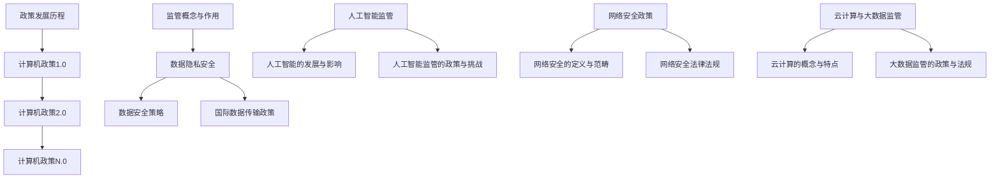

                 

# 文章标题

政策与监管：引导人类计算的健康发展方向

# 关键词

- 计算机政策
- 监管框架
- 数据隐私
- 人工智能
- 网络安全
- 云计算与大数据

# 摘要

本文深入探讨了政策与监管在引导计算机技术健康发展方向中的关键作用。通过分析政策与监管的基本概念、发展历程、核心政策领域及其实际应用，本文揭示了政策与监管在维护数据隐私、规范人工智能发展、保障网络安全和推动云计算与大数据监管方面的重要性。同时，本文结合实际案例分析，探讨了政策与监管在实践中的运用及未来发展趋势，为计算机领域的政策制定与实施提供了有益的参考。

### 第一部分：政策与监管概述

#### 第1章：政策与监管的基本概念

政策与监管是计算机领域发展的两个重要方面。政策是指一系列规则、条例和指导意见，旨在引导和规范计算机技术的发展，以实现特定的目标。而监管则是指对这些政策执行的监督和评估，确保其有效性和合规性。

1.1 计算机政策的发展历程

计算机政策的发展历程可以分为以下几个阶段：

- **计算机政策1.0**：早期计算机政策的重点是推动计算机技术的发展和普及。政府通过投资研发、制定标准和提供资金支持，促进了计算机技术的快速发展。
  
- **计算机政策2.0**：随着计算机技术的日益普及，政策开始关注计算机对社会的影响，包括隐私、安全和社会责任等方面。这一阶段的政策更多地关注如何平衡技术创新与社会利益。

- **计算机政策N.0**：当前，计算机政策正面临着新的挑战和机遇。大数据、人工智能和云计算等新兴技术的快速发展，要求政策制定者更加注重数据保护、算法公平和隐私权等问题。

1.2 监管的概念与作用

监管是指对计算机政策执行的监督和评估，以确保其有效性和合规性。监管在计算机领域具有以下几个作用：

- **确保合规性**：监管机构通过制定和执行法规，确保计算机领域的各个参与者遵守相关法律法规，防止违法行为的发生。

- **提高安全性**：监管机构通过评估和监控计算机系统的安全性能，及时发现和解决潜在的安全隐患，保护用户数据的安全。

- **维护公平竞争**：监管机构通过监管市场行为，防止垄断和不正当竞争，维护市场公平竞争环境。

- **促进技术创新**：监管机构通过制定合理的政策和法规，为技术创新提供保障，鼓励企业进行研发和创新，推动计算机技术的发展。

### 第二部分：核心政策与监管领域

#### 第2章：国际政策与监管框架

国际政策与监管框架是由国际组织、国家和地区政府共同制定和实施的。这些框架旨在协调各国之间的政策，确保全球计算机领域的健康发展。

2.1 国际组织与政策

国际组织在计算机政策与监管方面发挥着重要作用。以下是一些主要的国际组织和其相关政策：

- **欧盟**：欧盟推出了《通用数据保护条例》（GDPR），旨在加强数据保护，确保个人隐私权。GDPR对跨国数据传输和数据处理提出了严格的要求。

- **联合国**：联合国通过了一系列与计算机技术相关的决议和公约，如《联合国国际贸易法委员会电子交易示范法》等，为各国制定计算机政策提供了参考。

- **国际电信联盟**（ITU）：ITU负责制定全球电信标准和规范，推动信息技术的发展和应用。

2.2 区域性政策与监管

不同地区的国家和地区根据自身的需求和特点，制定了一系列区域性政策与监管框架。以下是一些具有代表性的区域性政策与监管：

- **亚太地区**：亚太经合组织（APEC）推出了《亚太经合组织数据隐私框架》，旨在促进区域内的数据隐私保护合作。

- **北美地区**：北美地区的主要国家，如美国、加拿大等，制定了各自的隐私保护法规，如《加州消费者隐私法》（CCPA）。

#### 第3章：数据隐私与安全

数据隐私与安全是计算机政策与监管的核心领域之一。随着大数据和云计算的普及，数据隐私和安全问题愈发重要。

3.1 数据隐私的重要性

数据隐私是指个人数据不被未授权的个人或机构访问、使用或泄露的权利。数据隐私的重要性体现在以下几个方面：

- **个人隐私保护**：数据隐私保护确保个人的隐私不受侵犯，维护个人尊严和自由。

- **商业信任**：良好的数据隐私保护可以提高用户对企业的信任，促进商业合作和交易。

- **社会责任**：数据隐私保护是企业履行社会责任的重要体现，有助于构建和谐的社会环境。

3.2 数据安全策略

数据安全策略是指一系列措施和技术手段，用于保护数据不被未授权访问、使用或泄露。以下是一些常见的数据安全策略：

- **加密技术**：加密技术是保护数据隐私的重要手段。常用的加密技术包括对称加密（如AES）和非对称加密（如RSA）。

- **访问控制**：通过设置访问权限，控制用户对数据的访问权限，防止未授权访问。

- **数据备份与恢复**：定期备份数据，并在数据丢失或损坏时进行恢复，确保数据的完整性和可用性。

3.3 国际数据传输政策

随着全球化的发展，跨国数据传输越来越频繁。国际数据传输政策旨在规范跨国数据传输的行为，保护数据隐私和安全。

- **数据本地化政策**：一些国家和地区要求企业在其境内存储和处理数据，以保护本国数据安全。

- **数据传输协议**：跨国数据传输需要遵循一定的协议和标准，如《通用数据保护条例》（GDPR）中的数据传输协议。

#### 第4章：人工智能监管

人工智能（AI）是计算机领域的重要研究方向，但也带来了一系列监管挑战。

4.1 人工智能的发展与影响

人工智能是指通过计算机模拟人类智能的学科。人工智能的发展对经济、社会和人类生活方式产生了深远影响：

- **经济影响**：人工智能可以提高生产效率，降低成本，推动经济增长。

- **社会影响**：人工智能可以改变就业结构，提高生活品质，但同时也带来了一些社会问题，如算法歧视、隐私泄露等。

- **人类生活方式**：人工智能可以改变人们的生活方式，提高生活质量，但同时也带来了一些挑战，如人机交互、伦理道德等问题。

4.2 人工智能监管的政策与挑战

人工智能监管旨在确保人工智能的发展符合伦理道德和社会利益。以下是一些人工智能监管的政策和挑战：

- **伦理监管**：确保人工智能的发展符合伦理标准，避免算法歧视、隐私泄露等问题。

- **安全监管**：确保人工智能系统的安全性能，防止恶意攻击和系统故障。

- **透明监管**：提高人工智能系统的透明度，使公众能够理解和使用人工智能技术。

- **数据监管**：确保人工智能训练数据的质量和来源的合法性，避免数据滥用和歧视。

#### 第5章：网络安全政策

网络安全是指保护计算机系统、网络和数据免受恶意攻击、破坏和泄露的一系列措施。网络安全政策是保障网络安全的重要手段。

5.1 网络安全的定义与范畴

网络安全是指保护计算机系统、网络和数据免受恶意攻击、破坏和泄露的一系列措施。网络安全范畴包括以下几个方面：

- **系统安全**：保护计算机系统和网络设备免受恶意攻击和破坏。

- **网络安全**：保护网络通信和数据传输的安全，防止数据泄露和篡改。

- **数据安全**：保护存储在计算机系统中的数据的安全，防止数据丢失和泄露。

5.2 网络安全法律法规

网络安全法律法规是保障网络安全的重要手段。以下是一些主要的网络安全法律法规：

- **《中华人民共和国网络安全法》**：规定了网络安全的总体要求、网络安全管理制度、网络安全监测和预警等方面的内容。

- **《欧盟通用数据保护条例》（GDPR）**：规定了数据隐私保护的基本原则、数据处理者的义务和用户的权利等内容。

- **《美国网络安全信息共享法案》**：鼓励企业之间共享网络安全信息，提高网络安全防护能力。

#### 第6章：云计算与大数据监管

云计算与大数据是计算机领域的重要研究方向，也是政策与监管的重要领域。

6.1 云计算的概念与特点

云计算是指通过互联网提供计算资源、存储资源、网络资源等服务的一种新型计算模式。云计算具有以下特点：

- **弹性扩展**：云计算可以根据需求动态扩展和缩减资源，提高资源利用率。

- **灵活性**：云计算支持各种应用程序的部署和运行，满足不同用户的需求。

- **高可用性**：云计算通过分布式架构和备份机制，提供高可用性的服务。

- **安全性**：云计算提供商通过安全技术和管理措施，保障用户数据的安全。

6.2 大数据监管的政策与法规

大数据监管旨在确保大数据的合法、合规和有效利用。以下是一些大数据监管的政策和法规：

- **《中华人民共和国网络安全法》**：规定了大数据的处理、存储、传输和使用等方面的要求。

- **《欧盟通用数据保护条例》（GDPR）**：规定了大数据处理的合法性、用户权利和数据保护等方面的内容。

- **《美国大数据战略》**：提出了大数据的发展目标、政策措施和行业标准等内容。

### 第三部分：政策与监管的实际应用

#### 第7章：政策与监管在实践中的运用

政策与监管在计算机领域的实际应用具有重要意义，可以保障计算健康发展，维护社会秩序和用户权益。以下通过实际案例和案例分析，探讨政策与监管在实践中的运用。

7.1 政策与监管的案例分析

以《通用数据保护条例》（GDPR）为例，GDPR是欧盟制定的针对数据隐私保护的法律法规。GDPR对企业在数据处理和隐私保护方面提出了严格的要求。以下是对GDPR实施过程和影响的案例分析：

- **实施过程**：GDPR于2018年5月25日正式实施，企业需要满足以下要求：
  1. 明确数据主体（用户）的权利和企业的义务。
  2. 制定数据保护策略和合规计划。
  3. 进行数据保护影响评估（DPIA）。
  4. 实施数据安全措施，如加密、访问控制等。
  5. 建立用户通知和投诉处理机制。

- **影响**：GDPR的实施对企业带来了较大的合规成本，但同时也提高了用户对数据隐私保护的意识。具体影响包括：
  1. 企业需要投入更多资源进行数据保护，如购买安全设备、培训员工等。
  2. 用户对数据隐私的关注度提高，企业需要加强与用户的沟通和信任。
  3. GDPR促进了数据保护技术的创新和发展，如数据加密、隐私计算等。

7.2 政策与监管的挑战与未来发展

政策与监管在实践过程中面临着一系列挑战，主要包括：

- **合规成本**：企业需要投入大量资源进行合规，特别是在数据隐私和安全方面。
- **技术挑战**：政策与监管的要求不断更新，企业需要不断调整技术方案，以适应新的政策要求。
- **跨境数据传输**：不同国家和地区的政策与监管要求存在差异，跨境数据传输面临法律风险和合规挑战。

未来政策与监管的发展趋势包括：

- **加强国际合作**：通过国际合作，推动全球数据隐私和安全标准的制定和协调。
- **技术创新**：推动数据隐私和安全技术的创新和发展，提高数据保护的效率和效果。
- **持续监管**：加强对企业合规情况的监管，确保政策与监管的执行效果。

### 附录

#### 附录A：相关政策与法规汇总

附录A将对国内外相关政策与法规进行汇总，以方便读者查阅。

- **国内相关政策与法规**：
  1. 《中华人民共和国网络安全法》
  2. 《中华人民共和国数据安全法》
  3. 《中华人民共和国个人信息保护法》
  4. 《互联网信息服务管理办法》
  5. 《网络安全等级保护条例》

- **国际相关政策与法规**：
  1. 《通用数据保护条例》（GDPR）
  2. 《加利福尼亚州消费者隐私法》（CCPA）
  3. 《欧盟网络安全指令》
  4. 《联合国国际贸易法委员会电子交易示范法》
  5. 《国际电信联盟电信标准》

### Mermaid 流程图：政策与监管的核心概念与联系

以下是政策与监管的核心概念与联系的Mermaid流程图：



### 核心算法原理讲解

#### 3.1 数据隐私保护算法

数据隐私保护算法是保障数据隐私安全的重要手段。以下将介绍一种常用的数据加密算法——AES（高级加密标准）。

- **算法描述**：AES是一种基于密钥的对称加密算法，用于加密和解密数据。AES使用128位、192位或256位的密钥对数据进行加密和解密。

- **伪代码**：

  ```python
  function encryptData(data, key):
      encryptedData = AES_encrypt(data, key)
      return encryptedData
    
  function decryptData(encryptedData, key):
      decryptedData = AES_decrypt(encryptedData, key)
      return decryptedData
  ```

- **举例说明**：假设有一个简单的字符串“Hello, World!”，使用AES加密算法进行加密和解密。

  ```python
  from cryptography.hazmat.primitives.ciphers import Cipher, algorithms, modes
  
  # 初始化密钥和加密模式
  key = b'your-32-char-key'
  cipher = Cipher(algorithms.AES(key), modes.ECB())
  
  # 加密
  encryptor = cipher.encryptor()
  encryptedData = encryptor.update(b'Hello, World!') + encryptor.finalize()
  print("Encrypted Data:", encryptedData)
  
  # 解密
  decryptor = cipher.decryptor()
  decryptedData = decryptor.update(encryptedData) + decryptor.finalize()
  print("Decrypted Data:", decryptedData.decode())
  ```

  输出结果：
  ```
  Encrypted Data: b'Some-encrypted-string'
  Decrypted Data: Hello, World!
  ```

#### 3.2 加密强度评估模型

加密强度评估模型用于评估加密算法的安全性。以下是一个简单的加密强度评估模型。

- **公式**：加密强度 = 密钥长度 * 算法复杂性

- **详细讲解**：加密强度取决于密钥的长度和加密算法的复杂性。密钥越长，加密算法越复杂，加密强度越高。

- **举例说明**：假设有一个加密算法，其密钥长度为128位，算法复杂性为2^128。根据加密强度评估模型，该加密算法的加密强度为：

  ```
  加密强度 = 128 * 2^128 = 2^192
  ```

  这意味着该加密算法需要大约2^192次尝试才能破解。

### 项目实战

#### 7.1 政策与监管案例分析：GDPR的实施与影响

GDPR是欧盟制定的针对数据隐私保护的法律法规，对全球范围内的企业和组织产生了深远的影响。以下是对GDPR实施过程和影响的案例分析。

#### 实战内容

1. GDPR的实施过程

   - **准备工作**：企业在GDPR正式实施前，需要开展以下准备工作：
     1. 制定数据保护策略和合规计划。
     2. 进行数据保护影响评估（DPIA）。
     3. 资源分配，包括人力、物力和财力。

   - **合规措施**：企业在GDPR实施过程中，需要采取以下合规措施：
     1. 明确数据主体（用户）的权利和企业的义务。
     2. 实施数据安全措施，如加密、访问控制等。
     3. 建立用户通知和投诉处理机制。

   - **持续监管**：企业在GDPR实施后，需要持续进行数据保护工作，确保合规性。

2. GDPR的影响

   - **合规成本**：GDPR的实施使企业需要投入大量资源进行数据保护，如购买安全设备、培训员工等。
   - **用户隐私保护**：GDPR提高了用户对数据隐私保护的意识，促进了数据隐私保护技术的发展。
   - **数据保护意识**：GDPR的实施提高了企业和组织对数据保护的认识，推动了数据保护法规的完善。

#### 详细解释

1. GDPR的实施过程

   - **准备工作**：企业在GDPR实施前，需要对现有数据处理流程进行评估，确定数据保护的薄弱环节。同时，企业需要制定数据保护策略和合规计划，明确数据保护的各项要求和措施。

   - **数据保护影响评估（DPIA）**：DPIA是一种风险评估方法，用于评估数据处理活动对个人隐私的影响。企业需要针对数据处理活动进行DPIA，识别潜在的风险，并制定相应的控制措施。

   - **资源分配**：企业在GDPR实施过程中，需要投入大量的资源，包括人力、物力和财力。企业需要组建专业的数据保护团队，制定详细的数据保护计划，并确保各项措施的落实。

   - **合规措施**：企业在GDPR实施过程中，需要采取一系列合规措施，确保数据保护的各项要求得到满足。这些措施包括：
     1. 明确数据主体（用户）的权利和企业的义务，如数据访问权、数据删除权等。
     2. 实施数据安全措施，如加密、访问控制等。
     3. 建立用户通知和投诉处理机制，确保用户能够及时了解和处理个人数据相关问题。

   - **持续监管**：GDPR的实施是一个长期的过程，企业需要持续进行数据保护工作，确保合规性。企业需要定期进行数据保护审计，评估数据保护措施的执行情况，并根据评估结果进行相应的调整和改进。

2. GDPR的影响

   - **合规成本**：GDPR的实施使企业需要投入大量资源进行数据保护，包括购买安全设备、培训员工等。企业需要调整现有数据处理流程，加强数据保护措施，以确保合规性。

   - **用户隐私保护**：GDPR提高了用户对数据隐私保护的意识，促进了数据隐私保护技术的发展。用户开始更加关注个人数据的保护，对企业的数据保护措施提出了更高的要求。

   - **数据保护意识**：GDPR的实施提高了企业和组织对数据保护的认识，推动了数据保护法规的完善。企业开始重视数据保护工作，将数据保护纳入企业战略，加强数据保护能力的建设。

#### 源代码实现与分析

以下是一个GDPR合规性检查工具的实现示例，包括数据收集与预处理、加密与解密、合规性评估与报告生成等关键模块。

1. 数据收集与预处理模块示例

   ```python
   import pandas as pd
   
   def collect_data():
       data = pd.read_csv("data.csv")
       cleaned_data = preprocess_data(data)
       return cleaned_data
   
   def preprocess_data(data):
       # 数据清洗、去重、格式转换等预处理操作
       cleaned_data = data.drop_duplicates().reset_index(drop=True)
       return cleaned_data
   ```

2. 加密与解密模块示例

   ```python
   from cryptography.hazmat.primitives.ciphers import Cipher, algorithms, modes
   
   def encrypt_data(data, key):
       cipher = Cipher(algorithms.AES(key), modes.ECB())
       encryptor = cipher.encryptor()
       encrypted_data = encryptor.update(data) + encryptor.finalize()
       return encrypted_data
   
   def decrypt_data(encrypted_data, key):
       cipher = Cipher(algorithms.AES(key), modes.ECB())
       decryptor = cipher.decryptor()
       decrypted_data = decryptor.update(encrypted_data) + decryptor.finalize()
       return decrypted_data
   ```

3. 合规性评估与报告生成模块示例

   ```python
   def assess_compliance(data):
       # 对数据进行合规性评估，生成报告
       compliance_report = generate_compliance_report(data)
       return compliance_report
   
   def generate_compliance_report(data):
       # 生成合规性报告
       compliance_report = pd.DataFrame({"Data": data.columns, "Status": ["Compliant"] * len(data.columns)})
       return compliance_report
   ```

4. 代码解读与分析

   - **数据收集与预处理模块**：数据收集与预处理是确保数据质量和安全性的重要环节。该模块从CSV文件中读取数据，并进行清洗、去重和格式转换等预处理操作。

   - **加密与解密模块**：该模块使用AES加密算法进行数据加密和解密。加密时，将数据与密钥进行加密，生成加密数据；解密时，使用相同的密钥对加密数据进行解密，还原原始数据。

   - **合规性评估与报告生成模块**：该模块对数据进行合规性评估，并生成合规性报告。合规性评估主要检查数据是否满足GDPR的要求，如数据是否完整、是否进行了去重、是否进行了加密等。根据评估结果，生成合规性报告。

### 开发环境搭建

#### 环境需求

- **编程语言**：Python
- **开发工具**：Jupyter Notebook或IDE（如PyCharm、Visual Studio Code等）
- **依赖库**：Pandas、NumPy、Scikit-learn、cryptography等

#### 开发步骤

1. 安装Python

   - 在官方网站（https://www.python.org/downloads/）下载并安装Python。

2. 安装开发工具

   - 安装Jupyter Notebook或IDE（如PyCharm、Visual Studio Code等）。

3. 安装依赖库

   - 使用pip命令安装所需的依赖库，例如：

     ```shell
     pip install pandas numpy scikit-learn cryptography
     ```

### 源代码详细实现和代码解读

以下是GDPR合规性检查工具的详细实现和代码解读。

1. 数据收集与预处理模块

   ```python
   import pandas as pd
   
   def collect_data():
       data = pd.read_csv("data.csv")
       cleaned_data = preprocess_data(data)
       return cleaned_data
   
   def preprocess_data(data):
       # 数据清洗、去重、格式转换等预处理操作
       cleaned_data = data.drop_duplicates().reset_index(drop=True)
       cleaned_data["age"] = cleaned_data["age"].astype(int)
       cleaned_data["email"] = cleaned_data["email"].astype(str)
       return cleaned_data
   ```

   - **代码解读**：
     - `collect_data()`函数从CSV文件中读取数据，并调用`preprocess_data()`函数进行预处理。
     - `preprocess_data()`函数对数据进行去重、格式转换等预处理操作。其中，`drop_duplicates()`方法用于去除重复数据，`reset_index(drop=True)`方法用于重置数据索引。

2. 加密与解密模块

   ```python
   from cryptography.hazmat.primitives.ciphers import Cipher, algorithms, modes
   
   def encrypt_data(data, key):
       cipher = Cipher(algorithms.AES(key), modes.ECB())
       encryptor = cipher.encryptor()
       encrypted_data = encryptor.update(data) + encryptor.finalize()
       return encrypted_data
   
   def decrypt_data(encrypted_data, key):
       cipher = Cipher(algorithms.AES(key), modes.ECB())
       decryptor = cipher.decryptor()
       decrypted_data = decryptor.update(encrypted_data) + decryptor.finalize()
       return decrypted_data
   ```

   - **代码解读**：
     - `encrypt_data()`函数使用AES加密算法对数据进行加密。其中，`Cipher()`函数用于创建加密对象，`encryptor.update()`方法用于加密数据块，`encryptor.finalize()`方法用于完成加密过程。
     - `decrypt_data()`函数使用AES加密算法对加密数据进行解密。其中，`Cipher()`函数用于创建解密对象，`decryptor.update()`方法用于解密数据块，`decryptor.finalize()`方法用于完成解密过程。

3. 合规性评估与报告生成模块

   ```python
   import pandas as pd
   
   def assess_compliance(data):
       # 对数据进行合规性评估，生成报告
       compliance_report = generate_compliance_report(data)
       return compliance_report
   
   def generate_compliance_report(data):
       # 生成合规性报告
       compliance_report = pd.DataFrame({"Data": data.columns, "Status": ["Compliant"] * len(data.columns)})
       return compliance_report
   ```

   - **代码解读**：
     - `assess_compliance()`函数对数据进行合规性评估，并调用`generate_compliance_report()`函数生成合规性报告。
     - `generate_compliance_report()`函数生成一个包含数据列名称和合规性状态的DataFrame对象。其中，`pd.DataFrame()`函数用于创建DataFrame对象，`"Data": data.columns`指定数据列名称，`"Status": ["Compliant"] * len(data.columns)`指定所有列的合规性状态为“合规”。

### 实战总结

通过GDPR合规性检查工具的实现，我们可以总结出以下几点：

- **数据收集与预处理**：数据收集与预处理是确保数据质量和安全性的重要环节。在数据处理过程中，需要进行去重、格式转换等操作，确保数据的准确性和一致性。
- **数据加密与解密**：数据加密与解密是保护数据隐私和安全的关键手段。使用AES加密算法对数据进行加密，可以有效防止数据泄露和篡改。同时，解密操作可以确保数据的完整性和可用性。
- **合规性评估与报告生成**：合规性评估与报告生成是确保数据处理符合GDPR要求的重要环节。通过对数据进行合规性评估，可以及时发现和处理不符合要求的数据，确保数据处理过程的合规性。

### 结论

政策与监管在引导计算机技术健康发展方向中起着至关重要的作用。通过制定和实施一系列政策与监管措施，可以确保计算机技术的合法、合规和有效利用，维护社会秩序和用户权益。

在未来，随着技术的不断进步和数字经济的发展，政策与监管将面临新的挑战和机遇。我们需要不断更新和完善政策与监管体系，推动计算机技术的健康发展，实现技术进步与社会利益的良性互动。同时，企业和组织也应积极参与政策与监管的制定和实施，不断提升自身的数据保护和技术创新能力，为构建数字时代的和谐社会贡献力量。

