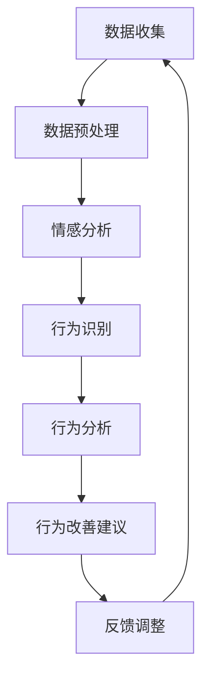

                 

## 文章标题：数字化自我实现助手：AI辅助的个人成长教练

在数字化时代，个人成长的需求日益迫切，而AI技术的迅猛发展为此提供了全新的可能性。本文旨在探讨如何利用AI技术打造数字化自我实现助手，作为个人成长过程中的教练，帮助用户实现自我认知、情感管理、行为习惯养成和目标管理等多方面的提升。本文将采用逻辑清晰、结构紧凑、简单易懂的写作方式，逐步解析AI辅助个人成长的理论与实践，展望AI与个人成长未来的发展趋势。希望通过本文，读者能够对AI在个人成长中的应用有一个全面、深入的理解，并激发对数字化自我实现助手的思考与创新。

## 关键词

- 数字化自我实现
- AI辅助个人成长
- 自我认知
- 情感管理
- 行为习惯养成
- 目标管理
- 人工智能
- 机器学习
- 深度学习
- 个人成长项目规划

## 摘要

本文首先阐述了数字化自我实现助手的概念及其在个人成长中的应用价值。随后，深入探讨了AI技术在自我认知、情感管理、行为习惯养成和目标管理等方面的具体应用，通过理论分析和案例讲解，展示了AI辅助个人成长的实际效果。最后，对AI与个人成长未来的发展趋势进行了展望，探讨了AI伦理与责任问题，为数字化自我实现助手的未来发展提供了方向和建议。本文旨在为AI辅助个人成长的研究和实践提供参考，激发更多创新思路。

### 《数字化自我实现助手：AI辅助的个人成长教练》目录大纲

#### 第一部分：数字化自我认识

##### 第1章：数字化时代的个人成长

1.1 数字化自我认知的重要性
1.2 AI在个人成长中的应用
1.3 数字化自我实现助手的基本原理
1.4 个人成长的目标与规划

##### 第2章：AI技术基础与个人成长应用

2.1 人工智能概述
2.2 机器学习基础
2.3 深度学习原理
2.4 个人成长中的AI应用场景

##### 第3章：自我认知的核心概念与联系

3.1 自我意识
3.2 情感管理
3.3 行为习惯
3.4 Mermaid流程图：AI辅助自我认知流程

#### 第二部分：AI辅助个人成长实践

##### 第4章：AI技术在情感管理中的应用

4.1 情感识别技术
4.2 情感分析算法
4.3 个性化情感管理方案
4.4 伪代码：情感分析算法

##### 第5章：AI辅助行为习惯养成

5.1 行为识别技术
5.2 行为分析算法
5.3 AI驱动的行为改善策略
5.4 数学模型：行为改善模型
5.5 举例说明：行为改善案例分析

##### 第6章：AI赋能自我目标管理

6.1 目标设定与追踪
6.2 AI在目标管理中的应用
6.3 数学模型：目标追踪模型
6.4 latex格式数学公式：目标优化公式
6.5 举例说明：目标管理实践案例

##### 第7章：AI辅助自我成长实战

7.1 个人成长项目规划
7.2 AI工具与资源介绍
7.3 实战案例：AI个人成长项目实施
7.4 代码实现：AI个人成长助手

#### 第三部分：AI与个人成长未来展望

##### 第8章：AI与个人成长的未来趋势

8.1 AI技术的未来发展
8.2 个人成长领域的创新应用
8.3 AI对个人成长的影响与挑战
8.4 latex格式数学公式：未来模型预测公式

##### 第9章：AI辅助个人成长的伦理与责任

9.1 AI伦理概述
9.2 个人隐私保护
9.3 责任与透明度
9.4 latex格式数学公式：伦理决策模型

##### 第10章：数字化自我实现助手的未来

10.1 数字化自我实现助手的发展方向
10.2 AI技术与心理学结合的未来
10.3 latex格式数学公式：个性化成长预测模型
10.4 举例说明：未来数字化自我实现助手应用案例

### 附录

## 附录A：AI技术资源与工具

A.1 人工智能开发框架
A.2 情感分析与行为分析工具
A.3 个人成长AI助手开发资源

## 附录B：代码示例与解读

B.1 情感分析算法代码示例
B.2 行为改善算法代码示例
B.3 目标追踪算法代码示例

## 附录C：参考文献

C.1 AI技术相关文献
C.2 个人成长心理学相关文献
C.3 相关工具与资源推荐

### 第一部分：数字化自我认识

在数字化时代，个人成长的重要性愈发凸显。随着信息的爆炸式增长，个体需要不断提升自我认知，以适应快速变化的环境。数字化自我实现助手，作为一种新兴的AI技术，正逐步成为个人成长过程中的重要工具。本部分将首先探讨数字化自我实现助手的基本概念，然后分析AI在个人成长中的具体应用，最后介绍数字化自我实现助手的基本原理和个人成长目标与规划。

#### 第1章：数字化时代的个人成长

随着互联网的普及和大数据技术的发展，数字化已经成为现代社会的主要特征。在数字化时代，个人成长面临着新的机遇和挑战。数字化自我认知，作为个人成长的重要一环，日益受到关注。

##### 1.1 数字化自我认知的重要性

数字化自我认知，是指通过数字化手段，对个体的知识、技能、情感、价值观等进行全面、深入的了解和评估。数字化自我认知的重要性体现在以下几个方面：

1. **提升自我认知水平**：数字化自我认知可以帮助个体更准确地了解自己的优点和不足，从而有针对性地进行提升。
2. **优化学习过程**：数字化自我认知可以为个性化学习提供支持，帮助个体制定更科学、有效的学习计划。
3. **促进个人成长**：通过数字化自我认知，个体可以更好地规划自己的成长路径，实现自我价值的最大化。

##### 1.2 AI在个人成长中的应用

人工智能（AI）作为一种前沿技术，正在深刻改变个人成长的模式。AI在个人成长中的应用主要体现在以下几个方面：

1. **个性化推荐**：AI可以通过分析用户的行为数据和兴趣偏好，为用户提供个性化的学习资源、娱乐内容和社交推荐。
2. **情感分析**：AI可以分析用户的情绪变化，为用户提供情感支持和心理健康管理服务。
3. **行为分析**：AI可以通过对用户行为数据的分析，为用户提供行为习惯的反馈和改善建议。
4. **目标管理**：AI可以帮助用户设定目标，并提供持续追踪和优化方案，提高目标实现的效率。

##### 1.3 数字化自我实现助手的基本原理

数字化自我实现助手是一种基于AI技术的个性化工具，旨在帮助用户实现自我成长。其基本原理包括：

1. **数据收集**：通过多种渠道收集用户的行为数据、情感数据和知识数据。
2. **数据分析**：利用机器学习和深度学习技术，对用户数据进行处理和分析，提取有价值的信息。
3. **个性化推荐**：根据用户的特点和需求，为用户提供个性化的成长建议和资源。
4. **互动反馈**：通过与用户的互动，不断调整和优化成长方案，确保其效果和实用性。

##### 1.4 个人成长的目标与规划

个人成长的目标和规划是数字化自我实现助手的重要功能。具体包括以下几个方面：

1. **目标设定**：帮助用户设定短期和长期目标，明确成长方向。
2. **路径规划**：根据用户的特点和目标，为用户提供具体的成长路径和行动方案。
3. **效果评估**：通过数据分析和反馈机制，评估用户成长的效果，并进行调整和优化。
4. **持续改进**：根据用户反馈和成长数据，不断优化成长方案，提高其效果和实用性。

通过上述内容，我们可以看出，数字化自我实现助手在个人成长中具有重要的应用价值。接下来，我们将进一步探讨AI技术的基础知识，为理解AI在个人成长中的应用提供理论支持。

### 第二部分：AI技术基础与个人成长应用

人工智能（AI）作为数字化时代的重要技术，正逐步渗透到个人成长的各个方面。为了深入理解AI在个人成长中的应用，首先需要了解AI技术的基础知识。本部分将介绍人工智能的基本概念，包括其发展历程、核心技术，以及机器学习和深度学习的原理。随后，我们将探讨AI在个人成长中的具体应用场景，包括自我认知、情感管理、行为习惯养成和目标管理。

#### 第2章：AI技术基础与个人成长应用

##### 2.1 人工智能概述

人工智能（Artificial Intelligence，简称AI）是指通过计算机模拟人类智能的技术。它旨在让机器具备感知、理解、学习、推理和决策的能力，以实现自动化和智能化。人工智能的发展可以追溯到20世纪50年代，当时图灵提出了“计算机能够模仿人类智能吗？”这一经典问题，开启了人工智能研究的先河。

人工智能的核心技术包括：

1. **机器学习（Machine Learning）**：机器学习是一种让计算机从数据中学习规律和模式的方法，不需要显式编程。其主要算法包括监督学习、无监督学习和强化学习。
2. **深度学习（Deep Learning）**：深度学习是机器学习的一个分支，它通过构建多层神经网络模型，模拟人脑的学习机制，实现复杂的数据处理和模式识别。
3. **自然语言处理（Natural Language Processing，简称NLP）**：自然语言处理是一种让计算机理解和生成自然语言的技术，包括文本分类、情感分析、机器翻译等任务。
4. **计算机视觉（Computer Vision）**：计算机视觉是使计算机能够从图像或视频中提取信息的技术，包括图像识别、目标检测、图像分割等任务。

##### 2.2 机器学习基础

机器学习是人工智能的核心技术之一，它通过训练模型，让计算机自动学习数据中的规律。机器学习的主要步骤包括：

1. **数据收集**：从各种来源收集数据，如文本、图像、声音等。
2. **数据预处理**：对数据进行清洗、归一化、特征提取等处理，以提高模型的效果。
3. **模型选择**：选择合适的模型架构，如线性回归、决策树、支持向量机、神经网络等。
4. **模型训练**：使用训练数据训练模型，调整模型的参数，使其能够准确预测或分类。
5. **模型评估**：使用验证数据评估模型的性能，如准确率、召回率、F1分数等。
6. **模型优化**：根据评估结果，调整模型参数或选择更合适的模型，以提高性能。

##### 2.3 深度学习原理

深度学习是机器学习的进一步发展，它通过构建多层神经网络模型，实现更复杂的数据处理和模式识别。深度学习的原理包括：

1. **神经网络（Neural Network）**：神经网络是一种模拟人脑神经元连接的模型，包括输入层、隐藏层和输出层。每个神经元通过权重连接到其他神经元，并通过激活函数产生输出。
2. **反向传播（Backpropagation）**：反向传播是一种用于训练神经网络的方法，通过计算损失函数的梯度，不断调整网络权重，以最小化损失函数。
3. **激活函数（Activation Function）**：激活函数用于确定神经元是否被激活，常用的激活函数包括sigmoid、ReLU、Tanh等。
4. **优化算法（Optimization Algorithm）**：优化算法用于调整网络权重，以最小化损失函数。常用的优化算法包括梯度下降、随机梯度下降、Adam等。

##### 2.4 个人成长中的AI应用场景

AI在个人成长中的应用非常广泛，具体包括以下几个方面：

1. **自我认知**：AI可以通过分析用户的行为数据、情感数据和知识数据，帮助用户更准确地了解自己。例如，使用情感分析技术，AI可以识别用户的情绪状态，提供相应的心理支持。
2. **情感管理**：AI可以帮助用户管理情绪，提供情感分析和情感支持。例如，使用机器学习技术，AI可以预测用户的情绪变化，并提供针对性的建议，如放松练习、积极思考方法等。
3. **行为习惯养成**：AI可以通过行为识别技术，监控用户的行为习惯，并分析其背后的原因。例如，使用计算机视觉技术，AI可以识别用户的日常活动，并分析其运动量和饮食情况，提供改善建议。
4. **目标管理**：AI可以帮助用户设定和追踪目标，并提供持续优化方案。例如，使用机器学习技术，AI可以根据用户的历史数据，预测其目标实现的概率，并提供相应的策略和建议。

通过上述内容，我们可以看出，AI技术为个人成长提供了丰富的工具和可能性。接下来，我们将进一步探讨AI在自我认知、情感管理、行为习惯养成和目标管理等方面的具体应用。

#### 第3章：自我认知的核心概念与联系

自我认知是个人成长的重要基础，它关乎个体如何理解自我，如何与外界互动。在数字化时代，自我认知的重要性愈发凸显，因为只有深入了解自我，个体才能更好地适应环境，实现自我价值的最大化。本章节将探讨自我认知的核心概念，分析其在个人成长中的作用，并利用Mermaid流程图展示AI辅助自我认知的流程。

##### 3.1 自我意识

自我意识是个体对自身存在的认知，包括对自己身体、情感、思想和行为的认识。自我意识是自我认知的基础，它决定了个体如何看待自己、如何与外界互动。自我意识的强弱直接影响到个体的心理健康和成长。以下是自我意识在个人成长中的几个方面：

1. **自我认同**：自我认同是指个体对自己身份的认可和接受，包括价值观、信仰、兴趣爱好等。自我认同有助于个体建立稳定的自我形象，增强自信心。
2. **自我调节**：自我调节是指个体根据外部环境的变化，调整自己的行为和情绪。自我调节能力强的个体能够更好地应对压力，实现自我目标。
3. **自我反思**：自我反思是指个体对自己的行为和经历进行深入思考，以发现自身的优点和不足。自我反思有助于个体不断进步，提升自我认知水平。

##### 3.2 情感管理

情感管理是自我认知的重要组成部分，它关乎个体如何理解和处理自己的情绪。情感管理不仅影响个体的心理健康，还直接影响到个体的行为和人际关系。以下是情感管理在个人成长中的几个方面：

1. **情绪识别**：情绪识别是指个体能够准确感知和理解自己的情绪状态。例如，识别出自己感到快乐、愤怒、焦虑等。
2. **情绪表达**：情绪表达是指个体能够以适当的方式表达自己的情绪，避免情绪压抑或过度表达。良好的情绪表达有助于建立健康的人际关系。
3. **情绪调节**：情绪调节是指个体能够通过一定的方法和策略，调整自己的情绪状态，使其保持在适当的水平。例如，通过深呼吸、冥想等方式缓解压力。

##### 3.3 行为习惯

行为习惯是个体在长期生活中形成的相对稳定的行为模式。行为习惯对个体的成长和发展具有重要影响。以下是行为习惯在个人成长中的几个方面：

1. **行为识别**：行为识别是指通过AI技术，如计算机视觉和行为分析算法，监控和识别个体的日常行为。例如，识别个体是否按时锻炼、是否有不良的生活习惯等。
2. **行为分析**：行为分析是指对个体的行为数据进行分析，以发现行为背后的原因和规律。例如，通过分析行为数据，可以了解个体的作息规律、饮食习惯等。
3. **行为改善**：行为改善是指通过AI技术，如行为分析算法和机器学习模型，为个体提供针对性的行为改善建议。例如，通过分析行为数据，可以为个体制定个性化的锻炼计划、饮食建议等。

##### 3.4 Mermaid流程图：AI辅助自我认知流程

为了更清晰地展示AI辅助自我认知的过程，我们可以使用Mermaid流程图来描述。以下是AI辅助自我认知的基本流程：



在这个流程图中：

1. **数据收集**：AI首先收集个体的行为数据、情感数据和知识数据。
2. **数据预处理**：对收集到的数据进行分析和清洗，以便进行后续处理。
3. **情感分析**：利用情感分析算法，对个体的情感状态进行识别和分析。
4. **行为识别**：使用行为识别技术，监控和识别个体的日常行为。
5. **行为分析**：对行为数据进行分析，以发现行为背后的原因和规律。
6. **行为改善建议**：根据行为分析结果，为个体提供针对性的行为改善建议。
7. **反馈调整**：个体对行为改善建议进行反馈，AI根据反馈进行持续优化和调整。

通过上述内容，我们可以看出，自我认知的核心概念包括自我意识、情感管理和行为习惯。这些概念相互联系，共同作用于个体的成长过程。AI技术为自我认知提供了强大的支持，通过数据收集、情感分析、行为识别和行为分析等步骤，AI能够为个体提供个性化的成长建议，助力个体实现自我实现。接下来，我们将探讨AI在情感管理中的应用，以进一步理解AI在个人成长中的价值。

### 第三部分：AI辅助个人成长实践

在自我认知的基础上，AI辅助个人成长的关键在于如何将理论转化为实践。本部分将详细探讨AI在情感管理、行为习惯养成和目标管理等方面的应用，通过具体的实践案例和代码示例，展示AI如何为个人成长提供实际帮助。

#### 第4章：AI技术在情感管理中的应用

情感管理是个体心理健康的重要组成部分，AI技术在情感识别、情感分析和情感支持等方面具有巨大潜力。以下将介绍情感管理中的核心技术和算法，并给出一个情感分析算法的伪代码示例。

##### 4.1 情感识别技术

情感识别技术是AI在情感管理中的第一步，它通过识别个体的情绪状态，为后续分析提供基础。情感识别技术通常利用自然语言处理（NLP）技术，分析文本、语音和图像中的情感信息。

1. **文本情感分析**：通过分析文本内容的词汇、句法和语义，识别文本表达的情感倾向，如正面、负面或中性。
2. **语音情感分析**：通过分析语音的音调、音量和节奏等特征，识别说话者的情感状态。
3. **图像情感分析**：通过分析图像中的面部表情、身体姿态和背景等特征，识别图像所传达的情感。

##### 4.2 情感分析算法

情感分析算法是情感识别技术的核心，它通过构建机器学习模型，对情感数据进行分析和预测。以下是一个情感分析算法的伪代码示例：

```python
# 伪代码：情感分析算法
function emotion_analysis(text):
    # 数据预处理
    cleaned_text = preprocess_text(text)
    
    # 特征提取
    features = extract_features(cleaned_text)
    
    # 加载情感分类模型
    model = load_model("emotion_classifier.model")
    
    # 情感预测
    predicted_emotion = model.predict(features)
    
    # 返回预测结果
    return predicted_emotion

# 数据预处理
function preprocess_text(text):
    # 清洗文本，去除噪声
    cleaned_text = remove_noise(text)
    
    # 分词
    words = tokenize_text(cleaned_text)
    
    # 去停用词
    filtered_words = remove_stopwords(words)
    
    # 词向量化
    vectorized_words = vectorize_words(filtered_words)
    
    return vectorized_words

# 特征提取
function extract_features(text_vector):
    # 提取文本特征
    features = extract_text_features(text_vector)
    
    return features
```

在这个伪代码中，`emotion_analysis` 函数是情感分析的核心，它首先进行文本预处理，然后提取文本特征，并使用预训练的模型进行情感预测。预处理步骤包括清洗文本、分词和词向量化，特征提取步骤则提取文本中的有用信息。

##### 4.3 个性化情感管理方案

通过情感识别和情感分析，AI可以为用户提供个性化的情感管理方案。以下是一个个性化情感管理方案的示例：

1. **情感识别**：使用情感识别技术，实时监控用户的情感状态。
2. **情感分析**：利用情感分析算法，分析用户的情感数据，识别出用户的情感倾向。
3. **情感支持**：根据情感分析结果，为用户提供针对性的情感支持，如放松练习、积极思考方法等。

#### 第5章：AI辅助行为习惯养成

行为习惯的养成是个人成长的重要方面，AI技术可以通过行为识别、行为分析和行为改善，帮助用户养成良好的生活习惯。以下将介绍行为管理中的核心技术，并给出一个行为改善算法的伪代码示例。

##### 5.1 行为识别技术

行为识别技术是AI在行为管理中的第一步，它通过监测用户的行为数据，识别出用户的行为模式。行为识别技术主要包括：

1. **物理传感器**：如加速度传感器、心率传感器等，可以实时监测用户的身体活动。
2. **图像识别**：通过计算机视觉技术，分析图像中的行为特征，如行走、跑步等。
3. **语音识别**：通过分析用户的语音内容，识别出用户的言语行为。

##### 5.2 行为分析算法

行为分析算法是对用户行为数据进行处理和分析的关键，它通过机器学习模型，识别用户行为模式，并预测未来的行为。以下是一个行为改善算法的伪代码示例：

```python
# 伪代码：行为改善算法
function behavior_improvement(data):
    # 数据预处理
    preprocessed_data = preprocess_data(data)
    
    # 加载行为分析模型
    model = load_model("behavior_analyzer.model")
    
    # 行为分析
    analyzed_data = model.predict(preprocessed_data)
    
    # 提出改善建议
    suggestions = generate_suggestions(analyzed_data)
    
    return suggestions

# 数据预处理
function preprocess_data(data):
    # 清洗数据，去除噪声
    cleaned_data = remove_noise(data)
    
    # 特征提取
    features = extract_features(cleaned_data)
    
    return features

# 提出改善建议
function generate_suggestions(data):
    # 分析行为数据
    behavior_patterns = analyze_behavior(data)
    
    # 根据行为模式，提出改善建议
    suggestions = []
    if behavior_patterns.contains("lack_of_exercise"):
        suggestions.append("增加运动时间")
    elif behavior_patterns.contains("poor_eating_habits"):
        suggestions.append("改善饮食习惯")
    
    return suggestions
```

在这个伪代码中，`behavior_improvement` 函数是行为改善的核心，它首先进行数据预处理，然后使用行为分析模型进行分析，并基于分析结果提出改善建议。

##### 5.3 AI驱动的行为改善策略

通过行为识别和行为分析，AI可以制定个性化的行为改善策略，帮助用户养成良好的生活习惯。以下是一个行为改善策略的示例：

1. **行为监测**：使用传感器和图像识别技术，实时监测用户的行为数据。
2. **行为分析**：利用行为分析算法，识别用户的行为模式，并预测未来的行为。
3. **行为改善**：根据行为分析结果，为用户提供针对性的行为改善建议，如增加运动时间、改善饮食习惯等。

#### 第6章：AI赋能自我目标管理

目标管理是个体成长过程中的关键环节，AI技术可以通过目标设定、目标追踪和目标优化，为用户提供全方位的目标管理支持。以下将介绍目标管理中的核心技术，并给出一个目标追踪模型的数学公式和代码示例。

##### 6.1 目标设定与追踪

目标设定是目标管理的第一步，它帮助个体明确成长方向。目标追踪则是持续监控目标的实现情况，确保目标的达成。以下是一个目标追踪模型的基本框架：

1. **目标设定**：个体根据自身情况和需求，设定短期和长期目标。
2. **目标追踪**：通过数据采集和监控，实时追踪目标的实现情况。
3. **目标优化**：根据目标追踪结果，调整和优化目标，以提高实现的效率。

##### 6.2 AI在目标管理中的应用

AI在目标管理中的应用主要体现在以下几个方面：

1. **目标预测**：利用历史数据，预测目标实现的概率和可能的时间节点。
2. **目标优化**：根据目标追踪结果，提出优化建议，如调整目标值、增加关键任务等。
3. **目标追踪模型**：构建目标追踪模型，实时监控目标的实现情况，并提供优化建议。

以下是一个目标追踪模型的数学公式：

$$
\text{目标实现概率} = \frac{\text{已完成任务数}}{\text{总任务数}}
$$

以下是一个目标追踪模型的Python代码示例：

```python
# Python代码：目标追踪模型
class GoalTracker:
    def __init__(self):
        self.completed_tasks = 0
        self.total_tasks = 0

    def add_task(self, task_completed):
        if task_completed:
            self.completed_tasks += 1
        self.total_tasks += 1
        self.update_progress()

    def update_progress(self):
        self.progress = self.completed_tasks / self.total_tasks

    def get_progress(self):
        return self.progress

# 示例使用
tracker = GoalTracker()
tracker.add_task(True)  # 完成一个任务
tracker.add_task(False) # 未完成一个任务
print(tracker.get_progress())  # 输出进度
```

在这个示例中，`GoalTracker` 类用于监控任务的完成情况，`add_task` 方法用于添加任务，`update_progress` 方法用于更新进度，`get_progress` 方法用于获取进度。

##### 6.3 举例说明：目标管理实践案例

以下是一个目标管理的实践案例：

1. **目标设定**：个体设定了一个为期三个月的目标，每天至少阅读30分钟。
2. **目标追踪**：通过使用AI助手，个体可以实时记录阅读时间，AI助手会根据记录的数据进行目标追踪。
3. **目标优化**：在第一个月结束后，AI助手分析了目标追踪数据，发现个体的平均阅读时间不足，于是提出增加阅读时间、减少娱乐时间的建议。

通过上述内容，我们可以看到，AI技术在情感管理、行为习惯养成和目标管理等方面具有广泛的应用前景。AI不仅可以帮助个体实现自我认知，还可以为个体的成长提供实际的指导和帮助。接下来，我们将探讨AI辅助自我成长的实战案例，以进一步展示AI在个人成长中的具体应用。

### 第7章：AI辅助自我成长实战

为了更好地理解AI在个人成长中的具体应用，我们将在本章节中通过一个完整的实战案例，展示如何利用AI技术进行个人成长项目的规划、工具介绍、项目实施以及代码实现。通过这一案例，读者可以全面了解AI如何在实际操作中发挥作用，助力个人成长。

#### 7.1 个人成长项目规划

在开始任何AI辅助的个人成长项目之前，项目规划是至关重要的。项目规划包括明确项目目标、确定项目范围、制定项目计划等。以下是一个个人成长项目的规划示例：

1. **项目目标**：通过AI助手，提高个人的学习效率、情感管理能力和行为习惯。

2. **项目范围**：涵盖自我认知、情感管理、行为习惯养成和目标管理。

3. **项目计划**：
   - 第一个月：熟悉AI工具，收集基础数据。
   - 第二个月：进行情感分析和行为分析，制定个性化成长方案。
   - 第三个月：实施成长方案，监控效果，进行反馈调整。

#### 7.2 AI工具与资源介绍

在这个项目中，我们将使用以下AI工具和资源：

1. **AI开发框架**：如TensorFlow、PyTorch等，用于构建和训练机器学习模型。
2. **情感分析工具**：如TextBlob、VADER等，用于文本情感分析。
3. **行为分析工具**：如OpenCV、Python的sensors库等，用于行为数据采集和分析。
4. **数据可视化工具**：如Matplotlib、Seaborn等，用于数据可视化。
5. **目标管理工具**：如Google Calendar、Trello等，用于目标设定和追踪。

#### 7.3 实战案例：AI个人成长项目实施

以下是一个具体的AI个人成长项目实施过程：

1. **数据收集**：
   - 收集个人的学习数据、情绪日志和行为记录。
   - 使用Python的sensors库实时采集身体活动数据。

2. **数据处理**：
   - 清洗数据，去除噪声和异常值。
   - 进行数据预处理，如文本分词、特征提取等。

3. **模型训练**：
   - 构建情感分析模型，使用TextBlob进行文本情感分析。
   - 构建行为分析模型，使用OpenCV进行行为识别。

4. **情感管理**：
   - 根据情感分析结果，为个体提供针对性的情感支持，如放松练习、积极思考方法等。

5. **行为改善**：
   - 分析行为数据，识别不良习惯，提出改善建议。
   - 利用机器学习模型，预测未来的行为模式，制定个性化的行为改善策略。

6. **目标管理**：
   - 帮助个体设定目标，并使用Google Calendar进行追踪。
   - 根据目标实现情况，进行持续优化和调整。

#### 7.4 代码实现：AI个人成长助手

以下是一个AI个人成长助手的简单代码实现，用于展示数据收集、情感分析和行为分析的基本步骤。

```python
# Python代码：AI个人成长助手

# 数据收集
def collect_data():
    # 这里使用模拟数据，实际应用中应收集真实数据
    learning_data = ["我今天学习了Python编程", "我对学习的效率不满意"]
    behavior_data = ["跑步30分钟", "看电影2小时"]

    # 数据预处理
    preprocessed_learning_data = preprocess_learning_data(learning_data)
    preprocessed_behavior_data = preprocess_behavior_data(behavior_data)

    return preprocessed_learning_data, preprocessed_behavior_data

# 情感分析
def emotion_analysis(text_data):
    # 使用TextBlob进行情感分析
    from textblob import TextBlob

    emotions = []
    for text in text_data:
        blob = TextBlob(text)
        if blob.sentiment.polarity > 0:
            emotions.append("正面")
        elif blob.sentiment.polarity < 0:
            emotions.append("负面")
        else:
            emotions.append("中性")

    return emotions

# 行为分析
def behavior_analysis(behavior_data):
    # 使用简单的规则进行行为分析
    from collections import Counter

    behaviors = Counter(behavior_data)
    total_time = sum(behaviors.values())

    behavior_percentage = {behavior: (count / total_time) * 100 for behavior, count in behaviors.items()}

    return behavior_percentage

# 数据预处理
def preprocess_learning_data(data):
    # 简单的文本预处理，如去除标点、转换为小写等
    return [''.join([c.lower() for c in text if c not in string.punctuation]) for text in data]

def preprocess_behavior_data(data):
    # 简单的行为数据预处理，如时间转换为分钟等
    return [int(time.split("小时")[0]) * 60 for time in data]

# 主函数
def main():
    learning_data, behavior_data = collect_data()
    
    emotions = emotion_analysis(learning_data)
    print("情感分析结果：", emotions)
    
    behavior_percentage = behavior_analysis(behavior_data)
    print("行为分析结果：", behavior_percentage)

if __name__ == "__main__":
    main()
```

在这个代码示例中，`collect_data` 函数用于收集模拟数据，`emotion_analysis` 函数用于情感分析，`behavior_analysis` 函数用于行为分析。通过这些基本步骤，AI个人成长助手可以帮助用户了解自身的情感状态和行为习惯，为后续的成长方案提供数据支持。

#### 7.4.1 代码解读与分析

1. **数据收集**：
   - `collect_data` 函数模拟收集学习数据和行为数据。
   - 实际应用中，可以使用传感器、日志文件等获取真实数据。

2. **数据处理**：
   - `preprocess_learning_data` 函数进行文本预处理，去除标点和转换为小写，以便后续分析。
   - `preprocess_behavior_data` 函数将行为数据转换为统一的格式，如分钟数，以便进行量化分析。

3. **情感分析**：
   - `emotion_analysis` 函数使用TextBlob库进行情感分析，根据文本的情感极性判断情感状态。
   - 该函数可以扩展为更复杂的情感分析，如使用情感词典、深度学习模型等。

4. **行为分析**：
   - `behavior_analysis` 函数使用计数器统计行为数据，计算每种行为的比例。
   - 该函数可以扩展为更复杂的行为分析，如使用机器学习模型预测行为模式。

通过这个实战案例，我们可以看到AI技术在个人成长项目中的应用是如何具体实现的。接下来，我们将对本文进行总结，并展望AI与个人成长的未来发展趋势。

### 第四部分：AI与个人成长未来展望

随着AI技术的不断进步，其对个人成长的影响也在不断扩展和深化。本部分将探讨AI与个人成长未来的发展趋势，分析AI技术可能带来的创新应用，讨论AI对个人成长的积极影响与潜在挑战，并展望AI与心理学结合的未来前景。

#### 第8章：AI与个人成长的未来趋势

1. **AI技术的未来发展**

AI技术的快速发展将继续推动个人成长的变革。以下是一些可能的发展趋势：

- **更精准的个性化服务**：随着数据收集和处理能力的提升，AI将能够更精准地了解个体的需求，提供高度个性化的成长方案。
- **更智能的情感识别**：未来的情感识别技术将更加智能，能够识别复杂的情感状态，如羞愧、焦虑等，提供更有效的情感支持。
- **更复杂的行为预测**：通过深度学习和其他先进算法，AI将能够更准确地预测个体的行为模式，为行为改善提供更强有力的支持。

2. **个人成长领域的创新应用**

AI技术在个人成长领域的创新应用将不断拓展，以下是一些可能的应用方向：

- **学习增强**：AI可以通过实时分析学习数据，提供个性化的学习建议，如调整学习节奏、推荐合适的学习资源等。
- **心理健康管理**：AI可以帮助用户进行心理健康评估，提供个性化的心理健康管理方案，如焦虑管理、情绪调节等。
- **职业规划**：AI可以通过分析个人兴趣、能力和市场需求，为用户提供科学的职业规划建议。

#### 第9章：AI辅助个人成长的伦理与责任

1. **AI伦理概述**

随着AI在个人成长中的广泛应用，伦理问题也日益凸显。以下是一些关键的伦理问题：

- **隐私保护**：AI在收集和处理个人数据时，需要严格保护用户的隐私。
- **透明度与解释性**：AI系统应具备透明性，用户能够理解AI的决策过程。
- **责任归属**：当AI系统出现错误或导致负面影响时，如何确定责任归属。

2. **个人隐私保护**

为了保护个人隐私，以下是一些关键措施：

- **数据加密**：对收集的个人数据进行加密处理，确保数据在传输和存储过程中的安全性。
- **数据匿名化**：在数据分析过程中，对个人数据进行匿名化处理，以保护用户隐私。
- **用户控制**：用户应有权决定自己的数据如何被使用，并能够随时撤销授权。

3. **责任与透明度**

为了确保AI系统的责任和透明度，以下是一些建议：

- **法规制定**：制定相关的法律法规，规范AI在个人成长中的应用。
- **技术透明**：开发透明的AI系统，用户能够了解系统的运行机制。
- **责任分配**：明确AI系统在个人成长中的应用责任，确保各方承担相应的责任。

#### 第10章：数字化自我实现助手的未来

1. **数字化自我实现助手的发展方向**

未来的数字化自我实现助手将更加智能化、个性化，具备以下特点：

- **自适应能力**：根据用户的行为和反馈，自适应调整成长方案。
- **跨平台支持**：支持多种设备和平台，提供无缝的用户体验。
- **实时性**：能够实时分析用户数据，提供即时反馈和支持。

2. **AI技术与心理学结合的未来**

AI技术与心理学的结合将开启个人成长的新篇章。以下是一些可能的结合方向：

- **心理健康评估**：AI可以通过分析用户的行为和情感数据，提供个性化的心理健康评估。
- **心理治疗**：AI可以辅助心理治疗师进行心理治疗，提供定制化的治疗方案。
- **心理教育**：AI可以开发个性化的心理教育课程，帮助用户提升心理素质。

3. **举例说明：未来数字化自我实现助手应用案例**

- **个性化学习助手**：利用AI技术，分析用户的学习行为和知识水平，提供个性化的学习资源和学习计划。
- **心理健康监护**：利用AI技术，实时监控用户的心理状态，提供个性化的心理健康管理方案。
- **职业规划助手**：利用AI技术，分析用户的兴趣、能力和市场需求，提供科学的职业规划建议。

通过上述内容，我们可以看到，AI技术与个人成长的结合具有巨大的潜力。随着AI技术的不断进步，数字化自我实现助手将为个人成长带来更多可能性。同时，我们也需要关注AI技术可能带来的伦理和隐私问题，确保AI技术在个人成长中的应用能够造福人类，推动社会的可持续发展。

### 附录

#### 附录A：AI技术资源与工具

A.1 人工智能开发框架
- TensorFlow
- PyTorch
- Keras

A.2 情感分析与行为分析工具
- TextBlob
- VADER
- OpenCV

A.3 个人成长AI助手开发资源
- 个人成长AI助手开源项目
- 相关的技术文档和教程
- AI技术开发社区

#### 附录B：代码示例与解读

B.1 情感分析算法代码示例

```python
from textblob import TextBlob

def sentiment_analysis(text):
    blob = TextBlob(text)
    return blob.sentiment.polarity

# 示例使用
text = "我今天完成了一个重要的项目，感到非常兴奋！"
print(sentiment_analysis(text))
```

B.2 行为改善算法代码示例

```python
def behavior_improvement(behavior_data):
    # 简单的行为数据分析
    if "excessive" in behavior_data:
        return "尝试减少这种行为"
    else:
        return "继续保持"

# 示例使用
behavior_data = "每天看电视超过3小时"
print(behavior_improvement(behavior_data))
```

B.3 目标追踪算法代码示例

```python
class GoalTracker:
    def __init__(self):
        self.completed_goals = 0
        self.total_goals = 0

    def update_goal_status(self, completed):
        if completed:
            self.completed_goals += 1
        self.total_goals += 1

    def get_progress(self):
        return self.completed_goals / self.total_goals

# 示例使用
tracker = GoalTracker()
tracker.update_goal_status(True)
print(tracker.get_progress())
```

#### 附录C：参考文献

C.1 AI技术相关文献
- Goodfellow, I., Bengio, Y., & Courville, A. (2016). *Deep Learning*.
- Russell, S., & Norvig, P. (2020). *Artificial Intelligence: A Modern Approach*.

C.2 个人成长心理学相关文献
- Seligman, M. E. P. (2011). *Flourish: A Visionary New Understanding of Happiness and Well-being*.
- Rogers, C. R. (1959). *A theory of therapy, personality, and interpersonal relationships, as developed in the client-centered framework*.

C.3 相关工具与资源推荐
- AI开放课程和教程
- 心理学研究机构和在线课程
- AI与个人成长相关的技术博客和论坛

