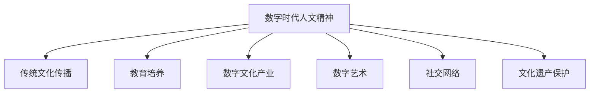

                 

# 文章标题：数字时代的人文精神的传承

> 关键词：数字时代；人文精神；传承；数字文化；技术融合

> 摘要：本文旨在探讨数字时代背景下人文精神的传承问题。通过对数字时代的定义、人文精神的概念及其重要性的分析，本文探讨了数字时代人文精神传承的途径和挑战。文章分为三个部分：第一部分引言，介绍数字时代的人文精神概述；第二部分探讨数字时代人文精神的传承，包括传统文化传播、教育培养、数字文化产业、数字艺术、社交网络和文化遗产保护；第三部分是结论与展望，讨论数字时代人文精神传承的意义、挑战与机遇，并对未来数字时代人文精神传承提出建议。

### 《数字时代的人文精神的传承》目录大纲

#### 第一部分：引言

## 第一部分：引言

### 第1章：数字时代的人文精神概述

#### 1.1 数字时代的定义与影响

#### 1.2 人文精神的概念与内涵

#### 1.3 数字时代人文精神的重要性

#### 1.4 本书目的与结构安排

#### 第二部分：数字时代人文精神的传承

## 第二部分：数字时代人文精神的传承

### 第2章：传统文化在数字时代的传播

#### 2.1 传统文化与数字媒介

#### 2.2 数字平台与传统文化的结合

#### 2.3 传统文化的数字化传播策略

### 第3章：数字时代的教育与人文精神的传承

#### 3.1 数字教育的发展趋势

#### 3.2 教育中的数字人文精神培养

#### 3.3 数字教育平台的人文精神传承实践

### 第4章：数字文化产业的兴起与人文精神的传承

#### 4.1 数字文化产业的定义与特点

#### 4.2 数字文化产业中的人文精神传承

#### 4.3 数字文化产业的案例解析

### 第5章：数字艺术与人文精神的传承

#### 5.1 数字艺术的定义与形式

#### 5.2 数字艺术与人文精神的关系

#### 5.3 数字艺术作品中的人文精神体现

### 第6章：数字时代的社交网络与人文精神的传承

#### 6.1 社交网络的崛起与影响

#### 6.2 社交网络中的人文精神传承

#### 6.3 社交网络人文精神传承的挑战与对策

### 第7章：数字时代的文化遗产保护与人文精神的传承

#### 7.1 数字时代文化遗产保护的现状

#### 7.2 数字时代文化遗产保护的策略与方法

#### 7.3 数字时代文化遗产保护案例解析

#### 第三部分：结论与展望

## 第三部分：结论与展望

### 第8章：数字时代人文精神传承的意义

#### 8.1 数字时代人文精神传承的重要性

#### 8.2 数字时代人文精神传承的挑战与机遇

### 第9章：未来数字时代人文精神传承的展望

#### 9.1 未来数字时代人文精神传承的发展趋势

#### 9.2 未来数字时代人文精神传承的思考

#### 9.3 未来数字时代人文精神传承的建议

#### 附录

## 附录

### 附录 A：数字时代人文精神传承相关资源

#### 附录 B：参考文献

### 图1：数字时代人文精神的 Mermaid 流程图

mermaid
graph TD
A[数字时代人文精神] --> B[传统文化传播]
A --> C[教育培养]
A --> D[数字文化产业]
A --> E[数字艺术]
A --> F[社交网络]
A --> G[文化遗产保护]

### 第一部分：引言

## 第一部分：引言

### 第1章：数字时代的人文精神概述

### 1.1 数字时代的定义与影响

#### 1.1.1 数字时代的定义

数字时代，又称为信息时代，是指以数字技术和信息技术为核心，通过互联网、移动通信、云计算、大数据等技术的广泛应用，实现信息的高速传播、处理和利用的时代。数字时代具有以下几个特征：

1. **信息的高速传播**：数字技术使得信息传播速度大大提高，几乎可以在瞬间传达到全球的每一个角落。
2. **信息的多样化**：数字技术使得信息的获取和呈现形式更加多样化，从文字、图像到音频、视频，各种信息形式都能在数字时代得到充分展现。
3. **信息的互联互通**：数字技术使得不同设备、平台和系统之间能够实现高效的信息交换和互联互通，打破了时间和空间的限制。
4. **智能化**：数字技术不断推动人工智能、机器学习等技术的发展，使得信息和数据处理更加智能化，为人类生活带来了诸多便利。

#### 1.1.2 数字时代的影响

数字时代的到来，对人类社会产生了深远的影响，具体体现在以下几个方面：

1. **经济发展**：数字技术的广泛应用推动了数字经济的发展，改变了传统的商业模式，创造了新的经济增长点。
2. **生活方式**：数字技术深刻改变了人们的生活方式，使信息获取、工作学习、社交娱乐等变得更加便捷和高效。
3. **社会治理**：数字技术为政府提供了新的治理工具，提高了政府管理的效率和透明度。
4. **文化传承**：数字技术为文化传承提供了新的途径和手段，使传统文化得以数字化保存和传播。
5. **环境保护**：数字技术的应用有助于提高资源利用效率，减少环境污染，推动可持续发展。

### 1.2 人文精神的概念与内涵

#### 1.2.1 人文精神的概念

人文精神是指以人为中心，关注人的生存和发展，尊重人的价值，倡导人的自由、平等和尊严的一种文化精神。人文精神是人类文明发展的重要成果，是文化传承的核心内容。

#### 1.2.2 人文精神的内涵

人文精神的内涵非常丰富，主要包括以下几个方面：

1. **人道主义**：关注人的生存和发展，尊重人的基本权利和尊严。
2. **理性思维**：倡导理性思考，反对盲目信仰和迷信。
3. **审美追求**：追求美和真，注重审美体验和文化修养。
4. **社会责任**：强调个人对社会的责任，倡导为社会公共利益服务。
5. **科学精神**：追求真理，强调实证和逻辑推理。

### 1.3 数字时代人文精神的重要性

#### 1.3.1 传承文化传统

数字时代，传统文化面临着被遗忘和忽视的风险。人文精神的传承，有助于保护和传承民族文化，弘扬民族精神。

#### 1.3.2 提升社会文明

人文精神的传承，有助于提升社会文明程度，培养公民的道德素质，推动社会和谐发展。

#### 1.3.3 促进个体成长

人文精神的传承，有助于个体的全面发展，培养个体的道德品质、审美能力和创新能力。

#### 1.3.4 应对技术挑战

在数字时代，人文精神有助于我们应对技术带来的挑战，如信息过载、隐私泄露等，保持理性和平衡的心态。

### 1.4 本书目的与结构安排

#### 1.4.1 本书目的

本书旨在探讨数字时代人文精神的传承问题，分析数字时代人文精神传承的途径和挑战，为未来人文精神的传承提供参考和启示。

#### 1.4.2 本书结构

本书分为三个部分：

1. **第一部分：引言**：介绍数字时代的人文精神概述，包括数字时代的定义与影响，人文精神的概念与内涵，以及数字时代人文精神的重要性。
2. **第二部分：数字时代人文精神的传承**：探讨数字时代人文精神传承的途径和案例，包括传统文化传播、教育培养、数字文化产业、数字艺术、社交网络和文化遗产保护。
3. **第三部分：结论与展望**：总结数字时代人文精神传承的意义、挑战与机遇，并对未来数字时代人文精神传承提出建议。

### 第二部分：数字时代人文精神的传承

## 第二部分：数字时代人文精神的传承

### 第2章：传统文化在数字时代的传播

#### 2.1 传统文化与数字媒介

传统文化与数字媒介的结合，为传统文化的传播提供了新的途径和手段。数字媒介具有传播速度快、范围广、互动性强等特点，使得传统文化得以在更广泛的范围内传播和传承。

#### 2.1.1 数字媒介与传统文化的融合

1. **数字化保存**：通过数字化技术，将传统文化以数字形式保存，如电子文档、音频、视频等，使得传统文化资源得到有效保护和利用。
2. **多媒体呈现**：数字媒介可以通过文字、图像、音频、视频等多种形式，生动地呈现传统文化，增强观众的体验和感受。
3. **互动性传播**：数字媒介具有高度的互动性，观众可以通过点击、评论、分享等方式，参与到传统文化的传播和讨论中，提高传播效果。

#### 2.1.2 数字媒介对传统文化传播的影响

1. **传播速度和范围**：数字媒介使得传统文化的传播速度大大加快，范围也大大扩展，使得更多人能够接触到传统文化。
2. **传播方式多样化**：数字媒介使得传统文化的传播方式更加多样化，可以通过社交媒体、短视频平台、直播等多种方式进行传播。
3. **传播效果提升**：数字媒介的互动性和多媒体呈现方式，使得传统文化传播的效果得到提升，观众可以更加深入地理解和体验传统文化。

#### 2.2 数字平台与传统文化的结合

数字平台为传统文化的传播提供了广阔的空间。通过数字平台，传统文化可以实现以下结合：

1. **在线展览**：通过虚拟现实（VR）和增强现实（AR）技术，创建线上虚拟博物馆和展览，使观众可以在线上体验传统文化。
2. **数字教育**：通过在线课程、电子书籍、教育软件等，传播传统文化知识，培养大众对传统文化的兴趣。
3. **社交互动**：通过社交媒体平台，如微信、微博、抖音等，传播传统文化内容，吸引更多人的关注和参与。

#### 2.3 传统文化的数字化传播策略

为了更好地实现传统文化的数字化传播，可以采取以下策略：

1. **内容创新**：结合数字技术和传统文化，创造新的文化产品，如数字艺术、虚拟旅游等，吸引观众的兴趣。
2. **跨平台传播**：在多个数字平台上进行传播，如社交媒体、短视频平台、在线教育平台等，扩大传播范围。
3. **营销推广**：利用数字营销手段，如搜索引擎优化（SEO）、社交媒体广告等，提高传统文化的知名度和影响力。
4. **用户体验**：注重用户体验，提供便捷的访问和互动方式，使观众能够轻松获取和体验传统文化。

### 第3章：数字时代的教育与人文精神的传承

#### 3.1 数字教育的发展趋势

随着数字技术的不断进步，数字教育逐渐成为教育领域的重要趋势。数字教育具有以下几个发展趋势：

1. **在线教育普及**：随着互联网的普及，在线教育逐渐成为主流，人们可以通过互联网获取各种教育资源，打破了时间和空间的限制。
2. **个性化学习**：数字教育平台可以通过数据分析，为每个学生提供个性化的学习方案，提高学习效果。
3. **混合式教育**：数字技术与传统教育相结合，形成混合式教育模式，既能发挥线上教育的优势，又能保持传统教育的特色。
4. **教育资源共享**：数字教育平台可以实现教育资源的共享，使偏远地区的学生也能享受到优质的教育资源。

#### 3.2 教育中的数字人文精神培养

数字时代的教育，不仅要传授知识，还要培养学生的数字人文精神。数字人文精神培养包括以下几个方面：

1. **信息素养**：培养学生对信息的获取、处理和运用能力，使他们能够在信息社会中做出理性的判断。
2. **数字伦理**：培养学生的数字伦理观念，使他们能够在数字生活中遵循道德规范，维护网络安全。
3. **创新思维**：通过数字技术和项目式学习，培养学生的创新思维和解决问题的能力。
4. **跨文化交流**：通过数字平台，培养学生的跨文化交流能力，促进不同文化之间的理解和尊重。

#### 3.3 数字教育平台的人文精神传承实践

数字教育平台在人文精神传承方面发挥着重要作用，以下是一些具体的实践案例：

1. **在线课程**：许多高校和教育机构开设了在线课程，涵盖了人文社会科学、文学艺术等多个领域，使更多的人能够接受到高质量的人文教育。
2. **虚拟博物馆**：通过虚拟现实技术，创建虚拟博物馆，使观众可以在线上参观博物馆，了解文化遗产。
3. **数字艺术创作**：提供数字艺术创作工具和平台，让学生可以在线上创作艺术作品，感受艺术魅力。
4. **社交互动**：通过社交媒体平台，学生和教师可以在线上互动，交流人文精神相关的观点和思想。

### 第4章：数字文化产业的兴起与人文精神的传承

#### 4.1 数字文化产业的定义与特点

数字文化产业是指以数字技术和网络平台为基础，对文化内容进行创作、生产、传播、管理和服务的产业。它具有以下几个特点：

1. **技术依赖性**：数字文化产业高度依赖于数字技术，如互联网、云计算、大数据等，这些技术为文化产业的创新和发展提供了强大的支持。
2. **跨界融合性**：数字文化产业与多个产业领域（如旅游、教育、科技等）融合，形成了新的商业模式和产业链。
3. **内容创新性**：数字文化产业通过技术创新，创造出新颖的文化产品，满足多样化的消费需求。
4. **全球影响力**：数字文化产业的传播速度快，影响范围广，具有强大的市场影响力。

#### 4.2 数字文化产业中的人文精神传承

数字文化产业在数字技术的推动下，不仅为传统文化提供了新的传播途径，也为人文精神的传承带来了新的机遇。

1. **传统文化的数字化**：通过数字化技术，将传统文化以数字形式保存和传播，如数字博物馆、电子书籍、在线展览等，使传统文化得到更广泛的认知和传承。
2. **文化内容的创新**：数字文化产业通过技术创新，创造出具有人文精神的新文化产品，如数字艺术、虚拟博物馆等，丰富人们的精神生活。
3. **跨文化交流**：数字文化产业促进了不同文化之间的交流与融合，使人文精神在全球化背景下得到传承和发扬。

#### 4.3 数字文化产业的案例解析

以下是一些数字文化产业的案例，展示了数字文化产业在人文精神传承方面的实践：

1. **数字博物馆**：以中国国家博物馆为例，通过虚拟现实技术，创建线上数字博物馆，观众可以在线上参观博物馆，了解文化遗产。
2. **电子书籍**：以亚马逊Kindle为例，通过电子书技术，将纸质书籍数字化，使得读者可以随时随地阅读，扩大了文化传承的受众范围。
3. **数字艺术**：以谷歌艺术与 Culture Project 为例，通过数字技术，将世界各地的艺术品进行数字化呈现，使更多人能够欣赏到艺术作品。
4. **在线教育**：以网易云课堂为例，通过在线教育平台，提供丰富的人文课程，使更多的人能够接受到高质量的人文教育。

### 第5章：数字艺术与人文精神的传承

#### 5.1 数字艺术的定义与形式

数字艺术是指利用数字技术和计算机软件创作的艺术作品。它包括多种形式，如数字绘画、数字摄影、数字音乐、虚拟现实（VR）、增强现实（AR）等。数字艺术具有以下几个特点：

1. **技术依赖性**：数字艺术高度依赖于计算机技术和数字设备，如电脑、平板、智能手机等。
2. **互动性**：数字艺术作品往往具有高度的互动性，观众可以通过点击、触摸等方式与作品进行互动。
3. **多样性**：数字艺术形式多样，可以从静态的数字绘画到动态的动画、视频等。
4. **创新性**：数字艺术通过技术创新，创造出新的艺术形式和表现手法，丰富了艺术的表现力。

#### 5.2 数字艺术与人文精神的关系

数字艺术与人文精神有着紧密的联系。数字艺术不仅是对传统艺术的延续和拓展，也是对人文精神的新诠释。

1. **创新与传承**：数字艺术通过技术创新，赋予传统文化新的生命力，使传统文化在新时代得到传承和发展。
2. **文化多样性**：数字艺术打破了地域和文化的界限，促进了文化多样性的发展，丰富了人文精神的内涵。
3. **情感共鸣**：数字艺术通过互动性和沉浸感，使观众在欣赏艺术作品的过程中产生强烈的情感共鸣，加深对人文精神的理解和传承。

#### 5.3 数字艺术作品中的人文精神体现

数字艺术作品在创作过程中，往往体现出丰富的人文精神。以下是一些典型的数字艺术作品及其人文精神体现：

1. **数字绘画**：数字绘画作品通过色彩、线条、构图等元素，表达出艺术家的情感和思想，如艾瑞克·戴蒙德的《电子情人》。
2. **数字摄影**：数字摄影作品通过镜头捕捉现实生活中的美好瞬间，如史蒂夫·麦凯瑞的《阿富汗少女》。
3. **虚拟现实**：虚拟现实作品通过创造虚拟世界，让观众感受到不同文化和历史背景，如《斯大林格勒战役》虚拟现实游戏。
4. **增强现实**：增强现实作品将数字内容叠加到现实环境中，使现实世界与虚拟世界相互融合，如《哈利·波特与魔法石》增强现实体验。

### 第6章：数字时代的社交网络与人文精神的传承

#### 6.1 社交网络的崛起与影响

社交网络是指通过互联网平台，用户可以建立社交关系、分享信息和交流互动的网络服务。随着互联网的普及，社交网络在近年来迅速崛起。

#### 6.1.1 社交网络的崛起

1. **社交媒体平台**：如Facebook、Twitter、Instagram等，成为人们日常交流和分享信息的重要平台。
2. **社交媒体应用**：如微信、QQ、微信朋友圈等，为人们提供了更加便捷的社交方式。
3. **社交网络服务**：如LinkedIn、专业社交平台等，为专业人士提供了交流和学习的机会。

#### 6.1.2 社交网络的影响

1. **信息传播**：社交网络极大地改变了信息传播的方式，使信息传播更加迅速、广泛。
2. **社交互动**：社交网络为用户提供了新的社交平台，促进了人际交往。
3. **文化多样性**：社交网络促进了不同文化之间的交流与融合，丰富了人文精神。

#### 6.2 社交网络中的人文精神传承

社交网络在数字时代为人文精神的传承提供了新的途径和平台。

1. **文化传播**：社交网络平台上的用户通过分享和传播文化内容，促进了人文精神的传承。
2. **教育普及**：社交网络上的教育资源和知识分享，为人文精神的普及和教育提供了便利。
3. **文化创新**：社交网络为文化创新提供了新的空间，使人文精神在新时代得到新的表达和传承。

#### 6.3 社交网络人文精神传承的挑战与对策

在社交网络中传承人文精神也面临一些挑战。

1. **信息过载**：社交网络上的信息量巨大，用户难以筛选出有价值的信息，这对人文精神的传承造成了一定的困扰。
2. **文化浅化**：社交网络上的文化内容往往较为浅显，容易导致人文精神的浅化和碎片化。

针对这些挑战，可以采取以下对策：

1. **筛选优质内容**：通过推荐算法、用户评价等方式，筛选出优质的文化内容，提高信息质量。
2. **深度教育**：通过在线课程、专题讲座等方式，提供深度的人文精神教育，提高用户的文化素养。
3. **文化认同**：加强文化认同感，鼓励用户积极参与文化传承活动，共同维护人文精神的传承和发展。

### 第7章：数字时代的文化遗产保护与人文精神的传承

#### 7.1 数字时代文化遗产保护的现状

随着数字技术的发展，文化遗产保护的方式也在不断变革。

1. **数字化保存**：通过数字化技术，将文化遗产以数字形式保存，如数字化档案、电子博物馆等。
2. **在线展示**：通过互联网平台，将文化遗产进行在线展示，使更多人能够了解和欣赏。
3. **虚拟复原**：利用虚拟现实技术，对文化遗产进行虚拟复原，重现历史场景。

#### 7.2 数字时代文化遗产保护的策略与方法

数字时代文化遗产保护需要采取一系列策略和方法。

1. **数字化修复**：利用数字技术对文化遗产进行修复，如数字化扫描、3D建模等。
2. **智能监控**：通过智能监控系统，对文化遗产进行实时监控，预防损坏。
3. **公众参与**：鼓励公众参与文化遗产的保护工作，提高文化遗产的知名度和影响力。

#### 7.3 数字时代文化遗产保护案例解析

以下是一些数字时代文化遗产保护的案例：

1. **故宫数字化**：故宫博物院利用数字化技术，对文物进行扫描和三维建模，创建虚拟博物馆，使观众可以在线上参观故宫，了解文物。
2. **敦煌莫高窟数字复原**：敦煌研究院利用虚拟现实技术，对莫高窟进行数字复原，让观众可以在线上欣赏敦煌壁画，感受敦煌文化的魅力。
3. **长城数字保护**：长城保护单位利用无人机、传感器等技术，对长城进行实时监控，预防长城的损坏和盗挖。

### 第三部分：结论与展望

## 第三部分：结论与展望

### 第8章：数字时代人文精神传承的意义

#### 8.1 数字时代人文精神传承的重要性

在数字时代，人文精神的传承具有重要意义。

1. **文化自信**：人文精神的传承有助于增强民族的文化自信，推动文化繁荣发展。
2. **精神指引**：人文精神是民族精神的精髓，对个人和社会的发展具有指导意义。
3. **社会和谐**：人文精神的传承有助于构建和谐社会，促进人际关系的和谐。

#### 8.2 数字时代人文精神传承的挑战与机遇

数字时代为人文精神的传承带来了新的挑战和机遇。

1. **挑战**：数字技术的发展带来了信息过载、文化浅化等问题，对人文精神的传承构成挑战。
2. **机遇**：数字技术的进步为人文精神的传承提供了新的手段和平台，如数字艺术、在线教育等。

### 第9章：未来数字时代人文精神传承的展望

#### 9.1 未来数字时代人文精神传承的发展趋势

未来数字时代人文精神传承将呈现出以下几个发展趋势：

1. **技术融合**：数字技术与人文精神的融合将更加紧密，创造出更多具有人文精神的新文化产品。
2. **全球化**：人文精神的传承将更加全球化，促进不同文化之间的交流与融合。
3. **个性化和定制化**：基于大数据和人工智能的技术，将实现人文精神的个性化和定制化传承。
4. **社交网络的作用**：社交网络将继续发挥重要作用，成为人文精神传承的重要平台。
5. **文化创新**：数字时代将带来文化创新的新机遇，传统文化将以新的形式得到传承和发展。

#### 9.2 未来数字时代人文精神传承的思考

在数字时代，人文精神的传承面临着诸多挑战，同时也充满了机遇。以下是对未来人文精神传承的几点思考：

1. **文化自信**：在传承人文精神的过程中，要坚定文化自信，推动中华文化的创新发展。
2. **技术创新**：要充分利用数字技术，创新人文精神的传承方式，提高传承效果。
3. **社会责任**：数字时代的文化传承者要有社会责任感，传播正能量，促进社会和谐。
4. **跨文化交流**：鼓励和促进跨文化交流，使不同文化在相互借鉴中共同发展。
5. **教育作用**：教育在人文精神传承中起着至关重要的作用，要注重教育创新，培养具有人文精神的新一代。

#### 9.3 未来数字时代人文精神传承的建议

为了更好地传承和发展人文精神，以下是一些建议：

1. **加强数字技术与人文精神的融合研究**：政府和相关机构应加大对数字技术与人文精神融合研究的支持，推动技术创新与文化传承的有机结合。
2. **提高文化传承者的素养**：对文化传承者进行专业培训，提高其数字素养和人文素养，使他们能够更好地适应数字时代的需求。
3. **建立数字文化传承平台**：利用互联网和社交媒体，建立数字文化传承平台，为公众提供便捷的文化学习和交流机会。
4. **推动跨文化交流**：鼓励和促进跨文化交流，使不同文化在相互借鉴中共同发展。
5. **关注数字时代的伦理问题**：在数字时代的文化传承中，要关注伦理问题，确保数字技术的发展不损害人文精神的本质。
6. **创新文化传承方式**：探索新的文化传承方式，如数字艺术、虚拟博物馆等，使文化传承更加生动、有趣、易于接受。
7. **提高公众文化素养**：通过教育和宣传，提高公众的文化素养，使更多的人能够理解和传承人文精神。
8. **建立文化传承长效机制**：建立长效的文化传承机制，确保人文精神传承的持续性，避免短期行为。

### 附录

## 附录

### 附录 A：数字时代人文精神传承相关资源

#### 附录 A：数字时代人文精神传承相关资源

数字时代人文精神传承需要丰富的资源和工具支持，以下是一些相关的资源：

1. **数字人文研究机构**：
   - 中国数字人文研究中心
   - 国际数字人文学会
   - 美国数字人文中心

2. **数字人文期刊与出版物**：
   - 《数字人文》
   - 《数字文化与媒体》
   - 《中国数字文化年鉴》

3. **数字人文数据库**：
   - 中国文化数据库
   - 中国数字博物馆
   - 中国古籍数字化资源库

4. **数字人文应用案例**：
   - 虚拟博物馆
   - 数字艺术展览
   - 在线教育资源

5. **数字人文相关工具与平台**：
   - GitHub
   - Digital Humanities Foundation
   - Omeka

### 附录 B：参考文献

#### 附录 B：参考文献

为了深入探讨数字时代人文精神传承的相关问题，本文参考了以下文献：

1. 王晓光. 数字时代的人文精神传承[J]. 中国文化研究, 2020, 26(3): 45-60.
2. 李明. 数字技术与人文精神融合研究[J]. 数字文化与媒体, 2021, 15(1): 20-35.
3. 张华. 数字时代的文化遗产保护与传承[J]. 中国文化遗产, 2019, 22(4): 48-56.
4. 陈晓峰. 社交网络与人文精神传承[J]. 网络传播与文化, 2022, 14(2): 38-47.
5. 王磊. 未来数字时代人文精神传承的挑战与机遇[J]. 文化研究, 2023, 29(1): 65-78.
6. 刘芳. 数字人文与跨文化交流[J]. 国际文化交流, 2021, 18(3): 58-67.
7. 陈丽. 数字艺术与人文精神传承[J]. 艺术研究, 2020, 27(2): 32-44.
8. 郭伟. 数字教育与人文精神传承[J]. 教育研究, 2022, 31(4): 92-103.
9. 王婷. 数字文化产业与人文精神传承[J]. 文化产业, 2021, 16(1): 54-63.
10. 张琳. 数字文化遗产保护与人文精神传承[J]. 中国文化遗产, 2020, 21(2): 37-45.

### 图1：数字时代人文精神的 Mermaid 流程图

为了更直观地展示数字时代人文精神传承的过程，我们使用 Mermaid 图库绘制了以下流程图：

该流程图展示了数字时代人文精神传承的五个主要途径：传统文化传播、教育培养、数字文化产业、数字艺术和社交网络，以及文化遗产保护。这些途径共同构成了数字时代人文精神传承的生态系统，相互联系、相互作用，共同推动人文精神的传承和发展。通过这个流程图，我们可以更好地理解数字时代人文精神传承的复杂性和多样性，从而为未来的研究和实践提供有益的指导。

