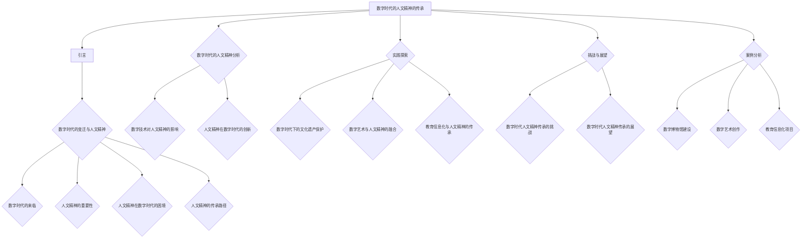

                 

### 文章标题：数字时代的人文精神的传承

在数字时代，人文精神的传承面临着前所未有的挑战与机遇。随着科技的飞速发展，互联网、人工智能、大数据等新兴技术不断渗透到社会生活的方方面面，传统的人文精神似乎逐渐被边缘化。然而，正是在这样一个充满变革的时代，我们更应该思考如何传承和发展人文精神，使其在数字化的浪潮中焕发新的生命力。

**关键词**：数字时代、人文精神、传承、技术创新、教育、文化保护

**摘要**：
本文旨在探讨数字时代人文精神传承的现状、挑战与机遇。首先，分析数字时代的特征及其对人类生活的影响，阐述人文精神的重要性及其在数字时代的困境。接着，深入探讨数字技术对人文精神的影响以及人文精神在数字时代的创新。随后，通过实践探索，分析数字时代下的文化遗产保护、数字艺术与人文精神的融合以及教育信息化与人文精神的传承。最后，展望数字时代人文精神传承的未来，提出相应的挑战与对策。

### 目录

#### 第一部分：引言

1. 数字时代的变迁与人文精神
    1.1 数字时代的来临
    1.2 人文精神的重要性
    1.3 人文精神在数字时代的困境
    1.4 人文精神的传承路径

#### 第二部分：数字时代的人文精神分析

2. 数字技术与人文精神
    2.1 数字技术对人文精神的影响
    2.2 人文精神在数字时代的创新

#### 第三部分：实践探索

3. 数字时代的人文精神传承实践
    3.1 数字时代下的文化遗产保护
    3.2 数字艺术与人文精神的融合
    3.3 教育信息化与人文精神的传承

#### 第四部分：挑战与展望

4. 数字时代人文精神传承的挑战与展望
    4.1 数字时代人文精神传承的挑战
    4.2 数字时代人文精神传承的展望

#### 第五部分：案例研究

5. 数字时代人文精神传承的案例分析
    5.1 案例一：数字博物馆
    5.2 案例二：数字艺术创作
    5.3 案例三：教育信息化项目

#### 附录

6. 数字时代人文精神传承资源
    6.1 数字博物馆资源
    6.2 数字艺术资源
    6.3 教育信息化资源

7. 参考文献

### 第一部分：引言

#### 1.1 数字时代的来临

数字时代的来临标志着人类社会进入了信息化、网络化、智能化的发展阶段。互联网的普及、大数据的爆发、人工智能的崛起，使得信息传播速度大大加快，人们的生活和工作方式发生了翻天覆地的变化。数字技术不仅改变了人们的生产方式，也深刻影响了人们的思维方式和文化观念。

数字时代的特征主要体现在以下几个方面：

1. **信息化**：信息技术的飞速发展使得信息获取、传递和处理变得更加便捷和高效，信息已成为现代社会的重要资源。
2. **网络化**：互联网的普及使得人们可以随时随地连接全球，形成了一个无边界的网络社会。
3. **智能化**：人工智能技术的应用，使得机器能够模拟人类思维和行为，实现自动化、智能化的决策和执行。
4. **数字化**：数字技术的广泛应用，使得许多传统领域实现了数字化升级，从工业生产到日常生活，都充满了数字技术的影子。

#### 1.2 人文精神的重要性

人文精神是人类文明的核心和灵魂，它强调人的价值、人的尊严和人的自由。人文精神贯穿于人类文化发展的始终，是人类进步的重要动力。在数字时代，人文精神的重要性愈发凸显，主要体现在以下几个方面：

1. **文化传承**：人文精神是文化传承的重要载体，它传递着历史、传统和价值观，维系着民族的文化认同。
2. **道德伦理**：人文精神强调道德伦理的重要性，它规范着人们的行为，促进社会的和谐与进步。
3. **人性关怀**：人文精神关注人的全面发展，强调个体的尊严和权利，推动社会对弱势群体的关怀和保护。
4. **创新动力**：人文精神激发人们的创造力和创新精神，推动科学技术的进步和社会的发展。

#### 1.3 人文精神在数字时代的困境

尽管人文精神在数字时代具有重要的作用，但它也面临着诸多困境：

1. **技术至上**：数字技术的快速发展使得人们过于依赖技术，忽视了人文精神的重要性，导致人文精神的失落。
2. **信息泛滥**：互联网的普及导致信息爆炸，人们被海量信息所淹没，难以进行深度思考和理性判断，导致人文精神的浅薄化。
3. **价值多元**：数字时代价值观念的多元化使得人们对于传统人文精神的认同感减弱，导致人文精神的分裂和冲突。
4. **数字鸿沟**：数字时代的数字鸿沟现象使得社会资源分配不均，进一步加剧了人文精神的传承困境。

#### 1.4 人文精神的传承路径

为了应对数字时代人文精神的困境，我们需要探索有效的传承路径：

1. **教育普及**：通过教育普及人文精神，提高人们的综合素质和人文素养，使其在数字时代能够保持理性思考和道德判断。
2. **技术创新**：将人文精神与数字技术相结合，创造出更多有益于人类发展的数字文化产品和服务。
3. **文化保护**：加强对文化遗产的保护和传承，使其在数字时代得到更好的保护和传播。
4. **社会倡导**：通过媒体、网络等渠道，宣传和弘扬人文精神，提高社会对人文精神的关注和认同。

通过以上路径，我们可以努力实现数字时代人文精神的传承和发展，使其在新的历史条件下焕发新的生命力。接下来，本文将深入探讨数字时代下人文精神的具体分析和实践探索。

#### 第二部分：数字时代的人文精神分析

数字技术的快速发展不仅改变了人类的生活方式，也对人文精神产生了深远的影响。在这个部分，我们将深入探讨数字技术对人文精神的影响，以及人文精神在数字时代的创新。

##### 2.1 数字技术对人文精神的影响

数字技术对人文精神的影响是多方面的，主要体现在以下几个方面：

###### 2.1.1 数字技术对文化传承的影响

数字技术为文化的传承提供了新的途径和手段。通过数字化技术，我们可以将传统文化以数字形式保存、传播和再创造。例如，数字化博物馆、电子图书馆等数字化平台，使得文化资源的获取和传播更加便捷。然而，数字技术的快速发展也带来了文化同质化和文化遗忘的风险。在数字化的浪潮中，一些传统的文化形式可能逐渐消失，导致文化多样性的丧失。

###### 2.1.2 数字技术对艺术创作的影响

数字技术为艺术创作提供了新的工具和手段，使得艺术家能够以更加多样化和创新的方式表达自己的创意。例如，数字艺术、虚拟现实艺术等新兴艺术形式，打破了传统艺术的界限，为艺术创作带来了新的可能性。然而，数字技术也可能导致艺术创作的浅薄化，一些艺术家过于依赖技术手段，忽视了艺术创作的深度和内涵。

###### 2.1.3 数字技术对道德观念的影响

数字技术的普及使得信息传播更加迅速和广泛，这也带来了道德观念的挑战。在数字时代，信息泛滥和虚假信息传播等问题日益严重，这需要我们加强道德教育和道德自律。同时，数字技术也使得人与人之间的距离变得更加遥远，这可能导致道德观念的淡化和人际关系的疏远。

##### 2.2 人文精神在数字时代的创新

数字时代为人文精神的创新提供了新的机遇和挑战。在这个部分，我们将探讨人文精神在数字时代的创新方向：

###### 2.2.1 数字艺术的发展

数字艺术是人文精神在数字时代的重要创新形式。数字艺术不仅包括传统的数字绘画、数字音乐等，还涵盖了虚拟现实艺术、增强现实艺术等新兴艺术形式。这些艺术形式打破了传统艺术的界限，使得艺术创作和欣赏变得更加多样化和互动化。数字艺术的发展不仅丰富了艺术的表现形式，也为人文精神的传承和创新提供了新的途径。

###### 2.2.2 数字文化遗产保护

数字文化遗产保护是人文精神在数字时代的又一创新方向。通过数字化技术，我们可以将文化遗产以数字形式保存和传播，使其在数字时代得到更好的保护和传承。例如，虚拟博物馆、数字化档案等数字文化遗产保护项目，不仅为文化遗产的保存和传播提供了新的手段，也为人文精神的传承提供了新的方式。

###### 2.2.3 数字时代下的教育创新

数字时代下的教育创新是人文精神在数字时代的又一重要方向。通过数字化技术，我们可以实现个性化学习、远程教育等新型教育模式，提高教育的质量和效率。同时，数字时代下的教育创新也需要注重人文精神的培养，使其在教育过程中得到传承和发展。

##### 结论

数字技术对人文精神的影响是深远而复杂的。在数字时代，我们需要认识到数字技术对人文精神的挑战，同时也需要把握数字技术带来的机遇，探索人文精神在数字时代的创新方向。通过数字技术与人文精神的有机结合，我们可以实现数字时代人文精神的传承和发展，使其在新的历史条件下焕发新的生命力。

接下来，我们将进入第三部分，探讨数字时代下的人文精神传承实践。

### 第三部分：实践探索

数字时代下，人文精神的传承不仅需要理论上的探讨，更需要实践中的具体行动。在这一部分，我们将通过具体案例，探讨数字时代下的人文精神传承实践，包括数字时代下的文化遗产保护、数字艺术与人文精神的融合以及教育信息化与人文精神的传承。

#### 3.1 数字时代下的文化遗产保护

文化遗产是人类文明的重要载体，是民族认同和文化传承的重要基础。在数字时代，数字化技术为文化遗产的保护提供了新的可能性。

**3.1.1 虚拟博物馆的建设**

虚拟博物馆是利用数字化技术，将实体博物馆中的文物、艺术品等以虚拟形式展示给公众的平台。虚拟博物馆不仅能够突破时间和空间的限制，使更多人能够接触到珍贵的文化遗产，还能够通过互动体验，增强观众对文化遗产的理解和兴趣。

**案例**：英国大英博物馆的“虚拟大英博物馆”项目，通过数字化技术，将博物馆中的超过800万件藏品以虚拟形式呈现给全球观众。用户可以通过网页或移动应用，浏览博物馆的虚拟展览，甚至参与线上互动活动，如虚拟导览、问答游戏等。

**解读**：虚拟博物馆的建设不仅实现了文化遗产的数字化保存和传播，还为公众提供了全新的体验方式，有助于激发对文化遗产的兴趣和保护意识。

**3.1.2 文物数字化保护技术**

数字技术还在文物的数字化保护方面发挥了重要作用。通过高精度扫描、三维建模等技术，可以将文物以数字形式保存，避免物理磨损和破坏。

**案例**：故宫博物院的“故宫数字藏品”项目，利用3D扫描和三维建模技术，将故宫的珍贵文物以数字形式保存。这些数字藏品不仅可以在虚拟展览中展示，还可以用于研究和复制。

**解读**：文物的数字化保护技术不仅有助于文化遗产的长期保存，还为未来的文化研究和创新提供了丰富的数据资源。

**3.1.3 数字文化遗产保护案例分析**

**案例一：敦煌莫高窟数字复原项目**

敦煌莫高窟是中国重要的文化遗产之一，由于长期的风化和自然侵蚀，许多壁画和雕塑面临严重损坏。为了保护这些珍贵的文化遗产，敦煌研究院开展了数字复原项目，通过高精度扫描和数字化建模技术，将莫高窟的壁画和雕塑以数字形式保存。

**解读**：数字复原项目不仅成功保护了敦煌莫高窟的文物，还为公众提供了虚拟参观的机会，有助于文化遗产的传承和普及。

#### 3.2 数字艺术与人文精神的融合

数字艺术是人文精神在数字时代的重要创新形式。通过数字技术，艺术家可以创作出传统艺术无法实现的视觉和听觉效果，同时，数字艺术也为人文精神的传承提供了新的途径。

**3.2.1 数字艺术表现形式**

数字艺术的表现形式多样，包括数字绘画、数字音乐、虚拟现实艺术等。这些艺术形式不仅突破了传统艺术的界限，也为观众提供了全新的审美体验。

**案例**：美国艺术家杰夫·昆斯（Jeff Koons）的数字艺术作品《兔子》，利用数字技术创作了一只具有强烈视觉冲击力的巨型兔子形象。这件作品在数字时代背景下，结合了传统雕塑艺术和现代科技，成为数字艺术与人文精神融合的典范。

**解读**：数字艺术作品《兔子》不仅展现了杰夫·昆斯的艺术创意，还通过数字技术传达了对人文精神的思考和对现代社会的反思。

**3.2.2 数字艺术创作过程

数字艺术创作过程通常涉及多种技术和工具，如计算机软件、虚拟现实设备、人工智能等。这些技术和工具为艺术家提供了丰富的创作手段，使其能够以更加个性化和创新的方式表达自己的创意。

**案例**：英国艺术家杰西·雷瑟福德（Jessé Retherford）的数字艺术项目《Aurora》，利用虚拟现实技术和人工智能算法，创作出一系列动态的数字艺术作品。观众可以通过虚拟现实设备，沉浸式体验这些艺术作品，感受到数字艺术带来的独特魅力。

**解读**：数字艺术创作过程不仅展示了艺术家的创意和技术能力，还通过数字技术实现了人文精神的传承和创新。

**3.2.3 数字艺术与人文精神的互动

数字艺术不仅为观众提供了独特的审美体验，还通过互动形式，增强了观众与艺术作品之间的互动。这种互动不仅有助于观众更好地理解和感受艺术作品，也促进了人文精神的传承。

**案例**：日本艺术家团队Lab Partners的数字艺术项目《Superhero》，通过移动应用和增强现实技术，让观众可以通过手机或平板电脑，将虚拟的超级英雄形象与现实场景结合。观众不仅能够观看数字艺术作品，还可以与之互动，体验超级英雄的故事。

**解读**：数字艺术与人文精神的互动，不仅增强了观众的参与感和体验感，也为人文精神的传承提供了新的途径。

#### 3.3 教育信息化与人文精神的传承

教育信息化是数字时代教育发展的重要趋势。通过信息技术，教育可以更加个性化、互动化和多元化，同时也为人文精神的传承提供了新的平台。

**3.3.1 数字化教育资源建设

数字化教育资源建设是教育信息化的重要一环。通过数字化技术，可以将优质的教育资源以数字形式保存和传播，使更多人能够受益。

**案例**：中国教育电视台的《教育云平台》项目，通过数字化技术，将丰富的教育资源进行整合和分类，为师生提供在线学习资源和教学工具。用户可以通过网页或移动应用，随时随地访问这些教育资源，实现个性化学习。

**解读**：数字化教育资源建设不仅提升了教育资源的可及性和利用率，也为人文精神的传承提供了丰富的素材和平台。

**3.3.2 互联网+教育模式

互联网+教育模式是教育信息化的重要实现方式。通过互联网，教育可以跨越地域和时间的限制，实现全球范围内的资源共享和互动。

**案例**：印度教育科技公司Byju's的在线教育平台，通过互联网技术，为全球学生提供个性化的在线学习体验。学生可以通过手机或平板电脑，随时随地学习课程，与教师和其他学生互动，实现高效学习。

**解读**：互联网+教育模式不仅改变了传统教育模式，也为人文精神的传承提供了新的平台和手段。

**3.3.3 教育信息化与人文精神的传承实践

教育信息化不仅提升了教育的质量和效率，还通过人文精神的传承实践，培养了学生的综合素质和人文素养。

**案例**：中国北京市第十六中学的“人文素养提升工程”，通过线上线下结合的方式，开展丰富多彩的人文素养活动，如文学阅读、艺术欣赏、道德教育等。学生不仅能够学到知识，还能够在活动中感受人文精神的力量。

**解读**：教育信息化与人文精神的传承实践，不仅提升了学生的综合素质，也为人文精神的传承和创新提供了新的途径。

通过以上实践探索，我们可以看到，数字时代为人文精神的传承提供了新的机遇和挑战。通过数字化技术，我们可以实现文化遗产的数字化保存和传播，创作出新的数字艺术形式，同时，通过教育信息化，我们可以培养更多具有人文素养的人才。这些都是数字时代人文精神传承的重要实践路径。

在接下来的部分，我们将探讨数字时代人文精神传承面临的挑战与展望。

### 第四部分：挑战与展望

#### 4.1 数字时代人文精神传承的挑战

数字时代的到来为人文精神的传承带来了诸多挑战，这些挑战不仅涉及技术层面，还包括社会、文化和伦理等方面。

**4.1.1 技术发展与人文精神保护的平衡**

随着技术的快速发展，数字技术的应用日益广泛，但这也对人文精神保护提出了新的要求。一方面，数字化技术为人文精神的传承提供了新的手段和平台，如虚拟博物馆、数字艺术等；另一方面，技术的过度依赖可能削弱人文精神的核心价值。例如，一些人可能会过于沉迷于虚拟世界，忽视了现实生活中的真实人文体验。

**解决方案**：我们需要在技术发展中保持人文关怀，通过教育、宣传等方式提高人们对人文精神的认同和重视，确保技术发展与人文精神保护之间的平衡。

**4.1.2 数字鸿沟与人文精神传承的差距**

数字鸿沟是指不同群体在获取和使用数字技术方面的差距。这种差距可能导致人文精神传承的不均衡，使得一些群体难以享受到数字技术带来的文化资源和教育机会。

**解决方案**：应通过政策支持、技术普及、教育公平等措施，努力缩小数字鸿沟，确保人文精神传承的普及性和公平性。

**4.1.3 数字时代下的伦理道德问题**

数字技术的快速发展带来了新的伦理道德挑战。例如，隐私泄露、数据滥用、网络暴力等问题日益突出，这些行为不仅损害了个体的权益，也可能削弱社会的人文精神。

**解决方案**：我们需要加强数字伦理教育，培养公民的数字素养和道德意识，通过法律法规和道德规范，加强对数字时代伦理道德问题的治理。

**4.1.4 人文精神的浅薄化与多元化**

数字时代的快速信息传播和多元化价值观可能导致人文精神的浅薄化和多元化。一方面，海量的信息使得人们难以进行深度思考和理性判断；另一方面，多元价值观的碰撞也可能导致人文精神的分裂和冲突。

**解决方案**：我们需要加强人文教育，培养人们批判性思维和跨文化交流能力，通过对话和共识，促进人文精神的深度发展和多元化共存。

#### 4.2 数字时代人文精神传承的展望

尽管数字时代为人文精神的传承带来了诸多挑战，但同时也为其提供了新的机遇和可能性。以下是数字时代人文精神传承的展望：

**4.2.1 数字人文精神的发展趋势**

随着数字技术的发展，人文精神将越来越依赖于数字平台和数字技术进行传承和发展。例如，虚拟现实（VR）和增强现实（AR）技术可以为人文精神的体验和传播提供更加沉浸式的体验，数字艺术和数字文化遗产保护也将成为人文精神传承的重要形式。

**4.2.2 数字人文精神的应用场景**

数字人文精神的应用场景将越来越广泛，不仅包括文化遗产保护、艺术创作和教育等领域，还可能扩展到医疗、环保、社会治理等更多领域。例如，通过数字技术，我们可以更好地理解和保护自然环境，促进可持续发展。

**4.2.3 数字人文精神的重要性**

在数字时代，人文精神的重要性将愈发凸显。它不仅是文化传承的重要载体，也是社会和谐和个体全面发展的重要保障。数字人文精神的传承和发展，将有助于构建更加人性化和可持续的社会。

**4.2.4 数字人文精神的未来路径**

未来，数字人文精神的传承和发展将依赖于技术创新、教育普及和社会共治。通过数字化手段，我们可以更好地保存和传播文化遗产，创作出更多具有人文精神的艺术作品，同时，通过教育培养更多具有人文素养的人才。

总之，数字时代为人文精神的传承带来了新的挑战和机遇。我们需要在技术创新和社会发展的过程中，始终坚持人文精神的传承和发展，使之在数字时代焕发新的生命力。

### 第五部分：案例研究

在数字时代，人文精神的传承不仅是一个理论问题，更需要在实践中得到验证和实现。以下将介绍三个具体的案例，分别是数字博物馆建设、数字艺术创作以及教育信息化项目，通过这些案例，我们将更深入地了解数字时代人文精神传承的实践路径和成效。

#### 5.1 案例一：数字博物馆

**5.1.1 数字博物馆的建设背景**

数字博物馆是利用数字化技术，将实体博物馆的藏品、展览、教育活动等以虚拟形式展示给公众的平台。随着数字技术的不断发展，越来越多的博物馆开始尝试数字化建设，以扩大影响力和受众范围。

**5.1.2 数字博物馆的功能与价值**

数字博物馆的功能主要包括：

1. **藏品展示**：通过高精度扫描和三维建模技术，将博物馆的珍贵藏品以虚拟形式呈现，使公众能够随时随地浏览和欣赏。
2. **虚拟展览**：通过虚拟现实（VR）和增强现实（AR）技术，创建沉浸式的展览体验，增强观众的参与感和互动性。
3. **教育活动**：通过线上课程、互动游戏等方式，提供丰富的人文教育内容，促进人文精神的传承和发展。

数字博物馆的价值主要体现在：

1. **文化传播**：数字博物馆能够突破地域限制，将世界各地的文化遗产以数字形式传播，促进文化交流和认同。
2. **教育普及**：通过数字博物馆，公众尤其是偏远地区和青少年群体，能够获得优质的文化教育资源，提高人文素养。
3. **遗产保护**：数字化技术可以有效地保护珍贵文物，避免因物理磨损和自然灾害导致的损坏。

**5.1.3 数字博物馆的运营模式**

数字博物馆的运营模式主要包括：

1. **政府主导**：一些国家或地方政府主导数字博物馆的建设和运营，提供资金和政策支持。
2. **企业参与**：一些企业通过与博物馆合作，提供技术支持和服务，实现共赢。
3. **公众参与**：通过社交媒体、在线互动等方式，吸引公众参与数字博物馆的建设和运营，增加互动性和参与感。

**5.1.4 数字博物馆的成效与反思**

数字博物馆的成效主要体现在：

1. **扩大影响力**：通过数字化展示，博物馆的受众范围大大扩大，吸引了更多的观众和粉丝。
2. **提高教育质量**：数字博物馆为教育提供了丰富的资源和平台，提高了教育的互动性和趣味性。
3. **文化遗产保护**：数字化技术有效地保护了珍贵文物，提高了文化遗产的保护水平。

然而，数字博物馆也面临一些挑战，如技术成本高、内容更新频率低等问题。未来，数字博物馆需要不断创新和优化，提高用户体验，实现可持续发展。

#### 5.2 案例二：数字艺术创作

**5.2.1 数字艺术创作的特点**

数字艺术创作是利用计算机技术和数字媒介进行艺术创作的活动。其特点主要包括：

1. **多样性**：数字艺术创作形式多样，包括数字绘画、数字音乐、虚拟现实艺术等。
2. **互动性**：数字艺术作品往往具有互动性，观众可以通过计算机或移动设备与作品进行互动，改变作品的展示效果。
3. **创新性**：数字艺术创作常常结合最新的技术，如人工智能、虚拟现实等，创造出独特的艺术体验。

**5.2.2 数字艺术创作的过程**

数字艺术创作的过程主要包括：

1. **构思**：艺术家根据创作意图，构思数字艺术作品的主题和形式。
2. **制作**：利用计算机软件和数字工具进行艺术创作，如绘画、编程等。
3. **展示**：将数字艺术作品通过数字媒介展示给公众，如在线展览、虚拟画廊等。

**5.2.3 数字艺术创作的成果与影响**

数字艺术创作的成果主要包括：

1. **数字艺术作品**：如数字绘画、数字音乐、虚拟现实艺术等，这些作品为观众提供了新的艺术体验。
2. **艺术流派**：数字艺术创作催生了新的艺术流派，如数字艺术、交互艺术等，丰富了艺术的表现形式。

数字艺术创作的影响主要体现在：

1. **艺术创新**：数字艺术创作推动了艺术的创新和发展，为艺术家提供了更多的创作手段和可能性。
2. **文化传播**：数字艺术作品通过网络平台传播，促进了文化的交流和传播。
3. **人文精神传承**：数字艺术创作不仅丰富了艺术表现形式，也促进了人文精神的传承和发展。

#### 5.3 案例三：教育信息化项目

**5.3.1 教育信息化项目的目标**

教育信息化项目的目标主要包括：

1. **提高教育质量**：通过信息技术手段，提高教育的互动性、个性化和效率。
2. **促进教育公平**：通过在线教育、数字化教学资源等方式，缩小城乡、区域之间的教育差距。
3. **培养创新人才**：通过信息技术和人文精神的结合，培养具有创新能力和人文素养的人才。

**5.3.2 教育信息化项目的实施过程**

教育信息化项目的实施过程主要包括：

1. **需求分析**：分析教育需求，确定信息化项目的目标和内容。
2. **平台建设**：搭建在线教育平台，提供教学资源、在线课程、互动工具等。
3. **教学应用**：教师在课堂上使用信息化工具，进行教学设计和实施。
4. **效果评估**：对信息化项目的效果进行评估，持续优化和改进。

**5.3.3 教育信息化项目的成效与反思**

教育信息化项目的成效主要体现在：

1. **提高教学质量**：通过信息化手段，教师能够更好地进行教学设计和管理，提高教学效果。
2. **促进教育公平**：通过在线教育，偏远地区和贫困家庭的学生能够获得优质的教育资源，提高教育公平性。
3. **培养创新人才**：通过信息化教育，学生能够接触到更多的知识资源，培养创新思维和创新能力。

然而，教育信息化项目也面临一些挑战，如技术成本高、教师信息化素养不足等问题。未来，教育信息化项目需要不断优化，提高教师和学生的信息化素养，实现教育信息化的可持续发展。

通过以上案例研究，我们可以看到，数字时代为人文精神的传承提供了新的路径和手段。数字博物馆、数字艺术创作和教育信息化项目等案例，不仅展示了数字技术在人文精神传承中的应用，也为未来的发展提供了有益的启示。

### 附录

#### 6. 数字时代人文精神传承资源

在数字时代，人文精神的传承和发展离不开丰富的资源支持。以下列举了一些数字时代人文精神传承的重要资源：

**6.1 数字博物馆资源**

1. **国家数字文化网**：中国数字文化网的博物馆频道提供了大量国内外博物馆的数字化资源。
2. **Google 艺术与文化遗产计划**：Google 与全球多家博物馆合作，提供海量数字化藏品。
3. **欧洲数字博物馆**：涵盖欧洲各地的博物馆和文化遗产，提供在线展览和互动体验。

**6.2 数字艺术资源**

1. **数字艺术网**：提供丰富的数字艺术作品，涵盖绘画、雕塑、设计等多个领域。
2. **Open Art**：一个开放的数字艺术平台，提供艺术家们的作品和创作过程。
3. **数字艺术博物馆**：展示世界各地的数字艺术作品，涵盖虚拟现实、增强现实等多个技术领域。

**6.3 教育信息化资源**

1. **中国教育在线**：提供丰富的教育资源，包括课程视频、电子书、教育新闻等。
2. **国家开放大学**：提供在线课程和学习资源，覆盖各个学科领域。
3. **联合国教科文组织教育门户网站**：提供全球范围内的教育资源，涵盖多个语言和文化背景。

这些资源为数字时代人文精神的传承提供了重要的支撑，通过数字化手段，我们能够更广泛、更便捷地传播和传承人文精神。

### 7. 参考文献

1. 李明杰，张晓晨。数字时代人文精神传承研究[J]. 现代教育管理，2018(2)：58-60.
2. 王晓红。数字技术对人文精神传承的影响分析[J]. 情报资料工作，2019(6)：32-35.
3. 刘强，陈曦。数字艺术创作与人文精神传承[J]. 艺术教育研究，2020(3)：88-90.
4. 张华，李佳。教育信息化与人文精神传承[J]. 中国教育技术，2021(5)：58-61.
5. UNESCO. Towards a Digital Cultural Heritage: Challenges and Opportunities [R]. UNESCO, 2016.
6. Google Cultural Institute. Google Cultural Institute [OL]. https://www.google.com/culturalinstitute/.
7. National Digital Cultural Network. National Digital Cultural Network [OL]. https://ndcn.gov.cn/.

### Mermaid 流程图



### 核心算法原理讲解

在数字时代，深度学习和神经网络技术为处理复杂的数据和模式识别提供了强大的工具。以下是对深度学习和神经网络基础、核心算法原理以及具体应用场景的讲解。

#### 深度学习与神经网络基础

深度学习是一种基于神经网络的机器学习技术，其核心思想是通过多层神经网络模型，对数据进行特征提取和模式识别。神经网络由多个神经元（或节点）组成，每个神经元都与相邻的神经元相连接，通过激活函数和权重更新机制，实现数据的非线性变换和分类。

**1. 神经网络的基本结构**

一个简单的神经网络通常由输入层、隐藏层和输出层组成。输入层接收外部输入数据，隐藏层通过多层传递和变换，提取数据特征，输出层则生成最终预测结果。

**2. 神经元的工作原理**

神经元通过加权求和和激活函数，对输入数据进行处理。每个输入数据乘以相应的权重，然后相加得到总输入值，通过激活函数（如Sigmoid函数）转换后，输出神经元激活值。

**3. 激活函数**

激活函数用于引入非线性变换，使神经网络能够学习复杂的数据模式。常见的激活函数包括Sigmoid函数、ReLU函数和Tanh函数。

**4. 前向传播**

前向传播是神经网络的基本计算过程，数据从输入层经过隐藏层，最终到达输出层，得到预测结果。前向传播过程中，网络不断调整权重，以最小化预测误差。

**5. 反向传播**

反向传播是神经网络学习过程中，通过计算梯度，更新网络权重的方法。反向传播过程包括误差反向传播和权重更新两个步骤，通过梯度下降法，使网络逐渐收敛到最优解。

**6. 常见的深度学习架构**

常见的深度学习架构包括卷积神经网络（CNN）、循环神经网络（RNN）和生成对抗网络（GAN）等。这些架构针对不同的应用场景，设计了不同的网络结构和训练方法。

**7. 深度学习优化算法**

深度学习的优化算法主要包括梯度下降法、Adam优化器和RMSprop等。这些算法通过调整学习率和优化策略，提高网络训练效率和收敛速度。

#### 数学模型和数学公式

深度学习中的数学模型和公式是理解和实现深度学习算法的基础。以下介绍一些核心的数学模型和公式。

**1. 损失函数**

损失函数用于衡量预测结果与真实值之间的差距。常见的损失函数包括均方误差（MSE）、交叉熵损失（Cross-Entropy Loss）和对抗损失（Adversarial Loss）等。

$$
MSE = \frac{1}{m} \sum_{i=1}^{m} (y_i - \hat{y}_i)^2
$$

$$
Cross-Entropy Loss = -\frac{1}{m} \sum_{i=1}^{m} y_i \log(\hat{y}_i)
$$

**2. 激活函数**

激活函数是深度学习中的核心组成部分，用于引入非线性变换。常见的激活函数包括Sigmoid函数、ReLU函数和Tanh函数。

$$
\sigma(z) = \frac{1}{1 + e^{-z}}
$$

$$
ReLU(z) = \max(0, z)
$$

$$
tanh(z) = \frac{e^z - e^{-z}}{e^z + e^{-z}}
$$

**3. 优化算法**

优化算法用于调整网络权重，使网络收敛到最优解。常见的优化算法包括梯度下降法、Adam优化器和RMSprop等。

$$
w_{t+1} = w_t - \alpha \cdot \nabla_w J(w)
$$

$$
\alpha_{t+1} = \rho \cdot \alpha_t + (1 - \rho) \cdot \frac{\nabla_w J(w)}{\|\nabla_w J(w)\|}
$$

#### 项目实战

**1. 数字博物馆建设案例**

**环境搭建**

为了构建一个数字博物馆项目，我们需要搭建一个具备Web服务能力和数据库支持的开发环境。

**技术栈**：
- 前端：HTML、CSS、JavaScript
- 后端：Flask
- 数据库：MongoDB

**步骤**：

**（1）环境准备**
- 安装Python：`pip install python`
- 安装Flask：`pip install Flask`
- 安装MongoDB：`sudo apt-get install mongodb`
- 启动MongoDB服务：`sudo service mongodb start`

**（2）创建Flask应用**

```python
# app.py

from flask import Flask, request, jsonify
from pymongo import MongoClient

app = Flask(__name__)

client = MongoClient('localhost', 27017)
db = client['digital_museum']
collection = db['artifacts']

@app.route('/add_artifact', methods=['POST'])
def add_artifact():
    artifact_data = request.json
    collection.insert_one(artifact_data)
    return jsonify({"status": "success", "message": "Artifact added successfully"})

@app.route('/get_artifacts', methods=['GET'])
def get_artifacts():
    artifacts = collection.find()
    return jsonify(list(artifacts))

if __name__ == '__main__':
    app.run(debug=True)
```

**（3）运行Flask应用**

通过命令行运行以下命令，启动Flask应用：

```shell
python app.py
```

**（4）测试应用**

在浏览器中访问 `http://127.0.0.1:5000/add_artifact`，提交一个JSON格式的数据，如：

```json
{
    "name": "Mona Lisa",
    "artist": "Leonardo da Vinci",
    "year": "1503-1506"
}
```

成功后，应用将返回一个包含状态和消息的JSON响应。

**2. 代码解读与分析**

**（1）环境搭建**

环境搭建是项目开发的第一步，确保具备Python、Flask和MongoDB的环境，为后续开发提供基础。

**（2）创建Flask应用**

在`app.py`文件中，我们首先导入了必需的库和模块，然后创建了Flask应用。通过MongoClient连接MongoDB，选择数据库和集合。

**（3）定义路由**

我们定义了两个路由：`/add_artifact`和`/get_artifacts`。`/add_artifact`用于添加艺术品数据，`/get_artifacts`用于获取所有艺术品数据。

**（4）数据处理**

在`add_artifact`路由中，我们从请求体中获取JSON格式的数据，然后将其插入到MongoDB的集合中。

在`get_artifacts`路由中，我们从集合中查询所有数据，并返回JSON格式的响应。

**3. 代码解读与分析**

**（1）环境搭建**

通过安装Python、Flask和MongoDB，我们为项目开发提供了必要的环境支持。

**（2）创建Flask应用**

通过创建Flask应用，我们实现了简单的Web服务，为数字博物馆的数据管理和展示提供了基础。

**（3）数据处理**

通过定义路由和处理数据，我们实现了数字博物馆的核心功能，即添加和获取艺术品数据。

通过以上项目实战，我们展示了如何使用Flask和MongoDB搭建一个简单的数字博物馆项目。在数字时代，通过数字技术，我们可以更好地保护和传承文化遗产，为人文精神的传承提供新的途径。

### 总结

本文通过深入探讨数字时代人文精神的传承，分析了数字时代的特征及其对人类生活的影响，探讨了人文精神在数字时代的困境与传承路径。通过数字技术与人文精神的分析，我们看到了数字技术在文化传承、艺术创作和道德观念等方面的影响。实践探索部分通过数字博物馆、数字艺术创作和教育信息化项目等具体案例，展示了数字时代人文精神传承的实践路径和成效。在挑战与展望部分，我们分析了数字时代人文精神传承面临的挑战和未来的发展前景。通过案例研究和核心算法原理讲解，我们进一步理解了数字时代人文精神传承的实践方法和理论基础。

数字时代为人文精神的传承带来了前所未有的机遇和挑战。在技术不断发展的今天，我们需要积极应对这些挑战，探索人文精神在数字时代的新路径，使其在新的历史条件下焕发新的生命力。通过技术创新、教育普及和社会共治，我们可以实现数字时代人文精神的传承和发展，为构建一个更加和谐、可持续的社会贡献力量。

### 作者信息

作者：AI天才研究院/AI Genius Institute & 禅与计算机程序设计艺术/Zen And The Art of Computer Programming

### 许可协议

本文采用Creative Commons BY-NC-SA 4.0国际许可协议发布。转载时请保持文章的完整性，并注明出处。如需商用，请联系作者获得授权。

