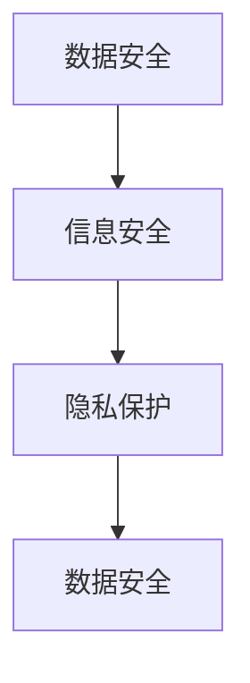

                 

## 文章标题

《数据安全与合规：确保所有IT系统和项目符合数据安全和隐私相关的法律、法规及实践。实施稳健的网络安全措施，保护公司数据在所有平台和地点的安全》

> **关键词**：数据安全，合规，法律，法规，网络安全，隐私保护

**摘要**：随着数字化时代的到来，数据成为企业的重要资产，数据安全和合规性成为企业必须面对的重要课题。本文从数据安全的背景与重要性、数据安全和隐私相关法律法规概述、数据安全基础知识、数据保护法规详解、数据合规性评估、IT系统安全措施、网络安全措施、数据安全项目实施、数据安全合规性案例分析及未来趋势与展望等方面，全面探讨了数据安全和合规性的重要性和实践方法。本文旨在为读者提供系统、全面的数据安全与合规性知识，帮助企业和组织在数字化时代中保护其宝贵的数据资产。

---

### 目录大纲

## 第1章 引言

### 1.1 数据安全的背景与重要性

### 1.2 数据安全和隐私相关法律法规概述

### 1.3 本书内容结构及学习方法

## 第2章 数据安全基础知识

### 2.1 数据安全的概念与范围

### 2.2 数据安全的威胁与风险

### 2.3 数据安全的防护策略

### 2.4 数据安全法律法规概述

## 第3章 数据保护法规详解

### 3.1 GDPR（欧盟通用数据保护条例）

### 3.2 CCPA（加州消费者隐私法）

### 3.3 隐私法规的国际比较与影响

### 3.4 其他重要数据保护法规

## 第4章 数据合规性评估

### 4.1 数据合规性评估的目的与意义

### 4.2 数据合规性评估的方法与步骤

### 4.3 数据合规性评估工具介绍

### 4.4 数据合规性评估案例分析

## 第5章 IT系统安全措施

### 5.1 IT系统安全架构

### 5.2 防火墙与入侵检测系统

### 5.3 加密技术与数据安全

### 5.4 安全信息和事件管理系统

## 第6章 网络安全措施

### 6.1 网络安全基础

### 6.2 网络安全威胁分析

### 6.3 安全协议与标准

### 6.4 网络安全实战案例

## 第7章 数据安全项目实施

### 7.1 数据安全项目规划

### 7.2 数据安全项目执行

### 7.3 数据安全项目监控与改进

### 7.4 数据安全项目评估与审计

## 第8章 数据安全合规性案例分析

### 8.1 成功案例分享

### 8.2 案例分析：挑战与应对

### 8.3 数据安全合规性的最佳实践

## 第9章 未来趋势与展望

### 9.1 数据安全合规性发展趋势

### 9.2 新兴技术与数据安全

### 9.3 数据安全合规性面临的挑战与机遇

## 附录

### 附录A：数据安全合规性法规汇总

### 附录B：数据安全工具和资源推荐

### 附录C：数据安全常见问题解答

### 附录D：参考文献

---

## 第1章 引言

### 1.1 数据安全的背景与重要性

随着信息技术的飞速发展，数据已经成为企业和组织的重要资产。数据不仅为企业提供了商业洞察，还成为了企业决策和竞争力的重要来源。然而，数据的价值同时也带来了数据安全的挑战。数据泄露、数据篡改、数据丢失等问题频繁发生，给企业和个人带来了巨大的经济损失和隐私风险。

**核心概念与联系**：数据安全、信息安全、隐私保护的关系与区别可以用以下 Mermaid 流程图表示：



- **数据安全**：指保护数据免受未经授权的访问、使用、披露、破坏、修改和丢失。
- **信息安全**：是一个更广泛的概念，包括数据安全，还涵盖了网络、系统、应用程序和物理设施的安全。
- **隐私保护**：侧重于保护个人隐私，确保个人数据不被滥用和泄露。

**数据安全的重要性**：数据安全的重要性体现在以下几个方面：

1. **经济损失**：数据泄露可能导致客户信任受损，从而影响企业的收入和市场份额。
2. **声誉损失**：数据泄露事件可能导致企业声誉受损，影响长远发展。
3. **法律责任**：许多国家和地区制定了严格的数据安全法律法规，企业不遵守可能面临巨额罚款和法律诉讼。

### 1.2 数据安全和隐私相关法律法规概述

数据安全和隐私相关的法律法规在全球范围内日益严格，对企业和组织的数据处理活动提出了严格要求。以下是一些主要的法律法规：

1. **GDPR（欧盟通用数据保护条例）**：GDPR 是欧盟制定的关于数据保护的全面性法规，旨在保护欧盟居民的个人数据。
2. **CCPA（加州消费者隐私法）**：CCPA 是美国加州制定的消费者隐私法规，规定了消费者对其个人数据的访问权和删除权。
3. **PIPEDA（加拿大隐私法）**：PIPEDA 是加拿大制定的隐私保护法规，适用于联邦机构和个人信息处理者。
4. **LGPD（巴西通用数据保护法）**：LGPD 是巴西制定的关于数据保护的综合性法律，旨在规范个人数据处理活动。

**法律法规的发展历程**：随着数字化进程的加速，数据隐私和安全的法律法规逐渐完善。早期的法律法规主要侧重于网络安全，而随着技术的发展和隐私事件的频发，越来越多的国家开始关注个人数据的保护。

**主要法律法规概述**：

- **GDPR**：核心原则包括数据主体权利、数据透明度、数据最小化等。主要要求包括数据主体同意、数据处理者与处理者责任、数据泄露通知等。
- **CCPA**：核心原则包括消费者隐私权、数据透明度、数据删除权等。主要要求包括数据收集、处理、披露、消费者权利等。
- **PIPEDA**：主要要求包括个人信息处理者的义务、个人数据的保护措施、隐私保护政策的制定等。
- **LGPD**：主要要求包括数据处理者的合规性要求、个人数据的保护措施、数据泄露通知等。

### 1.3 本书内容结构及学习方法

本书分为九章，从数据安全的背景和重要性、数据安全和隐私相关法律法规、数据安全基础知识、数据保护法规详解、数据合规性评估、IT系统安全措施、网络安全措施、数据安全项目实施到数据安全合规性案例分析及未来趋势与展望，全面覆盖了数据安全和合规性的各个方面。

**学习方法**：

1. **理论与实践相结合**：通过理论学习与实际案例相结合，帮助读者更好地理解和掌握数据安全与合规性的知识。
2. **分步学习和思考**：本书采用分步学习的方式，每章都有明确的主题和结构，使读者可以逐步深入理解数据安全与合规性的核心内容。
3. **结合工具和资源**：本书附录部分提供了数据安全工具和资源推荐，帮助读者在实际工作中更好地应用所学知识。

通过本书的学习，读者可以：

1. **提升数据安全意识**：理解数据安全的重要性和面临的挑战。
2. **掌握数据合规性要求**：了解全球主要数据保护法律法规，为企业的合规性建设提供指导。
3. **学会实施数据安全措施**：掌握数据安全的基础知识和防护策略，提高企业的数据安全水平。
4. **应对数据安全挑战**：通过案例分析，了解数据安全合规性的实际操作和挑战，为企业的数据安全项目提供借鉴。

## 第2章 数据安全基础知识

### 2.1 数据安全的概念与范围

**核心概念**：

- **数据安全**：指通过采取一系列措施，保护数据免受未经授权的访问、使用、披露、破坏、修改和丢失。数据安全不仅涉及数据本身，还包括与数据相关的系统、网络和设施。

- **数据隐私**：指保护个人数据的权利，确保个人数据不被滥用和泄露。数据隐私通常与法律法规有关，如GDPR和CCPA等。

- **数据完整性**：指保证数据在传输、存储和处理过程中的准确性和一致性。数据完整性是数据安全的重要方面，防止数据被篡改或破坏。

**数据安全的范围**：

- **物理安全**：指保护数据存储设备（如服务器、存储设备）和设施（如数据中心）的安全。包括访问控制、环境监控、安全报警等。

- **网络安全**：指保护网络基础设施（如路由器、交换机）和传输数据的安全。包括防火墙、入侵检测、数据加密等。

- **数据安全**：指保护存储在数据库、文件系统、应用程序中的数据的安全。包括访问控制、数据加密、备份与恢复等。

- **应用安全**：指保护使用数据的应用程序的安全。包括安全编码、应用防火墙、安全审计等。

### 2.2 数据安全的威胁与风险

**威胁类型**：

- **内部威胁**：指企业内部人员（如员工、承包商）滥用权限或恶意攻击企业系统。

- **外部威胁**：指来自企业外部的恶意攻击者，包括黑客、病毒、蠕虫等。

- **人为威胁**：指由于人为失误导致的数据泄露或损坏，如未授权访问、数据传输错误、数据删除等。

**风险评估**：

- **资产价值**：评估数据对企业的重要性，包括商业价值、法律价值等。

- **威胁分析**：分析潜在威胁的类型、来源和可能性。

- **脆弱性分析**：识别系统中的漏洞和弱点，如未修补的软件漏洞、配置错误等。

**风险评估步骤**：

1. **确定资产**：识别企业中所有重要的数据和系统。
2. **分析威胁**：识别可能威胁到资产安全的威胁类型。
3. **评估脆弱性**：识别系统中存在的漏洞和弱点。
4. **评估风险**：评估威胁利用脆弱性对资产造成损害的可能性。
5. **制定安全策略**：根据风险评估结果，制定相应的安全措施和策略。

### 2.3 数据安全的防护策略

**防护措施**：

- **加密技术**：通过加密算法对数据进行加密，确保数据在传输和存储过程中不被窃取或篡改。

- **访问控制**：限制对数据的访问，确保只有授权人员才能访问特定的数据。

- **备份与恢复**：定期备份数据，以防止数据丢失或损坏，并确保能够在需要时恢复数据。

- **监控与审计**：实时监控系统的运行状态，记录和审计系统操作，以发现异常行为和潜在威胁。

**安全策略制定**：

1. **风险评估**：根据风险评估结果，确定安全需求和目标。

2. **安全需求分析**：分析企业业务流程和数据流，确定需要保护的关键数据和系统。

3. **安全策略制定**：根据安全需求和目标，制定具体的防护措施和安全策略。

4. **安全策略实施**：实施安全策略，包括配置安全设备、部署安全软件等。

5. **安全策略评估与改进**：定期评估安全策略的有效性，并根据评估结果进行改进。

### 2.4 数据安全法律法规概述

**主要法律法规**：

- **GDPR（欧盟通用数据保护条例）**：GDPR 是欧盟制定的关于数据保护的全面性法规，旨在保护欧盟居民的个人数据。GDPR 的核心原则包括数据主体权利、数据透明度、数据最小化等。

- **CCPA（加州消费者隐私法）**：CCPA 是美国加州制定的消费者隐私法规，规定了消费者对其个人数据的访问权和删除权。CCPA 的核心原则包括消费者隐私权、数据透明度、数据删除权等。

- **PIPEDA（加拿大隐私法）**：PIPEDA 是加拿大制定的隐私保护法规，适用于联邦机构和个人信息处理者。PIPEDA 的主要要求包括个人信息处理者的义务、个人数据的保护措施、隐私保护政策的制定等。

- **LGPD（巴西通用数据保护法）**：LGPD 是巴西制定的关于数据保护的综合性法律，旨在规范个人数据处理活动。LGPD 的主要要求包括数据处理者的合规性要求、个人数据的保护措施、数据泄露通知等。

**法律法规对数据安全的影响**：

1. **合规要求**：法律法规对企业的数据处理活动提出了严格的合规要求，如数据主体同意、数据最小化、数据保护措施等。

2. **法律责任**：企业不遵守法律法规可能面临巨额罚款和法律诉讼，从而影响企业的声誉和业务。

3. **数据安全意识提升**：法律法规的出台提高了企业的数据安全意识，促使企业采取更严格的数据安全措施。

4. **全球影响**：随着全球化进程的加快，跨国企业的数据处理活动受到多国法律法规的约束，数据安全合规性成为企业必须面对的重要课题。

## 第3章 数据保护法规详解

### 3.1 GDPR（欧盟通用数据保护条例）

**GDPR 的核心原则**：

- **数据主体权利**：GDPR 强调数据主体的权利，包括访问权、删除权、纠正权、数据传输权等。

- **数据透明度**：企业必须明确告知数据主体其个人数据将被收集和处理的目的，并确保数据处理过程的透明。

- **数据最小化**：企业只能收集和处理与目的相关的最少数据，不得收集无关数据。

- **数据完整性与准确性**：企业必须确保收集的数据是准确的，并在必要时进行更新。

- **存储限制**：企业必须在不需要个人数据时及时删除或匿名化数据。

- **数据安全性**：企业必须采取适当的技术和组织措施，保护个人数据的安全。

**GDPR 的主要要求**：

- **数据主体同意**：数据处理前，必须获得数据主体的明确同意。

- **数据处理者与处理者责任**：数据处理者和处理者必须明确各自的责任和义务，确保数据保护措施得到执行。

- **数据泄露通知**：在发生数据泄露事件时，企业必须在规定时间内通知数据主体和监管机构。

- **数据保护官（DPO）**：大型企业必须任命数据保护官，负责监督数据处理活动并确保合规性。

- **数据处理记录**：企业必须记录数据处理的活动，以便在必要时进行审计。

- **跨境数据传输**：企业需要确保跨境数据传输的合法性，遵循欧盟规定的标准。

### 3.2 CCPA（加州消费者隐私法）

**CCPA 的核心原则**：

- **消费者隐私权**：CCPA 强调消费者的隐私权，包括访问权、删除权、拒绝销售权等。

- **数据透明度**：企业必须明确告知消费者其个人数据将被收集和处理的目的。

- **数据最小化**：企业只能收集和处理与目的相关的最少数据，不得收集无关数据。

- **数据安全性**：企业必须采取适当的技术和组织措施，保护个人数据的安全。

**CCPA 的主要要求**：

- **数据收集**：企业必须明确记录其收集的消费者个人数据种类和来源。

- **数据披露**：企业必须在消费者请求时披露其收集的消费者个人数据。

- **数据删除**：消费者有权要求企业删除其个人数据，企业必须在规定时间内响应。

- **拒绝销售**：消费者有权拒绝企业对其个人数据的销售，企业必须提供简便的拒绝销售选项。

- **未成年人保护**：CCPA 对未成年人的隐私保护有特殊要求，如限制未成年人的数据收集和销售。

### 3.3 隐私法规的国际比较与影响

**主要隐私法规比较**：

- **GDPR**：GDPR 是目前全球最严格的隐私法规之一，对数据处理者提出了全面的要求。

- **CCPA**：CCPA 主要针对美国加州的消费者隐私保护，但也在一定程度上影响了其他州的隐私立法。

- **PIPEDA**：PIPEDA 是加拿大的隐私法规，对个人信息处理者有严格的要求，但相对较为宽松。

- **LGPD**：LGPD 是巴西的隐私法规，涵盖了个人数据处理活动的各个方面，但执行力度较弱。

**隐私法规对国际数据流动的影响**：

- **合规挑战**：跨国企业在数据处理活动中需要遵守多国法律法规，面临复杂的合规挑战。

- **数据本地化**：一些隐私法规要求企业将数据存储在本国，增加了数据跨境传输的难度。

- **数据保护合作**：跨国企业需要与各国监管机构合作，确保合规性。

- **全球影响**：隐私法规的出台和执行，对全球数据流动和数据处理活动产生了深远的影响，推动了全球数据安全与合规性的发展。

### 3.4 其他重要数据保护法规

**主要数据保护法规**：

- **澳大利亚隐私法（APP）**：APP 是澳大利亚的隐私法规，规定了个人信息处理者的义务和消费者隐私权。

- **巴西通用数据保护法（LGPD）**：LGPD 是巴西的隐私法规，旨在保护个人数据处理活动。

- **新加坡个人数据保护法（PDPA）**：PDPA 是新加坡的隐私法规，对个人数据处理者提出了严格要求。

- **中国网络安全法**：中国网络安全法对个人信息保护提出了全面要求，包括数据本地化和数据安全保护等。

- **印度个人数据保护法案（PDPB）**：PDPB 是印度的隐私法规，正在制定中，预计将对个人数据处理活动产生重大影响。

**法律法规概述**：

- **澳大利亚隐私法（APP）**：APP 规定了个人信息处理者的义务，包括数据收集、使用、披露和存储的要求，以及对数据主体的权利保护。

- **巴西通用数据保护法（LGPD）**：LGPD 规定了数据处理者的合规要求，包括数据保护措施、数据泄露通知和数据处理记录等。

- **新加坡个人数据保护法（PDPA）**：PDPA 规定了个人信息处理者的责任，包括数据保护政策、安全措施和数据主体权利等。

- **中国网络安全法**：中国网络安全法规定了网络运营者的数据安全保护义务，包括数据分类、数据加密和应急预案等。

- **印度个人数据保护法案（PDPB）**：PDPB 预计将规定数据处理者的合规要求，包括数据保护措施、数据泄露通知和数据主体权利等。

**法律法规概述**：

- **澳大利亚隐私法（APP）**：APP 是澳大利亚的隐私法规，旨在保护个人隐私，规范个人信息处理活动。APP 对个人信息处理者提出了严格的义务和要求，包括数据收集、使用、披露和存储的要求，以及对数据主体的权利保护。

- **巴西通用数据保护法（LGPD）**：LGPD 是巴西的隐私法规，旨在保护个人数据处理活动，规范数据处理者的行为。LGPD 规定了数据处理者的合规要求，包括数据保护措施、数据泄露通知和数据处理记录等。

- **新加坡个人数据保护法（PDPA）**：PDPA 是新加坡的隐私法规，旨在保护个人数据的安全和隐私，规范个人数据处理活动。PDPA 对个人信息处理者提出了责任和要求，包括数据保护政策、安全措施和数据主体权利等。

- **中国网络安全法**：中国网络安全法旨在加强网络安全保护，规范网络运营者的行为。该法规定了网络运营者的数据安全保护义务，包括数据分类、数据加密和应急预案等，以保护个人数据和国家安全。

- **印度个人数据保护法案（PDPB）**：PDPB 是印度正在制定的隐私法规，预计将对个人数据处理活动产生重大影响。PDPB 预计将规定数据处理者的合规要求，包括数据保护措施、数据泄露通知和数据主体权利等。

**法律法规对数据安全的影响**：

- **合规要求**：这些隐私法规对数据处理者提出了严格的合规要求，包括数据保护措施、数据泄露通知和数据处理记录等。企业需要确保其数据处理活动符合相关法律法规的要求，以避免违规行为带来的法律风险。

- **数据安全措施**：这些隐私法规强调了数据安全的重要性，要求企业采取适当的技术和组织措施，保护个人数据的安全。这包括数据加密、访问控制、数据备份和恢复等措施，以防止数据泄露、篡改和丢失。

- **数据主体权利**：这些隐私法规明确了数据主体的权利，包括访问权、删除权、纠正权和数据传输权等。企业需要尊重和保护数据主体的权利，确保其个人信息得到妥善处理和保护。

- **跨境数据传输**：这些隐私法规对跨境数据传输提出了要求，包括数据本地化和数据安全传输等。企业在跨境数据处理活动中需要遵守相关法律法规的要求，确保数据传输的合法性和安全性。

- **全球影响**：这些隐私法规的出台和执行，对全球数据安全与合规性产生了深远的影响，推动了全球数据安全与合规性的发展。企业需要关注不同国家和地区的隐私法规，确保其数据处理活动符合全球合规要求。

### 3.5 总结

数据保护法规在全球范围内日益严格，对企业的数据处理活动提出了严格的要求。GDPR、CCPA、PIPEDA、LGPD 等主要隐私法规对数据安全的影响体现在合规要求、数据安全措施、数据主体权利、跨境数据传输等方面。企业需要关注并遵守这些隐私法规，确保其数据处理活动符合相关要求，以降低法律风险，保护个人数据的安全。同时，企业还应加强数据安全意识，采取有效的数据安全措施，确保数据的完整性、可用性和保密性。

## 第4章 数据合规性评估

### 4.1 数据合规性评估的目的与意义

**目的**：

数据合规性评估的目的是确保企业或组织在处理个人数据时，遵守相关数据保护法律法规的要求。通过合规性评估，企业可以：

1. **识别合规风险**：评估企业数据处理活动的合规性，发现潜在的法律风险和合规问题。
2. **提高数据安全意识**：通过合规性评估，提高企业内部员工对数据安全和合规性的认识和重视。
3. **确保合规性**：通过评估结果，制定和实施相应的合规措施，确保企业数据处理活动符合法律法规的要求。

**意义**：

1. **降低法律风险**：遵守数据保护法律法规可以降低企业因违规行为而面临的法律风险和罚款。
2. **保护个人数据**：合规性评估有助于确保个人数据的完整性、保密性和可用性，保护数据主体的合法权益。
3. **提升企业声誉**：遵守数据保护法律法规和提高数据安全水平，有助于提升企业的社会形象和客户信任度。
4. **满足客户需求**：随着消费者对隐私保护意识的提高，企业遵守数据保护法律法规可以满足客户对隐私保护的需求，增加客户满意度。

### 4.2 数据合规性评估的方法与步骤

**方法**：

数据合规性评估通常采用以下方法：

1. **自我评估**：企业自行评估数据处理活动的合规性，根据相关法律法规和标准制定评估计划，进行内部审查。
2. **第三方评估**：由独立的第三方机构进行评估，提供客观、全面的合规性评估报告。
3. **审计**：对企业的数据处理活动进行全面的审计，检查企业的合规性措施和流程是否得到有效实施。

**步骤**：

1. **制定评估计划**：确定评估的目标、范围、方法和时间表。
2. **收集合规信息**：收集与数据处理活动相关的法律法规、政策和标准，以及企业的数据处理流程、数据流程图等。
3. **分析合规性**：对比法律法规和企业的数据处理活动，分析是否存在合规问题。
4. **撰写评估报告**：详细记录评估过程、发现的问题和改进建议。
5. **实施改进措施**：根据评估报告，制定和实施改进措施，解决合规性问题。
6. **持续监督与改进**：定期进行合规性评估，确保企业的数据处理活动持续符合法律法规的要求。

### 4.3 数据合规性评估工具介绍

**常用工具**：

1. **GDPR 合规工具**：如 GDPR Compliance Checker、GDPR Compliance Manager 等，帮助企业和组织评估和实现 GDPR 的合规性。
2. **CCPA 合规工具**：如 CCPA Compliance Assistant、CCPA Compliance Manager 等，帮助企业和组织实现 CCPA 的合规性。
3. **数据保护合规工具**：如 Data Privacy Manager、Data Compliance Checker 等，提供数据保护法律法规的合规性评估和风险管理功能。

**功能**：

- **合规性评估**：对企业的数据处理活动进行合规性评估，发现潜在的风险和问题。
- **风险管理**：识别和评估数据处理活动的合规风险，制定相应的风险管理策略。
- **合规报告**：生成合规性评估报告，记录评估过程和结果，为改进措施提供依据。
- **合规培训**：提供合规性培训资源，帮助员工了解和掌握数据保护法律法规的要求。
- **合规监控**：实时监控企业的数据处理活动，确保持续符合法律法规的要求。

### 4.4 数据合规性评估案例分析

**案例一**：某企业 GDPR 合规评估过程

某企业是一家全球性公司，业务涉及多个国家和地区，需要进行 GDPR 合规性评估。

1. **评估计划**：制定 GDPR 合规评估计划，确定评估范围、方法和时间表。
2. **收集合规信息**：收集 GDPR 相关法律法规、企业数据处理流程和员工手册等。
3. **内部审查**：对企业的数据处理活动进行内部审查，识别合规性问题。
4. **第三方评估**：聘请第三方评估机构进行 GDPR 合规性评估，提供客观、全面的评估报告。
5. **改进措施**：根据评估报告，制定和实施改进措施，包括调整数据处理流程、加强员工培训等。
6. **持续监督**：定期进行 GDPR 合规性评估，确保企业的数据处理活动持续符合 GDPR 的要求。

**案例二**：某企业 CCPA 合规评估过程

某企业是一家美国公司，需要进行 CCPA 合规性评估。

1. **评估计划**：制定 CCPA 合规评估计划，确定评估范围、方法和时间表。
2. **收集合规信息**：收集 CCPA 相关法律法规、企业数据处理流程和员工手册等。
3. **内部审查**：对企业的数据处理活动进行内部审查，识别合规性问题。
4. **合规培训**：为员工提供 CCPA 合规性培训，提高员工的合规意识。
5. **改进措施**：根据评估报告，制定和实施改进措施，包括调整数据处理流程、更新隐私政策等。
6. **合规监控**：定期进行 CCPA 合规性评估，确保企业的数据处理活动持续符合 CCPA 的要求。

### 总结

数据合规性评估是确保企业数据处理活动符合法律法规要求的重要环节。通过合规性评估，企业可以识别合规风险、提高数据安全意识、保护个人数据和提升企业声誉。常用的数据合规性评估工具包括 GDPR 合规工具、CCPA 合规工具和数据保护合规工具等，可以帮助企业进行合规性评估和风险管理。通过实际案例分析，我们可以了解到数据合规性评估的方法和步骤，以及如何实施和持续监督合规性措施。

## 第5章 IT系统安全措施

### 5.1 IT系统安全架构

**核心概念与联系**：

IT系统安全架构是指为保护企业IT系统免受各种威胁和攻击而建立的一套综合安全措施和策略。其核心组成部分包括：

- **安全策略**：定义企业IT系统的安全目标和原则，包括访问控制、数据加密、备份与恢复等。

- **安全控制**：实现安全策略的具体措施，如防火墙、入侵检测系统、加密技术等。

- **安全审计**：监控和评估安全控制的执行情况，发现潜在的安全漏洞和问题。

- **安全事件响应**：在发生安全事件时，采取相应的措施进行应对和恢复。

**安全架构要素**：

- **网络安全**：保护企业网络免受外部攻击，包括防火墙、入侵检测系统、网络安全协议等。

- **数据安全**：保护企业数据的完整性和保密性，包括数据加密、访问控制、数据备份与恢复等。

- **应用安全**：确保企业应用系统的安全性，包括安全编码、应用防火墙、安全审计等。

- **物理安全**：保护企业硬件设备和数据中心的物理安全，包括访问控制、环境监控、安全报警等。

### 5.2 防火墙与入侵检测系统

**防火墙**：

- **工作原理**：防火墙是一种网络安全设备，用于监控和控制进出企业网络的流量，防止未经授权的访问和攻击。

  ```mermaid
  graph TD
  A[外部网络] --> B[防火墙]
  B --> C[内部网络]
  B[防火墙] --> D[过滤规则]
  ```

- **分类**：

  - **包过滤防火墙**：根据IP地址、端口号等网络协议字段，过滤进出网络的流量。

  - **状态检测防火墙**：在包过滤的基础上，加入状态跟踪功能，根据会话的状态判断流量是否合法。

  - **应用层防火墙**：对应用层协议进行深入分析，基于应用层协议的特征进行过滤。

- **配置方法**：设置防火墙的过滤规则，包括允许和拒绝的流量类型、源IP地址、目标IP地址等。

**入侵检测系统（IDS）**：

- **工作原理**：入侵检测系统用于监测和分析企业网络流量，识别潜在的安全威胁。

  ```mermaid
  graph TD
  A[网络流量] --> B[入侵检测系统]
  B --> C[威胁分析]
  B --> D[报警与响应]
  ```

- **类型**：

  - **网络入侵检测系统（NIDS）**：对整个网络的流量进行分析，检测网络中的异常行为。

  - **主机入侵检测系统（HIDS）**：对主机系统日志、文件系统等进行监控，检测主机上的异常行为。

- **配置方法**：配置入侵检测系统的检测规则，包括检测类型、阈值、报警方式等。

### 5.3 加密技术与数据安全

**加密技术**：

- **工作原理**：加密技术通过加密算法将明文数据转换为密文，确保数据在传输和存储过程中的安全。

  ```mermaid
  graph TD
  A[明文数据] --> B[加密算法]
  B --> C[密文数据]
  ```

- **分类**：

  - **对称加密**：加密和解密使用相同的密钥，如AES、DES等。

  - **非对称加密**：加密和解密使用不同的密钥，如RSA、ECC等。

  - **哈希算法**：将数据转换为固定长度的字符串，如MD5、SHA-256等。

- **应用场景**：加密技术在数据传输、存储、身份验证等方面广泛应用，确保数据的安全性和完整性。

**数据安全**：

- **加密存储**：将存储在磁盘或数据库中的数据进行加密，防止未经授权的访问。

- **加密传输**：在数据传输过程中使用加密协议，如SSL/TLS，确保数据在传输过程中的安全。

- **加密通信**：确保通信双方之间的数据交换是加密的，防止中间人攻击。

### 5.4 安全信息和事件管理系统

**安全信息和事件管理系统（SIEM）**：

- **功能**：安全信息和事件管理系统用于收集、存储、分析和处理企业网络中的安全事件信息。

  ```mermaid
  graph TD
  A[安全事件] --> B[SIEM]
  B --> C[日志管理]
  B --> D[威胁检测]
  B --> E[事件响应]
  ```

- **架构**：

  - **日志收集器**：收集企业网络中的各类日志，如防火墙日志、入侵检测系统日志、应用程序日志等。

  - **日志存储库**：存储收集到的日志数据，支持日志的检索和分析。

  - **分析引擎**：对日志数据进行分析，识别潜在的安全威胁和异常行为。

  - **事件响应平台**：根据分析结果，采取相应的安全响应措施。

**应用**：

- **日志管理**：集中管理和存储企业的日志数据，方便审计和追踪。

- **威胁检测**：通过分析日志数据，识别潜在的安全威胁和异常行为。

- **事件响应**：在发生安全事件时，快速响应和应对，减少损失。

### 总结

IT系统安全措施是保护企业IT系统的关键，包括安全架构的设计、防火墙与入侵检测系统的配置、加密技术的应用以及安全信息和事件管理系统的实施。通过这些安全措施，企业可以有效地防止外部攻击、保护数据的安全性和完整性，并提高整体的安全防护水平。在实际操作中，企业应根据自身的业务特点和需求，制定和实施合适的IT系统安全策略，确保企业的数据安全和业务连续性。

## 第6章 网络安全措施

### 6.1 网络安全基础

**网络安全概念**：

- **安全攻击**：指针对网络系统、网络设备或网络服务的恶意行为，包括但不限于黑客攻击、病毒感染、网络钓鱼等。

- **安全防御**：指为保护网络系统、网络设备或网络服务免受安全攻击而采取的措施，包括防火墙、入侵检测系统、加密技术等。

- **安全策略**：指为保障网络安全而制定的一系列规则、指南和操作流程，包括访问控制、数据加密、安全审计等。

**网络安全架构**：

- **安全区域**：将网络划分为不同的区域，每个区域具有不同的安全级别，以控制不同区域之间的访问。

- **安全层次**：网络安全通常分为几个层次，包括物理安全、网络安全、主机安全、应用安全等。

- **安全策略**：根据不同的安全层次，制定相应的安全策略，如防火墙策略、访问控制策略、加密策略等。

### 6.2 网络安全威胁分析

**威胁类型**：

- **病毒**：一种恶意软件，能够在不引起用户注意的情况下自我复制和传播，破坏计算机系统和数据。

- **蠕虫**：一种能够在网络中自我复制和传播的恶意程序，通过利用系统漏洞进行传播，可能导致网络拥塞和数据泄露。

- **木马**：一种隐藏在正常程序中的恶意软件，用于窃取用户数据、控制计算机或进行其他恶意行为。

- **DDoS（分布式拒绝服务）攻击**：通过大量虚假请求占用网络资源，导致合法用户无法访问网络服务。

- **网络钓鱼**：通过伪装成合法网站或电子邮件，诱骗用户输入敏感信息，如用户名、密码和信用卡信息等。

**威胁分析**：

- **威胁识别**：通过监测网络流量、系统日志和用户行为，识别潜在的安全威胁。

- **威胁评估**：评估威胁的严重性、影响范围和可能造成的损失。

- **威胁应对**：制定相应的应对措施，如更新安全防护软件、隔离受感染的系统、加强员工安全意识培训等。

### 6.3 安全协议与标准

**安全协议**：

- **SSL/TLS**：安全套接层（SSL）和传输层安全（TLS）协议，用于在网络传输中保护数据的完整性和保密性。

- **IPsec**：互联网安全协议，用于在IP层保护网络通信，包括数据加密、认证和完整性检查。

- **S/MIME**：安全/多用途互联网邮件扩展协议，用于电子邮件的安全通信，包括数据加密和数字签名。

**安全标准**：

- **ISO 27001**：国际标准化组织制定的信息安全管理系统（ISMS）标准，规定了建立、实施、维护和持续改进信息安全管理系统的方法。

- **NIST**：美国国家标准与技术研究院（NIST）制定的一系列信息安全标准，包括网络安全框架、加密标准等。

- **PCI DSS**：支付卡行业数据安全标准，规定了处理、存储和传输支付卡数据的安全要求。

### 6.4 网络安全实战案例

**案例一**：某企业网络安全防护实践

某企业面临网络攻击威胁，通过以下措施加强了网络安全防护：

1. **防火墙配置**：配置防火墙规则，阻止外部未经授权的访问，同时允许必要的内部通信。

2. **入侵检测系统部署**：部署入侵检测系统，实时监控网络流量，发现并阻止恶意行为。

3. **员工安全培训**：定期对员工进行网络安全培训，提高员工的安全意识和防范能力。

4. **数据加密**：采用SSL/TLS协议加密数据传输，确保数据在传输过程中的安全。

5. **安全审计**：定期进行安全审计，发现并修复系统漏洞和配置错误。

**案例二**：某企业网络安全事件应对

某企业发生DDoS攻击，导致网络服务瘫痪。应对措施如下：

1. **快速响应**：立即启动网络安全应急响应计划，隔离受攻击的网络设备，防止攻击扩散。

2. **流量分析**：分析攻击流量特征，识别攻击来源和攻击类型。

3. **流量过滤**：通过防火墙和入侵检测系统，过滤和阻止恶意流量，减轻攻击影响。

4. **备份与恢复**：启动备份和恢复计划，确保关键数据和业务系统能够快速恢复。

5. **后续改进**：总结攻击事件的经验教训，改进网络安全防护措施，防止类似事件再次发生。

### 总结

网络安全措施是保护企业网络免受各种威胁和攻击的关键。通过网络安全基础知识的了解，企业可以制定和实施有效的安全策略，防范和应对各种安全威胁。安全协议和标准为网络安全提供了技术规范和指导，帮助企业实现安全通信和保护。通过实际案例的分享，企业可以借鉴成功经验和应对策略，提升网络安全防护能力。

## 第7章 数据安全项目实施

### 7.1 数据安全项目规划

数据安全项目规划是确保数据安全措施有效实施的关键步骤。以下为数据安全项目规划的具体方法和步骤：

**项目目标设定**：

- **明确目标**：确定数据安全项目的具体目标，如提升数据保护水平、降低数据泄露风险、满足法规合规要求等。

- **制定KPI**：为每个目标设定关键绩效指标（KPI），以便项目实施过程中进行评估和调整。

**需求分析**：

- **业务需求**：了解企业的业务流程和数据流，确定数据安全需求，包括数据的敏感程度、访问控制要求等。

- **法律法规要求**：分析相关数据保护法律法规的要求，确保项目规划符合合规性要求。

**项目计划**：

- **项目范围**：明确项目的范围，包括涉及的数据类型、系统、人员等。

- **项目时间表**：制定详细的项目时间表，包括项目启动、需求分析、设计、实施、测试、部署等阶段的时间安排。

- **资源配置**：根据项目需求，合理配置人力资源、技术资源、预算等。

- **风险管理**：识别项目中的潜在风险，制定相应的风险应对策略。

### 7.2 数据安全项目执行

数据安全项目执行是项目规划的具体实施过程。以下为数据安全项目执行的具体步骤：

**安全措施实施**：

- **安全策略制定**：根据项目规划和需求分析，制定详细的数据安全策略，包括访问控制策略、数据加密策略、备份策略等。

- **技术措施部署**：实施安全策略，包括部署防火墙、入侵检测系统、数据加密工具、备份系统等。

- **员工培训**：对项目相关人员进行安全培训，确保他们了解并遵守数据安全政策和措施。

**监控与改进**：

- **实时监控**：通过监控工具实时监控系统的安全状态，包括网络流量、系统日志、安全事件等。

- **定期审查**：定期审查项目实施情况，评估安全措施的有效性，发现和解决潜在问题。

- **持续改进**：根据审查结果和反馈，不断优化和改进安全措施，提高数据安全防护水平。

### 7.3 数据安全项目监控与改进

**监控措施**：

- **安全事件监控**：通过安全信息和事件管理系统（SIEM）实时监控安全事件，识别潜在威胁和异常行为。

- **漏洞扫描**：定期进行漏洞扫描，识别系统中的安全漏洞，及时修补。

- **日志分析**：分析系统日志，发现和记录异常行为和安全事件。

**改进方法**：

- **定期审查**：定期审查项目实施情况，评估安全措施的有效性，发现和解决潜在问题。

- **经验总结**：总结项目实施过程中的经验和教训，为后续项目提供借鉴。

- **技术更新**：跟踪最新的安全技术和趋势，及时更新和改进安全措施。

- **员工培训**：加强员工安全意识培训，提高员工的安全技能和应对能力。

### 7.4 数据安全项目评估与审计

**评估方法**：

- **自我评估**：企业内部进行数据安全项目评估，检查项目目标的实现情况和安全措施的有效性。

- **第三方评估**：邀请第三方专业机构进行数据安全项目评估，提供客观、全面的评估报告。

**审计内容**：

- **合规性审计**：检查企业数据处理活动是否符合相关法律法规的要求。

- **安全性审计**：评估企业的数据安全措施是否有效，包括访问控制、数据加密、备份与恢复等。

- **有效性审计**：评估数据安全项目对企业的业务支持和风险管理的实际效果。

- **成本效益审计**：评估数据安全项目的成本效益，确保投入与产出之间的平衡。

### 总结

数据安全项目实施是一个复杂的过程，需要科学的项目规划和有效的执行。通过详细的规划、严格的执行和持续的监控与改进，企业可以确保数据安全措施得到有效实施，降低数据泄露风险，满足法规合规要求。项目评估与审计则是确保数据安全项目持续改进和优化的关键环节，有助于企业不断提升数据安全水平。

## 第8章 数据安全合规性案例分析

### 8.1 成功案例分享

**案例一**：某金融公司的数据安全合规建设

某金融公司在全球范围内运营，面临严格的数据安全合规要求。为了确保数据安全合规，公司采取了以下措施：

1. **建立数据安全组织**：成立专门的数据安全委员会，负责制定和监督数据安全策略，确保各部门遵守数据安全规定。

2. **进行数据合规性评估**：定期进行数据合规性评估，检查数据处理活动是否符合 GDPR、CCPA 等相关法规的要求。

3. **培训员工**：定期对员工进行数据安全与合规性培训，提高员工的数据安全意识和技能。

4. **实施数据安全措施**：部署防火墙、入侵检测系统、加密技术等，确保数据在传输和存储过程中的安全。

5. **建立监控与改进机制**：通过安全信息和事件管理系统（SIEM）实时监控数据安全状况，定期审查和改进数据安全措施。

通过这些措施，该金融公司成功确保了数据安全合规，降低了数据泄露风险，赢得了客户和监管机构的信任。

**案例二**：某电商企业的数据安全合规实践

某电商企业在快速发展过程中，意识到数据安全合规的重要性。为了确保数据安全合规，企业采取了以下措施：

1. **制定数据安全策略**：根据业务需求和法规要求，制定详细的数据安全策略，包括数据收集、处理、存储和销毁等方面的规定。

2. **实施访问控制**：通过身份验证、权限管理和多因素认证等措施，确保只有授权人员可以访问敏感数据。

3. **加密数据**：采用 SSL/TLS 协议加密数据传输，使用对称和非对称加密技术加密存储数据。

4. **建立数据备份和恢复机制**：定期备份数据，确保在数据丢失或损坏时能够快速恢复。

5. **持续监控与改进**：通过监控工具实时监控数据安全状况，定期审查和改进数据安全措施。

通过这些措施，该电商企业确保了数据安全合规，提高了客户信任度，取得了显著的业务增长。

### 8.2 案例分析：挑战与应对

**挑战一**：数据安全合规性成本高昂

许多企业在进行数据安全合规性建设时，面临高昂的成本压力。为了应对这一挑战，企业可以采取以下策略：

1. **成本效益分析**：对数据安全合规性项目进行成本效益分析，评估项目的投入与预期效益，确保合规性项目在经济可行的范围内进行。

2. **优化资源分配**：合理分配资源，避免浪费，例如优先关注高风险数据和关键业务系统的合规性建设。

3. **利用开源工具**：使用开源工具和资源，降低成本。例如，使用免费的漏洞扫描工具和开源安全协议。

4. **自动化与标准化**：通过自动化工具和标准化流程，提高效率，降低人工成本。

**应对策略**：

- **建立内部合规团队**：建立专门的合规团队，负责数据安全合规性工作，降低外部咨询服务的成本。

- **培训员工**：提高员工的数据安全意识和技能，减少因人为错误导致的数据泄露风险。

- **与供应商合作**：与数据安全供应商合作，获取更好的价格和服务，同时确保供应商的产品和解决方案符合合规要求。

### 8.3 数据安全合规性的最佳实践

**最佳实践一**：制定全面的数据安全策略

企业应制定全面的数据安全策略，包括数据收集、处理、存储、传输和销毁等方面的规定。策略应遵循相关法律法规的要求，并与企业的业务需求相结合。

**最佳实践二**：建立专业的数据安全团队

企业应建立专业的数据安全团队，负责数据安全合规性工作的实施和监控。团队成员应具备丰富的数据安全知识和经验，能够应对各种数据安全挑战。

**最佳实践三**：定期进行数据安全培训和演练

企业应定期对员工进行数据安全培训，提高员工的数据安全意识和技能。同时，组织数据安全演练，检验数据安全措施的有效性，及时发现和解决潜在问题。

**最佳实践四**：持续监控与改进

企业应建立持续监控机制，通过监控工具实时监控数据安全状况，定期审查和改进数据安全措施。同时，跟踪最新的数据安全法规和趋势，及时调整数据安全策略。

**最佳实践五**：与外部机构合作

企业可以与外部数据安全机构、咨询公司和同行企业合作，共享数据安全合规性经验和最佳实践，提高整体的数据安全水平。

### 总结

通过成功案例的分享和挑战与应对的分析，我们可以看到数据安全合规性建设的重要性和实际操作中的挑战。制定全面的数据安全策略、建立专业的数据安全团队、定期进行培训和演练、持续监控与改进以及与外部机构合作，是确保数据安全合规性的最佳实践。企业应根据自身业务特点和需求，结合最佳实践，制定和实施有效的数据安全合规性策略，保护企业数据和客户隐私，提高企业的竞争力和声誉。

## 第9章 未来趋势与展望

### 9.1 数据安全合规性发展趋势

随着数字化进程的加速，数据安全合规性在未来将继续发展，主要体现在以下几个方面：

**趋势一**：法规日益严格

全球范围内的数据安全法规将持续完善和严格，以应对日益复杂的网络安全威胁和数据泄露事件。例如，GDPR 的实施将继续对欧洲企业产生深远影响，而 CCPA 等地区性法规也可能在全球范围内推广。

**趋势二**：新兴技术的应用

新兴技术如区块链、人工智能、物联网等将在数据安全合规性中发挥重要作用。区块链技术可用于确保数据的不可篡改性和透明性，而人工智能则可以帮助企业更有效地检测和处理安全事件。

**趋势三**：数据安全与业务融合加深

数据安全将从独立的安全部门扩展到整个企业的业务流程中，成为企业战略的一部分。数据安全合规性将与业务目标和运营紧密结合，以确保数据的安全和业务的连续性。

### 9.2 新兴技术与数据安全

**技术一**：区块链在数据安全中的应用

区块链技术因其去中心化、不可篡改的特性，被广泛应用于数据安全领域。通过区块链，企业可以确保数据的完整性和透明性，降低数据泄露和篡改的风险。

**技术二**：人工智能在数据安全中的应用

人工智能技术可以帮助企业自动化安全监控、威胁检测和响应。通过机器学习和深度学习算法，AI可以快速识别潜在的安全威胁，提高数据安全防护的效率。

**技术三**：物联网与数据安全

随着物联网设备的普及，数据安全合规性面临新的挑战。物联网设备通常具有较低的安全防护能力，容易成为攻击者的突破口。因此，确保物联网设备的数据安全和合规性成为关键问题。

### 9.3 数据安全合规性面临的挑战与机遇

**挑战**：

- **合规成本**：数据安全合规性要求企业投入大量资源，包括人力、物力和时间，这可能对中小企业造成较大负担。

- **技术更新**：数据安全技术和法规不断更新，企业需要持续关注并更新其安全策略和措施，以确保合规性。

- **人才培养**：数据安全合规性要求企业员工具备专业知识和技能，但专业人才短缺可能成为制约因素。

**机遇**：

- **合规需求增长**：随着数据安全合规性的需求不断增长，企业有机会提供相关服务，如合规咨询、安全培训等，创造新的业务机会。

- **技术创新**：新兴技术和工具的涌现为数据安全合规性提供了更多解决方案，企业可以利用这些技术提升其安全防护能力。

- **市场竞争**：在数据安全合规性方面表现优秀的企业将获得竞争优势，提高客户信任度和市场份额。

### 总结

未来，数据安全合规性将继续发展，法规的严格性和新兴技术的应用将推动数据安全合规性的提升。同时，企业也将面临合规成本、技术更新和人才培养等方面的挑战。然而，合规需求增长、技术创新和市场竞争将带来新的机遇。企业应积极应对挑战，抓住机遇，不断提升数据安全合规性水平，确保其数据资产的安全和业务的可持续发展。

## 附录

### 附录A：数据安全合规性法规汇总

**GDPR（欧盟通用数据保护条例）**：

- **主要条款**：数据主体权利、数据处理者与处理者责任、数据泄露通知等。
- **合规要求**：数据主体同意、数据最小化、数据透明度等。

**CCPA（加州消费者隐私法）**：

- **主要条款**：消费者隐私权、数据透明度、数据删除权等。
- **合规要求**：数据收集、处理、披露、消费者权利等。

**PIPEDA（加拿大隐私法）**：

- **主要条款**：个人信息处理者的义务、个人数据的保护措施、隐私保护政策的制定等。
- **合规要求**：个人信息处理者的合规性要求、数据保护措施等。

**LGPD（巴西通用数据保护法）**：

- **主要条款**：数据处理者的合规性要求、个人数据的保护措施、数据泄露通知等。
- **合规要求**：数据处理者的合规性要求、数据保护措施等。

### 附录B：数据安全工具和资源推荐

**数据安全工具**：

- **防火墙**：如 Cisco ASA、Palo Alto Networks、Fortinet 等。
- **入侵检测系统（IDS）**：如 Snort、Suricata、Bro 等。
- **加密工具**：如 OpenSSL、GnuPG、 VeraCrypt 等。
- **安全信息和事件管理系统（SIEM）**：如 Splunk、LogRhythm、IBM QRadar 等。

**数据安全资源**：

- **安全标准**：如 ISO/IEC 27001、NIST SP 800-53 等。
- **最佳实践**：如 OWASP、SANS Institute 等。
- **法规指南**：如 GDPR 官方网站、CCPA 官方网站等。

### 附录C：数据安全常见问题解答

**常见问题**：

1. **什么是数据安全？**
   数据安全是指保护数据免受未经授权的访问、使用、披露、破坏、修改和丢失的措施。

2. **什么是数据隐私？**
   数据隐私是指保护个人数据的权利，确保个人数据不被滥用和泄露。

3. **什么是数据完整性？**
   数据完整性是指保证数据在传输、存储和处理过程中的准确性和一致性。

4. **什么是GDPR？**
   GDPR 是欧盟制定的关于数据保护的全面性法规，旨在保护欧盟居民的个人数据。

5. **什么是CCPA？**
   CCPA 是美国加州制定的消费者隐私法规，规定了消费者对其个人数据的访问权和删除权。

**解答内容**：

1. **数据安全的重要性**：
   数据安全是确保企业业务连续性和竞争力的关键，同时也是保护客户隐私和遵守法律法规的要求。

2. **数据隐私的保护**：
   企业应采取适当的措施保护个人数据，如加密、访问控制、数据泄露通知等，确保个人数据的隐私得到保护。

3. **数据完整性的保障**：
   企业应定期进行数据备份、数据验证和系统审计，确保数据的准确性和一致性。

4. **GDPR 的核心原则和合规要求**：
   GDPR 的核心原则包括数据主体权利、数据透明度、数据最小化等，合规要求包括数据主体同意、数据处理者与处理者责任等。

5. **CCPA 的核心原则和合规要求**：
   CCPA 的核心原则包括消费者隐私权、数据透明度、数据删除权等，合规要求包括数据收集、处理、披露、消费者权利等。

### 附录D：参考文献

1. **欧盟委员会**. (2016). 《通用数据保护条例》(GDPR).
2. **加州消费者隐私法案**. (2020). 《加州消费者隐私法案》(CCPA).
3. **加拿大隐私法**. (2020). 《加拿大隐私法》(PIPEDA).
4. **巴西通用数据保护法**. (2020). 《巴西通用数据保护法》(LGPD).
5. **ISO/IEC**. (2013). 《ISO/IEC 27001：信息安全管理》.
6. **NIST**. (2017). 《NIST SP 800-53：信息安全控制框架》.
7. **OWASP**. (2021). 《OWASP 安全项目》.
8. **SANS Institute**. (2021). 《SANS 审计、合规与合规性》.

## 总结

通过本文的详细阐述，我们全面了解了数据安全与合规性的重要性、法律法规的概述、数据安全的基础知识、合规性评估的方法与工具、IT系统和网络安全措施、项目实施与案例分析，以及未来趋势与展望。数据安全和合规性不仅是企业保护自身利益的重要手段，也是遵守法律法规的必然要求。在未来的数字化时代，随着技术的不断进步和法规的日益严格，数据安全与合规性将更加重要，企业需要持续关注并不断提升数据安全水平，以应对新的挑战和机遇。希望本文能对广大读者在数据安全与合规性的道路上提供有益的指导和支持。

