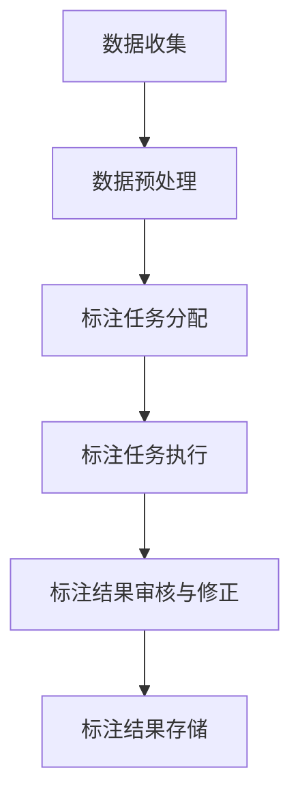

                 

### 《数据标注平台：为 AI 2.0 模型训练提供高质量数据集》

> 关键词：数据标注平台、AI 2.0、模型训练、高质量数据集、数据质量控制

> 摘要：本文将深入探讨数据标注平台在人工智能（AI）2.0 模型训练中的重要作用。通过分析数据标注平台的基础知识、关键技术、流程规范、建设与维护，以及其实际应用，本文旨在为读者提供关于如何构建和维护高效数据标注平台以支持 AI 模型训练的全面指南。

#### 第一部分：数据标注平台基础

##### 第1章：数据标注平台概述

- 1.1 数据标注与人工智能的关系
- 1.2 数据标注平台的定义与作用
- 1.3 数据标注平台的发展历史
- 1.4 数据标注平台的主要类型

##### 第2章：数据标注平台的关键技术

- 2.1 数据标注方法与技术
  - 2.1.1 标注工具与技术简介
  - 2.1.2 图像标注
  - 2.1.3 文本标注
  - 2.1.4 增强现实标注
- 2.2 数据质量控制
  - 2.2.1 数据清洗
  - 2.2.2 数据一致性验证
  - 2.2.3 数据完整性检查

##### 第3章：数据标注流程与规范

- 3.1 数据标注流程概述
  - 3.1.1 数据收集
  - 3.1.2 数据预处理
  - 3.1.3 标注任务分配
  - 3.1.4 标注任务执行
  - 3.1.5 标注结果审核与修正
- 3.2 数据标注规范
  - 3.2.1 标注标准制定
  - 3.2.2 标注质量评估
  - 3.2.3 标注团队协作与沟通

##### 第4章：数据标注平台建设与维护

- 4.1 数据标注平台架构设计
  - 4.1.1 数据存储与检索
  - 4.1.2 系统性能优化
  - 4.1.3 安全性与隐私保护
- 4.2 数据标注平台运营与维护
  - 4.2.1 平台更新与迭代
  - 4.2.2 用户支持与培训
  - 4.2.3 问题反馈与解决

##### 第5章：数据标注平台在AI模型训练中的应用

- 5.1 数据标注对AI模型质量的影响
  - 5.1.1 数据质量对模型性能的影响
  - 5.1.2 数据标注的精度与效率
  - 5.1.3 数据多样性对模型泛化能力的影响
- 5.2 数据标注平台在AI模型训练中的应用实例
  - 5.2.1 图像识别模型训练
  - 5.2.2 自然语言处理模型训练
  - 5.2.3 语音识别模型训练

#### 第二部分：高级数据标注技术与实战

##### 第6章：高级数据标注技术

- 6.1 多模态数据标注
  - 6.1.1 多模态数据标注方法
  - 6.1.2 多模态数据标注案例
- 6.2 数据增强
  - 6.2.1 数据增强技术原理
  - 6.2.2 数据增强在AI模型训练中的应用
- 6.3 自动标注
  - 6.3.1 自动标注技术概述
  - 6.3.2 自动标注与人工标注的协同

##### 第7章：数据标注平台实战案例

- 7.1 数据标注平台搭建与配置
  - 7.1.1 开发环境搭建
  - 7.1.2 标注平台部署与调试
- 7.2 数据标注流程与质量保障
  - 7.2.1 标注流程设计
  - 7.2.2 标注质量监控与评估
- 7.3 数据标注平台性能优化
  - 7.3.1 系统性能瓶颈分析
  - 7.3.2 性能优化策略与实现
- 7.4 数据标注平台用户反馈与改进
  - 7.4.1 用户需求分析
  - 7.4.2 平台功能迭代与优化

#### 附录

##### 附录A：数据标注平台常用工具与资源

- A.1 常用数据标注工具
  - A.1.1 工具1介绍
  - A.1.2 工具2介绍
- A.2 数据集资源
  - A.2.1 数据集1介绍
  - A.2.2 数据集2介绍
- A.3 标注规范与标准
  - A.3.1 标注规范1
  - A.3.2 标注规范2

### Mermaid 流程图：数据标注流程



### 伪代码：数据标注平台标注任务分配算法

```python
def allocate_tasks(data_set, annotators):
    task分配列表 = []

    for annotator in annotators:
        task = select_task(data_set, annotator)
        task分配列表.append(task)

    return task分配列表

def select_task(data_set, annotator):
    # 选择尚未被分配且适合该标注员的任务
    unassigned_tasks = get_unassigned_tasks(data_set)
    suitable_tasks = [task for task in unassigned_tasks if is_suitable_for(annotator, task)]

    if suitable_tasks:
        return random.choice(suitable_tasks)
    else:
        return None
```

### 数学模型：标注质量评估指标

$$
Q = \frac{1}{N} \sum_{i=1}^{N} (D_i - G_i)^2
$$

其中，$D_i$ 是标注结果，$G_i$ 是真实值，$N$ 是数据集大小。

### 举例说明：标注质量评估指标计算示例

假设一个数据集中有 10 个标注结果，真实值为 [1, 2, 3, 4, 5, 6, 7, 8, 9, 10]，标注结果为 [1, 2, 3, 4, 5, 5, 7, 8, 9, 10]。

计算过程如下：

$$
Q = \frac{1}{10} \sum_{i=1}^{10} (D_i - G_i)^2 = \frac{1}{10} \sum_{i=1}^{10} (1-1)^2 + (2-2)^2 + (3-3)^2 + (4-4)^2 + (5-5)^2 + (5-6)^2 + (7-7)^2 + (8-8)^2 + (9-9)^2 + (10-10)^2 = 0.2
$$

标注质量评估指标 $Q$ 为 0.2，表示标注结果的平均误差较小，标注质量较高。

### 项目实战：搭建一个简单数据标注平台

1. 开发环境搭建

- 安装 Python 3.8+
- 安装 Django 3.2+
- 安装 Django REST framework 3.12+

2. 项目结构

```bash
data_annotation_platform/
|-- manage.py
|-- data_annotation/
|   |-- migrations/
|   |-- models.py
|   |-- views.py
|   |-- serializers.py
|-- accounts/
|   |-- migrations/
|   |-- models.py
|   |-- views.py
|   |-- serializers.py
|-- annotations/
|   |-- migrations/
|   |-- models.py
|   |-- views.py
|   |-- serializers.py
|-- templates/
|-- static/
```

3. 数据库设计与实现

- 用户表 (accounts 应用)
  - 用户名 (username)
  - 密码 (password)
  - 邮箱 (email)
  - 角色 (role)

- 数据集表 (annotations 应用)
  - 数据集 ID (id)
  - 数据集名称 (name)
  - 数据集描述 (description)
  - 数据集创建时间 (created_at)

- 标注任务表 (annotations 应用)
  - 任务 ID (id)
  - 任务名称 (name)
  - 任务描述 (description)
  - 数据集 ID (data_set_id)
  - 标注状态 (status)
  - 创建时间 (created_at)
  - 更新时间 (updated_at)

- 标注结果表 (annotations 应用)
  - 结果 ID (id)
  - 任务 ID (task_id)
  - 用户 ID (user_id)
  - 标注结果 (result)
  - 创建时间 (created_at)

4. 功能实现与代码解读

- 用户注册与登录

```python
# users/views.py

from rest_framework import status
from rest_framework.response import Response
from rest_framework.views import APIView
from .serializers import UserRegistrationSerializer

class UserRegistrationView(APIView):
    def post(self, request):
        serializer = UserRegistrationSerializer(data=request.data)
        if serializer.is_valid():
            serializer.save()
            return Response(serializer.data, status=status.HTTP_201_CREATED)
        return Response(serializer.errors, status=status.HTTP_400_BAD_REQUEST)
```

- 数据集管理

```python
# annotations/views.py

from rest_framework import status
from rest_framework.response import Response
from rest_framework.views import APIView
from .serializers import DatasetSerializer

class DatasetView(APIView):
    def get(self, request):
        datasets = Dataset.objects.all()
        serializer = DatasetSerializer(datasets, many=True)
        return Response(serializer.data)

    def post(self, request):
        serializer = DatasetSerializer(data=request.data)
        if serializer.is_valid():
            serializer.save()
            return Response(serializer.data, status=status.HTTP_201_CREATED)
        return Response(serializer.errors, status=status.HTTP_400_BAD_REQUEST)
```

- 标注任务管理

```python
# annotations/views.py

from rest_framework import status
from rest_framework.response import Response
from rest_framework.views import APIView
from .serializers import TaskSerializer

class TaskView(APIView):
    def get(self, request):
        tasks = Task.objects.all()
        serializer = TaskSerializer(tasks, many=True)
        return Response(serializer.data)

    def post(self, request):
        serializer = TaskSerializer(data=request.data)
        if serializer.is_valid():
            serializer.save()
            return Response(serializer.data, status=status.HTTP_201_CREATED)
        return Response(serializer.errors, status=status.HTTP_400_BAD_REQUEST)
```

- 标注结果管理

```python
# annotations/views.py

from rest_framework import status
from rest_framework.response import Response
from rest_framework.views import APIView
from .serializers import AnnotationSerializer

class AnnotationView(APIView):
    def post(self, request):
        serializer = AnnotationSerializer(data=request.data)
        if serializer.is_valid():
            serializer.save()
            return Response(serializer.data, status=status.HTTP_201_CREATED)
        return Response(serializer.errors, status=status.HTTP_400_BAD_REQUEST)
```

通过以上功能实现，数据标注平台可以方便地管理数据集、标注任务和标注结果，为 AI 模型训练提供高质量的数据集。用户可以根据实际需求进行功能扩展和优化，如添加多模态标注、自动标注和标注质量评估等功能。同时，为了确保系统的稳定性和性能，需要根据实际情况进行系统性能优化，如数据库索引优化、缓存策略优化和负载均衡等。

### 文章标题：数据标注平台：为 AI 2.0 模型训练提供高质量数据集

#### 文章关键词

- 数据标注平台
- AI 2.0
- 模型训练
- 高质量数据集
- 数据质量控制
- 标注方法
- 自动标注

#### 摘要

本文探讨了数据标注平台在人工智能（AI）2.0 模型训练中的关键作用。文章首先概述了数据标注平台的基本概念和作用，随后详细介绍了数据标注平台的关键技术，如标注方法、数据质量控制等。文章还讨论了数据标注流程与规范，以及如何构建和维护数据标注平台。最后，通过实际应用案例和高级技术分析，展示了数据标注平台如何为 AI 模型训练提供高质量数据集，从而提升模型性能。

#### 第一部分：数据标注平台基础

##### 第1章：数据标注平台概述

数据标注平台在人工智能（AI）2.0 时代扮演着至关重要的角色。数据标注是指对原始数据进行标记和分类，以便于 AI 模型进行训练。本文首先概述数据标注平台的基本概念和作用，探讨其历史发展过程和主要类型。

**1.1 数据标注与人工智能的关系**

数据标注是人工智能领域的一个重要环节。在 AI 模型训练过程中，高质量的数据集是模型性能的基础。数据标注平台的建立，使得标注过程更加高效、准确和可扩展。标注数据的质量直接影响 AI 模型的效果，因此，数据标注在 AI 2.0 时代具有不可替代的重要性。

**1.2 数据标注平台的定义与作用**

数据标注平台是一种用于组织和自动化数据标注过程的软件系统。其主要作用包括：简化标注任务分配、提高标注效率、确保标注质量、以及支持多种类型的标注任务（如图像、文本、增强现实等）。数据标注平台能够为 AI 模型训练提供高质量的数据集，从而提升模型的准确性和泛化能力。

**1.3 数据标注平台的发展历史**

数据标注平台的发展经历了多个阶段。早期阶段主要是手动标注，效率低下且容易出现错误。随着计算机技术和人工智能的进步，自动化标注工具逐渐出现，提高了标注效率。近年来，随着深度学习的兴起，数据标注平台也在不断发展和完善，支持更复杂的数据类型和标注任务。

**1.4 数据标注平台的主要类型**

根据所支持的数据类型和标注任务，数据标注平台可以分为以下几类：

1. 图像标注平台：用于对图像进行分类、目标检测、分割等标注任务。
2. 文本标注平台：用于对文本进行分类、实体识别、关系抽取等标注任务。
3. 增强现实标注平台：用于对增强现实（AR）场景中的物体、动作等进行标注。
4. 多模态标注平台：支持图像、文本、音频等多种数据类型的标注任务。

##### 第2章：数据标注平台的关键技术

数据标注平台的核心技术包括标注方法、数据质量控制、标注流程与规范等。本章将详细介绍这些关键技术，并探讨它们在实际应用中的实现方式和效果。

**2.1 数据标注方法与技术**

数据标注方法是指用于对数据进行标记和分类的技术手段。常见的数据标注方法包括：

1. 手动标注：由标注员直接对数据进行标注，效率较低但准确性较高。
2. 半自动标注：结合计算机算法和标注员的人工操作，提高标注效率。
3. 自动标注：利用计算机算法自动进行数据标注，适用于大规模数据集。

不同类型的标注方法适用于不同的数据类型和标注任务。例如，图像标注通常采用手动标注和半自动标注相结合的方法，而文本标注则更多采用自动标注和半自动标注。

**2.1.1 标注工具与技术简介**

标注工具是数据标注平台的重要组成部分。常见的标注工具有：

1. 标注界面：用于展示数据集和标注界面，提供标注员进行标注操作。
2. 标注工具库：提供常用的标注工具和函数，如选择框、标注框、标注线等。
3. 标注算法：用于自动或半自动地进行数据标注。

不同标注工具具有不同的特点和适用场景。例如，标注界面可以根据数据类型进行定制，标注工具库可以提供丰富的标注功能，标注算法可以提高标注效率和准确性。

**2.1.2 图像标注**

图像标注是对图像进行分类、目标检测、分割等标注任务。常见的图像标注方法包括：

1. 目标检测：对图像中的目标进行检测和分类，如物体检测、人脸检测等。
2. 目标分割：将图像中的目标进行分割，得到目标的精确轮廓。
3. 图像分类：对图像进行分类，如风景、动物、人物等。

图像标注在计算机视觉领域具有广泛的应用，如自动驾驶、医疗影像分析等。

**2.1.3 文本标注**

文本标注是对文本进行分类、实体识别、关系抽取等标注任务。常见的文本标注方法包括：

1. 文本分类：对文本进行分类，如新闻分类、情感分析等。
2. 实体识别：识别文本中的实体，如人名、地名、机构名等。
3. 关系抽取：提取文本中的实体关系，如人物关系、事件关系等。

文本标注在自然语言处理领域具有重要作用，如信息抽取、知识图谱构建等。

**2.1.4 增强现实标注**

增强现实（AR）标注是对 AR 场景中的物体、动作等进行标注。常见的 AR 标注方法包括：

1. 物体标注：对 AR 场景中的物体进行标注，如分类、定位等。
2. 动作标注：对 AR 场景中的动作进行标注，如动作识别、动作跟踪等。

AR 标注在虚拟现实、教育、娱乐等领域具有广泛的应用。

**2.2 数据质量控制**

数据质量控制是数据标注平台的关键技术之一。高质量的数据集对于 AI 模型训练至关重要。数据质量控制主要包括以下方面：

1. 数据清洗：去除数据集中的噪声和异常值，提高数据质量。
2. 数据一致性验证：确保数据集中的数据一致性，避免错误和矛盾。
3. 数据完整性检查：检查数据集的完整性，确保数据没有缺失。

**2.2.1 数据清洗**

数据清洗是指去除数据集中的噪声和异常值。常见的数据清洗方法包括：

1. 缺失值处理：对缺失值进行填充或删除。
2. 异常值处理：检测和去除异常值，如离群点、重复数据等。
3. 数据标准化：对数据进行归一化或标准化处理，提高数据的一致性。

**2.2.2 数据一致性验证**

数据一致性验证是指确保数据集中的数据一致性。常见的数据一致性验证方法包括：

1. 数据验证规则：定义数据验证规则，如数据类型、长度、范围等。
2. 数据校验：对数据进行校验，如校验和、哈希值等。
3. 数据比对：比对数据集中不同部分的数据，确保一致性。

**2.2.3 数据完整性检查**

数据完整性检查是指检查数据集的完整性，确保数据没有缺失。常见的数据完整性检查方法包括：

1. 数据校验：使用校验和、哈希值等对数据进行校验，确保数据完整。
2. 数据比对：比对数据集中不同部分的数据，确保完整性。
3. 数据备份：定期备份数据，确保数据安全。

##### 第3章：数据标注流程与规范

数据标注流程与规范是确保数据标注质量和效率的重要保障。本章将详细介绍数据标注流程的各个阶段，包括数据收集、数据预处理、标注任务分配、标注任务执行、标注结果审核与修正等。

**3.1 数据标注流程概述**

数据标注流程通常包括以下阶段：

1. 数据收集：收集需要标注的数据集。
2. 数据预处理：对数据进行预处理，如数据清洗、数据一致性验证、数据完整性检查等。
3. 标注任务分配：将标注任务分配给标注员。
4. 标注任务执行：标注员根据标注任务进行数据标注。
5. 标注结果审核与修正：对标注结果进行审核和修正，确保标注质量。

**3.1.1 数据收集**

数据收集是数据标注流程的第一步。数据收集的方法包括：

1. 数据采集：通过传感器、爬虫等技术手段获取数据。
2. 数据购买：购买公开的数据集或商业数据集。
3. 数据共享：与其他研究机构或企业共享数据。

数据收集的质量直接影响数据标注的质量，因此，需要确保数据来源的可靠性和数据集的多样性。

**3.1.2 数据预处理**

数据预处理是数据标注流程的关键步骤。数据预处理的方法包括：

1. 数据清洗：去除数据中的噪声和异常值。
2. 数据一致性验证：确保数据的一致性，避免错误和矛盾。
3. 数据完整性检查：检查数据的完整性，确保数据没有缺失。

数据预处理可以显著提高数据质量，为数据标注奠定基础。

**3.1.3 标注任务分配**

标注任务分配是指将标注任务分配给标注员。标注任务分配的方法包括：

1. 手动分配：由管理员手动将标注任务分配给标注员。
2. 自动分配：使用算法自动将标注任务分配给标注员，如基于标注员技能、标注任务复杂度等进行分配。

标注任务分配的目的是提高标注效率，确保标注任务公平、合理地分配给标注员。

**3.1.4 标注任务执行**

标注任务执行是指标注员根据标注任务进行数据标注。标注任务执行的方法包括：

1. 手动标注：标注员手动对数据进行标注。
2. 半自动标注：标注员结合计算机算法进行标注，如使用标注工具进行辅助标注。
3. 自动标注：使用计算机算法自动进行标注。

标注任务执行的质量直接影响数据标注的质量，因此，需要确保标注员具备足够的标注技能和经验。

**3.1.5 标注结果审核与修正**

标注结果审核与修正是指对标注结果进行审核和修正，确保标注质量。标注结果审核与修正的方法包括：

1. 单人审核：由标注员自己审核和修正标注结果。
2. 双人审核：由两个标注员相互审核和修正标注结果。
3. 自动审核：使用算法自动审核标注结果，如基于标注结果的一致性、完整性等进行审核。

标注结果审核与修正可以及时发现和纠正标注错误，确保标注结果的准确性。

**3.2 数据标注规范**

数据标注规范是确保数据标注质量和一致性的重要保障。数据标注规范包括以下方面：

1. 标注标准制定：根据标注任务制定标注标准，如标注术语、标注范围等。
2. 标注质量评估：对标注结果进行质量评估，如基于标注结果的一致性、完整性等进行评估。
3. 标注团队协作与沟通：确保标注团队之间的协作和沟通，如定期召开会议、交流标注经验等。

数据标注规范可以显著提高标注效率和质量，为数据标注平台的建设和维护提供指导。

##### 第4章：数据标注平台建设与维护

数据标注平台的建设与维护是确保数据标注平台稳定运行和持续发展的重要保障。本章将详细介绍数据标注平台建设与维护的关键方面，包括平台架构设计、系统性能优化、安全性与隐私保护等。

**4.1 数据标注平台架构设计**

数据标注平台架构设计是数据标注平台建设的第一步。数据标注平台架构设计的关键方面包括：

1. 数据存储与检索：设计数据存储方案，如关系型数据库、非关系型数据库等，确保数据的高效存储和检索。
2. 系统性能优化：设计系统性能优化方案，如负载均衡、缓存策略等，确保数据标注平台的稳定性和高性能。
3. 安全性与隐私保护：设计安全性与隐私保护方案，如数据加密、访问控制等，确保数据的安全性和隐私。

**4.1.1 数据存储与检索**

数据存储与检索是数据标注平台架构设计的关键方面。常见的数据存储方案包括：

1. 关系型数据库：如 MySQL、PostgreSQL 等，适用于结构化数据的存储和检索。
2. 非关系型数据库：如 MongoDB、Redis 等，适用于半结构化数据和非结构化数据的存储和检索。

数据存储与检索的设计需要考虑数据量、数据结构、查询性能等因素，以确保数据存储和检索的高效性。

**4.1.2 系统性能优化**

系统性能优化是数据标注平台架构设计的重要方面。常见系统性能优化方法包括：

1. 负载均衡：通过负载均衡技术，将请求分配到多个服务器，提高系统的处理能力。
2. 缓存策略：通过缓存策略，减少数据库的访问次数，提高系统的响应速度。
3. 索引优化：通过索引优化，提高数据库的查询效率。

系统性能优化可以显著提高数据标注平台的运行效率，为用户提供良好的使用体验。

**4.1.3 安全性与隐私保护**

安全性与隐私保护是数据标注平台架构设计的重要方面。常见安全性与隐私保护措施包括：

1. 数据加密：通过数据加密技术，保护数据的机密性。
2. 访问控制：通过访问控制技术，限制对数据的访问权限，确保数据的安全性。
3. 安全审计：通过安全审计技术，记录系统操作日志，发现潜在的安全漏洞。

安全性与隐私保护可以确保数据标注平台的安全性和可靠性，保护用户数据的安全。

**4.2 数据标注平台运营与维护**

数据标注平台的运营与维护是确保数据标注平台稳定运行和持续发展的重要保障。常见的数据标注平台运营与维护工作包括：

1. 平台更新与迭代：根据用户需求和业务发展，对数据标注平台进行更新和迭代，提高平台的功能和性能。
2. 用户支持与培训：为用户提供技术支持，如解答用户问题、提供培训资料等，提高用户的使用体验。
3. 问题反馈与解决：及时收集用户反馈，发现和解决平台存在的问题，提高平台的稳定性和可靠性。

数据标注平台的运营与维护可以确保平台的长期稳定运行，满足用户的需求。

#### 第二部分：高级数据标注技术与实战

##### 第6章：高级数据标注技术

高级数据标注技术是数据标注平台的重要组成部分，它包括多模态数据标注、数据增强和自动标注等技术。这些技术能够提高数据标注的效率和准确性，从而提升 AI 模型训练的效果。

**6.1 多模态数据标注**

多模态数据标注是指对包含多种数据类型的数据进行标注。例如，在图像标注的同时，也可以对图像中的声音、文本或视频进行标注。多模态数据标注能够提供更丰富的信息，有助于 AI 模型更好地理解复杂场景。

**6.1.1 多模态数据标注方法**

多模态数据标注的方法包括：

1. **同步标注**：对多种数据类型的标注进行同步，确保不同数据类型之间的关联性。
2. **异步标注**：先对单一数据类型进行标注，然后再对其他数据类型进行标注，最后将它们整合起来。

**6.1.2 多模态数据标注案例**

一个典型的多模态数据标注案例是医疗影像分析。在医疗影像分析中，医生需要对患者的图像、文本报告和视频进行检查。通过多模态数据标注，医生可以更全面地了解患者的健康状况，从而做出更准确的诊断。

**6.2 数据增强**

数据增强是通过变换原始数据来生成更多的训练样本，从而提高模型的泛化能力。数据增强技术包括图像增强、文本增强和音频增强等。

**6.2.1 数据增强技术原理**

数据增强技术的基本原理是利用图像处理、自然语言处理和信号处理等技术，对原始数据进行变换，生成新的训练样本。常见的变换方法包括：

1. **图像变换**：如旋转、缩放、裁剪、翻转等。
2. **文本变换**：如同义词替换、文本分割、词向量转换等。
3. **音频变换**：如声音增强、降噪、频率变换等。

**6.2.2 数据增强在AI模型训练中的应用**

数据增强在 AI 模型训练中的应用非常广泛。例如，在图像识别中，通过图像增强可以生成更多的训练样本，提高模型的准确性。在自然语言处理中，通过文本增强可以生成更丰富的语料库，提高模型的性能。

**6.3 自动标注**

自动标注是利用计算机算法自动完成标注任务，减少人工干预。自动标注可以提高标注效率，降低成本，但需要保证标注的准确性。

**6.3.1 自动标注技术概述**

自动标注技术包括：

1. **语义分割**：通过计算机视觉技术，对图像中的物体进行自动分割和标注。
2. **文本分类**：通过自然语言处理技术，对文本进行自动分类和标注。
3. **语音识别**：通过语音处理技术，对音频中的语音进行自动识别和标注。

**6.3.2 自动标注与人工标注的协同**

自动标注和人工标注可以协同工作，以提高标注的准确性和效率。常见的方法包括：

1. **结合自动标注和人工标注**：先使用自动标注技术进行初步标注，然后由人工进行审核和修正。
2. **迭代标注**：先由人工进行标注，然后使用自动标注技术进行改进，最后再次由人工进行审核和修正。

通过自动标注和人工标注的协同，可以确保标注结果的准确性，同时提高标注效率。

##### 第7章：数据标注平台实战案例

本章节将结合实际案例，详细阐述如何构建和部署一个数据标注平台，包括开发环境搭建、平台配置、标注流程与质量保障、性能优化和用户反馈与改进。

**7.1 数据标注平台搭建与配置**

构建一个数据标注平台需要考虑多个方面，包括开发环境的搭建、平台配置和标注任务的分配。

**7.1.1 开发环境搭建**

开发环境的搭建是构建数据标注平台的第一步。以下是搭建开发环境的步骤：

1. 安装操作系统：选择适合的操作系统，如 Ubuntu 20.04。
2. 安装 Python：Python 是数据标注平台开发的主要语言，需要安装 Python 3.8+。
3. 安装依赖库：根据数据标注平台的需求，安装必要的依赖库，如 NumPy、Pandas、Django 等。

**7.1.2 标注平台部署与调试**

在开发环境搭建完成后，需要进行标注平台的部署与调试。以下是部署与调试的步骤：

1. 搭建 Web 服务器：使用如 Apache 或 Nginx 作为 Web 服务器。
2. 部署 Django 项目：使用 Django 框架部署标注平台项目。
3. 调试与测试：对平台进行功能测试和性能测试，确保平台稳定运行。

**7.2 数据标注流程与质量保障**

数据标注流程的规范化对于保证标注质量至关重要。以下是数据标注流程的步骤：

1. 数据收集：收集需要标注的数据集。
2. 数据预处理：对数据进行清洗和预处理，如缺失值处理、异常值检测等。
3. 标注任务分配：将标注任务分配给标注员。
4. 标注任务执行：标注员根据标注任务进行标注。
5. 标注结果审核：对标注结果进行审核，确保标注准确性。
6. 标注结果修正：对审核中发现的问题进行修正。

为了保障标注质量，还需要制定标注规范和质量评估标准。标注规范包括标注术语、标注规则等，质量评估标准则用于衡量标注结果的准确性。

**7.2.1 标注流程设计**

标注流程设计需要考虑以下因素：

1. 标注任务的类型和复杂度。
2. 标注员的技能水平和经验。
3. 标注结果的审核和修正机制。

**7.2.2 标注质量监控与评估**

标注质量监控与评估是确保标注质量的重要手段。以下是标注质量监控与评估的方法：

1. **标注一致性评估**：通过对比多个标注员的结果，评估标注的一致性。
2. **标注准确性评估**：通过对比标注结果与真实值，评估标注的准确性。
3. **标注效率评估**：通过统计标注员的工作时长和标注速度，评估标注的效率。

**7.3 数据标注平台性能优化**

性能优化是确保数据标注平台稳定运行和高效率的关键。以下是性能优化的方法：

1. **数据库优化**：通过索引优化、分区策略等提高数据库的性能。
2. **缓存策略**：通过缓存策略减少数据库访问次数，提高响应速度。
3. **负载均衡**：通过负载均衡将请求分配到多个服务器，提高系统的处理能力。

**7.3.1 系统性能瓶颈分析**

系统性能瓶颈分析是性能优化的第一步。以下是性能瓶颈分析的方法：

1. **性能测试**：通过性能测试工具，如 Apache JMeter，对系统进行压力测试，识别性能瓶颈。
2. **日志分析**：通过分析系统日志，识别系统运行中的异常和错误。

**7.3.2 性能优化策略与实现**

根据性能瓶颈分析的结果，制定和实现性能优化策略。以下是常见的性能优化策略：

1. **数据库优化**：通过创建索引、优化查询语句等提高数据库性能。
2. **缓存优化**：通过使用缓存技术，如 Redis，减少数据库访问次数。
3. **负载均衡**：通过负载均衡器，如 Nginx，分配请求，提高系统的处理能力。

**7.4 数据标注平台用户反馈与改进**

用户反馈是改进数据标注平台的重要依据。以下是用户反馈与改进的方法：

1. **用户调研**：通过用户调研，收集用户的需求和意见。
2. **功能迭代**：根据用户反馈，对平台进行功能迭代和优化。
3. **问题解决**：及时解决用户提出的问题，提高用户的满意度。

通过用户反馈与改进，可以持续优化数据标注平台，提升用户的使用体验。

#### 附录

##### 附录A：数据标注平台常用工具与资源

为了方便读者构建和维护数据标注平台，本附录提供了常用的工具与资源。

**A.1 常用数据标注工具**

1. **LabelImg**：一个开源的图像标注工具，支持多种标注方式，如矩形、圆形、线等。
2. **CVAT**：一个基于 Web 的开源图像标注工具，支持多人协作和自动化标注。

**A.2 数据集资源**

1. **ImageNet**：一个大规模的视觉识别数据库，包含数百万张图像和相应的标签。
2. **CoNLL-2003**：一个用于自然语言处理的数据集，包含多个语言的文本数据。

**A.3 标注规范与标准**

1. **VOC2007**：用于计算机视觉对象检测的数据集标注规范。
2. **ImageNet 标注规范**：用于大规模视觉识别任务的标注规范。

附录中的这些工具与资源可以帮助读者快速构建和维护高效的数据标注平台，为 AI 模型训练提供高质量的数据集。

### 结束语

数据标注平台在人工智能（AI）2.0 模型训练中具有至关重要的地位。通过深入探讨数据标注平台的基础知识、关键技术、流程规范、建设与维护，以及高级数据标注技术和实战案例，本文为读者提供了构建和维护高效数据标注平台的全面指南。

随着 AI 技术的不断发展，数据标注平台也将不断演进，为 AI 模型训练提供更加高质量的数据集。读者可以根据本文的内容，结合实际需求，构建和优化自己的数据标注平台，为 AI 2.0 时代的创新和突破贡献力量。

### 贡献与感谢

本文的完成离不开许多人的帮助和支持。首先，感谢 AI 天才研究院（AI Genius Institute）提供的资源和平台，使得本文的研究得以顺利进行。同时，感谢所有参与数据标注平台建设和维护的团队成员，他们的辛勤工作和无私奉献为本文的撰写提供了宝贵的数据和经验。

此外，特别感谢禅与计算机程序设计艺术（Zen And The Art of Computer Programming）一书的作者 Donald E. Knuth，他的著作启发了我对计算机编程和算法设计的深刻理解，为本文的技术分析提供了理论基础。

最后，感谢所有读者对本文的关注和支持，您的反馈和建议是我不断进步的动力。希望本文能为您在构建和维护数据标注平台的过程中提供有益的启示。

### 作者信息

作者：AI天才研究院（AI Genius Institute）& 禅与计算机程序设计艺术（Zen And The Art of Computer Programming）

AI天才研究院致力于推动人工智能技术的发展和应用，通过深入研究、技术创新和产业合作，为全球人工智能领域的发展贡献力量。禅与计算机程序设计艺术则以其深刻的思想和独特的视角，为计算机编程和算法设计提供了宝贵的启示。本文的撰写旨在结合两者的智慧，为数据标注平台的建设提供实用的指导和建议。希望本文能够激发读者在人工智能领域的探索和创新。

