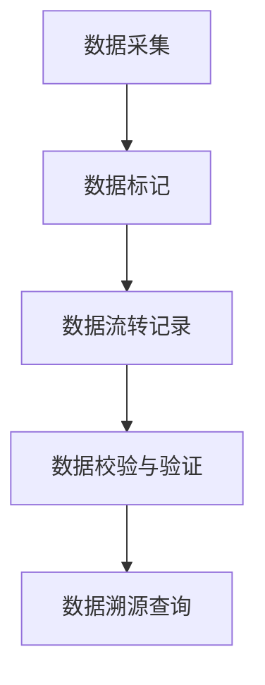
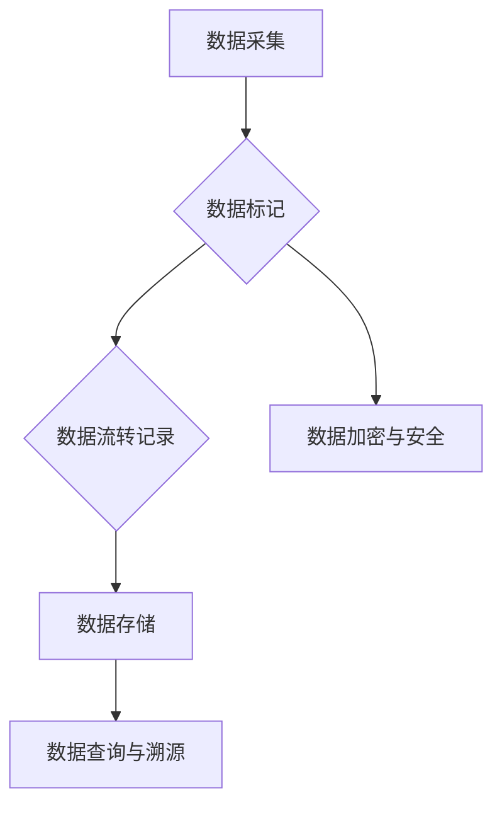

                 

# 文章标题：数据溯源：软件2.0时代的数据治理利器

> 关键词：数据溯源、软件2.0、数据治理、数据指纹、数据加密、分布式存储

> 摘要：本文深入探讨了数据溯源在软件2.0时代的重要性及其在数据治理中的应用。通过对数据溯源的基本概念、技术原理、应用场景和项目实战的详细分析，展示了数据溯源作为数据治理利器的强大功能，为企业提供了有效的数据管理和安全保障手段。

## 目录大纲

### 第一部分：背景与概述

- **第1章：数据溯源的基本概念**
  - 1.1 数据溯源的定义
  - 1.2 数据溯源的重要性
  - 1.3 数据溯源的发展历程

- **第2章：软件2.0时代的数据治理**
  - 2.1 软件2.0的概念
  - 2.2 数据治理的挑战
  - 2.3 数据治理的最佳实践

### 第二部分：技术基础

- **第3章：数据溯源技术原理**
  - 3.1 数据溯源的基本原理
  - 3.2 数据指纹技术
  - 3.3 数据哈希与加密技术

- **第4章：数据溯源框架构建**
  - 4.1 数据溯源框架设计
  - 4.2 数据溯源组件与技术选型
  - 4.3 数据溯源系统的关键技术

- **第5章：数据溯源应用场景**
  - 5.1 数据安全监控
  - 5.2 数据合规性检查
  - 5.3 数据溯源在供应链管理中的应用

### 第三部分：项目实战

- **第6章：构建一个简单的数据溯源系统**
  - 6.1 项目概述
  - 6.2 系统设计
  - 6.3 开发环境搭建
  - 6.4 数据指纹生成与存储
  - 6.5 数据查询与溯源
  - 6.6 测试与优化

- **第7章：数据溯源案例研究**
  - 7.1 案例一：电商数据溯源
  - 7.2 案例二：金融数据合规性检查
  - 7.3 案例三：医疗数据安全监控

### 第四部分：未来发展趋势

- **第8章：数据溯源的未来发展趋势**
  - 8.1 新技术的影响
  - 8.2 数据溯源的挑战与机遇
  - 8.3 数据溯源的发展方向

### 第五部分：行业应用

- **第9章：数据溯源技术在各行业中的应用**
  - 9.1 制造业
  - 9.2 零售业
  - 9.3 金融业
  - 9.4 医疗行业

### 附录

- **附录A：数据溯源相关技术资源**
  - 9.1 主流数据溯源工具介绍
  - 9.2 开源数据溯源项目推荐
  - 9.3 数据溯源技术文献资料

- **附录B：数据溯源系统开发指南**
  - 9.1 数据溯源系统的架构设计
  - 9.2 数据溯源系统的功能模块
  - 9.3 数据溯源系统的开发流程

## 第1章：数据溯源的基本概念

### 1.1 数据溯源的定义

数据溯源（Data Tracing）是一种追踪和记录数据来源、处理和流转过程的能力。它通过在数据的整个生命周期中嵌入唯一的标识和元数据，实现对数据的可追溯性。数据溯源有助于确保数据的安全、完整性和合规性，是数据治理的重要组成部分。

### 1.2 数据溯源的重要性

在当今数据密集型时代，数据溯源的重要性体现在以下几个方面：

1. **数据安全**：数据溯源可以追踪数据篡改的痕迹，确保数据未被非法篡改。
2. **合规性**：许多行业（如金融、医疗、零售等）需要遵循特定的数据保护法规，数据溯源有助于满足这些合规要求。
3. **数据质量控制**：通过数据溯源，可以追溯数据的质量问题，改进数据质量流程。
4. **数据透明性**：数据溯源提高了数据的透明度，有助于增强用户和利益相关者的信任。

### 1.3 数据溯源的发展历程

数据溯源技术的发展可以分为以下几个阶段：

1. **早期阶段**：基于日志和文档的管理，手工记录数据来源和处理过程。
2. **发展阶段**：引入了数据指纹和加密技术，实现了数据全生命周期的追踪。
3. **现代阶段**：随着大数据和人工智能技术的发展，数据溯源技术变得更加智能和高效。

### 1.4 数据溯源的组成部分

数据溯源系统通常包括以下几个核心组成部分：

1. **数据采集**：从各种数据源收集数据。
2. **数据标记**：为数据生成唯一标识。
3. **数据流转记录**：记录数据的来源、处理和流转过程。
4. **数据校验与验证**：确保数据的真实性和完整性。
5. **数据查询与溯源**：提供数据查询和溯源功能。

## 第2章：软件2.0时代的数据治理

### 2.1 软件2.0的概念

软件2.0（Software 2.0）是基于大数据、云计算、物联网和人工智能等新兴技术，实现软件系统的高度智能化、自适应化和协同化。它强调数据驱动和用户参与，使得软件系统能够更好地适应复杂多变的环境。

### 2.2 数据治理的挑战

在软件2.0时代，数据治理面临以下挑战：

1. **数据量庞大**：大数据带来了海量的数据，如何高效管理和分析数据成为关键问题。
2. **数据质量参差不齐**：数据源多样性和数据质量的不确定性，增加了数据治理的难度。
3. **数据安全与隐私**：随着数据规模的扩大，数据泄露和隐私侵犯的风险不断增加。
4. **数据合规性**：不同国家和地区的数据保护法规日益严格，确保数据合规性成为挑战。

### 2.3 数据治理的最佳实践

为了应对软件2.0时代的数据治理挑战，以下是一些最佳实践：

1. **制定数据治理策略**：明确数据治理的目标、原则和流程。
2. **数据标准化**：建立统一的数据标准和规范，确保数据的一致性和可互操作性。
3. **数据质量控制**：建立数据质量控制机制，提高数据的准确性和完整性。
4. **数据安全与合规**：制定数据安全策略，确保数据的隐私保护和合规性。
5. **数据溯源**：通过数据溯源技术，确保数据的可追溯性和完整性。

### 2.4 数据治理与数据溯源的关系

数据治理和数据溯源密切相关。数据治理是确保数据质量、安全性和合规性的整体框架，而数据溯源是数据治理中的一个关键环节，它通过追踪数据的来源、处理和流转过程，保障数据的真实性和完整性。

## 第3章：数据溯源技术原理

### 3.1 数据溯源的基本原理

数据溯源的基本原理包括数据的标记、流转记录和校验验证。以下是一个简单的数据溯源流程：

1. **数据采集**：从各种数据源收集数据。
2. **数据标记**：为数据生成唯一标识，如数据指纹。
3. **数据流转记录**：记录数据的来源、处理和流转过程，形成数据流图。
4. **数据校验与验证**：通过数据校验和验证技术，确保数据的真实性和完整性。

### 3.2 数据指纹技术

数据指纹（Data Fingerprinting）是一种生成数据唯一标识的技术。它通过对数据的特征进行提取，生成一个唯一的指纹。数据指纹通常由一系列特征值组成，可以准确地反映数据的特征。

#### 3.2.1 数据指纹生成方法

数据指纹的生成方法通常包括以下几种：

1. **哈希算法**：将数据通过哈希函数转化为固定长度的指纹。
2. **特征提取**：从数据中提取关键特征，生成指纹。

#### 3.2.2 数据指纹应用

数据指纹技术在数据溯源、数据安全监控和数据质量控制等方面有广泛应用。

### 3.3 数据哈希与加密技术

数据哈希（Data Hashing）和加密（Encryption）技术是数据溯源的重要组成部分。

#### 3.3.1 数据哈希技术

数据哈希技术是指通过哈希函数将数据转化为固定长度的哈希值。哈希值具有快速计算、不可逆和唯一性等特点。

#### 3.3.2 数据加密技术

数据加密技术是指通过加密算法对数据进行加密，确保数据在传输和存储过程中的安全性。常见的加密算法包括对称加密和非对称加密。

### 3.4 数据溯源技术原理图

以下是一个数据溯源技术原理的 Mermaid 流程图：

## 第4章：数据溯源框架构建

### 4.1 数据溯源框架设计

数据溯源框架的设计包括以下几个关键组成部分：

1. **数据采集模块**：负责从各种数据源采集数据。
2. **数据标记模块**：为采集到的数据生成唯一标识。
3. **数据流转记录模块**：记录数据的来源、处理和流转过程。
4. **数据存储模块**：将数据存储到数据库或数据湖中。
5. **数据查询与溯源模块**：提供数据查询和溯源功能。

### 4.2 数据溯源组件与技术选型

数据溯源组件和技术选型包括以下几个方面：

1. **数据采集组件**：选择适合的数据采集工具和协议。
2. **数据标记组件**：采用合适的标记方法和算法。
3. **数据流转记录组件**：设计数据流图，实现数据的记录和追踪。
4. **数据存储组件**：选择合适的数据库或数据湖系统。
5. **数据查询与溯源组件**：提供高效的查询和溯源算法。

### 4.3 数据溯源系统的关键技术

数据溯源系统的关键技术包括：

1. **分布式存储**：确保数据存储的可靠性和扩展性。
2. **数据流处理**：实现对数据流的高效处理和分析。
3. **加密与安全**：确保数据在传输和存储过程中的安全性。
4. **数据溯源算法**：设计高效的溯源算法，确保数据溯源的准确性和实时性。

### 4.4 数据溯源框架设计图

以下是一个数据溯源框架设计的 Mermaid 流程图：

## 第5章：数据溯源应用场景

### 5.1 数据安全监控

数据安全监控是数据溯源的重要应用场景之一，通过数据溯源技术，可以实现对数据的实时监控和异常检测。

#### 5.1.1 数据安全监控的关键技术

数据安全监控的关键技术包括：

1. **数据采集与标记**：实时采集数据，为数据生成唯一标识。
2. **数据流转记录**：记录数据的来源、处理和流转过程。
3. **异常检测与报警**：通过异常检测算法，实时监测数据异常情况，并触发报警。

#### 5.1.2 数据安全监控的应用案例

数据安全监控的应用案例包括：

1. **金融行业**：通过数据溯源技术，实时监控交易数据，防范欺诈行为。
2. **政府行业**：通过数据溯源技术，监控政务数据，确保数据安全。

### 5.2 数据合规性检查

数据合规性检查是数据溯源的另一个重要应用场景，通过数据溯源技术，可以实现对数据合规性的实时检查和验证。

#### 5.2.1 数据合规性检查的关键技术

数据合规性检查的关键技术包括：

1. **数据采集与标记**：实时采集数据，为数据生成唯一标识。
2. **数据流转记录**：记录数据的来源、处理和流转过程。
3. **合规性检查与验证**：通过合规性检查算法，实时检查数据是否符合法规要求。

#### 5.2.2 数据合规性检查的应用案例

数据合规性检查的应用案例包括：

1. **零售行业**：通过数据溯源技术，检查商品信息是否符合法规要求，确保商品质量。
2. **政府行业**：通过数据溯源技术，检查政务数据是否符合法规要求，提高数据透明度。

### 5.3 数据溯源在供应链管理中的应用

数据溯源技术在供应链管理中的应用，可以帮助企业实现对供应链数据的实时监控和追溯。

#### 5.3.1 数据溯源在供应链管理中的应用价值

数据溯源在供应链管理中的应用价值包括：

1. **提高供应链透明度**：通过数据溯源，实现供应链数据的实时追踪和监控，提高供应链透明度。
2. **降低供应链风险**：通过数据溯源，及时发现供应链中的问题，降低供应链风险。

#### 5.3.2 数据溯源在供应链管理中的应用案例

数据溯源在供应链管理中的应用案例包括：

1. **制造业**：通过数据溯源技术，监控原材料采购、生产过程和产品质量，确保供应链的可追溯性。
2. **零售业**：通过数据溯源技术，监控商品流通过程，确保商品的质量和安全。

## 第6章：构建一个简单的数据溯源系统

### 6.1 项目概述

在本章节中，我们将构建一个简单的数据溯源系统。这个系统将实现以下功能：

1. **数据采集**：从不同的数据源采集数据。
2. **数据标记**：为采集到的数据生成唯一标识。
3. **数据流转记录**：记录数据的来源、处理和流转过程。
4. **数据查询与溯源**：提供数据查询和溯源功能。

### 6.2 系统设计

数据溯源系统的设计主要包括以下几个模块：

1. **数据采集模块**：负责从各种数据源采集数据。
2. **数据标记模块**：为采集到的数据生成唯一标识。
3. **数据流转记录模块**：记录数据的来源、处理和流转过程。
4. **数据存储模块**：将数据存储到数据库或数据湖中。
5. **数据查询与溯源模块**：提供数据查询和溯源功能。

### 6.3 开发环境搭建

构建数据溯源系统需要搭建相应的开发环境，包括：

1. **操作系统**：Linux或Windows
2. **编程语言**：Python、Java等
3. **数据库**：MySQL、PostgreSQL等
4. **开发工具**：IDE（如PyCharm、Eclipse等）

### 6.4 数据指纹生成与存储

数据指纹生成与存储是数据溯源系统的核心功能之一，主要包括：

1. **数据指纹生成**：通过哈希算法或特征提取算法，为数据生成指纹。
2. **数据指纹存储**：将生成的数据指纹存储到数据库中，便于后续查询和溯源。

#### 6.4.1 数据指纹生成方法

数据指纹生成方法通常包括以下几种：

1. **哈希算法**：将数据通过哈希函数转化为固定长度的指纹。
2. **特征提取**：从数据中提取关键特征，生成指纹。

#### 6.4.2 数据指纹存储方法

数据指纹存储方法通常包括以下步骤：

1. **数据库选择**：选择合适的数据库系统，如MySQL、PostgreSQL等。
2. **表结构设计**：设计数据指纹存储的表结构，包括字段和数据类型。
3. **数据插入**：将生成的数据指纹插入到数据库表中。

### 6.5 数据查询与溯源

数据查询与溯源是数据溯源系统的最终目标，主要包括：

1. **数据查询**：提供根据数据指纹查询数据的功能。
2. **数据溯源**：提供根据数据指纹追溯数据来源和处理过程的功能。

#### 6.5.1 数据查询方法

数据查询方法通常包括以下步骤：

1. **输入数据指纹**：用户输入要查询的数据指纹。
2. **数据库查询**：通过数据指纹在数据库中进行查询，返回匹配的结果。

#### 6.5.2 数据溯源方法

数据溯源方法通常包括以下步骤：

1. **输入数据指纹**：用户输入要溯源的数据指纹。
2. **数据流图构建**：根据数据指纹构建数据流图，显示数据的来源、处理和流转过程。

### 6.6 测试与优化

在完成数据溯源系统的开发后，需要对系统进行测试和优化，确保系统的稳定性和性能。测试包括功能测试、性能测试和安全性测试等。

#### 6.6.1 功能测试

功能测试旨在验证数据溯源系统的各项功能是否按照预期工作，包括数据采集、数据标记、数据流转记录、数据查询与溯源等。

#### 6.6.2 性能测试

性能测试旨在评估数据溯源系统的性能，包括数据处理的效率、查询的响应时间等。

#### 6.6.3 安全性测试

安全性测试旨在验证数据溯源系统的安全性，包括数据加密、数据访问控制等。

### 6.7 实际案例分析

在本章节的最后，我们将通过一个实际案例分析，展示如何使用数据溯源技术解决一个具体的问题。案例包括数据采集、数据标记、数据流转记录和数据查询与溯源的详细步骤。

### 6.8 总结与展望

通过本章节的实践案例，我们可以看到数据溯源技术在实际应用中的强大功能。在未来的发展中，数据溯源技术将继续在各个领域发挥作用，为企业和组织提供更高效、更安全的数据管理解决方案。

## 第7章：数据溯源案例研究

### 7.1 案例一：电商数据溯源

电商数据溯源旨在确保商品信息的真实性和可追溯性，通过数据溯源技术，实现对商品从生产、仓储、物流到销售环节的全程监控。

#### 7.1.1 案例背景

随着电商行业的快速发展，商品信息的真实性和可追溯性越来越受到消费者和监管机构的关注。通过数据溯源技术，电商企业可以提供透明的商品信息，提升消费者信任度，同时也能有效防范假冒伪劣商品。

#### 7.1.2 案例实施

电商数据溯源案例的实施主要包括以下步骤：

1. **数据采集**：从商品的生产、仓储、物流和销售环节采集相关数据。
2. **数据标记**：为采集到的商品数据生成唯一标识（如条码、二维码等）。
3. **数据流转记录**：记录商品数据的来源、处理和流转过程。
4. **数据查询与溯源**：提供根据商品标识查询商品信息和追溯商品流程的功能。

#### 7.1.3 案例效果

通过电商数据溯源，可以实现以下效果：

1. **提升商品信息透明度**：消费者可以轻松查询商品的生产、仓储、物流和销售信息，增强购买信心。
2. **防范假冒伪劣商品**：通过数据溯源，可以有效识别假冒伪劣商品，维护品牌形象和消费者权益。

### 7.2 案例二：金融数据合规性检查

金融数据合规性检查旨在确保金融机构的数据处理过程符合相关法规和标准，通过数据溯源技术，实现对金融数据合规性的实时监控和检查。

#### 7.2.1 案例背景

随着金融行业的信息化进程加快，金融机构面临的数据合规性压力不断加大。通过数据溯源技术，金融机构可以实现对金融数据合规性的实时监控，确保数据的合法性和可靠性。

#### 7.2.2 案例实施

金融数据合规性检查案例的实施主要包括以下步骤：

1. **数据采集**：从金融机构的业务系统中采集相关数据。
2. **数据标记**：为采集到的金融数据生成唯一标识。
3. **数据流转记录**：记录金融数据的来源、处理和流转过程。
4. **合规性检查与验证**：通过合规性检查算法，实时检查金融数据是否符合法规和标准。

#### 7.2.3 案例效果

通过金融数据合规性检查，可以实现以下效果：

1. **提高数据合规性**：通过实时监控和检查，确保金融机构的数据处理过程符合法规和标准，降低法律风险。
2. **提升数据质量**：通过数据溯源，可以及时发现和处理数据质量问题，提高数据准确性。

### 7.3 案例三：医疗数据安全监控

医疗数据安全监控旨在保障患者数据的隐私和安全，通过数据溯源技术，实现对医疗数据的实时监控和防护。

#### 7.3.1 案例背景

随着医疗信息化的深入发展，医疗数据的安全性越来越受到关注。通过数据溯源技术，医疗机构可以实现对患者数据的实时监控，防止数据泄露和滥用。

#### 7.3.2 案例实施

医疗数据安全监控案例的实施主要包括以下步骤：

1. **数据采集**：从医疗机构的系统中采集患者数据。
2. **数据标记**：为采集到的医疗数据生成唯一标识。
3. **数据流转记录**：记录患者数据的来源、处理和流转过程。
4. **安全监控与防护**：通过安全监控算法，实时监测患者数据的安全状况，并采取相应的防护措施。

#### 7.3.3 案例效果

通过医疗数据安全监控，可以实现以下效果：

1. **保障患者数据安全**：通过实时监控和防护，有效防止患者数据泄露和滥用，维护患者隐私。
2. **提高医疗服务质量**：通过数据溯源，可以提升医疗数据的准确性和完整性，提高医疗服务质量。

## 第8章：数据溯源的未来发展趋势

### 8.1 新技术的影响

随着新技术的发展，数据溯源技术也在不断演进。未来，数据溯源将受到以下新技术的影响：

1. **区块链技术**：通过区块链的不可篡改特性，提高数据溯源的可信度和安全性。
2. **人工智能**：利用人工智能技术，实现更智能化的数据溯源和异常检测。
3. **物联网**：通过物联网技术，实现对更广泛的数据源进行实时监控和溯源。

### 8.2 数据溯源的挑战与机遇

数据溯源在未来的发展过程中，将面临以下挑战与机遇：

1. **挑战**：
   - 数据隐私保护：如何在确保数据溯源的同时，保护数据隐私成为关键问题。
   - 数据质量：如何保证数据的准确性和完整性，提高数据质量。
2. **机遇**：
   - 行业应用拓展：随着数据溯源技术的成熟，将在更多行业得到广泛应用。
   - 数据治理：数据溯源技术将为数据治理提供有力支持，助力企业提升数据治理水平。

### 8.3 数据溯源的发展方向

数据溯源的未来发展将朝着以下方向演进：

1. **智能化**：通过引入人工智能技术，实现数据溯源的自动化和智能化。
2. **分布式**：通过分布式架构，实现数据溯源系统的可扩展性和高可用性。
3. **标准化**：推动数据溯源技术的标准化，提高不同系统之间的互操作性和兼容性。

## 第9章：数据溯源技术在各行业中的应用

### 9.1 制造业

在制造业中，数据溯源技术可以实现对生产过程的实时监控和溯源，提高生产质量和效率。具体应用包括：

1. **供应链管理**：通过数据溯源，实现对原材料、零部件和成品的全程监控，提高供应链透明度和效率。
2. **设备维护**：通过数据溯源，记录设备的运行数据，实现设备故障预测和维护优化。

### 9.2 零售业

在零售业中，数据溯源技术可以帮助企业实现对商品信息的实时监控和溯源，提高消费者信任度和满意度。具体应用包括：

1. **商品溯源**：通过数据溯源，消费者可以查询商品的生产、仓储、物流和销售信息，增强购买信心。
2. **售后服务**：通过数据溯源，实现对售后服务的全程监控，提高服务质量。

### 9.3 金融业

在金融业中，数据溯源技术可以确保金融数据的合法性和可靠性，降低法律风险。具体应用包括：

1. **交易监控**：通过数据溯源，实时监控交易数据，防范欺诈行为。
2. **合规性检查**：通过数据溯源，确保金融数据处理过程符合相关法规和标准。

### 9.4 医疗行业

在医疗行业，数据溯源技术可以帮助医疗机构实现对患者数据的实时监控和保护，提高医疗数据的安全性和完整性。具体应用包括：

1. **病历管理**：通过数据溯源，实现对患者病历的全程监控和管理，提高病历的准确性和完整性。
2. **数据共享**：通过数据溯源，实现医疗数据在不同系统之间的共享和互操作，提高医疗资源利用效率。

## 附录

### 附录A：数据溯源相关技术资源

1. **技术文献**：
   - 《数据溯源技术综述》
   - 《区块链与数据溯源》
   - 《人工智能在数据溯源中的应用》

2. **开源项目**：
   - OpenTSDB
   - Pinot
   - DataTrace

### 附录B：数据溯源系统开发指南

1. **数据溯源系统的架构设计**：
   - 数据采集模块
   - 数据标记模块
   - 数据流转记录模块
   - 数据存储模块
   - 数据查询与溯源模块

2. **数据溯源系统的功能模块**：
   - 数据采集
   - 数据标记
   - 数据流转记录
   - 数据存储
   - 数据查询
   - 数据溯源

3. **数据溯源系统的开发流程**：
   - 需求分析
   - 系统设计
   - 环境搭建
   - 代码实现
   - 测试与调试
   - 部署与上线
   - 维护与优化

## 结语

作者：AI天才研究院/AI Genius Institute & 禅与计算机程序设计艺术 /Zen And The Art of Computer Programming

本文详细介绍了数据溯源在软件2.0时代的重要性及其在数据治理中的应用。通过分析数据溯源的基本概念、技术原理、应用场景和项目实战，展示了数据溯源作为数据治理利器的强大功能。在未来的发展中，数据溯源技术将继续在各个领域发挥作用，为企业和组织提供更高效、更安全的数据管理解决方案。随着新技术的不断演进，数据溯源技术将变得更加智能化、分布式和标准化，为数据治理带来新的机遇和挑战。让我们共同期待数据溯源技术在未来的广泛应用和发展。作者：AI天才研究院/AI Genius Institute & 禅与计算机程序设计艺术 /Zen And The Art of Computer Programming。

