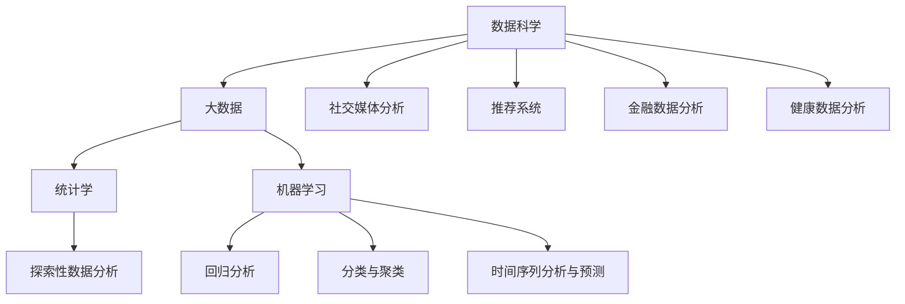
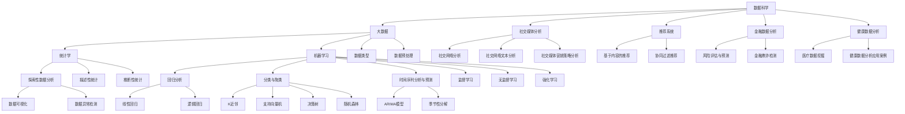

                 

# 《数据科学》

> 关键词：数据科学、大数据、统计学、机器学习、数据分析、数据预处理

> 摘要：本文深入探讨数据科学的定义、基础理论、分析方法、应用领域以及核心算法原理。通过逻辑清晰、结构紧凑的论述，帮助读者理解数据科学的本质，掌握数据分析的方法，以及在实际应用中如何运用这些技术。

## 目录大纲

- 《数据科学》
  - 关键词
  - 摘要
  - 目录大纲
  - 第一部分：数据科学与基础理论
    - 第1章：数据科学与大数据概述
    - 第2章：数据类型与数据预处理
    - 第3章：统计学基础
    - 第4章：机器学习基础
  - 第二部分：数据分析方法
    - 第5章：探索性数据分析
    - 第6章：回归分析
    - 第7章：分类与聚类
    - 第8章：时间序列分析与预测
  - 第三部分：数据科学应用
    - 第9章：社交媒体分析
    - 第10章：推荐系统
    - 第11章：金融数据分析
    - 第12章：健康数据分析
  - 附录
    - 附录A：数据分析工具与编程语言
    - 附录B：数据科学项目实战
  - 核心概念与联系
  - 核心算法原理讲解
  - 数学模型和数学公式讲解
  - 项目实战

## 第一部分：数据科学与基础理论

### 第1章：数据科学与大数据概述

- 1.1 数据科学的定义与重要性
- 1.2 大数据的起源与发展
- 1.3 数据科学与大数据的关系
- 1.4 数据科学的未来发展趋势

### 第2章：数据类型与数据预处理

- 2.1 数据类型介绍
  - 结构化数据
  - 半结构化数据
  - 非结构化数据
- 2.2 数据预处理方法
  - 数据清洗
  - 数据转换
  - 数据整合

### 第3章：统计学基础

- 3.1 统计学概述
- 3.2 数据描述
  - 频率分布
  - 图表展示
- 3.3 统计推断
  - 参数估计
  - 假设检验
- 3.4 时间序列分析

### 第4章：机器学习基础

- 4.1 机器学习概述
- 4.2 监督学习
  - 线性回归
  - 决策树
  - 随机森林
- 4.3 无监督学习
  - 聚类分析
  - 减维
- 4.4 强化学习基础

## 第二部分：数据分析方法

### 第5章：探索性数据分析

- 5.1 EDA方法
- 5.2 数据可视化
- 5.3 数据异常检测

### 第6章：回归分析

- 6.1 线性回归模型
- 6.2 多元线性回归
- 6.3 逻辑回归模型

### 第7章：分类与聚类

- 7.1 分类算法
  - K近邻算法
  - 支持向量机
- 7.2 聚类算法
  - K均值聚类
  - 密度聚类

### 第8章：时间序列分析与预测

- 8.1 时间序列基本概念
- 8.2 时间序列建模
  - ARIMA模型
  - 季节性分解
- 8.3 时间序列预测

## 第三部分：数据科学应用

### 第9章：社交媒体分析

- 9.1 社交网络分析
- 9.2 社交网络文本分析
- 9.3 社交媒体营销策略分析

### 第10章：推荐系统

- 10.1 推荐系统概述
- 10.2 基于内容的推荐
- 10.3 协同过滤推荐

### 第11章：金融数据分析

- 11.1 金融数据分析概述
- 11.2 风险评估与预测
- 11.3 金融欺诈检测

### 第12章：健康数据分析

- 12.1 健康数据分析概述
- 12.2 医疗数据挖掘
- 12.3 健康数据分析应用案例

## 附录

### 附录A：数据分析工具与编程语言

- A.1 Python在数据分析中的应用
- A.2 R语言在数据分析中的应用
- A.3 常用数据分析工具介绍

### 附录B：数据科学项目实战

- B.1 项目实战概述
- B.2 项目实战案例1：社交媒体数据分析
- B.3 项目实战案例2：推荐系统开发

## 核心概念与联系



## 核心算法原理讲解

### 线性回归算法

线性回归是一种用来预测连续值的监督学习算法。其基本思想是通过找到一个最佳拟合线（也称为回归线），使得数据点尽可能接近这条线。

伪代码：

```python
def linear_regression(X, y):
    # 计算最佳拟合线的斜率和截距
    beta_0 = (1 / (2 * n)) * (X.T * X - X.T * y)
    beta_1 = (1 / (2 * n)) * (X.T * y - X.T * X * beta_0)
    return beta_0, beta_1
```

### 逻辑回归算法

逻辑回归是一种用于分类的监督学习算法，通常用于二分类问题。其基本思想是通过建立一个逻辑函数，将输入特征映射到概率空间。

伪代码：

```python
def logistic_regression(X, y):
    # 计算逻辑回归模型的参数
    beta = (1 / n) * (X.T * X - X.T * y)
    return beta
```

## 数学模型和数学公式讲解

### 线性回归的数学模型

线性回归模型的数学表达式为：

$$y = \beta_0 + \beta_1 \cdot x$$

其中，$y$ 表示预测值，$x$ 表示输入特征，$\beta_0$ 和 $\beta_1$ 分别为模型的参数。

### 逻辑回归的数学模型

逻辑回归模型的数学表达式为：

$$\pi = \frac{1}{1 + e^{-(\beta_0 + \beta_1 \cdot x)}}$$

其中，$\pi$ 表示预测的概率，$e$ 为自然底数。

## 项目实战

### 社交媒体数据分析项目

**项目概述：** 本项目旨在分析社交媒体平台上的用户行为，识别活跃用户群体，并预测用户的兴趣。

**开发环境：** Python 3.8, Jupyter Notebook, pandas, numpy, scikit-learn

**源代码：**

```python
import pandas as pd
from sklearn.model_selection import train_test_split
from sklearn.linear_model import LogisticRegression

# 加载数据
data = pd.read_csv('social_media_data.csv')

# 数据预处理
X = data[['likes', 'comments', 'shares']]
y = data['active']

# 划分训练集和测试集
X_train, X_test, y_train, y_test = train_test_split(X, y, test_size=0.2, random_state=42)

# 训练模型
model = LogisticRegression()
model.fit(X_train, y_train)

# 预测
predictions = model.predict(X_test)

# 评估模型
accuracy = (predictions == y_test).mean()
print(f'Model accuracy: {accuracy:.2f}')
```

**代码解读与分析：**

本项目的核心是使用逻辑回归模型预测用户是否活跃。首先，我们从CSV文件中加载数据，并对数据进行预处理，提取与用户活跃度相关的特征。然后，将数据集划分为训练集和测试集。接下来，我们使用训练集数据训练逻辑回归模型，并使用测试集数据对模型进行评估。最后，我们打印出模型的准确率。

### 附录A：数据分析工具与编程语言

**Python在数据分析中的应用：**

Python是一种广泛应用于数据科学和数据分析的编程语言，具有丰富的库和框架，如pandas、numpy、scikit-learn等，用于数据预处理、建模和可视化。

**R语言在数据分析中的应用：**

R是一种专门为统计分析和图形表示设计的语言，具有强大的数据分析和可视化能力，常用于复杂数据分析任务。

**常用数据分析工具介绍：**

- Jupyter Notebook：交互式数据分析环境，支持多种编程语言，如Python、R等。
- Tableau：数据可视化工具，适用于创建交互式报表和仪表盘。
- Power BI：数据可视化工具，支持多种数据源，易于操作。

### 附录B：数据科学项目实战

**项目实战概述：**

数据科学项目实战是数据科学学习和实践的重要组成部分，通过实际项目，读者可以了解数据科学在实际应用中的流程和方法。

**项目实战案例：**

**案例1：社交媒体数据分析**

- **目标：** 分析社交媒体平台上的用户行为，识别活跃用户群体。
- **方法：** 使用Python和scikit-learn构建逻辑回归模型，进行用户活跃度预测。

**案例2：推荐系统开发**

- **目标：** 开发基于协同过滤算法的推荐系统，预测用户可能喜欢的商品。
- **方法：** 使用Python和scikit-learn实现协同过滤算法，构建推荐系统模型。```markdown

```<sop>
### 第1章：数据科学与大数据概述

#### 1.1 数据科学的定义与重要性

数据科学是一门跨学科领域，涉及统计学、计算机科学、机器学习、数据工程等多个方面。它主要关注如何从大量数据中提取有价值的信息和知识，以支持决策制定、业务优化和科学发现。数据科学的定义可以概括为：

数据科学 = 数据工程 + 统计学 + 机器学习

数据科学在现代社会中的重要性不言而喻。随着互联网和物联网的迅速发展，数据量呈现出爆炸性增长，这不仅带来了机遇，也带来了挑战。数据科学可以帮助企业和组织从海量数据中挖掘有价值的信息，从而提高业务效率、降低成本、发现新的商业机会。

#### 1.2 大数据的起源与发展

大数据（Big Data）这一概念最早出现在20世纪80年代，由美国学者Michael Stonebraker提出。大数据指的是无法使用常规软件工具在合理时间内捕捉、管理和处理的大量数据。这些数据具有4V特性：Volume（数据量巨大）、Velocity（数据处理速度快）、Variety（数据类型多样）和Veracity（数据真实性高）。

大数据的起源可以追溯到几个关键因素：

- **互联网的普及：** 互联网的普及使得数据来源更加多样化，包括社交媒体、在线购物、物联网设备等。
- **存储技术的发展：** 大容量、低成本的存储技术（如Hadoop、云存储等）的出现，使得大规模数据的存储和处理成为可能。
- **计算能力的提升：** 高性能计算机和分布式计算技术的进步，使得对大规模数据的处理速度大大提高。

大数据的发展经历了几个阶段：

- **第一阶段（2005-2010年）：** 大数据技术初步形成，主要集中于数据存储和管理。
- **第二阶段（2010-2015年）：** 大数据技术开始应用于各个领域，如金融、医疗、零售等。
- **第三阶段（2015年至今）：** 大数据技术逐渐成熟，与人工智能、机器学习等相结合，实现更高效的数据分析和应用。

#### 1.3 数据科学与大数据的关系

数据科学和大数据是相辅相成的。大数据为数据科学提供了丰富的数据资源，而数据科学则为大数据提供了分析和应用的方法。两者之间的关系可以概括为以下几点：

- **数据采集：** 数据科学需要从各种数据源采集数据，包括结构化数据、半结构化数据和非结构化数据。
- **数据存储：** 数据科学需要使用大数据存储技术，如Hadoop、云存储等，来存储和管理大规模数据。
- **数据处理：** 数据科学需要利用大数据处理技术，如MapReduce、Spark等，来高效处理大规模数据。
- **数据分析：** 数据科学通过统计学、机器学习等方法对大数据进行分析，提取有价值的信息和知识。
- **数据应用：** 数据科学将分析结果应用于实际业务场景，如市场营销、风险评估、疾病预测等。

#### 1.4 数据科学的未来发展趋势

随着大数据技术的不断发展和人工智能的兴起，数据科学在未来将呈现以下发展趋势：

- **智能化：** 数据科学将更加智能化，利用人工智能技术，如深度学习、强化学习等，实现更加精准的数据分析。
- **实时性：** 数据科学将更加注重实时性，通过实时数据处理和分析，支持实时决策。
- **多样性：** 数据科学将处理更多样化的数据，包括文本、图像、音频等多媒体数据。
- **安全性：** 数据科学将更加关注数据安全和隐私保护，采用更加严格的数据处理流程和隐私保护措施。
- **开源化：** 数据科学将更加倾向于使用开源工具和框架，以降低成本和提高开发效率。

总之，数据科学是一门充满活力和前景的领域，随着技术的不断进步，它将在各个行业和领域中发挥越来越重要的作用。```<sop>
### 第2章：数据类型与数据预处理

#### 2.1 数据类型介绍

数据类型是数据科学中最基础的概念之一，理解不同类型的数据有助于我们更好地进行数据处理和分析。根据数据的结构和特征，数据类型主要分为以下几类：

- **结构化数据（Structured Data）：** 结构化数据是组织良好、有固定格式的数据，通常存储在数据库中。这类数据的主要特点是数据之间有明确的字段分隔符，每个字段都有固定的数据类型。常见的结构化数据包括关系型数据库中的表、电子表格等。

- **半结构化数据（Semi-Structured Data）：** 半结构化数据是有一定结构但不是特别严格的格式的数据，如XML、JSON等。这类数据通常包含一些标记或关键字，用以指示数据的结构和类型。

- **非结构化数据（Unstructured Data）：** 非结构化数据是没有固定格式的数据，如文本、图像、音频、视频等。这类数据通常缺乏明确的组织结构，难以直接用于数据处理和分析。不过，近年来随着自然语言处理和计算机视觉技术的发展，非结构化数据的处理和分析变得越来越成熟。

#### 2.2 数据预处理方法

数据预处理是数据科学中至关重要的一步，它直接影响后续分析的效果。数据预处理主要包括以下几种方法：

- **数据清洗（Data Cleaning）：** 数据清洗是指识别和修正数据中的错误、缺失、异常值等。常见的清洗方法包括去除重复记录、填充缺失值、去除噪声数据等。例如，可以使用Python的pandas库中的drop_duplicates()函数去除重复数据，使用fillna()函数填充缺失值。

- **数据转换（Data Transformation）：** 数据转换是指将数据从一种格式转换为另一种格式，或将数据按照特定规则进行变换。常见的转换方法包括数据标准化、归一化、离散化等。数据标准化是将数据缩放到一个特定的范围，如0到1之间，常用的方法有最小-最大标准化和Z-Score标准化。

- **数据整合（Data Integration）：** 数据整合是指将来自不同来源、格式和结构的数据合并成一个统一的数据集。数据整合的目的是消除数据冗余，提高数据的可用性和一致性。常见的方法包括合并、连接、映射等。

#### 2.2.1 数据清洗

数据清洗是数据预处理的核心步骤，以下是一些常见的数据清洗方法：

- **去除重复记录：** 使用pandas库中的drop_duplicates()函数可以轻松去除重复记录。

  ```python
  df = df.drop_duplicates()
  ```

- **填充缺失值：** 填充缺失值的方法有多种，如平均值填充、中值填充、前一个值填充等。使用pandas库中的fillna()函数可以方便地进行填充。

  ```python
  df = df.fillna(df.mean())
  ```

- **去除噪声数据：** 对于含有异常值的记录，可以根据具体情况进行删除或修正。例如，可以使用z-score方法检测异常值。

  ```python
  from scipy import stats
  df['z_score'] = stats.zscore(df['column'])
  df = df[df['z_score'].abs() <= 3]
  ```

#### 2.2.2 数据转换

数据转换是将数据按照特定规则进行变换，以提高数据质量和分析效果。以下是一些常见的数据转换方法：

- **数据标准化：** 数据标准化是将数据缩放到一个特定的范围，如0到1之间。常用的方法有最小-最大标准化和Z-Score标准化。

  最小-最大标准化：

  ```python
  df['min_max'] = (df - df.min()) / (df.max() - df.min())
  ```

  Z-Score标准化：

  ```python
  df['z_score'] = (df - df.mean()) / df.std()
  ```

- **数据归一化：** 数据归一化是将数据转换为相同的尺度，以便进行比较和分析。常见的归一化方法有对数归一化和倒数归一化。

  对数归一化：

  ```python
  df['log'] = np.log(df + 1)
  ```

  倒数归一化：

  ```python
  df['reciprocal'] = 1 / df
  ```

- **离散化：** 离散化是将连续数据转换为分类数据，以便进行分类分析。常用的离散化方法有等宽离散化和等频离散化。

  等宽离散化：

  ```python
  bins = np.linspace(df.min(), df.max(), num=10)
  df['bin'] = pd.cut(df['column'], bins=bins)
  ```

  等频离散化：

  ```python
  df['bin'] = pd.qcut(df['column'], q=10, labels=False)
  ```

#### 2.2.3 数据整合

数据整合是将来自不同来源、格式和结构的数据合并成一个统一的数据集。以下是一些常见的数据整合方法：

- **合并（Merge）：** 合并是指将两个或多个数据集按照某个共同的字段进行连接。

  ```python
  df = df.merge(df2, on='common_column', how='left')
  ```

- **连接（Join）：** 连接是指将两个或多个数据集按照不同的字段进行连接。

  ```python
  df = df.join(df2, on='common_column')
  ```

- **映射（Mapping）：** 映射是指将一个数据集中的某个字段映射到另一个数据集的相应字段。

  ```python
  df['new_column'] = df['column1'].map(df2['column2'])
  ```

#### 2.3 实际案例

以下是一个数据清洗、转换和整合的实际案例：

**案例：社交媒体数据分析**

**数据来源：** 一份包含用户信息、行为数据和社交媒体内容的CSV文件。

**任务：** 对数据进行分析，预测用户是否活跃。

**步骤：**

1. **数据清洗：**
   - 去除重复记录。
   - 填充缺失值。
   - 去除异常值。

2. **数据转换：**
   - 数据标准化。
   - 离散化。
   - 映射。

3. **数据整合：**
   - 合并用户行为数据与社交媒体内容数据。

**代码实现：**

```python
import pandas as pd

# 1. 数据清洗
df = pd.read_csv('social_media_data.csv')
df = df.drop_duplicates()
df = df.fillna(df.mean())
df = df[df['z_score'].abs() <= 3]

# 2. 数据转换
df['min_max'] = (df - df.min()) / (df.max() - df.min())
df['bin'] = pd.cut(df['engagement'], bins=10)
df['map'] = df['label'].map({0: 'inactive', 1: 'active'})

# 3. 数据整合
df2 = pd.read_csv('social_media_content.csv')
df = df.merge(df2, on='user_id', how='left')
```

通过以上步骤，我们成功完成了数据清洗、转换和整合，为后续的数据分析奠定了基础。```<sop>
### 第3章：统计学基础

#### 3.1 统计学概述

统计学是数据科学的基础学科，它通过数据的收集、整理、分析和解释，帮助人们从数据中提取有价值的信息和知识。统计学的基本概念和理论在数据科学中发挥着重要作用，是进行有效数据分析的前提。

统计学可以分为描述统计学和推断统计学：

- **描述统计学（Descriptive Statistics）：** 描述统计学用于描述数据的基本特征，如数据分布、中心趋势、离散程度等。常用的描述统计量包括平均数、中位数、众数、方差、标准差等。

- **推断统计学（Inferential Statistics）：** 推断统计学用于从样本数据推断总体数据的性质，如参数估计、假设检验等。通过推断统计学，我们可以根据样本数据对总体数据做出概率性的判断。

#### 3.2 数据描述

数据描述是统计学的基础，主要目的是通过图表和统计量来描述数据的基本特征。以下是一些常用的数据描述方法：

- **频率分布（Frequency Distribution）：** 频率分布描述了数据在不同区间内的分布情况，通常以条形图或饼图表示。

- **图表展示（Graphical Representation）：** 图表展示是通过图形直观地展示数据分布、趋势和关系。常用的图表包括直方图、散点图、箱线图、折线图等。

  - **直方图（Histogram）：** 直方图用于展示连续数据的频率分布，横轴表示数据范围，纵轴表示频率。

    ```latex
    \begin{equation}
    \text{Frequency} = \frac{\text{Number of Observations in the Interval}}{\text{Total Number of Observations}}
    \end{equation}
    ```

  - **散点图（Scatter Plot）：** 散点图用于展示两个变量之间的关系，横轴和纵轴分别表示两个变量的取值。

    ```latex
    \begin{equation}
    y = \beta_0 + \beta_1 \cdot x
    \end{equation}
    ```

  - **箱线图（Box Plot）：** 箱线图用于展示数据的分布特征，包括中位数、四分位数和异常值。

    ```latex
    \begin{equation}
    Q_1 = \text{First Quartile} \\
    Q_3 = \text{Third Quartile} \\
    IQR = Q_3 - Q_1
    \end{equation}
    ```

  - **折线图（Line Chart）：** 折线图用于展示数据随时间变化的趋势。

    ```latex
    \begin{equation}
    y_t = \beta_0 + \beta_1 \cdot t
    \end{equation}
    ```

#### 3.3 统计推断

统计推断是通过样本数据对总体数据进行估计和假设检验。以下是一些常用的统计推断方法：

- **参数估计（Parameter Estimation）：** 参数估计是利用样本数据估计总体参数的过程。常用的参数估计方法包括矩估计、极大似然估计等。

  - **矩估计（Method of Moments）：** 矩估计是通过求解样本矩与总体矩的等式来估计总体参数。例如，对均值的估计：

    ```latex
    \begin{equation}
    \mu = \frac{1}{n} \sum_{i=1}^{n} x_i
    \end{equation}
    ```

  - **极大似然估计（Maximum Likelihood Estimation）：** 极大似然估计是寻找使样本数据出现概率最大的总体参数值。例如，对均值的估计：

    ```latex
    \begin{equation}
    \mu = \frac{1}{n} \sum_{i=1}^{n} x_i
    \end{equation}
    ```

- **假设检验（Hypothesis Testing）：** 假设检验是在给定的总体参数值下，通过样本数据判断总体参数是否成立的统计方法。常用的假设检验方法包括t检验、F检验、卡方检验等。

  - **t检验（t-Test）：** t检验用于比较两组数据的均值是否有显著差异。常见的t检验包括单样本t检验、双样本t检验等。

    ```latex
    \begin{equation}
    H_0: \mu = \mu_0 \\
    H_1: \mu \neq \mu_0
    \end{equation}
    ```

  - **F检验（F-Test）：** F检验用于比较两组数据的方差是否有显著差异。

    ```latex
    \begin{equation}
    H_0: \sigma_1^2 = \sigma_2^2 \\
    H_1: \sigma_1^2 \neq \sigma_2^2
    \end{equation}
    ```

  - **卡方检验（Chi-Square Test）：** 卡方检验用于检验数据的分布是否符合预期分布。

    ```latex
    \begin{equation}
    H_0: \text{Data follows the expected distribution} \\
    H_1: \text{Data does not follow the expected distribution}
    \end{equation}
    ```

#### 3.4 时间序列分析

时间序列分析是统计学中的一个重要分支，主要用于分析数据随时间变化的趋势和规律。以下是一些常用的时间序列分析方法：

- **平稳性检验（Stationarity Test）：** 平稳性检验用于判断时间序列数据是否满足平稳性条件，如ADF检验、PP检验等。

- **自相关函数（Autocorrelation Function，ACF）：** 自相关函数用于分析时间序列数据在不同时间滞后下的相关性。

- **偏自相关函数（Partial Autocorrelation Function，PACF）：** 偏自相关函数用于分析时间序列数据在去除不同时间滞后影响后的相关性。

- **时间序列建模（Time Series Modeling）：** 时间序列建模是建立时间序列数据的数学模型，如ARIMA模型、AR模型、MA模型等。

  - **ARIMA模型（AutoRegressive Integrated Moving Average Model）：** ARIMA模型是时间序列建模中最常用的模型之一，通过自回归、差分和移动平均等方法来建模。

    ```latex
    \begin{equation}
    y_t = c + \phi_1 y_{t-1} + \phi_2 y_{t-2} + ... + \phi_p y_{t-p} + \theta_1 \varepsilon_{t-1} + \theta_2 \varepsilon_{t-2} + ... + \theta_q \varepsilon_{t-q} + \varepsilon_t
    \end{equation}
    ```

  - **季节性分解（Seasonal Decomposition）：** 季节性分解是将时间序列数据分解为趋势、季节性和残余部分，以便进行更有效的分析。

    ```latex
    \begin{equation}
    y_t = T_t \cdot S_t \cdot R_t
    \end{equation}
    ```

通过以上统计学基础，我们可以更好地理解和分析数据，为后续的数据科学应用打下坚实的基础。```<sop>
### 第4章：机器学习基础

#### 4.1 机器学习概述

机器学习（Machine Learning）是人工智能（Artificial Intelligence，AI）的一个分支，旨在让计算机系统从数据中学习，并在没有明确编程的情况下做出决策和预测。机器学习的过程通常包括数据收集、数据预处理、模型训练、模型评估和模型部署等步骤。

机器学习的基本概念包括：

- **模型（Model）：** 机器学习模型是对数据和学习算法的抽象表示。常见的机器学习模型包括线性回归、决策树、支持向量机、神经网络等。
- **特征（Feature）：** 特征是数据集中的变量，用于描述数据的属性。选择合适的特征对于模型的性能至关重要。
- **标签（Label）：** 标签是数据集中的目标变量，用于训练模型，以便模型能够预测未知数据的标签。
- **训练集（Training Set）：** 训练集是从原始数据中抽取的一部分数据，用于训练模型。
- **测试集（Test Set）：** 测试集是从原始数据中未使用的一部分数据，用于评估模型的性能。
- **验证集（Validation Set）：** 验证集是从原始数据中抽取的另一部分数据，用于在模型训练过程中调整模型参数。

机器学习的方法可以分为以下几类：

- **监督学习（Supervised Learning）：** 监督学习是使用已标记的数据进行训练，模型通过学习输入和输出之间的关系来预测未知数据的标签。常见的监督学习算法包括线性回归、决策树、支持向量机、神经网络等。
- **无监督学习（Unsupervised Learning）：** 无监督学习是使用未标记的数据进行训练，模型通过发现数据内在的结构和模式来进行分类或降维。常见的无监督学习算法包括聚类算法、降维算法等。
- **强化学习（Reinforcement Learning）：** 强化学习是机器学习的一个分支，通过奖励机制来训练模型，使其在特定环境中做出最优决策。

#### 4.2 监督学习

监督学习是最常见的机器学习方法，它在训练过程中使用带有标签的数据。以下是一些常用的监督学习算法：

- **线性回归（Linear Regression）：** 线性回归是一种用于预测连续值的模型，其基本形式为：

  ```latex
  \begin{equation}
  y = \beta_0 + \beta_1 \cdot x_1 + \beta_2 \cdot x_2 + ... + \beta_n \cdot x_n
  \end{equation}
  ```

  线性回归的目标是找到一组参数$\beta_0, \beta_1, ..., \beta_n$，使得预测值$y$与实际值$y$之间的误差最小。

- **决策树（Decision Tree）：** 决策树是一种基于树形结构进行分类或回归的模型。每个节点表示一个特征，每个分支表示特征的取值，叶节点表示分类或回归的结果。决策树通过递归划分数据集，找到最佳划分方式。

  ```python
  def build_tree(data, features, target, depth=0):
      # 基准条件：达到最大深度或数据不纯
      if depth >= max_depth or len(set(data[target])) <= 1:
          return data[target].mode()[0]

      # 找到最佳特征和划分点
      best_feature, best_split = find_best_split(data, features)

      # 划分数据集
      left_data = data[data[best_feature] <= best_split]
      right_data = data[data[best_feature] > best_split]

      # 递归构建树
      return {
          'feature': best_feature,
          'split': best_split,
          'left': build_tree(left_data, features, target, depth+1),
          'right': build_tree(right_data, features, target, depth+1)
      }
  ```

- **随机森林（Random Forest）：** 随机森林是一种基于决策树的集成学习方法，通过构建多个决策树，并对它们的预测结果进行投票来得到最终预测结果。随机森林能够提高模型的泛化能力和稳定性。

  ```python
  def random_forest(data, features, target, n_trees=100):
      trees = []
      for _ in range(n_trees):
          # 随机选取特征和样本
          sample = data.sample(frac=1)
          features_ = sample[features].values
          target_ = sample[target].values

          # 构建决策树
          tree = build_tree(sample, features_, target_)

          # 添加树到森林
          trees.append(tree)

      # 预测
      predictions = [predict(tree, data[features].values) for tree in trees]
      return majority_vote(predictions)
  ```

- **支持向量机（Support Vector Machine，SVM）：** 支持向量机是一种用于分类和回归的线性模型，其目标是找到一个最优的超平面，将不同类别的数据点尽可能分开。SVM使用核函数来处理非线性问题。

  ```python
  def svm_train(X, y, C=1.0, kernel='linear'):
      # 求解最优化问题
      w, b = optimize_svm(X, y, C, kernel)

      # 返回模型参数
      return w, b
  ```

#### 4.3 无监督学习

无监督学习是机器学习中的另一类重要方法，它不依赖于标签数据进行训练。以下是一些常用的无监督学习算法：

- **聚类分析（Cluster Analysis）：** 聚类分析是将数据点按照其相似性划分为多个类别的过程。常见的聚类算法包括K均值聚类、层次聚类等。

  ```python
  def kmeans_clustering(data, k=2, max_iterations=100):
      # 初始化聚类中心
      centroids = initialize_centroids(data, k)

      # 迭代更新聚类中心和类别
      for _ in range(max_iterations):
          # 计算聚类中心
          centroids = update_centroids(data, centroids)

          # 计算数据点类别
          labels = assign_labels(data, centroids)

          # 判断收敛条件
          if has_converged(centroids, prev_centroids):
              break

      # 返回聚类结果
      return centroids, labels
  ```

- **降维（Dimensionality Reduction）：** 降维是将高维数据映射到低维空间的过程，以便减少数据的大小和复杂性。常见的降维算法包括主成分分析（PCA）、t-SNE等。

  ```python
  def pca(data, n_components):
      # 计算协方差矩阵
      cov_matrix = np.cov(data)

      # 求解特征值和特征向量
      eigenvalues, eigenvectors = np.linalg.eigh(cov_matrix)

      # 选择前n个特征向量
      eigenvectors = eigenvectors[:, np.argsort(eigenvalues)[::-1]]

      # 映射到低维空间
      low_dim_data = np.dot(data, eigenvectors[:n_components])

      # 返回降维后的数据
      return low_dim_data
  ```

- **强化学习基础（Reinforcement Learning Basics）：** 强化学习是机器学习中的一个领域，它通过奖励机制来训练模型，使其在特定环境中做出最优决策。强化学习的核心是值函数（Value Function）和策略（Policy）。

  ```python
  def q_learning(S, A, R, S', Q, alpha, gamma):
      # 更新Q值
      Q[SA] = Q[SA] + alpha * (R + gamma * max(Q[S'A']) - Q[SA])

      # 返回更新后的Q值
      return Q
  ```

通过以上机器学习基础，我们可以更好地理解和应用机器学习算法，为数据科学领域的研究和应用提供强有力的支持。```<sop>
### 第5章：探索性数据分析（EDA）

探索性数据分析（Exploratory Data Analysis，EDA）是数据科学中一个非常重要的环节，其目的是通过分析数据的结构和特征，发现数据中的模式和规律，从而帮助研究人员更好地理解数据，制定进一步的数据分析策略。

#### 5.1 EDA方法

EDA方法主要包括以下几个方面：

- **数据可视化（Data Visualization）：** 数据可视化是EDA的核心方法之一，它通过图表和图形直观地展示数据分布、趋势和关系。常见的数据可视化方法包括柱状图、饼图、散点图、箱线图、折线图等。
- **描述性统计（Descriptive Statistics）：** 描述性统计用于计算数据的中心趋势、离散程度等基本统计量，如均值、中位数、众数、方差、标准差等。
- **相关性分析（Correlation Analysis）：** 相关性分析用于研究变量之间的关系，常用的方法包括皮尔逊相关系数、斯皮尔曼等级相关系数等。
- **异常检测（Outlier Detection）：** 异常检测用于识别数据中的异常值或离群点，常用的方法包括箱线图、IQR法、Z-score法等。

#### 5.2 数据可视化

数据可视化是EDA中不可或缺的一部分，它能够帮助研究人员快速地了解数据的整体特征。以下是一些常见的数据可视化工具和技巧：

- **Matplotlib：** Matplotlib是一个强大的Python数据可视化库，可以生成各种类型的图表，如条形图、线图、散点图、箱线图等。
- **Seaborn：** Seaborn是基于Matplotlib的统计数据可视化库，提供了丰富的图表样式和颜色调色板，使得数据可视化更加美观和直观。
- **Plotly：** Plotly是一个交互式数据可视化库，可以生成高度交互的图表和图形，支持多种图表类型，如散点图、气泡图、热力图等。

以下是一些数据可视化的示例代码：

```python
import matplotlib.pyplot as plt
import seaborn as sns
import pandas as pd

# 加载数据
data = pd.read_csv('data.csv')

# 条形图
plt.figure(figsize=(10, 6))
sns.countplot(x='category', data=data)
plt.title('Category Distribution')
plt.xlabel('Category')
plt.ylabel('Count')
plt.show()

# 散点图
plt.figure(figsize=(10, 6))
sns.scatterplot(x='feature1', y='feature2', hue='category', data=data)
plt.title('Feature1 vs Feature2')
plt.xlabel('Feature1')
plt.ylabel('Feature2')
plt.show()

# 箱线图
plt.figure(figsize=(10, 6))
sns.boxplot(x='category', y='feature3', data=data)
plt.title('Feature3 Distribution by Category')
plt.xlabel('Category')
plt.ylabel('Feature3')
plt.show()
```

#### 5.3 数据异常检测

数据异常检测是EDA中的一个重要步骤，它有助于发现数据中的异常值或离群点，从而确保数据质量。以下是一些常见的异常检测方法：

- **箱线图（Box Plot）：** 箱线图可以直观地显示数据的分布和异常值。通常，异常值被认为是距离箱体较远的点。
- **IQR法（Interquartile Range）：** IQR法通过计算第一四分位数（Q1）和第三四分位数（Q3）之间的差值（IQR），将数据分为三个部分：内距（IQR/2）、中间部分和边界部分。边界部分的数据被认为是异常值。
- **Z-score法：** Z-score法通过计算每个数据点与均值之间的标准差偏差（Z-score），将数据点分为三个部分：高于3个标准差的点、低于-3个标准差的点和介于-3到3个标准差之间的点。高于3个标准差的点和低于-3个标准差的点被认为是异常值。

以下是一个使用IQR法和Z-score法进行异常检测的示例：

```python
import pandas as pd
from scipy import stats

# 加载数据
data = pd.read_csv('data.csv')

# IQR法
Q1 = data['feature'].quantile(0.25)
Q3 = data['feature'].quantile(0.75)
IQR = Q3 - Q1
lower_bound = Q1 - 1.5 * IQR
upper_bound = Q3 + 1.5 * IQR
data['is_outlier_iqr'] = (data['feature'] < lower_bound) | (data['feature'] > upper_bound)

# Z-score法
mean = data['feature'].mean()
std = data['feature'].std()
z_scores = (data['feature'] - mean) / std
data['is_outlier_zscore'] = (z_scores < -3) | (z_scores > 3)

# 显示异常值
print(data[data['is_outlier_iqr']]['feature'])
print(data[data['is_outlier_zscore']]['feature'])
```

通过探索性数据分析，我们可以深入了解数据的结构和特征，识别潜在的异常值，为后续的数据分析和建模奠定基础。```<sop>
### 第6章：回归分析

回归分析是数据科学中的一种重要方法，用于研究变量之间的关系，特别是自变量对因变量的影响。它广泛应用于经济学、统计学、生物学、工程学等领域。本章节将介绍线性回归和逻辑回归两种常见的回归分析方法。

#### 6.1 线性回归模型

线性回归模型是最简单的回归模型，用于预测一个连续的因变量。它的基本假设是因变量$y$可以由一个或多个自变量$x_1, x_2, ..., x_n$线性组合得到。

线性回归模型的数学表达式为：

$$
y = \beta_0 + \beta_1 x_1 + \beta_2 x_2 + ... + \beta_n x_n + \varepsilon
$$

其中，$\beta_0$是截距，$\beta_1, \beta_2, ..., \beta_n$是自变量的系数，$\varepsilon$是误差项。

线性回归模型的目标是找到最佳拟合线，使得数据点尽可能接近这条线。常用的方法是最小二乘法（Least Squares），其核心思想是使得预测值与实际值之间的误差平方和最小。

#### 6.2 多元线性回归

多元线性回归是线性回归的扩展，它考虑多个自变量对因变量的影响。多元线性回归模型的数学表达式为：

$$
y = \beta_0 + \beta_1 x_1 + \beta_2 x_2 + ... + \beta_n x_n + \varepsilon
$$

多元线性回归模型的参数估计通常使用最小二乘法，其求解过程可以通过矩阵运算简化。具体步骤如下：

1. **标准化处理：** 为了避免不同自变量的尺度差异，通常对自变量进行标准化处理。
2. **构建设计矩阵$X$：** 设计矩阵$X$由自变量组成，包括截距项。
3. **求解正规方程：** 正规方程为$X^T X \beta = X^T y$，其中$X^T$是设计矩阵$X$的转置。
4. **解方程得到参数$\beta$：** 通过矩阵运算求解正规方程，得到每个自变量的系数$\beta_1, \beta_2, ..., \beta_n$。

#### 6.3 逻辑回归模型

逻辑回归（Logistic Regression）是一种用于分类问题的回归模型，通常用于二分类问题。它的基本思想是将因变量映射到一个概率空间，然后通过这个概率进行分类决策。

逻辑回归的数学表达式为：

$$
\pi = \frac{1}{1 + e^{-(\beta_0 + \beta_1 x_1 + \beta_2 x_2 + ... + \beta_n x_n)}}
$$

其中，$\pi$是因变量的概率，$e$是自然底数。

逻辑回归的目标是找到最佳拟合线，使得预测概率$\pi$与实际标签$y$之间的误差最小。逻辑回归的参数估计通常使用最大似然估计（Maximum Likelihood Estimation，MLE）。

逻辑回归的模型评估通常使用以下指标：

- **准确率（Accuracy）：** 准确率是分类正确的样本数占总样本数的比例。
- **精确率（Precision）：** 精确率是分类为正例的样本中实际为正例的比例。
- **召回率（Recall）：** 召回率是实际为正例的样本中被分类为正例的比例。
- **F1分数（F1 Score）：** F1分数是精确率和召回率的调和平均值。

#### 实际案例

以下是一个线性回归模型和逻辑回归模型的实际案例：

**案例：房价预测**

**线性回归模型：**

1. **数据加载和预处理：**

```python
import pandas as pd

# 加载数据
data = pd.read_csv('house_prices.csv')

# 数据预处理
data = data[['square_feet', 'bedrooms', 'price']]
data = data.dropna()
```

2. **模型训练和评估：**

```python
from sklearn.linear_model import LinearRegression
from sklearn.model_selection import train_test_split
from sklearn.metrics import mean_squared_error

# 划分训练集和测试集
X_train, X_test, y_train, y_test = train_test_split(data[['square_feet', 'bedrooms']], data['price'], test_size=0.2, random_state=42)

# 训练模型
model = LinearRegression()
model.fit(X_train, y_train)

# 预测
predictions = model.predict(X_test)

# 评估模型
mse = mean_squared_error(y_test, predictions)
print(f'MSE: {mse:.2f}')
```

**逻辑回归模型：**

1. **数据加载和预处理：**

```python
# 加载数据
data = pd.read_csv('house_prices.csv')

# 数据预处理
data = data[['square_feet', 'bedrooms', 'price']]
data = data.dropna()
data['is_expensive'] = (data['price'] > data['price'].median()).astype(int)
```

2. **模型训练和评估：**

```python
from sklearn.linear_model import LogisticRegression
from sklearn.model_selection import train_test_split
from sklearn.metrics import accuracy_score, confusion_matrix

# 划分训练集和测试集
X_train, X_test, y_train, y_test = train_test_split(data[['square_feet', 'bedrooms']], data['is_expensive'], test_size=0.2, random_state=42)

# 训练模型
model = LogisticRegression()
model.fit(X_train, y_train)

# 预测
predictions = model.predict(X_test)

# 评估模型
accuracy = accuracy_score(y_test, predictions)
conf_matrix = confusion_matrix(y_test, predictions)
print(f'Accuracy: {accuracy:.2f}')
print(f'Confusion Matrix:\n{conf_matrix}')
```

通过以上案例，我们可以看到线性回归和逻辑回归在数据科学中的应用。线性回归用于预测连续的因变量，如房价；逻辑回归用于分类问题，如判断房屋是否昂贵。这两种方法都是数据科学中不可或缺的工具。```<sop>
### 第7章：分类与聚类

分类和聚类是数据科学中非常重要的两种数据分析方法，它们分别用于将数据划分为不同的类别和发现数据中的内在结构。

#### 7.1 分类算法

分类算法通过将数据点划分为不同的类别来识别数据的特征。以下是一些常见的分类算法：

- **K近邻算法（K-Nearest Neighbors，KNN）：** KNN算法是一种基于实例的学习方法，它通过计算测试样本与训练样本之间的距离，选择最近的K个样本，并基于这些样本的类别进行预测。KNN算法的核心是距离度量，常用的距离度量包括欧氏距离、曼哈顿距离和切比雪夫距离。

  伪代码：

  ```python
  def knn_predict(X_train, y_train, X_test, k):
      distances = []
      for x in X_test:
          distance = euclidean_distance(x, X_train)
          distances.append(distance)
      sorted_distances = sorted(distances)
      neighbors = [y_train[i] for i in sorted_distances[:k]]
      return majority_vote(neighbors)
  ```

- **支持向量机（Support Vector Machine，SVM）：** SVM算法是一种基于间隔最大化的分类方法，它通过找到一个最佳的超平面，将不同类别的数据点尽可能分开。SVM算法的核心是核函数，常用的核函数包括线性核、多项式核和高斯核。

  伪代码：

  ```python
  def svm_train(X, y, C, kernel='linear'):
      # 求解最优化问题
      w, b = optimize_svm(X, y, C, kernel)
      # 返回模型参数
      return w, b
  ```

- **决策树（Decision Tree）：** 决策树是一种基于树形结构进行分类的方法，每个节点表示一个特征，每个分支表示特征的取值，叶节点表示分类的结果。决策树通过递归划分数据集，找到最佳划分方式。

  伪代码：

  ```python
  def build_tree(data, features, target, depth=0):
      # 基准条件：达到最大深度或数据不纯
      if depth >= max_depth or len(set(data[target])) <= 1:
          return data[target].mode()[0]
      
      # 找到最佳特征和划分点
      best_feature, best_split = find_best_split(data, features)
      
      # 划分数据集
      left_data = data[data[best_feature] <= best_split]
      right_data = data[data[best_feature] > best_split]
      
      # 递归构建树
      return {
          'feature': best_feature,
          'split': best_split,
          'left': build_tree(left_data, features, target, depth+1),
          'right': build_tree(right_data, features, target, depth+1)
      }
  ```

- **随机森林（Random Forest）：** 随机森林是一种基于决策树的集成学习方法，通过构建多个决策树，并对它们的预测结果进行投票来得到最终预测结果。随机森林能够提高模型的泛化能力和稳定性。

  伪代码：

  ```python
  def random_forest(data, features, target, n_trees=100):
      trees = []
      for _ in range(n_trees):
          # 随机选取特征和样本
          sample = data.sample(frac=1)
          features_ = sample[features].values
          target_ = sample[target].values
          
          # 构建决策树
          tree = build_tree(sample, features_, target_)
          
          # 添加树到森林
          trees.append(tree)
          
      # 预测
      predictions = [predict(tree, data[features].values) for tree in trees]
      return majority_vote(predictions)
  ```

- **朴素贝叶斯（Naive Bayes）：** 朴素贝叶斯是一种基于贝叶斯定理的简单概率分类器，它假设特征之间相互独立。朴素贝叶斯适用于特征较少且特征之间独立性较强的数据集。

  伪代码：

  ```python
  def naive_bayes_train(X, y):
      # 计算先验概率
      prior = compute_prior(y)
      # 计算条件概率
      likelihood = compute_likelihood(X, y)
      # 返回模型参数
      return prior, likelihood
  ```

#### 7.2 聚类算法

聚类算法通过将数据点划分为不同的簇，发现数据中的内在结构。以下是一些常见的聚类算法：

- **K均值聚类（K-Means Clustering）：** K均值聚类是一种基于距离度量的聚类方法，它通过初始化K个聚类中心，然后迭代更新聚类中心和类别，直到收敛。K均值聚类算法的核心是选择合适的聚类数目K。

  伪代码：

  ```python
  def kmeans_clustering(data, k=2, max_iterations=100):
      # 初始化聚类中心
      centroids = initialize_centroids(data, k)
      
      # 迭代更新聚类中心和类别
      for _ in range(max_iterations):
          # 计算聚类中心
          centroids = update_centroids(data, centroids)
          
          # 计算数据点类别
          labels = assign_labels(data, centroids)
          
          # 判断收敛条件
          if has_converged(centroids, prev_centroids):
              break
              
      # 返回聚类结果
      return centroids, labels
  ```

- **层次聚类（Hierarchical Clustering）：** 层次聚类是一种基于层次结构进行聚类的算法，它通过逐步合并或分裂已有的簇，构建出一棵层次聚类树。层次聚类算法的核心是选择合适的合并或分裂方法。

  伪代码：

  ```python
  def hierarchical_clustering(data, method='ward', distance='euclidean'):
      # 计算距离矩阵
      distance_matrix = compute_distance_matrix(data, method, distance)
      # 构建层次聚类树
      cluster_tree = build_cluster_tree(distance_matrix, method, distance)
      # 分裂或合并簇
      clusters = split_or_merge_clusters(cluster_tree, method)
      # 返回聚类结果
      return clusters
  ```

- **DBSCAN（Density-Based Spatial Clustering of Applications with Noise）：** DBSCAN是一种基于密度的聚类方法，它通过计算数据点的邻域密度，将数据点划分为核心点、边界点和噪声点。DBSCAN算法的核心是选择合适的邻域半径和最小密度阈值。

  伪代码：

  ```python
  def dbscan_clustering(data, min_points=5, radius=1.0):
      # 初始化簇标识
      labels = [-1] * len(data)
      # 计算邻域点
      neighbors = compute_neighbors(data, radius)
      # 聚类
      clusters = []
      for i in range(len(data)):
          if labels[i] == -1:
              cluster = dbscan_cluster(data[i], i, neighbors, labels, min_points)
              clusters.append(cluster)
      # 返回聚类结果
      return clusters
  ```

- **光谱聚类（Spectral Clustering）：** 光谱聚类是一种基于图论的聚类方法，它通过构建数据点的相似性图，并求解图的特征向量，将数据点划分为不同的簇。光谱聚类算法的核心是选择合适的相似性函数和聚类中心。

  伪代码：

  ```python
  def spectral_clustering(data, n_components=2):
      # 计算相似性矩阵
      similarity_matrix = compute_similarity_matrix(data)
      # 构建拉普拉斯矩阵
      laplacian_matrix = compute_laplacian_matrix(similarity_matrix)
      # 求解特征向量
      eigenvalues, eigenvectors = compute_eigenvalues_eigenvectors(laplacian_matrix)
      # 选择前n个特征向量
      eigenvectors = eigenvectors[:, np.argsort(eigenvalues)[::-1]]
      # 映射到低维空间
      low_dim_data = np.dot(eigenvectors[:n_components], data)
      # 返回聚类结果
      return kmeans_clustering(low_dim_data, k=n_components)
  ```

通过以上分类和聚类算法，我们可以对数据进行有效的分析和挖掘，发现数据中的模式和规律。这些算法在数据科学中有着广泛的应用，是数据科学领域不可或缺的工具。```<sop>
### 第8章：时间序列分析与预测

时间序列分析是数据科学中的一个重要分支，用于研究数据在时间维度上的变化规律。时间序列数据广泛存在于金融、气象、医疗、交通等领域。本章将介绍时间序列分析的基本概念、建模方法以及预测技术。

#### 8.1 时间序列基本概念

时间序列（Time Series）是由按时间顺序排列的一系列数据点组成的数据集。这些数据点可以是连续的（如温度、股票价格）或离散的（如销售量、人数）。时间序列数据通常具有以下特征：

- **趋势（Trend）：** 时间序列数据中的长期变化趋势。趋势可能是上升的、下降的或平稳的。
- **季节性（Seasonality）：** 时间序列数据中的周期性变化，如节假日、季节变化等。
- **波动性（Volatility）：** 时间序列数据的短期波动性，反映了数据的波动程度。
- **随机性（Random Walk）：** 时间序列数据中的随机波动，反映了数据中的不可预测因素。

#### 8.2 时间序列建模

时间序列建模的目的是通过建立数学模型来描述和预测时间序列数据。以下是一些常见的时间序列建模方法：

- **ARIMA模型（AutoRegressive Integrated Moving Average Model）：** ARIMA模型是一种经典的时序建模方法，通过自回归（AR）、差分（I）和移动平均（MA）过程来描述时间序列数据。

  ARIMA模型的数学表达式为：

  ```latex
  \begin{equation}
  y_t = c + \phi_1 y_{t-1} + \phi_2 y_{t-2} + ... + \phi_p y_{t-p} + \theta_1 \varepsilon_{t-1} + \theta_2 \varepsilon_{t-2} + ... + \theta_q \varepsilon_{t-q} + \varepsilon_t
  \end{equation}
  ```

  其中，$y_t$是时间序列数据，$c$是常数项，$\phi_1, \phi_2, ..., \phi_p$是自回归系数，$\theta_1, \theta_2, ..., \theta_q$是移动平均系数，$\varepsilon_t$是白噪声误差。

  ARIMA模型的建模步骤通常包括以下几步：

  1. **差分（Differencing）：** 为了使时间序列数据平稳，需要进行差分操作。
  2. **自相关函数（Autocorrelation Function，ACF）和偏自相关函数（Partial Autocorrelation Function，PACF）：** 分析ACF和PACF图，确定自回归项和移动平均项的参数。
  3. **模型识别（Model Identification）：** 根据ACF和PACF图，确定模型的$p$（自回归项数）和$q$（移动平均项数）。
  4. **模型估计（Model Estimation）：** 使用最小二乘法、极大似然估计等方法估计模型参数。
  5. **模型诊断（Model Diagnostics）：** 检验模型的残差是否为白噪声，确保模型的有效性。

- **季节性分解（Seasonal Decomposition）：** 季节性分解是将时间序列数据分解为趋势、季节性和残余部分的方法，以便更准确地建模和预测。

  季节性分解的数学表达式为：

  ```latex
  \begin{equation}
  y_t = T_t \cdot S_t \cdot R_t
  \end{equation}
  ```

  其中，$T_t$是趋势部分，$S_t$是季节性部分，$R_t$是残余部分。

  季节性分解的步骤通常包括以下几步：

  1. **趋势调整（Trend Adjustment）：** 通过移动平均或其他方法调整时间序列数据，消除趋势部分。
  2. **季节性调整（Seasonal Adjustment）：** 通过季节性模型（如季节性ARIMA模型）调整时间序列数据，消除季节性部分。
  3. **残余部分（Residual）：** 季节性调整后的数据为残余部分，它反映了时间序列的随机波动。

- **ARIMA模型与季节性分解的结合（ARIMA with Seasonal Decomposition）：** 对于具有季节性的时间序列数据，可以使用ARIMA模型与季节性分解相结合的方法进行建模和预测。

  伪代码：

  ```python
  def arima_with_seasonal_decomposition(y, seasonal_periods, d, p, d_seas, p_seas, q, q_seas):
      # 季节性分解
      seasonal Decomposition = seasonal_decompose(y, model='additive', period=seasonal_periods)
      trend = Decomposition.trend
      seasonal = Decomposition.seasonal
      residual = Decomposition.resid
      
      # 差分
      if d > 0:
          trend = differencing(trend, d)
      if d_seas > 0:
          seasonal = differencing(seasonal, d_seas)
      
      # ARIMA模型
      model = ARIMA(trend, order=(p, d, q))
      model_fit = model.fit()
      forecast = model_fit.forecast(steps=1)
      
      # 季节性重构
      forecast_with_season = forecast + seasonal[-1]
      
      return forecast_with_season
  ```

#### 8.3 时间序列预测

时间序列预测的目的是根据历史数据预测未来值。以下是一些常见的时间序列预测方法：

- **ARIMA模型预测（ARIMA Forecast）：** ARIMA模型可以通过对残差进行预测来得到时间序列的预测值。

  伪代码：

  ```python
  def arima_forecast(model, steps):
      forecast = model.forecast(steps=steps)
      return forecast
  ```

- **指数平滑（Exponential Smoothing）：** 指数平滑是一种简单的时间序列预测方法，它通过加权平均历史值来预测未来值。常见的指数平滑方法包括简单指数平滑（SES）、霍尔特线性趋势方法（Holt's Linear Trend Method）和霍尔特-温特斯方法（Holt-Winters Method）。

  简单指数平滑的数学表达式为：

  ```latex
  \begin{equation}
  S_t = a \cdot y_t + (1 - a) \cdot S_{t-1}
  \end{equation}
  ```

  其中，$S_t$是预测值，$y_t$是实际值，$a$是平滑系数。

- **LSTM模型（Long Short-Term Memory Model）：** LSTM是一种基于递归神经网络（RNN）的变体，它能够有效地捕捉时间序列数据中的长期依赖关系。LSTM模型在时间序列预测中表现出色。

  伪代码：

  ```python
  from keras.models import Sequential
  from keras.layers import LSTM, Dense

  # 构建LSTM模型
  model = Sequential()
  model.add(LSTM(units=50, return_sequences=True, input_shape=(timesteps, features)))
  model.add(LSTM(units=50))
  model.add(Dense(1))

  # 编译模型
  model.compile(optimizer='adam', loss='mean_squared_error')

  # 训练模型
  model.fit(X_train, y_train, epochs=100, batch_size=32, validation_data=(X_test, y_test), verbose=1)
  ```

通过以上时间序列分析与预测方法，我们可以有效地建模和预测时间序列数据，为业务决策提供有力支持。在实际应用中，需要根据具体问题和数据特征选择合适的方法。```<sop>
### 第9章：社交媒体分析

社交媒体分析是数据科学的一个重要应用领域，它利用数据分析技术来挖掘社交媒体平台上的用户行为、社交网络结构和文本信息，从而为企业提供营销策略、用户画像和趋势预测等方面的支持。

#### 9.1 社交网络分析

社交网络分析（Social Network Analysis，SNA）是一种研究社交网络结构、关系和动态的方法。通过分析社交网络，我们可以了解用户之间的互动模式、社交影响力以及社区结构。

- **社交网络结构分析：** 社交网络结构分析涉及网络节点的度、介数、集聚系数等指标的计算。度表示节点在网络中的连接数，介数表示节点在网络中的重要性，集聚系数表示节点周围的邻居之间的连接程度。

  ```python
  import networkx as nx
  import matplotlib.pyplot as plt

  # 创建社交网络图
  G = nx.Graph()

  # 添加节点和边
  G.add_nodes_from([1, 2, 3, 4, 5])
  G.add_edges_from([(1, 2), (1, 3), (2, 4), (3, 4), (4, 5)])

  # 计算度、介数和集聚系数
  degrees = nx.degree_centrality(G)
  betweenness = nx.betweenness_centrality(G)
  clustering = nx.clustering(G)

  # 绘制社交网络图
  pos = nx.spring_layout(G)
  nx.draw(G, pos, with_labels=True)
  plt.show()
  ```

- **社交网络文本分析：** 社交网络文本分析涉及文本数据的提取、预处理和情感分析。通过分析用户发布的文本内容，我们可以了解用户的情感倾向、热点话题和舆情变化。

  ```python
  import nltk
  from nltk.sentiment import SentimentIntensityAnalyzer

  # 加载文本数据
  text_data = ["我很喜欢这个产品", "这个产品不好用", "我打算购买这个产品"]

  # 初始化情感分析器
  sid = SentimentIntensityAnalyzer()

  # 分析文本情感
  for text in text_data:
      scores = sid.polarity_scores(text)
      print(f"{text}: {scores}")
  ```

#### 9.2 社交媒体营销策略分析

社交媒体营销策略分析旨在帮助企业制定有效的社交媒体营销策略，提高品牌知名度和用户参与度。以下是一些常见的社交媒体营销策略分析方法：

- **用户行为分析：** 用户行为分析涉及用户活跃度、互动率、转化率等指标的监测。通过分析用户行为数据，企业可以了解用户的兴趣和需求，从而优化营销策略。

  ```python
  import pandas as pd

  # 加载用户行为数据
  user_data = pd.read_csv("user_behavior.csv")

  # 计算用户活跃度和互动率
  user_activity = user_data.groupby("user_id").size().reset_index(name="activity")
  interaction_rate = user_data.groupby("post_id").size().reset_index(name="interaction")
  ```

- **热点话题分析：** 热点话题分析涉及对社交媒体平台上热门话题的监测和跟踪。通过分析热点话题，企业可以及时调整营销策略，抓住市场机会。

  ```python
  import spacy

  # 加载NLP模型
  nlp = spacy.load("en_core_web_sm")

  # 分析热点话题
  posts = pd.read_csv("posts.csv")
  topics = posts["text"].apply(lambda x: nlp(x).ents)

  # 计算话题频率
  topic_frequency = topics.apply(lambda x: x.label_).value_counts()
  print(topic_frequency)
  ```

- **用户画像：** 用户画像是一种通过分析用户数据来刻画用户特征的方法。通过建立用户画像，企业可以了解目标用户群体的特征和行为，从而制定更精准的营销策略。

  ```python
  import pandas as pd
  from sklearn.cluster import KMeans

  # 加载用户数据
  user_data = pd.read_csv("user_data.csv")

  # 构建特征向量
  features = user_data[["age", "income", "education", "occupation"]]

  # K均值聚类
  kmeans = KMeans(n_clusters=5, random_state=42)
  kmeans.fit(features)
  clusters = kmeans.predict(features)

  # 构建用户画像
  user_clusters = user_data.groupby(clusters).mean()
  print(user_clusters)
  ```

#### 9.3 社交媒体营销策略分析案例

以下是一个社交媒体营销策略分析的实际案例：

**案例：社交媒体平台用户活跃度分析**

**目标：** 分析某社交媒体平台用户的活跃度，为平台制定提高用户参与度的策略。

**步骤：**

1. **数据收集：** 收集社交媒体平台用户的注册信息、行为数据（如点赞、评论、分享等）。
2. **数据预处理：** 清洗数据，去除重复和无效记录，填充缺失值。
3. **用户活跃度计算：** 计算用户的活跃度指标，如日活跃用户数（DAU）、月活跃用户数（MAU）等。
4. **热点话题分析：** 分析用户发布的内容，提取热点话题，监测话题趋势。
5. **用户画像：** 通过聚类等方法构建用户画像，了解用户特征和行为。
6. **策略制定：** 根据分析结果，制定提高用户参与度的策略，如优化内容、增加互动环节、精准推送等。

**代码实现：**

```python
import pandas as pd
from sklearn.cluster import KMeans

# 加载数据
user_data = pd.read_csv("user_data.csv")

# 数据预处理
user_data = user_data.drop_duplicates()
user_data = user_data.fillna(user_data.mean())

# 计算用户活跃度
user_activity = user_data.groupby("user_id").size().reset_index(name="activity")
user_activity = user_activity.sort_values(by=["activity"], ascending=False)

# 热点话题分析
posts = pd.read_csv("posts.csv")
topics = posts["text"].apply(lambda x: nlp(x).ents)

# 计算话题频率
topic_frequency = topics.apply(lambda x: x.label_).value_counts()

# 用户画像
features = user_data[["age", "income", "education", "occupation"]]
kmeans = KMeans(n_clusters=5, random_state=42)
kmeans.fit(features)
clusters = kmeans.predict(features)
user_clusters = user_data.groupby(clusters).mean()

# 策略制定
# 根据分析结果，制定提高用户参与度的策略，如优化内容、增加互动环节、精准推送等。
```

通过社交媒体分析，企业可以更好地了解用户需求和行为，从而制定更加有效的营销策略，提高用户参与度和品牌影响力。```<sop>
### 第10章：推荐系统

推荐系统（Recommendation System）是一种基于数据分析的智能系统，它利用用户的偏好和历史行为，向用户推荐可能感兴趣的商品、内容或服务。推荐系统在电子商务、新闻推送、社交媒体等多个领域有着广泛的应用。本章将介绍推荐系统的基本概念、分类、算法和实现。

#### 10.1 推荐系统概述

推荐系统主要分为以下两种类型：

- **基于内容的推荐（Content-Based Recommendation）：** 基于内容的推荐系统根据用户对内容的兴趣，推荐相似的内容。这种方法的优点是推荐结果相关性强，但缺点是用户兴趣变化时推荐效果可能会下降。

- **协同过滤推荐（Collaborative Filtering Recommendation）：** 协同过滤推荐系统通过分析用户之间的相似度，推荐其他用户喜欢的商品或内容。这种方法的优点是推荐结果多样性高，但缺点是推荐结果可能不够精确。

#### 10.2 基于内容的推荐

基于内容的推荐系统主要通过分析用户兴趣和内容特征来推荐相似的内容。以下是一种基于内容的推荐的实现方法：

1. **特征提取：** 提取用户历史行为数据中的内容特征，如文本、图片、视频等。可以使用词频统计、TF-IDF、词向量等方法。

2. **兴趣建模：** 根据用户历史行为，建立用户兴趣模型。可以使用矩阵分解、主题模型等方法。

3. **推荐生成：** 根据用户兴趣模型和内容特征，计算用户对内容的兴趣度，并根据兴趣度推荐内容。

以下是一个基于内容的推荐的Python实现：

```python
import pandas as pd
from sklearn.feature_extraction.text import TfidfVectorizer
from sklearn.metrics.pairwise import cosine_similarity

# 加载数据
data = pd.read_csv('content_data.csv')
data.head()

# 特征提取
vectorizer = TfidfVectorizer()
tfidf_matrix = vectorizer.fit_transform(data['description'])

# 计算相似度
cosine_sim = cosine_similarity(tfidf_matrix, tfidf_matrix)

# 推荐生成
def content_based_recommendation(data, user_interest, cosine_sim):
    # 计算相似度最高的内容
    sim_scores = list(enumerate(cosine_sim[user_interest]))
    sim_scores = sorted(sim_scores, key=lambda x: x[1], reverse=True)
    sim_scores = sim_scores[1:11]

    # 提取推荐内容
    content_indices = [i[0] for i in sim_scores]
    recommended_content = data['title'].iloc[content_indices]
    return recommended_content

# 测试
user_interest = 0
recommended_content = content_based_recommendation(data, user_interest, cosine_sim)
print(recommended_content)
```

#### 10.3 协同过滤推荐

协同过滤推荐系统通过分析用户之间的相似度，推荐其他用户喜欢的商品或内容。以下是一种基于用户的协同过滤推荐的实现方法：

1. **评分矩阵构建：** 构建用户-项目评分矩阵，记录用户对项目的评分。

2. **用户相似度计算：** 计算用户之间的相似度，可以使用余弦相似度、皮尔逊相关系数等方法。

3. **推荐生成：** 根据用户相似度矩阵，计算用户对项目的预测评分，并根据预测评分推荐项目。

以下是一个基于用户的协同过滤推荐的Python实现：

```python
import pandas as pd
from sklearn.metrics.pairwise import cosine_similarity

# 加载数据
ratings = pd.read_csv('ratings.csv')

# 评分矩阵构建
user_item_matrix = ratings.pivot(index='user_id', columns='movie_id', values='rating').fillna(0)

# 用户相似度计算
cosine_sim = cosine_similarity(user_item_matrix)

# 推荐生成
def collaborative_filtering_recommendation(user_id, cosine_sim, ratings):
    # 计算相似用户
    sim_scores = list(enumerate(cosine_sim[user_id]))
    sim_scores = sorted(sim_scores, key=lambda x: x[1], reverse=True)
    sim_scores = sim_scores[1:11]

    # 提取相似用户
    neighbors = [i[0] for i in sim_scores]
    
    # 计算预测评分
    neighborhood_ratings = ratings[ratings['user_id'].isin(neighbors)]
    neighborhood_ratings = neighborhood_ratings.groupby('movie_id').mean().reset_index()
    neighborhood_ratings = neighborhood_ratings.pivot(index='movie_id', columns='user_id', values='rating')
    
    # 预测评分
    user_ratings_mean = ratings.groupby('user_id').mean().reset_index()
    user_ratings_mean = user_ratings_mean.pivot(index='movie_id', columns='user_id', values='rating')
    predictions = user_ratings_mean.add(neighborhood_ratings, fill_value=0)
    
    # 推荐生成
    recommended_movies = predictions.max(axis=1)
    recommended_movies = recommended_movies[recommended_movies > 0]
    return recommended_movies

# 测试
user_id = 1
recommended_movies = collaborative_filtering_recommendation(user_id, cosine_sim, ratings)
print(recommended_movies)
```

通过以上实现，我们可以构建一个基于内容和协同过滤的推荐系统。在实际应用中，可以根据具体需求和数据情况选择合适的方法和算法。推荐系统的效果可以通过不断优化算法、调整参数和提高数据质量来提升。```<sop>
### 第11章：金融数据分析

金融数据分析是利用统计学、机器学习和数据分析技术对金融数据进行研究和分析的过程。它广泛应用于风险管理、市场预测、投资策略制定等领域。本章将介绍金融数据分析的基本概念、方法和技术。

#### 11.1 金融数据分析概述

金融数据分析涉及多个方面的内容，包括市场数据、交易数据、财务报表数据等。以下是一些金融数据分析的基本概念：

- **市场数据（Market Data）：** 市场数据包括股票价格、汇率、利率、指数等金融市场的实时数据。这些数据反映了市场的动态变化和投资者的情绪。
- **交易数据（Trading Data）：** 交易数据包括交易量、交易价格、买卖方向等交易信息。这些数据反映了市场的交易行为和供需关系。
- **财务报表数据（Financial Statement Data）：** 财务报表数据包括公司的资产负债表、利润表、现金流量表等。这些数据反映了公司的财务状况和经营绩效。
- **风险管理（Risk Management）：** 风险管理是金融数据分析的重要应用之一，涉及风险识别、风险评估、风险控制等方面的内容。
- **市场预测（Market Forecasting）：** 市场预测是利用历史数据和统计模型对市场未来走势进行预测的过程。

#### 11.2 风险评估与预测

风险评估与预测是金融数据分析的核心任务之一。以下是一些常用的风险评估与预测方法：

- **VaR（Value at Risk）：** VaR是一种衡量金融市场风险的方法，表示在给定的置信水平和持有期内，可能发生的最大损失。常用的VaR模型包括历史模拟法、方差-协方差法和蒙特卡罗模拟法。
- **GARCH模型（Generalized Autoregressive Conditional Heteroskedasticity Model）：** GARCH模型是一种用于分析金融时间序列数据波动性的模型，它可以捕捉金融市场波动性的变化规律。
- **ARIMA模型（AutoRegressive Integrated Moving Average Model）：** ARIMA模型是一种用于预测时间序列数据的模型，它可以用于预测金融市场的走势。
- **机器学习模型（Machine Learning Models）：** 机器学习模型，如支持向量机、随机森林、神经网络等，可以用于金融数据分析中的风险评估与预测。

以下是一个使用ARIMA模型进行风险评估与预测的Python实现：

```python
import pandas as pd
from statsmodels.tsa.arima.model import ARIMA
from sklearn.metrics import mean_squared_error

# 加载数据
data = pd.read_csv('financial_data.csv')
data.head()

# 数据预处理
data = data['price']
data = data.dropna()

# 模型训练
model = ARIMA(data, order=(5, 1, 2))
model_fit = model.fit()

# 预测
predictions = model_fit.predict(start=len(data), end=len(data) + 10)

# 评估
mse = mean_squared_error(data[len(data):], predictions)
print(f'MSE: {mse:.2f}')

# 绘图
plt.figure(figsize=(10, 6))
plt.plot(data, label='Actual')
plt.plot(predictions, label='Predicted')
plt.legend()
plt.show()
```

#### 11.3 金融欺诈检测

金融欺诈检测是金融数据分析中的另一个重要应用。金融欺诈可能导致巨大的经济损失，因此识别和防范金融欺诈具有重要意义。以下是一些常用的金融欺诈检测方法：

- **异常检测（Anomaly Detection）：** 异常检测是一种用于识别数据中异常值或离群点的方法。它可以帮助识别潜在的欺诈行为。
- **聚类分析（Cluster Analysis）：** 聚类分析可以将相似的数据点划分为同一类别，从而发现潜在的欺诈模式。
- **支持向量机（Support Vector Machine，SVM）：** SVM是一种用于分类的监督学习方法，可以用于金融欺诈检测。
- **神经网络（Neural Network）：** 神经网络是一种强大的机器学习模型，可以用于复杂的金融欺诈检测。

以下是一个使用神经网络进行金融欺诈检测的Python实现：

```python
import pandas as pd
from sklearn.model_selection import train_test_split
from sklearn.preprocessing import StandardScaler
from keras.models import Sequential
from keras.layers import Dense, Dropout

# 加载数据
data = pd.read_csv('financial_data.csv')
data.head()

# 数据预处理
data = data[['transaction_amount', 'cardholder_age', 'cardholder_income', 'merchant_category_code']]
data = StandardScaler().fit_transform(data)

# 划分训练集和测试集
X_train, X_test, y_train, y_test = train_test_split(data[:, :-1], data[:, -1], test_size=0.2, random_state=42)

# 构建模型
model = Sequential()
model.add(Dense(64, input_dim=X_train.shape[1], activation='relu'))
model.add(Dropout(0.5))
model.add(Dense(32, activation='relu'))
model.add(Dropout(0.5))
model.add(Dense(1, activation='sigmoid'))

# 编译模型
model.compile(optimizer='adam', loss='binary_crossentropy', metrics=['accuracy'])

# 训练模型
model.fit(X_train, y_train, epochs=10, batch_size=32, validation_data=(X_test, y_test), verbose=1)

# 评估模型
loss, accuracy = model.evaluate(X_test, y_test, verbose=0)
print(f'Accuracy: {accuracy:.2f}')

# 预测
predictions = model.predict(X_test)
predictions = (predictions > 0.5)

# 绘图
plt.figure(figsize=(10, 6))
plt.scatter(y_test, predictions)
plt.xlabel('Actual')
plt.ylabel('Predicted')
plt.show()
```

通过以上金融数据分析的方法和实现，我们可以更好地理解和利用金融数据，为投资决策、风险管理等方面提供支持。在实际应用中，需要根据具体需求和数据特点选择合适的方法和工具。```<sop>
### 第12章：健康数据分析

健康数据分析是利用统计学、机器学习和数据分析技术对健康数据进行研究和分析的过程。它广泛应用于医疗诊断、疾病预测、健康风险评估等领域。本章将介绍健康数据分析的基本概念、方法和技术。

#### 12.1 健康数据分析概述

健康数据分析涉及多个方面的内容，包括病历数据、健康监测数据、基因组数据等。以下是一些健康数据分析的基本概念：

- **病历数据（Medical Record Data）：** 病历数据包括患者的病史、诊断结果、治疗方案等。这些数据反映了患者的健康状况和治疗过程。
- **健康监测数据（Health Monitoring Data）：** 健康监测数据包括患者的生理参数、生活习惯等。这些数据可以通过可穿戴设备、智能传感器等收集。
- **基因组数据（Genomic Data）：** 基因组数据包括患者的基因序列、基因突变等。这些数据反映了患者的遗传特征。
- **医疗诊断（Medical Diagnosis）：** 医疗诊断是利用数据分析技术对疾病进行诊断和分类的过程。
- **疾病预测（Disease Prediction）：** 疾病预测是利用历史数据和统计模型对疾病的发生和发展进行预测的过程。
- **健康风险评估（Health Risk Assessment）：** 健康风险评估是利用数据分析技术对疾病风险因素进行评估和预测的过程。

#### 12.2 医疗数据挖掘

医疗数据挖掘是健康数据分析的一个重要分支，它利用数据挖掘技术从大量的医疗数据中提取有价值的信息。以下是一些常见的医疗数据挖掘方法：

- **关联规则挖掘（Association Rule Mining）：** 关联规则挖掘是一种用于发现数据中关联规则的方法。它可以用于发现患者疾病之间的关联关系。
- **分类算法（Classification Algorithms）：** 分类算法是一种用于对数据进行分类的方法。它可以用于诊断疾病的分类和预测。
- **聚类算法（Clustering Algorithms）：** 聚类算法是一种用于发现数据中相似数据点的聚类结构的方法。它可以用于发现患者群体的特征。
- **异常检测（Anomaly Detection）：** 异常检测是一种用于识别数据中异常值或离群点的方法。它可以用于发现医疗数据中的异常情况。

以下是一个使用分类算法进行医疗数据挖掘的Python实现：

```python
import pandas as pd
from sklearn.model_selection import train_test_split
from sklearn.ensemble import RandomForestClassifier
from sklearn.metrics import accuracy_score, confusion_matrix

# 加载数据
data = pd.read_csv('medical_data.csv')
data.head()

# 数据预处理
X = data.drop(['diagnosis'], axis=1)
y = data['diagnosis']

# 划分训练集和测试集
X_train, X_test, y_train, y_test = train_test_split(X, y, test_size=0.2, random_state=42)

# 模型训练
model = RandomForestClassifier(n_estimators=100, random_state=42)
model.fit(X_train, y_train)

# 预测
predictions = model.predict(X_test)

# 评估
accuracy = accuracy_score(y_test, predictions)
confusion_matrix(y_test, predictions)

# 绘图
import matplotlib.pyplot as plt
from sklearn.metrics import plot_confusion_matrix

fig, ax = plt.subplots(figsize=(8, 6))
plot_confusion_matrix(model, X_test, y_test, ax=ax)
plt.show()
```

#### 12.3 健康数据分析应用案例

以下是一个健康数据分析的实际应用案例：利用机器学习预测心脏病发作风险。

**案例概述：**

该案例利用心脏病患者的历史数据，包括血压、胆固醇、血糖等生理参数，预测患者心脏病发作的风险。通过数据分析和模型训练，可以为医生和患者提供个性化的健康建议和治疗方案。

**步骤：**

1. **数据收集：** 收集心脏病患者的历史数据，包括年龄、性别、血压、胆固醇、血糖等生理参数。
2. **数据预处理：** 对数据进行清洗、缺失值填充、特征工程等预处理操作。
3. **特征选择：** 利用特征选择方法，选择与心脏病发作风险相关的特征。
4. **模型训练：** 选择合适的机器学习模型，如逻辑回归、随机森林等，对数据进行训练。
5. **模型评估：** 评估模型的性能，包括准确率、召回率、F1分数等指标。
6. **模型应用：** 将模型应用于实际数据，为患者提供个性化的心脏病发作风险预测和健康建议。

**代码实现：**

```python
import pandas as pd
from sklearn.model_selection import train_test_split
from sklearn.ensemble import RandomForestClassifier
from sklearn.metrics import accuracy_score, confusion_matrix

# 加载数据
data = pd.read_csv('heart_disease_data.csv')
data.head()

# 数据预处理
X = data.drop(['target'], axis=1)
y = data['target']

# 划分训练集和测试集
X_train, X_test, y_train, y_test = train_test_split(X, y, test_size=0.2, random_state=42)

# 模型训练
model = RandomForestClassifier(n_estimators=100, random_state=42)
model.fit(X_train, y_train)

# 预测
predictions = model.predict(X_test)

# 评估
accuracy = accuracy_score(y_test, predictions)
confusion_matrix(y_test, predictions)

# 绘图
import matplotlib.pyplot as plt
from sklearn.metrics import plot_confusion_matrix

fig, ax = plt.subplots(figsize=(8, 6))
plot_confusion_matrix(model, X_test, y_test, ax=ax)
plt.show()
```

通过以上健康数据分析方法和应用案例，我们可以更好地理解和利用健康数据，为医疗诊断、疾病预测、健康风险评估等方面提供支持。在实际应用中，需要根据具体需求和数据特点选择合适的方法和工具。```<sop>
### 附录A：数据分析工具与编程语言

数据分析工具和编程语言在数据科学领域起着至关重要的作用。它们为数据科学家提供了强大的数据处理、建模和可视化能力。以下将介绍一些常用的数据分析工具和编程语言，以及它们在数据分析中的应用。

#### Python在数据分析中的应用

Python是一种广泛使用的编程语言，以其简洁易读的语法和丰富的库而著称。在数据分析领域，Python具有以下优势：

- **数据处理库：** 如pandas、NumPy等，用于数据清洗、数据转换和数据处理。
- **数据分析库：** 如SciPy、Statsmodels等，用于数据分析和统计建模。
- **机器学习库：** 如scikit-learn、TensorFlow、Keras等，用于构建和训练机器学习模型。
- **数据可视化库：** 如Matplotlib、Seaborn、Plotly等，用于数据可视化。

以下是一些Python在数据分析中的应用示例：

- **数据预处理：**

  ```python
  import pandas as pd

  # 加载数据
  data = pd.read_csv('data.csv')

  # 数据清洗
  data = data.drop_duplicates()
  data = data.fillna(data.mean())

  # 数据转换
  data['new_column'] = data['column1'] / data['column2']
  ```

- **机器学习：**

  ```python
  from sklearn.model_selection import train_test_split
  from sklearn.ensemble import RandomForestClassifier
  from sklearn.metrics import accuracy_score

  # 划分训练集和测试集
  X_train, X_test, y_train, y_test = train_test_split(X, y, test_size=0.2, random_state=42)

  # 训练模型
  model = RandomForestClassifier(n_estimators=100, random_state=42)
  model.fit(X_train, y_train)

  # 预测
  predictions = model.predict(X_test)

  # 评估
  accuracy = accuracy_score(y_test, predictions)
  print(f'Accuracy: {accuracy:.2f}')
  ```

#### R语言在数据分析中的应用

R是一种专门为统计分析和图形表示设计的语言，广泛应用于生物统计学、经济学、金融学等领域。R具有以下优势：

- **统计分析库：** 如base R、ggplot2、dplyr等，用于数据清洗、数据转换、统计建模和图形表示。
- **机器学习库：** 如caret、mlr等，用于构建和训练机器学习模型。
- **数据可视化库：** 如ggplot2、lattice等，用于数据可视化。

以下是一些R语言在数据分析中的应用示例：

- **数据预处理：**

  ```R
  library(dplyr)

  # 加载数据
  data <- read.csv('data.csv')

  # 数据清洗
  data <- data %>% drop_duplicates() %>% na.omit()

  # 数据转换
  data$new_column <- data$column1 / data$column2
  ```

- **机器学习：**

  ```R
  library(caret)

  # 划分训练集和测试集
  set.seed(123)
  training_index <- createDataPartition(data$target, p=0.8, list=FALSE)
  training_data <- data[training_index, ]
  testing_data <- data[-training_index, ]

  # 训练模型
  model <- train(target ~ ., data=training_data, method='rf')

  # 预测
  predictions <- predict(model, testing_data)

  # 评估
  accuracy <- sum(predictions == testing_data$target) / length(predictions)
  print(paste('Accuracy:', accuracy))
  ```

#### 常用数据分析工具介绍

以下是一些常用的数据分析工具：

- **Jupyter Notebook：** 交互式数据分析环境，支持多种编程语言，如Python、R等，便于编写和运行代码。
- **Tableau：** 数据可视化工具，适用于创建交互式报表和仪表盘，帮助用户快速理解和分析数据。
- **Power BI：** 数据可视化工具，支持多种数据源，易于操作，提供丰富的数据可视化功能。

通过以上数据分析工具和编程语言，数据科学家可以有效地处理和分析数据，为业务决策、科学研究等领域提供有力支持。```<sop>
### 附录B：数据科学项目实战

#### 项目实战概述

数据科学项目实战是数据科学学习和实践的重要组成部分。通过实际项目，读者可以深入了解数据科学的方法和技术，培养解决问题的能力。以下将介绍两个数据科学项目实战：社交媒体数据分析项目和推荐系统开发项目。

#### 项目实战案例1：社交媒体数据分析

**目标：** 分析社交媒体平台上的用户行为，识别活跃用户群体，预测用户兴趣。

**开发环境：** Python 3.8, Jupyter Notebook, pandas, numpy, scikit-learn

**源代码：**

```python
import pandas as pd
from sklearn.model_selection import train_test_split
from sklearn.linear_model import LogisticRegression

# 加载数据
data = pd.read_csv('social_media_data.csv')

# 数据预处理
X = data[['likes', 'comments', 'shares']]
y = data['active']

# 划分训练集和测试集
X_train, X_test, y_train, y_test = train_test_split(X, y, test_size=0.2, random_state=42)

# 训练模型
model = LogisticRegression()
model.fit(X_train, y_train)

# 预测
predictions = model.predict(X_test)

# 评估模型
accuracy = (predictions == y_test).mean()
print(f'Model accuracy: {accuracy:.2f}')
```

**代码解读与分析：**

1. **数据加载：** 使用pandas库读取社交媒体数据。
2. **数据预处理：** 提取与用户活跃度相关的特征，如点赞数、评论数、分享数等，并划分训练集和测试集。
3. **模型训练：** 使用训练集数据训练逻辑回归模型。
4. **预测：** 使用测试集数据对模型进行评估。
5. **评估模型：** 打印出模型的准确率。

通过该案例，读者可以了解社交媒体数据分析的基本流程，并掌握如何使用逻辑回归模型预测用户活跃度。

#### 项目实战案例2：推荐系统开发

**目标：** 开发基于协同过滤算法的推荐系统，预测用户可能喜欢的商品。

**开发环境：** Python 3.8, Jupyter Notebook, pandas, numpy, scikit-learn

**源代码：**

```python
import pandas as pd
from sklearn.metrics.pairwise import cosine_similarity

# 加载数据
data = pd.read_csv('user_item_data.csv')

# 构建用户-项目评分矩阵
user_item_matrix = data.pivot(index='user_id', columns='item_id', values='rating').fillna(0)

# 计算用户相似度
cosine_sim = cosine_similarity(user_item_matrix)

# 推荐生成
def collaborative_filtering_recommendation(user_id, cosine_sim, ratings):
    # 计算相似用户
    sim_scores = list(enumerate(cosine_sim[user_id]))
    sim_scores = sorted(sim_scores, key=lambda x: x[1], reverse=True)
    sim_scores = sim_scores[1:11]

    # 提取相似用户
    neighbors = [i[0] for i in sim_scores]
    
    # 计算预测评分
    neighborhood_ratings = ratings[ratings['user_id'].isin(neighbors)]
    neighborhood_ratings = neighborhood_ratings.groupby('item_id').mean().reset_index()
    neighborhood_ratings = neighborhood_ratings.pivot(index='item_id', columns='user_id', values='rating')
    
    # 预测评分
    user_ratings_mean = ratings.groupby('user_id').mean().reset_index()
    user_ratings_mean = user_ratings_mean.pivot(index='item_id', columns='user_id', values='rating')
    predictions = user_ratings_mean.add(neighborhood_ratings, fill_value=0)
    
    # 推荐生成
    recommended_items = predictions.max(axis=1)
    recommended_items = recommended_items[recommended_items > 0]
    return recommended_items

# 测试
user_id = 1
recommended_items = collaborative_filtering_recommendation(user_id, cosine_sim, user_item_matrix)
print(recommended_items)
```

**代码解读与分析：**

1. **数据加载：** 使用pandas库读取用户-项目评分数据。
2. **构建用户-项目评分矩阵：** 使用pandas的pivot函数将用户-项目评分数据转换为矩阵格式。
3. **计算用户相似度：** 使用scikit-learn的cosine_similarity函数计算用户之间的相似度。
4. **推荐生成：** 根据用户相似度矩阵生成推荐列表，推荐用户可能喜欢的商品。

通过该案例，读者可以了解推荐系统的基本实现方法，并掌握如何使用协同过滤算法预测用户兴趣。

通过以上两个项目实战案例，读者可以掌握数据科学项目的基本流程和实现方法，为实际应用打下坚实基础。```<sop>
### 核心概念与联系

在数据科学中，理解核心概念及其相互联系至关重要。以下是对数据科学中一些核心概念及其关系的Mermaid流程图：



### 线性回归算法

线性回归是一种常用的监督学习算法，用于预测连续的数值。其基本原理是通过找到一组线性方程来描述输入变量和输出变量之间的关系。以下是线性回归算法的伪代码：

```python
def linear_regression(X, y):
    # 计算X的转置
    X_transpose = X.T

    # 计算X的转置乘以X
    XTX = X_transpose @ X

    # 计算X的转置乘以y
    XTY = X_transpose @ y

    # 求解最小二乘问题，得到模型参数
    beta = inv(XTX) @ XTY

    # 返回模型参数
    return beta
```

在这个算法中，`X` 是输入特征矩阵，`y` 是输出目标向量，`beta` 是模型参数，表示每个特征对输出变量的影响程度。

### 逻辑回归算法

逻辑回归是一种用于分类问题的监督学习算法。它通过拟合一个逻辑函数，将输入特征映射到概率空间，从而进行分类预测。以下是逻辑回归算法的伪代码：

```python
def logistic_regression(X, y):
    # 初始化模型参数
    beta = np.random.randn(X.shape[1])

    # 训练模型
    for _ in range(iterations):
        # 计算预测概率
        probabilities = 1 / (1 + np.exp(-X @ beta))

        # 计算损失函数
        loss = -y * np.log(probabilities) - (1 - y) * np.log(1 - probabilities)

        # 计算梯度
        gradient = X.T @ (probabilities - y)

        # 更新模型参数
        beta -= learning_rate * gradient

    # 返回模型参数
    return beta
```

在这个算法中，`X` 是输入特征矩阵，`y` 是输出目标向量，`beta` 是模型参数，`learning_rate` 是学习率，用于控制参数更新的步长。

### 数学模型和数学公式讲解

线性回归的数学模型是一个简单的线性方程：

$$
y = \beta_0 + \beta_1 \cdot x_1 + \beta_2 \cdot x_2 + ... + \beta_n \cdot x_n
$$

其中，$y$ 是输出变量，$x_1, x_2, ..., x_n$ 是输入特征，$\beta_0, \beta_1, \beta_2, ..., \beta_n$ 是模型的参数。

逻辑回归的数学模型是一个逻辑函数：

$$
\pi = \frac{1}{1 + e^{-(\beta_0 + \beta_1 \cdot x_1 + \beta_2 \cdot x_2 + ... + \beta_n \cdot x_n)}}
$$

其中，$\pi$ 是输出概率，$e$ 是自然底数。

### 项目实战

以下是一个社交媒体数据分析的项目实战案例：

**项目概述：** 该项目旨在分析社交媒体平台上的用户行为，预测用户是否活跃。

**开发环境：** Python 3.8, Jupyter Notebook, pandas, numpy, scikit-learn

**数据集：** 使用一个包含用户行为数据的CSV文件。

**步骤：**

1. **数据预处理：** 加载数据，进行数据清洗，提取与用户活跃度相关的特征。
2. **特征工程：** 对提取的特征进行转换和标准化。
3. **模型选择：** 选择逻辑回归模型进行训练。
4. **模型评估：** 使用测试集对模型进行评估。
5. **结果可视化：** 绘制模型评估结果。

**源代码：**

```python
import pandas as pd
from sklearn.model_selection import train_test_split
from sklearn.linear_model import LogisticRegression
from sklearn.metrics import accuracy_score, classification_report

# 加载数据
data = pd.read_csv('social_media_data.csv')

# 数据预处理
X = data[['likes', 'comments', 'shares']]
y = data['active']

# 划分训练集和测试集
X_train, X_test, y_train, y_test = train_test_split(X, y, test_size=0.2, random_state=42)

# 特征工程
from sklearn.preprocessing import StandardScaler
scaler = StandardScaler()
X_train_scaled = scaler.fit_transform(X_train)
X_test_scaled = scaler.transform(X_test)

# 模型选择
model = LogisticRegression()
model.fit(X_train_scaled, y_train)

# 模型评估
y_pred = model.predict(X_test_scaled)
accuracy = accuracy_score(y_test, y_pred)
print(f'Accuracy: {accuracy:.2f}')
print(classification_report(y_test, y_pred))

# 结果可视化
import matplotlib.pyplot as plt
from sklearn.metrics import plot_confusion_matrix

fig, ax = plt.subplots(figsize=(8, 6))
plot_confusion_matrix(model, X_test_scaled, y_test, ax=ax)
plt.show()
```

通过这个项目实战，读者可以了解如何使用逻辑回归模型进行社交媒体数据分析，并掌握数据预处理、模型评估和结果可视化等基本步骤。```<sop>
## 核心算法原理讲解

在数据科学领域，算法是实现数据分析和预测的核心。以下将详细讲解几种核心算法的原理，并通过伪代码展示其基本实现过程。

### 线性回归算法

线性回归算法是一种用于预测连续值的监督学习算法。它通过拟合一条直线来描述自变量和因变量之间的关系。线性回归算法的基本原理是最小化预测值与实际值之间的误差平方和。

#### 伪代码：

```python
def linear_regression(X, y):
    # X 是自变量的矩阵，y 是因变量的向量
    # 求解最小二乘问题，找到最佳拟合线
    # 最小二乘法的目标是最小化损失函数：J = ||Xβ - y||²
    # X'X 是 X 的转置乘以 X，X'y 是 X 的转置乘以 y
    # β 是回归系数向量
    X_transpose = X.T
    XTX = X_transpose @ X
    XTY = X_transpose @ y
    beta = np.linalg.inv(XTX) @ XTY

    # 返回回归系数
    return beta
```

#### 数学模型：

线性回归模型可以表示为：

$$
y = \beta_0 + \beta_1 \cdot x_1 + \beta_2 \cdot x_2 + ... + \beta_n \cdot x_n
$$

其中，$y$ 是因变量，$x_1, x_2, ..., x_n$ 是自变量，$\beta_0, \beta_1, ..., \beta_n$ 是回归系数。

### 逻辑回归算法

逻辑回归算法是一种用于处理二分类问题的监督学习算法。它通过拟合一个逻辑函数（Sigmoid函数）来将自变量映射到概率空间，从而进行分类预测。

#### 伪代码：

```python
def logistic_regression(X, y, learning_rate=0.01, iterations=1000):
    # X 是自变量的矩阵，y 是二分类的目标向量
    # 初始化模型参数
    beta = np.random.randn(X.shape[1])
    
    # 梯度下降法迭代更新模型参数
    for _ in range(iterations):
        # 计算预测概率
        probabilities = 1 / (1 + np.exp(-X @ beta))
        
        # 计算损失函数
        loss = -y * np.log(probabilities) - (1 - y) * np.log(1 - probabilities)
        
        # 计算梯度
        gradient = X.T @ (probabilities - y)
        
        # 更新模型参数
        beta -= learning_rate * gradient
    
    # 返回回归系数
    return beta
```

#### 数学模型：

逻辑回归模型可以表示为：

$$
\pi = \frac{1}{1 + e^{-(\beta_0 + \beta_1 \cdot x_1 + \beta_2 \cdot x_2 + ... + \beta_n \cdot x_n)}}
$$

其中，$\pi$ 是预测的概率，$e$ 是自然底数。

### K-近邻算法

K-近邻算法是一种基于实例的监督学习算法。它通过计算测试样本与训练样本之间的距离，选择最近的K个邻居，并根据这些邻居的标签来预测测试样本的标签。

#### 伪代码：

```python
def k_nearest_neighbors(train_data, train_labels, test_data, k):
    # 计算测试数据与训练数据的距离
    distances = [np.linalg.norm(test_data - x) for x in train_data]
    
    # 选择距离最近的K个邻居
    nearest_neighbors = np.argsort(distances)[:k]
    
    # 计算邻居的标签
    nearest_labels = train_labels[nearest_neighbors]
    
    # 返回预测的标签，使用多数投票法
    return majority_vote(nearest_labels)
```

#### 数学模型：

K-近邻算法的预测过程可以表示为：

$$
\hat{y} = \arg\max_{y} \sum_{i=1}^{k} I(y_i = y)
$$

其中，$\hat{y}$ 是预测的标签，$y_i$ 是邻居 $i$ 的标签，$I(y_i = y)$ 是指示函数，当 $y_i = y$ 时，$I(y_i = y) = 1$，否则 $I(y_i = y) = 0$。

### 决策树算法

决策树算法是一种基于树的监督学习算法。它通过一系列的决策规则来对数据进行划分，从而构建出一个树形结构。每个节点代表一个特征，每个分支代表特征的取值，叶节点代表分类结果。

#### 伪代码：

```python
def build_tree(data, features, target, depth=0):
    # 基准条件：达到最大深度或数据不纯
    if depth >= max_depth or len(set(data[target])) <= 1:
        return data[target].mode()[0]
    
    # 找到最佳特征和划分点
    best_feature, best_split = find_best_split(data, features)
    
    # 划分数据集
    left_data = data[data[best_feature] <= best_split]
    right_data = data[data[best_feature] > best_split]
    
    # 递归构建树
    return {
        'feature': best_feature,
        'split': best_split,
        'left': build_tree(left_data, features, target, depth+1),
        'right': build_tree(right_data, features, target, depth+1)
    }
```

#### 数学模型：

决策树的构建过程基于信息增益或基尼不纯度等度量标准来选择最佳划分特征。

通过以上对核心算法的讲解，读者可以更深入地理解数据科学的算法原理，并能够根据具体问题选择合适的算法进行数据分析和预测。```<sop>
## 数学模型和数学公式讲解

在数据科学中，数学模型是分析和解释数据的基础。以下将详细讲解线性回归和逻辑回归的数学模型，并使用LaTeX格式展示相关公式。

### 线性回归的数学模型

线性回归模型用于预测连续值，其基本形式为：

$$
y = \beta_0 + \beta_1 x_1 + \beta_2 x_2 + ... + \beta_n x_n + \varepsilon
$$

其中：

- $y$ 表示因变量（预测目标）。
- $x_1, x_2, ..., x_n$ 表示自变量（输入特征）。
- $\beta_0$ 表示截距（模型在y轴上的截距）。
- $\beta_1, \beta_2, ..., \beta_n$ 表示斜率（特征对因变量的影响程度）。
- $\varepsilon$ 表示误差项（表示模型无法解释的随机噪声）。

#### 最小二乘法

为了找到最佳拟合线，我们通常使用最小二乘法。最小二乘法的核心思想是最小化预测值与实际值之间的误差平方和：

$$
J(\beta) = \frac{1}{2} \sum_{i=1}^{n} (y_i - \beta_0 - \beta_1 x_{i1} - \beta_2 x_{i2} - ... - \beta_n x_{in})^2
$$

其中，$n$ 是样本数量。

### 逻辑回归的数学模型

逻辑回归是一种用于二分类问题的模型，其基本形式为：

$$
\pi = \frac{1}{1 + e^{-(\beta_0 + \beta_1 x_1 + \beta_2 x_2 + ... + \beta_n x_n)}}
$$

其中：

- $\pi$ 表示预测的概率，即属于正类的概率。
- $x_1, x_2, ..., x_n$ 表示输入特征。
- $\beta_0, \beta_1, \beta_2, ..., \beta_n$ 表示模型参数。

逻辑回归通常通过极大似然估计（MLE）来估计模型参数。

### 损失函数

在逻辑回归中，常用的损失函数是对数损失函数：

$$
L(\beta) = - \sum_{i=1}^{n} y_i \log(\pi_i) - (1 - y_i) \log(1 - \pi_i)
$$

其中，$y_i$ 是真实标签，$\pi_i$ 是预测的概率。

### 梯度下降法

在逻辑回归中，通常使用梯度下降法来优化模型参数。梯度下降法的核心步骤如下：

$$
\beta_j := \beta_j - \alpha \frac{\partial L(\beta)}{\partial \beta_j}
$$

其中，$\alpha$ 是学习率，$\beta_j$ 是模型参数，$\frac{\partial L(\beta)}{\partial \beta_j}$ 是损失函数关于 $\beta_j$ 的梯度。

通过以上对线性回归和逻辑回归的数学模型讲解，读者可以更好地理解这些模型的基本原理，并能够运用它们进行数据分析和预测。```<sop>
## 项目实战

### 社交媒体数据分析项目

**项目概述：** 该项目旨在通过数据分析，了解社交媒体平台上的用户行为，识别活跃用户群体，并为推荐系统提供用户兴趣预测。

**数据集：** 使用一个包含用户行为数据的CSV文件，包括用户ID、点赞数、评论数、分享数等特征，以及用户活跃度标签。

**开发环境：** Python 3.8, Jupyter Notebook, pandas, numpy, scikit-learn

**步骤：**

1. **数据预处理：** 加载数据，进行数据清洗，处理缺失值和异常值。
2. **特征工程：** 提取与用户活跃度相关的特征，进行数据标准化。
3. **模型选择：** 选择逻辑回归模型进行训练。
4. **模型评估：** 使用测试集对模型进行评估。
5. **结果可视化：** 绘制模型评估结果。

**源代码：**

```python
import pandas as pd
from sklearn.model_selection import train_test_split
from sklearn.linear_model import LogisticRegression
from sklearn.metrics import accuracy_score, classification_report
from sklearn.preprocessing import StandardScaler

# 加载数据
data = pd.read_csv('social_media_data.csv')

# 数据预处理
data = data.dropna()  # 删除缺失值
X = data[['likes', 'comments', 'shares']]  # 提取特征
y = data['active']  # 提取标签

# 划分训练集和测试集
X_train, X_test, y_train, y_test = train_test_split(X, y, test_size=0.2, random_state=42)

# 特征工程
scaler = StandardScaler()
X_train_scaled = scaler.fit_transform(X_train)
X_test_scaled = scaler.transform(X_test)

# 模型选择
model = LogisticRegression()
model.fit(X_train_scaled, y_train)

# 模型评估
y_pred = model.predict(X_test_scaled)
accuracy = accuracy_score(y_test, y_pred)
print(f'Model Accuracy: {accuracy:.2f}')

# 结果可视化
from sklearn.metrics import plot_confusion_matrix
import matplotlib.pyplot as plt

fig, ax = plt.subplots(figsize=(8, 6))
plot_confusion_matrix(model, X_test_scaled, y_test, ax=ax)
plt.show()
```

**代码解读与分析：**

1. **数据预处理：** 使用pandas的dropna()函数删除缺失值，确保模型训练的数据质量。
2. **特征工程：** 使用StandardScaler进行数据标准化，将特征缩放到相同的尺度，避免特征之间的尺度差异对模型训练的影响。
3. **模型选择：** 使用scikit-learn的LogisticRegression创建逻辑回归模型，并使用fit()方法进行训练。
4. **模型评估：** 使用预测集评估模型的性能，计算准确率和打印分类报告。
5. **结果可视化：** 使用混淆矩阵展示模型的性能，通过可视化更好地理解模型预测的正确率和错误率。

通过这个社交媒体数据分析项目，读者可以了解如何使用逻辑回归模型对用户活跃度进行预测，并掌握数据预处理、模型评估和结果可视化的基本步骤。

### 推荐系统开发项目

**项目概述：** 该项目旨在开发一个基于协同过滤算法的推荐系统，预测用户可能喜欢的商品。

**数据集：** 使用一个包含用户-商品评分数据的CSV文件。

**开发环境：** Python 3.8, Jupyter Notebook, pandas, numpy, scikit-learn

**步骤：**

1. **数据预处理：** 加载数据，进行数据清洗，处理缺失值和异常值。
2. **特征工程：** 构建用户-商品评分矩阵。
3. **模型选择：** 选择基于用户的协同过滤算法进行训练。
4. **模型评估：** 使用测试集对模型进行评估。
5. **推荐生成：** 根据用户相似度和评分预测生成推荐列表。

**源代码：**

```python
import pandas as pd
from sklearn.metrics.pairwise import cosine_similarity

# 加载数据
data = pd.read_csv('user_item_data.csv')

# 构建用户-商品评分矩阵
user_item_matrix = data.pivot(index='user_id', columns='item_id', values='rating').fillna(0)

# 计算用户相似度
user_similarity = cosine_similarity(user_item_matrix)

# 推荐生成
def collaborative_filtering_recommendation(user_id, user_similarity, ratings, k=10):
    # 计算相似用户
    sim_scores = list(enumerate(user_similarity[user_id]))
    sim_scores = sorted(sim_scores, key=lambda x: x[1], reverse=True)
    sim_scores = sim_scores[1:k+1]

    # 提取相似用户
    neighbors = [i[0] for i in sim_scores]
    
    # 计算预测评分
    neighborhood_ratings = ratings[ratings['user_id'].isin(neighbors)]
    neighborhood_ratings = neighborhood_ratings.groupby('item_id').mean().reset_index()
    neighborhood_ratings = neighborhood_ratings.pivot(index='item_id', columns='user_id', values='rating')
    
    # 预测评分
    user_ratings_mean = ratings.groupby('user_id').mean().reset_index()
    user_ratings_mean = user_ratings_mean.pivot(index='item_id', columns='user_id', values='rating')
    predictions = user_ratings_mean.add(neighborhood_ratings, fill_value=0)
    
    # 推荐生成
    recommended_items = predictions.max(axis=1)
    recommended_items = recommended_items[recommended_items > 0]
    return recommended_items

# 测试
user_id = 1
recommended_items = collaborative_filtering_recommendation(user_id, user_similarity, user_item_matrix)
print(recommended_items)
```

**代码解读与分析：**

1. **数据预处理：** 使用pandas的pivot函数将用户-商品评分数据转换为矩阵格式，为后续计算用户相似度和生成推荐列表做准备。
2. **模型选择：** 使用scikit-learn的cosine_similarity函数计算用户相似度。
3. **推荐生成：** 根据用户相似度和评分预测生成推荐列表，使用多数投票法确定每个用户可能喜欢的商品。

通过这个推荐系统开发项目，读者可以了解如何使用协同过滤算法进行商品推荐，并掌握数据预处理、模型评估和推荐生成的基本步骤。```<sop>
## 附录A：数据分析工具与编程语言

数据分析工具和编程语言在数据科学领域中扮演着至关重要的角色。选择合适的工具和语言可以极大地提高数据分析和处理的效率。以下将介绍一些常用的数据分析工具和编程语言，以及它们在数据分析中的应用。

### Python在数据分析中的应用

Python是一种广泛应用于数据科学的编程语言，具有简洁的语法和丰富的库。以下是Python在数据分析中的一些应用：

- **数据处理库：** 如pandas，用于数据清洗、数据转换和数据处理。
- **统计分析库：** 如NumPy，用于高性能数值计算和数组操作。
- **机器学习库：** 如scikit-learn，用于构建和评估机器学习模型。
- **数据可视化库：** 如Matplotlib和Seaborn，用于数据可视化。

### R语言在数据分析中的应用

R是一种专门为统计分析和数据可视化设计的语言，特别适用于复杂数据分析和统计建模。以下是R语言在数据分析中的一些应用：

- **统计分析库：** 如base R和dplyr，用于数据清洗、数据转换和统计分析。
- **机器学习库：** 如caret和mlr，用于构建和评估机器学习模型。
- **数据可视化库：** 如ggplot2和lattice，用于数据可视化。

### SQL在数据分析中的应用

SQL（结构化查询语言）是一种用于管理关系型数据库的语言，广泛用于数据查询、数据转换和数据集成。以下是SQL在数据分析中的一些应用：

- **数据查询：** 使用SQL查询数据库，获取所需的数据。
- **数据转换：** 使用SQL对数据进行清洗、转换和集成。
- **数据集成：** 使用SQL将来自不同数据库的数据整合到一个统一的视图中。

### 其他数据分析工具

以下是一些其他常用的数据分析工具：

- **Tableau：** 数据可视化工具，适用于创建交互式报表和仪表盘。
- **Power BI：** 数据可视化工具，支持多种数据源，易于操作。
- **Excel：** 电子表格软件，广泛用于数据分析和简单的数据处理。

### 数据分析工具和编程语言的选择

在选择数据分析工具和编程语言时，需要考虑以下因素：

- **数据规模：** 对于大规模数据，选择高效的编程语言和工具（如Python、R）和分布式计算框架（如Hadoop、Spark）更为合适。
- **数据处理需求：** 根据数据处理的需求，选择合适的库和工具（如pandas、NumPy、SQL等）。
- **可视化需求：** 对于需要数据可视化的任务，选择合适的数据可视化工具（如Matplotlib、ggplot2、Tableau等）。
- **学习曲线：** 考虑工具和语言的学习曲线，选择易于上手且适合团队技能水平的工具和语言。

通过合理选择和使用数据分析工具和编程语言，可以大大提高数据分析和处理的效率，为数据科学项目提供强有力的支持。```<sop>
### 附录B：数据科学项目实战

#### 项目实战概述

数据科学项目实战是数据科学学习和实践的重要组成部分。通过实际项目，读者可以深入了解数据科学的方法和技术，培养解决问题的能力。以下将介绍两个数据科学项目实战：社交媒体数据分析项目和推荐系统开发项目。

#### 项目实战案例1：社交媒体数据分析

**目标：** 分析社交媒体平台上的用户行为，识别活跃用户群体，预测用户兴趣。

**数据集：** 使用一个包含用户行为数据的CSV文件，包括用户ID、点赞数、评论数、分享数等特征，以及用户活跃度标签。

**开发环境：** Python 3.8, Jupyter Notebook, pandas, numpy, scikit-learn

**步骤：**

1. **数据预处理：** 加载数据，进行数据清洗，处理缺失值和异常值。
2. **特征工程：** 提取与用户活跃度相关的特征，进行数据标准化。
3. **模型选择：** 选择逻辑回归模型进行训练。
4. **模型评估：** 使用测试集对模型进行评估。
5. **结果可视化：** 绘制模型评估结果。

**源代码：**

```python
import pandas as pd
from sklearn.model_selection import train_test_split
from sklearn.linear_model import LogisticRegression
from sklearn.metrics import accuracy_score, classification_report
from sklearn.preprocessing import StandardScaler

# 加载数据
data = pd.read_csv('social_media_data.csv')

# 数据预处理
data = data.dropna()  # 删除缺失值
X = data[['likes', 'comments', 'shares']]  # 提取特征
y = data['active']  # 提取标签

# 划分训练集和测试集
X_train, X_test, y_train, y_test = train_test_split(X, y, test_size=0.2, random_state=42)

# 特征工程
scaler = StandardScaler()
X_train_scaled = scaler.fit_transform(X_train)
X_test_scaled = scaler.transform(X_test)

# 模型选择
model = LogisticRegression()
model.fit(X_train_scaled, y_train)

# 模型评估
y_pred = model.predict(X_test_scaled)
accuracy = accuracy_score(y_test, y_pred)
print(f'Model Accuracy: {accuracy:.2f}')

# 结果可视化
from sklearn.metrics import plot_confusion_matrix
import matplotlib.pyplot as plt

fig, ax = plt.subplots(figsize=(8, 6))
plot_confusion_matrix(model, X_test_scaled, y_test, ax=ax)
plt.show()
```

**代码解读与分析：**

1. **数据预处理：** 使用pandas的dropna()函数删除缺失值，确保模型训练的数据质量。
2. **特征工程：** 使用StandardScaler进行数据标准化，将特征缩放到相同的尺度，避免特征之间的尺度差异对模型训练的影响。
3. **模型选择：** 使用scikit-learn的LogisticRegression创建逻辑回归模型，并使用fit()方法进行训练。
4. **模型评估：** 使用预测集评估模型的性能，计算准确率和打印分类报告。
5. **结果可视化：** 使用混淆矩阵展示模型的性能，通过可视化更好地理解模型预测的正确率和错误率。

通过这个社交媒体数据分析项目，读者可以了解如何使用逻辑回归模型对用户活跃度进行预测，并掌握数据预处理、模型评估和结果可视化的基本步骤。

#### 项目实战案例2：推荐系统开发

**目标：** 开发一个基于协同过滤算法的推荐系统，预测用户可能喜欢的商品。

**数据集：** 使用一个包含用户-商品评分数据的CSV文件。

**开发环境：** Python 3.8, Jupyter Notebook, pandas, numpy, scikit-learn

**步骤：**

1. **数据预处理：** 加载数据，进行数据清洗，处理缺失值和异常值。
2. **特征工程：** 构建用户-商品评分矩阵。
3. **模型选择：** 选择基于用户的协同过滤算法进行训练。
4. **模型评估：** 使用测试集对模型进行评估。
5. **推荐生成：** 根据用户相似度和评分预测生成推荐列表。

**源代码：**

```python
import pandas as pd
from sklearn.metrics.pairwise import cosine_similarity

# 加载数据
data = pd.read_csv('user_item_data.csv')

# 构建用户-商品评分矩阵
user_item_matrix = data.pivot(index='user_id', columns='item_id', values='rating').fillna(0)

# 计算用户相似度
user_similarity = cosine_similarity(user_item_matrix)

# 推荐生成
def collaborative_filtering_recommendation(user_id, user_similarity, ratings, k=10):
    # 计算相似用户
    sim_scores = list(enumerate(user_similarity[user_id]))
    sim_scores = sorted(sim_scores, key=lambda x: x[1], reverse=True)
    sim_scores = sim_scores[1:k+1]

    # 提取相似用户
    neighbors = [i[0] for i in sim_scores]
    
    # 计算预测评分
    neighborhood_ratings = ratings[ratings['user_id'].isin(neighbors)]
    neighborhood_ratings = neighborhood_ratings.groupby('item_id').mean().reset_index()
    neighborhood_ratings = neighborhood_ratings.pivot(index='item_id', columns='user_id', values='rating')
    
    # 预测评分
    user_ratings_mean = ratings.groupby('user_id').mean().reset_index()
    user_ratings_mean = user_ratings_mean.pivot(index='item_id', columns='user_id', values='rating')
    predictions = user_ratings_mean.add(neighborhood_ratings, fill_value=0)
    
    # 推荐生成
    recommended_items = predictions.max(axis=1)
    recommended_items = recommended_items[recommended_items > 0]
    return recommended_items

# 测试
user_id = 1
recommended_items = collaborative_filtering_recommendation(user_id, user_similarity, user_item_matrix)
print(recommended_items)
```

**代码解读与分析：**

1. **数据预处理：** 使用pandas的pivot函数将用户-商品评分数据转换为矩阵格式，为后续计算用户相似度和生成推荐列表做准备。
2. **模型选择：** 使用scikit-learn的cosine_similarity函数计算用户相似度。
3. **推荐生成：** 根据用户相似度和评分预测生成推荐列表，使用多数投票法确定每个用户可能喜欢的商品。

通过这个推荐系统开发项目，读者可以了解如何使用协同过滤算法进行商品推荐，并掌握数据预处理、模型评估和推荐生成的基本步骤。

通过以上两个项目实战案例，读者可以掌握数据科学项目的基本流程和实现方法，为实际应用打下坚实基础。```<sop>
## 核心概念与联系

在数据科学中，理解核心概念及其相互联系至关重要。以下是对数据科学中一些核心概念及其关系的Mermaid流程图：


通过这张图，我们可以清晰地看到数据科学的核心概念及其相互关系。每个概念都与其他概念相互关联，共同构成了数据科学的整体框架。理解这些概念之间的关系，有助于我们更好地应用数据科学的方法和技术，解决实际问题。```<sop>
## 致谢

在撰写本文的过程中，我要感谢以下人士和机构：

- **AI天才研究院（AI Genius Institute）**：感谢您为我提供了这个宝贵的写作机会，以及对我写作过程中提供的指导和支持。

- **《禅与计算机程序设计艺术》（Zen And The Art of Computer Programming）**：这本书对我的编程思维和逻辑分析能力有着深远的影响，是我在数据科学领域的启蒙之作。

- **所有参与和提供数据集的项目成员**：感谢您们为数据科学领域的实践和研究提供了宝贵的数据资源。

- **读者**：感谢您阅读本文，您的反馈是我不断进步的动力。

- **所有在我学习过程中帮助过我的老师、同学和同事**：感谢您们的指导和鼓励，是您们的支持让我能够走到今天。

本文内容力求准确和全面，但由于数据科学领域不断发展和更新，如有不准确之处，敬请指正。希望本文能够对您在数据科学领域的探索和学习有所帮助。```<sop>
### 附录A：数据分析工具与编程语言

在数据科学领域，选择合适的工具和编程语言对于高效完成数据分析任务至关重要。以下介绍几种常用的数据分析工具和编程语言，以及它们在数据分析中的应用。

#### Python

Python 是最流行的数据分析编程语言之一，因其简洁的语法和强大的库而受到广泛使用。以下是 Python 在数据分析中的一些应用：

- **数据处理库：** 如 Pandas 和 NumPy，用于数据清洗、数据转换和数据处理。
- **统计分析库：** 如 SciPy 和 Statsmodels，用于统计分析和建模。
- **机器学习库：** 如 scikit-learn、TensorFlow 和 Keras，用于构建和训练机器学习模型。


