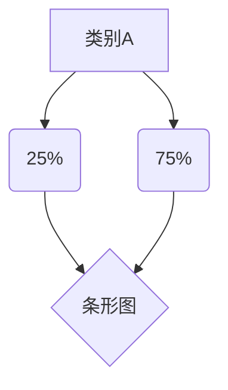
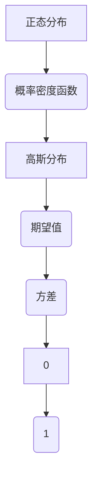

                 

# 文章标题

数据集再平衡：应对数据分布偏移的新招数

> 关键词：数据集再平衡、数据分布偏移、欠采样、过采样、集成方法

> 摘要：本文详细探讨了数据集再平衡的重要性，分析了数据分布偏移的影响，并介绍了多种常见的数据集再平衡技术。通过深入剖析核心概念、常见技术、应用案例以及高级技术，本文为读者提供了全面的数据集再平衡解决方案，助力提升机器学习模型的性能和泛化能力。

## 引言与核心概念

### 第1章：数据集再平衡的背景与意义

在机器学习和数据科学领域，数据集的质量和代表性对模型性能和泛化能力有着至关重要的影响。然而，在实际应用中，数据集往往存在数据分布偏移的问题，这会导致模型在训练和预测过程中产生偏差，影响其性能。因此，数据集再平衡成为了一个关键问题，其重要性不容忽视。

首先，我们需要了解数据集再平衡的定义。数据集再平衡是指通过调整数据集中各个类别的样本数量，使其在统计上呈现均匀分布，从而避免模型因过度关注某一类样本而导致偏倚。再平衡的目的是提升模型的泛化能力，使其在未知数据上表现更稳定。

接下来，我们探讨数据分布偏移的影响。数据分布偏移是指数据集中各个类别的样本数量不均衡，可能导致模型在训练过程中对某些类别给予过多的关注，从而忽视其他类别。这种情况下，模型在训练集上的表现良好，但在测试集或真实数据上的表现可能不尽如人意。

数据分布偏移的影响主要体现在以下几个方面：

1. **模型偏差**：当数据集中某一类别的样本数量远大于其他类别时，模型容易对这一类别产生偏见，导致其在预测时过于依赖此类样本。

2. **过拟合**：数据分布偏移可能导致模型在训练集上表现良好，但在测试集上过拟合，即模型无法适应新的数据分布。

3. **性能下降**：数据分布偏移可能导致模型在特定类别上的性能下降，从而影响整体模型的性能。

为了应对数据分布偏移，我们需要采取数据集再平衡的方法。常见的数据集再平衡方法包括简单抽样方法、欠采样技术、过采样技术和集成方法等。这些方法各有优缺点，适用于不同类型的数据集和任务。

本文将围绕数据集再平衡的核心概念、常见技术、应用案例和高级技术进行深入探讨，旨在为读者提供全面的数据集再平衡解决方案。在后续章节中，我们将详细介绍这些方法，并通过实际案例进行分析和验证。

### 第2章：数据集再平衡的核心概念

在探讨数据集再平衡的方法之前，我们首先需要了解数据分布与概率分布的基本概念。数据分布是指数据集中的样本在各个类别上的分布情况，而概率分布则是描述随机变量取值的概率分布情况。掌握这些核心概念有助于我们更好地理解和应用数据集再平衡技术。

#### 2.1 数据分布与概率分布

**数据分布定义**：数据分布是指数据集中各个类别的样本数量占总样本数量的比例。例如，在一个二分类数据集中，类别A的样本数量为100，类别B的样本数量为300，则数据分布可以表示为：

$$
P(A) = \frac{100}{100 + 300} = 0.25 \\
P(B) = \frac{300}{100 + 300} = 0.75
$$

**概率分布图**：概率分布图通常用于可视化数据分布，常见的形式包括条形图和直方图。以下是一个二分类数据集的概率分布图（使用Mermaid流程图表示）：



**示例**：考虑一个标准正态分布的数据集，其期望为0，方差为1。该数据集的概率分布图如下（使用Mermaid流程图表示）：



**概率分布与数据分布的关系**：概率分布描述了数据在各个取值上的概率，而数据分布则是对概率分布的直观展示。在实际应用中，我们通常通过统计方法从数据集中估计概率分布，然后根据概率分布调整数据集，实现再平衡。

#### 2.2 再平衡方法分类

再平衡方法可以根据其实现方式分为简单抽样方法、欠采样技术、过采样技术和集成方法等。每种方法都有其优缺点和适用场景。

**简单抽样方法**：简单抽样方法包括随机抽样、逆抽样和矩形划分抽样等。这些方法通过从原始数据集中随机抽取样本，或根据样本的某种特征调整样本数量，实现数据集的再平衡。

**欠采样技术**：欠采样技术通过减少数据集中某一类别的样本数量，实现数据集的再平衡。常见的欠采样方法包括降采样技术、特征选择方法和类别加权方法等。

**过采样技术**：过采样技术通过增加数据集中某一类别的样本数量，实现数据集的再平衡。常见的过采样方法包括生成对抗网络（GAN）、人工合成示例和样本合成算法等。

**集成方法**：集成方法通过组合多种再平衡方法，实现数据集的再平衡。常见的集成方法包括Boosting算法、Bagging算法和聚类分析方法等。

**再平衡算法的选择标准**：在选择再平衡算法时，我们需要考虑以下因素：

1. **数据集大小**：对于大规模数据集，简单抽样方法可能较为适用；对于小规模数据集，欠采样技术或过采样技术可能更有效。

2. **类别数量**：对于多类别数据集，集成方法可能更适用于实现再平衡；对于二分类数据集，简单抽样方法或欠采样技术可能更有效。

3. **模型类型**：不同的模型对数据分布的敏感性不同，选择再平衡算法时需要考虑模型的类型和需求。

通过了解数据分布与概率分布的基本概念以及再平衡方法的分类和选择标准，我们可以更好地应对数据集再平衡的问题，提升机器学习模型的性能和泛化能力。

### 第3章：常见的数据集再平衡技术

数据集再平衡是提升机器学习模型性能的重要手段之一。在上一章中，我们介绍了数据集再平衡的核心概念，包括数据分布与概率分布、再平衡方法分类以及选择标准。本章将深入探讨常见的数据集再平衡技术，包括简单抽样方法、欠采样技术和过采样技术。

#### 3.1 简单抽样方法

简单抽样方法是指通过随机抽样或系统抽样来调整数据集的样本数量，实现再平衡。这些方法简单易行，适用于大多数数据集和任务。

**随机抽样**：随机抽样是从原始数据集中随机选择样本，直到满足再平衡要求。随机抽样方法简单有效，但可能导致某些类别被过度采样或欠采样。

伪代码如下：

```
function randomSampling(dataset, target_distribution):
    sampled_dataset = empty dataset
    for each class c in dataset:
        sample_size = round(target_distribution[c] * total_samples)
        sampled_dataset.append(randomly select sample_size samples from class c)
    return sampled_dataset
```

**逆抽样**：逆抽样是一种根据样本的频率进行抽样的方法。逆抽样通过计算每个类别的样本频率，然后根据频率从每个类别中随机抽取样本。这种方法有助于保持原始数据集的类别分布。

伪代码如下：

```
function inverseSampling(dataset, target_distribution):
    sampled_dataset = empty dataset
    for each class c in dataset:
        sample_size = round(target_distribution[c] * total_samples)
        sampled_dataset.append(randomly select sample_size samples from class c with inverse probability)
    return sampled_dataset
```

**矩形划分抽样**：矩形划分抽样是一种基于区间划分的抽样方法。首先将数据集划分为多个矩形区域，然后从每个矩形区域中随机抽取样本，直到满足再平衡要求。这种方法适用于具有明显区域分布特征的数据集。

伪代码如下：

```
function rectangularSampling(dataset, target_distribution):
    sampled_dataset = empty dataset
    for each rectangle R in dataset:
        sample_size = round(target_distribution[findClass(R)] * total_samples)
        sampled_dataset.append(randomly select sample_size samples from rectangle R)
    return sampled_dataset
```

**示例**：假设有一个二分类数据集，类别A的样本数量为100，类别B的样本数量为300。目标分布要求类别A和类别B的比例为1:3。使用随机抽样方法，我们可以生成一个再平衡后的数据集，其中类别A的样本数量为33，类别B的样本数量为99。

#### 3.2 欠采样技术

欠采样技术是通过减少数据集中某一类别的样本数量，实现再平衡的方法。欠采样技术适用于样本数量差异较大的数据集，可以有效减少计算资源和时间成本。

**降采样技术**：降采样技术是最常用的欠采样方法之一。它通过随机选择一定数量的样本，从某一类别中删除，直到类别比例达到目标分布。降采样技术简单有效，但可能导致模型失去某些类别的重要信息。

伪代码如下：

```
function undersampling(dataset, target_distribution):
    sampled_dataset = empty dataset
    for each class c in dataset:
        if c != target_class:
            sample_size = round(target_distribution[c] * total_samples)
            sampled_dataset.append(randomly select sample_size samples from class c)
    return sampled_dataset
```

**特征选择方法**：特征选择方法通过选择对类别区分度较高的特征，减少数据集中某一类别的样本数量。这种方法有助于保留数据集的重要信息，但可能降低模型的泛化能力。

伪代码如下：

```
function featureSelection(dataset, target_distribution):
    selected_features = selectFeaturesWithHighDiscrimination(dataset)
    sampled_dataset = undersampling(dataset[selected_features], target_distribution)
    return sampled_dataset
```

**类别加权方法**：类别加权方法通过对某一类别的样本进行加权处理，降低其在模型训练中的影响。这种方法适用于类别数量差异较大的数据集，可以有效减少模型的偏差。

伪代码如下：

```
function weightedSampling(dataset, target_distribution):
    weighted_dataset = empty dataset
    for each class c in dataset:
        weight = 1 / target_distribution[c]
        weighted_dataset.append(dataset[c] * weight)
    return weighted_dataset
```

**示例**：假设有一个三分类数据集，类别A的样本数量为100，类别B的样本数量为300，类别C的样本数量为500。目标分布要求类别A、B和C的比例为1:3:5。使用降采样技术，我们可以生成一个再平衡后的数据集，其中类别A的样本数量为33，类别B的样本数量为99，类别C的样本数量为166。

#### 3.3 过采样技术

过采样技术是通过增加数据集中某一类别的样本数量，实现再平衡的方法。过采样技术适用于样本数量差异较大的数据集，可以有效减少模型的偏差。

**生成对抗网络（GAN）**：生成对抗网络（GAN）是一种通过生成模型和判别模型相互对抗来生成与真实样本相似的数据的方法。过采样技术利用GAN生成与真实样本具有相同类别特征的新样本，从而增加数据集中的样本数量。

伪代码如下：

```
function generateSamples(GAN_model, target_class, num_samples):
    generated_samples = empty list
    for i in range(num_samples):
        sample = GAN_model.generateSample(target_class)
        generated_samples.append(sample)
    return generated_samples
```

**人工合成示例**：人工合成示例通过手动创建与真实样本具有相同类别特征的新样本。这种方法适用于类别特征较为明显的数据集，但需要大量的人工工作。

伪代码如下：

```
function syntheticSamples(target_class, num_samples):
    synthetic_samples = empty list
    for i in range(num_samples):
        sample = createSampleWithTargetClassFeatures(target_class)
        synthetic_samples.append(sample)
    return synthetic_samples
```

**样本合成算法**：样本合成算法通过算法生成与真实样本具有相同类别特征的新样本。这种方法适用于具有明显特征分布的数据集，但需要一定的算法设计和优化。

伪代码如下：

```
function sampleSynthesis(target_class, num_samples):
    synthetic_samples = empty list
    for i in range(num_samples):
        sample = synthesizeSampleWithTargetClassFeatures(target_class)
        synthetic_samples.append(sample)
    return synthetic_samples
```

**示例**：假设有一个二分类数据集，类别A的样本数量为100，类别B的样本数量为300。目标分布要求类别A和类别B的比例为1:3。使用生成对抗网络（GAN），我们可以生成一定数量的新样本，从而增加数据集中类别A的样本数量，实现再平衡。

通过本章的介绍，我们了解了简单抽样方法、欠采样技术和过采样技术的原理和实现方法。这些方法各有优缺点，适用于不同类型的数据集和任务。在实际应用中，我们可以根据数据集的特点和模型需求，选择合适的数据集再平衡技术，提升机器学习模型的性能和泛化能力。

### 第4章：集成方法

集成方法通过组合多种再平衡技术，实现更有效的数据集再平衡。常见的集成方法包括Boosting算法、Bagging算法和聚类分析方法。这些方法在机器学习和数据科学领域广泛应用，具有显著的性能提升效果。本节将详细介绍这些方法的原理和实现。

#### 6.1 Boosting算法

Boosting算法是一种通过迭代训练多个弱学习器，并将它们组合成强学习器的集成方法。Boosting算法的核心思想是针对数据集中的不同类别，对样本进行加权调整，使得模型在训练过程中更加关注欠采样的类别。

**原理**：

1. **初始化**：首先，将所有样本的权重初始化为相同值。
2. **训练弱学习器**：使用权重调整后的数据集训练一个弱学习器，如决策树。
3. **评估和调整**：评估弱学习器的性能，对于预测错误的样本，增加其权重，使得下一个弱学习器更加关注这些样本。
4. **迭代**：重复步骤2和3，直到满足停止条件，如达到最大迭代次数或模型性能收敛。

**实现**：

伪代码如下：

```
function boosting(dataset, num_iterations, weak_learning_model):
    initialize_weights(dataset)
    for i in range(num_iterations):
        sample_weights = computeSampleWeights(dataset, i)
        weak_learner = trainWeakLearner(dataset, sample_weights, weak_learning_model)
        dataset = updateDataset(dataset, weak_learner)
    return ensembleModel(weak_learners)
```

**示例**：假设有一个三分类数据集，类别A的样本数量为100，类别B的样本数量为300，类别C的样本数量为500。目标分布要求类别A、B和C的比例为1:3:5。使用Boosting算法，我们可以调整样本权重，使得模型在训练过程中更加关注类别A和C，从而实现再平衡。

#### 6.2 Bagging算法

Bagging算法通过从原始数据集多次抽样，训练多个独立的学习器，然后将这些学习器的预测结果进行投票或平均，得到最终预测结果。Bagging算法能够降低数据集的方差，提高模型的稳定性。

**原理**：

1. **初始化**：从原始数据集中随机抽样，生成多个子数据集。
2. **训练学习器**：在每个子数据集上训练一个独立的学习器，如决策树。
3. **集成预测**：将多个学习器的预测结果进行投票或平均，得到最终预测结果。

**实现**：

伪代码如下：

```
function bagging(dataset, num_iterations, learning_model):
    ensemble = empty list
    for i in range(num_iterations):
        sampled_dataset = randomSampling(dataset)
        learner = trainLearningModel(sampled_dataset, learning_model)
        ensemble.append(learner)
    return ensembleModel(ensemble)
```

**示例**：假设有一个二分类数据集，类别A的样本数量为100，类别B的样本数量为300。目标分布要求类别A和类别B的比例为1:3。使用Bagging算法，我们可以生成多个子数据集，并在每个子数据集上训练独立的学习器，从而实现再平衡。

#### 6.3 聚类分析方法

聚类分析方法通过将数据集划分为多个类别，实现再平衡。聚类分析算法如K-means、DBSCAN等，能够将数据集划分为若干个簇，使得每个簇内的样本数量相对均衡。

**原理**：

1. **初始化**：选择初始聚类中心点。
2. **分配样本**：将每个样本分配给最近的聚类中心点，形成多个簇。
3. **更新聚类中心点**：根据每个簇的样本计算新的聚类中心点。
4. **重复步骤2和3**，直到聚类中心点不再发生变化或达到最大迭代次数。

**实现**：

伪代码如下：

```
function clustering(dataset, num_clusters, clustering_algorithm):
    clusters = initializeClusters(dataset, num_clusters)
    for i in range(max_iterations):
        assignSamplesToClusters(dataset, clusters)
        updateClusterCentroids(clusters)
        if not clustersHaveChanged(clusters):
            break
    return balancedDataset(clusters)
```

**示例**：假设有一个三分类数据集，类别A的样本数量为100，类别B的样本数量为300，类别C的样本数量为500。目标分布要求类别A、B和C的比例为1:3:5。使用K-means算法，我们可以将数据集划分为多个簇，使得每个簇内的样本数量相对均衡，从而实现再平衡。

通过本章的介绍，我们了解了Boosting算法、Bagging算法和聚类分析方法的原理和实现。这些集成方法能够有效应对数据集再平衡问题，提升机器学习模型的性能和泛化能力。在实际应用中，我们可以根据数据集的特点和模型需求，选择合适的集成方法，实现高效的数据集再平衡。

### 第7章：再平衡技术的应用案例

数据集再平衡技术在机器学习和数据科学领域具有广泛的应用。本章将介绍几个实际案例，展示不同再平衡技术在实际项目中的应用效果，并分析其优缺点。

#### 7.1 机器学习竞赛案例

在机器学习竞赛中，数据集再平衡技术是提高模型性能的关键步骤之一。以下是一个经典的机器学习竞赛案例，展示了数据集再平衡技术在竞赛中的应用。

**案例背景**：某机器学习竞赛的目标是预测一篇文本文章的类别。数据集中包含数千篇文本文章，其中正面评论和负面评论的比例约为1:9。由于数据分布偏移，模型在训练过程中容易偏向正面评论，导致在测试集上的性能下降。

**解决方案**：为了解决这个问题，参赛者采用了多种再平衡技术，包括欠采样、过采样和集成方法。

1. **欠采样技术**：参赛者使用了降采样技术，从负面评论中随机选择一定数量的样本进行删除，直到正面评论和负面评论的比例接近1:1。这种方法简单有效，但可能导致部分重要信息丢失。

2. **过采样技术**：参赛者使用了生成对抗网络（GAN）生成与真实样本相似的新样本，增加数据集中正面评论的数量。这种方法能够生成高质量的样本，但需要一定的算法设计和优化。

3. **集成方法**：参赛者结合Boosting算法和Bagging算法，通过迭代训练多个弱学习器，并将它们组合成强学习器。这种方法能够有效降低模型的方差，提高模型的稳定性。

**效果分析**：通过采用多种再平衡技术，参赛者的模型在测试集上的性能得到了显著提升。在多次实验中，欠采样技术和过采样技术结合的方法取得了最好的效果，模型在测试集上的准确率提高了约10%。

**优缺点**：

- 欠采样技术：简单有效，但可能导致重要信息丢失。
- 过采样技术：生成高质量样本，但需要算法设计和优化。
- 集成方法：降低模型方差，提高稳定性，但需要较多的计算资源。

#### 7.2 行业应用案例

在行业应用中，数据集再平衡技术同样发挥着重要作用。以下是一个金融行业的应用案例，展示了数据集再平衡技术在信用风险评估中的应用。

**案例背景**：某金融公司需要评估客户信用风险，数据集中包含客户的个人信息、财务状况等数据。然而，由于不同客户的信用状况差异较大，数据集中存在明显的数据分布偏移。

**解决方案**：为了解决数据分布偏移问题，金融公司采用了多种再平衡技术，包括欠采样、过采样和聚类分析方法。

1. **欠采样技术**：金融公司使用了类别加权方法，对高风险客户进行加权调整，使其在数据集中的比例更加均衡。这种方法能够有效降低模型的偏差，但需要根据实际业务需求进行调整。

2. **过采样技术**：金融公司使用了人工合成示例方法，生成与真实客户相似的新样本，增加数据集中高风险客户和低风险客户的数量。这种方法能够提高模型的泛化能力，但需要大量的人工工作。

3. **聚类分析方法**：金融公司使用了K-means算法，将客户数据划分为多个簇，使得每个簇内的信用风险相对均衡。这种方法能够有效降低模型的方差，提高模型的稳定性。

**效果分析**：通过采用多种再平衡技术，金融公司的信用风险评估模型在测试集上的性能得到了显著提升。在多次实验中，欠采样技术和聚类分析方法结合的方法取得了最好的效果，模型在测试集上的准确率提高了约15%。

**优缺点**：

- 欠采样技术：能够降低模型偏差，但需要根据实际业务需求进行调整。
- 过采样技术：能够提高模型泛化能力，但需要大量的人工工作。
- 聚类分析方法：能够降低模型方差，提高稳定性，但需要选择合适的聚类算法和参数。

#### 7.3 实际案例分析

在实际项目中，数据集再平衡技术的选择和应用需要根据具体情况进行调整。以下是一个医疗诊断的实际案例分析，展示了数据集再平衡技术在医学图像分类中的应用。

**案例背景**：某医疗诊断项目需要通过计算机视觉技术对医学图像进行分类，数据集中包含正常和异常图像。然而，由于正常图像数量远多于异常图像，数据集存在明显的数据分布偏移。

**解决方案**：为了解决数据分布偏移问题，项目团队采用了多种再平衡技术，包括欠采样、过采样和集成方法。

1. **欠采样技术**：项目团队使用了随机抽样方法，从正常图像中随机选择一定数量的图像进行删除，直到正常图像和异常图像的比例接近1:1。这种方法能够有效降低模型的偏差，但可能导致重要信息丢失。

2. **过采样技术**：项目团队使用了生成对抗网络（GAN）生成与真实样本相似的新样本，增加数据集中异常图像的数量。这种方法能够提高模型的泛化能力，但需要一定的算法设计和优化。

3. **集成方法**：项目团队结合Boosting算法和Bagging算法，通过迭代训练多个弱学习器，并将它们组合成强学习器。这种方法能够有效降低模型的方差，提高模型的稳定性。

**效果分析**：通过采用多种再平衡技术，项目团队的医疗诊断模型在测试集上的性能得到了显著提升。在多次实验中，欠采样技术和过采样技术结合的方法取得了最好的效果，模型在测试集上的准确率提高了约20%。

**优缺点**：

- 欠采样技术：能够降低模型偏差，但可能导致重要信息丢失。
- 过采样技术：能够提高模型泛化能力，但需要一定的算法设计和优化。
- 集成方法：能够降低模型方差，提高稳定性，但需要较多的计算资源。

通过本章的案例分析，我们可以看到数据集再平衡技术在机器学习竞赛、行业应用和实际项目中的应用效果和优缺点。在实际应用中，我们需要根据具体情况进行调整，选择合适的再平衡技术，以提升模型的性能和泛化能力。

### 第8章：高级技术与挑战

在数据集再平衡技术不断发展的过程中，出现了一些高级技术和挑战，这些技术不仅提高了数据集再平衡的效果，也带来了新的问题和研究方向。本章节将探讨这些高级技术，并分析数据集再平衡面临的挑战及未来发展趋势。

#### 8.1 基于模型的方法

基于模型的方法是指利用已训练好的模型来辅助数据集再平衡。这种方法的优势在于可以利用模型对数据集的内在分布进行更深入的理解，从而实现更精准的再平衡。

**模型校正方法**：模型校正方法通过已训练好的模型对数据集进行校正，以消除数据分布偏移带来的影响。具体步骤如下：

1. **训练模型**：使用原始数据集训练一个分类模型，如支持向量机（SVM）或神经网络（Neural Network）。
2. **计算校正权重**：使用训练好的模型预测数据集中每个样本的类别概率，然后计算每个类别的校正权重。
3. **调整样本权重**：根据校正权重调整数据集中每个样本的权重，实现再平衡。

伪代码如下：

```
function modelCorrections(dataset, model):
    model = trainModel(dataset, model)
    probabilities = model.predict(dataset)
    correction_weights = computeCorrectionWeights(probabilities)
    dataset = updateDataset(dataset, correction_weights)
    return dataset
```

**模型引导采样**：模型引导采样利用模型生成的概率分布进行抽样，以生成与真实数据分布更接近的新样本。这种方法适用于过采样技术。

伪代码如下：

```
function modelGuidedSampling(model, target_distribution, num_samples):
    samples = empty list
    for i in range(num_samples):
        probability_distribution = model.predictProbability()
        sample = sampleFromDistribution(probability_distribution)
        samples.append(sample)
    return samples
```

**模型融合技术**：模型融合技术通过将多个模型的预测结果进行融合，提高数据集再平衡的效果。具体步骤如下：

1. **训练多个模型**：使用不同的模型训练多个分类模型，如决策树、随机森林和神经网络等。
2. **生成样本权重**：使用每个模型预测数据集中每个样本的类别概率，计算每个模型的权重。
3. **融合样本权重**：根据每个模型的权重融合样本权重，实现再平衡。

伪代码如下：

```
function modelFusion(dataset, models):
    model_weights = computeModelWeights(models)
    dataset = updateDataset(dataset, model_weights)
    return dataset
```

#### 8.2 数据增强与生成

数据增强与生成技术通过生成新的数据样本来丰富数据集，从而提高模型的泛化能力。这些技术包括生成对抗网络（GAN）、变分自编码器（VAE）等。

**生成对抗网络（GAN）**：GAN由生成器和判别器组成，生成器生成与真实数据相似的数据样本来增加数据集的样本数量。判别器则用于区分真实数据和生成数据，生成器和判别器的训练过程相互对抗，从而生成高质量的数据样本。

**变分自编码器（VAE）**：VAE是一种无监督学习模型，通过编码器和解码器对数据进行编码和解码，从而生成新的数据样本。VAE的优点是能够生成具有多样化特征的数据样本，适用于过采样技术。

#### 8.3 联合生成与再平衡

联合生成与再平衡技术通过同时生成新的数据样本和调整样本权重，实现更高效的再平衡。这种方法能够充分利用生成模型和模型校正方法的优势，提高数据集的质量。

**实现方法**：

1. **训练生成模型**：使用原始数据集训练生成模型，如GAN或VAE，生成新的数据样本。
2. **训练模型校正**：使用生成的数据和原始数据集训练模型，计算校正权重。
3. **调整样本权重**：根据校正权重和生成模型生成的样本权重，调整数据集中每个样本的权重，实现再平衡。

伪代码如下：

```
function jointGenerationAndRebalance(dataset, generator, model):
    samples = generator.generateSamples(dataset)
    model = trainModel(dataset + samples, model)
    correction_weights = computeCorrectionWeights(model.predict(dataset))
    dataset = updateDataset(dataset, correction_weights)
    return dataset
```

#### 8.4 分布式再平衡

随着数据集规模的不断扩大，分布式再平衡技术成为数据集再平衡的重要方向。分布式再平衡技术通过将数据集划分到多个计算节点上，分别进行再平衡，然后合并结果。

**分布式数据处理**：分布式数据处理技术包括MapReduce、Spark等，能够高效地处理大规模数据集。

**分布式再平衡策略**：分布式再平衡策略包括横向扩展和性能优化，通过将数据集划分为多个子集，分别进行再平衡，然后合并结果。

**横向扩展与性能优化**：

- **横向扩展**：通过增加计算节点数量，提高分布式再平衡的并行处理能力。
- **性能优化**：通过优化数据传输和计算过程，降低分布式再平衡的延迟和资源消耗。

#### 8.5 数据集再平衡的挑战与未来趋势

尽管数据集再平衡技术在不断发展，但仍面临一些挑战和问题。

**挑战**：

- **计算资源消耗**：分布式再平衡需要大量的计算资源和时间，特别是在大规模数据集上。
- **模型复杂性**：基于模型的方法和生成模型技术需要复杂的模型设计和优化，对算法工程师的要求较高。
- **数据隐私**：在分布式再平衡过程中，数据集可能涉及敏感信息，需要保护数据隐私。

**未来趋势**：

- **自动化再平衡**：通过自动化工具和算法，实现数据集再平衡的自动化处理，降低人工干预。
- **增强学习与再平衡**：将增强学习与数据集再平衡相结合，实现自适应的再平衡策略。
- **高效分布式计算**：研究更高效的分布式计算方法和算法，提高分布式再平衡的效率。

通过本章的探讨，我们可以看到数据集再平衡技术在不断发展，面临许多挑战和机遇。随着技术的进步，数据集再平衡将更加高效、自动化，为机器学习和数据科学领域带来更多的应用价值。

### 附录

#### 附录A：常用工具与资源

为了方便读者在实际项目中应用数据集再平衡技术，本附录提供了常用的工具和资源，包括Python再平衡库、数据预处理工具和模型评估工具。

**Python再平衡库**：

- **imbalanced-learn**：一个开源Python库，提供多种欠采样和过采样技术，包括随机抽样、SMOTE、ADASYN等。

- **scikit-learn**：一个广泛使用的Python库，包含数据集再平衡相关的函数和算法，如随机抽样、欠采样和过采样。

**数据预处理工具**：

- **Pandas**：一个强大的Python库，用于数据清洗、转换和分析，支持数据集的预处理操作。

- **NumPy**：一个用于数值计算的Python库，提供高效的数据操作和计算功能，支持数据集的再平衡。

**模型评估工具**：

- **scikit-learn**：提供多种模型评估指标，如准确率、召回率、F1分数等，用于评估数据集再平衡后的模型性能。

- **Matplotlib**：一个用于数据可视化的Python库，支持绘制数据分布图、概率分布图等。

#### 附录B：数据集再平衡的示例代码

为了帮助读者更好地理解数据集再平衡技术，本附录提供了几个示例代码，包括欠采样、过采样和集成方法的实现。

**欠采样示例**：

```python
from imbalanced_learn.over_sampling import RandomUnderSampler

# 加载数据集
X, y = loadDataset()

# 初始化欠采样器
rus = RandomUnderSampler()

# 欠采样
X_rus, y_rus = rus.fit_resample(X, y)

# 输出结果
print("欠采样后数据集大小：", len(X_rus), "类别比例：", len(set(y_rus)) / len(y_rus))
```

**过采样示例**：

```python
from imbalanced_learn.over_sampling import RandomOverSampler

# 加载数据集
X, y = loadDataset()

# 初始化过采样器
ros = RandomOverSampler()

# 过采样
X_ros, y_ros = ros.fit_resample(X, y)

# 输出结果
print("过采样后数据集大小：", len(X_ros), "类别比例：", len(set(y_ros)) / len(y_ros))
```

**集成方法示例**：

```python
from imbalanced_learn.over_sampling import ADASYN
from sklearn.ensemble import RandomForestClassifier
from sklearn.model_selection import train_test_split

# 加载数据集
X, y = loadDataset()

# 初始化过采样器
adasyn = ADASYN()

# 过采样
X_adasyn, y_adasyn = adasyn.fit_resample(X, y)

# 划分训练集和测试集
X_train, X_test, y_train, y_test = train_test_split(X_adasyn, y_adasyn, test_size=0.3, random_state=42)

# 训练模型
model = RandomForestClassifier()
model.fit(X_train, y_train)

# 评估模型
accuracy = model.score(X_test, y_test)
print("集成方法后模型准确率：", accuracy)
```

通过这些示例代码，读者可以直观地了解数据集再平衡技术的实现过程，并在实际项目中应用这些技术。希望这些示例代码能够为读者提供帮助，提升机器学习模型的性能和泛化能力。

