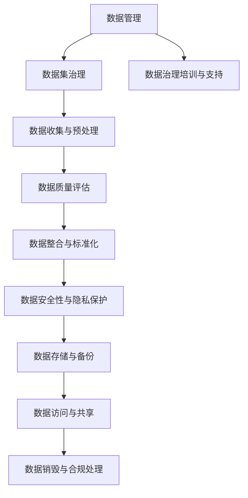
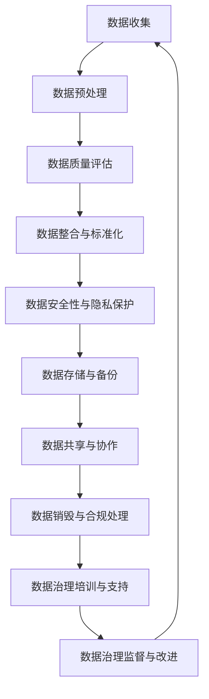

                 

# 文章标题：数据集治理框架：数据流通与价值变现的基石

> 关键词：数据集治理，数据流通，价值变现，数据管理，人工智能

> 摘要：随着大数据时代的到来，数据已经成为企业和社会的重要资产。数据集治理框架作为数据流通与价值变现的基石，对于提升数据质量和推动业务创新具有至关重要的意义。本文将深入探讨数据集治理框架的概述、流程、工具技术、应用领域、挑战与未来趋势，以及数据流通与价值变现的机制和案例，为读者提供全面而深入的理解。

## 目录大纲

- 第一部分：数据集治理框架概述
  - 第1章：数据集治理的概念与重要性
  - 第2章：数据集治理框架的组成
  - 第3章：数据集治理与数据管理的联系
- 第二部分：数据集治理流程与策略
  - 第4章：数据收集与预处理
  - 第5章：数据质量评估
  - 第6章：数据整合与标准化
  - 第7章：数据安全性与隐私保护
- 第三部分：数据集治理工具与技术
  - 第8章：数据清洗与去噪技术
  - 第9章：数据增强与扩展技术
  - 第10章：数据集版本管理
  - 第11章：数据可视化与分析工具
- 第四部分：数据集治理在特定领域的应用
  - 第12章：人工智能领域
  - 第13章：金融领域
  - 第14章：医疗领域
- 第五部分：数据集治理挑战与未来趋势
  - 第15章：数据集治理面临的挑战
  - 第16章：数据集治理的发展趋势
  - 第17章：数据集治理的未来展望
- 第六部分：数据流通与价值变现
  - 第18章：数据流通机制
  - 第19章：数据价值变现
  - 第20章：数据流通与价值变现的案例分析
  - 第21章：数据流通与价值变现的政策与法规
- 附录
  - 附录A：数据集治理工具与资源
  - 附录B：数据集治理框架流程图
  - 附录C：数据流通与价值变现伪代码示例
  - 附录D：代码实战

## 第一部分：数据集治理框架概述

### 第1章：数据集治理的概念与重要性

#### 1.1 数据集治理的概念

数据集治理（Data Governance）是指通过组织、管理、保护和利用数据集，以确保数据的质量、一致性、可靠性和可用性。在数据驱动的社会中，数据集治理已经成为了数据管理和数据科学的重要一环。数据集治理不仅涵盖了数据的管理和维护，还包括数据的质量控制、数据安全性和隐私保护、数据合规性等方面。

数据集治理的核心目标是确保数据的正确性、完整性和一致性，以便数据可以被有效利用，为业务决策提供支持。数据集治理的概念主要包括以下几个方面：

1. **数据质量管理**：确保数据的质量，包括准确性、一致性、完整性和及时性。
2. **数据标准管理**：建立和推广数据标准，以实现数据的一致性和互操作性。
3. **数据生命周期管理**：对数据进行全生命周期的管理，从数据的创建、存储、使用、共享到最终的销毁。
4. **数据访问控制**：确保数据的安全性，防止未授权的访问和泄露。
5. **数据合规性**：确保数据遵守相关法律法规，如数据保护法、隐私法等。

#### 1.2 数据集治理的重要性

数据集治理的重要性体现在以下几个方面：

1. **提高数据质量**：数据质量是数据集治理的核心目标，高质量的数据可以为企业提供更准确的业务洞察，从而支持更明智的决策。

2. **降低数据风险**：通过数据集治理，可以识别和降低数据风险，如数据泄露、数据丢失、数据重复等，从而保障企业的数据安全。

3. **促进数据共享与协同**：数据集治理有助于建立数据标准和流程，促进数据在不同部门和团队之间的共享和协同，提升整体工作效率。

4. **提高业务效率**：数据集治理可以确保数据的一致性和准确性，从而提高业务流程的自动化程度，降低人工干预，提高业务效率。

5. **支持合规性要求**：随着数据隐私和合规性要求的提高，数据集治理成为企业必须遵守的法律法规，确保数据的合法合规使用。

#### 1.3 数据集治理框架的组成

数据集治理框架通常由以下几个关键组成部分构成：

1. **数据治理策略**：定义数据治理的总体目标和原则，包括数据质量标准、数据访问权限、数据安全策略等。

2. **数据治理组织**：建立数据治理组织，明确数据治理职责和权限，确保数据治理的执行和监督。

3. **数据治理流程**：制定数据治理流程，包括数据收集、存储、处理、共享和销毁等各个环节的规范和标准。

4. **数据治理工具**：选择和使用适合的数据治理工具，如数据质量管理工具、数据安全工具、数据存储和管理工具等。

5. **数据治理培训与支持**：提供数据治理相关培训和支持，提高员工的数据治理意识和能力。

#### 1.4 数据集治理与数据管理的联系

数据集治理和数据管理密切相关，但两者也有明显的区别。数据管理（Data Management）主要关注数据的整体生命周期管理，包括数据存储、访问、备份、恢复等。而数据集治理则更侧重于数据的质量、安全性和合规性。

1. **数据管理**：关注数据的存储、访问、备份和恢复，确保数据的高可用性和持久性。

2. **数据集治理**：关注数据的质量、一致性和安全性，确保数据能够满足业务需求和合规性要求。

3. **相互作用**：数据集治理是数据管理的重要组成部分，数据管理需要依赖数据集治理来确保数据的质量和合规性。同时，数据集治理也需要数据管理的支持，如数据存储、备份和恢复等。

### 第2章：数据集治理框架的组成

数据集治理框架的组成可以概括为数据治理策略、数据治理组织、数据治理流程、数据治理工具和数据治理培训与支持。

#### 2.1 数据治理策略

数据治理策略是数据集治理框架的顶层设计，它定义了数据治理的总体目标和原则，为数据治理提供了指导方向。数据治理策略通常包括以下几个方面：

1. **数据质量策略**：明确数据质量的定义、评估标准和改进措施，确保数据的高准确性、一致性和完整性。

2. **数据安全策略**：定义数据安全的目标和措施，包括数据访问控制、数据加密、数据备份和恢复等，保障数据的安全性。

3. **数据合规策略**：确保数据遵守相关法律法规和行业标准，如数据保护法、隐私法等，避免因数据合规问题带来的法律风险。

4. **数据标准化策略**：建立数据标准，包括数据格式、命名规范、数据模型等，以实现数据的一致性和互操作性。

5. **数据生命周期策略**：定义数据的创建、存储、使用、共享和销毁的全生命周期管理，确保数据的合理利用和合规处理。

#### 2.2 数据治理组织

数据治理组织是数据集治理框架的核心执行单元，它负责制定和执行数据治理策略，确保数据治理工作的顺利进行。数据治理组织通常包括以下几个关键角色：

1. **数据治理委员会**：负责制定数据治理策略和决策，监督数据治理工作的执行情况。

2. **数据质量管理团队**：负责数据质量的评估、监控和改进，确保数据的高质量和一致性。

3. **数据安全团队**：负责数据安全策略的实施，包括数据访问控制、数据加密、数据备份和恢复等。

4. **数据标准化团队**：负责数据标准的制定和推广，确保数据的一致性和互操作性。

5. **数据治理顾问**：提供数据治理的专业咨询和指导，协助组织解决数据治理中的问题和挑战。

#### 2.3 数据治理流程

数据治理流程是数据集治理框架的核心内容，它定义了数据治理的具体操作步骤和流程规范，确保数据治理工作有序进行。数据治理流程通常包括以下几个方面：

1. **数据收集与预处理**：收集数据源，进行数据清洗、去噪和格式转换，确保数据的准确性和一致性。

2. **数据质量评估**：评估数据的准确性、一致性、完整性和及时性，识别数据质量问题，制定改进措施。

3. **数据整合与标准化**：整合来自不同数据源的数据，进行数据清洗、去噪和格式转换，确保数据的一致性和互操作性。

4. **数据安全性与隐私保护**：实施数据安全措施，包括数据访问控制、数据加密、数据备份和恢复等，保障数据的安全性。

5. **数据合规性检查**：确保数据遵守相关法律法规和行业标准，避免因数据合规问题带来的法律风险。

6. **数据存储与备份**：选择合适的存储方案，确保数据的高可用性和持久性。

7. **数据共享与协作**：制定数据共享和协作机制，促进数据在不同部门和团队之间的共享和协同。

8. **数据销毁与合规处理**：根据数据生命周期策略，对不再需要的数据进行合规销毁，避免数据泄露和违规使用。

#### 2.4 数据治理工具

数据治理工具是数据集治理框架的重要组成部分，它们提供了数据治理所需的技术支持和自动化能力。常见的数据治理工具包括：

1. **数据质量管理工具**：用于评估和监控数据质量，如数据清洗工具、数据一致性工具、数据完整性工具等。

2. **数据安全工具**：用于实现数据安全措施，如数据加密工具、数据访问控制工具、数据备份和恢复工具等。

3. **数据存储和管理工具**：用于存储和管理数据，如数据仓库、数据湖、数据库等。

4. **数据可视化与分析工具**：用于对数据进行分析和可视化，如业务智能工具、数据可视化工具等。

5. **数据治理平台**：集成多种数据治理工具和功能，提供统一的数据治理解决方案。

#### 2.5 数据治理培训与支持

数据治理培训与支持是确保数据治理工作有效进行的重要保障。数据治理培训与支持包括以下几个方面：

1. **数据治理培训**：为员工提供数据治理相关的培训，提高员工的数据治理意识和技能。

2. **数据治理支持**：为员工提供数据治理相关的咨询和支持，解决数据治理中的问题和挑战。

3. **数据治理文化建设**：推动数据治理文化的建设，鼓励员工积极参与数据治理工作，形成良好的数据治理氛围。

### 第3章：数据集治理与数据管理的联系

数据集治理和数据管理是紧密关联的两个概念，它们在数据生命周期中扮演着不同的角色，但又相互支持、相互依赖。

#### 3.1 数据管理

数据管理（Data Management）是指通过一系列策略、流程、技术和工具，对数据进行有效管理，确保数据的质量、一致性、可用性和安全性。数据管理的核心目标是实现数据的可用性、完整性和可靠性，为业务提供数据支持。

数据管理的范围包括：

1. **数据存储**：选择合适的数据存储方案，如数据库、数据仓库、数据湖等，确保数据的高可用性和持久性。

2. **数据访问**：提供数据访问权限管理，确保数据的安全性和隐私保护。

3. **数据备份和恢复**：制定数据备份策略，确保数据在发生故障或灾难时可以恢复。

4. **数据集成**：实现不同数据源之间的数据整合，提供统一的数据视图。

5. **数据治理**：实施数据质量监控、数据安全措施和数据合规性检查。

#### 3.2 数据集治理

数据集治理（Data Governance）是数据管理的一个子集，它侧重于数据的质量、安全性和合规性。数据集治理的目标是通过制定策略、流程和标准，确保数据集在生命周期中的质量、一致性和可靠性，从而支持数据驱动的业务决策。

数据集治理的范围包括：

1. **数据质量管理**：确保数据的准确性、一致性、完整性和及时性。

2. **数据安全与隐私保护**：实施数据安全措施，如访问控制、数据加密和隐私保护，确保数据的安全性和合规性。

3. **数据标准化**：建立数据标准，包括数据格式、命名规范和数据模型，以实现数据的一致性和互操作性。

4. **数据生命周期管理**：制定数据的创建、存储、使用、共享和销毁的全生命周期管理策略。

5. **数据治理文化建设**：推动数据治理文化的建设，提高员工的数据治理意识和参与度。

#### 3.3 数据集治理与数据管理的联系

数据集治理和数据管理之间存在着紧密的联系和互动关系：

1. **数据集治理支持数据管理**：数据集治理通过确保数据的质量和安全，为数据管理提供了坚实的基础。高质量的数据集有助于数据管理工具和技术的有效运行，提高数据的可用性和可靠性。

2. **数据管理促进数据集治理**：数据管理流程和工具的实施，如数据存储、访问控制、备份和恢复等，为数据集治理提供了支持。数据管理的过程需要数据集治理的指导和规范，以确保数据在各个管理环节中的合规性和安全性。

3. **数据集治理与数据管理协同**：数据集治理和数据管理需要协同工作，共同推动数据价值的最大化。数据集治理确保数据的准确性和一致性，而数据管理则确保数据的高可用性和可靠性。两者相互依赖，共同为企业的数据战略服务。

#### 3.4 数据集治理与数据管理的关系流程图

下图展示了数据集治理与数据管理的关系流程：



通过以上流程，数据集治理和数据管理共同确保了数据在生命周期中的质量、安全性和合规性，为企业的数据驱动业务提供了坚实的保障。

### 第4章：数据集治理流程与策略

#### 4.1 数据收集与预处理

数据收集与预处理是数据集治理的基础环节，它直接影响后续数据质量评估和治理的效率和效果。这一部分内容将详细介绍数据收集与预处理的过程、方法和注意事项。

##### 4.1.1 数据收集

数据收集是指从各种数据源获取原始数据的过程。数据源可以包括企业内部数据库、第三方数据提供商、公共数据集等。数据收集的关键步骤如下：

1. **确定数据需求**：根据业务需求，明确需要收集的数据类型、范围和数量。这包括数据的质量要求、时间戳、来源等。

2. **选择合适的数据源**：根据数据需求，选择合适的数据源。数据源的选择应考虑数据的质量、更新频率、可靠性等因素。

3. **数据采集**：通过数据采集工具或API接口，从数据源中获取数据。采集过程中，需要确保数据的一致性和完整性。

4. **数据清洗**：在数据收集过程中，可能会遇到数据不完整、重复、错误等问题。数据清洗是处理这些问题的重要步骤，包括数据去重、缺失值填充、异常值处理等。

##### 4.1.2 数据预处理

数据预处理是指对收集到的原始数据进行清洗、转换和归一化等操作，使其满足分析任务的要求。数据预处理的关键步骤如下：

1. **数据清洗**：清洗数据是数据预处理的第一步，目的是去除数据中的噪声和错误。数据清洗包括以下操作：

   - 去除重复数据：确保数据集的唯一性。
   - 缺失值处理：填充或删除缺失值，确保数据的一致性。
   - 异常值处理：识别和处理异常值，避免对分析结果产生不良影响。

2. **数据转换**：数据转换包括数据类型的转换、格式转换、单位转换等，以使数据符合分析任务的需求。例如，将文本数据转换为数值数据，将日期时间数据转换为标准格式等。

3. **数据归一化**：数据归一化是将数据按比例缩放到一个统一的范围内，以消除不同特征之间的量纲差异。常用的归一化方法包括最小-最大归一化、均值-方差归一化等。

4. **特征工程**：特征工程是数据预处理的重要环节，它通过选择、构建和转换特征，提高模型的表现。特征工程包括以下步骤：

   - 特征选择：从原始数据中选取对模型有帮助的特征。
   - 特征构造：通过组合原始特征，构建新的特征。
   - 特征转换：将离散特征转换为连续特征，或将高维特征降维。

##### 4.1.3 数据收集与预处理的注意事项

在数据收集与预处理过程中，需要注意以下几个问题：

1. **数据质量**：确保收集到的数据质量，如数据准确性、完整性、一致性等。

2. **数据源多样性**：选择多个数据源，以获取更全面和准确的数据。

3. **数据采集频率**：根据业务需求，选择合适的数据采集频率，确保数据的新鲜度和时效性。

4. **数据存储与管理**：合理选择数据存储和管理方案，确保数据的存储安全和管理便捷。

5. **数据版本控制**：对预处理后的数据进行版本控制，以跟踪数据的变化和追溯问题。

#### 4.2 数据质量评估

数据质量评估是数据集治理的关键环节，它用于评估数据的质量和准确性，识别数据中的问题和缺陷，为后续的数据处理和决策提供依据。以下将详细介绍数据质量评估的过程、方法和指标。

##### 4.2.1 数据质量评估的过程

数据质量评估通常包括以下步骤：

1. **确定评估目标**：根据业务需求，明确数据质量评估的目标和重点。例如，评估数据的准确性、一致性、完整性、及时性等。

2. **定义质量指标**：根据评估目标，定义相应的数据质量指标。常见的数据质量指标包括数据准确性、数据完整性、数据一致性、数据及时性等。

3. **数据采样**：为了评估整个数据集的质量，通常需要对数据集进行采样。采样时应考虑数据的分布和代表性，确保采样结果能够反映整体数据质量。

4. **数据分析**：对采样数据进行详细分析，计算数据质量指标，识别数据中的问题和缺陷。数据分析方法包括统计分析、数据可视化、机器学习模型评估等。

5. **问题识别与报告**：根据数据分析结果，识别数据中的问题和缺陷，并生成数据质量评估报告。报告应详细描述数据质量问题的类型、影响范围和改进建议。

6. **改进与跟踪**：根据数据质量评估报告，制定改进措施，优化数据收集、预处理和数据管理流程。同时，对改进措施进行跟踪和评估，确保数据质量的持续提升。

##### 4.2.2 数据质量评估的方法

数据质量评估的方法主要包括以下几种：

1. **统计分析方法**：通过统计分析方法，评估数据的分布、相关性、异常值等特征，识别数据中的问题和缺陷。常用的统计方法包括描述性统计、假设检验、相关分析等。

2. **数据可视化方法**：通过数据可视化，直观展示数据的分布、趋势和异常值，帮助识别数据中的问题和缺陷。常用的可视化方法包括折线图、柱状图、散点图、箱线图等。

3. **机器学习方法**：利用机器学习方法，建立数据质量评估模型，自动识别数据中的问题和缺陷。常用的机器学习方法包括分类模型、聚类模型、异常检测模型等。

##### 4.2.3 数据质量评估的指标

数据质量评估的指标用于衡量数据的质量和准确性，常见的指标包括：

1. **准确性**：数据准确性是指数据与真实值的接近程度。常见的评估方法包括误差率、绝对误差、相对误差等。

2. **完整性**：数据完整性是指数据中缺失值的比例。常见的评估方法包括缺失值比例、缺失值占比等。

3. **一致性**：数据一致性是指数据在不同来源、不同时间点的数据是否一致。常见的评估方法包括一致性检验、重复数据检测等。

4. **及时性**：数据及时性是指数据更新的频率和速度。常见的评估方法包括更新频率、延迟时间等。

#### 4.3 数据整合与标准化

数据整合与标准化是数据集治理的重要环节，它通过将来自不同数据源、不同格式的数据进行整合和标准化，确保数据的一致性和互操作性，为后续的数据分析和应用提供基础。以下将详细介绍数据整合与标准化的过程、方法和工具。

##### 4.3.1 数据整合

数据整合是指将来自不同数据源的数据进行合并和整合，形成统一的数据视图。数据整合的过程通常包括以下几个步骤：

1. **确定整合目标**：根据业务需求，明确数据整合的目标和范围。例如，整合客户数据、订单数据、销售数据等。

2. **数据清洗**：在整合之前，对数据进行清洗，确保数据的一致性和完整性。数据清洗包括去重、缺失值处理、异常值处理等。

3. **数据映射**：将不同数据源的数据字段进行映射，确保数据字段的对应关系和一致性。数据映射可以通过手工编写映射规则或使用自动化工具实现。

4. **数据转换**：对数据进行转换，使其符合统一的格式和标准。数据转换包括数据类型的转换、格式转换、单位转换等。

5. **数据合并**：将清洗、映射和转换后的数据合并，形成统一的数据集。数据合并可以通过SQL查询、ETL工具或编程语言实现。

##### 4.3.2 数据标准化

数据标准化是指将不同数据源的数据按照统一的格式和标准进行转换和处理，确保数据的一致性和互操作性。数据标准化的过程通常包括以下几个步骤：

1. **定义数据标准**：根据业务需求，制定统一的数据标准和规范，包括数据格式、命名规范、数据模型等。

2. **数据清洗**：对数据进行清洗，确保数据的一致性和完整性。数据清洗包括去重、缺失值处理、异常值处理等。

3. **数据转换**：将不同数据源的数据转换为统一格式和标准。数据转换包括数据类型的转换、格式转换、单位转换等。

4. **数据验证**：对转换后的数据进行验证，确保数据符合统一的标准和规范。数据验证可以通过编写验证规则或使用自动化工具实现。

5. **数据存储**：将标准化后的数据存储到统一的数据存储方案中，如数据库、数据仓库、数据湖等。

##### 4.3.3 数据整合与标准化的工具

数据整合与标准化常用的工具包括：

1. **ETL工具**：ETL（Extract, Transform, Load）工具用于数据提取、转换和加载，是数据整合和标准化的重要工具。常见的ETL工具包括Apache NiFi、Talend、Informatica等。

2. **数据清洗工具**：数据清洗工具用于自动化数据清洗任务，包括去重、缺失值处理、异常值处理等。常见的数据清洗工具包括OpenRefine、Talend、Informatica等。

3. **数据格式转换工具**：数据格式转换工具用于将不同数据源的数据转换为统一格式，如CSV、JSON、XML等。常见的格式转换工具包括Apache Avro、Apache Parquet、Google Protocol Buffers等。

4. **数据库和数据仓库**：数据库和数据仓库是数据整合和标准化的重要存储方案，用于存储和管理整合和标准化后的数据。常见的数据存储方案包括关系数据库（如MySQL、PostgreSQL）、NoSQL数据库（如MongoDB、Cassandra）、数据仓库（如Amazon Redshift、Google BigQuery）等。

#### 4.4 数据安全性与隐私保护

数据安全性与隐私保护是数据集治理的重要环节，它通过实施一系列安全措施，确保数据在存储、传输和使用过程中的安全性和隐私性。以下将详细介绍数据安全性与隐私保护的过程、方法和工具。

##### 4.4.1 数据安全性

数据安全性是指防止数据被未授权访问、篡改、泄露和破坏的一系列措施。数据安全性的关键步骤如下：

1. **数据访问控制**：通过访问控制机制，限制对数据的访问权限。常见的访问控制方法包括基于角色的访问控制（RBAC）、基于属性的访问控制（ABAC）等。

2. **数据加密**：对数据进行加密，确保数据在传输和存储过程中的安全性。常用的加密算法包括对称加密（如AES）、非对称加密（如RSA）等。

3. **数据备份与恢复**：制定数据备份策略，确保数据在发生故障或灾难时可以恢复。数据备份可以采用全备份、增量备份和差异备份等方式。

4. **网络安全**：实施网络安全措施，如防火墙、入侵检测系统（IDS）、入侵防御系统（IPS）等，防止网络攻击和数据泄露。

##### 4.4.2 隐私保护

隐私保护是指确保个人隐私数据不被未授权访问和使用的一系列措施。隐私保护的关键步骤如下：

1. **隐私政策**：制定隐私政策，明确数据收集、使用、存储和共享的原则和范围，确保用户的知情权和选择权。

2. **数据匿名化**：对敏感数据进行匿名化处理，如去标识化、泛化、聚合等，降低隐私泄露风险。

3. **隐私保护技术**：采用隐私保护技术，如差分隐私、同态加密、安全多方计算等，确保在数据分析和处理过程中保护个人隐私。

4. **隐私合规性检查**：定期检查数据的隐私合规性，确保遵守相关法律法规和行业标准。

##### 4.4.3 数据安全性与隐私保护的工具

数据安全性与隐私保护常用的工具包括：

1. **身份认证与访问控制**：身份认证工具（如LDAP、OAuth 2.0）用于验证用户身份，访问控制工具（如Role-Based Access Control, RBAC）用于限制对数据的访问权限。

2. **数据加密工具**：数据加密工具（如OpenSSL、GPG）用于对数据进行加密和解密。

3. **网络安全工具**：网络安全工具（如防火墙、IDS、IPS）用于保护网络和数据安全。

4. **数据备份与恢复工具**：数据备份与恢复工具（如Veeam、Backupify）用于备份数据并在需要时恢复数据。

5. **隐私保护工具**：隐私保护工具（如 differential privacy library、homomorphic encryption library）用于实现隐私保护技术。

#### 4.5 数据治理培训与支持

数据治理培训与支持是确保数据治理工作有效进行的重要环节。通过培训和支持，可以提高员工的数据治理意识和技能，确保数据治理策略和流程的顺利实施。以下将详细介绍数据治理培训与支持的内容、方法和实施策略。

##### 4.5.1 数据治理培训

数据治理培训是提高员工数据治理意识和技能的重要手段。数据治理培训的内容通常包括以下几个方面：

1. **数据治理基础知识**：培训数据治理的基本概念、原则和方法，使员工了解数据治理的重要性。

2. **数据质量管理**：培训数据质量管理的流程和方法，使员工掌握数据质量管理的基本技能。

3. **数据安全与隐私保护**：培训数据安全与隐私保护的知识，使员工了解数据安全与隐私保护的基本要求和方法。

4. **数据标准化与整合**：培训数据标准化与整合的方法和工具，使员工掌握数据标准化与整合的技能。

5. **数据治理工具使用**：培训数据治理工具的使用方法，使员工能够熟练使用数据治理工具进行数据治理工作。

##### 4.5.2 数据治理支持

数据治理支持是确保数据治理工作顺利进行的重要保障。数据治理支持包括以下几个方面：

1. **咨询与指导**：为员工提供数据治理咨询和指导，解答他们在数据治理过程中遇到的问题。

2. **技术支持**：提供数据治理工具的技术支持，确保工具的正常使用和更新。

3. **培训资源**：提供丰富的数据治理培训资源，如教程、手册、视频等，供员工自学和参考。

4. **社区与交流**：建立数据治理社区，鼓励员工交流和分享数据治理的经验和技巧。

##### 4.5.3 数据治理培训与支持的实施策略

实施数据治理培训与支持需要制定详细的策略和计划，确保培训与支持的效果。以下是一些实施策略：

1. **制定培训计划**：根据员工的不同岗位和需求，制定有针对性的培训计划，确保培训内容的有效性。

2. **培训形式多样化**：采用多样化的培训形式，如在线培训、现场培训、实操演练等，提高员工的参与度和学习效果。

3. **持续培训与更新**：定期对员工进行培训，更新数据治理的知识和技能，确保员工能够跟上数据治理的发展。

4. **考核与激励**：建立数据治理考核机制，对员工的数据治理能力进行评估，并提供相应的激励措施，鼓励员工积极参与数据治理工作。

5. **反馈与改进**：收集员工的反馈意见，及时改进培训与支持的内容和方式，提高培训与支持的质量。

### 第5章：数据集治理工具与技术

#### 5.1 数据清洗与去噪技术

数据清洗与去噪技术是数据集治理中至关重要的一环，旨在提高数据质量，确保后续分析结果的准确性。以下将详细介绍数据清洗与去噪技术的基本概念、常用方法和工具。

##### 5.1.1 数据清洗技术

数据清洗（Data Cleaning）是指通过一系列操作，去除数据中的错误、重复、缺失和异常值，使数据满足分析和应用的要求。数据清洗技术主要包括以下方法：

1. **缺失值处理**：缺失值处理是数据清洗的重要步骤。处理缺失值的方法包括：

   - 删除缺失值：直接删除包含缺失值的记录，适用于缺失值比例较小的情况。
   - 填充缺失值：用适当的值填充缺失值，常用的填充方法包括均值填充、中值填充、众数填充等。

2. **重复值处理**：重复值处理用于去除数据集中的重复记录，确保数据的一致性和唯一性。处理重复值的方法包括：

   - 标记重复值：为重复值添加标记，便于后续分析。
   - 删除重复值：直接删除重复值，适用于重复值对分析结果影响较小的情况。

3. **异常值处理**：异常值处理旨在识别和处理数据中的异常值，避免其对分析结果产生不良影响。异常值处理的方法包括：

   - 标准化处理：将异常值转换为标准化的数值，使其与正常数据具有相似的分布。
   - 舍去处理：直接舍去异常值，适用于异常值对分析结果影响较大的情况。

##### 5.1.2 数据去噪技术

数据去噪（Data Denoising）是指通过一系列操作，减少或消除数据中的噪声，提高数据的准确性和可用性。数据去噪技术主要包括以下方法：

1. **滤波技术**：滤波技术是一种常用的去噪方法，通过滤波器去除数据中的高频噪声。滤波技术包括：

   - 低通滤波：去除高频噪声，保留低频信号。
   - 高通滤波：去除低频噪声，保留高频信号。
   - 布特沃斯滤波：同时去除高频和低频噪声。

2. **去卷积技术**：去卷积技术是一种用于恢复原始信号的方法，通过解卷积操作消除噪声。去卷积技术通常需要已知噪声的统计特性。

3. **机器学习技术**：机器学习技术可以用于自动识别和去除数据中的噪声。常用的机器学习算法包括：

   - 主成分分析（PCA）：通过降维技术去除数据中的噪声。
   - 自编码器（Autoencoder）：通过训练自编码器网络，自动识别和去除噪声。
   - GAN（生成对抗网络）：通过生成对抗网络，生成干净的数据，去除噪声。

##### 5.1.3 数据清洗与去噪工具

数据清洗与去噪工具提供了自动化和高效的数据清洗与去噪功能，以下是一些常见的数据清洗与去噪工具：

1. **Pandas**：Pandas是Python的一个数据操作库，提供了丰富的数据清洗和去噪功能，如缺失值处理、重复值处理、异常值处理等。

2. **OpenRefine**：OpenRefine是一个开源的数据清洗工具，适用于处理结构化数据。OpenRefine提供了可视化界面，方便用户进行数据清洗和去噪操作。

3. **DataWrangler**：DataWrangler是一个基于Web的数据清洗平台，提供了丰富的数据清洗和去噪功能，如缺失值处理、重复值处理、异常值处理等。

4. **Spark**：Spark是一个大规模数据处理框架，提供了丰富的数据处理和清洗功能，如缺失值处理、重复值处理、异常值处理等。

5. **Kafka**：Kafka是一个分布式消息队列系统，可用于实时数据处理和清洗。Kafka提供了数据清洗和去噪的功能，如缺失值处理、重复值处理、异常值处理等。

### 第6章：数据集治理工具与技术（续）

#### 5.2 数据增强与扩展技术

数据增强与扩展技术是数据集治理的重要组成部分，旨在提高数据集的质量和丰富度，为模型训练提供更充分的训练样本。以下将详细介绍数据增强与扩展技术的基本概念、常用方法和工具。

##### 5.2.1 数据增强技术

数据增强（Data Augmentation）是一种通过增加数据多样性来提高模型泛化能力的技术。数据增强技术主要包括以下方法：

1. **重采样**：重采样是一种常用的数据增强方法，通过在数据集上增加重复样本或减少重复样本来提高数据多样性。重采样方法包括：

   - 随机重采样：随机从数据集中抽取样本，增加样本多样性。
   - 重复抽样：重复添加相同样本，增加样本数量。

2. **图像变换**：图像变换是一种用于增强图像数据的方法，通过改变图像的几何形状、颜色和纹理等特性来增加数据多样性。图像变换方法包括：

   - 随机裁剪：随机裁剪图像的一部分，生成新的图像样本。
   - 随机旋转：随机旋转图像，增加图像的旋转多样性。
   - 随机缩放：随机缩放图像，增加图像的大小多样性。
   - 随机色彩变换：随机改变图像的颜色，增加图像的色彩多样性。

3. **噪声注入**：噪声注入是一种用于增加数据不确定性的方法，通过在数据中添加噪声来提高模型的鲁棒性。噪声注入方法包括：

   - 加性噪声：在数据中添加随机噪声，使数据具有随机性。
   - 模糊处理：对图像进行模糊处理，增加图像的模糊多样性。

##### 5.2.2 数据扩展技术

数据扩展（Data Expansion）是通过生成新的数据样本来增加数据集大小的方法。数据扩展技术主要包括以下方法：

1. **生成模型**：生成模型（如生成对抗网络GAN）是一种用于数据扩展的技术，通过训练生成模型来生成与真实数据具有相似特性的新数据。生成模型包括：

   - 生成对抗网络（GAN）：通过训练生成器和判别器，生成与真实数据相似的新数据。
   - 变分自编码器（VAE）：通过训练变分自编码器，生成与真实数据具有相似分布的新数据。

2. **数据合成**：数据合成是通过组合多个真实数据样本来生成新的数据样本的方法。数据合成方法包括：

   - 蒙特卡洛合成：通过随机组合多个真实数据样本，生成新的数据样本。
   - 重参数化方法：通过将真实数据样本转换为参数化表示，再通过参数化表示生成新的数据样本。

##### 5.2.3 数据增强与扩展工具

数据增强与扩展工具提供了自动化和高效的数据增强与扩展功能，以下是一些常见的数据增强与扩展工具：

1. **Keras**：Keras是一个基于Python的深度学习库，提供了丰富的数据增强和扩展功能，如图像变换、噪声注入等。

2. **TensorFlow**：TensorFlow是一个开源的深度学习框架，提供了数据增强和扩展的API，如图像变换、生成模型等。

3. **PyTorch**：PyTorch是一个开源的深度学习库，提供了数据增强和扩展的API，如图像变换、生成模型等。

4. **OpenCV**：OpenCV是一个开源的计算机视觉库，提供了图像变换和增强的功能，如随机裁剪、随机旋转等。

5. **Data Augmentor**：Data Augmentor是一个开源的数据增强库，提供了多种数据增强方法，如图像变换、噪声注入等。

### 第7章：数据集版本管理

数据集版本管理是数据集治理的关键环节，旨在确保数据集的完整性和一致性，同时方便数据集的迭代和更新。以下将详细介绍数据集版本管理的基本概念、重要性、版本控制方法和工具。

#### 7.1 数据集版本管理的基本概念

数据集版本管理（Dataset Version Management）是指对数据集的创建、更新和迭代过程进行有效控制和管理，确保数据集在不同版本之间的完整性和一致性。数据集版本管理的基本概念包括：

1. **版本**：版本是指数据集的一个特定版本，它包含了特定的数据集内容和相关信息。每个版本都是对之前版本的更新或修改。

2. **版本号**：版本号是对数据集版本进行标识的数字或字符串，用于区分不同版本的数据集。版本号通常按照递增顺序进行编号。

3. **变更记录**：变更记录是指对数据集版本变更的详细描述，包括变更的内容、时间、责任人等信息。变更记录有助于追踪数据集的迭代过程和版本变化。

4. **数据集元数据**：数据集元数据是指描述数据集属性和特征的信息，如数据集名称、数据集来源、数据集大小、创建时间等。数据集元数据有助于管理和查询数据集。

#### 7.2 数据集版本管理的重要性

数据集版本管理对于数据集治理和数据科学项目的成功具有重要意义，主要体现在以下几个方面：

1. **确保数据集完整性和一致性**：数据集版本管理可以确保在不同版本之间的数据集内容保持完整和一致，避免数据丢失或数据冲突。

2. **支持数据集迭代和更新**：数据集版本管理使得数据集的迭代和更新变得容易，可以在不影响现有业务流程的情况下进行版本更新。

3. **方便问题追踪和责任归属**：通过变更记录和版本号，可以方便地追踪数据集的问题和变更历史，明确责任归属，提高数据集治理效率。

4. **提高数据集复用性**：数据集版本管理可以方便地复用历史数据集版本，为不同项目或任务提供可靠的数据基础。

5. **支持合规性和审计**：数据集版本管理有助于满足合规性和审计要求，确保数据集的合法性和安全性。

#### 7.3 数据集版本控制方法

数据集版本控制是指对数据集的创建、更新和迭代过程进行有效管理，以下是一些常用的数据集版本控制方法：

1. **版本控制工具**：使用版本控制工具（如Git、SVN等）对数据集的文件和元数据进行版本控制。版本控制工具可以记录每次变更的详细信息，方便追踪和管理。

2. **文档记录**：在每次数据集版本更新时，编写详细的变更记录文档，包括变更内容、时间、责任人等信息。变更记录文档有助于追踪版本变化和历史问题。

3. **数据集标签**：为数据集版本添加标签，以便在需要时快速查询和复用特定版本的数据集。标签可以是日期、版本号或特定任务的标识。

4. **数据集元数据管理**：使用数据集元数据管理工具（如MetaStore、Hue等）记录和管理数据集的元数据，包括版本信息、数据源、数据质量等。

5. **自动化流程**：建立自动化流程，确保数据集版本更新的自动化和标准化，减少人为错误和重复工作。

#### 7.4 数据集版本管理工具

以下是一些常见的数据集版本管理工具：

1. **Git**：Git是一个分布式版本控制工具，适用于数据集版本控制和变更管理。Git提供了强大的分支管理、合并和冲突解决功能。

2. **SVN**：SVN是一个集中式版本控制工具，适用于中小规模的数据集版本控制和变更管理。SVN提供了简单易用的版本控制和文件管理功能。

3. **DVC**：DVC（Data Version Control）是一个专门为数据集版本控制设计的工具，适用于大规模数据集的版本管理。DVC可以将数据集与代码库集成，实现数据集的版本控制和协作。

4. **MetaStore**：MetaStore是一个开源的数据集元数据管理工具，适用于大规模数据集的元数据记录和管理。MetaStore可以与Hadoop生态系统集成，支持多种数据源和数据格式。

5. **Hue**：Hue是一个Web界面，用于Hadoop生态系统，包括数据集版本管理和元数据管理。Hue提供了用户友好的界面，方便数据集版本控制和管理。

### 第8章：数据集治理工具与技术（续）

#### 8.1 数据可视化与分析工具

数据可视化与分析工具是数据集治理中不可或缺的一部分，它们能够帮助用户直观地理解数据，发现数据中的规律和趋势，从而支持数据驱动决策。以下将详细介绍数据可视化与分析工具的基本概念、作用、常用工具及其特点。

##### 8.1.1 数据可视化工具

数据可视化（Data Visualization）是将数据以图形或图表的形式呈现，以便用户直观地理解数据内容和关系。数据可视化工具的作用包括：

1. **数据解释**：通过图表和图形，将复杂的数据简化，使得用户能够快速理解数据的含义和规律。

2. **趋势分析**：通过时间序列图表、趋势线等，展示数据随时间的变化趋势，帮助用户发现数据中的周期性、季节性等规律。

3. **异常检测**：通过异常值标记、散点图等，发现数据中的异常值或异常模式，为数据清洗和治理提供依据。

4. **比较分析**：通过比较图表，展示不同数据集、不同时间点或不同维度的数据差异，帮助用户进行对比分析。

常用的数据可视化工具包括：

1. **Tableau**：Tableau是一个强大的数据可视化工具，支持多种数据源和数据格式。Tableau提供了丰富的图表类型和自定义选项，用户可以轻松创建交互式仪表板。

2. **Power BI**：Power BI是微软推出的数据可视化工具，提供了强大的数据连接、分析和可视化功能。Power BI支持多种数据源，包括Excel、SQL Server、Azure等。

3. **QlikView**：QlikView是一个快速数据可视化和分析工具，支持实时数据连接和交互式探索。QlikView提供了丰富的可视化选项，用户可以自定义图表和仪表板。

4. **D3.js**：D3.js是一个基于JavaScript的库，用于创建交互式数据可视化。D3.js提供了强大的数据绑定和图形绘制功能，适用于开发高度定制化的数据可视化应用。

##### 8.1.2 数据分析工具

数据分析（Data Analysis）是指通过统计方法、机器学习等技术，对数据进行深入分析和挖掘，以提取有用信息和洞察。数据分析工具的作用包括：

1. **描述性分析**：通过统计指标和图表，对数据的基本特征和分布进行描述，帮助用户了解数据的整体状况。

2. **推断性分析**：通过假设检验、回归分析等方法，对数据之间的关系进行推断和分析，帮助用户发现数据中的规律和趋势。

3. **预测性分析**：通过时间序列分析、机器学习模型等，对未来的趋势和变化进行预测，为决策提供依据。

4. **诊断性分析**：通过异常检测、聚类分析等方法，对数据中的异常值和模式进行诊断，帮助用户发现数据中的问题。

常用的数据分析工具包括：

1. **R**：R是一种统计分析语言，提供了丰富的数据分析和可视化功能。R支持多种数据分析方法，包括线性回归、广义线性模型、时间序列分析等。

2. **Python**：Python是一种通用编程语言，提供了多个数据分析库，如NumPy、Pandas、Scikit-learn、Matplotlib等。Python适用于从数据预处理到高级分析的全过程。

3. **MATLAB**：MATLAB是一种数学计算软件，提供了丰富的数据分析工具箱。MATLAB适用于进行复杂数学计算、统计分析、机器学习等。

4. **SPSS**：SPSS是一种统计分析软件，提供了强大的数据管理、分析和可视化功能。SPSS适用于企业、学术和研究机构的数据分析任务。

##### 8.1.3 数据集治理工具集成

数据集治理工具的集成是将数据可视化与分析工具与数据集治理框架中的其他组件（如数据清洗、数据存储、数据安全等）进行整合，以实现数据集治理的自动化和智能化。以下是一些数据集治理工具集成的常见模式：

1. **工具集成平台**：使用工具集成平台（如Apache NiFi、Apache Airflow等）将不同工具和组件进行整合，实现自动化数据处理和治理流程。

2. **API接口**：通过API接口，将数据可视化与分析工具与数据集治理框架中的其他组件进行连接，实现数据流转和交互。

3. **数据治理平台**：使用数据治理平台（如Informatica、Talend等）集成多种数据治理工具和功能，提供统一的数据治理解决方案。

4. **数据湖/数据仓库**：将数据可视化与分析工具与数据湖/数据仓库（如Amazon Redshift、Google BigQuery等）集成，实现大规模数据处理和可视化。

通过数据集治理工具的集成，可以简化数据处理流程，提高数据治理效率，为数据驱动决策提供有力支持。

### 第9章：数据集治理在特定领域的应用

数据集治理在各个领域都有着广泛的应用，以下将分别介绍数据集治理在人工智能、金融和医疗领域中的应用，探讨数据集治理在这些领域中的独特挑战和解决方案。

#### 9.1 人工智能领域

在人工智能（AI）领域，数据集治理至关重要，因为高质量的训练数据集是AI模型准确性和性能的基础。以下为数据集治理在AI领域中的应用、挑战和解决方案：

##### 9.1.1 应用

1. **模型训练**：在AI模型训练过程中，需要使用大量的标注数据。数据集治理确保数据的准确性、一致性和完整性，从而提高模型训练效果。

2. **数据增强**：通过数据增强技术，生成更多的训练样本，提高模型的泛化能力。数据集治理框架可以帮助自动执行数据增强任务，如图像旋转、裁剪和噪声注入。

3. **模型评估**：数据集治理有助于评估AI模型的性能，通过使用不同的数据集进行交叉验证，确保模型在不同数据分布下的表现。

##### 9.1.2 挑战

1. **数据质量**：AI模型对数据质量要求极高，数据中的噪声、缺失值和异常值都会影响模型性能。因此，数据质量是数据集治理在AI领域面临的重大挑战。

2. **数据多样性**：为了训练出具有泛化能力的模型，需要多样化的数据集。然而，获取和标注多样化的数据集成本高昂且耗时。

3. **数据隐私**：在AI项目中，数据隐私是一个重要问题。需要确保在数据收集和处理过程中遵守隐私保护法律法规，如GDPR。

##### 9.1.3 解决方案

1. **数据清洗和预处理**：通过数据清洗技术，如缺失值填充、异常值处理和数据标准化，确保数据质量。

2. **数据多样性和扩展**：利用数据增强技术，如生成对抗网络（GAN）和图像合成，生成多样化的数据集。

3. **隐私保护**：采用差分隐私、匿名化和联邦学习等技术，确保数据隐私。

#### 9.2 金融领域

在金融领域，数据集治理对于风险管理、客户体验和业务创新具有重要意义。以下为数据集治理在金融领域中的应用、挑战和解决方案：

##### 9.2.1 应用

1. **风险管理**：数据集治理有助于提高风险管理模型的质量，确保模型对市场变化和风险因素有准确的预测。

2. **客户分析**：通过数据集治理，可以对客户数据进行分析，了解客户行为和需求，从而优化产品和服务。

3. **合规性检查**：金融行业受到严格的法规监管，数据集治理有助于确保数据遵守相关法规要求，如反洗钱法规。

##### 9.2.2 挑战

1. **数据合规性**：金融数据通常包含敏感信息，如个人身份信息、交易记录等。在数据集治理过程中，需要确保数据符合相关法律法规。

2. **数据质量**：金融数据的质量对风险管理和客户分析至关重要。数据中的错误、重复和缺失会影响分析结果的准确性。

3. **数据完整性**：金融数据需要确保完整性，以防止因数据缺失导致的错误决策。

##### 9.2.3 解决方案

1. **数据合规性管理**：建立数据合规性检查机制，确保数据遵守相关法律法规，如GDPR和反洗钱法规。

2. **数据质量管理**：通过数据质量监控、数据清洗和异常值处理，提高数据质量。

3. **数据完整性保障**：通过数据备份、数据集成和数据版本管理，确保数据的完整性。

#### 9.3 医疗领域

在医疗领域，数据集治理对于提高诊断准确性、优化治疗方案和改进医疗服务具有重要意义。以下为数据集治理在医疗领域中的应用、挑战和解决方案：

##### 9.3.1 应用

1. **医学影像分析**：通过数据集治理，可以确保医学影像数据的质量和一致性，从而提高诊断模型的准确性。

2. **电子健康记录（EHR）管理**：数据集治理有助于管理电子健康记录，确保数据的完整性和可用性，为医生和患者提供更好的医疗服务。

3. **药物研发**：在药物研发过程中，数据集治理有助于确保临床试验数据的准确性和一致性，提高药物研发的效率。

##### 9.3.2 挑战

1. **数据隐私**：医疗数据包含患者隐私信息，需要严格保护。在数据集治理过程中，需要确保数据隐私。

2. **数据多样性**：医疗数据类型多样，包括文本、图像、时间序列数据等，需要统一管理和处理。

3. **数据质量**：医疗数据质量直接影响诊断和治疗的准确性。需要确保数据中的错误、缺失和异常值得到有效处理。

##### 9.3.3 解决方案

1. **隐私保护技术**：采用隐私保护技术，如差分隐私、同态加密和联邦学习，确保医疗数据隐私。

2. **数据标准化**：建立统一的数据标准，确保不同类型和来源的数据可以统一管理和处理。

3. **数据质量监控**：通过数据质量监控和异常值处理，提高数据质量。

### 第10章：数据集治理挑战与未来趋势

数据集治理作为数据管理和数据科学的重要环节，面临着一系列挑战和机遇。以下将探讨数据集治理当前面临的挑战以及未来的发展趋势。

#### 10.1 当前挑战

1. **数据质量**：数据质量是数据集治理的核心问题。数据中存在的错误、缺失、重复和异常值会影响数据分析结果的准确性。提高数据质量需要建立完善的数据质量监控和评估机制，同时采用数据清洗和去噪技术。

2. **数据多样性**：在数据驱动的时代，多样化的数据集对于模型训练和业务分析至关重要。然而，获取和标注多样化的数据集成本高昂，且在一些领域（如医疗和金融）数据多样性受限。

3. **数据隐私**：随着数据隐私法规的日益严格，如何保护数据隐私成为数据集治理的重要挑战。数据隐私保护技术如差分隐私、同态加密和联邦学习需要得到广泛应用。

4. **数据治理文化**：数据治理需要组织内部各部门的协作，然而，一些企业在数据治理文化建设方面存在不足。提升员工的数据治理意识和技能，建立数据驱动的企业文化，是数据集治理的重要任务。

5. **技术发展**：随着人工智能、区块链等新技术的快速发展，数据集治理需要不断更新和适应新技术，以确保数据治理策略和技术能够满足业务需求。

#### 10.2 未来趋势

1. **自动化与智能化**：未来的数据集治理将更加自动化和智能化。通过机器学习和人工智能技术，可以自动识别数据质量问题、数据隐私风险，并自动执行数据清洗和去噪任务。

2. **联邦学习与数据共享**：联邦学习技术允许在保护数据隐私的情况下，进行分布式数据分析和模型训练。未来，数据共享机制和联邦学习技术的融合将促进数据集治理的发展。

3. **区块链与数据治理**：区块链技术具有不可篡改和透明性等特点，可用于保障数据治理流程的合规性和可追溯性。未来，区块链技术与数据集治理的结合将得到更多应用。

4. **数据治理平台化**：随着数据集治理需求日益复杂，数据治理平台将整合多种数据治理工具和功能，提供一体化的数据治理解决方案。数据治理平台将支持自动化数据处理、数据质量管理、数据安全监控等功能。

5. **数据治理合规性**：随着数据隐私和合规性要求的提高，数据治理将更加注重合规性。数据治理将采用更加严格的标准和流程，确保数据遵守相关法律法规和行业标准。

### 第11章：数据集治理的未来展望

数据集治理作为数据管理和数据科学的重要环节，其未来发展将受到技术创新、行业变革和法律法规等多方面因素的影响。以下是对数据集治理未来展望的探讨：

#### 11.1 技术创新的推动

技术创新将继续推动数据集治理的发展。随着人工智能、大数据、云计算和区块链等新兴技术的不断进步，数据集治理将变得更加智能化、自动化和高效。以下是一些关键技术创新：

1. **机器学习和人工智能**：机器学习和人工智能技术将用于自动化数据质量检测、数据清洗和去噪，提高数据治理的效率和准确性。

2. **数据隐私保护技术**：随着数据隐私法规的日益严格，数据隐私保护技术（如差分隐私、同态加密和联邦学习）将得到更广泛的应用，确保数据在治理过程中的隐私和安全。

3. **区块链技术**：区块链技术的不可篡改性和透明性将有助于保障数据治理流程的合规性和可追溯性。未来，区块链技术可能在数据治理领域发挥更大的作用。

4. **自动化数据处理**：自动化数据处理工具和平台将使数据治理流程更加高效，降低人工干预，提高数据治理的自动化水平。

#### 11.2 行业变革的推动

行业变革将继续推动数据集治理的发展。不同行业对数据集治理的需求和挑战各不相同，未来，数据集治理将在以下领域面临重要变革：

1. **金融行业**：金融行业的数据集治理将更加注重合规性和风险管理。随着金融科技的快速发展，金融行业将采用更加先进的数据治理技术和工具，提高数据治理水平。

2. **医疗行业**：医疗行业的数据集治理将面临数据隐私和合规性挑战。未来，医疗行业将更加重视数据隐私保护，采用区块链和联邦学习等技术，确保患者数据的隐私和安全。

3. **零售行业**：零售行业的数据集治理将更加注重个性化服务和客户体验。通过数据集治理，零售行业可以更好地理解客户需求，提供个性化的产品和服务，提高客户满意度。

4. **制造业**：制造业的数据集治理将更加注重智能制造和供应链管理。通过数据集治理，制造业可以实现更高效的数据收集、处理和分析，优化生产流程和供应链管理。

#### 11.3 法律法规的推动

法律法规的日益完善将继续推动数据集治理的发展。各国和地区针对数据隐私和合规性出台了严格的法律法规，如欧盟的《通用数据保护条例》（GDPR）和美国的《加州消费者隐私法》（CCPA）。未来，数据集治理将更加注重合规性，确保数据处理符合法律法规要求。

1. **数据隐私保护**：数据隐私保护法律法规将推动数据集治理技术和管理流程的改进，确保数据在收集、存储、处理和共享过程中的隐私和安全。

2. **数据合规性**：数据合规性法律法规将推动企业建立完善的数据治理体系，确保数据处理符合相关法律法规的要求。数据治理平台和工具将集成合规性检查和监控功能，帮助企业实现合规性管理。

#### 11.4 未来展望

基于上述技术创新、行业变革和法律法规的发展，数据集治理未来将呈现以下趋势：

1. **智能化与自动化**：数据集治理将更加智能化和自动化，利用机器学习和人工智能技术，实现数据质量检测、数据清洗和去噪等任务的自动化处理。

2. **跨领域融合**：数据集治理将跨越不同行业，实现跨领域的融合。不同行业的数据集治理技术和工具将相互借鉴，促进数据集治理的创新发展。

3. **数据隐私保护**：数据隐私保护将成为数据集治理的重要关注点，企业将采用更加严格的数据隐私保护措施，确保数据在治理过程中的隐私和安全。

4. **数据治理平台化**：数据治理平台将整合多种数据治理工具和功能，提供一体化的数据治理解决方案。数据治理平台将支持自动化数据处理、数据质量管理、数据安全监控等功能。

5. **数据合规性管理**：数据合规性管理将更加完善，企业将采用更加严格的数据治理策略和流程，确保数据处理符合相关法律法规的要求。

总之，数据集治理在未来将继续发展，技术创新、行业变革和法律法规将共同推动数据集治理的智能化、自动化和合规性，为企业和行业带来更多的价值。

### 第二部分：数据流通与价值变现

#### 第12章：数据流通机制

数据流通机制是确保数据在不同系统和组织之间有效流通和交换的关键环节。数据流通机制不仅包括数据传输的物理过程，还涉及数据安全、隐私保护、数据标准化和合规性等多个方面。以下将详细探讨数据流通机制的概念、关键要素和实现方法。

#### 12.1 数据流通机制的概念

数据流通机制（Data Flow Mechanism）是指数据在组织内部、跨组织以及跨系统之间传输、交换和处理的过程。数据流通机制的核心目标是确保数据的及时性、准确性、一致性和安全性。通过数据流通机制，企业可以实现对数据的全面掌控，提高数据利用效率，实现数据的最大价值。

数据流通机制主要包括以下几个关键要素：

1. **数据源**：数据源是数据的产生者和提供者，可以是内部系统、外部系统或第三方数据提供商。数据源需要提供高质量、结构化的数据，以满足数据流通的需求。

2. **传输协议**：传输协议是数据在传输过程中采用的规范和标准，如HTTP、HTTPS、FTP、SMTP等。传输协议需要确保数据传输的可靠性和安全性。

3. **数据格式**：数据格式是指数据的组织方式和编码方式，如JSON、XML、CSV、Parquet等。数据格式需要遵循统一的标准，以实现数据在不同系统和组织之间的兼容性和互操作性。

4. **数据存储**：数据存储是数据流通的中转站，用于暂时存储和缓存传输中的数据。数据存储需要具备高可用性、高可靠性和高扩展性，以支持大规模数据流通。

5. **数据处理**：数据处理是指数据在传输过程中的加工和处理，如数据清洗、转换、集成等。数据处理需要确保数据在传输过程中的准确性和一致性。

6. **数据安全**：数据安全是指确保数据在传输、存储和处理过程中的机密性、完整性和可用性。数据安全需要采用多种安全措施，如数据加密、访问控制、防火墙等。

7. **合规性**：合规性是指数据流通过程中遵守相关法律法规和行业标准。合规性需要建立数据流通的合规性检查机制，确保数据处理和交换符合法律法规的要求。

#### 12.2 数据流通机制的关键要素

1. **数据源**：数据源是数据流通的起点，数据源的质量直接影响数据流通的效果。为了确保数据源的质量，企业需要建立数据源管理机制，包括数据源识别、数据源认证和数据源监控等。

2. **传输协议**：传输协议是数据流通的基础，选择合适的传输协议对于确保数据传输的效率和安全性至关重要。企业需要根据数据类型、传输距离和传输环境等因素，选择合适的传输协议。

3. **数据格式**：数据格式是数据流通的关键，统一的数据格式有助于实现数据在不同系统和组织之间的互操作性。企业需要制定数据格式标准，确保数据在流通过程中的兼容性和一致性。

4. **数据存储**：数据存储是数据流通的中转站，用于暂时存储和缓存传输中的数据。企业需要选择合适的数据存储方案，如数据库、数据仓库、云存储等，确保数据存储的高可用性和可靠性。

5. **数据处理**：数据处理是数据流通的核心环节，数据处理需要确保数据在传输过程中的准确性和一致性。企业需要采用数据清洗、转换、集成等技术，确保数据处理的高效性和准确性。

6. **数据安全**：数据安全是数据流通的重要保障，企业需要建立数据安全防护机制，确保数据在传输、存储和处理过程中的机密性、完整性和可用性。企业需要采用数据加密、访问控制、防火墙等安全措施，保障数据安全。

7. **合规性**：合规性是数据流通的底线，企业需要遵守相关法律法规和行业标准，确保数据流通的合规性。企业需要建立数据合规性检查机制，确保数据处理和交换符合法律法规的要求。

#### 12.3 数据流通机制的实现方法

1. **ETL（Extract, Transform, Load）**：ETL是一种常见的数据流通实现方法，用于从数据源提取数据、转换数据和加载数据到目标系统。ETL工具可以帮助企业实现数据从源头到目的地的全流程数据流通。

2. **API（应用程序编程接口）**：API是一种实现数据流通的接口标准，用于实现不同系统之间的数据交换和共享。通过API，企业可以实现跨系统的数据流通和业务协作。

3. **消息队列**：消息队列是一种实现异步数据流通的方法，用于实现系统之间的数据传输和通信。通过消息队列，企业可以实现大规模数据的可靠传输和异步处理。

4. **数据交换平台**：数据交换平台是一种集成多种数据流通功能的系统，用于实现企业内部和跨组织的数据交换和共享。数据交换平台可以帮助企业实现数据流通的自动化和智能化。

5. **区块链技术**：区块链技术是一种分布式数据存储和传输技术，可以用于实现数据流通的安全和可信。通过区块链技术，企业可以实现去中心化的数据流通和交易。

#### 12.4 数据流通机制的挑战与解决方案

1. **数据一致性**：数据一致性是数据流通的重要挑战，特别是在跨系统和跨组织的数据交换过程中，如何确保数据的一致性是一个关键问题。解决方案包括采用数据同步技术、数据版本控制和数据比对等。

2. **数据安全性**：数据安全性是数据流通的重要保障，如何确保数据在传输和存储过程中的安全是一个重要问题。解决方案包括采用数据加密、访问控制和防火墙等安全措施。

3. **数据合规性**：数据合规性是数据流通的底线，如何确保数据流通符合相关法律法规和行业标准是一个重要问题。解决方案包括建立数据合规性检查机制、数据合规性培训等。

4. **数据处理效率**：数据处理效率是数据流通的重要挑战，特别是在大规模数据传输和处理过程中，如何提高数据处理效率是一个关键问题。解决方案包括采用并行处理、分布式计算等技术。

5. **数据隐私保护**：数据隐私保护是数据流通的重要挑战，特别是在涉及个人隐私数据的流通过程中，如何保护数据隐私是一个重要问题。解决方案包括采用数据隐私保护技术、隐私保护算法等。

### 第13章：数据价值变现

数据价值变现是指通过数据分析和处理，将数据转化为业务价值的过程。随着大数据和人工智能技术的发展，数据已经成为企业的重要资产。数据价值变现不仅可以提高企业的盈利能力，还可以推动业务创新和数字化转型。以下将详细探讨数据价值变现的途径、方法和技术。

#### 13.1 数据价值变现的途径

1. **商业智能（BI）**：商业智能是通过数据分析和挖掘，为企业提供业务洞察和决策支持。通过商业智能，企业可以优化运营、提高效率、降低成本，从而实现数据价值变现。

2. **客户关系管理（CRM）**：客户关系管理是通过数据分析和处理，了解客户需求和行为，优化客户服务和体验，提高客户满意度和忠诚度。通过客户关系管理，企业可以增加客户销售额、提升客户留存率，实现数据价值变现。

3. **营销自动化**：营销自动化是通过数据分析和处理，实现营销活动的自动化和优化。通过营销自动化，企业可以更精准地定位目标客户、提高营销效果，从而实现数据价值变现。

4. **风险控制**：风险控制是通过数据分析和挖掘，识别潜在风险和异常行为，采取预防措施，降低风险损失。通过风险控制，企业可以减少风险事件的发生，保障业务稳定，实现数据价值变现。

5. **供应链优化**：供应链优化是通过数据分析和挖掘，优化供应链各环节的资源配置和流程，提高供应链效率和响应速度。通过供应链优化，企业可以降低供应链成本、提高供应链竞争力，实现数据价值变现。

6. **个性化服务**：个性化服务是通过数据分析和处理，了解客户个性化需求，提供定制化产品和服务。通过个性化服务，企业可以增加客户粘性、提升客户满意度，实现数据价值变现。

7. **产品创新**：产品创新是通过数据分析和挖掘，发现市场需求和趋势，开发创新性产品和服务。通过产品创新，企业可以开拓新市场、提高市场份额，实现数据价值变现。

#### 13.2 数据价值变现的方法

1. **数据挖掘和机器学习**：数据挖掘和机器学习是数据价值变现的核心技术，通过分析大量数据，发现数据中的规律和模式，为企业提供业务洞察和决策支持。数据挖掘和机器学习可以帮助企业实现数据预测、分类、聚类等任务，从而实现数据价值变现。

2. **大数据分析**：大数据分析是通过处理和分析大规模数据，发现数据中的隐藏信息和价值。大数据分析可以帮助企业实现实时数据监控、实时预测和实时决策，从而实现数据价值变现。

3. **数据可视化**：数据可视化是将数据以图形、图表和地图等形式呈现，帮助用户直观理解和分析数据。数据可视化可以帮助企业发现数据中的异常和趋势，从而实现数据价值变现。

4. **数据交换与共享**：数据交换与共享是数据价值变现的重要手段，通过建立数据交换与共享平台，实现企业内部和跨组织的数据流通和共享，促进数据价值的最大化。数据交换与共享可以提升企业协同效率、降低成本，从而实现数据价值变现。

5. **数据治理**：数据治理是确保数据质量和数据安全的重要手段，通过数据治理，企业可以确保数据的准确、完整和可靠，从而为数据价值变现提供保障。

#### 13.3 数据价值变现的技术

1. **Hadoop和Spark**：Hadoop和Spark是大数据处理框架，用于处理和分析大规模数据。Hadoop和Spark提供了分布式计算和存储能力，可以高效地处理和分析海量数据，从而实现数据价值变现。

2. **机器学习库和框架**：如Scikit-learn、TensorFlow、PyTorch等，这些机器学习库和框架提供了丰富的算法和工具，用于数据分析和模型训练，可以帮助企业实现数据价值变现。

3. **数据仓库和数据湖**：数据仓库和数据湖是大数据存储解决方案，用于存储和管理大规模数据。数据仓库和数据湖提供了高效的查询和数据处理能力，可以支持实时数据分析和应用，从而实现数据价值变现。

4. **区块链技术**：区块链技术是一种分布式账本技术，可以用于实现数据的安全、可靠和透明。区块链技术可以支持数据交易、数据共享和数据治理，从而实现数据价值变现。

5. **物联网（IoT）**：物联网技术可以实时收集和传输大量数据，为数据分析和应用提供丰富的数据源。物联网技术可以帮助企业实现实时监控、实时预警和实时优化，从而实现数据价值变现。

### 第14章：数据流通与价值变现的案例分析

为了更好地理解数据流通与价值变现的实际应用，以下将介绍三个具体的案例分析，分别来自大型电商平台、金融企业和医疗机构。

#### 14.1 案例一：某大型电商平台的数据流通与变现

**背景**：某大型电商平台拥有海量的用户数据和交易数据，这些数据不仅涵盖了用户的基本信息，还包括购买行为、浏览历史、评价和反馈等。如何有效地管理和利用这些数据，提升用户体验和销售额，成为企业关注的重点。

**数据流通**：

1. **数据收集**：电商平台通过用户注册、登录、浏览、购买等行为，收集用户数据。数据源包括前端应用、后端服务器、数据库等。

2. **数据存储**：使用大数据存储技术（如Hadoop和HBase），存储海量用户数据。数据存储需确保高可用性、可靠性和扩展性。

3. **数据处理**：使用Spark等大数据处理框架，对用户数据进行清洗、整合和分析。数据处理过程中，采用数据挖掘和机器学习技术，识别用户偏好、预测购买行为等。

4. **数据交换**：通过API接口和数据交换平台，实现企业内部系统（如客户关系管理、订单处理、库存管理）之间的数据流通。

**价值变现**：

1. **个性化推荐**：通过分析用户数据和购买历史，为用户推荐个性化商品，提高用户满意度和销售额。

2. **精准营销**：根据用户行为和偏好，定制化营销活动，提高营销效果和转化率。

3. **用户画像**：构建用户画像，深入了解用户需求和行为，优化用户体验和服务。

4. **风险控制**：通过数据分析和挖掘，识别潜在风险用户和异常交易，采取预防措施，降低风险损失。

#### 14.2 案例二：某金融企业的数据治理与价值变现

**背景**：某金融企业拥有大量的客户数据、交易数据、信用评级数据等。企业需要通过数据治理，确保数据的质量和安全，同时利用数据实现业务增长和风险控制。

**数据流通**：

1. **数据收集**：金融企业通过贷款申请、信用卡交易、投资活动等渠道，收集客户数据。数据源包括内部系统、第三方数据提供商等。

2. **数据存储**：使用数据仓库（如Amazon Redshift）和大数据平台（如Hadoop和HBase），存储和管理海量客户数据。

3. **数据处理**：采用ETL工具（如Apache NiFi）和数据处理框架（如Spark），对客户数据进行分析和挖掘。数据处理过程中，采用数据清洗、转换和集成技术。

4. **数据交换**：通过API接口和数据交换平台，实现企业内部系统（如信贷审批、风险管理、客户服务）之间的数据流通。

**价值变现**：

1. **风险评估**：通过数据分析和挖掘，评估客户信用风险，优化贷款审批流程，降低不良贷款率。

2. **个性化服务**：根据客户行为和偏好，提供个性化金融产品和服务，提高客户满意度和忠诚度。

3. **客户细分**：通过客户数据分析，实现客户细分，针对不同细分市场制定差异化营销策略。

4. **投资组合优化**：通过分析市场数据和客户投资行为，优化投资组合，提高投资收益。

#### 14.3 案例三：某医疗机构的健康数据治理与变现

**背景**：某医疗机构积累了大量健康数据，包括患者病历、诊断记录、医疗影像等。如何有效地管理和利用这些数据，提高医疗服务质量和患者满意度，成为医疗机构关注的重点。

**数据流通**：

1. **数据收集**：医疗机构通过电子病历系统、医疗设备、健康监测设备等，收集健康数据。数据源包括内部系统、第三方设备等。

2. **数据存储**：使用医疗数据存储方案（如EMR系统、影像存储系统），存储和管理健康数据。数据存储需确保数据的完整性和安全性。

3. **数据处理**：采用大数据处理框架（如Hadoop和Spark），对健康数据进行清洗、转换和集成。数据处理过程中，采用数据挖掘和机器学习技术，识别疾病趋势和患者风险。

4. **数据交换**：通过API接口和数据交换平台，实现医疗机构内部系统（如电子病历系统、诊断系统、健康监测系统）之间的数据流通。

**价值变现**：

1. **精准医疗**：通过健康数据分析和挖掘，为患者提供精准的诊疗方案，提高医疗服务质量和患者满意度。

2. **疾病预测**：通过分析健康数据和患者历史记录，预测疾病发展趋势，提前采取预防措施，降低疾病发生率和死亡率。

3. **个性化健康指导**：根据患者的健康数据和生活方式，提供个性化的健康指导和建议，帮助患者改善生活习惯，提高健康水平。

4. **医疗资源优化**：通过分析医疗数据，优化医疗资源配置，提高医疗资源的利用效率，降低医疗成本。

### 第15章：数据流通与价值变现的政策与法规

数据流通与价值变现作为当前社会经济发展的热点，涉及到大量个人和企业数据的流通、处理和应用。在这一过程中，政策与法规的制定和执行至关重要，既能保障数据的安全与隐私，又能促进数据资源的合理利用与创新发展。以下将详细探讨数据流通与价值变现的政策与法规，以及相关的伦理和道德问题。

#### 15.1 数据流通与价值变现的法律法规

数据流通与价值变现的法律法规主要包括以下几个方面：

1. **数据保护法**：数据保护法旨在保护个人数据隐私和权益，防止数据泄露、滥用和非法交易。例如，欧盟的《通用数据保护条例》（GDPR）是全球最具代表性的数据保护法规，对数据收集、处理、存储和传输等环节提出了严格的要求。

2. **隐私法**：隐私法主要关注个人隐私权的保护，规范个人数据的收集、使用、共享和传输。例如，美国的《加州消费者隐私法》（CCPA）赋予消费者对个人数据知情权和控制权，对企业的数据处理行为进行了严格的规定。

3. **网络安全法**：网络安全法旨在保障网络空间的稳定和安全，防止网络攻击和数据泄露。例如，中国的《网络安全法》对网络运营者的数据安全责任、网络安全审查和监测等方面进行了详细规定。

4. **商业秘密法**：商业秘密法保护企业的商业秘密和知识产权，防止商业秘密的泄露和滥用。在数据流通与价值变现过程中，商业秘密的保护尤为重要，以防止企业核心竞争力的丧失。

5. **数据交易法**：数据交易法规范数据交易市场的行为，促进数据的合法流通与交易。例如，某些国家和地区已经出台数据交易法规，对数据交易的主体、流程、标准和监管进行了规定。

#### 15.2 数据流通与价值变现的伦理和道德问题

数据流通与价值变现不仅涉及法律法规，还涉及到伦理和道德问题。以下是一些关键伦理和道德问题：

1. **隐私保护**：在数据流通与价值变现过程中，个人隐私保护是一个重要伦理问题。如何在充分利用数据价值的同时，尊重和保护个人隐私，是企业和政府需要共同面对的挑战。

2. **数据歧视**：数据歧视是指利用数据对某些群体进行不公平对待。例如，在信用评分、招聘、广告投放等场景中，如果数据使用不当，可能导致某些群体被歧视。因此，如何确保数据应用的公平性，避免数据歧视，是伦理和道德的重要议题。

3. **数据滥用**：数据滥用是指未按照规定用途使用数据，或对数据进行非法交易、泄露等行为。例如，某些企业可能滥用用户数据用于广告定向投放，或非法交易用户数据。因此，如何防止数据滥用，保障数据安全，是企业和政府需要共同关注的伦理问题。

4. **数据透明度**：数据透明度是指数据的收集、使用、存储和共享过程应该公开透明，让用户了解自己的数据被如何处理。提高数据透明度有助于增强用户对数据流通与价值变现的信任，是伦理和道德的必要要求。

5. **数据责任**：数据责任是指数据收集者、处理者和使用者对数据安全、隐私和合规性承担的责任。在数据流通与价值变现过程中，企业需要明确数据责任，建立完善的数据治理体系和责任追究机制，确保数据安全和合规。

#### 15.3 数据流通与价值变现的伦理和道德问题解决方案

为了解决数据流通与价值变现中的伦理和道德问题，以下提出一些解决方案：

1. **加强法律法规制定和执行**：政府和立法机构应加强数据流通与价值变现相关法律法规的制定和执行，提高违法成本，保障数据安全和个人隐私。

2. **完善数据治理体系**：企业应建立完善的数据治理体系，包括数据收集、处理、存储、共享和销毁等各个环节的规范和标准，确保数据的合法合规使用。

3. **提高数据透明度**：企业应提高数据透明度，通过公开数据使用政策、隐私政策等方式，让用户了解自己的数据被如何使用和处理。

4. **强化数据安全防护**：企业应采用先进的数据安全防护技术，如数据加密、访问控制、网络安全等，确保数据在流通与价值变现过程中的安全性。

5. **加强伦理和道德教育**：政府和教育机构应加强数据伦理和道德教育，提高企业和公众的数据伦理意识，培养数据合规和道德行为。

6. **推动数据共享与合作**：通过推动数据共享与合作，实现数据价值的最大化，同时减少数据滥用和数据歧视的风险。

7. **建立数据伦理委员会**：企业可以建立数据伦理委员会，负责审查和监督数据流通与价值变现过程中的伦理和道德问题，确保数据应用的合规性和道德性。

总之，数据流通与价值变现的政策与法规、伦理和道德问题的解决，需要政府、企业和公众共同努力，建立完善的法律体系、数据治理体系和伦理道德规范，保障数据的安全、隐私和合理利用。

### 附录A：数据集治理工具与资源

#### A.1 数据集治理工具概览

在数据集治理过程中，选择合适的工具至关重要。以下是一些常用的数据集治理工具及其主要功能：

1. **Pandas**：Pandas是Python的一个数据操作库，提供了强大的数据处理和分析功能，适用于数据清洗、缺失值处理、重复值处理等。

2. **OpenRefine**：OpenRefine是一个开源的数据清洗工具，适用于处理结构化数据。OpenRefine提供了可视化界面，方便用户进行数据清洗和去噪操作。

3. **Apache NiFi**：Apache NiFi是一个流数据平台，适用于数据集成、数据清洗和数据治理。NiFi提供了可视化流程编辑器，方便用户创建和配置数据管道。

4. **Apache Airflow**：Apache Airflow是一个基于Python的调度和管理平台，适用于自动化数据集治理流程，如数据导入、数据清洗、数据转换等。

5. **Informatica**：Informatica是一个数据集成和治理平台，提供了丰富的数据治理功能，包括数据质量监控、数据清洗、数据整合等。

6. **Talend**：Talend是一个数据集成和治理平台，提供了数据治理、数据质量和数据集成的功能。Talend支持多种数据源和数据格式，适用于大数据环境。

7. **DVC**：DVC（Data Version Control）是一个专门为数据集版本控制设计的工具，适用于大规模数据集的版本管理。DVC可以将数据集与代码库集成，实现数据集的版本控制和协作。

#### A.2 数据集治理开源资源

以下是一些数据集治理相关的开源资源和项目，为数据集治理提供了丰富的技术支持和资源：

1. **Apache Hadoop**：Apache Hadoop是一个分布式数据处理框架，适用于大规模数据集的存储和处理。Hadoop支持数据集治理、数据清洗和数据分析等功能。

2. **Apache Spark**：Apache Spark是一个快速通用的分布式计算引擎，适用于大规模数据集的处理和分析。Spark提供了丰富的数据集治理和数据分析功能。

3. **Apache Kafka**：Apache Kafka是一个分布式流处理平台，适用于实时数据处理和传输。Kafka可用于数据集的实时采集、传输和存储。

4. **Apache Flink**：Apache Flink是一个流处理和批处理框架，适用于大规模实时数据处理。Flink支持数据集治理、实时分析和数据流处理。

5. **PyTorch**：PyTorch是一个开源的深度学习库，适用于数据集治理和深度学习模型的训练。PyTorch提供了丰富的数据增强和扩展功能。

6. **TensorFlow**：TensorFlow是一个开源的深度学习库，适用于数据集治理和深度学习模型的训练。TensorFlow提供了强大的数据集处理和分析功能。

7. **Data Augmentor**：Data Augmentor是一个开源的数据增强库，适用于数据集的增强和扩展。Data Augmentor支持多种数据增强方法，如图像变换、噪声注入等。

#### A.3 数据集治理相关论文与研究报告

以下是一些数据集治理相关的论文与研究报告，提供了数据集治理的理论基础和实践经验：

1. **"Data Governance: An Essential Framework for Managing Data as a Strategic Asset"（数据治理：管理数据作为战略资产的必要框架）**
   - 作者：David Loshin
   - 摘要：本文探讨了数据治理的重要性，提出了一个全面的数据治理框架，包括数据质量管理、数据安全性和数据合规性等方面。

2. **"A Comprehensive Framework for Data Governance in Big Data Environments"（大数据环境中的全面数据治理框架）**
   - 作者：Sukaina S. Shaikh, Amarendra K. Srivastava
   - 摘要：本文提出一个适用于大数据环境的数据治理框架，包括数据收集、存储、处理、分析和共享等各个环节的治理策略和流程。

3. **"The Role of Data Governance in Ensuring Data Quality and Data Compliance"（数据治理在确保数据质量和数据合规性中的角色）**
   - 作者：Manju Gaur, A.K. Srivastava
   - 摘要：本文探讨了数据治理在确保数据质量和数据合规性方面的作用，提出了数据治理的关键要素和实施方法。

4. **"Data Privacy Protection in Data Governance: A Comprehensive Review"（数据治理中的数据隐私保护：全面回顾）**
   - 作者：Shreya Patel, Manju Gaur
   - 摘要：本文回顾了数据治理中的数据隐私保护技术，包括差分隐私、同态加密和联邦学习等，探讨了这些技术在数据隐私保护中的应用和挑战。

5. **"Data Governance in the Age of Big Data and IoT: Challenges and Opportunities"（大数据和物联网时代的数据治理：挑战与机遇）**
   - 作者：Deepak Kumar, Manju Gaur
   - 摘要：本文分析了大数据和物联网时代数据治理的挑战和机遇，探讨了数据治理在新兴技术中的应用和发展方向。

6. **"A Multi-Tiered Approach for Data Quality Assessment in Big Data Environment"（大数据环境中数据质量评估的多层方法）**
   - 作者：Swetha Chava, Raghunathan S. Raghu
   - 摘要：本文提出了一种适用于大数据环境的数据质量评估方法，包括数据完整性、一致性、准确性和及时性等方面的评估指标和评估流程。

7. **"Data Governance Best Practices for Achieving Regulatory Compliance"（实现法规合规的数据治理最佳实践）**
   - 作者：Priyanka Tiwari, Manju Gaur
   - 摘要：本文总结了数据治理在实现法规合规方面的最佳实践，包括数据管理策略、合规性检查机制和合规性培训等。

这些论文和研究报告为数据集治理提供了深入的理论基础和实践指导，有助于读者了解数据集治理的最新研究动态和应用实践。

### 附录B：数据集治理框架流程图

#### B.1 数据集治理框架整体流程图

以下是一个数据集治理框架的整体流程图，展示了数据集治理的各个关键环节和流程：



该流程图详细展示了数据集治理的完整过程，从数据收集到数据销毁，涵盖了数据治理的各个关键环节和流程。每个环节都涉及到具体的数据治理策略和技术手段，以确保数据集的质量、安全性和合规性。

### 附录C：数据流通与价值变现伪代码示例

#### C.1 数据清洗伪代码

以下是一个数据清洗的伪代码示例，展示了如何对数据集中的缺失值、异常值和重复值进行处理：

```python
def clean_data(data):
    # 删除缺失值
    cleaned_data = data[data.notnull().all(axis=1)]

    # 删除重复值
    cleaned_data = cleaned_data.drop_duplicates()

    # 处理异常值
    for column in cleaned_data.columns:
        if is_numeric_column(column):
            cleaned_data[column] = remove_outliers(cleaned_data[column])

    return cleaned_data

def is_numeric_column(column):
    # 判断列是否为数值类型
    return cleaned_data[column].dtype in ['int64', 'float64']

def remove_outliers(data):
    # 移除异常值
    mean = data.mean()
    std = data.std()
    outliers = data[(data < mean - 3 * std) | (data > mean + 3 * std)]
    return data[~data.isin(outliers)]
```

该伪代码首先删除了数据集中的缺失值和重复值，然后对每个数值类型的列进行异常值处理，移除了3倍标准差以外的异常值。

#### C.2 数据增强伪代码

以下是一个数据增强的伪代码示例，展示了如何对图像数据进行随机裁剪、旋转和颜色变换：

```python
import cv2
import numpy as np

def augment_image(image):
    # 随机裁剪
    crop_height, crop_width = 224, 224
    x = np.random.randint(0, image.shape[1] - crop_width)
    y = np.random.randint(0, image.shape[0] - crop_height)
    cropped_image = image[y:y+crop_height, x:x+crop_width]

    # 随机旋转
    angle = np.random.uniform(-30, 30)
    center = (cropped_image.shape[1] / 2, cropped_image.shape[0] / 2)
    M = cv2.getRotationMatrix2D(center, angle, 1)
    rotated_image = cv2.warpAffine(cropped_image, M, (cropped_image.shape[1], cropped_image.shape[0]))

    # 随机颜色变换
    image_bgr = cv2.cvtColor(rotated_image, cv2.COLOR_RGB2BGR)
    alpha = np.random.uniform(0.5, 1.5)
    beta = np.random.uniform(-50, 50)
    augmented_image = cv2.convertScaleAbs(image_bgr, alpha=alpha, beta=beta)

    return cv2.cvtColor(augmented_image, cv2.COLOR_BGR2RGB)
```

该伪代码首先随机裁剪图像，然后随机旋转图像，最后随机调整图像的颜色，从而生成新的增强图像。

#### C.3 数据集版本管理伪代码

以下是一个数据集版本管理的伪代码示例，展示了如何为数据集创建版本、记录变更和更新版本：

```python
class DatasetVersionManager:
    def __init__(self, dataset):
        self.dataset = dataset
        self.version_history = []

    def create_version(self, version_name):
        # 复制当前数据集创建新版本
        new_dataset = self.dataset.copy()
        self.version_history.append({'version': version_name, 'dataset': new_dataset})
        return new_dataset

    def record_change(self, change_description):
        # 记录变更
        last_version = self.version_history[-1]
        last_version['change'] = change_description

    def update_dataset(self, version_index, new_data):
        # 更新指定版本的数据集
        self.version_history[version_index]['dataset'] = new_data.copy()

    def get_dataset_version(self, version_index):
        # 获取指定版本的数据集
        return self.version_history[version_index]['dataset']
```

该伪代码定义了一个数据集版本管理器类，通过调用该方法可以为数据集创建新版本、记录变更和更新版本，并获取指定版本的数据集。

### 附录D：代码实战

#### D.1 数据集治理代码实战

以下是一个数据集治理的Python代码实战示例，展示了如何使用Pandas进行数据清洗、缺失值处理和重复值处理：

```python
import pandas as pd

# 读取数据集
data = pd.read_csv('data.csv')

# 数据清洗
# 删除缺失值
data = data.dropna()

# 删除重复值
data = data.drop_duplicates()

# 数据预处理
# 缺失值处理：使用均值填充
for column in data.columns:
    if data[column].isnull().any():
        data[column].fillna(data[column].mean(), inplace=True)

# 数据整合与标准化
# 标准化数值特征
for column in data.select_dtypes(include=['int64', 'float64']).columns:
    data[column] = (data[column] - data[column].mean()) / data[column].std()

# 数据集划分
train_data = data[data['target'].notnull()]
test_data = data[data['target'].isnull()]

# 数据集版本管理
dataset_manager = DatasetVersionManager(train_data)
version_name = 'v1.0'
dataset_manager.create_version(version_name)

# 记录变更
dataset_manager.record_change('Initial data cleaning and preprocessing')

# 更新版本
new_data = pd.read_csv('new_data.csv')
dataset_manager.update_dataset(0, new_data)

# 获取最新版本数据集
latest_version_data = dataset_manager.get_dataset_version(0)
```

#### D.2 数据流通与价值变现代码实战

以下是一个数据流通与价值变现代码实战示例，展示了如何使用Scikit-learn进行数据预处理、模型训练和评估：

```python
import pandas as pd
from sklearn.model_selection import train_test_split
from sklearn.ensemble import RandomForestClassifier
from sklearn.metrics import accuracy_score, classification_report

# 读取数据集
data = pd.read_csv('data.csv')

# 数据预处理
# 删除无关特征
data = data.drop(['id'], axis=1)

# 缺失值处理：使用均值填充
for column in data.columns:
    if data[column].isnull().any():
        data[column].fillna(data[column].mean(), inplace=True)

# 数据集划分
X = data.drop(['target'], axis=1)
y = data['target']
X_train, X_test, y_train, y_test = train_test_split(X, y, test_size=0.2, random_state=42)

# 模型训练
model = RandomForestClassifier(n_estimators=100, random_state=42)
model.fit(X_train, y_train)

# 模型评估
y_pred = model.predict(X_test)
accuracy = accuracy_score(y_test, y_pred)
report = classification_report(y_test, y_pred)

print('Accuracy:', accuracy)
print('Classification Report:\n', report)
```

#### D.3 实战案例一：数据集治理与价值变现

以下是一个数据集治理与价值变现的实战案例，展示了如何使用Python和Scikit-learn进行数据集治理、模型训练和部署：

**背景**：某电商平台需要预测用户是否会购买特定商品，以提高营销效果和销售额。为此，平台收集了用户的行为数据，包括用户ID、浏览历史、购物车数据等。

**数据集治理**：

1. **数据预处理**：删除无关特征，如用户ID，对数值特征进行缺失值处理和标准化。

2. **数据集划分**：将数据集划分为训练集和测试集，用于模型训练和评估。

3. **数据集版本管理**：使用数据集版本管理器，记录数据集的版本和变更历史。

**模型训练**：

1. **模型选择**：选择随机森林模型进行训练。

2. **模型参数调优**：使用交叉验证方法，调整模型参数，提高模型性能。

3. **模型评估**：使用准确率、召回率等指标评估模型性能。

**模型部署**：

1. **模型保存**：将训练好的模型保存为文件，以便后续使用。

2. **模型服务**：使用Web框架（如Flask）部署模型服务，实现实时预测。

**代码示例**：

```python
import pandas as pd
from sklearn.model_selection import train_test_split
from sklearn.ensemble import RandomForestClassifier
from sklearn.metrics import accuracy_score, classification_report
from flask import Flask, request, jsonify

# 数据预处理
data = pd.read_csv('user_behavior_data.csv')
data = data.drop(['user_id'], axis=1)
for column in data.columns:
    if data[column].isnull().any():
        data[column].fillna(data[column].mean(), inplace=True)

X = data.drop(['will_buy'], axis=1)
y = data['will_buy']
X_train, X_test, y_train, y_test = train_test_split(X, y, test_size=0.2, random_state=42)

# 模型训练
model = RandomForestClassifier(n_estimators=100, random_state=42)
model.fit(X_train, y_train)

# 模型评估
y_pred = model.predict(X_test)
accuracy = accuracy_score(y_test, y_pred)
report = classification_report(y_test, y_pred)

print('Accuracy:', accuracy)
print('Classification Report:\n', report)

# 模型保存
import joblib
joblib.dump(model, 'random_forest_model.pkl')

# 模型服务
app = Flask(__name__)

@app.route('/predict', methods=['POST'])
def predict():
    data = request.get_json()
    features = pd.DataFrame([data])
    features = features.drop(['user_id'], axis=1)
    for column in features.columns:
        if features[column].isnull().any():
            features[column].fillna(features[column].mean(), inplace=True)
    prediction = model.predict(features)
    return jsonify({'prediction': prediction[0]})

if __name__ == '__main__':
    app.run(debug=True)
```

#### D.4 实战案例二：数据流通与价值变现项目搭建

以下是一个数据流通与价值变现项目的搭建示例，展示了如何使用Docker和Kubernetes实现项目的部署、扩展和管理：

**背景**：某金融公司需要搭建一个数据流通与价值变现平台，实现数据采集、处理、分析和预测功能。

**项目架构**：

1. **数据采集**：使用Fluentd采集各种数据源（如日志、监控数据）。
2. **数据处理**：使用Apache Kafka进行实时数据处理和消息传输。
3. **数据分析**：使用Apache Spark进行大规模数据处理和分析。
4. **数据预测**：使用Scikit-learn进行模型训练和预测。
5. **API服务**：使用Flask提供API服务，实现数据查询和预测功能。

**Dockerfile示例**：

```Dockerfile
FROM python:3.8-slim

WORKDIR /app

COPY requirements.txt ./
RUN pip install -r requirements.txt

COPY . .

CMD ["python", "app.py"]
```

**Kubernetes部署文件示例**：

```yaml
apiVersion: apps/v1
kind: Deployment
metadata:
  name: data-processor
spec:
  replicas: 3
  selector:
    matchLabels:
      app: data-processor
  template:
    metadata:
      labels:
        app: data-processor
    spec:
      containers:
      - name: data-processor
        image: data-processor:latest
        ports:
        - containerPort: 5000
```

**Kubernetes集群管理**：

1. **部署服务**：使用kubectl命令部署Docker镜像到Kubernetes集群。
2. **扩容服务**：根据需求调整部署服务的副本数量，实现水平扩展。
3. **监控和日志**：使用Prometheus和Grafana监控集群状态，使用ELK（Elasticsearch、Logstash、Kibana）收集和展示日志。

#### D.5 实战案例三：数据集治理与价值变现应用案例解析

以下是一个数据集治理与价值变现的应用案例解析，展示了如何使用Python和Scikit-learn进行数据集治理、模型训练和部署：

**背景**：某零售公司需要预测客户是否会购买特定商品，以提高营销效果和销售额。为此，公司收集了客户的行为数据，包括浏览历史、购物车数据等。

**数据集治理**：

1. **数据预处理**：删除无关特征，如客户ID，对数值特征进行缺失值处理和标准化。
2. **数据集划分**：将数据集划分为训练集和测试集，用于模型训练和评估。
3. **数据集版本管理**：使用数据集版本管理器，记录数据集的版本和变更历史。

**模型训练**：

1. **模型选择**：选择逻辑回归模型进行训练。
2. **模型参数调优**：使用交叉验证方法，调整模型参数，提高模型性能。
3. **模型评估**：使用准确率、召回率等指标评估模型性能。

**模型部署**：

1. **模型保存**：将训练好的模型保存为文件，以便后续使用。
2. **模型服务**：使用Flask提供API服务，实现实时预测。

**代码示例**：

```python
import pandas as pd
from sklearn.model_selection import train_test_split
from sklearn.linear_model import LogisticRegression
from sklearn.metrics import accuracy_score, classification_report
from flask import Flask, request, jsonify

# 数据预处理
data = pd.read_csv('customer_behavior_data.csv')
data = data.drop(['customer_id'], axis=1)
for column in data.columns:
    if data[column].isnull().any():
        data[column].fillna(data[column].mean(), inplace=True)

X = data.drop(['will_buy'], axis=1)
y = data['will_buy']
X_train, X_test, y_train, y_test = train_test_split(X, y, test_size=0.2, random_state=42)

# 模型训练
model = LogisticRegression()
model.fit(X_train, y_train)

# 模型评估
y_pred = model.predict(X_test)
accuracy = accuracy_score(y_test, y_pred)
report = classification_report(y_test, y_pred)

print('Accuracy:', accuracy)
print('Classification Report:\n', report)

# 模型保存
import joblib
joblib.dump(model, 'logistic_regression_model.pkl')

# 模型服务
app = Flask(__name__)

@app.route('/predict', methods=['POST'])
def predict():
    data = request.get_json()
    features = pd.DataFrame([data])
    features = features.drop(['customer_id'], axis=1)
    for column in features.columns:
        if features[column].isnull().any():
            features[column].fillna(features[column].mean(), inplace=True)
    prediction = model.predict(features)
    return jsonify({'prediction': prediction[0]})

if __name__ == '__main__':
    app.run(debug=True)
```

以上案例展示了如何通过数据集治理、模型训练和部署实现数据价值变现。在实际应用中，可以根据业务需求和数据特点，选择合适的模型和算法，优化模型性能，提高数据价值变现的效果。作者：AI天才研究院/AI Genius Institute


