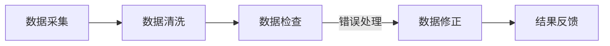
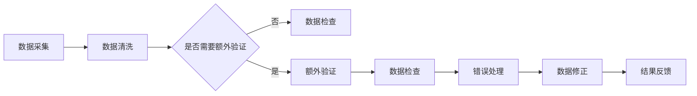

                 

# 文章标题: 数据验证与数据测试原理与代码实战案例讲解

> 关键词：数据验证，数据测试，原理讲解，代码实战，案例解析

> 摘要：本文将深入探讨数据验证与数据测试的基本原理、核心算法，并通过丰富的实战案例，详细讲解数据验证与数据测试在实际项目中的应用，帮助读者全面掌握数据验证与数据测试的方法和技巧。

---

### 第一部分：数据验证基础

#### 第1章：数据验证概述

数据验证是确保数据正确性和一致性的重要过程，它贯穿于数据采集、存储、处理和传输的各个环节。在本章中，我们将介绍数据验证的重要性、分类以及基本方法。

## 1.1 数据验证的重要性

### 1.1.1 数据验证在现代信息化中的作用

随着信息技术的飞速发展，数据已成为企业的重要资产。然而，数据的不准确、不一致和不完整等问题，会严重影响企业的决策效率与业务发展。数据验证作为数据质量管理的重要环节，能够有效地保障数据的准确性、一致性和完整性，从而提高数据的价值和应用效果。

### 1.1.2 数据验证的主要目标

数据验证的主要目标包括：

1. **确保数据准确性**：通过验证，确保输入的数据符合预期的格式和范围。
2. **提高数据一致性**：通过对比和分析，确保不同来源的数据在格式、结构上的一致性。
3. **确保数据完整性**：通过检查数据完整性，确保数据在传输、存储和处理过程中不被损坏或丢失。

## 1.2 数据验证的分类

### 1.2.1 格式验证

格式验证是指检查数据的格式是否符合预定的规则，如电子邮件地址格式、身份证号码格式等。常见的格式验证方法包括正则表达式、模式匹配等。

### 1.2.2 逻辑验证

逻辑验证是指检查数据之间的逻辑关系是否正确，如订单金额是否等于商品单价乘以数量。逻辑验证通常需要根据业务规则进行设计。

### 1.2.3 完整性验证

完整性验证是指检查数据是否完整，包括检查数据是否有缺失、重复或异常值。常见的完整性验证方法包括唯一性校验、范围校验等。

## 1.3 数据验证的基本方法

### 1.3.1 手动验证

手动验证是指通过人工检查数据，确保数据的正确性和完整性。这种方法适用于数据量较小的情况，但对于大规模数据，效率较低。

### 1.3.2 自动化验证

自动化验证是指使用工具或脚本对数据进行自动检查，以提高验证效率和准确性。常见的自动化验证工具有Python的Pandas库、Java的Hibernate Validator等。

---

#### 第2章：数据验证原理

数据验证不仅仅是检查数据是否正确，它还涉及到一系列的原理和算法。本章将深入探讨数据验证的核心原理，包括理论基础、流程解析、算法原理和数学模型。

## 2.1 数据验证原理概述

### 2.1.1 数据验证的理论基础

数据验证的理论基础包括信息论、概率论、数理统计等。这些理论为数据验证提供了科学的方法和工具，如贝叶斯定理、假设检验等。

### 2.1.2 数据验证流程解析

数据验证流程通常包括以下步骤：

1. **数据采集**：从不同的数据源获取数据。
2. **数据清洗**：对数据进行预处理，包括去重、去噪声等。
3. **数据检查**：根据预定的规则对数据进行格式、逻辑和完整性验证。
4. **错误处理**：对于验证失败的数据，进行错误标记或修正。
5. **结果反馈**：将验证结果反馈给数据使用者。

## 2.2 数据验证的Mermaid流程图

### 2.2.1 数据验证基本流程



### 2.2.2 数据验证扩展流程



## 2.3 数据验证算法原理

### 2.3.1 模式匹配算法

模式匹配算法是数据验证中最常用的算法之一，它用于检查数据是否符合预定的格式。常见的模式匹配算法有正则表达式、模糊匹配等。

### 2.3.2 常用校验算法

常用校验算法包括Luhn算法（用于验证信用卡号码）、ISBN校验算法等。这些算法通过对数据的特定处理，能够有效地验证数据的正确性。

## 2.4 数据验证数学模型与公式

### 2.4.1 数据验证的数学模型

数据验证的数学模型通常涉及概率统计、信息论等。一个简单的数学模型如下：

$$
\text{准确度} = \frac{\text{正确识别的数据}}{\text{总数据}}
$$

### 2.4.2 数据验证公式详解

准确度是数据验证中一个重要的指标，它反映了数据验证的准确性。上述公式表示，准确度是正确识别的数据与总数据的比值。

### 2.4.3 数据验证公式应用示例

假设有100条数据，通过验证后，有95条数据被正确识别，那么数据的准确度为：

$$
\text{准确度} = \frac{95}{100} = 0.95
$$

---

### 第三部分：数据验证技术

#### 第3章：数据验证技术详解

数据验证技术是数据验证过程中的重要组成部分，它涵盖了多种验证方法和工具。本章将详细讲解数据验证技术，包括正则表达式验证、数据库验证和数据验证工具与库。

## 3.1 正则表达式验证

### 3.1.1 正则表达式基础

正则表达式是一种用于模式匹配和文本处理的强大工具。它由字符和操作符组成，能够描述复杂的字符串模式。常见的正则表达式操作符包括：

- 字符匹配符：`[]`、`()`、`|`
- 边界匹配符：`^`、`$`、`\b`
- 量词匹配符：`*`、`+`、`?`、`{m}`、`{m,n}`
- 特殊字符：`.`、`\`、`()`、`[]`

### 3.1.2 正则表达式应用

正则表达式在数据验证中应用广泛，如验证邮箱地址、电话号码、身份证号码等。以下是一个验证邮箱地址的正则表达式示例：

```regex
^[a-zA-Z0-9._%+-]+@[a-zA-Z0-9.-]+\.[a-zA-Z]{2,}$
```

## 3.2 数据库验证技术

### 3.2.1 数据库验证原理

数据库验证是指利用数据库的功能，对数据进行验证。常见的数据库验证方法包括：

- **完整性约束**：通过设置主键、外键、唯一性约束等，确保数据的唯一性和一致性。
- **触发器**：通过触发器，对数据变更进行自动验证。

### 3.2.2 常用数据库验证方法

- **范围校验**：通过检查数据的范围是否符合预定的规则，如年龄应在18到65岁之间。
- **格式校验**：通过正则表达式或其他方式，对数据的格式进行验证。

## 3.3 数据验证工具与库

### 3.3.1 常见数据验证工具

常见的数据验证工具包括Python的Pandas库、Java的Hibernate Validator等。这些工具提供了丰富的验证方法和函数，能够大大简化数据验证的编程工作。

### 3.3.2 数据验证库使用示例

以下是一个使用Python的Pandas库进行数据验证的示例：

```python
import pandas as pd

data = {'姓名': ['张三', '李四', '王五'], '年龄': [25, 30, 22]}
df = pd.DataFrame(data)

# 验证姓名是否为字符串
df['姓名'].apply(lambda x: isinstance(x, str))

# 验证年龄是否在18到65岁之间
df['年龄'].apply(lambda x: 18 <= x <= 65)
```

---

### 第四部分：数据验证实践

#### 第4章：数据验证实战案例

通过实战案例，读者可以更深入地了解数据验证的实际应用。本章将介绍三个数据验证实战案例，包括用户信息验证、数据格式验证和数据逻辑验证。

## 4.1 实战案例一：用户信息验证

### 4.1.1 实战案例背景

某在线电商平台需要验证用户注册信息，包括用户名、邮箱、电话和密码等。为了确保用户信息的安全和一致性，平台需要对这些信息进行严格的验证。

### 4.1.2 实战案例需求分析

- 验证用户名是否为有效的字符串，长度在6到20个字符之间。
- 验证邮箱地址格式是否正确。
- 验证电话号码是否为有效的11位数字。
- 验证密码长度是否在8到16个字符之间，并且包含字母、数字和特殊字符。

### 4.1.3 实战案例实现

```python
import re

# 用户名验证
def validate_username(username):
    return re.match(r'^[a-zA-Z0-9_]{6,20}$', username) is not None

# 邮箱验证
def validate_email(email):
    return re.match(r'^[a-zA-Z0-9._%+-]+@[a-zA-Z0-9.-]+\.[a-zA-Z]{2,}$', email) is not None

# 电话验证
def validate_phone(phone):
    return re.match(r'^1[3456789]\d{9}$', phone) is not None

# 密码验证
def validate_password(password):
    return re.match(r'^(?=.*[a-z])(?=.*[A-Z])(?=.*\d)(?=.*[@$!%*?&])[A-Za-z\d@$!%*?&]{8,16}$', password) is not None

# 用户信息验证
def validate_user_info(username, email, phone, password):
    return validate_username(username) and validate_email(email) and validate_phone(phone) and validate_password(password)

# 示例
print(validate_user_info('zhangsan', 'zhangsan@example.com', '13812345678', 'Password123!'))
```

## 4.2 实战案例二：数据格式验证

### 4.2.1 实战案例背景

某物流公司需要对客户订单数据中的运单号、订单金额和收货地址进行格式验证，以确保数据的准确性和一致性。

### 4.2.2 实战案例需求分析

- 验证运单号是否为有效的18位数字。
- 验证订单金额是否为有效的金额格式。
- 验证收货地址是否为有效的字符串，长度在20个字符以内。

### 4.2.3 实战案例实现

```python
# 运单号验证
def validate_order_id(order_id):
    return re.match(r'^\d{18}$', order_id) is not None

# 订单金额验证
def validate_order_amount(amount):
    return re.match(r'^\d+(\.\d{1,2})?$

