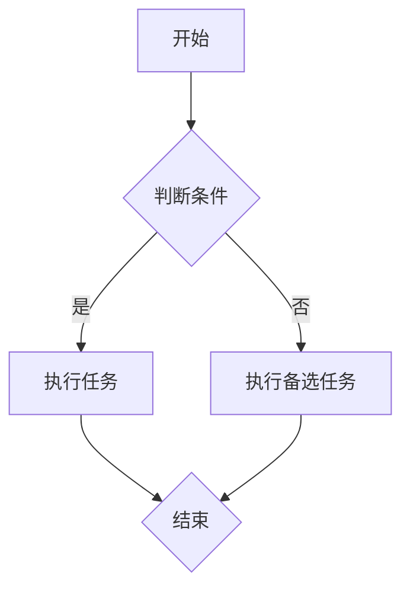

                 

## 文章标题：数据：21世纪的石油，掌握数据才能掌握未来

> 关键词：数据、21世纪、石油、数据价值、数据分析、数据应用

> 摘要：本文深入探讨了数据在当今社会中的重要性，将数据比喻为21世纪的石油，揭示了掌握数据对于未来发展的重要性。通过详细分析数据的定义、类型、价值、收集与处理、分析工具与应用场景、隐私与安全以及未来趋势，本文旨在为读者提供全面的数据科学知识，引导大家认识数据的力量，掌握数据的方法，从而在未来的竞争中脱颖而出。

## 引言

在21世纪的科技浪潮中，有一个词频繁出现，几乎成为了现代企业和国家竞争的核心——那就是数据。有人说，数据是21世纪的石油，因为就像石油对于工业革命的重要性一样，数据已经成为现代社会运转的基石。无论是互联网公司、金融机构，还是医疗、教育等传统行业，数据都成为了创新和发展的关键。那么，数据究竟是什么？它为什么如此重要？我们又如何去理解和掌握数据呢？

本文将从以下几个方面展开讨论：

1. **数据的基本概念与价值**：介绍数据的定义、类型、质量和价值，探讨数据在不同领域的应用场景。
2. **数据的收集与处理**：详细讲解数据收集的方法、预处理技术、存储与管理方式。
3. **数据分析的方法与工具**：介绍常见的数据分析工具和方法，如Excel、Python和R语言。
4. **数据在行业中的应用案例**：通过金融、电商、医疗、智慧城市等领域的应用案例，展示数据的价值和影响力。
5. **数据隐私与安全**：探讨数据隐私的重要性、保护措施和法律法规。
6. **数据科学与未来趋势**：分析数据科学的发展趋势和对未来社会的影响。
7. **结论与展望**：总结数据的重要性，展望数据科学的挑战与机遇。

希望通过本文的阅读，读者能够对数据有更深刻的认识，掌握数据的价值和利用方法，为未来的发展打下坚实的基础。

## 第一部分：数据的基本概念与价值

### 第1章：数据的定义与类型

#### 1.1 数据的定义与重要性

#### 1.1.1 数据的本质

数据，从广义上讲，是指通过记录、存储和传输的各种信息。这些信息可以是有形的，如文件、图像、声音等，也可以是无形的，如数字、文本、代码等。在计算机科学中，数据通常被定义为能够被计算机处理的信息。它们可以是结构化的，也可以是非结构化的。

数据的重要性和本质可以从以下几个方面来理解：

1. **信息的基础**：数据是信息的表现形式。没有数据，我们无法进行信息的传递和处理。
2. **决策的依据**：在商业和社会活动中，数据是决策的重要依据。通过对数据的分析和挖掘，我们可以发现潜在的趋势、问题和机会，从而做出更加明智的决策。
3. **知识的积累**：数据是知识积累的重要来源。通过对大量数据的收集、存储和分析，我们可以发现新的知识，推动科学、技术和社会的发展。

#### 1.1.2 数据的种类

数据可以根据其结构和特点分为以下几类：

1. **结构化数据**：
   - **定义**：结构化数据是有明确的结构和格式，可以容易地通过数据库管理系统（如关系型数据库）进行存储和处理的数据。
   - **例子**：数据库表中的记录、Excel文件、XML文件等。

2. **半结构化数据**：
   - **定义**：半结构化数据具有部分结构，但没有完全按照某种标准格式进行组织，可以通过特定的数据处理技术进行解析和分析。
   - **例子**：日志文件、JSON文件、XML文件（部分元素未按照标准格式定义）等。

3. **非结构化数据**：
   - **定义**：非结构化数据没有固定的结构和格式，通常需要通过复杂的数据处理和分析技术进行解析。
   - **例子**：文本文件、图像、音频、视频、网页内容等。

#### 1.1.3 数据的特点

1. **海量性**：随着互联网和传感器技术的发展，数据量呈指数级增长，每天产生的大量数据需要有效的存储和处理。
2. **多样性**：数据类型丰富，包括结构化、半结构化和非结构化数据，每种数据类型都有其特定的处理方法。
3. **实时性**：许多数据需要实时处理和分析，以支持实时决策和响应。

#### 1.1.4 数据的重要性

数据的重要性体现在以下几个方面：

1. **决策支持**：数据为决策提供了科学依据，通过数据分析可以识别潜在的风险和机会，帮助企业做出更加明智的决策。
2. **业务优化**：通过对业务数据的分析，可以发现业务流程中的瓶颈和问题，从而优化业务流程，提高效率。
3. **创新驱动**：数据是创新的重要驱动力。通过对大量数据的分析和挖掘，可以发现新的商业模式、技术和市场机会。
4. **社会进步**：数据在社会管理和公共服务中发挥着重要作用，如智慧城市、医疗健康、教育等领域，数据的应用提升了社会管理和公共服务的效率和质量。

### 1.2 数据的质量与评估

#### 1.2.1 数据质量的重要性

数据质量是指数据满足预期用途的能力。高质量的数据对于决策和分析至关重要，而低质量的数据可能会导致错误的决策和结论。因此，确保数据质量是数据管理的重要任务。

#### 1.2.2 数据质量的评估指标

以下是一些常见的数据质量评估指标：

1. **完整性**：数据是否完整，是否有缺失值或重复记录。
   - **重要性**：完整性确保了数据的完整性，避免因数据缺失导致决策失误。
   - **评估方法**：检查数据表中的空值、重复记录和缺失数据。

2. **准确性**：数据的准确性，即数据是否真实、可靠。
   - **重要性**：准确性确保了数据的真实性和可靠性，避免因数据错误导致的错误决策。
   - **评估方法**：通过比对数据和外部来源的验证、数据清洗和校验技术。

3. **及时性**：数据的更新速度，即数据是否能够及时提供。
   - **重要性**：及时性确保了数据的实时性，支持实时决策和响应。
   - **评估方法**：通过数据更新频率的监控和延迟时间的分析。

4. **可用性**：数据的可用性，即数据是否易于访问和使用。
   - **重要性**：可用性确保了数据的可操作性和易用性，提高数据分析的效率。
   - **评估方法**：通过用户体验测试、数据查询速度和操作便捷性。

5. **一致性**：数据在不同系统、数据库或来源之间的一致性。
   - **重要性**：一致性确保了数据在不同环境下的可靠性和一致性，避免数据冲突。
   - **评估方法**：通过数据同步和一致性检查、数据校验和比对技术。

#### 1.2.3 数据质量的提升方法

为了确保数据质量，可以采取以下措施：

1. **数据清洗**：通过去除重复记录、填充缺失值、标准化数据格式等方法，提高数据的完整性、准确性和一致性。
2. **数据质量管理工具**：使用数据质量管理工具进行数据质量监控和评估，及时发现和解决问题。
3. **数据治理**：建立数据治理体系，明确数据管理流程、标准和责任，确保数据质量的管理和执行。
4. **数据标准化**：制定数据标准，确保数据格式的统一和规范，提高数据的可用性和一致性。

### 1.3 数据的价值与应用场景

#### 1.3.1 数据的价值

数据的价值体现在以下几个方面：

1. **提高决策效率**：通过对数据的分析和挖掘，可以快速识别潜在的问题和机会，为决策提供科学依据，提高决策的效率和准确性。
2. **预测未来趋势**：通过历史数据的分析，可以预测未来的趋势和变化，帮助企业和组织做好应对和准备。
3. **改进产品与服务**：通过用户数据的分析，可以了解用户需求和偏好，从而改进产品和服务，提高用户满意度和忠诚度。
4. **发现市场机会**：通过对市场数据的分析和挖掘，可以发现潜在的市场机会，帮助企业抓住市场机遇。

#### 1.3.2 数据的应用场景

数据在不同领域的应用场景如下：

1. **金融领域**：在金融领域，数据被广泛应用于风险评估、信贷审批、投资决策、市场预测等方面。通过数据分析，可以识别潜在的风险、预测市场走势，为金融机构提供决策支持。
2. **电子商务**：在电子商务领域，数据被广泛应用于个性化推荐、用户行为分析、市场预测等方面。通过对用户数据的分析，可以提供个性化的产品推荐、优化营销策略，提高销售和用户满意度。
3. **健康医疗**：在健康医疗领域，数据被广泛应用于疾病预测、个性化治疗、健康管理等。通过医疗数据的分析，可以预测疾病发展趋势、优化治疗方案，提高医疗服务质量。
4. **城市管理**：在城市管理领域，数据被广泛应用于智慧交通、环境监测、公共安全等方面。通过数据分析，可以优化交通流量、监控环境质量、提高公共安全水平。
5. **教育领域**：在教育领域，数据被广泛应用于学习分析、课程推荐、教学质量评估等方面。通过数据分析，可以了解学生学习情况、优化教学方案、提高教学质量。

### 第2章：数据的收集与处理

#### 2.1 数据的收集方法

数据的收集是数据科学中的第一步，也是最为关键的一步。有效的数据收集可以确保后续数据处理和分析的质量。以下是常见的数据收集方法：

##### 2.1.1 内部数据收集

内部数据收集主要来源于组织内部的数据库、日志文件和其他数据源。

1. **数据库**：
   - **定义**：数据库是存储和管理数据的系统。内部数据库通常包含企业的运营数据、客户数据、财务数据等。
   - **数据收集方法**：通过数据库查询、导出和API接口等方式收集数据。

2. **日志文件**：
   - **定义**：日志文件是记录系统操作和事件的数据文件。日志文件通常包含服务器访问日志、应用程序日志、安全日志等。
   - **数据收集方法**：通过日志文件分析工具或脚本定期收集和分析日志数据。

##### 2.1.2 外部数据收集

外部数据收集主要来源于组织外部的公开数据源、第三方数据服务和其他在线数据。

1. **公开数据源**：
   - **定义**：公开数据源是指可供公众免费访问的数据资源，如政府数据、公共数据库、社交媒体数据等。
   - **数据收集方法**：通过Web爬虫、API接口、数据下载等方式收集公开数据。

2. **第三方数据服务**：
   - **定义**：第三方数据服务是指提供数据收集、处理和销售服务的平台或公司。
   - **数据收集方法**：通过购买数据服务或API接口获取第三方数据。

##### 2.1.3 网络爬虫

网络爬虫（Web Crawler）是一种自动化的程序，用于在互联网上收集数据。网络爬虫可以通过多种技术获取网站内容，如HTTP请求、网页解析、链接跟踪等。

1. **网络爬虫的工作原理**：
   - **URL访问**：网络爬虫通过HTTP请求访问网页URL。
   - **内容解析**：网络爬虫使用解析技术提取网页中的有用信息。
   - **链接跟踪**：网络爬虫根据网页中的链接，继续访问下一个网页，不断扩展数据收集范围。

2. **网络爬虫的优势和挑战**：
   - **优势**：能够自动化地收集大量互联网数据，提高数据收集效率。
   - **挑战**：需要处理大量的网页内容，需要复杂的解析技术和遵守网站爬虫政策。

##### 2.1.4 公开数据源

公开数据源是数据科学中重要的数据来源，主要包括以下几种类型：

1. **政府数据**：政府机构发布的公开数据，如人口统计、经济数据、地理信息等。
2. **公共数据库**：由学术机构、研究组织或非盈利组织维护的公开数据库，如基因数据库、气象数据库等。
3. **社交媒体数据**：社交媒体平台上的公开数据，如微博、推特、脸书等。

#### 2.2 数据的预处理

数据的预处理是数据科学中的关键步骤，它包括数据清洗、数据整合和数据标准化等。

##### 2.2.1 数据清洗

数据清洗是数据预处理的第一步，目的是去除数据中的噪声、错误和重复信息，确保数据的准确性和一致性。

1. **去除重复数据**：
   - **定义**：重复数据是指在同一数据集中出现的重复记录。
   - **处理方法**：通过比对数据项，去除重复记录。

2. **填充缺失值**：
   - **定义**：缺失值是指数据中没有记录或缺失的数据项。
   - **处理方法**：根据数据类型和具体情况，采用平均值、中位数、最常见值或插值法填充缺失值。

3. **数据标准化**：
   - **定义**：数据标准化是指将不同数据范围或尺度的数据转换为同一尺度或范围。
   - **方法**：常用的数据标准化方法包括最小-最大标准化、Z-Score标准化和幂函数变换等。

##### 2.2.2 数据整合

数据整合是将来自不同来源、格式和结构的数据进行整合，以形成统一的、一致的数据集。

1. **数据融合**：
   - **定义**：数据融合是将不同数据源的数据进行合并，形成新的数据集。
   - **方法**：数据融合可以通过数据表连接、数据映射和特征提取等技术实现。

2. **数据集成**：
   - **定义**：数据集成是将多个数据源的数据整合到一个统一的数据管理系统中。
   - **步骤**：
     1. 数据源识别：确定需要集成的数据源。
     2. 数据转换：将不同格式和结构的数据转换为统一格式。
     3. 数据存储：将转换后的数据存储到统一的数据仓库或数据湖中。
     4. 数据查询：通过统一接口或查询工具访问整合后的数据。

##### 2.2.3 数据的存储与管理

数据的存储与管理是数据科学中的关键环节，涉及到数据的持久化存储、备份和恢复等。

1. **数据库管理系统**：
   - **定义**：数据库管理系统（DBMS）是一种用于存储、管理和访问数据的系统。
   - **类型**：
     1. **关系型数据库**：如MySQL、PostgreSQL、Oracle等，适用于结构化数据的存储和管理。
     2. **非关系型数据库**：如MongoDB、Cassandra、Redis等，适用于半结构化和非结构化数据的存储和管理。

2. **数据仓库**：
   - **定义**：数据仓库是一种用于存储和管理大量数据的系统，用于支持数据分析、报表和查询。
   - **架构**：
     1. **数据源层**：存储原始数据。
     2. **数据集成层**：进行数据清洗、转换和整合。
     3. **数据存储层**：存储经过整合和清洗的数据。
     4. **数据访问层**：提供数据查询和分析功能。

### 第3章：数据分析的方法与工具

#### 3.1 数据分析的基本概念

数据分析是指通过统计、算法和可视化等方法，对数据进行处理、分析和解释，以发现数据中的规律、趋势和模式，从而支持决策和业务优化。

#### 3.1.1 数据分析的目标

数据分析的主要目标包括：

1. **数据可视化**：通过图表、图形等方式，将数据转换成易于理解的形式，帮助用户快速发现数据中的规律和趋势。
2. **数据挖掘**：使用算法和统计方法，从大量数据中发现潜在的规律、模式和关联，以支持预测和决策。
3. **统计分析**：通过对数据进行统计分析，揭示数据中的规律和关系，支持业务决策和优化。

#### 3.1.2 数据分析的过程

数据分析的过程通常包括以下步骤：

1. **数据收集**：收集所需的数据，可以是内部数据或外部数据。
2. **数据清洗**：对收集到的数据进行处理，去除噪声、错误和重复数据。
3. **数据整合**：将不同来源和格式的数据整合成统一的数据集。
4. **数据探索**：对数据进行初步的探索性分析，了解数据的分布、特征和关系。
5. **数据建模**：建立数据模型，使用统计、机器学习等方法对数据进行分析和预测。
6. **数据可视化**：通过图表、图形等手段，将分析结果展示出来，帮助用户理解和决策。

#### 3.1.3 数据分析的应用领域

数据分析在许多领域都有广泛的应用，包括：

1. **商业分析**：通过分析客户数据、销售数据等，帮助企业制定营销策略、优化产品和服务。
2. **金融分析**：通过分析市场数据、财务数据等，支持投资决策、风险管理等。
3. **医疗健康**：通过分析医疗数据、基因数据等，支持疾病预测、个性化治疗等。
4. **城市规划**：通过分析地理数据、交通数据等，支持城市规划、交通管理、环境监测等。
5. **科学研究**：通过分析实验数据、观测数据等，支持科学研究、学术研究等。

#### 3.2 数据分析的工具

数据分析的工具多种多样，以下是一些常用的数据分析工具：

##### 3.2.1 Excel

Excel是数据分析中最常用的工具之一，具有简单易用、功能强大的特点。

1. **基本操作**：
   - **数据输入**：在Excel表格中输入和编辑数据。
   - **数据排序和筛选**：使用排序和筛选功能对数据进行整理。
   - **数据计算**：使用公式和函数对数据进行计算。

2. **数据分析功能**：
   - **图表**：创建各种图表，如柱状图、折线图、饼图等，以可视化数据。
   - **数据透视表**：对大量数据进行多维度的分析和汇总。
   - **数据分析工具包**：使用Excel内置的分析工具包，如回归分析、假设检验等。

##### 3.2.2 Python

Python是一种功能强大的编程语言，广泛应用于数据分析和科学计算。

1. **安装与配置**：
   - **Python安装**：下载并安装Python，配置环境变量。
   - **pip安装**：使用pip安装Python的包管理器，安装所需的数据分析库。

2. **数据分析库**：
   - **Pandas**：提供数据操作和数据分析功能，如数据清洗、数据处理、数据可视化等。
   - **NumPy**：提供数值计算和数组操作功能，是数据科学的基础库之一。
   - **Matplotlib**：提供数据可视化功能，支持多种图表类型。
   - **Seaborn**：基于Matplotlib的扩展库，提供更丰富的可视化功能。

##### 3.2.3 R语言

R语言是一种专门用于统计分析和数据可视化的语言。

1. **安装与配置**：
   - **R语言安装**：下载并安装R语言，配置R环境。
   - **RStudio安装**：安装RStudio，提供R语言的集成开发环境。

2. **数据分析功能**：
   - **数据操作**：提供数据读取、清洗、转换等操作。
   - **统计分析**：提供丰富的统计函数和模型，支持回归分析、时间序列分析等。
   - **数据可视化**：提供多种图表和图形，支持复杂的可视化需求。

### 第4章：数据在行业中的应用案例

#### 4.1 金融行业

金融行业是数据科学应用最为广泛的领域之一，数据在金融行业中扮演着至关重要的角色。以下是一些金融行业中的数据应用案例：

##### 4.1.1 风险控制

风险控制是金融行业的核心任务之一，通过数据分析可以有效识别和管理风险。

1. **信用评分**：
   - **定义**：信用评分是指根据借款人的历史数据、财务状况等信息，评估其信用风险。
   - **方法**：使用回归分析、决策树等机器学习算法，建立信用评分模型，预测借款人的违约风险。

2. **市场风险**：
   - **定义**：市场风险是指由于市场波动导致的投资损失。
   - **方法**：通过时间序列分析、波动率建模等统计方法，预测市场波动和风险。

##### 4.1.2 贷款审批

贷款审批是金融行业中的一项重要业务，通过数据分析可以提高审批效率和准确性。

1. **自动审批**：
   - **定义**：自动审批是指通过数据分析，自动评估借款人的信用状况，决定是否批准贷款。
   - **方法**：使用决策树、随机森林等机器学习算法，建立贷款审批模型，自动化贷款审批流程。

2. **风险预警**：
   - **定义**：风险预警是指通过数据分析，及时发现潜在的风险，采取预防措施。
   - **方法**：通过实时数据分析，监测借款人的行为和财务状况，及时发现异常情况，预警风险。

#### 4.2 电商行业

电商行业是数据科学应用的另一个重要领域，数据在电商行业中发挥着巨大的作用。

##### 4.2.1 个性化推荐

个性化推荐是电商行业的一项重要功能，通过数据分析可以提供个性化的产品推荐，提高用户满意度和销售额。

1. **协同过滤**：
   - **定义**：协同过滤是指通过分析用户的历史行为和相似用户的行为，推荐用户可能感兴趣的产品。
   - **方法**：基于用户行为数据的矩阵分解、K-means聚类等算法，实现协同过滤推荐。

2. **内容推荐**：
   - **定义**：内容推荐是指通过分析产品的属性、标签等信息，推荐用户可能感兴趣的产品。
   - **方法**：基于内容相似性、文本分析等算法，实现内容推荐。

##### 4.2.2 用户行为分析

用户行为分析是电商行业的一项重要任务，通过数据分析可以深入了解用户行为，优化产品和服务。

1. **访问分析**：
   - **定义**：访问分析是指分析用户在网站上的浏览和点击行为。
   - **方法**：通过日志分析和用户行为数据挖掘，了解用户的访问模式和偏好。

2. **转化分析**：
   - **定义**：转化分析是指分析用户从浏览到购买的过程。
   - **方法**：通过数据分析，识别用户转化的关键因素，优化用户转化路径。

#### 4.3 健康医疗行业

健康医疗行业是数据科学应用的重要领域，数据在健康医疗行业中发挥着重要的作用。

##### 4.3.1 疾病预测

疾病预测是健康医疗行业的一项重要任务，通过数据分析可以提前预测疾病的发病趋势，为预防和治疗提供支持。

1. **疾病趋势预测**：
   - **定义**：疾病趋势预测是指通过分析历史疾病数据，预测未来某段时间内疾病的发病趋势。
   - **方法**：通过时间序列分析、回归分析等统计方法，预测疾病趋势。

2. **疾病预测模型**：
   - **定义**：疾病预测模型是指使用机器学习算法建立的预测疾病发病的模型。
   - **方法**：通过训练历史疾病数据，使用决策树、神经网络等算法建立疾病预测模型。

##### 4.3.2 个性化治疗

个性化治疗是根据患者的个体差异，制定个性化的治疗方案，通过数据分析可以提高治疗效果。

1. **基因组分析**：
   - **定义**：基因组分析是指对患者的基因组数据进行分析，了解其基因特征。
   - **方法**：通过基因测序、基因注释等生物信息学技术，分析患者的基因组数据。

2. **个体化治疗方案**：
   - **定义**：个体化治疗方案是根据患者的基因组数据和临床特征，制定的个性化治疗方案。
   - **方法**：通过基因组数据分析、临床决策支持系统，制定个体化治疗方案。

#### 4.4 智慧城市

智慧城市是指通过信息技术和数据分析，实现城市管理和服务的智能化，提高城市的管理效率和居民的生活质量。

##### 4.4.1 智能交通

智能交通是智慧城市的一个重要组成部分，通过数据分析可以优化交通流量、减少拥堵。

1. **交通流量预测**：
   - **定义**：交通流量预测是指通过分析历史交通数据，预测未来某段时间内的交通流量。
   - **方法**：通过时间序列分析、回归分析等统计方法，预测交通流量。

2. **智能交通系统**：
   - **定义**：智能交通系统是指通过信息技术和数据分析，实现交通管理的智能化。
   - **方法**：通过车载传感器、交通摄像头等设备收集交通数据，使用数据分析技术优化交通管理。

##### 4.4.2 智慧环境监测

智慧环境监测是智慧城市的一个重要应用，通过数据分析可以实时监测环境质量，提供环境预警和管理支持。

1. **环境质量监测**：
   - **定义**：环境质量监测是指通过传感器设备，实时监测环境质量数据。
   - **方法**：通过传感器采集空气、水质等环境数据，使用数据分析技术监测环境质量。

2. **环境预警与管理**：
   - **定义**：环境预警与管理是指通过数据分析，及时发现环境风险，采取管理措施。
   - **方法**：通过环境数据分析，预测环境风险，制定环境管理策略。

### 第5章：数据隐私与安全

#### 5.1 数据隐私的重要性

数据隐私是保护个人数据不被未授权访问、使用和泄露的重要问题。随着数据收集和分析技术的不断进步，数据隐私的重要性日益凸显。以下是数据隐私重要性的几个方面：

##### 5.1.1 数据隐私的定义

数据隐私是指个人数据受到保护，不被未授权的个人或组织访问、使用或泄露的状态。个人数据包括姓名、身份证号、住址、电话号码、电子邮件、医疗记录、金融信息等敏感信息。

##### 5.1.2 数据隐私的重要性

1. **保护个人权益**：数据隐私保护个人免受身份盗窃、诈骗和其他形式的欺诈行为，维护个人的隐私权和人格尊严。

2. **增强用户信任**：当用户知道他们的数据受到保护时，他们更愿意使用数字服务，分享个人数据，从而促进数字经济的发展。

3. **合规要求**：许多国家和地区制定了数据隐私保护法律法规，如欧盟的《通用数据保护条例》（GDPR），企业必须遵守这些法规，以避免法律风险和罚款。

4. **防止数据滥用**：数据隐私保护有助于防止个人数据的滥用，减少数据被用于不当的商业或政治目的。

#### 5.1.3 数据隐私对个人和社会的影响

1. **个人层面**：
   - **隐私泄露风险**：个人隐私数据泄露可能导致身份盗窃、经济损失和心理健康问题。
   - **社会排斥**：隐私数据泄露可能导致个人在社交、就业、信用评估等方面遭受不公平对待。

2. **社会层面**：
   - **信任危机**：数据隐私问题可能导致公众对政府和企业的信任下降，影响社会的稳定和发展。
   - **经济发展**：数据隐私保护有助于维护数字经济的健康发展，促进创新和投资。

#### 5.2 数据隐私的保护措施

为了保护数据隐私，可以采取以下措施：

##### 5.2.1 数据加密

数据加密是一种将数据转换成密文，以防止未授权访问的技术。数据加密包括以下方面：

1. **加密算法**：选择合适的加密算法，如AES（高级加密标准）、RSA（RSA加密算法）等。
2. **密钥管理**：确保加密密钥的安全存储和分发，防止密钥泄露。
3. **加密传输**：在数据传输过程中进行加密，如使用HTTPS协议。

##### 5.2.2 数据匿名化

数据匿名化是一种将数据中能识别个人身份的信息去除，以保护隐私的方法。数据匿名化包括以下方面：

1. **伪匿名化**：通过替换、删除或模糊处理敏感信息，降低数据识别性。
2. **k-匿名性**：确保在数据集中，任意k个记录无法区分具体是哪个个体。
3. **l-diversity**：确保在数据集中，对于任意一个个体，至少有l个不同的记录与之相关。
4. **t-closeness**：确保在数据集中，任意两个个体的属性分布相似度达到t的阈值。

##### 5.2.3 数据访问控制

数据访问控制是一种通过控制数据访问权限，确保数据安全的技术。数据访问控制包括以下方面：

1. **身份验证**：验证用户身份，确保只有授权用户可以访问数据。
2. **权限管理**：根据用户角色和职责，设置不同的数据访问权限。
3. **审计日志**：记录用户访问数据的行为，以便在发生数据泄露时进行追溯和调查。

#### 5.3 数据安全的法律法规

数据安全的法律法规对于保护数据隐私起到了重要的规范和约束作用。以下是国内外一些主要的数据隐私保护法律法规：

##### 5.3.1 国内外的数据隐私法规

1. **国内数据隐私法规**：
   - **《网络安全法》**：规定网络运营者的数据收集、存储、处理、传输和使用的规范，强化网络安全保护。
   - **《个人信息保护法》**：明确个人信息保护的基本原则和具体要求，加强个人信息保护。

2. **国外数据隐私法规**：
   - **欧盟《通用数据保护条例》（GDPR）**：是全球最具影响力的数据隐私保护法规，规定了数据处理的合法性、数据主体的权利和责任等。
   - **美国《加州消费者隐私法案》（CCPA）**：保护加州居民的个人隐私数据，规定了数据收集、使用和共享的要求。
   - **《日本个人信息保护法》**：规定了个人信息的处理、保护和利用的基本原则和规范。

##### 5.3.2 数据安全标准和规范

数据安全标准和规范是确保数据安全和隐私保护的重要依据。以下是几个主要的数据安全标准和规范：

1. **ISO/IEC 27001**：国际标准化组织（ISO）和国际电工委员会（IEC）制定的关于信息安全管理系统的国际标准，规定了信息安全管理体系的建立、实施、维护和持续改进。
2. **ISO/IEC 27002**：关于信息安全管理的实施和控制标准，提供了信息安全管理的最佳实践指南。
3. **NIST SP 800-53**：美国国家标准与技术研究院（NIST）制定的关于信息安全管理框架和基准，用于评估和管理信息系统的安全风险。
4. **GDPR合规标准**：欧盟《通用数据保护条例》（GDPR）的相关合规标准，包括数据处理原则、数据主体权利、数据泄露通知等。

通过遵循这些法律法规和标准，企业可以建立有效的数据安全保护机制，确保个人数据的隐私和安全。

### 第6章：数据科学与未来趋势

#### 6.1 数据科学的发展趋势

随着大数据、人工智能和云计算技术的快速发展，数据科学正面临着前所未有的机遇和挑战。以下是当前数据科学发展的几个重要趋势：

##### 6.1.1 大数据和云计算

大数据和云计算是数据科学发展的基石。大数据技术提供了处理和分析海量数据的能力，而云计算则提供了弹性的计算资源和存储能力，使得数据科学研究和应用得以高效进行。

1. **分布式计算**：分布式计算技术，如Hadoop和Spark，使得大规模数据处理变得更加高效和灵活。
2. **云计算平台**：云计算平台，如Amazon Web Services（AWS）、Microsoft Azure和Google Cloud Platform（GCP），提供了丰富的数据科学工具和服务。
3. **数据仓库和湖**：数据仓库和数据湖技术，如Amazon Redshift、Google BigQuery和Azure Synapse Analytics，用于存储和管理大规模数据。

##### 6.1.2 人工智能与机器学习

人工智能和机器学习是数据科学的核心技术，它们在数据分析和预测中发挥着重要作用。

1. **深度学习**：深度学习技术在图像识别、自然语言处理和语音识别等领域取得了重大突破。
2. **强化学习**：强化学习在游戏、自动驾驶和智能推荐等领域具有广泛的应用前景。
3. **迁移学习和联邦学习**：迁移学习和联邦学习技术有助于提高模型的泛化能力和隐私保护。

##### 6.1.3 实时分析和流处理

实时分析和流处理技术使得数据科学能够实时响应和分析不断变化的数据。

1. **实时数据流处理**：实时数据流处理技术，如Apache Kafka、Apache Flink和Apache Storm，能够实时处理和分析数据流。
2. **实时数据库**：实时数据库技术，如Apache Druid和ClickHouse，提供了实时数据查询和分析能力。
3. **物联网（IoT）**：物联网技术的发展使得海量实时数据得以生成，数据科学在物联网应用中具有广阔的前景。

##### 6.1.4 自适应和智能算法

自适应和智能算法技术使得数据科学应用能够根据数据和环境的变化进行自适应调整。

1. **自适应优化**：自适应优化技术通过学习数据特征和用户行为，自动调整算法参数，提高模型性能。
2. **智能推荐系统**：智能推荐系统通过用户行为和兴趣分析，提供个性化的推荐和服务。
3. **智能预测和决策**：智能预测和决策技术通过数据分析和机器学习模型，提供实时预测和决策支持。

##### 6.1.5 数据隐私和安全

数据隐私和安全是数据科学发展中不可忽视的重要方面。

1. **数据加密和匿名化**：数据加密和匿名化技术用于保护数据隐私，防止数据泄露和滥用。
2. **联邦学习**：联邦学习技术通过在分布式设备上进行模型训练，保护用户数据隐私。
3. **合规和监管**：数据科学应用需要遵守相关法律法规和合规要求，确保数据安全和隐私保护。

#### 6.2 数据驱动的未来

数据驱动的未来是指数据在各个领域中的广泛应用，推动社会、经济和科技的进步。

##### 6.2.1 数据驱动的企业运营

数据驱动已经成为现代企业运营的核心。通过数据分析，企业可以实现以下目标：

1. **运营优化**：通过分析运营数据，优化供应链管理、库存控制和生产流程，提高运营效率。
2. **需求预测**：通过分析历史销售数据和用户行为，预测市场需求，制定有效的销售策略。
3. **客户洞察**：通过分析客户数据，了解客户需求和行为，提供个性化的产品和服务。

##### 6.2.2 数据驱动的社会治理

数据驱动的社会治理是指通过数据分析，提高政府和社会管理的效率和质量。

1. **智慧城市**：通过数据分析，实现智能交通、环境监测和公共安全等方面的优化。
2. **公共安全**：通过数据分析，预防和打击犯罪活动，提高公共安全水平。
3. **社会服务**：通过数据分析，优化公共服务，提高社会服务质量和效率。

##### 6.2.3 数据驱动的个人生活

数据驱动正在改变个人生活的各个方面。

1. **个性化推荐**：通过数据分析，提供个性化的音乐、电影、商品推荐，提升用户体验。
2. **健康管理**：通过数据分析，实现个性化健康管理和疾病预测，提高个人健康水平。
3. **智能家居**：通过数据分析，实现智能家居设备的自动化控制和优化，提升生活质量。

### 结论与展望

数据作为21世纪的石油，已经成为了现代社会的核心资源。掌握数据，利用数据分析技术，可以为企业、社会和个人带来巨大的价值。然而，随着数据量的快速增长和数据类型的多样化，数据科学面临着巨大的挑战。

未来的数据科学将更加注重实时性、隐私保护和智能算法的应用。通过结合大数据、人工智能和云计算技术，数据科学将不断突破现有技术的限制，实现更加高效和智能的数据分析。

同时，数据科学也需要面对数据隐私和安全的重要问题。随着数据隐私保护法律法规的不断完善，数据科学应用必须遵守相关法规，确保数据安全和隐私保护。

总之，数据科学正处于快速发展的阶段，它将不断推动社会和科技的发展。掌握数据科学的知识和技能，将使我们能够在未来的竞争中脱颖而出，创造更加美好的未来。

### 附录

#### 附录A：数据科学资源与工具

##### A.1 数据科学常用工具

在数据科学领域，有许多常用的工具和库，可以帮助数据科学家高效地进行数据处理和分析。以下是几个常用的数据科学工具：

1. **Python**：
   - **Pandas**：一个强大的数据处理库，用于数据清洗、转换和分析。
   - **NumPy**：一个用于数值计算的库，提供高效的数组操作。
   - **Scikit-learn**：一个用于机器学习的库，提供多种机器学习算法。
   - **Matplotlib**：一个用于数据可视化的库，能够创建多种类型的图表。

2. **R语言**：
   - **dplyr**：一个用于数据操作和转换的库，提供简洁的语法。
   - **ggplot2**：一个用于数据可视化的库，能够创建精美的图表。
   - **caret**：一个用于模型训练和评估的库，提供多种机器学习算法和模型评估方法。

3. **Excel**：
   - **Excel**：一个广泛使用的电子表格软件，提供基本的数据处理和分析功能。

4. **SQL**：
   - **SQL**：结构化查询语言，用于数据库查询和数据处理。

##### A.2 数据科学学习资源

为了更好地学习数据科学，以下是一些推荐的学习资源：

1. **在线课程**：
   - **Coursera**：提供多种数据科学相关的在线课程，包括《数据科学基础》、《机器学习》等。
   - **edX**：提供由顶尖大学和机构开设的数据科学在线课程。

2. **书籍**：
   - **《Python数据分析基础教程：Numpy学习指南》**：适合初学者，介绍了NumPy的基础知识。
   - **《统计学习方法》**：详细介绍了统计学习的基本方法和算法。
   - **《深入浅出数据分析》**：用通俗易懂的语言介绍了数据分析的基本概念和方法。

3. **论坛和社区**：
   - **Stack Overflow**：一个编程问答社区，可以解决数据科学中的各种问题。
   - **Kaggle**：一个数据科学竞赛平台，提供各种数据科学项目和比赛。

#### 附录B：Mermaid 流程图

Mermaid 是一种基于Markdown的图形绘制语言，可以方便地创建流程图、UML图等。以下是一个简单的Mermaid流程图的例子：



这个流程图表示了一个简单的流程，包括开始、判断条件、执行任务、执行备选任务和结束。

#### 附录C：伪代码示例

伪代码是一种描述算法逻辑的简明语言，用于说明算法的基本思想和步骤，而不关心具体的实现细节。以下是一个简单的数据清洗伪代码示例：

```plaintext
数据清洗(数据集)
    初始化空清洗后数据集
    对于数据集的每个数据项：
        去除重复数据项
        填充缺失值
        标准化数据格式
    返回清洗后数据集
```

以下是一个简单的机器学习算法伪代码示例：

```plaintext
机器学习算法(训练数据集，测试数据集)
    初始化模型参数
    循环迭代：
        对于每个训练样本：
            计算损失函数值
            更新模型参数
        如果满足停止条件，则跳出循环
    在测试数据集上评估模型性能
    返回模型参数和评估结果
```

#### 附录D：数学模型与公式

在数据分析中，数学模型和公式是理解和应用各种统计和机器学习算法的基础。以下是一些常见的数据可视化、统计分析和机器学习相关的数学模型和公式。

##### D.1 数据可视化数学模型

1. **折线图**：
   - 公式：\( y = a \cdot x + b \)
   - 解释：\( a \) 和 \( b \) 分别是斜率和截距，用于表示数据点之间的关系。

2. **柱状图**：
   - 公式：\( h_i = f_i \cdot w_i \)
   - 解释：\( f_i \) 是频率，\( w_i \) 是宽度，用于表示不同类别的数据分布。

##### D.2 统计分析数学模型

1. **线性回归**：
   - 公式：\( y = \beta_0 + \beta_1 \cdot x + \varepsilon \)
   - 解释：\( \beta_0 \) 是截距，\( \beta_1 \) 是斜率，\( \varepsilon \) 是误差项。

2. **方差分析（ANOVA）**：
   - 公式：\( F = \frac{MS_{between}}{MS_{within}} \)
   - 解释：\( MS_{between} \) 是组间均方差，\( MS_{within} \) 是组内均方差，用于比较组间差异。

##### D.3 机器学习数学模型

1. **线性模型**：
   - 公式：\( y = \theta_0 + \theta_1 \cdot x \)
   - 解释：\( \theta_0 \) 和 \( \theta_1 \) 是模型参数。

2. **支持向量机（SVM）**：
   - 公式：\( w \cdot x - b = 0 \)
   - 解释：\( w \) 是权重向量，\( b \) 是偏置项，用于分类。

这些数学模型和公式是数据分析和机器学习的基础，通过理解这些模型和公式，可以更好地理解数据背后的逻辑和算法。在实际应用中，可以使用这些公式进行计算和实现，从而实现数据分析的目标。

