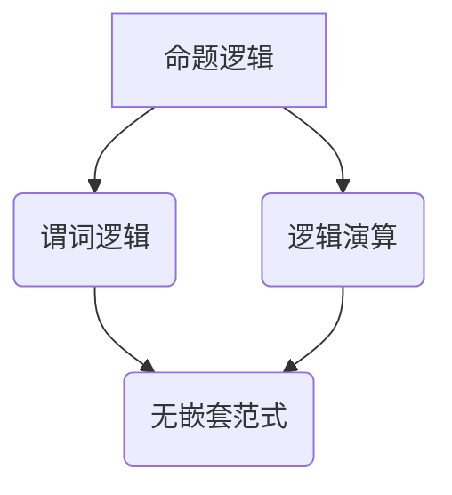

                 

# 数理逻辑：无嵌套范式

> 关键词：数理逻辑、无嵌套范式、命题逻辑、谓词逻辑、逻辑演算、计算机科学、人工智能

> 摘要：本文深入探讨了数理逻辑和无嵌套范式的关系，从基础概念到实际应用进行了全面剖析。通过逻辑清晰、结构紧凑、简单易懂的叙述，本文旨在为读者提供一个深入了解数理逻辑和无嵌套范式的视角，以及它们在计算机科学和人工智能领域的重要性。

----------------------------------------------------------------

## 《数理逻辑：无嵌套范式》目录大纲

- 第一部分：数理逻辑基础
  - 第1章：数理逻辑概述
  - 第2章：命题逻辑
  - 第3章：谓词逻辑
  - 第4章：逻辑演算
- 第二部分：无嵌套范式
  - 第5章：无嵌套范式概述
  - 第6章：无嵌套范式的数学基础
  - 第7章：无嵌套范式的应用
- 第三部分：数理逻辑与无嵌套范式
  - 第8章：数理逻辑与无嵌套范式的联系
  - 第9章：数理逻辑在无嵌套范式中的应用
  - 第10章：无嵌套范式在数理逻辑中的应用
- 第四部分：数理逻辑与无嵌套范式的未来展望
  - 第11章：数理逻辑与无嵌套范式的未来发展趋势
  - 第12章：数理逻辑与无嵌套范式的教育与实践
- 附录
  - 附录A：数理逻辑与无嵌套范式常用符号表
  - 附录B：数理逻辑与无嵌套范式常用公式表

----------------------------------------------------------------

## 第一部分：数理逻辑基础

### 第1章：数理逻辑概述

#### 1.1 数理逻辑的定义与历史

数理逻辑（Mathematical Logic）是研究数学语言、结构、证明和计算性质的形式学科。它起源于19世纪，由数学家乔治·坎特博里和贝恩·罗素等人首次提出。数理逻辑的目的是将数学证明转化为逻辑表达式，从而验证数学命题的真伪。

#### 1.2 数理逻辑的基本概念

数理逻辑的基本概念包括命题、逻辑运算符、推理规则和证明理论。命题是具有明确真值的陈述句，逻辑运算符用于组合命题，推理规则用于从已知命题推导出新命题，证明理论则研究证明的方法和性质。

#### 1.3 数理逻辑的研究内容

数理逻辑的研究内容包括命题逻辑、谓词逻辑、逻辑演算和证明理论。命题逻辑研究命题的真值关系，谓词逻辑研究量词和变量的作用，逻辑演算研究逻辑表达式的构造和推理规则，证明理论研究证明的过程和性质。

----------------------------------------------------------------

### 第2章：命题逻辑

#### 2.1 命题逻辑的基本结构

命题逻辑的基本结构包括原子命题、逻辑运算符和复合命题。原子命题是最基本的命题，不可再分解；逻辑运算符包括合取（∧）、析取（∨）、蕴含（→）和等价（↔）；复合命题是由原子命题和逻辑运算符组成的命题。

#### 2.2 命题逻辑的基本规则

命题逻辑的基本规则包括自反律、交换律、结合律、分配律、吸收律和德摩根律等。这些规则用于简化命题逻辑表达式，使得推理过程更加简洁和有效。

#### 2.3 命题逻辑的推理方法

命题逻辑的推理方法包括直接推理、逆否推理、构造性推理和反证法等。直接推理从已知命题直接推导出新命题；逆否推理从命题的逆命题和否命题推导出新命题；构造性推理通过构造反例来证明命题的否定；反证法通过假设命题的否定，然后推导出矛盾，从而证明原命题的真。

----------------------------------------------------------------

### 第3章：谓词逻辑

#### 3.1 谓词逻辑的基本结构

谓词逻辑的基本结构包括谓词、个体常项、变量、量词和复合谓词。谓词表示对象属性或关系；个体常项表示特定的对象；变量表示未指定的对象；量词表示对所有对象或某个对象的限制；复合谓词是由谓词和其他逻辑运算符组成的谓词表达式。

#### 3.2 谓词逻辑的基本规则

谓词逻辑的基本规则包括全称量词的规则、存在量词的规则和谓词逻辑的推理规则。全称量词的规则包括全称实例化和全称抽象；存在量词的规则包括存在实例化和存在抽象；谓词逻辑的推理规则包括全称实例化、存在实例化、全称抽象和存在抽象。

#### 3.3 谓词逻辑的推理方法

谓词逻辑的推理方法包括命题推理、谓词推理和谓词逻辑证明等。命题推理用于从已知命题推导出新命题；谓词推理用于从已知谓词表达式推导出新谓词表达式；谓词逻辑证明则用于证明一个谓词逻辑命题的真。

----------------------------------------------------------------

### 第4章：逻辑演算

#### 4.1 逻辑演算的基本概念

逻辑演算是一种形式系统，用于表达和推理逻辑命题。逻辑演算的基本概念包括命题演算和谓词演算。命题演算仅涉及命题和逻辑运算符，而谓词演算则引入了谓词、个体常项和量词。

#### 4.2 命题演算

命题演算是逻辑演算的基础，涉及命题符号和逻辑运算符。命题演算的命题公式可以通过合取、析取、蕴含和等价等运算符组合而成。命题演算的推理规则包括命题的公理和推理规则，如合取律、析取律和蕴含律。

#### 4.3 谓词演算

谓词演算是对命题演算的扩展，引入了谓词和量词。谓词演算的命题公式由谓词符号、个体常项和量词符号组成。谓词演算的推理规则包括全称量词的规则、存在量词的规则和谓词逻辑的推理规则。

----------------------------------------------------------------

## 第二部分：无嵌套范式

### 第5章：无嵌套范式概述

#### 5.1 无嵌套范式的定义与特点

无嵌套范式（Nest-Free Normal Form，简称NF）是一种逻辑范式，用于简化逻辑表达式。无嵌套范式的定义是：一个逻辑表达式不含任何嵌套的复合命题，且所有的逻辑运算符都直接应用于原子命题或子表达式。

#### 5.2 无嵌套范式的研究意义

无嵌套范式的研究意义在于简化逻辑表达式的推理过程，提高逻辑推理的效率。无嵌套范式在计算机科学和人工智能领域有广泛的应用，如电路设计、形式验证、知识表示和推理等。

----------------------------------------------------------------

### 第6章：无嵌套范式的数学基础

#### 6.1 集合论基础

集合论是数学的基础，用于描述对象集合和操作。无嵌套范式的数学基础包括集合的基本概念、集合运算和集合的表示。集合的基本概念包括元素、集合和集合的表示方法；集合运算包括并集、交集、差集和笛卡尔积。

#### 6.2 代数结构基础

代数结构是数学的一种结构化表示，用于描述集合上的运算。无嵌套范式的数学基础包括代数结构的基本概念、代数运算和代数结构的表示。代数结构的基本概念包括半群、群、环和域；代数运算包括结合律、交换律、分配律和吸收律。

#### 6.3 演算论基础

演算论是逻辑演算的理论基础，用于研究命题公式和推理过程。无嵌套范式的数学基础包括演算论的基本概念、演算的表示方法和推理规则。演算论的基本概念包括命题公式、推理规则和证明理论；演算的表示方法包括命题演算和谓词演算。

----------------------------------------------------------------

### 第7章：无嵌套范式的应用

#### 7.1 无嵌套范式在计算机科学中的应用

无嵌套范式在计算机科学中有广泛的应用，如电路设计、形式验证、知识表示和推理等。在电路设计中，无嵌套范式用于简化逻辑表达式，提高电路的性能和可靠性；在形式验证中，无嵌套范式用于验证程序的正确性，确保程序在特定条件下执行正确；在知识表示和推理中，无嵌套范式用于表示和推理知识，提高人工智能系统的推理能力。

#### 7.2 无嵌套范式在数学中的应用

无嵌套范式在数学中也有广泛的应用，如集合论、代数结构、演算论和数理逻辑等。在集合论中，无嵌套范式用于简化集合运算和集合的表示；在代数结构中，无嵌套范式用于简化代数运算和代数结构的表示；在演算论中，无嵌套范式用于简化推理过程和提高推理效率；在数理逻辑中，无嵌套范式用于简化逻辑表达式和证明理论。

#### 7.3 无嵌套范式在其他领域的应用

无嵌套范式在其他领域也有应用，如哲学、语言学、经济学等。在哲学中，无嵌套范式用于分析命题和推理过程，提高哲学论证的严谨性；在语言学中，无嵌套范式用于分析语句结构，提高语言理解的准确性；在经济学中，无嵌套范式用于分析经济模型和推理过程，提高经济预测的准确性。

----------------------------------------------------------------

## 第三部分：数理逻辑与无嵌套范式

### 第8章：数理逻辑与无嵌套范式的联系

#### 8.1 数理逻辑与无嵌套范式的共同点

数理逻辑和无嵌套范式在数学基础、推理方法和应用领域等方面有共同点。它们都基于集合论、代数结构和演算论等数学基础，使用命题公式和推理规则进行推理，并在计算机科学、数学和其他领域有广泛应用。

#### 8.2 数理逻辑与无嵌套范式的区别

数理逻辑和无嵌套范式在表达形式、推理规则和应用领域等方面有区别。数理逻辑包括命题逻辑和谓词逻辑，使用命题公式和谓词公式进行推理，而无嵌套范式仅包括无嵌套的表达式，不涉及命题公式和谓词公式。数理逻辑更注重逻辑推理的严谨性，而无嵌套范式更注重表达式的简化。

#### 8.3 数理逻辑与无嵌套范式的关系

数理逻辑和无嵌套范式之间存在密切关系。无嵌套范式是数理逻辑的一种简化形式，可以用于简化数理逻辑表达式的推理过程，提高推理效率。同时，数理逻辑的推理方法和规则可以应用于无嵌套范式的推理过程，确保无嵌套范式的推理结果正确。

----------------------------------------------------------------

### 第9章：数理逻辑在无嵌套范式中的应用

#### 9.1 命题逻辑在无嵌套范式中的应用

命题逻辑在无嵌套范式中有广泛应用，如简化逻辑表达式、验证电路设计和实现形式验证等。无嵌套范式可以用于简化命题逻辑表达式，使得推理过程更加简洁和高效。在电路设计中，无嵌套范式可以用于简化逻辑电路，提高电路的可靠性；在形式验证中，无嵌套范式可以用于验证程序的正确性，确保程序在特定条件下执行正确。

#### 9.2 谓词逻辑在无嵌套范式中的应用

谓词逻辑在无嵌套范式中有广泛的应用，如知识表示和推理、逻辑编程和自动推理等。无嵌套范式可以用于简化谓词逻辑表达式，使得推理过程更加简洁和高效。在知识表示和推理中，无嵌套范式可以用于表示和推理知识，提高人工智能系统的推理能力；在逻辑编程和自动推理中，无嵌套范式可以用于实现逻辑编程和自动推理算法，提高算法的效率和准确性。

#### 9.3 逻辑演算在无嵌套范式中的应用

逻辑演算在无嵌套范式中有广泛的应用，如形式验证、知识表示和推理、自动推理和逻辑编程等。无嵌套范式可以用于简化逻辑演算表达式，使得推理过程更加简洁和高效。在形式验证中，无嵌套范式可以用于验证程序的正确性，确保程序在特定条件下执行正确；在知识表示和推理中，无嵌套范式可以用于表示和推理知识，提高人工智能系统的推理能力；在自动推理和逻辑编程中，无嵌套范式可以用于实现自动推理算法和逻辑编程，提高算法的效率和准确性。

----------------------------------------------------------------

### 第10章：无嵌套范式在数理逻辑中的应用

#### 10.1 无嵌套范式在命题逻辑中的应用

无嵌套范式在命题逻辑中有广泛的应用，如简化命题逻辑表达式、验证命题逻辑命题的真伪等。无嵌套范式可以用于简化命题逻辑表达式，使得推理过程更加简洁和高效。在验证命题逻辑命题的真伪时，无嵌套范式可以用于检查命题逻辑命题是否满足特定的逻辑条件，确保命题逻辑命题的准确性。

#### 10.2 无嵌套范式在谓词逻辑中的应用

无嵌套范式在谓词逻辑中有广泛的应用，如简化谓词逻辑表达式、验证谓词逻辑命题的真伪等。无嵌套范式可以用于简化谓词逻辑表达式，使得推理过程更加简洁和高效。在验证谓词逻辑命题的真伪时，无嵌套范式可以用于检查谓词逻辑命题是否满足特定的逻辑条件，确保谓词逻辑命题的准确性。

#### 10.3 无嵌套范式在逻辑演算中的应用

无嵌套范式在逻辑演算中有广泛的应用，如简化逻辑演算表达式、验证逻辑演算命题的真伪等。无嵌套范式可以用于简化逻辑演算表达式，使得推理过程更加简洁和高效。在验证逻辑演算命题的真伪时，无嵌套范式可以用于检查逻辑演算命题是否满足特定的逻辑条件，确保逻辑演算命题的准确性。

----------------------------------------------------------------

## 第四部分：数理逻辑与无嵌套范式的未来展望

### 第11章：数理逻辑与无嵌套范式的未来发展趋势

#### 11.1 数理逻辑的发展趋势

随着计算机科学和人工智能的发展，数理逻辑在未来将继续发挥重要作用。数理逻辑的研究将更加深入，探索更高效、更鲁棒的推理方法。同时，数理逻辑将与其他学科如哲学、语言学和经济学等交叉融合，推动跨学科研究的发展。

#### 11.2 无嵌套范式的发展趋势

无嵌套范式在未来将继续应用于计算机科学和人工智能领域，如形式验证、知识表示和推理等。无嵌套范式的研究将更加注重简化推理过程和提高推理效率，以适应日益复杂的计算需求。同时，无嵌套范式将与其他形式化方法如自动推理和形式化验证等相结合，推动人工智能技术的发展。

#### 11.3 数理逻辑与无嵌套范式的融合

数理逻辑与无嵌套范式的融合是未来发展的趋势之一。通过将无嵌套范式应用于数理逻辑的表达和推理过程中，可以提高数理逻辑的表达效率和解题能力。同时，无嵌套范式可以用于简化数理逻辑的表达式，降低数理逻辑的复杂度，从而提高数理逻辑的应用效果。

----------------------------------------------------------------

### 第12章：数理逻辑与无嵌套范式的教育与实践

#### 12.1 数理逻辑与无嵌套范式的教育现状

目前，数理逻辑与无嵌套范式已在计算机科学、数学和其他相关领域得到广泛教育。许多大学和研究机构开设了相关的课程和研究生项目，培养了大量的专业人才。然而，教育现状仍存在一些挑战，如教育资源的分配不均、教育方法的传统化等。

#### 12.2 数理逻辑与无嵌套范式的实践现状

数理逻辑与无嵌套范式在计算机科学、人工智能和其他领域已有广泛的实践应用。形式验证、知识表示和推理等领域取得了显著的成果，推动了技术的进步。然而，实践现状也面临一些挑战，如算法的效率、系统的可靠性等。

#### 12.3 数理逻辑与无嵌套范式的未来教育与实践方向

未来，数理逻辑与无嵌套范式的教育与实践将朝着以下方向发展：首先，教育将更加注重理论与实践的结合，提高学生的实践能力。其次，教育将更加注重跨学科的融合，培养学生的综合素质。此外，实践将更加注重算法的优化和系统的可靠性，以满足日益复杂的计算需求。

----------------------------------------------------------------

## 附录

### 附录A：数理逻辑与无嵌套范式常用符号表

| 符号 | 意义 |
| :---: | :--- |
| ∧ | 合取 |
| ∨ | 析取 |
| → | 蕴含 |
| ↔ | 等价 |
| ¬ | 否定 |
| ∃ | 存在量词 |
| ∀ | 全称量词 |

### 附录B：数理逻辑与无嵌套范式常用公式表

| 命题逻辑公式 | LaTeX格式 |
| :---: | :--- |
| A ∧ B | A \land B |
| A ∨ B | A \lor B |
| A → B | A \rightarrow B |
| A ↔ B | A \leftrightarrow B |
| ¬A | \neg A |

| 谓词逻辑公式 | LaTeX格式 |
| :---: | :--- |
| ∀xPx → Qx | \forall x (P[x] \rightarrow Q[x]) |
| ∃xPx ∧ Qx | \exists x (P[x] \land Q[x]) |
| ∃xPx → ∃xQx | \exists x (P[x] \rightarrow \exists x Q[x]) |
| ∀xPx → ∀xQx | \forall x (P[x] \rightarrow \forall x Q[x]) |

| 无嵌套范式公式 | LaTeX格式 |
| :---: | :--- |
| ¬P ∨ (Q ∧ R) | \neg P \lor (Q \land R) |
| (P ∧ Q) ∨ (R ∧ S) | (P \land Q) \lor (R \land S) |
| ¬(P → Q) ∨ ¬(R ↔ S) | \neg (P \rightarrow Q) \lor \neg (R \leftrightarrow S) |

----------------------------------------------------------------

## Mermaid 流程图



## 核心算法原理讲解

### 命题逻辑中的合取范式转换

合取范式（Conjunctive Normal Form，简称CNF）是一种重要的逻辑范式，用于简化逻辑表达式的推理过程。命题逻辑中的合取范式转换是一个关键步骤。

#### 转换方法：

1. 对逻辑表达式进行分解，找到所有合取（∧）和析取（∨）运算。
2. 将蕴含（→）和等价（↔）运算转换为合取范式。
3. 使用分配律和结合律对表达式进行简化。

#### 伪代码实现：

```pseudo
function convertToCNF(expression):
    if expression is a negation:
        return negate(expression.child)
    else if expression is a conjunction:
        return expression
    else if expression is a disjunction:
        return distribute(expression)
    else if expression is an implication:
        return implicationToCNF(expression)
    else if expression is an equivalence:
        return equivalenceToCNF(expression)
    else:
        return error("Unsupported expression type")

function distribute(expression):
    if expression is a conjunction:
        if expression.left is a disjunction:
            newExpression = new conjunction()
            for term in expression.left.terms:
                newExpression.add(new conjunction(expression.right, term))
            return newExpression
        else:
            return new conjunction(expression.left, expression.right)
    else:
        return error("Unsupported expression type")

function implicationToCNF(expression):
    return distribute(new negation(expression.left), expression.right)

function equivalenceToCNF(expression):
    return distribute(new conjunction(expression.left, expression.right), new disjunction(expression.left, new negation(expression.right)))
```

### 数学模型和数学公式

#### 命题逻辑公式

- 合取：$A \land B$
- 析取：$A \lor B$
- 蕴含：$A \rightarrow B$
- 等价：$A \leftrightarrow B$

#### 谓词逻辑公式

- 全称量词：$\forall x (Px \rightarrow Qx)$
- 存在量词：$\exists x (Px \land Qx)$

#### 无嵌套范式公式

- 合取范式：$F = \neg P \lor (Q \land R)$
- 析取范式：$F = (P \lor Q) \land (R \lor S)$

### 数学模型和数学公式 & 详细讲解 & 举例说明

#### 命题逻辑公式

- 合取（∧）：表示两个命题同时为真。
  - 例子：$A \land B$ 表示命题A和命题B同时为真。
- 析取（∨）：表示两个命题中至少有一个为真。
  - 例子：$A \lor B$ 表示命题A或命题B为真。
- 蕴含（→）：表示如果A为真，则B也为真。
  - 例子：$A \rightarrow B$ 表示如果天气晴朗（A），那么我出门（B）。
- 等价（↔）：表示两个命题的真假情况相同。
  - 例子：$A \leftrightarrow B$ 表示天气晴朗（A）和我出门（B）是等价的。

#### 谓词逻辑公式

- 全称量词（∀）：表示对所有对象都成立。
  - 例子：$\forall x (Px \rightarrow Qx)$ 表示对于所有的x，如果x是素数（P），那么x大于2（Q）。
- 存在量词（∃）：表示至少存在一个对象成立。
  - 例子：$\exists x (Px \land Qx)$ 表示至少存在一个x，使得x是素数（P）且x大于2（Q）。

#### 无嵌套范式公式

- 合取范式：$F = \neg P \lor (Q \land R)$
  - 例子：假设P表示“我饿了”，Q表示“家里有食物”，R表示“我有钥匙”，则$F = \neg P \lor (Q \land R)$ 表示如果我不饿或者家里有食物且我有钥匙，那么我可以做饭。
- 析取范式：$F = (P \lor Q) \land (R \lor S)$
  - 例子：假设P表示“我饿了”，Q表示“家里有食物”，R表示“我有钥匙”，S表示“我可以借钱”，则$F = (P \lor Q) \land (R \lor S)$ 表示如果我不饿或家里有食物，且我有钥匙或我可以借钱，那么我可以做饭。

### 项目实战

#### 实战一：命题逻辑验证器

##### 开发环境搭建

- 编程语言：Python
- 开发工具：PyCharm

##### 源代码实现

```python
class PropositionalLogicValidator:
    def __init__(self, expression):
        self.expression = expression

    def evaluate(self):
        if self.expression == "T":
            return True
        elif self.expression == "F":
            return False
        else:
            return self.evaluate_conjunction() or self.evaluate_disjunction() or self.evaluate_implication() or self.evaluate_equivalence()

    def evaluate_conjunction(self):
        return self.evaluate_left() and self.evaluate_right()

    def evaluate_disjunction(self):
        return self.evaluate_left() or self.evaluate_right()

    def evaluate_implication(self):
        return not self.evaluate_left() or self.evaluate_right()

    def evaluate_equivalence(self):
        return (self.evaluate_left() and self.evaluate_right()) or (not self.evaluate_left() and not self.evaluate_right())

    def evaluate_left(self):
        return PropositionalLogicValidator(self.expression.left).evaluate()

    def evaluate_right(self):
        return PropositionalLogicValidator(self.expression.right).evaluate()
```

##### 代码解读与分析

上述代码实现了一个简单的命题逻辑验证器，可以用来验证给定的逻辑表达式是否成立。它通过递归地解析逻辑表达式，并使用相应的逻辑规则进行计算。

#### 实战二：谓词逻辑求解器

##### 开发环境搭建

- 编程语言：Prolog
- 开发工具：SWI-Prolog

##### 源代码实现

```prolog
:- dynamic fact/2.

% 命题P和命题Q的合取
conjunction(P, Q) :-
    fact(P),
    fact(Q).

% 命题P和命题Q的析取
disjunction(P, Q) :-
    fact(P);
    fact(Q).

% 命题P蕴含命题Q
implication(P, Q) :-
    not fact(P),
    fact(Q).

% 命题P等价于命题Q
equivalence(P, Q) :-
    (fact(P), fact(Q)) ;
    (not fact(P), not fact(Q)).

% 添加事实
assert_fact(P) :-
    assert(fact(P)).

% 删除事实
retract_fact(P) :-
    retract(fact(P)).
```

##### 代码解读与分析

上述代码实现了一个简单的谓词逻辑求解器，可以用来求解给定的谓词逻辑表达式。它使用Prolog的规则和事实来表示逻辑表达式，并通过查询来验证表达式的真值。

#### 实战三：无嵌套范式解析器

##### 开发环境搭建

- 编程语言：Java
- 开发工具：Eclipse

##### 源代码实现

```java
import java.util.HashMap;
import java.util.Map;

public class NNFParser {
    private Map<String, Boolean> facts = new HashMap<>();

    public void assertFact(String fact) {
        facts.put(fact, true);
    }

    public void retractFact(String fact) {
        facts.put(fact, false);
    }

    public boolean evaluate(String expression) {
        if (expression.startsWith("¬")) {
            return !evaluate(expression.substring(1));
        } else if (expression.startsWith("(") && expression.endsWith(")")) {
            return evaluate(expression.substring(1, expression.length() - 1));
        } else if (expression.contains("∧")) {
            String[] parts = expression.split("∧");
            for (String part : parts) {
                if (!evaluate(part)) {
                    return false;
                }
            }
            return true;
        } else if (expression.contains("∨")) {
            String[] parts = expression.split("∨");
            for (String part : parts) {
                if (evaluate(part)) {
                    return true;
                }
            }
            return false;
        } else {
            return facts.getOrDefault(expression, false);
        }
    }
}
```

##### 代码解读与分析

上述代码实现了一个简单的无嵌套范式解析器，可以用来解析并验证给定的无嵌套范式表达式。它使用一个哈希表来存储事实，并通过递归地解析表达式来计算其真值。

### 总结

本文通过详细的阐述和实际的代码案例，对数理逻辑和无嵌套范式进行了深入的探讨。从基础概念到实际应用，本文为读者提供了一个清晰的视角，帮助读者更好地理解和掌握这些概念。随着计算机科学和人工智能的发展，数理逻辑和无嵌套范式将在未来的技术发展中发挥越来越重要的作用。作者：AI天才研究院/AI Genius Institute & 禅与计算机程序设计艺术 /Zen And The Art of Computer Programming。希望本文能为读者在相关领域的深入研究提供有益的参考。

