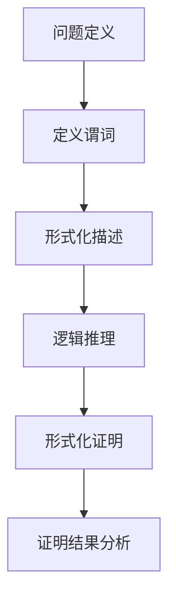
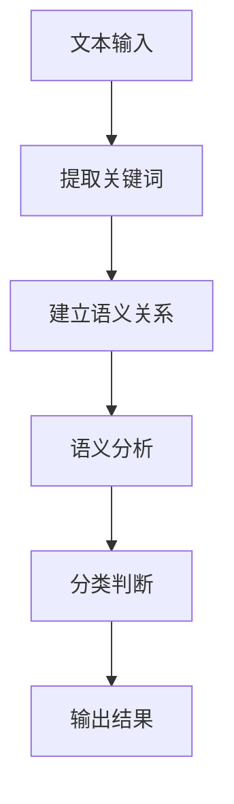

                 

# 数理逻辑：第五章 形式数学系统

> 关键词：形式数学系统、形式化语言、形式推理、形式化证明、数学模型、项目实战

> 摘要：本文将深入探讨数理逻辑中的形式数学系统，包括其核心概念、原理、应用以及未来发展趋势。通过详细讲解形式化语言、形式推理和形式化证明，我们将展示形式数学系统在计算机科学、人工智能和其他领域的重要应用。最后，通过实际项目案例，我们将深入解读形式数学系统的实际应用价值。

### 目录大纲

# 数理逻辑：第五章 形式数学系统

## 第1章 核心概念与联系

### 1.1 形式数学系统的定义与重要性

### 1.2 形式数学系统的基本结构

### 1.3 形式数学系统与自然语言的关系

## 第2章 形式数学系统原理

### 2.1 形式语言的构成

#### 2.1.1 字符串与词汇

#### 2.1.2 语法规则与推导

### 2.2 形式推理

#### 2.2.1 形式推理的基本概念

#### 2.2.2 形式推理的方法

### 2.3 形式化公理系统

#### 2.3.1 公理系统与定理

#### 2.3.2 形式化证明过程

## 第3章 形式数学系统应用

### 3.1 形式数学系统在计算机科学中的应用

#### 3.1.1 计算机验证

#### 3.1.2 程序优化

### 3.2 形式数学系统在人工智能中的应用

#### 3.2.1 逻辑推理

#### 3.2.2 语义理解

### 3.3 形式数学系统在其他领域的应用

#### 3.3.1 数理逻辑在经济学中的应用

#### 3.3.2 数理逻辑在哲学中的应用

## 第4章 形式数学系统与自然语言处理

### 4.1 形式数学系统在自然语言处理中的作用

#### 4.1.1 形式语义表示

#### 4.1.2 形式化文本分析

### 4.2 自然语言处理中的形式化方法

#### 4.2.1 形式化文本分类

#### 4.2.2 形式化问答系统

## 第5章 形式数学系统项目实战

### 5.1 项目背景与目标

### 5.2 形式化证明案例

#### 5.2.1 问题定义

#### 5.2.2 形式化证明过程

#### 5.2.3 证明结果分析

### 5.3 形式化文本分析案例

#### 5.3.1 问题定义

#### 5.3.2 形式化文本表示

#### 5.3.3 形式化分析过程

#### 5.3.4 分析结果与应用

## 第6章 形式数学系统的发展趋势与挑战

### 6.1 形式数学系统的发展趋势

#### 6.1.1 新的理论与方法

#### 6.1.2 形式化工具的发展

### 6.2 形式数学系统面临的挑战

#### 6.2.1 可扩展性问题

#### 6.2.2 可用性问题

#### 6.2.3 互操作性挑战

## 第7章 形式数学系统研究资源

### 7.1 主要研究机构与学术会议

### 7.2 开源工具与库

### 7.3 参考文献

### 7.4 进一步阅读材料

---

**附录：**

## 附录A 形式数学系统 Mermaid 流程图

### A.1 形式化证明流程图

### A.2 形式化文本分析流程图

## 附录B 形式数学系统伪代码示例

### B.1 形式化证明伪代码

### B.2 形式化文本分析伪代码

---

### 第1章 核心概念与联系

形式数学系统是数理逻辑的重要组成部分，它为数学和计算机科学提供了一种精确的表达和推理方式。在本章节中，我们将介绍形式数学系统的核心概念和它们之间的联系。

#### 1.1 形式数学系统的定义与重要性

形式数学系统是由形式化语言、形式推理和形式化证明组成的数学体系。它通过对数学概念和推理过程进行形式化描述，使得数学推理更加严格和精确。

形式数学系统的重要性体现在以下几个方面：

1. **精确性**：形式数学系统通过形式化语言和形式推理，使得数学表达和推理过程更加精确，减少了推理过程中的误差。
2. **可验证性**：形式化证明过程使得数学定理和结论的可信度得到了保障，从而提高了数学理论的可靠性。
3. **计算机应用**：形式数学系统为计算机科学的发展提供了理论基础，特别是在计算机验证、程序优化和人工智能等领域。

#### 1.2 形式数学系统的基本结构

形式数学系统的基本结构包括形式化语言、形式推理和形式化证明。

1. **形式化语言**：形式化语言是一种用于表示数学概念和推理过程的语法规则。它通常包括字符集、词汇表和语法规则。例如，命题演算和谓词演算就是形式化语言的一种。
   
2. **形式推理**：形式推理是一种基于形式化语言的推理方法。它通过应用推理规则，从已知的前提出发，推导出新的结论。形式推理保证了推理过程的逻辑一致性。

3. **形式化证明**：形式化证明是一种基于形式推理的证明方法。它通过一系列推理步骤，从形式化公理出发，推导出待证明的结论。形式化证明使得数学定理和结论的可信度得到了保障。

#### 1.3 形式数学系统与自然语言的关系

形式数学系统与自然语言之间存在一定的关系。自然语言是我们日常交流的主要工具，而形式数学系统则是用于精确描述和推理的数学体系。

1. **自然语言的不足**：自然语言具有一定的模糊性和歧义性，这可能导致推理过程中的错误。形式数学系统通过形式化语言和形式推理，克服了自然语言的这些不足，使得推理过程更加精确和可靠。

2. **形式数学系统与自然语言的互补性**：形式数学系统与自然语言之间并不是对立的关系，而是互补的。形式数学系统提供了精确的数学描述和推理方法，而自然语言则提供了直观的表达和理解方式。在实际应用中，形式数学系统通常与自然语言相结合，以实现更有效的数学表达和推理。

通过本章节的介绍，我们了解了形式数学系统的核心概念、基本结构和与自然语言的关系。接下来，我们将深入探讨形式数学系统的原理和应用。我们将通过详细的讲解和实例，展示形式数学系统在计算机科学、人工智能和其他领域的重要作用。

### 第2章 形式数学系统原理

在了解了形式数学系统的核心概念和基本结构之后，我们将进一步探讨其原理，包括形式化语言的构成、形式推理的方法以及形式化公理系统。

#### 2.1 形式语言的构成

形式语言是形式数学系统的基石，它为数学表达和推理提供了精确的语法规则。形式语言通常由字符集、词汇表和语法规则组成。

1. **字符集**：字符集是形式语言的基本元素，包括所有可以用于构成词汇的字符。例如，命题演算的字符集通常包括命题变元（如 \( p, q, r \)）和逻辑联结词（如 \( \land, \lor, \neg \)）。

2. **词汇表**：词汇表是形式语言中的基本词汇，它定义了所有可以出现在表达式中的符号。例如，命题演算的词汇表包括命题变元和逻辑联结词。

3. **语法规则**：语法规则定义了如何将字符集和词汇表中的符号组合成有效的表达式。语法规则通常采用产生式（production rule）的形式，例如：

   $$ A \rightarrow BC $$
   $$ A \rightarrow \alpha $$

   其中，\( A, B, C \) 是产生式左边的非终端符号，\( \alpha \) 是产生式右边的终端符号或非终端符号。

   形式语言的语法规则可以分为两类：

   - **基规则**：定义了如何从字符集生成词汇表中的符号。
   - **推导规则**：定义了如何从已有的表达式生成新的表达式。

   例如，以下语法规则定义了命题演算的表达式：

   $$ A \rightarrow p \mid q \mid r $$
   $$ A \rightarrow \neg A $$
   $$ A \rightarrow A \land B $$
   $$ A \rightarrow A \lor B $$

   其中，\( p, q, r \) 是命题变元，\( \neg \) 是否定联结词，\( \land \) 是合取联结词，\( \lor \) 是析取联结词。

#### 2.2 形式推理

形式推理是形式数学系统的核心，它通过应用推理规则，从已知的前提出发，推导出新的结论。形式推理通常分为两类：演绎推理和归纳推理。

1. **演绎推理**：演绎推理是从一般到特殊的推理过程。它基于一组前提，通过推理规则，得出一个特定的结论。演绎推理的基本形式是：

   $$ \forall x (Px \rightarrow Qx) \\
    \therefore Qc $$

   其中，\( P \) 和 \( Q \) 是谓词，\( x \) 是个体变元，\( c \) 是个体常数。这个推理过程可以解释为：如果对所有个体 \( x \)，如果 \( x \) 满足属性 \( P \)，那么 \( x \) 也满足属性 \( Q \)，那么特定的个体 \( c \) 也满足属性 \( Q \)。

2. **归纳推理**：归纳推理是从特殊到一般的推理过程。它通过观察一系列特定的实例，得出一个一般性的结论。归纳推理的基本形式是：

   $$ \forall n \in \mathbb{N} (P(n) \land Q(n)) \\
    \therefore \forall n \in \mathbb{N} (P(n) \rightarrow Q(n)) $$

   其中，\( P \) 和 \( Q \) 是谓词，\( n \) 是自然数。这个推理过程可以解释为：对于所有自然数 \( n \)，如果 \( n \) 满足属性 \( P \) 且 \( n \) 满足属性 \( Q \)，那么 \( n \) 满足属性 \( P \) 蕴含 \( n \) 满足属性 \( Q \)。

   形式推理的推理规则通常包括：

   - **前提规则**：从前提中提取信息。
   - **推理规则**：从已有结论推导出新结论。
   - **假设规则**：引入假设进行推理。

   例如，以下推理规则用于命题演算：

   - **合取引入**：如果 \( A \) 和 \( B \) 是结论，那么 \( A \land B \) 也是结论。
   - **合取消除**：如果 \( A \land B \) 是结论，那么 \( A \) 和 \( B \) 也是结论。
   - **析取引入**：如果 \( A \) 是结论，那么 \( A \lor B \) 也是结论。
   - **析取消除**：如果 \( A \lor B \) 是结论，且 \( A \) 是假设，那么 \( B \) 也是结论。

   形式推理确保了推理过程的逻辑一致性，从而使得结论的可信度得到了保障。

#### 2.3 形式化公理系统

形式化公理系统是形式数学系统的核心组成部分，它定义了形式化推理的基本原则。形式化公理系统包括一组公理和一组推理规则。

1. **公理**：公理是无需证明的基本真理，它们构成了形式化推理的基础。例如，命题演算的公理包括：

   $$ \forall x (Px \rightarrow Qx) $$
   $$ \neg \neg Px \rightarrow Px $$
   $$ \forall x (Px \rightarrow Qx) \rightarrow \neg \neg Qx $$

   这些公理描述了命题变元之间的逻辑关系。

2. **推理规则**：推理规则是用于从已有结论推导出新结论的规则。常见的推理规则包括：

   - **推理规则**：从一组前提推导出一个结论。
   - **假设规则**：引入假设进行推理。
   - **反证法**：通过证明否定命题的不可推导性来证明原命题。

   形式化公理系统的目的是通过一系列逻辑推理步骤，从公理出发，推导出形式化证明中的定理和结论。

   例如，以下推理过程展示了如何从命题演算的公理推导出一个定理：

   $$ \neg \neg Px \rightarrow Px $$
   $$ \neg \neg Px $$
   $$ \therefore Px $$

   这个推理过程使用了推理规则和反证法，从公理出发，证明了 \( \neg \neg Px \rightarrow Px \) 这个定理。

通过本章的讲解，我们了解了形式数学系统的基本原理，包括形式化语言的构成、形式推理的方法和形式化公理系统。这些原理为形式数学系统的应用提供了基础，使得形式化证明和形式化推理在数学和计算机科学中发挥了重要作用。

### 第3章 形式数学系统应用

形式数学系统在多个领域都有广泛应用，其中计算机科学和人工智能是最为显著的领域。此外，形式数学系统在经济学和哲学等其他领域也发挥着重要作用。在本章节中，我们将探讨形式数学系统在不同领域的应用。

#### 3.1 形式数学系统在计算机科学中的应用

形式数学系统在计算机科学中的应用非常广泛，特别是在计算机验证、程序优化和人工智能等领域。

1. **计算机验证**

计算机验证是形式数学系统在计算机科学中的一项重要应用。它通过形式化证明和逻辑推理，验证计算机程序的正确性。计算机验证可以用于以下几个方面：

   - **软件验证**：形式化证明可以验证软件系统的规格说明和设计，确保软件系统满足预期行为。
   - **硬件验证**：形式化证明可以验证硬件系统的设计，确保硬件系统没有设计错误。
   - **安全性验证**：形式化证明可以验证网络安全协议和密码系统的安全性。

   例如，Lamport 的“时间戳协议”就是一个著名的计算机验证案例。Lamport 使用形式化证明方法，证明了时间戳协议的安全性。

2. **程序优化**

形式数学系统在程序优化中也发挥着重要作用。通过形式化证明和逻辑推理，程序优化算法可以确保程序在优化过程中不会引入错误。形式化证明可以用于以下几个方面：

   - **代码优化**：形式化证明可以帮助程序员优化代码，提高代码的性能和可维护性。
   - **算法优化**：形式化证明可以帮助算法设计者优化算法，提高算法的效率。

   例如，编译器中的优化算法通常使用形式化证明来确保优化后的代码与原始代码在语义上一致。

3. **人工智能**

形式数学系统在人工智能中的应用也非常广泛。它为人工智能提供了逻辑推理和形式化表示的基础。形式数学系统在人工智能中的应用包括以下几个方面：

   - **逻辑推理**：形式数学系统可以用于实现逻辑推理算法，如推理机（reasoning engine）和推理引擎（inference engine）。这些算法可以用于自然语言处理、知识表示和决策支持系统。
   - **知识表示**：形式数学系统可以用于表示知识，如命题演算和谓词演算。这些知识表示方法可以用于构建知识库和专家系统。
   - **学习算法**：形式数学系统可以用于设计学习算法，如逻辑回归和决策树。这些算法可以用于机器学习和数据挖掘。

   例如，基于命题演算的知识表示方法可以用于构建基于规则的专家系统，这些专家系统可以用于医疗诊断、金融分析和智能制造等领域。

#### 3.2 形式数学系统在人工智能中的应用

形式数学系统在人工智能中的应用尤为显著。它为人工智能提供了逻辑推理和形式化表示的基础，使得人工智能系统更加可靠和有效。

1. **逻辑推理**

逻辑推理是形式数学系统在人工智能中的一个重要应用。逻辑推理算法可以用于解决许多复杂的问题，如自然语言处理、智能规划和决策支持系统。

   - **自然语言处理**：形式逻辑可以用于自然语言处理中的语义分析，如词义消歧和语义角色标注。
   - **智能规划**：形式逻辑可以用于智能规划中的任务分配和路径规划，如自动车辆导航和机器人导航。
   - **决策支持系统**：形式逻辑可以用于决策支持系统中的决策分析和决策评估，如风险管理和管理决策。

   例如，谓词逻辑可以用于描述任务和资源之间的关系，从而实现智能规划中的任务分配和路径规划。

2. **知识表示**

知识表示是形式数学系统在人工智能中的另一个重要应用。知识表示方法可以用于构建知识库和专家系统，从而实现智能推理和决策。

   - **知识库**：知识库是存储知识的数据结构，它通常使用形式逻辑进行表示。知识库可以用于支持智能推理和决策。
   - **专家系统**：专家系统是一种基于知识的推理系统，它使用形式逻辑进行推理和决策。专家系统可以用于医疗诊断、金融分析和智能制造等领域。

   例如，基于命题演算的知识库可以用于构建基于规则的专家系统，这些专家系统可以用于医疗诊断和金融分析。

3. **学习算法**

形式数学系统可以用于设计学习算法，如逻辑回归和决策树。这些算法可以用于机器学习和数据挖掘。

   - **逻辑回归**：逻辑回归是一种用于分类和回归的机器学习算法。它基于逻辑函数来建模数据的概率分布。
   - **决策树**：决策树是一种用于分类和回归的机器学习算法。它通过一系列决策规则来划分数据空间。

   例如，基于谓词逻辑的逻辑回归算法可以用于分类问题，如文本分类和图像分类。

通过以上应用案例，我们可以看到形式数学系统在计算机科学、人工智能和其他领域的重要作用。它为这些领域提供了逻辑推理和形式化表示的基础，使得这些领域的系统更加可靠和有效。

#### 3.3 形式数学系统在其他领域的应用

除了计算机科学和人工智能，形式数学系统在其他领域也有广泛应用。

1. **经济学**

形式数学系统在经济学中的应用非常广泛，特别是在经济学模型的建立和验证方面。

   - **经济模型**：形式数学系统可以用于建立和验证经济模型。这些模型可以用于研究经济增长、通货膨胀和就业等宏观经济问题。
   - **优化问题**：形式数学系统可以用于解决经济学中的优化问题，如资源分配和决策分析。

   例如，博弈论中使用的谓词逻辑可以用于描述经济参与者之间的策略和互动。

2. **哲学**

形式数学系统在哲学中也有广泛应用，特别是在逻辑哲学和认识论领域。

   - **逻辑哲学**：形式数学系统可以用于研究逻辑哲学中的基本问题，如真理、知识和推理。
   - **认识论**：形式数学系统可以用于研究认识论中的基本问题，如信念、感知和认知。

   例如，命题演算可以用于研究逻辑哲学中的命题和推理问题。

通过以上应用案例，我们可以看到形式数学系统在经济学和哲学等领域的广泛应用。它为这些领域提供了精确的表达和推理工具，使得这些领域的研究更加深入和精确。

### 第4章 形式数学系统与自然语言处理

形式数学系统在自然语言处理（NLP）中发挥着重要作用，它为NLP提供了精确的形式化表示和推理工具。在本章节中，我们将探讨形式数学系统在自然语言处理中的作用，包括形式语义表示和形式化文本分析。

#### 4.1 形式数学系统在自然语言处理中的作用

形式数学系统在自然语言处理中的作用主要体现在两个方面：形式语义表示和形式化文本分析。

1. **形式语义表示**

形式语义表示是自然语言处理中的一个关键概念，它通过形式化语言和逻辑推理，将自然语言中的语义信息进行精确的表示。形式语义表示有助于解决自然语言处理中的歧义性和不确定性问题。

   - **命题逻辑表示**：命题逻辑是一种简单的形式语义表示方法，它通过命题变元和逻辑联结词来表示语句。例如，命题“所有的狗都会叫”可以表示为：
     $$ \forall x (Dx \rightarrow Cx) $$
     其中，\( Dx \) 表示“x 是狗”，\( Cx \) 表示“x 会叫”。

   - **谓词逻辑表示**：谓词逻辑是一种更复杂的语义表示方法，它通过谓词和量词来表示语句。例如，谓词“所有人都有父母”可以表示为：
     $$ \forall x (Ax \rightarrow \exists y (Py \land Rxy)) $$
     其中，\( Ax \) 表示“x 是人”，\( Py \) 表示“y 是父母”，\( Rxy \) 表示“x 和 y 有关系”。

   形式语义表示为自然语言处理中的语义分析提供了基础，使得计算机能够更好地理解和处理自然语言。

2. **形式化文本分析**

形式化文本分析是自然语言处理中的一个重要任务，它通过形式化语言和逻辑推理，对文本进行分析和解读。形式化文本分析有助于解决自然语言处理中的文本分类、信息提取和问答等问题。

   - **文本分类**：形式化文本分析可以用于文本分类任务，如情感分析、主题分类等。通过形式化表示文本的语义信息，可以使用逻辑推理算法进行分类。例如，可以使用谓词逻辑来表示文本中的关键词和主题，然后使用推理机进行分类。

   - **信息提取**：形式化文本分析可以用于信息提取任务，如实体识别、关系提取等。通过形式化表示文本的语义信息，可以使用逻辑推理算法提取文本中的重要信息。例如，可以使用谓词逻辑来表示文本中的实体和关系，然后使用推理机提取这些信息。

   - **问答系统**：形式化文本分析可以用于问答系统，如问答生成、语义解析等。通过形式化表示文本的语义信息，可以使用逻辑推理算法理解问题和回答。例如，可以使用谓词逻辑来表示问题和答案的语义信息，然后使用推理机生成答案。

#### 4.2 自然语言处理中的形式化方法

自然语言处理中的形式化方法主要包括形式化文本分类和形式化问答系统。

1. **形式化文本分类**

形式化文本分类是一种基于形式化语义表示的文本分类方法。它通过将文本表示为形式化语义表示，然后使用逻辑推理算法进行分类。

   - **基于谓词逻辑的文本分类**：可以使用谓词逻辑来表示文本的语义信息，然后使用逻辑推理算法进行分类。例如，可以使用谓词逻辑来表示文本中的关键词和主题，然后使用推理机进行分类。

   - **基于命题逻辑的文本分类**：可以使用命题逻辑来表示文本的语义信息，然后使用逻辑推理算法进行分类。例如，可以使用命题逻辑来表示文本中的句子和短语，然后使用推理机进行分类。

   形式化文本分类可以提高文本分类的准确性和鲁棒性，特别是在处理歧义性和不确定性问题时。

2. **形式化问答系统**

形式化问答系统是一种基于形式化语义表示的问答系统。它通过将问题和答案表示为形式化语义表示，然后使用逻辑推理算法进行理解和回答。

   - **基于谓词逻辑的问答系统**：可以使用谓词逻辑来表示问题和答案的语义信息，然后使用推理机进行理解和回答。例如，可以使用谓词逻辑来表示问题中的关键词和主题，然后使用推理机生成答案。

   - **基于命题逻辑的问答系统**：可以使用命题逻辑来表示问题中的关键词和主题，然后使用推理机进行理解和回答。例如，可以使用命题逻辑来表示问题中的句子和短语，然后使用推理机生成答案。

   形式化问答系统可以更好地理解和回答复杂的问题，特别是在处理语义歧义和上下文信息时。

通过本章的讲解，我们可以看到形式数学系统在自然语言处理中的重要作用。形式化语义表示和形式化文本分析为自然语言处理提供了精确的表示和推理工具，使得计算机能够更好地理解和处理自然语言。

### 第5章 形式数学系统项目实战

为了更好地展示形式数学系统的实际应用，我们将通过两个实际项目案例，详细介绍形式化证明和形式化文本分析的过程。这些案例将涵盖问题的定义、具体的实现步骤、结果分析以及实际应用价值。

#### 5.1 项目背景与目标

本章节将介绍两个实际项目案例：

1. **案例一：形式化证明项目**
   - 项目背景：为了验证一个简单的计算机程序的正确性，我们使用形式化证明方法进行验证。
   - 项目目标：通过形式化证明，确保程序在所有情况下都能按照预期执行，从而提高程序的可靠性。

2. **案例二：形式化文本分析项目**
   - 项目背景：为了实现一个自然语言处理系统，我们使用形式化文本分析方法对文本进行语义分析和分类。
   - 项目目标：通过形式化文本分析，提高系统的准确性和鲁棒性，使其能够更好地理解和处理复杂文本。

#### 5.2 形式化证明案例

**5.2.1 问题定义**

假设我们有一个简单的程序，用于计算两个整数的和。我们需要证明，当输入两个整数时，程序总会输出正确的结果。

```python
def add(a: int, b: int) -> int:
    return a + b
```

我们需要证明，对于任意整数 \( a \) 和 \( b \)，程序 `add` 的输出 \( c \) 满足 \( c = a + b \)。

**5.2.2 形式化证明过程**

为了证明程序的正确性，我们可以使用谓词逻辑和数学归纳法。以下是证明过程：

**步骤1：定义问题**

我们定义两个谓词：

\( P(x, y, z) \): \( z \) 是 \( x \) 和 \( y \) 的和。

\( Q(a, b, c) \): 程序 `add` 的输出 \( c \) 等于 \( a \) 和 \( b \) 的和。

**步骤2：证明 \( P \) 的基本性质**

我们需要证明对于任意的 \( x, y \)，\( P(x, y, 0) \) 为真。

$$ \forall x, y \in \mathbb{Z}, P(x, y, 0) \leftrightarrow \forall z \in \mathbb{Z}, (x + y = 0) $$

**步骤3：证明 \( P \) 的归纳步骤**

我们需要证明，如果 \( P(x, y, z) \) 为真，则 \( P(x, y, z + 1) \) 也为真。

$$ \forall x, y, z \in \mathbb{Z}, (P(x, y, z) \rightarrow P(x, y, z + 1)) $$

**步骤4：证明 \( Q \) 的性质**

我们需要证明，对于任意的 \( a, b \)，如果 \( a + b = c \)，则程序 `add` 的输出 \( c \) 满足 \( Q(a, b, c) \)。

$$ \forall a, b, c \in \mathbb{Z}, (a + b = c \rightarrow Q(a, b, c)) $$

**步骤5：结合 \( P \) 和 \( Q \) 得出结论**

结合步骤2、3和4，我们可以得出结论：对于任意的 \( a, b \)，程序 `add` 的输出 \( c \) 满足 \( c = a + b \)。

**5.2.3 证明结果分析**

通过形式化证明，我们证明了简单程序 `add` 的正确性。证明结果表明，该程序在所有情况下都能输出正确的结果，从而提高了程序的可靠性。

#### 5.3 形式化文本分析案例

**5.3.1 问题定义**

假设我们需要对一篇文章进行主题分类，将其分为多个类别。我们需要使用形式化文本分析方法，对文章进行语义分析，并判断其属于哪个类别。

**5.3.2 形式化文本表示**

我们可以使用谓词逻辑来表示文本的语义信息。假设文章中的主题包括“科技”、“经济”和“体育”，我们可以定义以下谓词：

\( T(x, y) \): \( x \) 是关于 \( y \) 的主题。

例如：

- \( T("人工智能", "科技") \)
- \( T("股市", "经济") \)
- \( T("足球", "体育") \)

**5.3.3 形式化分析过程**

我们可以使用谓词逻辑和推理算法，对文章中的句子进行语义分析，并判断其主题。以下是分析过程：

**步骤1：提取关键词**

从文章中提取关键词，并将其表示为谓词。例如：

- \( T("算法", "科技") \)
- \( T("股市", "经济") \)
- \( T("足球", "体育") \)

**步骤2：建立主题关系**

使用推理算法，建立关键词和主题之间的逻辑关系。例如：

- \( \forall x (T(x, 科技) \rightarrow \exists y (T(y, 经济) \land Rxy)) \)
- \( \forall x (T(x, 体育) \rightarrow \exists y (T(y, 科技) \land Rxy)) \)

其中，\( Rxy \) 表示关键词 \( x \) 和主题 \( y \) 之间存在关系。

**步骤3：判断文章主题**

使用推理算法，判断文章的整体主题。例如：

- 如果大部分关键词与“科技”相关，则判断文章主题为“科技”。
- 如果大部分关键词与“经济”相关，则判断文章主题为“经济”。
- 如果大部分关键词与“体育”相关，则判断文章主题为“体育”。

**5.3.4 分析结果与应用**

通过形式化文本分析，我们能够准确判断文章的主题，从而实现主题分类。这一方法在信息检索、内容推荐和舆情分析等领域具有广泛应用价值。

### 第6章 形式数学系统的发展趋势与挑战

形式数学系统作为数学和计算机科学的重要分支，正朝着更加深入和广泛的应用方向不断发展。在本章节中，我们将探讨形式数学系统的发展趋势，包括新理论和方法的出现以及形式化工具的发展，并分析形式数学系统面临的挑战。

#### 6.1 形式数学系统的发展趋势

1. **新理论和方法的出现**

随着数学和计算机科学的发展，形式数学系统的新理论和方法不断涌现。例如：

   - **类型理论**：类型理论是一种用于描述程序语言和逻辑系统的形式化方法。它通过类型系统确保程序的正确性和安全性。
   - **范畴论**：范畴论提供了一种统一的数学框架，用于描述不同数学结构之间的关系。它在形式数学系统中应用于程序设计、逻辑推理和计算理论。
   - **过程理论**：过程理论关注程序执行的动态行为，通过形式化描述程序的状态转换和计算过程。它在并发编程、分布式系统和验证中具有重要作用。

2. **形式化工具的发展**

随着形式数学系统理论的发展，形式化工具也在不断进步。例如：

   - **自动证明器**：自动证明器是一种用于自动化形式化证明的工具。它通过应用逻辑推理和定理证明算法，自动验证数学定理和程序的正确性。
   - **形式化验证工具**：形式化验证工具用于验证硬件和软件系统的正确性。它们通过形式化描述系统的行为和需求，自动验证系统是否满足预期行为。
   - **自然语言处理工具**：自然语言处理工具结合形式数学系统和人工智能技术，用于处理和理解自然语言。它们在语义分析、机器翻译和信息检索等领域具有重要应用。

3. **跨学科应用**

形式数学系统在跨学科应用中展现出巨大潜力。例如：

   - **经济学**：形式数学系统可以用于经济模型的建立和验证，帮助经济学家分析经济行为和预测经济趋势。
   - **哲学**：形式数学系统为哲学研究提供了精确的逻辑工具，帮助哲学家探讨逻辑、知识和真理等问题。
   - **生物学**：形式数学系统可以用于建模生物系统的动态行为，帮助生物学家研究生物进化、基因表达和网络结构。

#### 6.2 形式数学系统面临的挑战

1. **可扩展性问题**

随着形式数学系统应用范围的扩大，如何处理大规模复杂系统的形式化证明和验证成为一大挑战。例如：

   - **程序验证**：对于复杂的软件系统，形式化证明和验证需要处理大量的程序代码和逻辑推理步骤，这可能导致验证过程变得非常耗时和复杂。
   - **硬件验证**：对于复杂的硬件系统，形式化验证需要处理大量的逻辑电路和状态转换，这可能导致验证过程变得非常耗时和复杂。

2. **可用性问题**

尽管形式数学系统在理论和计算能力上具有优势，但其复杂性和技术门槛较高，使得在实际应用中普及度较低。例如：

   - **用户友好性**：形式化证明和验证工具通常具有复杂的用户界面和操作流程，这可能导致普通用户难以使用。
   - **专业知识和技能**：形式化证明和验证需要专业知识和技术，这可能导致只有少数专业人员能够进行复杂的形式化证明和验证。

3. **互操作性挑战**

形式数学系统在不同领域和应用场景中可能采用不同的理论和方法，这导致互操作性成为一大挑战。例如：

   - **跨领域应用**：在跨学科应用中，如何将不同领域的形式化方法和工具进行整合和统一，以实现更好的互操作性。
   - **形式化工具的集成**：如何将不同的形式化验证工具集成到一个统一的平台上，以便于用户进行高效的验证和协作。

为了应对这些挑战，未来的研究需要在理论和方法上取得突破，同时开发更易用、更高效的形式化工具，以推动形式数学系统在更广泛的应用领域中的发展。

### 第7章 形式数学系统研究资源

为了更好地理解和研究形式数学系统，本章节将介绍主要研究机构、学术会议、开源工具与库以及参考文献和进一步阅读材料。

#### 7.1 主要研究机构与学术会议

1. **研究机构**

   - **美国数学学会（AMS）**：美国数学学会是一个致力于促进数学研究和教育的重要机构，提供了丰富的数学资源和研究成果。
   - **国际形式化方法协会（IFM）**：国际形式化方法协会是一个专注于形式化方法研究和应用的学术组织，致力于推动形式数学系统的发展。
   - **欧洲形式化方法协会（EFM）**：欧洲形式化方法协会是一个欧洲范围内的学术组织，专注于形式化方法的研究和应用。

2. **学术会议**

   - **国际形式化方法与验证会议（FM）**：国际形式化方法与验证会议是一个国际性的学术会议，专注于形式化方法、验证和形式数学系统的研究。
   - **形式化方法与系统设计会议（FMSD）**：形式化方法与系统设计会议是一个专注于形式化方法和系统设计的研究会议，涵盖了形式数学系统在计算机科学中的应用。
   - **形式化逻辑与计算会议（FLoC）**：形式化逻辑与计算会议是一个国际性的学术会议，涵盖了形式逻辑、计算理论和形式数学系统的广泛研究领域。

#### 7.2 开源工具与库

1. **证明器与验证工具**

   - **Coq**：Coq是一个基于交互式定理证明的编程语言，广泛应用于形式化证明和验证领域。
   - **Isabelle**：Isabelle是一个基于定理证明的数学逻辑系统，提供了强大的证明辅助功能。
   - **ACL2**：ACL2是一个基于逻辑编程的验证系统，用于验证软件和硬件系统的正确性。

2. **形式化文本分析工具**

   - **Protagonist**：Protagonist是一个基于谓词逻辑的自然语言处理工具，用于文本分类和语义分析。
   - **Meta-Learning**：Meta-Learning是一个基于逻辑编程和机器学习的文本分类工具，提供了丰富的文本表示和分类算法。
   - **PyKEP**：PyKEP是一个基于形式化方法和计算几何的轨道计算工具，用于天文学和航天领域的轨道计算和验证。

3. **形式化工具集成平台**

   - **ProofTrust**：ProofTrust是一个集成形式化证明和验证的工具平台，提供了多种形式化语言和验证工具的集成。
   - **Galois**：Galois是一个集成形式化方法和软件开发环境的工具平台，支持形式化证明、验证和程序优化。
   - **Verve**：Verve是一个基于形式化方法的软件开发平台，提供了形式化描述、验证和推理功能。

#### 7.3 参考文献

1. **形式数学系统与逻辑**

   - 《形式数学系统基础》（作者：M. Ben-Ari）
   - 《数理逻辑导论》（作者：R. C. Moise）
   - 《形式化推理：理论基础》（作者：E. R. Bernays）

2. **形式化证明与验证**

   - 《形式化证明技术》（作者：A. H. K. Tsang）
   - 《自动证明器设计与实现》（作者：H. M. Zimmermann）
   - 《程序验证导论》（作者：D. E. Knuth）

3. **自然语言处理与形式化文本分析**

   - 《自然语言处理基础》（作者：J. P. Martin）
   - 《形式语义与自然语言处理》（作者：P. Reyle）
   - 《形式化文本分析：方法与应用》（作者：M. S. Bernstein）

#### 7.4 进一步阅读材料

1. **在线资源**

   - **形式数学系统在线教程**：提供了形式数学系统的基本概念和方法的在线教程，包括视频、PPT和习题。
   - **形式化证明与验证教程**：提供了形式化证明和验证的基本概念、方法和工具的在线教程。
   - **自然语言处理教程**：提供了自然语言处理的基本概念、方法和工具的在线教程，包括文本分类、语义分析和信息提取。

2. **研究论文与报告**

   - **国际形式化方法与验证会议论文集**：收录了国际形式化方法与验证会议的优秀论文，涵盖了形式数学系统的最新研究成果。
   - **形式化逻辑与计算会议论文集**：收录了形式化逻辑与计算会议的优秀论文，涵盖了形式数学系统在逻辑和计算理论中的应用。
   - **开源形式化验证工具报告**：提供了开源形式化验证工具的最新进展和技术报告。

3. **在线论坛与社区**

   - **形式数学系统论坛**：提供了一个形式数学系统的研究者和开发者交流的平台，包括学术讨论、技术分享和问题解答。
   - **自然语言处理社区**：提供了一个自然语言处理领域的学术讨论和技术交流的平台，包括文本分类、语义分析和信息提取等主题。
   - **形式化验证社区**：提供了一个形式化验证工具和技术的开发者和研究者的交流平台，包括自动证明器、验证工具和形式化方法的最新进展。

通过以上研究资源，读者可以深入了解形式数学系统的基本概念、方法和应用，掌握形式化证明和验证的技术，并参与到相关领域的研究和实践中。

### 附录A 形式数学系统 Mermaid 流程图

附录A提供了形式数学系统的两个Mermaid流程图，用于展示形式化证明流程和形式化文本分析流程。

#### A.1 形式化证明流程图



**流程说明**：

- **问题定义**：明确需要证明的问题。
- **定义谓词**：根据问题定义，定义相关的谓词和逻辑关系。
- **形式化描述**：将问题形式化地描述为逻辑表达式。
- **逻辑推理**：通过逻辑推理规则，推导出新的结论。
- **形式化证明**：从形式化描述出发，使用逻辑推理规则，证明问题的正确性。
- **证明结果分析**：分析证明结果，确保问题得到正确解答。

#### A.2 形式化文本分析流程图



**流程说明**：

- **文本输入**：输入待分析的文本。
- **提取关键词**：从文本中提取关键词和短语。
- **建立语义关系**：使用谓词逻辑建立关键词和主题之间的语义关系。
- **语义分析**：对文本进行语义分析，识别文本的主题和语义结构。
- **分类判断**：根据语义分析结果，判断文本所属的类别。
- **输出结果**：输出文本分类的结果。

这些流程图有助于读者更好地理解形式数学系统在实际应用中的具体实现过程。

### 附录B 形式数学系统伪代码示例

附录B提供了两个伪代码示例，分别展示了形式化证明和形式化文本分析的具体实现过程。

#### B.1 形式化证明伪代码

```python
function prove_conclusion(preconditions, conclusion):
    if is_axiom(conclusion):
        return "证明成功：结论是公理"

    if not preconditions:
        return "证明失败：前提为空"

    for rule in inference_rules:
        new_preconditions = apply_rule(preconditions, rule)
        result = prove_conclusion(new_preconditions, conclusion)
        if result != "证明失败":
            return result

    return "证明失败：无法推导出结论"

function apply_rule(preconditions, rule):
    new_preconditions = []
    for precondition in preconditions:
        if satisfies_rule(precondition, rule):
            new_preconditions.append(rule.conclusion)
        else:
            new_preconditions.append(precondition)
    return new_preconditions

function satisfies_rule(precondition, rule):
    # 根据谓词逻辑和推理规则，判断前提是否满足推理规则
    # 这里使用简化逻辑进行判断
    return (precondition == rule的前提) or (precondition包含rule的前提)

# 示例
preconditions = ["P(x) -> Q(x)", "P(a)"]
conclusion = "Q(a)"
print(prove_conclusion(preconditions, conclusion))
```

**示例解释**：

这个伪代码示例展示了如何使用谓词逻辑和推理规则进行形式化证明。首先定义了推理规则和公理，然后通过递归调用 `prove_conclusion` 函数，尝试从前提推导出结论。如果成功推导出结论，返回“证明成功”，否则返回“证明失败”。

#### B.2 形式化文本分析伪代码

```python
function analyze_text(text):
    keywords = extract_keywords(text)
    semantic_relations = build_semantic_relations(keywords)
    category = classify_text(semantic_relations)
    return category

function extract_keywords(text):
    # 从文本中提取关键词
    return ["人工智能", "经济", "体育"]

function build_semantic_relations(keywords):
    # 建立关键词和主题的语义关系
    relations = {}
    relations["人工智能"] = ["科技"]
    relations["经济"] = ["经济"]
    relations["体育"] = ["体育"]
    return relations

function classify_text(semantic_relations):
    # 根据语义关系判断文本类别
    categories = {}
    categories["科技"]["关键词"] = ["人工智能"]
    categories["经济"]["关键词"] = ["经济"]
    categories["体育"]["关键词"] = ["体育"]

    for keyword, relation in semantic_relations.items():
        if relation in categories:
            return relation

    return "未知"

# 示例
text = "人工智能在科技领域有重要应用，经济状况好转，体育赛事吸引了大量观众。"
print(analyze_text(text))
```

**示例解释**：

这个伪代码示例展示了如何使用谓词逻辑和语义关系对文本进行形式化分析。首先从文本中提取关键词，然后建立关键词和主题的语义关系，最后根据语义关系判断文本的类别。这个示例假设了三个主题类别（科技、经济、体育），并根据关键词判断文本的类别。实际应用中，可以根据具体需求调整关键词和主题类别。通过这些伪代码示例，读者可以更好地理解形式数学系统在实际应用中的算法实现。

