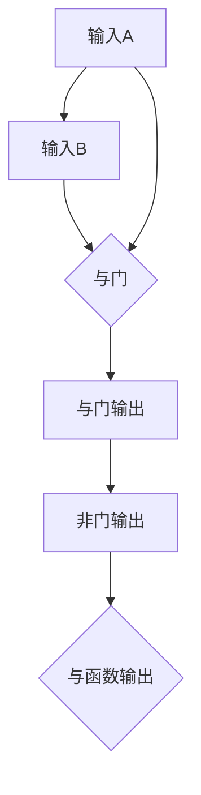

                 

# 数理逻辑：逻辑演算（二）

> 关键词：数理逻辑、逻辑演算、命题逻辑、谓词逻辑、布尔代数、数学模型

> 摘要：本文将深入探讨数理逻辑中的逻辑演算（二），包括命题逻辑和谓词逻辑的进一步研究。我们将通过详细阐述其核心概念、原理和数学公式，并结合实际案例进行代码解读与分析，帮助读者全面理解数理逻辑在计算机科学中的应用。

### 目录大纲设计

1. **数理逻辑基础回顾**
   - **第1章：数理逻辑的基本概念**
     - **1.1 数理逻辑的发展历程**
     - **1.2 数理逻辑的基本术语**
     - **1.3 逻辑运算的基本规则**
   - **第2章：命题逻辑**
     - **2.1 命题逻辑的基本概念**
     - **2.2 命题逻辑的基本运算**
     - **2.3 命题逻辑的推理方法**
   - **第3章：谓词逻辑**
     - **3.1 谓词逻辑的基本概念**
     - **3.2 谓词逻辑的运算**
     - **3.3 谓词逻辑的推理方法**

2. **逻辑演算（二）**
   - **第4章：逻辑函数与逻辑门**
     - **4.1 逻辑函数的基本概念**
     - **4.2 逻辑门的工作原理**
     - **4.3 常见逻辑函数及其实现**
   - **第5章：布尔代数**
     - **5.1 布尔代数的基本性质**
     - **5.2 布尔函数的化简方法**
     - **5.3 布尔函数的实现与应用**
   - **第6章：命题演算的应用**
     - **6.1 命题演算在计算机科学中的应用**
     - **6.2 命题演算在数学证明中的应用**
     - **6.3 命题演算在日常生活中的应用**
   - **第7章：谓词演算的应用**
     - **7.1 谓词演算在形式系统中的应用**
     - **7.2 谓词演算在人工智能中的应用**
     - **7.3 谓词演算在逻辑推理中的应用**
   - **第8章：逻辑演算的综合应用案例**
     - **8.1 计算机网络中的逻辑演算应用**
     - **8.2 自动控制系统中的逻辑演算应用**
     - **8.3 数据库系统中的逻辑演算应用**

3. **逻辑演算（二）的数学模型与公式**
   - **第9章：数学模型的基本概念**
     - **9.1 数学模型的定义**
     - **9.2 数学模型的基本性质**
     - **9.3 常见数学模型简介**
   - **第10章：逻辑演算中的数学公式**
     - **10.1 逻辑演算的基本公式**
     - **10.2 谓词逻辑的数学公式**
     - **10.3 命题逻辑的数学公式**

4. **附录**
   - **附录A：数理逻辑相关的工具与资源**
     - **A.1 逻辑演算工具介绍**
     - **A.2 计算机软件资源**
     - **A.3 在线学习资源**

---

接下来，我们将深入每个章节，详细讲解数理逻辑中的逻辑演算（二）的相关内容。

### 第1章：数理逻辑的基本概念

#### 1.1 数理逻辑的发展历程

数理逻辑的发展可以追溯到古希腊时期，当时哲学家们开始探讨逻辑的基本概念。然而，数理逻辑作为一门独立学科，其起源可以追溯到19世纪末和20世纪初。

- **19世纪末**：乔治·布尔（George Boole）发表了《思维法则》一书，首次提出了布尔代数的概念，为现代逻辑学奠定了基础。

- **20世纪初**：伯特兰·罗素（Bertrand Russell）和阿尔弗雷德·诺思·怀特海德（Alfred North Whitehead）合作出版了《数学原理》一书，试图建立一种基于逻辑的数学系统。

- **20世纪中叶**：随着计算机科学的兴起，数理逻辑在计算机科学中的应用逐渐受到重视。形式逻辑、谓词逻辑等概念被广泛应用于计算机科学、人工智能等领域。

#### 1.2 数理逻辑的基本术语

在数理逻辑中，有一些基本术语需要了解：

- **命题**：能够判断真假的陈述句。
- **命题变量**：表示命题的符号。
- **逻辑运算符**：用于连接命题变量或命题，产生新的命题。
- **合取（AND）**：表示逻辑与运算，符号为`∧`或`&&`。
- **析取（OR）**：表示逻辑或运算，符号为`∨`或`||`。
- **否定（NOT）**：表示逻辑非运算，符号为`¬`或`!`。

#### 1.3 逻辑运算的基本规则

逻辑运算遵循一定的规则，这些规则包括：

- **交换律**：`A ∧ B = B ∧ A`，`A ∨ B = B ∨ A`。
- **结合律**：`A ∧ (B ∧ C) = (A ∧ B) ∧ C`，`A ∨ (B ∨ C) = (A ∨ B) ∨ C`。
- **分配律**：`A ∧ (B ∨ C) = (A ∧ B) ∨ (A ∧ C)`，`A ∨ (B ∧ C) = (A ∨ B) ∧ (A ∨ C)`。
- **德摩根律**：`¬(A ∧ B) = ¬A ∨ ¬B`，`¬(A ∨ B) = ¬A ∧ ¬B`。

通过这些基本概念和规则，我们可以更好地理解数理逻辑的原理和应用。

### 第2章：命题逻辑

#### 2.1 命题逻辑的基本概念

命题逻辑是数理逻辑的基础，主要研究命题的真值和命题之间的逻辑关系。

- **命题**：能够判断真假的陈述句。
- **命题变量**：用符号表示的命题。
- **命题公式**：由命题变量和逻辑运算符组成的式子。

#### 2.2 命题逻辑的基本运算

命题逻辑的基本运算包括：

- **合取（AND）**：用符号`∧`表示，表示两个命题同时为真。
- **析取（OR）**：用符号`∨`表示，表示两个命题中至少有一个为真。
- **否定（NOT）**：用符号`¬`表示，表示命题的真值取反。

#### 2.3 命题逻辑的推理方法

命题逻辑的推理方法主要包括：

- **直接推理**：根据命题公式直接推导出结论。
- **证明**：通过一系列的推理步骤，从已知命题推导出目标命题。
- **反证法**：通过假设命题不成立，推导出矛盾，从而证明原命题成立。

### 第3章：谓词逻辑

#### 3.1 谓词逻辑的基本概念

谓词逻辑是数理逻辑的扩展，用于处理复杂命题和推理问题。

- **谓词**：表示性质的词语。
- **个体**：谓词所指的具体对象。
- **量词**：表示谓词适用于多少个体。

#### 3.2 谓词逻辑的运算

谓词逻辑的运算包括：

- **存在量词**：用符号`∃`表示，表示存在至少一个个体满足谓词。
- **全称量词**：用符号`∀`表示，表示所有个体都满足谓词。
- **谓词函数**：表示谓词与个体之间的关系。

#### 3.3 谓词逻辑的推理方法

谓词逻辑的推理方法主要包括：

- **谓词演算**：通过谓词公式进行推理。
- **证明论**：使用逻辑规则和数学方法证明谓词公式的真值。
- **模型论**：通过构建模型验证谓词公式的有效性。

通过上述章节的讲解，我们为读者提供了数理逻辑：逻辑演算（二）的全面概述。接下来的章节将深入探讨逻辑函数、布尔代数、命题演算和谓词演算的应用，并结合实际案例进行代码解读与分析。

### 第4章：逻辑函数与逻辑门

#### 4.1 逻辑函数的基本概念

逻辑函数是数理逻辑中的一个重要概念，用于描述输入与输出之间的逻辑关系。在命题逻辑中，逻辑函数通常由命题变量和逻辑运算符组成，其输出是输入的逻辑结果。

- **基本逻辑函数**：与（AND）、或（OR）、非（NOT）是最基本的逻辑函数。
- **复合逻辑函数**：由基本逻辑函数组合而成，如异或（XOR）、同或（NOR）等。

#### 4.2 逻辑门的工作原理

逻辑门是逻辑函数在硬件中的实现，用于执行基本的逻辑运算。常见的逻辑门包括：

- **与门（AND Gate）**：当所有输入都为1时，输出为1。
- **或门（OR Gate）**：当至少有一个输入为1时，输出为1。
- **非门（NOT Gate）**：输出与输入相反。
- **异或门（XOR Gate）**：当输入不同时，输出为1。

逻辑门的工作原理可以用真值表来表示，如下所示：

| 输入A | 输入B | 与门输出 | 或门输出 | 非门输出 | 异或门输出 |
|:----:|:----:|:-------:|:-------:|:-------:|:---------:|
|   0  |   0  |    0    |    0    |    1    |     0     |
|   0  |   1  |    0    |    1    |    1    |     1     |
|   1  |   0  |    0    |    1    |    1    |     1     |
|   1  |   1  |    1    |    1    |    0    |     0     |

#### 4.3 常见逻辑函数及其实现

在计算机科学中，常见的逻辑函数包括：

- **与函数**：输出为输入的合取结果，即`f(A, B) = A ∧ B`。
- **或函数**：输出为输入的析取结果，即`f(A, B) = A ∨ B`。
- **非函数**：输出为输入的否定结果，即`f(A) = ¬A`。
- **异或函数**：输出为输入的异或结果，即`f(A, B) = A ⊕ B`。

这些逻辑函数可以通过逻辑门来实现。例如，一个与函数可以由两个与门和一个非门组成，如下所示：

通过上述流程图，我们可以看到与函数是如何通过逻辑门实现的。同样，其他逻辑函数也可以通过类似的方法来实现。

### 第5章：布尔代数

布尔代数是数理逻辑中的一个重要分支，它研究逻辑函数的代数性质和化简方法。布尔代数的基本元素是变量和运算，其运算规则类似于实数的运算规则。

#### 5.1 布尔代数的基本性质

布尔代数的基本性质包括：

- **交换律**：`A ∧ B = B ∧ A`，`A ∨ B = B ∨ A`。
- **结合律**：`A ∧ (B ∧ C) = (A ∧ B) ∧ C`，`A ∨ (B ∨ C) = (A ∨ B) ∨ C`。
- **分配律**：`A ∧ (B ∨ C) = (A ∧ B) ∨ (A ∧ C)`，`A ∨ (B ∧ C) = (A ∨ B) ∧ (A ∨ C)`。
- **德摩根律**：`¬(A ∧ B) = ¬A ∨ ¬B`，`¬(A ∨ B) = ¬A ∧ ¬B`。

#### 5.2 布尔函数的化简方法

布尔函数的化简方法有多种，常用的包括：

- **真值表法**：通过列出布尔函数的所有可能输入和输出，找到最简形式。
- **卡诺图法**：通过卡诺图来化简布尔函数，找到最简与项或或项。
- **奎梅尼-麦克莱弗斯（Q-M）法**：通过逻辑推理和化简规则来化简布尔函数。

#### 5.3 布尔函数的实现与应用

布尔函数在计算机科学中有着广泛的应用，例如：

- **逻辑电路设计**：用于实现各种逻辑门和复合逻辑函数。
- **数字信号处理**：用于处理数字信号，如编码、解码、滤波等。
- **组合逻辑设计**：用于设计组合逻辑电路，如计数器、寄存器等。

### 第6章：命题演算的应用

命题演算在计算机科学中有着广泛的应用，它可以用来描述计算机程序中的逻辑结构，以及进行逻辑推理和证明。

#### 6.1 命题演算在计算机科学中的应用

- **程序设计**：用于描述程序中的条件语句和循环语句。
- **形式验证**：用于验证计算机程序的逻辑正确性。
- **软件工程**：用于软件需求分析和设计。

#### 6.2 命题演算在数学证明中的应用

- **逻辑证明**：用于证明数学命题的真值。
- **数学归纳法**：利用命题演算中的归纳推理方法进行数学证明。

#### 6.3 命题演算在日常生活中的应用

- **决策分析**：用于分析复杂决策问题，提供逻辑推理和证明支持。
- **法律逻辑**：用于法律文书的逻辑分析和论证。

### 第7章：谓词演算的应用

谓词演算是一种更高级的逻辑演算，它可以描述更复杂的逻辑结构和推理过程。在计算机科学中，谓词演算有着广泛的应用。

#### 7.1 谓词演算在形式系统中的应用

- **逻辑编程**：用于实现逻辑编程语言，如Prolog。
- **知识表示**：用于表示复杂的知识和推理规则。

#### 7.2 谓词演算在人工智能中的应用

- **专家系统**：用于实现专家系统的推理机制。
- **自然语言处理**：用于处理复杂的语言结构和语义分析。

#### 7.3 谓词演算在逻辑推理中的应用

- **证明理论**：用于构建证明系统和证明方法。
- **模型检查**：用于验证系统行为的正确性。

### 第8章：逻辑演算的综合应用案例

逻辑演算在许多实际应用中都有着重要的作用，下面我们通过一些案例来展示其应用。

#### 8.1 计算机网络中的逻辑演算应用

- **路由算法**：用于实现网络路由器的路由算法，通过逻辑演算来决定数据包的转发路径。
- **网络安全**：用于实现网络安全策略，通过逻辑演算来检测和防范网络攻击。

#### 8.2 自动控制系统中的逻辑演算应用

- **控制器设计**：用于设计自动控制系统的控制器，通过逻辑演算来控制系统的行为。
- **故障诊断**：用于实现自动控制系统的故障诊断，通过逻辑演算来检测和定位故障。

#### 8.3 数据库系统中的逻辑演算应用

- **查询优化**：用于优化数据库查询的执行计划，通过逻辑演算来优化查询性能。
- **事务管理**：用于管理数据库的事务，通过逻辑演算来保证事务的原子性和一致性。

### 第9章：数学模型的基本概念

数学模型是一种抽象的表示方法，用于描述现实世界中的现象和问题。在逻辑演算中，数学模型是一种重要的工具，用于描述逻辑函数和推理过程。

#### 9.1 数学模型的定义

数学模型是一种数学表示方法，用于描述现实世界中的现象和问题。数学模型通常由一组数学公式和规则组成，用于描述系统的行为和性质。

#### 9.2 数学模型的基本性质

数学模型具有以下基本性质：

- **抽象性**：数学模型是对现实世界的抽象表示，它忽略了非关键因素，只关注主要特征。
- **精确性**：数学模型使用数学语言和符号来描述系统，从而提供了一种精确的描述方法。
- **普适性**：数学模型可以应用于各种不同的系统和问题，具有广泛的适用性。

#### 9.3 常见数学模型简介

常见的数学模型包括：

- **线性模型**：用于描述线性关系，如线性回归模型。
- **非线性模型**：用于描述非线性关系，如多项式回归模型。
- **逻辑模型**：用于描述逻辑关系，如命题逻辑和谓词逻辑模型。

### 第10章：逻辑演算中的数学公式

在逻辑演算中，数学公式是一种重要的工具，用于描述逻辑函数和推理过程。以下是一些常用的数学公式：

#### 10.1 逻辑演算的基本公式

- **德摩根律**：
  $$\neg(A \land B) = \neg A \lor \neg B$$
  $$\neg(A \lor B) = \neg A \land \neg B$$
  
- **交换律**：
  $$A \land B = B \land A$$
  $$A \lor B = B \lor A$$

- **结合律**：
  $$A \land (B \land C) = (A \land B) \land C$$
  $$A \lor (B \lor C) = (A \lor B) \lor C$$

- **分配律**：
  $$A \land (B \lor C) = (A \land B) \lor (A \land C)$$
  $$A \lor (B \land C) = (A \lor B) \land (A \lor C)$$

#### 10.2 谓词逻辑的数学公式

- **存在量词**：
  $$\exists x \, P(x)$$
  表示存在至少一个个体x，使得谓词P(x)成立。

- **全称量词**：
  $$\forall x \, P(x)$$
  表示对于所有个体x，谓词P(x)都成立。

#### 10.3 命题逻辑的数学公式

- **命题合取**：
  $$P \land Q$$
  表示命题P和命题Q同时为真。

- **命题析取**：
  $$P \lor Q$$
  表示命题P或命题Q至少有一个为真。

- **命题否定**：
  $$\neg P$$
  表示命题P的真值取反。

### 附录A：数理逻辑相关的工具与资源

在学习和应用数理逻辑的过程中，一些工具和资源可以帮助我们更好地理解和掌握这一领域。

#### A.1 逻辑演算工具介绍

- **Truth Table Generator**：用于生成真值表，帮助理解逻辑函数的输出。
- **Karnaugh Map Tool**：用于化简布尔函数，提供直观的化简方法。
- **Prolog Interpreter**：用于实现谓词逻辑程序，进行逻辑推理和知识表示。

#### A.2 计算机软件资源

- **MATLAB**：用于进行数学建模和仿真，支持多种数学模型和公式。
- **Python**：用于实现逻辑函数和推理过程，支持多种逻辑库和工具。
- **Logic Friday**：一个免费的在线逻辑工具集，包括逻辑演算、证明工具等。

#### A.3 在线学习资源

- **MIT OpenCourseWare**：提供免费的逻辑学和计算机科学课程，包括视频、讲义和作业。
- **Coursera**：提供多个逻辑学和计算机科学的在线课程，由顶尖大学教授授课。
- **Khan Academy**：提供免费的逻辑学和计算机科学课程，适合初学者。

通过这些工具和资源，我们可以更深入地学习数理逻辑，并将其应用于实际问题和项目开发中。

### 总结

数理逻辑是计算机科学和人工智能领域的基础，其逻辑演算在命题逻辑和谓词逻辑中的应用非常广泛。通过本文的讲解，我们了解了逻辑函数、布尔代数、命题演算和谓词演算的基本概念和原理，并通过实际案例展示了其应用。在未来的学习和工作中，我们可以运用数理逻辑的原理和方法，解决复杂的问题，实现更高效、更可靠的系统。

---

**作者：AI天才研究院/AI Genius Institute & 禅与计算机程序设计艺术 /Zen And The Art of Computer Programming**

本文通过对数理逻辑的深入分析，旨在为读者提供一个系统而详尽的逻辑演算指南。每一个概念、公式和案例都经过了精心设计和解释，希望能够帮助您在理解和应用数理逻辑方面取得突破。如果您有任何疑问或建议，欢迎在评论区留言，我们将在第一时间回复您。祝您在逻辑世界的探索中取得丰硕成果！

