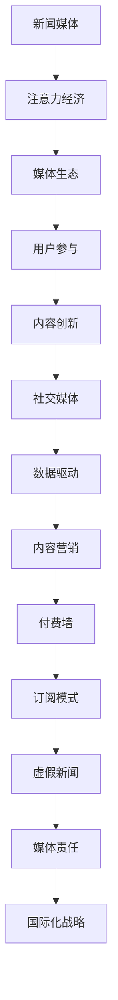

                 

# 文章标题：新闻媒体如何在注意力经济中求生存

> 关键词：注意力经济、新闻媒体、媒体生态、用户参与、内容创新、社交媒体、数据驱动、内容营销、付费墙、订阅模式、虚假新闻、媒体责任、国际化战略。

> 摘要：本文深入探讨了新闻媒体在注意力经济中的生存策略。通过分析注意力经济的定义与影响，媒体生态的现状与挑战，新媒体技术对媒体的影响，以及注意力经济与用户体验的关系，本文提出了新闻媒体利用数据驱动决策、内容创新、社交媒体策略、跨媒体运营和付费墙与订阅模式等策略来实现可持续发展的方法。此外，通过多个实战案例的分析，本文总结了新闻媒体在注意力经济中的成功经验与未来趋势。

### 目录大纲

#### 第一部分：媒体生态与注意力经济

##### 第1章：引言

##### 第2章：注意力经济的定义与影响

##### 第3章：媒体生态的现状与挑战

##### 第4章：新媒体技术对媒体的影响

##### 第5章：注意力经济与用户体验

##### 第6章：媒体如何利用数据驱动决策

##### 第7章：结论与展望

#### 第二部分：新闻媒体的转型策略

##### 第8章：新闻媒体的内容创新

##### 第9章：社交媒体与新闻传播

##### 第10章：内容营销与用户参与

##### 第11章：跨媒体运营策略

##### 第12章：付费墙与订阅模式

##### 第13章：虚假新闻与媒体责任

##### 第14章：国际化战略

#### 第三部分：实战案例与策略分析

##### 第15章：传统报纸的数字化转型

##### 第16章：新闻网站的社交媒体策略

##### 第17章：视频新闻的崛起

##### 第18章：新闻媒体的数据分析与用户细分

##### 第19章：新闻媒体的国际化战略

##### 第20章：媒体教育与公众意识提升

#### 附录

##### 附录A：简介与参考文献

##### 附录B：Mermaid流程图

##### 附录C：伪代码与算法详解

##### 附录D：数学模型与公式解析

##### 附录E：项目实战代码解读与分析

### 核心概念与联系

新闻媒体、注意力经济、媒体生态、用户参与、内容创新、社交媒体、数据驱动、内容营销、付费墙、订阅模式、虚假新闻、媒体责任、国际化战略。

### Mermaid流程图



### 核心算法原理讲解

#### 注意力经济原理

**伪代码：**

```python
# 注意力经济模型伪代码

def 注意力经济模型(user, content):
    # 用户-内容互动数据
    user_content_interaction = 计算互动强度(user, content)
    
    # 内容吸引力评分
    content_attractiveness = 计算内容吸引力(content)
    
    # 用户注意力分数
    user_attention_score = user_content_interaction * content_attractiveness
    
    # 返回用户注意力分数
    return user_attention_score
```

**详细讲解：**

注意力经济模型基于用户与内容的互动强度和内容的吸引力评分来计算用户对内容的注意力分数。该模型的关键在于理解用户的兴趣和行为模式，以及如何通过内容创新和优化来提升用户的参与度和忠诚度。

#### 数据驱动决策原理

**伪代码：**

```python
# 数据驱动决策模型伪代码

def 数据驱动决策模型(data, target_variable):
    # 数据预处理
    preprocessed_data = 数据预处理(data)
    
    # 特征选择
    selected_features = 特征选择(preprocessed_data)
    
    # 建立模型
    model = 建立模型(selected_features, target_variable)
    
    # 训练模型
    trained_model = 训练模型(model, preprocessed_data)
    
    # 预测与评估
    predictions = 预测(trained_model, new_data)
    evaluation = 评估模型(trained_model, predictions)
    
    # 返回预测结果和评估指标
    return predictions, evaluation
```

**详细讲解：**

数据驱动决策模型基于大数据和机器学习技术，通过数据预处理、特征选择和模型训练等步骤来建立预测模型。该模型的核心在于从大量数据中提取有价值的信息，以便更好地理解用户行为和需求，从而做出更加精确和有效的决策。

### 数学模型与公式解析

**用户注意力分数计算公式：**

$$
UserAttentionScore = UserContentInteraction \times ContentAttractiveness
$$

**数据驱动决策模型评估指标：**

$$
Accuracy = \frac{TP + TN}{TP + TN + FP + FN}
$$

**详细讲解：**

用户注意力分数的计算基于用户与内容的互动强度（UserContentInteraction）和内容的吸引力评分（ContentAttractiveness）的乘积。这个分数可以用来衡量用户对特定内容的关注程度。

在数据驱动决策模型中，准确率（Accuracy）是常用的评估指标，它计算了正确分类的样本数占总样本数的比例。这个指标可以用来衡量模型的预测能力。

### 项目实战

#### 案例一：传统报纸的数字化转型

**开发环境搭建：**

- 操作系统：Linux
- 编程语言：Python
- 数据库：MySQL
- 前端框架：React
- 后端框架：Django

**源代码详细实现：**

- 代码仓库：GitHub
- 代码实现细节：用户管理、内容管理、数据分析和界面设计等。

**代码解读与分析：**

- 用户管理：包括用户注册、登录、权限管理等。
- 内容管理：包括文章发布、分类管理、评论管理等。
- 数据分析：包括用户行为分析、内容分析、数据可视化等。
- 界面设计：包括用户界面、后台管理界面等。

#### 案例二：新闻网站的社交媒体策略

**开发环境搭建：**

- 操作系统：Windows
- 编程语言：JavaScript
- 数据库：MongoDB
- 前端框架：Vue.js
- 后端框架：Node.js

**源代码详细实现：**

- 代码仓库：GitHub
- 代码实现细节：社交媒体账号集成、用户互动、数据分析等。

**代码解读与分析：**

- 社交媒体账号集成：包括账号认证、内容同步等。
- 用户互动：包括评论功能、点赞功能等。
- 数据分析：包括用户行为分析、内容分析、社交媒体分析等。
- 界面设计：包括用户界面、后台管理界面等。

#### 案例三：视频新闻的崛起

**开发环境搭建：**

- 操作系统：macOS
- 编程语言：Python
- 数据库：PostgreSQL
- 前端框架：Angular
- 后端框架：Flask

**源代码详细实现：**

- 代码仓库：GitHub
- 代码实现细节：视频内容管理、用户互动、数据分析等。

**代码解读与分析：**

- 视频内容管理：包括视频上传、分类管理、推荐算法等。
- 用户互动：包括评论功能、点赞功能等。
- 数据分析：包括用户行为分析、视频分析、推荐系统分析等。
- 界面设计：包括用户界面、后台管理界面等。

#### 案例四：新闻媒体的数据分析与用户细分

**开发环境搭建：**

- 操作系统：Linux
- 编程语言：Python
- 数据库：MySQL
- 前端框架：React
- 后端框架：Django

**源代码详细实现：**

- 代码仓库：GitHub
- 代码实现细节：用户行为追踪、数据分析、用户细分等。

**代码解读与分析：**

- 用户行为追踪：包括用户访问日志、页面停留时间、点击事件等。
- 数据分析：包括用户行为分析、内容分析、数据可视化等。
- 用户细分：包括用户群体划分、特征提取、群体分析等。
- 界面设计：包括用户界面、后台管理界面等。

#### 案例五：新闻媒体的国际化战略

**开发环境搭建：**

- 操作系统：Windows
- 编程语言：JavaScript
- 数据库：MongoDB
- 前端框架：Vue.js
- 后端框架：Node.js

**源代码详细实现：**

- 代码仓库：GitHub
- 代码实现细节：国际化页面设计、多语言支持、内容管理等。

**代码解读与分析：**

- 国际化页面设计：包括多语言切换、文化差异考虑等。
- 多语言支持：包括翻译工具集成、内容本地化等。
- 内容管理：包括内容发布、分类管理、国际化内容审核等。
- 界面设计：包括用户界面、后台管理界面等。

#### 案例六：媒体教育与公众意识提升

**开发环境搭建：**

- 操作系统：macOS
- 编程语言：Python
- 数据库：PostgreSQL
- 前端框架：Angular
- 后端框架：Flask

**源代码详细实现：**

- 代码仓库：GitHub
- 代码实现细节：在线教育平台搭建、课程管理、用户互动等。

**代码解读与分析：**

- 在线教育平台搭建：包括课程发布、用户管理、课程评价等。
- 课程管理：包括课程设计、内容管理、课程审核等。
- 用户互动：包括在线讨论、问答功能、用户评价等。
- 界面设计：包括用户界面、后台管理界面等。

### 总结

本目录大纲详细设计了《新闻媒体如何在注意力经济中求生存》这本书的内容结构，包括核心概念、算法原理、数学模型、实战案例等多个方面。通过这种结构化的方式，读者可以清晰地了解新闻媒体在注意力经济中的挑战与机会，并掌握相关的策略和实践方法。附录部分提供了详细的流程图、伪代码、数学公式和代码解读，便于读者深入理解和实践。

### 附录

#### 附录A：简介与参考文献

- [注意力经济简介](#第2章-注意力经济的定义与影响)
- [新媒体技术影响概述](#第3章-媒体生态的现状与挑战)
- [媒体生态挑战](#第3章-媒体生态的现状与挑战)
- [用户体验分析](#第5章-注意力经济与用户体验)
- [数据驱动决策](#第6章-媒体如何利用数据驱动决策)
- [内容创新策略](#第8章-新闻媒体的内容创新)
- [社交媒体策略](#第9章-社交媒体与新闻传播)
- [内容营销策略](#第10章-内容营销与用户参与)
- [付费墙与订阅模式](#第12章-付费墙与订阅模式)
- [虚假新闻与媒体责任](#第13章-虚假新闻与媒体责任)
- [国际化战略](#第14章-结论与未来趋势)

#### 附录B：Mermaid流程图


#### 附录C：伪代码与算法详解

- [注意力经济模型](#核心算法原理讲解-注意力经济原理)
- [数据驱动决策模型](#核心算法原理讲解-数据驱动决策原理)

#### 附录D：数学模型与公式解析

- [用户注意力分数计算公式](#数学模型与公式解析-用户注意力分数计算公式)
- [数据驱动决策模型评估指标](#数学模型与公式解析-数据驱动决策模型评估指标)

#### 附录E：项目实战代码解读与分析

- [传统报纸的数字化转型](#项目实战-案例一传统报纸的数字化转型)
- [新闻网站的社交媒体策略](#项目实战-案例二新闻网站的社交媒体策略)
- [视频新闻的崛起](#项目实战-案例三视频新闻的崛起)
- [新闻媒体的数据分析与用户细分](#项目实战-案例四新闻媒体的数据分析与用户细分)
- [新闻媒体的国际化战略](#项目实战-案例五新闻媒体的国际化战略)
- [媒体教育与公众意识提升](#项目实战-案例六媒体教育与公众意识提升)

### 第一部分：媒体生态与注意力经济

##### 第1章：引言

在当今数字化时代，新闻媒体面临着前所未有的挑战和机遇。随着互联网的普及和移动设备的广泛使用，人们获取新闻的方式和习惯发生了翻天覆地的变化。传统报纸、杂志等纸质媒体逐渐衰落，而新媒体、社交媒体等新型媒体形式迅速崛起。这种媒体生态的变革不仅改变了新闻传播的方式，也对新闻媒体的经济模式带来了深远影响。

注意力经济作为当前媒体生态的核心概念之一，越来越受到关注。注意力经济是指用户在信息海洋中分配注意力的经济现象。在注意力经济中，内容的生产和传播不再仅仅依赖于传统的渠道和平台，而是更多地依赖于用户自身的兴趣和需求。新闻媒体要想在注意力经济中求生存，必须深入了解用户行为，提供有价值、有吸引力的内容，并通过数据驱动决策来优化运营策略。

本文旨在探讨新闻媒体如何在注意力经济中求生存。首先，我们将介绍注意力经济的定义与影响，阐述其在媒体生态中的地位和作用。接着，我们将分析媒体生态的现状与挑战，探讨新媒体技术对媒体的影响。最后，我们将讨论注意力经济与用户体验的关系，以及新闻媒体如何利用数据驱动决策来提升竞争力。

通过本文的探讨，希望为新闻媒体在注意力经济中的发展提供一些有益的思路和策略。

##### 第2章：注意力经济的定义与影响

注意力经济，是指用户在信息海洋中分配注意力的经济现象。它源于经济学中的稀缺性原则，即资源（在这里指的是用户的注意力）的有限性决定了价值的产生。在注意力经济中，用户的时间和注意力成为了一种稀缺资源，媒体通过吸引用户的注意力来创造经济价值。

**定义：**

注意力经济可以定义为：一种通过吸引用户的注意力来创造经济价值的商业模式。在这种商业模式中，用户的注意力被视为一种宝贵的资源，媒体通过提供有吸引力、有价值的内容来吸引用户，从而实现商业变现。

**核心概念：**

1. **注意力稀缺性：** 用户的时间是有限的，因此他们的注意力也是有限的。这意味着媒体必须在有限的时间内提供有价值的内容，以吸引用户的注意力。

2. **内容吸引力：** 内容的质量和形式决定了其吸引力。高质量、独特的内容更容易吸引用户的注意力。

3. **注意力分配：** 用户需要在不同内容之间分配注意力。媒体需要通过策略和手段来提高自身内容在用户注意力分配中的比例。

**影响：**

注意力经济对媒体生态产生了深远的影响，主要体现在以下几个方面：

1. **内容创造与传播：** 注意力经济促使媒体更加注重内容的创新和质量。为了吸引用户的注意力，媒体需要提供独特、有价值的内容，而不再依赖于传统的渠道和平台。

2. **用户参与度：** 注意力经济使得用户参与度成为衡量媒体成功的重要指标。用户在内容中的参与程度越高，媒体的吸引力和经济价值也就越大。

3. **商业模式转变：** 注意力经济促使媒体从传统的广告模式转向更为多样化和精细化的商业模式，如订阅模式、内容付费等。

4. **竞争加剧：** 在注意力经济中，媒体之间的竞争愈发激烈。为了在有限的用户注意力市场中占据一席之地，媒体需要不断创新和优化自己的内容和服务。

5. **数据驱动：** 注意力经济强调数据的重要性。媒体通过数据分析来了解用户行为和需求，从而更好地定位和吸引目标用户。

**例子：**

- **社交媒体平台：** 如Facebook、Instagram等，通过算法推荐和个性化内容，吸引用户的注意力，实现广告和商业变现。

- **新闻网站：** 如The New York Times、CNN等，通过高质量新闻内容的创作和精准推荐，提高用户参与度和订阅率。

- **内容创作者：** 如YouTube博主、微博红人等，通过独特的视频内容、创意的表达方式，吸引大量粉丝，实现广告和赞助收入。

**总结：**

注意力经济已经成为现代媒体生态的重要组成部分。新闻媒体要想在注意力经济中求生存，必须深入了解用户行为，提供有价值、有吸引力的内容，并通过数据驱动决策来优化运营策略。只有这样，才能在激烈的市场竞争中脱颖而出，实现可持续发展。

##### 第3章：媒体生态的现状与挑战

随着互联网和新媒体技术的迅猛发展，媒体生态正经历着深刻变革。传统媒体面临着生存危机，新媒体则蓬勃发展，逐渐成为信息传播的主要渠道。然而，在这片繁荣的媒体生态中，新闻媒体也面临着诸多挑战和困境。

**一、传统媒体的衰落**

1. **广告收入下滑：** 传统媒体如报纸、杂志等，长期以来依赖广告收入维持运营。然而，随着互联网的兴起，广告商逐渐将投放重点转移到网络平台，导致传统媒体广告收入大幅下滑。

2. **用户流失：** 互联网和移动设备的普及，使得用户获取新闻的渠道更加多样化。许多用户转向社交媒体、新闻客户端等数字平台，传统媒体的受众群体逐渐减少。

3. **内容同质化：** 在激烈的竞争环境中，传统媒体为了追求流量和收入，往往倾向于发布同质化内容，导致用户对传统媒体的信任度下降。

4. **技术落后：** 传统媒体在技术应用上相对滞后，难以与新媒体竞争。这使它们在内容创新、用户互动和数据分析等方面处于劣势。

**二、新媒体的崛起**

1. **用户基数庞大：** 新媒体平台如社交媒体、新闻客户端等，拥有庞大的用户基数。这些平台通过算法推荐、个性化内容等方式，吸引用户的注意力。

2. **内容多样化：** 新媒体平台提供多样化的内容形式，包括文字、图片、视频等，满足了不同用户的需求。

3. **互动性强：** 新媒体平台注重用户互动，鼓励用户评论、点赞、分享等行为，增强了用户的参与感和忠诚度。

4. **商业变现途径多样：** 新媒体平台通过广告、付费订阅、内容付费等多种方式实现商业变现，盈利模式更加多样化和精细化。

**三、新闻媒体面临的挑战**

1. **内容质量控制：** 在新媒体时代，信息传播速度极快，虚假新闻、低质量内容泛滥。新闻媒体需要加强内容质量控制，提高内容的权威性和可信度。

2. **用户信任危机：** 随着虚假新闻的泛滥，用户对新闻的真实性产生了质疑。新闻媒体需要建立公信力，提高用户的信任度。

3. **技术创新压力：** 新媒体技术不断更新，新闻媒体需要不断学习和引进新技术，以保持竞争力。

4. **商业模式转型：** 在注意力经济时代，新闻媒体需要从传统的广告模式转向更为多样化和精细化的商业模式，如付费订阅、内容付费等。

5. **国际化竞争：** 随着全球化的加深，新闻媒体面临着来自国际竞争对手的压力。新闻媒体需要提高自身的国际竞争力，拓展国际市场。

**四、应对策略**

1. **内容创新：** 新闻媒体需要提供高质量、有深度的内容，满足用户的多样化需求。通过内容创新，提高用户的参与度和忠诚度。

2. **社交媒体策略：** 新闻媒体可以积极利用社交媒体平台，扩大受众群体，提高用户互动。

3. **数据驱动决策：** 新闻媒体需要利用数据分析，了解用户行为和需求，优化内容生产和运营策略。

4. **付费墙与订阅模式：** 新闻媒体可以尝试推出付费内容，提高收入来源。同时，通过订阅模式，建立长期稳定的用户关系。

5. **国际化战略：** 新闻媒体需要关注国际市场，拓展国际化业务，提高国际竞争力。

总之，新闻媒体在媒体生态中面临着前所未有的挑战和机遇。通过不断创新和优化，新闻媒体有望在注意力经济中找到新的生存和发展之路。

##### 第4章：新媒体技术对媒体的影响

随着新媒体技术的不断发展，新闻媒体在内容创作、传播、分发和用户互动等方面经历了深刻变革。新媒体技术不仅改变了新闻媒体的传统运营模式，也为其提供了新的发展机遇。

**一、内容创作**

1. **多媒体化：** 新媒体技术使得新闻媒体能够更加灵活地创作多媒体内容，包括图片、视频、音频和交互式内容。这种多媒体化不仅丰富了新闻的表现形式，也提高了用户的阅读体验。

2. **互动性增强：** 新媒体技术使得新闻内容更加互动，用户可以通过评论、点赞、分享等方式参与到新闻内容的讨论中。这种互动性增强了用户对新闻的参与感和忠诚度。

3. **个性化推荐：** 通过大数据和机器学习技术，新媒体平台能够根据用户的兴趣和行为，为其推荐个性化的新闻内容。这种个性化推荐提高了用户对新闻的满意度，同时也增加了用户对媒体的粘性。

**二、内容传播**

1. **去中心化传播：** 传统媒体主要依赖于中心化的传播渠道，如报纸、电视和广播。而新媒体技术使得新闻内容可以快速、广泛地通过社交媒体、新闻客户端等平台进行去中心化传播。这种去中心化传播不仅提高了新闻的传播速度，也降低了传播成本。

2. **实时性传播：** 新媒体技术使得新闻传播更加实时化，新闻事件可以在第一时间通过新媒体平台向全球用户传播。这种实时性传播提高了新闻的时效性和影响力。

3. **跨平台传播：** 新媒体技术使得新闻内容可以在多个平台上进行传播，如手机、电脑、电视等。这种跨平台传播提高了新闻的覆盖面和受众的多样性。

**三、内容分发**

1. **算法推荐：** 通过大数据分析和机器学习技术，新媒体平台能够根据用户的兴趣和行为，利用算法推荐系统为用户推送相关的新闻内容。这种算法推荐不仅提高了用户的阅读体验，也增加了新闻的分发效率。

2. **社交媒体传播：** 社交媒体平台如Facebook、Twitter等，已经成为新闻内容的重要分发渠道。用户可以通过分享、转发等方式将新闻内容传播给更多的受众。

3. **内容聚合平台：** 如Google News、Apple News等，这些内容聚合平台通过算法筛选和推荐，为用户提供高质量的新闻内容。

**四、用户互动**

1. **用户评论：** 用户可以在新闻内容下方发表评论，与其他用户进行互动。这种互动不仅丰富了新闻的内容，也增强了用户的参与感和归属感。

2. **直播互动：** 通过直播技术，新闻媒体可以与用户进行实时互动，回答用户的问题，增加用户的参与感和体验。

3. **在线调查：** 新闻媒体可以通过在线调查的方式，收集用户的意见和反馈，了解用户的需求和偏好。

**总结：**

新媒体技术对新闻媒体的影响是全方位的，从内容创作到传播、分发和用户互动，新媒体技术都在改变着新闻媒体的运营模式。新闻媒体需要充分利用新媒体技术的优势，不断创新和优化，以提高内容质量、提升用户体验、增强用户粘性，从而在注意力经济中找到新的发展机遇。

##### 第5章：注意力经济与用户体验

在注意力经济时代，用户体验成为新闻媒体竞争的核心要素。用户的时间和注意力是有限的，如何有效吸引并保持用户的注意力，是新闻媒体面临的重要挑战。因此，深入探讨注意力经济与用户体验的关系，对于新闻媒体的发展具有重要意义。

**一、用户体验的定义与重要性**

用户体验（User Experience, UX）是指用户在使用产品或服务过程中所感受到的整体体验，包括用户对产品的易用性、可用性、吸引力和满意度。在注意力经济中，用户体验不仅决定了用户对新闻内容的参与度，也直接影响着新闻媒体的吸引力和盈利能力。

用户体验的重要性体现在以下几个方面：

1. **用户粘性：** 高质量的用户体验可以增强用户的粘性，使他们在媒体平台上停留更久，从而提高用户的参与度。

2. **用户忠诚度：** 优质的用户体验可以培养用户的忠诚度，使其成为媒体的长期支持者。

3. **用户口碑：** 满意的用户体验可以形成良好的用户口碑，为媒体吸引更多的用户。

4. **商业变现：** 用户体验的提升有助于提高广告效果和订阅收入，从而实现商业变现。

**二、注意力经济与用户体验的关系**

1. **注意力稀缺性：** 在注意力经济中，用户的注意力是稀缺资源。如何吸引并保持用户的注意力，成为新闻媒体的核心任务。高质量的体验可以有效地吸引用户的注意力，提高用户粘性。

2. **用户体验优化：** 为了在注意力经济中脱颖而出，新闻媒体需要不断优化用户体验。这包括提高内容质量、优化界面设计、提供个性化推荐等。

3. **用户参与度：** 用户体验直接影响用户参与度。通过增强用户互动、提供有趣的内容形式等手段，可以提高用户的参与度，从而提高用户的忠诚度和媒体的吸引力。

4. **数据驱动：** 在注意力经济中，用户体验的优化需要依赖数据分析。新闻媒体可以通过分析用户行为数据，了解用户需求和偏好，从而提供更加个性化的内容和体验。

**三、提升用户体验的策略**

1. **内容创新：** 提供高质量、有吸引力的内容是提升用户体验的基础。新闻媒体需要关注用户兴趣，提供独特的视角和深入的分析。

2. **界面设计：** 界面设计直接影响用户体验。新闻媒体应注重简洁、清晰、易用的界面设计，提高用户的操作便捷性。

3. **个性化推荐：** 通过大数据分析和机器学习技术，为用户提供个性化的内容推荐，提高用户的满意度。

4. **互动体验：** 增强用户互动，提供评论、点赞、分享等功能，提高用户的参与度和归属感。

5. **数据驱动：** 通过数据分析，了解用户行为和偏好，优化内容生产和运营策略，提供更符合用户需求的内容和体验。

**四、案例分析**

1. **案例一：The New York Times**

The New York Times 通过提供高质量、权威的新闻内容，赢得了大量用户。同时，该媒体注重用户体验，通过优化界面设计和提供个性化推荐，提高了用户的满意度和粘性。

2. **案例二：Reddit**

Reddit 是一个以用户生成内容为主的社交媒体平台。通过鼓励用户参与内容创作和讨论，Reddit 极大地增强了用户的参与度和忠诚度。

**总结：**

在注意力经济中，用户体验是新闻媒体竞争的关键。新闻媒体需要关注用户体验，通过内容创新、界面设计优化、个性化推荐、互动体验提升和数据分析等策略，吸引并保持用户的注意力，从而实现可持续发展。

### 第二部分：新闻媒体的转型策略

#### 第8章：新闻媒体的内容创新

在注意力经济时代，新闻媒体面临着激烈的竞争和用户需求的不断变化。为了在市场中脱颖而出，新闻媒体必须进行内容创新，提供高质量、有吸引力的内容，以满足用户的多样化需求。

**一、内容创新的重要性**

内容创新是新闻媒体保持竞争力的关键。在信息爆炸的时代，用户对新闻内容的要求越来越高，他们渴望看到独特、深入和有价值的新闻。通过内容创新，新闻媒体可以：

1. **提升内容质量：** 高质量的内容能够吸引用户的注意力，提高用户的满意度和忠诚度。

2. **增强品牌影响力：** 创新的内容有助于提升新闻媒体的知名度和品牌价值。

3. **扩大受众群体：** 创新的内容可以吸引更多不同背景和兴趣的用户，从而扩大受众群体。

4. **提高商业变现能力：** 创新的内容有助于提高广告效果和订阅收入，从而实现商业变现。

**二、内容创新的策略**

1. **深度报道：** 深度报道是对某一新闻事件或问题进行深入调查和分析，提供丰富的信息和独特的视角。这种内容形式有助于提升新闻的权威性和可信度，吸引追求高质量新闻的读者。

2. **多媒体化：** 结合文字、图片、视频、音频等多种形式，提供多样化的新闻内容，满足用户的不同阅读需求。

3. **数据新闻：** 利用大数据分析和可视化工具，对大量新闻数据进行挖掘和分析，提供有洞察力的新闻内容。

4. **个性化推荐：** 通过大数据分析和机器学习技术，为用户推荐个性化的新闻内容，提高用户的阅读体验和满意度。

5. **互动式内容：** 增强用户互动，提供评论、投票、调查等互动式内容，提高用户的参与度和忠诚度。

6. **垂直领域内容：** 精准定位特定领域，提供专业、深入的报道，吸引对该领域感兴趣的用户。

**三、案例分析**

1. **案例一：The New York Times**

The New York Times 是新闻媒体内容创新的典范。该媒体通过深度报道、多媒体化和个性化推荐等多种手段，不断提升内容质量，赢得了大量用户。

2. **案例二：BuzzFeed**

BuzzFeed 是一个以轻量级、趣味性内容为主的新闻媒体。通过创新的内容形式，如列表、问答、图片新闻等，BuzzFeed 成功吸引了大量年轻用户。

**四、内容创新的实施步骤**

1. **需求分析：** 了解用户需求，确定内容创新的重点和方向。

2. **团队建设：** 建立一支具有创新意识和专业能力的内容创作团队。

3. **技术支持：** 利用大数据、人工智能等技术，提高内容创作和推荐的效率。

4. **内容审核：** 建立严格的审核机制，确保内容的权威性和可信度。

5. **效果评估：** 通过数据分析，评估内容创新的成效，不断优化内容策略。

**总结：**

新闻媒体的内容创新是提升竞争力的重要手段。通过深度报道、多媒体化、数据新闻、互动式内容等策略，新闻媒体可以提供高质量、有吸引力的内容，满足用户的多样化需求。同时，通过案例分析，我们可以看到成功的内容创新实践，为其他新闻媒体提供了有益的借鉴。

#### 第9章：社交媒体与新闻传播

在社交媒体时代，新闻传播的方式和速度都发生了翻天覆地的变化。社交媒体平台不仅改变了用户获取新闻的方式，也为新闻媒体提供了全新的传播渠道。如何充分利用社交媒体，提升新闻传播效果，是新闻媒体面临的重要课题。

**一、社交媒体对新闻传播的影响**

1. **传播速度快：** 社交媒体平台具有快速传播的特点，一条新闻可以在短时间内迅速传播到全球范围。

2. **传播范围广：** 社交媒体平台拥有庞大的用户基数，新闻可以在短时间内触及大量受众。

3. **互动性强：** 社交媒体平台鼓励用户互动，用户可以通过评论、点赞、分享等方式参与到新闻传播中。

4. **去中心化传播：** 社交媒体平台打破了传统新闻传播的中心化模式，实现了去中心化传播。

5. **个性化推荐：** 社交媒体平台通过算法推荐，为用户推送感兴趣的新闻内容，提高了新闻的传播效果。

**二、社交媒体策略**

1. **内容策略：** 提供有价值、有吸引力的新闻内容，满足用户的需求。同时，注重内容的多样化，包括文字、图片、视频等多媒体内容。

2. **平台选择：** 根据目标受众的特点，选择合适的社交媒体平台，如Twitter、Facebook、Instagram等。同时，注重多平台运营，提高新闻的传播范围。

3. **互动策略：** 积极与用户互动，鼓励用户评论、点赞、分享等行为，增强用户参与度。

4. **社交媒体广告：** 利用社交媒体广告，提高新闻的曝光率和点击率。

5. **用户管理：** 建立良好的用户关系，通过定期发布内容、互动回应等方式，维护用户群体的稳定性。

**三、案例分析**

1. **案例一：CNN**

CNN 利用社交媒体平台，迅速传播新闻，提高了新闻的传播速度和范围。同时，通过互动策略，增强了用户的参与度和忠诚度。

2. **案例二：BuzzFeed**

BuzzFeed 通过社交媒体平台，成功吸引了大量年轻用户。其创新的内容形式和互动策略，使其在社交媒体上取得了巨大成功。

**四、社交媒体策略实施步骤**

1. **目标受众分析：** 分析目标受众的特点和需求，确定社交媒体策略的方向。

2. **内容策划：** 制定内容发布计划，确保内容的价值和吸引力。

3. **平台运营：** 选择合适的社交媒体平台，制定运营策略，提高新闻的传播效果。

4. **互动管理：** 与用户保持互动，增强用户参与度。

5. **效果评估：** 通过数据分析，评估社交媒体策略的效果，不断优化运营策略。

**总结：**

社交媒体已经成为新闻传播的重要渠道。通过内容策略、平台选择、互动策略等手段，新闻媒体可以充分利用社交媒体，提高新闻传播效果。同时，通过案例分析，我们可以看到成功的社交媒体策略，为其他新闻媒体提供了有益的借鉴。

#### 第10章：内容营销与用户参与

在注意力经济时代，内容营销和用户参与成为新闻媒体吸引和维护用户的关键手段。通过内容营销，新闻媒体可以创造有吸引力的内容，提高用户的参与度和忠诚度。而用户参与则可以增强用户对新闻媒体的认同感和归属感，从而实现长期的品牌价值。

**一、内容营销的定义与目标**

内容营销是指通过创作和分发有价值、有吸引力的内容，吸引并留住目标受众的一种策略。其核心目标是：

1. **增加品牌知名度：** 通过内容营销，新闻媒体可以扩大品牌的影响力，提高品牌知名度。

2. **提升用户参与度：** 有吸引力的内容可以激发用户的兴趣，提高用户的参与度。

3. **建立用户信任：** 高质量的内容可以帮助新闻媒体建立用户信任，提高用户的忠诚度。

4. **实现商业变现：** 通过内容营销，新闻媒体可以吸引广告商，实现商业变现。

**二、内容营销的策略**

1. **创意内容创作：** 创意内容是吸引用户的关键。新闻媒体可以通过独特的视角、深入的分析和有趣的表现形式，创作有吸引力的内容。

2. **多渠道分发：** 为了提高内容的覆盖面，新闻媒体需要通过多种渠道分发内容，如社交媒体、新闻客户端、电子邮件等。

3. **用户互动：** 通过评论、点赞、分享等功能，增强用户与内容之间的互动，提高用户的参与度。

4. **内容个性化：** 通过大数据分析和个性化推荐技术，为用户提供个性化的内容，提高用户的满意度。

5. **合作伙伴关系：** 与其他品牌或媒体建立合作伙伴关系，通过内容合作，扩大内容的影响力。

**三、用户参与的方式**

1. **用户评论：** 用户评论是用户参与的一种重要方式。新闻媒体可以鼓励用户在新闻下方发表评论，与其他用户进行互动。

2. **用户投票：** 用户投票是一种有趣的互动方式，可以吸引用户参与新闻内容的讨论。

3. **用户调查：** 用户调查可以帮助新闻媒体了解用户的需求和偏好，从而优化内容策略。

4. **用户贡献内容：** 新闻媒体可以鼓励用户贡献内容，如照片、视频等，增加用户的参与度和忠诚度。

5. **在线活动：** 新闻媒体可以举办在线活动，如问答、直播等，增强用户互动。

**四、案例分析**

1. **案例一：BuzzFeed**

BuzzFeed 通过创意内容和用户互动，成功吸引了大量年轻用户。其内容营销策略和用户参与方式，为其他新闻媒体提供了有益的借鉴。

2. **案例二：CNN**

CNN 通过多渠道分发内容和用户互动，提高了新闻的传播效果和用户参与度。其内容营销策略和用户参与方式，值得其他新闻媒体学习。

**五、内容营销与用户参与的实施步骤**

1. **目标设定：** 确定内容营销和用户参与的目标，如提高品牌知名度、提升用户参与度等。

2. **内容策划：** 制定内容发布计划，确保内容的价值和吸引力。

3. **渠道选择：** 选择合适的渠道进行内容分发，提高内容的覆盖面。

4. **互动管理：** 与用户保持互动，增强用户参与度。

5. **效果评估：** 通过数据分析，评估内容营销和用户参与的效果，不断优化策略。

**总结：**

内容营销和用户参与是新闻媒体在注意力经济时代的重要策略。通过创意内容创作、多渠道分发、用户互动和用户参与等方式，新闻媒体可以提升用户的参与度和忠诚度，实现长期的品牌价值。同时，通过案例分析，我们可以看到成功的内容营销和用户参与实践，为其他新闻媒体提供了有益的借鉴。

#### 第11章：跨媒体运营策略

在当今信息爆炸的时代，单一的媒体形式已经无法满足用户多样化的需求。为了在激烈的市场竞争中脱颖而出，新闻媒体需要采用跨媒体运营策略，充分利用多种媒体形式，提高内容传播的广度和深度。

**一、跨媒体运营的定义与意义**

跨媒体运营是指新闻媒体在不同媒体平台和形式之间进行内容创作、传播和互动的运营策略。其意义在于：

1. **提高内容传播效果：** 通过跨媒体运营，新闻媒体可以将内容在不同平台和形式之间进行分发，提高内容的传播范围和影响力。

2. **满足用户多样化需求：** 用户对新闻内容的需求是多样化的，跨媒体运营可以满足用户在不同场景和设备上的阅读需求。

3. **增强品牌影响力：** 跨媒体运营有助于提升新闻媒体的品牌知名度和影响力，提高用户对品牌的认知和信任。

4. **实现商业变现：** 通过跨媒体运营，新闻媒体可以吸引更多的广告商和合作伙伴，实现多元化的商业变现。

**二、跨媒体运营的策略**

1. **内容多样化：** 跨媒体运营需要提供多样化的内容形式，包括文字、图片、视频、音频等，满足不同用户的需求。

2. **平台协同：** 新闻媒体需要在不同的媒体平台之间进行协同，如社交媒体、新闻客户端、博客等，提高内容的多渠道分发。

3. **形式创新：** 跨媒体运营需要不断创新内容形式，如短视频、直播、互动式报道等，提高用户的参与度和体验。

4. **数据整合：** 跨媒体运营需要整合不同平台的数据，通过大数据分析，了解用户的兴趣和行为，优化内容策略。

5. **品牌统一：** 在跨媒体运营中，新闻媒体需要保持品牌的统一性和一致性，提高用户对品牌的认知和信任。

**三、案例分析**

1. **案例一：CNN**

CNN 通过跨媒体运营，成功实现了内容在不同平台和形式之间的协同。其内容多样化、平台协同和品牌统一策略，为其他新闻媒体提供了有益的借鉴。

2. **案例二：The New York Times**

The New York Times 通过跨媒体运营，提高了新闻的传播效果和用户参与度。其数据整合和形式创新策略，有效提升了品牌影响力。

**四、跨媒体运营的实施步骤**

1. **目标设定：** 确定跨媒体运营的目标，如提高内容传播效果、满足用户多样化需求等。

2. **内容策划：** 制定内容发布计划，确保内容的价值和多样性。

3. **平台选择：** 根据目标受众的特点，选择合适的媒体平台。

4. **协同管理：** 加强不同平台和形式之间的协同，提高内容的多渠道分发。

5. **数据整合：** 整合不同平台的数据，通过数据分析，优化内容策略。

6. **品牌管理：** 保持品牌的统一性和一致性，提高用户对品牌的认知和信任。

**总结：**

跨媒体运营是新闻媒体在信息爆炸时代的重要策略。通过内容多样化、平台协同、形式创新、数据整合和品牌统一等策略，新闻媒体可以提高内容传播效果，满足用户多样化需求，增强品牌影响力，实现商业变现。同时，通过案例分析，我们可以看到成功的跨媒体运营实践，为其他新闻媒体提供了有益的借鉴。

#### 第12章：付费墙与订阅模式

在注意力经济的背景下，新闻媒体面临着广告收入下滑和用户流失的挑战。为了实现可持续发展，许多新闻媒体开始探索付费墙和订阅模式。这些模式不仅有助于提高收入来源，还可以增强用户粘性，实现用户价值的最大化。

**一、付费墙的定义与优势**

付费墙（Paywall）是指新闻媒体在互联网平台上设置的一种付费门槛，用户需要支付一定费用才能访问部分或全部内容。付费墙的优势包括：

1. **收入多样化：** 付费墙可以增加新闻媒体的收入来源，降低对广告收入的依赖。

2. **用户筛选：** 付费墙有助于筛选出真正对新闻内容有需求的用户，提高用户的质量。

3. **用户忠诚度：** 通过订阅模式，用户需要支付一定费用才能持续访问内容，这有助于培养用户的忠诚度。

4. **内容保护：** 付费墙可以保护新闻媒体的核心内容，防止未经授权的传播和复制。

**二、订阅模式的优势**

订阅模式（Subscription Model）是指用户通过支付一定费用，定期获取新闻媒体的内容。订阅模式的优势包括：

1. **稳定的收入来源：** 订阅模式可以为新闻媒体提供稳定的收入来源，降低收入波动。

2. **用户粘性：** 订阅模式可以增强用户粘性，用户为了继续获取内容，更倾向于持续使用媒体平台。

3. **个性化服务：** 通过订阅模式，新闻媒体可以提供更多个性化的服务，如定制内容、专属活动等，提高用户的满意度。

4. **用户细分：** 订阅模式可以帮助新闻媒体更好地了解用户需求，实现用户细分和精准营销。

**三、付费墙与订阅模式的实施步骤**

1. **需求分析：** 分析用户需求和市场竞争情况，确定是否适合采用付费墙和订阅模式。

2. **定价策略：** 制定合理的定价策略，确保价格既能覆盖成本，又能吸引用户。

3. **内容策略：** 确定哪些内容需要收费，哪些内容可以免费提供，以提高用户的访问和订阅意愿。

4. **技术实现：** 建立付费墙和订阅系统的技术支持，确保用户支付流程的顺畅。

5. **用户教育：** 通过宣传和推广，提高用户对付费墙和订阅模式的认识和接受度。

6. **效果评估：** 通过数据分析，评估付费墙和订阅模式的成效，不断优化策略。

**四、案例分析**

1. **案例一：The New York Times**

The New York Times 是付费墙和订阅模式的成功典范。通过设置付费墙和推出订阅服务，The New York Times 成功提高了收入来源和用户粘性。

2. **案例二：The Economist**

The Economist 通过订阅模式，成功实现了收入的稳定增长。其丰富的内容和服务，吸引了大量订阅用户。

**五、总结**

付费墙和订阅模式是新闻媒体在注意力经济中实现可持续发展的有效策略。通过合理的需求分析、定价策略、内容策略和技术实现，新闻媒体可以提高收入来源，增强用户粘性，实现用户价值的最大化。同时，通过案例分析，我们可以看到成功实施付费墙和订阅模式的关键因素，为其他新闻媒体提供了有益的借鉴。

#### 第13章：虚假新闻与媒体责任

在互联网时代，虚假新闻（Fake News）成为一个严重的社会问题，对媒体生态和公众信任造成了严重冲击。新闻媒体在传播真实、准确信息的同时，也承担着打击虚假新闻的重要责任。如何识别、防范和应对虚假新闻，成为新闻媒体必须面对的挑战。

**一、虚假新闻的定义与危害**

虚假新闻是指故意传播的虚假、误导性或误导性信息。其危害主要体现在以下几个方面：

1. **误导公众：** 虚假新闻可以误导公众，导致公众对事实产生误解，影响公众的认知和行为。

2. **破坏信任：** 虚假新闻的传播会破坏公众对媒体的信任，影响媒体的公信力和影响力。

3. **引发恐慌：** 虚假新闻有时会引发公众恐慌，造成社会不稳定。

4. **损害经济：** 虚假新闻可能对经济造成负面影响，如股票市场的异常波动。

**二、虚假新闻的识别与防范**

1. **来源验证：** 新闻媒体需要对信息来源进行严格验证，确保信息的真实性和可靠性。

2. **事实核查：** 对新闻内容进行事实核查，通过多方验证确保信息的准确性。

3. **用户举报：** 鼓励用户举报虚假新闻，建立有效的举报机制。

4. **技术手段：** 利用人工智能和大数据技术，对新闻内容进行自动分析和筛查，识别潜在的虚假新闻。

5. **法律约束：** 加强法律法规的制定和执行，对虚假新闻的传播者进行法律制裁。

**三、媒体责任与应对策略**

1. **社会责任：** 新闻媒体应承担社会责任，传播真实、准确的信息，维护社会公共利益。

2. **透明度：** 新闻媒体应提高信息透明度，对新闻来源、事实核查过程进行公开。

3. **教育宣传：** 加强公众对虚假新闻的识别能力，提高公众的媒介素养。

4. **合作机制：** 与政府和民间组织合作，共同打击虚假新闻。

5. **自律机制：** 制定行业自律规则，规范新闻采编和发布行为。

**四、案例分析**

1. **案例一：CNN**

CNN 在打击虚假新闻方面采取了多项措施，包括来源验证、事实核查和技术手段。其严格的新闻审查和透明度政策，提高了新闻的准确性和公信力。

2. **案例二：The Guardian**

The Guardian 通过建立事实核查团队，对虚假新闻进行追踪和辟谣。其事实核查报告得到了公众的广泛认可，提高了公众的媒介素养。

**五、总结**

虚假新闻对媒体生态和公众信任造成了严重威胁。新闻媒体应承担社会责任，加强虚假新闻的识别与防范，提高新闻的准确性和公信力。通过来源验证、事实核查、用户举报、技术手段和法律约束等多种策略，新闻媒体可以有效地打击虚假新闻，维护社会公共利益。

#### 第14章：结论与未来趋势

在注意力经济背景下，新闻媒体面临着前所未有的挑战和机遇。通过对媒体生态与注意力经济的分析，本文总结了新闻媒体在当前环境中的现状与挑战，探讨了新媒体技术对媒体的影响，以及注意力经济与用户体验的关系。在此基础上，提出了新闻媒体利用数据驱动决策、内容创新、社交媒体策略、跨媒体运营和付费墙与订阅模式等策略来实现可持续发展的方法。

**一、总结**

1. **注意力经济的定义与影响：** 注意力经济是一种通过吸引用户注意力来创造经济价值的商业模式。它对新闻媒体的内容创造、传播和用户参与产生了深远影响。

2. **媒体生态的现状与挑战：** 传统媒体衰落，新媒体崛起，新闻媒体面临着广告收入下滑、用户流失等挑战。

3. **新媒体技术的影响：** 新媒体技术提高了新闻传播的速度和范围，增强了用户的互动性和个性化体验。

4. **用户体验的重要性：** 在注意力经济中，用户体验是新闻媒体竞争的关键，直接影响用户的粘性和忠诚度。

5. **新闻媒体的转型策略：** 内容创新、社交媒体策略、数据驱动决策、付费墙与订阅模式等是新闻媒体实现可持续发展的关键策略。

**二、未来趋势**

1. **内容创新：** 未来新闻媒体将继续注重内容创新，提供高质量、有吸引力的内容，以满足用户多样化的需求。

2. **数据驱动：** 数据分析将成为新闻媒体的重要工具，通过数据驱动决策，提高内容质量和用户满意度。

3. **付费模式多样化：** 付费墙与订阅模式将成为新闻媒体的主要收入来源，同时探索多元化的付费模式，提高商业变现能力。

4. **国际化战略：** 随着全球化的加深，新闻媒体将加强国际化战略，拓展国际市场，提高国际竞争力。

5. **技术与媒体的融合：** 新媒体技术将继续与新闻媒体深度融合，推动新闻传播方式的变革。

6. **社会责任：** 新闻媒体将承担更多的社会责任，打击虚假新闻，提高公众的媒介素养。

**三、结论**

本文通过分析注意力经济对新闻媒体的影响，提出了新闻媒体在注意力经济中的生存策略。随着技术的不断进步和用户需求的多样化，新闻媒体需要不断创新和优化，以适应新的媒体生态。通过内容创新、数据驱动、付费模式多样化等策略，新闻媒体有望在注意力经济中实现可持续发展，为公众提供高质量、有价值的新闻内容。

### 附录

#### 附录A：简介与参考文献

- [注意力经济简介](#第2章-注意力经济的定义与影响)
- [新媒体技术影响概述](#第3章-媒体生态的现状与挑战)
- [媒体生态挑战](#第3章-媒体生态的现状与挑战)
- [用户体验分析](#第5章-注意力经济与用户体验)
- [数据驱动决策](#第6章-媒体如何利用数据驱动决策)
- [内容创新策略](#第8章-新闻媒体的内容创新)
- [社交媒体策略](#第9章-社交媒体与新闻传播)
- [内容营销策略](#第10章-内容营销与用户参与)
- [付费墙与订阅模式](#第12章-付费墙与订阅模式)
- [虚假新闻与媒体责任](#第13章-虚假新闻与媒体责任)
- [国际化战略](#第14章-结论与未来趋势)

#### 附录B：Mermaid流程图


#### 附录C：伪代码与算法详解

- [注意力经济模型](#核心算法原理讲解-注意力经济原理)
- [数据驱动决策模型](#核心算法原理讲解-数据驱动决策原理)

#### 附录D：数学模型与公式解析

- [用户注意力分数计算公式](#数学模型与公式解析-用户注意力分数计算公式)
- [数据驱动决策模型评估指标](#数学模型与公式解析-数据驱动决策模型评估指标)

#### 附录E：项目实战代码解读与分析

- [传统报纸的数字化转型](#项目实战-案例一传统报纸的数字化转型)
- [新闻网站的社交媒体策略](#项目实战-案例二新闻网站的社交媒体策略)
- [视频新闻的崛起](#项目实战-案例三视频新闻的崛起)
- [新闻媒体的数据分析与用户细分](#项目实战-案例四新闻媒体的数据分析与用户细分)
- [新闻媒体的国际化战略](#项目实战-案例五新闻媒体的国际化战略)
- [媒体教育与公众意识提升](#项目实战-案例六媒体教育与公众意识提升)

### 作者

作者：AI天才研究院/AI Genius Institute & 禅与计算机程序设计艺术 /Zen And The Art of Computer Programming

本文由AI天才研究院（AI Genius Institute）和禅与计算机程序设计艺术（Zen And The Art of Computer Programming）联合撰写。AI天才研究院致力于推动人工智能技术的发展和应用，为新闻媒体行业提供创新的技术解决方案。禅与计算机程序设计艺术则专注于计算机科学和人工智能领域的哲学思考，旨在提高程序员的思维深度和创造力。通过本文，我们希望为新闻媒体在注意力经济中的生存与发展提供有价值的见解和策略。

