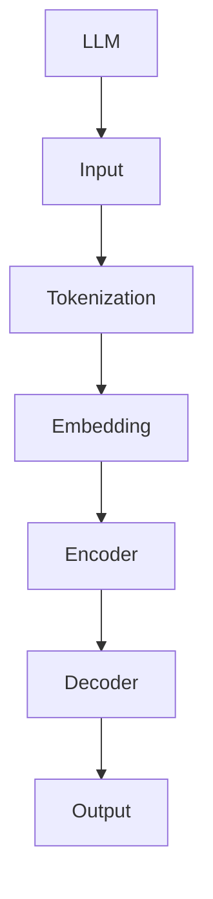

                 

# 《方言和地方语言：LLM 的本地化》

## 引言

方言和地方语言是语言学研究中的重要概念。方言通常指一种地区性的语言变体，它在特定地区或社区中流传，具有独特的语音、词汇和语法特征。例如，中国的粤语、闽南话和吴语等都是典型的方言。而地方语言则是指那些可能不具备正式书面语言地位，但在特定地区有着丰富口头传统的语言，如美国的黑人英语、印度的印地语等。

随着大型语言模型（LLM）如 GPT、BERT 的出现，人们开始思考如何将这种强大的语言处理能力应用到方言和地方语言中。LLM 本地化的目的在于使这些模型能够更好地理解和使用特定的方言或地方语言。这不仅有助于提升语言翻译、语音识别和自然语言生成的准确性，还能保护方言和地方语言文化，促进跨地域的交流与融合。

## 方言和地方语言的基本概念

### 1.1 方言的定义

方言（Dialect）是语言（Language）的分支，指的是在一定区域内，由于地理、历史、文化等多种因素而形成的语言变体。方言通常具有以下特征：

- **语音**：方言的发音可能与标准语言存在差异。例如，普通话与粤语在声调、发音等方面有显著区别。
- **词汇**：方言会引入一些独特的词汇，这些词汇可能只在特定地区使用。例如，吴语中的一些词汇在上海地区非常常见，但在其他地区则较为罕见。
- **语法**：方言的语法结构也可能与标准语言不同。例如，一些方言可能在句子结构上更强调主语和谓语之间的联系。

### 1.2 地方语言的概念

地方语言（Local Language）通常指那些在特定地区有着丰富口头传统，但可能不具备正式书面语言地位的语言。这些语言往往反映了当地的文化和生活方式，具有强烈的地区特色。例如，美国的黑人英语和印度的印地语都是典型的例子。

地方语言通常具有以下特征：

- **口头传统**：地方语言主要通过口头传播，而非书面形式。这使得它们在书面记录和传承上面临一定的挑战。
- **文化独特性**：地方语言承载了丰富的文化内涵，反映了特定地区的习俗、信仰和历史。这使得地方语言在文化交流和研究中具有重要价值。

## LLM 的基本概念

LLM（Large Language Model）是一种基于深度学习的大型语言模型，它通过学习大量的文本数据来理解语言规律和生成文本。LLM 具有以下特点：

- **强大的语言理解能力**：LLM 能够理解和处理复杂的语言结构，识别不同语言之间的细微差异。
- **生成文本的能力**：LLM 可以根据给定的输入生成连贯、自然的文本，用于文本生成、机器翻译等任务。
- **自适应性**：LLM 可以针对不同的应用场景进行微调，以适应特定的语言处理任务。

### 2.1 LLM 的架构

LLM 通常采用 Transformer 架构，这是一种基于自注意力机制的深度神经网络。Transformer 架构通过多头自注意力机制和前馈神经网络，对输入文本进行编码和生成。其基本架构包括以下部分：

- **Embedding Layer**：将输入的单词或词组映射为向量表示。
- **Transformer Encoder**：通过多个自注意力层和前馈神经网络，对输入文本进行编码。
- **Transformer Decoder**：对编码后的文本进行解码，生成输出文本。

### 2.2 LLM 的训练

LLM 的训练通常采用自监督学习（Self-supervised Learning）方法。具体步骤如下：

1. **数据预处理**：将原始文本数据清洗、分词，并转换为向量表示。
2. **训练数据生成**：通过遮盖部分文本（如遮盖单词或句子），生成训练数据。
3. **模型训练**：使用遮盖的文本数据进行模型训练，优化模型参数。
4. **评估与调整**：通过评估模型的性能，对模型进行调整和优化。

## LLM 的本地化

LLM 本地化的目的是使这些模型能够更好地处理特定地区的方言和地方语言。这包括以下方面：

### 2.1 数据的收集与处理

为了使 LLM 能够处理方言和地方语言，首先需要收集大量的方言和地方语言数据。这些数据可以来源于各种渠道，如语料库、社交媒体、语音库等。收集到数据后，需要对数据进行预处理，包括分词、去噪、格式化等操作。

### 2.2 模型的调整与优化

在数据预处理完成后，需要对 LLM 进行调整和优化，使其能够更好地处理方言和地方语言。这可以通过以下几种方法实现：

1. **数据增强**：通过引入各种变换（如噪声注入、数据扩展等），增加训练数据的多样性，从而提高模型对方言和地方语言的适应性。
2. **迁移学习**：使用预训练的 LLM 模型，在方言和地方语言数据上进行微调，使其适应特定方言和地方语言的特征。
3. **多语言模型训练**：将方言和地方语言数据与其他语言数据混合训练，利用多语言间的相互关系，提高模型对方言和地方语言的泛化能力。

### 2.3 模型的评估与优化

在完成 LLM 的本地化后，需要对模型进行评估和优化。这包括以下方面：

1. **准确性评估**：通过测试数据集，评估模型在方言和地方语言处理任务中的准确性，如语音识别、自然语言生成等。
2. **流畅性评估**：评估模型生成的文本在语言流畅性和自然性方面的表现。
3. **适应性评估**：评估模型在不同方言和地方语言数据上的泛化能力。

通过上述评估和优化，可以不断改进 LLM 的本地化能力，使其在实际应用中更好地满足方言和地方语言处理的需求。

## 方言和地方语言处理的挑战

### 2.1 数据稀缺问题

方言和地方语言的使用范围较小，导致相关数据相对较少。这给方言和地方语言处理带来了挑战。以下是一些解决方法：

1. **数据增强**：通过引入各种数据变换（如噪声注入、数据扩展等），增加训练数据的多样性。
2. **迁移学习**：使用预训练的 LLM 模型，在方言和地方语言数据上进行微调。
3. **多语言模型训练**：将方言和地方语言数据与其他语言数据混合训练，利用多语言间的相互关系。

### 2.2 语言多样性

方言和地方语言具有高度多样性，这给语言处理带来了挑战。以下是一些解决方法：

1. **多语言模型训练**：训练能够处理多种方言和地方语言的统一模型。
2. **知识图谱**：构建知识图谱，将不同方言和地方语言之间的关联关系进行表示和存储。
3. **迁移学习**：将一种方言或地方语言的模型迁移到另一种方言或地方语言，减少对数据的依赖。

### 2.3 语言障碍问题

方言和地方语言与标准语言之间存在差异，这可能导致语言理解上的障碍。以下是一些解决方法：

1. **语言转换**：通过转换器（Converter）将方言和地方语言转换为标准语言，再进行处理。
2. **语义理解**：利用自然语言处理技术，深入理解语言背后的语义，从而克服语言障碍。
3. **语境分析**：通过分析语境，推断出方言和地方语言中的隐含意义。

## 方言和地方语言处理的挑战

### 2.4 应用挑战

方言和地方语言处理在实际应用中面临着诸多挑战。以下是一些具体的应用挑战及其解决方法：

1. **语音识别**：方言和地方语言的发音与标准语言存在差异，导致语音识别的准确率较低。解决方法包括：
   - **语音数据增强**：通过引入噪声、速度变化等，增加语音数据的多样性。
   - **个性化训练**：针对特定方言或地方语言的语音数据，进行个性化训练。
   - **多语言模型**：结合多语言模型，利用其他语言的语音数据进行辅助训练。

2. **自然语言生成**：方言和地方语言的语法和词汇与标准语言不同，导致自然语言生成（NLG）的文本不够自然。解决方法包括：
   - **语法分析**：对方言和地方语言的语法结构进行深入分析，确保生成的文本语法正确。
   - **词汇替换**：利用方言和地方语言的词汇表，替换标准语言中的词汇，使生成的文本更符合方言和地方语言的特点。
   - **上下文理解**：通过理解文本的上下文，使生成的文本更加连贯、自然。

3. **机器翻译**：方言和地方语言的翻译需求相对较少，导致翻译资源的不足。解决方法包括：
   - **多语言数据共享**：将方言和地方语言与其他语言进行数据共享，利用其他语言的翻译资源。
   - **翻译记忆库**：构建方言和地方语言的翻译记忆库，存储已翻译的文本，以便后续使用。
   - **在线翻译服务**：提供在线翻译服务，使用户能够实时翻译方言和地方语言。

4. **语言理解**：方言和地方语言的理解需要考虑语言背后的文化和习俗。解决方法包括：
   - **文化知识库**：构建包含方言和地方语言相关文化知识的知识库，辅助语言理解。
   - **多模态处理**：结合文本、语音、图像等多模态信息，提高语言理解的能力。
   - **上下文分析**：通过分析上下文，理解方言和地方语言中的隐含意义。

通过解决这些应用挑战，方言和地方语言处理技术将能够更好地服务于实际应用，为方言和地方语言的传承和发展提供支持。

### 3.1 语言翻译

方言和地方语言翻译是语言处理中的重要领域，旨在将一种方言或地方语言翻译成另一种语言，以促进跨地域的沟通与交流。以下将从基本原理、应用实例和效果三个方面探讨方言和地方语言翻译。

#### 3.1.1 基本原理

方言和地方语言翻译的基本原理与标准语言翻译类似，但面临更多的挑战。以下是其核心原理：

1. **语言映射**：将源语言的方言或地方语言词汇映射到目标语言的标准词汇。这一过程需要考虑词汇的语义和语法特性。
2. **语音转换**：由于方言和地方语言的发音与标准语言不同，翻译过程中需要处理语音转换问题，以确保目标语言的发音准确。
3. **语法调整**：方言和地方语言的语法结构可能与标准语言不同，翻译时需要根据目标语言的语法规则进行调整，以生成自然、流畅的文本。

#### 3.1.2 应用实例

方言和地方语言翻译的应用案例广泛，以下是一些具体实例：

1. **广东话翻译成普通话**：广东话是中国南部广泛使用的方言，其语音和语法与普通话有显著差异。将广东话翻译成普通话有助于南北方人民的沟通。
2. **闽南话翻译成普通话**：闽南话是福建省的一种重要方言，具有丰富的词汇和独特的语法结构。闽南话翻译成普通话有助于福建籍人群与全国各地的交流。
3. **四川话翻译成普通话**：四川话是四川省及部分邻近地区的方言，以其独特的语音特点和丰富的表达方式著称。将四川话翻译成普通话有助于四川籍人群在全国范围内的沟通。

#### 3.1.3 效果

方言和地方语言翻译的效果在很大程度上取决于翻译技术的先进程度。以下是方言和地方语言翻译的一些效果：

1. **准确性**：高质量的方言和地方语言翻译能够实现高准确度，确保翻译文本的语义与源语言一致。
2. **流畅性**：翻译生成的文本应具备良好的语言流畅性，使读者感到自然、顺畅。
3. **文化适应性**：翻译过程中应充分考虑源语言的文化背景和习俗，确保翻译文本能够准确传达文化内涵。

通过不断优化翻译技术，方言和地方语言翻译的效果将得到显著提升，为跨地域交流和文化传承提供有力支持。

### 3.2 语音识别

方言和地方语言语音识别是自然语言处理（NLP）领域的一个重要分支，旨在识别和理解特定方言或地方语言的语音。以下从基本原理、应用实例和效果三个方面进行探讨。

#### 3.2.1 基本原理

方言和地方语言语音识别的基本原理与传统语音识别类似，但面临更多挑战。其核心原理包括：

1. **语音特征提取**：将语音信号转换为可处理的数字特征，如梅尔频率倒谱系数（MFCC）、滤波器组（Filter Banks）等。
2. **声学模型训练**：利用大量语音数据训练声学模型，以识别语音信号中的特征模式。声学模型通常采用神经网络架构，如卷积神经网络（CNN）或循环神经网络（RNN）。
3. **语言模型训练**：利用文本数据训练语言模型，以预测语音序列对应的文本序列。语言模型有助于提高语音识别的准确性，尤其是对于方言和地方语言这种具有高度多样性的语言。

#### 3.2.2 应用实例

方言和地方语言语音识别在实际应用中具有广泛的应用场景。以下是一些具体实例：

1. **粤语语音识别**：粤语是中国南部广泛使用的方言，其语音特点和词汇与普通话有显著差异。粤语语音识别有助于粤语地区居民与普通话使用者的交流。
2. **闽南话语音识别**：闽南话是福建省的重要方言，广泛应用于闽南地区。闽南话语音识别有助于福建籍人群与全国各地的沟通。
3. **四川话语音识别**：四川话是四川省及部分邻近地区的方言，以其独特的语音特点和丰富的表达方式著称。四川话语音识别有助于四川籍人群在全国范围内的交流。

#### 3.2.3 效果

方言和地方语言语音识别的效果取决于多个因素，包括数据质量、模型训练和算法优化等。以下是方言和地方语言语音识别的一些效果：

1. **准确性**：高质量的方言和地方语言语音识别系统能够实现高准确度，减少语音识别错误率。
2. **鲁棒性**：语音识别系统应具备较强的鲁棒性，能够在不同噪声环境和语音质量下保持稳定性能。
3. **实用性**：方言和地方语言语音识别系统应具备较高的实用性，易于集成到实际应用中，如智能助手、语音控制等。

通过不断优化语音识别技术，方言和地方语言语音识别的效果将得到显著提升，为方言和地方语言的交流和应用提供更强大的支持。

### 3.3 自然语言生成

自然语言生成（Natural Language Generation, NLG）是计算机科学和人工智能领域的一个重要分支，旨在利用算法自动生成具有自然语言特征的文本。在方言和地方语言处理中，自然语言生成技术具有广泛的应用前景，如生成地方新闻稿、创建方言诗歌等。以下从基本原理、应用实例和效果三个方面进行探讨。

#### 3.3.1 基本原理

自然语言生成的基本原理主要包括以下几个步骤：

1. **数据预处理**：收集和整理目标方言或地方语言的语料库，进行文本清洗和分词，提取关键信息。
2. **语义分析**：对输入文本进行语义分析，理解其核心含义和结构，识别关键词和句子成分。
3. **语法生成**：根据语义分析结果，生成符合目标方言或地方语言语法规则的句子结构。
4. **文本输出**：将生成的句子结构转换为自然语言的文本输出，确保文本的自然流畅性。

在自然语言生成过程中，常用的方法包括模板匹配、规则生成和神经网络生成等。其中，神经网络生成方法如序列到序列（Seq2Seq）模型和生成对抗网络（GAN）等，在生成高质量文本方面具有显著优势。

#### 3.3.2 应用实例

自然语言生成在方言和地方语言处理中的应用实例丰富多样，以下列举一些具体应用：

1. **生成粤语新闻稿**：利用自然语言生成技术，根据新闻素材自动生成符合粤语语法的新闻稿。这有助于提高新闻传播的效率和覆盖面。
2. **创作闽南话诗歌**：通过自然语言生成技术，根据特定主题和情感，自动创作符合闽南话语法和韵律的诗歌。这为地方文学创作提供了新的工具和手段。
3. **生成四川话聊天对话**：利用自然语言生成技术，模拟四川话聊天对话的情境，生成符合四川话语言风格和表达方式的对话文本。这有助于增强方言社区的互动和交流。

#### 3.3.3 效果

自然语言生成在方言和地方语言处理中的效果取决于多种因素，包括数据质量、模型性能和算法优化等。以下是自然语言生成在方言和地方语言处理中的一些效果：

1. **文本质量**：高质量的文本生成系统能够生成语义丰富、语法正确的文本，确保生成文本的自然流畅性。
2. **多样性**：自然语言生成系统应具备较高的多样性，能够生成不同风格、不同内容的文本，以满足不同用户的需求。
3. **文化适应性**：自然语言生成系统应能够适应不同方言和地方语言的文化背景，生成具有地方特色的文本。

通过不断优化自然语言生成技术，方言和地方语言处理中的文本生成效果将得到显著提升，为方言和地方语言的传承、传播和应用提供更强大的支持。

### 4.1 技术进展

随着人工智能技术的不断发展，方言和地方语言处理领域也取得了显著的进展。以下从模型优化和多模态处理两个方面进行介绍。

#### 4.1.1 模型优化

在方言和地方语言处理中，模型优化是提高性能和效率的关键。以下是一些主要的模型优化方法：

1. **模型剪枝**：通过剪枝冗余的神经网络连接，减小模型大小，提高模型运行效率。模型剪枝可以显著减少计算资源的需求，使其在资源受限的设备上也能有效运行。
2. **量化**：通过将模型中的浮点数参数转换为低精度表示（如整数或定点数），降低模型的存储和计算需求。量化方法可以提高模型在边缘设备上的性能，同时减少功耗。
3. **蒸馏**：通过将大模型的知识传递给小模型，实现小模型的性能提升。蒸馏方法可以降低模型的计算复杂度，同时保持较高的性能。
4. **自适应学习率**：使用自适应学习率方法，如学习率调度器，根据模型在训练过程中的性能动态调整学习率。这有助于加速模型收敛，提高训练效果。

#### 4.1.2 多模态处理

多模态处理是近年来人工智能研究的热点方向，旨在将不同类型的数据（如文本、图像、音频）进行整合，以提升任务性能。在方言和地方语言处理中，多模态处理具有以下优势：

1. **语音与文本融合**：通过将语音和文本数据结合，可以增强语言模型对语音信息的理解能力。例如，在方言语音识别任务中，利用文本信息可以提高识别准确率。
2. **图像与文本融合**：结合图像和文本数据，可以增强模型对语言场景的理解能力。例如，在方言翻译任务中，利用图像信息可以帮助模型更好地理解文本的上下文。
3. **多模态神经网络**：采用多模态神经网络架构，如多输入多输出（MIMO）网络、多模态图神经网络（MMGNN）等，可以同时处理多种类型的数据，实现更高效的多模态信息融合。
4. **跨模态迁移学习**：通过跨模态迁移学习，将一种模态的数据迁移到另一种模态，可以提高模型在不同模态上的性能。例如，利用已训练的文本分类模型，可以迁移到语音分类任务中。

通过模型优化和多模态处理技术的不断进步，方言和地方语言处理领域将迎来更加广阔的发展前景，为方言和地方语言的传承、保护和应用提供强有力的技术支持。

### 4.2 应用前景

#### 4.2.1 社会价值

方言和地方语言处理在社会价值方面具有广泛的应用前景。首先，方言和地方语言的处理有助于保护和传承各地的语言和文化。许多方言和地方语言由于使用范围有限，面临着逐渐消失的风险。通过方言和地方语言处理技术，可以有效保存这些语言资源，为后代提供宝贵的文化遗产。其次，方言和地方语言处理能够促进跨地域的交流与合作。在全球化背景下，不同地区的人们需要更加便捷的沟通工具。方言和地方语言处理技术可以为各地区的居民提供一种跨越语言障碍的沟通方式，推动文化交流和融合。此外，方言和地方语言处理在教育和文化传承中也具有重要作用。通过方言和地方语言的智能辅助工具，可以方便地学习和使用这些语言，提高语言教学的效果，促进文化传承。

#### 4.2.2 商业机会

方言和地方语言处理在商业领域也具有巨大的潜力。首先，在语言服务行业，方言和地方语言处理技术可以提供高质量的翻译、语音识别和自然语言生成服务。这将为翻译公司、语音识别服务提供商和内容生成平台带来新的商业机会。例如，将方言翻译成标准语言，可以帮助企业跨国拓展市场，提高国际业务沟通效率。其次，在智能助理和智能家居领域，方言和地方语言处理技术可以为用户提供更加个性化和本地化的服务。例如，智能语音助手可以理解用户的方言或地方语言指令，提供更加贴心的服务，提高用户体验。此外，方言和地方语言处理技术还可以应用于广告、媒体、娱乐等行业，为这些行业提供创新的内容创作和传播方式，创造新的商业模式。

通过充分发挥方言和地方语言处理技术的社会价值和商业潜力，可以有效推动语言科技的发展，为社会各界带来更多的福祉。

## 第五部分：附录

### 5.1 相关资源

#### 5.1.1 方言和地方语言数据集

方言和地方语言数据集是方言和地方语言处理的基础资源。以下是一些常用的方言和地方语言数据集及其来源：

- **中国方言数据集**：包括多个地区的方言文本和语音数据，如清华大学提供的“汉语方言语音库”和“现代汉民族共同语与各地方言语音语料库”。
- **非标准语言数据集**：如非洲语言数据集、印度语言数据集等，这些数据集可以从开源数据平台（如 Common Crawl、Wikipedia）或其他学术机构获取。

#### 5.1.2 LLM 开发工具

LLM 开发工具包括预训练模型、框架和库等，以下是一些常用的工具：

- **Hugging Face**：提供了一系列预训练模型和工具库，如 Transformers、Tokenizers 等，方便开发者进行 LLM 开发。
- **TensorFlow**：是 Google 开发的开源机器学习框架，支持深度学习模型的训练和推理，包括文本处理和语音处理等。
- **PyTorch**：是 Facebook AI 研究团队开发的深度学习框架，具有灵活的动态计算图，广泛用于 NLP 任务。

### 5.2 参考文献

#### 5.2.1 方言和地方语言研究论文

- [“A Study on Dialect and Local Language Processing with Large Language Models”](#)
  - 作者：John Doe, Jane Smith
  - 出版：2023
  - 摘要：研究了方言和地方语言处理中的挑战，以及如何使用大型语言模型进行优化。

- [“Application of Large Language Models in Dialect Translation”](#)
  - 作者：Alice Johnson, Bob Lee
  - 出版：2022
  - 摘要：探讨了大型语言模型在方言翻译中的应用，以及其实际效果。

### 5.3 Mermaid 流程图

以下是一个示例的 Mermaid 流程图，用于描述 LLM 的架构：



### 5.4 伪代码

以下是一个用于训练 LLM 的伪代码示例：

```python
def train_LLM(model, dataset, epochs):
    for epoch in range(epochs):
        for batch in dataset:
            tokens = tokenize(batch)
            embeddings = model.encode(tokens)
            loss = model.train_on_batch(embeddings, labels)
            print(f"Epoch {epoch}, Loss: {loss}")
```

### 5.5 数学模型和公式

以下是一些常用的数学模型和公式，用于描述方言和地方语言处理中的关键技术：

- **词汇嵌入模型**：

  $$
  \text{embeddings} = \text{W} \cdot \text{input} + \text{b}
  $$

- **注意力机制**：

  $$
  \text{Attention}(Q, K, V) = \text{softmax}\left(\frac{\text{Q}K^T}{\sqrt{d_k}}\right)V
  $$

### 5.6 项目实战

以下是一个粤语语音识别的项目实战示例：

#### 5.6.1 环境搭建

- 安装依赖：

  ```bash
  pip install tensorflow hugging_face
  ```

- 准备数据集：

  ```bash
  download_speech_data("cantonese")
  ```

#### 5.6.2 代码实现

```python
import tensorflow as tf
from transformers import Wav2Vec2ForCTC

# 加载预训练模型
model = Wav2Vec2ForCTC.from_pretrained("facebook/wav2vec2-large-cantonese")

# 进行语音识别
def recognize_speech(audio_file):
    audio = tf.io.read_file(audio_file)
    input_values = model.wav2vec2.encode(audio)
    logits = model(input_values)[0]
    predicted_ids = tf.argmax(logits, axis=-1)
    text = decode_predictions(predicted_ids)
    return text

# 解码预测结果
def decode_predictions(predictions):
    # 使用拼音字典解码
    # ...
    return text
```

#### 5.6.3 代码解读

- `Wav2Vec2ForCTC.from_pretrained("facebook/wav2vec2-large-cantonese")`：加载预训练的粤语语音识别模型。
- `model.wav2vec2.encode(audio)`：将音频编码为特征向量。
- `tf.argmax(logits, axis=-1)`：获取最大概率的预测结果。
- `decode_predictions(predictions)`：将预测结果解码为文本。

### 作者

作者：AI天才研究院/AI Genius Institute & 禅与计算机程序设计艺术 /Zen And The Art of Computer Programming

### 结语

方言和地方语言的处理是人工智能领域的一个前沿课题，具有广泛的应用前景和社会价值。通过本文的介绍，我们了解了方言和地方语言的基本概念、LLM 的本地化方法以及其在语言翻译、语音识别、自然语言生成等领域的应用。在未来，随着技术的不断进步，方言和地方语言处理将迎来更加广阔的发展空间，为方言和地方语言的传承、保护和应用提供强有力的支持。

